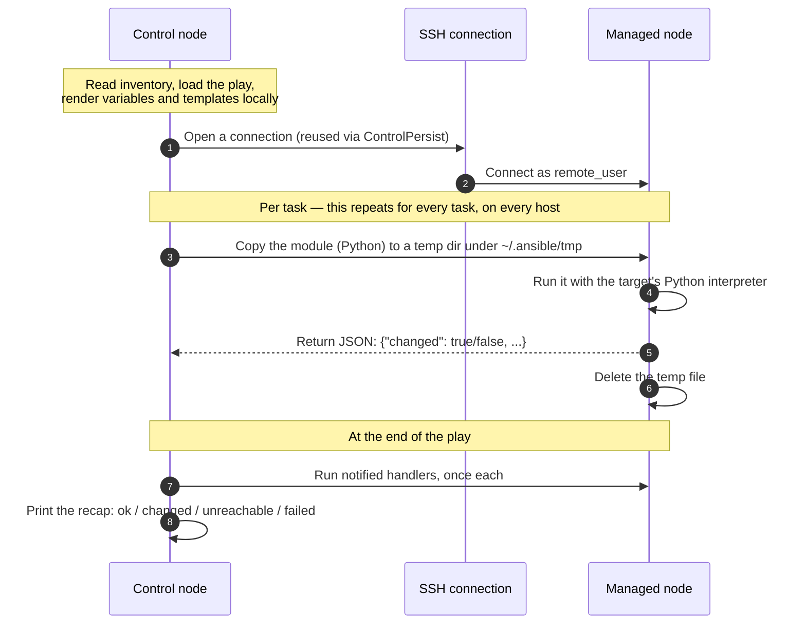
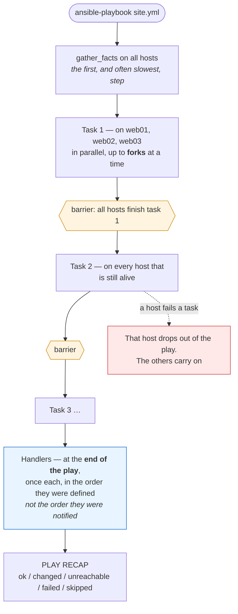
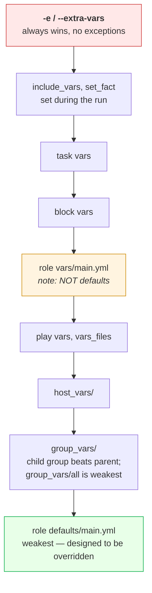
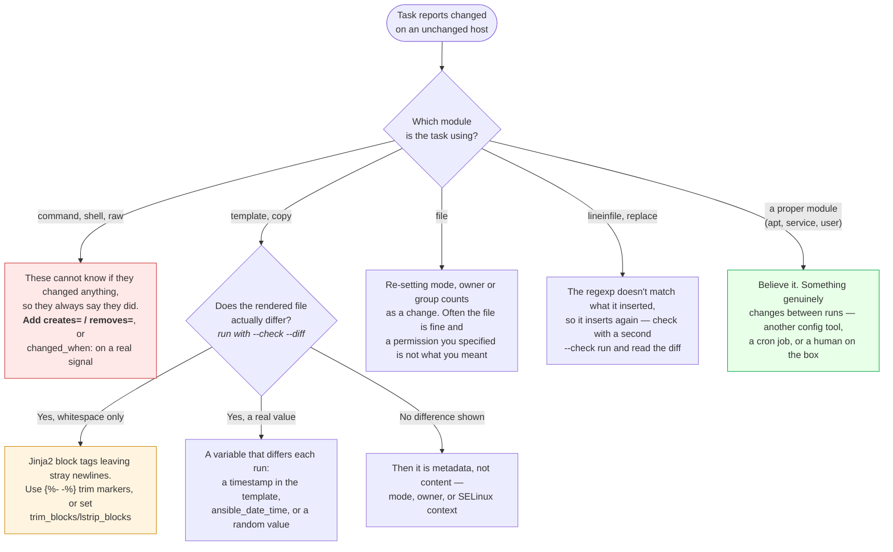

# Module 11: Ansible

> *"Terraform provisions the server. Ansible configures it."*

---

>**Command reference**: [`cheatsheet.md`](./cheatsheet.md) — every command in this module, grouped by task, with the gotchas.
>
>**Cross-module lookup**: [Quick Reference](../QUICK-REFERENCE.md)

---

## Why This Module Matters

Terraform creates infrastructure (VMs, networks, databases). But who installs packages, configures Nginx, deploys your app, and manages config files? **Ansible** — the agentless configuration management tool that turns manual server setup into repeatable, version-controlled automation.

**In real-world DevOps work**, you will:

- Write playbooks to configure servers consistently
- Manage fleets of servers from a single control node
- Build reusable roles for common patterns (web server, database, monitoring)
- Orchestrate multi-server deployments
- Enforce desired state across environments

---

## Table of Contents

1. [Configuration Management Concepts](#1-configuration-management-concepts)
2. [Ansible Fundamentals](#2-ansible-fundamentals)
3. [Inventory](#3-inventory)
4. [Ad-Hoc Commands](#4-ad-hoc-commands)
5. [Playbooks](#5-playbooks)
6. [Variables and Facts](#6-variables-and-facts)
7. [Roles](#7-roles)
8. [Handlers and Templates](#8-handlers-and-templates)
9. [Common Mistakes and Anti-Patterns](#9-common-mistakes-and-anti-patterns)
10. [Debugging Mindset](#10-debugging-mindset)
11. [Interview Insights](#11-interview-insights)

---

## 1. Configuration Management Concepts

### Why Configuration Management?

```
WITHOUT CONFIG MANAGEMENT:
  SSH into server 1 → install nginx → edit config → restart
  SSH into server 2 → install nginx → edit config (slightly different) → restart
  SSH into server 3 → forgot to restart
  Server 4: "Wait, did I do this one already?"
  Result: CONFIGURATION DRIFT — every server is slightly different

WITH ANSIBLE:
  Write a playbook ONCE → Run on ALL servers → Guaranteed identical config
  Run it again? → No changes (IDEMPOTENT) — only fixes what's wrong
```

### Ansible vs Other Tools

| Feature | Ansible | Chef | Puppet |
|---------|---------|------|--------|
| **Agent** | Agentless (SSH) | Agent required | Agent required |
| **Language** | YAML | Ruby DSL | Puppet DSL |
| **Learning curve** | Low | High | Medium |
| **Push/Pull** | Push (you run it) | Pull (agent polls) | Pull (agent polls) |
| **Architecture** | Simple (SSH) | Server + agents | Server + agents |
| **Best for** | DevOps, simple to medium | Complex environments | Large enterprises |

>**Why Ansible wins for DevOps:** No agents to install, YAML is easy, and it works over SSH which you already have.

---

## 2. Ansible Fundamentals

### Architecture

```
┌────────────────┐                  ┌──────────────┐
│ CONTROL NODE   │     SSH          │ MANAGED NODE │
│ (your laptop   │─────────────────▶│ (server 1)   │
│  or CI/CD)     │                  └──────────────┘
│                │     SSH          ┌──────────────┐
│ • ansible      │─────────────────▶│ (server 2)   │
│ • playbooks    │                  └──────────────┘
│ • inventory    │     SSH          ┌──────────────┐
│                │─────────────────▶│ (server 3)   │
└────────────────┘                  └──────────────┘

No agents on managed nodes — just Python + SSH
```

### What "Agentless" Actually Does

"No agent" does not mean magic over SSH. Ansible ships the code to the target for every single task, runs it, and cleans up — and knowing that explains most of the errors you will hit:



**Three things follow directly from that picture**, and each is a common failure:

| Requirement | What breaks without it | The fix |
|-------------|------------------------|---------|
| **Python on the target** | `/usr/bin/python: not found` on minimal images | Set `ansible_python_interpreter`, or use the `raw` module to bootstrap it |
| **A writable temp directory** | Tasks fail on hosts with `noexec` on `/tmp` or a read-only home | `remote_tmp` in `ansible.cfg`, or fix the mount |
| **The module returns JSON** | Anything printed to stdout by a login shell (a banner, a `.bashrc` echo) corrupts the reply and every task fails weirdly | Keep `.bashrc` silent for non-interactive shells |

 **`changed: true/false` is the module's own judgement, not Ansible's.** The `apt` module knows whether it installed anything; the `command` module has no idea and therefore reports `changed` every single time. That difference is the whole of idempotency in practice, and it's why `command` and `shell` need `creates=`, `removes=`, or `changed_when:` before they belong in a playbook you run twice.

### Key Concepts

```
CONTROL NODE:   Where you run Ansible (your machine or CI/CD runner)
MANAGED NODE:   Servers being configured (targets)
INVENTORY:      List of managed nodes (IPs, hostnames, groups)
MODULE:         Unit of work (apt, yum, copy, template, service, etc.)
TASK:           One action using a module ("install nginx")
PLAY:           Group of tasks applied to a set of hosts
PLAYBOOK:       YAML file containing one or more plays
ROLE:           Reusable, structured collection of tasks/templates/vars
HANDLER:        Task that runs only when notified (restart service)
```

### Installation

```bash
# pip (recommended)
pip install ansible

# Debian/Ubuntu
sudo apt update && sudo apt install ansible

# RHEL-compatible/Fedora
sudo dnf install ansible

# Verify
ansible --version
```

---

## 3. Inventory

### Static Inventory

```ini
# inventory.ini
[webservers]
web1 ansible_host=10.0.1.10
web2 ansible_host=10.0.1.11

[databases]
db1 ansible_host=10.0.2.10

[monitoring]
monitor1 ansible_host=10.0.3.10

# Group of groups
[production:children]
webservers
databases
monitoring

# Variables for a group
[webservers:vars]
ansible_user=ubuntu
ansible_ssh_private_key_file=~/.ssh/prod-key.pem
http_port=80
```

### YAML Inventory (Alternative)

```yaml
# inventory.yml
all:
  children:
    webservers:
      hosts:
        web1:
          ansible_host: 10.0.1.10
        web2:
          ansible_host: 10.0.1.11
      vars:
        http_port: 80
    databases:
      hosts:
        db1:
          ansible_host: 10.0.2.10
```

---

## 4. Ad-Hoc Commands

### Quick One-Off Tasks

```bash
# Ping all hosts (test connectivity)
ansible all -i inventory.ini -m ping

# Run a command on all web servers
ansible webservers -i inventory.ini -m command -a "uptime"

# Install a package
ansible webservers -i inventory.ini -m apt -a "name=nginx state=present" --become

# Copy a file
ansible webservers -i inventory.ini -m copy -a "src=index.html dest=/var/www/html/"

# Restart a service
ansible webservers -i inventory.ini -m service -a "name=nginx state=restarted" --become

# Check disk space
ansible all -i inventory.ini -m command -a "df -h"

# Gather facts
ansible web1 -i inventory.ini -m setup
```

>`--become` = run with sudo. `-m` = module. `-a` = arguments.

---

## 5. Playbooks

### How a Play Runs Across Hosts

The order surprises people: Ansible does not finish one host and move to the next. It runs **task 1 on every host, waits for all of them, then task 2** — the default `linear` strategy, and the reason a single slow host holds up the entire fleet:



**Four consequences worth knowing before you write a rolling deploy:**

- **`forks` (default 5) is your parallelism**, not your host count. Fifty hosts with the default means ten sequential waves per task — raise it in `ansible.cfg` before blaming Ansible for being slow.
- **Handlers run at the end, not where they were notified.** A play that changes the config and then depends on the restart having happened needs `meta: flush_handlers`, or it tests the old process.
- **A failed host silently leaves the play**, and the recap is the only place that says so. In CI, treat any non-zero `failed` or `unreachable` as a pipeline failure — and check `any_errors_fatal` if a partial rollout is worse than none.
- **`serial: 1` turns this into a rolling deploy**: the whole play runs on one host (or batch) at a time, which is what you want with a load balancer in front. Without it, "restart nginx" happens everywhere simultaneously.

### Your First Playbook

```yaml
# webserver.yml
---
- name: Configure Web Servers
  hosts: webservers
  become: true                     # Run as root

  tasks:
    - name: Update apt cache
      apt:
        update_cache: true
        cache_valid_time: 3600     # Don't update if < 1 hour old

    - name: Install Nginx
      apt:
        name: nginx
        state: present             # Ensure installed

    - name: Start and enable Nginx
      service:
        name: nginx
        state: started
        enabled: true              # Start on boot

    - name: Deploy custom index page
      copy:
        content: |
          <h1>Hello from Ansible!</h1>
          <p>Server: {{ inventory_hostname }}</p>
          <p>IP: {{ ansible_default_ipv4.address }}</p>
        dest: /var/www/html/index.html
        owner: www-data
        group: www-data
        mode: "0644"

    - name: Ensure firewall allows HTTP on Debian/Ubuntu
      ufw:
        rule: allow
        port: "80"
        proto: tcp
      when: ansible_os_family == "Debian"

    - name: Ensure firewall allows HTTP on RHEL-compatible systems
      ansible.posix.firewalld:
        service: http
        permanent: true
        immediate: true
        state: enabled
      when: ansible_os_family == "RedHat"
```

### Running Playbooks

```bash
# Run the playbook
ansible-playbook -i inventory.ini webserver.yml

# Dry run (check mode — no changes made)
ansible-playbook -i inventory.ini webserver.yml --check

# Verbose output
ansible-playbook -i inventory.ini webserver.yml -v    # or -vv, -vvv

# Limit to specific hosts
ansible-playbook -i inventory.ini webserver.yml --limit web1

# Run with extra variables
ansible-playbook -i inventory.ini webserver.yml -e "http_port=8080"
```

### Playbook Output

```
PLAY [Configure Web Servers] ************************************************

TASK [Gathering Facts] ******************************************************
ok: [web1]
ok: [web2]

TASK [Update apt cache] *****************************************************
changed: [web1]
changed: [web2]

TASK [Install Nginx] ********************************************************
changed: [web1]
ok: [web2]              ← Already installed (idempotent!)

TASK [Start and enable Nginx] ***********************************************
ok: [web1]
ok: [web2]

TASK [Deploy custom index page] *********************************************
changed: [web1]
changed: [web2]

PLAY RECAP ******************************************************************
web1  : ok=5  changed=3  unreachable=0  failed=0  skipped=0
web2  : ok=5  changed=2  unreachable=0  failed=0  skipped=0
```

```
STATUS MEANINGS:
  ok      = Already in desired state (no change needed)
  changed = Modified to reach desired state
  failed  = Task failed (playbook stops for that host)
  skipped = Task condition was false (when: clause)
```

---

## 6. Variables and Facts

### Variable Precedence (Simplified)

```
LOWEST PRIORITY ──────────────────────────── HIGHEST PRIORITY
defaults → inventory → playbook vars → -e command line

# In practice, use:
  role defaults     → sensible defaults
  group_vars/       → environment-specific overrides
  host_vars/        → host-specific overrides
  -e "var=value"    → one-off overrides from CLI
```

Ansible has 22 precedence levels. These are the eight you will actually collide with, weakest at the bottom — the value that wins is the highest one that defines the variable:



 **The trap is `defaults/` versus `vars/` inside a role**, and it catches everyone once. `defaults/main.yml` sits at the very bottom, so anything can override it — that is where a role's tunables belong. `vars/main.yml` sits *above* `group_vars` and `host_vars`, so a value you put there silently ignores the inventory the user carefully wrote. Rule of thumb: **role authors put almost everything in `defaults/`**, and reserve `vars/` for internal constants nobody should change.

**When a variable is not what you expect**, stop guessing and ask the host:

```bash
ansible web01 -m debug -a "var=app_port"          # the effective value for that host
ansible-inventory --host web01                     # every inventory var, merged
ansible-playbook site.yml --check -vvv | grep app_port
```

 **`-e` beating everything is a feature that becomes a footgun in CI.** A pipeline that passes `-e env=prod` overrides the `group_vars/staging` a developer relies on locally, so the same playbook behaves differently in the two places. Pass as few extra-vars as you can, and treat each one as part of the interface.

### Ansible Facts

```yaml
# Facts are automatically gathered about each host
- name: Show system info
  debug:
    msg: |
      Hostname: {{ ansible_hostname }}
      OS: {{ ansible_distribution }} {{ ansible_distribution_version }}
      CPU: {{ ansible_processor_cores }} cores
      RAM: {{ ansible_memtotal_mb }} MB
      IP: {{ ansible_default_ipv4.address }}
```

### Conditionals

```yaml
- name: Install on Debian-based systems
  apt:
    name: nginx
    state: present
  when: ansible_os_family == "Debian"

- name: Install on RedHat-based systems
  yum:
    name: nginx
    state: present
  when: ansible_os_family == "RedHat"
```

### Loops

```yaml
- name: Install multiple packages
  apt:
    name: "{{ item }}"
    state: present
  loop:
    - nginx
    - git
    - curl
    - htop

- name: Create multiple users
  user:
    name: "{{ item.name }}"
    groups: "{{ item.groups }}"
    state: present
  loop:
    - { name: "deployer", groups: "sudo" }
    - { name: "monitor", groups: "www-data" }
```

---

## 7. Roles

### Why Roles?

```
WITHOUT ROLES:
  One giant playbook with 200 tasks → unmaintainable

WITH ROLES:
  nginx role + app role + monitoring role → composable, reusable, testable
```

### Role Directory Structure

```
roles/
└── nginx/
    ├── tasks/
    │   └── main.yml        # Tasks to execute
    ├── handlers/
    │   └── main.yml        # Restart/reload handlers
    ├── templates/
    │   └── nginx.conf.j2   # Jinja2 config templates
    ├── files/
    │   └── index.html      # Static files to copy
    ├── vars/
    │   └── main.yml        # Role-specific variables
    ├── defaults/
    │   └── main.yml        # Default values (overridable)
    └── meta/
        └── main.yml        # Role metadata and dependencies
```

### Creating a Role

```bash
# Generate role skeleton
ansible-galaxy init roles/nginx
```

```yaml
# roles/nginx/defaults/main.yml
nginx_port: 80
nginx_server_name: localhost

# roles/nginx/tasks/main.yml
---
- name: Install Nginx
  apt:
    name: nginx
    state: present

- name: Deploy Nginx config
  template:
    src: nginx.conf.j2
    dest: /etc/nginx/sites-available/default
  notify: Restart Nginx

- name: Start Nginx
  service:
    name: nginx
    state: started
    enabled: true

# roles/nginx/handlers/main.yml
---
- name: Restart Nginx
  service:
    name: nginx
    state: restarted
```

### Using Roles in a Playbook

```yaml
# site.yml
---
- name: Configure production
  hosts: webservers
  become: true
  roles:
    - nginx
    - app
    - monitoring
```

---

## 8. Handlers and Templates

### Handlers — Run Only When Notified

```yaml
tasks:
  - name: Update Nginx config
    template:
      src: nginx.conf.j2
      dest: /etc/nginx/nginx.conf
    notify: Restart Nginx           # Only triggers if this task CHANGES

handlers:
  - name: Restart Nginx
    service:
      name: nginx
      state: restarted
    # Runs ONCE at end of play, even if notified multiple times
```

### Jinja2 Templates

```nginx
# templates/nginx.conf.j2
server {
    listen {{ nginx_port }};
    server_name {{ nginx_server_name }};

    location / {
        proxy_pass http://127.0.0.1:{{ app_port }};
        proxy_set_header Host $host;
        proxy_set_header X-Real-IP $remote_addr;
    }


    listen 443 ssl;
    ssl_certificate     /etc/ssl/{{ domain }}.crt;
    ssl_certificate_key /etc/ssl/{{ domain }}.key;


    access_log /var/log/nginx/{{ nginx_server_name }}_access.log;
    error_log  /var/log/nginx/{{ nginx_server_name }}_error.log;
}
```

---

## 9. Common Mistakes and Anti-Patterns

### Not Using Idempotent Modules

```yaml
# BAD: shell/command are NOT idempotent (runs every time)
- name: Install package
  shell: apt-get install -y nginx

# GOOD: apt module is idempotent (skips if already installed)
- name: Install package
  apt:
    name: nginx
    state: present
```

### Hardcoding Values

```yaml
# BAD
- name: Deploy config
  template:
    src: app.conf.j2
    dest: /etc/myapp/app.conf
  vars:
    db_host: "10.0.2.15"    # What about staging?

# GOOD: Use group_vars
# group_vars/production.yml
db_host: "10.0.2.15"
# group_vars/staging.yml
db_host: "10.0.2.25"
```

### Not Using Handlers

```yaml
# BAD: Restarts Nginx every single run (even if nothing changed)
- name: Deploy config
  template:
    src: nginx.conf.j2
    dest: /etc/nginx/nginx.conf

- name: Restart Nginx
  service:
    name: nginx
    state: restarted

# GOOD: Only restarts when config actually changes
- name: Deploy config
  template:
    src: nginx.conf.j2
    dest: /etc/nginx/nginx.conf
  notify: Restart Nginx
```

---

## 10. Debugging Mindset

### Ansible Troubleshooting

```
Playbook failed?
│
├─ 1. READ THE ERROR MESSAGE
│     └─ Ansible errors show exactly which task, host, and module failed
│
├─ 2. CHECK CONNECTIVITY
│     ├─ ansible all -m ping (SSH working?)
│     └─ SSH key permissions? (chmod 400)
│
├─ 3. RUN IN VERBOSE MODE
│     └─ ansible-playbook site.yml -vvv
│
├─ 4. RUN IN CHECK MODE (dry run)
│     └─ ansible-playbook site.yml --check --diff
│
├─ 5. DEBUG SPECIFIC VARIABLES
│     └─ Add: - debug: var=ansible_default_ipv4
│
└─ 6. COMMON ISSUES
      ├─ Permission denied → add --become
      ├─ Module not found → check ansible version
      ├─ Template error → validate Jinja2 syntax
      └─ Host unreachable → check inventory, SSH config
```

### Troubleshooting: "It Reports changed Every Single Run"

A playbook that is never green on a second run has lost the property you adopted Ansible for. You can no longer tell "something drifted" from "this playbook always says that":



 **`--check --diff` is the tool for this, and it answers the question in one run.** It shows you the exact bytes Ansible intends to change, which instantly separates "a real drift" from "a trailing newline in a template" — the two causes that look identical in the recap.

 **Never fix this with `changed_when: false` unless the task genuinely cannot change anything** (a read-only check, a `curl` for a health probe). Slapping it on a task that *does* change things buys you a green run and throws away the signal — you'll then need `--diff` to answer questions the recap used to answer for free.

---

## 11. Interview Insights

**Q: What is Ansible and why is it agentless?**
> Ansible automates configuration management, application deployment, and orchestration. It's agentless — it connects to managed nodes over SSH (Linux) or WinRM (Windows) and runs Python modules remotely. No daemon or agent to install, update, or secure on every server. This simplifies architecture and reduces the attack surface.

**Q: What is idempotency and why does it matter?**
> Idempotency means running a playbook multiple times produces the same result — no unintended side effects. If Nginx is already installed, the `apt` module reports "ok" and skips it. This is critical because you should be able to run your playbooks any time without fear of breaking things. It's what makes Ansible safe to run repeatedly.

**Q: Explain the difference between roles and playbooks.**
> A playbook is a YAML file with plays and tasks — the "script" you run. A role is a structured, reusable collection of tasks, templates, handlers, and variables. Playbooks use roles. Think of playbooks as the recipe and roles as pre-made ingredients. You compose roles to build playbooks for different environments.

**Q: How does Ansible differ from Terraform?**
> Terraform provisions infrastructure (creates VMs, networks, databases) — it's about "what exists." Ansible configures infrastructure (installs packages, manages config files, deploys apps) — it's about "what's running on it." In practice, you use Terraform to create an EC2 instance and Ansible to configure it. They're complementary, not competing.

**Q: How do you manage secrets in Ansible?**
> Use Ansible Vault to encrypt sensitive variables (passwords, API keys). Run `ansible-vault encrypt vars/secrets.yml` to encrypt a file. Reference it normally in playbooks — Ansible decrypts at runtime with `--ask-vault-pass` or a vault password file. Never commit unencrypted secrets.

---

## Labs and Projects

Read the sections above first, then work through these **in order**. Every lab ends with a  **Break It** section — those are not optional; they are where the debugging skill actually comes from.

| # | Lab | What you'll do |
|---|-----|----------------|
| 1 | **[Ansible Basics](./labs/lab-01-ansible-basics.md)** | Write and run Ansible playbooks against Docker containers as managed nodes. |
| 2 | **[Roles, Vault, and Testing](./labs/lab-02-roles-vault-and-testing.md)** | Turn a working playbook into something a team can maintain. |

**Portfolio project:**

- [Project: Idempotent Service Configuration](./projects/project-01-idempotent-service-config.md) — Use Ansible to configure a service on a local VM, container, or remote host in a repeatable way.

**Reference code** for every lab: [`code/`](./code/) — real files, validated in CI.

---

## Self-Check

Answer these from memory before you expand them. If more than two give you trouble, re-read the sections they come from — the labs assume this material is solid.

<details>
<summary><strong>1. Ansible is agentless — so what does a managed node actually need?</strong></summary>

SSH access and Python. The control node copies a module over, runs it, and removes it. Nothing to install, upgrade, or open a firewall port for, which is the main reason Ansible gets adopted into environments that will not tolerate an agent.

</details>

<details>
<summary><strong>2. What does idempotence mean here, and why do `command` and `shell` break it?</strong></summary>

A module converges toward a declared state, so the second run reports `ok` rather than `changed`. Raw commands cannot know whether the work was already done, so they always report `changed` unless you add `creates:` or `changed_when:` — and since `changed` is what triggers handlers, a careless `shell` task restarts your services on every run.

</details>

<details>
<summary><strong>3. When does a handler run?</strong></summary>

Only if a task that notified it reported `changed`, and by default at the end of the play rather than at the point of notification. That is precisely how you restart a service once after any of five configuration files changed — and nothing at all when none of them did.

</details>

<details>
<summary><strong>4. Where does a variable's value come from when it is defined in four places?</strong></summary>

Precedence runs roughly from role defaults (weakest) through inventory, group_vars, host_vars, and play vars, up to `-e` extra vars, which beat everything. The practical rule: overridable defaults go in `defaults/`, environment differences in `group_vars/`, and `-e` is for a deliberate one-off — not for normal configuration.

</details>

<details>
<summary><strong>5. What does the role directory structure buy you?</strong></summary>

Fixed places for `tasks/`, `handlers/`, `templates/`, `files/`, `defaults/`, `vars/`, and `meta/`, so anyone can find and reuse a role without reading all of it. The distinction that matters: `defaults/` is the weakest precedence and meant to be overridden, `vars/` is high precedence and meant not to be.

</details>

<details>
<summary><strong>6. How do you rehearse a play safely?</strong></summary>

`--check` runs it without making changes and `--diff` shows what would change in files and templates. Modules that cannot predict their result skip in check mode, and a play built out of `shell` tasks cannot be dry-run at all — which is a design smell, not a limitation of the tool.

</details>

---

## Practical Checkpoint

Before moving on, you should be able to:

- Write an inventory and playbook that configure a host repeatably.
- Use variables, handlers, templates, and idempotent tasks.
- Validate a configuration change and roll back or fix a broken service.

Portfolio evidence to keep:

- Inventory, playbook, and template files.
- Before/after validation output.
- Notes from one failed playbook run and the fix.

Suggested project: [Idempotent Service Configuration](./projects/project-01-idempotent-service-config.md)

---

## What's Next?

With Terraform provisioning infrastructure and Ansible configuring it, you're ready for the most powerful orchestration tool — Kubernetes.

**[Module 12: Kubernetes →](../12-kubernetes/)**

---

<div align="center">

**Module 11 Complete** 

[← Back to Terraform](../10-terraform/) | [ Cheat Sheet](./cheatsheet.md) | [Next: Kubernetes →](../12-kubernetes/)

</div>


## Reference
<!-- tab: Cheatsheet -->
> CLI, inventory, playbook keywords, modules, filters, and Vault. Concepts live in the [module README](./README.md).
> Cross-module daily commands: **[QUICK-REFERENCE.md](../QUICK-REFERENCE.md)**

**Jump to:** [CLI](#cli) · [Inventory](#inventory) · [Ad-hoc](#ad-hoc-commands) · [Playbook keywords](#playbook-keywords) · [Modules](#module-reference) · [Variables](#variables--precedence) · [Facts](#facts) · [Loops & conditions](#loops--conditionals) · [Handlers & templates](#handlers--templates) · [Roles](#roles) · [Vault](#ansible-vault) · [Config](#configuration) · [Errors](#error-decoder)

---

## CLI

```bash
ansible --version
ansible-inventory --list -i inventory.ini          #  resolved inventory as JSON
ansible-inventory --graph                          # tree view of groups and hosts
ansible-inventory --host web-01                    # all variables for one host

ansible all -m ping                                #  connectivity check
ansible webservers -m ping -i inventory.ini
ansible all -m setup                               # dump every fact

ansible-playbook site.yml
ansible-playbook site.yml -i production.ini
ansible-playbook site.yml --check                  #  DRY RUN — changes nothing
ansible-playbook site.yml --check --diff           #  dry run + show file diffs
ansible-playbook site.yml --diff                   # show what changed in files
ansible-playbook site.yml --limit web-01           # one host
ansible-playbook site.yml --limit 'webservers:!web-03'   # group minus a host
ansible-playbook site.yml --tags deploy,config
ansible-playbook site.yml --skip-tags slow
ansible-playbook site.yml --list-tasks             # what would run, in order
ansible-playbook site.yml --list-hosts
ansible-playbook site.yml --list-tags
ansible-playbook site.yml --start-at-task "Install nginx"    #  resume after a failure
ansible-playbook site.yml --step                   # confirm each task interactively
ansible-playbook site.yml -e "version=1.2.3"       # extra vars (highest precedence)
ansible-playbook site.yml -e @vars/prod.yml
ansible-playbook site.yml -f 20                    # 20 hosts in parallel (default 5)
ansible-playbook site.yml -v / -vvv / -vvvv        # verbosity; -vvvv includes SSH debug
ansible-playbook site.yml -b -K                    # become root, prompt for sudo password
ansible-playbook site.yml --syntax-check

ansible-galaxy install -r requirements.yml         # install roles/collections
ansible-galaxy collection install community.general
ansible-galaxy role init myrole                    #  scaffold a role
ansible-galaxy list

ansible-lint playbook.yml                          #  run this in CI
ansible-doc apt                                    # module documentation offline
ansible-doc -l | grep aws                          # list modules
ansible-config dump --only-changed                 # non-default settings
```

---

## Inventory

### INI format

```ini
[webservers]
web-01 ansible_host=10.0.1.10
web-02 ansible_host=10.0.1.11
web-[03:05] ansible_host=10.0.1.1[3:5]       # range expansion

[dbservers]
db-01 ansible_host=10.0.2.10 ansible_port=2222

[production:children]
webservers
dbservers

[webservers:vars]
http_port=80
app_env=production

[all:vars]
ansible_user=deploy
ansible_ssh_private_key_file=~/.ssh/deploy_ed25519
ansible_python_interpreter=/usr/bin/python3
```

### YAML format (preferred for anything non-trivial)

```yaml
all:
  vars:
    ansible_user: deploy
    ansible_ssh_common_args: '-o ProxyJump=bastion.example.com'
  children:
    production:
      children:
        webservers:
          hosts:
            web-01: {ansible_host: 10.0.1.10}
            web-02: {ansible_host: 10.0.1.11}
          vars:
            http_port: 80
        dbservers:
          hosts:
            db-01: {ansible_host: 10.0.2.10}
```

### Variable directories ( the scalable pattern)

```
inventory/
├── production.ini
├── group_vars/
│   ├── all.yml
│   ├── webservers.yml
│   └── production/
│       ├── vars.yml
│       └── vault.yml        # encrypted
└── host_vars/
    └── web-01.yml
```

### Dynamic inventory

```bash
ansible-inventory -i aws_ec2.yml --graph
```

```yaml
# inventory/aws_ec2.yml
plugin: amazon.aws.aws_ec2
regions: [us-east-1]
filters:
  tag:Environment: production
  instance-state-name: running
keyed_groups:
  - key: tags.Role
    prefix: role
  - key: placement.availability_zone
    prefix: az
hostnames: [private-ip-address]
compose:
  ansible_host: private_ip_address
```

**Key connection variables:** `ansible_host` · `ansible_port` · `ansible_user` · `ansible_ssh_private_key_file` · `ansible_ssh_common_args` · `ansible_become` · `ansible_become_user` · `ansible_become_method` · `ansible_python_interpreter` · `ansible_connection` (`ssh`, `local`, `docker`, `kubectl`, `winrm`)

---

## Ad-Hoc Commands

```bash
ansible all -m ping
ansible all -m command -a "uptime"
ansible all -m shell -a "df -h | grep -v tmpfs"          # shell = pipes/redirects allowed
ansible all -m setup -a "filter=ansible_distribution*"
ansible all -m apt -a "name=nginx state=present" -b      # -b = become root
ansible all -m service -a "name=nginx state=restarted" -b
ansible all -m copy -a "src=/local/f dest=/etc/f mode=0644" -b
ansible all -m file -a "path=/srv/app state=directory owner=deploy mode=0755" -b
ansible all -m user -a "name=deploy groups=docker append=yes" -b
ansible all -m git -a "repo=https://... dest=/srv/app version=main"
ansible all -m reboot -b
ansible all -a "systemctl is-active nginx" --one-line    #  compact output
ansible webservers -m command -a "nginx -t" -b --limit web-01
```

>Ad-hoc is for **inspection and emergencies**. Anything you'd run twice belongs in a playbook — that's the whole point of configuration management.

---

## Playbook Keywords

```yaml
---
- name: Configure web servers
  hosts: webservers
  become: true
  become_user: root
  gather_facts: true
  serial: 2                        #  rolling: 2 hosts at a time
  # serial: ["1", "30%", "100%"]   # canary, then ramp
  max_fail_percentage: 25          # abort if more than 25% fail
  any_errors_fatal: false          # true = one failure stops ALL hosts
  order: shuffle                   # inventory | sorted | reverse_sorted | shuffle
  strategy: linear                 # linear | free | host_pinned
  force_handlers: false            # run handlers even if a later task fails
  throttle: 5
  connection: ssh
  remote_user: deploy
  environment:
    PATH: "/usr/local/bin:{{ ansible_env.PATH }}"
    HTTP_PROXY: "http://proxy:3128"

  vars:
    app_version: "1.2.3"
  vars_files:
    - vars/common.yml
    - vars/{{ ansible_distribution | lower }}.yml
  vars_prompt:
    - name: db_password
      prompt: "Database password"
      private: true

  pre_tasks:
    - name: Remove from load balancer
      ansible.builtin.uri:
        url: "http://lb/api/drain/{{ inventory_hostname }}"
        method: POST
      delegate_to: localhost

  roles:
    - common
    - role: nginx
      vars: {nginx_worker_processes: 4}
      tags: [web]

  tasks:
    - name: Install packages
      ansible.builtin.package:
        name: "{{ packages }}"
        state: present
      notify: restart nginx
      tags: [packages]

  post_tasks:
    - name: Return to load balancer
      ansible.builtin.uri:
        url: "http://lb/api/enable/{{ inventory_hostname }}"
        method: POST
      delegate_to: localhost

  handlers:
    - name: restart nginx
      ansible.builtin.service:
        name: nginx
        state: restarted
```

### Task-level keywords

| Keyword | Purpose |
|---------|---------|
| `name` | Human description —  always set one |
| `when` | Conditional execution |
| `loop` / `with_items` | Repetition (`loop` is the modern form) |
| `register` | Save the result to a variable |
| `notify` | Trigger a handler (only when the task **changed**) |
| `tags` | Selective execution |
| `become` / `become_user` | Privilege escalation for this task |
| `delegate_to` | Run on a different host (`localhost` for API calls) |
| `run_once` | Execute on the first host only |
| `ignore_errors: true` | Continue on failure  use sparingly |
| `failed_when` / `changed_when` |  Override failure/change detection |
| `until` + `retries` + `delay` | Retry loop |
| `no_log: true` |  Suppress output — mandatory for secrets |
| `check_mode: false` | Always run, even in `--check` |
| `async` + `poll` | Long-running or fire-and-forget tasks |
| `block` / `rescue` / `always` | Try/catch/finally |

```yaml
- name: Wait for the app to become healthy
  ansible.builtin.uri:
    url: "http://localhost:8080/health"
    status_code: 200
  register: health
  until: health.status == 200
  retries: 30
  delay: 2

- name: Run a migration that reports change correctly
  ansible.builtin.command: /srv/app/migrate.sh
  register: migrate
  changed_when: "'applied' in migrate.stdout"       #  command is ALWAYS 'changed' otherwise
  failed_when: migrate.rc != 0 and 'no pending' not in migrate.stderr

- name: Handle failure gracefully
  block:
    - name: Deploy new version
      ansible.builtin.command: /srv/app/deploy.sh {{ app_version }}
  rescue:
    - name: Roll back
      ansible.builtin.command: /srv/app/rollback.sh
    - name: Fail loudly
      ansible.builtin.fail:
        msg: "Deploy failed and was rolled back"
  always:
    - name: Clean up
      ansible.builtin.file: {path: /tmp/deploy.lock, state: absent}
```

---

## Module Reference

Use **fully-qualified collection names** (FQCN) — `ansible.builtin.apt`, not `apt`.

### Packages & services

```yaml
- ansible.builtin.package: {name: nginx, state: present}      #  OS-agnostic
- ansible.builtin.apt: {name: [nginx, curl], state: present, update_cache: true, cache_valid_time: 3600}
- ansible.builtin.dnf: {name: nginx, state: latest}
- ansible.builtin.pip: {name: boto3, state: present, virtualenv: /srv/venv}
- ansible.builtin.systemd_service: {name: nginx, state: started, enabled: true, daemon_reload: true}
- ansible.builtin.service: {name: nginx, state: reloaded}
```

### Files

```yaml
- ansible.builtin.file:
    path: /srv/app
    state: directory        # directory | file | link | absent | touch
    owner: deploy
    group: deploy
    mode: "0755"            #  quote it — 0755 unquoted is octal→decimal 493
    recurse: true

- ansible.builtin.copy:
    src: files/app.conf
    dest: /etc/app.conf
    mode: "0640"
    backup: true            #  keep a timestamped copy
    validate: "nginx -t -c %s"

- ansible.builtin.template:
    src: templates/nginx.conf.j2
    dest: /etc/nginx/nginx.conf
    mode: "0644"
    validate: "nginx -t -c %s"     #  don't write a broken config
  notify: reload nginx

- ansible.builtin.lineinfile:
    path: /etc/ssh/sshd_config
    regexp: '^#?PermitRootLogin'
    line: 'PermitRootLogin no'
    validate: '/usr/sbin/sshd -t -f %s'

- ansible.builtin.blockinfile:
    path: /etc/hosts
    marker: "# {mark} ANSIBLE MANAGED: cluster"
    block: |
      10.0.1.10 web-01
      10.0.1.11 web-02

- ansible.builtin.replace: {path: /etc/f, regexp: 'old', replace: 'new'}
- ansible.builtin.unarchive: {src: app.tar.gz, dest: /srv, remote_src: false}
- ansible.builtin.get_url: {url: "https://...", dest: /tmp/f, checksum: "sha256:abc..."}
- ansible.builtin.stat: {path: /etc/app.conf}
  register: cfg
- ansible.builtin.find: {paths: /var/log, patterns: "*.log", age: 30d}
```

### Users, commands, and cloud

```yaml
- ansible.builtin.user: {name: deploy, groups: [docker, sudo], append: true, shell: /bin/bash, state: present}
- ansible.builtin.group: {name: deployers, state: present}
- ansible.posix.authorized_key: {user: deploy, key: "{{ lookup('file', 'id_ed25519.pub') }}"}

- ansible.builtin.command: /usr/bin/mycmd --flag       #  no shell — safer
  args: {chdir: /srv/app, creates: /srv/app/.done}     # 'creates' makes it idempotent
- ansible.builtin.shell: "cat a.txt | grep x > b.txt"  # only when you NEED pipes/redirects
- ansible.builtin.raw: "apt-get install -y python3"    # for hosts without Python yet
- ansible.builtin.script: files/bootstrap.sh

- ansible.builtin.uri: {url: "https://api/health", method: GET, status_code: 200, return_content: true}
- ansible.builtin.wait_for: {port: 8080, host: localhost, timeout: 60, delay: 5}
- ansible.builtin.wait_for_connection: {timeout: 300}   # after a reboot
- ansible.builtin.reboot: {reboot_timeout: 600}
- ansible.builtin.cron: {name: "nightly backup", minute: "30", hour: "2", job: "/srv/backup.sh"}
- ansible.builtin.git: {repo: "https://...", dest: /srv/app, version: v1.2.3}
- ansible.builtin.debug: {var: myvar}
- ansible.builtin.debug: {msg: "Deploying {{ app_version }} to {{ inventory_hostname }}"}
- ansible.builtin.assert:
    that: [ansible_distribution_major_version | int >= 22]
    fail_msg: "Ubuntu 22.04 or newer required"
- ansible.builtin.set_fact: {app_dir: "/srv/{{ app_name }}"}
- ansible.builtin.include_tasks: tasks/deploy.yml
- ansible.builtin.import_tasks: tasks/common.yml       # static, parsed at load time
- ansible.builtin.include_role: {name: nginx}

- community.docker.docker_container: {name: app, image: "myapp:{{ version }}", state: started}
- kubernetes.core.k8s: {state: present, src: manifests/deploy.yml}
- amazon.aws.ec2_instance: {name: web, instance_type: t3.micro, state: running}
```

>**`command` vs `shell`**: `command` doesn't invoke a shell — no pipes, redirects, or globs, but no injection risk either. Use `command` by default and reach for `shell` only when you genuinely need shell features.

---

## Variables & Precedence

**Lowest → highest** (later wins):

1. Role defaults (`roles/x/defaults/main.yml`) —  where role authors put overridable values
2. Inventory file/script group vars
3. `inventory/group_vars/all`
4. Playbook `group_vars/all`
5. `inventory/group_vars/<group>`
6. Playbook `group_vars/<group>`
7. Inventory host vars
8. `host_vars/<host>`
9. Host facts / cached `set_fact`
10. Play `vars`
11. Play `vars_prompt`
12. Play `vars_files`
13. Role vars (`roles/x/vars/main.yml`) —  hard to override; use sparingly
14. Block vars
15. Task vars
16. `include_vars`
17. `set_fact` / registered vars
18. Role/include params
19. **`-e` extra vars** — always wins

```yaml
{{ myvar }}
{{ myvar | default('fallback') }}
{{ hostvars['web-01']['ansible_default_ipv4']['address'] }}     #  another host's facts
{{ groups['webservers'] }}                                      # list of hosts in a group
{{ groups['webservers'] | map('extract', hostvars, 'ansible_host') | list }}
{{ inventory_hostname }} / {{ inventory_hostname_short }}
{{ ansible_play_hosts }}                                        # hosts still active in this play
{{ play_hosts }} / {{ group_names }}
{{ lookup('env', 'HOME') }}
{{ lookup('file', '/etc/hostname') }}
{{ lookup('password', '/dev/null length=20') }}
{{ lookup('amazon.aws.aws_secret', 'prod/db/password') }}
```

---

## Facts

```bash
ansible web-01 -m setup                                  # everything
ansible web-01 -m setup -a "filter=ansible_distribution*"
ansible web-01 -m setup -a "filter=ansible_mounts"
```

| Fact | Example value |
|------|---------------|
| `ansible_distribution` | `Ubuntu`, `RedHat`, `Rocky` |
| `ansible_distribution_version` | `22.04` |
| `ansible_distribution_major_version` | `22` |
| `ansible_os_family` |  `Debian`, `RedHat` — branch on this, not the distro |
| `ansible_hostname` / `ansible_fqdn` | Host names |
| `ansible_default_ipv4.address` | Primary IP |
| `ansible_processor_vcpus` | CPU count |
| `ansible_memtotal_mb` | RAM in MB |
| `ansible_mounts` | List of mounted filesystems |
| `ansible_architecture` | `x86_64`, `aarch64` |
| `ansible_service_mgr` | `systemd` |
| `ansible_python_version` | Interpreter version |
| `ansible_date_time.iso8601` | Timestamp |

```yaml
gather_facts: false        #  big speedup when you don't need facts

- name: Gather only what's needed
  ansible.builtin.setup:
    gather_subset: ['!all', 'network', 'distribution']
```

```ini
# ansible.cfg — cache facts across runs
[defaults]
gathering = smart
fact_caching = jsonfile
fact_caching_connection = /tmp/ansible_facts
fact_caching_timeout = 7200
```

---

## Loops & Conditionals

```yaml
- name: Install packages
  ansible.builtin.package: {name: "{{ item }}", state: present}
  loop: [nginx, curl, git]

- name: Create users
  ansible.builtin.user:
    name: "{{ item.name }}"
    groups: "{{ item.groups }}"
  loop:
    - {name: alice, groups: sudo}
    - {name: bob,   groups: docker}
  loop_control:
    label: "{{ item.name }}"          #  keeps output readable
    index_var: idx
    pause: 2

- loop: "{{ users | dict2items }}"          # iterate a dict
- loop: "{{ range(1, 5) | list }}"
- loop: "{{ query('fileglob', 'configs/*.conf') }}"
- loop: "{{ groups['webservers'] }}"
- loop: "{{ list_a | zip(list_b) | list }}"
- loop: "{{ nested | subelements('children') }}"
```

```yaml
when: ansible_os_family == "Debian"
when: ansible_distribution_major_version | int >= 22
when: app_env is defined
when: app_env is not defined
when: result.rc == 0
when: "'nginx' in ansible_facts.packages"
when: myvar | bool
when: item.enabled | default(true)
when:                                     #  a list is an implicit AND
  - ansible_os_family == "Debian"
  - install_nginx | bool
when: ansible_os_family == "Debian" or ansible_os_family == "RedHat"
when: inventory_hostname in groups['production']
```

### Jinja2 filters worth knowing

```jinja
{{ x | default('v') }}          {{ x | default(omit) }}    {#  omit the parameter entirely #}
{{ list | length }}             {{ list | first }}  {{ list | last }}
{{ list | unique | sort }}      {{ list | join(',') }}
{{ list | select('match','^web') | list }}
{{ list | reject('equalto','x') | list }}
{{ list | map(attribute='name') | list }}
{{ dict | dict2items }}         {{ items | items2dict }}
{{ a | combine(b, recursive=True) }}      {#  merge dicts #}
{{ x | to_json }}  {{ x | to_nice_yaml }}  {{ s | from_json }}
{{ s | regex_replace('^v', '') }}   {{ s | regex_search('\\d+') }}
{{ s | b64encode }}  {{ s | b64decode }}
{{ p | basename }}  {{ p | dirname }}  {{ p | realpath }}
{{ s | password_hash('sha512') }}
{{ '10.0.0.0/24' | ansible.utils.ipaddr('net') }}
{{ x | int }}  {{ x | float }}  {{ x | string }}  {{ x | bool }}
{{ x | ternary('yes','no') }}
{{ x | mandatory }}             {# fail if undefined #}
```

---

## Handlers & Templates

```yaml
tasks:
  - name: Deploy nginx config
    ansible.builtin.template:
      src: nginx.conf.j2
      dest: /etc/nginx/nginx.conf
      validate: "nginx -t -c %s"
    notify:
      - reload nginx
      - verify nginx

handlers:
  - name: reload nginx
    ansible.builtin.service: {name: nginx, state: reloaded}
    listen: "nginx changed"          # multiple handlers can share a topic

  - name: verify nginx
    ansible.builtin.uri: {url: "http://localhost/health", status_code: 200}
```

**Handler rules:**

- Fire only when the notifying task reports **changed**
- Run **once**, at the **end of the play** (not immediately) — use `meta: flush_handlers` to force them early
- Skipped by default if any task later fails — set `force_handlers: true` to override

```yaml
- name: Force handlers to run now
  ansible.builtin.meta: flush_handlers
```

### Jinja2 templates

```jinja
{# templates/nginx.conf.j2 #}
worker_processes {{ nginx_worker_processes | default(ansible_processor_vcpus) }};


upstream backend {
    server {{ hostvars[server]['ansible_default_ipv4']['address'] }}:8080;
}


server {
    listen {{ http_port }};
    server_name {{ server_name }};

    listen 443 ssl;
    ssl_certificate     /etc/ssl/{{ server_name }}.crt;
    ssl_certificate_key /etc/ssl/{{ server_name }}.key;

}

{# whitespace control:  strips after #}
{# Managed by Ansible — do not edit by hand #}
```

---

## Roles

```
roles/nginx/
├── defaults/main.yml     #  lowest precedence — the role's public API
├── vars/main.yml         # high precedence — internal constants
├── tasks/main.yml        # entry point
├── handlers/main.yml
├── templates/            # .j2 files
├── files/                # static files to copy
├── meta/main.yml         # dependencies, Galaxy metadata
├── library/              # custom modules
├── tests/
└── README.md             #  document every default
```

```yaml
# meta/main.yml
dependencies:
  - role: common
  - role: firewall
    vars: {firewall_allowed_ports: [80, 443]}

galaxy_info:
  role_name: nginx
  platforms:
    - name: Ubuntu
      versions: [jammy, noble]
```

```yaml
# requirements.yml
roles:
  - name: geerlingguy.nginx
    version: "3.1.4"
  - src: https://github.com/myorg/ansible-role-app.git
    scm: git
    version: v1.2.0             #  pin a tag, never a branch
collections:
  - name: community.general
    version: ">=8.0.0"
  - name: amazon.aws
```

```bash
ansible-galaxy install -r requirements.yml --force
ansible-galaxy role init myrole
molecule init role myrole --driver-name docker    # role testing framework
molecule test
```

---

## Ansible Vault

```bash
ansible-vault create secrets.yml
ansible-vault edit secrets.yml
ansible-vault view secrets.yml
ansible-vault encrypt existing.yml
ansible-vault decrypt secrets.yml
ansible-vault rekey secrets.yml                            # change the password

#  Encrypt a single value, inline in an otherwise plaintext file
ansible-vault encrypt_string 'supersecret' --name 'db_password'

ansible-playbook site.yml --ask-vault-pass
ansible-playbook site.yml --vault-password-file ~/.vault_pass
ansible-playbook site.yml --vault-id prod@~/.vault_prod --vault-id dev@~/.vault_dev
```

```yaml
# group_vars/production/vault.yml (encrypted)
vault_db_password: "..."

# group_vars/production/vars.yml (plaintext —  the indirection pattern)
db_password: "{{ vault_db_password }}"
# Now you can grep for where db_password is USED without decrypting anything
```

```ini
# ansible.cfg
[defaults]
vault_password_file = ~/.vault_pass
```

```bash
# Make encrypted files diffable in git
echo '*.yml diff=ansible-vault merge=binary' >> .gitattributes
git config --global diff.ansible-vault.textconv "ansible-vault view"
```

>**Always set `no_log: true`** on any task that handles a secret. Without it, `-v` output and the task result will print your decrypted password into CI logs.

---

## Configuration

```ini
# ansible.cfg — searched in: ANSIBLE_CONFIG env → ./ansible.cfg → ~/.ansible.cfg → /etc/ansible/ansible.cfg
[defaults]
inventory            = ./inventory/production.ini
roles_path           = ./roles:~/.ansible/roles
collections_path     = ./collections
host_key_checking    = False          #  convenient in CI, weaker security
retry_files_enabled  = False
stdout_callback      = yaml           #  far more readable output
callbacks_enabled    = timer, profile_tasks    #  shows which tasks are slow
forks                = 20
timeout              = 30
interpreter_python   = auto_silent
deprecation_warnings = True
gathering            = smart
fact_caching         = jsonfile
fact_caching_connection = /tmp/ansible_facts
fact_caching_timeout = 7200

[ssh_connection]
pipelining           = True           #  big speedup; requires no 'requiretty' in sudoers
ssh_args             = -o ControlMaster=auto -o ControlPersist=60s
control_path         = /tmp/ansible-%%h-%%p-%%r

[privilege_escalation]
become        = True
become_method = sudo
become_user   = root
become_ask_pass = False
```

**Performance checklist:** `pipelining = True` · raise `forks` · `gather_facts: false` where possible · fact caching · `strategy: free` for independent hosts · `async` for long tasks · avoid `loop` over `package` (pass the whole list to one call).

---

## Error Decoder

| Error | Cause | Fix |
|-------|-------|-----|
| `UNREACHABLE! ... Permission denied (publickey)` | SSH auth | Check `ansible_user`, key path, `ssh-add -l`, and the target's `authorized_keys` |
| `Host key verification failed` | Unknown host key | `ssh-keyscan host >> ~/.ssh/known_hosts`, or `host_key_checking=False` |
| `/usr/bin/python: not found` | No Python on the target | `raw` module to bootstrap, or set `ansible_python_interpreter` |
| `Missing sudo password` | `become` without a password | `-K`, or configure NOPASSWD in sudoers |
| `sudo: sorry, you must have a tty` | `requiretty` in sudoers + pipelining | Remove `requiretty`, or disable pipelining |
| Task always reports **changed** | `command`/`shell` can't detect change | Add `changed_when:` or `creates:` |
| `The task includes an option with an undefined variable` | Typo, or the var isn't in scope | `ansible-inventory --host X`; add `\| default(...)` |
| `AnsibleUndefinedVariable` in a template | Variable missing for **that** host | Use `default()`, or define it in `group_vars/all` |
| Handler never runs | The notifying task didn't change | Verify with `--diff`; check the handler `name` matches exactly |
| Playbook succeeded but nothing changed | You were in `--check` mode | Drop `--check` |
| Mode set to something bizarre (e.g. `-r-x-wS`) | Unquoted octal `0644` |  Quote it: `mode: "0644"` |
| Very slow runs | Fact gathering + no pipelining | `gather_facts: false`, `pipelining = True`, raise `forks` |
| Secret printed in the output | Missing `no_log` | `no_log: true` on the task |
| `FAILED! => changed=false ... Could not find or access` | Wrong `src` path | Paths are relative to the playbook/role `files/` dir |

---

<div align="center">

[← Module 11 README](./README.md) · [Resources](./resources.md) · [Labs](./labs/) · [Handbook Quick Reference](../QUICK-REFERENCE.md)

</div>
<!-- tab: Labs -->
# Lab 01: Ansible Basics — Configure Servers with Playbooks

## Objective

Write and run Ansible playbooks against Docker containers as managed nodes. You'll build an inventory, run ad-hoc commands, write playbooks, create a role, and use templates — all without needing cloud servers.

---

## Prerequisites

- Docker and Docker Compose installed
- Ansible installed (`ansible --version`)
- Completed Module 10 (Terraform)

---

## Deliverables and Evidence

By the end of this lab, keep the following evidence in your notes or portfolio repo:

- Commands you ran and the important output you used for validation
- Any files, scripts, configs, manifests, or workflows you created
- A short failure note describing one thing that broke, how you diagnosed it, and how you fixed it
- Cleanup commands or confirmation that no long-running resources remain

Treat the validation section as the minimum proof that the lab worked.

---

## Lab Files

Every file this lab creates also exists as a real, CI-validated file in
[`../code/lab-01/`](../code/lab-01/) (9 files).

```bash
# Option A — type them out yourself (recommended the first time; that's the learning)
# Option B — start from the reference copies
cp -r /path/to/the-devops-handbook/11-ansible/code/lab-01/. .
```

Use Option B when you're comparing against a known-good version, or when something
won't start and you need to rule out a typo. See [`../code/README.md`](../code/README.md).

---

## Exercise 1: Set Up the Lab Environment

### Step 1: Create Docker Containers as Managed Nodes

```bash
mkdir -p ansible-lab && cd ansible-lab

cat > docker-compose.yml << 'COMPOSE'
services:
  web1:
    image: ubuntu:22.04
    container_name: web1
    command: >
      bash -c "apt-get update && apt-get install -y openssh-server python3 &&
      mkdir /run/sshd &&
      echo 'root:ansible' | chpasswd &&
      sed -i 's/#PermitRootLogin prohibit-password/PermitRootLogin yes/' /etc/ssh/sshd_config &&
      /usr/sbin/sshd -D"
    ports:
      - "2221:22"

  web2:
    image: ubuntu:22.04
    container_name: web2
    command: >
      bash -c "apt-get update && apt-get install -y openssh-server python3 &&
      mkdir /run/sshd &&
      echo 'root:ansible' | chpasswd &&
      sed -i 's/#PermitRootLogin prohibit-password/PermitRootLogin yes/' /etc/ssh/sshd_config &&
      /usr/sbin/sshd -D"
    ports:
      - "2222:22"

  db1:
    image: ubuntu:22.04
    container_name: db1
    command: >
      bash -c "apt-get update && apt-get install -y openssh-server python3 &&
      mkdir /run/sshd &&
      echo 'root:ansible' | chpasswd &&
      sed -i 's/#PermitRootLogin prohibit-password/PermitRootLogin yes/' /etc/ssh/sshd_config &&
      /usr/sbin/sshd -D"
    ports:
      - "2223:22"
COMPOSE

docker compose up -d
```

This local lab uses Ubuntu containers because they are lightweight and predictable. The same Ansible patterns apply to RHEL-compatible hosts; use `ansible_os_family` facts, `package`, `dnf`, or `yum` instead of hard-coding `apt`.

### Step 2: Create Inventory

```bash
cat > inventory.ini << 'INV'
[webservers]
web1 ansible_host=127.0.0.1 ansible_port=2221
web2 ansible_host=127.0.0.1 ansible_port=2222

[databases]
db1 ansible_host=127.0.0.1 ansible_port=2223

[all:vars]
ansible_user=root
ansible_password=ansible
ansible_ssh_common_args='-o StrictHostKeyChecking=no'
INV
```

### Step 3: Test Connectivity

```bash
# Ping all hosts
ansible all -i inventory.ini -m ping

# Expected output:
# web1 | SUCCESS => { "ping": "pong" }
# web2 | SUCCESS => { "ping": "pong" }
# db1  | SUCCESS => { "ping": "pong" }
```

** Checkpoint:** All three hosts respond with "pong".

---

## Exercise 2: Ad-Hoc Commands

```bash
# Check uptime on all hosts
ansible all -i inventory.ini -m command -a "uptime"

# Install curl on web servers only (Ubuntu lab containers)
ansible webservers -i inventory.ini -m apt -a "name=curl state=present"

# Cross-distro alternative for real mixed fleets
ansible webservers -i inventory.ini -m package -a "name=curl state=present" --become

# Check disk space
ansible all -i inventory.ini -m command -a "df -h"

# Gather facts about web1
ansible web1 -i inventory.ini -m setup | head -50

# Create a file
ansible webservers -i inventory.ini -m file -a "path=/tmp/ansible-test state=touch"

# Verify the file exists
ansible webservers -i inventory.ini -m command -a "ls -la /tmp/ansible-test"
```

** Checkpoint:** You ran ad-hoc commands on specific groups.

---

## Exercise 3: Write a Playbook

### Step 1: Create a Web Server Playbook

```bash
cat > webserver.yml << 'PLAYBOOK'
---
- name: Configure Web Servers
  hosts: webservers
  gather_facts: true

  tasks:
    - name: Update apt cache on Debian/Ubuntu
      apt:
        update_cache: true
        cache_valid_time: 3600
      when: ansible_os_family == "Debian"

    - name: Install required packages on any supported Linux family
      package:
        name:
          - nginx
          - curl
          - htop
        state: present

    - name: Deploy custom index page
      copy:
        content: |
          <!DOCTYPE html>
          <html>
          <body>
            <h1>Hello from Ansible!</h1>
            <p>Server: {{ inventory_hostname }}</p>
            <p>OS: {{ ansible_distribution }} {{ ansible_distribution_version }}</p>
            <p>Managed by Ansible</p>
          </body>
          </html>
        dest: /var/www/html/index.html
        mode: "0644"

    - name: Start Nginx
      service:
        name: nginx
        state: started
        enabled: true

    - name: Verify Nginx is running
      command: curl -s http://localhost
      register: result
      changed_when: false

    - name: Show web page content
      debug:
        var: result.stdout_lines
PLAYBOOK
```

### Step 2: Run the Playbook

```bash
# Dry run first
ansible-playbook -i inventory.ini webserver.yml --check

# Real run
ansible-playbook -i inventory.ini webserver.yml

# Run again — observe idempotency (most tasks show "ok", not "changed")
ansible-playbook -i inventory.ini webserver.yml
```

** Checkpoint:** Second run shows mostly "ok" — Ansible is idempotent.

---

## Exercise 4: Create a Role

### Step 1: Generate Role Structure

```bash
mkdir -p roles
ansible-galaxy init roles/webserver
```

### Step 2: Populate the Role

```bash
# defaults
cat > roles/webserver/defaults/main.yml << 'YAML'
---
http_port: 80
server_name: localhost
app_name: "My App"
YAML

# tasks
cat > roles/webserver/tasks/main.yml << 'YAML'
---
- name: Install Nginx
  apt:
    name: nginx
    state: present
    update_cache: true

- name: Deploy Nginx config
  template:
    src: default.conf.j2
    dest: /etc/nginx/sites-available/default
  notify: Restart Nginx

- name: Deploy index page
  template:
    src: index.html.j2
    dest: /var/www/html/index.html
    mode: "0644"

- name: Ensure Nginx is running
  service:
    name: nginx
    state: started
    enabled: true
YAML

# handlers
cat > roles/webserver/handlers/main.yml << 'YAML'
---
- name: Restart Nginx
  service:
    name: nginx
    state: restarted
YAML

# templates
cat > roles/webserver/templates/default.conf.j2 << 'TEMPLATE'
server {
    listen {{ http_port }};
    server_name {{ server_name }};

    root /var/www/html;
    index index.html;

    location / {
        try_files $uri $uri/ =404;
    }
}
TEMPLATE

cat > roles/webserver/templates/index.html.j2 << 'TEMPLATE'
<!DOCTYPE html>
<html>
<head><title>{{ app_name }}</title></head>
<body>
  <h1>{{ app_name }}</h1>
  <p>Server: {{ inventory_hostname }}</p>
  <p>Port: {{ http_port }}</p>
  <p>Deployed by Ansible Role</p>
</body>
</html>
TEMPLATE
```

### Step 3: Use the Role

```bash
cat > site.yml << 'PLAYBOOK'
---
- name: Deploy using roles
  hosts: webservers
  roles:
    - role: webserver
      vars:
        app_name: "DevOps Handbook Lab"
        server_name: "devops-lab.local"
PLAYBOOK

ansible-playbook -i inventory.ini site.yml
```

** Checkpoint:** Role deployed with templates and handlers. Config change triggers Nginx restart.

---

## Break It: Four Ways a Playbook Lies to You

A playbook that reports `ok=5 changed=0 failed=0` looks like success. Each scenario below produces green output while doing the wrong thing — or nothing at all.

### Scenario 1: The Task That Is Always "Changed"

**Break it:**

```bash
cd ansible-lab

cat > drift-test.yml <<'PLAYBOOK'
---
- name: Demonstrate false change reporting
  hosts: webservers
  tasks:
    - name: Ensure app directory exists
      ansible.builtin.file:
        path: /opt/myapp
        state: directory
        mode: "0755"

    - name: Write a build marker
      ansible.builtin.shell: "date > /opt/myapp/build-info.txt"

    - name: Check the service is enabled
      ansible.builtin.command: systemctl is-enabled nginx
PLAYBOOK

ansible-playbook -i inventory.ini drift-test.yml
ansible-playbook -i inventory.ini drift-test.yml     # run it a SECOND time
```

**Symptom:** The `file` task correctly reports `ok` on the second run. The two `command`/`shell` tasks report **`changed`** every single time — even though the third one only *reads* state and changes nothing.

**Investigate:**

```bash
ansible-playbook -i inventory.ini drift-test.yml --check
# The command tasks are SKIPPED in check mode — so --check tells you nothing about them

ansible-playbook -i inventory.ini drift-test.yml --diff
# No diff shown for shell/command either — Ansible has no idea what they did
```

**Root cause:** Ansible modules are idempotent because they *inspect* state before acting. `command` and `shell` cannot inspect anything — Ansible has no idea what your command does, so it conservatively reports `changed` every time.

This matters for three reasons: **(1)** you can never trust `changed=0` as "nothing drifted"; **(2)** a `notify:` on such a task fires its handler on **every run**, so Nginx restarts every time the playbook runs; **(3)** `--check` mode silently skips these tasks, so your dry run isn't a dry run.

**Fix — give Ansible a way to know:**

```yaml
# (a) creates: — skip entirely if the artifact already exists
- name: Extract the release bundle
  ansible.builtin.command: tar xzf /tmp/app.tar.gz -C /opt/myapp
  args:
    creates: /opt/myapp/VERSION        #  makes it idempotent AND check-mode safe

# (b) changed_when: — decide from the output
- name: Apply database migrations
  ansible.builtin.command: /opt/myapp/migrate.sh
  register: migrate
  changed_when: "'applied' in migrate.stdout"
  failed_when: migrate.rc != 0 and 'no pending migrations' not in migrate.stderr

# (c) A read-only check should NEVER report changed
- name: Check the service is enabled
  ansible.builtin.command: systemctl is-enabled nginx
  register: enabled_check
  changed_when: false                  # 
  check_mode: false                    # safe to run even in --check
  failed_when: enabled_check.rc not in [0, 1]

# (d) Best of all: use the real module
- name: Ensure nginx is enabled
  ansible.builtin.systemd_service:
    name: nginx
    enabled: true
```

>**The rule**: every `command`/`shell` task needs `creates:`, `changed_when:`, or both. A playbook where `changed=0` on the second run is the only kind you can trust to tell you about drift.

---

### Scenario 2: The Handler That Never Fires

**Break it:**

```bash
cat > handler-test.yml <<'PLAYBOOK'
---
- name: Handler failure modes
  hosts: webservers
  tasks:
    - name: Deploy a config file
      ansible.builtin.copy:
        content: "# managed by ansible\nworker_processes 2;\n"
        dest: /etc/nginx/conf.d/workers.conf
      notify: reload nginx

    - name: A task that fails AFTER the notify
      ansible.builtin.command: /bin/false

  handlers:
    - name: reload nginx
      ansible.builtin.service:
        name: nginx
        state: reloaded
PLAYBOOK

ansible-playbook -i inventory.ini handler-test.yml
```

**Symptom:** The copy task reports `changed`. The next task fails. The playbook aborts — and the handler **never runs**. You now have a new config file on disk that Nginx has not loaded. The running service and its config are out of sync, and nothing says so.

Then run it again:

```bash
ansible-playbook -i inventory.ini handler-test.yml
```

**Second symptom:** The copy task now reports `ok` (the file is already correct), so it does **not** notify, so the handler **still** never runs. The drift is now permanent and invisible.

**Investigate:**

```bash
# Config on disk vs config in the running process
docker compose exec web1 cat /etc/nginx/conf.d/workers.conf
docker compose exec web1 nginx -T 2>/dev/null | grep worker_processes
docker compose exec web1 ps aux | grep 'nginx: worker' | wc -l
```

**Root cause:** Handlers run **once, at the end of the play**, and only if the notifying task reported `changed`. Two consequences: a failure anywhere before the end cancels them, and a re-run won't re-notify because the change already happened.

**Fix:**

```yaml
- name: Handler failure modes
  hosts: webservers
  force_handlers: true          #  run notified handlers even if a later task fails
  tasks:
    - name: Deploy a config file
      ansible.builtin.template:
        src: workers.conf.j2
        dest: /etc/nginx/conf.d/workers.conf
        validate: "nginx -t -c %s"      #  never write a config that won't load
      notify: reload nginx

    - name: Flush handlers before anything risky
      ansible.builtin.meta: flush_handlers   #  run them NOW, not at the end
```

For recovery from an already-drifted state, make the desired end state explicit rather than relying on change detection:

```yaml
- name: Ensure the running config matches disk
  ansible.builtin.command: nginx -T
  register: running_cfg
  changed_when: false
  check_mode: false

- name: Reload if the running config is stale
  ansible.builtin.service: {name: nginx, state: reloaded}
  when: "'worker_processes 2' not in running_cfg.stdout"
```

---

### Scenario 3: The Variable That Silently Wasn't What You Thought

**Break it:**

```bash
mkdir -p group_vars host_vars
echo "app_port: 8080"  > group_vars/all.yml
echo "app_port: 9090"  > group_vars/webservers.yml
echo "app_port: 3000"  > host_vars/web1.yml

cat > var-test.yml <<'PLAYBOOK'
---
- name: Where did this value come from?
  hosts: webservers
  vars:
    app_port: 7070
  tasks:
    - name: Show the resolved value
      ansible.builtin.debug:
        msg: "{{ inventory_hostname }} → app_port={{ app_port }}"

    - name: Set a file mode
      ansible.builtin.file:
        path: /tmp/perm-test
        state: touch
        mode: 0644          #  UNQUOTED
PLAYBOOK

ansible-playbook -i inventory.ini var-test.yml
ansible-playbook -i inventory.ini var-test.yml -e app_port=1234
docker compose exec web1 ls -l /tmp/perm-test
```

**Symptom one:** `app_port` resolves to `7070` on every host — play `vars:` beat both `group_vars` **and** `host_vars/web1.yml`, which most people expect to win. Then `-e` overrides everything.

**Symptom two:** the file mode is `--w----r-T` or similar nonsense, not `rw-r--r--`.

**Investigate:**

```bash
#  What does Ansible actually think this host's variables are?
ansible-inventory -i inventory.ini --host web1
ansible -i inventory.ini web1 -m debug -a "var=app_port"

# Trace precedence with verbosity
ansible-playbook -i inventory.ini var-test.yml -vvv | grep -i app_port | head
```

**Root cause (variables):** Ansible has **22 precedence levels**. `host_vars` sits at level 8; play `vars:` at level 10; `-e` extra vars at level 22 and always wins. "More specific host" does **not** mean "higher precedence".

**Root cause (mode):** unquoted `0644` in YAML is parsed as the **decimal integer 644**, which as an octal permission is `1204` — garbage. Ansible warns about this, but the warning scrolls past.

**Fix:**

```yaml
# Always quote file modes
mode: "0644"

# Put overridable values in role defaults/ (lowest precedence, level 1),
# not in vars/ (level 13, nearly impossible for a caller to override).
# Use -e only for genuine run-time overrides, never for configuration.
```

```bash
rm -rf group_vars host_vars var-test.yml
```

---

### Scenario 4: `--check` Says "No Changes", Reality Disagrees

**Break it:**

```bash
cat > check-lies.yml <<'PLAYBOOK'
---
- name: Check mode blind spots
  hosts: webservers
  tasks:
    - name: Create a directory (check-mode aware)
      ansible.builtin.file:
        path: /opt/stage1
        state: directory

    - name: Generate a config from that directory's contents
      ansible.builtin.shell: "ls /opt/stage1 > /tmp/manifest.txt"
      register: manifest

    - name: Deploy based on the manifest
      ansible.builtin.copy:
        src: /tmp/manifest.txt
        remote_src: true
        dest: /opt/stage1/manifest.txt
PLAYBOOK

ansible-playbook -i inventory.ini check-lies.yml --check --diff
```

**Symptom:** `--check` reports that the directory *would* be created and the shell task is **skipped**. The third task then fails or reports misleadingly, because it depends on a file the skipped task would have made. Your dry run tells you nothing useful about the second half of the playbook.

**Investigate:**

```bash
ansible-playbook -i inventory.ini check-lies.yml --check --diff -vv | grep -E 'skipped|changed|failed'
```

**Root cause:** `--check` only works for modules that implement check mode. `command`, `shell`, `script`, and `raw` are skipped entirely. Any task depending on their output then behaves differently — so a green `--check` is not a guarantee.

**Fix:**

```yaml
# Mark read-only commands as safe to run during a check
- name: Read the current version
  ansible.builtin.command: cat /opt/myapp/VERSION
  register: version
  changed_when: false
  check_mode: false        #  actually run this, even in --check

# Guard dependent tasks so they behave sanely in check mode
- name: Deploy based on the manifest
  ansible.builtin.copy: {src: /tmp/manifest.txt, remote_src: true, dest: /opt/stage1/manifest.txt}
  when: not ansible_check_mode
```

**And use the tooling that catches this statically:**

```bash
ansible-lint check-lies.yml      # flags command-instead-of-module, no-changed-when, risky-file-permissions
ansible-playbook --syntax-check -i inventory.ini site.yml
```

```bash
rm -f check-lies.yml drift-test.yml handler-test.yml
```

---

### The Idempotency Contract

Prove your playbook is honest before you call it done:

```bash
# Run 1: converge
ansible-playbook -i inventory.ini site.yml | tee run1.txt

# Run 2: MUST be changed=0
ansible-playbook -i inventory.ini site.yml | tee run2.txt
grep -E 'changed=[1-9]' run2.txt && echo " NOT IDEMPOTENT" || echo " idempotent"

# Run 3: check mode must also be clean
ansible-playbook -i inventory.ini site.yml --check --diff
```

| Failure | Detection | Fix |
|---------|-----------|-----|
| Always-changed task | `changed != 0` on run 2 | `creates:`, `changed_when:`, or a real module |
| Handler never fired | Config on disk ≠ running config | `force_handlers`, `meta: flush_handlers`, `validate:` |
| Wrong variable value | `ansible-inventory --host X` | Understand precedence; use `defaults/` not `vars/` |
| Nonsense file mode | `ls -l` shows garbage bits | Quote it: `mode: "0644"` |
| `--check` gives false confidence | Tasks skipped in check output | `check_mode: false` on reads; `when: not ansible_check_mode` |
| Secret printed in output | Plaintext in `-v` logs or CI | `no_log: true` |

>**The one-line summary**: `changed=0` on a second run is the *only* evidence that a playbook is idempotent — and idempotency is the entire reason to use configuration management instead of a shell script. Commit `run2.txt` as your proof.

**Write this up** in `failure-notes.md`.

---

## Cleanup

```bash
docker compose down -v
cd .. && rm -rf ansible-lab
```

---

## Validation

- [ ] Set up Docker containers as Ansible managed nodes
- [ ] Run ad-hoc commands on specific host groups
- [ ] Write and run a playbook that installs and configures Nginx
- [ ] Observe idempotency on second run (ok vs changed)
- [ ] Create a role with tasks, templates, handlers, and defaults
- [ ] Use Jinja2 templates with variables
- [ ] Explain why handlers only run when notified
- [ ] Explain the difference between Ansible and Terraform

## What to Commit

Add these to your portfolio repo as evidence of completed work:

- Inventory file and ansible.cfg
- Playbook YAML files from Exercise 3
- Role directory structure from Exercise 4
- Idempotency proof — output from running the playbook twice

---

[← Back to Module README](../README.md)

---

# Lab 02: Roles, Vault, and Testing

## Objective

Turn a working playbook into something a team can maintain. You'll build a role with a proper interface, handle secrets with Ansible Vault without leaking them into logs, orchestrate a genuine zero-downtime rolling deploy, and — the part most people skip — **test** your automation so idempotency is proven rather than assumed.

---

## Prerequisites

- Completed [Lab 01: Ansible Basics](./lab-01-ansible-basics.md)
- Docker and Docker Compose (managed nodes run as containers)
- `ansible-lint`

```bash
ansible --version
ansible-lint --version 2>/dev/null || pip install --quiet ansible-lint
docker compose version
```

---

## Deliverables and Evidence

- A role with `defaults/`, `vars/`, `handlers/`, `templates/`, argument validation, and a README
- A Vault-encrypted variables file, plus proof no secret appeared in `-vvv` output
- A rolling deploy across three nodes with the load balancer draining each in turn
- Idempotency proof: a second run reporting `changed=0`
- `ansible-lint` clean output
- `failure-notes.md`

---

## Lab Files

Reference copies are in [`../code/lab-02/`](../code/lab-02/).

```bash
cp -r /path/to/the-devops-handbook/11-ansible/code/lab-02/. .
```

---

## Exercise 1: The Lab Environment

### Step 1: Three Nodes and a Load Balancer

```bash
mkdir -p ansible-roles-lab && cd ansible-roles-lab
mkdir -p inventory/group_vars roles files

cat > compose.yaml <<'YAML'
#  A top-level extension field: shared settings without a duplicate `hostname` key
x-web: &web
  image: python:3.12-slim
  command: sleep infinity
  networks: [labnet]

services:
  web1:
    <<: *web
    hostname: web1        # the role's health endpoint reports this; tests assert on it
  web2:
    <<: *web
    hostname: web2
  web3:
    <<: *web
    hostname: web3
  lb:
    image: haproxy:2.9-alpine
    hostname: lb
    ports: ["8080:8080", "8404:8404"]
    volumes:
      - ./files/haproxy.cfg:/usr/local/etc/haproxy/haproxy.cfg:ro
    networks: [labnet]
    depends_on: [web1, web2, web3]
networks:
  labnet:
YAML

cat > files/haproxy.cfg <<'CFG'
global
    log stdout format raw local0
defaults
    mode    http
    timeout connect 5s
    timeout client  30s
    timeout server  30s
    option  httpchk GET /health

frontend http_in
    bind *:8080
    default_backend webservers

backend webservers
    balance roundrobin
    #  Health checks are what make the rolling deploy safe
    server web1 web1:8000 check inter 2s fall 2 rise 2
    server web2 web2:8000 check inter 2s fall 2 rise 2
    server web3 web3:8000 check inter 2s fall 2 rise 2

listen stats
    bind *:8404
    stats enable
    stats uri /
CFG

docker compose up -d
sleep 5
docker compose ps
```

### Step 2: Inventory and Config

```bash
cat > inventory/hosts.yml <<'YAML'
all:
  children:
    webservers:
      hosts:
        web1:
        web2:
        web3:
      vars:
        app_port: 8000
    loadbalancer:
      hosts:
        lb:
YAML

cat > ansible.cfg <<'CFG'
[defaults]
inventory            = ./inventory/hosts.yml
roles_path           = ./roles
host_key_checking    = False
stdout_callback      = yaml
callbacks_enabled    = timer, profile_tasks
interpreter_python   = auto_silent
retry_files_enabled  = False
forces_handlers      = False
deprecation_warnings = True

[ssh_connection]
pipelining = True
CFG

cat > inventory/group_vars/all.yml <<'YAML'
ansible_connection: community.docker.docker
ansible_user: root
YAML

ansible-galaxy collection install community.docker --quiet
ansible all -m ping
```

** Checkpoint:** All four containers respond to `ping`. Using the Docker connection plugin means no SSH keys to manage, and the Ansible semantics are identical.

---

## Exercise 2: A Role With a Real Interface

### Step 1: Scaffold

```bash
ansible-galaxy role init roles/webapp --offline
find roles/webapp -type f | sort
```

### Step 2: The Public Interface

```bash
cat > roles/webapp/defaults/main.yml <<'YAML'
---
#  defaults/ is the role's PUBLIC API — lowest precedence, so callers can override
# anything here. Everything a user might reasonably want to change belongs in this file.

webapp_name: "demo"
webapp_version: "1.0.0"
webapp_port: 8000
webapp_bind_address: "0.0.0.0"

webapp_user: "appuser"
webapp_group: "appuser"
webapp_root: "/srv/webapp"

webapp_log_level: "info"
webapp_workers: 2

# Health check tuning for the rolling deploy
webapp_health_path: "/health"
webapp_health_retries: 20
webapp_health_delay: 1

# Set by the caller from a Vault-encrypted file
webapp_secret_key: ""
webapp_db_password: ""
YAML

cat > roles/webapp/vars/main.yml <<'YAML'
---
#  vars/ is INTERNAL. High precedence, hard for a caller to override — which is
# exactly what you want for values that are implementation details, not options.
_webapp_service_name: "webapp"
_webapp_config_path: "{{ webapp_root }}/config.ini"
_webapp_pid_file: "/run/webapp.pid"
YAML
```

### Step 3: Validate the Interface

```bash
mkdir -p roles/webapp/meta
cat > roles/webapp/meta/argument_specs.yml <<'YAML'
---
argument_specs:
  main:
    short_description: Install and configure the demo web application
    description:
      - Creates a service account, deploys the application, renders its config
        from a template, and manages the service lifecycle.
    options:
      webapp_name:
        type: str
        required: true
        description: Application name, used for paths and the service unit.
      webapp_version:
        type: str
        required: true
        description: Version string, rendered into the config and the health response.
      webapp_port:
        type: int
        default: 8000
        description: TCP port the application binds.
      webapp_log_level:
        type: str
        default: info
        choices: [debug, info, warning, error]
      webapp_workers:
        type: int
        default: 2
        description: Worker process count.
      webapp_secret_key:
        type: str
        required: true
        no_log: true          #  never printed, even at -vvv
        description: Application secret key. Supply from Vault.
      webapp_db_password:
        type: str
        required: true
        no_log: true
        description: Database password. Supply from Vault.
YAML
```

>**`argument_specs.yml` is the single highest-value file in a shared role.** It validates types, applies defaults, enforces `choices`, and fails at the *start* of the play with a clear message — instead of halfway through, with a confusing template error. `no_log: true` here protects the value everywhere it's used.

### Step 4: Tasks

```bash
cat > roles/webapp/tasks/main.yml <<'YAML'
---
- name: Install runtime prerequisites
  ansible.builtin.apt:
    name: [python3-minimal, curl, procps]
    state: present
    update_cache: true
    cache_valid_time: 3600
  register: webapp_apt
  retries: 3
  delay: 5
  until: webapp_apt is succeeded

- name: Create the service group
  ansible.builtin.group:
    name: "{{ webapp_group }}"
    system: true
    state: present

- name: Create the service account
  ansible.builtin.user:
    name: "{{ webapp_user }}"
    group: "{{ webapp_group }}"
    system: true
    shell: /usr/sbin/nologin
    home: "{{ webapp_root }}"
    create_home: false
    state: present

- name: Create the application directory
  ansible.builtin.file:
    path: "{{ webapp_root }}"
    state: directory
    owner: "{{ webapp_user }}"
    group: "{{ webapp_group }}"
    mode: "0750"              #  quoted — unquoted 0750 is decimal 750

- name: Deploy the application
  ansible.builtin.template:
    src: app.py.j2
    dest: "{{ webapp_root }}/app.py"
    owner: "{{ webapp_user }}"
    group: "{{ webapp_group }}"
    mode: "0640"
    validate: "python3 -m py_compile %s"     #  never write a file that won't parse
  notify: restart webapp

- name: Render the configuration
  ansible.builtin.template:
    src: config.ini.j2
    dest: "{{ _webapp_config_path }}"
    owner: "{{ webapp_user }}"
    group: "{{ webapp_group }}"
    mode: "0600"              # contains secrets
  no_log: true                #  --diff would otherwise print the rendered secrets
  notify: restart webapp

- name: Install the start script
  ansible.builtin.template:
    src: start.sh.j2
    dest: "{{ webapp_root }}/start.sh"
    owner: "{{ webapp_user }}"
    group: "{{ webapp_group }}"
    mode: "0750"
  notify: restart webapp

- name: Ensure the application is running
  ansible.builtin.shell:
    cmd: |
      if [ -f {{ _webapp_pid_file }} ] && kill -0 "$(cat {{ _webapp_pid_file }})" 2>/dev/null; then
        echo "already-running"
      else
        setsid {{ webapp_root }}/start.sh >/var/log/webapp.log 2>&1 &
        echo $! > {{ _webapp_pid_file }}
        echo "started"
      fi
    executable: /bin/bash
  register: webapp_start
  changed_when: "'started' in webapp_start.stdout"     #  honest change reporting

- name: Wait for the application to become healthy
  ansible.builtin.uri:
    url: "http://127.0.0.1:{{ webapp_port }}{{ webapp_health_path }}"
    status_code: 200
  register: webapp_health_result
  retries: "{{ webapp_health_retries }}"
  delay: "{{ webapp_health_delay }}"
  until: _health.status == 200
  changed_when: false          #  a check must never report changed
  check_mode: false            # and must run even under --check
YAML
```

### Step 5: Templates and Handlers

```bash
cat > roles/webapp/templates/app.py.j2 <<'JINJA'
#!/usr/bin/env python3
# {{ ansible_managed }}
import configparser, json, os
from http.server import BaseHTTPRequestHandler, HTTPServer

CFG = configparser.ConfigParser()
CFG.read("{{ _webapp_config_path }}")

class Handler(BaseHTTPRequestHandler):
    def do_GET(self):
        body = {
            "app":      "{{ webapp_name }}",
            "version":  "{{ webapp_version }}",
            "host":     os.uname().nodename,
            "workers":  {{ webapp_workers }},
            "log_level": "{{ webapp_log_level }}",
            # Never echo the secret itself — only prove it was loaded
            "secret_loaded": bool(CFG.get("app", "secret_key", fallback="")),
        }
        self.send_response(200)
        self.send_header("Content-Type", "application/json")
        self.end_headers()
        self.wfile.write(json.dumps(body).encode() + b"\n")

    def log_message(self, *args):
        pass

if __name__ == "__main__":
    HTTPServer(("{{ webapp_bind_address }}", {{ webapp_port }}), Handler).serve_forever()
JINJA

cat > roles/webapp/templates/config.ini.j2 <<'JINJA'
; {{ ansible_managed }}
[app]
name       = {{ webapp_name }}
version    = {{ webapp_version }}
log_level  = {{ webapp_log_level }}
secret_key = {{ webapp_secret_key }}

[database]
password = {{ webapp_db_password }}
JINJA

cat > roles/webapp/templates/start.sh.j2 <<'JINJA'
#!/usr/bin/env bash
# {{ ansible_managed }}
set -Eeuo pipefail
exec python3 {{ webapp_root }}/app.py
JINJA

cat > roles/webapp/handlers/main.yml <<'YAML'
---
- name: Restart webapp
  ansible.builtin.shell:
    cmd: |
      if [ -f {{ _webapp_pid_file }} ]; then
        kill "$(cat {{ _webapp_pid_file }})" 2>/dev/null || true
        sleep 1
      fi
      setsid {{ webapp_root }}/start.sh >/var/log/webapp.log 2>&1 &
      echo $! > {{ _webapp_pid_file }}
    executable: /bin/bash
  changed_when: true          # a restart is, by definition, a change
  listen: "restart webapp"

- name: Verify webapp
  ansible.builtin.uri:
    url: "http://127.0.0.1:{{ webapp_port }}{{ webapp_health_path }}"
    status_code: 200
  register: webapp_verify
  retries: 20
  delay: 1
  until: webapp_verify.status == 200
  listen: "restart webapp"     #  same topic — runs after the restart, every time
YAML
```

>`{{ ansible_managed }}` renders a "do not edit by hand" banner into every generated file. It's the cheapest way to stop someone hand-editing a file that Ansible will overwrite on the next run.

---

## Exercise 3: Ansible Vault

### Step 1: The Indirection Pattern

```bash
echo 'lab-vault-password' > .vault-pass
chmod 600 .vault-pass
echo '.vault-pass' >> .gitignore

mkdir -p inventory/group_vars/webservers

# Encrypted file: every variable prefixed `vault_`
cat > inventory/group_vars/webservers/vault.yml <<'YAML'
---
vault_webapp_secret_key: "sk-prod-9f3c2a11e8b74d05"
vault_webapp_db_password: "Pr0d-DB-P@ssw0rd-2026"
YAML
ansible-vault encrypt --vault-password-file .vault-pass inventory/group_vars/webservers/vault.yml
head -2 inventory/group_vars/webservers/vault.yml

# Plaintext file: maps role variables to the vault ones
cat > inventory/group_vars/webservers/vars.yml <<'YAML'
---
webapp_secret_key: "{{ vault_webapp_secret_key }}"
webapp_db_password: "{{ vault_webapp_db_password }}"
YAML
```

** Checkpoint:** You can now `grep -r webapp_db_password .` and see **where** each secret is used, without decrypting anything. That's the point of the indirection — an all-encrypted file is opaque to code review and to `grep`.

```bash
grep -rn 'webapp_db_password' inventory/ roles/ | grep -v Binary
```

### Step 2: Vault Operations

```bash
export ANSIBLE_VAULT_PASSWORD_FILE=.vault-pass

ansible-vault view inventory/group_vars/webservers/vault.yml
ansible-vault edit inventory/group_vars/webservers/vault.yml     # decrypts to $EDITOR, re-encrypts on save

#  Encrypt a single value, inline in an otherwise plaintext file
ansible-vault encrypt_string 'another-secret' --name 'webapp_api_token'

# Rotate the vault password itself
# ansible-vault rekey inventory/group_vars/webservers/vault.yml
```

### Step 3: Multiple Vault IDs

Different environments should not share one password:

```bash
echo 'dev-password'  > .vault-dev
echo 'prod-password' > .vault-prod
chmod 600 .vault-dev .vault-prod
printf '.vault-dev\n.vault-prod\n' >> .gitignore

# ansible-vault encrypt --encrypt-vault-id prod \
#   --vault-id prod@.vault-prod inventory/group_vars/prod/vault.yml
#
# ansible-playbook site.yml --vault-id dev@.vault-dev --vault-id prod@.vault-prod
#    Ansible picks the right key per file. Someone with only the dev password
#      cannot decrypt prod, even with the whole repository.
```

### Step 4: Make Vault Files Diffable

```bash
cat > .gitattributes <<'EOF'
*vault.yml diff=ansible-vault merge=binary
EOF
git config diff.ansible-vault.textconv "ansible-vault view --vault-password-file .vault-pass"
echo " git diff now shows decrypted content locally"
```

---

## Exercise 4: Rolling Deploy

### Step 1: The Playbook

```bash
cat > site.yml <<'YAML'
---
- name: Deploy the web application with zero downtime
  hosts: webservers
  gather_facts: true

  #  The four keywords that make this a real rolling deploy
  serial: 1                        # one host at a time
  max_fail_percentage: 0           # any failure stops the rollout immediately
  order: inventory
  any_errors_fatal: false

  pre_tasks:
    - name: Drain this host from the load balancer
      ansible.builtin.command:
        cmd: >
          docker compose exec -T lb sh -c
          "echo 'disable server webservers/{{ inventory_hostname }}' | socat stdio /var/run/haproxy.sock"
      delegate_to: localhost
      become: false
      changed_when: true
      failed_when: false           # the lab HAProxy has no admin socket; the pattern is the point

    - name: Pause so in-flight requests can complete
      ansible.builtin.pause:
        seconds: 3

  roles:
    - role: webapp
      tags: [deploy]

  post_tasks:
    - name: Verify this host is serving the new version
      ansible.builtin.uri:
        url: "http://127.0.0.1:{{ webapp_port }}/health"
        return_content: true
      register: _check
      retries: 15
      delay: 1
      until:
        - _check.status == 200
        - _check.json.version == webapp_version      #  assert the NEW version
      changed_when: false

    - name: Return this host to the load balancer
      ansible.builtin.command:
        cmd: >
          docker compose exec -T lb sh -c
          "echo 'enable server webservers/{{ inventory_hostname }}' | socat stdio /var/run/haproxy.sock"
      delegate_to: localhost
      become: false
      changed_when: true
      failed_when: false

    - name: Report
      ansible.builtin.debug:
        msg: "{{ inventory_hostname }} now serving {{ _check.json.version }}"
YAML
```

### Step 2: Deploy

```bash
ansible-playbook site.yml -e webapp_version=1.0.0
```

Watch the recap: the play runs three times, once per host.

```bash
for h in web1 web2 web3; do
  echo -n "$h: "
  docker compose exec -T "$h" curl -s "http://127.0.0.1:8000/health"
done
docker compose exec -T lb sh -c 'wget -qO- http://web1:8000/health' 2>/dev/null || true
```

### Step 3: Prove Idempotency

```bash
ansible-playbook site.yml -e webapp_version=1.0.0 | tail -8
```

```
web1  : ok=11  changed=0  unreachable=0  failed=0     
web2  : ok=11  changed=0  unreachable=0  failed=0
web3  : ok=11  changed=0  unreachable=0  failed=0
```

** Checkpoint:** `changed=0` on the second run. This is the **only** evidence that a playbook is idempotent — and idempotency is the entire reason to use configuration management instead of a shell script. Save this output as your proof.

```bash
ansible-playbook site.yml -e webapp_version=1.0.0 | tee run2.txt
grep -E 'changed=[1-9]' run2.txt && echo " NOT IDEMPOTENT" || echo " idempotent"
```

### Step 4: Roll Out a New Version

```bash
ansible-playbook site.yml -e webapp_version=2.0.0

for h in web1 web2 web3; do
  echo -n "$h: "
  docker compose exec -T "$h" curl -s http://127.0.0.1:8000/health | python3 -c 'import json,sys;print(json.load(sys.stdin)["version"])'
done
```

| Keyword | Effect |
|---------|--------|
| `serial: 1` | One host at a time. `serial: [1, "30%", "100%"]` gives you a canary then a ramp |
| `max_fail_percentage: 0` |  **Stop the rollout** on the first failure — don't break all three |
| `pre_tasks` / `post_tasks` | Drain and restore around the role |
| `delegate_to: localhost` | Run the LB call from the controller, not the target |
| `until` + `retries` | Wait for health rather than guessing with `sleep` |
| Asserting `_check.json.version` |  Proves the **new** code is live, not just that something answers |

---

## Exercise 5: Test Your Automation

### Step 1: Lint

```bash
ansible-lint site.yml roles/ 2>&1 | tail -25
```

`ansible-lint` catches the exact mistakes from Lab 01's Break It section: `command` without `changed_when`, unquoted file modes, missing `name:`, deprecated syntax, and risky permissions.

```bash
cat > .ansible-lint <<'YAML'
---
profile: production        #  the strictest built-in profile
exclude_paths:
  - .cache/
  - .github/
skip_list: []
warn_list:
  - experimental
YAML
ansible-lint 2>&1 | tail -15
```

### Step 2: Syntax and Dry Run

```bash
ansible-playbook site.yml --syntax-check
ansible-playbook site.yml --check --diff -e webapp_version=2.0.0 2>&1 | tail -20
```

>`--check` skips `command`/`shell` tasks entirely, so a clean check is **not** a guarantee. That's why the role marks its read-only checks with `check_mode: false` — so they actually run and give the dry run something real to work with.

### Step 3: Assertion Tests

```bash
cat > tests/verify.yml <<'YAML'
---
- name: Verify the deployed state
  hosts: webservers
  gather_facts: false
  tasks:
    - name: Fetch the health endpoint
      ansible.builtin.uri:
        url: "http://127.0.0.1:{{ webapp_port }}/health"
        return_content: true
      register: health
      changed_when: false

    - name: Assert the application reports correctly
      ansible.builtin.assert:
        that:
          - health.status == 200
          - health.json.app == webapp_name
          - health.json.version == webapp_version
          - health.json.secret_loaded            #  the secret arrived, without printing it
          - health.json.host == inventory_hostname
        fail_msg: "health check mismatch on {{ inventory_hostname }}: {{ health.json }}"
        success_msg: "{{ inventory_hostname }} healthy on {{ health.json.version }}"

    - name: Check file permissions
      ansible.builtin.stat:
        path: "{{ item.path }}"
      register: st
      loop:
        - { path: "/srv/webapp/config.ini", mode: "0600" }
        - { path: "/srv/webapp/app.py", mode: "0640" }
        - { path: "/srv/webapp", mode: "0750" }
      changed_when: false

    - name: Assert permissions are correct
      ansible.builtin.assert:
        that: item.stat.mode == item.item.mode
        fail_msg: "{{ item.item.path }} is {{ item.stat.mode }}, expected {{ item.item.mode }}"
      loop: "{{ st.results }}"
      loop_control:
        label: "{{ item.item.path }}"

    - name: Assert the service account cannot log in
      ansible.builtin.command: getent passwd appuser
      register: pw
      changed_when: false
      failed_when: "'nologin' not in pw.stdout"
YAML
mkdir -p tests && mv tests/verify.yml tests/ 2>/dev/null || true
ansible-playbook tests/verify.yml -e webapp_version=2.0.0
```

### Step 4: The Full Test Gate

```bash
cat > test.sh <<'SH'
#!/usr/bin/env bash
# The gate every Ansible change should pass.
set -uo pipefail
cd "$(dirname "${BASH_SOURCE[0]}")" || exit 1
FAIL=0
step() { printf '\n── %s ──\n' "$1"; }

step "lint";         ansible-lint || FAIL=1
step "syntax";       ansible-playbook site.yml --syntax-check || FAIL=1
step "converge";     ansible-playbook site.yml -e webapp_version="${VERSION:-2.0.0}" || FAIL=1
step "verify";       ansible-playbook tests/verify.yml -e webapp_version="${VERSION:-2.0.0}" || FAIL=1

step "idempotence"
out=$(ansible-playbook site.yml -e webapp_version="${VERSION:-2.0.0}")
if grep -qE 'changed=[1-9]' <<<"$out"; then
  echo " NOT IDEMPOTENT:"; grep -E 'changed=[1-9]' <<<"$out"; FAIL=1
else
  echo " changed=0 on the second run"
fi

step "secret leakage"
ansible-playbook site.yml -vvv -e webapp_version="${VERSION:-2.0.0}" 2>&1 \
  | grep -qE 'Pr0d-DB-P@ssw0rd|sk-prod-9f3c2a11' \
  && { echo " A SECRET APPEARED IN THE OUTPUT"; FAIL=1; } \
  || echo " no secrets in -vvv output"

[ $FAIL -eq 0 ] && echo -e "\n all checks passed" || echo -e "\n failures above"
exit $FAIL
SH
chmod +x test.sh && ./test.sh
```

** Checkpoint:** Five gates — lint, syntax, converge, verify, idempotence — plus a check that no secret leaked at maximum verbosity. That last one is the test almost nobody writes and everybody needs.

>**Molecule** formalises exactly this loop (`create → converge → idempotence → verify → destroy`) with throwaway Docker or Podman instances. `molecule init role myrole --driver-name docker` then `molecule test`. The script above is the same idea without the extra dependency.

---

## Break It: Four Role and Vault Failures

### Scenario 1: The Secret in the Output

**Break it:**

```bash
cat > leak-demo.yml <<'YAML'
---
- name: Demonstrate secret leakage
  hosts: web1
  gather_facts: false
  tasks:
    - name: Debug the config  #  prints the secret
      ansible.builtin.debug:
        var: webapp_db_password

    - name: Write a file with the secret, no no_log
      ansible.builtin.copy:
        content: "password={{ webapp_db_password }}\n"
        dest: /tmp/leaked.conf
        mode: "0600"
YAML
ansible-playbook leak-demo.yml --diff 2>&1 | grep -c 'Pr0d-DB-P@ssw0rd'
```

**Symptom:** The password appears in the console, and `--diff` prints the entire rendered file content. In CI that output is stored, indexed, and retained — often readable by anyone with repository access.

**Investigate:**

```bash
# Where else does it leak?
ansible-playbook leak-demo.yml -vvv 2>&1 | grep -c 'Pr0d-DB-P@ssw0rd'

#  Ansible writes a per-task JSON payload to the target — with -vvv you can see the path
ansible-playbook leak-demo.yml -vvv 2>&1 | grep -oE 'AnsiballZ_[a-z]+\.py' | head -2
```

**Root cause:** Ansible has no idea which variables are sensitive unless you tell it. `debug`, `--diff`, `-vvv`, and any registered result containing the value will all print it.

**Fix:**

```bash
cat > leak-fixed.yml <<'YAML'
---
- name: Handle secrets correctly
  hosts: web1
  gather_facts: false
  tasks:
    - name: Confirm the secret is set, without printing it
      ansible.builtin.assert:
        that: webapp_db_password | length > 0
        success_msg: "db password is set ({{ webapp_db_password | length }} chars)"

    - name: Write a file containing the secret
      ansible.builtin.copy:
        content: "password={{ webapp_db_password }}\n"
        dest: /tmp/safe.conf
        mode: "0600"
      no_log: true              #  suppresses the task's output AND its diff
YAML
ansible-playbook leak-fixed.yml --diff -vvv 2>&1 | grep -c 'Pr0d-DB-P@ssw0rd' || echo "   nothing leaked"
```

| Leak path | Guard |
|-----------|-------|
| `debug: var=secret` | Assert on a property (length, presence) instead |
| Task output / `--diff` | `no_log: true` on the task |
| Registered results | `no_log: true`, or don't register |
| Role variables | `no_log: true` in `argument_specs.yml`  covers every use |
| `-vvv` module args | `no_log: true` |
| CI logs | The `test.sh` grep gate above |

```bash
rm -f leak-demo.yml leak-fixed.yml
```

---

### Scenario 2: The Handler That Skipped a Host

**Break it:**

```bash
cat > handler-gap.yml <<'YAML'
---
- name: Handler skipped by a later failure
  hosts: webservers
  serial: 1
  gather_facts: false
  #  no force_handlers
  tasks:
    - name: Change the config
      ansible.builtin.copy:
        content: "log_level=debug\n"
        dest: /srv/webapp/extra.conf
        mode: "0640"
      notify: reload app

    - name: A task that fails on web2 only
      ansible.builtin.command: /bin/false
      when: inventory_hostname == 'web2'

  handlers:
    - name: reload app
      ansible.builtin.debug:
        msg: "RELOADED on {{ inventory_hostname }}"
YAML
ansible-playbook handler-gap.yml 2>&1 | grep -E 'RELOADED|fatal|PLAY RECAP' -A4 | tail -15
```

**Symptom:** `web1` reloads. `web2` writes the config and then fails, so its handler **never runs** — the file on disk and the running process are now out of sync, silently. `web3` may not run at all.

**Investigate:**

```bash
for h in web1 web2 web3; do
  echo -n "$h extra.conf: "
  docker compose exec -T "$h" cat /srv/webapp/extra.conf 2>/dev/null || echo "(absent)"
done
```

**Root cause:** Handlers run **once, at the end of the play**, and are cancelled if the play fails first. The config change already happened; the reload didn't.

**Fix:**

```yaml
- name: Handler runs regardless
  hosts: webservers
  serial: 1
  force_handlers: true          #  notified handlers run even if a later task fails
  tasks:
    - name: Change the config
      ansible.builtin.template:
        src: extra.conf.j2
        dest: /srv/webapp/extra.conf
        mode: "0640"
        validate: "test -s %s"  #  don't write something invalid in the first place
      notify: reload app

    - name: Apply pending handlers before anything risky
      ansible.builtin.meta: flush_handlers    #  run them NOW
```

```bash
rm -f handler-gap.yml
docker compose exec -T web1 rm -f /srv/webapp/extra.conf 2>/dev/null
docker compose exec -T web2 rm -f /srv/webapp/extra.conf 2>/dev/null
```

---

### Scenario 3: The Role Variable a Caller Cannot Override

**Break it:**

```bash
# Move a tunable from defaults/ into vars/
echo 'webapp_workers: 8' >> roles/webapp/vars/main.yml

cat > override-attempt.yml <<'YAML'
---
- name: Try to override the worker count
  hosts: web1
  gather_facts: false
  roles:
    - role: webapp
      vars:
        webapp_workers: 2          # the caller's intent
YAML
ansible-playbook override-attempt.yml -e webapp_version=2.0.0 2>&1 | tail -4
docker compose exec -T web1 curl -s http://127.0.0.1:8000/health \
  | python3 -c 'import json,sys;print("workers:", json.load(sys.stdin)["workers"])'
```

**Symptom:** `workers: 8`. The caller asked for 2, passed it the documented way, and was silently ignored. No warning, no error.

**Investigate:**

```bash
ansible web1 -m debug -a "var=webapp_workers" -e webapp_version=2.0.0 2>/dev/null | tail -3
grep -n 'webapp_workers' roles/webapp/defaults/main.yml roles/webapp/vars/main.yml
```

**Root cause:** Ansible's precedence. `defaults/main.yml` is level **1** (lowest, easily overridden); `vars/main.yml` is level **13** — above play vars, above role params, above `host_vars`. Only `-e` beats it.

**Fix:**

```bash
# Remove it from vars/ — it belongs in defaults/
sed -i '/webapp_workers: 8/d' roles/webapp/vars/main.yml
ansible-playbook override-attempt.yml -e webapp_version=2.0.0 >/dev/null 2>&1
docker compose exec -T web1 curl -s http://127.0.0.1:8000/health \
  | python3 -c 'import json,sys;print("workers:", json.load(sys.stdin)["workers"])'   #  2
rm -f override-attempt.yml
```

| Put it in | When |
|-----------|------|
| `defaults/main.yml` (prec. 1) |  Anything a caller might reasonably change. **The default choice** |
| `vars/main.yml` (prec. 13) | Internal constants only. Prefix them `_role_name_` so nobody mistakes them for options |
| `-e` extra vars (prec. 22) | Genuine run-time overrides — a version, an environment. Never configuration |

>A useful rule: if it appears in your role's README as an input, it belongs in `defaults/`. If a caller setting it would break the role, it belongs in `vars/` with an underscore prefix.

---

### Scenario 4: The Vault Password in CI

**Break it:**

```bash
cat > .github-workflow-bad.yml <<'YAML'
name: Deploy
on: [push]
jobs:
  deploy:
    runs-on: ubuntu-latest
    steps:
      - uses: actions/checkout@v4
      - name: Write the vault password
        run: echo "${{ secrets.VAULT_PASSWORD }}" > .vault-pass     #  now on disk
      - name: Deploy
        run: ansible-playbook site.yml --vault-password-file .vault-pass -vvv
        #  -vvv in CI, with a vault password file sitting in the workspace
YAML
echo "written (not committed)"
```

**Symptom:** Three compounding problems. The password is written to the workspace, where any later step — including a third-party action — can read it. `-vvv` risks printing decrypted values. And if the job fails after that step, the file may persist in a cached workspace or an uploaded artifact.

**Investigate:**

```bash
# In your own repo, look for the pattern:
grep -rn 'vault-password-file\|VAULT_PASSWORD' . --include='*.yml' --include='*.yaml' 2>/dev/null | grep -v '^\./\.git' | head
# And check nothing sensitive is committed:
git status --short 2>/dev/null | grep -E 'vault-pass|\.vault' || echo "   nothing staged"
```

**Root cause:** Ansible needs the password as a **file path**, which pushes people into writing it to disk. The safe pattern uses a *script* that fetches it on demand and never persists it.

**Fix:**

```yaml
#  A vault password CLIENT — an executable that prints the password to stdout.
#    Nothing is ever written to disk.
- name: Deploy
  env:
    VAULT_PASSWORD: ${{ secrets.VAULT_PASSWORD }}    # env, not a file
  run: |
    cat > /tmp/vault-client.sh <<'EOF'
    #!/usr/bin/env bash
    printf '%s' "$VAULT_PASSWORD"
    EOF
    chmod +x /tmp/vault-client.sh
    ansible-playbook site.yml --vault-password-file /tmp/vault-client.sh   # no -vvv
```

Better still, skip the vault password entirely:

```yaml
#  Fetch secrets at run time from a secret manager, using OIDC.
#     Nothing encrypted in git, no vault password anywhere.
- name: Read secrets from AWS
  run: |
    export WEBAPP_DB_PASSWORD=$(aws secretsmanager get-secret-value \
      --secret-id prod/webapp/db --query SecretString --output text)
    ansible-playbook site.yml
```

```yaml
# Or from within the playbook:
webapp_db_password: "{{ lookup('amazon.aws.aws_secret', 'prod/webapp/db') }}"
webapp_db_password: "{{ lookup('community.hashi_vault.hashi_vault', 'secret=secret/webapp:db_password') }}"
```

```bash
rm -f .github-workflow-bad.yml
```

| Approach | Password on disk? | Rotation |
|----------|------------------|----------|
| `--vault-password-file .vault-pass` written by CI |  Yes | Manual, re-encrypt everything |
| Vault password **client script** reading an env var |  No | Manual, re-encrypt everything |
|  Secret manager lookup at run time |  No | Automatic, nothing to re-encrypt |
|  Secret manager + OIDC |  No credential at all | Automatic |

---

### Summary

| Failure | Detection | Prevention |
|---------|-----------|------------|
| Secret in output | `grep` the `-vvv` output for a known value | `no_log: true`, in `argument_specs.yml` |
| Handler skipped | Config on disk ≠ running process | `force_handlers`, `meta: flush_handlers`, `validate:` |
| Variable can't be overridden | Caller's value silently ignored | `defaults/` for options, `vars/` for internals only |
| Vault password on disk in CI | `grep` for `vault-password-file` | Password client script, or a secret manager |

**The role checklist:**

- [ ] Every option in `defaults/`, documented in the README
- [ ] `meta/argument_specs.yml` with types, `choices`, and `no_log` on secrets
- [ ] Internal values in `vars/`, prefixed with an underscore
- [ ] Every `command`/`shell` has `changed_when` or `creates`
- [ ] Every read-only check has `changed_when: false` and `check_mode: false`
- [ ] `validate:` on every generated config file
- [ ] File modes **quoted**
- [ ] Handlers idempotent; `force_handlers` where partial application is dangerous
- [ ] `ansible-lint` clean at the `production` profile
- [ ] Idempotence proven: `changed=0` on the second run, committed as evidence
- [ ] A test asserting **no secret appears** in `-vvv` output

**Write this up** in `failure-notes.md`.

---

## Cleanup

```bash
cd ansible-roles-lab 2>/dev/null || true
docker compose down -v
cd .. && rm -rf ansible-roles-lab
docker ps -a | grep -E 'web[123]|^.*lb ' || echo " clean"
```

---

## Validation

- [ ] Explain the difference between `defaults/` and `vars/`, and their precedence levels
- [ ] Write `argument_specs.yml` with types, `choices`, and `no_log`
- [ ] Use the `vault_` indirection pattern and explain why it aids code review
- [ ] Use multiple vault IDs so dev and prod don't share a password
- [ ] Run a rolling deploy that drains each host and asserts the **new version** is live
- [ ] Explain `serial`, `max_fail_percentage`, and `delegate_to`
- [ ] Prove idempotency with `changed=0` on a second run
- [ ] Explain why `--check` is not a guarantee
- [ ] Write assertion tests that verify state without printing secrets
- [ ] Explain why `force_handlers` exists and when partial application is dangerous
- [ ] Describe two ways to avoid a vault password file in CI

---

## What to Commit

- The complete `roles/webapp/` including `argument_specs.yml` and its README
- `site.yml`, `tests/verify.yml`, `test.sh`, `.ansible-lint`
- The **encrypted** `vault.yml` and the plaintext `vars.yml` mapping ( **never** `.vault-pass`)
- `run2.txt` showing `changed=0` — your idempotency proof
- `ansible-lint` clean output
- `failure-notes.md` covering all four scenarios

---

[← Previous Lab: Ansible Basics](./lab-01-ansible-basics.md) | [Back to Module README](../README.md) | [Module 12: Kubernetes →](../../12-kubernetes/)
<!-- tab: Projects -->
# Project: Idempotent Service Configuration

## Problem Statement

Use Ansible to configure a service on a local VM, container, or remote host in a repeatable way.

## Deliverables

- Inventory
- Playbook
- Variables
- Handler for service restart or reload
- Template or managed config file
- Validation task or separate validation commands

## Validation

Run the playbook twice. The second run should report no unnecessary changes except checks that are expected to run every time.

## Failure Scenario

Deploy a broken service config. Document how Ansible reports the issue, how you inspect the service logs, and how you fix or roll back the config.

## Cleanup

Stop or remove any lab hosts or containers you created.

## What to Commit

- Inventory and playbook files
- Templates and variables
- First and second run output notes
- Failure recovery notes

## Review Rubric

Use this rubric to self-assess your work or have a peer review it.

| Criteria | What to Look For | Score (1-5) |
|----------|-----------------|-------------|
| **Reproducibility** | Playbook runs successfully on a fresh target without manual prereqs | |
| **Correctness** | Service is configured and running as expected after playbook completes | |
| **Debugging quality** | Idempotency proven — second run shows zero changes | |
| **Security basics** | Secrets use Ansible Vault; no plaintext passwords in playbooks | |
| **Cleanup quality** | Teardown playbook or instructions remove all configured resources | |
| **Explanation clarity** | Role structure, variable precedence, and handler usage are documented | |

**Scoring**: 1 = Not attempted, 2 = Partial, 3 = Meets expectations, 4 = Exceeds expectations, 5 = Production quality
<!-- tab: Resources -->
---

## Essential Reading

| Resource | Type | Difficulty | Notes |
|----------|------|------------|-------|
| [Ansible Documentation](https://docs.ansible.com/ansible/latest/) | Documentation | Beginner | Official docs — start with "Getting Started" |
| [Ansible Module Index](https://docs.ansible.com/ansible/latest/collections/index.html) | Reference | All | **Bookmark this** — every module and its parameters |
| [Ansible for DevOps (Jeff Geerling)](https://www.ansiblefordevops.com/) | Book | Intermediate | Best Ansible book — practical and hands-on |
| [Ansible Best Practices](https://docs.ansible.com/ansible/latest/tips_tricks/ansible_tips_tricks.html) | Guide | Intermediate | Official tips and best practices |
| [Ansible Vault Documentation](https://docs.ansible.com/ansible/latest/vault_guide/index.html) | Documentation | Intermediate | Secrets management with Ansible |

---

## Videos & Courses

| Resource | Type | Duration | Notes |
|----------|------|----------|-------|
| [Ansible Full Course (TechWorld with Nana)](https://www.youtube.com/watch?v=1id6ERvfozo) | Video | 2 hours | Best beginner Ansible walkthrough |
| [Ansible in 100 Seconds (Fireship)](https://www.youtube.com/watch?v=xRMPKQkvhKw) | Video | 2 min | Quick overview of what Ansible does |
| [Ansible Roles Explained (Jeff Geerling)](https://www.youtube.com/watch?v=ticOGAQy3HI) | Video | 30 min | Roles deep dive from the Ansible book author |
| [Ansible vs Terraform (IBM Technology)](https://www.youtube.com/watch?v=rx4Uh3jv1cA) | Video | 10 min | When to use each tool |
| [Ansible Galaxy Guide](https://www.youtube.com/watch?v=goclfp6a2IQ) | Video | 20 min | Using community roles |

---

## Tools & References

| Resource | Type | Notes |
|----------|------|-------|
| [Ansible Galaxy](https://galaxy.ansible.com/) | Registry | Community roles and collections — don't reinvent the wheel |
| [ansible-lint](https://github.com/ansible/ansible-lint) | Linter | Check playbooks for best practices and common mistakes |
| [Molecule](https://github.com/ansible/molecule) | Testing | Test Ansible roles with Docker containers |
| [Ansible Vault](https://docs.ansible.com/ansible/latest/cli/ansible-vault.html) | Tool | Encrypt sensitive variables and files |
| [AWX / Ansible Tower](https://github.com/ansible/awx) | Platform | Web UI for Ansible — scheduling, RBAC, logging |
| [Jinja2 Template Designer](https://jinja.palletsprojects.com/en/3.1.x/templates/) | Reference | Template syntax for Ansible templates |

---

## Recommended Practice Path

1. **Week 1**: Install Ansible. Set up a test environment with Vagrant or Docker containers. Write ad-hoc commands, then a playbook to install and configure Nginx. Practice inventory management.
2. **Week 2**: Build a role (nginx role with templates and handlers). Use Ansible Vault for secrets. Create a multi-host playbook that configures web servers and databases with different roles.
<!-- /tabs -->
