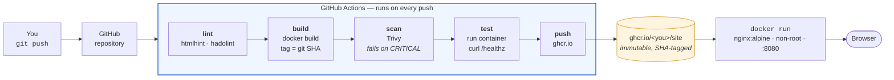
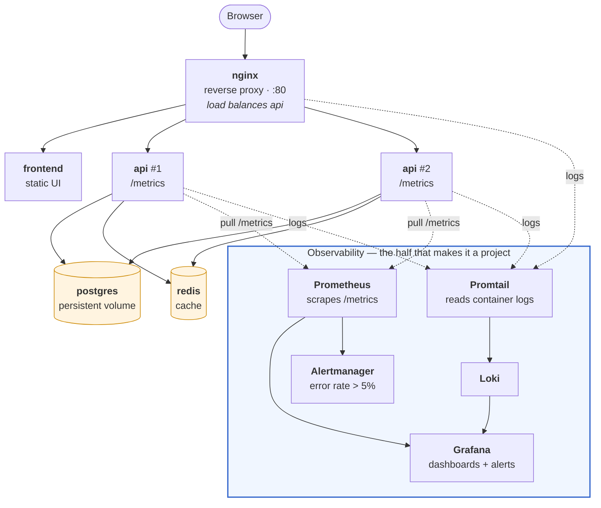
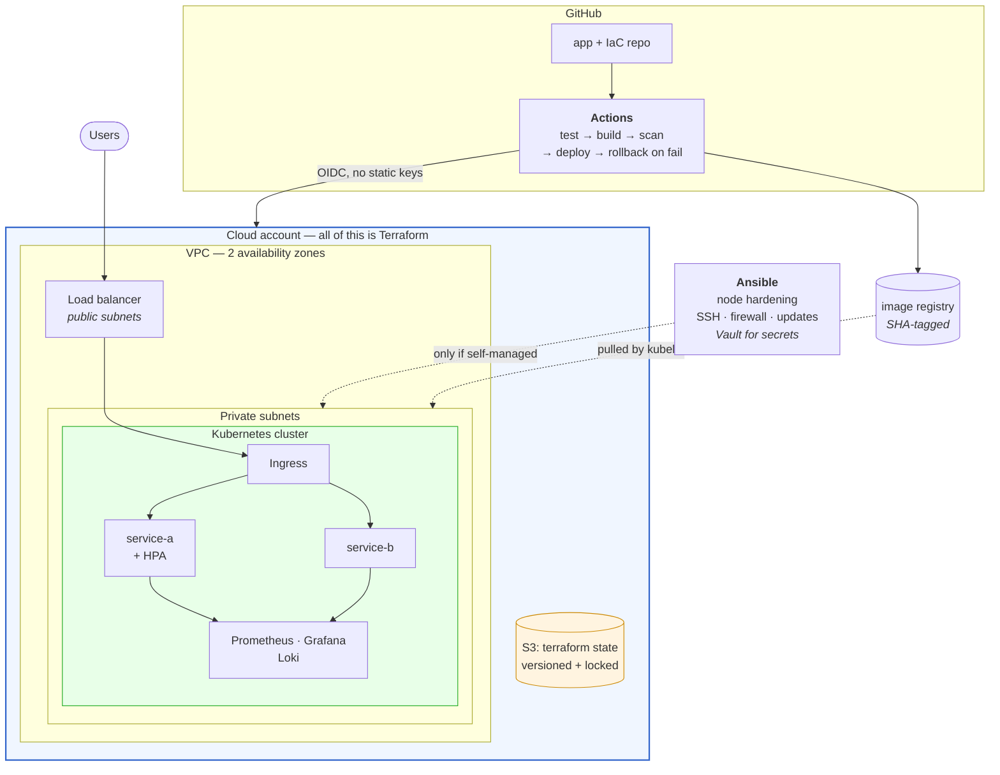

# Module 15: Capstone Projects

> *"You don't truly understand something until you've built it, broken it, and fixed it under pressure." — Engineering Wisdom*

---

## Why This Module Matters

Everything you've learned across 14 modules means nothing if you can't combine it into working systems. This module is where you **prove** your skills by building real-world projects that integrate infrastructure, automation, monitoring, security, and operations into cohesive, production-quality deliverables.

**These projects are your portfolio.** They're what you show in interviews, link on your resume, and reference when discussing your capabilities. Each project is designed to demonstrate specific competencies that hiring managers look for.

---

## Table of Contents

1. [Project Philosophy](#1-project-philosophy)
2. [Project Progression](#2-project-progression)
3. [Portfolio Structure](#3-portfolio-structure)
4. [Project 1: Static Site Pipeline (Beginner)](#4-project-1-static-site-pipeline-beginner)
5. [Project 2: Microservices Platform (Intermediate)](#5-project-2-microservices-platform-intermediate)
6. [Project 3: Production Infrastructure (Advanced)](#6-project-3-production-infrastructure-advanced)
7. [Cross-Cutting Expectations](#7-cross-cutting-expectations)
8. [Presenting Your Work](#8-presenting-your-work)

---

## 1. Project Philosophy

### What Makes a Good Portfolio Project

```
GOOD PORTFOLIO PROJECT:
   Solves a realistic problem (not a toy example)
   Uses production patterns (CI/CD, monitoring, secrets management)
   Is reproducible (someone else can run it from your README)
   Shows debugging (you broke something and fixed it — documented)
   Has a clear README with architecture diagram
   Includes cleanup instructions

BAD PORTFOLIO PROJECT:
   "Hello World" deployed to Kubernetes (over-engineered, no substance)
   Followed a YouTube tutorial step-by-step (no original thinking)
   Works on your machine only (no README, no reproducibility)
   No monitoring or error handling (not production-ready)
   Secrets committed to git (immediate red flag)
```

### The "Explain It in an Interview" Test

For every project, you should be able to answer:

1. **What problem does this solve?** (Not "I wanted to learn X")
2. **Why did you choose this architecture?** (Trade-offs, alternatives considered)
3. **What would you do differently?** (Self-awareness, growth mindset)
4. **How does it handle failure?** (Monitoring, alerting, recovery)
5. **How would you scale it?** (Next steps, growth plan)

---

## 2. Project Progression

```
BEGINNER                    INTERMEDIATE                 ADVANCED
┌─────────────────┐         ┌─────────────────┐         ┌─────────────────┐
│ Static Site     │         │ Microservices   │         │ Production      │
│ Pipeline        │         │ Platform        │         │ Infrastructure  │
│                 │         │                 │         │                 │
│ • Docker        │         │ • Multi-service │         │ • Terraform     │
│ • GitHub Actions│  ──▶    │ • Monitoring    │  ──▶    │ • Kubernetes    │
│ • Basic CI/CD   │         │ • Logging       │         │ • Full stack    │
│ • Single host   │         │ • Load balance  │         │ • Security      │
└─────────────────┘         └─────────────────┘         └─────────────────┘
  Est: 1 week                 Est: 2 weeks                Est: 2-3 weeks

Skills demonstrated:          Skills demonstrated:          Skills demonstrated:
  Modules 01-06                 Modules 05-08                 Modules 09-14
```

---

## 3. Portfolio Structure

### Recommended Repository Layout

```
your-devops-portfolio/
├── README.md                    ← Overview with links to each project
├── project-01-static-pipeline/
│   ├── README.md                ← Architecture, setup, what you learned
│   ├── Dockerfile
│   ├── docker-compose.yml
│   ├── .github/workflows/
│   └── docs/
│       ├── architecture.md
│       └── troubleshooting.md
├── project-02-microservices/
│   ├── README.md
│   ├── services/
│   ├── monitoring/
│   ├── docker-compose.yml
│   └── docs/
└── project-03-production-infra/
    ├── README.md
    ├── terraform/
    ├── kubernetes/
    ├── ansible/
    └── docs/
```

### README Template for Each Project

```markdown
# Project Title

## Overview
One paragraph describing what this project does and why.

## Architecture
[Diagram here — Mermaid, draw.io, or ASCII]

## Technologies Used
- List each tool and WHY you chose it

## How to Run
Step-by-step instructions that work on a fresh machine.

## What I Learned
Key lessons, mistakes, and how you fixed them.

## What I'd Do Differently
Honest self-assessment.

## Cleanup
How to tear down all resources.
```

---

## 4. Project 1: Static Site Pipeline (Beginner)

**Goal**: Build a containerized static website with a full CI/CD pipeline.

**What this demonstrates to employers**:

- You can containerize an application
- You understand CI/CD fundamentals
- You write proper Dockerfiles (non-root, slim images)
- You automate testing and deployment

**Skills used**: Linux, Git, Docker, CI/CD, basic networking

**Time and cost**: ~1 week, £0. The spec has the target architecture, a repository skeleton, a five-phase build sequence with a gate per phase, and a weighted rubric.

**Detailed spec**: [project-01-static-site-pipeline.md](./projects/project-01-static-site-pipeline.md)

---

## 5. Project 2: Microservices Platform (Intermediate)

**Goal**: Deploy a multi-service application with monitoring, logging, and load balancing.

**What this demonstrates to employers**:

- You can operate multi-service architectures
- You instrument applications for observability
- You can diagnose issues using metrics and logs
- You understand service-to-service communication

**Skills used**: Docker Compose, Nginx, Prometheus, Grafana, Loki, networking

**Time and cost**: ~2 weeks, £0 in cash but ~4 GB of RAM. Phases 1–3 are a Compose tutorial; phases 4–6 (metrics, logs, alerting) are the project — the spec says so explicitly and budgets your time accordingly.

**Detailed spec**: [project-02-microservices-platform.md](./projects/project-02-microservices-platform.md)

---

## 6. Project 3: Production Infrastructure (Advanced)

**Goal**: Provision and manage a complete production environment using Infrastructure as Code, container orchestration, and full observability.

**What this demonstrates to employers**:

- You can design and provision cloud infrastructure
- You manage Kubernetes workloads
- You implement security at every layer
- You think about cost, scaling, and disaster recovery

**Skills used**: Terraform, Ansible, Kubernetes, Prometheus, Grafana, security scanning, CI/CD

**Time and cost**: 2–3 weeks.  This is the only project that can bill you — roughly £150/month on the managed-cloud path if left running, £0 on the k3s path. Read the spec's cost section and set a budget alert **before** your first `terraform apply`.

**Detailed spec**: [project-03-production-infrastructure.md](./projects/project-03-production-infrastructure.md)

---

## 7. Cross-Cutting Expectations

Every project, regardless of difficulty level, must include:

### Security

- No secrets in code or git history
- Non-root containers
- Minimal permissions (IAM, RBAC, file permissions)
- Dependencies scanned for vulnerabilities

### Observability

- Health check endpoints
- At least basic metrics or logging
- Evidence of using observability to debug an issue

### Documentation

- Architecture diagram
- Setup instructions that work on a fresh machine
- Troubleshooting notes from real issues you hit

### Cleanup

- Clear teardown instructions
- All cloud resources, containers, and volumes removed
- Confirmation output proving cleanup is complete

### How You Know You're Done

Each project spec ends with a **weighted rubric** and a **build sequence** whose phases have
explicit gates. Score yourself honestly against the rubric before you call a project finished —
the weights are not decoration, they say which parts a reviewer actually cares about. In all
three, evidence of failure handling is weighted highest, and in all three it is the part people
leave out.

---

## 8. Presenting Your Work

### In Your Resume

```
DEVOPS PROJECTS

Production Infrastructure Platform
  Provisioned multi-tier AWS infrastructure with Terraform.
  Deployed microservices on Kubernetes with Helm.
  Implemented Prometheus/Grafana monitoring with automated alerting.
  Achieved zero-downtime deployments via rolling updates.
  Tech: Terraform, Kubernetes, Helm, Prometheus, Grafana, GitHub Actions
```

### In Interviews

**Don't**: "I followed a tutorial and deployed Nginx to Kubernetes."

**Do**: "I built a multi-service platform with load balancing and monitoring. The hardest part was debugging a race condition where the API would fail health checks during deployment because the database migration hadn't completed. I solved it by adding readiness probes that checked the migration status endpoint, and I documented the issue in my troubleshooting guide."

### On GitHub

- Pin your portfolio repository
- Write clear, professional READMEs
- Include architecture diagrams
- Show evidence of iteration (meaningful commit history)
- Link from your LinkedIn profile

---

## Labs and Projects

Read the sections above first, then work through these **in order**. Every lab ends with a  **Break It** section — those are not optional; they are where the debugging skill actually comes from.

**Portfolio projects:**

- [Static Site Pipeline (Beginner)](./projects/project-01-static-site-pipeline.md) — Build a containerized static website with an automated CI/CD pipeline that lints, builds, scans, and deploys on every push.
- [Microservices Platform (Intermediate)](./projects/project-02-microservices-platform.md) — Deploy a multi-service application with a reverse proxy, centralized monitoring, and centralized logging.
- [Production Infrastructure (Advanced)](./projects/project-03-production-infrastructure.md) — Design, provision, and manage a complete production-grade environment using Infrastructure as Code, container orchestration, configuration…

---

## Self-Check

Answer these from memory before you expand them. If more than two give you trouble, re-read the sections they come from — the labs assume this material is solid.

<details>
<summary><strong>1. What separates a portfolio project from a replayed tutorial?</strong></summary>

A stated problem with constraints, a decision you can defend, an alternative you rejected and why, and evidence a stranger can reproduce. Following someone else's steps demonstrates that you can follow steps.

</details>

<details>
<summary><strong>2. Besides working code, what has to be in the repository?</strong></summary>

A README covering the problem, architecture, and how to run it; the infrastructure and pipeline definitions; validation output; failure notes from at least one real break-and-fix; cost notes; and cleanup instructions that actually work.

</details>

<details>
<summary><strong>3. Why does a reviewer care about your teardown step?</strong></summary>

It shows you think in lifecycles and costs rather than only in creation, and it is the strongest available evidence that the environment is genuinely reproducible instead of a hand-tuned pet you could never rebuild.

</details>

<details>
<summary><strong>4. Screenshots or reproducible artefacts?</strong></summary>

A screenshot proves that something once looked right on your machine. A reviewer who can clone the repository and get it running in ten minutes is evaluating your work rather than your claims. Keep screenshots as supporting evidence, never as the proof.

</details>

<details>
<summary><strong>5. Describe a project in two minutes. What order?</strong></summary>

Problem, constraints, what you built, the one hard decision and its tradeoff, how you would know it broke, and what you would change with more time. Starting with the tool list is the mistake — nobody is impressed by a list of technologies.

</details>

<details>
<summary><strong>6. What should be true of all three projects, regardless of scope?</strong></summary>

Version-controlled from the first commit, a pipeline that runs on every change, infrastructure defined as code rather than clicked together, no secrets in the repository, at least one meaningful signal monitored with an alert, and a documented failure mode you have actually triggered.

</details>

---

## Practical Checkpoint

Before moving on, you should be able to:

- Complete at least one project from each difficulty tier.
- Present any project in a 5-minute technical walkthrough.
- Answer "why" questions about every technology choice in your projects.

Portfolio evidence to keep:

- Completed projects in a public GitHub repository.
- Architecture diagrams for each project.
- Troubleshooting notes showing real problems you diagnosed and fixed.

---

## What's Next?

With portfolio projects complete, you're ready for the final step — preparing for DevOps interviews.

**[Module 16: Interview Prep →](../16-interview-prep/)**

---

<div align="center">

**Module 15 Complete** 

[← Back to System Design](../14-system-design-devops/) | [Next: Interview Prep →](../16-interview-prep/)

</div>


## Reference
<!-- tab: Projects -->
# Project 01: Static Site Pipeline (Beginner)

## Problem Statement

Build a containerized static website with an automated CI/CD pipeline that lints, builds, scans, and deploys on every push. This is the simplest end-to-end DevOps project, but it must be done with production-quality practices.

**Time**: ~1 week at 10–15 hours. **Cost**: £0 — everything here is free tier or local.

## Architecture

This is what you are building. Every box is something you write; every arrow is something you have to prove works.



> ** DevOps Impact**: notice that the artefact is built **once**, tagged with the commit SHA, and everything downstream refers to that tag. Rebuilding per environment is the most common way teams end up shipping something they never tested — and the habit is much easier to form on a project this small than to retrofit later.

## Requirements

### Application

- A static website (HTML/CSS/JS) — can be a personal portfolio, landing page, or documentation site
- Served by Nginx in a Docker container
- Health check endpoint that returns 200

### Dockerfile

- Uses `nginx:alpine` (slim base image)
- Runs as non-root user
- Copies only static files (no source code, no build tools in final image)
- Pinned image version (not `:latest`)

### CI/CD Pipeline (GitHub Actions)

- **Lint**: Validate HTML (htmlhint or similar)
- **Build**: Build the Docker image with a unique tag (git SHA)
- **Scan**: Run Trivy on the built image, fail on CRITICAL CVEs
- **Test**: Start the container and verify the health endpoint responds
- **Push** (optional): Push to GitHub Container Registry or Docker Hub

### Documentation

- README with architecture diagram
- Setup instructions for running locally
- Cleanup instructions

## Repository Layout

Start from this skeleton. It is deliberately a list of files and what belongs in each — the
files themselves are the project, so writing them is the work.

```
project-01-static-pipeline/
├── README.md                     # problem, architecture, how to run, what you'd change
├── Dockerfile                    # nginx:alpine pinned, non-root, COPY site/ only
├── docker-compose.yml            # one service, healthcheck, port 8080:8080
├── .dockerignore                 #  keep .git and docs out of the build context
├── nginx/
│   └── default.conf              # listen 8080 (non-root can't bind 80), /healthz → 200
├── site/
│   ├── index.html
│   └── assets/
├── .github/
│   └── workflows/
│       └── ci.yml                # lint → build → scan → test → push, SHA-tagged
├── .htmlhintrc                   # linter config — a linter with no config is a suggestion
└── docs/
    ├── architecture.md           # the diagram above, redrawn as YOUR system
    ├── troubleshooting.md        # every error you hit, with the fix
    └── failure-notes.md          # the failure you introduced on purpose, and how CI caught it
```

Two details that trip everyone up on the first attempt, so decide them now:

- **Non-root cannot bind port 80.** Either listen on 8080 in `nginx/default.conf`, or use
  `nginxinc/nginx-unprivileged`. Discovering this from a `permission denied` in CI is fine;
  discovering it and not writing it down in `troubleshooting.md` is a wasted lesson.
- **A health endpoint is not the index page.** `/healthz` should be a distinct location that
  returns 200 with no dependencies, so a failing health check means the server is broken
  rather than the content being late.

## Build Sequence

Five phases. Do not start the next one until the gate passes — each gate is something you can
paste into your evidence file.

| Phase | Build | Done when |
|-------|-------|-----------|
| **1. Runs locally** | `site/`, `nginx/default.conf`, `Dockerfile` | `docker build` succeeds, `curl localhost:8080/healthz` returns 200, `docker exec <id> whoami` is **not** root |
| **2. Composed** | `docker-compose.yml` with a `healthcheck` | `docker compose ps` shows `healthy`, not just `running` — they are different claims |
| **3. CI green** | `ci.yml` with lint + build | A push produces a green run, and the image tag in the log is the commit SHA |
| **4. CI has teeth** | Trivy scan + container smoke test in CI | You can point at a run that **failed** for a real reason, and explain the log line that proves why |
| **5. Documented** | `README.md`, `docs/` | A person who has never seen it clones and runs it from your README alone, without asking you anything |

>Phase 4 is the one people skip, and it is the only one an interviewer will dig into. "My pipeline passes" is unremarkable; "here is the run where it caught a critical CVE and refused to publish" is the project.

## Deliverables

- Git repository with all source code, Dockerfile, and CI/CD workflow
- Screenshot or link to a passing CI/CD pipeline run
- Trivy scan output showing no critical vulnerabilities
- Evidence of the health check working (curl output)
- Architecture diagram showing the build → test → deploy flow

## Validation

- `docker compose up` brings the site up on localhost
- CI pipeline passes on a clean push
- Trivy scan runs and reports results
- Health endpoint returns 200
- Container runs as non-root (verify with `docker exec <id> whoami`)

## Failure Scenario

Introduce one of these failures and document how the pipeline catches it:

1. Add a `<script>alert('xss')</script>` tag and see if the linter flags it
2. Switch to an image with known CRITICAL CVEs and see Trivy fail the pipeline
3. Break the Nginx config so the container starts but returns 500 on the health check

## What to Commit

- All source files, Dockerfile, docker-compose.yml, and GitHub Actions workflow
- Screenshot of passing and failing pipeline runs
- Trivy scan summary
- Troubleshooting notes from at least one issue you encountered

## Cost and Teardown

Nothing here should cost you money, but two of these have limits worth knowing:

| Resource | Free allowance | What to watch |
|----------|---------------|---------------|
| GitHub Actions | 2,000 minutes/month on free accounts (unlimited for public repos) | A workflow that runs on every push to every branch burns this fast. Scope triggers to `push` on your branches and `pull_request` |
| GitHub Container Registry | Free for public images | Private images count against package storage. Keep this one public |
| Local Docker | Your disk | `docker system df` — build caches and dangling images from a week of iterating are easily 10 GB |

```bash
# Teardown
docker compose down -v                 # containers, networks, volumes
docker image rm ghcr.io/<you>/site:<sha>
docker system prune -f                 #  then check `docker system df` actually dropped
```

Leave the GitHub repository up — it is the deliverable.

## Review Rubric

Score each criterion 1–5, multiply by the weight, and total it. Weights are here because these
criteria are not equally interesting to a reviewer: a pipeline with no evidence of catching a
real failure is a demo, not a project.

| Criteria | Weight | What a 5 looks like | Score (1-5) |
|----------|:------:|---------------------|:-----------:|
| **Debugging evidence** | ×3 | A CI run that failed for a real reason, with the log line and the fix documented in `failure-notes.md` | |
| **Reproducibility** | ×3 | Fresh clone → `docker compose up` → working site, with no undocumented step | |
| **Pipeline correctness** | ×2 | Stages ordered cheapest-first, image tagged by SHA, artefact built once | |
| **Security basics** | ×2 | Non-root container, pinned base image, Trivy gate that actually fails the build, no secrets | |
| **Explanation clarity** | ×2 | README states the problem and one tradeoff you chose, not a tool list | |
| **Cleanup quality** | ×1 | Teardown documented and verified — nothing left running or cached | |

**Scoring**: 1 = Not attempted · 2 = Partial · 3 = Meets expectations · 4 = Exceeds expectations · 5 = Production quality.
**Out of 65.** Below 40 means keep working; 40–52 is portfolio-ready; above 52 is genuinely good.

## Interview Pitch

Rehearse this out loud until it is under two minutes, because you will be asked for it in
exactly that form. Structure: problem → what you built → one decision → how you'd know it broke.

> "I wanted a deploy I couldn't get wrong by hand, so I containerised a static site and put a
> five-stage pipeline in front of it. The interesting part is the scan gate — I pinned the base
> image and made Trivy fail the build on criticals, then deliberately swapped in an old base
> image to prove the gate works. The image is tagged with the commit SHA and built once, so what
> gets published is exactly what was tested."

The follow-ups you should be ready for:

- *"Why non-root, on a static site?"* — blast radius, and the fact that port 8080 vs 80 is the only cost.
- *"Your scan blocks criticals. What do you do when there's no fix available?"* — the real answer involves reachability and an explicitly recorded, expiring exception, not disabling the gate. (Module 13.)
- *"How would you deploy this for real?"* — and here you should have an opinion about push vs pull delivery. (Module 06 §5.)

---

# Project 02: Microservices Platform (Intermediate)

## Problem Statement

Deploy a multi-service application with a reverse proxy, centralized monitoring, and centralized logging. Demonstrate that you can operate, observe, and debug a distributed system.

**Time**: ~2 weeks at 10–15 hours. **Cost**: £0 in cash, but budget ~4 GB of RAM and ~10 GB of disk — this stack is where a laptop starts to complain.

## Architecture

Eight containers on one Docker network. The request path is the top row; everything below it exists so you can answer questions about the top row.



> ** DevOps Impact**: two API replicas behind the proxy are not there for throughput on a laptop — they are there so that "stop one container and nothing breaks" is a claim you can demonstrate, and so your dashboards have to aggregate across instances instead of graphing a single pet.

## Requirements

### Application Stack

- **Frontend**: Static site or simple web UI served by Nginx
- **API**: A small REST API (Python Flask, Node Express, or Go) with at least 3 endpoints
- **Database**: PostgreSQL or MySQL for persistent data
- **Cache**: Redis for session or response caching
- **Reverse Proxy**: Nginx load balancing traffic to the API

### Observability Stack

- **Metrics**: Prometheus scraping application and infrastructure metrics
- **Dashboards**: Grafana with at least one custom dashboard (4+ panels)
- **Logging**: Loki + Promtail (or ELK) collecting logs from all services
- **Alerting**: At least one alert rule (e.g., API error rate > 5%)

### Infrastructure

- All services run via Docker Compose
- Health checks defined for every service
- Environment variables for configuration (no hardcoded values)
- `.env.example` file documenting required variables

### Documentation

- Architecture diagram showing all services and connections
- Setup instructions that work from `docker compose up`
- Troubleshooting guide with at least 3 real issues you encountered

## Repository Layout

```
project-02-microservices/
├── README.md
├── docker-compose.yml            # all services, healthchecks, depends_on: condition: service_healthy
├── .env.example                  #  every variable, with safe placeholder values
├── .gitignore                    # .env FIRST — this is the project where secrets leak
├── services/
│   ├── api/
│   │   ├── Dockerfile
│   │   ├── app.py                # 3+ endpoints, /metrics, /healthz, structured JSON logs
│   │   └── requirements.txt
│   └── frontend/
│       ├── Dockerfile
│       └── src/
├── nginx/
│   └── nginx.conf                # upstream block with both api replicas, X-Forwarded-For
├── monitoring/
│   ├── prometheus/
│   │   ├── prometheus.yml        # scrape api replicas, nginx exporter, itself
│   │   └── alert_rules.yml       # error rate, latency, target down
│   ├── alertmanager/
│   │   └── alertmanager.yml      # a webhook receiver is fine — it just has to fire
│   └── grafana/
│       └── provisioning/         #  datasources + dashboards as code, not clicked in
├── logging/
│   ├── loki/loki-config.yml
│   └── promtail/promtail-config.yml
├── db/
│   └── init.sql                  # schema — the API should not create its own tables at boot
└── docs/
    ├── architecture.md
    ├── troubleshooting.md
    ├── failure-notes.md
    └── runbook.md                # symptom → check → cause → fix, for each alert you defined
```

Three decisions to make deliberately rather than by accident:

- **`depends_on` alone does not wait for readiness.** It waits for *started*. Without
  `condition: service_healthy` plus a real healthcheck, your API will race Postgres on every
  `compose up` and fail intermittently — the single most common frustration in this project.
- **Provision Grafana, don't click it.** A dashboard configured through the UI dies with the
  volume and cannot be reviewed in a diff. Datasources and dashboards belong in
  `monitoring/grafana/provisioning/`.
- **Structured logs from day one.** JSON with a `request_id`, from the first line of code. Adding
  it after you have written the log statements is twice the work and you will not do it.

## Build Sequence

Six phases. Resist building the whole `docker-compose.yml` first — bring services up one at a
time and prove each one before adding the next, or you will debug five things at once.

| Phase | Build | Done when |
|-------|-------|-----------|
| **1. API alone** | `services/api` + Postgres | `curl` creates and reads a record; API survives a Postgres restart without manual intervention |
| **2. Cache** | Redis + a cached read path | Second identical request is measurably faster, and you can show both numbers |
| **3. Proxy** | nginx with two API replicas | `docker compose stop api-1` and traffic still succeeds — proven with a loop of curls, not a single one |
| **4. Metrics** | Prometheus + Grafana, provisioned | Dashboard shows request rate, error rate, and p95 **aggregated across both replicas** |
| **5. Logs** | Promtail + Loki | You can filter to one `request_id` and see its path across nginx and the API |
| **6. Alerting** | Alert rules + a runbook | An alert fires from a real induced failure, and `runbook.md` says what to do about it |

>Phases 4–6 are the project. Phases 1–3 are a docker-compose tutorial that thousands of people have also done. Budget your two weeks accordingly — if you are running out of time, ship fewer API endpoints, not less observability.

## Deliverables

- Git repository with all source code, configs, and Compose files
- Architecture diagram
- Grafana dashboard screenshot or JSON export
- Log query demonstrating a debugging workflow
- Alert rule definition and evidence of it firing
- Troubleshooting guide

## Validation

- `docker compose up` brings the full stack online
- Frontend can reach the API through the reverse proxy
- API reads/writes to the database correctly
- Redis cache reduces response time on repeated requests
- Prometheus scrapes metrics from all instrumented targets
- Grafana dashboard shows live data
- Loki/ELK contains logs from all services
- At least one alert fires when a failure condition is simulated

## Failure Scenario

Simulate and document at least two of these scenarios:

1. **Database crash**: Stop the database container. How does the API respond? What do the logs show? How do metrics reflect the failure? Restart and verify recovery.
2. **API memory leak**: Set a very low memory limit on the API container. Generate traffic until it OOM-kills. Document the symptoms in metrics and logs.
3. **Cache failure**: Stop Redis. Does the API degrade gracefully or crash? Implement a fallback path.
4. **Traffic spike**: Use `hey` or `ab` to send 1000 concurrent requests. Observe latency, error rates, and resource utilization in Grafana.

## What to Commit

- All source code, Dockerfiles, Compose files, and configs
- Prometheus and Grafana configuration files
- Dashboard JSON export
- Troubleshooting guide with real issues and fixes
- Failure scenario documentation with evidence

## Cost and Teardown

No cloud spend, but this stack is not free in resources — and knowing its footprint is itself
a legitimate answer to "how would you size this?".

| Resource | Rough footprint | What to watch |
|----------|----------------|---------------|
| RAM | ~2.5–4 GB with all eight containers | Grafana + Prometheus + Loki are the heavy ones. Add `deploy.resources.limits` and watch what gets OOM-killed — that *is* failure scenario 2 |
| Disk | ~5–10 GB | Prometheus TSDB and Loki chunks grow while you iterate. Set short retention: `--storage.tsdb.retention.time=24h` |
| CPU | Idles low; the load test is the spike | `docker stats` during your `hey`/`ab` run belongs in your evidence |

```bash
# Teardown — the -v matters, that's where Postgres, Prometheus and Loki data live
docker compose down -v
docker system prune -f
docker system df                       #  confirm reclaimed, don't assume
```

If you later move this to a cloud VM to show it off: one 4 GB instance runs it (roughly
£15–20/month at typical 2026 small-instance pricing — check current rates), and you must put a
budget alert on the account before you start. An idle demo VM left running for a year is the
single most common self-inflicted cloud bill.

## Review Rubric

Score each criterion 1–5, multiply by the weight, total it. The weights say plainly what this
project is for: anyone can start eight containers, and almost nobody can show you the debugging
workflow that the observability stack was built to support.

| Criteria | Weight | What a 5 looks like | Score (1-5) |
|----------|:------:|---------------------|:-----------:|
| **Observability actually used** | ×3 | A written investigation: alert fired → dashboard narrowed it → log query for one `request_id` found the cause. Screenshots at each step | |
| **Failure evidence** | ×3 | Two or more induced failures, each with metrics *and* logs showing the symptom, plus recovery | |
| **Reproducibility** | ×2 | `cp .env.example .env && docker compose up` on a fresh machine, no manual ordering, no race | |
| **Monitoring as code** | ×2 | Dashboards, datasources, and alert rules committed and reviewable — not clicked into a UI | |
| **Security basics** | ×2 | No secrets committed, no default database password, non-root containers, `.env` gitignored | |
| **Explanation clarity** | ×2 | `runbook.md` maps each alert to a check and a fix; architecture doc explains the cache and the replicas | |
| **Cleanup quality** | ×1 | `down -v` verified, retention configured, footprint documented | |

**Scoring**: 1 = Not attempted · 2 = Partial · 3 = Meets expectations · 4 = Exceeds expectations · 5 = Production quality.
**Out of 75.** Below 45 means keep working; 45–60 is portfolio-ready; above 60 is genuinely good.

## Interview Pitch

> "It's a five-service stack behind nginx, but the point of it is the observability. I instrumented
> the API with RED metrics, shipped structured logs to Loki with a request id, and wrote one alert
> on error rate. Then I killed the database under load and used my own dashboards to work out what
> was happening — the alert fired, the dashboard showed which replica, and the log query gave me
> the exact exception. That investigation is written up in the runbook."

The follow-ups you should be ready for:

- *"Your API is stateless — how do you know?"* — the answer is that you stopped one replica mid-traffic and nothing broke, and you can show the curl loop.
- *"What did the cache actually buy you?"* — have both latency numbers, and be honest about what it cost you in invalidation complexity.
- *"Why alert on error rate rather than CPU?"* — symptoms versus causes. (Module 07 §7.)
- *"How would this look on Kubernetes?"* — a good moment to say what Compose does *not* give you: rolling updates, probes-driven traffic removal, self-healing. That's project 03.

---

# Project 03: Production Infrastructure (Advanced)

## Problem Statement

Design, provision, and manage a complete production-grade environment using Infrastructure as Code, container orchestration, configuration management, and full observability. This is the capstone project that integrates skills from every module in the handbook.

**Time**: 2–3 weeks at 10–15 hours. **Cost**: £0 on the local path, roughly £100–160/month on the managed-cloud path if you leave it running — read [Cost and Teardown](#cost-and-teardown) *before* your first `terraform apply`, not after.

## Architecture

Everything below is provisioned from code. The one thing that is not is the Terraform state bucket, which has to exist before Terraform can use it.



> ** DevOps Impact**: the arrow from CI into the cloud is labelled OIDC for a reason — this is the project where you stop putting long-lived access keys in a CI system. A federated role that mints short-lived credentials is barely more work to set up and removes the single most valuable thing an attacker could steal from your pipeline.

### Pick Your Path First

The requirements are identical; only the substrate changes. Decide now, and write down why.

| | Local path | Managed cloud path |
|---|---|---|
| Cluster | k3s or minikube on your machine (or one small VM) | EKS / GKE / AKS |
| Cost | £0 | ~£100–160/month if left running |
| What you still prove | IaC, Ansible, K8s, observability, CI/CD, security, failure scenarios | All of that, plus VPC design, IAM, and cloud cost awareness |
| What you cannot show | Real VPC/subnet/IAM design, multi-AZ, managed load balancers | — |
| Honest interview framing | "I built it on k3s to keep it free; here is the Terraform for the AWS version and what would change" | "Here is the bill, and here is what I turned off" |

Either is defensible. What is *not* defensible is running the cloud version for three weeks without a budget alert, or claiming multi-AZ resilience you never provisioned.

## Requirements

### Infrastructure (Terraform)

- VPC with public and private subnets across 2 availability zones
- Security groups following least privilege
- An EKS/K3s/minikube Kubernetes cluster (cloud or local)
- S3 bucket for Terraform state (remote backend)
- IAM roles for services (not user access keys)

### Configuration Management (Ansible)

- Playbook to bootstrap cluster nodes (if using self-managed K8s)
- Role for common security hardening (SSH, firewall, updates)
- Ansible Vault for any sensitive variables

### Application Deployment (Kubernetes)

- At least 2 microservices deployed as Kubernetes Deployments
- Services exposed via Kubernetes Services and Ingress
- ConfigMaps for non-sensitive configuration
- Kubernetes Secrets for sensitive configuration
- Resource limits and requests on all pods
- Readiness and liveness probes on all containers
- Horizontal Pod Autoscaler on at least one service
- Rolling update strategy with rollback evidence

### Observability

- Prometheus + Grafana for metrics (deployed in-cluster or external)
- Loki or EFK for centralized logging
- At least 2 custom dashboards (infrastructure + application)
- At least 2 alert rules with notification channel configured
- Evidence of using observability to debug a real issue

### CI/CD

- GitHub Actions pipeline that:
  - Runs tests
  - Builds and scans container images
  - Deploys to Kubernetes (kubectl apply or Helm)
  - Includes rollback on failure

### Security

- Container images scanned with Trivy
- No secrets in source code or git history
- RBAC configured in Kubernetes
- Network policies restricting pod-to-pod traffic
- Pod security contexts (non-root, read-only filesystem)

## Repository Layout

```
project-03-production-infra/
├── README.md
├── docs/
│   ├── architecture.md           # your version of the diagram above, plus the tradeoffs
│   ├── adr/                      #  one file per real decision: EKS vs k3s, Helm vs kubectl
│   ├── runbook.md                # symptom → check → cause → fix, per alert
│   ├── cost.md                   # the table below, filled in with YOUR numbers
│   ├── troubleshooting.md        # 5+ real issues
│   └── failure-notes.md          # the induced failures, with evidence
├── terraform/
│   ├── bootstrap/                #  state bucket + lock table. Run FIRST, local state, once
│   ├── modules/
│   │   ├── network/              # VPC, subnets, route tables, NAT
│   │   └── cluster/              # cluster + node group / k3s hosts
│   └── environments/
│       ├── dev/                  # backend.hcl, main.tf, terraform.tfvars
│       └── prod/                 # same modules, different values — NOT copy-pasted resources
├── ansible/
│   ├── ansible.cfg
│   ├── inventory/                # dynamic inventory if cloud, static if local
│   ├── group_vars/
│   │   └── all/vault.yml         # ansible-vault encrypted. The .vault_pass file is gitignored
│   └── roles/
│       ├── common/               # updates, timezone, users
│       └── hardening/            # SSH config, firewall, fail2ban
├── kubernetes/
│   ├── base/                     # deployments, services, ingress, configmaps
│   ├── overlays/                 # dev / prod differences (Kustomize) or a Helm chart
│   ├── observability/            # kube-prometheus-stack values, Loki values, dashboards
│   └── policy/                   # RBAC, NetworkPolicies, Pod Security admission labels
└── .github/workflows/
    ├── ci.yml                    # test → build → scan → push
    └── deploy.yml                # deploy → verify rollout → rollback on failure
```

Four things that will cost you a day each if you decide them late:

- **`terraform/bootstrap/` is a separate root module with local state.** The bucket that holds
  your state cannot be described by the configuration that uses it. Create it once, commit it,
  and never point it at itself.
- **`environments/dev` and `environments/prod` must call the same modules.** Two copies of the
  resources that drift apart is the failure this layout exists to prevent — and the drift always
  reveals itself at the worst moment.
- **Secrets: pick one place and one mechanism.** Ansible Vault for host-level secrets, a cloud
  secret manager or Sealed Secrets/SOPS for cluster secrets. Kubernetes Secrets are base64,
  not encryption (Module 13 §2).
- **Deploy with a verified rollout, not `kubectl apply`.** `kubectl rollout status --timeout` is
  what turns "the pipeline succeeded" into "the pods are actually serving", and it is what your
  rollback step keys off.

## Build Sequence

Eight phases. Each gate is evidence for your final write-up — capture it as you go, because
recreating it after teardown means paying twice.

| Phase | Build | Done when |
|-------|-------|-----------|
| **1. Bootstrap** | `terraform/bootstrap` — state bucket, lock table, budget alert | State is remote and locked; a second `apply` from another shell is refused.  Budget alert exists **before** phase 2 |
| **2. Network** | `modules/network` — VPC, two AZs, public/private, NAT | `terraform plan` is empty on a re-run; a test instance in a private subnet can reach the internet but is not reachable from it |
| **3. Cluster** | `modules/cluster` — cluster + nodes | `kubectl get nodes` all Ready, from a kubeconfig that Terraform output |
| **4. Hardened** | Ansible `common` + `hardening` roles | Second run reports **zero changed** — idempotence is the deliverable, not the playbook |
| **5. Apps** | `kubernetes/base` — 2 services, probes, limits, ingress | Both services reachable through the Ingress; every pod has requests, limits, and both probes |
| **6. Observable** | `kubernetes/observability` | Dashboards show live data from your services; 2 alert rules; logs queryable and correlated |
| **7. Delivered** | `ci.yml` + `deploy.yml` | A code change reaches the cluster automatically, and a deliberately broken image triggers an automatic rollback |
| **8. Locked down** | `kubernetes/policy` — RBAC, NetworkPolicies, PSA | A pod in namespace A cannot reach namespace B; a privileged pod is rejected; `kubectl auth can-i --as=` proves the RBAC boundary |

>Phase 7's rollback is the highest-value single thing in this project. "My pipeline deploys" is table stakes; "my pipeline noticed the rollout was failing and put the previous version back without me" is a story with a beginning and an end. Do not let it slip to the last day.

## Deliverables

- Git repository with Terraform, Ansible, Kubernetes, and CI/CD configs
- Architecture diagram showing all components and data flows
- Terraform plan output and apply evidence
- Kubernetes deployment evidence (kubectl get all)
- Grafana dashboard screenshots or JSON exports
- Security scan results
- CI/CD pipeline run evidence (passing and failing)
- Troubleshooting guide with at least 5 real issues

## Validation

- `terraform plan` shows the complete infrastructure
- `terraform apply` provisions all resources successfully
- Ansible playbook runs idempotently (second run = zero changes)
- All Kubernetes pods are Running and Ready
- Application is accessible through the Ingress
- Prometheus scrapes metrics from all targets
- Grafana dashboards show live data
- Alert rules are configured and functional
- CI/CD pipeline deploys a code change end-to-end
- `terraform destroy` tears everything down cleanly

## Failure Scenarios

Simulate and document at least three:

1. **Pod crash loop**: Deploy a misconfigured container. Use `kubectl describe` and `kubectl logs` to diagnose. Fix and redeploy.
2. **Failed deployment**: Push a broken image tag. Observe the rollout failure. Execute a rollback. Verify the previous version is restored.
3. **Node failure** (if multi-node): Cordon and drain a node. Observe pod rescheduling. Uncordon and verify rebalancing.
4. **Security incident**: Simulate a leaked secret. Rotate it, update Kubernetes Secrets, and redeploy without downtime.
5. **Resource exhaustion**: Set very low memory limits. Generate load. Observe OOM kills and HPA scaling in action.

## What to Commit

- All Terraform, Ansible, Kubernetes, and CI/CD configuration files
- Architecture diagram and design document
- `terraform plan` and `terraform apply` output summaries
- Grafana dashboard JSON exports
- Security scan results (Trivy, kube-bench)
- Troubleshooting guide with evidence of debugging
- Cost estimate for the cloud resources used

## Cost and Teardown

This is the only project in the handbook that can send you a bill. Treat the numbers below as
**illustrative shapes, not quotes** — check current pricing for your region before you apply, and
put the budget alert in place first.

### Managed cloud path (AWS, eu-west-1, illustrative)

| Resource | Rough monthly if left running | Notes |
|----------|------------------------------:|-------|
| EKS control plane | ~£70 | Charged per cluster-hour whether or not anything runs on it.  The single biggest surprise |
| 2 × `t3.small` nodes | ~£28 | Spot instances cut this substantially and are fine for a lab |
| NAT gateway | ~£30 + data | Hourly **and** per-GB. Two AZs means two of them if you follow the textbook |
| Application load balancer | ~£16 + LCU | Per-hour plus capacity units |
| EBS volumes, snapshots | ~£3–8 | Volumes survive instance termination. So do snapshots |
| S3 state + ECR images | < £1 | Genuinely cheap; keep the state bucket |
| CloudWatch logs | £0–10 |  Default retention is *forever*. Set it to 7 days on day one |
| **Total** | **~£150–160/month** | **~£5/day.** Three weeks of continuous running is real money |

Ways to cut it that are also good engineering answers:

- Destroy at the end of each session. `terraform apply` from scratch takes ~15–20 minutes for EKS — an acceptable price, and it proves reproducibility every single time.
- Single AZ and one NAT gateway while building; two AZs only for the run you take evidence from.
- Spot node groups for the node pool.
- Or take the **local path**: k3s on your machine costs nothing and still demonstrates seven of the eight phases.

### Teardown checklist

`terraform destroy` is necessary and not sufficient — cloud providers leave behind anything
Terraform did not create, including things your cluster created on your behalf.

```bash
# 1. Kubernetes first: services of type LoadBalancer created cloud load balancers that
#    Terraform does not know about. Delete them BEFORE destroying the network.
kubectl delete svc --all-namespaces --field-selector spec.type=LoadBalancer
kubectl delete pvc --all --all-namespaces        #  these are real EBS volumes

# 2. Then the infrastructure
terraform -chdir=terraform/environments/dev destroy

# 3. Then verify by hand — this is the step people skip and then pay for
aws elbv2 describe-load-balancers --query 'LoadBalancers[].LoadBalancerName'
aws ec2 describe-addresses --query 'Addresses[?AssociationId==null].PublicIp'   # unattached EIPs
aws ec2 describe-volumes --filters Name=status,Values=available --query 'Volumes[].VolumeId'
aws ec2 describe-snapshots --owner-ids self --query 'Snapshots[].SnapshotId'
aws ec2 describe-nat-gateways --filter Name=state,Values=available
aws logs describe-log-groups --query 'logGroups[].logGroupName'
aws ecr describe-repositories --query 'repositories[].repositoryName'
```

Keep the state bucket and your budget alert. Delete everything else, then **check the billing
console 48 hours later** — charges lag, and "I verified the bill went to zero" is a sentence
that impresses interviewers precisely because so few candidates can say it.

## Review Rubric

Score each criterion 1–5, multiply by the weight, total it. This is the capstone: the weights
reward the things that distinguish someone who has operated a system from someone who has
provisioned one.

| Criteria | Weight | What a 5 looks like | Score (1-5) |
|----------|:------:|---------------------|:-----------:|
| **Failure handling proven** | ×3 | 3+ induced failures with evidence, including an automatic rollback triggered by a broken deploy | |
| **Reproducibility** | ×3 | `bootstrap → apply → ansible → deploy` from a fresh clone with documented steps; a re-run of `plan` is empty | |
| **Security posture** | ×3 | RBAC scoped and proven with `auth can-i --as=`, NetworkPolicies enforced, PSA rejecting privileged pods, OIDC instead of static CI keys, no secrets in history | |
| **Observability** | ×2 | Dashboards and alerts as code, and a written investigation where they found a real problem | |
| **Cost discipline** | ×2 | `docs/cost.md` with real numbers, a budget alert from day one, and verified teardown including the orphan sweep | |
| **Decision quality** | ×2 | ADRs recording what you chose, what you rejected, and why. Local vs cloud framed honestly | |
| **Idempotence** | ×1 | Second Ansible run: zero changed. Second `terraform plan`: no diff | |
| **Explanation clarity** | ×1 | Architecture doc and runbook a stranger could operate from | |

**Scoring**: 1 = Not attempted · 2 = Partial · 3 = Meets expectations · 4 = Exceeds expectations · 5 = Production quality.
**Out of 85.** Below 50 means keep working; 50–68 is portfolio-ready; above 68 is the strongest thing in your portfolio and should be the first project you mention.

## Interview Pitch

> "It's a two-AZ VPC with a Kubernetes cluster, all in Terraform, with Ansible hardening the
> nodes and a pipeline that deploys through OIDC — no static credentials anywhere. The part I'd
> point at is the rollback: I pushed a deliberately broken image tag, the rollout stalled on the
> readiness probe, the pipeline caught it on `rollout status` and put the previous version back
> automatically. And I can tell you what it cost — about £5 a day, mostly the EKS control plane
> and NAT gateways, which is why I destroy it between sessions."

The follow-ups you should be ready for:

- *"Why is your state in S3 and what happens if two people apply at once?"* — locking, and what the lock actually prevents. (Module 10 §5.)
- *"Walk me through a pod that won't start."* — `describe` → events → `logs --previous` → exit code, out loud, in order. (Module 12 §11.)
- *"Your NetworkPolicy — what's the default before you add one?"* — everything can reach everything, and that is the point of adding one.
- *"How do you know the cluster is healthy right now?"* — a specific dashboard and a specific alert, not "I'd check the pods".
- *"What would you do differently with more time?"* — have a real answer. Managed database instead of in-cluster state, or tracing, or per-environment accounts. Saying "nothing" reads as not having thought about it.
<!-- tab: Resources -->
---

## Essential Reading

| Resource | Type | Difficulty | Notes |
|----------|------|------------|-------|
| [The Phoenix Project (Gene Kim)](https://www.oreilly.com/library/view/the-phoenix-project/9781457191350/) | Book | Beginner | Novel about DevOps transformation — great motivation before building |
| [Building Microservices (Sam Newman)](https://www.oreilly.com/library/view/building-microservices-2nd/9781492034018/) | Book | Intermediate | Patterns for multi-service architectures |
| [Kubernetes Patterns (Bilgin Ibryam)](https://www.oreilly.com/library/view/kubernetes-patterns-2nd/9781098131678/) | Book | Intermediate | Deployment, configuration, and operational patterns for K8s |
| [GitHub README Best Practices](https://docs.github.com/en/repositories/managing-your-repositorys-settings-and-features/customizing-your-repository/about-readmes) | Guide | Beginner | Writing professional READMEs for portfolio projects |

---

## Videos & Courses

| Resource | Type | Duration | Notes |
|----------|------|----------|-------|
| [DevOps Project from Scratch (TechWorld with Nana)](https://www.youtube.com/watch?v=jq_LZ1RFPfU) | Video | 2 hours | End-to-end DevOps project walkthrough |
| [Build a DevOps Portfolio (CloudChamp)](https://www.youtube.com/watch?v=GYrx0qY-B-0) | Video | 20 min | How to structure and present DevOps projects |
| [Docker Compose in 12 Minutes (NetworkChuck)](https://www.youtube.com/watch?v=DM65_JyGxCo) | Video | 12 min | Quick refresher on multi-service Docker setups |
| [Terraform Full Course (FreeCodeCamp)](https://www.youtube.com/watch?v=SLB_c_ayRMo) | Video | 4 hours | Comprehensive Terraform for project reference |

---

## Tools & References

| Resource | Type | Notes |
|----------|------|-------|
| [draw.io](https://app.diagrams.net/) | Diagramming | Free architecture diagramming |
| [Excalidraw](https://excalidraw.com/) | Diagramming | Hand-drawn style diagrams, great for quick sketches |
| [hey](https://github.com/rakyll/hey) | Load testing | Simple HTTP load generator for testing |
| [httpie](https://httpie.io/) | HTTP client | Better curl for API testing |
| [act](https://github.com/nektos/act) | CI/CD | Run GitHub Actions locally |
| [k9s](https://k9scli.io/) | Kubernetes | Terminal UI for Kubernetes management |

---

## Portfolio Presentation Tips

1. **Pin your best 3 repos** on your GitHub profile
2. **Write a portfolio README** that links to each project with a one-line description
3. **Include architecture diagrams** — visual evidence is more impactful than paragraphs
4. **Show commit history** — meaningful, atomic commits demonstrate professionalism
5. **Add a "Lessons Learned" section** — self-awareness impresses interviewers
6. **Keep it updated** — stale repos with last commit 6 months ago signal abandonment
7. **Link from LinkedIn** — add your portfolio repo URL to your LinkedIn profile

---

## Recommended Practice Path

1. **Weeks 1-2**: Complete the Static Site Pipeline project. Focus on getting CI/CD right.
2. **Weeks 3-4**: Complete the Microservices Platform. Focus on observability and debugging.
3. **Weeks 5-7**: Complete the Production Infrastructure project. Focus on IaC, K8s, and security.
4. **Week 8**: Polish READMEs, add diagrams, and prepare to present your portfolio.
<!-- /tabs -->
