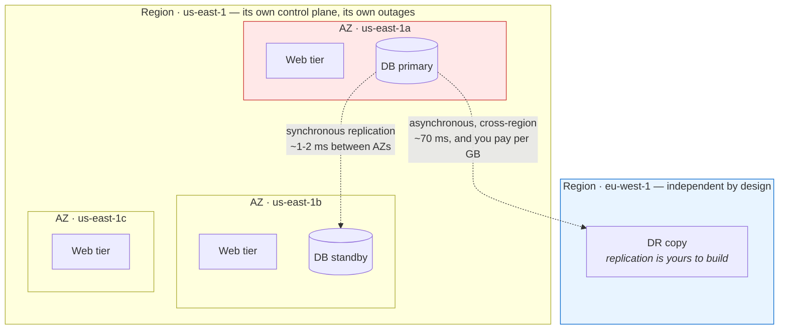
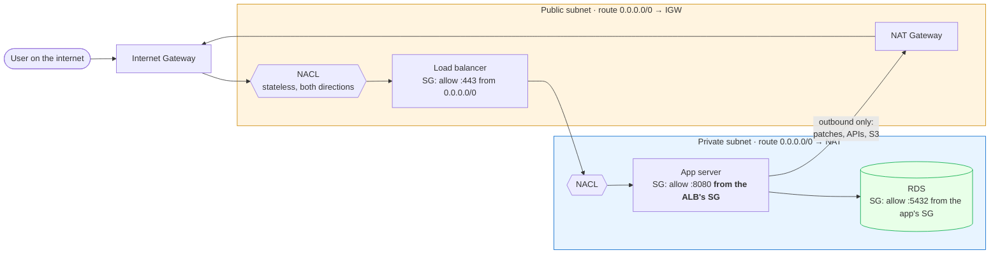
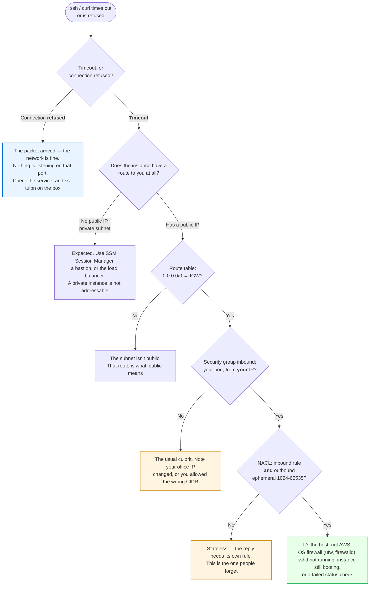
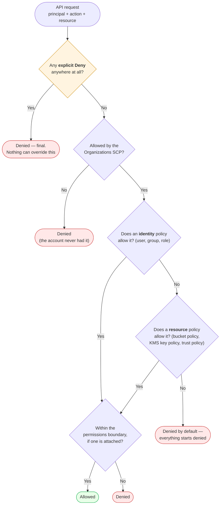
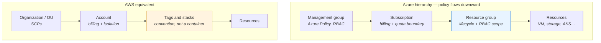

# Module 09: Cloud Fundamentals

> *"The cloud is just someone else's computer — but understanding HOW it works is what separates a DevOps engineer from everyone else."*

---

>**Command reference**: [`cheatsheet.md`](./cheatsheet.md) — every command in this module, grouped by task, with the gotchas.
>
>**Cross-module lookup**: [Quick Reference](../QUICK-REFERENCE.md)

---

## Why This Module Matters

Every DevOps role requires cloud knowledge. Whether it's AWS, GCP, or Azure, the **concepts are the same** — compute, storage, networking, IAM, and managed services. This module teaches cloud-agnostic fundamentals first, then maps them to AWS (the market leader).

**In real-world DevOps work**, you will:

- Provision virtual machines, networks, and storage in the cloud
- Configure IAM roles, policies, and security groups
- Deploy applications to cloud compute services
- Manage DNS, load balancers, and CDNs
- Understand cloud billing and cost optimization
- Design for high availability and disaster recovery

---

## Table of Contents

1. [Cloud Computing Fundamentals](#1-cloud-computing-fundamentals)
2. [Cloud Service Models](#2-cloud-service-models)
3. [AWS Core Services](#3-aws-core-services)
4. [Compute — EC2](#4-compute--ec2)
5. [Networking — VPC](#5-networking--vpc)
6. [Storage — S3, EBS, EFS](#6-storage--s3-ebs-efs)
7. [Identity & Access Management (IAM)](#7-identity--access-management-iam)
8. [DNS & Load Balancing](#8-dns--load-balancing)
9. [Managed Services Overview](#9-managed-services-overview)
10. [Cost Management and FinOps](#10-cost-management-and-finops)
11. [Azure — The Same Concepts, Different Nouns](#11-azure--the-same-concepts-different-nouns)
12. [Common Mistakes and Anti-Patterns](#12-common-mistakes-and-anti-patterns)
13. [Interview Insights](#13-interview-insights)

---

## 1. Cloud Computing Fundamentals

### What Is Cloud Computing?

```
Traditional (On-Premise):
  Buy servers → Rack them → Cable them → Install OS → Wait 6 weeks
  You own and maintain EVERYTHING.

Cloud Computing:
  Click a button → Server ready in 60 seconds → Pay per hour
  Someone else owns the hardware. You rent what you need.
```

### Five Characteristics of Cloud (NIST Definition)

```
1. ON-DEMAND SELF-SERVICE
   Provision resources without human interaction (API/console)

2. BROAD NETWORK ACCESS
   Access from anywhere over the internet

3. RESOURCE POOLING
   Provider's resources shared across many customers (multi-tenant)

4. RAPID ELASTICITY
   Scale up/down instantly based on demand

5. MEASURED SERVICE
   Pay only for what you use (metered billing)
```

### Cloud Providers Market Share

```
┌──────────────────────────────────────────────┐
│  AWS          ████████████████████  ~31%      │
│  Azure        ████████████████     ~25%      │
│  Google Cloud ████████████         ~12%      │
│  Alibaba      ██████               ~4%      │
│  Others       ██████████████████   ~28%      │
└──────────────────────────────────────────────┘
```

>**Why we focus on AWS:** Largest market share, most job listings, and concepts transfer directly to Azure/GCP.

---

## 2. Cloud Service Models

```
┌────────────────────────────────────────────────────────────┐
│                    YOU MANAGE ↑ / PROVIDER MANAGES ↓        │
├──────────────┬───────────────┬──────────────┬──────────────┤
│  On-Premise  │     IaaS      │    PaaS      │    SaaS      │
├──────────────┼───────────────┼──────────────┼──────────────┤
│ Applications │ Applications  │ Applications │              │
│ Data         │ Data          │ Data         │              │
│ Runtime      │ Runtime       │              │              │
│ Middleware   │ Middleware    │              │    Provider   │
│ OS           │ OS            │   Provider   │    manages   │
│ Virtualize   │               │   manages    │   EVERYTHING │
│ Servers      │   Provider    │   these      │              │
│ Storage      │   manages     │              │              │
│ Networking   │   these       │              │              │
└──────────────┴───────────────┴──────────────┴──────────────┘
```

| Model | What You Get | AWS Example | When to Use |
|-------|-------------|-------------|-------------|
| **IaaS** | Virtual machines, networks, storage | EC2, VPC, S3 | Full control needed, custom apps |
| **PaaS** | Runtime environment, auto-scaling | Elastic Beanstalk, Lambda | Deploy code, don't manage servers |
| **SaaS** | Ready-to-use application | Gmail, Slack, Salesforce | End-user tools |

### Deployment Models

```
PUBLIC CLOUD:   AWS, Azure, GCP — shared infrastructure, pay-per-use
PRIVATE CLOUD:  Your own data center with cloud-like features (OpenStack)
HYBRID CLOUD:   Mix of on-premise + public cloud (most enterprises)
MULTI-CLOUD:    Using multiple providers (AWS + GCP for redundancy)
```

---

## 3. AWS Core Services

### The Services That Matter for DevOps

```
┌─────────────────────────────────────────────────────────┐
│                    AWS SERVICE MAP                        │
├──────────┬──────────────────────────────────────────────┤
│ COMPUTE  │ EC2, Lambda, ECS, EKS                        │
│ STORAGE  │ S3, EBS, EFS                                 │
│ DATABASE │ RDS, DynamoDB, ElastiCache                    │
│ NETWORK  │ VPC, Route 53, CloudFront, ELB               │
│ SECURITY │ IAM, KMS, Security Groups, WAF               │
│ MONITOR  │ CloudWatch, CloudTrail, X-Ray                 │
│ CI/CD    │ CodePipeline, CodeBuild, CodeDeploy           │
│ IaC      │ CloudFormation (→ we use Terraform instead)   │
│ CONTAIN  │ ECR, ECS, EKS (→ covered in K8s module)      │
└──────────┴──────────────────────────────────────────────┘
```

### AWS Global Infrastructure

```
REGIONS (30+):
  Geographically isolated areas (us-east-1, eu-west-1, ap-south-1)
  Each region is fully independent.

AVAILABILITY ZONES (90+):
  2-6 data centers per region, connected by low-latency links.
  Deploy across AZs for high availability.

EDGE LOCATIONS (400+):
  CDN/caching points for CloudFront (content delivery).

  Region: us-east-1 (N. Virginia)
  ├── AZ: us-east-1a
  ├── AZ: us-east-1b
  ├── AZ: us-east-1c
  ├── AZ: us-east-1d
  ├── AZ: us-east-1e
  └── AZ: us-east-1f
```

The hierarchy only matters because of what it means when a piece of it fails. This is a blast radius diagram, not an org chart:



**Read the red box as "this AZ is gone".** With the layout above you lose a third of the web tier and fail the database over to `us-east-1b` — a blip. With everything in `us-east-1a`, which is the default a beginner builds, you lose the application entirely.

| Failure | What survives | What it costs you to be ready |
|---------|---------------|-------------------------------|
| One instance | Everything, if the tier is behind a load balancer with health checks | Nothing — this is table stakes |
| One AZ | Everything, if each tier spans ≥2 AZs | Roughly 2× the instances and a cross-AZ data transfer bill |
| A whole region | Only what you replicated somewhere else | A second environment, cross-region replication, and a tested failover plan |

 **Multi-AZ is a normal architecture; multi-region is a project.** Regions share nothing on purpose — no automatic replication, no shared VPC, separate service quotas, and even IAM's global endpoints have regional failure characteristics. Treat "go multi-region" as a quarter of work with an ongoing bill, not a checkbox, and be able to say which of RTO or RPO is forcing it (Module 14 §9).

---

## 4. Compute — EC2

### What is EC2?

**Elastic Compute Cloud** — virtual servers (instances) in the cloud. You choose the OS, size, and configuration.

### Instance Types

```
NAMING: m5.xlarge
         │ │  │
         │ │  └─ Size (nano → metal)
         │ └──── Generation (higher = newer)
         └────── Family (purpose)

FAMILIES:
  t3/t4g  — Burstable (web servers, dev/test)      Cheapest
  m5/m6i  — General purpose (balanced)               Default choice
  c5/c6i  — Compute optimized (CPU-heavy)           Processing
  r5/r6i  — Memory optimized (databases, caching)   RAM-heavy
  g5      — GPU (ML, video encoding)                 Specialized
```

### Key Concepts

```
AMI (Amazon Machine Image):
  Template for the instance — OS + preinstalled software.
  Like a Docker image but for entire VMs.
  Common: Amazon Linux 2023, Ubuntu 22.04

Key Pairs:
  SSH access to instances. Create once, use for many instances.
  NEVER lose your private key — no recovery!

Security Groups:
  Virtual firewall for instances. Controls inbound/outbound traffic.
  Default: all inbound BLOCKED, all outbound ALLOWED.

Elastic IP:
  Static public IP that persists across instance stop/start.
  Free when attached to a running instance.
```

### EC2 Pricing Models

| Model | Discount | Commitment | Use Case |
|-------|----------|-----------|----------|
| **On-Demand** | None (full price) | None | Dev/test, unpredictable workloads |
| **Reserved** | Up to 72% | 1 or 3 years | Production, steady-state workloads |
| **Spot** | Up to 90% | None (can be interrupted) | Batch processing, CI/CD runners |
| **Savings Plans** | Up to 72% | $/hour commitment | Flexible reserved pricing |

---

## 5. Networking — VPC

### What is a VPC?

**Virtual Private Cloud** — your own isolated network in AWS. You control the IP ranges, subnets, routing, and security.

### VPC Architecture

```
┌─────────────────── VPC (10.0.0.0/16) ──────────────────┐
│                                                          │
│  ┌──── AZ: us-east-1a ────┐  ┌──── AZ: us-east-1b ────┐│
│  │                         │  │                         ││
│  │  ┌─ Public Subnet ──┐  │  │  ┌─ Public Subnet ──┐  ││
│  │  │  10.0.1.0/24     │  │  │  │  10.0.2.0/24     │  ││
│  │  │  • Web Server    │  │  │  │  • Web Server    │  ││
│  │  │  • NAT Gateway   │  │  │  │  • Load Balancer │  ││
│  │  └──────────────────┘  │  │  └──────────────────┘  ││
│  │                         │  │                         ││
│  │  ┌─ Private Subnet ─┐  │  │  ┌─ Private Subnet ─┐  ││
│  │  │  10.0.3.0/24     │  │  │  │  10.0.4.0/24     │  ││
│  │  │  • App Server    │  │  │  │  • App Server    │  ││
│  │  │  • Database      │  │  │  │  • Database      │  ││
│  │  └──────────────────┘  │  │  └──────────────────┘  ││
│  └─────────────────────────┘  └─────────────────────────┘│
│                                                          │
│  Internet Gateway ──── Route Tables ──── NAT Gateway     │
└──────────────────────────────────────────────────────────┘
```

That is the layout. What you actually debug is the **path a packet takes** and the four things that can stop it:



**What each layer is actually for**, in the order a packet meets them:

| Layer | Scope | Stateful? | The mistake people make |
|-------|-------|-----------|-------------------------|
| **Route table** | Subnet | n/a | A subnet is "public" *only* because its route table points `0.0.0.0/0` at an IGW — nothing else makes it public |
| **NACL** | Subnet |  **Stateless** | Allowing inbound `:443` and forgetting the outbound ephemeral range `1024-65535`, so replies are dropped |
| **Security group** | ENI (instance) |  Stateful | Opening `0.0.0.0/0` instead of referencing the *source SG* — SGs can reference each other, and that's the whole point |
| **Public IP** | Instance | n/a | A private instance has no public IP and never will; reaching it means a bastion, SSM, or the load balancer |

 **The NAT Gateway is one-way and that is deliberate.** It lets private instances fetch patches and call APIs; it gives nobody a path in. It is also billed per hour *and* per GB processed, which is why "why is our NAT bill £400?" is usually an S3 download loop that should have gone through a VPC endpoint instead.

 **Security groups are stateful, NACLs are not.** If you allow something inbound on an SG, the reply is automatically allowed out. Do the same on a NACL and the reply is dropped unless you wrote a second rule for it. Reach for SGs by default and leave NACLs at their permissive default until you have a specific reason — most "the VPC is broken" incidents are a hand-edited NACL.

### Key Components

```
SUBNET:
  A segment of the VPC's IP range. Exists in ONE Availability Zone.
  Public subnet  → has route to Internet Gateway (internet access)
  Private subnet → NO direct internet (uses NAT Gateway for outbound)

INTERNET GATEWAY (IGW):
  Allows resources in PUBLIC subnets to reach the internet.

NAT GATEWAY:
  Allows resources in PRIVATE subnets to reach the internet
  (outbound only — no inbound from internet).

ROUTE TABLE:
  Rules that determine where network traffic goes.
  Public RT:  0.0.0.0/0 → Internet Gateway
  Private RT: 0.0.0.0/0 → NAT Gateway

SECURITY GROUP:
  Stateful firewall at the instance level.
  If you allow inbound, the response is automatically allowed out.

NACL (Network ACL):
  Stateless firewall at the subnet level. Second layer of defense.
```

### Troubleshooting: "I Can't Reach My Instance"

The most common cloud ticket there is, and the layers are checked in a fixed order because each one is cheaper to rule out than the next:



 **Split on the error message first.** "Connection refused" means your packet reached the machine and something answered — the entire network half of this tree is already ruled out, so anyone who starts editing security groups is debugging the wrong layer. "Timeout" means nothing came back, which is when route tables, SGs and NACLs are in scope.

**Two AWS tools make this near-instant** once you know they exist: the **VPC Reachability Analyzer** tests a source-to-destination path and names the exact component that blocks it, and **VPC Flow Logs** show whether the packet arrived and was `REJECT`ed (a rule) or never appeared at all (routing). Reach for those before hand-inspecting rules.

---

## 6. Storage — S3, EBS, EFS

### Storage Types Compared

| Service | Type | Analogy | Use Case |
|---------|------|---------|----------|
| **S3** | Object storage | Google Drive | Static files, backups, logs, data lakes |
| **EBS** | Block storage | Hard drive | Attached to EC2 — databases, OS disk |
| **EFS** | File storage | NFS share | Shared across multiple EC2 instances |

### S3 (Simple Storage Service)

```
S3 CONCEPTS:
  Bucket:  Top-level container (globally unique name)
  Object:  File + metadata (key-value)
  Key:     Object path (e.g., "images/logo.png")

STORAGE CLASSES (cost vs access speed):
  Standard         → Frequent access         
  Standard-IA      → Infrequent access       
  Glacier Instant  → Archive, instant access  
  Glacier Deep     → Long-term archive        

VERSIONING:
  Keep all versions of an object. Protects against accidental deletion.

LIFECYCLE POLICIES:
  Auto-move objects to cheaper storage after N days.
  Example: Move to IA after 30 days, Glacier after 90, delete after 365.
```

---

## 7. Identity & Access Management (IAM)

### The Most Important AWS Service

>IAM misconfigurations are the #1 cause of cloud security breaches.

```
IAM ENTITIES:
  USER:   A person (dev, admin) with long-term credentials
  GROUP:  Collection of users (developers, admins, readonly)
  ROLE:   Temporary credentials for services (EC2 → S3 access)
  POLICY: JSON document defining permissions

GOLDEN RULE: LEAST PRIVILEGE
  Grant only the minimum permissions needed. Never use root for daily work.
```

### How a Request Is Evaluated

Every API call runs this gauntlet. Memorise the shape — it is the most-asked IAM interview question, and it is also how you debug an `AccessDenied` without guessing:



**Three rules do all the work here:**

1. **Default deny.** No policy anywhere means denied. There is no "unset" that leaks access.
2. **Explicit deny always wins.** An `Effect: Deny` in *any* applicable policy ends the evaluation — you cannot out-allow it from another policy, and this is what makes a guardrail SCP trustworthy.
3. **Identity *or* resource policy is enough** (within the same account). This is why an S3 bucket policy can grant access to a role that has no S3 permissions of its own — and why auditing only IAM roles misses half of your real access graph.

>**Debugging `AccessDenied` in order**: read the error — it names the action and often the policy type. Then `aws sts get-caller-identity` to confirm *who* you actually are (usually the surprise), then the IAM Policy Simulator, then check for an SCP if the account is in an Organization. Ninety percent of the time it is a role you did not think you were using.

### IAM Policy Anatomy

```json
{
  "Version": "2012-10-17",
  "Statement": [
    {
      "Sid": "AllowS3ReadOnly",
      "Effect": "Allow",
      "Action": [
        "s3:GetObject",
        "s3:ListBucket"
      ],
      "Resource": [
        "arn:aws:s3:::my-bucket",
        "arn:aws:s3:::my-bucket/*"
      ]
    }
  ]
}
```

### IAM Best Practices

```
 Enable MFA on root account and all human users
 Use ROLES for services (not access keys)
 Use GROUPS to manage permissions (not individual users)
 Use AWS Organizations for multi-account strategy
 Rotate access keys regularly
 Use IAM Access Analyzer to find unused permissions
 NEVER use the root account for daily work
 NEVER put access keys in code or git
 NEVER use wildcard (*) permissions in production
```

---

## 8. DNS & Load Balancing

### Route 53 (DNS)

```
RECORD TYPES:
  A      → Domain → IPv4 address (example.com → 93.184.216.34)
  AAAA   → Domain → IPv6 address
  CNAME  → Domain → another domain (www.example.com → example.com)
  ALIAS  → Domain → AWS resource (example.com → ALB DNS name)

ROUTING POLICIES:
  Simple       → One destination
  Weighted     → Split traffic (80% v1, 20% v2) — canary deploys!
  Latency      → Route to lowest-latency region
  Failover     → Primary/secondary (disaster recovery)
  Geolocation  → Route by user's location
```

### Elastic Load Balancer (ELB)

```
                   Internet
                      │
               ┌──────▼──────┐
               │ Load Balancer│  ← Distributes traffic
               └──┬───┬───┬──┘
                  │   │   │
            ┌─────▼┐ ┌▼───┐ ┌▼─────┐
            │EC2 a │ │EC2 b│ │EC2 c │
            └──────┘ └─────┘ └──────┘

TYPES:
  ALB (Application LB) → HTTP/HTTPS, path-based routing   ← Most common
  NLB (Network LB)     → TCP/UDP, ultra-low latency
  CLB (Classic LB)     → Legacy, don't use for new projects
```

---

## 9. Managed Services Overview

### Why Managed Services?

```
SELF-MANAGED (EC2 + install MySQL):
   Full control
   You handle: patching, backups, replication, failover, scaling

MANAGED (RDS for MySQL):
   Auto: patching, backups, replication, failover, scaling
   Less control, slightly higher cost
   You focus on your application, not database operations
```

| Self-Managed | Managed Service | Benefit |
|-------------|-----------------|---------|
| MySQL on EC2 | RDS | Auto backups, multi-AZ, read replicas |
| Redis on EC2 | ElastiCache | Auto failover, scaling |
| Kubernetes on EC2 | EKS | Managed control plane |
| Docker on EC2 | ECS/Fargate | No server management |
| Jenkins on EC2 | CodePipeline | No CI/CD server to maintain |

>**DevOps principle:** Use managed services when possible. Your job is to deliver value, not babysit databases.

### Serverless — When DevOps Engineers Encounter Lambda

Serverless (AWS Lambda, Azure Functions, GCP Cloud Functions) runs code **without any server to manage** — no OS, no patching, no scaling configuration. You pay only when your code executes.

```
WHEN DEVOPS ENGINEERS USE LAMBDA:
   Scheduled tasks       — rotate secrets, clean up old snapshots, run reports
   Webhook handlers      — receive GitHub/Slack webhooks, trigger pipelines
   Event-driven ops      — process S3 upload → resize image → store result
   Custom CI/CD steps    — Lambda-backed custom actions or post-deploy hooks
   CloudWatch alarms     — trigger Lambda to auto-remediate (restart service, scale)
   Lightweight APIs      — internal tooling endpoints (status page, health aggregator)

WHEN TO USE CONTAINERS INSTEAD:
   Long-running processes (Lambda timeout: 15 min max)
   Consistent, high-traffic workloads (containers are cheaper at scale)
   Complex multi-service applications (use ECS/EKS)
   Workloads needing persistent connections (WebSockets, databases)
```

```
Lambda mental model for DevOps:
  Traditional:  Server always running → you pay 24/7 → you patch it
  Lambda:       Code runs on trigger → you pay per invocation → AWS patches it

  EXAMPLE: S3 backup cleanup
    EventBridge (cron: daily) → Lambda → delete S3 objects older than 90 days
    Cost: ~$0.01/month vs running an EC2 instance 24/7
```

>**You don't need to be a Lambda developer**, but you need to understand when serverless is the right tool for operational automation tasks. Many DevOps teams use Lambda for "glue" code between services.

---

## 10. Cost Management and FinOps

### Cost Optimization Strategies

```
1. RIGHT-SIZING
   Don't use m5.2xlarge when t3.medium is enough.
   Use CloudWatch metrics to check actual CPU/memory usage.

2. RESERVED / SAVINGS PLANS
   Commit for 1-3 years for steady workloads → up to 72% savings.

3. SPOT INSTANCES
   Use for fault-tolerant workloads → up to 90% savings.
   CI/CD runners, batch jobs, dev environments.

4. CLEANUP
   Delete unused resources: unattached EBS volumes, old snapshots,
   idle EC2 instances, orphaned Elastic IPs.

5. S3 LIFECYCLE POLICIES
   Move old data to cheaper storage classes automatically.

6. AUTO SCALING
   Scale down during low-traffic periods (nights, weekends).
```

### Key Tools

```
AWS Cost Explorer     → Visualize spending trends
AWS Budgets           → Set alerts when spending exceeds threshold
AWS Trusted Advisor   → Recommendations for cost, security, performance
Billing Dashboard     → Monthly cost breakdown by service
```

### FinOps — Cost as an Engineering Metric

The list above is a set of *tactics*. FinOps is the practice of making them happen continuously, by treating spend the same way you treat latency: measured, attributed to an owner, and reviewed. The cloud moved cost from a procurement decision made yearly to an engineering decision made on every pull request, and nobody in that loop is a finance person.

```
THE FINOPS LOOP
  1. INFORM    Everyone can see what their own thing costs.
               No allocation → no accountability → no change.
  2. OPTIMIZE  Rightsize, commit, tier, delete. The tactics above.
  3. OPERATE   Budgets, anomaly alerts, cost in the definition of done,
               and a monthly review that has an owner.
```

> ** DevOps Impact**: the single highest-leverage step is step 1. An engineer who can see that their staging environment costs £400/month will usually fix it that week; a central team asking them to "reduce cloud spend" achieves nothing, because the person who can act cannot see the number.

### Allocation: Tag or Guess

You cannot attribute cost without tags, and tags applied after the fact never get applied. Enforce them at creation:

| Tag | Answers | Enforced by |
|-----|---------|-------------|
| `owner` / `team` | Who do I ask about this? | Terraform `default_tags` + a policy that blocks untagged creation |
| `env` | Is this production, or a lab someone forgot? | Same |
| `service` | Which service's unit cost does this belong to? | Same |
| `cost-center` | Which budget does this land in? | Same |

```hcl
# Set it once per provider and every resource inherits it
provider "aws" {
  region = var.region
  default_tags {
    tags = {
      env        = var.environment
      team       = var.team
      service    = var.service
      managed-by = "terraform"          #  instantly separates IaC from console clicks
    }
  }
}
```

Then measure **allocation coverage** — the share of spend that lands in a tagged bucket. Below about 90% your reports are fiction, and untagged spend is where the waste hides.

### Unit Economics

Total spend is almost useless as a signal: it goes up when the business grows, which is fine, and it goes up when you get less efficient, which is not. The number that separates the two is **cost per unit of work**:

```
cost per 1,000 requests        cost per active customer per month
cost per build minute          cost per GB ingested into logs
cost per tenant                cost per completed order
```

A doubling of spend alongside a falling cost-per-order is a success. Flat spend with a rising cost-per-order is a regression you would otherwise never notice. Pick one unit that matches how your service is used, put it on a dashboard next to latency, and it becomes an engineering metric rather than a finance complaint.

### Commitments, Without Getting Trapped

Discounts come from promising to spend. The trap is promising for capacity you later re-architect away:

| Instrument | Discount | Risk |
|-----------|---------:|------|
| On-demand | 0% | None — the baseline you measure against |
| Savings Plans / flexible commitments | ~30–50% | You are committed for 1–3 years, even if you move to containers or serverless |
| Reserved Instances (specific) | ~40–60% | Highest discount, least flexible — tied to family and region |
| Spot | ~70–90% |  Interruptible with ~2 minutes' notice. Excellent for CI runners, batch, dev; wrong for a database primary |

The sane pattern: cover your **verified steady-state floor** with flexible commitments (usually 60–80% of baseline, not 100%), run bursty and fault-tolerant work on spot, and leave headroom on demand. Commit to the floor you have measured over months, never to a forecast.

### Operating It

```bash
# Where did the money go? Group by tag, not by service, once tagging is in place
aws ce get-cost-and-usage --time-period Start=2026-07-01,End=2026-08-01 \
  --granularity MONTHLY --metrics UnblendedCost \
  --group-by Type=TAG,Key=service

# Untagged spend — the number to drive toward zero
aws ce get-cost-and-usage --time-period Start=2026-07-01,End=2026-08-01 \
  --granularity MONTHLY --metrics UnblendedCost \
  --filter '{"Tags":{"Key":"service","MatchOptions":["ABSENT"]}}'

# Commitment efficiency: unused commitment is money already spent
aws ce get-savings-plans-utilization --time-period Start=2026-07-01,End=2026-08-01

# The three that are almost always pure waste
aws ec2 describe-volumes --filters Name=status,Values=available   # unattached disks
aws ec2 describe-addresses --query 'Addresses[?AssociationId==null]'
aws logs describe-log-groups --query 'logGroups[?!retentionInDays].logGroupName'  # kept forever
```

Automate the parts humans forget: a **budget with an alert** per environment (not one for the whole account), **cost anomaly detection** so a 3× jump pages someone the same day rather than appearing on next month's invoice, **log and snapshot retention** set at creation, and a **scheduled shutdown** for non-production out of hours — an 8×5 dev environment costs roughly a quarter of a 24×7 one for identical work.

>**The interview answer**: "Cost is a non-functional requirement like latency. I'd start with allocation — enforced tags through Terraform `default_tags`, so every team sees its own bill — then pick one unit-cost metric like cost per thousand requests and track it next to the golden signals. Optimisation is the easy part; the hard part is that nobody acts on a number they can't see, and nobody notices efficiency regressions if you only watch total spend."

---

## 11. Azure — The Same Concepts, Different Nouns

Roughly a quarter of cloud job listings are Azure, and enterprises with a Microsoft estate are usually Azure-first. The good news is the one this module opened with: **the concepts transfer, the nouns do not.** You do not learn Azure from scratch — you learn a vocabulary and about five genuine differences.

### The Translation Table

| Concept | AWS | Azure |
|---------|-----|-------|
| Billing / isolation boundary | Account | **Subscription** |
| Grouping for policy across boundaries | Organizations + OUs | **Management groups** |
| Grouping of related resources | *(tags and stacks, informally)* |  **Resource group** — a real, mandatory container |
| Virtual machine | EC2 instance | Virtual Machine |
| Autoscaling group | ASG | Virtual Machine Scale Set (VMSS) |
| Object storage | S3 bucket | Blob Storage container |
| Block storage | EBS volume | Managed Disk |
| File share | EFS | Azure Files |
| Private network | VPC | **VNet** |
| Subnet firewall | NACL (stateless) | **NSG** (stateful, and applies to subnet *or* NIC) |
| Instance firewall | Security group | NSG, again — there is only one object |
| Identity and permissions | IAM users, roles, policies | **Entra ID** (identity) + **Azure RBAC** (permissions) — two systems |
| Workload identity, no secret | Instance profile / IRSA |  **Managed identity** |
| Managed Kubernetes | EKS | AKS |
| Serverless functions | Lambda | Azure Functions |
| Managed relational DB | RDS | Azure SQL / Database for PostgreSQL |
| Secret store | Secrets Manager / SSM | **Key Vault** (secrets, keys, and certificates in one) |
| Native IaC | CloudFormation | ARM JSON, authored as **Bicep** |
| Guardrails you cannot bypass | SCP | **Azure Policy** |
| Load balancer (L7) | ALB | Application Gateway / Front Door |
| CDN | CloudFront | Azure Front Door |
| Metrics and logs | CloudWatch | Azure Monitor + Log Analytics (KQL) |
| Audit trail | CloudTrail | Activity Log |

### The Five Differences That Actually Matter

**1. Resource groups are mandatory, and they are a lifecycle boundary.** Every resource lives in exactly one, and deleting the group deletes everything in it. There is no AWS equivalent — the closest is a CloudFormation stack, except every resource is in one whether you use IaC or not. Used well it is genuinely better than tag conventions: one group per application per environment gives you a real delete button and a natural RBAC scope. Used badly ("prod-rg" holding four hundred resources) it is just a folder.

**2. Identity is a separate product from permissions.** AWS puts users, roles, and policies in one service. Azure splits them: **Entra ID** (formerly Azure AD) answers *who you are* and is shared with Microsoft 365, while **Azure RBAC** answers *what you may do* on a subscription, resource group, or resource. The practical consequence is that a user can exist, log in fine, and have no access to anything — and that "add them to the directory" is a different task from "grant them a role".

**3. Managed identity removes the credential entirely.** Assign an identity to a VM, Function, or AKS pod, and it obtains tokens from the platform. No key, no rotation, nothing to leak. It is the same idea as an EC2 instance profile, but it is the *normal* way to do things in Azure rather than the good-practice way, and it is the single habit worth importing back into your AWS work.

**4. NSGs are stateful and can attach to a subnet or a NIC.** AWS gives you two objects with different semantics — stateless NACLs at the subnet, stateful security groups at the instance. Azure gives you one stateful object you may attach at either level. Simpler, with one trap: rules are evaluated by **priority number, lowest first, first match wins**, so a broad allow at priority 100 silently defeats your careful deny at 200.

**5. Azure Policy is enforcement, not advice.** It refuses non-compliant resources at deployment time — no public blob containers, no VMs without a tag, only these regions — and it can remediate existing ones. This is the SCP-equivalent, and it is the layer that makes a rule real rather than documented. [Lab 04](./labs/lab-04-azure-bicep.md) shows why: a template can pass every linter and still be wrong.



 **The isolation boundary is the difference to hold on to.** In AWS the strong boundary is the *account*, so mature setups run dozens of them. In Azure the subscription is the billing and quota boundary, and the resource group is the day-to-day one — so an Azure estate uses fewer subscriptions and leans on resource groups, RBAC scopes, and policy instead.

### Getting Hands-On Without a Subscription

```bash
# Bicep compiles and lints entirely offline — no account needed
az bicep build --file main.bicep      # → the ARM JSON Azure actually receives
az bicep lint --file main.bicep       # → rules you choose in bicepconfig.json

# Azurite is Microsoft's official storage emulator: real Blob/Queue/Table APIs
docker run -p 10000:10000 mcr.microsoft.com/azure-storage/azurite \
  azurite --blobHost 0.0.0.0 --skipApiVersionCheck

# Then the real CLI, pointed at it
az storage container create -n uploads
az storage blob upload -c uploads -f ./file.txt -n file.txt
```

Run it: [Lab 04 — Azure: Bicep Templates and Storage, Without a Subscription](./labs/lab-04-azure-bicep.md). It gates a template in CI, finds three insecure settings the linter is happy with, and demonstrates anonymous blob access and the SAS token that replaces it — all offline.

>**The interview answer** when asked whether you know Azure, having worked in AWS: name the mapping and then name a real difference. "The primitives are the same — VNet for VPC, Blob for S3, Entra ID plus RBAC where AWS has IAM. What I'd have to adjust to is that resource groups are a real lifecycle boundary rather than a tagging convention, that identity and authorisation are two separate systems, and that managed identity means most workloads never hold a credential at all." That answer is worth more than a memorised service list, because it shows you know which knowledge transfers.

---

## 12. Common Mistakes and Anti-Patterns

### Using Root Account for Daily Work

```
BAD:  Login as root → full access to everything → one mistake = disaster
GOOD: Create IAM users with limited permissions, enable MFA on root
```

### Public S3 Buckets

```
BAD:  S3 bucket with public access → data breach headline
GOOD: Block public access by default, use presigned URLs for temporary access
```

### Single AZ Deployment

```
BAD:  Everything in one AZ → AZ goes down → total outage
GOOD: Deploy across 2+ AZs with a load balancer
```

### Hardcoded Credentials

```
BAD:  Access keys in code, environment variables, or config files
GOOD: Use IAM roles for EC2/Lambda/ECS — no credentials to manage
```

---

## 13. Interview Insights

**Q: What's the difference between IaaS, PaaS, and SaaS?**
> IaaS gives you virtual infrastructure (compute, storage, network) — you manage the OS and everything above. PaaS gives you a platform to deploy code — the provider manages the OS and runtime. SaaS is a complete application you use as-is. AWS EC2 is IaaS, Elastic Beanstalk is PaaS, Gmail is SaaS.

**Q: Explain the difference between a public and private subnet.**
> A public subnet has a route to an Internet Gateway, so resources can be reached from the internet (with a public IP). A private subnet has no direct internet route — resources can reach the internet through a NAT Gateway for outbound traffic only. Databases and app servers go in private subnets; load balancers go in public subnets.

**Q: What is the principle of least privilege?**
> Grant only the minimum permissions required to perform a task. An EC2 instance running a web app should have permission to read from S3 and write to CloudWatch — nothing else. This limits the blast radius if credentials are compromised.

**Q: How do you design for high availability in AWS?**
> Deploy across multiple Availability Zones. Use an Application Load Balancer to distribute traffic. Use Auto Scaling Groups to replace failed instances. Use RDS Multi-AZ for database failover. Use S3 for durable storage (99.999999999% durability). Design every component to handle the failure of one AZ.

**Q: What's the difference between Security Groups and NACLs?**
> Security Groups are stateful firewalls at the instance level — if inbound is allowed, outbound response is auto-allowed. NACLs are stateless firewalls at the subnet level — you must explicitly allow both inbound and outbound. Security Groups are your primary tool; NACLs are a second defense layer.

**Q: How do you manage costs in AWS?**
> Right-size instances using CloudWatch metrics. Use Reserved Instances or Savings Plans for steady workloads. Use Spot Instances for fault-tolerant jobs. Set up AWS Budgets for alerts. Clean up unused resources regularly. Use S3 lifecycle policies for storage optimization. Tag everything for cost allocation.

---

## Labs and Projects

Read the sections above first, then work through these **in order**. Every lab ends with a  **Break It** section — those are not optional; they are where the debugging skill actually comes from.

| # | Lab | What you'll do |
|---|-----|----------------|
| 1 | **[AWS Fundamentals](./labs/lab-01-aws-fundamentals.md)** | Get hands-on with the four foundational AWS services. |
| 2 | **[IAM and Least Privilege](./labs/lab-02-iam-least-privilege.md)** | Write IAM policies that grant exactly what's needed and nothing more — and, more importantly, learn to **test** them before they reach production. |
| 3 | **[FinOps](./labs/lab-03-finops-cost-review.md)** | Do a cost review the way it should happen: on the plan, before apply, with a number attributable to a team. |
| 4 | **[Azure](./labs/lab-04-azure-bicep.md)** | Work with real Azure tooling on a second cloud: author a Bicep template, gate it in CI with a linter that fails the build, compile it to the ARM… |

**Portfolio project:**

- [Project: Small Cloud Environment Walkthrough](./projects/project-01-small-cloud-environment.md) — Create a minimal cloud environment and document the core building blocks: network, compute, access control, security boundary, validation, cost, and…

**Reference code** for every lab: [`code/`](./code/) — real files, validated in CI.

---

## Self-Check

Answer these from memory before you expand them. If more than two give you trouble, re-read the sections they come from — the labs assume this material is solid.

<details>
<summary><strong>1. Under the shared responsibility model, who patches what in IaaS, PaaS, and SaaS?</strong></summary>

IaaS: you own the OS and everything above it. PaaS: you own your application and its configuration. SaaS: you own your data and who can reach it. The provider secures the cloud; you are always responsible for what you put in it and for the access you grant.

</details>

<details>
<summary><strong>2. What actually makes a subnet public or private?</strong></summary>

The route table. A public subnet has a route to an internet gateway; a private one sends egress through a NAT gateway or has no path out at all. Nothing about the subnet's own definition is public or private — and an instance in a public subnet without a public IP still cannot be reached.

</details>

<details>
<summary><strong>3. Security group versus NACL?</strong></summary>

A security group is stateful, attaches to an interface, and holds allow rules only — return traffic is automatic. A NACL is stateless and subnet-wide, supports deny rules, and needs both directions written out. Forgetting the return rule on a NACL is a classic silent-timeout cause.

</details>

<details>
<summary><strong>4. Why prefer an IAM role over an access key?</strong></summary>

A role hands a workload short-lived credentials that rotate automatically and cannot be copied into a laptop or a repository. Long-lived keys leak, stay valid indefinitely, and are the root cause of a large share of cloud breaches. Use instance profiles for compute and OIDC federation for CI.

</details>

<details>
<summary><strong>5. S3, EBS, or EFS?</strong></summary>

S3 is object storage over HTTP: unlimited scale, versioning, lifecycle rules, and not a filesystem. EBS is a block volume attached to one instance in one availability zone. EFS is a managed NFS filesystem several instances can share, at several times the price per gigabyte. Most "we need shared storage" turns out to be S3.

</details>

<details>
<summary><strong>6. Where do surprise cloud bills come from on a learning account?</strong></summary>

Resources you forgot: an idle NAT gateway, unattached elastic IPs and volumes, orphaned snapshots, a load balancer with no targets. Then data transfer — cross-AZ and egress — which no one estimates. Tag everything, set a budget alert on day one, and run the destroy step of every lab.

</details>

<details>
<summary><strong>7. Spend doubled this quarter. What do you look at before touching a single instance size?</strong></summary>

Allocation and unit cost. Total spend rising is meaningless on its own — it goes up when the business grows and when you get less efficient, and only cost per unit of work (per 1,000 requests, per order, per tenant) separates the two. Which requires enforced tags: `owner`, `env`, `service`, applied at creation via Terraform `default_tags`, because tags added later never get added. Nobody fixes a number they cannot see, which is why "inform" is the first phase of the FinOps loop and rightsizing is the last.

</details>

---

## Practical Checkpoint

Before moving on, you should be able to:

- Explain core cloud building blocks: compute, networking, IAM, storage, and regions.
- Create a small environment and validate reachability, access, and security boundaries.
- Clean up resources and reason about cost before leaving a lab.

Portfolio evidence to keep:

- Architecture notes for the cloud lab.
- Validation output for network and instance access.
- Cleanup proof and cost notes.

Suggested project: [Small Cloud Environment Walkthrough](./projects/project-01-small-cloud-environment.md)

---

## What's Next?

With cloud fundamentals understood, you're ready to automate cloud infrastructure using code — Infrastructure as Code with Terraform.

**[Module 10: Terraform →](../10-terraform/)**

---

<div align="center">

**Module 09 Complete** 

[← Back to Logging](../08-logging/) | [ Cheat Sheet](./cheatsheet.md) | [Next: Terraform →](../10-terraform/)

</div>


## Reference
<!-- tab: Cheatsheet -->
> AWS CLI reference by service, plus IAM policy patterns and cost controls. Concepts live in the [module README](./README.md).
> Cross-module daily commands: **[QUICK-REFERENCE.md](../QUICK-REFERENCE.md)**

**Jump to:** [CLI setup](#cli-setup--profiles) · [EC2](#ec2) · [VPC](#vpc--networking) · [S3](#s3) · [IAM](#iam) · [RDS](#rds) · [ELB & Route 53](#load-balancing--dns) · [ECS & EKS](#containers-ecr-ecs-eks) · [Lambda](#lambda) · [Logs & monitoring](#cloudwatch) · [Cost](#cost-control) · [Query patterns](#query-patterns) · [Equivalents](#cross-cloud-equivalents)

---

## CLI Setup & Profiles

```bash
aws configure                                  # interactive; writes ~/.aws/credentials
aws configure --profile prod
aws configure list
aws configure list-profiles

export AWS_PROFILE=prod                        #  set once per shell
export AWS_REGION=us-east-1
aws sts get-caller-identity                    #  ALWAYS run this first: WHO am I, WHICH account?
```

```ini
# ~/.aws/config — prefer SSO or role assumption over static keys
[profile prod]
region = us-east-1
output = json

[profile prod-admin]
role_arn = arn:aws:iam::123456789012:role/Admin
source_profile = prod
mfa_serial = arn:aws:iam::123456789012:mfa/alice

[profile sso-prod]
sso_start_url = https://myorg.awsapps.com/start
sso_region = us-east-1
sso_account_id = 123456789012
sso_role_name = PowerUserAccess
```

```bash
aws sso login --profile sso-prod
aws --profile prod-admin s3 ls                 # per-command profile
aws --region eu-west-1 ec2 describe-instances  # per-command region

aws --output json|table|text|yaml ...
aws --dry-run ec2 run-instances ...            #  permission check without side effects
aws --debug ...                                # full request/response trace
aws ... --no-cli-pager                         # stop it opening less
```

>**Before every destructive command, run `aws sts get-caller-identity`.** Running the right command in the wrong account is the most expensive mistake in cloud ops. Consider a shell prompt that shows `$AWS_PROFILE`.

---

## EC2

```bash
aws ec2 describe-instances
aws ec2 describe-instances --instance-ids i-0abc123
aws ec2 describe-instances --filters "Name=tag:Environment,Values=prod" \
                                     "Name=instance-state-name,Values=running"

#  Readable inventory
aws ec2 describe-instances --query \
 'Reservations[].Instances[].{ID:InstanceId,Type:InstanceType,State:State.Name,IP:PrivateIpAddress,Name:Tags[?Key==`Name`]|[0].Value}' \
 --output table

aws ec2 start-instances    --instance-ids i-0abc123
aws ec2 stop-instances     --instance-ids i-0abc123
aws ec2 reboot-instances   --instance-ids i-0abc123
aws ec2 terminate-instances --instance-ids i-0abc123        #  irreversible

aws ec2 run-instances \
  --image-id ami-0c55b159cbfafe1f0 \
  --instance-type t3.micro \
  --key-name my-key \
  --security-group-ids sg-0abc123 \
  --subnet-id subnet-0abc123 \
  --iam-instance-profile Name=AppRole \
  --metadata-options "HttpTokens=required" \
  --tag-specifications 'ResourceType=instance,Tags=[{Key=Name,Value=web-01},{Key=Environment,Value=prod}]'

aws ec2 describe-instance-status --instance-ids i-0abc123
aws ec2 get-console-output --instance-id i-0abc123          #  boot log when SSH fails
aws ec2 describe-images --owners amazon \
  --filters "Name=name,Values=al2023-ami-*-x86_64" \
  --query 'sort_by(Images,&CreationDate)[-1].ImageId' --output text

# Session Manager — SSH without open port 22 or a bastion
aws ssm start-session --target i-0abc123
aws ssm start-session --target i-0abc123 \
  --document-name AWS-StartPortForwardingSession \
  --parameters '{"portNumber":["5432"],"localPortNumber":["5432"]}'

# Volumes and snapshots
aws ec2 describe-volumes --filters "Name=status,Values=available"     #  unattached = wasted money
aws ec2 create-snapshot --volume-id vol-0abc --description "pre-upgrade"
aws ec2 describe-snapshots --owner-ids self --query 'Snapshots[?StartTime<=`2026-01-01`]'
```

**Instance metadata (IMDSv2 — from inside an instance):**

```bash
TOKEN=$(curl -sX PUT "http://169.254.169.254/latest/api/token" \
  -H "X-aws-ec2-metadata-token-ttl-seconds: 21600")
curl -sH "X-aws-ec2-metadata-token: $TOKEN" http://169.254.169.254/latest/meta-data/instance-id
curl -sH "X-aws-ec2-metadata-token: $TOKEN" http://169.254.169.254/latest/meta-data/iam/security-credentials/
```

>Always enforce IMDSv2 (`HttpTokens=required`). IMDSv1's simple GET is what turns a server-side request forgery bug into stolen IAM credentials.

---

## VPC & Networking

```bash
aws ec2 describe-vpcs
aws ec2 describe-subnets --filters "Name=vpc-id,Values=vpc-0abc"
aws ec2 describe-route-tables --filters "Name=vpc-id,Values=vpc-0abc"
aws ec2 describe-internet-gateways
aws ec2 describe-nat-gateways
aws ec2 describe-network-acls

# Security groups
aws ec2 describe-security-groups --group-ids sg-0abc123
aws ec2 describe-security-groups \
  --query 'SecurityGroups[?IpPermissions[?contains(IpRanges[].CidrIp, `0.0.0.0/0`)]].{ID:GroupId,Name:GroupName}' \
  --output table          #  AUDIT: which SGs are open to the world?

aws ec2 authorize-security-group-ingress \
  --group-id sg-0abc123 --protocol tcp --port 443 --cidr 0.0.0.0/0
aws ec2 authorize-security-group-ingress \
  --group-id sg-db --protocol tcp --port 5432 --source-group sg-app   #  SG-to-SG, not CIDR
aws ec2 revoke-security-group-ingress \
  --group-id sg-0abc123 --protocol tcp --port 22 --cidr 0.0.0.0/0
```

| Layer | Stateful? | Applies to | Rules |
|-------|-----------|------------|-------|
| **Security Group** |  Stateful — return traffic is automatic | ENI / instance | **Allow only** |
| **Network ACL** |  Stateless — you must allow both directions | Subnet | Allow **and** deny, numbered and ordered |

**Reference VPC layout:**

```
VPC 10.0.0.0/16
├── Public subnets   10.0.0.0/24 (az-a), 10.0.1.0/24 (az-b)
│   └── route: 0.0.0.0/0 → Internet Gateway
│   └── contains: ALB, NAT Gateway, bastion
├── Private subnets  10.0.10.0/24 (az-a), 10.0.11.0/24 (az-b)
│   └── route: 0.0.0.0/0 → NAT Gateway
│   └── contains: app servers, EKS nodes
└── Data subnets     10.0.20.0/24 (az-a), 10.0.21.0/24 (az-b)
    └── route: local only — NO internet route
    └── contains: RDS, ElastiCache
```

>**NAT Gateways are a top-3 surprise on cloud bills** — roughly $32/month each plus per-GB processing, and you need one per AZ for high availability. Use **VPC endpoints** for S3, ECR, and other AWS services so that traffic never traverses the NAT: `aws ec2 create-vpc-endpoint --vpc-id vpc-0abc --service-name com.amazonaws.us-east-1.s3 --route-table-ids rtb-0abc`

---

## S3

```bash
aws s3 ls                                      # buckets
aws s3 ls s3://my-bucket/path/ --recursive --human-readable --summarize   #  size
aws s3 cp file.txt s3://my-bucket/path/
aws s3 cp s3://my-bucket/file.txt .
aws s3 cp . s3://my-bucket/ --recursive --exclude "*" --include "*.log"
aws s3 sync ./local s3://my-bucket/prefix/ --delete --dry-run     #  preview first
aws s3 mv s3://a/f s3://b/f
aws s3 rm s3://my-bucket/file.txt
aws s3 rm s3://my-bucket/prefix/ --recursive   # 
aws s3 mb s3://new-bucket --region us-east-1
aws s3 rb s3://old-bucket --force              #  delete bucket + contents
aws s3 presign s3://my-bucket/file.pdf --expires-in 3600          # temporary public link

# Lower-level API
aws s3api head-object --bucket my-bucket --key file.txt
aws s3api list-object-versions --bucket my-bucket --prefix path/
aws s3api get-bucket-versioning --bucket my-bucket
aws s3api get-bucket-encryption --bucket my-bucket
aws s3api get-public-access-block --bucket my-bucket
aws s3api get-bucket-policy --bucket my-bucket --query Policy --output text | jq
```

**Hardening a bucket:**

```bash
aws s3api put-public-access-block --bucket my-bucket \
  --public-access-block-configuration \
  "BlockPublicAcls=true,IgnorePublicAcls=true,BlockPublicPolicy=true,RestrictPublicBuckets=true"

aws s3api put-bucket-versioning --bucket my-bucket \
  --versioning-configuration Status=Enabled

aws s3api put-bucket-encryption --bucket my-bucket \
  --server-side-encryption-configuration \
  '{"Rules":[{"ApplyServerSideEncryptionByDefault":{"SSEAlgorithm":"aws:kms"},"BucketKeyEnabled":true}]}'

# Lifecycle: transition then expire — the main storage-cost lever
aws s3api put-bucket-lifecycle-configuration --bucket my-bucket \
  --lifecycle-configuration '{"Rules":[{
    "ID":"archive-and-expire","Status":"Enabled","Filter":{"Prefix":"logs/"},
    "Transitions":[{"Days":30,"StorageClass":"STANDARD_IA"},
                   {"Days":90,"StorageClass":"GLACIER_IR"}],
    "Expiration":{"Days":365},
    "AbortIncompleteMultipartUpload":{"DaysAfterInitiation":7}
  }]}'
```

| Storage class | Use for | Retrieval |
|---------------|---------|-----------|
| `STANDARD` | Active data | Instant |
| `INTELLIGENT_TIERING` |  Unknown/changing access patterns | Instant, auto-tiered |
| `STANDARD_IA` | Backups accessed monthly | Instant, per-GB retrieval fee |
| `GLACIER_IR` | Archives you might need fast | Instant |
| `GLACIER_FLEXIBLE` | Compliance archives | Minutes–hours |
| `DEEP_ARCHIVE` | Cheapest; 7-year retention | 12+ hours |

---

## IAM

```bash
aws sts get-caller-identity                                #  who am I
aws iam list-users / list-roles / list-groups
aws iam get-role --role-name MyRole
aws iam list-attached-role-policies --role-name MyRole
aws iam list-role-policies --role-name MyRole              # inline policies
aws iam get-policy-version --policy-arn arn:... --version-id v3

#  Audit: find stale credentials
aws iam generate-credential-report && aws iam get-credential-report \
  --query Content --output text | base64 -d | column -t -s,

aws iam list-access-keys --user-name alice
aws iam get-access-key-last-used --access-key-id AKIA...
aws iam update-access-key --user-name alice --access-key-id AKIA... --status Inactive
aws iam delete-access-key --user-name alice --access-key-id AKIA...

#  Test a policy WITHOUT running the action
aws iam simulate-principal-policy \
  --policy-source-arn arn:aws:iam::123456789012:role/AppRole \
  --action-names s3:GetObject \
  --resource-arns arn:aws:s3:::my-bucket/file.txt

# Assume a role manually
aws sts assume-role --role-arn arn:aws:iam::123:role/Deploy --role-session-name cli
```

### Policy structure

```json
{
  "Version": "2012-10-17",
  "Statement": [{
    "Sid": "ReadAppBucket",
    "Effect": "Allow",
    "Action": ["s3:GetObject", "s3:ListBucket"],
    "Resource": [
      "arn:aws:s3:::my-app-bucket",
      "arn:aws:s3:::my-app-bucket/*"
    ],
    "Condition": {
      "StringEquals": {"aws:PrincipalTag/Environment": "production"},
      "IpAddress":    {"aws:SourceIp": ["203.0.113.0/24"]},
      "Bool":         {"aws:SecureTransport": "true"}
    }
  }]
}
```

**Evaluation order:** explicit `Deny` → SCP → resource policy → identity policy → permission boundary. **An explicit Deny anywhere always wins.**

| Principle | In practice |
|-----------|-------------|
| **Roles, not users** | EC2 → instance profile; EKS → IRSA/Pod Identity; CI → OIDC. Static keys are the last resort |
| **Least privilege** | Start from nothing; add what CloudTrail shows is actually used |
| **Scope resources** | `"Resource": "*"` is almost always too broad |
| **Add conditions** | Restrict by source IP, VPC endpoint, MFA, tag, or TLS |
| **Permission boundaries** | Cap what a delegated admin can grant |
| **SCPs at the org level** | Guardrails no account admin can override |
| **Rotate and audit** | Credential report monthly; delete unused keys and roles |

```json
// Trust policy for GitHub Actions OIDC — no stored credentials at all
{
  "Effect": "Allow",
  "Principal": {"Federated": "arn:aws:iam::123456789012:oidc-provider/token.actions.githubusercontent.com"},
  "Action": "sts:AssumeRoleWithWebIdentity",
  "Condition": {
    "StringEquals": {"token.actions.githubusercontent.com:aud": "sts.amazonaws.com"},
    "StringLike": {"token.actions.githubusercontent.com:sub": "repo:myorg/myrepo:ref:refs/heads/main"}
  }
}
```

---

## RDS

```bash
aws rds describe-db-instances \
  --query 'DBInstances[].{ID:DBInstanceIdentifier,Engine:Engine,Class:DBInstanceClass,Status:DBInstanceStatus,MultiAZ:MultiAZ,Public:PubliclyAccessible}' \
  --output table

aws rds describe-db-instances --db-instance-identifier mydb
aws rds create-db-snapshot --db-instance-identifier mydb --db-snapshot-identifier mydb-pre-upgrade
aws rds describe-db-snapshots --db-instance-identifier mydb
aws rds restore-db-instance-from-db-snapshot \
  --db-instance-identifier mydb-restored --db-snapshot-identifier mydb-pre-upgrade
aws rds restore-db-instance-to-point-in-time \
  --source-db-instance-identifier mydb --target-db-instance-identifier mydb-pitr \
  --restore-time 2026-08-04T09:00:00Z
aws rds modify-db-instance --db-instance-identifier mydb \
  --backup-retention-period 30 --apply-immediately
aws rds describe-events --source-identifier mydb --source-type db-instance --duration 1440

#  Audit: any publicly accessible databases?
aws rds describe-db-instances \
  --query 'DBInstances[?PubliclyAccessible==`true`].DBInstanceIdentifier'
```

---

## Load Balancing & DNS

```bash
aws elbv2 describe-load-balancers
aws elbv2 describe-target-groups
aws elbv2 describe-target-health --target-group-arn arn:...    #  why is a target unhealthy
aws elbv2 describe-listeners --load-balancer-arn arn:...
aws elbv2 describe-rules --listener-arn arn:...

aws route53 list-hosted-zones
aws route53 list-resource-record-sets --hosted-zone-id Z123 --output table
aws route53 change-resource-record-sets --hosted-zone-id Z123 --change-batch '{
  "Changes":[{"Action":"UPSERT","ResourceRecordSet":{
    "Name":"api.example.com","Type":"A",
    "AliasTarget":{"HostedZoneId":"Z35SXDOTRQ7X7K","DNSName":"my-alb-123.us-east-1.elb.amazonaws.com","EvaluateTargetHealth":true}
  }}]}'
aws route53 get-change --id /change/C123                       # wait for INSYNC

aws acm list-certificates
aws acm describe-certificate --certificate-arn arn:...         # validation status, expiry
```

| Type | Layer | Use for |
|------|-------|---------|
| **ALB** | 7 (HTTP/S) | Path/host routing, WebSockets, gRPC, OIDC auth |
| **NLB** | 4 (TCP/UDP) | Extreme throughput, static IPs, non-HTTP protocols |
| **GWLB** | 3 | Inline firewall/IDS appliances |

---

## Containers (ECR, ECS, EKS)

```bash
# ECR
aws ecr get-login-password --region us-east-1 \
  | docker login --username AWS --password-stdin 123456789012.dkr.ecr.us-east-1.amazonaws.com
aws ecr create-repository --repository-name myapp --image-scanning-configuration scanOnPush=true
aws ecr describe-images --repository-name myapp \
  --query 'sort_by(imageDetails,&imagePushedAt)[-5:].[imageTags[0],imagePushedAt]' --output table
aws ecr describe-image-scan-findings --repository-name myapp --image-id imageTag=v1
aws ecr put-lifecycle-policy --repository-name myapp --lifecycle-policy-text \
  '{"rules":[{"rulePriority":1,"selection":{"tagStatus":"untagged","countType":"sinceImagePushed","countUnit":"days","countNumber":7},"action":{"type":"expire"}}]}'

# ECS
aws ecs list-clusters / list-services --cluster prod
aws ecs describe-services --cluster prod --services api
aws ecs update-service --cluster prod --service api --force-new-deployment
aws ecs describe-tasks --cluster prod --tasks arn:...
aws ecs execute-command --cluster prod --task arn:... --container app --interactive --command "/bin/sh"

# EKS
aws eks list-clusters
aws eks update-kubeconfig --name my-cluster --region us-east-1     #  configures kubectl
aws eks describe-cluster --name my-cluster --query 'cluster.{Version:version,Status:status,Endpoint:endpoint}'
aws eks list-nodegroups --cluster-name my-cluster
aws eks describe-addon-versions --kubernetes-version 1.30
```

---

## Lambda

```bash
aws lambda list-functions --query 'Functions[].{Name:FunctionName,Runtime:Runtime,Memory:MemorySize,Timeout:Timeout}' --output table
aws lambda get-function --function-name myfn
aws lambda invoke --function-name myfn --payload '{"key":"value"}' \
  --cli-binary-format raw-in-base64-out out.json && cat out.json
aws lambda update-function-code --function-name myfn --zip-file fileb://fn.zip
aws lambda update-function-configuration --function-name myfn --memory-size 512 --timeout 30
aws lambda get-function-concurrency --function-name myfn
aws logs tail /aws/lambda/myfn --follow          #  live logs
```

---

## CloudWatch

```bash
# Logs
aws logs describe-log-groups --query 'logGroups[].{Name:logGroupName,Retention:retentionInDays,Bytes:storedBytes}' --output table
aws logs tail /aws/lambda/myfn --follow --since 10m           #  the good one
aws logs tail /ecs/api --filter-pattern "ERROR"
aws logs put-retention-policy --log-group-name /ecs/api --retention-in-days 30   #  default is FOREVER

# Logs Insights
aws logs start-query \
  --log-group-name /ecs/api \
  --start-time $(date -d '1 hour ago' +%s) --end-time $(date +%s) \
  --query-string 'fields @timestamp, @message | filter @message like /ERROR/ | sort @timestamp desc | limit 50'
aws logs get-query-results --query-id <id>

# Metrics and alarms
aws cloudwatch list-metrics --namespace AWS/EC2
aws cloudwatch get-metric-statistics --namespace AWS/EC2 --metric-name CPUUtilization \
  --dimensions Name=InstanceId,Value=i-0abc --start-time 2026-08-04T00:00:00Z \
  --end-time 2026-08-04T12:00:00Z --period 300 --statistics Average
aws cloudwatch describe-alarms --state-value ALARM              #  what's firing now
aws cloudwatch put-metric-alarm --alarm-name high-cpu \
  --metric-name CPUUtilization --namespace AWS/EC2 --statistic Average \
  --period 300 --threshold 80 --comparison-operator GreaterThanThreshold \
  --evaluation-periods 2 --alarm-actions arn:aws:sns:us-east-1:123:alerts
```

**Logs Insights query patterns:**

```
fields @timestamp, @message | filter @message like /ERROR/ | sort @timestamp desc | limit 100
fields @timestamp, status, path | filter status >= 500 | stats count() by path | sort count desc
filter @type = "REPORT" | stats avg(@duration), max(@duration), pct(@duration, 99) by bin(5m)
fields @message | parse @message /duration=(?<dur>\d+)/ | filter dur > 1000
```

---

## Cost Control

```bash
# Month-to-date spend by service
aws ce get-cost-and-usage \
  --time-period Start=$(date -u +%Y-%m-01),End=$(date -u +%Y-%m-%d) \
  --granularity MONTHLY --metrics UnblendedCost \
  --group-by Type=DIMENSION,Key=SERVICE \
  --query 'ResultsByTime[0].Groups[].[Keys[0],Metrics.UnblendedCost.Amount]' --output table

aws ce get-cost-forecast --time-period Start=$(date -u +%Y-%m-%d),End=$(date -u -d '+1 month' +%Y-%m-01) \
  --metric UNBLENDED_COST --granularity MONTHLY

aws budgets describe-budgets --account-id 123456789012
aws ce get-rightsizing-recommendation --service AmazonEC2
```

**Find the waste** — run these monthly:

```bash
aws ec2 describe-volumes --filters "Name=status,Values=available" \
  --query 'Volumes[].{ID:VolumeId,Size:Size,Created:CreateTime}' --output table   # unattached EBS
aws ec2 describe-addresses --query 'Addresses[?AssociationId==null].PublicIp'     # idle Elastic IPs (billed!)
aws ec2 describe-snapshots --owner-ids self \
  --query 'Snapshots[?StartTime<=`2025-08-01`].[SnapshotId,VolumeSize,StartTime]' --output table
aws rds describe-db-instances --query 'DBInstances[?DBInstanceStatus==`stopped`].DBInstanceIdentifier'
aws logs describe-log-groups --query 'logGroups[?!retentionInDays].logGroupName'  #  never-expiring logs
aws elbv2 describe-load-balancers --query 'LoadBalancers[].LoadBalancerArn'       # cross-check for idle LBs
```

| Common bill surprise | Cause | Fix |
|----------------------|-------|-----|
| NAT Gateway | Hourly + per-GB, one per AZ | VPC endpoints for S3/ECR/DynamoDB |
| CloudWatch Logs | Default retention is **forever** | `put-retention-policy` on every log group |
| Unattached EBS volumes | Terminated instances leave volumes | Audit monthly; set `DeleteOnTermination` |
| Idle Elastic IPs | Charged when **not** attached | Release them |
| Cross-AZ data transfer | Chatty services split across AZs | Co-locate, or use topology-aware routing |
| S3 in STANDARD forever | No lifecycle rules | Add transitions + expiry |
| Oversized instances | Provisioned for peak, running at 5% | Rightsizing recommendations, auto-scaling |
| Forgotten dev/test environments | Nobody owns them | Mandatory `Owner`/`TTL` tags + a scheduled cleanup job |

>**Set a billing alarm on day one.** `aws budgets create-budget` with a threshold you'd be unhappy to exceed. Free-tier accounts can still generate four-figure bills through a misconfigured NAT or a runaway Lambda loop.

---

## FinOps

```bash
# Spend by tag — only meaningful once tags are ENFORCED at creation
aws ce get-cost-and-usage --time-period Start=2026-07-01,End=2026-08-01 \
  --granularity MONTHLY --metrics UnblendedCost --group-by Type=TAG,Key=service

#  Untagged spend: drive this number to zero, it's where waste hides
aws ce get-cost-and-usage --time-period Start=2026-07-01,End=2026-08-01 \
  --granularity MONTHLY --metrics UnblendedCost \
  --filter '{"Tags":{"Key":"service","MatchOptions":["ABSENT"]}}'

aws ce get-savings-plans-utilization --time-period Start=2026-07-01,End=2026-08-01
aws ce get-anomaly-monitors                      # set one up on day one
aws budgets describe-budgets --account-id "$ACCT"  # per environment, not per account
```

| Lever | Saves | Watch out |
|-------|------:|-----------|
| Rightsizing | 20–40% | Measure p95, not average, before shrinking |
| Flexible commitments | 30–50% | Commit to the measured floor (~60–80% of baseline), never a forecast |
| Reserved (specific) | 40–60% | Locked to family and region |
| Spot | 70–90% |  2-minute eviction notice — CI, batch, dev; never a DB primary |
| Off-hours shutdown (non-prod) | ~75% | 8×5 vs 24×7 for identical work |
| Storage tiering / retention | varies | Log groups with no retention are kept **forever** |

**Unit cost beats total cost.** Track cost per 1,000 requests, per order, or per tenant next to
your golden signals — total spend rising while unit cost falls is growth, not a regression.

---

## Query Patterns

The `--query` flag uses **JMESPath** and runs client-side; `--filters` runs server-side and is faster on large result sets.

```bash
--query 'Reservations[].Instances[].InstanceId'                # flatten nested lists
--query 'Instances[?State.Name==`running`]'                    # filter (backticks for literals)
--query 'Instances[?Tags[?Key==`Env`&&Value==`prod`]]'         # filter on a tag
--query 'Instances[].{ID:InstanceId,Name:Tags[?Key==`Name`]|[0].Value}'   # rename/reshape
--query 'sort_by(Images,&CreationDate)[-1].ImageId'            # newest item
--query 'length(Reservations[].Instances[])'                   # count
--query 'Buckets[].Name' --output text                         # plain list for xargs

# Combine with jq when JMESPath gets awkward
aws ec2 describe-instances | jq -r '.Reservations[].Instances[] | "\(.InstanceId) \(.State.Name)"'

# Pagination — the CLI auto-paginates, but for huge sets:
aws s3api list-objects-v2 --bucket b --max-items 1000 --starting-token "$TOKEN"
aws ec2 describe-instances --no-paginate
```

---

## Cross-Cloud Equivalents

| Concept | AWS | Azure | GCP |
|---------|-----|-------|-----|
| Virtual machine | EC2 | Virtual Machines | Compute Engine |
| Object storage | S3 | Blob Storage | Cloud Storage |
| Block storage | EBS | Managed Disks | Persistent Disk |
| Managed Kubernetes | EKS | AKS | GKE |
| Serverless functions | Lambda | Functions | Cloud Functions / Run |
| Container registry | ECR | ACR | Artifact Registry |
| Virtual network | VPC | VNet | VPC |
| Load balancer | ALB / NLB | Load Balancer / App Gateway | Cloud Load Balancing |
| Managed SQL | RDS / Aurora | Azure SQL / Flexible Server | Cloud SQL / Spanner |
| NoSQL | DynamoDB | Cosmos DB | Firestore / Bigtable |
| Identity | IAM | Entra ID + RBAC | Cloud IAM |
| Secrets | Secrets Manager / SSM | Key Vault | Secret Manager |
| Monitoring | CloudWatch | Monitor | Cloud Monitoring |
| IaC-native | CloudFormation / CDK | ARM / Bicep | Deployment Manager |
| CDN | CloudFront | Front Door / CDN | Cloud CDN |
| DNS | Route 53 | Azure DNS | Cloud DNS |
| Message queue | SQS | Service Bus | Pub/Sub |
| CLI | `aws` | `az` | `gcloud` |

>The **concepts** transfer completely; only the names and quirks change. Learn one cloud properly and the second takes weeks, not months.

---

<div align="center">

[← Module 09 README](./README.md) · [Resources](./resources.md) · [Labs](./labs/) · [Handbook Quick Reference](../QUICK-REFERENCE.md)

</div>
<!-- tab: Labs -->
# Lab 01: AWS Fundamentals — EC2, VPC, S3, and IAM

## Objective

Get hands-on with the four foundational AWS services. You'll launch an EC2 instance inside a custom VPC, configure security groups and IAM, and work with S3 — the building blocks of every cloud deployment.

---

## Prerequisites

- An AWS account (free tier eligible)
- AWS CLI installed and configured (`aws configure`)
- SSH client (built into Linux/macOS, use PuTTY on Windows)
- Completed Module 02 (Networking basics)

>**Cost Warning:** All resources in this lab are free-tier eligible. Always clean up resources when done to avoid charges.

---

## Deliverables and Evidence

By the end of this lab, keep the following evidence in your notes or portfolio repo:

- Commands you ran and the important output you used for validation
- Any files, scripts, configs, manifests, or workflows you created
- A short failure note describing one thing that broke, how you diagnosed it, and how you fixed it
- Cleanup commands or confirmation that no long-running resources remain

Treat the validation section as the minimum proof that the lab worked.

---

## Lab Files

Every file this lab creates also exists as a real, CI-validated file in
[`../code/lab-01/`](../code/lab-01/) (1 files).

```bash
# Option A — type them out yourself (recommended the first time; that's the learning)
# Option B — start from the reference copies
cp -r /path/to/the-devops-handbook/09-cloud-fundamentals/code/lab-01/. .
```

Use Option B when you're comparing against a known-good version, or when something
won't start and you need to rule out a typo. See [`../code/README.md`](../code/README.md).

---

## Exercise 1: Create a VPC with Public and Private Subnets

### Step 1: Create the VPC

```bash
# Create VPC
VPC_ID=$(aws ec2 create-vpc \
  --cidr-block 10.0.0.0/16 \
  --tag-specifications 'ResourceType=vpc,Tags=[{Key=Name,Value=devops-lab-vpc}]' \
  --query 'Vpc.VpcId' --output text)

echo "VPC created: $VPC_ID"

# Enable DNS hostnames
aws ec2 modify-vpc-attribute --vpc-id $VPC_ID --enable-dns-hostnames '{"Value": true}'
```

### Step 2: Create Subnets

```bash
# Public subnet (AZ a)
PUB_SUBNET=$(aws ec2 create-subnet \
  --vpc-id $VPC_ID \
  --cidr-block 10.0.1.0/24 \
  --availability-zone us-east-1a \
  --tag-specifications 'ResourceType=subnet,Tags=[{Key=Name,Value=public-subnet}]' \
  --query 'Subnet.SubnetId' --output text)

# Private subnet (AZ a)
PRIV_SUBNET=$(aws ec2 create-subnet \
  --vpc-id $VPC_ID \
  --cidr-block 10.0.2.0/24 \
  --availability-zone us-east-1a \
  --tag-specifications 'ResourceType=subnet,Tags=[{Key=Name,Value=private-subnet}]' \
  --query 'Subnet.SubnetId' --output text)

# Auto-assign public IPs in public subnet
aws ec2 modify-subnet-attribute --subnet-id $PUB_SUBNET --map-public-ip-on-launch

echo "Public subnet: $PUB_SUBNET"
echo "Private subnet: $PRIV_SUBNET"
```

### Step 3: Create Internet Gateway

```bash
# Create and attach Internet Gateway
IGW_ID=$(aws ec2 create-internet-gateway \
  --tag-specifications 'ResourceType=internet-gateway,Tags=[{Key=Name,Value=devops-lab-igw}]' \
  --query 'InternetGateway.InternetGatewayId' --output text)

aws ec2 attach-internet-gateway --internet-gateway-id $IGW_ID --vpc-id $VPC_ID

# Create route table for public subnet
PUB_RT=$(aws ec2 create-route-table \
  --vpc-id $VPC_ID \
  --tag-specifications 'ResourceType=route-table,Tags=[{Key=Name,Value=public-rt}]' \
  --query 'RouteTable.RouteTableId' --output text)

# Add route to internet
aws ec2 create-route --route-table-id $PUB_RT --destination-cidr-block 0.0.0.0/0 --gateway-id $IGW_ID

# Associate public subnet with route table
aws ec2 associate-route-table --route-table-id $PUB_RT --subnet-id $PUB_SUBNET
```

** Checkpoint:** You have a VPC with a public subnet (internet access) and a private subnet (no internet). Verify in the AWS Console: VPC → Your VPCs.

---

## Exercise 2: Launch an EC2 Instance

### Step 1: Create a Security Group

```bash
# Create security group
SG_ID=$(aws ec2 create-security-group \
  --group-name devops-lab-sg \
  --description "Allow SSH and HTTP" \
  --vpc-id $VPC_ID \
  --query 'GroupId' --output text)

# Allow SSH (port 22) from your IP
MY_IP=$(curl -s https://checkip.amazonaws.com)
aws ec2 authorize-security-group-ingress \
  --group-id $SG_ID --protocol tcp --port 22 --cidr ${MY_IP}/32

# Allow HTTP (port 80) from anywhere
aws ec2 authorize-security-group-ingress \
  --group-id $SG_ID --protocol tcp --port 80 --cidr 0.0.0.0/0

echo "Security Group: $SG_ID"
```

### Step 2: Create a Key Pair

```bash
aws ec2 create-key-pair \
  --key-name devops-lab-key \
  --query 'KeyMaterial' --output text > devops-lab-key.pem

chmod 400 devops-lab-key.pem
```

### Step 3: Launch the Instance

```bash
# Find latest Amazon Linux 2023 AMI
AMI_ID=$(aws ec2 describe-images \
  --owners amazon \
  --filters "Name=name,Values=al2023-ami-2023*-x86_64" "Name=state,Values=available" \
  --query 'sort_by(Images, &CreationDate)[-1].ImageId' --output text)

# Launch instance
INSTANCE_ID=$(aws ec2 run-instances \
  --image-id $AMI_ID \
  --instance-type t2.micro \
  --key-name devops-lab-key \
  --security-group-ids $SG_ID \
  --subnet-id $PUB_SUBNET \
  --tag-specifications 'ResourceType=instance,Tags=[{Key=Name,Value=devops-lab-web}]' \
  --query 'Instances[0].InstanceId' --output text)

echo "Instance launched: $INSTANCE_ID"

# Wait for it to be running
aws ec2 wait instance-running --instance-ids $INSTANCE_ID

# Get public IP
PUBLIC_IP=$(aws ec2 describe-instances \
  --instance-ids $INSTANCE_ID \
  --query 'Reservations[0].Instances[0].PublicIpAddress' --output text)

echo "Public IP: $PUBLIC_IP"
```

### Step 4: SSH and Deploy a Web Page

```bash
# SSH into the instance
ssh -i devops-lab-key.pem ec2-user@$PUBLIC_IP

# On the instance, install and start a web server
sudo dnf install -y httpd
echo "<h1>Hello from AWS EC2!</h1><p>Instance: $(hostname)</p>" | sudo tee /var/www/html/index.html
sudo systemctl start httpd
sudo systemctl enable httpd
exit
```

Open `http://<PUBLIC_IP>` in your browser — you should see your web page!

** Checkpoint:** EC2 instance running with a web server accessible from the internet.

---

## Exercise 3: Work with S3

```bash
# Create a bucket (name must be globally unique)
BUCKET_NAME="devops-lab-$(date +%s)"
aws s3 mb s3://$BUCKET_NAME

# Upload a file
echo "Hello from S3!" > hello.txt
aws s3 cp hello.txt s3://$BUCKET_NAME/

# List bucket contents
aws s3 ls s3://$BUCKET_NAME/

# Download the file
aws s3 cp s3://$BUCKET_NAME/hello.txt downloaded.txt
cat downloaded.txt

# Enable versioning
aws s3api put-bucket-versioning --bucket $BUCKET_NAME \
  --versioning-configuration Status=Enabled

# Upload a new version
echo "Updated content" > hello.txt
aws s3 cp hello.txt s3://$BUCKET_NAME/

# List versions
aws s3api list-object-versions --bucket $BUCKET_NAME --prefix hello.txt
```

** Checkpoint:** You created an S3 bucket, uploaded/downloaded files, and enabled versioning.

---

## Exercise 4: Create an IAM Role for EC2

```bash
# Create a trust policy (allows EC2 to assume this role)
cat > trust-policy.json << 'POLICY'
{
  "Version": "2012-10-17",
  "Statement": [
    {
      "Effect": "Allow",
      "Principal": { "Service": "ec2.amazonaws.com" },
      "Action": "sts:AssumeRole"
    }
  ]
}
POLICY

# Create the role
aws iam create-role \
  --role-name devops-lab-ec2-role \
  --assume-role-policy-document file://trust-policy.json

# Attach S3 read-only policy
aws iam attach-role-policy \
  --role-name devops-lab-ec2-role \
  --policy-arn arn:aws:iam::aws:policy/AmazonS3ReadOnlyAccess

# Create instance profile and add role
aws iam create-instance-profile --instance-profile-name devops-lab-profile
aws iam add-role-to-instance-profile \
  --instance-profile-name devops-lab-profile \
  --role-name devops-lab-ec2-role

# Attach to your EC2 instance
aws ec2 associate-iam-instance-profile \
  --instance-id $INSTANCE_ID \
  --iam-instance-profile Name=devops-lab-profile
```

Now SSH into the instance and verify:

```bash
ssh -i devops-lab-key.pem ec2-user@$PUBLIC_IP

# This should work (role has S3 read access)
aws s3 ls

# This should FAIL (role is read-only)
aws s3 mb s3://test-bucket-should-fail
```

** Checkpoint:** EC2 instance can read S3 using an IAM role — no access keys needed!

---

## Cleanup (IMPORTANT — avoid charges!)

```bash
# Terminate EC2 instance
aws ec2 terminate-instances --instance-ids $INSTANCE_ID
aws ec2 wait instance-terminated --instance-ids $INSTANCE_ID

# Delete S3 bucket
aws s3 rb s3://$BUCKET_NAME --force

# Remove IAM role
aws iam remove-role-from-instance-profile --instance-profile-name devops-lab-profile --role-name devops-lab-ec2-role
aws iam delete-instance-profile --instance-profile-name devops-lab-profile
aws iam detach-role-policy --role-name devops-lab-ec2-role --policy-arn arn:aws:iam::aws:policy/AmazonS3ReadOnlyAccess
aws iam delete-role --role-name devops-lab-ec2-role

# Delete VPC resources
aws ec2 delete-key-pair --key-name devops-lab-key
aws ec2 detach-internet-gateway --internet-gateway-id $IGW_ID --vpc-id $VPC_ID
aws ec2 delete-internet-gateway --internet-gateway-id $IGW_ID
aws ec2 delete-subnet --subnet-id $PUB_SUBNET
aws ec2 delete-subnet --subnet-id $PRIV_SUBNET
aws ec2 delete-security-group --group-id $SG_ID
aws ec2 delete-route-table --route-table-id $PUB_RT
aws ec2 delete-vpc --vpc-id $VPC_ID

# Clean up local files
rm -f devops-lab-key.pem hello.txt downloaded.txt trust-policy.json

echo "All resources cleaned up!"
```

---

## Break It: Four Cloud Failures (and the Bill That Follows)

Do these **before** the cleanup step above, then clean up. Every scenario here is a real incident pattern — three of them cost money and one of them is how accounts get compromised.

>Run `aws sts get-caller-identity` before every command in this section. Confirm you are in your **lab account**, not production.

### Scenario 1: The Instance in the Private Subnet That Can't Reach Anything

**Break it:**

```bash
aws sts get-caller-identity          #  right account?

# Launch an instance in the PRIVATE subnet
PRIV_INSTANCE=$(aws ec2 run-instances \
  --image-id "$AMI_ID" --instance-type t3.micro \
  --subnet-id "$PRIV_SUBNET" --security-group-ids "$SG_ID" \
  --iam-instance-profile Name=devops-lab-profile \
  --user-data '#!/bin/bash
yum install -y httpd && systemctl enable --now httpd' \
  --tag-specifications 'ResourceType=instance,Tags=[{Key=Name,Value=private-test}]' \
  --query 'Instances[0].InstanceId' --output text)
echo "launched: $PRIV_INSTANCE"

aws ec2 wait instance-running --instance-ids "$PRIV_INSTANCE"
aws ssm start-session --target "$PRIV_INSTANCE" 2>&1 | head -3
```

**Symptom:** Session Manager can't connect, and even if you reach the box some other way, `yum install` in the user-data hung and timed out. The instance is running and healthy by every AWS metric, and completely useless.

**Investigate — work the path outward:**

```bash
# 1. Does the subnet have a route to anywhere?
aws ec2 describe-route-tables \
  --filters "Name=association.subnet-id,Values=$PRIV_SUBNET" \
  --query 'RouteTables[].Routes[].{Dest:DestinationCidrBlock,GW:GatewayId,NAT:NatGatewayId}' --output table
#  Only 10.0.0.0/16 → local. No 0.0.0.0/0 anywhere.

# 2. Is there a NAT Gateway at all?
aws ec2 describe-nat-gateways --filter "Name=vpc-id,Values=$VPC_ID" \
  --query 'NatGateways[].{ID:NatGatewayId,State:State}' --output table
# Empty.

# 3. Are there VPC endpoints (the cheap alternative)?
aws ec2 describe-vpc-endpoints --filters "Name=vpc-id,Values=$VPC_ID" \
  --query 'VpcEndpoints[].ServiceName' --output table
```

**Root cause:** "Private subnet" means exactly one thing: **no route to an Internet Gateway**. Nothing else is implied. Without either a NAT Gateway or VPC endpoints, the instance cannot reach yum repos, the SSM service, S3, or anything else outside the VPC.

**Fix — two options, and the cost difference is large:**

```bash
# Option A: NAT Gateway — works for all outbound traffic
#    ~$0.045/hour (~$32/month) PER GATEWAY, plus ~$0.045 per GB processed.
#   Production HA needs one per AZ. That's ~$100/month before a byte moves.
EIP=$(aws ec2 allocate-address --domain vpc --query AllocationId --output text)
NAT=$(aws ec2 create-nat-gateway --subnet-id "$PUB_SUBNET" --allocation-id "$EIP" \
  --query 'NatGateway.NatGatewayId' --output text)
aws ec2 wait nat-gateway-available --nat-gateway-ids "$NAT"
PRIV_RT=$(aws ec2 create-route-table --vpc-id "$VPC_ID" --query 'RouteTable.RouteTableId' --output text)
aws ec2 create-route --route-table-id "$PRIV_RT" --destination-cidr-block 0.0.0.0/0 --nat-gateway-id "$NAT"
aws ec2 associate-route-table --route-table-id "$PRIV_RT" --subnet-id "$PRIV_SUBNET"

# Option B: VPC endpoints —  free for S3/DynamoDB (Gateway type), and
#   traffic never leaves the AWS network. Use these even when you have a NAT.
aws ec2 create-vpc-endpoint --vpc-id "$VPC_ID" \
  --service-name "com.amazonaws.${AWS_REGION:-us-east-1}.s3" \
  --route-table-ids "$PRIV_RT"
```

```bash
#  NAT Gateways bill per hour whether you use them or not. Delete it now.
aws ec2 delete-nat-gateway --nat-gateway-id "$NAT" 2>/dev/null
aws ec2 terminate-instances --instance-ids "$PRIV_INSTANCE" >/dev/null
```

---

### Scenario 2: The Security Group Open to the World

**Break it:**

```bash
# The "I'll just open it temporarily to debug" rule
aws ec2 authorize-security-group-ingress --group-id "$SG_ID" \
  --protocol tcp --port 22 --cidr 0.0.0.0/0
aws ec2 authorize-security-group-ingress --group-id "$SG_ID" \
  --protocol tcp --port 3306 --cidr 0.0.0.0/0
```

**Symptom:** Nothing. It works, you carry on, and it stays open for eight months. On a public IP, SSH brute-force traffic starts within **minutes** — internet-wide scanners find new listeners almost immediately.

**Investigate:**

```bash
#  The audit query. Run this on a schedule, in every account.
aws ec2 describe-security-groups --query \
 'SecurityGroups[?IpPermissions[?contains(IpRanges[].CidrIp, `0.0.0.0/0`)]].{ID:GroupId,Name:GroupName,VPC:VpcId}' \
 --output table

# Which ports specifically?
aws ec2 describe-security-groups --group-ids "$SG_ID" --query \
 'SecurityGroups[].IpPermissions[?contains(IpRanges[].CidrIp, `0.0.0.0/0`)].{From:FromPort,To:ToPort,Proto:IpProtocol}' \
 --output table

# On the instance, watch it happen:
aws ssm start-session --target "$INSTANCE_ID"
#   sudo grep 'Failed password' /var/log/secure | wc -l
#   sudo lastb | head
```

**Root cause:** Security groups are allow-only and default-deny, which makes them feel safe — so people open them "temporarily" and never close them. There is no expiry mechanism and no alert.

**Fix:**

```bash
aws ec2 revoke-security-group-ingress --group-id "$SG_ID" --protocol tcp --port 22 --cidr 0.0.0.0/0
aws ec2 revoke-security-group-ingress --group-id "$SG_ID" --protocol tcp --port 3306 --cidr 0.0.0.0/0

#  Reference another SECURITY GROUP, not a CIDR. Self-documenting and it
#    survives IP changes: "the database accepts connections from the app tier".
aws ec2 authorize-security-group-ingress --group-id "$DB_SG" \
  --protocol tcp --port 3306 --source-group "$APP_SG"

# And stop using SSH from the internet entirely — Session Manager needs no open port
aws ssm start-session --target "$INSTANCE_ID"
```

| Instead of | Do this |
|------------|---------|
| Port 22 open to `0.0.0.0/0` | SSM Session Manager — **no inbound port at all** |
| Database port open to the world | `--source-group` referencing the app tier's SG |
| "Temporarily" opening a port | A time-boxed change with a calendar reminder, or an automated revoke |
| Discovering it in an audit months later | AWS Config rule + Security Hub finding + a scheduled CLI audit |

---

### Scenario 3: The Public S3 Bucket

**Break it:**

```bash
# Disable the guard rails, then "just make this one object public"
aws s3api put-public-access-block --bucket "$BUCKET_NAME" \
  --public-access-block-configuration \
  "BlockPublicAcls=false,IgnorePublicAcls=false,BlockPublicPolicy=false,RestrictPublicBuckets=false"

aws s3api put-bucket-policy --bucket "$BUCKET_NAME" --policy "{
  \"Version\": \"2012-10-17\",
  \"Statement\": [{
    \"Effect\": \"Allow\", \"Principal\": \"*\",
    \"Action\": \"s3:GetObject\",
    \"Resource\": \"arn:aws:s3:::$BUCKET_NAME/*\"
  }]
}"

echo "internal-report" > secret.txt
aws s3 cp secret.txt "s3://$BUCKET_NAME/"

# Now fetch it with NO credentials at all
curl -s "https://$BUCKET_NAME.s3.amazonaws.com/secret.txt"
```

**Symptom:** The file comes back. Anyone on the internet who can guess or discover the bucket name can read **every object in it** — the policy is `/*`, not one file. Bucket names are guessable and there are search engines dedicated to finding open buckets.

**Investigate:**

```bash
aws s3api get-public-access-block --bucket "$BUCKET_NAME" 2>&1
aws s3api get-bucket-policy --bucket "$BUCKET_NAME" --query Policy --output text | jq
aws s3api get-bucket-policy-status --bucket "$BUCKET_NAME"     #  "IsPublic": true

# Account-wide audit
for b in $(aws s3api list-buckets --query 'Buckets[].Name' --output text); do
  status=$(aws s3api get-bucket-policy-status --bucket "$b" \
           --query PolicyStatus.IsPublic --output text 2>/dev/null || echo "n/a")
  block=$(aws s3api get-public-access-block --bucket "$b" \
          --query 'PublicAccessBlockConfiguration.BlockPublicPolicy' --output text 2>/dev/null || echo "NONE")
  printf '%-45s public=%-5s block=%s\n' "$b" "$status" "$block"
done
```

**Root cause:** Three independent mechanisms can make a bucket public — ACLs, bucket policies, and account settings — and disabling Block Public Access removes the safety net that would have stopped all of them.

**Fix:**

```bash
aws s3api delete-bucket-policy --bucket "$BUCKET_NAME"
aws s3api put-public-access-block --bucket "$BUCKET_NAME" \
  --public-access-block-configuration \
  "BlockPublicAcls=true,IgnorePublicAcls=true,BlockPublicPolicy=true,RestrictPublicBuckets=true"

curl -s -o /dev/null -w '%{http_code}\n' "https://$BUCKET_NAME.s3.amazonaws.com/secret.txt"   # 403 

#  Enforce it for the WHOLE ACCOUNT so no individual bucket can opt out
aws s3control put-public-access-block --account-id "$(aws sts get-caller-identity --query Account --output text)" \
  --public-access-block-configuration \
  "BlockPublicAcls=true,IgnorePublicAcls=true,BlockPublicPolicy=true,RestrictPublicBuckets=true"
```

To share a single object, use a **presigned URL** — time-limited, scoped to one key:

```bash
aws s3 presign "s3://$BUCKET_NAME/secret.txt" --expires-in 3600
```

---

### Scenario 4: The Resources You Forgot (a.k.a. The Bill)

**Break it:**

```bash
# Allocate an Elastic IP and DON'T attach it
ORPHAN_EIP=$(aws ec2 allocate-address --domain vpc --query AllocationId --output text)

# Create a volume and DON'T attach it
AZ=$(aws ec2 describe-subnets --subnet-ids "$PUB_SUBNET" --query 'Subnets[0].AvailabilityZone' --output text)
ORPHAN_VOL=$(aws ec2 create-volume --size 20 --volume-type gp3 --availability-zone "$AZ" \
  --query VolumeId --output text)

echo "Both of these are now billing. Neither appears in the EC2 instances list."
```

**Symptom:** Nothing visible. Elastic IPs are billed **specifically when they are *not* attached** (~$3.60/month each). The 20 GB volume bills ~$1.60/month forever. Neither shows up where anyone looks. Multiply by a year and a team, and this is how a lab account quietly costs hundreds.

**Investigate — the monthly waste audit:**

```bash
#  Unattached Elastic IPs — billed precisely because they're idle
aws ec2 describe-addresses --query 'Addresses[?AssociationId==null].[PublicIp,AllocationId]' --output table

#  Unattached EBS volumes
aws ec2 describe-volumes --filters "Name=status,Values=available" \
  --query 'Volumes[].{ID:VolumeId,GB:Size,Type:VolumeType,Created:CreateTime}' --output table

# Old snapshots
aws ec2 describe-snapshots --owner-ids self \
  --query 'Snapshots[?StartTime<=`2025-08-01`].[SnapshotId,VolumeSize,StartTime]' --output table

#  NAT Gateways — the biggest single surprise on most bills
aws ec2 describe-nat-gateways --filter "Name=state,Values=available" \
  --query 'NatGateways[].[NatGatewayId,VpcId]' --output table

# Load balancers with no healthy targets
aws elbv2 describe-load-balancers --query 'LoadBalancers[].[LoadBalancerName,State.Code]' --output table

#  CloudWatch log groups with NO retention — they keep data FOREVER
aws logs describe-log-groups --query 'logGroups[?!retentionInDays].[logGroupName,storedBytes]' --output table

# Month-to-date spend by service
aws ce get-cost-and-usage \
  --time-period Start=$(date -u +%Y-%m-01),End=$(date -u +%Y-%m-%d) \
  --granularity MONTHLY --metrics UnblendedCost \
  --group-by Type=DIMENSION,Key=SERVICE \
  --query 'ResultsByTime[0].Groups[?Metrics.UnblendedCost.Amount>`0.01`].[Keys[0],Metrics.UnblendedCost.Amount]' \
  --output table
```

**Fix:**

```bash
aws ec2 release-address --allocation-id "$ORPHAN_EIP"
aws ec2 delete-volume --volume-id "$ORPHAN_VOL"
```

**Prevention — set this up on day one, not after the first surprise bill:**

```bash
# Billing alarm
aws budgets create-budget --account-id "$(aws sts get-caller-identity --query Account --output text)" \
  --budget '{"BudgetName":"monthly-cap","BudgetLimit":{"Amount":"20","Unit":"USD"},
             "TimeUnit":"MONTHLY","BudgetType":"COST"}' \
  --notifications-with-subscribers '[{
    "Notification":{"NotificationType":"ACTUAL","ComparisonOperator":"GREATER_THAN",
                    "Threshold":80,"ThresholdType":"PERCENTAGE"},
    "Subscribers":[{"SubscriptionType":"EMAIL","Address":"you@example.com"}]}]'
```

| Habit | Why |
|-------|-----|
| Tag everything with `Owner` and `TTL` | Makes an automated sweeper possible |
| `DeleteOnTermination=true` on every volume | Terminated instances stop leaving orphans |
| Retention on **every** CloudWatch log group | The default is forever |
| Terraform for lab work | `terraform destroy` is a complete, verifiable teardown |
| Run the waste audit monthly | Ten minutes; usually finds something |

>**Why IaC matters more in the cloud than anywhere else**: the cleanup script at the top of this lab has ~15 steps in a strict dependency order, and missing one costs money silently forever. `terraform destroy` does the same job, in the right order, with a plan you can read first. That's the real argument for Module 10.

---

### Now Run the Cleanup

Go back to the [Cleanup section](#-cleanup-important--avoid-charges) above and run it in full, then **verify**:

```bash
aws ec2 describe-instances --filters "Name=instance-state-name,Values=running" \
  --query 'Reservations[].Instances[].InstanceId' --output text
aws ec2 describe-addresses --query 'Addresses[].PublicIp' --output text
aws ec2 describe-volumes --filters "Name=status,Values=available" --query 'Volumes[].VolumeId' --output text
aws ec2 describe-nat-gateways --filter "Name=state,Values=available" --query 'NatGateways[].NatGatewayId' --output text
aws s3 ls | grep devops-lab
# All of these should return NOTHING.
```

**Write this up** in `failure-notes.md`, and include the cost of each mistake — a per-month figure makes the lesson stick far better than "this is bad practice".

---

## Validation

- [ ] Create a VPC with public and private subnets using AWS CLI
- [ ] Launch an EC2 instance and deploy a web server
- [ ] Configure security groups to allow only necessary traffic
- [ ] Create an S3 bucket, upload files, and enable versioning
- [ ] Create an IAM role and attach it to EC2 (no access keys!)
- [ ] Verify least-privilege access (read works, write fails)
- [ ] Clean up all resources to avoid charges
- [ ] Explain the difference between public and private subnets

## What to Commit

Add these to your portfolio repo as evidence of completed work:

- AWS CLI commands you used with output summaries
- VPC and subnet architecture diagram or notes
- IAM role policy document you created
- Cleanup confirmation showing all resources terminated

---

[← Back to Module README](../README.md)

---

# Lab 02: IAM and Least Privilege

## Objective

Write IAM policies that grant exactly what's needed and nothing more — and, more importantly, learn to **test** them before they reach production. You'll build a policy from scratch, simulate it without running anything destructive, use conditions to constrain access, set up OIDC so CI never holds a long-lived key, and audit an account for the credentials nobody meant to leave behind.

---

## Prerequisites

- Completed [Lab 01: AWS Fundamentals](./lab-01-aws-fundamentals.md)
- AWS CLI configured with permissions to create IAM roles and policies

```bash
aws sts get-caller-identity      #  ALWAYS. Confirm the account before every IAM change.
export ACCOUNT_ID=$(aws sts get-caller-identity --query Account --output text)
export AWS_REGION=${AWS_REGION:-us-east-1}
echo "account: $ACCOUNT_ID  region: $AWS_REGION"
```

>**Cost**: IAM roles, policies, and users are free. The S3 bucket used for testing costs pennies. Cleanup is at the end.

---

## Deliverables and Evidence

- A least-privilege policy you wrote from scratch, with conditions
- `iam simulate-principal-policy` output showing allowed and denied actions
- A role assumed via `sts assume-role`, with proof of what it can and can't do
- An OIDC provider and trust policy for GitHub Actions, with no stored keys
- Your account credential audit output
- `failure-notes.md`

---

## Lab Files

Reference copies are in [`../code/lab-02/`](../code/lab-02/).

```bash
cp -r /path/to/the-devops-handbook/09-cloud-fundamentals/code/lab-02/. .
```

---

## Exercise 1: Anatomy of a Policy

### Step 1: Set Up

```bash
mkdir -p iam-lab && cd iam-lab
export BUCKET="iam-lab-${ACCOUNT_ID}-$RANDOM"
aws s3api create-bucket --bucket "$BUCKET" >/dev/null
aws s3api put-public-access-block --bucket "$BUCKET" \
  --public-access-block-configuration \
  "BlockPublicAcls=true,IgnorePublicAcls=true,BlockPublicPolicy=true,RestrictPublicBuckets=true"
echo "test bucket: $BUCKET"
```

### Step 2: The Five Elements

```bash
cat > policy-anatomy.json <<JSON
{
  "Version": "2012-10-17",
  "Statement": [
    {
      "Sid": "ReadAppObjects",
      "Effect": "Allow",
      "Action": ["s3:GetObject"],
      "Resource": "arn:aws:s3:::$BUCKET/app/*",
      "Condition": {
        "Bool": { "aws:SecureTransport": "true" }
      }
    }
  ]
}
JSON
python3 -m json.tool policy-anatomy.json
```

| Element | Answers | Notes |
|---------|---------|-------|
| `Version` | Which policy language | Always `"2012-10-17"`. It is a **date, not a version number** — never change it |
| `Sid` | A label for humans | Optional but makes `simulate` output and audits readable |
| `Effect` | `Allow` or `Deny` |  An explicit `Deny` **always wins**, everywhere |
| `Action` | What API calls | `s3:GetObject`, not "read". Wildcards allowed: `s3:Get*` |
| `Resource` | Which objects |  The most commonly over-broad field |
| `Condition` | Under what circumstances | Where least privilege actually gets enforced |

### Step 3: The Bucket-vs-Object ARN Trap

This catches nearly everyone the first time.

```bash
cat > policy-arn-trap.json <<JSON
{
  "Version": "2012-10-17",
  "Statement": [{
    "Sid": "ThisWillNotWork",
    "Effect": "Allow",
    "Action": ["s3:ListBucket", "s3:GetObject"],
    "Resource": "arn:aws:s3:::$BUCKET/*"
  }]
}
JSON
```

`s3:ListBucket` acts on the **bucket**; `s3:GetObject` acts on an **object**. They need different ARNs:

```bash
cat > policy-correct.json <<JSON
{
  "Version": "2012-10-17",
  "Statement": [
    {
      "Sid": "ListTheBucket",
      "Effect": "Allow",
      "Action": ["s3:ListBucket"],
      "Resource": "arn:aws:s3:::$BUCKET",
      "Condition": {
        "StringLike": { "s3:prefix": ["app/*", "app/"] }
      }
    },
    {
      "Sid": "ReadWriteAppObjects",
      "Effect": "Allow",
      "Action": ["s3:GetObject", "s3:PutObject", "s3:DeleteObject"],
      "Resource": "arn:aws:s3:::$BUCKET/app/*"
    }
  ]
}
JSON
python3 -m json.tool policy-correct.json >/dev/null && echo " valid JSON"
```

| Action | ARN shape | Example |
|--------|-----------|---------|
| `s3:ListBucket`, `s3:GetBucketLocation` | The **bucket** | `arn:aws:s3:::my-bucket` |
| `s3:GetObject`, `s3:PutObject` | An **object** | `arn:aws:s3:::my-bucket/*` |

>The symptom of getting this wrong is `AccessDenied` on `aws s3 ls s3://bucket/` while `aws s3 cp` works fine — or vice versa. If one half of an S3 workflow fails, check your ARNs before anything else.

---

## Exercise 2: Test Before You Trust

### Step 1: Create a Role to Test Against

```bash
cat > trust-policy.json <<JSON
{
  "Version": "2012-10-17",
  "Statement": [{
    "Effect": "Allow",
    "Principal": { "AWS": "arn:aws:iam::$ACCOUNT_ID:root" },
    "Action": "sts:AssumeRole"
  }]
}
JSON

aws iam create-role --role-name iam-lab-app \
  --assume-role-policy-document file://trust-policy.json \
  --description "Least-privilege app role for the IAM lab" >/dev/null

aws iam put-role-policy --role-name iam-lab-app \
  --policy-name app-s3-access \
  --policy-document file://policy-correct.json

aws iam list-role-policies --role-name iam-lab-app
```

### Step 2: Simulate — the Command Nobody Uses and Everybody Should

```bash
ROLE_ARN="arn:aws:iam::$ACCOUNT_ID:role/iam-lab-app"

#  Test a policy WITHOUT performing the action
aws iam simulate-principal-policy \
  --policy-source-arn "$ROLE_ARN" \
  --action-names s3:GetObject s3:PutObject s3:DeleteObject s3:DeleteBucket \
  --resource-arns "arn:aws:s3:::$BUCKET/app/data.json" \
  --query 'EvaluationResults[].{Action:EvalActionName,Decision:EvalDecision}' \
  --output table
```

```
--------------------------------------------
|         SimulatePrincipalPolicy           |
+------------------+------------------------+
|      Action      |       Decision         |
+------------------+------------------------+
|  s3:GetObject    |  allowed               |
|  s3:PutObject    |  allowed               |
|  s3:DeleteObject |  allowed               |
|  s3:DeleteBucket |  implicitDeny          |  
+------------------+------------------------+
```

Test the path outside the allowed prefix:

```bash
aws iam simulate-principal-policy \
  --policy-source-arn "$ROLE_ARN" \
  --action-names s3:GetObject \
  --resource-arns "arn:aws:s3:::$BUCKET/secrets/keys.txt" \
  --query 'EvaluationResults[].{Action:EvalActionName,Decision:EvalDecision}' --output table
#   implicitDeny  — the prefix restriction works
```

| Decision | Meaning |
|----------|---------|
| `allowed` | An `Allow` matched and no `Deny` overrode it |
| `implicitDeny` | Nothing granted it. The default — this is what least privilege looks like |
| `explicitDeny` |  A `Deny` statement, SCP, or permission boundary blocked it. **Cannot be overridden** |

>Put this in CI. A test that asserts your app role **cannot** delete the bucket, and **cannot** read `secrets/`, catches an over-broad policy edit before it merges:
>
> ```bash
> aws iam simulate-principal-policy --policy-source-arn "$ROLE_ARN" \
>   --action-names s3:DeleteBucket --resource-arns "arn:aws:s3:::$BUCKET" \
>   --query 'EvaluationResults[0].EvalDecision' --output text | grep -q Deny \
> || { echo " role can delete the bucket"; exit 1; }
> ```

### Step 3: Assume It and Test for Real

```bash
CREDS=$(aws sts assume-role --role-arn "$ROLE_ARN" --role-session-name iam-lab-test \
  --query 'Credentials.[AccessKeyId,SecretAccessKey,SessionToken]' --output text)
read -r AK SK ST <<<"$CREDS"

echo "hello" > /tmp/data.json
AWS_ACCESS_KEY_ID=$AK AWS_SECRET_ACCESS_KEY=$SK AWS_SESSION_TOKEN=$ST \
  aws s3 cp /tmp/data.json "s3://$BUCKET/app/data.json" && echo " write to app/ allowed"

AWS_ACCESS_KEY_ID=$AK AWS_SECRET_ACCESS_KEY=$SK AWS_SESSION_TOKEN=$ST \
  aws s3 cp /tmp/data.json "s3://$BUCKET/secrets/data.json" 2>&1 | tail -1
#    AccessDenied — outside the allowed prefix

AWS_ACCESS_KEY_ID=$AK AWS_SECRET_ACCESS_KEY=$SK AWS_SESSION_TOKEN=$ST \
  aws s3 ls "s3://$BUCKET/app/" && echo " list of app/ allowed"

AWS_ACCESS_KEY_ID=$AK AWS_SECRET_ACCESS_KEY=$SK AWS_SESSION_TOKEN=$ST \
  aws s3api delete-bucket --bucket "$BUCKET" 2>&1 | tail -1
#    AccessDenied
```

** Checkpoint:** The simulation and reality agree. That agreement is what makes `simulate` trustworthy as a CI gate.

---

## Exercise 3: Conditions

Conditions are where a merely-scoped policy becomes a genuinely safe one.

### Step 1: Constrain by Network, Encryption, and MFA

```bash
cat > policy-conditions.json <<JSON
{
  "Version": "2012-10-17",
  "Statement": [
    {
      "Sid": "RequireTLS",
      "Effect": "Deny",
      "Action": "s3:*",
      "Resource": ["arn:aws:s3:::$BUCKET", "arn:aws:s3:::$BUCKET/*"],
      "Condition": { "Bool": { "aws:SecureTransport": "false" } }
    },
    {
      "Sid": "RequireEncryptedUploads",
      "Effect": "Deny",
      "Action": "s3:PutObject",
      "Resource": "arn:aws:s3:::$BUCKET/*",
      "Condition": {
        "StringNotEquals": { "s3:x-amz-server-side-encryption": "AES256" }
      }
    },
    {
      "Sid": "AllowFromOfficeOnly",
      "Effect": "Allow",
      "Action": ["s3:GetObject", "s3:PutObject"],
      "Resource": "arn:aws:s3:::$BUCKET/app/*",
      "Condition": {
        "IpAddress": { "aws:SourceIp": ["203.0.113.0/24", "198.51.100.0/24"] }
      }
    },
    {
      "Sid": "AllowDeleteOnlyWithMFA",
      "Effect": "Allow",
      "Action": "s3:DeleteObject",
      "Resource": "arn:aws:s3:::$BUCKET/app/*",
      "Condition": {
        "Bool": { "aws:MultiFactorAuthPresent": "true" },
        "NumericLessThan": { "aws:MultiFactorAuthAge": "3600" }
      }
    }
  ]
}
JSON
python3 -m json.tool policy-conditions.json >/dev/null && echo " valid"
```

### Step 2: Simulate With Context

```bash
aws iam put-role-policy --role-name iam-lab-app \
  --policy-name conditional-access --policy-document file://policy-conditions.json

# From an allowed IP
aws iam simulate-principal-policy --policy-source-arn "$ROLE_ARN" \
  --action-names s3:GetObject --resource-arns "arn:aws:s3:::$BUCKET/app/x" \
  --context-entries 'ContextKeyName=aws:SourceIp,ContextKeyType=ip,ContextKeyValues=203.0.113.42' \
                    'ContextKeyName=aws:SecureTransport,ContextKeyType=boolean,ContextKeyValues=true' \
  --query 'EvaluationResults[0].EvalDecision' --output text

# From somewhere else
aws iam simulate-principal-policy --policy-source-arn "$ROLE_ARN" \
  --action-names s3:GetObject --resource-arns "arn:aws:s3:::$BUCKET/app/x" \
  --context-entries 'ContextKeyName=aws:SourceIp,ContextKeyType=ip,ContextKeyValues=8.8.8.8' \
                    'ContextKeyName=aws:SecureTransport,ContextKeyType=boolean,ContextKeyValues=true' \
  --query 'EvaluationResults[0].EvalDecision' --output text
```

**Condition keys worth knowing:**

| Key | Constrains to |
|-----|---------------|
| `aws:SourceIp` | A CIDR range.  Doesn't apply to calls via a VPC endpoint — use `aws:SourceVpce` |
| `aws:SourceVpc` / `aws:SourceVpce` | Traffic arriving through your VPC |
| `aws:SecureTransport` | HTTPS only |
| `aws:MultiFactorAuthPresent` / `Age` | MFA, and how recently |
| `aws:PrincipalTag/<k>` | Attribute-based access control |
| `aws:RequestTag/<k>` / `aws:TagKeys` | What tags may be set at creation |
| `aws:ResourceTag/<k>` |  Acting only on resources with a given tag |
| `aws:PrincipalOrgID` | Principals inside your AWS Organization |
| `s3:x-amz-server-side-encryption` | Rejecting unencrypted uploads |

### Step 3: Tag-Based Access Control

Instead of listing resources, grant access to whatever carries the right tag:

```bash
cat > policy-abac.json <<'JSON'
{
  "Version": "2012-10-17",
  "Statement": [{
    "Sid": "ManageOwnTeamsInstances",
    "Effect": "Allow",
    "Action": ["ec2:StartInstances", "ec2:StopInstances", "ec2:RebootInstances"],
    "Resource": "arn:aws:ec2:*:*:instance/*",
    "Condition": {
      "StringEquals": {
        "aws:ResourceTag/Team": "${aws:PrincipalTag/Team}"
      }
    }
  }]
}
JSON
```

 One policy that scales to any number of teams. A principal tagged `Team=payments` can control instances tagged `Team=payments`, and nothing else. No policy edit is needed when a team is added.

---

## Exercise 4: OIDC — Stop Storing Cloud Keys

Long-lived access keys in CI are the most commonly leaked cloud credential. OIDC removes them entirely.

### Step 1: Create the Identity Provider

```bash
aws iam create-open-id-connect-provider \
  --url https://token.actions.githubusercontent.com \
  --client-id-list sts.amazonaws.com \
  --thumbprint-list 6938fd4d98bab03faadb97b34396831e3780aea1 2>/dev/null \
  || echo "(provider already exists — fine)"

aws iam list-open-id-connect-providers
```

### Step 2: The Trust Policy Is the Security Boundary

```bash
cat > github-trust.json <<JSON
{
  "Version": "2012-10-17",
  "Statement": [{
    "Effect": "Allow",
    "Principal": {
      "Federated": "arn:aws:iam::$ACCOUNT_ID:oidc-provider/token.actions.githubusercontent.com"
    },
    "Action": "sts:AssumeRoleWithWebIdentity",
    "Condition": {
      "StringEquals": {
        "token.actions.githubusercontent.com:aud": "sts.amazonaws.com"
      },
      "StringLike": {
        "token.actions.githubusercontent.com:sub": "repo:myorg/myrepo:ref:refs/heads/main"
      }
    }
  }]
}
JSON

aws iam create-role --role-name github-actions-deploy \
  --assume-role-policy-document file://github-trust.json \
  --max-session-duration 3600 \
  --description "Assumed by GitHub Actions via OIDC — no stored credentials" >/dev/null

aws iam put-role-policy --role-name github-actions-deploy \
  --policy-name deploy-s3 --policy-document file://policy-correct.json
```

### Step 3: The `sub` Claim Is Everything

```bash
aws iam get-role --role-name github-actions-deploy \
  --query 'Role.AssumeRolePolicyDocument.Statement[0].Condition' --output json
```

| `sub` pattern | Who can assume the role |
|---------------|------------------------|
| `repo:myorg/myrepo:ref:refs/heads/main` |  Only the `main` branch of that one repo |
| `repo:myorg/myrepo:environment:production` | Only jobs using the `production` environment (which can require approval) |
| `repo:myorg/myrepo:pull_request` |  Any PR — including from a fork. Almost never what you want |
| `repo:myorg/*` | Any repo in the org. Too broad for a deploy role |
| `repo:*` |  **Any repo on GitHub.** A catastrophic misconfiguration that does occur |

```yaml
# The workflow side — note the total absence of credentials
permissions:
  id-token: write          #  required to request the OIDC token
  contents: read

steps:
  - uses: aws-actions/configure-aws-credentials@v4
    with:
      role-to-assume: arn:aws:iam::123456789012:role/github-actions-deploy
      aws-region: us-east-1
      role-session-name: gha-${{ github.run_id }}
```

>**Audit every OIDC trust policy for a `StringLike` on `sub` that's too permissive.** Using `StringLike` with a value that has no wildcard is fine; using it with `repo:myorg/*` means any repo in the org — including a new one someone creates today — can assume a production role.

---

## Exercise 5: Audit the Account

### Step 1: The Credential Report

```bash
aws iam generate-credential-report >/dev/null
sleep 5
aws iam get-credential-report --query Content --output text | base64 -d > credential-report.csv
column -t -s, credential-report.csv | head -20
```

Columns to act on:

| Column | Look for |
|--------|----------|
| `password_enabled` + `mfa_active` |  A console user **without MFA** |
| `access_key_1_last_used_date` | `N/A` on a key that's months old — delete it |
| `access_key_1_last_rotated` | Anything over 90 days |
| `password_last_used` | Users who never log in — delete the account |

```bash
python3 - <<'PY'
import csv, datetime
rows = list(csv.DictReader(open("credential-report.csv")))
now = datetime.datetime.now(datetime.timezone.utc)

def age(s):
    if not s or s in ("N/A", "not_supported"):
        return None
    return (now - datetime.datetime.fromisoformat(s.replace("Z", "+00:00"))).days

print("── console users without MFA ──")
for r in rows:
    if r["password_enabled"] == "true" and r["mfa_active"] == "false":
        print("   ", r["user"])

print("── access keys older than 90 days ──")
for r in rows:
    for n in ("1", "2"):
        if r[f"access_key_{n}_active"] == "true":
            a = age(r[f"access_key_{n}_last_rotated"])
            if a and a > 90:
                print(f"    {r['user']} key {n}: {a} days old")

print("── active keys never used ──")
for r in rows:
    for n in ("1", "2"):
        if r[f"access_key_{n}_active"] == "true" and r[f"access_key_{n}_last_used_date"] == "N/A":
            print(f"    {r['user']} key {n}: never used — delete it")
PY
```

### Step 2: Find Over-Broad Policies

```bash
#  Customer-managed policies granting Action:* on Resource:*
for arn in $(aws iam list-policies --scope Local --only-attached \
             --query 'Policies[].Arn' --output text); do
  ver=$(aws iam get-policy --policy-arn "$arn" --query 'Policy.DefaultVersionId' --output text)
  doc=$(aws iam get-policy-version --policy-arn "$arn" --version-id "$ver" \
        --query 'PolicyVersion.Document' --output json)
  echo "$doc" | grep -q '"\*"' && echo "    wildcard in: $arn"
done

# Who has AdministratorAccess?
aws iam list-entities-for-policy --policy-arn arn:aws:iam::aws:policy/AdministratorAccess \
  --query '{Users:PolicyUsers[].UserName,Roles:PolicyRoles[].RoleName,Groups:PolicyGroups[].GroupName}'

# Roles nobody has used in 90 days
aws iam list-roles --query 'Roles[?!starts_with(RoleName, `AWSServiceRole`)].RoleName' --output text \
  | tr '\t' '\n' | while read -r r; do
      last=$(aws iam get-role --role-name "$r" --query 'Role.RoleLastUsed.LastUsedDate' --output text 2>/dev/null)
      [ "$last" = "None" ] && echo "    never used: $r"
    done
```

### Step 3: Right-Size From Real Usage

```bash
#  Access Advisor: which services has this role ACTUALLY used?
JOB=$(aws iam generate-service-last-accessed-details --arn "$ROLE_ARN" \
      --query JobId --output text)
sleep 8
aws iam get-service-last-accessed-details --job-id "$JOB" \
  --query 'ServicesLastAccessed[?TotalAuthenticatedEntities>`0`].{Service:ServiceName,Last:LastAuthenticated}' \
  --output table
```

>**This is how you shrink a policy safely.** Grant broadly, let it run for two weeks, then use Access Advisor and CloudTrail to see what was genuinely used — and remove the rest. Guessing produces either an outage or an over-broad policy; measuring produces neither.

---

## Break It: Four IAM Failures

### Scenario 1: The Wildcard That Grants Everything

**Break it:**

```bash
cat > policy-wildcard.json <<'JSON'
{
  "Version": "2012-10-17",
  "Statement": [{
    "Sid": "ItWasFasterThanDebugging",
    "Effect": "Allow",
    "Action": "s3:*",
    "Resource": "*"
  }]
}
JSON
aws iam put-role-policy --role-name iam-lab-app \
  --policy-name wildcard-oops --policy-document file://policy-wildcard.json

aws iam simulate-principal-policy --policy-source-arn "$ROLE_ARN" \
  --action-names s3:DeleteBucket s3:PutBucketPolicy s3:GetObject \
  --resource-arns "arn:aws:s3:::some-other-production-bucket" \
  --query 'EvaluationResults[].{Action:EvalActionName,Decision:EvalDecision}' --output table
```

**Symptom:** `allowed` for everything, on **every bucket in the account** — including production buckets this role has nothing to do with. `s3:*` includes `DeleteBucket`, `PutBucketPolicy` (which can make a bucket public), and `PutBucketAcl`.

**Investigate:**

```bash
aws iam get-role-policy --role-name iam-lab-app --policy-name wildcard-oops \
  --query PolicyDocument --output json

# What did s3:* actually just grant? ~100 actions.
aws iam simulate-principal-policy --policy-source-arn "$ROLE_ARN" \
  --action-names s3:PutBucketPolicy s3:PutBucketAcl s3:DeleteBucketPolicy \
  --resource-arns "arn:aws:s3:::$BUCKET" \
  --query 'EvaluationResults[].{A:EvalActionName,D:EvalDecision}' --output table
```

**Root cause:** Someone hit `AccessDenied`, replaced the action list with `s3:*` to unblock themselves, and never came back. It always works, which is why it survives.

**Fix — and a guard so it can't happen again:**

```bash
aws iam delete-role-policy --role-name iam-lab-app --policy-name wildcard-oops

# A permission boundary caps what the role can EVER do, regardless of its policies
cat > boundary.json <<JSON
{
  "Version": "2012-10-17",
  "Statement": [
    {
      "Effect": "Allow",
      "Action": ["s3:GetObject", "s3:PutObject", "s3:DeleteObject", "s3:ListBucket"],
      "Resource": ["arn:aws:s3:::$BUCKET", "arn:aws:s3:::$BUCKET/*"]
    },
    {
      "Sid": "NeverAllowBucketAdministration",
      "Effect": "Deny",
      "Action": ["s3:DeleteBucket", "s3:PutBucketPolicy", "s3:PutBucketAcl", "iam:*"],
      "Resource": "*"
    }
  ]
}
JSON
BOUNDARY=$(aws iam create-policy --policy-name iam-lab-boundary \
  --policy-document file://boundary.json --query 'Policy.Arn' --output text 2>/dev/null \
  || echo "arn:aws:iam::$ACCOUNT_ID:policy/iam-lab-boundary")
aws iam put-role-permissions-boundary --role-name iam-lab-app --permissions-boundary "$BOUNDARY"

# Re-attach the wildcard and watch the boundary stop it
aws iam put-role-policy --role-name iam-lab-app \
  --policy-name wildcard-oops --policy-document file://policy-wildcard.json
aws iam simulate-principal-policy --policy-source-arn "$ROLE_ARN" \
  --action-names s3:DeleteBucket --resource-arns "arn:aws:s3:::$BUCKET" \
  --query 'EvaluationResults[0].EvalDecision' --output text
#    explicitDeny — the boundary wins over the identity policy
aws iam delete-role-policy --role-name iam-lab-app --policy-name wildcard-oops
```

---

### Scenario 2: `iam:PassRole` — the Escalation Nobody Notices

**Break it:**

```bash
cat > policy-passrole.json <<'JSON'
{
  "Version": "2012-10-17",
  "Statement": [
    { "Effect": "Allow", "Action": ["ec2:RunInstances", "ec2:Describe*"], "Resource": "*" },
    { "Effect": "Allow", "Action": "iam:PassRole", "Resource": "*" }
  ]
}
JSON
aws iam put-role-policy --role-name iam-lab-app \
  --policy-name passrole-oops --policy-document file://policy-passrole.json

aws iam simulate-principal-policy --policy-source-arn "$ROLE_ARN" \
  --action-names iam:CreateUser iam:AttachUserPolicy s3:DeleteBucket \
  --resource-arns "*" \
  --query 'EvaluationResults[].{A:EvalActionName,D:EvalDecision}' --output table
```

**Symptom:** The simulation says the role **cannot** create IAM users or delete buckets. It looks tightly scoped. In reality, this policy is **equivalent to administrator access**:

1. `ec2:RunInstances` + `iam:PassRole` on `*` means it can launch an instance
2. …with **any role in the account** attached, including an admin role
3. It then has admin credentials, via the instance metadata service

**Investigate:**

```bash
# Which roles could be passed? Any of them.
aws iam list-roles --query 'Roles[?!starts_with(RoleName,`AWSServiceRole`)].RoleName' --output table | head

# Account-wide audit for this pattern
for r in $(aws iam list-roles --query 'Roles[].RoleName' --output text | tr '\t' '\n' | head -40); do
  for p in $(aws iam list-role-policies --role-name "$r" --query 'PolicyNames[]' --output text 2>/dev/null); do
    doc=$(aws iam get-role-policy --role-name "$r" --policy-name "$p" --query PolicyDocument --output json 2>/dev/null)
    echo "$doc" | grep -q 'PassRole' && echo "$doc" | grep -q '"Resource": *"\*"' \
      && echo "    unconstrained PassRole: role=$r policy=$p"
  done
done
```

**Root cause:** `iam:PassRole` looks administrative but harmless — it doesn't *do* anything by itself. Combined with any service that accepts a role (`ec2:RunInstances`, `lambda:CreateFunction`, `ecs:RunTask`, `glue:CreateJob`, `cloudformation:CreateStack`), it becomes "assume any role in the account".

**Fix — always constrain which roles may be passed, and to which service:**

```bash
aws iam delete-role-policy --role-name iam-lab-app --policy-name passrole-oops

cat > policy-passrole-safe.json <<JSON
{
  "Version": "2012-10-17",
  "Statement": [
    { "Effect": "Allow", "Action": ["ec2:RunInstances", "ec2:Describe*"], "Resource": "*" },
    {
      "Effect": "Allow",
      "Action": "iam:PassRole",
      "Resource": "arn:aws:iam::$ACCOUNT_ID:role/app-instance-role",
      "Condition": {
        "StringEquals": { "iam:PassedToService": "ec2.amazonaws.com" }
      }
    }
  ]
}
JSON
python3 -m json.tool policy-passrole-safe.json >/dev/null && echo " scoped PassRole"
```

>**Escalation primitives to treat as near-admin**, none of which `simulate` will warn you about: `iam:PassRole` · `iam:CreatePolicyVersion` · `iam:AttachRolePolicy` · `iam:PutRolePolicy` · `iam:UpdateAssumeRolePolicy` · `sts:AssumeRole` on `*` · `lambda:CreateFunction` + `PassRole` · `cloudformation:CreateStack` + `PassRole` · `ssm:SendCommand` on an admin instance.

---

### Scenario 3: The Trust Policy That Trusts Everyone

**Break it:**

```bash
cat > trust-wide.json <<'JSON'
{
  "Version": "2012-10-17",
  "Statement": [{
    "Effect": "Allow",
    "Principal": { "AWS": "*" },
    "Action": "sts:AssumeRole"
  }]
}
JSON
aws iam update-assume-role-policy --role-name iam-lab-app \
  --policy-document file://trust-wide.json
aws iam get-role --role-name iam-lab-app --query 'Role.AssumeRolePolicyDocument' --output json
```

**Symptom:** `"Principal": {"AWS": "*"}` means **any AWS account on Earth** can assume this role, if they know its ARN. Role ARNs are not secret — they appear in logs, error messages, screenshots, and Stack Overflow questions. This is a genuine, exploited-in-the-wild misconfiguration.

**Investigate:**

```bash
#  Audit every role's trust policy for a wildcard or an external account
for r in $(aws iam list-roles --query 'Roles[?!starts_with(RoleName,`AWSServiceRole`)].RoleName' --output text | tr '\t' '\n'); do
  doc=$(aws iam get-role --role-name "$r" --query 'Role.AssumeRolePolicyDocument' --output json 2>/dev/null)
  echo "$doc" | grep -q '"AWS": *"\*"' && echo "   WILDCARD TRUST: $r"
  echo "$doc" | grep -oE 'arn:aws:iam::[0-9]{12}:root' | grep -v "$ACCOUNT_ID" \
    | while read -r ext; do echo "    external account trusted by $r: $ext"; done
done

# IAM Access Analyzer finds this automatically — enable it
aws accessanalyzer list-analyzers --query 'analyzers[].{Name:name,Status:status}' --output table 2>/dev/null \
  || echo "    no Access Analyzer configured — create one"
```

**Root cause:** Two paths. Someone was setting up cross-account access and used `*` to get it working. Or a tutorial said to. Either way it survives because nothing breaks.

**Fix:**

```bash
aws iam update-assume-role-policy --role-name iam-lab-app --policy-document file://trust-policy.json

# Cross-account access done correctly: name the account AND require an external ID
cat > trust-crossaccount.json <<JSON
{
  "Version": "2012-10-17",
  "Statement": [{
    "Effect": "Allow",
    "Principal": { "AWS": "arn:aws:iam::210987654321:root" },
    "Action": "sts:AssumeRole",
    "Condition": {
      "StringEquals": { "sts:ExternalId": "a-secret-shared-with-that-partner-only" },
      "Bool": { "aws:MultiFactorAuthPresent": "true" }
    }
  }]
}
JSON

# Enable Access Analyzer so this is caught automatically next time
aws accessanalyzer create-analyzer --analyzer-name account-analyzer --type ACCOUNT >/dev/null 2>&1 \
  && echo " Access Analyzer enabled" || echo "(already exists)"
```

>The **external ID** exists specifically to prevent the "confused deputy" problem: without it, if a third-party SaaS vendor trusts account X to assume roles on behalf of customers, any of their customers could assume *your* role by guessing its ARN.

---

### Scenario 4: Denied, and You Can't Tell Why

**Break it:**

```bash
# Add a Deny that overlaps an existing Allow
cat > policy-shadow-deny.json <<JSON
{
  "Version": "2012-10-17",
  "Statement": [{
    "Sid": "BlanketDenyOnATag",
    "Effect": "Deny",
    "Action": "s3:*",
    "Resource": "*",
    "Condition": {
      "StringNotEquals": { "aws:ResourceTag/Environment": "dev" }
    }
  }]
}
JSON
aws iam put-role-policy --role-name iam-lab-app \
  --policy-name shadow-deny --policy-document file://policy-shadow-deny.json

CREDS=$(aws sts assume-role --role-arn "$ROLE_ARN" --role-session-name debug \
  --query 'Credentials.[AccessKeyId,SecretAccessKey,SessionToken]' --output text)
read -r AK SK ST <<<"$CREDS"
AWS_ACCESS_KEY_ID=$AK AWS_SECRET_ACCESS_KEY=$SK AWS_SESSION_TOKEN=$ST \
  aws s3 cp /tmp/data.json "s3://$BUCKET/app/x.json" 2>&1 | tail -2
```

**Symptom:** `AccessDenied`. The role has an explicit `Allow` for exactly this action and resource. Nothing in the error says which policy denied it, or why.

**Investigate — the ordered method:**

```bash
# 1.  Simulate: this DOES tell you which statement matched
aws iam simulate-principal-policy --policy-source-arn "$ROLE_ARN" \
  --action-names s3:PutObject --resource-arns "arn:aws:s3:::$BUCKET/app/x.json" \
  --query 'EvaluationResults[0].{Decision:EvalDecision,MatchedStatements:MatchedStatements[].SourcePolicyId}' \
  --output json

# 2. List every policy in play
aws iam list-role-policies --role-name iam-lab-app
aws iam list-attached-role-policies --role-name iam-lab-app
aws iam get-role --role-name iam-lab-app --query 'Role.PermissionsBoundary'

# 3. Check the resource-based policy too — a bucket policy can deny independently
aws s3api get-bucket-policy --bucket "$BUCKET" --query Policy --output text 2>/dev/null | python3 -m json.tool 2>/dev/null \
  || echo "  (no bucket policy)"

# 4. And SCPs, if this account is in an Organization
aws organizations describe-organization >/dev/null 2>&1 \
  && echo "    in an Organization — an SCP could be denying this" \
  || echo "  (standalone account, no SCPs)"

# 5. CloudTrail records the denied call
aws cloudtrail lookup-events --lookup-attributes AttributeKey=EventName,AttributeValue=PutObject \
  --max-results 3 --query 'Events[].CloudTrailEvent' --output text 2>/dev/null \
  | python3 -c 'import sys,json;[print(json.loads(l).get("errorCode","-"), json.loads(l).get("errorMessage","")[:90]) for l in sys.stdin if l.strip()]' 2>/dev/null
```

**Root cause:** IAM evaluates in a fixed order, and **an explicit Deny anywhere wins**:

```
1. Explicit Deny — in ANY policy → DENIED, full stop
2. SCP (Organizations)          → must allow
3. Resource-based policy        → can allow across accounts
4. Identity-based policy        → must allow
5. Permissions boundary         → must allow
6. Session policy               → must allow
Otherwise → implicit deny
```

**Fix:**

```bash
aws iam delete-role-policy --role-name iam-lab-app --policy-name shadow-deny
AWS_ACCESS_KEY_ID=$AK AWS_SECRET_ACCESS_KEY=$SK AWS_SESSION_TOKEN=$ST \
  aws s3 cp /tmp/data.json "s3://$BUCKET/app/x.json" && echo " works again"
```

>**The debugging order for any `AccessDenied`**: `simulate-principal-policy` first (it names the matched statement), then enumerate identity policies → boundary → resource policy → SCP. Guessing costs hours; the simulation costs seconds.

---

### Summary

| Failure | Why it survives | Detection |
|---------|----------------|-----------|
| `Action: "*"` / `Resource: "*"` | It makes the error go away | Audit for wildcards; permission boundaries as a cap |
| Unconstrained `iam:PassRole` | Looks harmless; `simulate` won't flag it | Grep policies for `PassRole` + `Resource: *` |
| `Principal: {"AWS": "*"}` in a trust policy | Nothing breaks | IAM Access Analyzer; audit every trust policy |
| Over-broad OIDC `sub` | Works, so nobody re-reads it | Check every `StringLike` on `sub` for a wildcard |
| Mysterious `AccessDenied` | The error names nothing | `simulate-principal-policy` names the matched statement |

**The IAM checklist:**

- [ ] Roles, not users. Instance profiles for EC2, IRSA for EKS, OIDC for CI
- [ ] No long-lived access keys — and any that exist are rotated and monitored
- [ ] MFA on every console user, enforced by policy condition
- [ ] `Resource: "*"` justified in a comment, or removed
- [ ] `iam:PassRole` always scoped to specific roles **and** `iam:PassedToService`
- [ ] Permission boundaries on any role a non-admin can modify
- [ ] IAM Access Analyzer enabled, findings triaged
- [ ] Credential report reviewed monthly
- [ ] Policies right-sized from Access Advisor and CloudTrail, not from guesses
- [ ] `simulate-principal-policy` assertions in CI for your critical negative cases

**Write this up** in `failure-notes.md`.

---

## Cleanup

```bash
aws iam delete-role-policy --role-name iam-lab-app --policy-name app-s3-access 2>/dev/null
aws iam delete-role-policy --role-name iam-lab-app --policy-name conditional-access 2>/dev/null
aws iam delete-role-policy --role-name iam-lab-app --policy-name wildcard-oops 2>/dev/null
aws iam delete-role-policy --role-name iam-lab-app --policy-name passrole-oops 2>/dev/null
aws iam delete-role-policy --role-name iam-lab-app --policy-name shadow-deny 2>/dev/null
aws iam delete-role-permissions-boundary --role-name iam-lab-app 2>/dev/null
aws iam delete-role --role-name iam-lab-app 2>/dev/null

aws iam delete-role-policy --role-name github-actions-deploy --policy-name deploy-s3 2>/dev/null
aws iam delete-role --role-name github-actions-deploy 2>/dev/null

aws iam delete-policy --policy-arn "arn:aws:iam::$ACCOUNT_ID:policy/iam-lab-boundary" 2>/dev/null

aws s3 rb "s3://$BUCKET" --force 2>/dev/null
cd .. && rm -rf iam-lab

# Verify
aws iam list-roles --query 'Roles[?starts_with(RoleName,`iam-lab`) || starts_with(RoleName,`github-actions-deploy`)].RoleName' --output text
aws s3 ls | grep iam-lab || echo " clean"
```

>The OIDC provider is shared infrastructure — leave it if you'll use OIDC again, or remove it with
> `aws iam delete-open-id-connect-provider --open-id-connect-provider-arn arn:aws:iam::$ACCOUNT_ID:oidc-provider/token.actions.githubusercontent.com`

---

## Validation

- [ ] Name the five policy elements and what each controls
- [ ] Explain why `s3:ListBucket` and `s3:GetObject` need different ARNs
- [ ] Use `simulate-principal-policy` to test a policy without performing the action
- [ ] Distinguish `allowed`, `implicitDeny`, and `explicitDeny`
- [ ] Write conditions for TLS, source IP, MFA, and resource tags
- [ ] Explain ABAC and why it scales better than listing resources
- [ ] Set up an OIDC trust policy and explain what the `sub` claim constrains
- [ ] Explain why unconstrained `iam:PassRole` is equivalent to admin
- [ ] State the full IAM evaluation order and what always wins
- [ ] Run a credential report and act on three findings

---

## What to Commit

- Every policy JSON, with a comment on what each condition buys you
- `simulate-principal-policy` output for both allowed and denied cases
- The OIDC trust policy, with the `sub` pattern explained
- Your credential-report audit script and its output
- `failure-notes.md` covering all four scenarios

---

[← Previous Lab: AWS Fundamentals](./lab-01-aws-fundamentals.md) | [Back to Module README](../README.md) | [Next Lab: FinOps Cost Review →](./lab-03-finops-cost-review.md)

---

# Lab 03: FinOps — Reviewing Cost Before You Apply

## Objective

Do a cost review the way it should happen: on the plan, before apply, with a number attributable to a team. You'll find out what a working-but-unreviewed environment costs, make it 60% cheaper without removing any capability, and turn both checks into a CI gate.

Then break the four things that make cloud bills surprising — spend nobody can attribute, storage with no retention, a commitment you re-architect away, and an efficiency regression that total spend cannot show you.

>**No cloud account, no spend.** The lab analyses a Terraform *plan*, and a plan of the committed config ships with it. If you have an account, regenerate it with one command and the same tools work.

---

## Prerequisites

- Read [§10 Cost Management and FinOps](../README.md#10-cost-management-and-finops)
- Completed [Lab 02: IAM Least Privilege](./lab-02-iam-least-privilege.md), and Module 10 (you'll read Terraform)
- Python 3.10+. Terraform only if you want to regenerate the plan

```bash
python3 --version
```

---

## Deliverables and Evidence

- The starting cost estimate, with the top five line items
- Allocation coverage before and after fixing tags — the gate output both times
- Your optimised estimate, and the delta, with a sentence per change saying what capability it cost
- A unit-cost figure (per 1,000 requests), and the same figure after traffic halves
- A CI job that fails on untagged resources
- `failure-notes.md`

---

## Lab Files

Reference copies are in [`../code/lab-03/`](../code/lab-03/).

```bash
cp -r /path/to/the-devops-handbook/09-cloud-fundamentals/code/lab-03/. .
chmod +x cost-estimate.py tag-gate.py
```

```text
infra/main.tf      the environment from Project 03, written the way it gets written first
sample-plan.json   a real `terraform show -json` of that config, so no account is needed
prices.json        illustrative monthly prices, as DATA so you can correct them
cost-estimate.py   plan + prices → monthly cost, grouped by tag, with ranked optimisations
tag-gate.py        fails when resources would be created that nobody can be billed for
```

---

## Exercise 1: What Does This Cost, and Whose Is It?

### Step 1: Read the Infrastructure First

```bash
grep -n '' infra/main.tf
```

Every one of those is a decision that is *correct* in some context and expensive in this one. Before running any tool, write down your guess for the monthly total. Most people are out by a factor of two, in both directions — which is the reason to measure rather than reason.

### Step 2: Estimate

```bash
./cost-estimate.py
```

```text
  MONTHLY COST ESTIMATE (GBP, illustrative prices — see prices.json)

  resource                                          cost   driver
  -------------------------------------------- ---------   ----------------------------------------
  aws_db_instance.main                            126.70   db.t3.medium, multi-AZ (×2) + 100GB gp2
  aws_instance.app[0]                              72.10   t3.large, on-demand, 24×7 + 50GB gp2 root
  aws_instance.app[1]                              72.10   t3.large, on-demand, 24×7 + 50GB gp2 root
  aws_nat_gateway.main[0]                          32.85   hourly, whether or not anything uses it
  aws_nat_gateway.main[1]                          32.85   hourly, whether or not anything uses it
  aws_ebs_volume.data                              22.00   200GB gp2
  aws_lb.app                                       18.40   hourly + LCUs not modelled here
  aws_eip.nat[0]                                    3.60   every public IPv4 is charged, attached or not
  aws_eip.nat[1]                                    3.60   every public IPv4 is charged, attached or not
  aws_cloudwatch_log_group.app                      0.60   ~20GB/mo, NO RETENTION — grows every month, never shrinks

  TOTAL                                           384.80   (10 resources not priced by this script)
  per day                                          12.83
```

£12.83 a day for an environment nobody is using yet. Note the ranking, because it is the lesson: the database and two instances dominate, and **the two NAT gateways cost more than the load balancer** — which surprises almost everyone, and is the line item people leave running for months.

### Step 3: Now Try to Bill It to Someone

```bash
./cost-estimate.py --group-by service | tail -8
```

```text
  BY TAG 'service'

  «untagged»                                      384.80  100.0%   unattributable

    100% of spend has no 'service' tag. Below ~90% coverage,
      every cost report you produce is fiction. Run ./tag-gate.py
```

```bash
./tag-gate.py; echo "exit: $?"
```

```text
  TAG GATE — 20 taggable resource(s), requiring: owner, env, service

   aws_cloudwatch_log_group.app     missing: owner, service
   aws_db_instance.main             missing: owner, service
  ...
  coverage: 0/20 (0%)
exit: 1
```

Every resource is missing `owner` and `service`. Not because someone was careless — look at `infra/main.tf`: the provider's `default_tags` sets `env` and `managed-by`, and stops there. Two words missing from one block, and the entire environment is unattributable.

### Step 4: Fix Allocation in One Place

```bash
python3 - <<'PY'
import pathlib
p = pathlib.Path('infra/main.tf'); t = p.read_text()
t = t.replace('''    tags = {
      env        = var.environment
      managed-by = "terraform"
    }''', '''    tags = {
      env        = var.environment
      managed-by = "terraform"
      owner      = var.owner
      service    = var.service
    }''')
t = t.replace('''variable "environment" {''', '''variable "owner" {
  type        = string
  description = "Team that gets the bill and the page. Required — no default on purpose."
}

variable "service" {
  type        = string
  description = "What this environment is FOR. The unit cost is computed per service."
}

variable "environment" {''')
p.write_text(t)
PY
```

Note there is deliberately **no default** on either variable: a plan cannot be produced without answering "whose is this?". Regenerate the plan if you have Terraform, or use the pre-tagged plan for the rest of the lab:

```bash
cd infra
terraform init -backend=false
terraform plan -out=tfplan -var owner=payments-team -var service=checkout \
  && terraform show -json tfplan > ../plan-tagged.json
cd ..
./tag-gate.py --plan plan-tagged.json
./cost-estimate.py --plan plan-tagged.json --group-by service | tail -5
```

```text
   all 20 taggable resources carry owner, env, service

  BY TAG 'service'

  checkout                                        384.80  100.0%
```

Same £384.80 — and now it belongs to `payments-team`, on a dashboard they can see. Nothing was optimised, and this is still the most valuable step in the lab: **inform before optimise**, because nobody acts on a number they cannot see.

---

## Exercise 2: Make It Cheaper Without Making It Worse

### Step 1: Ask for the Ranked List

```bash
./cost-estimate.py --suggest | tail -12
```

```text
  OPTIMISATIONS, BIGGEST WIN FIRST

  ~  205.88/mo  Non-production off outside business hours: 8×5 is ~24% of 24×7 for identical work
  ~   94.81/mo  OR a Savings Plan on the MEASURED steady-state floor (~60-80% of baseline,
                never a forecast) — you cannot claim both this and the line above
  ~   57.00/mo  RDS multi-AZ → single-AZ for non-production (drops the standby instance)
  ~   32.85/mo  2 NAT gateways → 1 for non-production (keep one per AZ only where an AZ
                outage must not stop egress)
  ~    7.80/mo  400GB of gp2 → gp3: cheaper per GB AND faster. No downside
          —     1 log group(s) with no retention — set it today. Today's cost is small;
                the integral is not
```

Notice the two things that make this a *review* and not a coupon:

- The two largest items are **mutually exclusive** — you cannot both switch a machine off and pay a discount for reserving it 24×7. Any tool that adds them together is lying to you.
- Only one item (`gp2 → gp3`) is free. Every other line trades a capability away, and the review must say which.

### Step 2: Apply the Free One, and Two Judged Ones

```bash
python3 - <<'PY'
import pathlib
p = pathlib.Path('infra/main.tf'); t = p.read_text()
t = t.replace('volume_type = "gp2"', 'volume_type = "gp3"')        # free
t = t.replace('type              = "gp2"', 'type              = "gp3"')
t = t.replace('storage_type      = "gp2"', 'storage_type      = "gp3"')
t = t.replace('multi_az          = true', 'multi_az          = var.environment == "prod"')
t = t.replace('resource "aws_cloudwatch_log_group" "app" {\n  name = "/aws/app/prod"',
              'resource "aws_cloudwatch_log_group" "app" {\n  name              = "/aws/app/prod"\n  retention_in_days = 14')
# one NAT for non-production, one per AZ for prod
t = t.replace('resource "aws_nat_gateway" "main" {\n  count = length(var.azs)',
              'resource "aws_nat_gateway" "main" {\n  count = var.environment == "prod" ? length(var.azs) : 1')
t = t.replace('resource "aws_eip" "nat" {\n  count  = length(var.azs)',
              'resource "aws_eip" "nat" {\n  count  = var.environment == "prod" ? length(var.azs) : 1')
p.write_text(t)
PY
cd infra && terraform fmt && terraform validate
terraform plan -out=tfplan -var owner=payments-team -var service=checkout -var environment=dev \
  && terraform show -json tfplan > ../plan-dev.json
cd ..
./cost-estimate.py --plan plan-dev.json | tail -4
```

Route tables reference `aws_nat_gateway.main[count.index]`, so make that resilient to one NAT too:

```bash
python3 - <<'PY'
import pathlib
p = pathlib.Path('infra/main.tf'); t = p.read_text()
t = t.replace('nat_gateway_id = aws_nat_gateway.main[count.index].id',
              '#  one NAT in dev, one per AZ in prod — the route table must handle both\n'
              '    nat_gateway_id = aws_nat_gateway.main[min(count.index, length(aws_nat_gateway.main) - 1)].id')
p.write_text(t)
PY
cd infra && terraform fmt && terraform validate && cd ..
```

Write down, for each change, what capability you gave up:

| Change | Saved | What it costs you |
|--------|------:|-------------------|
| gp2 → gp3 | ~£8 | Nothing. This is strictly better |
| Multi-AZ only in prod | ~£57 | A dev database failure now means downtime and a restore |
| One NAT outside prod | ~£33 + £3.60 | An AZ failure takes dev's egress with it |
| 14-day log retention | small now | You cannot investigate a dev incident older than a fortnight |
| Off-hours shutdown | ~£206 | Nobody can use dev at 22:00 without starting it (a scheduler, and a documented way to wake it) |

That is a cost review. Not "we cut 60%", but "we cut 60% and here is precisely what we traded, per line, and who decided".

### Step 3: Unit Cost — The Number That Survives Growth

```bash
./cost-estimate.py --plan plan-tagged.json --requests 5000000 | tail -5
```

```text
  UNIT COST

  5,000,000 requests/month → GBP 0.0770 per 1,000 requests
```

Track this next to your golden signals (Module 07). It is the only cost metric that distinguishes growth from decay:

```bash
# Same infrastructure, traffic doubled — the environment got cheaper per unit of work
./cost-estimate.py --plan plan-tagged.json --requests 10000000 | grep 'per 1,000'
# Same infrastructure, traffic halved — the SAME total spend is now twice as expensive
./cost-estimate.py --plan plan-tagged.json --requests 2500000 | grep 'per 1,000'
```

```text
  10,000,000 requests/month → GBP 0.0385 per 1,000 requests
  2,500,000 requests/month → GBP 0.1539 per 1,000 requests
```

Total spend is identical in all three cases. That is scenario 4.

### Step 4: Make Both Checks a Gate

Cost review only happens if it is automatic. Add this to the pipeline that runs your Terraform:

```yaml
# .github/workflows/terraform.yml — the cost job
cost:
  runs-on: ubuntu-latest
  steps:
    - uses: actions/checkout@v4
    - uses: hashicorp/setup-terraform@v3

    - name: Plan
      run: |
        cd infra
        terraform init -backend=false
        terraform plan -out=tfplan -var owner=${{ vars.OWNER }} -var service=${{ vars.SERVICE }}
        terraform show -json tfplan > ../plan.json

    #  BLOCKING: unallocatable resources never reach the account
    - name: Tag gate
      run: ./tag-gate.py --plan plan.json --require owner env service

    # Informational: the number goes in the PR, where the decision is being made
    - name: Cost estimate
      run: |
        ./cost-estimate.py --plan plan.json --suggest | tee cost.txt
        { echo '```'; cat cost.txt; echo '```'; } >> "$GITHUB_STEP_SUMMARY"
```

And put the budget in code too, so a new account is never unguarded:

```hcl
# infra/budget.tf — per ENVIRONMENT, not one for the whole account
resource "aws_budgets_budget" "monthly" {
  name         = "${var.service}-${var.environment}"
  budget_type  = "COST"
  limit_amount = var.monthly_budget_gbp
  limit_unit   = "GBP"
  time_unit    = "MONTHLY"

  cost_filter {
    name   = "TagKeyValue"
    values = ["user:service$${var.service}"]
  }

  notification {
    comparison_operator        = "GREATER_THAN"
    threshold                  = 80 #  warn at 80% of budget, not at 100%
    threshold_type             = "PERCENTAGE"
    notification_type          = "FORECASTED" # forecast, so you hear before you spend it
    subscriber_email_addresses = [var.budget_email]
  }
}
```

>For numbers you have to defend to finance, use **Infracost** — it carries real price data, comments on pull requests, and handles the pricing complexity this script deliberately does not. The script exists so the mechanism is not a black box, and so this lab needs no signup.

---

## Break It: Four Ways Bills Surprise You

### Scenario 1: The Spend Nobody Owns

**Break it.** Add a resource type the gate does not think about — for instance, someone adds a queue, and the module they copied has explicit tags that override the provider defaults:

```bash
cat >> infra/main.tf <<'EOF'

# Added in a hurry, with explicit tags that REPLACE the inherited ones for this resource.
resource "aws_sqs_queue" "jobs" {
  name = "jobs"
  tags = { Name = "jobs" } #  no owner, no service — and default_tags do not merge here
}
EOF
cd infra && terraform validate && terraform plan -out=tfplan \
  -var owner=payments-team -var service=checkout >/dev/null \
  && terraform show -json tfplan > ../plan-sqs.json; cd ..
./tag-gate.py --plan plan-sqs.json | tail -4
```

**Symptom.** One resource fails the gate — good, that is the gate working. Now the silent version: run the *cost* report instead.

```bash
./cost-estimate.py --plan plan-sqs.json --group-by service | tail -6
```

The queue costs nothing this script prices, so it appears nowhere and is attributed to nobody. In a real account it will appear on the bill next month as a line item under a service you cannot identify — and the team that created it will never see it on their dashboard, so it will grow.

**Root cause.** Two independent gaps. First, resource-level `tags` in the AWS provider **merge** with `default_tags`, but any key set locally wins — and a copied module often sets `Name` plus nothing else while overriding what it inherited. Second, "cost we cannot price" and "cost we cannot attribute" are different problems, and a report that shows £0 for something looks identical to a report that shows nothing at all.

**Fix.**

```bash
python3 - <<'PY'
import pathlib
p = pathlib.Path('infra/main.tf'); t = p.read_text()
t = t.replace('  tags = { Name = "jobs" } #  no owner, no service — and default_tags do not merge here',
              '  tags = { Name = "jobs" } # inherits owner/env/service from provider default_tags')
p.write_text(t)
PY
./tag-gate.py --plan plan-sqs.json --require owner env service | tail -3
```

The durable fixes are: the gate is **blocking** in CI (a plan that cannot be attributed never applies), and allocation coverage is a tracked metric — the percentage of *billed* spend with an `owner`, taken from Cost Explorer rather than from your own plan.

### Scenario 2: The Cost That Is an Integral

**Break it.** Put the log retention back to the default:

```bash
python3 - <<'PY'
import pathlib
p = pathlib.Path('infra/main.tf'); t = p.read_text()
t = t.replace('  retention_in_days = 14\n', '')
p.write_text(t)
PY
./cost-estimate.py --plan sample-plan.json | grep log_group
```

**Symptom.**

```text
  aws_cloudwatch_log_group.app    0.60   ~20GB/mo, NO RETENTION — grows every month, never shrinks
```

Sixty pence. Nobody will ever raise a ticket about sixty pence, which is exactly why this survives:

```bash
python3 - <<'PY'
gb_per_month, price = 20, 0.03
total = 0
print(f"  {'month':>6}  {'stored GB':>10}  {'that month':>11}  {'cumulative':>11}")
for m in range(1, 61):
    stored = gb_per_month * m
    cost = stored * price
    total += cost
    if m in (1, 6, 12, 24, 36, 60):
        print(f"  {m:>6}  {stored:>10}  £{cost:>10.2f}  £{total:>10.2f}")
PY
```

```text
   month   stored GB   that month   cumulative
       1          20  £      0.60  £      0.60
       6         120  £      3.60  £     12.60
      12         240  £      7.20  £     46.80
      24         480  £     14.40  £    183.60
      36         720  £     21.60  £    410.40
      60        1200  £     36.00  £   1112.40
```

**Root cause.** Retention-less storage is not a monthly cost, it is an accumulating one. Every "small" line of this kind — logs, snapshots, old AMIs, versioned S3 objects with no lifecycle rule — grows without anyone deciding it should, and none of them is ever big enough to trigger a review on its own.

**Fix.** Set retention at creation, and make it impossible to forget:

```bash
python3 - <<'PY'
import pathlib
p = pathlib.Path('infra/main.tf'); t = p.read_text()
t = t.replace('resource "aws_cloudwatch_log_group" "app" {\n  name              = "/aws/app/prod"',
              'resource "aws_cloudwatch_log_group" "app" {\n  name              = "/aws/app/prod"\n  retention_in_days = 14')
p.write_text(t)
PY
cd infra && terraform fmt >/dev/null && terraform validate && cd ..
```

Then add it to the policy gate — the same pattern as the tag gate — plus a monthly sweep for the other accumulators: unattached volumes, snapshots older than your restore window, deregistered-image snapshots, and buckets with versioning and no lifecycle rule.

### Scenario 3: The Commitment You Re-Architected Away

**Break it.** No commands — this one is arithmetic, and it is the most expensive mistake on the list. Take the report's own suggestion:

```bash
./cost-estimate.py --suggest | grep -A1 'Savings Plan'
```

You commit to a 1-year Savings Plan covering the two `t3.large` instances and the RDS instance: about £95/month saved, £1,140 over the year. Two months later the team ships the Kubernetes migration from Project 03, and those EC2 instances disappear.

**Symptom.** Your bill does not fall. You are paying the committed hourly amount whether or not you consume it, so you now pay for the new platform *and* the commitment you no longer use:

```bash
python3 - <<'PY'
committed_monthly = 95 / 0.35 * 0.65   # what you pay hourly under the commitment
print(f"  committed spend still owed each month: £{committed_monthly:.2f}")
print(f"  months remaining after a 2-month migration: 10")
print(f"  wasted: £{committed_monthly * 10:.2f}")
print("\n  And it does not show up as an anomaly — it is exactly what you agreed to.")
PY
```

**Root cause.** A commitment is a bet on your architecture staying roughly the same. The discount is real, and so is the lock-in — and the team making the commitment (often finance or a central platform group) is frequently not the team planning the migration.

**Fix.**

- Commit to the **measured steady-state floor**, typically 60–80% of baseline, never 100%, and never to a forecast.
- Prefer **flexible** instruments (Compute Savings Plans cover EC2, Fargate and Lambda across families and regions) over instance-specific reservations, precisely so a migration does not orphan them.
- Ask "what is on the roadmap for the next 12 months?" before committing, and write the answer in the decision record.
- Re-check **commitment utilisation** monthly (`aws ce get-savings-plans-utilization`) — anything below ~95% is money already spent on nothing.

### Scenario 4: Flat Spend, Doubled Unit Cost

**Break it.** Nothing changes in the infrastructure. Traffic drops — a seasonal dip, a failed marketing campaign, a broken client release:

```bash
for r in 10000000 5000000 2500000; do
  printf '%12s requests → ' "$r"
  ./cost-estimate.py --plan sample-plan.json --requests "$r" | grep -o 'GBP [0-9.]* per 1,000'
done
```

```text
    10000000 requests → GBP 0.0385 per 1,000
     5000000 requests → GBP 0.0770 per 1,000
     2500000 requests → GBP 0.1539 per 1,000
```

**Symptom.** £384.80 every month, in all three cases. Every cost dashboard is flat, every budget alert is silent, and the business is now paying four times as much per request as it was. Nobody in the monthly cost review notices, because the only number on the slide is the total.

**Root cause.** Total spend measures the *bill*, not the *efficiency*. A cost that does not scale down with load looks identical to a cost that is being used well — and this is the normal state of affairs for anything provisioned rather than consumed: instances, NAT gateways, load balancers, reserved capacity.

**Fix.** Three things, in order of impact:

1. **Put unit cost on the dashboard**, next to latency and error rate. It is the only metric that connects spend to value delivered.
2. **Alert on the unit cost trend**, not the total: a 50% increase in cost per 1,000 requests over a fortnight is a real signal, whichever direction the total moved.
3. **Make the architecture scale down**, so efficiency is structural rather than vigilance: autoscaling with a low floor, spot for interruptible work, serverless for genuinely spiky load, and off-hours shutdown for non-production.

### Summary

| Failure | How you detect it | How you prevent it |
|---------|------------------|--------------------|
| Unattributable spend | Allocation coverage below ~90%; "untagged" as your biggest cost centre | Enforced tags via `default_tags`, a **blocking** gate on the plan, coverage tracked from Cost Explorer |
| Accumulating storage | A line item too small to review, growing monthly forever | Retention and lifecycle set at creation; a monthly sweep for volumes, snapshots, AMIs, versioned objects |
| Orphaned commitment | Utilisation below ~95%; spend not falling after a migration | Commit to the measured floor, prefer flexible instruments, check the roadmap first |
| Efficiency regression | Flat total spend, rising cost per unit of work | Unit cost on the dashboard, alerts on its trend, architecture that scales down |

 **The theme of this lab**: cost is a non-functional requirement, and it behaves exactly like the others. It needs a measurement, an owner, a gate in the pipeline, and an alert on the *rate* rather than the *level*. The tactics — rightsizing, commitments, spot, tiering — are the easy part and every blog post covers them. The reason organisations stay expensive is that nobody can see their own number, and nobody is accountable for a trend.

**Write this up** in `failure-notes.md`.

---

## Cleanup

```bash
rm -f plan-*.json infra/tfplan
rm -rf infra/.terraform infra/.terraform.lock.hcl
```

Nothing was ever provisioned, which is the point of reviewing the plan. Keep your before/after estimates — a documented cost review with the capability trade-offs written down is exactly the artefact `docs/cost.md` in Project 03 asks for.

---

## Validation

- [ ] Explain why "inform" precedes "optimise" in the FinOps loop
- [ ] Read a cost estimate and name the two largest drivers, and why NAT gateways surprise people
- [ ] Explain what `default_tags` does, and why resource-level tags can still leave a gap
- [ ] Make a tag gate blocking in CI, and say what it prevents
- [ ] Explain why two of the ranked optimisations cannot both be claimed
- [ ] For each optimisation you applied, state the capability you traded away
- [ ] Compute unit cost, and explain what flat spend with rising unit cost means
- [ ] Explain why retention-less storage is an integral rather than a monthly cost
- [ ] Explain how a commitment survives the architecture it was bought for, and how to avoid that
- [ ] Say when you would reach for Infracost instead of a script like this

---

## What to Commit

- `infra/main.tf` before and after, or the diff
- The starting estimate, the tag-gate failure, and both after fixing allocation
- Your optimised estimate with the capability-trade table
- Unit cost at three traffic levels, with the same total spend
- The CI job definition and the budget resource
- `failure-notes.md` covering all four scenarios

---

[← Previous Lab: IAM Least Privilege](./lab-02-iam-least-privilege.md) | [Back to Module README](../README.md) | [Next Lab: Azure — Bicep Templates and Storage →](./lab-04-azure-bicep.md)

---

# Lab 04: Azure — Bicep Templates and Storage, Without a Subscription

## Objective

Work with real Azure tooling on a second cloud: author a Bicep template, gate it in CI with a linter that fails the build, compile it to the ARM JSON that Azure actually receives, and then operate Blob Storage through the genuine `az` CLI against Microsoft's official emulator.

Everything here runs offline and costs nothing. `bicep build` and `bicep lint` never contact Azure, and **Azurite** is the storage emulator Microsoft's own tooling is tested against — the same APIs, the same CLI, the same SDKs. What you cannot do without a subscription is deploy, so this lab covers the two things that surround a deployment and catch most mistakes: the template review before it, and the resource operations after it.

---

## Prerequisites

- Read [§11 Azure — The Same Concepts, Different Nouns](../README.md#11-azure--the-same-concepts-different-nouns)
- Completed [Lab 02: IAM and Least Privilege](./lab-02-iam-least-privilege.md) — the access model here is the contrast to that one
- Docker and Docker Compose, ~1.5 GB free
- No Azure account, no credit card, no subscription

```bash
docker --version && docker compose version
```

---

## Deliverables and Evidence

- A linter failure that stops the build, and the fix that clears it
- The compiled ARM JSON, with the parameter and resource blocks Azure would receive
- The three insecure settings the default linter does **not** catch, and how you found them
- A blob you uploaded and listed through the real `az storage` commands
- A container you exposed anonymously, the HTTP 200 that proves it, and the 403 after locking it down
- The same object fetched with a SAS token instead — 200 without public access
- `azure-notes.md`

---

## Lab Files

Reference copies are in [`../code/lab-04/`](../code/lab-04/).

```bash
cp -r /path/to/the-devops-handbook/09-cloud-fundamentals/code/lab-04/. .
chmod +x check-template.sh
docker compose up -d azurite
```

`main.bicep` ships **deliberately imperfect** — finding what is wrong with it is the lab.

---

## Exercise 1: The Template Gate

### Step 1: What Bicep Is

Bicep is a DSL that compiles to an ARM template. ARM JSON is what Azure's Resource Manager accepts; nobody enjoys writing it, so Microsoft wrote a language that produces it. The mapping to what you already know:

| Concept | AWS | Azure |
|---------|-----|-------|
| Native IaC format | CloudFormation YAML/JSON | ARM JSON |
| Friendlier authoring layer | CDK (compiles to CFN) | **Bicep** (compiles to ARM) |
| Third-party alternative | Terraform (`aws` provider) | Terraform (`azurerm` provider) |
| Preview before applying | `aws cloudformation create-change-set` | `az deployment group what-if` |

Read `main.bicep` before running anything. It declares a storage account, a blob service, and a container — roughly forty lines that would be two hundred in ARM JSON.

### Step 2: Run the Gate

```bash
./check-template.sh
```

```text
══ Linting main.bicep
/work/main.bicep(21,7) : Error no-unused-params: Parameter "retentionDays" is declared but never used.
   lint failed — fix the errors above, or decide the rule is wrong and edit bicepconfig.json
```

The script exits `1`, which is the entire point: in CI this stops the pipeline. Look at `bicepconfig.json` to see why that particular finding is fatal:

```json
"no-unused-params": { "level": "error" },
"use-recent-api-versions": { "level": "warning" }
```

 **Bicep's default linter runs at `warning` for almost everything, and warnings do not fail anything.** A rule only becomes a gate when you raise it to `error` in `bicepconfig.json` — a file you write, commit, and argue about in review. "We have linting" and "linting can block a merge" are different claims, and only the second one changes what ships.

### Step 3: Fix It

`retentionDays` is declared and never used — dead configuration that reviewers assume is doing something. Rather than deleting it, give it the job its name implies:

```bicep
resource blobService 'Microsoft.Storage/storageAccounts/blobServices@2023-01-01' = {
  parent: storage
  name: 'default'
  properties: {
    deleteRetentionPolicy: {
      enabled: true
      days: retentionDays        //  soft delete: recover a blob deleted by mistake
    }
  }
}
```

```bash
./check-template.sh
```

```text
══ Linting main.bicep
   lint clean

══ Compiling main.bicep → main.json
   compiled — this ARM JSON is what Azure would actually receive
```

### Step 4: Read What It Compiled To

```bash
head -40 main.json
python3 -c "import json;d=json.load(open('main.json'));print(list(d['parameters']), len(d['resources']))"
```

The `templateHash` in the metadata is worth noticing: Azure uses it to tell whether a deployment is a genuine change. And `main.json` is a build artefact — it belongs in `.gitignore`, exactly like a compiled binary. Committing both is how the two drift apart.

---

## Exercise 2: Operating Storage for Real

Azurite speaks the actual Blob API, so every command below is the one you would run against a real account — only the endpoint in the connection string differs.

```bash
docker compose run --rm cli 'az storage container create -n uploads -o table'
echo "invoice-2026-08" > invoice.txt
docker compose run --rm cli 'az storage blob upload -c uploads -f /work/invoice.txt -n invoices/aug.txt --overwrite -o none'
docker compose run --rm cli 'az storage blob list -c uploads -o table'
```

```text
Name              Blob Type    Blob Tier    Length    Content Type    Last Modified
----------------  -----------  -----------  --------  --------------  -------------------------
invoices/aug.txt  BlockBlob    Hot          20        text/plain      2026-08-12T03:13:15+00:00
```

 **`invoices/` is not a folder.** Blob Storage is flat, exactly like S3: the slash is part of the name, and "directories" are a prefix filter the tooling renders as a tree. Listing ten million blobs to find one prefix is why naming schemes matter more here than on a filesystem.

**The connection string** in `docker-compose.yml` is the well-known Azurite development credential — published in Microsoft's docs, identical on every machine on earth. It is safe here precisely because it grants access to nothing real, and it is a perfect illustration of what a connection string *is*: a bearer credential, the whole account, in one line of text. Which is Break It scenario 4.

---

## Break It: Four Azure Failures

### Scenario 1: The Warning Nobody Reads

**Break it.** Lower the rule you just satisfied back to a warning:

```bash
sed -i 's/"no-unused-params": { "level": "error" }/"no-unused-params": { "level": "warning" }/' bicepconfig.json
```

Then re-introduce an unused parameter — add `param unusedThing string = 'x'` anywhere in `main.bicep`:

```bash
./check-template.sh
```

**Symptom.** The finding is still printed. The script still passes. The pipeline still deploys.

```text
WARNING: /work/main.bicep(4,7) : Warning no-unused-params: Parameter "unusedThing" is declared but never used.
   lint clean
```

**Root cause.** A warning in a CI log is a message nobody sees. Pipeline output scrolls past, and after the tenth benign warning the team stops reading all of them — including the eleventh, which was not benign. This is the same dynamic as an alert that fires daily and gets ignored.

**Fix.** Put it back, and adopt the rule of thumb: **every finding is either an error or deleted**. If a rule is not worth failing a build over, turn it off explicitly and write down why — a rule at `warning` forever is a decision nobody made.

```bash
git checkout bicepconfig.json 2>/dev/null || sed -i 's/"no-unused-params": { "level": "warning" }/"no-unused-params": { "level": "error" }/' bicepconfig.json
```

### Scenario 2: The Linter Is Not a Security Scanner

**Break it.** Nothing to break — the flaws are already in `main.bicep` and both the linter and the compiler are perfectly happy with them:

```bash
grep -n -A4 "properties: {" main.bicep | head -12
```

```text
    supportsHttpsTrafficOnly: false
    minimumTlsVersion: 'TLS1_0'
    allowBlobPublicAccess: true
```

**Symptom.** `./check-template.sh` says ` lint clean`. That template would deploy an account that accepts **unencrypted HTTP**, negotiates **TLS 1.0**, and permits **anonymous public containers**.

**Root cause.** The Bicep linter checks *Bicep* — unused parameters, interpolation style, API version age. It has no opinion about whether your configuration is safe, because that is a different tool's job. Every ecosystem has this seam: `terraform validate` will not tell you a security group is open to the world either.

**Fix.** Set the three properties correctly:

```bicep
    supportsHttpsTrafficOnly: true
    minimumTlsVersion: 'TLS1_2'
    allowBlobPublicAccess: false
```

Then add the layer that would have caught them for you. In order of strength:

| Layer | What it does | Where it runs |
|-------|--------------|---------------|
| **IaC security scanner** (Checkov, PSRule for Azure, tfsec) | Rules about *configuration*, not syntax | CI, on the PR |
| **Azure Policy** | Refuses non-compliant resources at deployment time | The platform — cannot be bypassed by a pipeline |
| **Defender for Cloud** | Finds what already exists and is wrong | Continuously, after the fact |

 **Only the middle one actually prevents anything.** A scanner can be skipped with `--skip-check`, and a finding after deployment is a cleanup task. Azure Policy is the equivalent of an AWS SCP: it makes the bad state unrepresentable rather than merely discouraged — the same distinction as [§7's explicit deny](../README.md#7-identity--access-management-iam).

### Scenario 3: Anonymous Access, and How Fast It Is Real

**Break it.** Turn on public access for the container, exactly as `allowBlobPublicAccess: true` permits:

```bash
docker compose run --rm cli 'az storage container set-permission -n uploads --public-access blob -o none'
docker compose run --rm cli 'az storage container show-permission -n uploads -o json'
```

**Symptom.** No credential is needed any more. Fetch the blob with nothing but a URL:

```bash
docker compose run --rm cli 'curl -s -o /dev/null -w "%{http_code}\n" \
  http://azurite:10000/devstoreaccount1/uploads/invoices/aug.txt'
```

```text
200
```

**Root cause.** Two settings had to agree: the account allowed public containers, and the container was set to public. That is the Azure version of the S3 bucket policy story from §11's mistakes list, and the outcome is identical — an object readable by anyone who guesses or is told the URL, with no log entry that says "a stranger read this".

**Fix, and the thing to do instead.**

```bash
docker compose run --rm cli 'az storage container set-permission -n uploads --public-access off -o none'
docker compose run --rm cli 'curl -s -o /dev/null -w "after lockdown: %{http_code}\n" \
  http://azurite:10000/devstoreaccount1/uploads/invoices/aug.txt'
```

```text
after lockdown: 403
```

Now serve the same object to a specific person, for a limited time, without making it public — a **SAS token**, Azure's equivalent of an S3 presigned URL:

```bash
docker compose run --rm cli 'S=$(az storage blob generate-sas -c uploads -n invoices/aug.txt \
  --permissions r --expiry 2026-12-31T00:00Z -o tsv); \
  curl -s -o /dev/null -w "with SAS: %{http_code}\n" \
  "http://azurite:10000/devstoreaccount1/uploads/invoices/aug.txt?$S"'
```

```text
with SAS: 200
```

 **That is the pattern for every "users need to download their file" requirement**: private container, short-lived signed URL, generated by your application after it has checked who is asking. Public containers are for things you would put on a billboard.

### Scenario 4: The Connection String Is the Whole Account

**Break it.** Look at what the credential in `docker-compose.yml` actually grants:

```bash
docker compose run --rm cli 'az storage container list -o table && az storage container delete -n uploads --yes -o none && az storage container list -o table'
```

**Symptom.** One environment variable read every container, then deleted one. No second factor, no per-operation authorisation, no expiry.

**Root cause.** A storage connection string embeds the **account key**, which is root on that storage account. It cannot be scoped to one container, it cannot be limited to read, and it does not expire. Anyone who obtains it — from a log line, a stack trace, a `.env` committed by accident, an image layer — has everything until someone notices and rotates.

**Fix.** Ranked, and the ranking matters:

| Approach | Blast radius | When to use it |
|----------|--------------|----------------|
| **Managed identity + RBAC**  | One role, one scope, no secret exists at all | The default for anything running *in* Azure |
| **Entra ID service principal** | Scoped role, credential rotates | Pipelines outside Azure — pair with OIDC so no secret is stored |
| **SAS token** | One container or blob, one permission, an expiry | Handing access to a client or a partner |
| **Account key** | The entire account, forever | Emulators, and local development. That is the list |

 **Managed identity is the single biggest practical difference from AWS day-to-day**, and it is the same idea as an EC2 instance profile taken further: the resource *is* the identity, so there is no key to leak, rotate, or accidentally print. If a design has a storage key in it, ask what stops that key from being managed identity instead — usually nothing but habit.

Recreate what you deleted, and confirm the account key really did have that power:

```bash
docker compose run --rm cli 'az storage container create -n uploads -o table'
```

### Summary

| Failure | How you detect it | How you prevent it |
|---------|------------------|--------------------|
| Findings that never block | Everything is a warning and the build is always green | Every rule is `error` or removed; decide deliberately |
| Insecure but valid template | Lint and build both pass; the resource is still wrong | An IaC security scanner in CI, and **Azure Policy** at the platform |
| Anonymous public access | `show-permission` returns anything but `off` | `allowBlobPublicAccess: false` on the account; SAS for sharing |
| Account key sprawl | A connection string in env vars, CI, or a `.env` | Managed identity; SAS where an external party needs access |

 **The theme of this lab**: the tools tell you about *syntax*, and the mistakes that hurt are about *configuration and identity*. The Bicep linter, the compiler, and a green pipeline all agreed the template was fine while it enabled TLS 1.0 and anonymous reads. Knowing which tool checks which layer — and which layer can be enforced rather than advised — is the difference between security in a document and security in the platform.

**Write this up** in `azure-notes.md`.

---

## Cleanup

```bash
docker compose down -v
rm -f main.json invoice.txt
docker image rm mcr.microsoft.com/azure-storage/azurite mcr.microsoft.com/azure-cli 2>/dev/null || true
```

---

## Validation

- [ ] Explain what Bicep compiles to, and why that intermediate format exists
- [ ] Make a linter rule block a build, and say why `warning` does not
- [ ] Name three insecure settings a Bicep linter will happily accept
- [ ] Explain which layer — scanner, policy, or posture tool — actually prevents a bad deployment
- [ ] Expose a blob anonymously, then lock it down, and prove both with an HTTP status
- [ ] Produce a SAS token and say what it is scoped to
- [ ] Explain what an account key grants, and the three better options in order
- [ ] Map resource group, subscription, Entra ID and managed identity to their AWS equivalents

---

## What to Commit

- `main.bicep` (fixed), `bicepconfig.json`, `docker-compose.yml`, `check-template.sh`
- The failing lint output and the passing run after your fix
- The three security findings the linter missed, and how you'd catch them in CI
- Your 200 / 403 / 200-with-SAS sequence
- `azure-notes.md` covering all four scenarios

>Do **not** commit `main.json` — it is a build artefact. Add it to `.gitignore` along with anything else `bicep build` produces.

---

[← Previous Lab: FinOps Cost Review](./lab-03-finops-cost-review.md) | [Back to Module README](../README.md) | [Module 10: Terraform →](../../10-terraform/)
<!-- tab: Projects -->
# Project: Small Cloud Environment Walkthrough

## Problem Statement

Create a minimal cloud environment and document the core building blocks: network, compute, access control, security boundary, validation, cost, and cleanup.

## Deliverables

- Architecture note covering VPC/network, subnet, instance, IAM, and security group/firewall
- Commands or console steps used to create the environment
- Validation output for access and network reachability
- Cost estimate and cleanup checklist

## Validation

Prove that the instance or service is reachable only through the intended path. Capture the command output you used, such as SSH, HTTP, or cloud CLI checks.

## Failure Scenario

Intentionally block access with a security group/firewall rule. Document how the failure appears and how you identify the missing rule.

## Cleanup

Delete all resources and capture proof that no billable lab resources remain.

## What to Commit

- Architecture notes
- Validation output
- Failure investigation
- Cleanup proof

## Review Rubric

Use this rubric to self-assess your work or have a peer review it.

| Criteria | What to Look For | Score (1-5) |
|----------|-----------------|-------------|
| **Reproducibility** | All resources can be recreated from documented CLI commands or configs | |
| **Correctness** | VPC, subnets, and security groups follow the documented architecture | |
| **Debugging quality** | At least one connectivity issue diagnosed and resolved | |
| **Security basics** | Security groups follow least privilege; no 0.0.0.0/0 ingress on SSH | |
| **Cleanup quality** | All AWS resources are terminated; confirmation output included | |
| **Explanation clarity** | Architecture diagram or description shows network topology clearly | |

**Scoring**: 1 = Not attempted, 2 = Partial, 3 = Meets expectations, 4 = Exceeds expectations, 5 = Production quality
<!-- tab: Resources -->
---

## Essential Reading

| Resource | Type | Difficulty | Notes |
|----------|------|------------|-------|
| [AWS Well-Architected Framework](https://docs.aws.amazon.com/wellarchitected/latest/framework/welcome.html) | Documentation | Intermediate | The 6 pillars of cloud architecture — **must read** |
| [AWS Getting Started](https://aws.amazon.com/getting-started/) | Documentation | Beginner | Official starting point for AWS |
| [AWS VPC Documentation](https://docs.aws.amazon.com/vpc/latest/userguide/what-is-amazon-vpc.html) | Documentation | Intermediate | Deep dive into networking |
| [IAM Best Practices](https://docs.aws.amazon.com/IAM/latest/UserGuide/best-practices.html) | Documentation | Intermediate | Security fundamentals — bookmark this |
| [Cloud Computing Concepts (NIST)](https://csrc.nist.gov/publications/detail/sp/800-145/final) | Paper | Beginner | Official definition of cloud computing |

---

## Videos & Courses

| Resource | Type | Duration | Notes |
|----------|------|----------|-------|
| [AWS Cloud Practitioner Essentials (Free)](https://explore.skillbuilder.aws/learn/course/external/view/elearning/134/aws-cloud-practitioner-essentials) | Course | 6 hours | Free official AWS course — excellent foundation |
| [AWS in 10 Minutes (Fireship)](https://www.youtube.com/watch?v=k1RI5locZE4) | Video | 10 min | Fast high-level overview |
| [VPC Explained (TechWorld with Nana)](https://www.youtube.com/watch?v=bGDMeD6kOz0) | Video | 30 min | Best VPC visual walkthrough |
| [IAM Deep Dive (Be A Better Dev)](https://www.youtube.com/watch?v=iYBAvCpBEIM) | Video | 25 min | Users, Groups, Roles, Policies explained clearly |
| [AWS Networking Fundamentals (AWS)](https://www.youtube.com/watch?v=hiKPPy584Mg) | Video | 45 min | Official AWS networking deep dive |

---

## Tools & References

| Resource | Type | Notes |
|----------|------|-------|
| [AWS Free Tier](https://aws.amazon.com/free/) | Service | 12 months free for many services — use for labs |
| [AWS CLI](https://aws.amazon.com/cli/) | Tool | Command-line interface for AWS — essential for DevOps |
| [AWS Pricing Calculator](https://calculator.aws/) | Tool | Estimate costs before provisioning |
| [AWS Architecture Icons](https://aws.amazon.com/architecture/icons/) | Reference | Official icons for architecture diagrams |
| [AWS Services Cheat Sheet](https://tutorialsdojo.com/aws-cheat-sheets/) | Reference | Quick reference for all major AWS services |
| [LocalStack](https://localstack.cloud/) | Tool | Run AWS services locally for development and testing |
| [AWS Skill Builder](https://skillbuilder.aws/) | Learning | Free and paid AWS learning paths |

---

## Recommended Practice Path

1. **Week 1**: Create an AWS free tier account. Launch an EC2 instance, SSH in, and deploy a simple web app. Create an S3 bucket and upload files. Explore the VPC console.
2. **Week 2**: Build a proper VPC with public/private subnets, Internet Gateway, and NAT Gateway. Create IAM users, groups, and roles with least-privilege policies. Set up an ALB in front of two EC2 instances.
3. **Certification**: Consider the AWS Cloud Practitioner certification as a structured learning milestone.
<!-- /tabs -->
