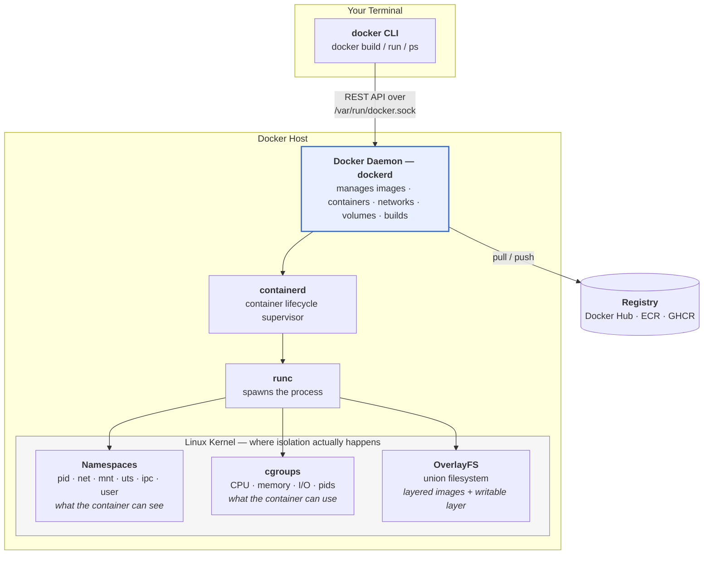
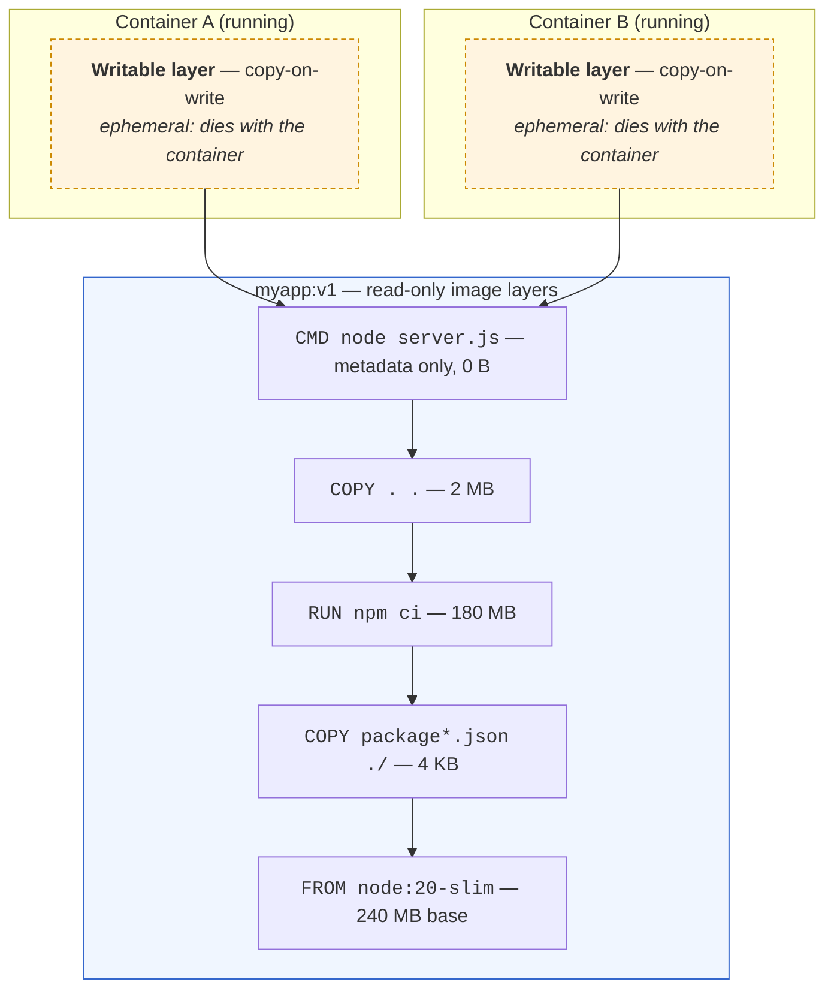
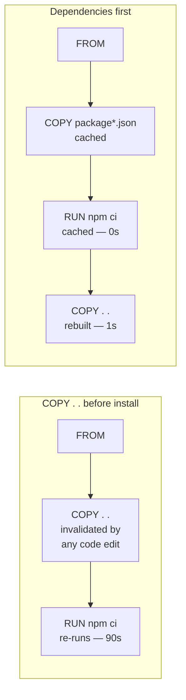
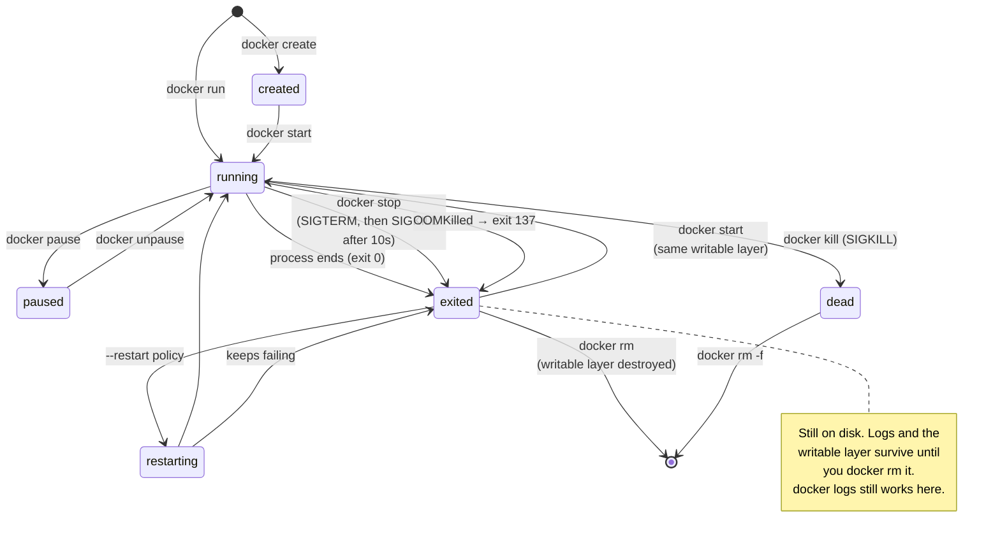
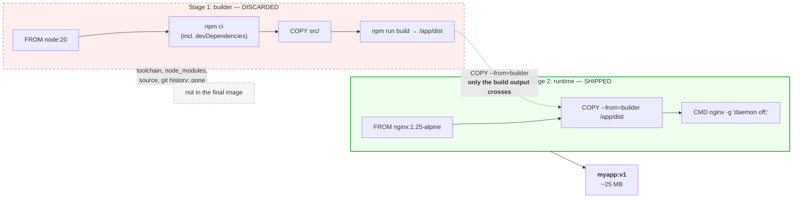
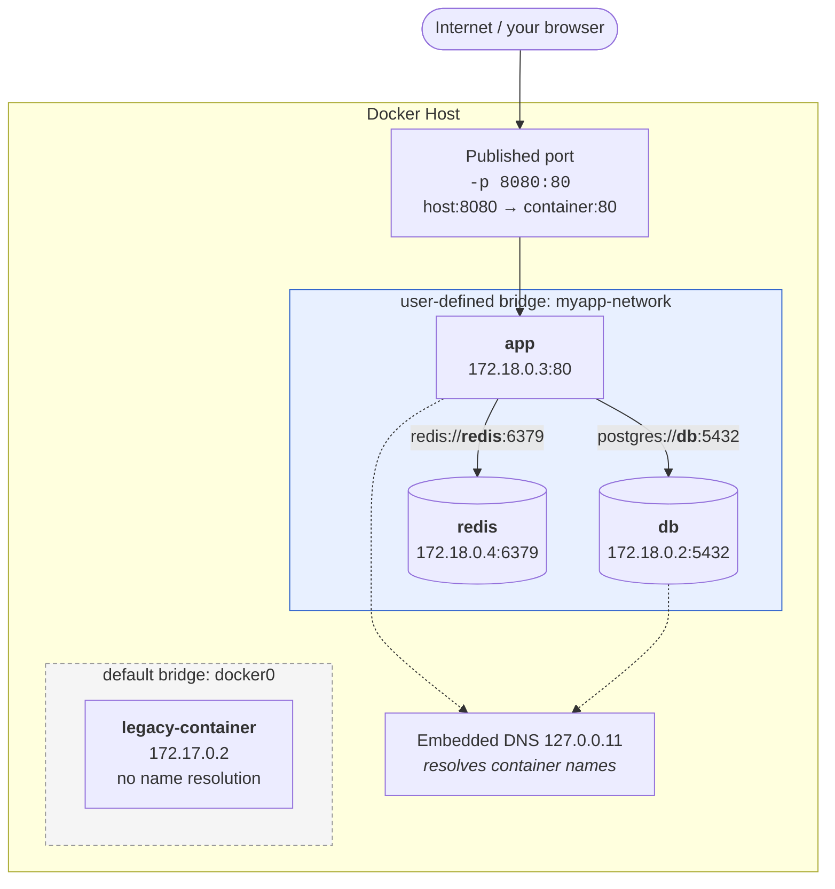

# Module 05: Containers & Docker

> *"Containers are not just a tool — they're a fundamental shift in how software is packaged, deployed, and run."*

---

>**Command reference**: [`cheatsheet.md`](./cheatsheet.md) — every command in this module, grouped by task, with the gotchas.
>
>**Cross-module lookup**: [Quick Reference](../QUICK-REFERENCE.md)

---

## Why This Module Matters

Docker is the **most transformative tool in modern DevOps**. It solves the "works on my machine" problem by packaging applications with their entire runtime environment. Every CI/CD pipeline, every Kubernetes cluster, every microservice architecture — all built on containers.

**In real-world DevOps work**, you will:

- Containerize applications for consistent deployment
- Build multi-stage Docker images for production
- Manage multi-container applications with Docker Compose
- Debug container networking and storage issues
- Optimize images for size and security
- Push images to registries and manage versioning

---

## Table of Contents

1. [What Are Containers?](#1-what-are-containers)
2. [Docker Architecture](#2-docker-architecture)
3. [Docker Images](#3-docker-images)
4. [Docker Containers](#4-docker-containers)
5. [Dockerfile — Building Custom Images](#5-dockerfile--building-custom-images)
6. [Multi-Stage Builds](#6-multi-stage-builds)
7. [Docker Networking](#7-docker-networking)
8. [Docker Volumes and Storage](#8-docker-volumes-and-storage)
9. [Docker Compose](#9-docker-compose)
10. [Docker Registry](#10-docker-registry)
11. [Image Optimization](#11-image-optimization)
12. [Common Mistakes and Anti-Patterns](#12-common-mistakes-and-anti-patterns)
13. [Debugging Mindset](#13-debugging-mindset)
14. [Security Considerations](#14-security-considerations)
15. [Interview Insights](#15-interview-insights)

---

## 1. What Are Containers?

### Containers vs Virtual Machines

```
Virtual Machines:                    Containers:
┌─────┐ ┌─────┐ ┌─────┐            ┌─────┐ ┌─────┐ ┌─────┐
│App A│ │App B│ │App C│            │App A│ │App B│ │App C│
├─────┤ ├─────┤ ├─────┤            ├─────┤ ├─────┤ ├─────┤
│Libs │ │Libs │ │Libs │            │Libs │ │Libs │ │Libs │
├─────┤ ├─────┤ ├─────┤            └──┬──┘ └──┬──┘ └──┬──┘
│Guest│ │Guest│ │Guest│               │       │       │
│ OS  │ │ OS  │ │ OS  │            ┌──┴───────┴───────┴──┐
├─────┴─┴─────┴─┴─────┤            │   Container Runtime  │
│     Hypervisor       │            │      (Docker)         │
├──────────────────────┤            ├──────────────────────┤
│      Host OS         │            │      Host OS         │
├──────────────────────┤            ├──────────────────────┤
│     Hardware         │            │     Hardware         │
└──────────────────────┘            └──────────────────────┘

VMs: Full OS per app (GB each)      Containers: Shared kernel (MB each)
Boot: Minutes                       Start: Seconds
Heavy: CPU + RAM overhead           Light: Near-native performance
```

| Feature | Virtual Machine | Container |
|---------|----------------|-----------|
| **Size** | Gigabytes | Megabytes |
| **Start time** | Minutes | Seconds |
| **Isolation** | Full OS-level | Process-level |
| **Performance** | ~95% native | ~99% native |
| **Density** | 10-20 per host | 100+ per host |
| **Use case** | Different OS requirements | Same OS, different apps |

---

## 2. Docker Architecture

When you type `docker run`, the CLI does almost nothing — it sends a REST call to a daemon that does all the work. Understanding that split explains most Docker permission and connectivity errors.



> ** DevOps Impact**: Two things fall straight out of this diagram. **(1)** `permission denied while trying to connect to the Docker daemon socket` means your user isn't in the `docker` group — you're being refused at the socket, not by Docker itself. **(2)** Membership in the `docker` group is effectively **root on the host**, because you can ask the daemon to mount `/` into a privileged container. Treat it as a privilege grant, not a convenience.
>
> A container is **not a lightweight VM** — it's an ordinary Linux process that the kernel lies to about what it can see (namespaces) and limits in what it can consume (cgroups).

---

## 3. Docker Images

An image is a **read-only template** containing everything needed to run an application.

```bash
# Pull an image from Docker Hub
docker pull nginx:1.25
docker pull python:3.12-slim
docker pull ubuntu:22.04

# List local images
docker images
# REPOSITORY   TAG        IMAGE ID       SIZE
# nginx        1.25       abc123         187MB
# python       3.12-slim  def456         130MB

# Image naming convention:
# registry/repository:tag
# docker.io/library/nginx:1.25
# ghcr.io/myorg/myapp:v2.1.0

# Inspect image details
docker inspect nginx:1.25

# View image layers
docker history nginx:1.25

# Remove an image
docker rmi nginx:1.25

# Remove all unused images
docker image prune -a
```

### Images Are Stacks of Read-Only Layers

Every instruction in a Dockerfile that changes the filesystem creates a **layer**. Layers are immutable, content-addressed, and shared between images. When you run a container, Docker adds one thin **writable layer** on top — that's the only part that isn't shared.



Two consequences you will rely on constantly:

**1. Layer caching drives build speed.** Docker reuses a cached layer only if that instruction *and every instruction before it* is unchanged. This is why `COPY package*.json ./` + `RUN npm ci` comes **before** `COPY . .` — editing your source code invalidates the last layer only, not the 180 MB dependency install.



**2. Deleting a file in a later layer does not shrink the image.** The earlier layer still contains it, and anyone can extract it. This is how secrets leak:

```dockerfile
#  The key is permanently in layer 1 — `docker history` and
#    `docker save | tar -x` will both reveal it.
COPY id_rsa /tmp/id_rsa
RUN git clone git@github.com:org/private.git && rm /tmp/id_rsa
```

Use multi-stage builds or BuildKit secret mounts instead (§6 and §14).

---

## 4. Docker Containers

A container is a **running instance** of an image.

```bash
# Run a container
docker run nginx:1.25
# This runs in the foreground (Ctrl+C to stop)

# Run in background (detached)
docker run -d --name webserver nginx:1.25

# Run with port mapping
docker run -d -p 8080:80 --name webserver nginx:1.25
# -p HOST_PORT:CONTAINER_PORT
# Access at: http://localhost:8080

# Run with environment variables
docker run -d \
  --name myapp \
  -p 8080:8080 \
  -e DATABASE_URL="postgres://db:5432/myapp" \
  -e LOG_LEVEL="info" \
  myapp:latest

# List running containers
docker ps

# List all containers (including stopped)
docker ps -a

# Stop a container
docker stop webserver

# Start a stopped container
docker start webserver

# Restart a container
docker restart webserver

# Remove a container
docker rm webserver           # Must be stopped
docker rm -f webserver        # Force remove (even if running)

# Execute a command inside a running container
docker exec -it webserver bash
# -i = interactive
# -t = allocate a TTY
# Now you're INSIDE the container!

# View container logs
docker logs webserver
docker logs -f webserver      # Follow (real-time)
docker logs --tail 50 webserver  # Last 50 lines
docker logs --since 1h webserver # Last hour

# View resource usage
docker stats
# Shows: CPU%, Memory, Network I/O, Disk I/O

# Copy files to/from container
docker cp localfile.txt webserver:/usr/share/nginx/html/
docker cp webserver:/etc/nginx/nginx.conf ./
```

### Container Lifecycle

`docker ps` shows only **running** containers. Most debugging confusion comes from containers sitting in a state you can't see by default — use `docker ps -a`.



**Exit codes you will actually see:**

| Code | Meaning | First thing to check |
|------|---------|----------------------|
| `0` | Clean exit | The main process finished — is your CMD a long-running foreground process? |
| `1` / `2` | Application error | `docker logs <name>` |
| `125` | Docker itself failed | Bad `docker run` flags |
| `126` | Command found but not executable | Missing `chmod +x` on an entrypoint script |
| `127` | Command not found | Wrong path, or the binary isn't in your slim base image |
| `137` | **SIGKILL — usually OOM** | `docker inspect --format '{{.State.OOMKilled}}' <name>`; raise `--memory` or fix the leak |
| `143` | SIGTERM — graceful stop | Normal `docker stop` |

> ** The #1 beginner bug**: a container that exits immediately with code `0`. Containers live exactly as long as their **PID 1** process. If your CMD starts a daemon that forks into the background, PID 1 returns instantly and Docker considers the job done. Always run the process in the **foreground** (`nginx -g 'daemon off;'`, `postgres` not `pg_ctl start`).

---

## 5. Dockerfile — Building Custom Images

### Basic Dockerfile

```dockerfile
# Dockerfile for a Python web application

# Base image — always use specific tags in production!
FROM python:3.12-slim

# Metadata
LABEL maintainer="devops@example.com"
LABEL version="1.0"

# Set working directory
WORKDIR /app

# Copy dependency file first (for caching)
COPY requirements.txt .

# Install dependencies
RUN pip install --no-cache-dir -r requirements.txt

# Copy application code
COPY . .

# Create non-root user (SECURITY!)
RUN useradd -r -s /usr/sbin/nologin appuser
USER appuser

# Expose port (documentation — doesn't actually publish)
EXPOSE 8080

# Health check
HEALTHCHECK --interval=30s --timeout=5s --retries=3 \
  CMD curl -f http://localhost:8080/health || exit 1

# Run the application
CMD ["python", "app.py"]
```

### Build and Run

```bash
# Build an image
docker build -t myapp:v1.0 .
# -t = tag (name:version)
# . = build context (current directory)

# Build with build arguments
docker build --build-arg ENV=production -t myapp:v1.0 .

# Run the built image
docker run -d -p 8080:8080 --name myapp myapp:v1.0
```

### Dockerfile Best Practices

```dockerfile
#  GOOD: Specific base image tag
FROM python:3.12-slim

#  BAD: Latest tag (non-reproducible)
# FROM python:latest

#  GOOD: Copy dependency file first (layer caching)
COPY requirements.txt .
RUN pip install -r requirements.txt
COPY . .

#  BAD: Copy everything at once (no cache benefit)
# COPY . .
# RUN pip install -r requirements.txt

#  GOOD: Combine RUN commands (fewer layers)
RUN apt-get update && \
    apt-get install -y --no-install-recommends curl && \
    rm -rf /var/lib/apt/lists/*

#  BAD: Separate RUN for each command
# RUN apt-get update
# RUN apt-get install -y curl

#  GOOD: Run as non-root user
USER appuser

#  BAD: Run as root (default)
```

---

## 6. Multi-Stage Builds

Multi-stage builds produce **smaller, more secure** production images.

```dockerfile
# Stage 1: Build
FROM node:20 AS builder
WORKDIR /app
COPY package*.json ./
RUN npm ci
COPY . .
RUN npm run build

# Stage 2: Production (only the built artifacts)
FROM nginx:1.25-alpine
COPY --from=builder /app/dist /usr/share/nginx/html
COPY nginx.conf /etc/nginx/conf.d/default.conf
EXPOSE 80
CMD ["nginx", "-g", "daemon off;"]

# Result: Build stage has Node.js, npm, source code (~1GB)
#         Production image has only Nginx + static files (~25MB)
```

### What Actually Gets Shipped

Only the **final stage** becomes your image. Every earlier stage — compilers, dev dependencies, source code, build secrets — is discarded entirely. It isn't hidden in a lower layer; it never enters the image at all.



**Why this matters beyond size:**

| Benefit | Explanation |
|---------|-------------|
| **Smaller images** | 1 GB → 25 MB: faster pulls, faster pod starts, cheaper registry storage |
| **Smaller attack surface** | No compiler, no `curl`, no shell package manager for an attacker to use |
| **Fewer CVEs** | Most scanner findings come from build tooling you never needed at runtime |
| **Secret safety** | A token used in the build stage cannot be extracted from the shipped image |

> ** Debug tip**: you can build and inspect any intermediate stage directly — `docker build --target builder -t debug-build .` then `docker run -it debug-build sh`. This is how you diagnose "it built fine but the artifact is missing."

---

## 7. Docker Networking

Containers on the **default bridge** can only reach each other by IP. Containers on a **user-defined bridge** get automatic DNS resolution by container name — which is the single most important reason to always create your own network (and what Compose does for you).



> ** The rule that saves hours**: inside a container, `localhost` means **that container**, not the host and not a sibling. `DB_HOST=localhost` is the classic failure — it must be `DB_HOST=db`, the container name on a shared user-defined network. Ports published with `-p` are for traffic coming from **outside** Docker; containers talking to each other do **not** need published ports, they use the container port directly.

```bash
# List networks
docker network ls
# NETWORK ID   NAME     DRIVER    SCOPE
# abc123       bridge   bridge    local    ← Default
# def456       host     host      local
# ghi789       none     null      local

# Create a custom network (containers can resolve each other by name)
docker network create myapp-network

# Run containers on the same network
docker run -d --name db --network myapp-network postgres:15
docker run -d --name app --network myapp-network -e DB_HOST=db myapp:latest

# The 'app' container can now reach 'db' by hostname!
# This is how Docker Compose works under the hood

# Inspect a network
docker network inspect myapp-network

# Connect a running container to a network
docker network connect myapp-network existing-container
```

---

## 8. Docker Volumes and Storage

```bash
# Named volume (managed by Docker — preferred)
docker volume create mydata
docker run -d -v mydata:/var/lib/postgresql/data postgres:15

# Bind mount (map host directory into container)
docker run -d \
  -v /host/path/nginx.conf:/etc/nginx/nginx.conf:ro \
  -v /host/path/html:/usr/share/nginx/html \
  nginx:1.25

# :ro = read-only (container can't modify the host file)

# List volumes
docker volume ls

# Inspect a volume
docker volume inspect mydata

# Remove unused volumes
docker volume prune
```

---

## 9. Docker Compose

Docker Compose manages **multi-container applications** with a single YAML file.

### docker-compose.yml Example

```yaml
# docker-compose.yml
version: "3.8"

services:
  app:
    build: .
    ports:
      - "8080:8080"
    environment:
      - DATABASE_URL=postgres://user:pass@db:5432/myapp
      - REDIS_URL=redis://cache:6379
    depends_on:
      db:
        condition: service_healthy
      cache:
        condition: service_started
    restart: unless-stopped
    healthcheck:
      test: ["CMD", "curl", "-f", "http://localhost:8080/health"]
      interval: 30s
      timeout: 5s
      retries: 3

  db:
    image: postgres:15
    volumes:
      - pgdata:/var/lib/postgresql/data
    environment:
      POSTGRES_DB: myapp
      POSTGRES_USER: user
      POSTGRES_PASSWORD: pass
    healthcheck:
      test: ["CMD-SHELL", "pg_isready -U user -d myapp"]
      interval: 10s
      timeout: 5s
      retries: 5

  cache:
    image: redis:7-alpine
    restart: unless-stopped

  nginx:
    image: nginx:1.25-alpine
    ports:
      - "80:80"
      - "443:443"
    volumes:
      - ./nginx.conf:/etc/nginx/conf.d/default.conf:ro
    depends_on:
      - app

volumes:
  pgdata:
```

### Compose Commands

```bash
# Start all services
docker compose up -d

# View logs
docker compose logs -f
docker compose logs -f app    # Just one service

# Check status
docker compose ps

# Stop all services
docker compose down

# Stop and remove volumes
docker compose down -v

# Rebuild images
docker compose build
docker compose up -d --build

# Scale a service
docker compose up -d --scale app=3

# Execute command in a service
docker compose exec app bash
docker compose exec db psql -U user -d myapp
```

---

## 10. Docker Registry

```bash
# Docker Hub (default)
docker login
docker tag myapp:v1.0 username/myapp:v1.0
docker push username/myapp:v1.0

# GitHub Container Registry
echo $GITHUB_TOKEN | docker login ghcr.io -u username --password-stdin
docker tag myapp:v1.0 ghcr.io/username/myapp:v1.0
docker push ghcr.io/username/myapp:v1.0

# Pull from a registry
docker pull ghcr.io/username/myapp:v1.0
```

---

## 11. Image Optimization

| Technique | Before | After |
|-----------|--------|-------|
| Use Alpine base | `python:3.12` (1GB) | `python:3.12-alpine` (50MB) |
| Multi-stage build | Full build env (1GB+) | Runtime only (50-100MB) |
| `--no-cache-dir` in pip | Cached packages | No cache bloat |
| `.dockerignore` | Copies everything | Only needed files |
| Combine RUN commands | Multiple layers | Single layer |

### Essential .dockerignore

```
.git
.gitignore
node_modules
__pycache__
*.pyc
.env
docker-compose*.yml
Dockerfile
README.md
.vscode
.idea
```

---

## 12. Common Mistakes and Anti-Patterns

### Running as Root

```dockerfile
# BAD: Container runs as root (default)
FROM python:3.12-slim
COPY . /app
CMD ["python", "/app/main.py"]

# GOOD: Create and use a non-root user
FROM python:3.12-slim
RUN useradd -r appuser
COPY --chown=appuser . /app
USER appuser
CMD ["python", "/app/main.py"]
```

### Using `latest` Tag

```bash
# BAD: Non-reproducible
docker pull nginx:latest

# GOOD: Pinned version
docker pull nginx:1.25.3
```

### Storing Secrets in Images

```dockerfile
# BAD: Secret baked into the image
ENV DB_PASSWORD=mysecret123

# GOOD: Pass secrets at runtime
# docker run -e DB_PASSWORD=mysecret123 myapp
# Or use Docker secrets / external secret managers
```

---

## 13. Debugging Mindset

### Container Debugging Framework

```bash
# Container won't start?
docker logs container-name           # Check logs first!
docker inspect container-name        # Check config, health, state

# Need to get inside a running container?
docker exec -it container-name bash
docker exec -it container-name sh    # If bash isn't available (Alpine)

# Container exited immediately?
docker run -it myimage bash          # Override CMD, get a shell
docker logs $(docker ps -aq -l)      # Logs from last exited container

# Network issues?
docker exec -it container-name ping other-container
docker network inspect bridge

# Check resource usage
docker stats container-name
```

---

## 14. Security Considerations

>Container security is critical — a compromised container can affect the host.

- **Run as non-root** — always use `USER` in Dockerfile
- **Use minimal base images** — Alpine or distroless
- **Scan images for vulnerabilities** — `docker scout` or Trivy
- **Don't store secrets in images** — use runtime environment or secret managers
- **Use read-only filesystems** — `docker run --read-only`
- **Set resource limits** — prevent container from consuming all host resources
- **Keep images updated** — rebuild with latest base images regularly

### Modern Docker CLI Tools

Docker's CLI has evolved beyond just `build` and `run`. Two tools worth knowing:

```bash
# docker init — Scaffolds Dockerfile, Compose, and .dockerignore for your project
# Run inside your project directory:
docker init
# Interactively generates:
#   • Dockerfile (with multi-stage build, non-root user)
#   • compose.yaml
#   • .dockerignore
# Great for bootstrapping — then customize the output.

# docker scout — Built-in vulnerability scanning (no external tools needed)
docker scout cves myapp:latest              # List CVEs in an image
docker scout quickview myapp:latest         # Summary view
docker scout recommendations myapp:latest   # Suggested base image upgrades

# Real-world workflow: scan before pushing to registry
docker build -t myapp:v1.2.3 .
docker scout cves myapp:v1.2.3
# Fix critical CVEs → rebuild → rescan → push
```

>`docker scout` integrates into CI/CD pipelines. Use it alongside Trivy for defense-in-depth scanning.

---

## 15. Interview Insights

**Q: What's the difference between a Docker image and a container?**
> An image is a read-only template (like a class in OOP). A container is a running instance of that image (like an object). You can run multiple containers from the same image.

**Q: Explain Docker layers and caching.**
> Each instruction in a Dockerfile creates a layer. Layers are cached — if a layer hasn't changed, Docker reuses it. That's why you copy `requirements.txt` before the rest of the code: dependency installation is cached until requirements change.

**Q: How do containers communicate?**
> Containers on the same Docker network can reach each other by container name (DNS resolution). Docker Compose automatically creates a shared network. For external access, you publish ports with `-p HOST:CONTAINER`.

**Q: What is a multi-stage build?**
> A Dockerfile with multiple FROM statements. Build-time dependencies (compilers, test tools) stay in the build stage. Only the final artifact is copied to the production stage, resulting in much smaller images.

**Q: How do you debug a container that keeps restarting?**
>
> 1. `docker logs container-name` — read the logs. 2. `docker inspect container-name` — check the exit code and state. 3. `docker run -it image bash` — override the CMD and get a shell to investigate. 4. Check health check configuration if using HEALTHCHECK.

---

## Labs and Projects

Read the sections above first, then work through these **in order**. Every lab ends with a  **Break It** section — those are not optional; they are where the debugging skill actually comes from.

| # | Lab | What you'll do |
|---|-----|----------------|
| 1 | **[Docker Fundamentals](./labs/lab-01-docker-fundamentals.md)** | Get hands-on with Docker's core operations — pull images, run containers, publish ports, manage logs, and build your first custom image. |
| 2 | **[Advanced Docker Patterns](./labs/lab-02-advanced-docker.md)** | Master multi-stage builds, image optimization, Docker networking internals, and production-grade container patterns. |

**Portfolio project:**

- [Project: Containerized App with Compose and Healthcheck](./projects/project-01-compose-healthcheck-app.md) — Containerize a small web application and run it locally with Docker Compose.

**Reference code** for every lab: [`code/`](./code/) — real files, validated in CI.

---

## Self-Check

Answer these from memory before you expand them. If more than two give you trouble, re-read the sections they come from — the labs assume this material is solid.

<details>
<summary><strong>1. What is the actual difference between a container and a VM?</strong></summary>

A container is a process on the host kernel, isolated with namespaces and limited with cgroups: megabytes, starts in milliseconds. A VM runs its own kernel on a hypervisor: gigabytes, starts in seconds, and isolates far more strongly. That shared kernel is both the efficiency and the security caveat.

</details>

<details>
<summary><strong>2. Why does instruction order in a Dockerfile change your build times so much?</strong></summary>

Each instruction is a cached layer, and a cache miss invalidates everything after it. Copying the whole source tree before installing dependencies means every one-character code change reinstalls all dependencies. Copy the manifest, install, then copy the source.

</details>

<details>
<summary><strong>3. What does a multi-stage build buy you beyond a smaller image?</strong></summary>

Attack surface. Compilers, package managers, build secrets, and dev dependencies stay in the builder stage and never ship. The final image contains the artefact and its runtime — less to scan, less to exploit, less to pull.

</details>

<details>
<summary><strong>4. Data written by the container is gone after a restart. Why?</strong></summary>

It went to the container's writable layer, which is created with the container and deleted with it. Anything that must survive belongs in a named volume or a bind mount — and in an image build, anything written after the last layer you keep is equally temporary.

</details>

<details>
<summary><strong>5. Why run as a non-root user, and what does `USER` not protect you from?</strong></summary>

It limits what an application compromise or a container escape gets: root in the container is root on the host if the boundary breaks. It does nothing about `--privileged`, a mounted Docker socket, host-path mounts, or excess capabilities — those hand over the host regardless of the user.

</details>

<details>
<summary><strong>6. Two services in the same Compose file need to talk. What address do they use?</strong></summary>

Each other's service name, resolved by Docker's embedded DNS on the shared network, on the container port. Published ports (`ports:`) exist only to reach a container from the host — mapping ports for internal traffic exposes services you meant to keep private.

</details>

---

## Practical Checkpoint

Before moving on, you should be able to:

- Build, run, inspect, and debug containers and images.
- Write a Dockerfile that uses caching effectively, runs as non-root, and exposes the right ports.
- Use Docker Compose to run a small multi-container app with health checks and logs.

Portfolio evidence to keep:

- Dockerfile and Compose files.
- Image build and container validation output.
- Notes from debugging a failed container start, bad port mapping, or unhealthy service.

Suggested project: [Containerized App with Compose and Healthcheck](./projects/project-01-compose-healthcheck-app.md)

---

## What's Next?

With Docker mastered, you can now build CI/CD pipelines that build, test, and deploy containers automatically.

**[Module 06: CI/CD →](../06-ci-cd/)**

---

<div align="center">

**Module 05 Complete** 

[← Back to Scripting](../04-scripting/) | [ Cheat Sheet](./cheatsheet.md) | [Next: CI/CD →](../06-ci-cd/)

</div>


## Reference
<!-- tab: Cheatsheet -->
> Command reference for Docker and Compose. Concepts live in the [module README](./README.md).
> Cross-module daily commands: **[QUICK-REFERENCE.md](../QUICK-REFERENCE.md)**

**Jump to:** [Images](#images) · [Containers](#containers) · [Inspect & debug](#inspecting--debugging) · [Dockerfile](#dockerfile-reference) · [Build](#building) · [Networking](#networking) · [Volumes](#volumes--storage) · [Compose](#docker-compose) · [Registry](#registries) · [Cleanup](#cleanup--disk) · [Security](#security) · [Errors](#error-decoder)

---

## Images

```bash
docker pull nginx:1.25                 # always pin a tag, never rely on :latest
docker pull --platform linux/amd64 nginx:1.25    # cross-arch on Apple Silicon
docker images                          # or: docker image ls
docker images --format '{{.Repository}}:{{.Tag}}\t{{.Size}}' | column -t
docker history nginx:1.25              #  layer-by-layer size breakdown
docker history --no-trunc myapp:v1     # full commands per layer
docker inspect nginx:1.25
docker tag myapp:v1 ghcr.io/org/myapp:v1
docker rmi nginx:1.25
docker save myapp:v1 | gzip > myapp.tar.gz     # export for air-gapped transfer
docker load < myapp.tar.gz
docker image prune          # dangling images
docker image prune -a       #  everything not used by a container
```

**Image naming**: `[registry/][namespace/]repository[:tag|@sha256:digest]`

```
docker.io/library/nginx:1.25          # Docker Hub official
ghcr.io/myorg/myapp:v2.1.0            # GitHub Container Registry
123456789012.dkr.ecr.us-east-1.amazonaws.com/myapp:v1    # AWS ECR
myapp@sha256:abc123...                #  immutable — a digest can never be re-pushed
```

---

## Containers

```bash
docker run nginx:1.25                             # foreground
docker run -d --name web nginx:1.25               # detached, named
docker run -d -p 8080:80 --name web nginx:1.25    # host:container port
docker run -p 127.0.0.1:8080:80 nginx             # bind to localhost only 
docker run --rm -it alpine sh                     # throwaway interactive shell
docker run -e KEY=value -e OTHER=x myapp
docker run --env-file .env myapp
docker run -v mydata:/data myapp                  # named volume
docker run -v "$PWD":/app:ro myapp                # bind mount, read-only
docker run --network mynet myapp
docker run --restart unless-stopped myapp
docker run -u 1000:1000 myapp                     # run as a specific UID:GID
docker run -w /app myapp                          # working directory
docker run --memory 512m --cpus 1.5 myapp         #  always set limits
docker run --read-only --tmpfs /tmp myapp         # immutable root filesystem
docker run --cap-drop ALL --cap-add NET_BIND_SERVICE myapp
docker run --health-cmd 'curl -f localhost/ || exit 1' --health-interval 30s myapp

docker ps                          # running only
docker ps -a                       #  INCLUDING exited — where crashed containers hide
docker ps -q                       # IDs only (for scripting)
docker ps --filter status=exited --filter name=web
docker ps --format 'table {{.Names}}\t{{.Status}}\t{{.Ports}}'

docker start|stop|restart web
docker stop -t 30 web              # give it 30s before SIGKILL
docker kill web                    # SIGKILL immediately
docker kill -s HUP web             # send a specific signal
docker pause|unpause web
docker rm web
docker rm -f web                   # stop and remove
docker rename web web-old
docker update --memory 1g web      # change limits on a running container
docker wait web                    # block until it exits, print its exit code
```

---

## Inspecting & Debugging

```bash
docker logs web
docker logs -f web                        # follow
docker logs --tail 100 -f web
docker logs --since 10m web
docker logs --timestamps web
docker logs web 2>&1 | grep -i error

docker exec -it web bash                  # shell into a RUNNING container
docker exec -it web sh                    # alpine/distroless often lack bash
docker exec -u root -it web bash          # as root even if the container runs as a user
docker exec web env                       # its environment variables
docker exec web ps aux                    # its processes

docker inspect web                                            # everything, as JSON
docker inspect -f '{{.State.Status}}' web
docker inspect -f '{{.State.ExitCode}}' web                   #  why it died
docker inspect -f '{{.State.OOMKilled}}' web                  #  was it OOM-killed?
docker inspect -f '{{json .State.Health}}' web | jq
docker inspect -f '{{.NetworkSettings.IPAddress}}' web
docker inspect -f '{{range $k,$v := .NetworkSettings.Networks}}{{$k}} {{$v.IPAddress}}{{end}}' web
docker inspect -f '{{range .Mounts}}{{.Source}} -> {{.Destination}}{{"\n"}}{{end}}' web
docker inspect -f '{{.Config.Cmd}} {{.Config.Entrypoint}}' web

docker stats                              # live CPU/memory/network for all containers
docker stats --no-stream                  # one snapshot (scriptable)
docker top web                            # processes, as seen from the host
docker diff web                           #  files changed since the image was built
docker port web                           # published port mappings
docker events --since 10m                 # daemon event stream — restarts, OOM kills
docker cp web:/etc/nginx/nginx.conf ./    # copy out
docker cp ./index.html web:/usr/share/nginx/html/

# Debug a container with no shell (distroless/scratch)
docker run --rm -it --pid container:web --network container:web \
  --cap-add SYS_PTRACE nicolaka/netshoot
```

**Debugging a crash loop:**

```bash
docker ps -a                                        # 1. find it and read the exit code
docker logs --tail 50 web                           # 2. what did it say before dying?
docker inspect -f '{{.State.ExitCode}} OOM={{.State.OOMKilled}}' web    # 3. how did it die?
docker run --rm -it --entrypoint sh myapp:v1        # 4.  override the entrypoint and look around
docker run --rm myapp:v1 ls -la /app                # 5. is the artifact even in the image?
```

---

## Dockerfile Reference

| Instruction | Purpose | Gotcha |
|-------------|---------|--------|
| `FROM image:tag` | Base image | Pin the tag. Use a digest for reproducibility |
| `WORKDIR /app` | Set + create the working directory | Use this, never `RUN cd` |
| `COPY src dst` | Copy from build context | Prefer over `ADD` |
| `ADD` | Copy + auto-extract archives + fetch URLs | Surprising behaviour — avoid unless extracting a tarball |
| `RUN cmd` | Execute at **build** time | Each `RUN` is a layer; chain with `&&` |
| `CMD ["a","b"]` | Default command, **overridable** | Exec form only |
| `ENTRYPOINT ["a"]` | The fixed executable | `CMD` becomes its default arguments |
| `ENV K=V` | Environment variable, build **and** run | Visible in `docker inspect` — never secrets |
| `ARG K=V` | Build-time variable only | Visible in `docker history` — never secrets |
| `EXPOSE 8080` | Documentation only | Does **not** publish; you still need `-p` |
| `USER appuser` | Drop privileges | Put it after the installs |
| `VOLUME /data` | Declare a mount point | Creates an anonymous volume if not overridden |
| `HEALTHCHECK` | Container-level health probe | Compose and Swarm use it; Kubernetes ignores it |
| `LABEL k=v` | Metadata | Use OCI standard labels |
| `ONBUILD` | Trigger for child images | Confusing — avoid |
| `STOPSIGNAL SIGTERM` | Signal sent on stop | |

### Production Dockerfile

```dockerfile
# syntax=docker/dockerfile:1

########## Stage 1: build ##########
FROM node:20-slim AS builder
WORKDIR /app

# Dependencies FIRST — this layer caches across source changes 
COPY package.json package-lock.json ./
RUN --mount=type=cache,target=/root/.npm npm ci

COPY . .
RUN npm run build && npm prune --omit=dev

########## Stage 2: runtime ##########
FROM node:20-slim AS runtime

ENV NODE_ENV=production \
    PORT=8080

RUN groupadd -r app && useradd -r -g app -d /app -s /sbin/nologin app

WORKDIR /app
COPY --from=builder --chown=app:app /app/node_modules ./node_modules
COPY --from=builder --chown=app:app /app/dist ./dist

USER app
EXPOSE 8080

HEALTHCHECK --interval=30s --timeout=3s --start-period=20s --retries=3 \
  CMD node -e "require('http').get('http://127.0.0.1:8080/health',r=>process.exit(r.statusCode===200?0:1)).on('error',()=>process.exit(1))"

ENTRYPOINT ["node"]
CMD ["dist/server.js"]
```

### `CMD` vs `ENTRYPOINT`

```dockerfile
CMD ["nginx", "-g", "daemon off;"]      # docker run img echo hi  → runs "echo hi"
ENTRYPOINT ["nginx"]                    # docker run img -v       → runs "nginx -v"
ENTRYPOINT ["nginx"]                    # combined: default args that users can replace
CMD ["-g", "daemon off;"]
```

>Use the **exec form** (`["cmd","arg"]`), not the shell form (`cmd arg`). Shell form wraps your process in `/bin/sh -c`, which becomes PID 1 and **does not forward SIGTERM** — your container then takes the full 10-second timeout to die and never runs its graceful shutdown.

### `.dockerignore`

```gitignore
.git
.github
node_modules
__pycache__
*.pyc
.venv
dist
build
*.log
.env
.env.*
*.pem
*.key
Dockerfile*
docker-compose*.yml
.terraform
README.md
```

>`.dockerignore` does two jobs: it shrinks the build context (faster builds) and it stops `COPY . .` silently baking `.git`, `.env`, and credentials into your image.

---

## Building

```bash
docker build -t myapp:v1 .
docker build -t myapp:v1 -f docker/Dockerfile.prod .
docker build --target builder -t myapp:debug .        #  build one stage only
docker build --no-cache -t myapp:v1 .
docker build --pull -t myapp:v1 .                     # refresh the base image
docker build --build-arg VERSION=1.2.3 -t myapp:v1 .
docker build --progress=plain -t myapp:v1 .           # full log output, no collapsing
docker build -t myapp:v1 -t myapp:latest .            # multiple tags

# BuildKit secrets — never bake credentials into a layer
DOCKER_BUILDKIT=1 docker build --secret id=npmrc,src=$HOME/.npmrc -t myapp .
# In the Dockerfile:
#   RUN --mount=type=secret,id=npmrc,target=/root/.npmrc npm ci

# Multi-architecture
docker buildx create --use --name multi
docker buildx build --platform linux/amd64,linux/arm64 -t ghcr.io/org/app:v1 --push .

docker builder prune                    # clear the build cache
docker system df                        #  where is my disk going?
```

---

## Networking

```bash
docker network ls
docker network create myapp-net
docker network create --driver bridge --subnet 172.28.0.0/16 mynet
docker network inspect myapp-net
docker network connect myapp-net web
docker network disconnect myapp-net web
docker network prune
```

| Driver | Behaviour |
|--------|-----------|
| `bridge` (default) | Private network on the host. **User-defined bridges get DNS by container name** |
| `host` | No isolation — the container uses the host's network stack directly (Linux only) |
| `none` | No networking at all |
| `overlay` | Multi-host (Swarm) |
| `macvlan` | Container gets its own MAC/IP on the physical LAN |

```bash
# Containers reach each other by NAME on a user-defined network
docker network create appnet
docker run -d --name db     --network appnet postgres:15
docker run -d --name api    --network appnet -e DB_HOST=db myapi
# Inside 'api': postgres://db:5432   ← the container name, not localhost

# From a container, reach a service on the HOST
--add-host=host.docker.internal:host-gateway    # Linux; built in on Mac/Windows
```

>Three rules that resolve most container networking confusion:
> **(1)** `localhost` inside a container means *that container*, never the host or a sibling.
> **(2)** `-p 8080:80` is only for traffic entering from **outside** Docker; containers on a shared network talk directly on the container port with no publishing needed.
> **(3)** The **default** bridge has no DNS. Always `docker network create` your own (Compose does this automatically).

---

## Volumes & Storage

```bash
docker volume create mydata
docker volume ls
docker volume inspect mydata            # shows the real path under /var/lib/docker
docker volume rm mydata
docker volume prune                     #  deletes all unused volumes

docker run -v mydata:/var/lib/postgresql/data postgres:15    # named volume
docker run -v "$PWD/config":/etc/app:ro myapp                # bind mount, read-only
docker run --mount type=bind,src="$PWD",dst=/app,readonly myapp   # explicit syntax
docker run --tmpfs /tmp:size=100m myapp                      # in-memory, never persisted

# Back up a volume
docker run --rm -v mydata:/data -v "$PWD":/backup alpine \
  tar czf /backup/mydata-$(date +%F).tar.gz -C /data .

# Restore
docker run --rm -v mydata:/data -v "$PWD":/backup alpine \
  sh -c 'cd /data && tar xzf /backup/mydata-2026-08-04.tar.gz'
```

| Type | Managed by | Use for |
|------|-----------|---------|
| **Named volume** | Docker | Databases, anything that must persist. Portable, backed up as a unit |
| **Bind mount** | You | Source code in development, host config files |
| **tmpfs** | Kernel (RAM) | Secrets and scratch data that must never touch disk |

---

## Docker Compose

```bash
docker compose up -d                    #  'docker compose' (v2), not 'docker-compose'
docker compose up -d --build            # rebuild images first
docker compose up -d --force-recreate
docker compose down                     # stop and remove containers + networks
docker compose down -v                  #  also delete volumes (data loss)
docker compose ps
docker compose logs -f
docker compose logs -f api              # one service
docker compose exec api sh
docker compose run --rm api npm test    # one-off task container
docker compose restart api
docker compose stop / start
docker compose build --no-cache
docker compose pull
docker compose config                   #  show the fully resolved config (validates it)
docker compose top
docker compose --profile debug up -d    # opt-in services
docker compose -f base.yml -f prod.yml up -d       # layered overrides
```

```yaml
# compose.yaml
services:
  api:
    build:
      context: .
      target: runtime
    image: myapp:local
    restart: unless-stopped
    ports:
      - "127.0.0.1:8080:8080"
    environment:
      DATABASE_URL: postgres://app:${DB_PASSWORD:?set DB_PASSWORD}@db:5432/app
      LOG_LEVEL: ${LOG_LEVEL:-info}
    env_file:
      - .env
    depends_on:
      db:
        condition: service_healthy      #  wait for the healthcheck, not just startup
    healthcheck:
      test: ["CMD", "curl", "-fsS", "http://localhost:8080/health"]
      interval: 30s
      timeout: 3s
      retries: 3
      start_period: 20s
    deploy:
      resources:
        limits: {cpus: "1.0", memory: 512M}
    user: "1000:1000"
    read_only: true
    tmpfs: [/tmp]
    security_opt: ["no-new-privileges:true"]
    cap_drop: [ALL]
    logging:
      driver: json-file
      options: {max-size: "10m", max-file: "3"}

  db:
    image: postgres:15-alpine
    restart: unless-stopped
    environment:
      POSTGRES_USER: app
      POSTGRES_DB: app
      POSTGRES_PASSWORD: ${DB_PASSWORD:?set DB_PASSWORD}
    volumes:
      - pgdata:/var/lib/postgresql/data
    healthcheck:
      test: ["CMD-SHELL", "pg_isready -U app -d app"]
      interval: 10s
      timeout: 5s
      retries: 5

volumes:
  pgdata:
```

>`depends_on` **without** `condition: service_healthy` only waits for the container to *start*, not to be *ready*. That's the cause of the classic "my app can't reach Postgres on the first run" bug.

---

## Registries

```bash
docker login ghcr.io -u USERNAME                          # prompts for a token
echo "$TOKEN" | docker login ghcr.io -u USER --password-stdin    #  scriptable, no shell history
docker logout ghcr.io

docker tag myapp:v1 ghcr.io/myorg/myapp:v1
docker push ghcr.io/myorg/myapp:v1
docker pull ghcr.io/myorg/myapp:v1

# AWS ECR
aws ecr get-login-password --region us-east-1 \
  | docker login --username AWS --password-stdin 123456789012.dkr.ecr.us-east-1.amazonaws.com

# Local registry for testing
docker run -d -p 5000:5000 --name registry registry:2
docker tag myapp:v1 localhost:5000/myapp:v1 && docker push localhost:5000/myapp:v1

# Inspect a remote image WITHOUT pulling it
docker manifest inspect ghcr.io/myorg/myapp:v1
crane digest ghcr.io/myorg/myapp:v1            # from google/go-containerregistry
skopeo inspect docker://ghcr.io/myorg/myapp:v1
```

**Tagging strategy:**

```bash
docker build \
  -t "ghcr.io/org/app:${GIT_SHA}" \        #  immutable — this is what you deploy
  -t "ghcr.io/org/app:v1.4.2" \            # semantic version
  -t "ghcr.io/org/app:latest" \            # convenience only — never deploy this
  .
```

---

## Cleanup & Disk

```bash
docker system df                       #  start here: images / containers / volumes / cache
docker system df -v                    # per-item breakdown

docker container prune                 # remove stopped containers
docker image prune                     # dangling (untagged) images
docker image prune -a --filter "until=168h"    # unused images older than a week
docker volume prune                    #  unused volumes — this is data
docker network prune
docker builder prune --filter "until=48h"

docker system prune                    # containers + networks + dangling images + cache
docker system prune -a                 #  + every image not used by a running container
docker system prune -a --volumes       #  + all unused volumes. Read twice.

# Cap log growth (the usual cause of a full /var/lib/docker)
# /etc/docker/daemon.json
{
  "log-driver": "json-file",
  "log-opts": { "max-size": "10m", "max-file": "3" }
}
# then: sudo systemctl restart docker
```

---

## Security

```bash
trivy image myapp:v1                                  #  CVE scan
trivy image --severity HIGH,CRITICAL --exit-code 1 myapp:v1     # gate CI on it
trivy image --ignore-unfixed myapp:v1                 # only actionable findings
trivy fs .                                            # scan the source tree
grype myapp:v1
docker scout cves myapp:v1
syft myapp:v1 -o spdx-json > sbom.json                # generate an SBOM
hadolint Dockerfile                                   # lint the Dockerfile
dockle myapp:v1                                       # image best-practice audit
```

**Checklist:**

- [ ] Non-root `USER` in the final stage
- [ ] Minimal base image (`-slim`, `alpine`, `distroless`, or `scratch`)
- [ ] Multi-stage build — no compilers or dev dependencies shipped
- [ ] Pinned base image tag, ideally by digest
- [ ] No secrets in `ENV`, `ARG`, or any layer — use BuildKit `--secret` or runtime injection
- [ ] `.dockerignore` excludes `.git`, `.env`, keys
- [ ] `--read-only` root filesystem with an explicit `tmpfs` where writes are needed
- [ ] `--cap-drop ALL`, adding back only what's required
- [ ] `--security-opt no-new-privileges:true`
- [ ] Memory and CPU limits set
- [ ] Image scanned in CI and the build **fails** on HIGH/CRITICAL
- [ ] Never mount `/var/run/docker.sock` into a container you don't fully trust — it is root on the host

---

## Error Decoder

| Message / symptom | Cause | Fix |
|-------------------|-------|-----|
| `permission denied ... /var/run/docker.sock` | Your user isn't in the `docker` group | `sudo usermod -aG docker $USER`, then log out and back in |
| `bind: address already in use` | Host port is taken | `ss -tlnp \| grep :8080`, pick another port |
| Container exits immediately, code **0** | Main process isn't long-running / forked to background | Run in the foreground (`nginx -g 'daemon off;'`) |
| Exit code **125** | Docker itself rejected the run | Bad `docker run` flags |
| Exit code **126** | Entrypoint found but not executable | `chmod +x`, check for CRLF line endings |
| Exit code **127** | Command not found | Wrong path, or missing from a slim base image |
| Exit code **137** | SIGKILL — usually **OOM** | `docker inspect -f '{{.State.OOMKilled}}'`; raise `--memory` |
| Exit code **143** | SIGTERM — normal `docker stop` | Not an error |
| `no such host` between containers | Not on the same user-defined network | `docker network create` + `--network`; use the container name |
| `connection refused` to your own app | App bound to `127.0.0.1` inside the container | Bind to `0.0.0.0` |
| `no space left on device` | Docker disk usage | `docker system df` then prune; cap log size |
| `manifest unknown` / `pull access denied` | Wrong tag, or private image | Check the tag; `docker login` |
| `toomanyrequests` | Docker Hub anonymous rate limit | Authenticate, or mirror the image |
| `exec format error` | Architecture mismatch (arm64 image on amd64) | `--platform linux/amd64`, or build multi-arch |
| Build is slow every time | Layer cache invalidated too early | Copy dependency manifests before source code |
| Changes not appearing | You rebuilt but reran the old image | `docker compose up -d --build`; check the tag |

---

<div align="center">

[← Module 05 README](./README.md) · [Resources](./resources.md) · [Labs](./labs/) · [Handbook Quick Reference](../QUICK-REFERENCE.md)

</div>
<!-- tab: Labs -->
# Lab 01: Docker Fundamentals

## Objective

Get hands-on with Docker's core operations — pull images, run containers, publish ports, manage logs, and build your first custom image. These are the commands you'll use every single day.

---

## Prerequisites

- Docker installed and running (`docker --version`)
- Your user in the `docker` group (`id | grep docker`)

---

## Deliverables and Evidence

By the end of this lab, keep the following evidence in your notes or portfolio repo:

- Commands you ran and the important output you used for validation
- Any files, scripts, configs, manifests, or workflows you created
- A short failure note describing one thing that broke, how you diagnosed it, and how you fixed it
- Cleanup commands or confirmation that no long-running resources remain

Treat the validation section as the minimum proof that the lab worked.

---

## Lab Files

Every file this lab creates also exists as a real, CI-validated file in
[`../code/lab-01/`](../code/lab-01/) (5 files).

```bash
# Option A — type them out yourself (recommended the first time; that's the learning)
# Option B — start from the reference copies
cp -r /path/to/the-devops-handbook/05-containers-docker/code/lab-01/. .
```

Use Option B when you're comparing against a known-good version, or when something
won't start and you need to rule out a typo. See [`../code/README.md`](../code/README.md).

---

## Exercise 1: Running Containers

### Step 1: Your First Container

```bash
# Run hello-world (verifies Docker works)
docker run hello-world

# Run an interactive Ubuntu container
docker run -it ubuntu:22.04 bash
# You're now INSIDE a container!
cat /etc/os-release
whoami          # root (default — we'll fix this later)
ls /
exit            # Leave the container

# The container is now stopped
docker ps -a | head -5
# STATUS: Exited
```

### Step 2: Running a Web Server

```bash
# Run Nginx in the background
docker run -d --name web -p 8080:80 nginx:1.25-alpine

# Verify it's running
docker ps

# Test it
curl http://localhost:8080
# You should see the Nginx welcome page!

# View the logs
docker logs web
docker logs -f web   # Follow mode (Ctrl+C to stop)

# Get container details
docker inspect web | head -30

# Get inside the running container
docker exec -it web sh
# (Alpine uses sh, not bash)
ls /usr/share/nginx/html/
cat /etc/nginx/nginx.conf
exit
```

### Step 3: Environment Variables and Custom Content

```bash
# Stop and remove the old container
docker rm -f web

# Run with custom content using a bind mount
mkdir -p ~/devops-labs/module-05/html
echo '<h1>Hello from Docker!</h1><p>Served by Nginx in a container.</p>' \
  > ~/devops-labs/module-05/html/index.html

docker run -d \
  --name web \
  -p 8080:80 \
  -v ~/devops-labs/module-05/html:/usr/share/nginx/html:ro \
  nginx:1.25-alpine

# Test
curl http://localhost:8080
# Output: <h1>Hello from Docker!</h1>...

# Modify the file on the host — it updates immediately!
echo '<h1>Updated Content!</h1>' > ~/devops-labs/module-05/html/index.html
curl http://localhost:8080
# Output: <h1>Updated Content!</h1>
```

### Step 4: Resource Monitoring

```bash
# See resource usage (live)
docker stats --no-stream

# Limit resources
docker rm -f web
docker run -d \
  --name web \
  -p 8080:80 \
  --memory=128m \
  --cpus=0.5 \
  nginx:1.25-alpine

docker stats web --no-stream
# Memory limit shown as 128MiB

# Clean up
docker rm -f web
```

---

## Exercise 2: Build Your First Docker Image

### Step 1: Create a Simple Application

```bash
mkdir -p ~/devops-labs/module-05/myapp
cd ~/devops-labs/module-05/myapp

# Create a Python Flask app
cat > app.py << 'APP'
from flask import Flask, jsonify
import os
import socket
from datetime import datetime

app = Flask(__name__)

@app.route("/")
def home():
    return jsonify({
        "message": "Hello from Docker!",
        "hostname": socket.gethostname(),
        "version": os.getenv("APP_VERSION", "1.0.0"),
        "timestamp": datetime.now().isoformat()
    })

@app.route("/health")
def health():
    return jsonify({"status": "healthy"})

if __name__ == "__main__":
    port = int(os.getenv("PORT", 5000))
    app.run(host="0.0.0.0", port=port)
APP

echo "flask==3.0.0" > requirements.txt
```

### Step 2: Write the Dockerfile

```bash
cat > Dockerfile << 'DOCKERFILE'
FROM python:3.12-slim

# Metadata
LABEL maintainer="devops-handbook"

# Set working directory
WORKDIR /app

# Install dependencies first (caching!)
COPY requirements.txt .
RUN pip install --no-cache-dir -r requirements.txt

# Copy application
COPY app.py .

# Create non-root user
RUN useradd -r -s /usr/sbin/nologin appuser
USER appuser

# Set environment variables
ENV PORT=5000
ENV APP_VERSION=1.0.0

EXPOSE 5000

HEALTHCHECK --interval=30s --timeout=3s --retries=3 \
  CMD python -c "import urllib.request; urllib.request.urlopen('http://localhost:5000/health')" || exit 1

CMD ["python", "app.py"]
DOCKERFILE

# Create .dockerignore
cat > .dockerignore << 'IGNORE'
__pycache__
*.pyc
.git
.gitignore
README.md
Dockerfile
docker-compose.yml
IGNORE
```

### Step 3: Build and Run

```bash
# Build the image
docker build -t myapp:v1.0 .

# Check the image
docker images myapp

# Run it
docker run -d --name myapp -p 5000:5000 myapp:v1.0

# Test
curl http://localhost:5000
curl http://localhost:5000/health

# Check the health status
docker inspect myapp --format='{{.State.Health.Status}}'

# View logs
docker logs myapp

# Clean up
docker rm -f myapp
```

---

## Exercise 3: Docker Compose Multi-Container App

### Step 1: Create the Compose File

```bash
cd ~/devops-labs/module-05/myapp

cat > docker-compose.yml << 'COMPOSE'
services:
  app:
    build: .
    ports:
      - "5000:5000"
    environment:
      - APP_VERSION=2.0.0
      - REDIS_HOST=cache
    depends_on:
      - cache
    restart: unless-stopped
    healthcheck:
      test: ["CMD", "python", "-c", "import urllib.request; urllib.request.urlopen('http://localhost:5000/health')"]
      interval: 30s
      timeout: 5s
      retries: 3

  cache:
    image: redis:7-alpine
    restart: unless-stopped
    volumes:
      - redis_data:/data

  nginx:
    image: nginx:1.25-alpine
    ports:
      - "80:80"
    volumes:
      - ./nginx.conf:/etc/nginx/conf.d/default.conf:ro
    depends_on:
      - app
    restart: unless-stopped

volumes:
  redis_data:
COMPOSE

# Create Nginx proxy config
cat > nginx.conf << 'NGINX'
upstream app {
    server app:5000;
}

server {
    listen 80;

    location / {
        proxy_pass http://app;
        proxy_set_header Host $host;
        proxy_set_header X-Real-IP $remote_addr;
    }

    location /health {
        proxy_pass http://app/health;
        access_log off;
    }
}
NGINX
```

### Step 2: Run the Stack

```bash
# Start everything
docker compose up -d

# Check status
docker compose ps

# View all logs
docker compose logs

# Follow specific service logs
docker compose logs -f app

# Test through Nginx (port 80)
curl http://localhost
curl http://localhost/health

# Test directly (port 5000)
curl http://localhost:5000

# Check the network
docker network ls | grep myapp

# Scale the app (run 3 instances)
docker compose up -d --scale app=3
docker compose ps
```

### Step 3: Clean Up

```bash
# Stop everything and remove volumes
docker compose down -v

# Remove all build caches
docker builder prune -f
```

---

## Break It: Docker Debugging

### Failure 1: Container Exits Immediately

```bash
# Create a broken Dockerfile
mkdir -p /tmp/broken-app && cd /tmp/broken-app
echo 'import nonexistent_module' > app.py
echo 'flask' > requirements.txt

cat > Dockerfile << 'DF'
FROM python:3.12-slim
WORKDIR /app
COPY requirements.txt .
RUN pip install --no-cache-dir -r requirements.txt
COPY . .
CMD ["python", "app.py"]
DF

docker build -t broken:v1 .
docker run --name broken broken:v1

# Container exits immediately!
# Debug:
docker logs broken
# ModuleNotFoundError: No module named 'nonexistent_module'

# Fix: correct the import, rebuild, rerun
docker rm broken
```

### Failure 2: Port Already In Use

```bash
# Start something on port 5000
docker run -d --name first -p 5000:80 nginx:1.25-alpine

# Try to start another on the same port
docker run -d --name second -p 5000:80 nginx:1.25-alpine 2>&1
# Error: port is already allocated

# Debug:
docker ps | grep 5000
# Shows: first is using port 5000

# Fix: use a different port or stop the first container
docker rm -f first second
```

---

## Validation

- [ ] Run and manage containers with `docker run/stop/rm/logs/exec`
- [ ] Build a custom Docker image from a Dockerfile
- [ ] Use `.dockerignore` to exclude unnecessary files
- [ ] Run a multi-container app with Docker Compose
- [ ] Explain Docker layers and why COPY order matters for caching
- [ ] Debug a container that exits immediately
- [ ] Run containers as non-root users

## What to Commit

Add these to your portfolio repo as evidence of completed work:

- Dockerfile you built for your application
- Docker Compose file for the multi-container setup
- Build output comparison (before and after optimization)
- Break It debugging notes with container logs

---

[← Back to Module README](../README.md) | [Next Lab: Advanced Docker Patterns →](./lab-02-advanced-docker.md)

---

# Lab 02: Advanced Docker Patterns

## Objective

Master multi-stage builds, image optimization, Docker networking internals, and production-grade container patterns.

---

## Prerequisites

- Completed Lab 01
- Docker and Docker Compose installed

---

## Deliverables and Evidence

By the end of this lab, keep the following evidence in your notes or portfolio repo:

- Commands you ran and the important output you used for validation
- Any files, scripts, configs, manifests, or workflows you created
- A short failure note describing one thing that broke, how you diagnosed it, and how you fixed it
- Cleanup commands or confirmation that no long-running resources remain

Treat the validation section as the minimum proof that the lab worked.

---

## Lab Files

Every file this lab creates also exists as a real, CI-validated file in
[`../code/lab-02/`](../code/lab-02/) (4 files).

```bash
# Option A — type them out yourself (recommended the first time; that's the learning)
# Option B — start from the reference copies
cp -r /path/to/the-devops-handbook/05-containers-docker/code/lab-02/. .
```

Use Option B when you're comparing against a known-good version, or when something
won't start and you need to rule out a typo. See [`../code/README.md`](../code/README.md).

---

## Exercise 1: Multi-Stage Build

### Build a Go App (Extreme Size Reduction)

```bash
mkdir -p ~/devops-labs/module-05/multistage && cd ~/devops-labs/module-05/multistage

# Create a simple Go HTTP server
cat > main.go << 'GOAPP'
package main

import (
	"encoding/json"
	"fmt"
	"log"
	"net/http"
	"os"
	"time"
)

type Response struct {
	Message   string `json:"message"`
	Hostname  string `json:"hostname"`
	Timestamp string `json:"timestamp"`
}

func handler(w http.ResponseWriter, r *http.Request) {
	hostname, _ := os.Hostname()
	resp := Response{
		Message:   "Hello from multi-stage build!",
		Hostname:  hostname,
		Timestamp: time.Now().Format(time.RFC3339),
	}
	w.Header().Set("Content-Type", "application/json")
	json.NewEncoder(w).Encode(resp)
}

func healthHandler(w http.ResponseWriter, r *http.Request) {
	w.WriteHeader(http.StatusOK)
	fmt.Fprint(w, `{"status":"healthy"}`)
}

func main() {
	http.HandleFunc("/", handler)
	http.HandleFunc("/health", healthHandler)
	port := os.Getenv("PORT")
	if port == "" {
		port = "8080"
	}
	log.Printf("Server starting on port %s", port)
	log.Fatal(http.ListenAndServe(":"+port, nil))
}
GOAPP

cat > go.mod << 'GOMOD'
module multistage-demo
go 1.21
GOMOD
```

### Single-stage (large) vs Multi-stage (tiny)

```bash
# Single-stage Dockerfile (BAD — includes compiler)
cat > Dockerfile.single << 'DF'
FROM golang:1.21
WORKDIR /app
COPY . .
RUN go build -o server .
EXPOSE 8080
CMD ["./server"]
DF

# Multi-stage Dockerfile (GOOD — tiny final image)
cat > Dockerfile.multi << 'DF'
# Stage 1: Build
FROM golang:1.21-alpine AS builder
WORKDIR /app
COPY go.mod .
COPY main.go .
RUN CGO_ENABLED=0 GOOS=linux go build -ldflags="-s -w" -o server .

# Stage 2: Run (scratch = empty image!)
FROM scratch
COPY --from=builder /app/server /server
EXPOSE 8080
ENTRYPOINT ["/server"]
DF

# Build both
docker build -t demo:single -f Dockerfile.single .
docker build -t demo:multi  -f Dockerfile.multi .

# Compare sizes
docker images | grep demo
# demo   single   abc123   840MB    ← Includes entire Go SDK!
# demo   multi    def456   6.5MB   ← Just the binary!

# Test the multi-stage image
docker run -d --name demo -p 8080:8080 demo:multi
curl http://localhost:8080
docker rm -f demo

echo "Size reduction: ~99%!"
```

---

## Exercise 2: Docker Networking Deep Dive

### Understanding Network Modes

```bash
# Default bridge network — containers get private IPs
docker run -d --name web1 nginx:1.25-alpine
docker run -d --name web2 nginx:1.25-alpine

# Get their IP addresses
docker inspect web1 --format '{{.NetworkSettings.IPAddress}}'
docker inspect web2 --format '{{.NetworkSettings.IPAddress}}'

# They can reach each other by IP but NOT by name on default bridge
docker exec web1 ping -c 2 $(docker inspect web2 --format '{{.NetworkSettings.IPAddress}}')
# Works!
docker exec web1 ping -c 2 web2 2>&1 || echo "Name resolution FAILED on default bridge"
# Fails! (Default bridge doesn't have DNS)

# Custom bridge — containers CAN resolve by name
docker network create mynet
docker rm -f web1 web2

docker run -d --name web1 --network mynet nginx:1.25-alpine
docker run -d --name web2 --network mynet nginx:1.25-alpine

# Now name resolution works!
docker exec web1 ping -c 2 web2
# Success! Docker's embedded DNS resolves "web2" to its IP

# This is EXACTLY how Docker Compose networking works

docker rm -f web1 web2
docker network rm mynet
```

### Exposing Services

```bash
# Host networking (container shares host's network stack)
docker run -d --name hostnet --network host nginx:1.25-alpine
# Nginx is now on the HOST's port 80 — no port mapping needed!
curl http://localhost
docker rm -f hostnet

# None networking (complete isolation)
docker run -d --name isolated --network none alpine sleep 3600
docker exec isolated ping -c 1 8.8.8.8 2>&1 || echo "No network access (expected)"
docker rm -f isolated
```

---

## Exercise 3: Docker Volumes and Data Persistence

```bash
# Problem: Container data is lost when container is removed
docker run -d --name db postgres:15-alpine \
  -e POSTGRES_PASSWORD=test \
  -e POSTGRES_DB=mydb

# The database files are inside the container
# If we rm -f db, all data is GONE

docker rm -f db

# Solution: Named volumes persist data
docker volume create pgdata

docker run -d --name db \
  -v pgdata:/var/lib/postgresql/data \
  -e POSTGRES_PASSWORD=test \
  -e POSTGRES_DB=mydb \
  postgres:15-alpine

sleep 5

# Create some data
docker exec db psql -U postgres -d mydb -c "CREATE TABLE users (id SERIAL, name TEXT);"
docker exec db psql -U postgres -d mydb -c "INSERT INTO users (name) VALUES ('DevOps');"
docker exec db psql -U postgres -d mydb -c "SELECT * FROM users;"

# Remove the container
docker rm -f db

# Start a NEW container with the SAME volume
docker run -d --name db2 \
  -v pgdata:/var/lib/postgresql/data \
  -e POSTGRES_PASSWORD=test \
  postgres:15-alpine

sleep 5

# Data is still there!
docker exec db2 psql -U postgres -d mydb -c "SELECT * FROM users;"
# Output:  id | name
#          1  | DevOps

# Clean up
docker rm -f db2
docker volume rm pgdata
```

---

## Exercise 4: Image Security Scanning

```bash
# Scan an image with Docker Scout (built-in)
docker scout cves nginx:1.25 2>/dev/null || echo "Docker Scout not available"

# Alternative: Trivy (popular open-source scanner)
# Install Trivy on Debian/Ubuntu
sudo apt-get install -y wget apt-transport-https gnupg lsb-release
wget -qO - https://aquasecurity.github.io/trivy-repo/deb/public.key | sudo apt-key add -
echo "deb https://aquasecurity.github.io/trivy-repo/deb $(lsb_release -sc) main" | sudo tee /etc/apt/sources.list.d/trivy.list
sudo apt-get update && sudo apt-get install -y trivy

# Install Trivy on RHEL-compatible systems
sudo tee /etc/yum.repos.d/trivy.repo << 'REPO'
[trivy]
name=Trivy repository
baseurl=https://aquasecurity.github.io/trivy-repo/rpm/releases/$releasever/$basearch/
gpgcheck=0
enabled=1
REPO
sudo dnf install -y trivy

# Scan an image
trivy image nginx:1.25
trivy image python:3.12-slim

# Key insight: Smaller base images = fewer vulnerabilities
trivy image python:3.12-slim --severity HIGH,CRITICAL
trivy image python:3.12-alpine --severity HIGH,CRITICAL
# Alpine typically has fewer CVEs
```

---

## Break It: Production Debugging

### Challenge: Application Can't Connect to Database

```bash
# Start database without a custom network
docker run -d --name db -e POSTGRES_PASSWORD=test postgres:15-alpine

# Start app trying to connect to "db" by name
docker run -d --name app \
  -e DATABASE_HOST=db \
  alpine sh -c 'while true; do ping -c 1 db 2>&1; sleep 5; done'

# Check app logs
docker logs app
# "ping: bad address 'db'" — name resolution fails!

# Debug:
# 1. Are they on the same network?
docker inspect app --format='{{range .NetworkSettings.Networks}}{{.NetworkID}}{{end}}'
docker inspect db --format='{{range .NetworkSettings.Networks}}{{.NetworkID}}{{end}}'
# They're both on "bridge" but default bridge doesn't have DNS!

# Fix: Create a custom network
docker network create appnet
docker rm -f app db

docker run -d --name db --network appnet -e POSTGRES_PASSWORD=test postgres:15-alpine
docker run -d --name app --network appnet \
  alpine sh -c 'while true; do ping -c 1 db; sleep 5; done'

docker logs app
# "64 bytes from db (172.19.0.2): seq=0 ttl=64" — works!

docker rm -f app db
docker network rm appnet
```

---

## Validation

- [ ] Build a multi-stage image and compare sizes
- [ ] Explain why custom networks have DNS and the default bridge doesn't
- [ ] Use named volumes to persist data across container restarts
- [ ] Scan an image for security vulnerabilities
- [ ] Debug a "container can't connect" networking issue
- [ ] Explain the difference between bind mounts and named volumes

---

## Key Takeaways

1. **Multi-stage builds** can reduce image sizes by 90-99%
2. **Always use custom networks** — never rely on the default bridge for multi-container apps
3. **Named volumes** for data persistence; **bind mounts** for development
4. **Scan images regularly** — vulnerabilities in base images affect you
5. **Smaller images** = faster pulls, less attack surface, fewer CVEs

---

[← Previous Lab](./lab-01-docker-fundamentals.md) | [Back to Module README](../README.md)

## What to Commit

Add these to your portfolio repo as evidence of completed work:

- Multi-stage Dockerfile with size comparison
- Docker network inspection output and diagram
- Volume persistence test results
- Image security scan output from Exercise 4

---
<!-- tab: Projects -->
# Project: Containerized App with Compose and Healthcheck

## Problem Statement

Containerize a small web application and run it locally with Docker Compose. The app should be easy to build, validate, inspect, and stop.

## Deliverables

- Dockerfile using a pinned base image
- Non-root runtime user where the application supports it
- Compose file with service name, ports, environment, and healthcheck
- README with build, run, logs, and cleanup commands

## Validation

Capture output for:

- `docker compose build`
- `docker compose up -d`
- `docker compose ps`
- `curl` against the health endpoint
- `docker compose logs`

## Failure Scenario

Break the app port, healthcheck path, or required environment variable. Document the symptoms, the Docker commands used to diagnose it, and the fix.

## Cleanup

Run `docker compose down --volumes` if volumes were created.

## What to Commit

- Application source
- `Dockerfile`
- `compose.yml`
- Validation and failure notes

## Review Rubric

Use this rubric to self-assess your work or have a peer review it.

| Criteria | What to Look For | Score (1-5) |
|----------|-----------------|-------------|
| **Reproducibility** | `docker compose up` brings the full stack up without manual steps | |
| **Correctness** | Healthchecks pass; services restart on failure as configured | |
| **Debugging quality** | Logs show healthcheck failures and recovery; failure is tested | |
| **Security basics** | Images use non-root users; no secrets in Dockerfiles or Compose | |
| **Cleanup quality** | `docker compose down -v` removes all containers, networks, and volumes | |
| **Explanation clarity** | README explains architecture, healthcheck logic, and how to test failure | |

**Scoring**: 1 = Not attempted, 2 = Partial, 3 = Meets expectations, 4 = Exceeds expectations, 5 = Production quality
<!-- tab: Resources -->
---

## Essential Reading

| Resource | Type | Difficulty | Notes |
|----------|------|------------|-------|
| [Docker Docs — Get Started](https://docs.docker.com/get-started/) | Documentation | Beginner | Official getting started guide |
| [Dockerfile Best Practices](https://docs.docker.com/develop/develop-images/dockerfile_best-practices/) | Documentation | Intermediate | **Must read** — official best practices |
| [Docker Deep Dive (Nigel Poulton)](https://nigelpoulton.com/books/) | Book | Intermediate | Best Docker book |
| [Container Security (Liz Rice)](https://www.oreilly.com/library/view/container-security/9781492056690/) | Book | Advanced | Deep dive into container security |

---

## Videos & Courses

| Resource | Type | Duration | Notes |
|----------|------|----------|-------|
| [Docker Tutorial (TechWorld with Nana)](https://www.youtube.com/watch?v=3c-iBn73dDE) | Video | 2.5 hours | Best beginner Docker tutorial |
| [Docker Compose Tutorial (TechWorld with Nana)](https://www.youtube.com/watch?v=MVIcrmeV_6c) | Video | 1 hour | Docker Compose deep dive |
| [Multi-Stage Docker Builds](https://www.youtube.com/watch?v=zpkqNPwEzac) | Video | 15 min | Production image optimization |
| [Docker Networking Deep Dive](https://www.youtube.com/watch?v=bKFMS5C4CG0) | Video | 30 min | Understanding container networking |

---

## Tools & References

| Resource | Type | Notes |
|----------|------|-------|
| [Docker Hub](https://hub.docker.com/) | Registry | Official image registry |
| [Dive](https://github.com/wagoodman/dive) | Tool | Explore Docker image layers visually |
| [Hadolint](https://github.com/hadolint/hadolint) | Linter | Dockerfile linter — catches bad practices |
| [Docker Bench Security](https://github.com/docker/docker-bench-security) | Tool | CIS benchmark security checks |
| [Trivy](https://github.com/aquasecurity/trivy) | Scanner | Image vulnerability scanner |

---

## Recommended Practice Path

1. **Week 1**: Run existing images, learn `docker run/exec/logs/ps`. Containerize a simple app.
2. **Week 2**: Write Dockerfiles, use multi-stage builds, learn Docker Compose for multi-container apps.
3. **Tool**: Install `hadolint` and lint every Dockerfile you write.
<!-- /tabs -->
