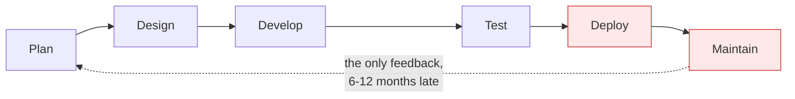
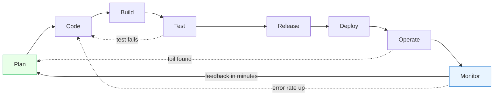
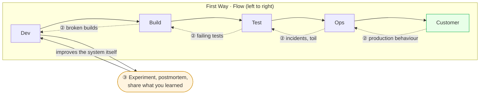
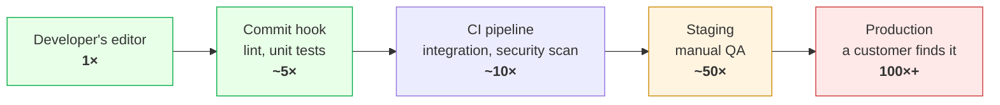
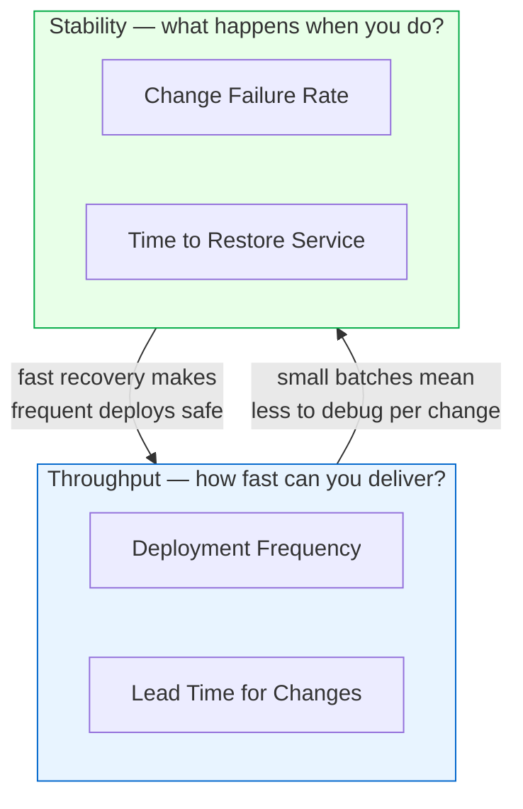
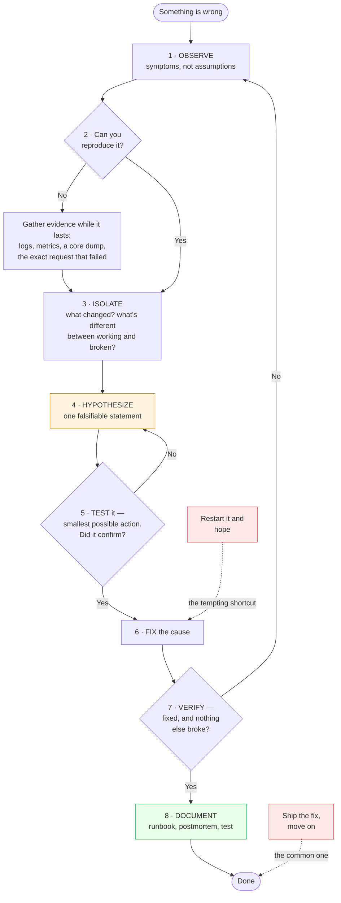

# Module 00: DevOps Foundations

> *"DevOps is not a tool, a team, or a title. It's a culture of collaboration, automation, and continuous improvement."*

---

## Why This Module Matters

Before you touch a single tool, you need to understand **why DevOps exists**. Every company you'll work at has its own version of "DevOps," but the underlying principles are universal. This module gives you the mental model that makes every subsequent tool and practice click into place.

**In real-world DevOps work**, you'll constantly be asked:

- "Why are we automating this?"
- "How does this fit into our delivery pipeline?"
- "What's the risk of this change?"

If you don't understand the foundations, you'll be a tool operator. If you do, you'll be an **engineer**.

---

## Table of Contents

1. [What Is DevOps?](#1-what-is-devops)
2. [The Software Development Lifecycle (SDLC)](#2-the-software-development-lifecycle-sdlc)
3. [DevOps vs Traditional IT](#3-devops-vs-traditional-it)
4. [Core DevOps Principles](#4-core-devops-principles)
5. [DevOps Culture and Collaboration](#5-devops-culture-and-collaboration)
6. [Key DevOps Practices](#6-key-devops-practices)
7. [The DevOps Toolchain](#7-the-devops-toolchain)
8. [DevOps Metrics That Matter](#8-devops-metrics-that-matter)
9. [Common Mistakes and Anti-Patterns](#9-common-mistakes-and-anti-patterns)
10. [Debugging Mindset](#10-debugging-mindset)
11. [Interview Insights](#11-interview-insights)

---

## 1. What Is DevOps?

### The Simple Answer

DevOps is a **set of practices, cultural philosophies, and tools** that increase an organization's ability to deliver applications and services at high velocity.

### The Real Answer

DevOps was born from a problem: **developers and operations teams worked in silos**.

```
BEFORE DevOps:
┌─────────────┐     "Works on my machine"     ┌─────────────┐
│  Developers  │────────────  ──────────────▶│  Operations  │
│  (Build it)  │     Wall of Confusion         │  (Run it)    │
└─────────────┘                                └─────────────┘
     Fast but unstable                           Stable but slow

AFTER DevOps:
┌──────────────────────────────────────────────┐
│              DevOps Culture                   │
│  Developers + Operations = Shared Ownership   │
│  Build → Test → Deploy → Monitor → Improve    │
│  Automated, Measured, Continuously Improving   │
└──────────────────────────────────────────────┘
     Fast AND stable
```

### The Three Pillars

| Pillar | What It Means | Example |
|--------|--------------|---------|
| **People** | Break silos, shared responsibility | Dev and Ops in same standup |
| **Process** | Automate, iterate, measure | CI/CD pipelines, blameless postmortems |
| **Technology** | Right tools for the job | Docker, Kubernetes, Terraform, etc. |

> ** Key Insight**: Tools are the *least* important pillar. Most DevOps failures come from culture and process problems, not tooling.

---

## 2. The Software Development Lifecycle (SDLC)

Understanding the SDLC is critical because DevOps wraps around every phase of it.

### Traditional SDLC (Waterfall)



**Problems**: Slow feedback, high risk releases, "big bang" deployments. Look at where the single feedback arrow starts — you learn whether the plan was right only after the whole thing has shipped.

### DevOps-Enhanced SDLC



**Key difference**: the cycle is continuous, and — more importantly — there are *several* feedback arrows, not one. Each iteration is small, so risk is low and every arrow is short enough that the person who caused a problem is still holding the context needed to fix it.

### SDLC Phases in DevOps Context

| Phase | Traditional | DevOps Way |
|-------|------------|------------|
| **Plan** | Quarterly planning documents | Sprint planning, backlog grooming, shared OKRs |
| **Code** | Developers code in isolation | Trunk-based dev, code reviews, pair programming |
| **Build** | Manual builds on dev machines | Automated builds (CI), build as code |
| **Test** | QA phase after development | Automated tests run on every commit |
| **Release** | Change advisory boards, manual sign-offs | Automated release pipelines, feature flags |
| **Deploy** | Weekend maintenance windows | Blue-green, canary, rolling deployments |
| **Operate** | Ops on-call, firefighting | Infrastructure as code, self-healing systems |
| **Monitor** | Check dashboards when something fails | Continuous monitoring, alerting, SLOs |

---

## 3. DevOps vs Traditional IT

| Aspect | Traditional IT | DevOps |
|--------|---------------|--------|
| **Release frequency** | Weeks/months | Hours/days |
| **Deployment** | Manual, risky | Automated, routine |
| **Team structure** | Siloed (Dev, QA, Ops) | Cross-functional |
| **Failure response** | Blame, root cause (find the person) | Blameless postmortems (fix the system) |
| **Infrastructure** | Manually configured servers | Infrastructure as Code |
| **Testing** | Manual QA at the end | Automated tests throughout |
| **Monitoring** | Reactive ("server is down!") | Proactive (alerts before users notice) |
| **Change management** | Heavy approval processes | Small, frequent, low-risk changes |

### The CALMS Framework

A well-known model for evaluating DevOps maturity:

- **C**ulture — Shared ownership between Dev and Ops
- **A**utomation — Automate repetitive tasks
- **L**ean — Focus on value, eliminate waste
- **M**easurement — Data-driven decisions
- **S**haring — Knowledge sharing, transparency

---

## 4. Core DevOps Principles

### Principle 1: The Three Ways (from *The Phoenix Project*)

**The First Way — Systems Thinking (Flow)**

- Optimize for the overall system, not individual parts
- Work flows from left (Dev) to right (Ops) to customer
- Reduce batch sizes and intervals of work
- Never pass known defects downstream

**The Second Way — Feedback Loops**

- Create right-to-left feedback at all stages
- Shorten and amplify feedback loops
- When problems happen, fix them immediately
- Push quality closer to the source

**The Third Way — Continuous Learning**

- Foster a culture of experimentation
- Accept that failure is inevitable — learn from it
- Allocate time for process improvement
- Share knowledge widely

The three are one system, and the diagram is the point: each Way only works because the one before it does.



**Read it in order.** ① Work only ever moves right, and defects never do. ② Every stage reports back to the one before it, as fast as possible — that is what makes the flow safe. ③ The learning loop is the one that changes the *system* rather than the work item, and it is the one organisations skip, which is why they get faster at repeating the same failure.

### Principle 2: Automation Everything

```
Manual Process              →  Automated Process
──────────────                 ──────────────────
"SSH into server and         →  Infrastructure as Code
 install packages"              (Terraform/Ansible)

"Run tests before you        →  CI pipeline runs tests
 push to main"                  on every commit

"Check if the app is up"     →  Prometheus + Grafana
                                with alerting
```

### Principle 3: Infrastructure as Code (IaC)

Treat your infrastructure like application code:

- **Version controlled** — track every change
- **Reviewable** — code reviews for infra changes
- **Testable** — validate before applying
- **Reproducible** — spin up identical environments

### Principle 4: Shift Left

Move quality activities earlier in the pipeline:

The argument is not "test more". It is that the *same defect* costs a different amount depending on which gate catches it:



The multipliers are rough, and the shape is not: cost rises because the number of people involved rises. A failing unit test costs one developer two minutes with the code already in their head. The same bug in production costs an incident channel, a rollback, a postmortem, and a customer who now doubts you — and the developer has to rebuild the context they lost three weeks ago. **Shift Left means moving each check to the earliest gate that can honestly run it.**

### Principle 5: Observability First

**You cannot manage what you cannot measure.**

- Monitor everything from day one
- Metrics, logs, and traces are non-negotiable
- Set alerts before you need them

>**This is why we teach Observability (Module 07) BEFORE infrastructure automation (Modules 10-12)**. You need to understand how systems behave before you automate them at scale.

---

## 5. DevOps Culture and Collaboration

### Blameless Postmortems

When things break (and they will), the response should be:

 **"Who pushed the bad code?"**
 **"What system gap allowed this to reach production?"**

A blameless postmortem template:

```markdown
## Incident: [Title]
**Date**: YYYY-MM-DD
**Duration**: X hours
**Severity**: P1/P2/P3
**Impact**: What users experienced

### Timeline
- HH:MM — First alert fired
- HH:MM — Investigation began
- HH:MM — Root cause identified
- HH:MM — Fix deployed
- HH:MM — All clear confirmed

### Root Cause
[Technical explanation of what went wrong]

### Contributing Factors
[Why the problem wasn't caught earlier]

### Action Items
- [ ] [Preventive action 1] — Owner: [name] — Due: [date]
- [ ] [Preventive action 2] — Owner: [name] — Due: [date]

### Lessons Learned
[What we'll do differently]
```

### Shared Responsibility (You Build It, You Run It)

In modern DevOps organizations:

- The team that **builds** the service also **operates** it
- This creates incentive to build reliable, observable software
- On-call rotations include developers, not just ops

### Communication Practices

- **Daily standups** — Short sync on blockers and progress
- **Chatops** — Use Slack/Teams bots for deployment, monitoring
- **Documentation** — Runbooks for every service
- **War rooms** — Collaborative incident response

---

## 6. Key DevOps Practices

### Continuous Integration (CI)

- Developers merge code to main branch frequently (at least daily)
- Every merge triggers automated build + tests
- Broken builds are fixed immediately (top priority)

### Continuous Delivery (CD)

- Every code change is automatically prepared for release
- Deployment to production is a one-click (or zero-click) operation
- Production-like environments for testing

### Continuous Deployment

- CI + CD, but deployments happen automatically
- No human approval gate for production
- Requires high confidence in test suite

```
CI only:         Code → Build → Test →  (done)
CI + CD:         Code → Build → Test → Package → Staging →  (manual deploy to prod)
CI + Continuous:  Code → Build → Test → Package → Staging → Production (automatic)
```

### Infrastructure as Code (IaC)

- Define infrastructure in code files
- Version control all infrastructure
- Apply changes through pipelines, not manual commands

### Configuration Management

- Ensure all servers are configured consistently
- Detect and correct configuration drift
- Tools: Ansible, Puppet, Chef

### Monitoring and Observability

- **Metrics**: Numbers that describe system state (CPU, latency, error rate)
- **Logs**: Event records from applications and infrastructure
- **Traces**: Request path through distributed systems
- **Alerting**: Automated notifications when things go wrong

---

## 7. The DevOps Toolchain

Here's how our tool stack maps to DevOps practices:

```
PLAN        CODE        BUILD       TEST        RELEASE
┌──────┐   ┌──────┐   ┌──────┐   ┌──────┐    ┌──────────┐
│Jira  │   │ Git  │   │Docker│   │GitHub│    │  GitHub   │
│GitHub│   │GitHub│   │GitHub│   │Action│    │  Actions  │
│Issues│   │      │   │Action│   │      │    │  (CD)     │
└──────┘   └──────┘   └──────┘   └──────┘    └──────────┘

DEPLOY          OPERATE          MONITOR
┌────────┐    ┌──────────┐    ┌────────────┐
│Terraform│   │ Ansible  │    │ Prometheus │
│Ansible  │   │Kubernetes│    │  Grafana   │
│K8s      │   │  Docker  │    │  ELK/Loki  │
│Nginx    │   │          │    │            │
└────────┘    └──────────┘    └────────────┘
```

### Why These Specific Tools?

| Tool | Market Adoption | Why We Chose It |
|------|----------------|-----------------|
| **Git + GitHub** | 95%+ of companies | Universal, collaborative, integrates everything |
| **Docker** | 83% of companies use containers | Industry standard, portable, reproducible |
| **GitHub Actions** | Fastest-growing CI/CD | Free, native GitHub, modern YAML syntax |
| **Prometheus + Grafana** | De facto for cloud-native | Open-source, powerful, industry standard |
| **Terraform** | 70%+ IaC market share | Multi-cloud, declarative, huge community |
| **Kubernetes** | 96% of orgs evaluating/using | Standard container orchestration platform |

---

## 8. DevOps Metrics That Matter

### DORA Metrics (Google's DevOps Research)

These four metrics define elite DevOps performance:

| Metric | Elite | High | Medium | Low |
|--------|-------|------|--------|-----|
| **Deployment Frequency** | On-demand (multiple/day) | Weekly to monthly | Monthly to 6-monthly | Fewer than once per 6 months |
| **Lead Time for Changes** | Less than one day | One day to one week | One to six months | More than six months |
| **Change Failure Rate** | 0-15% | 16-30% | 16-30% | 16-30% |
| **Time to Restore Service** | Less than one hour | Less than one day | One day to one week | More than six months |

The four split into two pairs, and the finding that made DORA famous is what the diagram shows: teams do **not** trade one pair against the other.



 **This is the counterintuitive part.** Intuition says shipping more often must break things more often, so you slow down to be safe. The data says the opposite: elite performers score well on *both* pairs, because the mechanisms reinforce each other. Deploying ten small changes a day means each failure has one obvious suspect, and knowing you can restore in an hour is what makes deploying at all reasonable. Slowing down does not buy stability — it buys larger, riskier batches and rustier recovery skills.

>Report all four together or none. Deployment Frequency on its own is the easiest metric in the industry to game, and a team optimising it alone will happily ship faster while the change failure rate climbs.

### Other Important Metrics

- **Mean Time to Detect (MTTD)** — How fast you notice a problem
- **Mean Time to Recover (MTTR)** — How fast you fix it
- **Availability** — Uptime percentage (99.9% = 8.76 hours downtime/year)
- **Error Budget** — How much downtime you can "afford" (100% - SLO)

---

## 9. Common Mistakes and Anti-Patterns

### Anti-Pattern 1: "DevOps Team"

Creating a separate "DevOps team" between Dev and Ops just creates **another silo**.

 **Correct**: Embed DevOps practices within existing teams. Everyone owns the pipeline.

### Anti-Pattern 2: Tool-First Thinking

"Let's use Kubernetes!" before understanding the problem.

 **Correct**: Identify the pain point first, then choose the simplest tool that solves it.

### Anti-Pattern 3: Automating Chaos

Automating a broken process makes it break **faster**.

 **Correct**: Fix the process first, then automate it.

### Anti-Pattern 4: Ignoring Monitoring

"We'll add monitoring later."

 **Correct**: Monitoring is day-one infrastructure. Build it alongside your application.

### Anti-Pattern 5: Treating IaC Like Scripts

Writing Terraform like a shell script (procedural, no state management).

 **Correct**: Understand declarative vs imperative. Use state files, modules, and proper structure.

### Anti-Pattern 6: No Runbooks

"Only one person knows how to restart the payment service."

 **Correct**: Document every operational procedure. If only one person can do it, it's a bus-factor risk.

---

## 10. Debugging Mindset

> *The most valuable DevOps skill is not knowing tools — it's knowing how to systematically troubleshoot problems.*

### The Debugging Framework

```
1. OBSERVE     →  What exactly is happening? (symptoms, not assumptions)
2. REPRODUCE   →  Can I trigger the issue consistently?
3. ISOLATE     →  What changed recently? What's different?
4. HYPOTHESIZE →  Based on evidence, what could cause this?
5. TEST        →  Verify your hypothesis with the smallest possible action
6. FIX         →  Apply the fix
7. VERIFY      →  Confirm the fix works AND nothing else broke
8. DOCUMENT    →  Write it down so no one fights this again
```

As a loop, with the two places people actually go wrong marked in red:



Both red boxes are shortcuts that feel like progress. Restarting jumps from symptom straight to "fix" with no hypothesis, so you learn nothing and it returns at 3am. Skipping step 8 means the next person — often you, in six months — starts this flowchart again from the top.

### Real-World Debugging Examples

**Scenario**: "The website is slow"

```
 Beginner response: "Let's restart the server"
 DevOps response:
   1. Check monitoring dashboards (CPU, memory, I/O, network)
   2. Check application logs for errors/warnings
   3. Check recent deployment history (what changed?)
   4. Check database query performance
   5. Check external dependencies (APIs, CDN, DNS)
   6. Narrow down to the specific bottleneck
   7. Fix root cause, not just symptom
```

**Scenario**: "Deployment failed"

```
 DevOps response:
   1. Read the pipeline logs (don't guess!)
   2. Identify which step failed
   3. Check what's different (code change? config? dependency?)
   4. Reproduce locally if possible
   5. Fix forward or rollback based on impact
   6. Add a test to prevent recurrence
```

---

## 11. Interview Insights

### Frequently Asked Questions

**Q: What is DevOps?**
> DevOps is a set of practices that combines software development and IT operations to shorten the development lifecycle and deliver software with high reliability. It emphasizes culture, automation, measurement, and sharing.

**Q: Explain CI/CD.**
> CI (Continuous Integration) is the practice of merging code changes frequently and automatically running builds and tests. CD can mean Continuous Delivery (every change is release-ready) or Continuous Deployment (every change goes to production automatically).

**Q: What's the difference between DevOps and SRE?**
> SRE (Site Reliability Engineering) is Google's implementation of DevOps. SRE focuses on reliability through error budgets, SLOs, and reducing toil. DevOps is broader — it covers culture, processes, and tools across the entire delivery lifecycle. SRE can be seen as a specific framework within the DevOps philosophy.

**Q: Name DevOps best practices.**
> Infrastructure as Code, CI/CD pipelines, automated testing, monitoring and observability, blameless postmortems, small frequent deployments, shift-left security, and documentation as code.

**Q: What are the DORA metrics?**
> Deployment frequency, lead time for changes, change failure rate, and time to restore service. These are research-backed metrics from Google that correlate with organizational performance.

### Scenario-Based Questions

**Q: Your team deploys once a month and releases keep breaking. What do you do?**
>
> 1. Increase deployment frequency (smaller changes = less risk)
> 2. Implement CI with automated tests
> 3. Add staging environment that mirrors production
> 4. Set up monitoring and alerting
> 5. Conduct blameless postmortems for each failure
> 6. Gradually move toward continuous delivery

**Q: A developer says "it works on my machine." How do you solve this?**
> This is a classic environment inconsistency problem. Solutions: containerize the application (Docker), use infrastructure as code for environment parity, implement CI that builds in a clean environment, and define development environments in code.

---

## Labs and Projects

Read the sections above first, then work through these **in order**. Every lab ends with a  **Break It** section — those are not optional; they are where the debugging skill actually comes from.

| # | Lab | What you'll do |
|---|-----|----------------|
| 1 | **[Mapping a Software Delivery Pipeline](./labs/lab-01-mapping-delivery-pipeline.md)** | Understand how software gets from a developer's machine to production by mapping a real delivery pipeline. |
| 2 | **[DevOps Self-Assessment & Environment Setup](./labs/lab-02-devops-self-assessment.md)** | Assess your current knowledge level and set up the foundational environment you'll use throughout this entire handbook. |

**Portfolio project:**

- [Project: Delivery Pipeline Map and Improvement Proposal](./projects/project-01-delivery-pipeline-map.md) — Choose a real or realistic software delivery process and map how work moves from idea to production.

---

## Self-Check

Answer these from memory before you expand them. If more than two give you trouble, re-read the sections they come from — the labs assume this material is solid.

<details>
<summary><strong>1. What problem was DevOps invented to solve?</strong></summary>

The wall of confusion: development was rewarded for shipping change, operations for keeping things stable, and the two lived in separate teams with opposing incentives. Releases were rare, large, and risky. DevOps makes one team own the service from build through run, so the people who write the change also feel it in production.

</details>

<details>
<summary><strong>2. Name the four DORA metrics and say what each one tells you.</strong></summary>

Deployment frequency and lead time for changes measure speed; change failure rate and time to restore service measure stability. The point is that they move together — teams that deploy often recover faster, because small changes are easier to understand and undo.

</details>

<details>
<summary><strong>3. Why is "we hired a DevOps team" usually an anti-pattern?</strong></summary>

It recreates the silo DevOps was meant to remove — now there are three teams and a new hand-off. A platform team is fine when it builds tooling other teams use themselves; it stops being fine when it becomes the queue every deployment waits in.

</details>

<details>
<summary><strong>4. What is the difference between continuous integration, continuous delivery, and continuous deployment?</strong></summary>

CI: every commit is merged to shared main and automatically built and tested. Continuous delivery: every green build is releasable and deploying is a decision someone makes. Continuous deployment: that decision is automated — green means it goes to production.

</details>

<details>
<summary><strong>5. Why are postmortems blameless, given that a human usually did type the command?</strong></summary>

Because punished people stop volunteering information, and that information is the entire value of the exercise. A system where one mistyped command causes an outage has a design defect; the fix is a guardrail, not a scolded engineer.

</details>

<details>
<summary><strong>6. Why does finding a defect earlier cost less?</strong></summary>

The later it surfaces, the more context has been lost and the more work has been built on top of it. A failing unit test costs minutes and one person's attention; the same bug found in production costs an incident, a rollback, and everyone's trust in the release.

</details>

---

## Practical Checkpoint

Before moving on, you should be able to:

- Map a software delivery process from idea to production.
- Identify manual handoffs, slow feedback loops, and common failure points.
- Explain one improvement using DevOps principles such as automation, observability, or smaller releases.

Portfolio evidence to keep:

- A delivery pipeline map.
- A short improvement proposal with one metric you would track.
- Notes from one real or imagined deployment failure and how the process should change.

Suggested project: [Delivery Pipeline Map and Improvement Proposal](./projects/project-01-delivery-pipeline-map.md)

---

## What's Next?

You now understand **why** DevOps exists and its core principles. Next, we dive into the first practical skill every DevOps engineer needs:

**[Module 01: Linux →](../01-linux/)**

Linux is the backbone of DevOps. Almost every server, container, and CI/CD runner is Linux. You must be comfortable at the command line before anything else.

---

<div align="center">

**Module 00 Complete** 

[← Back to Main README](../README.md) | [Next: Linux →](../01-linux/)

</div>


## Reference
<!-- tab: Labs -->
# Lab 01: Mapping a Software Delivery Pipeline

## Objective

Understand how software gets from a developer's machine to production by mapping a real delivery pipeline. This builds the mental model you'll implement throughout this course.

---

## Prerequisites

- A piece of paper or a diagramming tool (draw.io, Excalidraw, or even a text editor)
- No technical setup required for this lab

---

## Deliverables and Evidence

By the end of this lab, keep the following evidence in your notes or portfolio repo:

- Commands you ran and the important output you used for validation
- Any files, scripts, configs, manifests, or workflows you created
- A short failure note describing one thing that broke, how you diagnosed it, and how you fixed it
- Cleanup commands or confirmation that no long-running resources remain

Treat the validation section as the minimum proof that the lab worked.

---

## Exercise 1: Map a Manual Deployment Process

### Scenario

You work at a company where the deployment process looks like this:

1. Developer writes code on their laptop
2. Developer emails a `.zip` file to the team lead
3. Team lead reviews code by reading files
4. Team lead sends the `.zip` to the QA team
5. QA manually tests on their machine
6. QA sends a "Go" email to the Ops team
7. Ops person SSHs into the production server
8. Ops person stops the old application
9. Ops person copies new files to the server
10. Ops person starts the application
11. Ops person manually checks if it's working

### Task

1. Draw this process as a flowchart
2. Identify every **risk** at each step
3. Identify every **manual step** that could be automated
4. Estimate the total time this process takes

### Expected Analysis

| Step | Risk | Can Automate? |
|------|------|---------------|
| Email zip file | File could be wrong version, corrupted, or intercepted |  Version control (Git) |
| Manual code review | Inconsistent, reviewer might miss issues |  PR reviews + automated linting |
| Manual testing | Tests might be skipped, inconsistent coverage |  Automated test suites |
| SSH to production | Human error, no audit trail |  CI/CD pipeline |
| Manual health check | Might miss subtle issues |  Automated monitoring |

**Total manual time estimate**: 2-8 hours per deployment, depending on issues found.

---

## Exercise 2: Design the DevOps Version

### Task

Redesign the same process using DevOps practices. Write out:

1. What happens when a developer pushes code
2. What automated checks run
3. How the deployment happens
4. How you know if it worked

### Expected Design

```
Developer pushes to GitHub
        │
        ▼
GitHub Actions triggers
        │
        ├── Build application
        ├── Run unit tests
        ├── Run linting/static analysis
        ├── Run security scan
        │
        ▼
All checks pass? ──── No ──▶ Developer gets notification, fixes issues
        │
        Yes
        │
        ▼
Deploy to staging environment
        │
        ├── Run integration tests
        ├── Run smoke tests
        │
        ▼
All staging tests pass? ──── No ──▶ Alert team, block deployment
        │
        Yes
        │
        ▼
Deploy to production (automated or one-click)
        │
        ├── Rolling/blue-green deployment
        ├── Health checks run automatically
        ├── Monitoring verifies metrics
        │
        ▼
Production healthy? ──── No ──▶ Auto-rollback to previous version
        │
        Yes
        │
        ▼
 Deployment complete (notification sent)
```

**Total automated time**: 5-15 minutes per deployment.

---

## Exercise 3: Calculate the Business Impact

### Task

Compare the two approaches using these numbers:

| Metric | Manual Process | DevOps Pipeline |
|--------|---------------|-----------------|
| Time per deployment | 4 hours | 10 minutes |
| Deployments per month | 1 | 30 |
| Failure rate | 30% | 5% |
| Recovery time | 4 hours | 15 minutes |

### Questions to Answer

1. How many engineer-hours per month does the manual process cost?
2. How much faster can the DevOps team respond to a critical bug?
3. If the company loses $10,000 per hour of downtime, what's the cost difference?

### Expected Calculations

**Manual process monthly cost:**

- Deployment time: 1 × 4 hours = 4 hours
- Failure recovery: 0.30 × 4 hours = 1.2 hours
- Total: ~5.2 engineer-hours
- Downtime cost: 0.30 × 4 hours × $10,000 = $12,000

**DevOps pipeline monthly cost:**

- Deployment time: 30 × 0.17 hours = 5.1 hours (but fully automated)
- Failure recovery: 0.05 × 30 × 0.25 hours = 0.375 hours
- Total human time: ~1 hour (monitoring/intervention)
- Downtime cost: 0.05 × 30 × 0.25 hours × $10,000 = $3,750

**Net savings**: ~$8,250/month in downtime + significant engineer time back.

---

## Exercise 4: Blameless Postmortem Practice

### Scenario

Imagine this incident happened:

> At 3:00 PM on Tuesday, the production API started returning 500 errors for 40% of requests. The on-call engineer was paged. After 45 minutes of investigation, they found that a database migration script deleted an important index. The script was part of a deployment that went out at 2:45 PM. It was not tested in staging because "staging doesn't have production data." The fix was to recreate the index, which took 20 minutes. Total impact: 65 minutes of degraded service affecting ~12,000 users.

### Task

Write a blameless postmortem using this template:

```markdown
## Incident Report: [Title]

**Date**: 
**Duration**: 
**Severity**: 
**Impact**: 

### Timeline
[Chronological events with timestamps]

### Root Cause
[Technical root cause — NOT "someone made a mistake"]

### Contributing Factors
[System/process gaps that allowed this]

### Action Items
- [ ] [Action] — Owner — Due Date
- [ ] [Action] — Owner — Due Date
- [ ] [Action] — Owner — Due Date

### Lessons Learned
[What changes to process/tooling will prevent this]
```

### Key Points for Your Postmortem

Your action items should include things like:

-Add database migration testing to CI pipeline
-Create staging database with realistic (anonymized) data
-Add database performance checks to deployment pipeline
-Set up alerts for sudden increases in 500 error rates

Things **not** to write:

-"Bob should be more careful with migrations"
-"We need to approve all database changes manually"

---

## Break It: Pre-Mortem on Your Own Pipeline

There's no running system in this lab, so you can't break one. You can do something more valuable at this stage: **break the pipeline you designed in Exercise 2, on paper, before you build it.**

A pre-mortem inverts the postmortem. Instead of asking *"why did this fail?"* after the fact, you assume failure has already happened and work backwards to the cause. Teams consistently find more real risks this way than by asking "what could go wrong?" — because the assumption of failure removes the optimism.

### The Exercise

Open your Exercise 2 pipeline design. Then write this sentence at the top of a page and finish it four times:

> *"It's six months from now. The pipeline we designed has caused a serious production incident. Here is exactly what happened."*

Force yourself to write **specific, concrete stories** — not "the tests were bad" but "the integration test suite took 40 minutes, so someone added `--skip-integration` to the deploy job in March to unblock a hotfix, and nobody removed it."

### The Four Failures You Must Account For

Every pipeline design has these four holes until it's proven otherwise. Write a paragraph on each:

**1. The pipeline is green but the deploy is broken.**
What can pass every check you designed and still take production down? Consider: a config change no test covers, a database migration that's valid in isolation but incompatible with the currently-running code, an environment variable that exists in staging but not production, a dependency that resolved to a different version at build time.

- What's your **detection** time? (How long before anyone knows?)
- What's your **rollback** procedure, and who can run it at 3am?

**2. Someone bypasses the pipeline.**
Under what pressure does a human go around your automation — and how? Direct SSH to a server? A manual `kubectl apply`? A merge with admin override? Disabling a required check "temporarily"?

- What would make the pipeline **faster than the workaround**? (This is the only durable fix.)
- What makes a bypass **visible** after the fact?

**3. The pipeline itself fails.**
Your CI provider has an outage. The registry is unreachable. A third-party action you pinned to `@v1` is compromised. Your only person who understands the Jenkins config is on leave.

- Can you deploy a **critical security fix** with the pipeline down? Write the manual procedure.
- What's your single point of failure? (There is one. Name it.)

**4. It works perfectly and nobody notices the real problem.**
Deploys are fast and green. Error rates are flat. And the feature you shipped last Tuesday has been quietly corrupting 2% of orders since then, because nothing in your pipeline validates *business* correctness.

- What would have caught it? A canary with real traffic? An SLO on a business metric rather than a technical one? A smoke test that exercises a real user journey?

### Turn It Into Design Changes

For each of the four stories, write **one concrete change** to your Exercise 2 diagram. Add them to the design:

| Failure story | Design change it forces |
|---------------|-------------------------|
| Green pipeline, broken deploy | Post-deploy smoke test + automatic rollback on SLO breach |
| Someone bypassed it | Branch protection with no admin override + audit alert on direct pushes |
| Pipeline itself down | A documented, tested manual deploy runbook — practised quarterly |
| Silent business-logic failure | An alert on a business metric (orders/min), not just HTTP 500s |

### Deliverable

Add a `pre-mortem.md` to your portfolio containing:

- [ ] Four failure stories, written as if they already happened, with specific detail
- [ ] The design change each one forces
- [ ] An updated Exercise 2 pipeline diagram showing those changes
- [ ] One sentence on which of the four you think is **most likely** in a real team, and why

>**Why this belongs in Module 00**: every later module in this handbook has a "Break It" section where you break something real. The habit those sections build is *thinking in failure modes*. Starting it here — before you know any tools — proves the habit is about judgement, not tooling. Most production incidents are not caused by a tool that malfunctioned; they're caused by a system that worked exactly as designed, in a situation nobody designed for.

---

## Validation

You've completed this lab successfully when you can:

- [ ] Explain why manual processes are risky
- [ ] Design a basic CI/CD pipeline conceptually
- [ ] Calculate business impact of DevOps adoption
- [ ] Write a blameless postmortem
- [ ] Articulate the difference between blame culture and learning culture

---

## Key Takeaways

1. DevOps isn't about tools — it's about reducing the risk and cost of delivering software
2. Automation reduces human error and frees engineers for creative work
3. Blameless postmortems fix systems, not people
4. The business case for DevOps is measurable and compelling

## What to Commit

Add these to your portfolio repo as evidence of completed work:

- Your delivery pipeline diagram (manual vs DevOps version)
- Business impact analysis with calculated metrics
- Blameless postmortem document from Exercise 4
- Notes on bottlenecks identified and proposed improvements

---

[← Back to Module README](../README.md) | [Next Lab: DevOps Self-Assessment →](./lab-02-devops-self-assessment.md)

---

# Lab 02: DevOps Self-Assessment & Environment Setup

## Objective

Assess your current knowledge level and set up the foundational environment you'll use throughout this entire handbook. By the end of this lab, you'll know exactly where your gaps are and have a working development environment.

---

## Prerequisites

- A computer with at least 8GB RAM (16GB recommended)
- Internet connection
- Willingness to install software

---

## Deliverables and Evidence

By the end of this lab, keep the following evidence in your notes or portfolio repo:

- Commands you ran and the important output you used for validation
- Any files, scripts, configs, manifests, or workflows you created
- A short failure note describing one thing that broke, how you diagnosed it, and how you fixed it
- Cleanup commands or confirmation that no long-running resources remain

Treat the validation section as the minimum proof that the lab worked.

---

## Exercise 1: Skills Self-Assessment

Rate yourself 1-5 on each skill. Be honest — this is for you, not anyone else.

```
1 = Never heard of it
2 = Know what it is but never used it
3 = Used it a few times
4 = Comfortable using it
5 = Can teach others
```

### Assessment Checklist

| Skill | Your Rating (1-5) | Module |
|-------|-------------------|--------|
| Linux command line basics | ___ | 01 |
| File permissions and ownership | ___ | 01 |
| Process management (ps, kill, systemd) | ___ | 01 |
| TCP/IP networking basics | ___ | 02 |
| DNS understanding | ___ | 02 |
| HTTP/HTTPS concepts | ___ | 02 |
| Git basics (commit, push, pull) | ___ | 03 |
| Git branching and merging | ___ | 03 |
| Bash scripting | ___ | 04 |
| Python basics | ___ | 04 |
| Docker (building/running containers) | ___ | 05 |
| Docker Compose | ___ | 05 |
| CI/CD concepts | ___ | 06 |
| Monitoring and alerting | ___ | 07 |
| Log management | ___ | 08 |
| Cloud services (any provider) | ___ | 09 |
| Infrastructure as Code | ___ | 10 |
| Kubernetes | ___ | 12 |

### Interpreting Your Scores

- **1-2 on most items**: Start from Module 00. Don't skip anything.
- **3-4 on Modules 01-04**: You can skim these but DO the labs anyway. You'll find gaps.
- **4-5 on Modules 01-05**: Start from Module 06, but read the theory sections of earlier modules.

---

## Exercise 2: Setting Up Your Development Environment

### Option A: Native Linux (Best for Learning)

If you're on Debian/Ubuntu:

```bash
# Update system
sudo apt update && sudo apt upgrade -y

# Install essential tools
sudo apt install -y \
    curl \
    wget \
    git \
    vim \
    nano \
    htop \
    net-tools \
    tree \
    jq \
    unzip \
    build-essential \
    software-properties-common

# Verify installations
git --version
curl --version
python3 --version
```

If you're on a RHEL-compatible distro:

```bash
# Update system
sudo dnf upgrade -y

# Install essential tools
sudo dnf groupinstall -y "Development Tools"
sudo dnf install -y \
    curl \
    wget \
    git \
    vim \
    nano \
    htop \
    net-tools \
    tree \
    jq \
    unzip \
    python3 \
    python3-pip

# Verify installations
git --version
curl --version
python3 --version
```

**Expected output** (versions may differ):

```
git version 2.43.0
curl 8.5.0
Python 3.12.3
```

### Option B: Windows with WSL2 (Windows Users)

```powershell
# Open PowerShell as Administrator
wsl --install -d Ubuntu-22.04

# After restart, open Ubuntu from Start Menu
# Set up your username and password when prompted
```

Then follow the Linux setup above.

### Option C: macOS

```bash
# Install Homebrew (if not already installed)
/bin/bash -c "$(curl -fsSL https://raw.githubusercontent.com/Homebrew/install/HEAD/install.sh)"

# Install essential tools
brew install curl wget git vim htop tree jq

# Verify
git --version
curl --version
python3 --version
```

### Common Setup (All Platforms)

```bash
# Configure Git (use YOUR information)
git config --global user.name "Your Name"
git config --global user.email "your.email@example.com"
git config --global init.defaultBranch main
git config --global core.editor "vim"  # or nano, code, etc.

# Verify Git config
git config --list

# Create a working directory for this handbook
mkdir -p ~/devops-handbook-labs
cd ~/devops-handbook-labs

# Create a test file to verify everything works
echo "DevOps Handbook - Environment Ready!" > test.txt
cat test.txt
```

**Expected output:**

```
DevOps Handbook - Environment Ready!
```

---

## Exercise 3: Install Docker (Preview — Used Extensively from Module 05)

We install Docker now because some early labs benefit from it.

### Debian/Ubuntu/WSL2

```bash
# Remove old versions
sudo apt-get remove -y docker docker-engine docker.io containerd runc 2>/dev/null

# Install prerequisites
sudo apt-get update
sudo apt-get install -y \
    ca-certificates \
    curl \
    gnupg \
    lsb-release

# Add Docker's official GPG key
sudo install -m 0755 -d /etc/apt/keyrings
curl -fsSL https://download.docker.com/linux/ubuntu/gpg | sudo gpg --dearmor -o /etc/apt/keyrings/docker.gpg
sudo chmod a+r /etc/apt/keyrings/docker.gpg

# Add the repository
echo \
  "deb [arch="$(dpkg --print-architecture)" signed-by=/etc/apt/keyrings/docker.gpg] https://download.docker.com/linux/ubuntu \
  "$(. /etc/os-release && echo "$VERSION_CODENAME")" stable" | \
  sudo tee /etc/apt/sources.list.d/docker.list > /dev/null

# Install Docker Engine
sudo apt-get update
sudo apt-get install -y docker-ce docker-ce-cli containerd.io docker-buildx-plugin docker-compose-plugin

# Add your user to the docker group (no sudo needed for docker commands)
sudo usermod -aG docker $USER

# Apply the group change (or log out and back in)
newgrp docker

# Verify Docker installation
docker --version
docker compose version
docker run hello-world
```

### RHEL-Compatible

```bash
# Remove old versions if present
sudo dnf remove -y docker docker-client docker-client-latest docker-common docker-latest docker-latest-logrotate docker-logrotate docker-engine podman runc 2>/dev/null

# Add Docker CE repository
sudo dnf install -y dnf-plugins-core
sudo dnf config-manager --add-repo https://download.docker.com/linux/centos/docker-ce.repo

# Install Docker Engine
sudo dnf install -y docker-ce docker-ce-cli containerd.io docker-buildx-plugin docker-compose-plugin

# Enable and start Docker
sudo systemctl enable --now docker

# Add your user to the docker group (no sudo needed for docker commands)
sudo usermod -aG docker $USER

# Apply the group change (or log out and back in)
newgrp docker

# Verify Docker installation
docker --version
docker compose version
docker run hello-world
```

**Expected output for `docker run hello-world`:**

```
Hello from Docker!
This message shows that your installation appears to be working correctly.
...
```

---

## Exercise 4: Create Your Lab Notebook

A lab notebook is a critical DevOps practice — documenting what you learn and what broke.

```bash
# Create your notebook structure
mkdir -p ~/devops-handbook-labs/notes
cd ~/devops-handbook-labs/notes

# Create your first entry
cat > 00-foundations-notes.md << 'EOF'
# Module 00: Foundations — My Notes

## Date Started: $(date +%Y-%m-%d)

## Key Concepts I Learned
- 

## Things I Found Surprising
- 

## Questions I Still Have
- 

## Environment Setup Status
- [ ] Linux/WSL2/macOS ready
- [ ] Git installed and configured
- [ ] Docker installed
- [ ] Lab directory created
- [ ] This notebook created

## Commands I Want to Remember
```bash
# Add useful commands here
```

EOF

echo "Lab notebook created! Edit it as you learn."

```

---

## Break It: Recover Your Own Environment

You just spent an hour setting up a working environment. Now break it deliberately — while nothing depends on it — and fix it yourself. Every one of these will happen to you eventually, usually the morning of something important.

>These are **safe and fully reversible**. Read the fix before you break each one so you always have a way back. Write down your recovery steps as you go — that document *is* the deliverable.

### Scenario 1: "command not found" for Something You Just Installed

**Break it:**

```bash
# Snapshot your PATH first — this is your undo
echo "$PATH" > ~/path-backup.txt
cat ~/path-backup.txt

# Now cripple it for this shell only
export PATH="/usr/bin:/bin"
docker --version
git --version
```

**Symptom:** Tools that worked a minute ago now report `command not found` — but only in this terminal. Opening a new tab makes them work again, which is deeply confusing the first time you see it.

**Investigate:**

```bash
echo "$PATH"                       # what does the shell search?
which docker || echo "not on PATH"
ls -l /usr/local/bin/docker 2>/dev/null || ls -l /usr/bin/docker
type -a git                        # shows every match, plus aliases and functions
command -v python3
```

**Root cause:** The shell only searches directories listed in `$PATH`. Installers put binaries in places like `/usr/local/bin`, `~/.local/bin`, or a version-manager directory, and then add that path in `~/.bashrc` or `~/.profile`. Change or lose `$PATH` and the binary still exists — the shell just can't find it.

**Fix:**

```bash
export PATH="$(cat ~/path-backup.txt)"     # restore this shell
docker --version                            # working again

# Permanent additions belong in your shell rc file:
echo 'export PATH="$HOME/.local/bin:$PATH"' >> ~/.bashrc
source ~/.bashrc
```

>This is the same root cause as "my script works in the terminal but fails in cron" (Module 04) and "works locally, fails in CI" (Module 06). Cron and CI runners start with a minimal `PATH`. Learning to recognise it now saves you three separate confusing afternoons later.

---

### Scenario 2: "permission denied" from the Docker Daemon

**Break it:**

```bash
docker ps                                   # works
# Simulate not being in the docker group
sg root -c "docker ps" 2>&1 | head -3
# or, to see it definitively:
sudo -u nobody docker ps 2>&1 | head -3
```

**Symptom:**

```
permission denied while trying to connect to the Docker daemon socket
at unix:///var/run/docker.sock
```

**Investigate:**

```bash
ls -l /var/run/docker.sock          # srw-rw---- 1 root docker
id                                   # are YOU in the docker group?
getent group docker                  # who is?
systemctl is-active docker           # is the daemon even running?
```

**Root cause:** `docker` the CLI is a thin client that talks to `dockerd` over a Unix socket owned by `root:docker` with mode `660`. If your user isn't in the `docker` group, the kernel refuses the connection before Docker is involved at all.

**Fix:**

```bash
sudo usermod -aG docker "$USER"
#  Group membership is read at LOGIN. You must start a new session:
newgrp docker            # applies to this shell now
# or log out and back in for it to apply everywhere
id -nG | tr ' ' '\n' | grep docker
```

>**Understand what you just granted.** Membership in the `docker` group is effectively **root on the host** — anyone in it can run `docker run -v /:/host` and read or modify the entire filesystem. It's the right choice on your own machine; it is a privilege grant, not a convenience setting, on a shared server.

---

### Scenario 3: Git Refuses Your SSH Key

**Break it:**

```bash
mkdir -p ~/.ssh && chmod 700 ~/.ssh
ls -l ~/.ssh/ 2>/dev/null

# The classic mistake: copying keys around and losing their permissions
if [ -f ~/.ssh/id_ed25519 ]; then
    cp ~/.ssh/id_ed25519 ~/.ssh/id_ed25519.backup
    chmod 644 ~/.ssh/id_ed25519
    ssh -T git@github.com 2>&1 | head -8
fi
```

**Symptom:**

```
@@@@@@@@@@@@@@@@@@@@@@@@@@@@@@@@@@@@@@@@@@@@@@@@@@@@@@@@@@@
@         WARNING: UNPROTECTED PRIVATE KEY FILE!          @
Permissions 0644 for '/home/you/.ssh/id_ed25519' are too open.
This private key will be ignored.
```

**Investigate:**

```bash
ls -ld ~ ~/.ssh ~/.ssh/id_ed25519 ~/.ssh/authorized_keys 2>/dev/null
ssh -vT git@github.com 2>&1 | grep -iE 'identity|offering|permission|authenticat'
ssh-add -l                          # is the agent even holding a key?
```

**Root cause:** SSH refuses to use a private key that other users could read. This is a feature, not a bug — but the error can be hidden behind a generic `Permission denied (publickey)` when you're not using `-v`.

**Fix — the permissions SSH insists on:**

```bash
chmod 700 ~/.ssh
chmod 600 ~/.ssh/id_ed25519           # private key
chmod 644 ~/.ssh/id_ed25519.pub       # public key
chmod 600 ~/.ssh/authorized_keys
chmod 600 ~/.ssh/config 2>/dev/null
#  Your HOME directory must also not be group- or world-writable
chmod g-w,o-w ~

ssh -T git@github.com                 # should now greet you by username
rm -f ~/.ssh/id_ed25519.backup
```

| Path | Mode |
|------|------|
| `~` | not group/world writable |
| `~/.ssh` | `700` |
| private keys | `600` |
| `*.pub` | `644` |
| `authorized_keys` | `600` |

---

### Scenario 4: The Full Disk

**Break it:**

```bash
df -h ~                                     # note your current free space

# Create a 1 GB file (safe — we delete it in a moment)
mkdir -p /tmp/fill-test
fallocate -l 1G /tmp/fill-test/blob 2>/dev/null || dd if=/dev/zero of=/tmp/fill-test/blob bs=1M count=1024
df -h /tmp
du -sh /tmp/fill-test
```

**Symptom (on a real, nearly-full disk):** builds fail with `no space left on device`, Docker refuses to pull images, log writes fail, and — most confusingly — some tools fail while others keep working, because they write to different filesystems.

**Investigate — the standard drill:**

```bash
df -h                                       # 1. which FILESYSTEM is full?
df -i                                       # 2.  or is it INODES, not bytes?
du -h --max-depth=1 / 2>/dev/null | sort -h | tail -10        # 3. walk down from the top
du -h --max-depth=1 ~ 2>/dev/null | sort -h | tail -10
docker system df                            # 4.  Docker is very often the answer
```

**Fix:**

```bash
rm -rf /tmp/fill-test
df -h /tmp

# The three reclaims you'll use most often:
docker system df                            # look before you prune
docker system prune                         # stopped containers, unused networks, dangling images
docker system prune -a                      #  also every image not used by a running container
sudo journalctl --vacuum-time=7d            # trim systemd logs
sudo apt clean || sudo dnf clean all        # package cache
```

>Two disk-full traps worth knowing now. **(1)** `df -h` shows plenty of space but writes still fail → you've run out of **inodes** (`df -i`), usually from millions of tiny files. **(2)** You deleted a huge log file and space didn't come back → a process still holds the file open. Find it with `lsof +L1` and restart it. The space returns when the last file handle closes, not when you delete the name.

---

### Deliverable: Your First Runbook

This is the real output of this exercise. Create `~/devops-handbook-labs/notes/environment-runbook.md`:

```markdown
# My Environment Recovery Runbook

## "command not found" for an installed tool
**Symptom:** ...
**Check:** `echo $PATH`, `which X`, `type -a X`
**Fix:** ...

## Docker: permission denied on the socket
...

## Git/SSH: permission denied (publickey)
...

## No space left on device
...
```

For each entry record: the **exact error text** (so you can search for it later), the **commands that diagnose it**, the **fix**, and **why it happens**.

- [ ] All four scenarios broken and recovered by you, not by copy-pasting the fix blindly
- [ ] `environment-runbook.md` committed to your portfolio repo
- [ ] Every tool verified working again: `git --version && docker run --rm hello-world && ssh -T git@github.com`

>**Why start here**: writing a runbook while nothing is on fire is the single most useful habit in this handbook. Every module from here on ends with the same deliverable. In a real incident you will not think clearly — you will follow a document. Start building that document now, on failures that cost you nothing.

---

## Validation

You've completed this lab successfully when:

- [ ] You've completed the self-assessment honestly
- [ ] Your development environment is set up
- [ ] Git is installed and configured with your identity
- [ ] Docker is installed and `hello-world` ran successfully
- [ ] You've created your lab directory and notebook
- [ ] You can open a terminal and run basic commands

### Quick Validation Script

```bash
#!/bin/bash
echo "=== DevOps Handbook Environment Check ==="
echo ""

# Check Git
if command -v git &> /dev/null; then
    echo " Git: $(git --version)"
else
    echo " Git: NOT INSTALLED"
fi

# Check Python
if command -v python3 &> /dev/null; then
    echo " Python: $(python3 --version)"
else
    echo " Python: NOT INSTALLED"
fi

# Check Docker
if command -v docker &> /dev/null; then
    echo " Docker: $(docker --version)"
else
    echo " Docker: NOT INSTALLED"
fi

# Check Docker Compose
if docker compose version &> /dev/null; then
    echo " Docker Compose: $(docker compose version)"
else
    echo " Docker Compose: NOT INSTALLED"
fi

# Check curl
if command -v curl &> /dev/null; then
    echo " curl: installed"
else
    echo " curl: NOT INSTALLED"
fi

echo ""
echo "=== Check Complete ==="
```

Save and run:

```bash
chmod +x env-check.sh
./env-check.sh
```

---

## Key Takeaways

1. Self-assessment helps you focus your learning on real gaps
2. A consistent development environment prevents "works on my machine" issues
3. Documentation (notebooks) is a DevOps skill — start practicing now
4. Docker will be your most-used tool — getting it installed early is strategic

---

[← Previous Lab](./lab-01-mapping-delivery-pipeline.md) | [Back to Module README](../README.md)

## What to Commit

Add these to your portfolio repo as evidence of completed work:

- Completed self-assessment matrix with honest skill ratings
- Personal learning roadmap based on your gaps
- Notes on which modules to prioritize and why

---
<!-- tab: Projects -->
# Project: Delivery Pipeline Map and Improvement Proposal

## Problem Statement

Choose a real or realistic software delivery process and map how work moves from idea to production. Your goal is to identify slow feedback loops, risky handoffs, and practical DevOps improvements.

## Deliverables

- Current-state delivery pipeline map
- List of bottlenecks, manual steps, and failure points
- Proposed future-state workflow
- One metric you would track, such as lead time, deployment frequency, change failure rate, or MTTR
- Short risk note explaining what could go wrong during the improvement

## Validation

Your proposal is complete when another person can answer:

- Where does work enter the system?
- Where are builds, tests, approvals, deployments, and monitoring handled?
- Which step is the biggest constraint?
- What improvement should happen first and why?

## Failure Scenario

Assume a deployment fails after approval but before production verification. Document how the current process detects the failure, who responds, and what should change to reduce recovery time.

## What to Commit

- `pipeline-map.md`
- `improvement-proposal.md`
- `failure-scenario.md`

## Review Rubric

Use this rubric to self-assess your work or have a peer review it.

| Criteria | What to Look For | Score (1-5) |
|----------|-----------------|-------------|
| **Reproducibility** | Pipeline map is clear enough for someone else to recreate the analysis | |
| **Correctness** | Manual vs DevOps comparison is accurate and uses realistic metrics | |
| **Debugging quality** | Bottlenecks are identified with root cause, not just symptoms | |
| **Security basics** | Security gates (code review, scanning) appear in the DevOps pipeline | |
| **Cleanup quality** | N/A for this conceptual project | |
| **Explanation clarity** | Diagrams and text explain the why, not just the what | |

**Scoring**: 1 = Not attempted, 2 = Partial, 3 = Meets expectations, 4 = Exceeds expectations, 5 = Production quality
<!-- tab: Resources -->
Curated learning resources, organized by type and difficulty.

---

## Essential Reading

| Resource | Type | Difficulty | Notes |
|----------|------|------------|-------|
| [The Phoenix Project](https://itrevolution.com/the-phoenix-project/) | Book | Beginner | **START HERE** — The DevOps novel. Read this first. |
| [The DevOps Handbook](https://itrevolution.com/the-devops-handbook/) | Book | Intermediate | The practical companion to The Phoenix Project |
| [Google SRE Book (free)](https://sre.google/sre-book/table-of-contents/) | Book (online) | Intermediate | Google's approach to reliability. Free to read. |
| [Accelerate](https://itrevolution.com/accelerate-book/) | Book | Intermediate | The research behind DORA metrics |

---

## Videos & Courses

| Resource | Type | Duration | Notes |
|----------|------|----------|-------|
| [DevOps Explained (IBM)](https://www.youtube.com/watch?v=UbtB4sMaaNM) | Video | 6 min | Quick, solid overview |
| [What is DevOps? (TechWorld with Nana)](https://www.youtube.com/watch?v=0yWAtQ6wYNM) | Video | 7 min | Beginner-friendly explanation |
| [DevOps Prerequisites Course (freeCodeCamp)](https://www.youtube.com/watch?v=Wvf0mBNGjXY) | Course | 3 hours | Covers Linux, networking, and basic tools |
| [DORA Metrics Explained](https://www.youtube.com/watch?v=S9aLqt0K4pM) | Video | 15 min | Understanding the four key metrics |

---

## Articles & Blogs

| Resource | Author | Notes |
|----------|--------|-------|
| [What is DevOps?](https://aws.amazon.com/devops/what-is-devops/) | AWS | Clear, well-structured overview |
| [DevOps Culture](https://martinfowler.com/bliki/DevOpsCulture.html) | Martin Fowler | Emphasis on culture over tools |
| [The Three Ways of DevOps](https://itrevolution.com/articles/the-three-ways-principles-underpinning-devops/) | Gene Kim | Core principles explained |
| [State of DevOps Report](https://cloud.google.com/devops/state-of-devops) | Google/DORA | Annual industry data on DevOps practices |
| [12 Factor App](https://12factor.net/) | Heroku | Methodology for building modern apps |

---

## Tools & References

| Resource | Type | Notes |
|----------|------|-------|
| [DevOps Roadmap (roadmap.sh)](https://roadmap.sh/devops) | Interactive roadmap | Visual learning path |
| [DevOps Exercises (bregman-arie)](https://github.com/bregman-arie/devops-exercises) | GitHub repo | 2600+ DevOps questions and exercises |
| [CNCF Landscape](https://landscape.cncf.io/) | Interactive tool | The entire cloud-native ecosystem visualized |

---

## What to Focus On

For this module, prioritize:

1. **The Phoenix Project** (or at least a summary) — essential context
2. **AWS "What is DevOps?"** article — solid foundational overview
3. **DevOps Roadmap** — to see where you're headed
4. The Google **SRE Book Chapter 1** — understand SRE vs DevOps relationship

Don't try to consume everything at once. Come back to these resources as you progress through later modules.
<!-- /tabs -->
