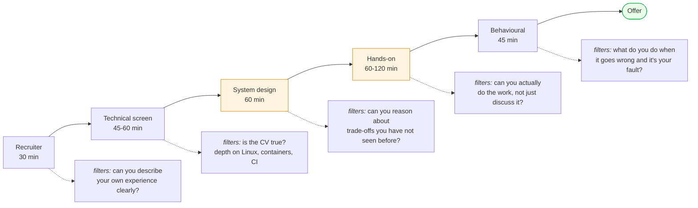
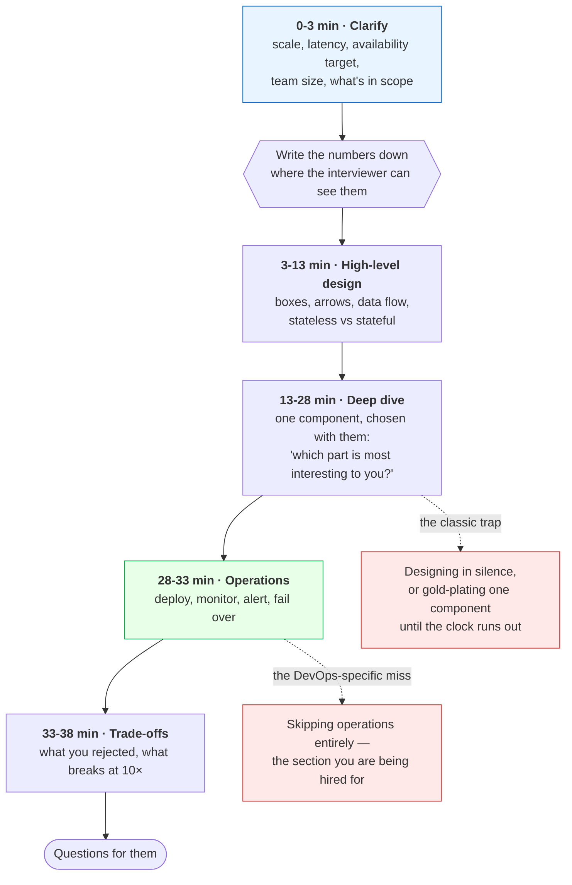
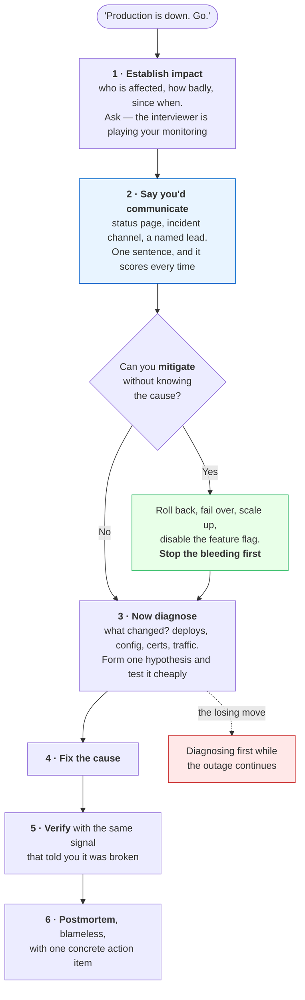

# Module 16: Interview Prep

> *"The best interview answers come from real experience — not memorized definitions." — Hiring Manager*

---

## Why This Module Matters

You have the skills. Now you need to **communicate them under pressure**. DevOps interviews combine technical depth, operational judgment, and the ability to think through ambiguous problems in real time. This module prepares you for all three.

**DevOps interviews typically include**:

- Technical knowledge questions (tools, concepts, protocols)
- Scenario-based problems (debug this, design that)
- System design discussions (architecture trade-offs)
- Behavioral questions (how you work, how you handle failure)
- Live debugging or hands-on exercises

---

## Table of Contents

1. [Interview Format Overview](#1-interview-format-overview)
2. [Technical FAQs by Domain](#2-technical-faqs-by-domain)
3. [Scenario-Based Questions](#3-scenario-based-questions)
4. [System Design Interview Framework](#4-system-design-interview-framework)
5. [Behavioral Questions](#5-behavioral-questions)
6. [Mock Incident Debugging](#6-mock-incident-debugging)
7. [Common Mistakes in Interviews](#7-common-mistakes-in-interviews)
8. [Preparation Checklist](#8-preparation-checklist)
9. [Certification Map](#9-certification-map)
10. [Resume, LinkedIn, and the Job Search](#10-resume-linkedin-and-the-job-search)

---

## 1. Interview Format Overview

```
TYPICAL DEVOPS INTERVIEW PIPELINE:

Round 1: Recruiter Screen (30 min)
  → Resume walkthrough, motivation, salary expectations

Round 2: Technical Phone Screen (45-60 min)
  → Linux, networking, Docker, CI/CD questions
  → Maybe a live debugging exercise

Round 3: System Design (60 min)
  → "Design a deployment pipeline for..."
  → "How would you make this system highly available?"

Round 4: Hands-On / Take-Home (60-120 min)
  → Write a Terraform config, fix a broken pipeline
  → Debug a Kubernetes deployment, automate a task

Round 5: Behavioral / Culture Fit (45 min)
  → Teamwork, incident handling, communication style

KEY PRINCIPLE:
  Don't just answer WHAT — explain WHY and WHEN.
  "I'd use Terraform" → 
  "I'd use Terraform because the team needs multi-cloud
   support and we want declarative, version-controlled
   infrastructure with a plan-before-apply workflow" → 
```

Each round filters for something different, and candidates lose offers by preparing for one of them five times:



 **The two amber rounds are where DevOps offers are won and lost.** Nearly everyone prepares tool trivia for round 2 and almost nobody rehearses design trade-offs or a live debugging session under observation — which is precisely why those rounds discriminate. If your prep time is limited, spend it on the labs'  Break It sections rather than on more flashcards.

---

## 2. Technical FAQs by Domain

### Linux & System Administration

**Q: How do you troubleshoot a server that's running slow?**
> Systematic approach: 1) Check load average with `uptime`. 2) Identify CPU-heavy processes with `top` or `htop`. 3) Check memory with `free -h` — look for swap usage. 4) Check disk I/O with `iostat` or `iotop`. 5) Check disk space with `df -h`. 6) Check network with `ss -tlnp` and `netstat`. 7) Review logs in `/var/log/syslog` or `journalctl`. The goal is to narrow down whether it's CPU, memory, disk, network, or application-level.

**Q: What's the difference between a process and a thread?**
> A process is an independent execution unit with its own memory space. A thread is a lightweight unit within a process that shares the process's memory. Multiple threads in a process can communicate through shared memory (fast but needs synchronization), while processes communicate through IPC mechanisms like pipes or sockets. In DevOps context: Nginx uses multiple worker processes, while Java apps often use multiple threads within one process.

**Q: Explain file permissions in Linux.**
> Three permission types (read, write, execute) for three categories (owner, group, others). Represented as `rwxrwxrwx` or octal (755 = rwxr-xr-x). The sticky bit prevents users from deleting others' files in shared directories. SUID/SGID lets a program run as the file owner/group. For DevOps: SSH keys must be 600, directories should be 755, and sensitive configs should be 640 or stricter.

### Networking

**Q: What happens when you type a URL in a browser?**
>
> 1) DNS resolution: browser cache → OS cache → recursive resolver → authoritative DNS. 2) TCP connection: three-way handshake (SYN, SYN-ACK, ACK). 3) TLS handshake if HTTPS. 4) HTTP request sent. 5) Server processes and returns response. 6) Browser renders the page. In DevOps context, issues can occur at any layer — DNS misconfiguration, firewall blocking ports, expired TLS certificates, application errors.

**Q: Explain the difference between TCP and UDP.**
> TCP is connection-oriented with guaranteed delivery, ordering, and flow control. Used for HTTP, SSH, databases. UDP is connectionless — faster but no delivery guarantee. Used for DNS, video streaming, monitoring (StatsD). For DevOps: most services use TCP. Health checks usually use TCP or HTTP. Load balancers can operate at L4 (TCP) or L7 (HTTP).

### Docker & Containers

**Q: What's the difference between a Docker image and a container?**
> An image is a read-only template with the filesystem and configuration. A container is a running instance of an image with its own writable layer. Like a class vs an object in programming. You can run multiple containers from the same image. Images are built in layers (each Dockerfile instruction = one layer), which enables caching and sharing.

**Q: How do you reduce Docker image size?**
> Use multi-stage builds (build in one stage, copy artifacts to a slim runtime stage). Use slim/alpine base images. Combine RUN commands to reduce layers. Use `.dockerignore` to exclude unnecessary files. Don't install development tools in the final image. Pin specific versions instead of `:latest`.

**Q: What happens when a Docker container runs out of memory?**
> If memory limits are set, the kernel OOM-killer terminates the container's main process. Docker reports it as exit code 137 (SIGKILL). Without limits, the container can consume all host memory, potentially crashing other containers or the host itself. Always set memory limits in production. Monitor with `docker stats` or Prometheus cAdvisor metrics.

### CI/CD

**Q: Describe a CI/CD pipeline you've built.**
> Use the STAR method: Situation (what the team needed), Task (what you built), Action (specific tools and design decisions), Result (measurable outcome). Example: "We had manual deployments taking 2 hours with frequent rollbacks. I built a GitHub Actions pipeline with lint, test, Docker build, image scan, and deployment stages. Deployments went from 2 hours to 8 minutes with a 90% reduction in post-deploy incidents."

**Q: What's the difference between continuous delivery and continuous deployment?**
> Continuous delivery: every commit that passes CI is deployable, but a human approves production releases. Continuous deployment: every commit that passes CI is automatically deployed to production. Most teams start with continuous delivery and move to continuous deployment as confidence grows. The key enabler is comprehensive automated testing.

### Infrastructure as Code

**Q: What is Terraform state and why does it matter?**
> State is Terraform's record of what it has created. It maps your configuration to real infrastructure. Without state, Terraform can't know what exists and would try to create duplicates. State should be stored remotely (S3 with `use_lockfile = true` for locking) in team environments. Never commit state to git — it may contain secrets. Use `terraform plan` to preview changes before applying.

**Q: Terraform vs Ansible — when to use each?**
> Terraform is declarative and excels at provisioning infrastructure (VMs, networks, databases). Ansible is procedural/declarative and excels at configuring software on existing machines. Use Terraform to create the servers, Ansible to configure them. Some overlap exists — Terraform has provisioners, Ansible has cloud modules — but each tool is strongest in its primary domain.

### Kubernetes

**Q: How does a Kubernetes Deployment work?**
> A Deployment manages a ReplicaSet, which manages Pods. When you update a Deployment, K8s creates a new ReplicaSet with updated pods while scaling down the old one (rolling update). If the new pods fail health checks, the rollout pauses. You can rollback with `kubectl rollout undo`. The Deployment controller ensures the desired state matches actual state continuously.

**Q: How do you debug a pod that won't start?**
>
> 1) `kubectl get pods` — check status (Pending, CrashLoopBackOff, ImagePullBackOff). 2) `kubectl describe pod <name>` — check events for errors (scheduling, image pull, volume mount). 3) `kubectl logs <name>` — check application logs (add `--previous` for crashed containers). 4) Common causes: wrong image tag, insufficient resources, failed readiness probe, missing ConfigMap/Secret, node scheduling constraints.

### Monitoring & Logging

**Q: What's the difference between metrics, logs, and traces?**
> Metrics are numeric measurements over time (CPU usage, request count, error rate). Best for alerting and dashboards. Logs are timestamped text records of events. Best for debugging specific issues. Traces follow a single request across multiple services. Best for understanding latency in distributed systems. Together they form the "three pillars of observability."

**Q: How do you design alerts that don't cause alert fatigue?**
> Alert on symptoms (user-facing impact), not causes. Use SLO-based alerting — alert when error budget is burning too fast. Set appropriate thresholds with hysteresis (different thresholds for firing and resolving). Page only for actionable, urgent issues. Use severity levels: page for critical, ticket for warning, dashboard for info. Review and tune alerts quarterly.

---

## 3. Scenario-Based Questions

### Scenario 1: Production Outage

**Q: "Users are reporting that the website is slow. Walk me through how you'd investigate."**

```
FRAMEWORK: Symptom → Scope → Isolate → Root Cause → Fix → Prevent

1. CONFIRM THE SYMPTOM
   - Check monitoring dashboards (Grafana)
   - Verify with synthetic checks (curl response times)
   - Check error rates in metrics

2. DETERMINE THE SCOPE
   - All users or specific regions?
   - All pages or specific endpoints?
   - Started gradually or suddenly?

3. ISOLATE THE LAYER
   - CDN/DNS → check DNS resolution time, CDN cache hit rate
   - Load balancer → check backend health, connection count
   - Application → check response times, error logs, CPU/memory
   - Database → check query latency, connection pool, slow query log
   - External dependency → check third-party API response times

4. ROOT CAUSE
   - Correlate with recent changes (deployments, config changes)
   - Check for traffic spikes or resource exhaustion
   - Review application logs for errors

5. FIX AND COMMUNICATE
   - Apply fix (rollback, scale up, config change)
   - Communicate status to stakeholders
   - Monitor for recovery

6. PREVENT
   - Post-incident review
   - Add missing monitoring/alerts
   - Improve deployment safety (canary, feature flags)
```

### Scenario 2: Deployment Gone Wrong

**Q: "You deployed a new version and error rates jumped to 15%. What do you do?"**
> Immediately roll back to the previous version — restore service first, investigate later. Verify error rates return to normal. Then analyze: check the diff between versions, review error logs from the brief window, check if the issue was caught in staging. Root cause might be a code bug, a missing environment variable, a database migration issue, or an incompatible dependency. Add the failure scenario to your CI/CD tests.

### Scenario 3: Security Incident

**Q: "You discover that database credentials were committed to a public GitHub repo 3 hours ago. What do you do?"**
>
> 1) Immediately rotate the database credentials. 2) Revoke the old credentials. 3) Check database audit logs for unauthorized access in the 3-hour window. 4) Update all services that use those credentials. 5) Remove credentials from git history (BFG or git filter-repo). 6) Force-push (coordinate with team). 7) Add pre-commit hooks (gitleaks) to prevent recurrence. 8) Document the incident and conduct a blameless review.

### Scenario 4: Capacity Planning

**Q: "Your application currently handles 1,000 requests per second. Marketing says traffic will 5x in 3 months due to a product launch. How do you prepare?"**
>
> 1) Load test current capacity — find the actual breaking point, not the theoretical one. 2) Identify bottlenecks: database connection limits, CPU-bound processing, memory per connection. 3) Plan horizontal scaling for stateless tiers (app servers behind load balancer, auto-scaling). 4) Plan vertical scaling or read replicas for the database. 5) Add caching where appropriate (Redis for hot data, CDN for static assets). 6) Set up auto-scaling policies with appropriate metrics. 7) Run load tests at 5x and 10x to validate. 8) Set up alerting at 60% capacity so you know before users do.

---

## 4. System Design Interview Framework

```
FRAMEWORK FOR SYSTEM DESIGN QUESTIONS:

1. CLARIFY REQUIREMENTS (2-3 min)
   - What are the functional requirements?
   - What are the non-functional requirements? (scale, latency, availability)
   - What's the expected traffic? (requests/sec, data volume)
   - What's the team size and operational capability?

2. HIGH-LEVEL DESIGN (5-10 min)
   - Draw the major components (client, LB, app, DB, cache)
   - Show the data flow
   - Identify stateless vs stateful components

3. DEEP DIVE (10-15 min)
   - Pick the most interesting or challenging component
   - Discuss trade-offs for technology choices
   - Address scaling, failure, and security

4. OPERATIONAL CONCERNS (5 min)
   - How do you deploy changes?
   - How do you monitor and alert?
   - How do you handle failures?
   - What does disaster recovery look like?

5. TRADE-OFFS AND ALTERNATIVES (5 min)
   - What did you NOT choose, and why?
   - What would change at 10x scale?
   - What would you do differently with more time/budget?
```

As a clock, because the failure mode is always the same — burning thirty minutes on the fun part and never reaching operations:



 **Operations is your differentiator, so budget for it explicitly.** A backend candidate and a DevOps candidate draw a similar box diagram; only one of them says how it gets deployed, what the SLO is, which metric pages someone at 3am, and what the rollback looks like. If time is running short, cut depth from the deep dive — never the operations section.

**Narrate throughout.** Silence reads as being stuck even when you are thinking well. "I'm going to assume 10k requests per second and revisit if that's wrong" invites a correction that saves you ten minutes of designing for the wrong scale.

---

## 5. Behavioral Questions

### The STAR Method

```
SITUATION: Describe the context
TASK: What was your responsibility
ACTION: What YOU specifically did (not the team)
RESULT: Measurable outcome
```

### Common Questions

**Q: "Tell me about a time you dealt with a production incident."**
> Use STAR. Focus on: how you stayed calm, how you communicated (incident channel, status updates), how you diagnosed systematically, and what you did to prevent recurrence. Show that you follow blameless postmortem culture.

**Q: "Describe a time you disagreed with a team member about a technical decision."**
> Show that you: listened to their perspective, presented data to support your view, found a compromise or agreed to test both approaches, and prioritized the team outcome over being right.

**Q: "Tell me about a project where you had to learn a new technology quickly."**
> Show your learning process: documentation first, then small proof-of-concept, then incremental adoption. Mention specific resources you used. Emphasize that you validated your understanding before applying it to production.

**Q: "How do you prioritize when everything is on fire?"**
> Triage by user impact. Production-down outages first, then degraded performance, then non-user-facing issues. Communicate clearly about what's being worked on and what's waiting. Don't try to fix everything simultaneously — focus on the highest-impact item.

---

## 6. Mock Incident Debugging

Practice these scenarios to build your debugging muscle memory. Each one maps to a realistic production problem.

**Detailed hands-on exercises**: [lab-01-mock-incident-debugging.md](./labs/lab-01-mock-incident-debugging.md)

### Scenario Quick Reference

| Scenario | Symptoms | Key Debugging Tools |
|----------|----------|-------------------|
| Container crash loop | Pod status: CrashLoopBackOff | `kubectl logs`, `kubectl describe` |
| DNS failure | Connection refused, name resolution errors | `dig`, `nslookup`, `/etc/resolv.conf` |
| Disk full | Write errors, application crashes | `df -h`, `du -sh`, `find / -size +100M` |
| Memory leak | OOM kills, increasing memory usage | `free -h`, `top`, container metrics |
| Certificate expiry | TLS errors, browser warnings | `openssl s_client`, `curl -v` |
| Firewall misconfiguration | Connection timeout, no response | `ss -tlnp`, `iptables -L`, `ufw status` |

### What They're Grading in a Live Incident

The scenario is a pretext. What the interviewer watches is the *order* you work in, and one ordering mistake sinks otherwise strong candidates:



 **Mitigate before you diagnose.** Curiosity is the trap: a rollback that restores service in two minutes beats a root cause found in twenty, and the cause is still there to investigate afterwards with the pressure off. Saying "first I'd roll back to the last known-good release, then work out why" in the opening thirty seconds marks you as someone who has actually been on call.

**Say the unglamorous things out loud** — declaring an incident, posting to the status page, handing off if you're the only one awake. Interviewers are listening for whether you know an outage is a coordination problem, not just a technical one.

---

## 7. Common Mistakes in Interviews

### Answering with Definitions Only

```
BAD:  "Kubernetes is a container orchestration platform."
GOOD: "Kubernetes manages containerized workloads. I've used it
       to deploy microservices with rolling updates, and I once
       debugged a pod scheduling issue caused by node resource
       pressure that I found using kubectl describe and top."
```

### Not Asking Clarifying Questions

```
BAD:  Immediately designing a solution for a vague requirement
GOOD: "Before I design this, can I clarify: what's the expected
       traffic? Is this an internal or external-facing service?
       What's the team's operational maturity?"
```

### Ignoring Trade-Offs

```
BAD:  "I'd use microservices and Kubernetes."
GOOD: "For this scale and team size, I'd start with a monolith
       on Docker Compose with CI/CD. Moving to K8s adds
       operational complexity the team may not be ready for."
```

### Not Showing Debugging Process

```
BAD:  "I'd restart the server."
GOOD: "First I'd check if the issue is isolated to one server
       or system-wide. Then I'd look at resource utilization,
       application logs, and recent deployment history before
       deciding on a fix."
```

---

## 8. Preparation Checklist

### One Month Before

- [ ] Complete at least one capstone project from Module 15
- [ ] Review technical FAQs for each domain in this module
- [ ] Practice explaining your projects out loud (5-minute walkthrough)
- [ ] Review your resume — can you explain every line in depth?

### One Week Before

- [ ] Do the mock incident debugging lab
- [ ] Practice 5 scenario-based questions with a timer (5 min each)
- [ ] Prepare 3 STAR stories for behavioral questions
- [ ] Review the system design framework

### Day Before

- [ ] Get a good night's sleep
- [ ] Prepare your environment (stable internet, quiet space, water)
- [ ] Have your portfolio repo URL ready to share
- [ ] Review the company's tech stack (job posting, engineering blog)

### During the Interview

- [ ] Think out loud — show your reasoning process
- [ ] Ask clarifying questions before designing solutions
- [ ] Discuss trade-offs, not just solutions
- [ ] Say "I don't know, but here's how I'd find out" when stuck
- [ ] Be specific — use real numbers, real tool names, real experiences

---

## 9. Certification Map

### What Certifications Do and Don't Do

They get your CV past a filter, they give an unstructured subject a syllabus, and for some employers (consultancies, partners with vendor quotas, public-sector contracts) they are a hard requirement. What they do not do is convince an engineer in a technical interview — that is what your projects are for.

The honest ordering: **projects first, then one certification in the area you want to be hired for.** Three certificates and no repository reads as someone who studies rather than builds, and the follow-up questions expose it in minutes.

### The Map

Each row lists the modules that cover the material. Prices and durations are **illustrative 2026 figures — check current pricing**, and note that most vendor exams are discounted or free through training events.

| Certification | Covers modules | Cost (approx) | Valid | Worth it when |
|---------------|----------------|--------------:|-------|---------------|
| **AWS Certified Cloud Practitioner** | 00, 09 | £75 | 3 yr | You need vocabulary and a first credential fast. Skip it if you can pass SAA |
| **AWS Solutions Architect – Associate** (SAA) | 09, 14 | £120 | 3 yr |  The highest-signal first cloud cert. Widely recognised, genuinely broad |
| **AWS SysOps Administrator / DevOps Engineer – Pro** | 06, 07, 09, 10 | £120 / £240 | 3 yr | You already work in AWS and want depth, not breadth |
| **HashiCorp Terraform Associate** | 10 | £55 | 2 yr |  Cheap, quick, and maps almost exactly onto Module 10. Excellent value |
| **CKA — Certified Kubernetes Administrator** | 12 | £300 | 2 yr |  The strongest technical signal on this list. Hands-on exam in a real cluster — you cannot pass it by memorising |
| **CKAD — Application Developer** | 12 | £300 | 2 yr | You deploy on Kubernetes more than you operate it |
| **CKS — Security Specialist** | 12, 13 | £300 | 2 yr | After CKA (it is a prerequisite), and only if security is the direction |
| **LFCS / RHCSA** | 01, 04 | £250 / £330 | 3 yr | Your Linux is the weak part, or the employer is a RHEL shop. RHCSA is hands-on and well respected |
| **Azure AZ-104 / AZ-400, Google ACE** | 09 (concepts transfer) | £120–150 | 1–2 yr | The job you want is on that cloud. Concepts transfer; the exam does not |
| **Certified Jenkins Engineer, Docker DCA** | 05, 06 | varies | varies | Rarely asked for now. Do a project instead |

### Choosing

```
Career-changer, no professional experience yet
  → 1 capstone project → AWS SAA → Terraform Associate
     (breadth + a credential that survives a CV filter)

Sysadmin moving into DevOps
  → RHCSA or LFCS if Linux is your story → CKA
     (you already have the ops instinct; prove the platform)

Developer moving into DevOps/platform
  → CKAD or CKA → Terraform Associate
     (you can code; prove you can operate)

Already in the role, want the next band
  → CKA → CKS, or AWS DevOps Pro
     (depth in the thing you already do)
```

>**Two traps.** The first is treating a certificate as a substitute for the lab work in this handbook — a CKA holder who has never debugged a CrashLoopBackOff under pressure gets found out in the first scenario question. The second is letting them expire silently: put the renewal date in a calendar the day you pass, because an expired certification on a CV is worse than none.

---

## 10. Resume, LinkedIn, and the Job Search

Module 15 §8 covers how to *present a project*. This section is about the documents and the search itself.

### The Resume Bullet Formula

**Action verb + what you built + the tool + the measurable outcome.** The outcome is the part almost everyone omits, and it is the only part that distinguishes you.

|  Weak |  Strong |
|---------|-----------|
| "Responsible for CI/CD pipelines" | "Built a GitHub Actions pipeline with image scanning that cut mean time from commit to production from 3 days to 40 minutes" |
| "Used Terraform for infrastructure" | "Codified a two-AZ VPC and EKS cluster in Terraform with remote state and locking; environment rebuild went from a day of console work to a 20-minute apply" |
| "Monitored systems with Prometheus" | "Instrumented 4 services with RED metrics and replaced 40 threshold alerts with 6 symptom-based ones, ending alert fatigue on the on-call rotation" |
| "Knowledge of Kubernetes" | "Migrated 3 Compose services to Kubernetes with probes, resource limits, and an HPA; rollbacks went from manual to a single automated step" |

No numbers because it is a personal project? Use the numbers you *do* have: image size before and after, build time, replicas, requests handled in a load test, minutes to rebuild from scratch, cost per month. "Reduced image from 1.2 GB to 78 MB with a multi-stage build" is a real measurement from a personal project.

### Structure and the ATS

Most applications are parsed by software before a human sees them. That imposes boring constraints — accept them:

- **One page** with under ~5 years of experience, two at most beyond that
- **Order**: contact → 2-line summary → skills → experience → projects → education/certs. Career-changers put **projects above experience**
- **Plain single-column layout.** No tables, no text boxes, no icons, no photo, no two-column PDF — parsers mangle all of these. Send PDF unless told otherwise
- **Mirror the posting's vocabulary.** If it says "IaC" and you wrote "infrastructure as code", write both once. This is not gaming the system; it is answering the question they asked
- **Link your portfolio repository in the header**, and make sure its README is the thing you want read first

### GitHub and LinkedIn

Your GitHub is the artefact a technical reviewer actually opens:

- Pin the portfolio repository; make its README the tour, with the architecture diagram visible without scrolling
- Commit history that shows iteration beats one "initial commit" of finished work
- No secrets, anywhere, in any history. This is checked, and it is disqualifying

LinkedIn is a search index, not a CV:

- Headline states the target role, not the current one: "DevOps Engineer — Kubernetes, Terraform, AWS"
- The About section is the same two-minute project pitch you rehearsed for interviews
- Turn on "open to work" for recruiters only, and put the tools in the skills list because that is literally what recruiters filter on

### Running the Search

```
Weekly rhythm that works:
  5-8 targeted applications  ← tailored, researched, one paragraph of why this company
  1 project improvement      ← something new to talk about every week
  2-3 outreach messages      ← engineers at target companies, not recruiters
  1 mock interview           ← out loud, timed, with someone or recording yourself

What does NOT work:
   50 applications a day with the same CV
   Waiting until the portfolio is "finished" — it never is
   Only applying to postings; most roles are filled through referrals
```

Read the posting for what is actually required rather than the wishlist — "5 years Kubernetes" on a mid-level posting is usually aspirational, and applying anyway is free. Do research one level deeper than the job ad: their engineering blog, their public repositories, their stack. One specific sentence about *their* system in a cover note outperforms a page of enthusiasm.

### Take-Homes and Offers

- **Take-home exercises**: timebox them, and if it exceeds four hours, say what you would have done next rather than working the weekend. Include a README with your tradeoffs — that is what is actually being assessed
- **Salary**: know your range before the first call, from local market data. When asked what you are looking for, give a researched range with a reason attached
- **Negotiation**: one round is expected and does not cost you the offer. Ask for the whole package in writing before deciding, and ask about the on-call rotation and its compensation — you are interviewing the job too
- **The questions you ask** are part of the evaluation. "What does your on-call rotation look like?", "How long does a one-line change take to reach production?", and "What happened in your last incident?" tell you more about a DevOps job than any answer they give about culture

---

## Labs and Projects

Read the sections above first, then work through these **in order**. Every lab ends with a  **Break It** section — those are not optional; they are where the debugging skill actually comes from.

| # | Lab | What you'll do |
|---|-----|----------------|
| 1 | **[Mock Incident Debugging](./labs/lab-01-mock-incident-debugging.md)** | Practice diagnosing and resolving simulated production incidents using Docker. |
| 2 | **[Incident Response](./labs/lab-02-incident-response.md)** | Run an incident end to end: get paged, declare a severity, communicate before you know the cause, mitigate, and write the postmortem. |

**Portfolio project:**

- [Project: Interview Portfolio](./projects/project-01-interview-portfolio.md) — Compile your DevOps learning journey into an interview-ready portfolio.

**Reference code** for every lab: [`code/`](./code/) — real files, validated in CI.

---

## Self-Check

Answer these from memory before you expand them. If more than two give you trouble, re-read the sections they come from — the labs assume this material is solid.

<details>
<summary><strong>1. "The service is down — walk me through it." How do you structure the answer?</strong></summary>

State what you would confirm first (are users affected, or only a monitor), then work outward through the layers naming the signal that would confirm or kill each hypothesis: recent deploys, DNS, load balancer, application, dependencies, database. Say what you would do to restore service before you talk about root cause. Structure is what is being assessed, not the answer.

</details>

<details>
<summary><strong>2. Why is "roll back first" such a strong answer?</strong></summary>

Because restoring service and understanding the failure are two different jobs, and doing them in that order is the whole discipline. You stop the bleeding, preserve the evidence — logs, a snapshot, the failing pod — and investigate afterwards. Debugging live while users are down is the mistake interviewers are listening for.

</details>

<details>
<summary><strong>3. What is STAR, and what do most candidates leave out?</strong></summary>

Situation, Task, Action, Result. The Result — with a number in it — is what most people skip, and the honest "what I would do differently" that follows it is what distinguishes a senior answer from a competent one.

</details>

<details>
<summary><strong>4. You have 45 minutes for a system design question. What order?</strong></summary>

Clarify requirements and get real numbers first, sketch the high-level request path, then go deep wherever the interviewer pushes. Leave time for failure modes, monitoring, and cost. Drawing boxes before asking questions is the most common way this interview is lost.

</details>

<details>
<summary><strong>5. How do you handle a question you cannot answer?</strong></summary>

Say what you do know, how you would find out, and what you would expect to be true — then move on without dwelling. An invented specific is far worse than an admitted gap: once one detail is caught as fabricated, every other answer is suspect.

</details>

<details>
<summary><strong>6. What preparation actually differentiates candidates?</strong></summary>

Having built things and broken them, so you can answer follow-ups with specifics: the actual error message, the number you measured, the tradeoff you accepted. Memorized definitions survive the first question and collapse on the second.

</details>

---

## Practical Checkpoint

Before considering yourself interview-ready, you should be able to:

- Answer any technical FAQ in this module fluently and with real examples.
- Walk through a production incident scenario using the systematic debugging framework.
- Design a system architecture on a whiteboard, explaining trade-offs at each decision point.

Portfolio evidence to keep:

- Your capstone projects from Module 15 with polished READMEs.
- Written answers to 10 scenario-based questions.
- At least 3 STAR stories documented and practiced.

Suggested project: [Interview Portfolio](./projects/project-01-interview-portfolio.md)

---

<div align="center">

**Module 16 Complete** 

** Congratulations — You've Completed The DevOps Handbook! **

[← Back to Projects](../15-projects/) | [Back to Main README →](../README.md)

</div>


## Reference
<!-- tab: Labs -->
# Lab 01: Mock Incident Debugging

## Objective

Practice diagnosing and resolving simulated production incidents using Docker. Each scenario replicates a common real-world failure that DevOps engineers encounter. Your goal is to identify the root cause, fix the issue, and document your process — just like you would during an on-call shift or in an interview.

>**Note on structure**: every other lab in this handbook ends with a *Break It* section. This lab **is** the Break It section — all four incidents are deliberate failures with no working state to start from. That's the point: by Module 16 you should be able to walk into an unfamiliar broken system with no context and work it out. There is no happy path here.

---

## Prerequisites

- Docker and Docker Compose installed
- Familiarity with Linux commands, Docker, and networking
- Completed Modules 01, 02, 05, and 07

---

## Deliverables and Evidence

By the end of this lab, keep the following evidence in your notes or portfolio repo:

- For each incident: the symptoms observed, commands used to diagnose, root cause, and fix
- Terminal output or screenshots showing key diagnostic steps
- A short reflection on which incident was hardest and why

---

## Lab Files

Every file this lab creates also exists as a real, CI-validated file in
[`../code/lab-01/`](../code/lab-01/) (11 files).

```bash
# Option A — type them out yourself (recommended the first time; that's the learning)
# Option B — start from the reference copies
cp -r /path/to/the-devops-handbook/16-interview-prep/code/lab-01/. .
```

Use Option B when you're comparing against a known-good version, or when something
won't start and you need to rule out a typo. See [`../code/README.md`](../code/README.md).

---

## Incident 1: The Crash-Looping Container

### Setup

```bash
mkdir -p incident-lab && cd incident-lab

# Create an app that crashes after 3 seconds
cat > crash_app.py << 'APP'
import time, sys, os
print("Starting application...")
print(f"Config file: {os.environ.get('CONFIG_PATH', '/etc/app/config.yml')}")
time.sleep(3)
# Simulate crash: missing required config file
config_path = os.environ.get('CONFIG_PATH', '/etc/app/config.yml')
if not os.path.exists(config_path):
    print(f"FATAL: Config file not found: {config_path}", file=sys.stderr)
    sys.exit(1)
print("Application running normally")
while True:
    time.sleep(10)
APP

cat > Dockerfile.crash << 'DOCKER'
FROM python:3.12-slim
WORKDIR /app
COPY crash_app.py .
CMD ["python3", "-u", "crash_app.py"]
DOCKER

cat > docker-compose-incident1.yml << 'COMPOSE'
services:
  webapp:
    build:
      context: .
      dockerfile: Dockerfile.crash
    restart: always
COMPOSE

docker compose -f docker-compose-incident1.yml up -d --build
```

### Your Mission

The webapp container keeps restarting. Diagnose why and fix it.

**Hints** (use only if stuck):

1. Check the container status: `docker compose -f docker-compose-incident1.yml ps`
2. Check logs: `docker compose -f docker-compose-incident1.yml logs webapp`
3. The fix involves providing what the application needs

### Expected Fix

```bash
# Create the missing config file
mkdir -p config
echo "database_host: localhost" > config/config.yml

# Update compose to mount the config
cat > docker-compose-incident1.yml << 'COMPOSE'
services:
  webapp:
    build:
      context: .
      dockerfile: Dockerfile.crash
    environment:
      - CONFIG_PATH=/etc/app/config.yml
    volumes:
      - ./config/config.yml:/etc/app/config.yml:ro
    restart: always
COMPOSE

docker compose -f docker-compose-incident1.yml up -d
# Verify: container should now stay running
docker compose -f docker-compose-incident1.yml ps
```

** Checkpoint:** Container status shows "Up" with no restarts.

---

## Incident 2: The Disk-Full Application

### Setup

```bash
# App that fills up its log directory
cat > diskfill_app.py << 'APP'
import time, os
log_dir = "/app/logs"
os.makedirs(log_dir, exist_ok=True)
counter = 0
print("Application started, writing logs...")
while True:
    with open(f"{log_dir}/app.log", "a") as f:
        f.write(f"Log entry {counter}: " + "x" * 10000 + "\n")
    counter += 1
    if counter % 100 == 0:
        size = os.path.getsize(f"{log_dir}/app.log")
        print(f"Log file size: {size / 1024 / 1024:.1f} MB")
    time.sleep(0.01)
APP

cat > Dockerfile.disk << 'DOCKER'
FROM python:3.12-slim
WORKDIR /app
COPY diskfill_app.py .
CMD ["python3", "-u", "diskfill_app.py"]
DOCKER

cat > docker-compose-incident2.yml << 'COMPOSE'
services:
  logger:
    build:
      context: .
      dockerfile: Dockerfile.disk
    deploy:
      resources:
        limits:
          memory: 128M
    tmpfs:
      - /app/logs:size=5M
COMPOSE

docker compose -f docker-compose-incident2.yml up -d --build
```

### Your Mission

The application will eventually fail when the log directory fills up. Diagnose the disk issue and implement log rotation or cleanup.

**Debugging steps to practice:**

```bash
# Check container resource usage
docker stats --no-stream

# Exec into the container to check disk usage
docker compose -f docker-compose-incident2.yml exec logger sh -c "du -sh /app/logs/*"

# Check if the container is still running
docker compose -f docker-compose-incident2.yml ps

# Check logs for errors
docker compose -f docker-compose-incident2.yml logs --tail 20 logger
```

** Checkpoint:** You identified that the log file grows unbounded and the tmpfs fills up.

---

## Incident 3: The Broken Reverse Proxy

### Setup

```bash
cat > backend.py << 'APP'
from http.server import HTTPServer, BaseHTTPRequestHandler

class Handler(BaseHTTPRequestHandler):
    def do_GET(self):
        if self.path == "/api/health":
            self.send_response(200)
            self.send_header("Content-Type", "application/json")
            self.end_headers()
            self.wfile.write(b'{"status":"ok"}')
        elif self.path == "/api/data":
            self.send_response(200)
            self.send_header("Content-Type", "application/json")
            self.end_headers()
            self.wfile.write(b'{"items":["a","b","c"]}')
        else:
            self.send_response(404)
            self.end_headers()
    def log_message(self, fmt, *args): pass

HTTPServer(("0.0.0.0", 8080), Handler).serve_forever()
APP

# Intentionally broken Nginx config (wrong upstream port)
mkdir -p nginx-broken
cat > nginx-broken/default.conf << 'NGINX'
upstream api {
    server backend:9999;
}
server {
    listen 80;
    location /api/ {
        proxy_pass http://api;
        proxy_connect_timeout 3s;
        proxy_read_timeout 5s;
    }
    location / {
        return 200 "Frontend OK\n";
        add_header Content-Type text/plain;
    }
}
NGINX

cat > docker-compose-incident3.yml << 'COMPOSE'
services:
  proxy:
    image: nginx:1.25-alpine
    ports:
      - "8888:80"
    volumes:
      - ./nginx-broken/default.conf:/etc/nginx/conf.d/default.conf:ro
    depends_on:
      - backend
  backend:
    build:
      context: .
      dockerfile: Dockerfile.crash
    command: ["python3", "-u", "backend.py"]
COMPOSE

docker compose -f docker-compose-incident3.yml up -d --build
```

### Your Mission

The frontend (<http://localhost:8888/>) works, but the API (<http://localhost:8888/api/health>) returns 502 Bad Gateway. Diagnose and fix.

**Debugging steps:**

```bash
# Test the endpoints
curl http://localhost:8888/
curl -v http://localhost:8888/api/health

# Check Nginx error logs
docker compose -f docker-compose-incident3.yml logs proxy

# Check if the backend is actually running and on what port
docker compose -f docker-compose-incident3.yml exec backend ss -tlnp
```

** Checkpoint:** After fixing the upstream port in the Nginx config, `/api/health` returns `{"status":"ok"}`.

---

## Incident 4: The DNS Resolution Failure

### Setup

```bash
cat > dns_app.py << 'APP'
import urllib.request, time, sys
while True:
    try:
        resp = urllib.request.urlopen("http://datastore:6379/ping", timeout=3)
        print(f"Connected: {resp.read().decode()}")
    except Exception as e:
        print(f"ERROR: {e}", file=sys.stderr)
    time.sleep(5)
APP

cat > docker-compose-incident4.yml << 'COMPOSE'
services:
  app:
    build:
      context: .
      dockerfile: Dockerfile.crash
    command: ["python3", "-u", "dns_app.py"]
    networks:
      - frontend
  datastore:
    image: redis:7-alpine
    networks:
      - backend
networks:
  frontend:
  backend:
COMPOSE

docker compose -f docker-compose-incident4.yml up -d --build
```

### Your Mission

The app cannot connect to the datastore. The error mentions name resolution. Diagnose the network isolation issue and fix it.

**Debugging steps:**

```bash
# Check app logs
docker compose -f docker-compose-incident4.yml logs app

# Inspect networks
docker network ls
docker compose -f docker-compose-incident4.yml exec app cat /etc/resolv.conf

# Can the app resolve the datastore hostname?
docker compose -f docker-compose-incident4.yml exec app nslookup datastore || echo "nslookup not available, try ping"
docker compose -f docker-compose-incident4.yml exec app ping -c 1 datastore || echo "Cannot resolve"
```

** Checkpoint:** After putting both services on the same network (or a shared network), the app connects successfully.

---

## Cleanup

```bash
docker compose -f docker-compose-incident1.yml down -v 2>/dev/null
docker compose -f docker-compose-incident2.yml down -v 2>/dev/null
docker compose -f docker-compose-incident3.yml down -v 2>/dev/null
docker compose -f docker-compose-incident4.yml down -v 2>/dev/null
cd ..
rm -rf incident-lab
```

---

## Validation

- [ ] Diagnose and fix the crash-looping container (missing config file)
- [ ] Identify disk space exhaustion from unbounded log growth
- [ ] Debug a 502 Bad Gateway caused by wrong upstream port
- [ ] Resolve a DNS failure caused by Docker network isolation
- [ ] For each incident: document symptoms, diagnostic commands, root cause, and fix
- [ ] Explain how you would prevent each issue in a production environment

## What to Commit

Add these to your portfolio repo as evidence of completed work:

- Incident report for each scenario with diagnosis steps
- Docker Compose files and fix diffs showing what changed
- Terminal output from key diagnostic commands
- Reflection notes on which incident was most realistic

---

[← Back to Module README](../README.md) | [Next Lab: Incident Response →](./lab-02-incident-response.md)

---

# Lab 02: Incident Response — Running the Process

## Objective

Run an incident end to end: get paged, declare a severity, communicate before you know the cause, mitigate, and write the postmortem.

Lab 01 was about finding the fault. This one is about everything else: declaring a severity, communicating while you still don't know the cause, choosing mitigation over root cause, and writing a postmortem that produces action items rather than apologies.

You will be paged, with traffic still arriving, and you will produce the artefacts a real incident produces — a timeline, status updates, and a postmortem. Those artefacts are the deliverable. The bug is easy; the process is what interviews are actually probing when they ask "walk me through an incident you handled".

>**Note on structure**: like Lab 01, this lab **is** the Break It section. The stack starts broken under live traffic and stays broken until you act. There is no happy path to work through first.

---

## Prerequisites

- Completed [Lab 01: Mock Incident Debugging](./lab-01-mock-incident-debugging.md)
- Docker and Docker Compose
- A timer. Genuinely — the clock is part of the exercise
- Modules 07 (observability), 12 (Kubernetes debugging habits), and 13 §10 (security incident response) as background

```bash
docker --version && docker compose version
```

---

## Deliverables and Evidence

- `timeline.md` — every event with a UTC timestamp, including your wrong turns
- Three or more status updates, written at the time, not reconstructed afterwards
- `postmortem.md` — completed, with action items that have owners and dates
- Your MTTA and MTTR, calculated, plus the detection gap
- A one-paragraph answer to "why did you mitigate before finding the root cause?"

---

## Lab Files

Reference copies are in [`../code/lab-02/`](../code/lab-02/).

```bash
cp -r /path/to/the-devops-handbook/16-interview-prep/code/lab-02/. .
chmod +x page.sh
```

**Do not read `api/app.py` yet.** It is in the repository because the lab contract requires it and because you will want it afterwards, but reading it first turns this into a code review instead of an incident. Diagnose from the outside, the way you will have to at 3 a.m.

---

## Exercise 1: Before the Page — Set Up the Frame

### Step 1: The Severity Matrix

Severity is not a feeling. It is a decision with consequences: who gets woken, who gets told, how much you are allowed to break to fix it. Agree it before the incident, because during one you will not be thinking clearly.

| | Impact | Response | Comms | Example |
|---|---|---|---|---|
| **SEV1** | Complete outage, or data loss, or a security breach | Page everyone needed, immediately. Wake people up | Status page + exec notification, updates every 15 min | Nobody can log in; customer data exposed |
| **SEV2** | Major function broken or badly degraded for many users; no workaround | On-call leads, during or out of hours | Status page, updates every 30 min | Checkout failing for most users |
| **SEV3** | Minor or partial degradation, or a workaround exists | Next business hours | Internal ticket, no status page | One report format broken; slow admin page |

Two rules that matter more than the table:

- **Anyone may declare.** If the person noticing has to ask permission, the declaration is late.
- **Over-declare, then downgrade.** Downgrading a SEV1 costs you a slightly embarrassing message. Under-declaring costs you the outage.

### Step 2: The Roles

Even solo, name the roles out loud — the point is that they are different jobs, and the failure mode is one person silently trying to do all three.

| Role | Owns | Explicitly does *not* |
|------|------|----------------------|
| **Incident commander** | Decisions, severity, who does what, when to escalate | Debug. The moment the IC is head-down in logs, nobody is running the incident |
| **Operations / investigator** | Hypotheses, commands, mitigation | Talk to stakeholders |
| **Communications / scribe** | Status updates, the timeline as it happens | Change anything |

For this lab you are all three, so do them in sequence rather than in parallel: decide, then investigate, then write. Timestamp everything as you go — a timeline reconstructed from memory two hours later is missing exactly the parts that matter.

### Step 3: Start the Traffic

```bash
docker compose up -d --build
docker compose ps
```

```text
NAME              IMAGE                     STATUS          PORTS
checkout-api      lab-02-api                Up 8 seconds
incident-load     curlimages/curl:8.8.0     Up 7 seconds
incident-nginx    nginx:1.27-alpine         Up 8 seconds    0.0.0.0:8080->80/tcp
```

Customers are now arriving at ~2 requests/second and will keep arriving whatever you do. Give it a minute, then:

```bash
./page.sh
```

**Start your clock now.** Everything below is timed.

---

## Exercise 2: The Incident

Work these in order, and write down the time at the start of each.

### Step 1: Acknowledge and Assess (target: T+2 min)

Before touching anything, answer two questions — the same two, every incident:

1. **Is it real?** An alert can fire because the monitoring broke.
2. **What is the user impact, in user terms?**

```bash
# What does a customer actually get?
curl -s -o /dev/null -w 'status=%{http_code} time=%{time_total}s\n' localhost:8080/checkout

# Run it in a loop — one sample during an incident is an anecdote
for i in $(seq 1 10); do
  curl -s -o /dev/null -w '%{http_code} ' -m 6 localhost:8080/checkout
done; echo
```

```text
503 503 503 503 503 503 503 503 503 503
```

That is real, and it is most requests. Note it.

### Step 2: Declare (target: T+3 min)

Pick a severity from the matrix and write it down with a timestamp and a one-line justification. Checkout failing for most users with no workaround is a **SEV2** — or SEV1 if checkout *is* the business. Either is defensible; not deciding is not.

### Step 3: Communicate Before You Understand (target: T+5 min)

This is the step everyone skips, and it is the one that separates people who have run incidents from people who have only debugged. Write update #1 now, from `templates/status-update.md`, while you still know nothing:

```text
[SEV2] Checkout — INVESTIGATING                                   HH:MM UTC

Impact:   Most checkout requests are failing. Browsing and login look
          unaffected.
Status:   Confirmed from outside the system. Cause not yet known.
Next:     Update by HH:MM (+15 min).
Lead:     @you (incident commander)
```

>"Cause not yet known" is a complete and professional status. Waiting until you have a cause before communicating is how a 20-minute incident becomes an hour of people asking each other what is happening.

### Step 4: Investigate — Narrow, Don't Wander (target: T+5 to T+15)

Work outside-in, and write each hypothesis down *before* you test it, along with what result would kill it. That habit is what stops the 20-minute rabbit hole.

```bash
# Proxy or backend? The nginx log answers this in one line
docker compose logs --tail=20 nginx
```

```text
2026-08-06T14:52:03+00:00 503 upstream=503 rt=0.003 urt=0.003 GET /checkout
```

`upstream=503` — nginx is faithfully relaying a backend failure. The proxy is fine.

```bash
# What is the backend saying about itself?
docker compose logs --tail=20 api
```

```text
{"level": "ERROR", "service": "checkout-api", "version": "v1.4.0", "msg": "no connection available", "pool_in_use": 20}
```

```bash
# Is it resource exhaustion? (It is not — but rule it out, it is the usual suspect)
docker stats --no-stream

# And now the thing that should unsettle you:
curl -s localhost:8080/healthz; echo
curl -s localhost:8080/readyz; echo
curl -s localhost:8080/pool; echo
```

```text
{"status":"ok","version":"v1.4.0"}
{"in_use":20,"status":"pool exhausted"}
{"in_use":20,"leaking":true,"size":20}
```

 **`/healthz` says the service is healthy while every customer request fails.** Your orchestrator believes this service is fine. Nothing will restart it, no load balancer will take it out of rotation. Write that down — it is the single most valuable finding of the incident and it belongs in the postmortem's contributing factors, not just in your head.

### Step 5: Mitigate — Two Choices, Pick One and Justify It (target: T+15)

You now know the mechanism (connections are being taken and not given back) but not the code defect. **Do not go looking for the defect yet.** Stop the impact first.

| Option | Command | What it buys | What it costs |
|--------|---------|--------------|---------------|
| **Restart** | `docker compose restart api` | Recovery in seconds | It recurs in ~10 seconds under this traffic. You will be restarting forever, and you have destroyed the evidence in the process |
| **Roll back** | `LEAK=0 VERSION=v1.3.9 docker compose up -d --force-recreate api` | Recovery, and it *stays* recovered | You need to have kept the previous version deployable. That is a decision you make months earlier |

Try the restart first, deliberately, and watch it come back:

```bash
docker compose restart api
sleep 2
for i in $(seq 1 10); do curl -s -o /dev/null -w '%{http_code} ' localhost:8080/checkout; done; echo
sleep 12
for i in $(seq 1 10); do curl -s -o /dev/null -w '%{http_code} ' localhost:8080/checkout; done; echo
```

```text
200 200 200 200 200 200 200 200 200 200
503 503 503 503 503 503 503 503 503 503
```

Recovered, then failed again. **A mitigation that recurs is not a mitigation** — it is a way to spend your night. Now roll back properly:

```bash
LEAK=0 VERSION=v1.3.9 docker compose up -d --force-recreate api
sleep 15
for i in $(seq 1 20); do curl -s -o /dev/null -w '%{http_code} ' localhost:8080/checkout; done; echo
curl -s localhost:8080/pool; echo
```

```text
200 200 200 200 200 200 200 200 200 200 200 200 200 200 200 200 200 200 200 200
{"in_use":0,"leaking":false,"size":20}
```

Impact has ended. Record the time — this timestamp is the end of impact, and it is what MTTR is measured to, not the moment you finished understanding the bug.

### Step 6: Confirm, Then Communicate Again (T+18)

Do not declare resolved on one green sample. Watch for a few minutes at real traffic — the previous failure took ten seconds to reappear, and something slower would take longer.

```bash
docker compose logs --tail=30 nginx | grep -c ' 200 '
docker compose logs --tail=30 nginx | grep -c ' 503 '
```

Then post update #2 (`MONITORING`) and, once you are satisfied, a final `RESOLVED`. The RESOLVED update must state that a postmortem is coming — otherwise everyone assumes the work is finished, and the action items never get written.

### Step 7: Now Find the Defect

With impact over and the clock stopped, read `api/app.py`. The `finally:` block only releases the connection when `LEAK` is false — every request on the current release permanently consumes one of twenty connections.

Note carefully what you are now doing: root-causing *after* recovery, without time pressure, with the failing version still available to inspect. This ordering is the entire point of the exercise, and "restore service first, diagnose second" is the answer interviewers are listening for.

---

## Exercise 3: The Postmortem

### Step 1: Compute Your Numbers

| Metric | Definition | Yours |
|--------|-----------|-------|
| **Detection gap** | Impact began → alert fired | The page said the alert had a `for: 2m` window. In this lab, impact began when you started the stack |
| **MTTA** | Alert fired → acknowledged | |
| **MTTR** | Alert fired → impact ended | |
| **Time to root cause** | Alert fired → defect understood |  Deliberately *after* MTTR |

If your time-to-root-cause is longer than your MTTR, you did this correctly.

### Step 2: Write It

Fill in `templates/postmortem.md` completely. Two sections carry most of the value:

- **Contributing factors** — the health check that reported healthy while failing, the absent runbook the alert linked to, no latency alert (latency climbed before the errors did), no canary so the release hit every user at once.
- **Action items** — each one must have prevented or shortened *this* incident, with an owner and a date. Aim for one detect, one prevent, one respond.

### Step 3: The Blameless Test

Read your own draft and check:

- Does any sentence identify a person as the cause? Rewrite it to name the system gap that let a normal human action cause an outage.
- Is "be more careful" or "add more testing" anywhere? Neither is an action item. What specific test, on what trigger?
- Would someone from another team learn something? If not, the Lessons section is padding.

### Summary

| Failure in the response | How you'd notice | How you prevent it |
|-------------------------|------------------|--------------------|
| No severity declared | Nobody knows whether to wake anyone; nobody owns it | Declare within 3 minutes; anyone may declare; over-declare then downgrade |
| Silence until the cause is known | Stakeholders interrupt the investigation to ask for updates | First update within 5 minutes, saying explicitly what you do not know |
| Root-causing while users are down | Long MTTR, and a mitigation you never applied | Mitigate first, keep the evidence, diagnose after |
| Restart as the mitigation | Recovery, then recurrence, then a night of restarts | Prefer rollback; require the previous version to stay deployable |
| Health check that lies | Orchestrator sees healthy, users see 503 | Readiness must exercise what serving requires |
| Postmortem with no owners or dates | The same incident happens again next quarter | Every action item has a name and a date, tracked like any other work |

 **The theme of this lab**: the technical fault was one missing line, and it accounted for almost none of the outage duration. Everything else — detection lag, the eleven minutes before anyone knew, the lying health check, the restart that bought ten seconds — was process. That ratio holds in real incidents, which is why the process is what gets interviewed.

**Write this up** in `failure-notes.md` alongside your postmortem.

---

## Cleanup

```bash
docker compose down -v
docker image rm lab-02-api 2>/dev/null || true
```

Keep `timeline.md`, your status updates, and `postmortem.md` — a completed postmortem is one of the strongest artefacts you can put in a portfolio, because almost nobody has one.

---

## Validation

- [ ] Name the three severity levels and what each one triggers in response and comms
- [ ] Explain the incident commander role and why the IC should not be debugging
- [ ] Post a first status update within five minutes, stating impact without a known cause
- [ ] Determine from outside the system that the failure is real and quantify user impact
- [ ] Use the nginx log to tell a proxy fault from a backend fault in one line
- [ ] Explain why `/healthz` returning 200 during the outage is the most important finding
- [ ] Justify your choice of mitigation, and explain why a restart that recurs is not one
- [ ] Compute detection gap, MTTA, MTTR, and time-to-root-cause, and explain why the last is longest
- [ ] Produce a postmortem whose action items all have owners and dates, and none of which is "be more careful"

---

## What to Commit

- `timeline.md` with UTC timestamps, including at least one wrong hypothesis
- All status updates, in the order you posted them
- `postmortem.md`, complete
- Your metrics table, with the numbers worked out
- `failure-notes.md` covering the response failures in the summary table

---

[← Previous Lab: Mock Incident Debugging](./lab-01-mock-incident-debugging.md) | [Back to Module README](../README.md) | [Handbook Home](../../README.md)
<!-- tab: Projects -->
# Project: Interview Portfolio

## Problem Statement

Compile your DevOps learning journey into an interview-ready portfolio. This is not about building something new — it's about organizing, polishing, and preparing to present what you've already built across all modules.

## Deliverables

### 1. Portfolio Repository

- A public GitHub repo with pinned visibility
- Professional README with links to each project
- Consistent structure across all project directories

### 2. Technical Talking Points

For each capstone project (Module 15), prepare written answers to:

- What problem does this solve?
- Why did you choose this architecture?
- What was the hardest debugging challenge?
- What would you do differently?
- How does it handle failure?

### 3. STAR Stories (Minimum 3)

Write out 3 behavioral stories from your learning experience:

- A time you debugged a difficult production-like issue
- A time you learned a new technology under time pressure
- A time you improved a process or automation

### 4. System Design Practice

Pick one system from your projects and prepare a 10-minute whiteboard-style walkthrough:

- Requirements and constraints
- High-level architecture
- Deep dive on one component
- Trade-offs and alternatives
- Operational concerns (monitoring, deployment, DR)

### 5. Technical Cheat Sheet

A personal reference document covering:

- Key commands you use frequently (kubectl, docker, terraform, git)
- Common debugging workflows (pod won't start, service unreachable, disk full)
- Architecture patterns you can reference (HA, caching, scaling)

## Validation

- Your portfolio repo has a professional README with working links
- You can explain any project in 5 minutes without notes
- Your STAR stories have specific details and measurable outcomes
- Your system design walkthrough covers all 5 sections above
- Your cheat sheet fits on 2-3 pages (concise, not comprehensive)

## Failure Scenario

Have someone ask you an unexpected question about one of your projects — something you didn't prepare for. Document:

- The question
- How you handled it in the moment
- What you'd research afterward
- How you'd answer it next time

## What to Commit

- Portfolio README
- Talking points document for each project
- STAR stories document
- System design walkthrough notes
- Technical cheat sheet

## Review Rubric

Use this rubric to self-assess your work or have a peer review it.

| Criteria | What to Look For | Score (1-5) |
|----------|-----------------|-------------|
| **Reproducibility** | Portfolio projects can be cloned and run by a reviewer | |
| **Correctness** | Technical claims in talking points are accurate and specific | |
| **Debugging quality** | STAR stories include concrete debugging details, not vague summaries | |
| **Security basics** | No secrets, credentials, or sensitive data in the portfolio repo | |
| **Cleanup quality** | All projects have clear teardown instructions | |
| **Explanation clarity** | A non-expert could understand your project descriptions | |

**Scoring**: 1 = Not attempted, 2 = Partial, 3 = Meets expectations, 4 = Exceeds expectations, 5 = Production quality
<!-- tab: Resources -->
---

## Essential Reading

| Resource | Type | Difficulty | Notes |
|----------|------|------------|-------|
| [System Design Primer](https://github.com/donnemartin/system-design-primer) | Guide | Intermediate | Comprehensive system design preparation |
| [DevOps Interview Questions (bregman-arie)](https://github.com/bregman-arie/devops-exercises) | Guide | All levels | 2000+ DevOps interview questions and exercises |
| [SRE Interview Prep Guide](https://github.com/mxssl/sre-interview-prep-guide) | Guide | Intermediate | Focused on SRE and DevOps operations |
| [Cracking the Coding Interview (Gayle McDowell)](https://www.crackingthecodinginterview.com/) | Book | All levels | STAR method and behavioral interview framework |
| [The Google SRE Book — Being On-Call](https://sre.google/sre-book/being-on-call/) | Book (Free) | Intermediate | On-call practices and incident management |

---

## Videos & Courses

| Resource | Type | Duration | Notes |
|----------|------|----------|-------|
| [DevOps Interview Questions (TechWorld with Nana)](https://www.youtube.com/watch?v=8daxoMSN37E) | Video | 30 min | Common DevOps questions with great explanations |
| [System Design Interview (ByteByteGo)](https://www.youtube.com/watch?v=i7twT3x5yv8) | Video | 45 min | System design interview framework and examples |
| [Kubernetes Interview Questions (KodeKloud)](https://www.youtube.com/watch?v=tTSvyTbSMJY) | Video | 25 min | K8s-focused interview prep |
| [How to Ace a Technical Interview (Clément Mihailescu)](https://www.youtube.com/watch?v=Ge0Udbws1kc) | Video | 20 min | General technical interview strategy |
| [Mock DevOps Interview (Cloud Resume Challenge)](https://www.youtube.com/watch?v=JV7lPKgaMJo) | Video | 40 min | Full mock interview walkthrough |

---

## Practice Platforms

| Resource | Type | Notes |
|----------|------|-------|
| [KodeKloud](https://kodekloud.com/) | Platform | Hands-on DevOps labs and practice |
| [A Cloud Guru](https://acloudguru.com/) | Platform | Cloud certification prep with labs |
| [Exercism](https://exercism.org/) | Platform | Scripting/coding practice (Bash, Python tracks) |
| [SadServers](https://sadservers.com/) | Platform | Linux troubleshooting challenges — like LeetCode for DevOps |
| [Killer.sh](https://killer.sh/) | Platform | CKA/CKAD Kubernetes exam simulator |
| [iximiuz Labs](https://labs.iximiuz.com/) | Platform | Container and networking hands-on challenges |

---

## Recommended Practice Path

1. **Week 1**: Review all technical FAQs in this module. Practice answering 5 questions per day out loud. Complete the mock incident debugging lab. Start writing STAR stories.
2. **Week 2**: Do 2 system design practice sessions (one solo, one with a friend). Polish your portfolio projects from Module 15. Practice the full interview loop with a mock interviewer or recording yourself. Try 5 SadServers challenges for timed debugging practice.
<!-- /tabs -->
