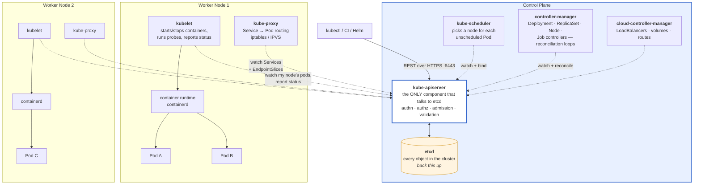
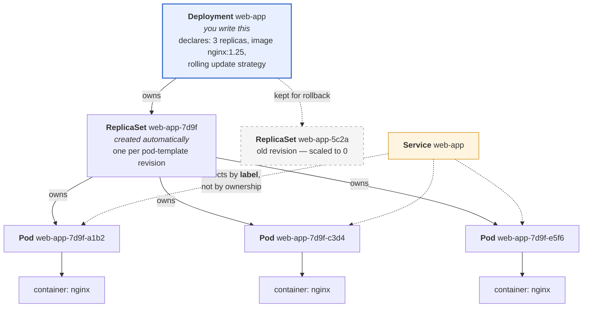
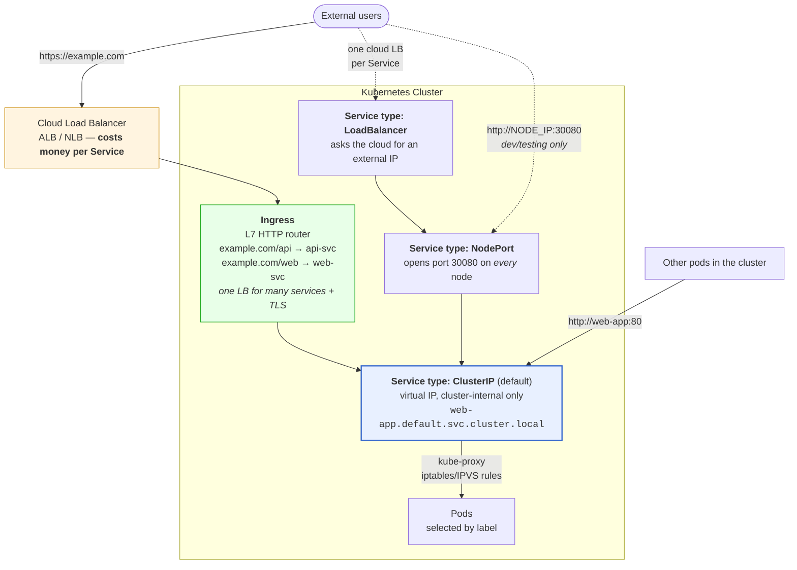
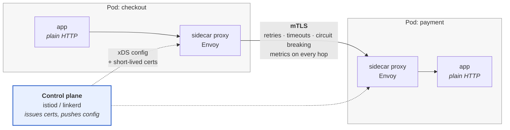
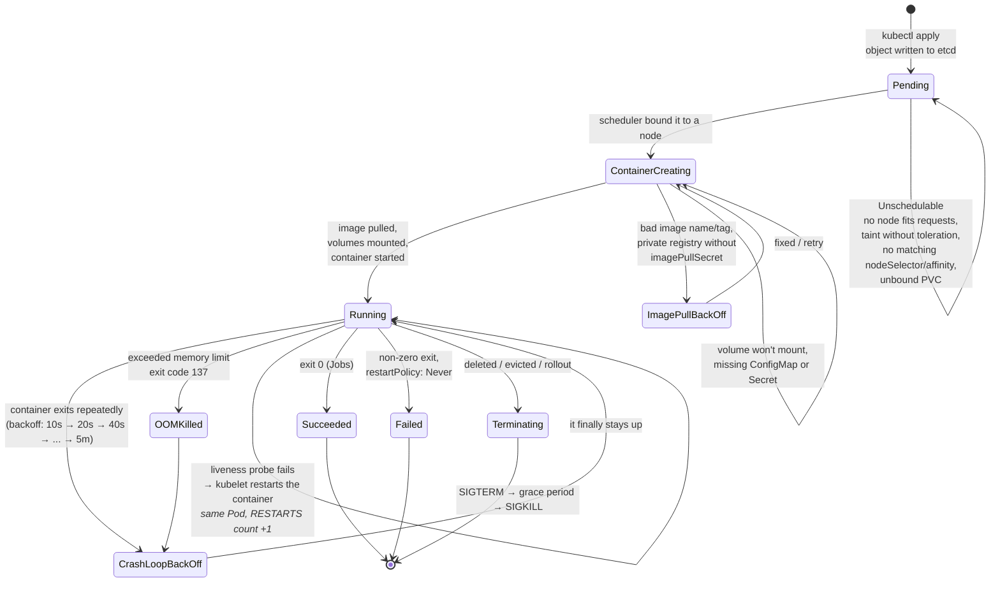
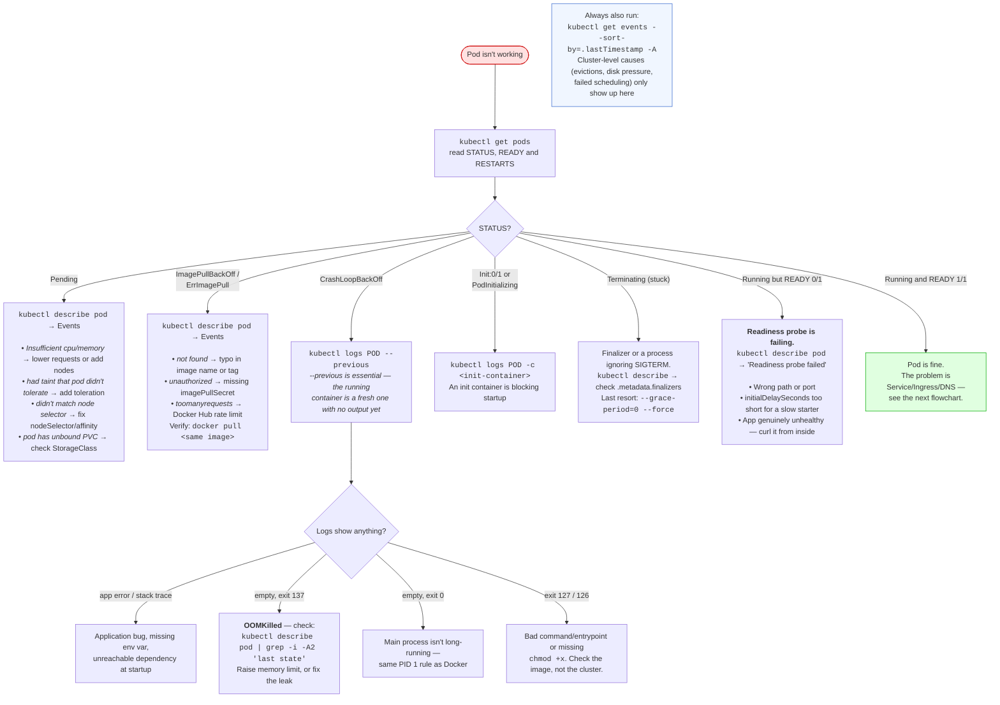
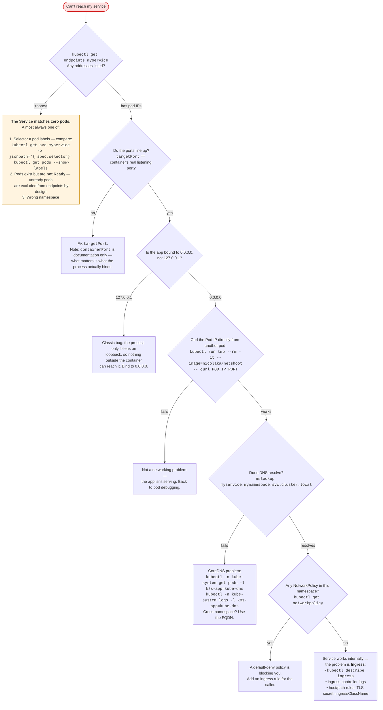
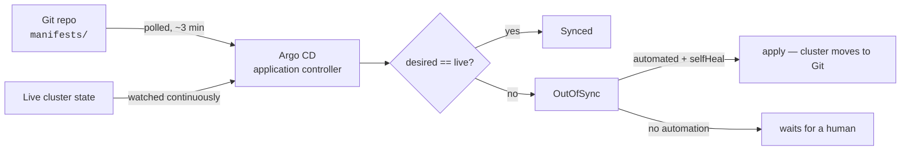

# Module 12: Kubernetes

> *"Kubernetes doesn't make simple things simple. It makes impossible things possible." — Kelsey Hightower*

---

>**Command reference**: [`cheatsheet.md`](./cheatsheet.md) — every command in this module, grouped by task, with the gotchas.
>
>**Cross-module lookup**: [Quick Reference](../QUICK-REFERENCE.md)

---

## Why This Module Matters

You can containerize an app with Docker. But how do you run 50 containers across 10 servers, handle failures, scale on demand, and do zero-downtime deployments? **Kubernetes** — the industry-standard container orchestration platform.

**In real-world DevOps work**, you will:

- Deploy applications as Pods, Deployments, and Services
- Scale applications horizontally based on load
- Perform zero-downtime rolling updates and rollbacks
- Configure networking, storage, and secrets
- Debug failing pods and cluster issues
- Manage Kubernetes with Helm charts

---

## Table of Contents

1. [Why Kubernetes?](#1-why-kubernetes)
2. [Architecture](#2-architecture)
3. [Core Objects](#3-core-objects)
4. [kubectl — The Essential Tool](#4-kubectl--the-essential-tool)
5. [Deployments and Scaling](#5-deployments-and-scaling)
6. [Services and Networking](#6-services-and-networking)
7. [ConfigMaps and Secrets](#7-configmaps-and-secrets)
8. [Storage](#8-storage)
9. [Helm — Package Manager](#9-helm--package-manager)
10. [Service Mesh — When You Actually Need One](#10-service-mesh--when-you-actually-need-one)
11. [Common Mistakes and Anti-Patterns](#11-common-mistakes-and-anti-patterns)
12. [Debugging Mindset](#12-debugging-mindset)
13. [Interview Insights](#13-interview-insights)

---

## 1. Why Kubernetes?

### The Problem It Solves

```
WITHOUT ORCHESTRATION:
  "Container crashed at 3am" → You get paged, manually restart
  "Traffic spiked 10x" → You manually spin up more containers
  "New version deploy" → Stop old, start new → DOWNTIME
  "Server died" → All containers on that server are gone

WITH KUBERNETES:
  Container crashed → K8s auto-restarts it (self-healing)
  Traffic spiked → K8s auto-scales (HPA)
  New version → Rolling update (zero downtime)
  Server died → K8s reschedules containers to healthy nodes
```

### When to Use Kubernetes

```
USE K8S WHEN:
   Running multiple microservices
   Need auto-scaling and self-healing
   Multiple environments (dev, staging, prod)
   Team size > 5 engineers
   High availability is critical

DON'T USE K8S WHEN:
   Single monolithic app
   Small team (1-3 people)
   Simple deployment needs (use Docker Compose)
   You don't have the expertise to operate it
```

---

## 2. Architecture

### Cluster Components



> ** The one idea that explains all of Kubernetes**: nothing gives orders. Every component **watches the API server** for the state it cares about and works to close the gap between desired and actual. `kubectl apply` doesn't create a pod — it writes a record to etcd, and then a chain of independent controllers notices and reacts. This is why the answer to "why isn't my thing running?" is always `kubectl describe` → **read the events**: the events are the controllers telling you where the chain stalled.
>
> Two operational corollaries: **etcd is the entire cluster** — lose it unbacked-up and the cluster is gone; and **the API server is the only path to etcd**, which is why API server availability, not node count, defines your control-plane SLO.

### Component Roles

| Component | Role |
|-----------|------|
| **API Server** | Front door to the cluster. kubectl talks to this |
| **etcd** | Key-value database storing ALL cluster state |
| **Scheduler** | Decides which node to place a new pod on |
| **Controller Manager** | Ensures desired state = actual state (reconciliation loop) |
| **kubelet** | Agent on each node — manages pods on that node |
| **kube-proxy** | Networking — routes traffic to the right pods |

---

## 3. Core Objects

### Pod — Smallest Deployable Unit

```yaml
# pod.yml — You rarely create Pods directly (use Deployments)
apiVersion: v1
kind: Pod
metadata:
  name: nginx
  labels:
    app: nginx
spec:
  containers:
    - name: nginx
      image: nginx:1.25
      ports:
        - containerPort: 80
      resources:
        requests:
          memory: "64Mi"
          cpu: "100m"
        limits:
          memory: "128Mi"
          cpu: "250m"
```

### Deployment — Manages Pods

```yaml
# deployment.yml
apiVersion: apps/v1
kind: Deployment
metadata:
  name: web-app
  labels:
    app: web-app
spec:
  replicas: 3                          # Run 3 copies
  selector:
    matchLabels:
      app: web-app
  template:                            # Pod template
    metadata:
      labels:
        app: web-app
    spec:
      containers:
        - name: web
          image: nginx:1.25
          ports:
            - containerPort: 80
          resources:
            requests:
              memory: "64Mi"
              cpu: "100m"
            limits:
              memory: "128Mi"
              cpu: "250m"
          livenessProbe:               # Is the container alive?
            httpGet:
              path: /
              port: 80
            initialDelaySeconds: 5
            periodSeconds: 10
          readinessProbe:              # Is it ready for traffic?
            httpGet:
              path: /
              port: 80
            initialDelaySeconds: 3
            periodSeconds: 5
```

#### Who Owns What

You create a Deployment. Kubernetes creates everything below it. Knowing this chain tells you **which object to edit** and **which one to look at when something's wrong**.



Three rules that follow from this picture:

1. **Never edit a Pod or a ReplicaSet directly.** The controller above will overwrite you, or your change vanishes on the next rollout. Edit the Deployment.
2. **Deleting a Pod doesn't remove it** — the ReplicaSet immediately makes a new one. That's the feature. To actually stop it, scale or delete the Deployment.
3. **The Service is connected by labels only**, not ownership. This is why a typo in `spec.selector` produces a Service with zero endpoints and a very confusing outage. Check it with `kubectl get endpoints web-app` — if it's `<none>`, your selector doesn't match your pod labels.

### Service — Expose Pods to Network

```yaml
# service.yml
apiVersion: v1
kind: Service
metadata:
  name: web-app
spec:
  selector:
    app: web-app                       # Routes to pods with this label
  type: ClusterIP                      # Internal only (default)
  ports:
    - port: 80                         # Service port
      targetPort: 80                   # Container port
---
# NodePort — accessible from outside cluster
apiVersion: v1
kind: Service
metadata:
  name: web-app-external
spec:
  selector:
    app: web-app
  type: NodePort
  ports:
    - port: 80
      targetPort: 80
      nodePort: 30080                  # Accessible at <NodeIP>:30080
---
# LoadBalancer — cloud provider creates an external LB
apiVersion: v1
kind: Service
metadata:
  name: web-app-lb
spec:
  selector:
    app: web-app
  type: LoadBalancer
  ports:
    - port: 80
      targetPort: 80
```

### Service Types

The types **stack**: LoadBalancer builds on NodePort, which builds on ClusterIP. Each one adds a layer of external reach on top of the last.



| Type | Reachable from | Cost | Use it for |
|------|----------------|------|------------|
| **ClusterIP** | Inside the cluster only | Free | Service-to-service. **The default and the right answer 90% of the time.** |
| **NodePort** | `<any-node-IP>:30000–32767` | Free | Local clusters, quick tests, bare metal behind your own LB |
| **LoadBalancer** | Public internet |  One cloud LB **per Service** | A single TCP/UDP service that must be exposed directly |
| **Ingress** | Public internet, HTTP/S only |  One cloud LB **for all services** | Normal web traffic — host/path routing and TLS termination |
| **ExternalName** | n/a — CNAME to an outside host | Free | Pointing an in-cluster name at an external database |

> ** The cost trap**: giving ten microservices `type: LoadBalancer` provisions ten cloud load balancers and ten bills. Use one Ingress in front of ten ClusterIP Services instead. Ingress is HTTP/S only, though — non-HTTP protocols (Postgres, gRPC streaming over raw TCP, game servers) still need LoadBalancer or a Gateway API implementation.

---

## 4. kubectl — The Essential Tool

### Must-Know Commands

```bash
# ─── VIEWING RESOURCES ───
kubectl get pods                        # List pods
kubectl get pods -o wide                # Show node, IP
kubectl get deployments                 # List deployments
kubectl get services                    # List services
kubectl get all                         # Everything in namespace
kubectl get nodes                       # List cluster nodes

# ─── DETAILED INFO ───
kubectl describe pod <name>             # Detailed pod info + events
kubectl describe deployment <name>      # Deployment details
kubectl logs <pod-name>                 # Container logs
kubectl logs <pod-name> -f              # Follow logs (tail)
kubectl logs <pod-name> --previous      # Logs from crashed container

# ─── CREATING / APPLYING ───
kubectl apply -f deployment.yml         # Create/update from file
kubectl apply -f ./k8s/                 # Apply all files in directory
kubectl delete -f deployment.yml        # Delete resources from file

# ─── SCALING ───
kubectl scale deployment web-app --replicas=5

# ─── UPDATES ───
kubectl set image deployment/web-app web=nginx:1.26
kubectl rollout status deployment/web-app
kubectl rollout undo deployment/web-app   # Rollback!
kubectl rollout history deployment/web-app

# ─── DEBUGGING ───
kubectl exec -it <pod-name> -- /bin/bash  # Shell into pod
kubectl port-forward <pod-name> 8080:80   # Local port forwarding
kubectl top pods                          # Resource usage
kubectl get events --sort-by='.lastTimestamp'
```

### Namespaces

```bash
# Namespaces isolate resources (like folders)
kubectl get namespaces
kubectl create namespace staging
kubectl get pods -n staging              # Pods in staging namespace
kubectl apply -f app.yml -n staging      # Deploy to staging

# Common namespaces:
#   default     — where your stuff goes if unspecified
#   kube-system — Kubernetes system components
#   kube-public — Publicly readable resources
```

---

## 5. Deployments and Scaling

### Rolling Update (Default)

```
Deployment update: nginx:1.25 → nginx:1.26

Step 1: [v1] [v1] [v1]           ← 3 pods running v1
Step 2: [v1] [v1] [v1] [v2]     ← New v2 pod created
Step 3: [v1] [v1] [v2] [v2]     ← Old v1 pod terminated
Step 4: [v1] [v2] [v2] [v2]     ← Continue rolling
Step 5: [v2] [v2] [v2]          ← All running v2

Zero downtime — at least some pods always running!
```

### Update Strategy Configuration

```yaml
spec:
  strategy:
    type: RollingUpdate
    rollingUpdate:
      maxSurge: 1            # Max extra pods during update
      maxUnavailable: 0      # Don't kill old before new is ready
```

### Horizontal Pod Autoscaler (HPA)

```yaml
apiVersion: autoscaling/v2
kind: HorizontalPodAutoscaler
metadata:
  name: web-app
spec:
  scaleTargetRef:
    apiVersion: apps/v1
    kind: Deployment
    name: web-app
  minReplicas: 2
  maxReplicas: 10
  metrics:
    - type: Resource
      resource:
        name: cpu
        target:
          type: Utilization
          averageUtilization: 70    # Scale up when CPU > 70%
```

```bash
# Or create via CLI
kubectl autoscale deployment web-app --min=2 --max=10 --cpu-percent=70
```

---

## 6. Services and Networking

### Ingress — HTTP Routing

```yaml
apiVersion: networking.k8s.io/v1
kind: Ingress
metadata:
  name: app-ingress
  annotations:
    nginx.ingress.kubernetes.io/rewrite-target: /
spec:
  rules:
    - host: myapp.example.com
      http:
        paths:
          - path: /api
            pathType: Prefix
            backend:
              service:
                name: api-service
                port:
                  number: 80
          - path: /
            pathType: Prefix
            backend:
              service:
                name: web-service
                port:
                  number: 80
```

### DNS Inside the Cluster

```
Every Service gets a DNS name:
  <service-name>.<namespace>.svc.cluster.local

  web-app.default.svc.cluster.local
  database.production.svc.cluster.local

  Short form (same namespace): web-app
  Cross-namespace: web-app.other-namespace
```

---

## 7. ConfigMaps and Secrets

### ConfigMap — Non-Sensitive Configuration

```yaml
apiVersion: v1
kind: ConfigMap
metadata:
  name: app-config
data:
  APP_ENV: "production"
  LOG_LEVEL: "info"
  DATABASE_HOST: "db.default.svc.cluster.local"
  config.json: |
    {
      "feature_flags": {
        "new_ui": true
      }
    }
---
# Use in a Deployment
spec:
  containers:
    - name: app
      envFrom:
        - configMapRef:
            name: app-config        # All keys as env vars
      volumeMounts:
        - name: config-volume
          mountPath: /app/config
  volumes:
    - name: config-volume
      configMap:
        name: app-config
        items:
          - key: config.json
            path: config.json       # Mounted as file
```

### Secret — Sensitive Data

```bash
# Create from CLI
kubectl create secret generic db-creds \
  --from-literal=DB_USER=admin \
  --from-literal=DB_PASS=supersecret

# Create from YAML (values must be base64 encoded)
echo -n 'admin' | base64        # YWRtaW4=
echo -n 'supersecret' | base64  # c3VwZXJzZWNyZXQ=
```

```yaml
apiVersion: v1
kind: Secret
metadata:
  name: db-creds
type: Opaque
data:
  DB_USER: YWRtaW4=              # base64 encoded
  DB_PASS: c3VwZXJzZWNyZXQ=
---
# Use in a Deployment
spec:
  containers:
    - name: app
      env:
        - name: DB_USER
          valueFrom:
            secretKeyRef:
              name: db-creds
              key: DB_USER
        - name: DB_PASS
          valueFrom:
            secretKeyRef:
              name: db-creds
              key: DB_PASS
```

>**Kubernetes Secrets are NOT encrypted by default** — they're base64 encoded (not encryption!). Enable encryption at rest or use external secret stores (Vault, AWS Secrets Manager).

---

## 8. Storage

### PersistentVolume and PersistentVolumeClaim

```yaml
# PVC — request storage
apiVersion: v1
kind: PersistentVolumeClaim
metadata:
  name: db-storage
spec:
  accessModes:
    - ReadWriteOnce               # One node can mount
  resources:
    requests:
      storage: 10Gi
  storageClassName: standard      # Cloud provider manages provisioning
---
# Use in a Pod
spec:
  containers:
    - name: postgres
      image: postgres:15
      volumeMounts:
        - name: db-data
          mountPath: /var/lib/postgresql/data
  volumes:
    - name: db-data
      persistentVolumeClaim:
        claimName: db-storage
```

---

## 9. Helm — Package Manager

### Why Helm?

```
WITHOUT HELM:
  10 YAML files per app × 3 environments = 30 files to maintain
  Copy-paste, find-and-replace "staging" → "production" 

WITH HELM:
  1 chart (template) + values files per environment
  helm install myapp ./chart -f prod-values.yml
```

### Helm Basics

```bash
# Install Helm
curl https://raw.githubusercontent.com/helm/helm/main/scripts/get-helm-3 | bash

# Add a chart repository
helm repo add bitnami https://charts.bitnami.com/bitnami
helm repo update

# Search for charts
helm search repo nginx

# Install a chart
helm install my-nginx bitnami/nginx

# List installed releases
helm list

# Upgrade with new values
helm upgrade my-nginx bitnami/nginx --set replicaCount=3

# Rollback
helm rollback my-nginx 1

# Uninstall
helm uninstall my-nginx
```

### Chart Structure

```
my-app/
├── Chart.yaml          # Chart metadata (name, version)
├── values.yaml         # Default configuration values
├── templates/
│   ├── deployment.yaml # Deployment template with {{ .Values.* }}
│   ├── service.yaml    # Service template
│   ├── ingress.yaml    # Ingress template
│   └── _helpers.tpl    # Template helper functions
└── charts/             # Sub-chart dependencies
```

---

## 10. Service Mesh — When You Actually Need One

### What a Mesh Actually Does

Every service needs the same handful of things from the network: encryption in transit, retries with timeouts, load balancing, and telemetry about who called whom. You can implement those five times in five languages, or you can move them out of the application and into a proxy next to it.

That proxy — one per pod — is the mesh. The application talks plain HTTP to localhost; the proxy handles mTLS, retries, and metrics on the way out.



> ** DevOps Impact**: the mesh gives you the same three capabilities the application team keeps asking for — "encrypt everything", "retry the flaky dependency", "show me a service dependency graph" — without a single application change, in any language. That is the genuine appeal, and it is why meshes get adopted despite the cost below.

### What You Get, Concretely

| Capability | Without a mesh | With a mesh |
|-----------|----------------|-------------|
| **mTLS everywhere** | Per-language TLS config, certificate distribution, rotation you built | On by default, certs rotated hourly by the control plane |
| **Retries and timeouts** | Implemented per client library, inconsistently | Policy per route, applied uniformly |
| **Traffic splitting** | Two Deployments and manual replica arithmetic | `90% v1 / 10% v2` as a declarative weight — real canaries |
| **Circuit breaking / outlier ejection** | A library, if your language has a good one | Connection-pool limits and automatic ejection of failing endpoints |
| **Golden metrics per hop** | Instrument every service and hope for consistency | Request rate, error rate, and latency for every service pair, free |
| **Authorization between services** | NetworkPolicy at L3/L4 (IP and port) | L7 identity: "checkout may POST /charge on payment", by workload identity |

The authorization line is the one that matters most for security: a NetworkPolicy says *this pod may reach that pod*, while a mesh says *this identity may call that method*. After a pod is compromised, the difference is large.

### What It Costs

This is the part sales decks omit, and the part an interviewer is checking you know:

- **A proxy per pod.** Roughly 50–100 MB of memory and a slice of CPU each, times every pod in the mesh. On a 300-pod cluster that is real capacity.
- **A hop of latency, twice.** Single-digit milliseconds per call, on both sides. Fine for most systems, not for all.
- **A control plane to operate.** Highly available, upgraded regularly, and capable of taking down all service-to-service traffic when misconfigured — a genuinely new single point of failure.
- **A second, subtler layer of debugging.** "Is it the app, or the proxy?" becomes a routine question. Sidecar startup ordering, mTLS mode mismatches (`PERMISSIVE` vs `STRICT`), and proxies that outlive a Job's main container are all normal Tuesdays.
- **Real learning cost.** Istio's API surface is large. A team that cannot yet write a readiness probe correctly will not be well served by a mesh.

### Sidecar or Sidecarless

The per-pod proxy tax pushed the ecosystem toward alternatives you should be able to name:

| Model | How | Trade |
|-------|-----|-------|
| **Sidecar** (Istio classic, Linkerd) | A proxy container injected into every pod | Full L7 features per workload; highest resource cost |
| **Ambient / sidecarless** (Istio ambient) | A per-node proxy for L4 + mTLS, with an L7 proxy only where needed | Much lower overhead; newer, and the L7 path is opt-in |
| **eBPF-based** (Cilium service mesh) | Kernel datapath for L3/L4, Envoy only for L7 | Least latency; ties you to the CNI, and features vary |

And the choice of implementation:

- **Linkerd** — deliberately small, Rust proxy, sane defaults, genuinely quick to run. The right first mesh for most teams.
- **Istio** — the most capable and the most complex; the default when you need its full policy surface or your vendor ships it.
- **Cilium** — compelling when you already run Cilium as your CNI and mostly want mTLS and observability.

### Do You Need One?

```
YOU PROBABLY NEED A MESH WHEN:
   Dozens of services in several languages, and you need mTLS across all of them
   A compliance requirement for encryption in transit that you must prove
   You want real canary deployments by traffic weight, not by replica count
   Nobody can draw the service dependency graph, and you need it to be accurate
   You have a platform team that can own the control plane

YOU DO NOT NEED A MESH WHEN:
   Under ~10 services (an Ingress plus good probes covers you)
   One language — a library gives you retries and mTLS for far less operational cost
   You have not yet got resource limits, probes, and NetworkPolicies right
   Nobody will own it. An unowned mesh is an outage with a delay fuse
   The actual requirement is "encrypt north-south traffic" — that is your Ingress
```

>**The honest interview answer**: "A mesh solves cross-cutting network concerns without touching application code, and it costs you a proxy per pod, a control plane to run, and a second place bugs can hide. Below about ten services I would use an Ingress, NetworkPolicies, and a retry library. Above that, with a compliance need for mTLS or a real canary requirement, I would start with Linkerd because it is the one a small team can actually operate."

```bash
# Enough to be dangerous, and to read someone else's cluster
istioctl install --set profile=demo          # never `demo` in production
kubectl label namespace app istio-injection=enabled   # injection is per namespace
istioctl analyze -n app                      #  finds misconfiguration before it bites
istioctl proxy-status                        # are the sidecars in sync with the control plane
istioctl proxy-config routes deploy/checkout # what this proxy actually believes

linkerd check                                #  the best preflight of any mesh
linkerd viz stat deploy -n app               # success rate and p99 per deployment
linkerd viz tap deploy/checkout              # live requests, without touching the app
```

---

## 11. Common Mistakes and Anti-Patterns

### No Resource Limits

```yaml
# BAD: Pod can consume unlimited resources → starves other pods
containers:
  - name: app
    image: myapp:latest

# GOOD: Set requests AND limits
containers:
  - name: app
    image: myapp:v1.2.3
    resources:
      requests:
        memory: "128Mi"
        cpu: "100m"
      limits:
        memory: "256Mi"
        cpu: "500m"
```

### Using `latest` Tag

```yaml
# BAD: What version is "latest"? Different on every pull
image: myapp:latest

# GOOD: Pin to a specific version
image: myapp:v1.2.3
# or SHA: myapp@sha256:abc123...
```

### No Health Checks

```yaml
# BAD: K8s can't tell if app is healthy → sends traffic to broken pods

# GOOD: Liveness + Readiness probes
livenessProbe:
  httpGet:
    path: /healthz
    port: 8080
  initialDelaySeconds: 10
readinessProbe:
  httpGet:
    path: /ready
    port: 8080
  initialDelaySeconds: 5
```

### Secrets in ConfigMaps

```
BAD:  Database password in a ConfigMap (visible to anyone)
GOOD: Use Kubernetes Secrets + external secret management (Vault)
```

---

## 12. Debugging Mindset

### The Pod Lifecycle

Before you can debug a pod, you need to know **which stage it is stuck at**. Each stalled state has a different owner and a different fix.



> ** Ready ≠ Running.** A pod shows `1/1 Running` only when its **readiness** probe passes. `0/1 Running` means the container is up but failing readiness — so the Service is deliberately not sending it traffic. That's the single most misread line in `kubectl get pods`.

### K8s Debugging Framework



### Service Not Reachable?

The pod is healthy but nothing can reach it. Work **outside-in**, and check `endpoints` early — it splits the problem in half.



> ** `kubectl get endpoints` is the fastest triage command in Kubernetes.** Empty means the problem is *above* the Service — labels or readiness. Populated means the problem is *below* it — ports, binding, DNS, policy, or ingress. One command, half the search space gone.

### `kubectl debug` — Debugging Minimal and Distroless Images

`kubectl exec` only works if the container has a shell. Modern production images (distroless, scratch, Alpine-based) often have **no shell, no curl, no tools at all**. `kubectl debug` (GA since Kubernetes 1.25) solves this by attaching an **ephemeral debug container** to a running pod.

```bash
# Problem: Your production pod uses a distroless image — no shell inside
kubectl exec -it my-pod -- /bin/sh
# Error: OCI runtime exec failed: exec failed: unable to start container process

# Solution: Attach a debug container with tools to the running pod
kubectl debug -it my-pod --image=busybox:latest --target=my-container
# --image     = the debug image (busybox, nicolaka/netshoot, ubuntu)
# --target    = the container to share process namespace with (see its processes)
# You're now inside a debug container with tools, alongside your running app

# Inside the debug container, you can:
#   ps aux              → see processes in the target container
#   cat /proc/1/environ → read environment variables of the app process
#   wget localhost:8080  → test the app internally
#   nslookup myservice   → test DNS resolution

# For network debugging, use nicolaka/netshoot (has curl, dig, tcpdump, etc.)
kubectl debug -it my-pod --image=nicolaka/netshoot --target=my-container

# Debug a node (creates a privileged pod on the node)
kubectl debug node/my-node -it --image=ubuntu
# Useful for: checking node disk, checking kubelet logs, host networking

# Create a copy of the pod with a different command (for crash loops)
kubectl debug my-pod -it --copy-to=my-pod-debug --container=my-container -- /bin/sh
# This creates a copy of the pod where you can override the entrypoint
```

>**In production, `kubectl debug` is often the ONLY way to troubleshoot** distroless images (common in Go/Java microservices). Learn to reach for it when `exec` fails.

---

## 13. Interview Insights

**Q: Explain Kubernetes architecture.**
> A K8s cluster has a control plane and worker nodes. The control plane runs the API server (entry point), etcd (state store), scheduler (pod placement), and controller manager (reconciliation loops). Worker nodes run kubelet (manages pods), kube-proxy (networking), and the container runtime. Users interact via kubectl which talks to the API server.

**Q: What's the difference between a Pod and a Deployment?**
> A Pod is the smallest deployable unit — one or more containers that share networking and storage. A Deployment manages Pods — it ensures the desired number of replicas are running, handles rolling updates, and enables rollbacks. You almost never create Pods directly; you create Deployments.

**Q: How does Kubernetes handle a node failure?**
> When a node stops responding, the controller manager detects it via the kubelet heartbeat. After a timeout (default 5 minutes), pods on that node are marked for rescheduling. The scheduler places them on healthy nodes. If using Deployments, the replica count is maintained automatically. This is self-healing.

**Q: Explain the difference between ClusterIP, NodePort, and LoadBalancer.**
> ClusterIP is internal-only — services talk to each other within the cluster. NodePort exposes a service on every node's IP at a static port (30000-32767) — accessible from outside. LoadBalancer integrates with a cloud provider to create an external load balancer that routes to the service. In production, you typically use LoadBalancer or Ingress.

**Q: How do you do zero-downtime deployments in Kubernetes?**
> Use Deployments with RollingUpdate strategy. Set maxUnavailable to 0 so no old pods are killed until new ones are ready. Add readiness probes so traffic only goes to pods that are actually ready. K8s creates new pods, waits for readiness, then terminates old pods — users see no interruption.

**Q: What is a Helm chart?**
> Helm is a package manager for Kubernetes. A chart is a collection of templated YAML manifests with configurable values. Instead of maintaining separate YAML files for each environment, you have one chart with different values files (dev.yaml, prod.yaml). Helm also handles versioning, upgrades, and rollbacks of deployments.

---

## Labs and Projects

Read the sections above first, then work through these **in order**. Every lab ends with a  **Break It** section — those are not optional; they are where the debugging skill actually comes from.

| # | Lab | What you'll do |
|---|-----|----------------|
| 1 | **[Kubernetes Basics](./labs/lab-01-kubernetes-basics.md)** | Set up a local Kubernetes cluster, deploy applications, expose them with Services, scale horizontally, perform rolling updates and rollbacks — the… |
| 2 | **[Configuration and Health](./labs/lab-02-configuration-and-health.md)** | Separate configuration from code the way Kubernetes intends, and make your workloads honestly report their own health. |
| 3 | **[Services, Ingress, and Network Policy](./labs/lab-03-networking-and-ingress.md)** | Understand how a packet actually reaches a pod. |
| 4 | **[Scaling and Resource Tuning](./labs/lab-04-scaling-and-resources.md)** | Get resource requests and limits right — and learn what each kind of "wrong" looks like from the outside. |
| 5 | **[RBAC and Pod Security](./labs/lab-05-rbac-and-security.md)** | Lock down a cluster the way a real one is locked down. |
| 6 | **[GitOps with Argo CD](./labs/lab-06-gitops-argocd.md)** | Stop deploying with `kubectl` — put a workload's desired state in Git and let a controller inside the cluster reconcile toward it. |
| 7 | **[Service Mesh with Linkerd](./labs/lab-07-service-mesh.md)** | Get mTLS, per-hop golden metrics, and identity-based authorization across two services **without changing either application** — then measure what… |

**Portfolio project:**

- [Project: Kubernetes Rollout and Rollback](./projects/project-01-rollout-rollback.md) — Deploy a small application to Kubernetes, update it, intentionally break it, and recover with a rollback.

**Reference code** for every lab: [`code/`](./code/) — real files, validated in CI.

---

## Self-Check

Answer these from memory before you expand them. If more than two give you trouble, re-read the sections they come from — the labs assume this material is solid.

<details>
<summary><strong>1. What does each control plane component do?</strong></summary>

The API server is the only component that talks to etcd, and every change goes through it. etcd stores cluster state. The scheduler decides which node an unassigned pod lands on. The controller manager runs the loops that drive actual state toward desired. On each node, the kubelet starts and watches containers and kube-proxy programs service routing.

</details>

<details>
<summary><strong>2. What follows from Kubernetes being a reconciliation loop rather than a command runner?</strong></summary>

You declare desired state and controllers work continuously to match it. Delete a pod owned by a Deployment and you get a replacement — the pod was never the thing you asked for. To stop something you change the desired state, and if it keeps coming back, some controller still wants it.

</details>

<details>
<summary><strong>3. Deployment, StatefulSet, or DaemonSet?</strong></summary>

Deployment for interchangeable stateless replicas. StatefulSet when pods need stable identity, stable per-pod storage, and ordered rollout — databases and quorum systems. DaemonSet when you want exactly one pod per node, which is what agents, log shippers, and CNI plugins need.

</details>

<details>
<summary><strong>4. A pod is in CrashLoopBackOff. What are your first three commands?</strong></summary>

`kubectl describe pod` for events, last state, and exit code; `kubectl logs --previous` for what the crashed container printed before it died; then look at the probes and resource limits. Exit code 137 means OOMKilled, so raise the memory limit or fix the leak. A liveness probe that fails during a slow startup produces the identical symptom.

</details>

<details>
<summary><strong>5. Liveness, readiness, and startup probes — what breaks if you confuse them?</strong></summary>

Liveness restarts a container it considers hung. Readiness only removes the pod from Service endpoints, without restarting it. Startup gives a slow starter time before liveness applies. Using a liveness probe where you needed readiness restart-loops an application that was merely busy, which turns a load spike into an outage.

</details>

<details>
<summary><strong>6. Requests or limits — which one does the scheduler use?</strong></summary>

Requests. They are what the scheduler reserves and what your workload is actually guaranteed. Limits are the ceiling: exceed CPU and you are throttled, exceed memory and you are OOMKilled. A pod with no requests gets scheduled on a guess, which is how nodes end up overcommitted.

</details>

<details>
<summary><strong>7. Is a Kubernetes Secret encrypted?</strong></summary>

No — it is base64-encoded, which is encoding, not encryption. Anyone with `get secret` in the namespace can read it, and it sits in etcd in plain text unless you enable encryption at rest. Real protection comes from RBAC, encryption at rest, and for anything valuable an external secret store.

</details>

---

## Practical Checkpoint

Before moving on, you should be able to:

- Deploy workloads with Deployments, Services, ConfigMaps, Secrets, probes, and resource limits.
- Use `kubectl get`, `describe`, `logs`, `events`, and rollout commands to debug failures.
- Perform a rolling update and rollback while preserving service availability.

Portfolio evidence to keep:

- Kubernetes manifests.
- Rollout and rollback command output.
- Debug notes for one failed pod, bad image, or readiness problem.

Suggested project: [Kubernetes Rollout and Rollback](./projects/project-01-rollout-rollback.md)

---

## What's Next?

With Kubernetes mastered, you've completed the core production skills. Next, you'll consolidate security practices across the entire stack.

**[Module 13: Security Basics →](../13-security-basics/)**

---

<div align="center">

**Module 12 Complete** 

[← Back to Ansible](../11-ansible/) | [ Cheat Sheet](./cheatsheet.md) | [Next: Security Basics →](../13-security-basics/)

</div>


## Reference
<!-- tab: Cheatsheet -->
> kubectl by verb, jsonpath recipes, debugging one-liners, and Helm. Concepts live in the [module README](./README.md).
> Cross-module daily commands: **[QUICK-REFERENCE.md](../QUICK-REFERENCE.md)**

**Jump to:** [Setup](#setup--context) · [Get](#get--list) · [Describe & events](#describe--events) · [Logs](#logs) · [Exec & debug](#exec--debug) · [Apply & edit](#apply-edit-delete) · [Rollouts](#rollouts--scaling) · [Resources](#resources--autoscaling) · [Config & secrets](#configmaps--secrets) · [Networking](#networking) · [Storage](#storage) · [RBAC](#rbac) · [jsonpath](#jsonpath--custom-columns) · [Debugging](#debugging-recipes) · [Helm](#helm) · [Manifests](#manifest-templates) · [Errors](#error-decoder)

---

## Setup & Context

```bash
kubectl version --client
kubectl cluster-info
kubectl config get-contexts                      #  which clusters do I have?
kubectl config current-context                   #  WHICH CLUSTER AM I ON RIGHT NOW
kubectl config use-context prod
kubectl config set-context --current --namespace=production    #  stop typing -n
kubectl config view --minify                     # current context only
kubectl api-resources                            # every resource type + short name
kubectl api-resources --namespaced=false         # cluster-scoped resources
kubectl api-versions
kubectl explain deployment.spec.template.spec.containers    #  built-in field docs
kubectl explain pod.spec --recursive | less
```

```bash
# Shell setup — do this once, save hours
alias k=kubectl
source <(kubectl completion bash)     # or zsh
complete -o default -F __start_kubectl k
export KUBE_EDITOR=vim

# kubectx / kubens — switch context and namespace instantly
kubectx prod
kubens production
```

>**Put the current context in your shell prompt.** `kubectl delete` in the wrong cluster is the Kubernetes equivalent of `rm -rf /`. Tools: `kube-ps1`, `starship`, or a plain `PS1` with `kubectl config current-context`.

---

## Get / List

```bash
kubectl get pods
kubectl get pods -A                              #  all namespaces
kubectl get pods -n kube-system
kubectl get pods -o wide                         #  + node, pod IP, nominated node
kubectl get pods -w                              # watch for changes
kubectl get pods --show-labels
kubectl get pods -l app=api,tier=backend         # label selector (AND)
kubectl get pods -l 'env in (staging,prod)'
kubectl get pods -l '!canary'                    # label absent
kubectl get pods --field-selector status.phase=Running
kubectl get pods --field-selector spec.nodeName=node-1
kubectl get pods --sort-by=.status.containerStatuses[0].restartCount   #  worst first
kubectl get pods --sort-by=.metadata.creationTimestamp
kubectl get pods -o yaml                         # full manifest
kubectl get pods -o json | jq '.items[].metadata.name'
kubectl get all                                  # common resources in this namespace
kubectl get all -A -o wide

kubectl get deploy,svc,ing                       # multiple types at once
kubectl get nodes -o wide
kubectl get ns
kubectl get events --sort-by=.lastTimestamp      #  the most underused command
kubectl get events -A --sort-by=.lastTimestamp --field-selector type=Warning
kubectl get endpoints myservice                  #  does the Service match any pods?
kubectl get endpointslices -l kubernetes.io/service-name=myservice
```

**Short names:** `po` pods · `deploy` deployments · `rs` replicasets · `svc` services · `ing` ingresses · `ns` namespaces · `no` nodes · `cm` configmaps · `pv`/`pvc` volumes · `sa` serviceaccounts · `sts` statefulsets · `ds` daemonsets · `hpa` · `netpol` · `crd`

---

## Describe & Events

```bash
kubectl describe pod mypod                  #  scroll to the EVENTS section at the bottom
kubectl describe deploy myapp
kubectl describe node node-1                #  allocated resources, conditions, taints
kubectl describe svc myservice
kubectl describe pvc mydata

# Events for one object
kubectl get events --field-selector involvedObject.name=mypod --sort-by=.lastTimestamp

# Cluster-wide warnings in the last period
kubectl get events -A --field-selector type=Warning --sort-by=.lastTimestamp | tail -30
```

>**`describe` before `logs`.** Logs tell you what the application said; events tell you whether the application ever started. Scheduling failures, image pull errors, volume mount failures, and probe failures all appear **only** in events.

---

## Logs

```bash
kubectl logs mypod
kubectl logs mypod -c mycontainer                # multi-container pod
kubectl logs mypod --previous                    #  the CRASHED container's logs
kubectl logs mypod -f                            # follow
kubectl logs mypod --tail=100
kubectl logs mypod --since=15m
kubectl logs mypod --since-time=2026-08-04T09:00:00Z
kubectl logs mypod --timestamps

kubectl logs -l app=api --all-containers --prefix --tail=50    #  all pods of an app
kubectl logs deploy/myapp                        # one pod from the deployment
kubectl logs deploy/myapp --all-pods -f          # (1.31+) every pod
kubectl logs job/mybatch
kubectl logs -n kube-system -l k8s-app=kube-dns  # CoreDNS

# Multi-pod tailing with colour
stern api                                        # stern is worth installing
stern -n prod 'api-.*' --since 10m
```

---

## Exec & Debug

```bash
kubectl exec -it mypod -- bash
kubectl exec -it mypod -c sidecar -- sh
kubectl exec mypod -- env
kubectl exec mypod -- cat /etc/config/app.yaml
kubectl exec mypod -- ps aux

#  Ephemeral debug container — for distroless/scratch images with no shell
kubectl debug -it mypod --image=nicolaka/netshoot --target=mycontainer
kubectl debug -it mypod --image=busybox --target=app -- sh

# Copy the pod with a different entrypoint — for CrashLoopBackOff
kubectl debug mypod -it --copy-to=mypod-debug --container=app -- sh
kubectl debug mypod -it --copy-to=mypod-debug --set-image=app=busybox -- sh

# Debug a NODE (privileged pod with the host filesystem at /host)
kubectl debug node/node-1 -it --image=ubuntu

# Throwaway pods
kubectl run tmp --rm -it --image=nicolaka/netshoot -- bash      #  network toolbox
kubectl run tmp --rm -it --image=busybox --restart=Never -- sh
kubectl run curl --rm -it --image=curlimages/curl -- sh

kubectl cp mypod:/var/log/app.log ./app.log
kubectl cp ./config.yaml mypod:/tmp/config.yaml
kubectl port-forward pod/mypod 8080:80           #  reach a pod from your laptop
kubectl port-forward svc/myservice 5432:5432
kubectl port-forward deploy/myapp 8080:8080
kubectl attach -it mypod
kubectl proxy --port=8001                        # local proxy to the API server
```

---

## Apply, Edit, Delete

```bash
kubectl apply -f deployment.yml
kubectl apply -f ./manifests/                    # a whole directory
kubectl apply -k ./overlays/prod                 # kustomize
kubectl apply -f https://example.com/manifest.yml
kubectl apply -f d.yml --dry-run=server          #  validate against the real API + webhooks
kubectl apply -f d.yml --dry-run=client -o yaml  # render without sending
kubectl diff -f deployment.yml                   #  what WOULD change — always run this first

kubectl create deployment nginx --image=nginx:1.25
kubectl create ns staging
kubectl create cm app-config --from-file=./config/ --dry-run=client -o yaml > cm.yaml
kubectl create secret generic db --from-literal=password=s3cr3t
kubectl create job manual-run --from=cronjob/nightly

kubectl edit deploy myapp                        # opens $KUBE_EDITOR, applies on save
kubectl patch deploy myapp -p '{"spec":{"replicas":5}}'
kubectl patch deploy myapp --type=json \
  -p='[{"op":"replace","path":"/spec/template/spec/containers/0/image","value":"myapp:v2"}]'
kubectl set image deploy/myapp app=myapp:v2      #  the standard deploy command
kubectl set env deploy/myapp LOG_LEVEL=debug
kubectl set resources deploy/myapp -c=app --limits=memory=1Gi
kubectl label pod mypod env=prod --overwrite
kubectl annotate deploy myapp kubernetes.io/change-cause="deploy v2"

kubectl delete pod mypod
kubectl delete -f deployment.yml
kubectl delete pods -l app=api
kubectl delete pod mypod --grace-period=0 --force    #  last resort — can orphan resources
kubectl delete all -l app=myapp -n staging           #  'all' is not literally everything
```

>**`kubectl diff -f` before `kubectl apply -f`** is the Kubernetes equivalent of `terraform plan`. It's the single easiest habit to adopt and it catches a surprising number of mistakes.

---

## Rollouts & Scaling

```bash
kubectl rollout status deploy/myapp --timeout=5m     #  blocks until ready or fails
kubectl rollout history deploy/myapp
kubectl rollout history deploy/myapp --revision=3
kubectl rollout undo deploy/myapp                    #  back one revision
kubectl rollout undo deploy/myapp --to-revision=3
kubectl rollout restart deploy/myapp                 #  rolling restart, no image change
kubectl rollout pause deploy/myapp                   # batch several changes
kubectl rollout resume deploy/myapp

kubectl scale deploy/myapp --replicas=5
kubectl scale deploy/myapp --replicas=0              # stop without deleting
kubectl scale --replicas=3 -f deployment.yml
kubectl scale deploy/myapp --current-replicas=3 --replicas=5   # safe conditional scale
```

```yaml
strategy:
  type: RollingUpdate
  rollingUpdate:
    maxUnavailable: 0        #  never drop below the desired count
    maxSurge: 1              # one extra pod at a time
minReadySeconds: 10          # a pod must stay ready this long before continuing
progressDeadlineSeconds: 600 # mark the rollout failed after this
revisionHistoryLimit: 10
```

>A rollout with `maxUnavailable: 0` plus a correct **readiness probe** is genuine zero-downtime. Without the readiness probe, Kubernetes will happily route traffic to a pod that hasn't finished starting.

---

## Resources & Autoscaling

```bash
kubectl top nodes                                # requires metrics-server
kubectl top pods -A --sort-by=memory             # 
kubectl top pods --containers
kubectl describe node node-1 | grep -A 8 "Allocated resources"    #  real utilisation
kubectl get pods -A -o custom-columns=\
'NS:.metadata.namespace,POD:.metadata.name,CPU_REQ:.spec.containers[*].resources.requests.cpu,MEM_REQ:.spec.containers[*].resources.requests.memory'

kubectl autoscale deploy myapp --min=2 --max=10 --cpu-percent=70
kubectl get hpa
kubectl describe hpa myapp                       #  why isn't it scaling?

kubectl cordon node-1                            # stop new pods landing here
kubectl drain node-1 --ignore-daemonsets --delete-emptydir-data    #  evacuate for maintenance
kubectl uncordon node-1
kubectl taint node node-1 key=value:NoSchedule
kubectl taint node node-1 key-                   # remove (trailing dash)
```

```yaml
resources:
  requests:              #  what the SCHEDULER reserves
    cpu: "100m"
    memory: "128Mi"
  limits:                #  the ceiling the kernel enforces
    cpu: "500m"          # exceeded → THROTTLED (slow)
    memory: "512Mi"      # exceeded → OOMKILLED (dead)
```

| | Too low | Too high |
|---|---------|----------|
| **CPU request** | Pod is starved under contention | Wastes capacity, blocks scheduling |
| **CPU limit** | Throttling — mysterious latency  | (Often better to omit CPU limits entirely) |
| **Memory request** | Node overcommits, evictions | Wastes capacity |
| **Memory limit** | **OOMKilled**, exit 137 | Node OOM risk affects neighbours |

```yaml
# Pod Disruption Budget — protects you during node drains
apiVersion: policy/v1
kind: PodDisruptionBudget
metadata: {name: myapp}
spec:
  minAvailable: 2        # or: maxUnavailable: 1
  selector: {matchLabels: {app: myapp}}
```

---

## ConfigMaps & Secrets

```bash
kubectl create cm app-config --from-literal=LOG_LEVEL=info --from-literal=PORT=8080
kubectl create cm app-config --from-file=./config/app.yaml
kubectl create cm app-config --from-env-file=.env
kubectl get cm app-config -o yaml
kubectl describe cm app-config

kubectl create secret generic db-creds \
  --from-literal=username=app --from-literal=password='s3cr3t'
kubectl create secret generic tls-key --from-file=./tls.key
kubectl create secret docker-registry ghcr \
  --docker-server=ghcr.io --docker-username=USER --docker-password="$TOKEN"
kubectl create secret tls my-tls --cert=cert.pem --key=key.pem

#  Read a secret value
kubectl get secret db-creds -o jsonpath='{.data.password}' | base64 -d; echo
kubectl get secret db-creds -o go-template='{{range $k,$v := .data}}{{$k}}={{$v|base64decode}}{{"\n"}}{{end}}'

# Update in place
kubectl create cm app-config --from-file=./config/ --dry-run=client -o yaml \
  | kubectl apply -f -
```

```yaml
envFrom:
  - configMapRef: {name: app-config}
  - secretRef:    {name: db-creds}
env:
  - name: DB_PASSWORD
    valueFrom:
      secretKeyRef: {name: db-creds, key: password}
  - name: POD_NAME
    valueFrom:
      fieldRef: {fieldPath: metadata.name}       #  downward API
volumes:
  - name: config
    configMap:
      name: app-config
      items: [{key: app.yaml, path: app.yaml}]
```

>**Kubernetes Secrets are base64-encoded, not encrypted.** Anyone with `get secret` RBAC, or read access to etcd, can read them. For production: enable **encryption at rest** in the API server, restrict RBAC tightly, and use **External Secrets Operator** or **Sealed Secrets** so plaintext never enters git.
>
> Also: a pod using a ConfigMap via `env` does **not** pick up changes — you must restart it (`kubectl rollout restart`). ConfigMaps mounted as **volumes** do update, eventually, if the app re-reads the file.

---

## Networking

```bash
kubectl get svc
kubectl get svc -o wide
kubectl get endpoints myservice                  #  empty = selector/readiness problem
kubectl get ing
kubectl describe ing myingress
kubectl get netpol

kubectl expose deploy myapp --port=80 --target-port=8080 --name=myapp-svc
kubectl expose deploy myapp --type=LoadBalancer --port=80

# DNS test from inside the cluster
kubectl run tmp --rm -it --image=nicolaka/netshoot -- \
  nslookup myservice.mynamespace.svc.cluster.local
kubectl run tmp --rm -it --image=nicolaka/netshoot -- \
  curl -sv http://myservice.mynamespace:8080/health
```

**Service DNS**: `<service>.<namespace>.svc.cluster.local`
Same namespace: `myservice`. Cross-namespace: `myservice.othernamespace`.

```yaml
# Default-deny NetworkPolicy — the right starting point for any namespace
apiVersion: networking.k8s.io/v1
kind: NetworkPolicy
metadata: {name: default-deny-ingress}
spec:
  podSelector: {}
  policyTypes: [Ingress]
---
# Then allow specifically
apiVersion: networking.k8s.io/v1
kind: NetworkPolicy
metadata: {name: allow-api-to-db}
spec:
  podSelector: {matchLabels: {app: db}}
  policyTypes: [Ingress]
  ingress:
    - from:
        - podSelector: {matchLabels: {app: api}}
      ports:
        - {protocol: TCP, port: 5432}
```

---

## Storage

```bash
kubectl get pv
kubectl get pvc
kubectl get sc                                   # storage classes
kubectl describe pvc mydata                      #  why is it Pending?
kubectl get pvc -A --sort-by=.spec.resources.requests.storage
```

```yaml
apiVersion: v1
kind: PersistentVolumeClaim
metadata: {name: mydata}
spec:
  accessModes: [ReadWriteOnce]
  storageClassName: gp3
  resources: {requests: {storage: 20Gi}}
```

| Access mode | Meaning |
|-------------|---------|
| `ReadWriteOnce` (RWO) | One **node** can mount it read-write — the normal case for block storage |
| `ReadOnlyMany` (ROX) | Many nodes, read-only |
| `ReadWriteMany` (RWX) | Many nodes read-write — needs NFS/EFS/CephFS, not EBS |
| `ReadWriteOncePod` | Exactly one **pod** |

>A `Pending` PVC is almost always one of: no default StorageClass, a StorageClass that provisions in a different AZ than the pod's node, or requesting `ReadWriteMany` from a driver that only does `ReadWriteOnce`. `kubectl describe pvc` says which.

---

## RBAC

```bash
kubectl auth can-i create deployments                       #  can I?
kubectl auth can-i delete pods --namespace prod
kubectl auth can-i '*' '*' --all-namespaces                 # am I cluster-admin?
kubectl auth can-i list secrets --as=system:serviceaccount:default:myapp    #  can THEY?
kubectl auth whoami                                          # (1.28+)

kubectl get roles,rolebindings -A
kubectl get clusterroles,clusterrolebindings
kubectl describe clusterrole view
kubectl get sa

kubectl create sa myapp
kubectl create role pod-reader --verb=get,list,watch --resource=pods
kubectl create rolebinding myapp-pods --role=pod-reader --serviceaccount=default:myapp
kubectl create clusterrolebinding admin-alice --clusterrole=cluster-admin --user=alice
```

```yaml
apiVersion: rbac.authorization.k8s.io/v1
kind: Role
metadata: {namespace: prod, name: app-reader}
rules:
  - apiGroups: [""]
    resources: [pods, configmaps]
    verbs: [get, list, watch]
  - apiGroups: ["apps"]
    resources: [deployments]
    resourceNames: [myapp]        #  scope to specific objects
    verbs: [get, patch]
```

| | Namespaced | Cluster-wide |
|---|-----------|--------------|
| Permissions | `Role` | `ClusterRole` |
| Grant | `RoleBinding` | `ClusterRoleBinding` |

A `RoleBinding` can reference a `ClusterRole` — that grants those permissions **within one namespace**, which is the usual way to reuse the built-in `view`/`edit`/`admin` roles.

---

## jsonpath & Custom Columns

```bash
kubectl get pods -o jsonpath='{.items[*].metadata.name}'
kubectl get pods -o jsonpath='{range .items[*]}{.metadata.name}{"\t"}{.status.phase}{"\n"}{end}'
kubectl get pods -o jsonpath='{.items[*].spec.containers[*].image}' | tr ' ' '\n' | sort -u
kubectl get nodes -o jsonpath='{.items[*].status.addresses[?(@.type=="InternalIP")].address}'
kubectl get pod mypod -o jsonpath='{.status.containerStatuses[0].restartCount}'
kubectl get pod mypod -o jsonpath='{.status.containerStatuses[0].lastState.terminated.reason}'   #  OOMKilled?
kubectl get svc mysvc -o jsonpath='{.status.loadBalancer.ingress[0].hostname}'
kubectl get secret s -o jsonpath='{.data.password}' | base64 -d

kubectl get pods -o custom-columns=\
'NAME:.metadata.name,STATUS:.status.phase,NODE:.spec.nodeName,RESTARTS:.status.containerStatuses[0].restartCount,IMAGE:.spec.containers[0].image'

kubectl get pods -A -o custom-columns=\
'NS:.metadata.namespace,POD:.metadata.name,MEM_LIM:.spec.containers[*].resources.limits.memory'

# Everything running in the cluster, deduplicated
kubectl get pods -A -o jsonpath='{range .items[*]}{range .spec.containers[*]}{.image}{"\n"}{end}{end}' | sort -u
```

**Handy `jq` combinations:**

```bash
kubectl get pods -o json | jq -r '.items[] | select(.status.phase!="Running") | .metadata.name'
kubectl get pods -A -o json | jq -r '.items[] | select(.spec.containers[].resources.limits == null)
  | "\(.metadata.namespace)/\(.metadata.name)"'          #  pods with no limits
kubectl get nodes -o json | jq -r '.items[] | "\(.metadata.name) \(.status.allocatable.memory)"'
```

---

## Debugging Recipes

```bash
# ─── Pod won't start ───
kubectl get pods                                       # 1. read STATUS
kubectl describe pod mypod                             # 2.  scroll to Events
kubectl logs mypod --previous                          # 3.  the crashed container
kubectl get events --sort-by=.lastTimestamp | tail -30 # 4. cluster-level causes
kubectl get pod mypod -o yaml | less                   # 5. the full resolved spec

# Was it OOMKilled?
kubectl get pod mypod -o jsonpath='{.status.containerStatuses[*].lastState.terminated.reason}'

# ─── Service unreachable ───
kubectl get endpoints myservice                        #  FIRST. Empty = labels/readiness
kubectl get pods -l app=myapp --show-labels            # do labels match the selector?
kubectl get svc myservice -o jsonpath='{.spec.selector}'
kubectl run tmp --rm -it --image=nicolaka/netshoot -- curl -sv http://myservice:80
kubectl run tmp --rm -it --image=nicolaka/netshoot -- nslookup myservice
kubectl logs -n ingress-nginx -l app.kubernetes.io/name=ingress-nginx --tail=50

# ─── Node problems ───
kubectl get nodes
kubectl describe node node-1 | grep -A 10 Conditions   #  DiskPressure? MemoryPressure?
kubectl describe node node-1 | grep -A 8 "Allocated resources"
kubectl get pods -A --field-selector spec.nodeName=node-1

# ─── Everything is Pending ───
kubectl describe pod mypod | grep -A 5 Events          # "0/3 nodes are available: ..."
kubectl get nodes -o custom-columns='NAME:.metadata.name,TAINTS:.spec.taints'
kubectl top nodes
kubectl get resourcequota -A
kubectl get limitrange -A

# ─── Resource forensics ───
kubectl get pods -A --sort-by=.status.containerStatuses[0].restartCount | tail -20
kubectl top pods -A --sort-by=memory | head -20
kubectl get pods -A -o json | jq -r '.items[] |
  select(.status.containerStatuses[]?.lastState.terminated.reason=="OOMKilled") |
  "\(.metadata.namespace)/\(.metadata.name)"'          #  everything recently OOMKilled
```

---

## Helm

```bash
helm repo add bitnami https://charts.bitnami.com/bitnami
helm repo update
helm search repo nginx
helm search hub prometheus
helm show values bitnami/nginx > values.yaml         #  see every configurable option
helm show chart bitnami/nginx
helm show readme bitnami/nginx

helm install myrelease bitnami/nginx
helm install myrelease bitnami/nginx -f values.yaml --namespace prod --create-namespace
helm install myrelease ./mychart --set replicaCount=3 --set image.tag=v2
helm install myrelease ./mychart --dry-run --debug   #  render without installing
helm install myrelease ./mychart --wait --timeout 5m --atomic   #  auto-rollback on failure

helm upgrade myrelease bitnami/nginx -f values.yaml
helm upgrade --install myrelease ./mychart -f values.yaml       #  idempotent — use in CI
helm upgrade myrelease ./mychart --reuse-values --set image.tag=v3

helm list / helm list -A / helm list --all           # includes failed releases
helm status myrelease
helm history myrelease                               #  revision list
helm rollback myrelease 3
helm uninstall myrelease --keep-history
helm get values myrelease                            #  what values are actually in use
helm get values myrelease --all                      # including chart defaults
helm get manifest myrelease                          # the rendered YAML that was applied
helm get notes myrelease

helm template myrelease ./mychart -f values.yaml     #  render locally, no cluster needed
helm template . | kubectl apply --dry-run=server -f -
helm lint ./mychart
helm diff upgrade myrelease ./mychart                # plugin: helm-diff  install this
helm dependency update ./mychart
helm package ./mychart
helm create mychart
```

```
mychart/
├── Chart.yaml          # name, version, appVersion, dependencies
├── values.yaml         # default values
├── values.schema.json  #  validates user-supplied values
├── templates/
│   ├── deployment.yaml
│   ├── service.yaml
│   ├── _helpers.tpl    # named template definitions
│   └── NOTES.txt       # post-install message
└── charts/             # vendored subcharts
```

```yaml
# Template essentials
{{ .Values.image.tag | default .Chart.AppVersion }}
{{ .Release.Name }} {{ .Release.Namespace }} {{ .Chart.Name }} {{ .Chart.Version }}
{{ include "mychart.fullname" . }}
{{- if .Values.ingress.enabled }} ... {{- end }}
{{- range .Values.env }}
  - name: {{ .name }}
    value: {{ .value | quote }}
{{- end }}
{{- with .Values.nodeSelector }}
nodeSelector: {{ toYaml . | nindent 8 }}
{{- end }}
checksum/config: {{ include (print $.Template.BasePath "/configmap.yaml") . | sha256sum }}
#    that annotation forces a rollout whenever the ConfigMap changes
{{ required "image.repository is required" .Values.image.repository }}
{{ .Values.password | b64enc }}
```

---

## GitOps (Argo CD)

```bash
argocd login localhost:8080 --username admin --insecure     # port-forwarded, self-signed cert
kubectl -n argocd get secret argocd-initial-admin-secret \
  -o jsonpath='{.data.password}' | base64 -d                # the install-time admin password
argocd account update-password                               #  then delete that Secret

argocd app list
argocd app get web                                           #  Sync Status + Health Status
argocd app get web --refresh                                 # compare against Git NOW, don't wait
argocd app get web -o json | jq '.spec.syncPolicy'           # is prune/selfHeal actually on?
argocd app diff web                                          #  what differs from Git, before syncing
argocd app resources web                                     # what Argo CD believes it manages
argocd app manifests web                                     # the rendered YAML it would apply

argocd app sync web
argocd app sync web --dry-run                                #  read this before enabling prune
argocd app sync web --prune
argocd app history web
argocd app rollback web 3                                    #  out-of-band — next sync undoes it

argocd app set web --sync-policy automated --auto-prune=true --self-heal=true
argocd app set web --revision main                           #  which revision it actually tracks
argocd app set web --sync-policy none                        # back to manual

argocd app logs web --follow                                 # app pod logs, via Argo CD
argocd app wait web --health --timeout 300                   #  use this in a pipeline
kubectl -n argocd logs deploy/argocd-repo-server             # Git clone / render failures
kubectl -n argocd logs statefulset/argocd-application-controller   # sync + reconcile failures
kubectl get applications -n argocd -o wide                   # no CLI? the CRD is right there
```

| Status pair | Means |
|-------------|-------|
| `Synced` + `Healthy` | Working as intended |
| `Synced` + `Degraded` |  The cluster matches Git and **Git is wrong** — re-syncing cannot fix it. Revert |
| `OutOfSync` + `Healthy` | Something is running that Git doesn't describe — drift, or a pending change |
| `OutOfSync` + `Degraded` | A failed sync, usually a bad manifest — check the app's conditions |
| `Missing` | Git describes it, nothing applied it yet |

| Field | Default | Why it bites |
|-------|---------|--------------|
| `syncPolicy.automated` | absent | No automation at all — Argo CD is a diff tool until you set it |
| `automated.selfHeal` | `false` |  Cluster-side drift is reported, never reverted |
| `automated.prune` | `false` |  Deleting a manifest from Git deletes nothing. `Synced` stays green |
| `targetRevision` | — | `HEAD`/a stale branch tracks the wrong thing while looking perfectly synced |
| `ignoreDifferences` | absent | Without it, `selfHeal` fights the HPA over `spec.replicas` forever |

---

## Service Mesh

Only after limits, probes, and NetworkPolicies are right — a mesh on shaky basics adds a second
place for bugs to hide.

```bash
# Istio
istioctl install --set profile=demo          #  never `demo` in production
kubectl label namespace app istio-injection=enabled    # injection is per NAMESPACE
istioctl analyze -n app                      #  finds misconfiguration before it bites
istioctl proxy-status                        # are sidecars in sync with the control plane
istioctl proxy-config routes deploy/checkout # what this proxy actually believes
istioctl proxy-config secret deploy/checkout # mTLS certs the sidecar holds

# Linkerd — the best preflight of any mesh
linkerd check
linkerd viz stat deploy -n app               # success rate + p99 per deployment
linkerd viz tap deploy/checkout              # live requests, no app changes
linkerd viz edges deploy -n app              # who actually talks to whom
```

| Gives you | Instead of |
|-----------|-----------|
| mTLS everywhere, certs rotated hourly | Per-language TLS config and cert distribution you built |
| Retries, timeouts, circuit breaking as policy | A different client library per language |
| Traffic splitting by weight (real canaries) | Replica arithmetic across two Deployments |
| Golden metrics for every service pair | Instrumenting every service and hoping for consistency |
| L7 authorization by workload identity | NetworkPolicy at L3/L4 — IP and port only |

| Costs you | Roughly |
|-----------|---------|
| Memory + CPU per pod (sidecar) | ~50–100 MB each × every pod |
| Latency | Single-digit ms, on both sides of every call |
| A control plane | HA, upgraded, and able to break all service traffic when misconfigured |
| Debugging surface | "App or proxy?" — startup ordering, `PERMISSIVE` vs `STRICT`, sidecars outliving Jobs |

**Models**: sidecar (per pod, full L7, priciest) · ambient/sidecarless (per node for L4+mTLS,
L7 opt-in) · eBPF (Cilium — least latency, tied to your CNI).
**Under ~10 services**: Ingress + NetworkPolicies + a retry library. Skip the mesh.

---

## Manifest Templates

```yaml
apiVersion: apps/v1
kind: Deployment
metadata:
  name: myapp
  labels: {app: myapp}
spec:
  replicas: 3
  revisionHistoryLimit: 5
  selector:
    matchLabels: {app: myapp}          #  immutable after creation
  strategy:
    type: RollingUpdate
    rollingUpdate: {maxUnavailable: 0, maxSurge: 1}
  template:
    metadata:
      labels: {app: myapp}
      annotations:
        prometheus.io/scrape: "true"
        prometheus.io/port: "8080"
    spec:
      serviceAccountName: myapp
      securityContext:
        runAsNonRoot: true
        runAsUser: 10001
        fsGroup: 10001
        seccompProfile: {type: RuntimeDefault}
      topologySpreadConstraints:       #  spread across zones
        - maxSkew: 1
          topologyKey: topology.kubernetes.io/zone
          whenUnsatisfiable: ScheduleAnyway
          labelSelector: {matchLabels: {app: myapp}}
      containers:
        - name: app
          image: ghcr.io/org/myapp@sha256:abc...     #  digest, not a tag
          imagePullPolicy: IfNotPresent
          ports: [{containerPort: 8080, name: http}]
          envFrom:
            - configMapRef: {name: myapp-config}
            - secretRef:    {name: myapp-secrets}
          resources:
            requests: {cpu: 100m, memory: 128Mi}
            limits:   {memory: 512Mi}
          securityContext:
            allowPrivilegeEscalation: false
            readOnlyRootFilesystem: true
            capabilities: {drop: [ALL]}
          startupProbe:                #  for slow starters — protects liveness
            httpGet: {path: /health, port: http}
            failureThreshold: 30
            periodSeconds: 5
          readinessProbe:              #  gates TRAFFIC
            httpGet: {path: /ready, port: http}
            periodSeconds: 5
            failureThreshold: 3
          livenessProbe:               #  gates RESTART — keep it simple and cheap
            httpGet: {path: /health, port: http}
            periodSeconds: 10
            failureThreshold: 3
          lifecycle:
            preStop:
              exec: {command: ["sh", "-c", "sleep 10"]}   # let the LB deregister first
          volumeMounts:
            - {name: tmp, mountPath: /tmp}
      volumes:
        - name: tmp
          emptyDir: {}
      terminationGracePeriodSeconds: 45
```

| Probe | Failure means | Use for |
|-------|---------------|---------|
| **startupProbe** | Kill and restart | Slow-starting apps; disables the other two until it passes |
| **readinessProbe** | Remove from Service endpoints  | "Can I serve traffic right now?" — may check dependencies |
| **livenessProbe** | **Restart the container**  | "Am I deadlocked?" — must be cheap and must **not** check dependencies |

>**Never make a liveness probe check a database.** When the database has a hiccup, every replica fails liveness, every replica restarts simultaneously, and a small outage becomes a total one. Dependency checks belong in **readiness**.

---

## Error Decoder

| Status / message | Cause | Fix |
|------------------|-------|-----|
| `Pending` + `Insufficient cpu/memory` | No node has room | Lower requests, scale the cluster |
| `Pending` + `didn't match node selector` / `had taint` | Scheduling constraints | Fix `nodeSelector`/affinity, add a toleration |
| `Pending` + `pod has unbound PVC` | Storage not provisioned | `describe pvc`; check StorageClass and AZ |
| `ImagePullBackOff` / `ErrImagePull` | Bad image name/tag, or auth | Verify the tag; add `imagePullSecrets` |
| `CrashLoopBackOff` | Container keeps exiting | `logs --previous`; check exit code and OOM |
| `OOMKilled` (exit 137) | Exceeded the memory limit | Raise the limit or fix the leak |
| `CreateContainerConfigError` | Missing ConfigMap/Secret key | `describe pod` names the missing key |
| `Init:0/1` | An init container is blocking | `logs POD -c <init-container>` |
| `Running` but `READY 0/1` |  Readiness probe failing | `describe pod` → probe path, port, initialDelay |
| `Terminating` forever | Finalizer, or SIGTERM ignored | Check `.metadata.finalizers`; last resort `--force --grace-period=0` |
| `Evicted` | Node pressure (disk/memory) | `describe node` → Conditions; set requests properly |
| `Service has no endpoints` | Selector doesn't match, or pods unready | Compare `svc.spec.selector` with pod labels |
| `502/504` from Ingress | Backend unready, or wrong port | Check endpoints, `targetPort`, ingress-controller logs |
| `Error from server (Forbidden)` | RBAC | `kubectl auth can-i ...`; add a Role/RoleBinding |
| `The Deployment is invalid: spec.selector: field is immutable` | Changed the selector | Delete and recreate the Deployment |
| Config change had no effect | ConfigMap via `env` needs a restart | `kubectl rollout restart deploy/myapp` |
| CPU throttling, no errors | CPU **limit** too low | Raise or remove the CPU limit; check `container_cpu_cfs_throttled_periods_total` |

---

<div align="center">

[← Module 12 README](./README.md) · [Resources](./resources.md) · [Labs](./labs/) · [Handbook Quick Reference](../QUICK-REFERENCE.md)

</div>
<!-- tab: Labs -->
# Lab 01: Kubernetes Basics — Deploy, Scale, and Update with minikube

## Objective

Set up a local Kubernetes cluster, deploy applications, expose them with Services, scale horizontally, perform rolling updates and rollbacks — the core K8s workflows you'll use daily.

---

## Prerequisites

- Docker installed
- minikube installed (`minikube version`)
- kubectl installed (`kubectl version --client`)
- Completed Module 05 (Docker) and Module 11 (Ansible)

### Install minikube and kubectl (if needed)

```bash
# minikube (Linux)
curl -LO https://storage.googleapis.com/minikube/releases/latest/minikube-linux-amd64
sudo install minikube-linux-amd64 /usr/local/bin/minikube

# kubectl (Linux)
curl -LO "https://dl.k8s.io/release/$(curl -L -s https://dl.k8s.io/release/stable.txt)/bin/linux/amd64/kubectl"
sudo install kubectl /usr/local/bin/kubectl
```

---

## Deliverables and Evidence

By the end of this lab, keep the following evidence in your notes or portfolio repo:

- Commands you ran and the important output you used for validation
- Any files, scripts, configs, manifests, or workflows you created
- A short failure note describing one thing that broke, how you diagnosed it, and how you fixed it
- Cleanup commands or confirmation that no long-running resources remain

Treat the validation section as the minimum proof that the lab worked.

---

## Lab Files

Every file this lab creates also exists as a real, CI-validated file in
[`../code/lab-01/`](../code/lab-01/) (3 files).

```bash
# Option A — type them out yourself (recommended the first time; that's the learning)
# Option B — start from the reference copies
cp -r /path/to/the-devops-handbook/12-kubernetes/code/lab-01/. .
```

Use Option B when you're comparing against a known-good version, or when something
won't start and you need to rule out a typo. See [`../code/README.md`](../code/README.md).

---

## Exercise 1: Start a Cluster and Deploy

### Step 1: Start minikube

```bash
minikube start --driver=docker

# Verify
kubectl cluster-info
kubectl get nodes
```

### Step 2: Create a Deployment

```bash
mkdir -p k8s-lab && cd k8s-lab

cat > deployment.yml << 'YAML'
apiVersion: apps/v1
kind: Deployment
metadata:
  name: web-app
  labels:
    app: web-app
spec:
  replicas: 3
  selector:
    matchLabels:
      app: web-app
  template:
    metadata:
      labels:
        app: web-app
    spec:
      containers:
        - name: nginx
          image: nginx:1.25
          ports:
            - containerPort: 80
          resources:
            requests:
              memory: "64Mi"
              cpu: "50m"
            limits:
              memory: "128Mi"
              cpu: "100m"
          livenessProbe:
            httpGet:
              path: /
              port: 80
            initialDelaySeconds: 5
            periodSeconds: 10
          readinessProbe:
            httpGet:
              path: /
              port: 80
            initialDelaySeconds: 3
            periodSeconds: 5
YAML

kubectl apply -f deployment.yml
```

### Step 3: Verify

```bash
# Watch pods come up
kubectl get pods -w

# Check deployment
kubectl get deployments

# Detailed info
kubectl describe deployment web-app

# Check events
kubectl get events --sort-by='.lastTimestamp'
```

** Checkpoint:** 3 pods running with STATUS = Running and READY = 1/1.

---

## Exercise 2: Expose with a Service

```bash
cat > service.yml << 'YAML'
apiVersion: v1
kind: Service
metadata:
  name: web-app
spec:
  selector:
    app: web-app
  type: NodePort
  ports:
    - port: 80
      targetPort: 80
      nodePort: 30080
YAML

kubectl apply -f service.yml

# Access the service
minikube service web-app --url
# Visit the URL in your browser — you should see the Nginx welcome page

# Or use port-forward
kubectl port-forward service/web-app 8080:80 &
curl http://localhost:8080
```

** Checkpoint:** Nginx welcome page accessible from your browser.

---

## Exercise 3: Scale and Observe

```bash
# Scale up
kubectl scale deployment web-app --replicas=5
kubectl get pods -w

# Scale down
kubectl scale deployment web-app --replicas=2
kubectl get pods -w

# Check which nodes the pods are on
kubectl get pods -o wide

# Check resource usage
kubectl top pods    # (requires metrics-server: minikube addons enable metrics-server)
```

** Checkpoint:** Scaling up creates new pods, scaling down terminates extras.

---

## Exercise 4: Rolling Update and Rollback

### Step 1: Update the Image

```bash
# Update to a new version
kubectl set image deployment/web-app nginx=nginx:1.26

# Watch the rollout
kubectl rollout status deployment/web-app

# Check rollout history
kubectl rollout history deployment/web-app

# Verify new version
kubectl get pods -o jsonpath='{.items[*].spec.containers[0].image}'
```

### Step 2: Rollback

```bash
# Deploy a broken image
kubectl set image deployment/web-app nginx=nginx:nonexistent

# Watch it fail
kubectl get pods
# You'll see ImagePullBackOff errors

# Rollback!
kubectl rollout undo deployment/web-app

# Verify rollback
kubectl rollout status deployment/web-app
kubectl get pods
```

** Checkpoint:** You deployed a bad image, saw it fail, and rolled back successfully.

---

## Exercise 5: ConfigMaps and Secrets

```bash
# Create a ConfigMap
kubectl create configmap app-config \
  --from-literal=APP_ENV=production \
  --from-literal=LOG_LEVEL=info

# Create a Secret
kubectl create secret generic db-creds \
  --from-literal=DB_USER=admin \
  --from-literal=DB_PASS=s3cret123

# Deploy a pod that uses them
cat > configured-pod.yml << 'YAML'
apiVersion: v1
kind: Pod
metadata:
  name: configured-app
spec:
  containers:
    - name: app
      image: busybox
      command: ["sh", "-c", "env | sort && sleep 3600"]
      envFrom:
        - configMapRef:
            name: app-config
      env:
        - name: DB_USER
          valueFrom:
            secretKeyRef:
              name: db-creds
              key: DB_USER
        - name: DB_PASS
          valueFrom:
            secretKeyRef:
              name: db-creds
              key: DB_PASS
YAML

kubectl apply -f configured-pod.yml

# Verify environment variables
kubectl logs configured-app | grep -E "APP_ENV|LOG_LEVEL|DB_USER|DB_PASS"
```

** Checkpoint:** Pod has environment variables from both ConfigMap and Secret.

---

## Break It: Debug Scenarios

### Scenario 1: Wrong Image

```bash
kubectl set image deployment/web-app nginx=nginx:doesnotexist
# Check: kubectl get pods → ImagePullBackOff
# Fix: kubectl rollout undo deployment/web-app
```

### Scenario 2: Resource Limits Too Low

```bash
kubectl set resources deployment/web-app --limits=memory=1Mi
# Check: kubectl get pods → OOMKilled
# Fix: kubectl set resources deployment/web-app --limits=memory=128Mi
```

### Scenario 3: Labels Don't Match

```bash
# Create a service with wrong selector
cat > broken-svc.yml << 'YAML'
apiVersion: v1
kind: Service
metadata:
  name: broken
spec:
  selector:
    app: wrong-label
  ports:
    - port: 80
YAML
kubectl apply -f broken-svc.yml
kubectl get endpoints broken
# Endpoints: <none> — no pods match!
```

---

## Cleanup

```bash
kubectl delete -f .
cd .. && rm -rf k8s-lab
minikube stop    # or: minikube delete
```

---

## Validation

- [ ] Start a minikube cluster and verify with kubectl
- [ ] Create a Deployment with 3 replicas and health probes
- [ ] Expose it with a NodePort Service and access from browser
- [ ] Scale up and down, observe pod lifecycle
- [ ] Perform a rolling update and verify new image version
- [ ] Rollback a broken deployment
- [ ] Use ConfigMaps and Secrets as environment variables
- [ ] Debug ImagePullBackOff, OOMKilled, and selector mismatch issues
- [ ] Explain the difference between Deployment and Pod

## What to Commit

Add these to your portfolio repo as evidence of completed work:

- Kubernetes manifests (Deployment, Service, ConfigMap, Secret)
- Rolling update and rollback command output
- Scale-up observation notes with pod status
- Break It debugging log with kubectl commands used

---

[← Back to Module README](../README.md)

---

# Lab 02: Configuration and Health — ConfigMaps, Secrets, and Probes

## Objective

Separate configuration from code the way Kubernetes intends, and make your workloads honestly report their own health. By the end you'll know exactly which probe gates traffic, which one restarts a container, why a config change sometimes needs a restart and sometimes doesn't, and how to debug a pod stuck at `0/1 Running`.

---

## Prerequisites

- Completed [Lab 01: Kubernetes Basics](./lab-01-kubernetes-basics.md)
- A running cluster (`minikube start --driver=docker`) and `kubectl` configured
- Familiarity with `kubectl describe` and reading the Events section

```bash
kubectl config current-context      #  confirm you are on minikube, not something real
kubectl get nodes
```

---

## Deliverables and Evidence

By the end of this lab, keep the following evidence in your notes or portfolio repo:

- Manifests for a ConfigMap, a Secret, and a Deployment that consumes both
- Output proving a pod stayed out of the Service endpoints until it was actually ready
- A record of the difference between an env-var config change and a volume-mounted one
- Your `failure-notes.md` from the Break It section
- Cleanup confirmation

---

## Lab Files

Every file this lab creates also exists as a real, CI-validated file in
[`../code/lab-02/`](../code/lab-02/).

```bash
# Option A — type them out yourself (recommended the first time; that's the learning)
# Option B — start from the reference copies
cp -r /path/to/the-devops-handbook/12-kubernetes/code/lab-02/. .
```

See [`../code/README.md`](../code/README.md).

---

## Exercise 1: Configuration as Data

### Step 1: Set Up

```bash
mkdir -p k8s-config-lab && cd k8s-config-lab
kubectl create namespace configlab
kubectl config set-context --current --namespace=configlab
```

### Step 2: A ConfigMap Three Ways

There are three ways to create a ConfigMap, and each produces a different shape.

```bash
# (a) From literals — keys you type
kubectl create configmap app-settings \
  --from-literal=LOG_LEVEL=info \
  --from-literal=MAX_CONNECTIONS=100 \
  --from-literal=FEATURE_DARK_MODE=true

# (b) From a file — the FILENAME becomes the key, the CONTENT becomes the value
cat > app.properties <<'EOF'
server.port=8080
server.timeout=30s
cache.enabled=true
EOF
kubectl create configmap app-properties --from-file=app.properties

# (c) From an env-style file — each LINE becomes a key
cat > app.env <<'EOF'
DATABASE_HOST=postgres.configlab.svc.cluster.local
DATABASE_PORT=5432
EOF
kubectl create configmap app-env --from-env-file=app.env

kubectl get cm
kubectl get cm app-settings -o yaml
kubectl get cm app-properties -o yaml   #  note: ONE key, whose value is the whole file
kubectl get cm app-env -o yaml          #  note: TWO keys
```

** Checkpoint:** You can explain why `--from-file` and `--from-env-file` produce different key structures from the same input.

### Step 3: Secrets Are Not Encrypted

```bash
kubectl create secret generic db-credentials \
  --from-literal=username=appuser \
  --from-literal=password='S3cr3t-P@ss'

kubectl get secret db-credentials -o yaml
# The values are base64. That is ENCODING, not encryption.

#  Anyone with `get secret` RBAC can read this in one command:
kubectl get secret db-credentials -o jsonpath='{.data.password}' | base64 -d; echo

# All keys at once
kubectl get secret db-credentials \
  -o go-template='{{range $k,$v := .data}}{{$k}}={{$v | base64decode}}{{"\n"}}{{end}}'
```

>**Kubernetes Secrets are base64-encoded, not encrypted.** They are stored in etcd, and by default that storage is plaintext too. What makes a Secret meaningfully different from a ConfigMap is that it is *treated* differently: not printed in `describe` output, mountable as `tmpfs`, and gated by separate RBAC. For production you need **encryption at rest** on the API server plus an external store (External Secrets Operator, Sealed Secrets, Vault) so plaintext never enters git.

### Step 4: Declarative Versions

Everything above was imperative, which is fine for exploring. Real work is declarative:

```bash
cat > config.yml <<'YAML'
apiVersion: v1
kind: ConfigMap
metadata:
  name: app-settings
data:
  LOG_LEVEL: "info"
  MAX_CONNECTIONS: "100"
  FEATURE_DARK_MODE: "true"
  # A whole file as one key — the | preserves newlines
  app.properties: |
    server.port=8080
    server.timeout=30s
    cache.enabled=true
---
apiVersion: v1
kind: Secret
metadata:
  name: db-credentials
type: Opaque
stringData:              #  stringData takes PLAIN text; Kubernetes encodes it for you
  username: appuser
  password: S3cr3t-P@ss
YAML

kubectl apply -f config.yml
kubectl describe cm app-settings
kubectl describe secret db-credentials    #  values are hidden, unlike a ConfigMap
```

>Use `stringData` when writing Secrets by hand — you write plain text and Kubernetes base64-encodes it. `data` requires you to encode it yourself, which is an easy place to make a silent mistake.

---

## Exercise 2: Consuming Configuration

### Step 1: Every Injection Method in One Pod

```bash
cat > deployment.yml <<'YAML'
apiVersion: apps/v1
kind: Deployment
metadata:
  name: config-demo
  labels: {app: config-demo}
spec:
  replicas: 2
  selector:
    matchLabels: {app: config-demo}
  template:
    metadata:
      labels: {app: config-demo}
    spec:
      containers:
        - name: app
          image: nginx:1.27-alpine
          ports:
            - {containerPort: 80, name: http}

          # (1) Every key in a ConfigMap/Secret becomes an env var
          envFrom:
            - configMapRef: {name: app-settings}
            - secretRef:    {name: db-credentials}

          env:
            # (2) One specific key, optionally renamed
            - name: DB_PASSWORD
              valueFrom:
                secretKeyRef: {name: db-credentials, key: password}
            # (3) The downward API — pod metadata as env vars
            - name: POD_NAME
              valueFrom:
                fieldRef: {fieldPath: metadata.name}
            - name: POD_NAMESPACE
              valueFrom:
                fieldRef: {fieldPath: metadata.namespace}
            - name: NODE_NAME
              valueFrom:
                fieldRef: {fieldPath: spec.nodeName}
            - name: MEMORY_LIMIT
              valueFrom:
                resourceFieldRef: {containerName: app, resource: limits.memory}

          # (4) Mounted as files
          volumeMounts:
            - {name: config-volume, mountPath: /etc/app,     readOnly: true}
            - {name: secret-volume, mountPath: /etc/secrets, readOnly: true}

          resources:
            requests: {cpu: 50m,  memory: 64Mi}
            limits:   {memory: 128Mi}

      volumes:
        - name: config-volume
          configMap:
            name: app-settings
            items:
              - {key: app.properties, path: application.properties}
        - name: secret-volume
          secret:
            secretName: db-credentials
            defaultMode: 0400        #  read-only, owner only
YAML

kubectl apply -f deployment.yml
kubectl rollout status deploy/config-demo
```

### Step 2: Verify Each Method

```bash
POD=$(kubectl get pod -l app=config-demo -o jsonpath='{.items[0].metadata.name}')

echo "── env vars from envFrom ──"
kubectl exec "$POD" -- printenv | grep -E 'LOG_LEVEL|MAX_CONNECTIONS|FEATURE_DARK_MODE|username|password'

echo "── the renamed secret key ──"
kubectl exec "$POD" -- printenv DB_PASSWORD

echo "── downward API ──"
kubectl exec "$POD" -- printenv | grep -E 'POD_NAME|POD_NAMESPACE|NODE_NAME|MEMORY_LIMIT'

echo "── mounted config file ──"
kubectl exec "$POD" -- cat /etc/app/application.properties

echo "── mounted secret ──"
kubectl exec "$POD" -- ls -l /etc/secrets/
kubectl exec "$POD" -- cat /etc/secrets/username; echo
```

** Checkpoint:** All four injection methods work, and you can see the same underlying data arriving through each.

### Step 3: The Update Behaviour That Surprises Everyone

This is the most practically important thing in the lab.

```bash
# Change ONE value
kubectl patch cm app-settings --type merge -p '{"data":{"LOG_LEVEL":"debug","app.properties":"server.port=8080\nserver.timeout=60s\ncache.enabled=false\n"}}'

echo "── immediately after the change ──"
kubectl exec "$POD" -- printenv LOG_LEVEL          # still "info"  
kubectl exec "$POD" -- cat /etc/app/application.properties   # still the old file

echo "── wait for the kubelet sync period (up to ~60s) ──"
sleep 75

kubectl exec "$POD" -- printenv LOG_LEVEL          # STILL "info"   env vars NEVER update
kubectl exec "$POD" -- cat /etc/app/application.properties   #  the new content
```

| Injection method | Updates without a restart? |
|------------------|---------------------------|
| `env` / `envFrom` |  **Never.** The value is fixed when the container starts |
| Volume mount |  Yes, within ~1 minute (kubelet sync period) |
| Volume mount with `subPath` |  **No.** A `subPath` mount is not updated — a very common trap |
| Secret as `tmpfs` volume |  Same as ConfigMap volumes |

```bash
# To pick up an env-var change, you must restart:
kubectl rollout restart deploy/config-demo
kubectl rollout status deploy/config-demo
POD=$(kubectl get pod -l app=config-demo -o jsonpath='{.items[0].metadata.name}')
kubectl exec "$POD" -- printenv LOG_LEVEL          #  "debug"
```

>**The production pattern**: annotate the pod template with a **hash of the config**, so any config change automatically changes the pod spec and triggers a rollout:
>
> ```yaml
> template:
>   metadata:
>     annotations:
>       checksum/config: "<sha256 of the ConfigMap contents>"
> ```
>
> Helm does this with `{{ include (print $.Template.BasePath "/configmap.yaml") . | sha256sum }}`. Kustomize does it automatically with `configMapGenerator`, which appends a content hash to the ConfigMap *name*. Without one of these, config changes silently don't apply and you spend an afternoon wondering why.

---

## Exercise 3: Probes — Three Jobs, Three Probes

### Step 1: Understand What Each One Controls

| Probe | Fails → | Answers |
|-------|---------|---------|
| **startupProbe** | Kill and restart the container | "Have I finished booting?" Disables the other two until it passes |
| **readinessProbe** | Remove the pod from Service endpoints — **no restart** | "Can I serve traffic *right now*?" |
| **livenessProbe** | **Restart the container** | "Am I deadlocked and unrecoverable?" |

### Step 2: Deploy an App With All Three

```bash
cat > probes-demo.yml <<'YAML'
apiVersion: v1
kind: ConfigMap
metadata:
  name: probe-content
data:
  # /healthz always returns 200. /ready we will toggle by hand.
  default.conf: |
    server {
      listen 80;
      location / {
        return 200 "serving\n";
        add_header Content-Type text/plain;
      }
      location /healthz {
        return 200 "alive\n";
        add_header Content-Type text/plain;
      }
      location /ready {
        # Serves the file if it exists, 503 if it doesn't
        root /var/ready;
        try_files /ready.txt =503;
      }
    }
---
apiVersion: apps/v1
kind: Deployment
metadata:
  name: probes-demo
  labels: {app: probes-demo}
spec:
  replicas: 3
  selector:
    matchLabels: {app: probes-demo}
  template:
    metadata:
      labels: {app: probes-demo}
    spec:
      containers:
        - name: web
          image: nginx:1.27-alpine
          ports: [{containerPort: 80, name: http}]
          command: ["/bin/sh", "-c"]
          args:
            - |
              mkdir -p /var/ready
              # Simulate a slow start: not ready for the first 15 seconds
              (sleep 15 && echo ok > /var/ready/ready.txt) &
              exec nginx -g 'daemon off;'

          startupProbe:                #  gives the app up to 60s to boot
            httpGet: {path: /healthz, port: http}
            periodSeconds: 2
            failureThreshold: 30

          readinessProbe:              #  gates TRAFFIC
            httpGet: {path: /ready, port: http}
            periodSeconds: 3
            failureThreshold: 2
            successThreshold: 1

          livenessProbe:               #  gates RESTART — cheap, no dependencies
            httpGet: {path: /healthz, port: http}
            periodSeconds: 10
            failureThreshold: 3

          volumeMounts:
            - {name: conf, mountPath: /etc/nginx/conf.d}
          resources:
            requests: {cpu: 50m, memory: 32Mi}
            limits:   {memory: 96Mi}
      volumes:
        - name: conf
          configMap: {name: probe-content}
---
apiVersion: v1
kind: Service
metadata:
  name: probes-demo
spec:
  selector: {app: probes-demo}
  ports: [{port: 80, targetPort: http}]
YAML

kubectl apply -f probes-demo.yml
```

### Step 3: Watch Readiness Gate the Traffic

Open a second terminal and watch:

```bash
# Terminal 2
watch -n1 'kubectl get pods -l app=probes-demo; echo; kubectl get endpoints probes-demo'
```

In terminal 1:

```bash
kubectl get pods -l app=probes-demo -w
```

**What you should observe, in order:**

1. Pods appear as `0/1 Running` — the container is up, but **not ready**
2. `kubectl get endpoints probes-demo` shows **no addresses**
3. After ~15 seconds the readiness probe starts passing
4. Pods flip to `1/1 Running` and their IPs appear in the endpoints list

```bash
kubectl get endpoints probes-demo -o jsonpath='{.subsets[*].addresses[*].ip}'; echo
```

** Checkpoint:** You watched a pod be *running but deliberately excluded from the Service* until it was genuinely ready. That gap is what makes zero-downtime deploys possible.

### Step 4: Break Readiness on One Pod

```bash
POD=$(kubectl get pod -l app=probes-demo -o jsonpath='{.items[0].metadata.name}')

# Remove the readiness marker — this pod stops being ready
kubectl exec "$POD" -- rm /var/ready/ready.txt

sleep 12
kubectl get pods -l app=probes-demo
#  That pod is now 0/1. It is NOT restarted — readiness never restarts anything.

kubectl get endpoints probes-demo
#  Only 2 IPs now. Traffic is being routed away from the unhealthy pod, automatically.

kubectl describe pod "$POD" | grep -A3 'Readiness probe failed'

# Restore it
kubectl exec "$POD" -- sh -c 'echo ok > /var/ready/ready.txt'
sleep 8
kubectl get pods -l app=probes-demo    # back to 1/1
```

** Checkpoint:** A failing readiness probe removes a pod from load balancing without killing it — the pod gets a chance to recover, and users never see the error.

### Step 5: Prove Liveness Restarts

```bash
POD=$(kubectl get pod -l app=probes-demo -o jsonpath='{.items[0].metadata.name}')
kubectl get pod "$POD" -o jsonpath='{.status.containerStatuses[0].restartCount}'; echo

# Kill nginx inside the container — /healthz stops answering
kubectl exec "$POD" -- sh -c 'nginx -s stop' 2>/dev/null || true

# livenessProbe: periodSeconds 10 × failureThreshold 3 ≈ 30s to detect
sleep 45
kubectl get pod "$POD"
kubectl get pod "$POD" -o jsonpath='{.status.containerStatuses[0].restartCount}'; echo   #  now 1
kubectl describe pod "$POD" | grep -A5 Events | head -12
```

** Checkpoint:** `RESTARTS` incremented and the Events show `Liveness probe failed ... Container web failed liveness probe, will be restarted`. Note the **pod** was not recreated — its name and IP are unchanged. Only the container inside it restarted.

---

## Break It: Four Configuration and Health Failures

### Scenario 1: The Missing Key

**Break it:**

```bash
cat > missing-key.yml <<'YAML'
apiVersion: apps/v1
kind: Deployment
metadata: {name: missing-key}
spec:
  replicas: 1
  selector: {matchLabels: {app: missing-key}}
  template:
    metadata: {labels: {app: missing-key}}
    spec:
      containers:
        - name: app
          image: nginx:1.27-alpine
          env:
            - name: API_TOKEN
              valueFrom:
                secretKeyRef: {name: db-credentials, key: api_token}   #  no such key
YAML
kubectl apply -f missing-key.yml
sleep 5
kubectl get pods -l app=missing-key
```

**Symptom:** `CreateContainerConfigError`. Not `CrashLoopBackOff`, not `ImagePullBackOff` — a status most people have never seen, so they don't know where to look.

**Investigate:**

```bash
kubectl describe pod -l app=missing-key | tail -12
#   Error: couldn't find key api_token in Secret configlab/db-credentials    names it exactly

kubectl get secret db-credentials -o jsonpath='{.data}' | tr ',' '\n'
```

**Root cause:** The container cannot be *configured*, so it is never *created*. `kubectl logs` returns nothing useful because there has never been a running container to log.

**Fix — either add the key, or mark the reference optional:**

```yaml
env:
  - name: API_TOKEN
    valueFrom:
      secretKeyRef:
        name: db-credentials
        key: api_token
        optional: true          #  pod starts; the env var is simply absent
```

>`optional: true` is right for genuinely optional settings and wrong for required ones — a pod that starts without its database password will fail later, further from the cause. Prefer failing at creation for anything mandatory.

```bash
kubectl delete -f missing-key.yml
```

---

### Scenario 2: The Liveness Probe That Amplifies an Outage

This is the most damaging probe mistake, and it looks completely reasonable in review.

**Break it:**

```bash
cat > bad-liveness.yml <<'YAML'
apiVersion: apps/v1
kind: Deployment
metadata: {name: bad-liveness}
spec:
  replicas: 3
  selector: {matchLabels: {app: bad-liveness}}
  template:
    metadata: {labels: {app: bad-liveness}}
    spec:
      containers:
        - name: web
          image: nginx:1.27-alpine
          ports: [{containerPort: 80}]
          #  The liveness probe checks a DEPENDENCY that doesn't exist
          livenessProbe:
            exec:
              command: ["sh", "-c", "wget -q -T2 -O- http://database.configlab.svc.cluster.local:5432 || exit 1"]
            initialDelaySeconds: 5
            periodSeconds: 5
            failureThreshold: 2
YAML
kubectl apply -f bad-liveness.yml
sleep 60
kubectl get pods -l app=bad-liveness
```

**Symptom:** Every replica is in `CrashLoopBackOff` with a climbing restart count. The application itself is completely healthy — nginx is serving fine — but the "database" doesn't exist, so every pod kills itself, simultaneously, forever.

**Investigate:**

```bash
kubectl get pods -l app=bad-liveness -o custom-columns='NAME:.metadata.name,READY:.status.containerStatuses[0].ready,RESTARTS:.status.containerStatuses[0].restartCount'
kubectl describe pod -l app=bad-liveness | grep -A3 'Liveness probe failed' | head

# Prove the app itself is fine:
POD=$(kubectl get pod -l app=bad-liveness -o jsonpath='{.items[0].metadata.name}')
kubectl exec "$POD" -- wget -qO- http://localhost/ 2>/dev/null | head -2
```

**Root cause:** The liveness probe checks something the container **cannot fix by restarting**. When a shared dependency has a blip, every replica fails liveness at the same moment, every replica restarts at the same moment, and a partial degradation becomes a total outage — caused entirely by the health check.

**Fix — the rule is absolute:**

```yaml
#  LIVENESS: cheap, local, no dependencies. "Is my own process wedged?"
livenessProbe:
  httpGet: {path: /healthz, port: http}    # returns 200 if the process is responsive
  periodSeconds: 10
  failureThreshold: 3

#  READINESS: may check dependencies. Failing removes it from traffic,
#    which is recoverable and correct — the pod rejoins when the dep returns.
readinessProbe:
  httpGet: {path: /ready, port: http}      # checks the DB connection pool
  periodSeconds: 5
  failureThreshold: 2
```

| Probe | May check a dependency? | Why |
|-------|------------------------|-----|
| **liveness** |  **Never** | Restarting cannot fix someone else's outage; it turns a blip into a cascade |
| **readiness** |  Yes | Removing from traffic is reversible and is the correct response |
| **startup** |  No | Same reasoning as liveness |

```bash
kubectl delete -f bad-liveness.yml
```

---

### Scenario 3: The Slow Starter Killed by Its Own Liveness Probe

**Break it:**

```bash
cat > slow-start.yml <<'YAML'
apiVersion: apps/v1
kind: Deployment
metadata: {name: slow-start}
spec:
  replicas: 1
  selector: {matchLabels: {app: slow-start}}
  template:
    metadata: {labels: {app: slow-start}}
    spec:
      containers:
        - name: web
          image: nginx:1.27-alpine
          ports: [{containerPort: 80}]
          command: ["/bin/sh","-c"]
          args: ["sleep 40; exec nginx -g 'daemon off;'"]   # 40s "JVM warm-up"
          #  No startupProbe, and liveness starts checking almost immediately
          livenessProbe:
            httpGet: {path: /, port: 80}
            initialDelaySeconds: 5
            periodSeconds: 5
            failureThreshold: 3
YAML
kubectl apply -f slow-start.yml
sleep 90
kubectl get pods -l app=slow-start
```

**Symptom:** `CrashLoopBackOff`, restart count climbing. The application **never gets to finish starting** — liveness kills it at ~20 seconds, every time. It would work perfectly if it were left alone for 40.

**Investigate:**

```bash
kubectl describe pod -l app=slow-start | grep -A6 Events | head -12
#   Liveness probe failed: connection refused
#   Container web failed liveness probe, will be restarted

kubectl get pod -l app=slow-start -o jsonpath='{.items[0].status.containerStatuses[0].restartCount}'; echo
```

**Root cause:** `initialDelaySeconds` is a guess. Tuning it for the worst case (a cold JVM on a loaded node) makes real failures take that long to detect. That trade-off is exactly what `startupProbe` exists to remove.

**Fix:**

```yaml
#  startupProbe suspends liveness and readiness until it passes.
#    Budget = failureThreshold × periodSeconds = 30 × 5 = 150s of grace.
startupProbe:
  httpGet: {path: /, port: 80}
  periodSeconds: 5
  failureThreshold: 30

# Now liveness can be aggressive, because it only runs on a started container
livenessProbe:
  httpGet: {path: /, port: 80}
  periodSeconds: 10
  failureThreshold: 3
```

```bash
kubectl patch deploy slow-start --type json -p '[
 {"op":"add","path":"/spec/template/spec/containers/0/startupProbe",
  "value":{"httpGet":{"path":"/","port":80},"periodSeconds":5,"failureThreshold":30}},
 {"op":"remove","path":"/spec/template/spec/containers/0/livenessProbe/initialDelaySeconds"}]'
kubectl rollout status deploy/slow-start --timeout=3m
kubectl get pods -l app=slow-start        #  1/1 Running, 0 restarts
kubectl delete -f slow-start.yml
```

---

### Scenario 4: The subPath Mount That Never Updates

**Break it:**

```bash
cat > subpath-trap.yml <<'YAML'
apiVersion: v1
kind: ConfigMap
metadata: {name: sp-config}
data:
  app.conf: "version=1\n"
---
apiVersion: apps/v1
kind: Deployment
metadata: {name: subpath-trap}
spec:
  replicas: 1
  selector: {matchLabels: {app: subpath-trap}}
  template:
    metadata: {labels: {app: subpath-trap}}
    spec:
      containers:
        - name: app
          image: nginx:1.27-alpine
          volumeMounts:
            #  subPath is used to place ONE file into a directory that has other files.
            #    The cost: it is mounted ONCE and never updated.
            - name: cfg
              mountPath: /etc/nginx/app.conf
              subPath: app.conf
      volumes:
        - name: cfg
          configMap: {name: sp-config}
YAML
kubectl apply -f subpath-trap.yml
kubectl rollout status deploy/subpath-trap

POD=$(kubectl get pod -l app=subpath-trap -o jsonpath='{.items[0].metadata.name}')
kubectl exec "$POD" -- cat /etc/nginx/app.conf      # version=1

kubectl patch cm sp-config --type merge -p '{"data":{"app.conf":"version=2\n"}}'
sleep 90
kubectl exec "$POD" -- cat /etc/nginx/app.conf      #  STILL version=1, forever
```

**Symptom:** The ConfigMap shows `version=2`. The file in the pod says `version=1`. It will still say `version=1` tomorrow. Meanwhile a *non*-subPath mount would have updated within a minute — so the behaviour is inconsistent across your own manifests, which makes it maddening to debug.

**Investigate:**

```bash
kubectl get cm sp-config -o jsonpath='{.data.app\.conf}'      # version=2 — the source IS updated
kubectl exec "$POD" -- cat /etc/nginx/app.conf                # version=1 — the mount is not
kubectl get pod "$POD" -o jsonpath='{.spec.containers[0].volumeMounts}' | tr ',' '\n' | grep -i subpath
```

**Root cause:** A normal ConfigMap volume mount is a symlink farm the kubelet atomically re-points on update. A `subPath` mount bind-mounts a single file at container creation, bypassing that mechanism entirely. It is documented behaviour, and it catches nearly everyone once.

**Fix — pick one of three:**

```yaml
# (a) Mount the whole directory (no subPath) and use items: to control filenames
volumeMounts:
  - {name: cfg, mountPath: /etc/app, readOnly: true}
volumes:
  - name: cfg
    configMap:
      name: sp-config
      items: [{key: app.conf, path: app.conf}]

# (b) Keep subPath, but make config changes trigger a rollout
template:
  metadata:
    annotations:
      checksum/config: "<sha256 of the ConfigMap>"

# (c) Use Kustomize configMapGenerator — the ConfigMap NAME gets a content hash,
#     so any change is a new object and therefore a new pod spec.
```

```bash
kubectl delete -f subpath-trap.yml
```

---

### Summary

| Failure | Status you'd see | First command | Rule |
|---------|-----------------|---------------|------|
| Missing ConfigMap/Secret key | `CreateContainerConfigError` | `kubectl describe pod` | The event names the exact key |
| Liveness checks a dependency | All replicas `CrashLoopBackOff` at once | `kubectl describe` → probe events | **Liveness never checks dependencies** |
| Slow start killed by liveness | `CrashLoopBackOff`, restarts climbing | Restart count + probe events | Use `startupProbe`, not a big `initialDelaySeconds` |
| `subPath` config never updates | Silent — no error at all | Compare `kubectl get cm` with `kubectl exec cat` | Avoid `subPath`, or hash-annotate the pod template |
| Env-var config never updates | Silent | Same comparison | Env vars are fixed at container start. Restart to apply |

>**The theme**: two of these four produce **no error output at all**. Config drift between what's in etcd and what's in the container is invisible unless you go and compare. Build the habit of `kubectl exec <pod> -- printenv` / `cat` to verify what the container *actually* received, rather than trusting what you applied.

**Write this up** in `failure-notes.md`.

---

## Cleanup

```bash
kubectl delete namespace configlab
kubectl config set-context --current --namespace=default
cd .. && rm -rf k8s-config-lab
```

---

## Validation

You've completed this lab when you can:

- [ ] Create ConfigMaps from literals, files, and env-files, and explain the different key shapes
- [ ] Explain why a Secret is not encrypted, and what actually makes it different from a ConfigMap
- [ ] Inject configuration four ways: `envFrom`, `secretKeyRef`, downward API, and volume mount
- [ ] State which methods update live and which need a restart — and explain the `subPath` exception
- [ ] Describe what each of the three probes controls, and what happens when each one fails
- [ ] Watch a pod stay out of Service endpoints until readiness passes
- [ ] Explain why a liveness probe must never check a downstream dependency
- [ ] Diagnose `CreateContainerConfigError` from the Events section
- [ ] Use `startupProbe` to protect a slow-starting application

---

## What to Commit

Add these to your portfolio repo as evidence of completed work:

- `config.yml`, `deployment.yml`, and `probes-demo.yml`
- Output showing endpoints empty → populated as readiness passed
- Your notes on the env-var vs volume-mount update behaviour, with the commands that proved it
- `failure-notes.md` covering all four Break It scenarios

---

[← Previous Lab: Kubernetes Basics](./lab-01-kubernetes-basics.md) | [Back to Module README](../README.md) | [Next Lab: Services, Ingress and Network Policy →](./lab-03-networking-and-ingress.md)

---

# Lab 03: Services, Ingress, and Network Policy

## Objective

Understand how a packet actually reaches a pod. You'll work through every Service type, put an Ingress in front of several services, use cluster DNS the way applications do, lock traffic down with NetworkPolicy, and — most valuably — learn the two-command triage that splits any "I can't reach my service" problem in half.

---

## Prerequisites

- Completed [Lab 02: Configuration and Health](./lab-02-configuration-and-health.md)
- A running cluster with the Ingress addon:

```bash
kubectl config current-context
minikube addons enable ingress
kubectl -n ingress-nginx rollout status deploy/ingress-nginx-controller --timeout=180s
```

---

## Deliverables and Evidence

By the end of this lab, keep the following evidence in your notes or portfolio repo:

- Manifests for two backend services, an Ingress routing between them, and a NetworkPolicy
- `kubectl get endpoints` output before and after fixing a selector mismatch
- Evidence of host- and path-based routing working through a single Ingress
- Proof that a default-deny NetworkPolicy blocked traffic, and that an explicit allow rule restored it
- `failure-notes.md`

---

## Lab Files

Reference copies of every file are in [`../code/lab-03/`](../code/lab-03/).

```bash
cp -r /path/to/the-devops-handbook/12-kubernetes/code/lab-03/. .
```

---

## Exercise 1: Two Backends and a ClusterIP

### Step 1: Set Up

```bash
mkdir -p k8s-net-lab && cd k8s-net-lab
kubectl create namespace netlab
kubectl config set-context --current --namespace=netlab
```

### Step 2: Deploy Two Distinguishable Services

```bash
cat > backends.yml <<'YAML'
apiVersion: v1
kind: ConfigMap
metadata: {name: api-content}
data:
  index.html: "API service — v1\n"
---
apiVersion: v1
kind: ConfigMap
metadata: {name: web-content}
data:
  index.html: "WEB service — v1\n"
---
apiVersion: apps/v1
kind: Deployment
metadata:
  name: api
  labels: {app: api, tier: backend}
spec:
  replicas: 2
  selector: {matchLabels: {app: api}}
  template:
    metadata: {labels: {app: api, tier: backend}}
    spec:
      containers:
        - name: nginx
          image: nginx:1.27-alpine
          ports: [{containerPort: 80, name: http}]
          volumeMounts: [{name: content, mountPath: /usr/share/nginx/html}]
          readinessProbe:
            httpGet: {path: /, port: http}
            periodSeconds: 3
          resources:
            requests: {cpu: 25m, memory: 32Mi}
            limits:   {memory: 64Mi}
      volumes:
        - {name: content, configMap: {name: api-content}}
---
apiVersion: apps/v1
kind: Deployment
metadata:
  name: web
  labels: {app: web, tier: frontend}
spec:
  replicas: 2
  selector: {matchLabels: {app: web}}
  template:
    metadata: {labels: {app: web, tier: frontend}}
    spec:
      containers:
        - name: nginx
          image: nginx:1.27-alpine
          ports: [{containerPort: 80, name: http}]
          volumeMounts: [{name: content, mountPath: /usr/share/nginx/html}]
          readinessProbe:
            httpGet: {path: /, port: http}
            periodSeconds: 3
          resources:
            requests: {cpu: 25m, memory: 32Mi}
            limits:   {memory: 64Mi}
      volumes:
        - {name: content, configMap: {name: web-content}}
---
apiVersion: v1
kind: Service
metadata: {name: api}
spec:
  selector: {app: api}            #  matches POD labels, nothing else
  ports: [{name: http, port: 8080, targetPort: http}]
---
apiVersion: v1
kind: Service
metadata: {name: web}
spec:
  selector: {app: web}
  ports: [{name: http, port: 80, targetPort: http}]
YAML

kubectl apply -f backends.yml
kubectl rollout status deploy/api && kubectl rollout status deploy/web
```

### Step 3: The Two Commands That Matter

```bash
kubectl get svc
kubectl get endpoints            #  THE most useful networking command in Kubernetes
```

You should see both services with two pod IPs each:

```
NAME   ENDPOINTS                       AGE
api    10.244.0.12:80,10.244.0.13:80   30s
web    10.244.0.14:80,10.244.0.15:80   30s
```

>**Learn this reflex now.** `kubectl get endpoints <svc>` splits every service-connectivity problem in half:
>
> - **Empty (`<none>`)** → the problem is *above* the Service: label selector mismatch, pods not Ready, or wrong namespace
> - **Populated** → the problem is *below* it: ports, the app's bind address, DNS, NetworkPolicy, or Ingress
>
> One command, half the search space gone. On newer clusters `kubectl get endpointslices` shows the same thing with more detail.

### Step 4: Note the Port Triplet

```bash
kubectl get svc api -o jsonpath='{.spec.ports[0]}' | python3 -m json.tool
```

Three different numbers, and mixing them up is a classic bug:

| Field | Meaning |
|-------|---------|
| `port` | The port **the Service** listens on — what clients connect to (`api:8080`) |
| `targetPort` | The port **on the pod** traffic is forwarded to (here, the named port `http` → 80) |
| `containerPort` | **Documentation only.** Kubernetes does not enforce it; what matters is what the process actually binds |

Using a **named** `targetPort` (`http`) rather than a number means you can change the container's port in one place.

---

## Exercise 2: Cluster DNS

### Step 1: Get a Toolbox Pod

```bash
kubectl run netshoot --rm -it --restart=Never --image=nicolaka/netshoot -- bash
```

Everything in this step runs **inside** that pod:

```bash
# Same namespace — short name works
curl -s http://api:8080/
curl -s http://web/

# The fully-qualified name every short name expands to
curl -s http://api.netlab.svc.cluster.local:8080/

# What the resolver is actually doing
cat /etc/resolv.conf
#   nameserver 10.96.0.10
#   search netlab.svc.cluster.local svc.cluster.local cluster.local
#   options ndots:5

nslookup api
nslookup api.netlab.svc.cluster.local

#  Every Service also gets SRV records for its NAMED ports
nslookup -type=SRV _http._tcp.api.netlab.svc.cluster.local

# Reach a service in ANOTHER namespace — the short name will NOT work
nslookup kubernetes.default.svc.cluster.local
curl -sk https://kubernetes.default.svc.cluster.local/version | head -5

exit
```

**The DNS naming scheme:**

```
<service>.<namespace>.svc.cluster.local
   api    .  netlab  . svc.cluster.local
```

| From | Use |
|------|-----|
| Same namespace | `api` |
| Different namespace | `api.netlab` |
| Anywhere, unambiguous | `api.netlab.svc.cluster.local` |
| A specific pod of a StatefulSet | `pod-0.headless-svc.netlab.svc.cluster.local` |

>`options ndots:5` means any name with fewer than 5 dots is tried against every entry in `search` **first**. Looking up `api` costs one query; looking up `google.com` (1 dot) costs four failed queries before the real one. On a DNS-heavy service this is a measurable latency cost — the fix is a trailing dot (`google.com.`) or a per-pod `dnsConfig` with a lower `ndots`.

---

## Exercise 3: Service Types

### Step 1: ClusterIP → NodePort → LoadBalancer

The types **stack** — each builds on the previous one.

```bash
# ClusterIP (what you already have) — internal only
kubectl get svc web

# NodePort — opens a port on EVERY node
kubectl patch svc web -p '{"spec":{"type":"NodePort"}}'
kubectl get svc web
NODEPORT=$(kubectl get svc web -o jsonpath='{.spec.ports[0].nodePort}')
echo "node port: $NODEPORT"
curl -s "http://$(minikube ip):$NODEPORT/"

# LoadBalancer — asks the cloud for an external IP.
# On minikube this stays <pending> until you run `minikube tunnel`.
kubectl patch svc web -p '{"spec":{"type":"LoadBalancer"}}'
kubectl get svc web
# EXTERNAL-IP: <pending>   ← on a real cloud this becomes an ALB/NLB. Each one COSTS MONEY.

kubectl patch svc web -p '{"spec":{"type":"ClusterIP","ports":[{"name":"http","port":80,"targetPort":"http","nodePort":null}]}}'
```

### Step 2: A Headless Service

```bash
cat > headless.yml <<'YAML'
apiVersion: v1
kind: Service
metadata: {name: api-headless}
spec:
  clusterIP: None          #  headless — no virtual IP, no load balancing
  selector: {app: api}
  ports: [{name: http, port: 8080, targetPort: http}]
YAML
kubectl apply -f headless.yml

kubectl run netshoot --rm -it --restart=Never --image=nicolaka/netshoot -- \
  sh -c 'echo "--- normal service (one virtual IP) ---"; nslookup api;
         echo "--- headless (every pod IP) ---";        nslookup api-headless'
```

** Checkpoint:** A normal Service resolves to **one** virtual IP. A headless Service resolves to **every pod IP**, letting the client do its own load balancing or address individual pods. This is what StatefulSets use for stable per-pod DNS names.

### Step 3: ExternalName

```bash
cat > external.yml <<'YAML'
apiVersion: v1
kind: Service
metadata: {name: external-db}
spec:
  type: ExternalName
  externalName: db.production.example.com   # a CNAME, nothing more
YAML
kubectl apply -f external.yml
kubectl run netshoot --rm -it --restart=Never --image=nicolaka/netshoot -- nslookup external-db
```

Useful for pointing an in-cluster name at something outside the cluster, so application config stays identical across environments.

| Type | Reachable from | Cost | Use for |
|------|----------------|------|---------|
| **ClusterIP** | Inside the cluster | Free | Service-to-service. **The right answer 90% of the time** |
| **Headless** | Inside; resolves to pod IPs | Free | StatefulSets, client-side load balancing |
| **NodePort** | Any node IP, ports 30000–32767 | Free | Local clusters, bare metal behind your own LB |
| **LoadBalancer** | Internet |  One cloud LB **per Service** | A single non-HTTP service exposed directly |
| **ExternalName** | DNS CNAME only | Free | Pointing at an external host |

---

## Exercise 4: Ingress

One load balancer in front of many services — the reason you don't give every microservice `type: LoadBalancer`.

### Step 1: Host and Path Routing

```bash
cat > ingress.yml <<'YAML'
apiVersion: networking.k8s.io/v1
kind: Ingress
metadata:
  name: apps
  annotations:
    nginx.ingress.kubernetes.io/rewrite-target: /$2
spec:
  ingressClassName: nginx
  rules:
    # ── Path-based routing on one host ──
    - host: apps.local
      http:
        paths:
          - path: /api(/|$)(.*)
            pathType: ImplementationSpecific
            backend:
              service:
                name: api
                port: {number: 8080}
          - path: /()(.*)
            pathType: ImplementationSpecific
            backend:
              service:
                name: web
                port: {number: 80}
    # ── Host-based routing ──
    - host: api.local
      http:
        paths:
          - path: /
            pathType: Prefix
            backend:
              service:
                name: api
                port: {number: 8080}
YAML

kubectl apply -f ingress.yml
kubectl get ingress
kubectl describe ingress apps | tail -20
```

### Step 2: Test It

```bash
IP=$(minikube ip); echo "cluster ip: $IP"

# Use --resolve so the Host header is correct without editing /etc/hosts
curl -s --resolve "apps.local:80:$IP" http://apps.local/api/     # → API service — v1
curl -s --resolve "apps.local:80:$IP" http://apps.local/          # → WEB service — v1
curl -s --resolve "api.local:80:$IP"  http://api.local/           # → API service — v1

# Wrong Host header → no rule matches → the controller's default backend
curl -s --resolve "nope.local:80:$IP" http://nope.local/ -o /dev/null -w '%{http_code}\n'   # 404
```

** Checkpoint:** One IP, one load balancer, three routing rules, two backend services.

### Step 3: pathType Matters

| `pathType` | Behaviour |
|------------|-----------|
| `Exact` | Matches the path **exactly**. `/api` does not match `/api/` |
| `Prefix` | Matches on **path segments**. `/api` matches `/api` and `/api/v1`, but **not** `/apifoo` |
| `ImplementationSpecific` | Up to the controller — ingress-nginx treats it as a **regex** |

```bash
# Prove Prefix is segment-based, not string-based
kubectl patch ingress apps --type json -p '[{"op":"replace","path":"/spec/rules/1/http/paths/0/pathType","value":"Prefix"},{"op":"replace","path":"/spec/rules/1/http/paths/0/path","value":"/api"}]'
sleep 3
curl -s --resolve "api.local:80:$IP" http://api.local/api/v1 -o /dev/null -w 'segment match: %{http_code}\n'
curl -s --resolve "api.local:80:$IP" http://api.local/apifoo -o /dev/null -w 'string match:  %{http_code}\n'   # 404 
```

### Step 4: TLS

```bash
openssl req -x509 -nodes -days 365 -newkey rsa:2048 \
  -keyout tls.key -out tls.crt -subj "/CN=apps.local" \
  -addext "subjectAltName=DNS:apps.local" 2>/dev/null

kubectl create secret tls apps-tls --cert=tls.crt --key=tls.key

kubectl patch ingress apps --type json -p '[{"op":"add","path":"/spec/tls","value":[{"hosts":["apps.local"],"secretName":"apps-tls"}]}]'
sleep 5

curl -sk --resolve "apps.local:443:$IP" https://apps.local/api/
echo | openssl s_client -connect "$IP:443" -servername apps.local 2>/dev/null | openssl x509 -noout -subject -dates
```

** Checkpoint:** TLS terminates at the Ingress. Traffic from the Ingress to your pods is plain HTTP — which is exactly why you also need NetworkPolicy.

---

## Exercise 5: NetworkPolicy

>NetworkPolicy is enforced by the **CNI plugin**, not by Kubernetes itself. minikube's default CNI ignores it silently. Enable a CNI that enforces:
>
> ```bash
> minikube start --cni=calico        # a fresh cluster, or:
> kubectl apply -f https://raw.githubusercontent.com/projectcalico/calico/v3.28.0/manifests/calico.yaml
> kubectl -n kube-system rollout status ds/calico-node --timeout=300s
> ```
>
> If you skip this, the policies below will apply cleanly and do **nothing** — which is itself worth seeing once.

### Step 1: Confirm Everything Is Open by Default

```bash
kubectl run client --rm -it --restart=Never --image=nicolaka/netshoot --labels="app=client" -- \
  sh -c 'curl -s -m3 http://api:8080/ && curl -s -m3 http://web/'
```

Both succeed. **A pod with no NetworkPolicy accepts traffic from anywhere in the cluster.**

### Step 2: Default Deny

```bash
cat > netpol.yml <<'YAML'
#  Start here in every namespace: deny all ingress, then allow explicitly
apiVersion: networking.k8s.io/v1
kind: NetworkPolicy
metadata: {name: default-deny-ingress}
spec:
  podSelector: {}          # every pod in this namespace
  policyTypes: [Ingress]
YAML
kubectl apply -f netpol.yml

kubectl run client --rm -it --restart=Never --image=nicolaka/netshoot --labels="app=client" -- \
  sh -c 'curl -s -m3 http://api:8080/ || echo " api BLOCKED"'
```

Also notice the Ingress controller can no longer reach your services:

```bash
curl -s --resolve "apps.local:80:$(minikube ip)" http://apps.local/api/ -o /dev/null -w '%{http_code}\n'   # 503
```

### Step 3: Allow What You Actually Need

```bash
cat >> netpol.yml <<'YAML'
---
apiVersion: networking.k8s.io/v1
kind: NetworkPolicy
metadata: {name: allow-client-to-api}
spec:
  podSelector: {matchLabels: {app: api}}
  policyTypes: [Ingress]
  ingress:
    - from:
        - podSelector: {matchLabels: {app: client}}
      ports:
        - {protocol: TCP, port: 80}
---
apiVersion: networking.k8s.io/v1
kind: NetworkPolicy
metadata: {name: allow-ingress-controller}
spec:
  podSelector: {}
  policyTypes: [Ingress]
  ingress:
    - from:
        - namespaceSelector:
            matchLabels: {kubernetes.io/metadata.name: ingress-nginx}
      ports:
        - {protocol: TCP, port: 80}
YAML
kubectl apply -f netpol.yml

kubectl run client --rm -it --restart=Never --image=nicolaka/netshoot --labels="app=client" -- \
  sh -c 'echo "api:"; curl -s -m3 http://api:8080/ || echo "BLOCKED";
         echo "web:"; curl -s -m3 http://web/     || echo "BLOCKED (expected — no rule)"'

curl -s --resolve "apps.local:80:$(minikube ip)" http://apps.local/api/     #  works again
```

** Checkpoint:** `client` reaches `api` but not `web`. The Ingress controller reaches both. Everything else is denied.

**Key NetworkPolicy rules:**

| Rule | Detail |
|------|--------|
| Policies are **additive** | Traffic is allowed if **any** policy allows it. There is no "deny" rule |
| A pod with **no** policy | Accepts everything |
| A pod with **any** policy | Denies everything except what that policy allows |
| `podSelector` vs `namespaceSelector` | Selects within this namespace vs. selects whole namespaces. Both in **one** `from:` entry means AND; as two entries it means OR |
| Egress is separate | `policyTypes: [Egress]` — remember to allow DNS to `kube-system` port 53 or everything breaks |
| Enforcement is the CNI's job | Calico, Cilium, Weave enforce. Flannel and minikube's default do not |

---

## Break It: Four Networking Failures

### Scenario 1: The Selector Typo

**Break it:**

```bash
kubectl patch svc api -p '{"spec":{"selector":{"app":"api-service"}}}'   #  no pod has this label
sleep 3
kubectl get endpoints api
```

**Symptom:** `ENDPOINTS: <none>`. Every request gets connection refused or a 503 from the Ingress. `kubectl get pods` shows everything `1/1 Running` and perfectly healthy, which is what makes this confusing.

**Investigate:**

```bash
kubectl get endpoints api                                       #  <none> — problem is ABOVE the Service
kubectl get svc api -o jsonpath='{.spec.selector}'; echo        # {"app":"api-service"}
kubectl get pods -l app=api --show-labels                       # app=api,tier=backend
# The two do not match.
```

**Root cause:** A Service is bound to pods **only** by label selector. There is no validation — Kubernetes will happily create a Service whose selector matches nothing, and report no error.

**Fix:**

```bash
kubectl patch svc api -p '{"spec":{"selector":{"app":"api"}}}'
kubectl get endpoints api                                       #  two IPs
```

>Empty endpoints has exactly three causes: **(1)** selector doesn't match pod labels, **(2)** pods exist but are **not Ready** — unready pods are excluded by design, **(3)** wrong namespace. Check them in that order.

---

### Scenario 2: The App Bound to Localhost

**Break it:**

```bash
cat > localhost-trap.yml <<'YAML'
apiVersion: apps/v1
kind: Deployment
metadata: {name: localhost-trap}
spec:
  replicas: 1
  selector: {matchLabels: {app: localhost-trap}}
  template:
    metadata: {labels: {app: localhost-trap}}
    spec:
      containers:
        - name: app
          image: python:3.12-alpine
          command: ["python3","-m","http.server","8000","--bind","127.0.0.1"]   # 
          ports: [{containerPort: 8000}]
---
apiVersion: v1
kind: Service
metadata: {name: localhost-trap}
spec:
  selector: {app: localhost-trap}
  ports: [{port: 8000, targetPort: 8000}]
YAML
kubectl apply -f localhost-trap.yml
kubectl rollout status deploy/localhost-trap

kubectl get endpoints localhost-trap        #  endpoints ARE populated
kubectl run t --rm -it --restart=Never --image=nicolaka/netshoot -- \
  curl -s -m3 http://localhost-trap:8000/ || echo " connection refused"
```

**Symptom:** Endpoints are populated, the pod is `1/1 Running`, and connections are still refused. Endpoints being healthy tells you the problem is *below* the Service — so you look at ports and binding.

**Investigate:**

```bash
POD=$(kubectl get pod -l app=localhost-trap -o jsonpath='{.items[0].metadata.name}')

# From INSIDE the pod, localhost works:
kubectl exec "$POD" -- python3 -c "import urllib.request;print(urllib.request.urlopen('http://127.0.0.1:8000/').status)"

# From another pod, using the pod IP directly, it does not:
PODIP=$(kubectl get pod "$POD" -o jsonpath='{.status.podIP}')
kubectl run t --rm -it --restart=Never --image=nicolaka/netshoot -- curl -s -m3 "http://$PODIP:8000/" || echo " refused"

kubectl exec "$POD" -- sh -c 'netstat -tlnp 2>/dev/null || ss -tlnp'   #  127.0.0.1:8000, not 0.0.0.0:8000
```

**Root cause:** Each pod has its own network namespace. `127.0.0.1` inside the container means *that container* — nothing outside it can connect, including kube-proxy. This is the same rule as Docker (Module 05), one layer up.

**Fix:**

```bash
kubectl patch deploy localhost-trap --type json -p \
 '[{"op":"replace","path":"/spec/template/spec/containers/0/command",
    "value":["python3","-m","http.server","8000","--bind","0.0.0.0"]}]'
kubectl rollout status deploy/localhost-trap
kubectl run t --rm -it --restart=Never --image=nicolaka/netshoot -- curl -s -m3 http://localhost-trap:8000/ | head -3
kubectl delete -f localhost-trap.yml
```

---

### Scenario 3: The Cross-Namespace Name That Doesn't Resolve

**Break it:**

```bash
kubectl create namespace other
kubectl -n other run consumer --rm -it --restart=Never --image=nicolaka/netshoot -- \
  sh -c 'curl -s -m3 http://api:8080/ || echo " could not resolve api"'
```

**Symptom:** `Could not resolve host: api` — from a pod in a different namespace, even though the Service exists and is healthy.

**Investigate:**

```bash
kubectl -n other run t --rm -it --restart=Never --image=nicolaka/netshoot -- sh -c '
  cat /etc/resolv.conf
  echo "--- short name ---";  nslookup api          || true
  echo "--- with namespace ---"; nslookup api.netlab
  echo "--- FQDN ---";        nslookup api.netlab.svc.cluster.local'
```

**Root cause:** The `search` list in `/etc/resolv.conf` is built from the **pod's own namespace**. A pod in `other` searches `other.svc.cluster.local` first — `api` doesn't exist there.

**Fix — always use the namespace-qualified name for cross-namespace calls:**

```bash
kubectl -n other run consumer --rm -it --restart=Never --image=nicolaka/netshoot -- \
  curl -s -m3 http://api.netlab:8080/
```

```bash
kubectl delete namespace other
```

>Two related traps. **(1)** A NetworkPolicy in `netlab` selecting `podSelector` only will block the other namespace even after DNS works — you need a `namespaceSelector`. **(2)** Hardcoding the FQDN suffix `svc.cluster.local` breaks on clusters configured with a different cluster domain; `api.netlab` is the portable form.

---

### Scenario 4: The NetworkPolicy That Broke DNS

The single most common NetworkPolicy mistake.

**Break it:**

```bash
cat > deny-egress.yml <<'YAML'
apiVersion: networking.k8s.io/v1
kind: NetworkPolicy
metadata: {name: default-deny-egress}
spec:
  podSelector: {}
  policyTypes: [Egress]      #  denies ALL outbound — including DNS
YAML
kubectl apply -f deny-egress.yml

kubectl run client --rm -it --restart=Never --image=nicolaka/netshoot --labels="app=client" -- \
  sh -c 'time curl -s -m5 http://api:8080/ || echo " failed"'
```

**Symptom:** Everything times out rather than failing fast, and the error is a **DNS** error, not a connection error — which sends people looking at CoreDNS instead of at the policy they just applied.

**Investigate:**

```bash
kubectl run t --rm -it --restart=Never --image=nicolaka/netshoot --labels="app=client" -- sh -c '
  echo "--- can we resolve? ---";  nslookup api 2>&1 | head -5
  echo "--- can we reach a pod IP directly? ---"
  curl -s -m3 http://'"$(kubectl get endpoints api -o jsonpath='{.subsets[0].addresses[0].ip}')"':80/ || echo "also blocked"'

kubectl get networkpolicy
kubectl describe networkpolicy default-deny-egress
```

**Root cause:** A blanket egress deny blocks UDP/TCP port 53 to CoreDNS in `kube-system`. Name resolution fails before any connection is attempted. Because DNS clients retry with a timeout, this presents as *slowness* first and failure second.

**Fix — every default-deny-egress policy needs a DNS exception:**

```bash
cat > allow-dns.yml <<'YAML'
apiVersion: networking.k8s.io/v1
kind: NetworkPolicy
metadata: {name: allow-dns-egress}
spec:
  podSelector: {}
  policyTypes: [Egress]
  egress:
    - to:
        - namespaceSelector:
            matchLabels: {kubernetes.io/metadata.name: kube-system}
          podSelector:
            matchLabels: {k8s-app: kube-dns}
      ports:
        - {protocol: UDP, port: 53}
        - {protocol: TCP, port: 53}      #  TCP too — large responses fall back to it
    # then allow the traffic you actually want
    - to:
        - podSelector: {matchLabels: {app: api}}
      ports:
        - {protocol: TCP, port: 80}
YAML
kubectl apply -f allow-dns.yml

kubectl run client --rm -it --restart=Never --image=nicolaka/netshoot --labels="app=client" -- \
  curl -s -m5 http://api:8080/
```

```bash
kubectl delete -f deny-egress.yml -f allow-dns.yml
```

---

### The Triage Flow

```
Can't reach a service?
│
├─ kubectl get endpoints <svc>           ALWAYS FIRST
│  │
│  ├─ <none>  → the problem is ABOVE the Service
│  │            • selector ≠ pod labels  (kubectl get pods --show-labels)
│  │            • pods exist but are NOT Ready
│  │            • wrong namespace
│  │
│  └─ has IPs → the problem is BELOW the Service
│               • targetPort ≠ the port the process binds
│               • app bound to 127.0.0.1 instead of 0.0.0.0   (ss -tlnp in the pod)
│               • curl the POD IP directly to isolate
│               • DNS: nslookup from a netshoot pod
│               • NetworkPolicy: kubectl get networkpolicy
│               • Ingress: describe it, then read the controller logs
```

| Failure | Endpoints | Distinguishing signal |
|---------|-----------|----------------------|
| Selector mismatch | `<none>` | Pods healthy, labels differ |
| Pods not Ready | `<none>` | `kubectl get pods` shows `0/1` |
| Wrong `targetPort` | populated | Connection refused from everywhere including the pod IP |
| Bound to localhost | populated | Works via `exec` + localhost, fails via pod IP |
| Cross-namespace name | n/a | **DNS** error, not a connection error |
| NetworkPolicy | populated | Timeout, not refusal; `get networkpolicy` is non-empty |
| Ingress rule | populated | Service works internally; only external access fails |

**Write this up** in `failure-notes.md`.

---

## Cleanup

```bash
kubectl delete namespace netlab other --ignore-not-found
kubectl config set-context --current --namespace=default
cd .. && rm -rf k8s-net-lab
```

---

## Validation

- [ ] Explain the difference between `port`, `targetPort`, and `containerPort`
- [ ] Use `kubectl get endpoints` as the first triage step and say what each result rules out
- [ ] Resolve a Service by short name, namespaced name, and FQDN, and explain when each works
- [ ] Describe what `ndots:5` does and why it costs extra DNS queries
- [ ] Compare ClusterIP, headless, NodePort, LoadBalancer, and ExternalName, including cost
- [ ] Route two services through one Ingress by both path and host
- [ ] Explain the difference between `Exact`, `Prefix`, and `ImplementationSpecific` path types
- [ ] Terminate TLS at the Ingress with a Secret
- [ ] Write a default-deny NetworkPolicy plus explicit allow rules
- [ ] Explain why a default-deny **egress** policy must allow DNS

---

## What to Commit

- `backends.yml`, `ingress.yml`, `netpol.yml`
- `kubectl get endpoints` output before and after the selector fix
- curl output proving path- and host-based routing
- Before/after evidence for the NetworkPolicy
- `failure-notes.md` covering all four scenarios

---

[← Previous Lab: Configuration and Health](./lab-02-configuration-and-health.md) | [Back to Module README](../README.md) | [Next Lab: Scaling and Resource Tuning →](./lab-04-scaling-and-resources.md)

---

# Lab 04: Scaling and Resource Tuning

## Objective

Get resource requests and limits right — and learn what each kind of "wrong" looks like from the outside. You'll trigger a real OOMKill, cause CPU throttling and measure it, drive a HorizontalPodAutoscaler with load, and see how a PodDisruptionBudget protects you during a node drain.

This is the module's highest-value lab for real operations: most Kubernetes production incidents that aren't networking are resource misconfiguration.

---

## Prerequisites

- Completed [Lab 03: Services, Ingress, and Network Policy](./lab-03-networking-and-ingress.md)
- A cluster with metrics-server:

```bash
kubectl config current-context
minikube addons enable metrics-server
kubectl -n kube-system rollout status deploy/metrics-server --timeout=180s
sleep 30                       # give it a scrape cycle
kubectl top nodes              # must return numbers, not an error
```

---

## Deliverables and Evidence

- Manifests for a workload with tuned requests and limits, an HPA, and a PDB
- Evidence of an OOMKill: exit code 137, `OOMKilled` reason, and the pod's restart count
- A measured CPU throttling ratio, before and after raising the limit
- `kubectl get hpa` output showing a scale-up and scale-down cycle
- A node drain that respected the PDB
- `failure-notes.md`

---

## Lab Files

Reference copies are in [`../code/lab-04/`](../code/lab-04/).

```bash
cp -r /path/to/the-devops-handbook/12-kubernetes/code/lab-04/. .
```

---

## Exercise 1: Requests vs Limits

### Step 1: Set Up

```bash
mkdir -p k8s-resources-lab && cd k8s-resources-lab
kubectl create namespace reslab
kubectl config set-context --current --namespace=reslab
```

### Step 2: Understand What Each Field Does

They control **two completely different things**, and conflating them causes most resource incidents.

| | `requests` | `limits` |
|---|-----------|----------|
| **Used by** | The **scheduler** | The **kernel** (cgroups) |
| **Means** | "Reserve this much for me" | "Never let me exceed this" |
| **Too low** | Scheduled onto a crowded node; starved under contention | Throttled (CPU) or **OOMKilled** (memory) |
| **Too high** | Wasted capacity; pod may not schedule at all | Node overcommit; the node itself can OOM |
| **Enforced how?** | Only at scheduling time | Continuously, by the kernel |

```bash
# What the scheduler currently sees
kubectl describe node minikube | grep -A 8 "Allocated resources"
kubectl get node minikube -o jsonpath='{.status.allocatable}' | python3 -m json.tool
```

### Step 3: Watch the Scheduler Use Requests

```bash
ALLOC_CPU=$(kubectl get node minikube -o jsonpath='{.status.allocatable.cpu}')
echo "allocatable CPU: $ALLOC_CPU"

cat > greedy.yml <<'YAML'
apiVersion: apps/v1
kind: Deployment
metadata: {name: greedy}
spec:
  replicas: 5
  selector: {matchLabels: {app: greedy}}
  template:
    metadata: {labels: {app: greedy}}
    spec:
      containers:
        - name: app
          image: registry.k8s.io/pause:3.9     # does nothing, uses nothing
          resources:
            requests: {cpu: "1500m"}           #  RESERVES 1.5 cores each
YAML
kubectl apply -f greedy.yml
sleep 8
kubectl get pods -l app=greedy
```

**Symptom:** Some pods are `Pending`. They use **zero** CPU — `pause` does nothing at all — but the scheduler reserved 1.5 cores for each and ran out.

```bash
kubectl describe pod -l app=greedy | grep -A4 Events | grep -i insufficient | head -3
#   0/1 nodes are available: 1 Insufficient cpu.

kubectl describe node minikube | grep -A 8 "Allocated resources"
```

>**Requests are a reservation, not a measurement.** A cluster can be "full" at 15% actual utilisation if requests are set too high. This is the single biggest source of cloud waste in Kubernetes — and `kubectl top` will show you an idle cluster while pods refuse to schedule.

```bash
kubectl delete -f greedy.yml
```

### Step 4: The Three QoS Classes

```bash
cat > qos.yml <<'YAML'
apiVersion: v1
kind: Pod
metadata: {name: qos-guaranteed}
spec:
  containers:
    - name: app
      image: registry.k8s.io/pause:3.9
      resources:                      #  limits == requests, for BOTH cpu and memory
        requests: {cpu: 100m, memory: 64Mi}
        limits:   {cpu: 100m, memory: 64Mi}
---
apiVersion: v1
kind: Pod
metadata: {name: qos-burstable}
spec:
  containers:
    - name: app
      image: registry.k8s.io/pause:3.9
      resources:
        requests: {cpu: 50m, memory: 32Mi}
        limits:   {memory: 128Mi}     # requests < limits
---
apiVersion: v1
kind: Pod
metadata: {name: qos-besteffort}
spec:
  containers:
    - name: app
      image: registry.k8s.io/pause:3.9   #  no resources block at all
YAML
kubectl apply -f qos.yml
sleep 5
kubectl get pods -o custom-columns='NAME:.metadata.name,QOS:.status.qosClass'
```

| QoS class | When | Eviction order under node pressure |
|-----------|------|-----------------------------------|
| **Guaranteed** | `limits == requests` for **every** resource in **every** container | Evicted **last** |
| **Burstable** | Requests set, limits higher or absent | Evicted second |
| **BestEffort** | No requests or limits at all |  Evicted **first** |

>When a node runs out of memory, the kubelet evicts pods in QoS order, and within a class it evicts whichever most exceeds its request. **A pod with no resources block is first in the queue to die.** That alone is reason enough to set requests on everything.

```bash
kubectl delete -f qos.yml
```

---

## Exercise 2: Trigger a Real OOMKill

### Step 1: Deploy Something That Will Exceed Its Limit

```bash
cat > memory-hog.yml <<'YAML'
apiVersion: apps/v1
kind: Deployment
metadata: {name: memory-hog}
spec:
  replicas: 1
  selector: {matchLabels: {app: memory-hog}}
  template:
    metadata: {labels: {app: memory-hog}}
    spec:
      containers:
        - name: hog
          image: python:3.12-alpine
          command: ["python3","-u","-c"]
          args:
            - |
              import time
              chunks = []
              mb = 0
              while True:
                  chunks.append(bytearray(10 * 1024 * 1024))   # 10 MiB
                  mb += 10
                  print(f"allocated {mb} MiB", flush=True)
                  time.sleep(0.4)
          resources:
            requests: {cpu: 50m, memory: 32Mi}
            limits:   {memory: 128Mi}      #  the ceiling it will hit
YAML
kubectl apply -f memory-hog.yml
kubectl rollout status deploy/memory-hog
```

### Step 2: Watch It Die

```bash
POD=$(kubectl get pod -l app=memory-hog -o jsonpath='{.items[0].metadata.name}')
kubectl logs -f "$POD" &
LOGPID=$!
sleep 25
kill $LOGPID 2>/dev/null

kubectl get pod "$POD"
```

The log stops abruptly somewhere past 120 MiB. There is **no error message and no stack trace** — the kernel killed the process instantly.

### Step 3: Prove It Was an OOMKill

```bash
#  The definitive check
kubectl get pod "$POD" -o jsonpath='{.status.containerStatuses[0].lastState.terminated}' | python3 -m json.tool
#   "exitCode": 137,
#   "reason": "OOMKilled"

kubectl get pod "$POD" -o jsonpath='{.status.containerStatuses[0].lastState.terminated.reason}'; echo
kubectl get pod "$POD" -o jsonpath='{.status.containerStatuses[0].restartCount}'; echo
kubectl describe pod "$POD" | grep -iE 'oom|last state|exit code|reason' | head
```

| Signal | Meaning |
|--------|---------|
| Exit code **137** | `128 + 9` — killed by SIGKILL |
| `reason: OOMKilled` | The kernel's cgroup OOM killer, specifically |
| Restart count climbing | It will keep dying; expect `CrashLoopBackOff` shortly |
| **No application logs** | SIGKILL is uncatchable — the app cannot log its own death |

>**This is why OOM is hard to debug.** The application produces no error, so people search the app logs, find nothing, and conclude "it just disappeared". The evidence lives only in the pod's `lastState`, and only until the pod object is deleted. **`exit code 137` means "check the memory limit" — commit that to memory.**

### Step 4: Fix It Two Ways

```bash
# (a) Raise the limit — correct if the app legitimately needs the memory
kubectl set resources deploy/memory-hog -c=hog --limits=memory=512Mi
kubectl rollout status deploy/memory-hog
sleep 30
kubectl get pods -l app=memory-hog          # survives longer, but this app leaks forever

# (b) The real fix for a leak is in the application. Meanwhile, cap the blast radius:
kubectl set resources deploy/memory-hog -c=hog --limits=memory=128Mi --requests=memory=128Mi
kubectl get pods -l app=memory-hog -o custom-columns='NAME:.metadata.name,QOS:.status.qosClass'
#   Guaranteed — it dies, but it never destabilises the node or its neighbours
```

>An OOMKill is not always a bug in your app. Setting a limit **below** what the app needs at peak causes exactly the same symptom. Before raising the limit, look at `kubectl top pod` over a real workload and check whether the memory curve plateaus (correct sizing needed) or climbs forever (a leak).

```bash
kubectl delete -f memory-hog.yml
```

---

## Exercise 3: CPU Throttling — The Silent Latency Killer

Memory limits kill you loudly. CPU limits slow you down silently.

### Step 1: Deploy a CPU-Bound Workload With a Tight Limit

```bash
cat > cpu-throttle.yml <<'YAML'
apiVersion: apps/v1
kind: Deployment
metadata: {name: cpu-throttle}
spec:
  replicas: 1
  selector: {matchLabels: {app: cpu-throttle}}
  template:
    metadata: {labels: {app: cpu-throttle}}
    spec:
      containers:
        - name: burner
          image: python:3.12-alpine
          command: ["python3","-u","-c"]
          args:
            - |
              import time
              while True:
                  t0 = time.time()
                  x = 0
                  for _ in range(3_000_000):
                      x += 1
                  print(f"work unit took {time.time()-t0:.3f}s", flush=True)
          resources:
            requests: {cpu: 50m,  memory: 32Mi}
            limits:   {cpu: 100m, memory: 64Mi}    #  10% of one core
YAML
kubectl apply -f cpu-throttle.yml
kubectl rollout status deploy/cpu-throttle
sleep 20

POD=$(kubectl get pod -l app=cpu-throttle -o jsonpath='{.items[0].metadata.name}')
kubectl logs "$POD" --tail=5
```

**Symptom:** Each work unit takes several seconds. The pod is healthy — `1/1 Running`, zero restarts, no events, no errors anywhere. It is simply **slow**, and nothing in Kubernetes says why.

### Step 2: Measure the Throttling

```bash
kubectl top pod "$POD"
#   CPU hovers at ~100m — pinned exactly at the limit. That's the tell.

#  The cgroup counters — the direct evidence
kubectl exec "$POD" -- sh -c '
  echo "--- cgroup v2 ---"
  cat /sys/fs/cgroup/cpu.stat 2>/dev/null
  echo "--- cgroup v1 ---"
  cat /sys/fs/cgroup/cpu/cpu.stat 2>/dev/null'
```

Look at these three numbers:

| Field | Meaning |
|-------|---------|
| `nr_periods` | How many 100 ms scheduling windows have elapsed |
| `nr_throttled` | How many of those the container was **stopped** in |
| `throttled_usec` / `throttled_time` | Total time spent frozen, waiting for its next quota |

```bash
kubectl exec "$POD" -- sh -c '
  P=$(awk "/nr_periods/{print \$2}" /sys/fs/cgroup/cpu.stat 2>/dev/null)
  T=$(awk "/nr_throttled/{print \$2}" /sys/fs/cgroup/cpu.stat 2>/dev/null)
  [ -n "$P" ] && [ "$P" -gt 0 ] && echo "throttled ratio: $(( T * 100 / P ))%"'
```

The Prometheus equivalent (Module 07):

```promql
rate(container_cpu_cfs_throttled_periods_total[5m])
  / rate(container_cpu_cfs_periods_total[5m])
```

**Anything sustained above ~5% means the limit is too low.**

### Step 3: Raise the Limit and Re-measure

```bash
kubectl set resources deploy/cpu-throttle -c=burner --limits=cpu=1000m
kubectl rollout status deploy/cpu-throttle
sleep 25
POD=$(kubectl get pod -l app=cpu-throttle -o jsonpath='{.items[0].metadata.name}')
kubectl logs "$POD" --tail=5      #  work units now complete far faster
kubectl exec "$POD" -- cat /sys/fs/cgroup/cpu.stat 2>/dev/null | head -3
```

>**Why many teams set CPU *requests* but no CPU *limit*.** CPU is compressible — under contention the scheduler shares it proportionally to requests, so a pod without a limit degrades gracefully instead of being frozen. A CPU limit converts "slower when the node is busy" into "artificially slow **all the time**, even on an idle node". Memory is different: it is not compressible, so a memory limit is essential to stop one pod taking down the node.
>
> The common production stance: **always set memory requests and limits; set CPU requests, and set CPU limits only where you need hard multi-tenant isolation.**

```bash
kubectl delete -f cpu-throttle.yml
```

---

## Exercise 4: Horizontal Pod Autoscaler

### Step 1: Deploy a Scalable Workload

```bash
cat > hpa-demo.yml <<'YAML'
apiVersion: apps/v1
kind: Deployment
metadata: {name: hpa-demo}
spec:
  replicas: 1
  selector: {matchLabels: {app: hpa-demo}}
  template:
    metadata: {labels: {app: hpa-demo}}
    spec:
      containers:
        - name: app
          image: registry.k8s.io/hpa-example      # burns CPU on every request
          ports: [{containerPort: 80}]
          resources:
            requests: {cpu: 100m, memory: 64Mi}   #  HPA percentages are relative to REQUESTS
            limits:   {cpu: 500m, memory: 128Mi}
---
apiVersion: v1
kind: Service
metadata: {name: hpa-demo}
spec:
  selector: {app: hpa-demo}
  ports: [{port: 80}]
---
apiVersion: autoscaling/v2
kind: HorizontalPodAutoscaler
metadata: {name: hpa-demo}
spec:
  scaleTargetRef: {apiVersion: apps/v1, kind: Deployment, name: hpa-demo}
  minReplicas: 1
  maxReplicas: 10
  metrics:
    - type: Resource
      resource:
        name: cpu
        target: {type: Utilization, averageUtilization: 50}   # 50% of the 100m REQUEST
  behavior:
    scaleUp:
      stabilizationWindowSeconds: 0      # react immediately
      policies: [{type: Percent, value: 100, periodSeconds: 15}]
    scaleDown:
      stabilizationWindowSeconds: 120    #  wait 2 min before shrinking — avoids flapping
      policies: [{type: Percent, value: 50, periodSeconds: 60}]
YAML
kubectl apply -f hpa-demo.yml
kubectl rollout status deploy/hpa-demo
sleep 45
kubectl get hpa hpa-demo
```

>If `TARGETS` shows `<unknown>`, metrics-server isn't reporting yet. Wait another 30s, then check `kubectl top pod`. If `top` fails, the HPA can never work — fix metrics-server first.

### Step 2: Generate Load

In a second terminal:

```bash
kubectl run load-generator --rm -it --restart=Never --image=busybox:1.36 -- \
  /bin/sh -c "while true; do wget -q -O- http://hpa-demo.reslab.svc.cluster.local; done"
```

In the first terminal, watch:

```bash
kubectl get hpa hpa-demo -w
```

```
NAME       REFERENCE             TARGETS         MINPODS  MAXPODS  REPLICAS
hpa-demo   Deployment/hpa-demo   cpu: 0%/50%     1        10       1
hpa-demo   Deployment/hpa-demo   cpu: 247%/50%   1        10       1
hpa-demo   Deployment/hpa-demo   cpu: 247%/50%   1        10       4       scaling up
hpa-demo   Deployment/hpa-demo   cpu: 118%/50%   1        10       8
hpa-demo   Deployment/hpa-demo   cpu:  52%/50%   1        10       8       stabilised
```

**The maths:** desired replicas = `ceil(current_replicas × currentMetric / targetMetric)`. At 247% against a 50% target with 1 replica: `ceil(1 × 247/50) = 5`, capped by the scale-up policy.

```bash
kubectl describe hpa hpa-demo | tail -15    # the Events show every scaling decision and why
```

### Step 3: Watch It Scale Back Down

Stop the load generator (Ctrl-C), then:

```bash
kubectl get hpa hpa-demo -w
```

Scale-down is deliberately slow — the `stabilizationWindowSeconds: 120` means the HPA waits two minutes of low utilisation before shrinking, and then only by 50% per minute. Without that window an autoscaler oscillates: scale up, load drops, scale down, load returns, scale up.

```bash
kubectl delete -f hpa-demo.yml
```

**HPA gotchas:**

| Problem | Cause | Fix |
|---------|-------|-----|
| `TARGETS: <unknown>` | No metrics-server, or the pod has **no CPU request** | Install metrics-server; set requests — the percentage is meaningless without one |
| Never scales up | Target too high, or the metric isn't the bottleneck | Check `describe hpa` events; consider a custom metric |
| Flaps constantly | No stabilization window | Set `behavior.scaleDown.stabilizationWindowSeconds` |
| Scales but pods stay Pending | Cluster has no room | You also need a **Cluster Autoscaler**; HPA only creates pods |
| Fights with `kubectl scale` | Both control `replicas` | Remove `replicas` from the Deployment manifest once an HPA owns it |

---

## Exercise 5: PodDisruptionBudget

### Step 1: Deploy Without Protection, Then Drain

```bash
cat > pdb-demo.yml <<'YAML'
apiVersion: apps/v1
kind: Deployment
metadata: {name: pdb-demo}
spec:
  replicas: 3
  selector: {matchLabels: {app: pdb-demo}}
  template:
    metadata: {labels: {app: pdb-demo}}
    spec:
      containers:
        - name: app
          image: nginx:1.27-alpine
          resources:
            requests: {cpu: 25m, memory: 32Mi}
            limits:   {memory: 64Mi}
YAML
kubectl apply -f pdb-demo.yml
kubectl rollout status deploy/pdb-demo

# A single-node cluster can't demonstrate a real drain, but the API behaviour is identical.
kubectl get pods -l app=pdb-demo
```

### Step 2: Add a PDB and Test the Eviction API

```bash
cat > pdb.yml <<'YAML'
apiVersion: policy/v1
kind: PodDisruptionBudget
metadata: {name: pdb-demo}
spec:
  minAvailable: 2                    #  never fewer than 2 running
  selector: {matchLabels: {app: pdb-demo}}
YAML
kubectl apply -f pdb.yml
kubectl get pdb
#   NAME       MIN AVAILABLE   ALLOWED DISRUPTIONS
#   pdb-demo   2               1                     exactly one may be evicted at a time
```

```bash
# Evict one pod — allowed
POD1=$(kubectl get pod -l app=pdb-demo -o jsonpath='{.items[0].metadata.name}')
kubectl get --raw "/api/v1/namespaces/reslab/pods/$POD1" >/dev/null && \
kubectl delete pod "$POD1" --wait=false

# Immediately scale to 2 and check the budget again
kubectl scale deploy/pdb-demo --replicas=2
sleep 10
kubectl get pdb
#   ALLOWED DISRUPTIONS: 0    a drain would now BLOCK rather than take the service down
```

** Checkpoint:** With `minAvailable: 2` and only 2 pods running, `ALLOWED DISRUPTIONS` is 0. A `kubectl drain` on that node would wait rather than proceed — which is exactly the protection you want during a rolling node upgrade.

```bash
kubectl scale deploy/pdb-demo --replicas=3
```

**PDB rules:**

| | |
|---|---|
| Protects against | **Voluntary** disruptions: `kubectl drain`, node upgrades, cluster autoscaler scale-down |
| Does **not** protect against | Node crashes, OOMKills, `kubectl delete pod` — those are involuntary |
| `minAvailable: 1` with `replicas: 1` |  Blocks drains **forever**. Use `maxUnavailable: 1`, or run 2+ replicas |
| Use percentages for autoscaled apps | `minAvailable: 50%` scales with the deployment |

```bash
kubectl delete -f pdb.yml -f pdb-demo.yml
```

---

## Break It: Four Resource Failures

### Scenario 1: The Pod That Can Never Be Scheduled

**Break it:**

```bash
cat > unschedulable.yml <<'YAML'
apiVersion: apps/v1
kind: Deployment
metadata: {name: unschedulable}
spec:
  replicas: 1
  selector: {matchLabels: {app: unschedulable}}
  template:
    metadata: {labels: {app: unschedulable}}
    spec:
      containers:
        - name: app
          image: nginx:1.27-alpine
          resources:
            requests: {cpu: "64", memory: "256Gi"}     #  larger than any node
YAML
kubectl apply -f unschedulable.yml
sleep 8
kubectl get pods -l app=unschedulable
```

**Symptom:** `Pending`, forever. No restarts, no logs, no crash — just nothing happening. `kubectl logs` returns `container "app" in pod ... is waiting to start`.

**Investigate:**

```bash
kubectl describe pod -l app=unschedulable | grep -A6 Events
#   0/1 nodes are available: 1 Insufficient cpu, 1 Insufficient memory.

kubectl get node minikube -o jsonpath='{.status.allocatable}' | python3 -m json.tool
kubectl describe node minikube | grep -A 8 "Allocated resources"
```

**Root cause:** The scheduler found no node that can satisfy the request. Note the message names *which* resource is short — read it carefully, because the same `Pending` status also covers taints, node selectors, affinity rules, and unbound PVCs.

**The `Pending` decision tree:**

| Event message contains | Cause | Fix |
|------------------------|-------|-----|
| `Insufficient cpu/memory` | Requests exceed available capacity | Lower requests, or add nodes |
| `had taint {...} that the pod didn't tolerate` | Node taints | Add a toleration |
| `didn't match Pod's node affinity/selector` | `nodeSelector`/affinity | Fix the labels or the rule |
| `pod has unbound immediate PersistentVolumeClaims` | Storage not provisioned | Check StorageClass and AZ |
| `didn't match pod topology spread constraints` | Spread rules can't be met | Relax to `ScheduleAnyway` |

```bash
kubectl set resources deploy/unschedulable -c=app --requests=cpu=50m,memory=64Mi
kubectl rollout status deploy/unschedulable
kubectl delete -f unschedulable.yml
```

---

### Scenario 2: The Node Everyone Blames Instead of the Limit

**Break it:**

```bash
cat > mystery-slow.yml <<'YAML'
apiVersion: apps/v1
kind: Deployment
metadata: {name: mystery-slow}
spec:
  replicas: 2
  selector: {matchLabels: {app: mystery-slow}}
  template:
    metadata: {labels: {app: mystery-slow}}
    spec:
      containers:
        - name: app
          image: python:3.12-alpine
          command: ["python3","-u","-c"]
          args:
            - |
              import http.server, socketserver, time
              class H(http.server.BaseHTTPRequestHandler):
                  def do_GET(self):
                      t0=time.time(); x=0
                      for _ in range(2_000_000): x+=1
                      self.send_response(200); self.end_headers()
                      self.wfile.write(f"{time.time()-t0:.3f}s\n".encode())
                  def log_message(self,*a): pass
              socketserver.TCPServer(("",8000),H).serve_forever()
          ports: [{containerPort: 8000}]
          resources:
            requests: {cpu: 50m, memory: 64Mi}
            limits:   {cpu: 80m, memory: 128Mi}     #  far too tight
---
apiVersion: v1
kind: Service
metadata: {name: mystery-slow}
spec:
  selector: {app: mystery-slow}
  ports: [{port: 8000}]
YAML
kubectl apply -f mystery-slow.yml
kubectl rollout status deploy/mystery-slow
sleep 10

kubectl run t --rm -it --restart=Never --image=nicolaka/netshoot -- \
  sh -c 'for i in 1 2 3; do curl -s -w " total=%{time_total}s\n" http://mystery-slow:8000/; done'
```

**Symptom:** Requests take seconds. Pods are `1/1 Running`, zero restarts, no events, nothing in the logs. The usual reaction is to blame the node, the network, or the application — and none of those is the cause.

**Investigate — the ordered checklist for "healthy but slow":**

```bash
POD=$(kubectl get pod -l app=mystery-slow -o jsonpath='{.items[0].metadata.name}')

echo "── 1. is it pinned at its CPU limit? ──"
kubectl top pod "$POD"
kubectl get pod "$POD" -o jsonpath='{.spec.containers[0].resources}' | python3 -m json.tool

echo "── 2. throttling counters ──"
kubectl exec "$POD" -- cat /sys/fs/cgroup/cpu.stat 2>/dev/null | head -3

echo "── 3. is the NODE actually busy? ──"
kubectl top node

echo "── 4. any events at all? ──"
kubectl describe pod "$POD" | grep -A5 Events
```

`kubectl top node` shows the node is nearly idle while the pod is at exactly its limit. **That combination — busy pod, idle node — is the signature of CPU throttling.**

**Fix:**

```bash
kubectl set resources deploy/mystery-slow -c=app --limits=cpu=1000m --requests=cpu=200m
kubectl rollout status deploy/mystery-slow
sleep 10
kubectl run t --rm -it --restart=Never --image=nicolaka/netshoot -- \
  sh -c 'for i in 1 2 3; do curl -s -w " total=%{time_total}s\n" http://mystery-slow:8000/; done'

kubectl delete -f mystery-slow.yml
```

>**Alert on throttling, not just on CPU usage.** A pod at 100% of a 100m limit shows as "0.1 cores" on a dashboard and looks perfectly fine. The throttling ratio is the only metric that reveals it.

---

### Scenario 3: The HPA That Does Nothing

**Break it:**

```bash
cat > hpa-broken.yml <<'YAML'
apiVersion: apps/v1
kind: Deployment
metadata: {name: hpa-broken}
spec:
  replicas: 1
  selector: {matchLabels: {app: hpa-broken}}
  template:
    metadata: {labels: {app: hpa-broken}}
    spec:
      containers:
        - name: app
          image: registry.k8s.io/hpa-example
          ports: [{containerPort: 80}]
          #  NO resources block at all
---
apiVersion: v1
kind: Service
metadata: {name: hpa-broken}
spec:
  selector: {app: hpa-broken}
  ports: [{port: 80}]
---
apiVersion: autoscaling/v2
kind: HorizontalPodAutoscaler
metadata: {name: hpa-broken}
spec:
  scaleTargetRef: {apiVersion: apps/v1, kind: Deployment, name: hpa-broken}
  minReplicas: 1
  maxReplicas: 10
  metrics:
    - type: Resource
      resource:
        name: cpu
        target: {type: Utilization, averageUtilization: 50}
YAML
kubectl apply -f hpa-broken.yml
kubectl rollout status deploy/hpa-broken
sleep 60
kubectl get hpa hpa-broken
```

**Symptom:** `TARGETS: <unknown>/50%`. Load it as hard as you like — it will never scale.

**Investigate:**

```bash
kubectl describe hpa hpa-broken | tail -20
#   FailedGetResourceMetric: missing request for cpu

kubectl get deploy hpa-broken -o jsonpath='{.spec.template.spec.containers[0].resources}'; echo   # {}
kubectl top pod -l app=hpa-broken       # metrics-server DOES have data
```

**Root cause:** `averageUtilization: 50` means "50% **of the CPU request**". With no request, there is no denominator, so the HPA cannot compute a percentage and refuses to act. metrics-server is working fine — the maths is undefined.

**Fix:**

```bash
kubectl set resources deploy/hpa-broken -c=app --requests=cpu=100m,memory=64Mi
kubectl rollout status deploy/hpa-broken
sleep 60
kubectl get hpa hpa-broken       #  TARGETS now shows a real percentage
```

The alternative, if you genuinely don't want to set a request:

```yaml
metrics:
  - type: Resource
    resource:
      name: cpu
      target: {type: AverageValue, averageValue: 200m}   # absolute, needs no request
```

```bash
kubectl delete -f hpa-broken.yml
```

---

### Scenario 4: The PDB That Blocks Every Drain Forever

**Break it:**

```bash
kubectl create deployment singleton --image=nginx:1.27-alpine --replicas=1
kubectl rollout status deploy/singleton

cat > bad-pdb.yml <<'YAML'
apiVersion: policy/v1
kind: PodDisruptionBudget
metadata: {name: singleton}
spec:
  minAvailable: 1                    #  with replicas: 1, this can NEVER be satisfied
  selector: {matchLabels: {app: singleton}}
YAML
kubectl apply -f bad-pdb.yml
sleep 5
kubectl get pdb singleton
```

**Symptom:**

```
NAME        MIN AVAILABLE   ALLOWED DISRUPTIONS
singleton   1               0
```

`ALLOWED DISRUPTIONS: 0`, permanently. Any node drain — a security patch, a Kubernetes upgrade, a cluster autoscaler scale-down — will hang on this pod indefinitely. The cluster-upgrade job that silently stalls at 3am is usually this.

**Investigate:**

```bash
kubectl describe pdb singleton
kubectl get deploy singleton -o jsonpath='{.spec.replicas}'; echo
# minAvailable(1) == replicas(1)  → evicting the only pod would breach the budget

# Prove the eviction API refuses:
POD=$(kubectl get pod -l app=singleton -o jsonpath='{.items[0].metadata.name}')
kubectl drain minikube --ignore-daemonsets --delete-emptydir-data --dry-run=server 2>&1 | grep -i singleton | head -3
```

**Root cause:** `minAvailable` is an absolute floor. When it equals the replica count there is no slack, so no voluntary disruption is ever permitted.

**Fix — two options:**

```bash
# (a) Run more replicas (the right answer for anything that matters)
kubectl scale deploy/singleton --replicas=3
sleep 8
kubectl get pdb singleton              # ALLOWED DISRUPTIONS: 2

# (b) Or express the budget as maxUnavailable, which tolerates a single replica
kubectl delete pdb singleton
kubectl apply -f - <<'YAML'
apiVersion: policy/v1
kind: PodDisruptionBudget
metadata: {name: singleton}
spec:
  maxUnavailable: 1                    #  always allows exactly one eviction
  selector: {matchLabels: {app: singleton}}
YAML
kubectl get pdb singleton
```

```bash
kubectl delete pdb singleton; kubectl delete deploy singleton
```

---

### Summary

| Failure | Visible symptom | The command that proves it |
|---------|----------------|----------------------------|
| Requests too high | `Pending` on an idle cluster | `describe pod` → `Insufficient cpu` |
| Memory limit too low | Exit **137**, `CrashLoopBackOff`, **no app logs** | `.lastState.terminated.reason == OOMKilled` |
| CPU limit too low | Healthy but **slow**, no events at all | `cpu.stat` throttling ratio; pod at limit while node is idle |
| No resource requests | HPA `<unknown>`; **first to be evicted** | `describe hpa`; `.status.qosClass == BestEffort` |
| PDB too strict | Node drains hang forever | `kubectl get pdb` → `ALLOWED DISRUPTIONS: 0` |

>**Two of these five are completely silent.** CPU throttling and BestEffort eviction risk produce no events, no errors, and no restarts — you only find them by looking at cgroup counters and QoS class. That's why resource tuning is monitored (Module 07), not just configured.

**A sane default for anything you deploy:**

```yaml
resources:
  requests:
    cpu: 100m          # measured from real load, not guessed
    memory: 128Mi      # measured at steady state, with headroom
  limits:
    memory: 256Mi      # ~2× the request — bounds the blast radius
    # cpu limit deliberately omitted — see Exercise 3
```

**Write this up** in `failure-notes.md`.

---

## Cleanup

```bash
kubectl delete namespace reslab
kubectl config set-context --current --namespace=default
cd .. && rm -rf k8s-resources-lab
```

---

## Validation

- [ ] Explain what `requests` control versus what `limits` control, and who enforces each
- [ ] Show that a cluster can be "full" while nearly idle
- [ ] Identify a pod's QoS class and state its eviction priority
- [ ] Trigger an OOMKill and prove it from `lastState`, not from guesswork
- [ ] Measure a CPU throttling ratio from cgroup counters
- [ ] Explain why many teams set CPU requests but not CPU limits
- [ ] Drive an HPA through a full scale-up and scale-down cycle
- [ ] Explain why an HPA reports `<unknown>` without resource requests
- [ ] Write a PDB that protects availability without blocking drains forever

---

## What to Commit

- `memory-hog.yml`, `cpu-throttle.yml`, `hpa-demo.yml`, `pdb.yml`
- The `lastState.terminated` JSON showing `OOMKilled` and exit code 137
- Throttling ratio before and after raising the CPU limit
- `kubectl get hpa` output across a full scale cycle
- `failure-notes.md` covering all four scenarios

---

[← Previous Lab: Services, Ingress, and Network Policy](./lab-03-networking-and-ingress.md) | [Back to Module README](../README.md) | [Next Lab: RBAC and Pod Security →](./lab-05-rbac-and-security.md)

---

# Lab 05: RBAC and Pod Security

## Objective

Lock down a cluster the way a real one is locked down. You'll create ServiceAccounts and bind least-privilege Roles, test permissions from *another identity's* point of view, enforce Pod Security Standards at the namespace level, and audit an existing cluster for the privileges nobody meant to grant.

---

## Prerequisites

- Completed [Lab 04: Scaling and Resource Tuning](./lab-04-scaling-and-resources.md)
- A running cluster with cluster-admin access

```bash
kubectl config current-context          #  minikube, not anything real
kubectl auth can-i '*' '*' --all-namespaces    # should print: yes
```

---

## Deliverables and Evidence

- A ServiceAccount with a least-privilege Role, and `kubectl auth can-i --as=` output proving the boundary
- A namespace enforcing the `restricted` Pod Security Standard, with a rejected pod as evidence
- A hardened Deployment that passes `restricted` enforcement
- Your cluster audit output: who is cluster-admin, which pods are privileged, which run as root
- `failure-notes.md`

---

## Lab Files

Reference copies are in [`../code/lab-05/`](../code/lab-05/).

```bash
cp -r /path/to/the-devops-handbook/12-kubernetes/code/lab-05/. .
```

---

## Exercise 1: RBAC Fundamentals

### Step 1: Set Up

```bash
mkdir -p k8s-rbac-lab && cd k8s-rbac-lab
kubectl create namespace rbaclab
kubectl config set-context --current --namespace=rbaclab
```

### Step 2: The Four Objects

RBAC has exactly four object types, and the whole model follows from how they combine.

| Object | Scope | Says |
|--------|-------|------|
| **Role** | One namespace | *what* may be done |
| **ClusterRole** | Whole cluster | *what* may be done |
| **RoleBinding** | One namespace | *who* may do it, **here** |
| **ClusterRoleBinding** | Whole cluster | *who* may do it, **everywhere** |

```bash
cat > rbac.yml <<'YAML'
apiVersion: v1
kind: ServiceAccount
metadata: {name: app-reader}
---
apiVersion: rbac.authorization.k8s.io/v1
kind: Role
metadata: {name: pod-reader}
rules:
  - apiGroups: [""]                      # "" is the core API group
    resources: ["pods", "pods/log"]      #  reading logs is a SEPARATE resource
    verbs: ["get", "list", "watch"]
  - apiGroups: [""]
    resources: ["configmaps"]
    verbs: ["get", "list"]
---
apiVersion: rbac.authorization.k8s.io/v1
kind: RoleBinding
metadata: {name: app-reader-pods}
roleRef:
  apiGroup: rbac.authorization.k8s.io
  kind: Role
  name: pod-reader
subjects:
  - kind: ServiceAccount
    name: app-reader
    namespace: rbaclab
YAML
kubectl apply -f rbac.yml
```

### Step 3: Test From the Other Identity's Point of View

This is the single most useful RBAC command, and most people never learn it.

```bash
SA=system:serviceaccount:rbaclab:app-reader

kubectl auth can-i list pods        --as="$SA"                    # yes
kubectl auth can-i get  pods/log    --as="$SA"                    # yes
kubectl auth can-i get  configmaps  --as="$SA"                    # yes
kubectl auth can-i create pods      --as="$SA"                    # no  
kubectl auth can-i delete pods      --as="$SA"                    # no
kubectl auth can-i get secrets      --as="$SA"                    # no  
kubectl auth can-i list pods        --as="$SA" -n default         # no   Role is namespaced

# The whole permission set for that identity
kubectl auth can-i --list --as="$SA"
```

>**`kubectl auth can-i --as=<identity>`** answers "what can *they* do?" without impersonating a human or reading YAML. Use it in CI to assert that a service account still can't reach your secrets after someone edits a Role.

### Step 4: Prove It From Inside a Pod

```bash
cat > reader-pod.yml <<'YAML'
apiVersion: v1
kind: Pod
metadata: {name: reader}
spec:
  serviceAccountName: app-reader
  containers:
    - name: kubectl
      image: bitnami/kubectl:latest
      command: ["sleep", "3600"]
      resources:
        requests: {cpu: 25m, memory: 32Mi}
        limits:   {memory: 128Mi}
YAML
kubectl apply -f reader-pod.yml
kubectl wait --for=condition=Ready pod/reader --timeout=90s

kubectl exec reader -- kubectl get pods                 #  allowed
kubectl exec reader -- kubectl get secrets 2>&1 | tail -2   #  Forbidden
kubectl exec reader -- kubectl delete pod reader 2>&1 | tail -2  #  Forbidden
```

The token is mounted automatically at `/var/run/secrets/kubernetes.io/serviceaccount/`:

```bash
kubectl exec reader -- ls -l /var/run/secrets/kubernetes.io/serviceaccount/
kubectl exec reader -- cat /var/run/secrets/kubernetes.io/serviceaccount/namespace; echo
```

### Step 5: Turn the Token Off When It Isn't Needed

**Most pods never call the Kubernetes API**, yet by default every one of them gets a mounted credential.

```bash
cat > no-token.yml <<'YAML'
apiVersion: v1
kind: Pod
metadata: {name: no-token}
spec:
  automountServiceAccountToken: false      #  set this by default
  containers:
    - name: app
      image: nginx:1.27-alpine
      resources:
        requests: {cpu: 25m, memory: 32Mi}
        limits:   {memory: 64Mi}
YAML
kubectl apply -f no-token.yml
kubectl wait --for=condition=Ready pod/no-token --timeout=60s
kubectl exec no-token -- ls /var/run/secrets/kubernetes.io/ 2>&1 | tail -1   # not there 
```

You can also disable it per-ServiceAccount:

```bash
kubectl patch serviceaccount default -p '{"automountServiceAccountToken": false}'
```

>**Why this matters**: an attacker who achieves remote code execution in any pod immediately gets that pod's API token. If it's the `default` ServiceAccount with no bindings, that's nearly harmless. If someone bound `default` to `cluster-admin` for convenience, an RCE in your image-resizing sidecar is a full cluster compromise. Turning off the mount removes the credential from the blast radius entirely.

---

## Exercise 2: Scoping Permissions Properly

### Step 1: Reuse the Built-in ClusterRoles

Kubernetes ships four you should know before writing your own:

```bash
kubectl get clusterrole view edit admin cluster-admin
kubectl describe clusterrole view | head -25
```

| ClusterRole | Grants |
|-------------|--------|
| `view` | Read most things —  **but not Secrets** |
| `edit` | `view` + create/update/delete most objects; **cannot** change RBAC |
| `admin` | `edit` + manage Roles and RoleBindings **within a namespace** |
| `cluster-admin` | Everything, everywhere. Grant to almost nobody |

The important trick: bind a **ClusterRole** with a **RoleBinding** to grant it in **one namespace only**.

```bash
cat > scoped.yml <<'YAML'
apiVersion: v1
kind: ServiceAccount
metadata: {name: team-dev}
---
apiVersion: rbac.authorization.k8s.io/v1
kind: RoleBinding
metadata: {name: team-dev-edit}
roleRef:
  apiGroup: rbac.authorization.k8s.io
  kind: ClusterRole            #  a CLUSTER role...
  name: edit
subjects:
  - kind: ServiceAccount
    name: team-dev
    namespace: rbaclab
YAML
kubectl apply -f scoped.yml     # ...bound by a namespaced RoleBinding

DEV=system:serviceaccount:rbaclab:team-dev
kubectl auth can-i create deployments --as="$DEV"                 # yes
kubectl auth can-i create deployments --as="$DEV" -n kube-system  # no 
kubectl auth can-i create rolebindings --as="$DEV"                # no  edit can't escalate
kubectl auth can-i get secrets        --as="$DEV"                 # yes — 'edit' includes secrets
```

### Step 2: Narrow to Specific Objects

```bash
cat > narrow.yml <<'YAML'
apiVersion: rbac.authorization.k8s.io/v1
kind: Role
metadata: {name: restart-one-deployment}
rules:
  # Listing has to be broad — you can't restrict `list` by name
  - apiGroups: ["apps"]
    resources: ["deployments"]
    verbs: ["get", "list", "watch"]
  # But mutation can be pinned to ONE object
  - apiGroups: ["apps"]
    resources: ["deployments"]
    resourceNames: ["payments-api"]        #  this deployment and no other
    verbs: ["patch", "update"]
  - apiGroups: ["apps"]
    resources: ["deployments/scale"]        #  subresources are separate
    resourceNames: ["payments-api"]
    verbs: ["update", "patch"]
YAML
kubectl apply -f narrow.yml

kubectl create serviceaccount deployer
kubectl create rolebinding deployer-restart --role=restart-one-deployment --serviceaccount=rbaclab:deployer

DEP=system:serviceaccount:rbaclab:deployer
kubectl auth can-i patch deployments/payments-api --as="$DEP"   # yes
kubectl auth can-i patch deployments/other-app    --as="$DEP"   # no  
kubectl auth can-i delete deployments             --as="$DEP"   # no
```

>`resourceNames` works for `get`, `patch`, `update`, and `delete` — but **not** for `list`, `watch`, or `create`, because the name isn't known at request time. That's why the Role above splits read and write into separate rules.

### Step 3: Subresources Are Separate Permissions

A frequent source of "I gave them access and it still doesn't work":

| You want them to | You must grant |
|------------------|----------------|
| Read pod logs | `pods/log` — **not** covered by `pods` |
| `kubectl exec` into a pod | `pods/exec` (`create` verb) |
| `kubectl port-forward` | `pods/portforward` (`create`) |
| Scale a Deployment | `deployments/scale` |
| Evict a pod (drain) | `pods/eviction` (`create`) |
| Read a pod's status only | `pods/status` |

```bash
kubectl auth can-i create pods/exec --as="$DEV"
kubectl auth can-i get pods/log     --as=system:serviceaccount:rbaclab:app-reader
```

---

## Exercise 3: Pod Security Standards

RBAC controls *who can act*. Pod Security Standards control *what a pod may be*.

### Step 1: The Three Levels

| Level | Allows |
|-------|--------|
| `privileged` | Everything. No restrictions at all |
| `baseline` | Blocks the well-known escapes: privileged containers, host namespaces, hostPath, most capabilities |
| `restricted` |  Baseline **plus** enforced non-root, no privilege escalation, `RuntimeDefault` seccomp, all capabilities dropped |

Each level has three independent modes: `enforce` (reject), `audit` (log), `warn` (message to the user).

### Step 2: Enforce `restricted`

```bash
kubectl label namespace rbaclab \
  pod-security.kubernetes.io/enforce=restricted \
  pod-security.kubernetes.io/audit=restricted \
  pod-security.kubernetes.io/warn=restricted --overwrite

kubectl get namespace rbaclab --show-labels
```

### Step 3: Watch It Reject a Normal Pod

```bash
kubectl run plain-nginx --image=nginx:1.27-alpine 2>&1 | tail -8
```

**Symptom:**

```
Error from server (Forbidden): pods "plain-nginx" is forbidden:
violates PodSecurity "restricted:latest":
  allowPrivilegeEscalation != false,
  unrestricted capabilities,
  runAsNonRoot != true,
  seccompProfile
```

 The error names **every** violation at once, which makes it a genuinely useful checklist rather than a guessing game.

### Step 4: Write a Compliant Pod

```bash
cat > hardened.yml <<'YAML'
apiVersion: apps/v1
kind: Deployment
metadata:
  name: hardened
  labels: {app: hardened}
spec:
  replicas: 2
  selector: {matchLabels: {app: hardened}}
  template:
    metadata: {labels: {app: hardened}}
    spec:
      automountServiceAccountToken: false
      securityContext:
        runAsNonRoot: true
        runAsUser: 10001
        runAsGroup: 10001
        fsGroup: 10001
        seccompProfile: {type: RuntimeDefault}
      containers:
        - name: web
          image: nginxinc/nginx-unprivileged:1.27-alpine   #  listens on 8080 as non-root
          ports: [{containerPort: 8080, name: http}]
          securityContext:
            allowPrivilegeEscalation: false
            readOnlyRootFilesystem: true
            capabilities: {drop: ["ALL"]}
          volumeMounts:
            - {name: cache, mountPath: /var/cache/nginx}
            - {name: run,   mountPath: /var/run}
            - {name: tmp,   mountPath: /tmp}
          resources:
            requests: {cpu: 25m, memory: 32Mi}
            limits:   {memory: 64Mi}
          readinessProbe:
            httpGet: {path: /, port: http}
            periodSeconds: 5
      volumes:
        - {name: cache, emptyDir: {}}
        - {name: run,   emptyDir: {}}
        - {name: tmp,   emptyDir: {}}
YAML
kubectl apply -f hardened.yml
kubectl rollout status deploy/hardened --timeout=120s
kubectl get pods -l app=hardened
```

** Checkpoint:** It passes `restricted` enforcement and runs.

Verify each control actually took effect:

```bash
POD=$(kubectl get pod -l app=hardened -o jsonpath='{.items[0].metadata.name}')
kubectl exec "$POD" -- id                                   # uid=10001, not 0
kubectl exec "$POD" -- touch /etc/test 2>&1 | tail -1       # Read-only file system 
kubectl exec "$POD" -- touch /tmp/ok && echo "tmpfs writable "
kubectl exec "$POD" -- ls /var/run/secrets/ 2>&1 | tail -1  # no API token 
```

>`readOnlyRootFilesystem: true` is the control that breaks most images, because almost everything writes *somewhere*. The fix is always the same: find the paths it needs (`/tmp`, `/var/run`, a cache dir) and mount an `emptyDir` at each. That's why this manifest has three of them.

### Step 5: Use `warn` Before `enforce`

Turning on `enforce` in a live namespace breaks every non-compliant workload instantly. Roll it out in stages:

```bash
kubectl create namespace staging-psa
# Stage 1 — observe only. Nothing is rejected; violations are logged and warned.
kubectl label namespace staging-psa \
  pod-security.kubernetes.io/warn=restricted \
  pod-security.kubernetes.io/audit=restricted --overwrite

kubectl -n staging-psa run plain --image=nginx:1.27-alpine 2>&1 | head -5
#   Warning: would violate ... but the pod IS created

kubectl -n staging-psa get pods

# Stage 2 — once the warnings are gone, flip enforce on.
kubectl label namespace staging-psa pod-security.kubernetes.io/enforce=restricted --overwrite

kubectl delete namespace staging-psa
```

---

## Break It: Four Security Failures

### Scenario 1: The Convenience Binding That Owns the Cluster

**Break it:**

```bash
# The single most common real-world Kubernetes misconfiguration
kubectl create clusterrolebinding oops-admin \
  --clusterrole=cluster-admin \
  --serviceaccount=rbaclab:default

kubectl auth can-i '*' '*' --as=system:serviceaccount:rbaclab:default --all-namespaces
```

**Symptom:** `yes`. Every pod in `rbaclab` that uses the `default` ServiceAccount — which is every pod that doesn't specify one — now has full cluster admin, mounted as a token inside the container.

**Investigate — demonstrate the actual impact:**

```bash
kubectl run pwn --image=bitnami/kubectl:latest --restart=Never -- sleep 3600
kubectl wait --for=condition=Ready pod/pwn --timeout=90s

kubectl exec pwn -- kubectl get secrets -A --no-headers 2>/dev/null | head -5   #  every secret in the cluster
kubectl exec pwn -- kubectl get nodes
kubectl exec pwn -- kubectl auth can-i delete nodes
```

An RCE in **any** container in that namespace is now a total cluster compromise.

**Investigate the audit query you should run everywhere:**

```bash
#  Who is cluster-admin?
kubectl get clusterrolebindings -o json | python3 -c '
import json,sys
for i in json.load(sys.stdin)["items"]:
    if i["roleRef"]["name"] == "cluster-admin":
        subs = ", ".join(f"{s[\"kind\"]}/{s.get(\"namespace\",\"-\")}/{s[\"name\"]}" for s in i.get("subjects") or [])
        print(f"{i[\"metadata\"][\"name\"]}: {subs}")'

# Any binding at all to a 'default' ServiceAccount is a smell
kubectl get rolebindings,clusterrolebindings -A -o wide | grep -i 'default' | head
```

**Root cause:** Someone hit `Forbidden`, and `cluster-admin` made it go away. It always does — that's the problem.

**Fix:**

```bash
kubectl delete clusterrolebinding oops-admin
kubectl delete pod pwn --force --grace-period=0 2>/dev/null

# Grant the narrowest thing that works, to a DEDICATED ServiceAccount:
kubectl create serviceaccount ci-deployer
kubectl create rolebinding ci-deployer-edit --clusterrole=edit --serviceaccount=rbaclab:ci-deployer
kubectl auth can-i --list --as=system:serviceaccount:rbaclab:ci-deployer | head
```

| Rule | Why |
|------|-----|
| Never bind anything to the `default` ServiceAccount | Every unspecified pod inherits it |
| Never grant `cluster-admin` to a workload | Workloads need a handful of verbs, not all of them |
| Set `automountServiceAccountToken: false` by default | Removes the credential from the blast radius |
| Audit `cluster-admin` bindings on a schedule | They accumulate |

---

### Scenario 2: The Escalation Path Hidden in `create pods`

**Break it:**

```bash
kubectl create serviceaccount pod-creator
kubectl create role pod-maker --verb=create,get,list --resource=pods
kubectl create rolebinding pod-maker-b --role=pod-maker --serviceaccount=rbaclab:pod-creator

PC=system:serviceaccount:rbaclab:pod-creator
kubectl auth can-i get secrets --as="$PC"        # no  — looks safe
kubectl auth can-i create pods  --as="$PC"       # yes — looks harmless
```

**Symptom:** By the `can-i` output, this identity cannot read Secrets. In reality it can read every Secret in the namespace, because it can **create a pod that mounts one**:

```bash
# Temporarily relax PSA so the escalation is demonstrable
kubectl label namespace rbaclab pod-security.kubernetes.io/enforce=baseline --overwrite

kubectl create secret generic sensitive --from-literal=api_key=REAL-SECRET-VALUE

cat > escalate.yml <<'YAML'
apiVersion: v1
kind: Pod
metadata: {name: escalate}
spec:
  containers:
    - name: reader
      image: busybox:1.36
      command: ["sh","-c","cat /secrets/api_key; sleep 60"]
      volumeMounts: [{name: s, mountPath: /secrets}]
      resources: {requests: {cpu: 25m, memory: 16Mi}, limits: {memory: 32Mi}}
  volumes:
    - name: s
      secret: {secretName: sensitive}
YAML
kubectl apply -f escalate.yml
sleep 10
kubectl logs escalate            #  REAL-SECRET-VALUE — read without any `get secrets` permission
```

**Investigate:**

```bash
kubectl auth can-i get secrets --as="$PC"     # still "no" — the check does not see this path
```

**Root cause:** `create pods` is an **implicit escalation primitive**. A pod spec can mount any Secret in the namespace, use any ServiceAccount in the namespace, set `hostPath` to read the node's filesystem, or run privileged. RBAC checks the *pod creation*, not what the pod then does.

**Fix — treat `create pods` as a privileged verb:**

```bash
# 1. Grant workload-shaped verbs on Deployments, not raw pod creation
kubectl create role deploy-manager --verb=get,list,watch,create,update,patch --resource=deployments

# 2. Enforce Pod Security Standards so a created pod can't be dangerous
kubectl label namespace rbaclab pod-security.kubernetes.io/enforce=restricted --overwrite

# 3. Use admission policy (Kyverno / OPA Gatekeeper) to restrict which
#    Secrets and ServiceAccounts a pod spec may reference.
```

```bash
kubectl delete pod escalate --force --grace-period=0 2>/dev/null
kubectl delete secret sensitive
```

>**Verbs that are escalation primitives**, and should be treated as near-admin: `create pods` · `create pods/exec` · `create serviceaccounts/token` · `escalate` and `bind` on RBAC · `patch` on nodes · `create` on `persistentvolumes` (hostPath). `kubectl auth can-i` will not warn you about any of them.

---

### Scenario 3: `hostPath` — the Container Escape

**Break it:**

```bash
kubectl create namespace danger
# No PSA labels — the default is `privileged`, i.e. no restrictions at all
cat > escape.yml <<'YAML'
apiVersion: v1
kind: Pod
metadata: {name: escape, namespace: danger}
spec:
  containers:
    - name: shell
      image: busybox:1.36
      command: ["sleep","3600"]
      volumeMounts:
        - {name: host, mountPath: /host}     #  the entire node filesystem
      resources: {requests: {cpu: 25m, memory: 16Mi}, limits: {memory: 32Mi}}
  volumes:
    - name: host
      hostPath: {path: /}
YAML
kubectl apply -f escape.yml
kubectl -n danger wait --for=condition=Ready pod/escape --timeout=90s

kubectl -n danger exec escape -- ls /host/etc/kubernetes/ 2>/dev/null | head
kubectl -n danger exec escape -- cat /host/etc/hostname
kubectl -n danger exec escape -- ls /host/var/lib/kubelet/pods 2>/dev/null | head -3
```

**Symptom:** From inside a container, you're reading the **node's** filesystem — including kubelet credentials, other pods' mounted Secrets, and (on a control-plane node) the etcd certificates. Container isolation is completely bypassed.

**Investigate — audit for it:**

```bash
#  Every pod in the cluster using hostPath
kubectl get pods -A -o json | python3 -c '
import json,sys
for p in json.load(sys.stdin)["items"]:
    for v in p["spec"].get("volumes") or []:
        if "hostPath" in v:
            print(f"{p[\"metadata\"][\"namespace\"]}/{p[\"metadata\"][\"name\"]}: {v[\"hostPath\"][\"path\"]}")'

# Namespaces with no Pod Security Standard at all
kubectl get ns -o json | python3 -c '
import json,sys
for n in json.load(sys.stdin)["items"]:
    labels = n["metadata"].get("labels") or {}
    if not any(k.startswith("pod-security.kubernetes.io/enforce") for k in labels):
        print(f"  {n[\"metadata\"][\"name\"]}: no PSA enforcement")'
```

**Root cause:** A namespace with no `pod-security.kubernetes.io/enforce` label defaults to **`privileged`** — no restrictions. Creating a namespace is a normal operation, and nothing prompts you to label it.

**Fix:**

```bash
kubectl label namespace danger pod-security.kubernetes.io/enforce=baseline --overwrite
kubectl -n danger delete pod escape --force --grace-period=0
kubectl -n danger apply -f escape.yml 2>&1 | tail -4     #  now rejected: hostPath volumes
kubectl delete namespace danger
```

>Label **every** namespace at creation. A cluster-wide default is available via `AdmissionConfiguration`, and Kyverno/Gatekeeper can enforce "no namespace without a PSA label" as policy. Some system components legitimately need `hostPath` — the CNI, CSI drivers, node exporters — which is exactly why those live in their own namespaces with their own, deliberate, exceptions.

---

### Scenario 4: The Secret Everyone Could Already Read

**Break it:**

```bash
kubectl create secret generic db-prod --from-literal=password='PROD-PASSWORD-9x2'

# Anyone with `view` on the namespace...
kubectl create serviceaccount viewer
kubectl create rolebinding viewer-b --clusterrole=view --serviceaccount=rbaclab:viewer
V=system:serviceaccount:rbaclab:viewer
kubectl auth can-i get secrets --as="$V"        # no  — `view` deliberately excludes Secrets

# ...but `edit` does NOT exclude them
kubectl auth can-i get secrets --as=system:serviceaccount:rbaclab:team-dev   # yes 
kubectl get secret db-prod -o jsonpath='{.data.password}' | base64 -d; echo
```

**Symptom:** Every engineer with `edit` on the namespace — which is the normal grant for a development team — can read every production credential stored there, in one command, with no audit trail beyond a generic API GET.

**Investigate:**

```bash
# Who can read Secrets in this namespace?
for sa in $(kubectl get sa -o jsonpath='{.items[*].metadata.name}'); do
  printf '%-16s %s\n' "$sa" "$(kubectl auth can-i get secrets --as="system:serviceaccount:rbaclab:$sa" 2>/dev/null)"
done

# Is encryption at rest even on? (On managed clusters, check the provider's docs.)
kubectl get secret db-prod -o yaml | head -6      # base64, not encryption
```

**Root cause:** Two compounding facts. **(1)** Secrets are base64-encoded, and stored in etcd in plaintext unless encryption at rest is explicitly configured. **(2)** The built-in `edit` ClusterRole includes Secrets, so the standard "give the team edit on their namespace" grant hands over every credential.

**Fix — in increasing order of strength:**

```bash
# 1. Use `view` + a narrow custom role instead of `edit` where possible
kubectl create role edit-no-secrets --verb=get,list,watch,create,update,patch,delete \
  --resource=deployments,services,configmaps,pods,jobs,cronjobs
```

```yaml
# 2. Enable encryption at rest on the API server (self-managed clusters)
apiVersion: apiserver.config.k8s.io/v1
kind: EncryptionConfiguration
resources:
  - resources: ["secrets"]
    providers:
      - aescbc: {keys: [{name: key1, secret: <base64 32-byte key>}]}
      - identity: {}
```

```bash
# 3.  Best: don't store production secrets in etcd at all.
#    External Secrets Operator pulls from Vault / AWS Secrets Manager / GCP SM
#    and the cluster only ever holds a short-lived, auto-rotated copy.
#    Sealed Secrets lets you commit encrypted secrets to git safely.
```

```bash
kubectl delete secret db-prod
```

---

### Summary

| Failure | Why it's easy to miss | Detection |
|---------|----------------------|-----------|
| `cluster-admin` bound to `default` SA | It makes the error go away, and nothing complains | Audit ClusterRoleBindings for `cluster-admin` |
| `create pods` as an escalation path | `kubectl auth can-i get secrets` says **no** | Treat pod-creation verbs as privileged; enforce PSA |
| `hostPath` container escape | New namespaces default to `privileged` | Audit for `hostPath`; label every namespace |
| `edit` grants Secret access | It's the standard team grant | Enumerate who can `get secrets`; use an external secret store |

**The audit script to keep:**

```bash
#!/usr/bin/env bash
echo "── cluster-admin bindings ──"
kubectl get clusterrolebindings -o json | jq -r '.items[]
  | select(.roleRef.name=="cluster-admin")
  | "\(.metadata.name): \([.subjects[]? | "\(.kind)/\(.name)"] | join(", "))"'

echo "── namespaces without PSA enforcement ──"
kubectl get ns -o json | jq -r '.items[]
  | select((.metadata.labels // {}) | has("pod-security.kubernetes.io/enforce") | not)
  | .metadata.name'

echo "── privileged containers ──"
kubectl get pods -A -o json | jq -r '.items[]
  | select(.spec.containers[]?.securityContext?.privileged == true)
  | "\(.metadata.namespace)/\(.metadata.name)"'

echo "── hostPath volumes ──"
kubectl get pods -A -o json | jq -r '.items[]
  | select(.spec.volumes[]?.hostPath)
  | "\(.metadata.namespace)/\(.metadata.name)"'

echo "── host namespaces ──"
kubectl get pods -A -o json | jq -r '.items[]
  | select(.spec.hostNetwork==true or .spec.hostPID==true or .spec.hostIPC==true)
  | "\(.metadata.namespace)/\(.metadata.name)"'

echo "── pods that may run as root ──"
kubectl get pods -A -o json | jq -r '.items[]
  | select((.spec.securityContext.runAsNonRoot // false) != true)
  | "\(.metadata.namespace)/\(.metadata.name)"' | head -20
```

>**The theme of this lab**: `kubectl auth can-i` tells you about *direct* permissions. It says nothing about permissions reachable by **creating an object that has permissions** — a pod that mounts a Secret, a pod that uses a privileged ServiceAccount, a pod that mounts the host filesystem. RBAC alone is not a security boundary. RBAC **plus** Pod Security Standards **plus** admission policy is.

**Write this up** in `failure-notes.md`.

---

## Cleanup

```bash
kubectl delete namespace rbaclab danger staging-psa --ignore-not-found
kubectl delete clusterrolebinding oops-admin --ignore-not-found
kubectl config set-context --current --namespace=default
cd .. && rm -rf k8s-rbac-lab
```

---

## Validation

- [ ] Explain the four RBAC objects and how a RoleBinding + ClusterRole combination scopes to one namespace
- [ ] Use `kubectl auth can-i --as=` to test another identity's permissions
- [ ] Explain why `pods/log`, `pods/exec`, and `deployments/scale` need separate grants
- [ ] Disable `automountServiceAccountToken` and explain what risk it removes
- [ ] Name the three Pod Security Standard levels and the three modes
- [ ] Write a Deployment that passes `restricted` enforcement, including the emptyDir mounts a read-only root filesystem needs
- [ ] Roll PSA out with `warn` before `enforce`
- [ ] Explain how `create pods` allows reading Secrets without `get secrets`
- [ ] Run the cluster audit and interpret every section

---

## What to Commit

- `rbac.yml`, `narrow.yml`, `hardened.yml`
- `kubectl auth can-i --list --as=...` output for each ServiceAccount you created
- The PSA rejection message for a non-compliant pod, and proof the hardened one runs
- Your cluster audit output, with a note on anything it found
- `failure-notes.md` covering all four scenarios

---

[← Previous Lab: Scaling and Resource Tuning](./lab-04-scaling-and-resources.md) | [Back to Module README](../README.md) | [Next Lab: GitOps with Argo CD →](./lab-06-gitops-argocd.md)

---

# Lab 06: GitOps with Argo CD

## Objective

Stop deploying with `kubectl` — put a workload's desired state in Git and let a controller inside the cluster reconcile toward it.

You'll install Argo CD, hand it a repository, and then spend the second half finding out exactly which parts of "GitOps means the cluster matches Git" are true only when you configured them.

By the end you'll be able to say what `Synced` does and does not prove, which is the difference between using Argo CD and trusting it.

---

## Prerequisites

- Completed [Lab 05: RBAC and Pod Security](./lab-05-rbac-and-security.md)
- A running cluster with cluster-admin access, and ~2 GB of headroom for Argo CD's own pods
- A GitHub account and `git` configured (Module 03) — GitOps needs a real remote
- The concepts section in [Module 14 §9: GitOps](../../14-system-design-devops/README.md) — push vs pull, and when it's overkill

```bash
kubectl config current-context                   #  minikube, not anything real
kubectl auth can-i '*' '*' --all-namespaces      # should print: yes
kubectl top nodes                                # confirm you have room
```

---

## Deliverables and Evidence

- A running Argo CD install, and the `argocd app get` output for two Applications
- A `gitops-demo` repository of your own that is the only place the workload's desired state exists
- Evidence of a change reaching the cluster with no `kubectl apply`: the commit, and the sync it triggered
- Evidence of self-healing: your manual `kubectl scale`, and Argo CD undoing it
- A rollback performed as `git revert`
- `failure-notes.md` covering all four Break It scenarios

---

## Lab Files

Reference copies are in [`../code/lab-06/`](../code/lab-06/).

```bash
cp -r /path/to/the-devops-handbook/12-kubernetes/code/lab-06/. .
```

The `.example` files carry a placeholder for your GitHub username — copy each to the real
filename and edit it.

---

## Exercise 1: Install Argo CD and Sync Something You Don't Own

### Step 1: The Model You're Installing

Every deployment you've done so far in this module was **push**: you held the credentials, you ran `kubectl apply`, and the cluster changed because you told it to. Argo CD inverts that. A controller inside the cluster watches a Git repository, compares it to live state, and closes the gap itself.



> ** DevOps Impact**: The arrow from Git to the cluster is a *pull*, which means no CI system needs cluster credentials — the single most valuable thing a compromised pipeline could steal. It also means `git log` on the manifests repo is your deployment history, for free and without anyone having to remember to write it down.

### Step 2: Install

```bash
kubectl create namespace argocd

#  Pin the version. `stable` is a moving branch, and an install that changes under you is
# not reproducible. Check https://github.com/argoproj/argo-cd/releases and use that tag.
ARGOCD_VERSION=v3.0.6        # ← replace with the current release
kubectl apply -n argocd -f \
  "https://raw.githubusercontent.com/argoproj/argo-cd/$ARGOCD_VERSION/manifests/install.yaml"

# This pulls several images — give it a minute
kubectl wait --for=condition=available --timeout=300s \
  deployment/argocd-server deployment/argocd-repo-server -n argocd
kubectl get pods -n argocd
```

```text
NAME                                               READY   STATUS    RESTARTS   AGE
argocd-application-controller-0                    1/1     Running   0          92s
argocd-applicationset-controller-7d4b8f9c6-x2kqz   1/1     Running   0          92s
argocd-dex-server-5f9b7c8d4-p7rml                  1/1     Running   0          92s
argocd-notifications-controller-...                1/1     Running   0          92s
argocd-redis-6b8f9d5c7-w4nzt                       1/1     Running   0          92s
argocd-repo-server-...                             1/1     Running   0          92s
argocd-server-...                                  1/1     Running   0          92s
```

Three of those matter for this lab: the **application controller** runs the reconciliation loop, the **repo server** clones Git and renders manifests, and the **server** serves the API and UI.

### Step 3: Get In

```bash
# The initial admin password is in a Secret, generated at install time
kubectl -n argocd get secret argocd-initial-admin-secret \
  -o jsonpath='{.data.password}' | base64 -d; echo

# In a second terminal — leave it running
kubectl port-forward svc/argocd-server -n argocd 8080:443
```

Open <https://localhost:8080> and accept the self-signed certificate warning. Log in as `admin`.

Install the CLI too — the UI is genuinely good, but the CLI is what you'll put in scripts and what shows you the fields the UI summarises:

```bash
# Linux
curl -sSL -o argocd \
  "https://github.com/argoproj/argo-cd/releases/download/$ARGOCD_VERSION/argocd-linux-amd64"
sudo install -m 555 argocd /usr/local/bin/argocd && rm argocd
argocd version --client

argocd login localhost:8080 --username admin --insecure
#                                            ↑ self-signed cert on a port-forward
```

>Change the admin password (`argocd account update-password`) and delete `argocd-initial-admin-secret` on anything that isn't a throwaway cluster. The Secret is not removed automatically.

### Step 4: Your First Application

An `Application` is a Kubernetes object that says *this Git path, into this namespace, on this cluster*. Start with Argo CD's own public example repo, so nothing depends on your Git setup yet:

```yaml
# application-public.yml
apiVersion: argoproj.io/v1alpha1
kind: Application
metadata:
  name: guestbook
  namespace: argocd          #  Applications live in the Argo CD namespace, always
spec:
  project: default
  source:
    repoURL: https://github.com/argoproj/argocd-example-apps.git
    targetRevision: HEAD
    path: guestbook
  destination:
    server: https://kubernetes.default.svc
    namespace: guestbook
  syncPolicy:
    # No `automated:` block — this app syncs only when a human says so.
    syncOptions:
      - CreateNamespace=true
```

```bash
kubectl apply -f application-public.yml
argocd app get guestbook
```

```text
Name:               argocd/guestbook
Project:            default
Server:             https://kubernetes.default.svc
Namespace:          guestbook
Repo:               https://github.com/argoproj/argocd-example-apps.git
Target:             HEAD
Path:               guestbook
SyncWindow:         Sync Allowed
Sync Policy:        Manual
Sync Status:        OutOfSync from HEAD (53e28ff)
Health Status:      Missing
```

Read those last two lines carefully, because they are the whole model:

| Field | Question it answers | Values you'll see |
|-------|--------------------|-------------------|
| **Sync Status** | Does live state match Git? | `Synced`, `OutOfSync`, `Unknown` |
| **Health Status** | Is what's running actually working? | `Healthy`, `Progressing`, `Degraded`, `Missing`, `Suspended` |

They are independent, and every interesting incident is a mismatch between them. `Synced` + `Degraded` means Git contains something broken. `OutOfSync` + `Healthy` means something is running that nobody wrote down.

### Step 5: Sync It

```bash
argocd app sync guestbook
argocd app get guestbook          # Sync Status: Synced, Health Status: Healthy
kubectl get all -n guestbook
```

Nothing you just did was `kubectl apply` on a workload. You declared an intent, and the controller did the applying — the distinction that makes the rest of this lab possible.

---

## Exercise 2: Your Repository Is the Source of Truth

### Step 1: Create the GitOps Repo

Create an empty **public** repository called `gitops-demo` on GitHub (public keeps credentials out of this lab — private repos need a deploy key or token registered with Argo CD, which is the next thing to learn, not this thing).

```bash
mkdir -p ~/gitops-demo/manifests && cd ~/gitops-demo
git init -b main
```

Put the workload in `manifests/`:

```yaml
# manifests/deployment.yml
apiVersion: apps/v1
kind: Deployment
metadata:
  name: web
  labels:
    app: web
spec:
  replicas: 2               #  the number Git says
  selector:
    matchLabels:
      app: web
  template:
    metadata:
      labels:
        app: web
    spec:
      containers:
        - name: web
          image: nginx:1.27-alpine
          ports:
            - containerPort: 80
          readinessProbe:
            httpGet:
              path: /
              port: 80
            initialDelaySeconds: 2
            periodSeconds: 5
          livenessProbe:
            httpGet:
              path: /
              port: 80
            initialDelaySeconds: 10
            periodSeconds: 10
          resources:
            requests:
              cpu: 25m
              memory: 32Mi
            limits:
              cpu: 100m
              memory: 64Mi
          securityContext:
            allowPrivilegeEscalation: false
            capabilities:
              drop: [ALL]
```

```yaml
# manifests/service.yml
apiVersion: v1
kind: Service
metadata:
  name: web
spec:
  selector:
    app: web
  ports:
    - port: 80
      targetPort: 80
```

```bash
git add manifests && git commit -m "feat: web deployment and service"
git remote add origin https://github.com/<your-username>/gitops-demo.git
git push -u origin main
```

### Step 2: Point Argo CD at It

```bash
# application.yml — from application.yml.example, with your username substituted
kubectl apply -f application.yml
argocd app sync web
argocd app get web
kubectl get deploy,svc -n gitops-demo
```

### Step 3: Deploy Without Deploying

Now the payoff. Change the image tag **in Git only**:

```bash
cd ~/gitops-demo
sed -i 's/nginx:1.27-alpine/nginx:1.28-alpine/' manifests/deployment.yml
git commit -am "chore: bump nginx to 1.28"
git push
```

Argo CD polls every three minutes by default, so either wait or ask it to look now:

```bash
argocd app get web --refresh          # forces a comparison against Git
argocd app diff web                   #  exactly what would change, before it changes
argocd app sync web
kubectl -n gitops-demo get pods -w    # rolling update, no kubectl apply anywhere
```

>In production the three-minute poll is replaced by a webhook from GitHub to Argo CD, so a merge reaches the cluster in seconds. The poll is the fallback that makes it work anyway when the webhook is misconfigured — which is why you should never assume the webhook is what delivered your change.

### Step 4: Turn On Automation

Manual sync means Argo CD is a very good diff tool. Automation is what makes it a deployment system:

```bash
kubectl apply -f application-auto.yml     # from application-auto.yml.example
argocd app get web | grep -i 'sync policy'
```

```text
Sync Policy:        Automated (Prune)
```

Prove it end to end:

```bash
cd ~/gitops-demo
sed -i 's/replicas: 2/replicas: 3/' manifests/deployment.yml
git commit -am "feat: scale web to 3 replicas" && git push
# wait for the poll, or: argocd app get web --refresh
kubectl -n gitops-demo get deploy web -w
```

Three replicas, no human in the deployment path, and the reason there are three is a commit with an author and a message.

---

## Exercise 3: Drift and Rollback

### Step 1: Drift Gets Reverted

This is what `selfHeal: true` bought you:

```bash
kubectl -n gitops-demo scale deploy/web --replicas=7
kubectl -n gitops-demo get deploy web            # 7/7 for a moment
argocd app get web --refresh
sleep 15
kubectl -n gitops-demo get deploy web            # back to 3 — Git won
kubectl -n gitops-demo describe deploy web | tail -20
```

The cluster is no longer somewhere changes can be made. It's a projection of a repository, and the only durable way to change it is a commit.

### Step 2: Rollback Is `git revert`

Ship something bad on purpose:

```bash
cd ~/gitops-demo
sed -i 's|image: nginx:1.28-alpine|image: nginx:1.28-does-not-exist|' manifests/deployment.yml
git commit -am "chore: bump to a tag that does not exist" && git push
argocd app get web --refresh
```

```text
Sync Status:        Synced to main (a1b2c3d)
Health Status:      Degraded
```

 `Synced` **and** `Degraded`. Argo CD did its job perfectly: the cluster matches Git. Git is what's wrong. No amount of re-syncing fixes this, and that distinction is the single most useful thing this status pair tells you during an incident.

```bash
kubectl -n gitops-demo get pods       # ImagePullBackOff on the new ReplicaSet
git revert --no-edit HEAD
git push
argocd app get web --refresh          # Healthy again, and the fix is in the history
```

### Step 3: Why `argocd app rollback` Is Not the Rollback

Argo CD does keep a deployment history:

```bash
argocd app history web
argocd app rollback web <ID>          # pick a previous revision ID from the list
```

That works, and during a 3 a.m. outage it is faster than a revert-and-push. But it is an **out-of-band change**: the cluster now runs something Git does not describe, and it will be quietly undone the next time the app syncs. Use it to stop the bleeding, then land the revert in Git before you go back to bed — otherwise you have reintroduced exactly the drift GitOps was adopted to eliminate.

---

## Break It: Four Ways "Synced" Lies

Each scenario is reversible and restores state before the next one. All four are silent — every one of them leaves you looking at a green dashboard.

### Scenario 1: Auto-Sync Without Self-Heal

**Break it.** Turn `selfHeal` off, the way most teams first enable automation:

```bash
argocd app set web --sync-policy automated --self-heal=false
kubectl -n gitops-demo set image deploy/web web=nginx:1.25-alpine   # a "quick hotfix"
kubectl -n gitops-demo get deploy web -o jsonpath='{..image}{"\n"}'
```

**Symptom.** The hotfix is live. Argo CD reports it:

```bash
argocd app get web --refresh | head -8
```

```text
Sync Status:        OutOfSync from main (7f3a91c)
Health Status:      Healthy
```

Healthy and OutOfSync — and *nothing happens*. Hours or days later, an unrelated commit to the repo triggers a sync, and the hotfix silently disappears in the middle of a normal working afternoon.

**Investigate.**

```bash
argocd app diff web              #  shows the hotfix as a diff FROM Git
argocd app get web -o json | jq '.spec.syncPolicy'
```

```json
{
  "automated": { "prune": true },
  "syncOptions": ["CreateNamespace=true"]
}
```

**Root cause.** `selfHeal` defaults to **false**. Automated sync means "apply Git when Git changes", not "keep the cluster matching Git". Cluster-side drift is detected, reported, and then left alone until something else triggers a sync.

**Fix.** Turn self-heal on, and stop treating `kubectl set image` as a deployment mechanism:

```bash
argocd app set web --self-heal=true
sleep 15
kubectl -n gitops-demo get deploy web -o jsonpath='{..image}{"\n"}'   # back to Git's version
```

### Scenario 2: Deleted From Git, Still Serving Traffic

**Break it.** Add a second workload, sync it, then delete it from Git with pruning off:

```bash
cd ~/gitops-demo
cp manifests/deployment.yml manifests/extra.yml
sed -i 's/name: web$/name: web-extra/; s/app: web$/app: web-extra/' manifests/extra.yml
git add manifests/extra.yml && git commit -m "feat: add web-extra" && git push
argocd app get web --refresh && sleep 20
kubectl -n gitops-demo get deploy                      # web and web-extra

argocd app set web --auto-prune=false
git rm manifests/extra.yml && git commit -m "chore: remove web-extra" && git push
argocd app get web --refresh && sleep 20
```

**Symptom.**

```bash
argocd app get web | head -8
kubectl -n gitops-demo get deploy
```

```text
Sync Status:        Synced to main (c4d5e6f)
Health Status:      Healthy

NAME         READY   UP-TO-DATE   AVAILABLE   AGE
web          3/3     3            3           22m
web-extra    2/2     2            2           4m
```

**Synced**, **Healthy**, and running a workload that exists in no repository. Nobody reviewing the manifests repo can see it. Nobody scanning for orphans is looking. It has an image that will never be updated again.

**Investigate.**

```bash
argocd app resources web | grep -i extra     # not listed — Argo CD stopped tracking it
kubectl -n gitops-demo get deploy web-extra -o jsonpath='{.metadata.labels}' | jq
# the argocd.argoproj.io/instance label is still there — this WAS managed
```

**Root cause.** `prune` also defaults to **false**, and "Synced" only ever means *everything Git describes exists and matches*. It says nothing about resources Git no longer describes. Deleting a manifest is the one Git operation that does nothing without pruning.

**Fix.**

```bash
argocd app set web --auto-prune=true
argocd app get web --refresh && sleep 20
kubectl -n gitops-demo get deploy            # web-extra pruned
```

>Prune is genuinely dangerous the first time you enable it on an app that has been running with it off — anything already orphaned gets deleted at the next sync. Run `argocd app sync web --dry-run` and read the list before you flip it in production.

### Scenario 3: Self-Heal Versus the HPA

**Break it.** Add an autoscaler that owns the same field Git owns:

```bash
kubectl -n gitops-demo autoscale deploy/web --min=2 --max=8 --cpu-percent=50
kubectl -n gitops-demo get hpa web
```

**Symptom.** Watch the replica count for two minutes:

```bash
kubectl -n gitops-demo get deploy web -w
```

```text
web   3/3   ...
web   5/5   ...     ← HPA scales up under load
web   3/3   ...     ← selfHeal reverts to Git's 3
web   5/5   ...     ← HPA scales up again
```

Two controllers, one field, opposite opinions, forever. Under real traffic this manifests as an application that scales up and then loses capacity every few minutes for no reason anyone can see from the application's own logs or dashboards.

**Investigate.**

```bash
argocd app get web | grep -i 'sync status'      # flapping between Synced and OutOfSync
kubectl -n gitops-demo describe deploy web | grep -A5 Events
kubectl -n gitops-demo describe hpa web | grep -A5 Events
```

**Root cause.** `spec.replicas` is declared in Git *and* managed by the HPA. Self-heal is doing precisely what you asked: reverting a field that changed in the cluster. The mistake was declaring an autoscaled field at all.

**Fix.** Take the field out of the contest — either remove `replicas` from the manifest, or tell Argo CD to ignore it:

```yaml
# in application-auto.yml
spec:
  ignoreDifferences:
    - group: apps
      kind: Deployment
      jsonPointers:
        - /spec/replicas
```

```bash
kubectl apply -f application-auto.yml
kubectl -n gitops-demo delete hpa web        # restore state for the next scenario
```

### Scenario 4: Synced to the Wrong Revision

**Break it.** Point the app at a branch that will never move again:

```bash
cd ~/gitops-demo
git checkout -b release-freeze && git push -u origin release-freeze && git checkout main
argocd app set web --revision release-freeze
argocd app get web --refresh | head -8
```

Now ship a change on `main`, as everyone will keep doing:

```bash
sed -i 's/cpu: 100m/cpu: 200m/' manifests/deployment.yml
git commit -am "perf: raise web cpu limit" && git push
argocd app get web --refresh | head -8
```

**Symptom.**

```text
Sync Status:        Synced to release-freeze (7f3a91c)
Health Status:      Healthy
```

Green. Perfectly green. Merged, reviewed, CI-passed changes are landing in `main` and reaching nothing at all. This is the failure people spend an afternoon on, because every dashboard they check says the deployment succeeded.

**Investigate.**

```bash
argocd app get web | grep -E 'Target|Repo|Path'
kubectl -n gitops-demo get deploy web -o jsonpath='{..resources.limits.cpu}{"\n"}'   # still 100m
git log --oneline -1 origin/main
git log --oneline -1 origin/release-freeze      #  the two do not match
```

**Root cause.** `targetRevision` is a real field with real consequences and no warning when it diverges from where your team actually merges. `Synced` means "matches the revision I was told to watch" — it has never meant "matches your main branch".

**Fix.**

```bash
argocd app set web --revision main
argocd app get web --refresh | head -8
git push origin --delete release-freeze
```

>In a real setup, make this visible instead of discoverable: put the `Application` manifests in Git too (the app-of-apps pattern), so `targetRevision` is reviewed like any other change, and add an alert on Argo CD's `argocd_app_info` metric for apps whose sync status hasn't changed in longer than your deploy cadence.

### Summary

| Failure | How you detect it | How you prevent it |
|---------|------------------|--------------------|
| Auto-sync without self-heal | `OutOfSync` + `Healthy` sitting there for hours; `argocd app diff` shows cluster-side edits | `selfHeal: true`, and remove the RBAC that lets humans `kubectl set image` in prod |
| Deleted from Git, still running | `Synced` while `kubectl get` shows more than the repo does; orphaned `argocd.argoproj.io/instance` labels | `prune: true` from day one — enabling it later is the risky moment |
| Self-heal versus HPA | Replica count flapping; sync status alternating on a fixed cycle | Never declare a field another controller owns; `ignoreDifferences` when you must |
| Synced to the wrong revision | `Target` doesn't match where you merge; `git log` on the two revisions diverges | Applications in Git and reviewed; alert on apps whose revision goes stale |

 **The theme of this lab**: `Synced` is a claim about *one revision of one path* matching live state. It is not a claim that Git is complete, that Git is right, or that Git is the branch your team uses. Every scenario above is green-dashboard-plus-wrong-cluster, and each one is prevented by a field with an unhelpful default.

**Write this up** in `failure-notes.md`.

---

## Cleanup

```bash
# Deleting the Application deletes what it created — that's the finalizer doing its job
kubectl delete -f application-auto.yml --ignore-not-found
kubectl delete application guestbook -n argocd --ignore-not-found
kubectl delete namespace gitops-demo guestbook --ignore-not-found

# Uninstall Argo CD (this removes the CRDs too — any Application still around goes with them)
kubectl delete -n argocd -f \
  "https://raw.githubusercontent.com/argoproj/argo-cd/$ARGOCD_VERSION/manifests/install.yaml"
kubectl delete namespace argocd --ignore-not-found

# Stop the port-forward in the other terminal
cd ~ && rm -rf ~/gitops-demo      # keep the GitHub repo — it's portfolio evidence
```

---

## Validation

- [ ] Explain pull-based delivery and name the credential that push-based CI/CD needs and GitOps does not
- [ ] Describe what the application controller, repo server, and API server each do
- [ ] Read a `Sync Status` / `Health Status` pair and say what each of the four interesting combinations means
- [ ] Deploy a change with no `kubectl apply` — commit, sync, rolling update
- [ ] Explain why `selfHeal` and `prune` both default to `false` and what each one changes
- [ ] Demonstrate self-healing reverting a manual `kubectl scale`
- [ ] Roll back with `git revert`, and explain why `argocd app rollback` is a stopgap rather than a fix
- [ ] Explain the HPA/self-heal conflict and fix it with `ignoreDifferences`
- [ ] Say what `Synced` does *not* prove — all four scenarios

---

## What to Commit

- Your `gitops-demo` repository — it *is* the deliverable, and its `git log` is the deployment history
- `application.yml` and `application-auto.yml` (with your username), in your portfolio repo
- `argocd app get web` output for: manual sync, automated sync, `Synced`+`Degraded`, and the wrong revision
- The commit that reverted a bad deploy
- `failure-notes.md` covering all four scenarios

---

[← Previous Lab: RBAC and Pod Security](./lab-05-rbac-and-security.md) | [Back to Module README](../README.md) | [Next Lab: Service Mesh with Linkerd →](./lab-07-service-mesh.md)

---

# Lab 07: Service Mesh with Linkerd

## Objective

Get mTLS, per-hop golden metrics, and identity-based authorization across two services **without changing either application** — then measure what that actually cost you, and find the four ways a mesh gives you less than you think it does.

You'll use Linkerd because a small team can genuinely operate it. Everything here has an Istio equivalent; the failure modes are identical.

---

## Prerequisites

- Read [§10 Service Mesh — When You Actually Need One](../README.md#10-service-mesh--when-you-actually-need-one)
- Completed [Lab 05: RBAC and Pod Security](./lab-05-rbac-and-security.md) and [Lab 06: GitOps with Argo CD](./lab-06-gitops-argocd.md)
- A cluster with **4 GB of memory free** — the control plane plus sidecars is not free, which is part of the lesson

```bash
kubectl config current-context          #  minikube, not anything real
minikube start --memory=4096 --cpus=2   # if you need a bigger one
kubectl top nodes
```

>Do not install a mesh in a cluster you care about while learning. The control plane is a new failure domain for *all* service-to-service traffic.

---

## Deliverables and Evidence

- `linkerd check` passing, and the trust anchor's expiry date written down
- `linkerd viz edges` showing the web → api edge as secured
- Golden metrics per service from `linkerd viz stat`, with no application change
- Your measured **cost**: pod memory before and after injection, and the control plane's footprint
- An authorization policy that allows one identity and denies everything else, with both outcomes shown
- `failure-notes.md` covering all four scenarios

---

## Lab Files

Reference copies are in [`../code/lab-07/`](../code/lab-07/).

```bash
cp -r /path/to/the-devops-handbook/12-kubernetes/code/lab-07/. .
```

```text
apps.yml       web → api, with their own ServiceAccounts. Knows nothing about a mesh
policy.yml     Server + MeshTLSAuthentication + AuthorizationPolicy (identity-based authz)
unmeshed.yml   a workload OUTSIDE the mesh, to answer the question people forget to ask
```

---

## Exercise 1: Before and After

### Step 1: Deploy Without the Mesh

```bash
kubectl apply -f apps.yml
kubectl -n meshlab rollout status deploy/api deploy/web
kubectl -n meshlab get pods
```

```text
NAME                   READY   STATUS    RESTARTS   AGE
api-6d8f9c7b4-2xk9m    1/1     Running   0          25s
api-6d8f9c7b4-vn4tq    1/1     Running   0          25s
web-7f9d8c5b6-p8lqz    1/1     Running   0          25s
```

`1/1` — one container per pod. Record the baseline you are about to change:

```bash
kubectl -n meshlab top pods
kubectl -n meshlab logs deploy/web --tail=3      # 200s, so traffic is flowing
```

Two facts about this state worth naming, because they are what the mesh is for: the traffic between web and api is **plaintext** on the network, and neither service reports anything about the other. You have no idea what web's success rate against api is unless one of them was instrumented to tell you.

### Step 2: Install Linkerd

```bash
curl --proto '=https' --tlsv1.2 -sSfL https://run.linkerd.io/install | sh
export PATH="$HOME/.linkerd2/bin:$PATH"
linkerd version --client

#  The best preflight of any mesh. Run it before installing anything.
linkerd check --pre

linkerd install --crds | kubectl apply -f -
linkerd install | kubectl apply -f -
linkerd check                      # takes a minute; every line is a real assertion
linkerd viz install | kubectl apply -f -
linkerd check
```

Two things to record now, while it is fresh:

```bash
# The control plane's footprint — this is a cost you carry forever
kubectl -n linkerd top pods
kubectl -n linkerd get deploy

#  The trust anchor's expiry. Write this date down somewhere a human will see it.
linkerd check --output short 2>&1 | grep -A2 'trust anchors'
```

>**The single most common Linkerd outage is a trust anchor that expired.** The default anchor is valid for one year; when it lapses, every mTLS handshake in the cluster fails at once, and the fix under pressure is a certificate rotation nobody has rehearsed. Put the expiry in a calendar and an alert the day you install.

### Step 3: Mesh the Namespace

```bash
kubectl annotate namespace meshlab linkerd.io/inject=enabled
kubectl -n meshlab get pods                 #  still 1/1 — nothing has changed yet
```

The annotation only affects pods **created after** it. Existing pods are untouched, which is scenario 1. Restart them:

```bash
kubectl -n meshlab rollout restart deploy/api deploy/web
kubectl -n meshlab rollout status deploy/api deploy/web
kubectl -n meshlab get pods
```

```text
NAME                   READY   STATUS    RESTARTS   AGE
api-8c7d6f5b9-4kx2n    2/2     Running   0          40s
api-8c7d6f5b9-9wm7p    2/2     Running   0          38s
web-5b6c8d9f7-r2vqx    2/2     Running   0          40s
```

`2/2`. The second container is the proxy, and no manifest mentioned it.

### Step 4: What You Just Got, For Free

```bash
# mTLS, verified — every edge should say SECURED 
linkerd viz edges deploy -n meshlab
```

```text
SRC   DST   SRC_NS    DST_NS    SECURED
web   api   meshlab   meshlab   √
```

```bash
# Golden metrics per service, with no instrumentation in either app
linkerd viz stat deploy -n meshlab
```

```text
NAME   MESHED   SUCCESS      RPS   LATENCY_P50   LATENCY_P95   LATENCY_P99
api       2/2   100.00%   1.0rps           1ms           2ms           2ms
web       1/1   100.00%   1.0rps           1ms           2ms           2ms
```

```bash
# Live requests, without touching the application
linkerd viz tap deploy/web -n meshlab | head -5
```

```text
req id=0:1 proxy=out src=10.244.0.28:47238 dst=10.244.0.31:80 tls=true :method=GET :path=/
```

`tls=true` on traffic between two services that have no TLS code in them. That is the argument for a mesh, and you just made it in four commands.

### Step 5: Now Measure the Bill

```bash
kubectl -n meshlab top pods
```

```text
NAME                   CPU(cores)   MEMORY(bytes)
api-8c7d6f5b9-4kx2n    4m           38Mi
web-5b6c8d9f7-r2vqx    3m           31Mi
```

Compare with your Step 1 baseline: roughly 20–30 MiB and a few millicores per pod, plus the control plane you measured in Step 2. On this three-pod lab that is noise. Do the arithmetic for 300 pods before you tell anyone a mesh is free:

```bash
kubectl get pods -A --no-headers | wc -l        # × ~25 MiB, if you mesh everything
```

> ** DevOps Impact**: this number is why ambient/sidecarless modes exist, and why "mesh only the namespaces that need it" is a legitimate architecture rather than a cop-out.

---

## Exercise 2: Authorization by Identity

A NetworkPolicy can say *this pod may reach that port*. It cannot say *this workload's cryptographic identity may call this route*, because IPs are not identities. Watch the difference.

```bash
# Deploy a workload OUTSIDE the mesh, and confirm it can reach api today
kubectl apply -f unmeshed.yml
kubectl -n outside logs deploy/outsider --tail=3
```

```text
outsider -> api: 200
```

Anything in the cluster can call your API. Now add the policy:

```bash
kubectl apply -f policy.yml
kubectl -n meshlab describe server api-http | head -12
sleep 15
```

```bash
kubectl -n meshlab logs deploy/web --tail=3        #  web still works: it has the identity
kubectl -n outside logs deploy/outsider --tail=3   # the outsider does not
```

```text
200 200 200
outsider -> api: 000
```

Read `policy.yml` and note what made that work: the allowed identity is
`web.meshlab.serviceaccount.identity.linkerd.cluster.local` — derived from the **ServiceAccount**, proven by a certificate the proxy rotates hourly, and unforgeable by anything that lacks the key. An attacker who gets a shell in another pod inherits that pod's identity and nothing more.

Also note what `policy.yml` had to include: an explicit authorization for the **kubelet's probes**. Declaring a `Server` switches the port to default-deny, and the kubelet is not in the mesh and has no identity. That is scenario 2.

---

## Break It: Four Ways the Mesh Gives You Less Than You Think

### Scenario 1: Annotated, Not Restarted

**Break it.** Add a new deployment to the meshed namespace using a manifest that predates injection, the way a Helm upgrade or a stale GitOps commit would:

```bash
kubectl -n meshlab create deployment legacy --image=curlimages/curl:8.8.0 \
  -- sh -c 'while true; do curl -s -o /dev/null http://api.meshlab.svc.cluster.local/; sleep 2; done'
kubectl -n meshlab get pods -l app=legacy
```

That one *is* injected — it was created after the annotation. Now the real version of the mistake:

```bash
kubectl annotate namespace outside linkerd.io/inject=enabled
kubectl -n outside get pods                      #  still 1/1. Nothing happened
kubectl -n outside logs deploy/outsider --tail=2
```

**Symptom.** The namespace says it is meshed. `kubectl get ns -o yaml` shows the annotation. And the pod has no proxy, no mTLS, and no policy enforcement — while every dashboard that counts *namespaces* reports 100% coverage.

**Investigate.**

```bash
# The only trustworthy source is the pods themselves
linkerd viz stat deploy -n outside               # MESHED shows 0/1
kubectl -n outside get pods -o json | \
  python3 -c "import json,sys; [print(p['metadata']['name'], len(p['spec']['containers']),'containers')
              for p in json.load(sys.stdin)['items']]"
```

**Root cause.** Injection happens through an admission webhook at **pod creation**. Annotating a namespace changes what happens to future pods and does nothing to existing ones.

**Fix.**

```bash
kubectl -n outside rollout restart deploy/outsider
kubectl -n outside get pods                      # 2/2
linkerd viz stat deploy -n outside               # MESHED 1/1
```

>Report mesh coverage by **pod**, never by namespace, and alert on unmeshed pods in namespaces that are supposed to be meshed. "We annotated the namespaces" is a claim about intent; `MESHED 1/1` is a claim about reality.

### Scenario 2: Default Deny Catches Your Own Probes

**Break it.** Remove the probe authorization — exactly what you get if you write the `Server` and the workload policy and stop there:

```bash
kubectl -n meshlab delete authorizationpolicy api-allow-probes
kubectl -n meshlab delete httproute api-probes
kubectl -n meshlab get pods -w                   # watch for 60 seconds
```

**Symptom.**

```text
api-8c7d6f5b9-4kx2n   2/2   Running   0     5m
api-8c7d6f5b9-4kx2n   1/2   Running   1     6m     ← restarted
api-8c7d6f5b9-4kx2n   2/2   Running   1     6m
```

Healthy pods restarting on a loop. `web` is still getting 200s, so the *application* is fine — and the pods are being killed anyway.

**Investigate.**

```bash
kubectl -n meshlab describe pod -l app=api | grep -A5 'Liveness\|Events'
kubectl -n meshlab logs -l app=api -c linkerd-proxy --tail=20 | grep -i unauthorized
```

```text
Liveness probe failed: HTTP probe failed with statuscode: 403
... unauthorized request denied
```

**Root cause.** A `Server` makes its port default-deny for everything, and the kubelet that runs your probes is not a mesh workload — it has an IP, not an identity. So the mesh correctly denies it, the probe fails, and Kubernetes restarts a working pod.

**Fix.** Restore the probe authorization, which is why `policy.yml` ships one:

```bash
kubectl apply -f policy.yml
sleep 20
kubectl -n meshlab get pods -l app=api           # stable, no new restarts
```

>Every mesh has this trap in some form. When you turn on default-deny, enumerate the *non-application* clients of every port first: probes, Prometheus scrapes, admission webhooks, the ingress controller, backup jobs. Each one needs an explicit allow, and each one is a 3 a.m. surprise if you forget it.

### Scenario 3: The Mesh Only Sees the Mesh

**Break it.** You now believe api is protected: policy allows only web's identity. Test that belief from a workload with **host networking**, which any privileged pod can request:

```bash
kubectl -n meshlab delete deployment legacy --ignore-not-found
API_POD_IP=$(kubectl -n meshlab get pod -l app=api -o jsonpath='{.items[0].status.podIP}')
kubectl -n outside rollout undo deploy/outsider 2>/dev/null || true
kubectl -n outside patch deploy outsider -p \
  '{"spec":{"template":{"metadata":{"annotations":{"linkerd.io/inject":"disabled"}}}}}'
kubectl -n outside rollout status deploy/outsider
kubectl -n outside exec deploy/outsider -- \
  curl -s -o /dev/null -w 'direct to pod IP: %{http_code}\n' -m 5 "http://$API_POD_IP:80/"
```

**Symptom.** Depending on how your policy is written and whether the proxy intercepts that path, you will see either `200` — policy bypassed entirely — or `000`. Either result is the lesson:

```bash
linkerd viz edges deploy -n meshlab      #  the outsider's traffic does not appear AT ALL
linkerd viz stat deploy -n meshlab       # api's RPS does not include it
```

Traffic that never entered the mesh is invisible to every mesh view. Your "100% mTLS" dashboard is a statement about meshed traffic, and it says nothing about unmeshed traffic — which is precisely where an attacker will be.

**Root cause.** A mesh is not a network boundary; it is a set of cooperating proxies. Enforcement depends on the *client* being meshed too. Anything that can talk to a pod IP directly, run in host network namespace, or opt out of injection is outside the model.

**Fix.** Defence in depth — the mesh is one layer, not the layer:

```bash
# NetworkPolicy still does the L3/L4 job the mesh cannot: it doesn't care about identity,
# and it doesn't care whether the client is meshed
cat <<'EOF' | kubectl apply -f -
apiVersion: networking.k8s.io/v1
kind: NetworkPolicy
metadata:
  name: api-from-meshlab-only
  namespace: meshlab
spec:
  podSelector:
    matchLabels:
      app: api
  policyTypes: [Ingress]
  ingress:
    - from:
        - namespaceSelector:
            matchLabels:
              kubernetes.io/metadata.name: meshlab
EOF
sleep 5
kubectl -n outside exec deploy/outsider -- \
  curl -s -o /dev/null -w 'after netpol: %{http_code}\n' -m 5 "http://$API_POD_IP:80/" || true
```

Plus Pod Security admission to stop pods requesting host networking in the first place (Lab 05), and mesh coverage measured per pod so an unmeshed workload is visible.

### Scenario 4: The Control Plane Is a Deploy-Time SPOF

**Break it.** Take out the injector, which is what a bad upgrade, an evicted pod, or a full node does for you:

```bash
kubectl -n linkerd scale deploy/linkerd-proxy-injector --replicas=0
kubectl -n meshlab logs deploy/web --tail=3      #  existing traffic is FINE
kubectl -n meshlab rollout restart deploy/api
kubectl -n meshlab get pods -l app=api
```

**Symptom.** Two very different outcomes depending on the webhook's failure policy, and you need to know which one you have:

```text
# Either — pods cannot be created at all:
Error creating: Internal error occurred: failed calling webhook
  "linkerd-proxy-injector.linkerd.io": ... connection refused

# Or, with failurePolicy: Ignore — pods come up 1/1, UNMESHED, and nothing complains
```

Meanwhile the existing pods keep serving perfectly: proxies already have their config and certificates, so the data plane survives a control plane outage. It is *changes* that break.

**Investigate.**

```bash
kubectl get mutatingwebhookconfiguration linkerd-proxy-injector-webhook-config \
  -o jsonpath='{.webhooks[0].failurePolicy}{"\n"}'
kubectl -n meshlab describe rs -l app=api | grep -A3 Events
linkerd check                                     # tells you exactly what is unhealthy
```

**Root cause.** A mesh adds a component that sits in the path of every pod creation and every certificate issuance. That is a genuinely new failure domain, and it fails at deploy time rather than at request time — which is why teams discover it during an incident, when they are trying to deploy the fix.

**Fix.**

```bash
kubectl -n linkerd scale deploy/linkerd-proxy-injector --replicas=1
linkerd check
kubectl -n meshlab rollout restart deploy/api
kubectl -n meshlab get pods -l app=api            # 2/2 again
```

Operationally: run the control plane with multiple replicas and a PodDisruptionBudget, alert on `linkerd check` failing (it is scriptable and returns a non-zero exit), monitor certificate expiry, and rehearse the upgrade path. Treat it like the API server, because for your service traffic it now is one.

### Summary

| Failure | How you detect it | How you prevent it |
|---------|------------------|--------------------|
| Annotated, not restarted | `MESHED 0/1` in `linkerd viz stat`; pods still `1/1` | Measure coverage per pod, not per namespace; alert on unmeshed pods in meshed namespaces |
| Default deny kills probes | Healthy pods restarting; `403` in probe events, `unauthorized` in proxy logs | Enumerate every non-application client before enabling default-deny — probes, scrapes, webhooks, ingress |
| Unmeshed traffic invisible | Traffic that does not appear in `viz edges` or `stat` at all | Defence in depth: NetworkPolicy for L3/L4, Pod Security to block host network, coverage monitoring |
| Control plane outage | New pods fail to create, or come up unmeshed; existing traffic unaffected | HA control plane + PDB, alert on `linkerd check`, monitor cert expiry, rehearse upgrades |

 **The theme of this lab**: a mesh delivers exactly what it promised — mTLS, metrics, and identity-based policy with no application changes, in about ten commands. What it also delivers is a second control plane, a proxy in every pod, a new class of "is it the app or the proxy?" debugging, and a false sense of coverage the moment one workload is not meshed. Under about ten services, an Ingress plus NetworkPolicies plus a retry library gets you most of the value for none of that. Above it, with a real mTLS requirement, this is the trade — and now you have made it with your hands rather than from a diagram.

**Write this up** in `failure-notes.md`.

---

## Cleanup

```bash
kubectl delete -f policy.yml --ignore-not-found
kubectl delete networkpolicy api-from-meshlab-only -n meshlab --ignore-not-found
kubectl delete -f unmeshed.yml --ignore-not-found
kubectl delete -f apps.yml --ignore-not-found

linkerd viz uninstall | kubectl delete -f - --ignore-not-found
linkerd uninstall | kubectl delete -f - --ignore-not-found
kubectl get ns | grep -E 'linkerd|meshlab|outside'    # should be empty

# Or, since this was a throwaway cluster:
minikube delete
```

---

## Validation

- [ ] Explain what a mesh gives you that a NetworkPolicy cannot, and vice versa
- [ ] Install Linkerd and interpret `linkerd check`
- [ ] Prove mTLS between two services that contain no TLS code
- [ ] Read golden metrics per hop and say why they needed no instrumentation
- [ ] State the per-pod cost you measured, and extrapolate it to 300 pods
- [ ] Write an authorization policy scoped to one workload identity, and explain where the identity comes from
- [ ] Explain why declaring a `Server` breaks probes, and list the other non-application clients you must authorize
- [ ] Explain why unmeshed traffic is invisible to the mesh, and what still covers it
- [ ] Explain what survives a control plane outage and what does not
- [ ] Say when you would *not* use a mesh, and what you would do instead

---

## What to Commit

- `apps.yml`, `policy.yml`, `unmeshed.yml`
- `linkerd check` output, and the trust anchor expiry date
- `viz edges` showing SECURED, and `viz tap` showing `tls=true`
- Your before/after memory measurements and the 300-pod extrapolation
- The probe-failure events from scenario 2, and the webhook error from scenario 4
- `failure-notes.md` covering all four scenarios

---

[← Previous Lab: GitOps with Argo CD](./lab-06-gitops-argocd.md) | [Back to Module README](../README.md) | [Module 13: Security Basics →](../../13-security-basics/)
<!-- tab: Projects -->
# Project: Kubernetes Rollout and Rollback

## Problem Statement

Deploy a small application to Kubernetes, update it, intentionally break it, and recover with a rollback.

## Deliverables

- Deployment and Service manifests
- ConfigMap or Secret example
- Resource requests and limits
- Liveness and readiness probes
- Rollout and rollback notes

## Validation

Capture output for:

- `kubectl apply`
- `kubectl get pods`
- `kubectl describe deployment`
- `kubectl rollout status`
- Service access with `curl` or port-forward
- `kubectl rollout undo`

## Failure Scenario

Deploy a bad image tag or readiness probe. Use `kubectl describe`, events, and logs to identify the problem, then roll back.

## Cleanup

Delete the namespace or all resources created for the project.

## What to Commit

- Kubernetes manifests
- Validation output
- Failure and rollback notes
- Cleanup command output

## Review Rubric

Use this rubric to self-assess your work or have a peer review it.

| Criteria | What to Look For | Score (1-5) |
|----------|-----------------|-------------|
| **Reproducibility** | Manifests deploy successfully on a fresh minikube/kind cluster | |
| **Correctness** | Rolling update completes with zero downtime; rollback restores previous version | |
| **Debugging quality** | At least one failed deployment diagnosed with kubectl describe/logs | |
| **Security basics** | Pods run as non-root; secrets are used for sensitive config | |
| **Cleanup quality** | `kubectl delete` commands or namespace deletion cleans everything up | |
| **Explanation clarity** | Deployment strategy, update process, and rollback steps are documented | |

**Scoring**: 1 = Not attempted, 2 = Partial, 3 = Meets expectations, 4 = Exceeds expectations, 5 = Production quality
<!-- tab: Resources -->
---

## Essential Reading

| Resource | Type | Difficulty | Notes |
|----------|------|------------|-------|
| [Kubernetes Documentation](https://kubernetes.io/docs/home/) | Documentation | Beginner | Official docs — start with "Learn Kubernetes Basics" |
| [kubectl Cheat Sheet](https://kubernetes.io/docs/reference/kubectl/cheatsheet/) | Reference | All | **Bookmark this** — essential kubectl commands |
| [Kubernetes Patterns (Ibryam & Huß)](https://www.oreilly.com/library/view/kubernetes-patterns-2nd/9781098131678/) | Book | Intermediate | Reusable design patterns for K8s |
| [Kubernetes Up & Running (Hightower et al.)](https://www.oreilly.com/library/view/kubernetes-up-and/9781098110192/) | Book | Intermediate | Comprehensive K8s guide |
| [Kubernetes the Hard Way (Kelsey Hightower)](https://github.com/kelseyhightower/kubernetes-the-hard-way) | Tutorial | Advanced | Build a cluster from scratch — deep understanding |

---

## Videos & Courses

| Resource | Type | Duration | Notes |
|----------|------|----------|-------|
| [Kubernetes Course (TechWorld with Nana)](https://www.youtube.com/watch?v=X48VuDVv0do) | Video | 4 hours | Best beginner K8s walkthrough |
| [Kubernetes in 100 Seconds (Fireship)](https://www.youtube.com/watch?v=PziYflu8cB8) | Video | 2 min | Quick conceptual overview |
| [Kubernetes Networking (Nana)](https://www.youtube.com/watch?v=5cNrTU6o3Fw) | Video | 30 min | Services, Ingress, DNS explained |
| [Helm Explained (TechWorld with Nana)](https://www.youtube.com/watch?v=-ykwb1d0DXU) | Video | 30 min | Helm charts and practical usage |
| [K8s Debugging (Learnk8s)](https://learnk8s.io/troubleshooting-deployments) | Article | 20 min | Visual debugging flowchart — print this! |

---

## Tools & References

| Resource | Type | Notes |
|----------|------|-------|
| [minikube](https://minikube.sigs.k8s.io/) | Tool | Local single-node K8s cluster for learning |
| [kind](https://kind.sigs.k8s.io/) | Tool | K8s in Docker — lightweight local clusters |
| [k9s](https://k9scli.io/) | Tool | Terminal UI for Kubernetes — essential for productivity |
| [Lens](https://k8slens.dev/) | Tool | Desktop GUI for Kubernetes cluster management |
| [Helm](https://helm.sh/) | Tool | Package manager for Kubernetes |
| [Artifact Hub](https://artifacthub.io/) | Registry | Find Helm charts, operators, and K8s packages |
| [K8s Debugging Flowchart](https://learnk8s.io/troubleshooting-deployments) | Reference | Visual guide to debugging deployments |
| [kubectx + kubens](https://github.com/ahmetb/kubectx) | Tool | Switch between clusters and namespaces quickly |

---

## Recommended Practice Path

1. **Week 1**: Install minikube. Deploy nginx as a Deployment with 3 replicas. Create a Service. Practice kubectl commands. Scale up/down. Do a rolling update and rollback.
2. **Week 2**: Deploy a multi-service app (frontend + backend + database). Use ConfigMaps and Secrets. Add health probes. Install Helm and deploy a chart from Artifact Hub.
3. **Week 3**: Set up an Ingress controller. Configure HPA for auto-scaling. Practice the debugging flowchart on intentionally broken deployments. Deploy your own Helm chart.
<!-- /tabs -->
