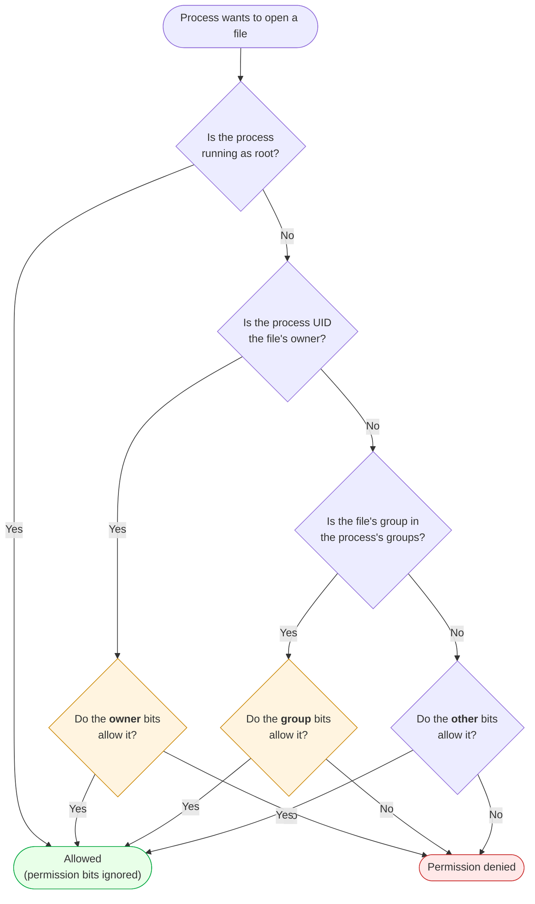
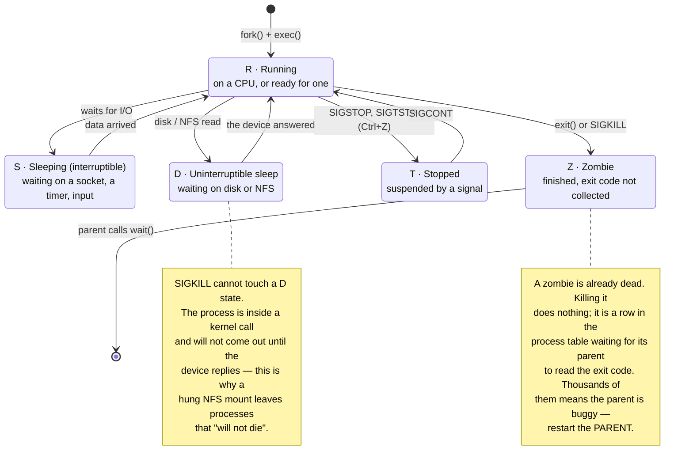
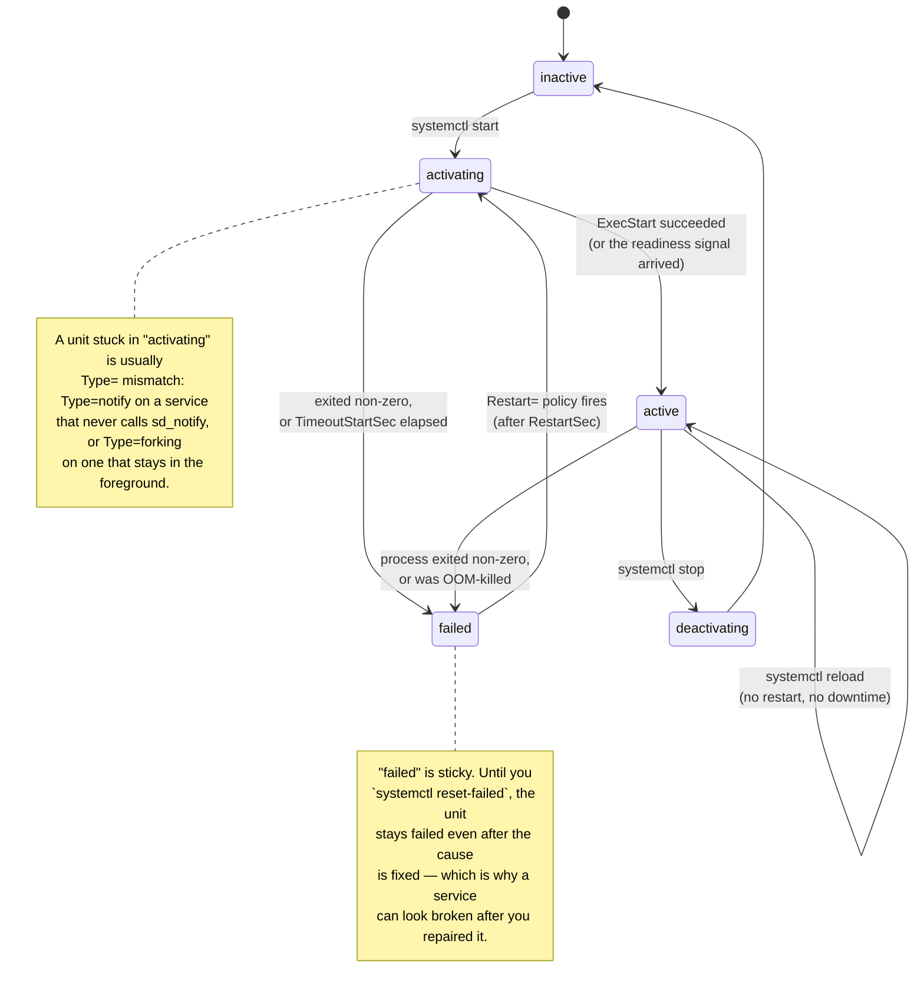
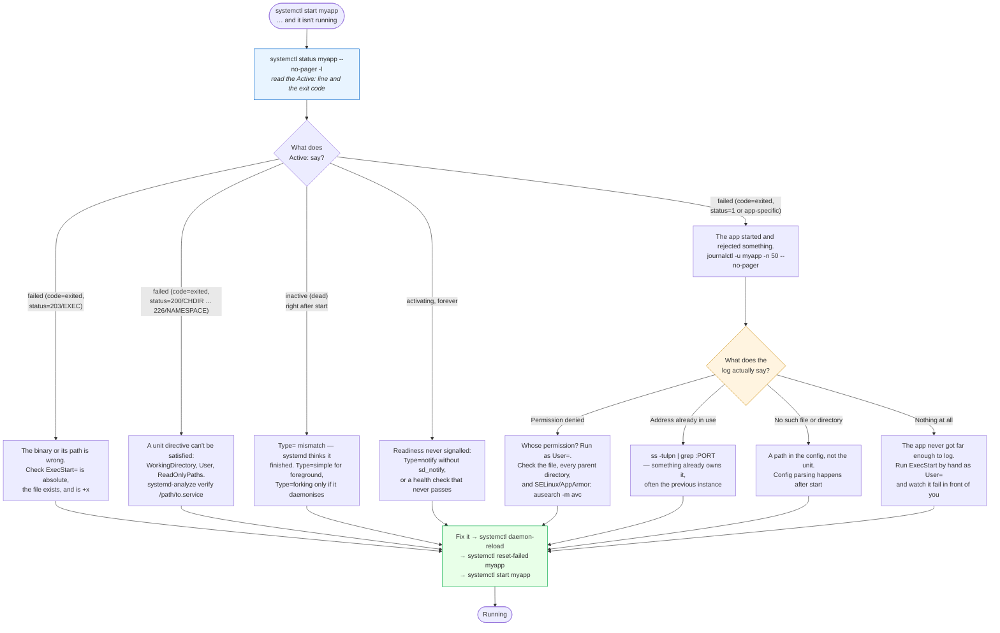
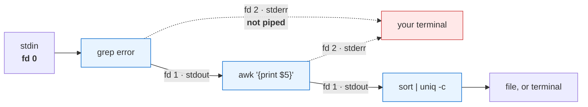

# Module 01: Linux

> *"If you can't navigate Linux confidently, you cannot do DevOps. Period."*

---

>**Command reference**: [`cheatsheet.md`](./cheatsheet.md) — every command in this module, grouped by task, with the gotchas.
>
>**Cross-module lookup**: [Quick Reference](../QUICK-REFERENCE.md)

---

## Why This Module Matters

**Linux runs the internet.** Over 96% of the world's top web servers run Linux. Every Docker container is Linux. Every CI/CD runner is Linux. Every Kubernetes node is Linux. AWS, GCP, and Azure all default to Linux instances.

**In real-world DevOps work**, you will:

- SSH into servers to troubleshoot production issues at 3 AM
- Write scripts that manage hundreds of servers
- Read and parse logs that are thousands of lines long
- Configure services that have no GUI
- Debug permission issues that block deployments

If you're uncomfortable in a Linux terminal, you are stuck. This module makes you fluent.

---

## Fundamentals

### The problem

In 1991 Unix was the operating system of serious computing, but it was proprietary and expensive, and the free teaching system MINIX had a restrictive license. Linus Torvalds, a student in Helsinki, wrote a free Unix-like kernel for his PC. Combined with the GNU project's tools (shell, compiler, utilities), it became a complete free operating system that anyone could run, study and modify. Today it runs almost every server, container, cloud VM and Android phone.

### Goals

- **Unix compatibility (POSIX),** so decades of Unix software and knowledge carry over.
- **Free and open (GPL).** Anyone can use and improve it, and improvements stay open.
- **Portability:** the same kernel runs from tiny embedded boards to supercomputers.
- **Stability and multi-user safety,** with processes and users isolated from each other.

### The ideas everything else rests on

- **Kernel vs user space.** The kernel owns the hardware, memory and scheduling. Programs ask it for everything through system calls.
- **Everything is a file.** Devices, pipes, sockets and kernel information (`/proc`, `/sys`) all appear as files you open, read and write.
- **Processes.** Every program runs as a process with a PID, a parent, an owner, open file descriptors and an exit code. New processes come from `fork` + `exec`, and `systemd` (PID 1) supervises services.
- **Users, groups and permissions.** Read, write and execute for owner, group and others, with root able to bypass them. Least privilege starts here.
- **Small tools composed through pipes.** Programs read stdin and write stdout, so `grep | sort | uniq -c` builds new tools out of old ones.
- **One filesystem tree** from `/`, with disks mounted into it, and a standard layout (`/etc` config, `/var` changing data, `/usr` programs).

### Trade-offs

Text-based configuration and command-line work have a learning curve but are scriptable and repeatable, which is why automation is built on Linux. Distributions differ in package managers and defaults. Containers are built on kernel features (namespaces, cgroups), so learning Linux is learning how Docker really works.

## Table of Contents

1. [Linux Fundamentals](#1-linux-fundamentals)
2. [The Filesystem Hierarchy](#2-the-filesystem-hierarchy)
3. [Essential Commands](#3-essential-commands)
4. [File Permissions and Ownership](#4-file-permissions-and-ownership)
5. [Users and Groups](#5-users-and-groups)
6. [Process Management](#6-process-management)
7. [Package Management](#7-package-management)
8. [Systemd and Services](#8-systemd-and-services)
9. [Text Processing](#9-text-processing)
10. [Disk and Storage](#10-disk-and-storage)
11. [SSH and Remote Access](#11-ssh-and-remote-access)
12. [Environment Variables and Shell Configuration](#12-environment-variables-and-shell-configuration)
13. [Cron Jobs and Scheduling](#13-cron-jobs-and-scheduling)
14. [Common Mistakes and Anti-Patterns](#14-common-mistakes-and-anti-patterns)
15. [Debugging Mindset](#15-debugging-mindset)
16. [Security Considerations](#16-security-considerations)
17. [Interview Insights](#17-interview-insights)

---

## 1. Linux Fundamentals

### What Is Linux?

Linux is an **open-source operating system kernel** created by Linus Torvalds in 1991. What we call "Linux" is actually GNU/Linux — the Linux kernel combined with GNU tools and utilities.

### Linux Distribution Families You Must Know

Production Linux commonly falls into two families:

| Family | Common Distros | Package Manager | Firewall Default | Notes |
|--------|----------------|-----------------|------------------|-------|
| Debian-based | Ubuntu, Debian | `apt`, `dpkg` | `ufw` often used on Ubuntu | Common in cloud-native, startups, CI runners, and developer environments |
| RHEL-compatible | RHEL, Rocky Linux, AlmaLinux, CentOS Stream, Amazon Linux, Oracle Linux | `dnf`/`yum`, `rpm` | `firewalld` often used | Common in enterprise, regulated environments, and many AWS estates |

This handbook supports both families. When commands differ, examples show Debian/Ubuntu and RHEL-compatible variants. Core skills such as filesystem navigation, permissions, processes, systemd, logs, SSH, and shell scripting transfer across both.

### The Linux Architecture

```
┌──────────────────────────────────────────┐
│           User Applications               │
│     (nginx, docker, python, bash)         │
├──────────────────────────────────────────┤
│              Shell (Bash)                 │
│    (command interpreter, scripting)        │
├──────────────────────────────────────────┤
│          System Libraries (glibc)         │
│     (standard functions for programs)     │
├──────────────────────────────────────────┤
│            Linux Kernel                   │
│  (process mgmt, memory, filesystem, I/O)  │
├──────────────────────────────────────────┤
│              Hardware                     │
│    (CPU, RAM, Disk, Network)              │
└──────────────────────────────────────────┘
```

### The Shell

The shell is your **command interpreter** — it translates your commands into actions the kernel can execute.

```bash
# Check your current shell
echo $SHELL
# Output: /bin/bash

# List available shells
cat /etc/shells

# Key concept: Everything in Linux is either a FILE or a PROCESS
```

---

## 2. The Filesystem Hierarchy

Understanding the filesystem is **non-negotiable**. Every DevOps task touches it.

```
/                       # Root — everything starts here
├── bin/                # Essential user binaries (ls, cp, mv, cat)
├── sbin/               # System binaries (iptables, fdisk, reboot)
├── etc/                # Configuration files (THE most important for DevOps)
│   ├── nginx/          #   Nginx config
│   ├── ssh/            #   SSH config
│   ├── systemd/        #   Service definitions
│   ├── hosts           #   Local DNS
│   ├── passwd          #   User accounts
│   ├── shadow          #   Password hashes
│   └── fstab           #   Filesystem mount table
├── home/               # User home directories
│   ├── ubuntu/         #   Common default cloud user on Ubuntu
│   └── ec2-user/       #   Common default cloud user on Amazon Linux
├── var/                # Variable data (changes during operation)
│   ├── log/            #   System and application logs 
│   ├── www/            #   Web server content
│   └── lib/            #   Variable state (databases, etc.)
├── tmp/                # Temporary files (cleared on reboot)
├── opt/                # Optional/third-party software
├── usr/                # User programs and data
│   ├── bin/            #   Non-essential binaries
│   ├── lib/            #   Libraries
│   └── local/          #   Locally installed software
├── proc/               # Virtual filesystem — running process info
├── sys/                # Virtual filesystem — kernel and hardware info
├── dev/                # Device files
└── mnt/ & media/       # Mount points for external storage
```

### Critical Directories for DevOps

| Directory | Why You'll Use It |
|-----------|-------------------|
| `/etc/` | Every service configuration lives here |
| `/var/log/` | First place to look when debugging |
| `/home/` | User scripts, SSH keys, dotfiles |
| `/tmp/` | Temporary build artifacts, quick scripts |
| `/opt/` | Third-party tools (Prometheus, Grafana, etc.) |
| `/proc/` | Live system information (CPU, memory, processes) |

---

## 3. Essential Commands

### Navigation

```bash
# Where am I?
pwd
# Output: /home/<your-user>

# List files (basic)
ls

# List with details (permissions, size, date)
ls -la

# List with human-readable sizes
ls -lah

# Go to a directory
cd /var/log

# Go home
cd ~    # or just: cd

# Go back to previous directory
cd -

# Create directories (including parents)
mkdir -p /tmp/project/src/models

# Show directory tree
tree -L 2 /etc
```

### File Operations

```bash
# Create a file
touch newfile.txt

# Create a file with content
echo "Hello DevOps" > hello.txt          # Overwrite
echo "Another line" >> hello.txt         # Append

# Copy files
cp source.txt destination.txt
cp -r source_dir/ destination_dir/       # Recursive (directories)

# Move/rename files
mv oldname.txt newname.txt
mv file.txt /tmp/                        # Move to another directory

# Delete files (CAREFUL — no recycle bin!)
rm file.txt
rm -r directory/                         # Delete directory
rm -rf directory/                        # Force delete (DANGEROUS)

# Find files
find /var/log -name "*.log" -mtime -1    # Logs modified in last day
find / -name "nginx.conf" 2>/dev/null    # Find nginx config, suppress errors
find /home -size +100M                   # Files larger than 100MB

# Which binary am I using?
which python3
# Output: /usr/bin/python3

whereis nginx
```

### Reading Files

```bash
# Print entire file
cat file.txt

# Print with line numbers
cat -n file.txt

# Page through a file
less /var/log/syslog                     # q to quit, / to search

# First/last N lines
head -20 /var/log/syslog                 # First 20 lines
tail -50 /var/log/syslog                 # Last 50 lines

# Follow a log in real-time (ESSENTIAL for debugging)
tail -f /var/log/syslog                  # Ctrl+C to stop

# Word/line/byte count
wc -l file.txt                           # Count lines
```

### Searching Within Files

```bash
# Search for a pattern
grep "error" /var/log/syslog
grep -i "error" /var/log/syslog          # Case-insensitive
grep -r "TODO" ~/project/                # Recursive search
grep -c "error" /var/log/syslog          # Count matches
grep -n "error" /var/log/syslog          # Show line numbers
grep -v "debug" /var/log/syslog          # Invert (exclude debug)

# Search with context
grep -A 3 "error" /var/log/syslog        # 3 lines AFTER match
grep -B 3 "error" /var/log/syslog        # 3 lines BEFORE match
grep -C 3 "error" /var/log/syslog        # 3 lines before AND after

# Real-world example: Find failed SSH attempts
sudo grep "Failed password" /var/log/auth.log | tail -20      # Debian/Ubuntu
sudo grep "Failed password" /var/log/secure | tail -20        # RHEL-compatible
```

---

## 4. File Permissions and Ownership

### Understanding Permission Notation

```
-rwxr-xr-- 1 deploy devops 4096 Jan 15 10:30 deploy.sh
│├──┤├──┤├──┤ │  │      │     │      │         │
│ │   │   │  │  │      │     │      │         └── Filename
│ │   │   │  │  │      │     │      └── Last modified
│ │   │   │  │  │      │     └── Size in bytes
│ │   │   │  │  │      └── Group owner
│ │   │   │  │  └── User owner
│ │   │   │  └── Hard link count
│ │   │   └── Others permissions (r--)
│ │   └── Group permissions (r-x)
│ └── Owner permissions (rwx)
└── File type (- = file, d = directory, l = link)
```

### Permission Values

```
r (read)    = 4
w (write)   = 2
x (execute) = 1

Common combinations:
rwx = 4+2+1 = 7  (full access)
r-x = 4+0+1 = 5  (read + execute)
r-- = 4+0+0 = 4  (read only)
--- = 0+0+0 = 0  (no access)

Common permission sets:
755 = rwxr-xr-x  (directories, scripts)
644 = rw-r--r--  (regular files)
600 = rw-------  (sensitive files like SSH keys)
700 = rwx------  (private directories/scripts)
```

### How the Kernel Actually Decides

Three permission classes exist, but only **one** of them is ever consulted. This is the part that surprises people:



 **First match wins, and there is no fallthrough.** A file with mode `604` (`rw----r--`) owned by `deploy:devops` is *unreadable* by a member of the `devops` group — the group bits are `---`, and the check stops there. It never falls through to the friendlier `other` bits, even though everyone else on the system can read it. Every "but the permissions are more open for everyone else!" bug is this rule.

The second thing this diagram hides deliberately: to reach a file at all you need `x` on **every directory in its path**. `x` on a directory does not mean "execute" — it means "traverse". A perfectly readable file inside `chmod 600 /opt/secrets/` is unreachable, and the error you get is the same `Permission denied`.

### Changing Permissions and Ownership

```bash
# Change permissions (numeric)
chmod 755 deploy.sh                      # Owner: full, Group: rx, Others: rx
chmod 600 ~/.ssh/id_rsa                  # Owner: rw only (SSH key requirement)

# Change permissions (symbolic)
chmod +x script.sh                       # Add execute for all
chmod u+x script.sh                      # Add execute for owner only
chmod g-w file.txt                       # Remove write from group
chmod o-rwx secret.txt                   # Remove all permissions from others

# Change owner
chown deploy:devops file.txt             # Change user and group
chown -R deploy:devops /var/www/         # Recursive

# Change group only
chgrp devops file.txt

# Special: setuid, setgid, sticky bit
chmod u+s /usr/bin/program               # Runs as file owner (DANGEROUS)
chmod g+s /shared/dir                    # New files inherit directory group
chmod +t /tmp                            # Sticky bit (only owner can delete)
```

### Security Note: Permission Mistakes That Cause Production Incidents

| Mistake | Impact | Correct Setting |
|---------|--------|-----------------|
| `chmod 777 /var/www/` | Anyone can modify web files | `755` for dirs, `644` for files |
| SSH key with `644` | SSH refuses to use it | `600` for private keys |
| `.env` file with `644` | Secrets readable by all users | `600` or `640` |
| Script without `+x` | "Permission denied" when running | `chmod +x script.sh` |

---

## 5. Users and Groups

### Understanding Users

```bash
# Current user
whoami
# Output: <your-user>

# User details
id
# Output: uid=1000(<your-user>) gid=1000(<your-user>) groups=1000(<your-user>),27(sudo),999(docker)

# All users on the system
cat /etc/passwd

# User entry format:
# username:x:UID:GID:comment:home_dir:shell
# deploy:x:1001:1001:Deploy User:/home/deploy:/bin/bash

# Users currently logged in
w
who
```

### Managing Users

```bash
# Create a user
sudo useradd -m -s /bin/bash -G sudo,docker newuser

# Flags explained:
#   -m          Create home directory
#   -s /bin/bash Set bash as default shell
#   -G sudo,docker  Add to these groups

# Set password
sudo passwd newuser

# Delete a user
sudo userdel -r olduser    # -r removes home directory too

# Modify user
sudo usermod -aG docker existinguser   # Add to docker group
# IMPORTANT: -a means APPEND. Without -a, it REPLACES all groups!

# Lock/unlock user
sudo usermod -L username    # Lock
sudo usermod -U username    # Unlock
```

### Understanding sudo

```bash
# Run as root
sudo command

# Run as another user
sudo -u www-data command

# Open root shell (use sparingly)
sudo -i

# Check sudo privileges
sudo -l

# Edit sudoers file (NEVER edit directly, use visudo)
sudo visudo
```

> ** Security**: Never work as root directly. Use `sudo` for individual commands. This provides an audit trail of who did what.

---

## 6. Process Management

### Viewing Processes

```bash
# List all processes (snapshot)
ps aux
# USER  PID %CPU %MEM    VSZ   RSS TTY  STAT START   TIME COMMAND
# root    1  0.0  0.1 169328 11168 ?    Ss   Jan10   0:13 /sbin/init

# Key columns:
# PID   - Process ID
# %CPU  - CPU usage
# %MEM  - Memory usage
# STAT  - Process state (S=sleeping, R=running, Z=zombie, T=stopped)
# TIME  - Total CPU time used

# Interactive process viewer (way better than ps)
htop
# Press: F5 for tree view, F6 to sort, F9 to kill, q to quit

# Find specific processes
ps aux | grep nginx
pgrep -a nginx                           # Cleaner way
pidof nginx                              # Get PID only

# Process tree
pstree -p
```

### Managing Processes

```bash
# Run a process in the background
./long-running-script.sh &

# List background jobs
jobs

# Bring to foreground
fg %1

# Send to background
bg %1

# Stop a process
kill PID          # Graceful (SIGTERM - allows cleanup)
kill -9 PID       # Force kill (SIGKILL - immediate, last resort)
kill -HUP PID     # Reload config (SIGHUP - used by nginx, etc.)

# Kill by name
pkill nginx
killall nginx

# Key signals to know:
# SIGTERM (15) - "Please shut down gracefully"
# SIGKILL (9)  - "Stop NOW, no cleanup" (CAN'T be caught)
# SIGHUP (1)   - "Reload your config"
# SIGINT (2)   - Ctrl+C, "Interrupt"
# SIGSTOP (19) - "Pause" (can't be caught)
# SIGCONT (18) - "Resume"
```

Those signals move a process between states, and the `STAT` column in `ps` is telling you exactly which one it is in:



 **Two of these five states explain most "I can't kill this process" tickets**, and the fix in both cases is not a bigger hammer: `kill -9` is useless against `D` (the process is not scheduled to receive it) and meaningless against `Z` (there is nothing left to kill).

**The other rule worth internalising**: always send SIGTERM first. SIGTERM is a request the process can handle — flush buffers, finish the in-flight request, deregister from the load balancer. SIGKILL cannot be caught, so it takes those chances away. That is also exactly what a container runtime does when you `docker stop`: SIGTERM, wait for the grace period, then SIGKILL — which is why an application that ignores SIGTERM loses data on every single deploy.

### Resource Monitoring

```bash
# CPU and memory overview
top
htop                                     # Better version

# Memory usage
free -h
# Output:
#               total        used        free      shared  buff/cache   available
# Mem:           7.8G        2.1G        3.5G        120M        2.2G        5.3G
# Swap:          2.0G          0B        2.0G

# IMPORTANT: "available" is what matters, not "free"
# Linux uses free RAM for caching — this is GOOD, not a problem

# Disk I/O
iostat -x 1                              # Per-disk I/O stats, every 1 second

# System load average
uptime
# Output: 10:30:45 up 42 days, load average: 0.52, 0.38, 0.35
# load average = 1-min, 5-min, 15-min
# If load > number of CPU cores, system is overloaded

# Number of CPU cores
nproc
# or
cat /proc/cpuinfo | grep processor | wc -l
```

---

## 7. Package Management

### APT (Debian/Ubuntu)

```bash
# Update package list (always do this first!)
sudo apt update

# Upgrade all packages
sudo apt upgrade -y

# Install a package
sudo apt install -y nginx

# Remove a package
sudo apt remove nginx                    # Keep config files
sudo apt purge nginx                     # Remove everything

# Search for packages
apt search nginx

# Show package info
apt show nginx

# List installed packages
dpkg -l | grep nginx

# Clean up
sudo apt autoremove -y                   # Remove unneeded dependencies
sudo apt clean                           # Clear download cache
```

### DNF/YUM (RHEL-Compatible)

```bash
# Refresh metadata and upgrade packages
sudo dnf upgrade -y                      # RHEL 8+, Rocky, Alma, Fedora, Amazon Linux 2023
sudo yum update -y                       # Older RHEL/CentOS/Amazon Linux 2

# Install a package
sudo dnf install -y nginx

# Remove a package
sudo dnf remove -y nginx

# Search for packages
dnf search nginx

# Show package info
dnf info nginx

# List installed packages
rpm -qa | grep nginx

# Clean cache
sudo dnf clean all
```

### Real-World Package Management

```bash
# Debian/Ubuntu: add a third-party repository (example: Docker)
curl -fsSL https://download.docker.com/linux/ubuntu/gpg | sudo gpg --dearmor -o /usr/share/keyrings/docker-archive-keyring.gpg
echo "deb [arch=amd64 signed-by=/usr/share/keyrings/docker-archive-keyring.gpg] https://download.docker.com/linux/ubuntu $(lsb_release -cs) stable" | sudo tee /etc/apt/sources.list.d/docker.list
sudo apt update
sudo apt install -y docker-ce

# RHEL-compatible: add a third-party repository (example: Docker CE)
sudo dnf install -y dnf-plugins-core
sudo dnf config-manager --add-repo https://download.docker.com/linux/centos/docker-ce.repo
sudo dnf install -y docker-ce docker-ce-cli containerd.io

# Check what repository a package comes from
apt policy nginx
dnf repoquery -i nginx
```

---

## 8. Systemd and Services

### Why Systemd Matters

Systemd is the **init system** — it manages everything that runs on a modern Linux system. As a DevOps engineer, you'll manage services with systemd daily.

`systemctl status` reports one of a handful of states, and knowing which transitions exist tells you what to look at:



 **`restart` versus `reload` is a production decision, not a preference.** `restart` stops the process and starts a new one — every in-flight connection dies. `reload` sends the unit's `ExecReload` signal (usually SIGHUP) and the process re-reads its config without dropping traffic. Reach for `reload` whenever the unit supports it, and note that only a config change qualifies: a new binary always needs a restart.

>**`Restart=always` turns a crash into a crash loop, and a crash loop looks calm from the outside.** The unit reports `activating` most of the time and something is being retried forever. Set `StartLimitBurst` and `StartLimitIntervalSec` so the unit gives up and stays `failed` — a service that is honestly broken is easier to find than one that is quietly restarting every ten seconds.

### Core Commands

```bash
# Check service status
sudo systemctl status nginx
# Output tells you:
# - Active: active (running) or inactive (dead) or failed
# - PID and memory usage
# - Recent log entries

# Start/stop/restart
sudo systemctl start nginx
sudo systemctl stop nginx
sudo systemctl restart nginx             # Full restart (brief downtime)
sudo systemctl reload nginx              # Reload config (no downtime, preferred)

# Enable/disable at boot
sudo systemctl enable nginx              # Start on boot
sudo systemctl disable nginx             # Don't start on boot
sudo systemctl enable --now nginx        # Enable AND start immediately

# List all services
systemctl list-units --type=service

# List failed services
systemctl list-units --state=failed

# Check if a service is enabled
systemctl is-enabled nginx

# Check if a service is active
systemctl is-active nginx
```

### Creating a Custom Service

This is something you'll do regularly — deploying applications as systemd services.

```bash
# Create a service file
sudo vim /etc/systemd/system/myapp.service
```

```ini
[Unit]
Description=My Application
Documentation=https://github.com/myorg/myapp
After=network.target
Wants=network-online.target

[Service]
Type=simple
User=www-data
Group=www-data
WorkingDirectory=/opt/myapp
ExecStart=/usr/bin/python3 /opt/myapp/main.py
ExecReload=/bin/kill -HUP $MAINPID
Restart=on-failure
RestartSec=5
StandardOutput=journal
StandardError=journal
Environment=NODE_ENV=production
Environment=PORT=8080

# Security hardening
NoNewPrivileges=true
ProtectSystem=strict
ProtectHome=true
PrivateTmp=true

[Install]
WantedBy=multi-user.target
```

```bash
# After creating/modifying a service file
sudo systemctl daemon-reload             # Reload systemd config
sudo systemctl start myapp
sudo systemctl enable myapp

# Read service logs
journalctl -u myapp                      # All logs
journalctl -u myapp -f                   # Follow (real-time)
journalctl -u myapp --since "1 hour ago" # Recent logs
journalctl -u myapp -p err               # Only errors
```

### Journalctl — The Centralized Log Viewer

```bash
# System logs
journalctl                               # All logs
journalctl -b                            # Since last boot
journalctl -b -1                         # Previous boot
journalctl --since "2024-01-15 10:00"    # Since specific time
journalctl --since "1 hour ago"          # Relative time
journalctl -p err                        # Only errors and above
journalctl -f                            # Follow in real-time

# Service-specific logs
journalctl -u nginx -f

# Disk usage of journal
journalctl --disk-usage

# Clean old logs
sudo journalctl --vacuum-time=7d         # Keep only last 7 days
sudo journalctl --vacuum-size=500M       # Keep only 500MB
```

### Troubleshooting: "The Service Won't Start"

The most common ticket you will ever get on a Linux box. Work it in this order — each step is cheap and rules out a whole class of cause:



 **The two commands at the top of that tree answer 90% of these**, and beginners skip both to go straight to editing the unit file. `systemctl status` gives you the exit code, which names the *category* of failure; `journalctl -u` gives you the application's own words. Guessing before reading those is how a five-minute fix becomes an afternoon.

 **`daemon-reload` after every unit file edit.** Without it systemd keeps running the version it parsed at boot, so your fix appears to do nothing — and you go looking for a second bug that does not exist.

---

## 9. Text Processing

### The Text Processing Pipeline

This is one of the **most valuable skills** in DevOps — processing logs, configs, and data on the command line.

Every process starts with three open file descriptors, and a pipe connects exactly one of them to the next command:



 **`|` carries stdout only.** Error messages take the dotted red path straight to your screen and never enter the pipeline — which is why `find / -name '*.conf' | wc -l` prints a clean count while permission errors scroll past, and why `2>/dev/null` is so common in scripts.

**The redirection trap**, and it catches everyone once:

```bash
command > out.txt 2>&1     #  stdout to the file, then stderr to "wherever stdout goes" = the file
command 2>&1 > out.txt     #  stderr to the terminal (stdout's value at that moment), stdout to the file
```

Redirections are applied **left to right**, and `2>&1` copies where fd 1 points *right now* — not a live link. Reversing the order silently sends errors somewhere you are not looking, which is how a cron job "runs fine" for months while writing its errors to nobody.

### Pipes and Redirection

```bash
# Pipe: send output of one command to another
cat /var/log/syslog | grep "error" | wc -l

# Redirect output to file
command > file.txt                       # Overwrite
command >> file.txt                      # Append
command 2> error.txt                     # Redirect stderr
command > output.txt 2>&1               # Redirect both stdout and stderr
command &> output.txt                    # Shorthand for the above

# /dev/null — the black hole
command > /dev/null 2>&1                 # Discard all output
```

### Essential Text Tools

```bash
# awk — column-based text processing (POWERFUL)
# Print specific columns
ps aux | awk '{print $1, $2, $11}'       # User, PID, Command
df -h | awk '{print $1, $5}'             # Filesystem, Usage%

# Filter with condition
ps aux | awk '$3 > 50 {print $1, $2, $3, $11}'  # Processes using >50% CPU

# Sum a column
cat data.txt | awk '{sum += $2} END {print "Total:", sum}'

# sed — stream editor (find and replace)
sed 's/old/new/g' file.txt               # Replace all occurrences
sed -i 's/old/new/g' file.txt            # Edit file in-place
sed -n '10,20p' file.txt                 # Print lines 10-20
sed '/^#/d' config.txt                   # Delete comment lines

# cut — extract columns with delimiter
echo "user:password:uid:gid" | cut -d: -f1,3    # Output: user:uid
cat /etc/passwd | cut -d: -f1                    # List all usernames

# sort
sort file.txt                            # Alphabetical
sort -n file.txt                         # Numeric
sort -r file.txt                         # Reverse
sort -u file.txt                         # Unique only
sort -t: -k3 -n /etc/passwd             # Sort by 3rd field (UID)

# uniq — deduplicate (MUST sort first)
sort file.txt | uniq
sort file.txt | uniq -c                  # Count occurrences
sort file.txt | uniq -c | sort -rn       # Most frequent first

# tr — translate characters
echo "HELLO" | tr 'A-Z' 'a-z'           # Lowercase
cat file.txt | tr -d '\r'               # Remove Windows line endings
```

### Real-World Text Processing Examples

```bash
# Find top 10 IP addresses hitting your web server
cat /var/log/nginx/access.log | awk '{print $1}' | sort | uniq -c | sort -rn | head -10

# Find all 500 errors in the last hour
grep "$(date -d '1 hour ago' '+%d/%b/%Y:%H')" /var/log/nginx/access.log | grep '" 500 '

# Extract and count HTTP status codes
awk '{print $9}' /var/log/nginx/access.log | sort | uniq -c | sort -rn

# Find largest files on disk
find / -type f -size +100M -exec ls -lh {} \; 2>/dev/null | sort -k5 -rh | head -20

# Monitor log file for errors in real-time
tail -f /var/log/syslog | grep --color -i "error\|fail\|critical"
```

---

## 10. Disk and Storage

```bash
# Disk usage overview
df -h
# Filesystem      Size  Used Avail Use% Mounted on
# /dev/sda1        50G   18G   30G  38% /

# Directory sizes
du -sh /var/log/                         # Total size of /var/log
du -sh /var/log/* | sort -rh | head -10  # Largest subdirectories

# Disk I/O monitoring
iostat -x 1 5                            # Every 1 sec, 5 times

# Check for disk issues
sudo dmesg | grep -i "error\|fail\|disk"

# Mount a device
sudo mount /dev/sdb1 /mnt/data
sudo umount /mnt/data

# Persistent mounts (survive reboot)
# Edit /etc/fstab:
# /dev/sdb1  /mnt/data  ext4  defaults  0  2
```

---

## 11. SSH and Remote Access

### SSH Basics

```bash
# Connect to a remote server
ssh username@hostname
ssh -p 2222 username@hostname            # Different port
ssh -i ~/.ssh/mykey.pem ubuntu@10.0.1.5   # Ubuntu cloud image default user
ssh -i ~/.ssh/mykey.pem ec2-user@10.0.1.5 # Amazon Linux default user

# Generate SSH key pair
ssh-keygen -t ed25519 -C "your.email@example.com"
# Save to default location (~/.ssh/id_ed25519)
# Optionally set a passphrase (recommended)

# Copy public key to server
ssh-copy-id username@hostname
# Manual method:
cat ~/.ssh/id_ed25519.pub | ssh user@host "mkdir -p ~/.ssh && cat >> ~/.ssh/authorized_keys"

# SSH config for convenience
cat ~/.ssh/config
# Example:
# Host production
#     HostName 10.0.1.5
#     User deploy
#     IdentityFile ~/.ssh/production.pem
#     Port 22
#
# Now just:  ssh production
```

### SSH File Transfer

```bash
# Copy file to remote
scp file.txt user@host:/path/to/destination/

# Copy from remote
scp user@host:/var/log/app.log ./

# Copy directory
scp -r ./project/ user@host:/opt/

# rsync (better than scp — incremental, resumable)
rsync -avz ./project/ user@host:/opt/project/
# -a = archive (preserves permissions, timestamps)
# -v = verbose
# -z = compress during transfer
```

### SSH Security Hardening

```bash
# Edit SSH config
sudo vim /etc/ssh/sshd_config

# Key changes:
# PermitRootLogin no                     # Disable root SSH
# PasswordAuthentication no              # Key-based only
# Port 2222                              # Change default port
# MaxAuthTries 3                         # Limit login attempts
# AllowUsers ubuntu deploy               # Whitelist users

# Apply changes
sudo systemctl restart sshd
```

---

## 12. Environment Variables and Shell Configuration

```bash
# View all environment variables
env
printenv

# View a specific variable
echo $HOME
echo $PATH
echo $USER

# Set a variable (current session only)
export MY_VAR="hello"

# Set permanently (add to ~/.bashrc or ~/.profile)
echo 'export MY_VAR="hello"' >> ~/.bashrc
source ~/.bashrc                         # Apply immediately

# PATH — where Linux looks for commands
echo $PATH
# /usr/local/sbin:/usr/local/bin:/usr/sbin:/usr/bin:/sbin:/bin

# Add to PATH
export PATH="$PATH:/opt/mytools/bin"

# Important files:
# ~/.bashrc    — Runs for every new bash shell
# ~/.profile   — Runs on login
# /etc/environment    — System-wide variables
# /etc/profile.d/*.sh — System-wide scripts
```

---

## 13. Cron Jobs and Scheduling

```bash
# Edit cron jobs for current user
crontab -e

# List cron jobs
crontab -l

# Cron format:
# ┌───────────── minute (0 - 59)
# │ ┌───────────── hour (0 - 23)
# │ │ ┌───────────── day of month (1 - 31)
# │ │ │ ┌───────────── month (1 - 12)
# │ │ │ │ ┌───────────── day of week (0 - 6, Sun=0)
# │ │ │ │ │
# * * * * * command

# Examples:
# Every 5 minutes
*/5 * * * * /opt/scripts/health-check.sh

# Every day at 2:30 AM
30 2 * * * /opt/scripts/backup.sh

# Every Monday at 9 AM
0 9 * * 1 /opt/scripts/weekly-report.sh

# First day of every month
0 0 1 * * /opt/scripts/monthly-cleanup.sh

# IMPORTANT: Always redirect output to a log
*/5 * * * * /opt/scripts/health-check.sh >> /var/log/health-check.log 2>&1
```

---

## 14. Common Mistakes and Anti-Patterns

### Running Everything as Root

```bash
# BAD
sudo su -
apt install nginx       # Debian/Ubuntu
dnf install nginx       # RHEL-compatible
vim /etc/nginx/nginx.conf
systemctl restart nginx
# You're root for everything — no audit trail, easy to destroy things

# GOOD
sudo apt install nginx
sudo dnf install nginx
sudo vim /etc/nginx/nginx.conf
sudo systemctl restart nginx
# Each command is explicit, auditable
```

### Using `chmod 777`

```bash
# BAD — "just make it work"
chmod 777 /var/www/html/

# GOOD — minimum required permissions
chmod 755 /var/www/html/          # Directory
chmod 644 /var/www/html/*.html    # Files
chown -R www-data:www-data /var/www/html/
```

### Not Checking Disk Space

```bash
# BAD: Assume disk is fine
# Log files fill up → service crashes → production down

# GOOD: Monitor proactively
df -h
du -sh /var/log/* | sort -rh | head -5

# Even better: Set up alerts (covered in Module 07)
```

### Editing Config Files Without Backup

```bash
# BAD
sudo vim /etc/nginx/nginx.conf

# GOOD
sudo cp /etc/nginx/nginx.conf /etc/nginx/nginx.conf.bak.$(date +%Y%m%d)
sudo vim /etc/nginx/nginx.conf
sudo nginx -t   # Test config before reloading!
sudo systemctl reload nginx
```

---

## 15. Debugging Mindset

### The Linux Troubleshooting Framework

```
Problem reported
       │
       ▼
1. CHECK RESOURCES ──────────────────────────────────┐
   free -h          (memory)                         │
   df -h            (disk)                           │
   top/htop         (cpu/processes)                  │
   uptime           (load average)                   │
       │                                             │
       ▼                                             │
2. CHECK LOGS ───────────────────────────────────────┤
   journalctl -u service -f                          │
   tail -f /var/log/syslog                           │
   tail -f /var/log/app.log                          │
       │                                             │
       ▼                                             │
3. CHECK SERVICES ───────────────────────────────────┤
   systemctl status service                          │
   systemctl list-units --state=failed               │
       │                                             │
       ▼                                             │
4. CHECK NETWORK ────────────────────────────────────┤
   ping hostname                                     │
   curl -v http://localhost:8080                      │
   ss -tlnp                                          │
       │                                             │
       ▼                                             │
5. CHECK RECENT CHANGES ─────────────────────────────┘
   last                    (recent logins)
   history                 (recent commands)
   ls -lt /etc/            (recently changed configs)
   dpkg -l --last-modified (recently installed packages)
```

### Common Scenarios

**"Service won't start"**

```bash
# 1. Check the status
sudo systemctl status myservice

# 2. Read the logs
journalctl -u myservice --no-pager -n 50

# 3. Common causes:
#    - Port already in use: ss -tlnp | grep PORT
#    - Permission denied: check file ownership and permissions
#    - Config error: test config if tool supports it (nginx -t)
#    - Missing dependency: check if required service is running
```

**"Server is slow"**

```bash
# 1. Check load average
uptime
# Load > nproc? CPU bottleneck

# 2. Check memory
free -h
# Available near zero? Memory pressure

# 3. Check disk I/O
iostat -x 1
# %util > 80%? Disk bottleneck

# 4. Check for runaway processes
ps aux --sort=-%cpu | head -10
ps aux --sort=-%mem | head -10
```

---

## 16. Security Considerations

>Security is embedded throughout this handbook. Here are Linux-specific practices.

### SSH Hardening

- Disable root login via SSH
- Use key-based authentication only
- Change the default SSH port
- Use `fail2ban` to block brute force attempts

### File Permissions

- Follow principle of least privilege
- Never use `chmod 777`
- Protect sensitive files (keys, configs, secrets)
- Use proper ownership (`chown`)

### System Updates

```bash
# Debian/Ubuntu
sudo apt update && sudo apt upgrade -y
sudo apt install -y unattended-upgrades
sudo dpkg-reconfigure -plow unattended-upgrades

# RHEL-compatible
sudo dnf upgrade -y
sudo dnf install -y dnf-automatic
sudo systemctl enable --now dnf-automatic.timer
```

### Firewall Basics

```bash
# Debian/Ubuntu with UFW
sudo ufw enable
sudo ufw allow 22/tcp
sudo ufw allow 80/tcp
sudo ufw allow 443/tcp
sudo ufw status verbose
sudo ufw default deny incoming
sudo ufw default allow outgoing

# RHEL-compatible with firewalld
sudo systemctl enable --now firewalld
sudo firewall-cmd --permanent --add-service=ssh
sudo firewall-cmd --permanent --add-service=http
sudo firewall-cmd --permanent --add-service=https
sudo firewall-cmd --reload
sudo firewall-cmd --list-all
```

---

## 17. Interview Insights

### Frequently Asked Questions

**Q: What happens when you type `ls -la` and press Enter?**
> The shell (bash) parses the command, searches `$PATH` for the `ls` binary, forks a child process, calls `execve()` to run `ls` with the `-la` flag, which uses system calls to read directory entries and file metadata (inodes), then outputs formatted results to stdout.

**Q: Explain Linux file permissions.**
> Every file has three permission sets: owner, group, others. Each set can have read (4), write (2), and execute (1) permissions. Directories need execute permission to be entered. Common examples: 755 for executables/directories, 644 for regular files, 600 for sensitive files like SSH keys.

**Q: What's the difference between a process and a thread?**
> A process has its own memory space, PID, and resources. A thread shares memory space with other threads in the same process. Processes are isolated (security boundary); threads are lightweight and share data more easily.

**Q: How do you troubleshoot a server that's running slowly?**
> Start with `uptime` (load), `free -h` (memory), `df -h` (disk), `top`/`htop` (CPU-heavy processes). Check `iostat` for disk I/O. Look at logs. Check for recent changes. Work from the most impactful resource downward.

**Q: What's the difference between `kill` and `kill -9`?**
> `kill` sends SIGTERM (signal 15) — the process gets to clean up (close connections, write files, remove temp files). `kill -9` sends SIGKILL (signal 9) — the kernel immediately terminates the process with no cleanup. Always try SIGTERM first; use SIGKILL only as a last resort.

**Q: Explain the difference between soft links and hard links.**
> A hard link is another directory entry pointing to the same inode (same data on disk). Deleting the original doesn't affect the hard link. A soft (symbolic) link is a file that points to a path. If the original is deleted, the soft link is broken. Hard links can't cross filesystems; soft links can.

### Scenario-Based Questions

**Q: You SSH into a server and can't run any commands. "bash: command not found" for everything. What happened?**
> The `$PATH` variable is wrong or empty. Check with `echo $PATH`. If it's empty, set it manually: `export PATH="/usr/local/sbin:/usr/local/bin:/usr/sbin:/usr/bin:/sbin:/bin"`. Then check `~/.bashrc` and `/etc/environment` for what corrupted it.

**Q: Disk space is full, but you can't find large files. What do you check?**
> Check for deleted files still held open by processes: `lsof | grep deleted`. A process may have deleted a large log file but still has the file handle open. Restart the process to release the space. Also check `du -sh /proc/*/fd 2>/dev/null` and look for large inodes with `df -i`.

---

## Labs and Projects

Read the sections above first, then work through these **in order**. Every lab ends with a  **Break It** section — those are not optional; they are where the debugging skill actually comes from.

| # | Lab | What you'll do |
|---|-----|----------------|
| 1 | **[Linux Filesystem Mastery](./labs/lab-01-filesystem-mastery.md)** | Navigate the Linux filesystem with confidence, understand the hierarchy, manage files and directories, and develop the muscle memory for commands… |
| 2 | **[Permissions, Users, and Security](./labs/lab-02-permissions-users.md)** | Master Linux permissions, user management, and security fundamentals. |
| 3 | **[Process Management & Systemd Services](./labs/lab-03-processes-services.md)** | Master process management and systemd — the skills you'll use to monitor running applications, debug slow servers, manage services, and create your… |
| 4 | **[Text Processing & Log Analysis](./labs/lab-04-text-processing.md)** | Master the Linux text processing pipeline — the combination of `grep`, `awk`, `sed`, `sort`, `uniq`, and pipes that lets you analyze logs, extract… |

**Portfolio project:**

- [Project: Linux Server Health Report Generator](./projects/project-01-health-report.md)

**Reference code** for every lab: [`code/`](./code/) — real files, validated in CI.

---

## Self-Check

Answer these from memory before you expand them. If more than two give you trouble, re-read the sections they come from — the labs assume this material is solid.

<details>
<summary><strong>1. `df` says the disk is full but `du -sh /` accounts for far less. What is going on?</strong></summary>

Most likely a deleted file still held open by a running process — the space is not released until the file descriptor closes (`lsof +L1` shows them; restarting the holder frees it). The other candidate is inode exhaustion, which `df -i` reveals: plenty of bytes, no free inodes.

</details>

<details>
<summary><strong>2. What do `644` and `755` actually permit, and why is `chmod 777` never the fix?</strong></summary>

`644` is read/write for the owner, read for everyone else. `755` adds execute, which for a directory means the right to enter it — that is why directories need it and plain files usually should not have it. `777` lets any account on the box rewrite the file; the real problem is almost always wrong ownership, so fix it with `chown`.

</details>

<details>
<summary><strong>3. A service died with no useful application log. How do you tell an OOM kill from an ordinary crash?</strong></summary>

Check `dmesg -T | grep -i oom` or `journalctl -k` for the oom-killer verdict, and the unit's exit status: 137 means it was SIGKILLed (128+9), which is what the kernel does when it reclaims memory. A non-zero application exit code and a stack trace point at the app's own failure instead.

</details>

<details>
<summary><strong>4. What is the difference between `systemctl start` and `systemctl enable`, and what does `active (exited)` mean?</strong></summary>

`start` runs it now, `enable` makes it start at boot — doing one and forgetting the other is why a service vanishes after a reboot. `active (exited)` is the normal, healthy state for a `Type=oneshot` unit: its command ran to completion successfully and nothing is meant to stay resident.

</details>

<details>
<summary><strong>5. Which process is holding port 8080?</strong></summary>

`ss -ltnp | grep 8080` (or `lsof -i :8080`). Run it with privileges — without them the PID and program name columns come back empty, which reads misleadingly like nothing is listening.

</details>

<details>
<summary><strong>6. The script runs perfectly in your shell and fails under cron. Why?</strong></summary>

Cron gives the job a minimal environment: a short `PATH`, no shell profile, no exported variables from your login session, and a working directory you did not choose. Use absolute paths, source the environment explicitly, and redirect stdout and stderr to a log — a cron job with no output is a cron job you cannot debug.

</details>

---

## Practical Checkpoint

Before moving on, you should be able to:

- Navigate the filesystem, inspect logs, manage permissions, and investigate processes without a GUI.
- Explain how to check service health with `systemctl`, logs, ports, and process state.
- Recover from a common Linux issue such as a permission error, failed service, or full disk.

Portfolio evidence to keep:

- Command notes from the Linux labs.
- A server health report script or runbook.
- Debug notes showing symptoms, commands used, root cause, and fix.

Suggested project: [Linux Server Health Report Generator](./projects/project-01-health-report.md)

---

## What's Next?

You now have solid Linux fundamentals. Next, we tackle the network layer — understanding how machines talk to each other is essential for debugging and securing infrastructure.

**[Module 02: Networking →](../02-networking/)**

---

<div align="center">

**Module 01 Complete** 

[← Back to Foundations](../00-foundations/) | [ Cheat Sheet](./cheatsheet.md) | [Next: Networking →](../02-networking/)

</div>


## Reference
<!-- tab: Cheatsheet -->
> Command reference for daily Linux work. For the *why* behind these, read the [module README](./README.md).
> Cross-module daily commands: **[QUICK-REFERENCE.md](../QUICK-REFERENCE.md)**

**Jump to:** [Navigation](#navigation--files) · [Viewing](#viewing-file-contents) · [Search](#finding-things) · [Permissions](#permissions--ownership) · [Users](#users--groups) · [Processes](#processes--signals) · [systemd](#systemd--services) · [Packages](#package-management) · [Text Processing](#text-processing) · [Disk](#disk--storage) · [Network](#networking-from-the-host) · [SSH](#ssh) · [Cron](#cron--scheduling) · [Archives](#archives--compression) · [Environment](#environment--shell) · [Triage](#one-minute-server-triage)

---

## Navigation & Files

| Command | What it does |
|---------|--------------|
| `pwd` | Print working directory |
| `cd -` | Jump back to the **previous** directory |
| `cd` | Go home (same as `cd ~`) |
| `ls -lah` | Long listing, all files, human-readable sizes |
| `ls -lt` / `ls -ltr` | Sort by mtime, newest first / oldest last |
| `ls -lS` | Sort by size, largest first |
| `tree -L 2` | Directory tree, 2 levels deep |
| `mkdir -p a/b/c` | Create nested directories, no error if they exist |
| `cp -a src dst` | Copy preserving **all** attributes (archive mode) |
| `cp -r src dst` | Copy directory recursively |
| `mv old new` | Move or rename |
| `rm -rf dir` | Delete recursively, no prompts — **no undo** |
| `ln -s target link` | Create a symbolic link |
| `readlink -f path` | Resolve a path to its absolute, symlink-free form |
| `basename /a/b/c.txt` | → `c.txt` |
| `dirname /a/b/c.txt` | → `/a/b` |
| `stat file` | Size, permissions, inode, all three timestamps |
| `file archive.bin` | Identify a file's actual type (ignores the extension) |
| `touch file` | Create empty file, or update its mtime |
| `df -h` | Free space per mounted filesystem |
| `du -sh *` | Size of each item in the current directory |

```bash
# Safe rm habits
rm -i file                    # prompt before each delete
rm -rf -- "$dir"              # -- stops a name starting with '-' being read as a flag
[ -n "$dir" ] && rm -rf "$dir"   # never let an empty variable become 'rm -rf /'
```

>`rm -rf $VAR` with `VAR` unset expands to `rm -rf` in the current directory — or worse. Always quote and always guard.

---

## Viewing File Contents

| Command | What it does |
|---------|--------------|
| `cat file` | Print the whole file |
| `cat -n file` | ...with line numbers |
| `less file` | Page through it (`/` search, `n` next, `G` end, `q` quit) |
| `less +F file` | Follow mode — like `tail -f` but you can Ctrl-C and scroll |
| `head -n 20 file` | First 20 lines |
| `tail -n 50 file` | Last 50 lines |
| `tail -f file` | **Follow** a growing log in real time |
| `tail -F file` | Follow, and survive log rotation |
| `tail -f a.log b.log` | Follow multiple files with headers |
| `wc -l file` | Count lines (`-w` words, `-c` bytes) |
| `nl file` | Number only non-blank lines |
| `zcat` / `zless` / `zgrep` | Same tools, for `.gz` files — no need to decompress |

```bash
# Follow a log but only show what matters
tail -f /var/log/nginx/error.log | grep --line-buffered -i "upstream"
#                                       ^^^^^^^^^^^^^^^ without this, grep
#                                       buffers and output appears in bursts
```

---

## Finding Things

### `find` — search by metadata

```bash
find /var/log -name "*.log"                  # by name (case-sensitive)
find . -iname "*.YAML"                       # case-insensitive
find . -type f -size +100M                   # files over 100 MB
find . -type d -name node_modules            # directories
find /etc -mtime -1                          # modified in the last 24h
find /tmp -mmin +60 -delete                  # older than 60 min, delete
find . -type f -perm 0777                    # world-writable files
find . -user deploy -group www-data          # by ownership
find . -name "*.log" -exec gzip {} \;        # run a command per result
find . -name "*.log" -print0 | xargs -0 rm   # safe with spaces in filenames

# Exclude a directory (note the ordering)
find . -path ./node_modules -prune -o -name "*.js" -print
```

### `grep` — search by content

```bash
grep "ERROR" app.log                  # basic
grep -i "error" app.log               # case-insensitive
grep -r "TODO" ./src                  # recursive
grep -rn "func main" .                # with line numbers
grep -v "healthcheck" access.log      # INVERT — exclude matches
grep -c "ERROR" app.log               # count matching lines
grep -l "apiKey" -r .                 # list filenames only
grep -A 5 -B 5 "panic" app.log        # 5 lines After / Before
grep -C 3 "panic" app.log             # 3 lines of Context both sides
grep -E "warn|error|fatal" app.log    # extended regex (alternation)
grep -w "id" file                     # whole word only — not "uuid"
grep -o "[0-9]\{1,3\}\.[0-9...]"      # print only the matched part
grep --include="*.py" -r "import os" .   # filter by filename pattern
```

| Other locators | Use |
|----------------|-----|
| `which python3` | Path of the binary that will run |
| `type -a ls` | Shows aliases, functions, **and** all binaries named `ls` |
| `command -v tool` | Portable "does this exist?" test in scripts |
| `whereis nginx` | Binary, source, and man page locations |
| `locate filename` | Instant search of a prebuilt index (`sudo updatedb` to refresh) |
| `lsof /path/to/file` | Which processes have this file open |
| `fuser -v /mnt/data` | Who is using this mount (blocks unmounting) |

---

## Permissions & Ownership

```
-rwxr-xr--  1  deploy  www-data  4096  Aug  4 09:12  deploy.sh
│└┬┘└┬┘└┬┘     └──┬─┘  └───┬──┘
│ │  │  └── other: r--     └── group
│ │  └───── group: r-x
│ └──────── owner: rwx
└────────── type: - file, d dir, l symlink
```

| Numeric | Symbolic | Meaning | Typical use |
|---------|----------|---------|-------------|
| `400` | `r--------` | Owner read only | Root-owned secrets |
| `600` | `rw-------` | Owner read/write | **SSH private keys**, `.env`, tokens |
| `640` | `rw-r-----` | Owner rw, group read | Config with secrets, shared with a service group |
| `644` | `rw-r--r--` | Owner rw, everyone read | Normal config, HTML, `authorized_keys` |
| `700` | `rwx------` | Owner full | `~/.ssh`, private script dirs |
| `750` | `rwxr-x---` | Owner full, group execute | Service directories |
| `755` | `rwxr-xr-x` | Owner full, everyone read/execute | **Directories**, binaries, scripts |
| `775` | `rwxrwxr-x` | Group can write | Shared team directories |
| `777` | `rwxrwxrwx` | Everyone everything |  Never in production |

```bash
chmod 640 config.yml               # numeric
chmod u+x script.sh                # symbolic: add execute for owner
chmod g-w,o-rwx file               # remove group write, all other access
chmod -R u+rwX,go-w dir/           # capital X = execute on DIRS only, not files
chown deploy:www-data file         # change owner and group
chown -R deploy: /srv/app          # trailing colon = set group to owner's group
chgrp docker /var/run/docker.sock  # change group only

# Special bits
chmod u+s binary          # setuid  (4xxx) — runs as the file's OWNER
chmod g+s shared/         # setgid  (2xxx) — new files inherit the DIRECTORY's group
chmod +t /tmp             # sticky  (1xxx) — only the owner can delete their files

umask                     # show default-permission mask (022 → new files 644, dirs 755)
```

**Access Control Lists** — when the owner/group/other model isn't enough:

```bash
getfacl file                                 # view ACLs
setfacl -m u:jenkins:rx /srv/app             # grant one user read+execute
setfacl -m d:u:jenkins:rx /srv/app           # d: = default for new files in this dir
setfacl -x u:jenkins /srv/app                # remove that entry
setfacl -b file                              # strip all ACLs
```

>A `+` at the end of `ls -l` permissions (`-rw-r--r--+`) means an ACL exists. If permissions "look right" but access still fails, check `getfacl` — and on RHEL-family systems, check SELinux with `ls -Z` and `ausearch -m avc -ts recent`.

---

## Users & Groups

```bash
whoami                              # current username
id                                  # uid, gid, and all group memberships
id -nG deploy                       # just the group names for a user
groups                              # your groups
who / w                             # who is logged in (w adds what they're doing)
last -n 20                          # recent logins
lastb                               # FAILED login attempts

# Create a service account with no login shell
sudo useradd -r -s /usr/sbin/nologin -d /srv/app -M appuser
sudo useradd -m -s /bin/bash alice            # normal user with a home dir
sudo passwd alice
sudo usermod -aG docker,sudo alice            # -aG = APPEND (omitting -a wipes groups!)
sudo usermod -L alice                         # lock the account
sudo userdel -r alice                         # delete user and home dir

sudo groupadd deployers
sudo gpasswd -d alice docker                  # remove alice from docker group
```

| File | Contains |
|------|----------|
| `/etc/passwd` | Usernames, UIDs, home dirs, shells (world-readable, no passwords) |
| `/etc/shadow` | Password hashes and aging policy (root only) |
| `/etc/group` | Group definitions and members |
| `/etc/sudoers`, `/etc/sudoers.d/` | Who may run what as whom — edit with `visudo` only |

```bash
sudo visudo                          # validates syntax before saving — ALWAYS use this
sudo visudo -f /etc/sudoers.d/deploy # per-purpose drop-in file (preferred)
# deploy ALL=(ALL) NOPASSWD: /bin/systemctl restart myapp
sudo -l                              # what am I allowed to run?
sudo -u postgres psql                # run as another user
```

>`usermod -G` **replaces** a user's supplementary groups. Forgetting `-a` is how you lock yourself out of `sudo`. Group changes also only apply to **new** sessions — log out and back in, or run `newgrp docker`.

---

## Processes & Signals

```bash
ps aux                              # every process, BSD syntax
ps -ef                              # every process, System V syntax
ps aux --sort=-%mem | head          # top memory consumers
ps aux --sort=-%cpu | head          # top CPU consumers
ps -eo pid,ppid,user,%cpu,%mem,etime,cmd --sort=-%cpu | head
ps -p 1234 -o etime,cmd             # how long has PID 1234 been running
pstree -p                           # process tree with PIDs
pgrep -a nginx                      # PIDs matching a name, with command line
pgrep -u deploy                     # processes owned by a user

top                                 # live view (press M=mem, P=cpu, 1=per-core, q=quit)
htop                                # nicer top (F6 sort, F9 kill, / search)
```

### Signals

| Signal | Number | Effect | When to use |
|--------|--------|--------|-------------|
| `SIGTERM` | 15 | Polite shutdown request — **catchable** | Default. Always try this first |
| `SIGINT` | 2 | Interrupt, what Ctrl-C sends | Interactive stop |
| `SIGHUP` | 1 | Historically "hang up"; most daemons **reload config** | `kill -HUP $(pidof nginx)` |
| `SIGKILL` | 9 | Immediate, uncatchable, no cleanup | Last resort — leaves temp files and locks behind |
| `SIGSTOP` / `SIGCONT` | 19 / 18 | Pause / resume | Freeze a runaway job to investigate |
| `SIGUSR1` / `SIGUSR2` | 10 / 12 | App-defined | e.g. Nginx log reopen |

```bash
kill 1234                  # SIGTERM (default)
kill -9 1234               # SIGKILL
kill -HUP 1234             # reload config
pkill -f "python worker"   # match the FULL command line
killall nginx              # by exact process name
kill -l                    # list all signal names
```

### Job control & background work

```bash
command &                  # start in background
jobs                       # list this shell's jobs
fg %1                      # bring job 1 to foreground
bg %1                      # resume job 1 in background
Ctrl-Z                     # suspend the foreground job
disown -h %1               # detach job from the shell so it survives logout
nohup ./long.sh > out.log 2>&1 &     # immune to hangup
setsid ./long.sh           # fully detach into a new session

nice -n 10 ./batch.sh      # start with lower priority (19 = nicest)
renice -n 5 -p 1234        # change priority of a running process
ionice -c3 -p 1234         # idle-priority disk I/O
timeout 30s ./flaky.sh     # kill it if it exceeds 30 seconds
```

### Resource inspection

```bash
free -h                    # memory; look at "available", not "free"
vmstat 1 5                 # 5 samples, 1s apart — r/b queues, si/so swap
iostat -xz 1               # per-device disk latency (%util, await)
uptime                     # load average: 1min, 5min, 15min
nproc                      # number of CPUs (load avg should be judged against this)
lsof -p 1234               # every file/socket that PID has open
lsof -i :8080              # what is using port 8080
cat /proc/1234/limits      # ulimits actually applied to a running process
cat /proc/1234/environ | tr '\0' '\n'   # its environment variables
ulimit -a                  # your shell's limits (-n open files is the usual culprit)
```

---

## systemd & Services

```bash
# ─── Status and control ───
systemctl status nginx                 # state + recent log lines + PID + cgroup
systemctl start|stop|restart nginx
systemctl reload nginx                 # re-read config WITHOUT dropping connections
systemctl reload-or-restart nginx      # reload if supported, else restart
systemctl enable nginx                 # start at boot
systemctl disable nginx
systemctl enable --now nginx           # enable AND start in one step
systemctl is-active nginx              # scriptable: exits 0 if running
systemctl is-enabled nginx
systemctl mask nginx                   # make it impossible to start (stronger than disable)
systemctl unmask nginx

# ─── Discovery ───
systemctl list-units --type=service                 # loaded services
systemctl list-units --type=service --state=failed  #  what is broken right now
systemctl list-unit-files --state=enabled           # what starts at boot
systemctl list-dependencies nginx
systemctl cat nginx                    # the effective unit file + all overrides
systemctl show nginx -p Restart -p ExecStart        # query specific properties

# ─── Editing (never edit files in /lib/systemd directly) ───
sudo systemctl edit nginx              # creates a drop-in override
sudo systemctl edit --full nginx       # copy the whole unit to /etc for editing
sudo systemctl daemon-reload           #  REQUIRED after any unit file change
```

### journalctl

```bash
journalctl -u nginx                    # all logs for one unit
journalctl -u nginx -f                 # follow (like tail -f)
journalctl -u nginx -n 100             # last 100 lines
journalctl -u nginx --since "10 min ago"
journalctl -u nginx --since today --until "2026-08-04 14:00"
journalctl -u nginx -p err             # priority err and worse (emerg..debug)
journalctl -u nginx -o json-pretty     # full structured fields
journalctl -k                          # kernel messages (dmesg)
journalctl -b                          # this boot;  -b -1 = previous boot
journalctl --list-boots
journalctl -xe                         #  end of the log with explanations — after a failed start
journalctl _PID=1234                   # by PID
journalctl --disk-usage
sudo journalctl --vacuum-time=7d       # trim logs older than 7 days
```

### Minimal unit file

```ini
# /etc/systemd/system/myapp.service
[Unit]
Description=My Application
After=network-online.target
Wants=network-online.target

[Service]
Type=simple                  # simple | exec | forking | oneshot | notify
User=appuser
Group=appuser
WorkingDirectory=/srv/app
EnvironmentFile=-/etc/myapp/env      # leading '-' = don't fail if missing
ExecStart=/srv/app/bin/server
ExecReload=/bin/kill -HUP $MAINPID
Restart=on-failure
RestartSec=5s

# Hardening — cheap and effective
NoNewPrivileges=true
PrivateTmp=true
ProtectSystem=strict
ProtectHome=true
ReadWritePaths=/srv/app/data

[Install]
WantedBy=multi-user.target
```

```bash
sudo systemctl daemon-reload && sudo systemctl enable --now myapp
systemd-analyze verify /etc/systemd/system/myapp.service   # lint it
systemd-analyze blame                                      # slowest units at boot
```

### Timers (the modern cron)

```bash
systemctl list-timers --all            # all timers with next/last run
sudo systemctl enable --now backup.timer
journalctl -u backup.service           # timers log under the SERVICE name
```

```ini
# /etc/systemd/system/backup.timer
[Unit]
Description=Nightly backup
[Timer]
OnCalendar=*-*-* 02:30:00
Persistent=true              # run on next boot if the machine was off
RandomizedDelaySec=300       # spread load across a fleet
[Install]
WantedBy=timers.target
```

---

## Package Management

**Debian/Ubuntu (`apt`) and RHEL-family (`dnf`) side by side.** RHEL-family = RHEL, Rocky, AlmaLinux, CentOS Stream, Fedora, Amazon Linux 2023 (`yum` is a symlink to `dnf` on modern systems).

| Task | Debian / Ubuntu | RHEL family |
|------|-----------------|-------------|
| Refresh metadata | `sudo apt update` | `sudo dnf check-update` (automatic) |
| Upgrade everything | `sudo apt upgrade` | `sudo dnf upgrade` |
| Full/dist upgrade | `sudo apt full-upgrade` | `sudo dnf distro-sync` |
| Install | `sudo apt install nginx` | `sudo dnf install nginx` |
| Install a local file | `sudo apt install ./pkg.deb` | `sudo dnf install ./pkg.rpm` |
| Remove | `sudo apt remove nginx` | `sudo dnf remove nginx` |
| Remove + config files | `sudo apt purge nginx` | *(no exact equivalent)* |
| Remove orphans | `sudo apt autoremove` | `sudo dnf autoremove` |
| Search | `apt search nginx` | `dnf search nginx` |
| Show package info | `apt show nginx` | `dnf info nginx` |
| Is it installed? | `dpkg -l \| grep nginx` | `rpm -q nginx` |
| List installed files | `dpkg -L nginx` | `rpm -ql nginx` |
| Which package owns a file | `dpkg -S /usr/sbin/nginx` | `rpm -qf /usr/sbin/nginx` |
| Available versions | `apt-cache policy nginx` | `dnf --showduplicates list nginx` |
| Pin/hold a version | `sudo apt-mark hold nginx` | `sudo dnf versionlock add nginx` |
| List repos | `ls /etc/apt/sources.list.d/` | `dnf repolist` |
| Add a repo | `add-apt-repository ppa:...` | `dnf config-manager --add-repo URL` |
| Clean cache | `sudo apt clean` | `sudo dnf clean all` |
| Transaction history | `/var/log/apt/history.log` | `dnf history` / `dnf history undo N` |
| Security updates only | `sudo unattended-upgrade` | `sudo dnf update --security` |
| Does a reboot pending? | `ls /var/run/reboot-required` | `dnf needs-restarting -r` |

```bash
# Non-interactive install in scripts and Dockerfiles (Debian)
export DEBIAN_FRONTEND=noninteractive
sudo apt-get update && sudo apt-get install -y --no-install-recommends nginx
sudo rm -rf /var/lib/apt/lists/*        # shrink container images

# RHEL equivalent
sudo dnf install -y nginx && sudo dnf clean all
```

**Language/tool package managers you'll also meet:** `snap`, `flatpak`, `pip`, `npm`, `cargo`, `go install`, `brew`.

---

## Text Processing

### `sed` — stream editing

```bash
sed 's/old/new/' file              # replace FIRST match on each line
sed 's/old/new/g' file             # replace ALL matches
sed 's/old/new/gi' file            # ...case-insensitive
sed -i 's/old/new/g' file          # edit the file IN PLACE
sed -i.bak 's/old/new/g' file      # in place, keeping file.bak   safer
sed -n '10,20p' file               # print only lines 10-20
sed '5d' file                      # delete line 5
sed '/^#/d' file                   # delete comment lines
sed '/^$/d' file                   # delete blank lines
sed -e 's/a/b/' -e 's/c/d/' file   # multiple expressions
sed 's|/old/path|/new/path|g' f    # use | when the text contains /
sed '$a\appended line' file        # append after the last line
```

### `awk` — column and field processing

```bash
awk '{print $1}' file                          # first whitespace-separated field
awk '{print $NF}' file                         # LAST field
awk -F: '{print $1, $7}' /etc/passwd           # custom delimiter
awk -F'\t' '{print $2}' data.tsv
awk '$3 > 100' file                            # filter rows by a numeric field
awk '/ERROR/ {print $0}' app.log               # filter by pattern
awk '{sum += $2} END {print sum}' file         # sum a column
awk '{sum += $2} END {print sum/NR}' file      # average
awk 'NR % 2 == 0' file                         # every even line
awk '!seen[$0]++' file                         # dedupe, PRESERVING order 
awk '{print NR": "$0}' file                    # number the lines
awk 'BEGIN{OFS=","} {print $1,$3}' file        # change output separator

# Top 10 IPs in an Nginx access log
awk '{print $1}' access.log | sort | uniq -c | sort -rn | head -10
```

### `cut`, `sort`, `uniq`, `tr`, `column`

```bash
cut -d: -f1,7 /etc/passwd          # fields 1 and 7, colon-delimited
cut -c1-10 file                    # characters 1-10
sort file                          # alphabetical
sort -n file                       # numeric
sort -rn file                      # numeric, descending
sort -u file                       # sort and dedupe
sort -k3 -n file                   # sort by the 3rd field, numerically
sort -t, -k2 file.csv              # comma-delimited, 2nd field
uniq -c                            # count occurrences (input MUST be sorted)
uniq -d                            # show only duplicated lines
tr 'a-z' 'A-Z' < file              # upper-case
tr -d '\r' < win.txt > unix.txt    # strip carriage returns
tr -s ' '                          # squeeze repeated spaces
column -t file                     # align into columns
paste a.txt b.txt                  # join files side by side
join -t, -1 1 -2 1 a.csv b.csv     # relational join on a key
comm -13 sorted_a sorted_b         # lines only in b
diff -u old new                    # unified diff
diff <(cmd1) <(cmd2)               #  diff two command outputs directly
```

### `jq` and `yq` — structured data

```bash
jq '.' file.json                                  # pretty-print
jq -r '.items[].name' file.json                   # -r = raw strings, no quotes
jq '.items | length' file.json
jq '.[] | select(.status == "failed")' file.json
jq -r '.[] | [.name, .ip] | @tsv' file.json       # tab-separated output
jq 'map(.cost) | add' file.json                   # sum a field
curl -s api/endpoint | jq -r '.data.token'
jq --arg env prod '.envs[$env]' file.json         # pass a shell variable in

yq '.spec.replicas' deployment.yml                # same idea, for YAML
yq -i '.spec.replicas = 5' deployment.yml         # edit in place
yq -o=json '.' file.yml                           # YAML → JSON
```

---

## Disk & Storage

```bash
df -h                              # free space per filesystem
df -i                              # INODE usage — "No space left" with df -h clean? this is why
du -sh /var/log                    # total size of a directory
du -h --max-depth=1 /var | sort -h #  find the big subdirectory
du -ah /var | sort -rh | head -20  # 20 largest items
ncdu /var                          # interactive disk usage browser

lsblk                              # block devices and mount points
lsblk -f                           # ...with filesystem type and UUID
blkid                              # UUIDs for /etc/fstab
mount | column -t                  # what's mounted where
findmnt                            # mount tree

sudo mount /dev/sdb1 /mnt/data
sudo umount /mnt/data
sudo mount -a                      # mount everything in /etc/fstab (test before reboot!)

sudo mkfs.ext4 /dev/sdb1           # format — DESTROYS DATA
sudo fsck -f /dev/sdb1             # check filesystem (unmounted only)
sudo resize2fs /dev/sdb1           # grow ext4 after enlarging the disk
sudo xfs_growfs /mnt/data          # grow XFS

# LVM
pvs / vgs / lvs                    # physical / volume group / logical volume summary
sudo lvextend -L +10G -r /dev/vg0/lv_data   # -r also resizes the filesystem
```

>**"Disk full" but `df -h` shows space?** Three usual causes: **(1)** inodes exhausted → `df -i`; **(2)** a deleted file still held open by a process → `lsof +L1` or `lsof | grep deleted`, then restart that process; **(3)** you're looking at a different filesystem than the one that's full.

---

## Networking from the Host

```bash
ip a                               # interfaces and addresses (replaces ifconfig)
ip -br a                           # brief, one line per interface
ip r                               # routing table
ip route get 8.8.8.8               # which interface/gateway would be used
ip neigh                           # ARP table

ss -tlnp                           #  TCP listening sockets + owning process
ss -tunap                          # TCP+UDP, all states, numeric, with process
ss -s                              # socket summary counts
ss state time-wait | wc -l         # TIME_WAIT count

ping -c 4 host
traceroute host                    # or: mtr host  (continuous, better)
dig +short example.com
curl -sSf -o /dev/null -w '%{http_code} %{time_total}s\n' https://example.com
nc -zv host 443                    # port reachability test
sudo tcpdump -i any -nn port 443 -c 20     # capture 20 packets

# Firewalls
sudo ufw status verbose            # Debian/Ubuntu
sudo firewall-cmd --list-all       # RHEL family
sudo iptables -L -n -v --line-numbers
sudo nft list ruleset              # nftables (modern)
```

Full networking reference: **[Module 02 cheat sheet](../02-networking/cheatsheet.md)**

---

## SSH

```bash
ssh user@host
ssh -i ~/.ssh/id_ed25519 user@host
ssh -p 2222 user@host
ssh -v user@host                   # verbose — the first debugging step (-vvv for more)
ssh user@host 'uptime; df -h'      # run a command and exit
ssh -J bastion user@private-host   #  jump/bastion host in one flag

# Keys
ssh-keygen -t ed25519 -C "you@example.com"     # ed25519 is the modern default
ssh-copy-id user@host                          # install your public key remotely
ssh-add -l                                     # keys loaded in the agent
eval "$(ssh-agent -s)" && ssh-add ~/.ssh/id_ed25519
ssh-keyscan host >> ~/.ssh/known_hosts         # pre-trust a host (verify the fingerprint!)

# Tunnels
ssh -L 8080:localhost:80 user@host    # LOCAL: my :8080 → host's :80
ssh -R 9000:localhost:3000 user@host  # REMOTE: host's :9000 → my :3000
ssh -D 1080 user@host                 # SOCKS proxy through the host
ssh -fN -L 5432:db.internal:5432 user@bastion   # background, no shell

# File transfer
scp file user@host:/path/
scp -r dir/ user@host:/path/
rsync -avz --progress src/ user@host:/dst/      #  resumable, only sends deltas
rsync -avz --delete --dry-run src/ dst/         # preview a mirroring sync
```

```
# ~/.ssh/config — stop typing flags
Host prod
    HostName 10.0.1.50
    User deploy
    Port 22
    IdentityFile ~/.ssh/prod_ed25519
    ProxyJump bastion
    ServerAliveInterval 60
    ForwardAgent no
```

**Required permissions** — SSH silently refuses keys otherwise:

| Path | Mode |
|------|------|
| `~/.ssh` | `700` |
| `~/.ssh/id_*` (private) | `600` |
| `~/.ssh/id_*.pub` | `644` |
| `~/.ssh/authorized_keys` | `600` |
| `~` (home dir) | not group/world writable |

**Server hardening** (`/etc/ssh/sshd_config`, then `sudo sshd -t && sudo systemctl reload sshd`):

```
PermitRootLogin no
PasswordAuthentication no
PubkeyAuthentication yes
X11Forwarding no
MaxAuthTries 3
AllowUsers deploy admin
```

>Always `sudo sshd -t` (config test) **before** reloading, and keep your current session open until you've verified a new one works.

---

## Cron & Scheduling

```
┌───── minute (0-59)
│ ┌─── hour (0-23)
│ │ ┌─ day of month (1-31)
│ │ │ ┌─ month (1-12)
│ │ │ │ ┌─ day of week (0-7, both 0 and 7 = Sunday)
│ │ │ │ │
* * * * *  command
```

| Expression | Runs |
|------------|------|
| `*/5 * * * *` | Every 5 minutes |
| `0 * * * *` | Top of every hour |
| `30 2 * * *` | 02:30 daily |
| `0 3 * * 0` | 03:00 every Sunday |
| `0 0 1 * *` | Midnight on the 1st of each month |
| `0 9-17 * * 1-5` | Hourly, 9am–5pm, weekdays |
| `@reboot` | Once at boot |
| `@daily` / `@hourly` | Shorthand |

```bash
crontab -e                         # edit YOUR crontab
crontab -l                         # list it
crontab -r                         #  delete it (no confirmation)
sudo crontab -u deploy -l          # another user's crontab
ls /etc/cron.d/ /etc/cron.daily/   # system-wide cron drop-ins
grep CRON /var/log/syslog          # Debian: did it run?
journalctl -u crond                # RHEL: did it run?
```

```bash
# A cron entry that will actually work
SHELL=/bin/bash
PATH=/usr/local/bin:/usr/bin:/bin
MAILTO=ops@example.com
30 2 * * * /srv/app/backup.sh >> /var/log/backup.log 2>&1
```

>**Cron's environment is nearly empty.** No `PATH` beyond a minimal default, no shell profile, no `$HOME` assumptions. Use **absolute paths** for every binary and file, redirect both stdout and stderr, and test with `env -i /bin/bash --noprofile --norc -c '/srv/app/backup.sh'` to simulate it. For anything important, prefer a **systemd timer** — you get logging, dependencies, and `systemctl list-timers` for free.

---

## Archives & Compression

```bash
tar -czvf out.tar.gz dir/          # Create gZipped, Verbose, File
tar -xzvf in.tar.gz                # eXtract
tar -xzvf in.tar.gz -C /target     # extract to a specific directory
tar -tzvf in.tar.gz                # lisT contents without extracting  
tar -czf out.tar.gz --exclude='*.log' dir/
tar -cJvf out.tar.xz dir/          # xz — smaller, slower
tar --strip-components=1 -xzf in.tar.gz   # drop the top-level directory

gzip file / gunzip file.gz
zip -r out.zip dir/ / unzip in.zip
unzip -l in.zip                    # list without extracting
```

>Mnemonic: **c**reate, e**x**tract, **t**est-list — plus **f** for file, always last.

---

## Environment & Shell

```bash
env                                # all environment variables
printenv PATH
echo $PATH
export KEY=value                   # set for this shell and its children
unset KEY
set -o vi                          # vi keybindings at the prompt

history                            # command history
history | grep docker
!!                                 # repeat last command
sudo !!                            # repeat last command with sudo  
!$                                 # last argument of the previous command
Ctrl-R                             # reverse search through history
```

| File | Loaded when |
|------|-------------|
| `/etc/profile`, `/etc/profile.d/*` | Any login shell, all users |
| `~/.bash_profile` / `~/.profile` | Login shells (SSH) |
| `~/.bashrc` | Interactive non-login shells (new terminal tabs) |
| `~/.bash_logout` | Logout |
| `/etc/environment` | System-wide vars — **not** a script, `KEY=value` only |

```bash
# Useful aliases for ~/.bashrc
alias ll='ls -lah'
alias ..='cd ..'
alias grep='grep --color=auto'
alias df='df -h'
alias ports='ss -tulnp'
alias serve='python3 -m http.server 8000'
```

### Redirection quick table

| Syntax | Effect |
|--------|--------|
| `cmd > f` | stdout to file (overwrite) |
| `cmd >> f` | stdout to file (append) |
| `cmd 2> f` | stderr to file |
| `cmd > f 2>&1` | both to the same file |
| `cmd &> f` | both (bash shorthand) |
| `cmd 2>/dev/null` | discard errors |
| `cmd \| tee f` | to screen **and** file |
| `cmd \| tee -a f` | ...appending |
| `cmd1 \| cmd2` | pipe stdout of cmd1 into cmd2 |
| `cmd1 \|& cmd2` | pipe stdout **and** stderr |
| `<(cmd)` | process substitution — treat output as a file |

---

## One-Minute Server Triage

The order matters: cheapest checks first, and each one narrows the search.

```bash
uptime                                          # 1. load average vs nproc
free -h                                         # 2. memory + swap pressure
df -h && df -i                                  # 3. disk space AND inodes
dmesg -T | tail -30                             # 4. OOM kills, disk errors, kernel complaints
systemctl list-units --state=failed             # 5. what services are down
journalctl -p err --since "1 hour ago" -n 50    # 6. recent errors, all units
ps aux --sort=-%cpu | head -10                  # 7. top CPU
ps aux --sort=-%mem | head -10                  # 8. top memory
ss -s && ss -tlnp                               # 9. sockets and listeners
iostat -xz 1 3                                  # 10. disk latency (%util, await)
who && last -n 10                               # 11. who's been on this box
```

**Copy-paste one-liner** — save it as `~/bin/triage`:

```bash
#!/usr/bin/env bash
set -uo pipefail
echo "=== UPTIME/LOAD ($(nproc) CPUs) ==="; uptime
echo "=== MEMORY ===";                        free -h
echo "=== DISK ===";                          df -h --output=pcent,size,avail,target -x tmpfs -x devtmpfs
echo "=== INODES ===";                        df -i --output=ipcent,target -x tmpfs -x devtmpfs
echo "=== FAILED UNITS ===";                  systemctl list-units --state=failed --no-pager --no-legend
echo "=== TOP CPU ===";                       ps -eo pcpu,pmem,pid,user,comm --sort=-pcpu | head -6
echo "=== TOP MEM ===";                       ps -eo pmem,pcpu,pid,user,comm --sort=-pmem | head -6
echo "=== LISTENERS ===";                     ss -tlnp 2>/dev/null | head -15
echo "=== RECENT KERNEL ===";                 dmesg -T 2>/dev/null | tail -15
```

**Interpreting what you find:**

| Observation | Likely meaning |
|-------------|----------------|
| Load average >> `nproc`, low CPU% | Processes blocked on **I/O**, not CPU — check `iostat`, `vmstat` `b` column |
| `available` memory low, swap active | Memory pressure — expect OOM kills soon (`dmesg \| grep -i oom`) |
| `df -h` fine, `df -i` at 100% | Inode exhaustion — millions of tiny files, often in a cache or mail dir |
| Disk full but nothing large found | Deleted-but-open file — `lsof +L1`, restart the holder |
| High `%util` + high `await` in `iostat` | Disk is the bottleneck |
| Many `TIME_WAIT` sockets | Connection churn — enable keep-alive/pooling |

---

<div align="center">

[← Module 01 README](./README.md) · [Resources](./resources.md) · [Labs](./labs/) · [Handbook Quick Reference](../QUICK-REFERENCE.md)

</div>
<!-- tab: Labs -->
# Lab 01: Linux Filesystem Mastery

## Objective

Navigate the Linux filesystem with confidence, understand the hierarchy, manage files and directories, and develop the muscle memory for commands you'll use every day as a DevOps engineer.

---

## Prerequisites

- A Debian/Ubuntu or RHEL-compatible Linux system (Ubuntu, Debian, RHEL, Rocky, AlmaLinux, Amazon Linux; WSL2 works for most filesystem tasks)
- Terminal access
- No root access required except where `sudo` is specified

---

## Deliverables and Evidence

By the end of this lab, keep the following evidence in your notes or portfolio repo:

- Commands you ran and the important output you used for validation
- Any files, scripts, configs, manifests, or workflows you created
- A short failure note describing one thing that broke, how you diagnosed it, and how you fixed it
- Cleanup commands or confirmation that no long-running resources remain

Treat the validation section as the minimum proof that the lab worked.

---

## Exercise 1: Navigation and Discovery

### Step 1: Explore the Root Filesystem

```bash
# Start at root
cd /

# List everything with details
ls -la

# Use tree (install if needed)
sudo apt install -y tree       # Debian/Ubuntu
sudo dnf install -y tree       # RHEL-compatible
tree -L 1 /
```

**Expected output:**

```
/
├── bin -> usr/bin
├── boot
├── dev
├── etc
├── home
├── lib -> usr/lib
├── media
├── mnt
├── opt
├── proc
├── root
├── run
├── sbin -> usr/sbin
├── srv
├── sys
├── tmp
├── usr
└── var
```

### Step 2: Understand Each Critical Directory

```bash
# Configuration central — most important for DevOps
ls /etc/ | head -20

# Where are logs? (First place to check when debugging)
ls -la /var/log/

# What processes are running? (Virtual filesystem)
ls /proc/ | head -20

# System information from /proc
cat /proc/cpuinfo | head -10
cat /proc/meminfo | head -10
cat /proc/version
cat /proc/uptime

# What's the hostname?
cat /etc/hostname
hostname
```

### Step 3: Practice Navigation

```bash
# Go home
cd ~
pwd
# Expected: /home/<your-username>

# Create a workspace
mkdir -p ~/devops-labs/module-01/{scripts,configs,logs}

# Verify the structure
tree ~/devops-labs/module-01
# Expected:
# /home/<user>/devops-labs/module-01
# ├── configs
# ├── logs
# └── scripts

# Navigate around and practice cd -
cd ~/devops-labs/module-01/scripts
pwd
cd /var/log
pwd
cd -    # Goes back to scripts
pwd     # Should be back in scripts
```

---

## Exercise 2: File Operations Deep Dive

### Step 1: Create and Manipulate Files

```bash
cd ~/devops-labs/module-01

# Create files with content
echo "server_name=web01" > configs/server.conf
echo "port=8080" >> configs/server.conf
echo "environment=production" >> configs/server.conf

# Verify content
cat configs/server.conf
# Expected:
# server_name=web01
# port=8080
# environment=production

# Create multiple files at once
touch logs/{app,error,access,debug}.log

# Verify
ls -la logs/
```

### Step 2: Copy, Move, Rename

```bash
# Copy a file
cp configs/server.conf configs/server.conf.backup

# Copy a directory
cp -r configs/ configs-backup/

# Rename a file
mv configs/server.conf.backup configs/server.conf.bak

# Move a file to a different directory
echo "test log entry" > /tmp/test.log
mv /tmp/test.log logs/

# Verify everything
tree ~/devops-labs/module-01
```

### Step 3: File Information

```bash
# File type detection
file configs/server.conf
# Expected: configs/server.conf: ASCII text

# File size and details
stat configs/server.conf

# Count lines, words, characters
wc configs/server.conf
wc -l configs/server.conf   # Just lines
```

---

## Exercise 3: Finding Files (Real DevOps Scenarios)

### Scenario: Find All Config Files Modified Today

```bash
# Create some test files with different timestamps
echo "old config" > /tmp/old.conf
touch -d "2 days ago" /tmp/old.conf

echo "new config" > /tmp/new.conf

# Find files modified in the last day
find /tmp -name "*.conf" -mtime -1
# Should show: /tmp/new.conf

# Find files modified more than 1 day ago
find /tmp -name "*.conf" -mtime +0
# Should show: /tmp/old.conf
```

### Scenario: Find Large Log Files That Are Filling Disk

```bash
# Create test data
dd if=/dev/zero of=logs/large.log bs=1M count=50 2>/dev/null
dd if=/dev/zero of=logs/small.log bs=1K count=10 2>/dev/null

# Find files larger than 10MB
find ~/devops-labs -size +10M
# Should show: logs/large.log

# Find files larger than 10MB with details
find ~/devops-labs -size +10M -exec ls -lh {} \;

# Real-world: Find ALL large files on the system
sudo find / -type f -size +100M -exec ls -lh {} \; 2>/dev/null | sort -k5 -rh | head -10
```

### Scenario: Find All Files Owned by a Specific User

```bash
# Find all files owned by you in /tmp
find /tmp -user $(whoami) -type f 2>/dev/null

# Find all files NOT owned by root in /etc (security audit)
sudo find /etc -not -user root -type f 2>/dev/null
```

---

## Exercise 4: Links — Hard vs Soft

```bash
cd ~/devops-labs/module-01

# Create a source file
echo "original content" > configs/original.txt

# Create a hard link
ln configs/original.txt configs/hardlink.txt

# Create a soft (symbolic) link
ln -s configs/original.txt configs/softlink.txt

# Compare
ls -li configs/original.txt configs/hardlink.txt configs/softlink.txt
# Notice: hard link has SAME inode number, soft link has different inode

# Modify through the hard link
echo "modified by hardlink" >> configs/hardlink.txt
cat configs/original.txt
# The change shows up in original! (Same underlying data)

# Delete the original
rm configs/original.txt

# Hard link still works
cat configs/hardlink.txt
# Output: original content\nmodified by hardlink

# Soft link is BROKEN
cat configs/softlink.txt
# Error: No such file or directory

# See the broken link
ls -la configs/softlink.txt
# The link shows in red and points to a missing file
```

### Validation: Understanding Links

Answer these questions:

- [ ] Can you create a hard link across different filesystems? (No)
- [ ] What happens to a soft link when the target is moved? (It breaks)
- [ ] Why would you use a soft link in DevOps? (e.g., `/etc/nginx/sites-enabled/mysite` → `../sites-available/mysite`)

---

## Break It: Intentional Failure Scenarios

### Failure 1: "Permission Denied" When Running a Script

```bash
# Create a script
echo '#!/bin/bash
echo "Hello from the script!"' > scripts/hello.sh

# Try to run it
./scripts/hello.sh
# ERROR: bash: ./scripts/hello.sh: Permission denied

# Debug: Check permissions
ls -la scripts/hello.sh
# -rw-r--r-- (no execute permission!)

# Fix
chmod +x scripts/hello.sh
./scripts/hello.sh
# Output: Hello from the script!
```

### Failure 2: "No Space Left on Device"

```bash
# Simulate filling a small filesystem (using a tmpfs)
sudo mkdir -p /mnt/smalldisk
sudo mount -t tmpfs -o size=5m tmpfs /mnt/smalldisk

# Fill it up
dd if=/dev/zero of=/mnt/smalldisk/bigfile bs=1M count=10 2>&1
# Error: No space left on device

# Verify
df -h /mnt/smalldisk
# Should show 100% usage

# Clean up
sudo rm /mnt/smalldisk/bigfile
sudo umount /mnt/smalldisk
sudo rmdir /mnt/smalldisk
```

### Failure 3: Accidentally Deleting Important Files

```bash
# THIS IS WHY WE ALWAYS MAKE BACKUPS BEFORE CHANGES

# Create an "important" config
echo "database_url=postgresql://prod:5432/myapp" > configs/production.conf

# Oops! Wrong rm command (simulate)
rm configs/production.conf

# It's gone. No recycle bin. No undo.
ls configs/production.conf
# Error: No such file or directory

# Lesson: ALWAYS create backups before modifying configs
# cp file.conf file.conf.bak.$(date +%Y%m%d)
```

---

## Final Validation

You've completed this lab successfully when you can:

- [ ] Navigate to any directory using absolute and relative paths
- [ ] Use `find` to locate files by name, size, date, and owner
- [ ] Explain the difference between hard links and soft links
- [ ] Create a directory structure without errors
- [ ] Explain what each directory under `/` is for
- [ ] Recover from a "permission denied" error on a script
- [ ] Create file backups before making changes

---

## Key Takeaways

1. The filesystem hierarchy is standardized — learn it once, use it everywhere
2. `/etc` for configs, `/var/log` for logs — these are your debugging starting points
3. `find` is one of your most powerful tools for operations work
4. Hard links share data; soft links point to paths — different use cases
5. **Always back up config files before editing them**

## What to Commit

Add these to your portfolio repo as evidence of completed work:

- Your filesystem exploration notes with command output
- The `find` command cheat sheet you built from exercises
- Config backup and restore procedure you documented
- Hard link vs soft link comparison with test output

---

[← Back to Module README](../README.md) | [Next Lab: Permissions & Users →](./lab-02-permissions-users.md)

---

# Lab 02: Permissions, Users, and Security

## Objective

Master Linux permissions, user management, and security fundamentals. These skills are critical for securing servers, debugging "permission denied" errors, and implementing least-privilege access — all daily DevOps tasks.

---

## Prerequisites

- Completed Lab 01 (Filesystem Mastery)
- Debian/Ubuntu or RHEL-compatible Linux (WSL2 works for most exercises)
- `sudo` access

---

## Deliverables and Evidence

By the end of this lab, keep the following evidence in your notes or portfolio repo:

- Commands you ran and the important output you used for validation
- Any files, scripts, configs, manifests, or workflows you created
- A short failure note describing one thing that broke, how you diagnosed it, and how you fixed it
- Cleanup commands or confirmation that no long-running resources remain

Treat the validation section as the minimum proof that the lab worked.

---

## Exercise 1: Understanding Permissions Deeply

### Step 1: Reading Permission Output

```bash
cd ~/devops-labs/module-01

# Create test files with specific permissions
echo '#!/bin/bash
echo "deploy starting..."
sleep 1
echo "deploy complete!"' > scripts/deploy.sh

echo "DB_PASSWORD=supersecret123" > configs/.env
echo "Welcome to our app" > configs/index.html

# Check their default permissions
ls -la scripts/deploy.sh configs/.env configs/index.html
```

**Expected output (similar to; user/group names vary by distro):**

```
-rw-r--r-- 1 <user> <group>  72 Jan 15 10:30 scripts/deploy.sh
-rw-r--r-- 1 <user> <group>  29 Jan 15 10:30 configs/.env
-rw-r--r-- 1 <user> <group>  21 Jan 15 10:30 configs/index.html
```

### Step 2: Practice the Permission Math

```bash
# Let's verify we understand the numbers

# Set specific permissions and verify
chmod 755 scripts/deploy.sh
ls -la scripts/deploy.sh
# Expected: -rwxr-xr-x (owner: rwx=7, group: r-x=5, other: r-x=5)

chmod 640 configs/.env
ls -la configs/.env
# Expected: -rw-r----- (owner: rw-=6, group: r--=4, other: ---=0)

chmod 644 configs/index.html
ls -la configs/index.html
# Expected: -rw-r--r-- (owner: rw-=6, group: r--=4, other: r--=4)
```

### Step 3: Special File — SSH Key Permissions

```bash
# Create a fake SSH key to practice permission requirements
echo "FAKE_PRIVATE_KEY_DO_NOT_USE" > configs/id_rsa
echo "FAKE_PUBLIC_KEY" > configs/id_rsa.pub

# SSH requires STRICT permissions on private keys
# Try the wrong permission first
chmod 644 configs/id_rsa
# If this were a real key, SSH would refuse with:
# "WARNING: UNPROTECTED PRIVATE KEY FILE!"
# "Permissions 0644 for 'id_rsa' are too open."

# Set correct permissions
chmod 600 configs/id_rsa      # Only owner can read/write
chmod 644 configs/id_rsa.pub  # Public key can be readable

# Verify
ls -la configs/id_rsa configs/id_rsa.pub
# Expected:
# -rw------- 1 ubuntu ubuntu  27 ... configs/id_rsa
# -rw-r--r-- 1 ubuntu ubuntu  17 ... configs/id_rsa.pub
```

---

## Exercise 2: User and Group Management

### Step 1: Understand Your Current User Context

```bash
# Who am I?
whoami
id

# What groups am I in?
groups

# Detailed user entry
grep $(whoami) /etc/passwd

# Understanding the passwd format:
# username:x:UID:GID:comment:home:shell
# The 'x' means password is stored in /etc/shadow
```

### Step 2: Create a Service User (DevOps Pattern)

In production, applications run as dedicated service users — not root, not your personal account.

```bash
# Create a user for a web application
sudo useradd -r -s /usr/sbin/nologin -d /opt/webapp -m webapp

# Flags explained:
# -r             System account (UID < 1000)
# -s /usr/sbin/nologin  Can't log in interactively (security!)
# -d /opt/webapp  Home directory
# -m             Create the home directory

# Verify
grep webapp /etc/passwd
id webapp

# Try to login as this user
sudo su - webapp 2>&1
# Expected error: "This account is currently not available."
# This is CORRECT — service accounts shouldn't allow login!

# Create the app structure
sudo mkdir -p /opt/webapp/{bin,config,logs}
sudo chown -R webapp:webapp /opt/webapp
sudo chmod -R 750 /opt/webapp

# Verify ownership
ls -la /opt/webapp/
```

### Step 3: Group-Based Access Control

```bash
# Create a group for the DevOps team
sudo groupadd devops

# Add your user to the devops group
sudo usermod -aG devops $(whoami)

# Create a shared directory
sudo mkdir -p /opt/shared-configs
sudo chown root:devops /opt/shared-configs
sudo chmod 2775 /opt/shared-configs

# The '2' is the setgid bit — files created here inherit the 'devops' group
# The '77' means owner and group have full access
# The '5' means others can read and traverse

# Apply group changes (or log out and back in)
newgrp devops

# Verify you can write to the shared directory
echo "shared config value" > /opt/shared-configs/shared.conf
ls -la /opt/shared-configs/shared.conf
# Should show 'devops' as the group owner
```

---

## Exercise 3: sudo — Power and Responsibility

### Step 1: Understanding sudo

```bash
# Check your sudo privileges
sudo -l

# Run a command as root
sudo whoami
# Output: root

# Run a command as another user
sudo -u webapp whoami
# Output: webapp

# Key concept: sudo provides AUDIT TRAIL
# Debian/Ubuntu logs sudo activity in /var/log/auth.log
sudo grep "sudo" /var/log/auth.log | tail -5

# RHEL-compatible systems usually log sudo activity in /var/log/secure
sudo grep "sudo" /var/log/secure | tail -5
```

### Step 2: Examining sudoers (Read Only!)

```bash
# NEVER edit /etc/sudoers directly — ALWAYS use visudo
# (visudo checks syntax before saving, preventing lockouts)

# View the sudoers file safely
sudo cat /etc/sudoers

# Look for:
# 1. %sudo ALL=(ALL:ALL) ALL
#    = Users in the 'sudo' group can run any command as any user
#
# 2. root ALL=(ALL:ALL) ALL
#    = root can do everything
```

### Step 3: The Danger of Root

```bash
# Demonstrate why running everything as root is bad

# As root, there's no safety net:
# rm -rf /    ← would destroy the ENTIRE system, no confirmation

# As a regular user:
rm /etc/hostname 2>&1
# Output: rm: cannot remove '/etc/hostname': Permission denied
# The system PROTECTED you!

# With sudo, you're explicitly choosing to bypass that protection:
# sudo rm /etc/hostname  ← DON'T RUN THIS, just understand the concept
```

---

## Exercise 4: Real-World Permission Scenarios

### Scenario 1: Web Server File Permissions

```bash
# Simulate a web server setup
sudo mkdir -p /var/www/mysite/{html,uploads,cgi-bin}

# Web server runs as www-data user
# HTML files: readable by all, writable by owner only
sudo chown -R www-data:www-data /var/www/mysite
sudo chmod -R 755 /var/www/mysite/html          # Directories
sudo find /var/www/mysite/html -type f -exec chmod 644 {} \;  # Files

# Upload directory: writable by web server
sudo chmod 775 /var/www/mysite/uploads

# CGI scripts: executable
sudo chmod 755 /var/www/mysite/cgi-bin

# Verify the structure
ls -laR /var/www/mysite/
```

### Scenario 2: Protecting Application Secrets

```bash
# Create a secrets directory (common pattern)
sudo mkdir -p /etc/myapp/secrets

# Store a secret
echo "API_KEY=sk-live-abc123xyz" | sudo tee /etc/myapp/secrets/api.key > /dev/null

# Lock it down
sudo chown root:webapp /etc/myapp/secrets/api.key
sudo chmod 640 /etc/myapp/secrets/api.key

# Verify
ls -la /etc/myapp/secrets/api.key
# Expected: -rw-r----- 1 root webapp ...

# Test: Can you read it without sudo?
cat /etc/myapp/secrets/api.key 2>&1
# Should fail: Permission denied

# Test: Can the webapp user read it?
sudo -u webapp cat /etc/myapp/secrets/api.key
# Should succeed (webapp is in the group)
```

### Scenario 3: Deployment Script Permissions

```bash
# Create a deployment script
cat > /tmp/deploy.sh << 'SCRIPT'
#!/bin/bash
set -euo pipefail

echo "[$(date)] Starting deployment..."
echo "[$(date)] Pulling latest code..."
# In real life: git pull or docker pull
echo "[$(date)] Restarting service..."
# In real life: systemctl restart myapp
echo "[$(date)] Running health check..."
# In real life: curl -f http://localhost:8080/health
echo "[$(date)] Deployment complete!"
SCRIPT

sudo mv /tmp/deploy.sh /opt/webapp/bin/deploy.sh
sudo chown webapp:devops /opt/webapp/bin/deploy.sh
sudo chmod 750 /opt/webapp/bin/deploy.sh

# Only webapp user and devops group members can run it
# Others cannot even read it

# Verify
ls -la /opt/webapp/bin/deploy.sh
```

---

## Break It: Permission Debugging

### Failure 1: "Permission denied" on a Script

```bash
# Create a script without execute permission
echo '#!/bin/bash
echo "This script works!"' > /tmp/broken.sh

# Try to run it
/tmp/broken.sh 2>&1
# Error: bash: /tmp/broken.sh: Permission denied

# Debugging steps:
# 1. Check permissions
ls -la /tmp/broken.sh
# 2. Identify the issue: no 'x' permission
# 3. Fix it
chmod +x /tmp/broken.sh
# 4. Verify
/tmp/broken.sh
# Output: This script works!
```

### Failure 2: Nginx Can't Read Web Files

```bash
# Simulate: wrong ownership on web files
sudo mkdir -p /tmp/www-test
echo "<h1>Hello</h1>" | sudo tee /tmp/www-test/index.html
sudo chown root:root /tmp/www-test/index.html
sudo chmod 600 /tmp/www-test/index.html

# Can www-data read it?
sudo -u www-data cat /tmp/www-test/index.html 2>&1
# Error: Permission denied

# Debug:
ls -la /tmp/www-test/index.html
# Show: -rw------- root root — only root can read!

# Fix:
sudo chown www-data:www-data /tmp/www-test/index.html
sudo chmod 644 /tmp/www-test/index.html

# Verify:
sudo -u www-data cat /tmp/www-test/index.html
# Output: <h1>Hello</h1>
```

### Failure 3: Group Permission Not Working

```bash
# Common mistake: Forgetting -a when adding to a group
# usermod -G docker username  ← REPLACES all groups!
# usermod -aG docker username ← APPENDS to groups!

# Check current groups
id $(whoami)
# Note: Always use -aG (append) to add users to groups
```

---

## Final Validation

You've completed this lab when you can:

- [ ] Read and interpret `ls -la` output completely
- [ ] Set permissions using both numeric (chmod 755) and symbolic (chmod u+x) notation
- [ ] Create service users with appropriate restrictions
- [ ] Set up group-based access control for shared resources
- [ ] Protect sensitive files (secrets, keys) with correct permissions
- [ ] Debug "permission denied" errors systematically
- [ ] Explain why `chmod 777` is dangerous
- [ ] Explain why `usermod -aG` vs `usermod -G` matters

---

## Key Takeaways

1. **Principle of least privilege** — give minimum permissions needed
2. Service accounts should have **no login shell** (`/usr/sbin/nologin`)
3. **Never use `chmod 777`** — it's a security risk and a bad habit
4. Always use `sudo` for individual commands, not `sudo su -`
5. SSH keys **require** strict permissions (600) or SSH will refuse them
6. Use groups to manage team access, not per-user permissions

---

[← Previous Lab](./lab-01-filesystem-mastery.md) | [Next Lab: Process Management & Services →](./lab-03-processes-services.md)

## What to Commit

Add these to your portfolio repo as evidence of completed work:

- Permission audit script or one-liner you created
- User and group setup commands with explanation
- Permission debugging notes from the Break It section
- Your sudo configuration example with least-privilege rules

---

---

# Lab 03: Process Management & Systemd Services

## Objective

Master process management and systemd — the skills you'll use to monitor running applications, debug slow servers, manage services, and create your own service definitions. This is core operational work.

---

## Prerequisites

- Completed Labs 01 and 02
- Debian/Ubuntu or RHEL-compatible Linux with `sudo` access

---

## Deliverables and Evidence

By the end of this lab, keep the following evidence in your notes or portfolio repo:

- Commands you ran and the important output you used for validation
- Any files, scripts, configs, manifests, or workflows you created
- A short failure note describing one thing that broke, how you diagnosed it, and how you fixed it
- Cleanup commands or confirmation that no long-running resources remain

Treat the validation section as the minimum proof that the lab worked.

---

## Exercise 1: Process Investigation

### Step 1: Understanding What's Running

```bash
# View all processes
ps aux | head -20

# Key columns to understand:
# USER    — Who owns the process
# PID     — Process ID (unique)
# %CPU    — CPU usage
# %MEM    — Memory usage
# VSZ     — Virtual memory size
# RSS     — Resident memory (actually using)
# STAT    — Process state
# COMMAND — What's running

# Process states you need to know:
# S  = Sleeping (waiting for something)
# R  = Running (actively using CPU)
# D  = Uninterruptible sleep (usually waiting on I/O — can't be killed)
# Z  = Zombie (finished but parent hasn't cleaned up)
# T  = Stopped (paused)
```

### Step 2: Finding Specific Processes

```bash
# Method 1: ps + grep
ps aux | grep ssh

# Problem: grep itself shows up in results!
# Method 2: Use a grep trick
ps aux | grep [s]shd
# The brackets prevent grep from matching itself

# Method 3: pgrep (cleaner)
pgrep -a sshd

# Method 4: pidof (PID only)
pidof sshd
```

### Step 3: Interactive Process Monitoring with htop

```bash
# Install htop
sudo apt install -y htop       # Debian/Ubuntu
sudo dnf install -y htop       # RHEL-compatible

# Run htop
htop

# Key shortcuts:
# F5 = Tree view (see parent-child relationships)
# F6 = Sort by column
# F9 = Kill a process
# F3 = Search
# F4 = Filter
# q  = Quit
# Space = Tag a process (for batch operations)

# Press F5 to see the process tree
# Notice how all processes trace back to PID 1 (systemd)
```

### Step 4: Real-Time Resource Monitoring

```bash
# Memory details
free -h

# Key insight: "available" is what matters, NOT "free"
# Linux uses unused RAM for disk cache (this is efficient, not a problem)
# "available" = free + reclaimable cache

# CPU info
lscpu | grep -E "^CPU\(s\)|^Model name|^Architecture"

# Load average — THE key metric
uptime
# Example: load average: 2.50, 1.80, 0.95

# Interpretation:
# Three numbers = 1 min, 5 min, 15 min average
# If you have 4 CPU cores:
#   load < 4.0 = System is handling the load fine
#   load = 4.0 = System is at 100% capacity
#   load > 4.0 = System is overloaded, processes are queuing

# Check number of cores
nproc
```

---

## Exercise 2: Process Control

### Step 1: Running Background Processes

```bash
# Create a long-running test process
cat > /tmp/worker.sh << 'EOF'
#!/bin/bash
while true; do
    echo "[$(date)] Worker running... PID: $$"
    sleep 5
done
EOF
chmod +x /tmp/worker.sh

# Run in foreground
/tmp/worker.sh
# You'll see output every 5 seconds
# Press Ctrl+C to stop

# Run in background with &
/tmp/worker.sh &
# Output: [1] 12345   (job number and PID)

# List background jobs
jobs
# [1]+  Running    /tmp/worker.sh &

# The output is appearing mixed with your terminal - annoying!
# Redirect output to a file
kill %1   # Kill the background job

/tmp/worker.sh > /tmp/worker.log 2>&1 &
echo "Worker PID: $!"

# Now output goes to the file, your terminal is clean
tail -f /tmp/worker.log
# Press Ctrl+C to stop watching
```

### Step 2: Signals and Process Control

```bash
# Start workers we can experiment with
for i in 1 2 3; do
    /tmp/worker.sh > /tmp/worker$i.log 2>&1 &
    echo "Started worker $i with PID $!"
done

# Check they're running
ps aux | grep worker.sh | grep -v grep

# SIGTERM (15) — Graceful shutdown (default)
kill $(pgrep -f "worker.sh" | head -1)

# SIGHUP (1) — Often used to reload config
kill -HUP $(pgrep -f "worker.sh" | head -1)

# SIGKILL (9) — Force kill (last resort!)
kill -9 $(pgrep -f "worker.sh" | head -1)

# Kill all remaining workers
pkill -f worker.sh

# Verify they're all gone
ps aux | grep worker.sh | grep -v grep
# Should show nothing
```

### Step 3: nohup — Survive Terminal Disconnect

```bash
# Problem: Background processes die when you close the terminal
# Solution: nohup

nohup /tmp/worker.sh > /tmp/nohup-worker.log 2>&1 &
echo "Nohup worker PID: $!"

# This process will survive even if you close the terminal
# Verify it's running
ps aux | grep worker.sh | grep -v grep

# Clean up
pkill -f worker.sh
```

---

## Exercise 3: Systemd Service Management

### Step 1: Working with Existing Services

```bash
# Install nginx for practice
sudo apt install -y nginx       # Debian/Ubuntu
sudo dnf install -y nginx       # RHEL-compatible

# Check status
sudo systemctl status nginx
# Look for:
# Active: active (running) — GREEN dot
# Main PID
# Memory usage
# Recent log entries

# Check if it's enabled at boot
systemctl is-enabled nginx

# Restart vs Reload
sudo systemctl restart nginx    # Full restart (connections dropped)
sudo systemctl reload nginx     # Config reload (no downtime — PREFERRED)

# Stop and start
sudo systemctl stop nginx
systemctl is-active nginx       # Should say "inactive"
sudo systemctl start nginx
systemctl is-active nginx       # Should say "active"

# List all services
systemctl list-units --type=service --state=running

# List failed services (important for debugging!)
systemctl list-units --state=failed
```

### Step 2: Reading Service Logs

```bash
# Nginx logs via journalctl
journalctl -u nginx

# Just today's logs
journalctl -u nginx --since today

# Follow in real-time (like tail -f)
journalctl -u nginx -f

# Only errors
journalctl -u nginx -p err

# Specify time range
journalctl -u nginx --since "10 minutes ago"
journalctl -u nginx --since "2024-01-15 10:00" --until "2024-01-15 11:00"

# Output as JSON (useful for log processing)
journalctl -u nginx -o json-pretty | head -20
```

### Step 3: Create Your Own Systemd Service

```bash
# Create a simple application
sudo mkdir -p /opt/myapp
cat << 'APP' | sudo tee /opt/myapp/server.sh
#!/bin/bash
# Simple HTTP server simulation
echo "MyApp starting on port 9090..."
echo "PID: $$"

# Handle graceful shutdown
cleanup() {
    echo "Received shutdown signal. Cleaning up..."
    echo "MyApp stopped gracefully."
    exit 0
}
trap cleanup SIGTERM SIGINT

# Main loop
while true; do
    echo "[$(date)] Serving requests..."
    sleep 10
done
APP

sudo chmod +x /opt/myapp/server.sh

# Create a dedicated user
sudo useradd -r -s /usr/sbin/nologin myapp 2>/dev/null || true
sudo chown -R myapp:myapp /opt/myapp

# Create the service file
sudo tee /etc/systemd/system/myapp.service << 'SERVICE'
[Unit]
Description=My Custom Application
Documentation=https://example.com/myapp/docs
After=network.target
Wants=network-online.target

[Service]
Type=simple
User=myapp
Group=myapp
WorkingDirectory=/opt/myapp
ExecStart=/opt/myapp/server.sh
ExecReload=/bin/kill -HUP $MAINPID
Restart=on-failure
RestartSec=5
StandardOutput=journal
StandardError=journal

# Security hardening
NoNewPrivileges=true
ProtectSystem=strict
ProtectHome=true
ReadWritePaths=/opt/myapp

[Install]
WantedBy=multi-user.target
SERVICE

# Reload systemd to recognize the new service
sudo systemctl daemon-reload

# Start the service
sudo systemctl start myapp

# Check status
sudo systemctl status myapp
# Should show: Active: active (running)

# Check logs
journalctl -u myapp -f
# You should see: "Serving requests..." every 10 seconds
# Press Ctrl+C to stop watching

# Enable at boot
sudo systemctl enable myapp
```

---

## Exercise 4: Service Failure and Recovery

### Step 1: Test Automatic Restart

```bash
# Our service has Restart=on-failure
# Let's kill it and watch it restart

# Get the PID
systemctl show myapp --property=MainPID
# Note the PID

# Kill it (simulate a crash)
sudo kill -9 $(systemctl show myapp --property=MainPID --value)

# Wait 6 seconds (RestartSec=5 + some time)
sleep 6

# Check — it should have restarted with a NEW PID
sudo systemctl status myapp
# Look for: Main PID changed, "Started My Custom Application"
```

### Step 2: Examine Restart Behavior

```bash
# See how many times it's been restarted
systemctl show myapp --property=NRestarts

# See the restart limit settings
systemctl show myapp --property=StartLimitBurst,StartLimitIntervalUSec

# If a service restarts too many times too quickly,
# systemd will give up and mark it as "failed"
# This prevents restart loops from consuming resources
```

### Step 3: Diagnose a Broken Service

```bash
# Break the service intentionally
sudo mv /opt/myapp/server.sh /opt/myapp/server.sh.bak

# Restart (will fail because the executable is missing)
sudo systemctl restart myapp 2>&1

# Check status
sudo systemctl status myapp
# Should show: Active: failed (Result: exit-code)

# The logs tell you exactly what went wrong:
journalctl -u myapp --since "1 minute ago" --no-pager
# Look for: "Exec format error" or "No such file or directory"

# Fix it
sudo mv /opt/myapp/server.sh.bak /opt/myapp/server.sh

# Reset the failure counter and restart
sudo systemctl reset-failed myapp
sudo systemctl start myapp

# Verify it's running
sudo systemctl status myapp
```

---

## Break It: Advanced Debugging

### Failure: Zombie Processes

```bash
# Create a zombie process (for education)
cat > /tmp/zombie_maker.sh << 'ZOMBIE'
#!/bin/bash
# This creates a child process that becomes a zombie
bash -c 'exit 0' &
# Don't wait for the child — it becomes a zombie
sleep 30
ZOMBIE
chmod +x /tmp/zombie_maker.sh

/tmp/zombie_maker.sh &

# Look for zombie processes
ps aux | grep 'Z'
# Look for STAT column showing 'Z' or 'Z+'

# In production, zombies indicate a parent process
# not properly handling child process termination
# Usually fixed by: restarting the parent process

# Clean up
pkill -f zombie_maker
```

### Failure: Port Already In Use

```bash
# Start a process on port 8080
python3 -m http.server 8080 &

# Try starting another on the same port
python3 -m http.server 8080 2>&1
# Error: OSError: [Errno 98] Address already in use

# Debug: Find what's using the port
ss -tlnp | grep 8080
# Or
sudo lsof -i :8080

# Fix: Kill the process using the port
kill $(lsof -ti :8080)

# Verify port is free
ss -tlnp | grep 8080
# Should show nothing
```

---

## Final Validation

You've completed this lab when you can:

- [ ] Find any process by name, PID, or resource usage
- [ ] Explain the difference between SIGTERM, SIGKILL, and SIGHUP
- [ ] Run processes in the background with proper log redirection
- [ ] Create a systemd service file from scratch
- [ ] Start, stop, restart, enable, and disable services
- [ ] Read and filter journalctl logs effectively
- [ ] Debug a failed service using systemctl status + journalctl
- [ ] Explain what load average means relative to CPU count
- [ ] Find what process is using a specific port

---

## Key Takeaways

1. **htop > top** — use the better tool
2. **SIGTERM first, SIGKILL last** — give processes a chance to clean up
3. **Systemd is the backbone** of modern Linux service management
4. Service files should include **security hardening** directives
5. **Restart=on-failure** makes services self-healing
6. **journalctl** is your centralized log viewer — master it
7. When debugging: **check status → read logs → check what changed**

---

## Cleanup

```bash
# Remove the test service
sudo systemctl stop myapp
sudo systemctl disable myapp
sudo rm /etc/systemd/system/myapp.service
sudo systemctl daemon-reload

# Remove test files
sudo rm -rf /opt/myapp
sudo userdel myapp 2>/dev/null
rm -f /tmp/worker*.sh /tmp/worker*.log /tmp/zombie_maker.sh /tmp/nohup-worker.log

# Stop any leftover processes
pkill -f worker.sh 2>/dev/null
```

---

[← Previous Lab](./lab-02-permissions-users.md) | [Next Lab: Text Processing & Log Analysis →](./lab-04-text-processing.md)

## What to Commit

Add these to your portfolio repo as evidence of completed work:

- Service unit file you created or modified
- Process investigation commands and output
- Failure and recovery notes from Exercise 4
- Break It debugging log with diagnosis and fix

---

---

# Lab 04: Text Processing & Log Analysis

## Objective

Master the Linux text processing pipeline — the combination of `grep`, `awk`, `sed`, `sort`, `uniq`, and pipes that lets you analyze logs, extract data, and troubleshoot production issues from the command line. This is arguably the most practical DevOps skill.

---

## Prerequisites

- Completed Labs 01-03
- Debian/Ubuntu or RHEL-compatible Linux with `sudo` access

---

## Lab Files

Every file this lab creates also exists as a real, CI-validated file in
[`../code/lab-04/`](../code/lab-04/) (2 files).

```bash
# Option A — type them out yourself (recommended the first time; that's the learning)
# Option B — start from the reference copies
cp -r /path/to/the-devops-handbook/01-linux/code/lab-04/. .
```

Use Option B when you're comparing against a known-good version, or when something
won't start and you need to rule out a typo. See [`../code/README.md`](../code/README.md).

---

## Setup: Generate Realistic Log Data

```bash
mkdir -p ~/devops-labs/module-01/log-analysis
cd ~/devops-labs/module-01/log-analysis

# Generate a realistic nginx access log (simulated)
cat > generate_logs.sh << 'SCRIPT'
#!/bin/bash
# Generate 500 realistic nginx access log entries

IPS=("192.168.1.10" "10.0.0.5" "172.16.0.100" "203.0.113.50" "198.51.100.25"
     "192.168.1.11" "10.0.0.6" "203.0.113.51" "172.16.0.101" "198.51.100.26")

PATHS=("/api/v1/users" "/api/v1/products" "/api/v1/orders" "/" "/login" 
       "/api/v1/health" "/static/css/main.css" "/api/v1/search" "/admin" "/api/v1/payments")

STATUSES=("200" "200" "200" "200" "200" "200" "200" "301" "304" "400" "401" "403" "404" "404" "500" "502" "503")

AGENTS=("Mozilla/5.0 Chrome/120.0" "curl/7.88.1" "python-requests/2.31" "PostmanRuntime/7.36" "Googlebot/2.1")

for _ in $(seq 1 500); do   # _ = the counter is unused
    ip=${IPS[$RANDOM % ${#IPS[@]}]}
    path=${PATHS[$RANDOM % ${#PATHS[@]}]}
    status=${STATUSES[$RANDOM % ${#STATUSES[@]}]}
    size=$((RANDOM % 50000 + 100))
    agent=${AGENTS[$RANDOM % ${#AGENTS[@]}]}
    
    # Generate timestamps across last 24 hours
    hour=$(printf "%02d" $((RANDOM % 24)))
    minute=$(printf "%02d" $((RANDOM % 60)))
    second=$(printf "%02d" $((RANDOM % 60)))
    
    echo "$ip - - [15/Jan/2024:${hour}:${minute}:${second} +0000] \"GET $path HTTP/1.1\" $status $size \"-\" \"$agent\""
done
SCRIPT

chmod +x generate_logs.sh
./generate_logs.sh > access.log

# Generate an application error log
cat > app_errors.log << 'ERRORS'
2024-01-15 08:15:30 ERROR [database] Connection timeout to postgresql://db:5432/myapp after 30s
2024-01-15 08:15:31 WARN [api] Retry attempt 1/3 for database connection
2024-01-15 08:15:32 WARN [api] Retry attempt 2/3 for database connection
2024-01-15 08:15:33 ERROR [api] All retry attempts failed for database connection
2024-01-15 08:15:33 ERROR [api] Request failed: GET /api/v1/users - 500 Internal Server Error
2024-01-15 09:00:00 INFO [scheduler] Running daily cleanup job
2024-01-15 09:00:05 INFO [scheduler] Cleanup complete: removed 142 expired sessions
2024-01-15 10:30:15 ERROR [auth] Invalid JWT token from IP 203.0.113.50
2024-01-15 10:30:16 ERROR [auth] Invalid JWT token from IP 203.0.113.50
2024-01-15 10:30:17 WARN [auth] Rate limit threshold reached for IP 203.0.113.50
2024-01-15 10:30:18 ERROR [auth] Invalid JWT token from IP 203.0.113.50
2024-01-15 10:30:18 ERROR [auth] Blocked IP 203.0.113.50 - exceeded rate limit
2024-01-15 11:00:00 INFO [deploy] Deployment started: v2.3.1
2024-01-15 11:00:30 INFO [deploy] Health check passed
2024-01-15 11:00:31 INFO [deploy] Deployment complete: v2.3.1
2024-01-15 14:22:10 ERROR [payment] Stripe API timeout for order #98712
2024-01-15 14:22:11 WARN [payment] Retrying Stripe API call for order #98712
2024-01-15 14:22:15 INFO [payment] Stripe API call succeeded on retry for order #98712
2024-01-15 16:45:00 ERROR [memory] Application memory usage at 92% (threshold: 85%)
2024-01-15 16:45:01 WARN [memory] Triggering garbage collection
2024-01-15 16:45:05 INFO [memory] Memory usage reduced to 67% after GC
2024-01-15 18:00:00 CRITICAL [disk] Disk usage at 95% on /var/log
2024-01-15 18:00:01 CRITICAL [disk] ALERT: Immediate action required - disk nearly full
2024-01-15 19:30:00 ERROR [database] Slow query detected: 15.3s for SELECT * FROM orders WHERE created_at > ...
2024-01-15 19:30:01 WARN [database] Query optimization recommended for orders table
2024-01-15 22:00:00 INFO [backup] Nightly backup started
2024-01-15 22:05:00 INFO [backup] Nightly backup completed: 2.3GB compressed
ERRORS

echo "Log files generated successfully!"
wc -l access.log app_errors.log
```

---

## Deliverables and Evidence

By the end of this lab, keep the following evidence in your notes or portfolio repo:

- Commands you ran and the important output you used for validation
- Any files, scripts, configs, manifests, or workflows you created
- A short failure note describing one thing that broke, how you diagnosed it, and how you fixed it
- Cleanup commands or confirmation that no long-running resources remain

Treat the validation section as the minimum proof that the lab worked.

---

## Exercise 1: grep — Pattern Matching

### Step 1: Basic Searches

```bash
# Count total log entries
wc -l access.log
# Expected: 500

# Find all 500 errors
grep '" 500 ' access.log
# Note the quotes and spaces — be specific to avoid false matches

# Count 500 errors
grep -c '" 500 ' access.log

# Find all error-level messages in app log
grep "ERROR" app_errors.log

# Case-insensitive search
grep -i "error\|fail\|critical" app_errors.log
```

### Step 2: Context Searches (Critical for Debugging!)

```bash
# When you find an error, you need CONTEXT
# Show 3 lines before and after each error
grep -C 3 "Connection timeout" app_errors.log

# Show 5 lines after the deployment started
grep -A 5 "Deployment started" app_errors.log

# Show 2 lines before a critical alert
grep -B 2 "CRITICAL" app_errors.log
```

### Step 3: Advanced grep

```bash
# Multiple patterns (OR logic)
grep -E "500|502|503" access.log

# Inverse match (exclude patterns)
grep -v "200\|301\|304" access.log | head -10
# Shows only non-success responses

# Count by pattern
echo "=== Response Code Distribution ==="
for code in 200 301 304 400 401 403 404 500 502 503; do
    count=$(grep -c "\" $code " access.log)
    printf "  HTTP %s: %d requests\n" "$code" "$count"
done
```

---

## Exercise 2: awk — Column-Based Processing

### Step 1: Extract Specific Fields

```bash
# Extract just the IP addresses (field 1)
awk '{print $1}' access.log | head -10

# Extract IP and status code (fields 1 and 9)
awk '{print $1, $9}' access.log | head -10

# Extract the request path (part of field 7)
awk '{print $7}' access.log | head -10
```

### Step 2: Filter with Conditions

```bash
# Find all requests with status 500
awk '$9 == 500 {print $1, $7, $9}' access.log

# Find all requests from a specific IP
awk '$1 == "203.0.113.50" {print $0}' access.log | head -10

# Find requests with response size > 10000 bytes
awk '$10 > 10000 {print $1, $7, $10}' access.log | head -10
```

### Step 3: Aggregation and Calculation

```bash
# Count requests per IP
awk '{print $1}' access.log | sort | uniq -c | sort -rn | head -10
# This pipeline: extract IPs → sort → count unique → sort by count → top 10

# Calculate total bytes transferred
awk '{sum += $10} END {printf "Total bytes: %d (%.2f MB)\n", sum, sum/1024/1024}' access.log

# Requests per status code
awk '{count[$9]++} END {for (code in count) printf "%s: %d\n", code, count[code]}' access.log | sort

# Requests per hour
awk -F'[/: ]' '{print $7}' access.log | sort | uniq -c | sort -k2n
```

---

## Exercise 3: sed — Stream Editing

### Step 1: Find and Replace

```bash
# Replace "ERROR" with " ERROR" for visibility
sed 's/ERROR/ ERROR/g' app_errors.log | head -10

# Replace in-place (BE CAREFUL — modifies the file!)
# Always make a backup first
cp app_errors.log app_errors.log.bak
sed -i 's/CRITICAL/ CRITICAL/g' app_errors.log
grep "CRITICAL" app_errors.log

# Restore from backup
cp app_errors.log.bak app_errors.log
```

### Step 2: Line Operations

```bash
# Print specific line range
sed -n '10,15p' app_errors.log

# Delete comment lines (lines starting with #)
echo "# This is a comment" > /tmp/config_test.txt
echo "server_name=web01" >> /tmp/config_test.txt
echo "# Another comment" >> /tmp/config_test.txt
echo "port=8080" >> /tmp/config_test.txt

sed '/^#/d' /tmp/config_test.txt
# Output:
# server_name=web01
# port=8080

# Delete empty lines
sed '/^$/d' /tmp/config_test.txt
```

---

## Exercise 4: Real-World Log Analysis Scenarios

### Scenario 1: Identify an Ongoing Attack

```bash
echo "=== Scenario: Is someone attacking our server? ==="

# Step 1: Find IPs with the most requests
echo "--- Top 10 IPs by request count ---"
awk '{print $1}' access.log | sort | uniq -c | sort -rn | head -10

# Step 2: Check for excessive 401/403 errors from specific IPs
echo ""
echo "--- IPs with auth failures ---"
awk '$9 == 401 || $9 == 403 {print $1}' access.log | sort | uniq -c | sort -rn | head -5

# Step 3: Check for requests to admin paths
echo ""
echo "--- Requests to /admin ---"
grep "/admin" access.log | awk '{print $1}' | sort | uniq -c | sort -rn

# Step 4: Check if blocked IPs kept trying
echo ""
echo "--- Auth errors from app log ---"
grep "auth" app_errors.log | grep -i "error\|block"
```

### Scenario 2: Post-Deployment Health Check

```bash
echo "=== Scenario: We just deployed v2.3.1 — is everything OK? ==="

# Step 1: Find the deployment timestamp
echo "--- Deployment timeline ---"
grep "deploy" app_errors.log

# Step 2: Check for errors after deployment
echo ""
echo "--- Errors after 11:00 (deployment time) ---"
awk '$2 >= "11:00:00" && /ERROR|CRITICAL/' app_errors.log

# Step 3: Check API error rate
echo ""
echo "--- Error responses count ---"
awk '$9 >= 500 {count++} END {printf "Server errors: %d out of 500 total (%0.1f%%)\n", count, count/500*100}' access.log
```

### Scenario 3: Disk Space Emergency

```bash
echo "=== Scenario: Disk alert fired! What do we do? ==="

# Step 1: Check the alert
grep "CRITICAL.*disk" app_errors.log

# Step 2: In real life, you'd run these:
echo ""
echo "--- Disk usage ---"
df -h

echo ""
echo "--- Largest files in common log directories ---"
du -sh /var/log/* 2>/dev/null | sort -rh | head -10

echo ""
echo "--- Largest files in current directory ---"
ls -lhS ~/devops-labs/module-01/log-analysis/ | head -10
```

---

## Exercise 5: Building a Log Analysis One-Liner

### The Ultimate Access Log Summary

```bash
echo "============================================"
echo "   ACCESS LOG ANALYSIS REPORT"
echo "   Generated: $(date)"
echo "============================================"
echo ""

echo " Total Requests: $(wc -l < access.log)"
echo ""

echo " Status Code Distribution:"
awk '{print $9}' access.log | sort | uniq -c | sort -rn | while read count code; do
    printf "   HTTP %s: %5d requests\n" "$code" "$count"
done
echo ""

echo " Top 5 Client IPs:"
awk '{print $1}' access.log | sort | uniq -c | sort -rn | head -5 | while read count ip; do
    printf "   %-18s %5d requests\n" "$ip" "$count"
done
echo ""

echo " Top 5 Requested Paths:"
awk '{print $7}' access.log | sort | uniq -c | sort -rn | head -5 | while read count path; do
    printf "   %-30s %5d requests\n" "$path" "$count"
done
echo ""

echo "  Error Requests (4xx + 5xx):"
awk '$9 >= 400 {print $9, $7}' access.log | sort | uniq -c | sort -rn | head -10 | while read count code path; do
    printf "   HTTP %s %-30s %5d times\n" "$code" "$path" "$count"
done
echo ""

echo " User Agents:"
awk -F'"' '{print $6}' access.log | sort | uniq -c | sort -rn | while read count agent; do
    printf "   %-35s %5d requests\n" "$agent" "$count"
done

echo ""
echo "============================================"
```

Save this as a reusable script:

```bash
cat > ~/devops-labs/module-01/log-analysis/analyze_access_log.sh << 'ANALYZER'
#!/bin/bash
# Usage: ./analyze_access_log.sh <access.log>

LOG_FILE="${1:-access.log}"

if [ ! -f "$LOG_FILE" ]; then
    echo "Error: File '$LOG_FILE' not found!"
    exit 1
fi

TOTAL=$(wc -l < "$LOG_FILE")

echo "=== Log Analysis: $LOG_FILE ==="
echo "Total Requests: $TOTAL"
echo ""
echo "Status Codes:"
awk '{print $9}' "$LOG_FILE" | sort | uniq -c | sort -rn
echo ""
echo "Top 10 IPs:"
awk '{print $1}' "$LOG_FILE" | sort | uniq -c | sort -rn | head -10
echo ""
echo "Top 10 Paths:"
awk '{print $7}' "$LOG_FILE" | sort | uniq -c | sort -rn | head -10
ANALYZER

chmod +x ~/devops-labs/module-01/log-analysis/analyze_access_log.sh

# Run it
./analyze_access_log.sh access.log
```

---

## Break It: Text Processing Pitfalls

### Pitfall 1: Grepping Without Enough Context

```bash
# BAD: This catches false positives
grep "error" access.log | head -5
# Might match "Internal Server Error" in the path, user-agent, etc.

# GOOD: Be specific about what you're searching
grep '" 500 ' access.log    # Status code 500 specifically
awk '$9 == 500' access.log   # Even better — field-based
```

### Pitfall 2: Forgetting to Sort Before uniq

```bash
# BAD: uniq only removes ADJACENT duplicates
echo -e "apple\nbanana\napple\nbanana" | uniq
# Output: apple, banana, apple, banana (NOT deduplicated!)

# GOOD: Always sort first
echo -e "apple\nbanana\napple\nbanana" | sort | uniq
# Output: apple, banana
```

---

## Final Validation

You've completed this lab when you can:

- [ ] Use grep with context flags (-A, -B, -C) for debugging
- [ ] Extract specific columns with awk
- [ ] Filter data with awk conditions
- [ ] Build a complete log analysis pipeline using pipes
- [ ] Create a reusable log analysis script
- [ ] Analyze logs to answer: "Who is hitting my server?", "Are there errors?", "What changed after deployment?"
- [ ] Avoid common pitfalls (grep specificity, sort before uniq)

---

## Key Takeaways

1. **Pipes are power** — chain simple tools together for complex analysis
2. **grep for finding, awk for extracting, sed for transforming**
3. **Always sort before uniq** — `uniq` only works on adjacent lines
4. **Context matters** — use `grep -C 3` to see what happened around an error
5. These skills directly transfer to Prometheus queries, Elasticsearch queries, and every log system you'll use

---

[← Previous Lab](./lab-03-processes-services.md) | [Back to Module README](../README.md)

## What to Commit

Add these to your portfolio repo as evidence of completed work:

- Log analysis one-liner(s) from Exercise 5
- Your grep/awk/sed cheat sheet with real examples
- Sample log data and the queries you ran against it
- Break It notes on edge cases and how you handled them

---
<!-- tab: Projects -->
# Project: Linux Server Health Report Generator

## Problem Statement

As a DevOps engineer, you need to quickly assess the health of a Linux server. Build an automated health report script that collects system metrics and generates a clean, readable report.

## Architecture

```
health_report.sh  →  Collects metrics  →  Generates report.txt
                  →  CPU, Memory, Disk, Network, Services
                  →  Flags warnings for any metric above threshold
```

## Deliverables

- `health_report.sh`
- Generated report file from a real run
- Validation notes showing each report section exists
- Failure notes for at least one warning or unavailable service

## Implementation

Create `health_report.sh`:

```bash
#!/bin/bash
#
# Linux Server Health Report Generator
# Usage: ./health_report.sh [output_file]
# 
# Generates a comprehensive server health report
#

set -euo pipefail

OUTPUT_FILE="${1:-/tmp/health_report_$(date +%Y%m%d_%H%M%S).txt}"
WARN_CPU=80
WARN_MEM=85
WARN_DISK=80

# Color codes for terminal output
RED='\033[0;31m'
GREEN='\033[0;32m'
YELLOW='\033[1;33m'
NC='\033[0m'

print_header() {
    echo "================================================================"
    echo "  SERVER HEALTH REPORT"
    echo "  Hostname: $(hostname)"
    echo "  Generated: $(date '+%Y-%m-%d %H:%M:%S %Z')"
    echo "  Uptime: $(uptime -p)"
    echo "================================================================"
    echo ""
}

check_cpu() {
    echo " CPU INFORMATION"
    echo "──────────────────────────────────────"
    echo "  Model: $(grep 'model name' /proc/cpuinfo | head -1 | cut -d: -f2 | xargs)"
    echo "  Cores: $(nproc)"
    echo "  Load Average: $(cat /proc/loadavg | cut -d' ' -f1-3)"
    
    local load_1min=$(cat /proc/loadavg | cut -d' ' -f1)
    local cores=$(nproc)
    local load_pct=$(awk "BEGIN {printf \"%.0f\", ($load_1min / $cores) * 100}")
    
    if [ "$load_pct" -gt "$WARN_CPU" ]; then
        echo "    WARNING: CPU load at ${load_pct}% capacity!"
    else
        echo "   CPU load: ${load_pct}% capacity"
    fi
    echo ""
}

check_memory() {
    echo " MEMORY USAGE"
    echo "──────────────────────────────────────"
    free -h | awk '
    NR==1 {printf "  %-10s %10s %10s %10s %10s\n", "", $1, $2, $3, $6}
    NR==2 {printf "  %-10s %10s %10s %10s %10s\n", "RAM:", $2, $3, $4, $7}
    NR==3 {printf "  %-10s %10s %10s %10s\n", "Swap:", $2, $3, $4}'
    
    local mem_pct=$(free | awk 'NR==2 {printf "%.0f", ($3/$2)*100}')
    
    if [ "$mem_pct" -gt "$WARN_MEM" ]; then
        echo "    WARNING: Memory usage at ${mem_pct}%!"
    else
        echo "   Memory usage: ${mem_pct}%"
    fi
    echo ""
}

check_disk() {
    echo " DISK USAGE"
    echo "──────────────────────────────────────"
    df -h --output=source,size,used,avail,pcent,target | grep -v "tmpfs\|devtmpfs\|udev" | head -10
    echo ""
    
    # Check for critical disk usage
    local warning_found=false
    while IFS= read -r line; do
        local usage=$(echo "$line" | awk '{print $5}' | tr -d '%')
        local mount=$(echo "$line" | awk '{print $6}')
        if [ "$usage" -gt "$WARN_DISK" ] 2>/dev/null; then
            echo "    WARNING: ${mount} is at ${usage}% usage!"
            warning_found=true
        fi
    done < <(df --output=source,size,used,avail,pcent,target | grep -v "tmpfs\|devtmpfs\|Filesystem\|udev")
    
    if [ "$warning_found" = false ]; then
        echo "   All disks within threshold"
    fi
    echo ""
}

check_network() {
    echo " NETWORK"
    echo "──────────────────────────────────────"
    echo "  IP Addresses:"
    ip -4 addr show | grep inet | grep -v 127.0.0.1 | awk '{print "    " $2 " on " $NF}'
    
    echo "  DNS Servers:"
    grep nameserver /etc/resolv.conf 2>/dev/null | awk '{print "    " $2}'
    
    echo "  Active Connections:"
    ss -s | head -5 | sed 's/^/    /'
    echo ""
}

check_services() {
    echo "  CRITICAL SERVICES"
    echo "──────────────────────────────────────"
    
    local services=("sshd" "nginx" "docker" "cron" "crond")
    for svc in "${services[@]}"; do
        if systemctl is-active "$svc" &>/dev/null; then
            echo "   ${svc}: running"
        elif systemctl list-unit-files "${svc}.service" &>/dev/null; then
            echo "   ${svc}: NOT running"
        else
            echo "   ${svc}: not installed"
        fi
    done
    
    # Check for failed services
    local failed=$(systemctl list-units --state=failed --no-pager --no-legend 2>/dev/null | wc -l)
    if [ "$failed" -gt 0 ]; then
        echo ""
        echo "    ${failed} failed service(s):"
        systemctl list-units --state=failed --no-pager --no-legend | sed 's/^/    /'
    fi
    echo ""
}

check_security() {
    echo " SECURITY CHECKS"
    echo "──────────────────────────────────────"
    
    # Last 5 logins
    echo "  Last 5 logins:"
    last -5 -w 2>/dev/null | head -5 | sed 's/^/    /'
    
    # Failed login attempts
    local auth_log=""
    if [ -f /var/log/auth.log ]; then
        auth_log="/var/log/auth.log"
    elif [ -f /var/log/secure ]; then
        auth_log="/var/log/secure"
    fi

    if [ -n "$auth_log" ]; then
        local failed_logins=$(grep "Failed password" "$auth_log" 2>/dev/null | wc -l)
        echo "  Failed login attempts (${auth_log}): $failed_logins"
    else
        echo "  Failed login attempts: auth log not found"
    fi
    
    # Check for users with UID 0 (root-level)
    local root_users=$(awk -F: '$3 == 0 {print $1}' /etc/passwd | wc -l)
    if [ "$root_users" -gt 1 ]; then
        echo "    WARNING: ${root_users} users with UID 0!"
    else
        echo "   Only root has UID 0"
    fi
    echo ""
}

top_processes() {
    echo " TOP 5 PROCESSES BY CPU"
    echo "──────────────────────────────────────"
    ps aux --sort=-%cpu | head -6 | awk '{printf "  %-10s %5s %5s  %s\n", $1, $3"%", $4"%", $11}' 
    echo ""
    
    echo " TOP 5 PROCESSES BY MEMORY"
    echo "──────────────────────────────────────"
    ps aux --sort=-%mem | head -6 | awk '{printf "  %-10s %5s %5s  %s\n", $1, $3"%", $4"%", $11}'
    echo ""
}

# Generate report
{
    print_header
    check_cpu
    check_memory
    check_disk
    check_network
    check_services
    check_security
    top_processes
    echo "================================================================"
    echo "  Report saved to: ${OUTPUT_FILE}"
    echo "================================================================"
} | tee "$OUTPUT_FILE"

echo ""
echo "Report saved to: ${OUTPUT_FILE}"
```

## Expected Output

A clean report showing system status with warnings highlights:

```
================================================================
  SERVER HEALTH REPORT
  Hostname: web01
  Generated: 2024-01-15 10:30:00 UTC
  Uptime: up 42 days, 3 hours, 15 minutes
================================================================

 CPU INFORMATION
──────────────────────────────────────
  Model: Intel(R) Xeon(R) CPU @ 2.30GHz
  Cores: 4
  Load Average: 0.52 0.38 0.35
   CPU load: 13% capacity

 MEMORY USAGE
──────────────────────────────────────
            total       used       free  available
  RAM:       7.8G       2.1G       3.5G       5.3G
   Memory usage: 27%
...
```

## Debugging Scenarios

1. **What if disk usage > 90%?** → The script should flag it with 
2. **What if a critical service is down?** → Shows  with service name
3. **What if there are failed login attempts?** → Shows the count

## Validation

- [ ] Script runs without errors
- [ ] Report shows all sections (CPU, Memory, Disk, Network, Services, Security)
- [ ] Warnings appear when thresholds are exceeded
- [ ] Report is saved to a file for later reference
- [ ] Script works on a fresh Debian/Ubuntu or RHEL-compatible system

## What to Commit

- Script source
- Example report output
- Validation notes
- Debugging or warning scenario notes

## Extensions

- Add email notification for warnings
- Run via cron every hour
- Output as JSON for integration with monitoring tools
- Add historical comparison (compare to previous report)

---

[← Back to Module README](../README.md)

## Review Rubric

Use this rubric to self-assess your work or have a peer review it.

| Criteria | What to Look For | Score (1-5) |
|----------|-----------------|-------------|
| **Reproducibility** | Script runs on a fresh Linux system without manual setup | |
| **Correctness** | Metrics (CPU, memory, disk, services) are accurate and well-formatted | |
| **Debugging quality** | Script handles missing commands, empty output, and edge cases | |
| **Security basics** | Script does not require root unless necessary; no hardcoded credentials | |
| **Cleanup quality** | Temporary files are removed; no lingering processes after execution | |
| **Explanation clarity** | Output is human-readable with clear labels and thresholds | |

**Scoring**: 1 = Not attempted, 2 = Partial, 3 = Meets expectations, 4 = Exceeds expectations, 5 = Production quality
<!-- tab: Resources -->
Curated resources for mastering Linux, organized by topic and difficulty.

---

## Essential Reading

| Resource | Type | Difficulty | Notes |
|----------|------|------------|-------|
| [The Linux Command Line (free PDF)](https://linuxcommand.org/tlcl.php) | Book | Beginner | **START HERE** — Best free Linux book |
| [Linux Basics for Hackers](https://nostarch.com/linuxbasicsforhackers) | Book | Beginner | Practical, security-oriented approach |
| [UNIX and Linux System Administration Handbook](https://www.admin.com/) | Book | Intermediate | The comprehensive reference (DevOps bible) |
| [How Linux Works, 3rd Edition](https://nostarch.com/howlinuxworks3) | Book | Intermediate | Deep understanding of Linux internals |

---

## Videos & Courses

| Resource | Type | Duration | Notes |
|----------|------|----------|-------|
| [Linux for Beginners (freeCodeCamp)](https://www.youtube.com/watch?v=sWbUDq4S6Y8) | Course | 5 hours | Comprehensive free course |
| [Linux Essentials (LearnLinuxTV)](https://www.youtube.com/playlist?list=PLT98CRl2KxKHKd_tH3ssq0HPrThx2hESW) | Playlist | 10+ hours | Excellent foundational series |
| [Bash Scripting Tutorial (Ryan's Tutorials)](https://ryanstutorials.net/bash-scripting-tutorial/) | Tutorial | Self-paced | Clear, well-structured |
| [systemd Deep Dive](https://www.youtube.com/watch?v=5JVBpXiYMKo) | Video | 45 min | Understanding modern service management |

---

## Interactive Practice

| Resource | Type | Notes |
|----------|------|-------|
| [OverTheWire: Bandit](https://overthewire.org/wargames/bandit/) | Wargame | Learn Linux through security challenges |
| [Linux Survival](https://linuxsurvival.com/) | Interactive tutorial | Browser-based Linux practice |
| [Vim Adventures](https://vim-adventures.com/) | Game | Learn Vim through a game |
| [explainshell.com](https://explainshell.com/) | Tool | Paste any command to get an explanation |
| [tldr pages](https://tldr.sh/) | Tool | Simplified man pages with examples |

---

## References & Cheat Sheets

| Resource | Type | Notes |
|----------|------|-------|
| [Linux Command Cheat Sheet (fos)](https://files.fosswire.com/2007/08/fwunixref.pdf) | PDF | One-page reference |
| [Bash Cheat Sheet](https://devhints.io/bash) | Web | Quick bash reference |
| [chmod Calculator](https://chmod-calculator.com/) | Tool | Visual permission calculator |
| [crontab.guru](https://crontab.guru/) | Tool | Cron expression builder |
| [Ubuntu Man Pages](https://manpages.ubuntu.com/) | Documentation | Official Ubuntu manual pages |
| [Red Hat Enterprise Linux Documentation](https://docs.redhat.com/en/documentation/red_hat_enterprise_linux) | Documentation | Official RHEL administration docs |
| [Fedora Quick Docs](https://docs.fedoraproject.org/en-US/quick-docs/) | Documentation | Useful RHEL-family command references |

---

## Recommended Practice Path

1. **Week 1**: Read Linux Command Line book chapters 1-8, practice navigation and file operations
2. **Week 2**: Complete OverTheWire Bandit levels 0-15, practice permissions and process management
3. **Ongoing**: Use `explainshell.com` for any command you don't understand
4. **Reference**: Bookmark `crontab.guru` and `chmod calculator` — you'll use them regularly
<!-- /tabs -->
