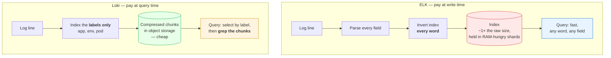
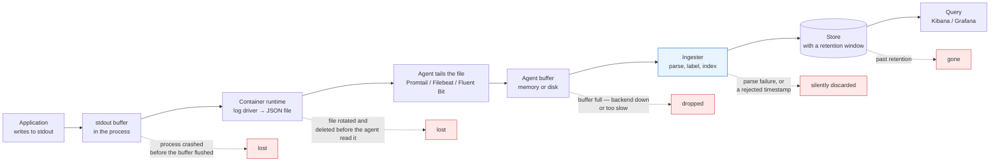
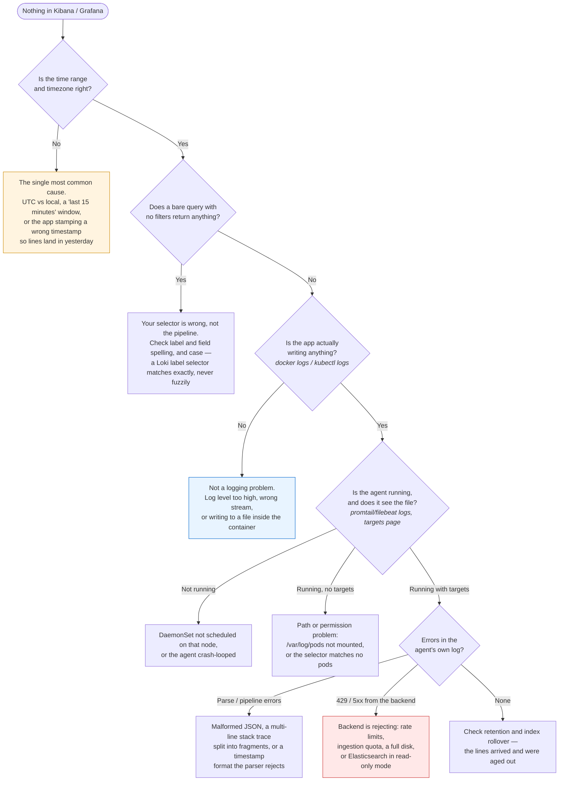

# Module 08: Logging

> *"Metrics tell you WHAT is broken. Logs tell you WHY." — DevOps Wisdom*

---

>**Command reference**: [`cheatsheet.md`](./cheatsheet.md) — every command in this module, grouped by task, with the gotchas.
>
>**Cross-module lookup**: [Quick Reference](../QUICK-REFERENCE.md)

---

## Why This Module Matters

Metrics (Module 07) tell you a service has a 5% error rate. Logs tell you **exactly which requests failed and why** — a stack trace, a malformed payload, a database timeout. Without centralized logging, debugging production issues means SSH-ing into individual servers and grep-ing through files — it doesn't scale.

**In real-world DevOps work**, you will:

- Set up centralized logging so all services ship logs to one place
- Use the ELK Stack (Elasticsearch, Logstash, Kibana) for enterprise logging
- Use Loki + Grafana as a lightweight alternative
- Write structured logs that are easy to search and filter
- Correlate logs with metrics to debug production incidents
- Set up log-based alerts for critical errors
- Manage log retention, rotation, and storage costs

---

## Table of Contents

1. [Why Centralized Logging](#1-why-centralized-logging)
2. [Structured vs Unstructured Logs](#2-structured-vs-unstructured-logs)
3. [Log Levels](#3-log-levels)
4. [The ELK Stack](#4-the-elk-stack)
5. [Loki — Lightweight Alternative](#5-loki--lightweight-alternative)
6. [Log Collection Patterns](#6-log-collection-patterns)
7. [Searching and Analyzing Logs](#7-searching-and-analyzing-logs)
8. [Log-Based Alerting](#8-log-based-alerting)
9. [Common Mistakes and Anti-Patterns](#9-common-mistakes-and-anti-patterns)
10. [Debugging Mindset](#10-debugging-mindset)
11. [Interview Insights](#11-interview-insights)

---

## 1. Why Centralized Logging

### The Problem

```
Without centralized logging:

  Server 1: ssh → tail -f /var/log/app.log
  Server 2: ssh → tail -f /var/log/app.log
  Server 3: ssh → tail -f /var/log/app.log
  ...
  Server 50: 

  "Which server had the error?"
  "The log rotated and the evidence is gone."
  "The container restarted and logs are lost."
```

### The Solution

```
┌──────────┐  ┌──────────┐  ┌──────────┐
│ Server 1 │  │ Server 2 │  │ Server 3 │
│   logs   │  │   logs   │  │   logs   │
└────┬─────┘  └────┬─────┘  └────┬─────┘
     │             │             │
     └─────────────┼─────────────┘
                   │
                   ▼
          ┌─────────────────┐
          │  LOG AGGREGATOR │  ← All logs in ONE place
          │  (ELK / Loki)   │
          └────────┬────────┘
                   │
                   ▼
          ┌─────────────────┐
          │  SEARCH & QUERY │  ← Kibana / Grafana
          │  Dashboards     │
          │  Alerts         │
          └─────────────────┘
```

**Benefits:**

- **One place** to search all logs across all services
- **Persistence** — logs survive container restarts and server failures
- **Correlation** — find all logs for a specific request ID across services
- **Alerting** — trigger alerts on error patterns (not just metrics)
- **Compliance** — audit trails, retention policies

---

## 2. Structured vs Unstructured Logs

### Unstructured (Bad for Searching)

```
[2024-01-15 14:23:01] ERROR - Failed to process order #4521 for user john@email.com: connection timeout after 30s
```

### Structured JSON (Good for Searching)

```json
{
  "timestamp": "2024-01-15T14:23:01.234Z",
  "level": "ERROR",
  "service": "order-service",
  "message": "Failed to process order",
  "order_id": 4521,
  "user": "john@email.com",
  "error": "connection timeout",
  "timeout_seconds": 30,
  "trace_id": "abc-123-def-456"
}
```

| Aspect | Unstructured | Structured (JSON) |
|--------|-------------|-------------------|
| **Human readable** |  Easy to read |  Verbose |
| **Machine parseable** |  Regex needed |  Native parsing |
| **Searchable** |  Full-text only |  Filter by any field |
| **Dashboards** |  Hard to aggregate |  Count errors by service |
| **Correlation** |  Manual |  Filter by trace_id |

>**Rule:** Always use structured logging in production. JSON is the standard.

### Python Structured Logging Example

```python
import logging
import json
from datetime import datetime

class JSONFormatter(logging.Formatter):
    def format(self, record):
        log_entry = {
            "timestamp": datetime.utcnow().isoformat() + "Z",
            "level": record.levelname,
            "service": "order-service",
            "message": record.getMessage(),
            "module": record.module,
            "function": record.funcName,
            "line": record.lineno,
        }
        if record.exc_info:
            log_entry["exception"] = self.formatException(record.exc_info)
        # Add extra fields
        for key, value in record.__dict__.items():
            if key.startswith("_") and not key.startswith("__"):
                log_entry[key[1:]] = value
        return json.dumps(log_entry)

# Setup
handler = logging.StreamHandler()
handler.setFormatter(JSONFormatter())
logger = logging.getLogger("app")
logger.addHandler(handler)
logger.setLevel(logging.INFO)

# Usage
logger.info("Order created", extra={"_order_id": 4521, "_user": "john@email.com"})
logger.error("Payment failed", extra={"_order_id": 4521, "_error": "card_declined"})
```

---

## 3. Log Levels

```
┌──────────┬────────────────────────────────────────────────────┐
│  LEVEL   │  WHEN TO USE                                      │
├──────────┼────────────────────────────────────────────────────┤
│ DEBUG    │ Detailed diagnostic info. OFF in production.       │
│          │ "Processing item 45 of 100"                        │
├──────────┼────────────────────────────────────────────────────┤
│ INFO     │ Normal operations. Key business events.            │
│          │ "Order #4521 created", "User logged in"            │
├──────────┼────────────────────────────────────────────────────┤
│ WARNING  │ Something unexpected but not broken.               │
│          │ "Retry attempt 2/3", "Cache miss, falling back"    │
├──────────┼────────────────────────────────────────────────────┤
│ ERROR    │ Something failed. Needs attention.                 │
│          │ "Payment failed", "Database connection lost"       │
├──────────┼────────────────────────────────────────────────────┤
│ CRITICAL │ System is unusable. Wake someone up.               │
│          │ "All DB connections exhausted", "Disk full"         │
└──────────┴────────────────────────────────────────────────────┘
```

**Production rules:**

- Default level: **INFO** (captures business events + errors)
- Enable **DEBUG** temporarily for troubleshooting specific issues
- Every **ERROR** should be actionable — if nothing to do, it's a WARNING
- **CRITICAL** should trigger an alert (not just a log)

---

## 4. The ELK Stack

### Architecture

```
          ELK = Elasticsearch + Logstash + Kibana

┌─────────────┐     ┌─────────────┐     ┌─────────────────┐
│   LOGSTASH   │     │ELASTICSEARCH│     │     KIBANA       │
│              │     │             │     │                  │
│  • Collect   │────▶│  • Store    │◀────│  • Search        │
│  • Parse     │     │  • Index    │     │  • Visualize     │
│  • Transform │     │  • Search   │     │  • Dashboard     │
│  • Ship      │     │             │     │  • Alert         │
└──────┬───────┘     └─────────────┘     └─────────────────┘
       │
       │ collects from
       ▼
┌──────────────────────────────────┐
│  LOG SOURCES                     │
│  • Application logs (stdout)     │
│  • System logs (/var/log/*)      │
│  • Docker container logs         │
│  • Filebeat agents on servers    │
└──────────────────────────────────┘
```

### Component Roles

| Component | Role | Analogy |
|-----------|------|---------|
| **Beats (Filebeat)** | Lightweight log shippers installed on servers | Mail carrier |
| **Logstash** | Ingest, parse, transform, and route logs | Post office (sorting center) |
| **Elasticsearch** | Store and index logs for fast search | Library (indexed catalog) |
| **Kibana** | Search, visualize, and create dashboards | Library computer terminal |

### Filebeat Configuration

```yaml
# filebeat.yml — installed on each server
filebeat.inputs:
  - type: log
    enabled: true
    paths:
      - /var/log/app/*.log
    json.keys_under_root: true     # Parse JSON logs
    json.add_error_key: true

  - type: container
    paths:
      - /var/lib/docker/containers/*/*.log

output.logstash:
  hosts: ["logstash:5044"]
```

### Logstash Pipeline

```ruby
# logstash.conf
input {
  beats {
    port => 5044
  }
}

filter {
  # Parse JSON logs
  if [message] =~ /^\{/ {
    json {
      source => "message"
    }
  }

  # Parse timestamps
  date {
    match => ["timestamp", "ISO8601"]
    target => "@timestamp"
  }

  # Add geoip for access logs
  if [client_ip] {
    geoip {
      source => "client_ip"
    }
  }

  # Drop health check noise
  if [path] == "/health" {
    drop { }
  }
}

output {
  elasticsearch {
    hosts => ["elasticsearch:9200"]
    index => "app-logs-%{+YYYY.MM.dd}"    # Daily index rotation
  }
}
```

---

## 5. Loki — Lightweight Alternative

### Why Loki?

```
ELK:   Full-text indexing → powerful but expensive (RAM, disk, CPU)
Loki:  Label-based indexing → lightweight, cheaper, pairs with Grafana

ELK is like indexing every word in every book in the library.
Loki is like indexing only the book titles and authors — then reading the book when needed.
```

The analogy is exact, and the diagram shows where the cost moves to:



 **Neither is cheaper in general — they move the bill.** ELK spends CPU, RAM and disk on every line whether or not anyone ever searches for it, and rewards you with fast arbitrary queries. Loki stores almost nothing extra and charges you at query time, which is fine when your queries start with a label selector and painful when they don't.

 **Loki's failure mode is high-cardinality labels.** Putting `user_id` or `request_id` in a label creates a separate stream per value and rebuilds the very index you chose Loki to avoid — the cardinality trap from Module 07 §3, in a different product. Labels are for the dimensions you filter by (`app`, `env`, `namespace`); everything else belongs in the log line where LogQL can grep it.

| Aspect | ELK Stack | Loki + Grafana |
|--------|-----------|----------------|
| **Indexing** | Full-text (every word) | Labels only (metadata) |
| **Resource usage** | Heavy (needs lots of RAM) | Lightweight |
| **Query language** | KQL / Lucene | LogQL (similar to PromQL) |
| **Best for** | Enterprise, complex analysis | Cloud-native, Kubernetes |
| **Visualization** | Kibana | Grafana (same as metrics!) |
| **Cost** | Higher | Lower |
| **Setup** | Complex | Simple |

### Loki Architecture

```
┌──────────┐     ┌───────────┐     ┌──────────┐
│ Promtail  │────▶│   LOKI    │◀────│ GRAFANA  │
│ (shipper) │     │ (storage) │     │ (query)  │
└──────────┘     └───────────┘     └──────────┘
```

### LogQL — Querying Loki

```logql
# Stream selector (required) — like Prometheus labels
{job="flask-app"}
{service="order-service", level="ERROR"}

# Filter expressions
{job="flask-app"} |= "error"              # Contains "error"
{job="flask-app"} != "health"              # Does NOT contain "health"
{job="flask-app"} |~ "timeout|connection"  # Regex match

# JSON parsing
{job="flask-app"} | json | status >= 500

# Count errors per minute
count_over_time({job="flask-app", level="ERROR"}[1m])

# Top error messages
topk(5, sum by (message) (count_over_time({level="ERROR"}[1h])))

# Error rate as percentage
sum(rate({level="ERROR"}[5m])) / sum(rate({level=~".+"}[5m])) * 100
```

---

## 6. Log Collection Patterns

### Pattern 1: Sidecar (Kubernetes)

```
┌──────────────────────────┐
│         POD              │
│  ┌──────┐  ┌──────────┐ │
│  │ App  │  │ Promtail  │ │
│  │      │──│ (sidecar) │ │
│  │ logs │  │ ships logs│ │
│  └──────┘  └──────────┘ │
└──────────────────────────┘
```

### Pattern 2: DaemonSet (Kubernetes)

```
Node 1                    Node 2
┌──────────────────┐     ┌──────────────────┐
│ Pod A  Pod B     │     │ Pod C  Pod D     │
│   │      │       │     │   │      │       │
│   └──────┘       │     │   └──────┘       │
│       │          │     │       │          │
│  ┌────▼────┐     │     │  ┌────▼────┐     │
│  │Promtail │     │     │  │Promtail │     │
│  │DaemonSet│     │     │  │DaemonSet│     │
│  └─────────┘     │     │  └─────────┘     │
└──────────────────┘     └──────────────────┘
```

### Pattern 3: Direct stdout (Docker / Compose)

```
Application → stdout/stderr → Docker log driver → Loki/ELK
```

>**12-Factor App Rule:** Applications should log to **stdout**, never to files. Let the platform handle log collection.

### The Whole Path, and Where Lines Disappear

Whichever pattern you pick, a log line crosses six boundaries between your `print()` and a search result. Each one drops lines under a specific, predictable condition:



 **Logging is best-effort at every hop, and nothing tells you when a line vanishes.** That is the difference between logs and metrics: a dropped counter increment shows as a dip you can see, a dropped log line leaves no trace at all. Two consequences worth designing around — **never build billing or audit on log delivery** (use a durable queue or the database), and **alert on ingestion rate**, because a collector that stopped shipping looks exactly like an application that went quiet.

 **Unbuffered output is worth the syscalls for anything you'll debug with.** A Python app with block-buffered stdout can hold thousands of lines in memory, and if it segfaults you lose precisely the lines that explain why. `PYTHONUNBUFFERED=1`, `flush=True`, or `stdbuf -oL` for arbitrary commands.

---

## 7. Searching and Analyzing Logs

### Kibana Query Language (KQL)

```
# Simple field search
level: "ERROR"

# Multiple conditions
level: "ERROR" AND service: "order-service"

# Wildcard
message: *timeout*

# Range
response_time: > 1000

# Exclude
NOT path: "/health"

# Combine
level: "ERROR" AND service: "order-service" AND NOT message: *health*
```

### Effective Log Search Strategy

```
Production incident? Follow this order:

1. TIME WINDOW — When did it start?
   Filter: last 30 minutes (or around the alert time)

2. ERROR LEVEL — What's failing?
   Filter: level = ERROR or CRITICAL

3. SERVICE — Which service?
   Filter: service = "order-service"

4. CORRELATION — Trace the request
   Filter: trace_id = "abc-123" (from the error log)
   → See the full journey of the failed request

5. PATTERN — Is it one error or many?
   Visualize: error count over time → spike or constant?

6. ROOT CAUSE — What changed?
   Compare: logs before and after the incident started
```

---

## 8. Log-Based Alerting

### When to Alert on Logs vs Metrics

```
USE METRICS ALERTS for:
   Error rate above threshold
   Latency above threshold
   Resource usage (CPU, memory)

USE LOG ALERTS for:
   Specific error messages ("database connection pool exhausted")
   Security events ("unauthorized access attempt")
   Business events ("payment processor returned fraud_detected")
   Patterns that don't have metrics
```

### Loki Alert Rules

```yaml
# loki-alert-rules.yml
groups:
  - name: log-alerts
    rules:
      - alert: HighErrorLogRate
        expr: |
          sum(rate({level="ERROR"}[5m])) > 10
        for: 5m
        labels:
          severity: warning
        annotations:
          summary: "More than 10 error logs per second"

      - alert: DatabaseConnectionError
        expr: |
          count_over_time({level="ERROR"} |= "connection pool exhausted" [5m]) > 0
        for: 1m
        labels:
          severity: critical
        annotations:
          summary: "Database connection pool exhausted"
```

---

## 9. Common Mistakes and Anti-Patterns

### Logging Sensitive Data

```python
# BAD: PII in logs (violates GDPR, security risk)
logger.info(f"User logged in: email={email}, password={password}, ssn={ssn}")

# GOOD: Redact sensitive fields
logger.info("User logged in", extra={"_user_id": user.id, "_email": mask(email)})
```

### Logging Too Much

```
BAD:  500GB/day of DEBUG logs → expensive storage, slow searches, noise
GOOD: INFO level in production, DEBUG only when troubleshooting
RULE: Every log line should serve a purpose. If nobody reads it, remove it.
```

### No Correlation IDs

```python
# BAD: Can't trace a request across services
logger.error("Payment failed")

# GOOD: trace_id links logs across all services
logger.error("Payment failed", extra={"_trace_id": request_id, "_order_id": order.id})
```

### Unstructured Logs in Production

```
# BAD: Good luck parsing this with regex
print(f"ERROR: order {order_id} failed because {reason} at {time}")

# GOOD: JSON, parsed automatically by ELK/Loki
logger.error("Order failed", extra={"_order_id": order_id, "_reason": reason})
```

---

## 10. Debugging Mindset

### Logs + Metrics = Full Picture

```
Alert fires: "High error rate on order-service"
│
├─ 1. METRICS (Grafana) — WHAT is happening?
│     └─ Error rate spiked from 0.1% to 12% at 14:15
│
├─ 2. LOGS (Kibana/Grafana) — WHY is it happening?
│     ├─ Filter: service=order-service, level=ERROR, time=14:15-now
│     ├─ Pattern: "Connection refused to payment-service:8080"
│     └─ Root cause: payment-service is down
│
├─ 3. CORRELATE — Trace a single request
│     ├─ Find a trace_id from the error log
│     ├─ Search all services for that trace_id
│     └─ See the full request path: API → order → payment (FAILED)
│
└─ 4. FIX
      ├─ Restart payment-service (immediate fix)
      └─ Add circuit breaker + retry logic (long-term fix)
```

### Troubleshooting: "My Logs Aren't Showing Up"

Before you conclude the logging stack is broken, walk the path backwards from the query. Each check is one command and eliminates a whole hop:



 **Check the clock first.** It costs five seconds and it is the answer often enough that experienced engineers do it reflexively. A container with a skewed clock, or an app logging local time while the backend assumes UTC, puts perfectly healthy lines hours away from where you are looking.

 **Elasticsearch turning its indices read-only when a disk crosses the flood-stage watermark (95% by default) is a classic**: ingestion stops, no error surfaces in your app, and the fix is to free space *and* clear the read-only block manually — it does not lift itself.

---

## 11. Interview Insights

**Q: What's the ELK Stack and when would you use it?**
> ELK is Elasticsearch (search/storage), Logstash (ingest/transform), and Kibana (visualization). Use it for centralized logging in production — it lets you search and analyze logs from all services in one place. Filebeat ships logs from servers to Logstash, which parses and sends them to Elasticsearch for indexing. Kibana provides the UI for searching and dashboarding.

**Q: How does Loki differ from Elasticsearch?**
> Elasticsearch indexes the full text of every log line — powerful but expensive in resources. Loki indexes only labels (metadata like service name, level) and stores the log content as compressed chunks. This makes Loki much cheaper to run but less flexible for ad-hoc full-text searches. Loki is ideal for cloud-native environments, especially alongside Prometheus and Grafana.

**Q: What is structured logging and why does it matter?**
> Structured logging means logs are in a parseable format (usually JSON) with consistent fields. This enables machine parsing, filtering by any field, aggregation, and dashboarding. Unstructured text logs require regex parsing which is fragile and slow. In production with thousands of log lines per second, structured logs are essential for debugging.

**Q: How do you handle log volume in production?**
> Set appropriate log levels (INFO in prod, DEBUG only when needed). Drop noisy logs (health checks) in the pipeline. Use sampling for high-traffic services. Set retention policies (keep 7-30 days depending on compliance). Use index lifecycle management in Elasticsearch. Monitor log storage costs.

**Q: How do you correlate logs across microservices?**
> Use a correlation/trace ID. When a request enters the system, generate a unique ID and pass it through every service via HTTP headers. Each service includes this ID in every log line. To debug a failed request, search for its trace ID to see the full journey across all services.

---

## Labs and Projects

Read the sections above first, then work through these **in order**. Every lab ends with a  **Break It** section — those are not optional; they are where the debugging skill actually comes from.

| # | Lab | What you'll do |
|---|-----|----------------|
| 1 | **[Loki + Grafana](./labs/lab-01-loki-grafana.md)** | Set up a centralized logging stack using Grafana Loki, Promtail, and Grafana. |
| 2 | **[ELK Stack](./labs/lab-02-elk-stack.md)** | Set up the ELK Stack (Elasticsearch, Logstash, Kibana) with Filebeat using Docker Compose. |

**Portfolio project:**

- [Project: Centralized Logging Investigation](./projects/project-01-log-investigation.md) — Collect application or container logs into a logging stack and use queries to investigate a realistic failure.

**Reference code** for every lab: [`code/`](./code/) — real files, validated in CI.

---

## Self-Check

Answer these from memory before you expand them. If more than two give you trouble, re-read the sections they come from — the labs assume this material is solid.

<details>
<summary><strong>1. Why centralize logs at all, when the log file is right there on the host?</strong></summary>

Because with autoscaling and container restarts the host holding the log is frequently gone by the time you look, and one user request now crosses half a dozen services. You cannot grep what no longer exists, and you cannot follow a request through files on twelve machines.

</details>

<details>
<summary><strong>2. What does structured logging buy you, and what does it cost?</strong></summary>

You get fields you can filter and aggregate on without brittle regex, consistent parsing across services, and a place to attach a request id. The cost is discipline in the application — a log line becomes an event with a schema rather than a sentence.

</details>

<details>
<summary><strong>3. Elasticsearch or Loki?</strong></summary>

Elasticsearch indexes the whole log body: fast arbitrary full-text queries, expensive in storage and memory. Loki indexes only labels and stores compressed chunks: dramatically cheaper, but a full-text search is a scan, and high-cardinality labels are what actually hurt you.

</details>

<details>
<summary><strong>4. What is a log level policy, and what happens without one?</strong></summary>

ERROR means a human must act, WARN means suspicious and possibly actionable, INFO records business events, DEBUG is off in production and enabled deliberately. Without a policy everything drifts to one level — and a stream where everything is an error contains no errors.

</details>

<details>
<summary><strong>5. What is a correlation id and why must it be created at the edge?</strong></summary>

One identifier attached to every log line produced while handling a request, generated at ingress and propagated through every downstream call. Created anywhere later, it cannot join the earlier hops — and reconstructing one user's path across services is the main reason you centralized logs.

</details>

<details>
<summary><strong>6. When should something be a metric rather than a log-based alert?</strong></summary>

Anything you are counting or thresholding: metrics are cheap, pre-aggregated, and stable to alert on. Reserve log-based alerts for rare specific events whose textual detail is the point — a particular exception, an audit action. "Alert when this log line appears 100 times" is usually a metric the application should be exporting.

</details>

---

## Practical Checkpoint

Before moving on, you should be able to:

- Collect logs from an application or container into a central logging stack.
- Query logs to answer who, what, when, where, and why during an incident.
- Distinguish useful structured logs from noisy or missing log data.

Portfolio evidence to keep:

- Logging stack configuration.
- Example queries and results.
- A short investigation report based on log evidence.

Suggested project: [Centralized Logging Investigation](./projects/project-01-log-investigation.md)

---

## What's Next?

With observability (metrics) and logging in place, you can now see and debug your systems. Next, you'll learn cloud fundamentals before automating infrastructure.

**[Module 09: Cloud Fundamentals →](../09-cloud-fundamentals/)**

---

<div align="center">

**Module 08 Complete** 

[← Back to Observability](../07-observability/) | [ Cheat Sheet](./cheatsheet.md) | [Next: Cloud Fundamentals →](../09-cloud-fundamentals/)

</div>


## Reference
<!-- tab: Cheatsheet -->
> LogQL, Lucene/KQL, and Elasticsearch query reference. Concepts live in the [module README](./README.md).
> Cross-module daily commands: **[QUICK-REFERENCE.md](../QUICK-REFERENCE.md)**

**Jump to:** [Log levels](#log-levels) · [Structured logging](#structured-logging) · [LogQL](#logql-loki)  · [Lucene & KQL](#lucene--kql-kibana) · [Elasticsearch API](#elasticsearch-api) · [Shippers](#shippers--collectors) · [Local analysis](#local-log-analysis) · [Retention](#retention--cost) · [Troubleshooting](#troubleshooting)

---

## Log Levels

| Level | Use for | Page someone? |
|-------|---------|---------------|
| `TRACE` | Function entry/exit, full payloads | Never — off in production |
| `DEBUG` | Variable state, decision branches | Never — off in production by default |
| `INFO` | Normal lifecycle events: started, connected, request served | No |
| `WARN` | Recovered problems, retries, deprecations, approaching limits | Review in aggregate |
| `ERROR` | An operation failed; a user was affected | Alert on rate, not on individual lines |
| `FATAL` / `CRITICAL` | The process cannot continue and is exiting | Yes |

>**The test for WARN vs ERROR**: if nobody would ever act on it, it's INFO. If a human must eventually do something, it's WARN. If a request or job actually failed, it's ERROR. Teams that log everything at ERROR end up alerting on nothing.

---

## Structured Logging

```json
{
  "timestamp": "2026-08-04T09:12:44.512Z",
  "level": "error",
  "service": "payments-api",
  "env": "production",
  "version": "1.4.2",
  "trace_id": "4bf92f3577b34da6a3ce929d0e0e4736",
  "span_id": "00f067aa0ba902b7",
  "request_id": "req_01H8X...",
  "user_id": "u_8891",
  "method": "POST",
  "path": "/v1/charges",
  "status": 502,
  "duration_ms": 4310,
  "error": "upstream timeout",
  "upstream": "stripe-gateway"
}
```

| Rule | Why |
|------|-----|
| One JSON object per line (**JSONL**) | Every collector can parse it; multi-line JSON cannot be split reliably |
| **ISO-8601 UTC** timestamps with milliseconds | Sortable, unambiguous across regions |
| Always include `service`, `env`, `version` | Otherwise you can't tell which deploy broke |
| Always include `trace_id` |  The join key between logs, traces, and metrics |
| Log to **stdout/stderr**, never to a file | The platform (Docker/K8s/systemd) owns collection and rotation |
| Never log secrets, tokens, passwords, card numbers, or full PII | Logs are replicated, indexed, and widely readable |
| Keep field names and types stable | A field that's sometimes a string and sometimes a number breaks Elasticsearch mappings |

```python
# Python — structlog
import structlog
log = structlog.get_logger()
log.info("charge_created", user_id=uid, amount_cents=1999, trace_id=tid)
log.error("upstream_failed", upstream="stripe", status=502, duration_ms=4310)
```

```javascript
// Node — pino
const logger = require('pino')({ level: process.env.LOG_LEVEL || 'info' });
logger.error({ upstream: 'stripe', status: 502, trace_id: tid }, 'upstream_failed');
```

```go
// Go — log/slog (stdlib)
slog.SetDefault(slog.New(slog.NewJSONHandler(os.Stdout, nil)))
slog.Error("upstream failed", "upstream", "stripe", "status", 502, "trace_id", tid)
```

---

## LogQL (Loki)

LogQL is "PromQL for logs". Every query starts with a **stream selector** in `{}`.

### Stream selectors (indexed labels — keep these low-cardinality)

```logql
{app="payments-api"}
{app="payments-api", env="production"}
{app=~"payments.*"}                      # regex match
{app!="healthcheck"}
{namespace="prod", container="api"}
```

### Line filters (fast — applied before parsing)

```logql
{app="api"} |= "error"                   # contains
{app="api"} != "healthcheck"             # does not contain
{app="api"} |~ "timeout|refused"         # regex match
{app="api"} !~ "GET /(health|metrics)"   # regex not-match
{app="api"} |= "error" != "expected"     # chained — order matters for speed
```

### Parsers

```logql
{app="api"} | json                                    # parse JSON into labels
{app="api"} | json status="status", dur="duration_ms" # extract specific fields
{app="api"} | logfmt                                  # key=value format
{app="api"} | pattern `<ip> - - <_> "<method> <uri> <_>" <status> <size>`
{app="api"} | regexp `(?P<method>\w+) (?P<path>\S+) (?P<status>\d+)`
{app="api"} | unpack                                  # unwrap promtail-packed labels
```

### Label filters (applied after parsing)

```logql
{app="api"} | json | status >= 500
{app="api"} | json | duration_ms > 1000
{app="api"} | json | level="error" and service="payments"
{app="api"} | json | status =~ "5.."
{app="api"} | json | __error__ = ""                   #  drop lines that failed to parse
```

### Formatting

```logql
{app="api"} | json | line_format "{{.level}} {{.path}} {{.status}} {{.duration_ms}}ms"
{app="api"} | json | label_format endpoint=`{{ regexReplaceAll "/[0-9]+" .path "/:id" }}`
{app="api"} | json | drop trace_id, span_id
{app="api"} | json | keep level, status, path
```

### Metric queries — turn logs into graphs and alerts

```logql
# Log volume per second
rate({app="api"}[5m])
sum by (level) (rate({app="api"} | json [5m]))

# Error lines per second
sum(rate({app="api"} |= "error" [5m]))

#  Error ratio from logs
sum(rate({app="api"} | json | status >= 500 [5m]))
  / sum(rate({app="api"} | json [5m]))

# Count over a window
count_over_time({app="api"} |= "OOMKilled" [1h])

# Aggregate a numeric field with unwrap
quantile_over_time(0.95, {app="api"} | json | unwrap duration_ms [5m]) by (endpoint)
avg_over_time({app="api"} | json | unwrap duration_ms [5m])
sum_over_time({app="api"} | json | unwrap bytes_sent [1h])
max_over_time({app="api"} | json | unwrap duration_ms [5m]) by (endpoint)

# Top offenders
topk(10, sum by (path) (count_over_time({app="api"} | json | status >= 500 [1h])))

# Rate of change — spot a sudden error surge
sum(rate({app="api"} |= "ERROR" [5m])) > 10
```

### Alerting on logs

```yaml
groups:
  - name: log-alerts
    rules:
      - alert: ErrorLogSpike
        expr: sum(rate({app="payments-api"} | json | level="error" [5m])) > 5
        for: 5m
        labels: {severity: warning}
        annotations:
          summary: "payments-api is logging {{ $value | printf \"%.1f\" }} errors/sec"

      - alert: OOMKillDetected
        expr: sum(count_over_time({namespace="prod"} |= "OOMKilled" [10m])) > 0
        labels: {severity: critical}
```

```bash
# logcli — query Loki from the terminal
export LOKI_ADDR=http://localhost:3100
logcli query '{app="api"} |= "error"' --limit=100 --since=1h
logcli query '{app="api"}' --tail                      #  live tail
logcli query 'sum(rate({app="api"}[5m]))' --since=6h
logcli labels                                          # available label names
logcli labels app                                      # values for a label
logcli series '{namespace="prod"}'
```

>**Loki indexes only labels, not log content.** That's why it's cheap — and why putting `request_id` or `user_id` in a *stream label* destroys it. High-cardinality values belong in the log **line** (queried with `|=` and `| json`), never in `{}`.

---

## Lucene & KQL (Kibana)

**KQL** is the modern default in Kibana's search bar. **Lucene** is still used in saved queries and some APIs.

| Goal | KQL | Lucene |
|------|-----|--------|
| Field equals | `status:500` | `status:500` |
| Free text | `"connection refused"` | `"connection refused"` |
| AND / OR / NOT | `status:500 and service:api` | `status:500 AND service:api` |
| Negation | `not status:200` | `NOT status:200` |
| Wildcard | `path:/api/*` | `path:\/api\/*` |
| Range | `duration_ms > 1000` | `duration_ms:[1000 TO *]` |
| Between | `status >= 400 and status < 500` | `status:[400 TO 499]` |
| Field exists | `error:*` | `_exists_:error` |
| Multiple values | `status:(500 or 502 or 503)` | `status:(500 OR 502 OR 503)` |
| Nested field | `kubernetes.pod.name:api-*` | same |
| Escaping | wrap in quotes | escape `+ - && \|\| ! ( ) { } [ ] ^ " ~ * ? : \ /` |

```
# Practical Kibana searches
level:error and kubernetes.namespace:production
status >= 500 and not path:/health
service:payments-api and duration_ms > 3000
message:"connection refused" and not kubernetes.labels.app:test
trace_id:"4bf92f3577b34da6a3ce929d0e0e4736"        #  pull one request's full story
error:* and @timestamp >= "2026-08-04T09:00:00Z"
```

---

## Elasticsearch API

```bash
ES=http://localhost:9200

# ─── Health and capacity ───
curl -s "$ES/_cluster/health?pretty"
curl -s "$ES/_cat/health?v"
curl -s "$ES/_cat/indices?v&s=store.size:desc"        #  biggest indices first
curl -s "$ES/_cat/nodes?v&h=name,heap.percent,disk.used_percent,load_1m"
curl -s "$ES/_cat/shards?v&s=state"                   # find UNASSIGNED shards
curl -s "$ES/_cluster/allocation/explain?pretty"      #  WHY is a shard unassigned
curl -s "$ES/_cat/pending_tasks?v"

# ─── Index management ───
curl -s "$ES/logs-2026.08.04/_mapping?pretty"
curl -s "$ES/logs-2026.08.04/_count?pretty"
curl -X DELETE "$ES/logs-2026.07.*"                   #  deletes data
curl -X POST "$ES/logs-2026.08.04/_forcemerge?max_num_segments=1"
curl -X PUT "$ES/logs-*/_settings" -H 'Content-Type: application/json' \
  -d '{"index.number_of_replicas": 1}'
```

### Search

```bash
curl -s "$ES/logs-*/_search?pretty" -H 'Content-Type: application/json' -d '{
  "size": 20,
  "sort": [{"@timestamp": "desc"}],
  "query": {
    "bool": {
      "must":   [{"match": {"message": "timeout"}}],
      "filter": [
        {"term":  {"service.keyword": "payments-api"}},
        {"range": {"status": {"gte": 500}}},
        {"range": {"@timestamp": {"gte": "now-1h"}}}
      ],
      "must_not": [{"term": {"path.keyword": "/health"}}]
    }
  }
}'
```

### Aggregations

```bash
# Top 10 error paths in the last hour
curl -s "$ES/logs-*/_search?pretty" -H 'Content-Type: application/json' -d '{
  "size": 0,
  "query": {"bool": {"filter": [
    {"range": {"status": {"gte": 500}}},
    {"range": {"@timestamp": {"gte": "now-1h"}}}
  ]}},
  "aggs": {
    "by_path": {
      "terms": {"field": "path.keyword", "size": 10, "order": {"_count": "desc"}},
      "aggs": {"p95_latency": {"percentiles": {"field": "duration_ms", "percents": [95]}}}
    }
  }
}'

# Error count over time (date histogram)
curl -s "$ES/logs-*/_search?pretty" -H 'Content-Type: application/json' -d '{
  "size": 0,
  "query": {"term": {"level.keyword": "error"}},
  "aggs": {"over_time": {"date_histogram": {"field": "@timestamp", "fixed_interval": "5m"}}}
}'
```

| Query type | Use |
|------------|-----|
| `term` | Exact match on a keyword field  use `.keyword` sub-field |
| `match` | Full-text, analysed |
| `match_phrase` | Exact phrase |
| `range` | Numeric or date ranges |
| `wildcard` / `prefix` | Pattern matching (slow — avoid leading wildcards) |
| `exists` | Field is present |
| `bool` | Combine: `must` (scored AND), `filter` ( unscored AND — **cached and faster**), `should` (OR), `must_not` |

### Index Lifecycle Management

```bash
curl -X PUT "$ES/_ilm/policy/logs-policy" -H 'Content-Type: application/json' -d '{
  "policy": {"phases": {
    "hot":    {"actions": {"rollover": {"max_size": "50gb", "max_age": "1d"}}},
    "warm":   {"min_age": "7d",  "actions": {"forcemerge": {"max_num_segments": 1},
                                             "shrink": {"number_of_shards": 1}}},
    "cold":   {"min_age": "30d", "actions": {"freeze": {}}},
    "delete": {"min_age": "90d", "actions": {"delete": {}}}
  }}
}'
```

---

## Shippers & Collectors

| Tool | Best for | Notes |
|------|----------|-------|
| **Promtail** | Loki | Lightweight, Kubernetes-native, label-driven |
| **Filebeat** | Elasticsearch | Low footprint, huge module library |
| **Fluent Bit** | Anything |  Tiny (C), the usual Kubernetes DaemonSet choice |
| **Fluentd** | Anything | Heavier (Ruby), more plugins |
| **Logstash** | Elasticsearch | Powerful transforms, memory-hungry |
| **Vector** | Anything |  Fast (Rust), excellent transform language |
| **OpenTelemetry Collector** | Vendor-neutral | Logs + metrics + traces in one agent |

```yaml
# promtail-config.yml — Kubernetes pod discovery
scrape_configs:
  - job_name: kubernetes-pods
    kubernetes_sd_configs: [{role: pod}]
    pipeline_stages:
      - cri: {}                          # parse the container runtime wrapper
      - json:
          expressions: {level: level, msg: message, trace_id: trace_id}
      - labels:
          level:                         #  ONLY low-cardinality fields become labels
      - timestamp: {source: time, format: RFC3339Nano}
      - output: {source: msg}
    relabel_configs:
      - source_labels: [__meta_kubernetes_namespace]
        target_label: namespace
      - source_labels: [__meta_kubernetes_pod_label_app]
        target_label: app
      - source_labels: [__meta_kubernetes_pod_container_name]
        target_label: container
      - source_labels: [__meta_kubernetes_pod_uid, __meta_kubernetes_pod_container_name]
        target_label: __path__
        separator: /
        replacement: /var/log/pods/*$1/*.log
```

```conf
# fluent-bit.conf
[SERVICE]
    Flush        5
    Log_Level    info
    Parsers_File parsers.conf

[INPUT]
    Name              tail
    Path              /var/log/containers/*.log
    Parser            cri
    Tag               kube.*
    Mem_Buf_Limit     50MB
    Skip_Long_Lines   On
    Refresh_Interval  10

[FILTER]
    Name                kubernetes
    Match               kube.*
    Merge_Log           On
    Keep_Log            Off
    K8S-Logging.Exclude On          # honour a pod annotation to opt out

[OUTPUT]
    Name   es
    Match  *
    Host   elasticsearch
    Port   9200
    Index  logs
    Retry_Limit 5
```

**Collection patterns:**

| Pattern | How | Use when |
|---------|-----|----------|
| **Node agent (DaemonSet)** | One collector per node reads all container logs |  The default for Kubernetes — one agent, no app changes |
| **Sidecar** | A collector container in each pod | The app insists on writing to a file inside the pod |
| **Direct push** | The app ships logs itself | Rare — couples the app to your logging vendor |

---

## Local Log Analysis

Before you reach for a stack, these get you a long way:

```bash
tail -f /var/log/nginx/access.log
tail -F app.log | grep --line-buffered -i error       # -F survives rotation
journalctl -u myapp -f -p err
docker logs -f --tail 100 container
kubectl logs -f deploy/api --all-containers --since=10m

# Top client IPs
awk '{print $1}' access.log | sort | uniq -c | sort -rn | head

# Status code distribution
awk '{print $9}' access.log | sort | uniq -c | sort -rn

# Slowest requests (if $request_time is the last field)
awk '{print $NF, $7}' access.log | sort -rn | head -20

# Requests per minute
awk '{print substr($4, 2, 17)}' access.log | uniq -c

# Errors in a time window
sed -n '/09:00:00/,/09:15:00/p' app.log | grep -i error

# JSON logs
jq -r 'select(.level=="error") | "\(.timestamp) \(.service) \(.message)"' app.jsonl
jq -r 'select(.duration_ms > 1000) | .path' app.jsonl | sort | uniq -c | sort -rn
jq -s 'group_by(.level) | map({level: .[0].level, count: length})' app.jsonl
jq -r 'select(.trace_id=="4bf92f35...")' app.jsonl     #  one request's whole story

# Count errors per hour
grep ERROR app.log | awk '{print substr($1,1,13)}' | uniq -c

# Multi-line stack traces
grep -A 20 "Exception" app.log
awk '/^[0-9]{4}-/{p=/ERROR/} p' app.log                # print an entry and its continuation lines

# Compressed archives — no need to decompress
zgrep -i "timeout" /var/log/app.log.*.gz
zcat app.log.1.gz | jq -r 'select(.status >= 500)'
```

### logrotate

```bash
sudo logrotate -d /etc/logrotate.d/myapp        #  dry run — shows what WOULD happen
sudo logrotate -f /etc/logrotate.d/myapp        # force a rotation now
cat /var/lib/logrotate/status                   # when did each file last rotate
```

```
/var/log/myapp/*.log {
    daily
    rotate 14
    compress
    delaycompress
    missingok
    notifempty
    create 0640 appuser appuser
    sharedscripts
    postrotate
        systemctl reload myapp >/dev/null 2>&1 || true
    endscript
}
```

---

## Retention & Cost

| Lever | Effect |
|-------|--------|
| **Sample high-volume INFO** | Keep 1 in N for chatty success paths; keep 100% of WARN/ERROR |
| **Drop health-check and metrics-scrape lines at the collector** | Often 50%+ of total volume for free |
| **Tier retention** | 7d hot searchable · 30d warm · 90d+ cold object storage |
| **Cap indexed fields** | In Elasticsearch, mapped fields cost storage and memory; in Loki, labels do |
| **Compress and force-merge** older indices | Big storage win, minor query cost |
| **Set per-tenant/per-namespace ingest limits** | Stops one noisy service consuming the whole budget |

```yaml
# Drop noise before it costs you — Fluent Bit
[FILTER]
    Name    grep
    Match   kube.*
    Exclude log  (GET /health|GET /metrics|kube-probe)
```

```logql
# Find what's costing you the most in Loki
topk(10, sum by (app) (rate({namespace="prod"}[5m])))
```

---

## Troubleshooting

| Symptom | Cause | Fix |
|---------|-------|-----|
| No logs appear at all | Collector isn't running, or path mismatch | Check the DaemonSet/agent; verify `__path__` and file permissions |
| Logs stop after a rotation | Agent held the old inode | Use `tail -F` semantics; check the agent's rotation handling |
| Timestamps are wrong / all "now" | Ingest time used instead of the log's own timestamp | Configure the timestamp parser and format |
| Multi-line stack traces split into many entries | No multiline rule | Add a multiline parser keyed on the timestamp pattern |
| Elasticsearch rejects documents | Field-type conflict (`status` string vs number) | Fix at the source; add an index template with explicit mappings |
| `Loki: maximum active stream limit exceeded` | Too many label combinations | Remove high-cardinality labels |
| Loki queries time out | Query span too wide, or too few labels | Narrow the time range; add stream selectors before line filters |
| Kibana shows no data | Wrong index pattern or time range | Check the index pattern and the time picker (very common) |
| Disk fills on the nodes | Container logs not rotated | Set `max-size`/`max-file` in Docker, or `containerLogMaxSize` in kubelet |
| Costs exploding | DEBUG left on in production, or health checks logged | Set `LOG_LEVEL=info`; drop probe traffic at the collector |
| Can't correlate logs with a trace | No `trace_id` in the logs | Propagate and log the trace ID — this is the highest-value single change |

---

<div align="center">

[← Module 08 README](./README.md) · [Resources](./resources.md) · [Labs](./labs/) · [Handbook Quick Reference](../QUICK-REFERENCE.md)

</div>
<!-- tab: Labs -->
# Lab 01: Loki + Grafana — Centralized Logging with Docker Compose

## Objective

Set up a centralized logging stack using Grafana Loki, Promtail, and Grafana. You'll ship application logs, learn LogQL, and build log dashboards — the modern, lightweight approach used in cloud-native environments.

---

## Prerequisites

- Docker and Docker Compose installed
- Completed Module 07 (Observability)

---

## Deliverables and Evidence

By the end of this lab, keep the following evidence in your notes or portfolio repo:

- Commands you ran and the important output you used for validation
- Any files, scripts, configs, manifests, or workflows you created
- A short failure note describing one thing that broke, how you diagnosed it, and how you fixed it
- Cleanup commands or confirmation that no long-running resources remain

Treat the validation section as the minimum proof that the lab worked.

---

## Lab Files

Every file this lab creates also exists as a real, CI-validated file in
[`../code/lab-01/`](../code/lab-01/) (6 files).

```bash
# Option A — type them out yourself (recommended the first time; that's the learning)
# Option B — start from the reference copies
cp -r /path/to/the-devops-handbook/08-logging/code/lab-01/. .
```

Use Option B when you're comparing against a known-good version, or when something
won't start and you need to rule out a typo. See [`../code/README.md`](../code/README.md).

---

## Exercise 1: Launch the Logging Stack

### Step 1: Create the Project

```bash
mkdir -p logging-lab/{loki,promtail,app} && cd logging-lab
```

### Step 2: Loki Configuration

```bash
cat > loki/loki-config.yml << 'CONFIG'
auth_enabled: false

server:
  http_listen_port: 3100

common:
  path_prefix: /loki
  storage:
    filesystem:
      chunks_directory: /loki/chunks
      rules_directory: /loki/rules
  replication_factor: 1
  ring:
    kvstore:
      store: inmemory

schema_config:
  configs:
    - from: 2020-10-24
      store: tsdb
      object_store: filesystem
      schema: v13
      index:
        prefix: index_
        period: 24h

limits_config:
  allow_structured_metadata: true
  volume_enabled: true
CONFIG
```

### Step 3: Promtail Configuration

```bash
cat > promtail/promtail-config.yml << 'CONFIG'
server:
  http_listen_port: 9080

positions:
  filename: /tmp/positions.yaml

clients:
  - url: http://loki:3100/loki/api/v1/push

scrape_configs:
  - job_name: docker
    docker_sd_configs:
      - host: unix:///var/run/docker.sock
        refresh_interval: 5s
    relabel_configs:
      - source_labels: ['__meta_docker_container_name']
        regex: '/(.*)'
        target_label: 'container'
      - source_labels: ['__meta_docker_container_log_stream']
        target_label: 'stream'
CONFIG
```

### Step 4: Sample Application

```bash
cat > app/app.py << 'APP'
import json
import time
import random
import logging
import sys
from flask import Flask, request, jsonify

# Structured JSON logging to stdout
class JSONFormatter(logging.Formatter):
    def format(self, record):
        log = {
            "timestamp": self.formatTime(record),
            "level": record.levelname,
            "service": "demo-app",
            "message": record.getMessage(),
            "module": record.module,
        }
        if hasattr(record, '_extra'):
            log.update(record._extra)
        if record.exc_info and record.exc_info[0]:
            log["exception"] = self.formatException(record.exc_info)
        return json.dumps(log)

handler = logging.StreamHandler(sys.stdout)
handler.setFormatter(JSONFormatter())
logger = logging.getLogger("app")
logger.addHandler(handler)
logger.setLevel(logging.INFO)

app = Flask(__name__)

@app.route('/health')
def health():
    return jsonify({"status": "ok"})

@app.route('/api/users')
def get_users():
    logger.info("Fetching users", extra={"_extra": {"endpoint": "/api/users", "method": "GET"}})
    time.sleep(random.uniform(0.01, 0.05))
    return jsonify({"users": ["alice", "bob", "charlie"]})

@app.route('/api/orders', methods=['POST'])
def create_order():
    order_id = random.randint(1000, 9999)
    if random.random() < 0.3:
        logger.error("Order processing failed",
            extra={"_extra": {"order_id": order_id, "error": "payment_declined"}})
        return jsonify({"error": "Payment declined"}), 500
    logger.info("Order created",
        extra={"_extra": {"order_id": order_id, "status": "success"}})
    return jsonify({"order_id": order_id}), 201

@app.route('/api/error')
def error():
    logger.critical("Critical failure detected",
        extra={"_extra": {"component": "database", "error": "connection_pool_exhausted"}})
    return jsonify({"error": "Internal server error"}), 500

if __name__ == '__main__':
    logger.info("Application starting", extra={"_extra": {"port": 8080}})
    app.run(host='0.0.0.0', port=8080)
APP

cat > app/requirements.txt << 'REQ'
flask==3.0.0
REQ

cat > app/Dockerfile << 'DOCKERFILE'
FROM python:3.12-slim
WORKDIR /app
COPY requirements.txt .
RUN pip install --no-cache-dir -r requirements.txt
COPY app.py .
CMD ["python", "-u", "app.py"]
DOCKERFILE
```

### Step 5: Docker Compose

```bash
cat > docker-compose.yml << 'COMPOSE'
services:
  demo-app:
    build: ./app
    container_name: demo-app
    ports:
      - "8080:8080"
    labels:
      - "logging=true"
    restart: unless-stopped

  loki:
    image: grafana/loki:2.9.4
    container_name: loki
    ports:
      - "3100:3100"
    volumes:
      - ./loki/loki-config.yml:/etc/loki/loki-config.yml
      - loki_data:/loki
    command: -config.file=/etc/loki/loki-config.yml
    restart: unless-stopped

  promtail:
    image: grafana/promtail:2.9.4
    container_name: promtail
    volumes:
      - ./promtail/promtail-config.yml:/etc/promtail/promtail-config.yml
      - /var/run/docker.sock:/var/run/docker.sock:ro
    command: -config.file=/etc/promtail/promtail-config.yml
    depends_on:
      - loki
    restart: unless-stopped

  grafana:
    image: grafana/grafana:10.3.1
    container_name: grafana
    ports:
      - "3000:3000"
    environment:
      - GF_SECURITY_ADMIN_USER=admin
      - GF_SECURITY_ADMIN_PASSWORD=admin
    volumes:
      - grafana_data:/var/lib/grafana
    restart: unless-stopped

volumes:
  loki_data:
  grafana_data:
COMPOSE
```

### Step 6: Launch

```bash
docker compose up -d --build
```

** Checkpoint:** All services running. <http://localhost:8080/health> returns OK.

---

## Exercise 2: Generate Logs and Query with LogQL

### Step 1: Generate Traffic

```bash
for i in $(seq 1 50); do
  curl -s http://localhost:8080/api/users > /dev/null
  curl -s -X POST http://localhost:8080/api/orders > /dev/null
  curl -s http://localhost:8080/api/error > /dev/null
  sleep 0.3
done
```

### Step 2: Add Loki Data Source in Grafana

1. Go to <http://localhost:3000> (admin/admin)
2. **Connections** → **Data Sources** → **Add** → **Loki**
3. URL: `http://loki:3100`
4. **Save & Test**

### Step 3: Explore Logs

1. Go to **Explore** (compass icon in sidebar)
2. Select **Loki** as data source
3. Run these LogQL queries:

```logql
# All logs from the demo app
{container="demo-app"}

# Only error logs
{container="demo-app"} |= "ERROR"

# Critical logs
{container="demo-app"} |= "CRITICAL"

# Parse JSON and filter
{container="demo-app"} | json | level = "ERROR"

# Count errors over time
count_over_time({container="demo-app"} |= "ERROR" [1m])

# Exclude health checks
{container="demo-app"} != "health"
```

** Checkpoint:** You can see structured JSON logs flowing into Grafana from your application.

---

## Exercise 3: Build a Log Dashboard

### Create a Dashboard with These Panels

**Panel 1: Log Volume Over Time (Time Series)**

- Query: `sum(count_over_time({container="demo-app"} [1m])) by (container)`

**Panel 2: Error Count Over Time (Time Series)**

- Query: `count_over_time({container="demo-app"} |= "ERROR" [1m])`

**Panel 3: Logs Panel (Logs visualization)**

- Query: `{container="demo-app"} | json`
- Visualization type: **Logs**

**Panel 4: Error Percentage (Stat)**

- Query A: `count_over_time({container="demo-app"} |= "ERROR" [5m])`
- Query B: `count_over_time({container="demo-app"} [5m])`
- Use math: A/B * 100

Save as "Application Logs Dashboard".

** Checkpoint:** Dashboard shows log volume, error trends, and live log stream.

---

## Break It: Four Ways Centralised Logging Fails

The stack works. Now find out how it stops working — and, more importantly, how it stops working **quietly**.

### Scenario 1: The Cardinality Bomb (Loki's Cardinal Sin)

**Break it:**

```bash
cd logging-lab

# Promote a high-cardinality field to a STREAM LABEL — the classic Loki mistake
cp promtail/promtail-config.yml promtail/promtail-config.yml.bak
cat > promtail/promtail-config.yml <<'CONFIG'
server:
  http_listen_port: 9080
positions:
  filename: /tmp/positions.yaml
clients:
  - url: http://loki:3100/loki/api/v1/push
scrape_configs:
  - job_name: docker
    docker_sd_configs:
      - host: unix:///var/run/docker.sock
        refresh_interval: 5s
    relabel_configs:
      - source_labels: ['__meta_docker_container_name']
        regex: '/(.*)'
        target_label: 'container'
    pipeline_stages:
      - json:
          expressions:
            request_id: request_id
            user_id: user_id
      - labels:
          request_id:        #  a NEW STREAM for every single request
          user_id:           #  and another dimension on top
CONFIG

docker compose restart promtail
# Generate traffic for a minute
for i in $(seq 1 300); do curl -s localhost:8080/ >/dev/null; done
sleep 30
```

**Symptom:** Queries get slow, then Promtail logs start showing
`server returned HTTP status 429 Too Many Requests ... per-user streams limit exceeded`.
Logs are being **dropped**, and the only place that says so is Promtail's own output.

**Investigate:**

```bash
#  How many distinct streams have you created?
curl -s 'http://localhost:3100/loki/api/v1/labels' | jq
curl -s 'http://localhost:3100/loki/api/v1/label/request_id/values' | jq '.data | length'

# Promtail is telling you it is dropping data
docker compose logs promtail | grep -iE '429|limit|error' | tail -20

# Loki's own metrics
curl -s http://localhost:3100/metrics | grep -E 'loki_ingester_memory_streams|discarded_samples'
```

**Root cause:** Loki indexes **only stream labels**, not log content. That's what makes it cheap. Every unique label-value combination is a separate stream with its own index entry and chunk. `request_id` with 10,000 values creates 10,000 streams.

**Fix — labels are for low-cardinality dimensions only:**

```yaml
pipeline_stages:
  - json:
      expressions:
        level: level
        request_id: request_id      # extracted, but NOT promoted to a label
  - labels:
      level:                        #  ~5 possible values
```

Query the high-cardinality field from the **line** instead — this is fast and free:

```logql
{container="demo-app"} | json | request_id = "abc-123"
```

| Good stream label | Bad stream label |
|-------------------|------------------|
| `container`, `namespace`, `app`, `env`, `level`, `stream` | `request_id`, `user_id`, `trace_id`, `ip`, `path` with IDs, timestamps |

```bash
mv promtail/promtail-config.yml.bak promtail/promtail-config.yml
docker compose restart promtail
```

---

### Scenario 2: Every Log Line Has the Same Timestamp

**Break it:**

```bash
# Stop shipping for a while, then let Promtail catch up in one burst
docker compose stop promtail
for i in $(seq 1 100); do curl -s localhost:8080/ >/dev/null; done
sleep 60
docker compose start promtail
sleep 20
```

Now in Grafana Explore, query `{container="demo-app"}` over the last 15 minutes.

**Symptom:** A minute's worth of activity appears compressed into a few seconds — all at the moment Promtail restarted, not when the events happened. Correlating with a metrics spike becomes impossible.

**Investigate:**

```bash
# Compare the app's own timestamp with the ingest timestamp
docker compose logs --tail 5 demo-app          # what the app wrote
curl -sG 'http://localhost:3100/loki/api/v1/query_range' \
  --data-urlencode 'query={container="demo-app"}' --data-urlencode 'limit=5' \
  | jq -r '.data.result[0].values[][0]'        # nanosecond ingest timestamps
```

**Root cause:** Without a `timestamp` pipeline stage, Loki stamps each entry with the time it was **received**, not the time in the log line. Any shipping delay — a restart, backpressure, a network blip — rewrites your history.

**Fix:**

```yaml
pipeline_stages:
  - json:
      expressions:
        ts: timestamp
        level: level
  - timestamp:
      source: ts
      format: RFC3339Nano       # or: Unix, UnixMs, "2006-01-02 15:04:05"
      action_on_failure: fudge  # skip | fudge — never silently use ingest time
  - labels:
      level:
```

>Out-of-order writes used to be rejected outright by Loki. Modern versions accept them, but entries older than the configured `reject_old_samples_max_age` are still **dropped**. A collector that catches up after a long outage can silently lose the oldest data.

---

### Scenario 3: The Stack Runs Out of Disk

**Break it:**

```bash
# Watch what the log volume is actually doing to disk
docker system df -v | grep -A3 "Local Volumes"
docker compose exec loki du -sh /loki 2>/dev/null || docker compose exec loki df -h /loki

# Now flood it
for i in $(seq 1 5000); do curl -s localhost:8080/ >/dev/null & done; wait
sleep 30
docker compose exec loki df -h /loki
```

**Symptom:** On a real host this ends as `no space left on device`. Loki stops accepting writes, Promtail buffers then drops, and — the part that hurts — **Docker's own JSON log files on the host grow without bound at the same time**, because container logs are written to disk *before* Promtail ever reads them.

**Investigate:**

```bash
#  The container log files themselves — often the real culprit
sudo du -sh /var/lib/docker/containers/*/*-json.log 2>/dev/null | sort -h | tail -5

# Which stream is the noisiest?
curl -sG 'http://localhost:3100/loki/api/v1/query' \
  --data-urlencode 'query=topk(5, sum by (container) (count_over_time({container=~".+"}[5m])))' | jq '.data.result'
```

**Root cause:** Two independent unbounded stores — Docker's per-container JSON log files, and Loki's chunk storage. Neither has a limit by default.

**Fix — cap both:**

```yaml
# compose.yaml — for EVERY service
services:
  demo-app:
    logging:
      driver: json-file
      options: {max-size: "10m", max-file: "3"}    #  30 MB ceiling per container
```

```yaml
# loki-config.yml — retention
limits_config:
  retention_period: 168h            # 7 days
  ingestion_rate_mb: 8
  ingestion_burst_size_mb: 16
  max_streams_per_user: 5000        #  backstop against Scenario 1
compiler:
  working_directory: /loki/compactor
compactor:
  retention_enabled: true
  delete_request_store: filesystem
```

Then drop the noise you never read, at the collector — usually the single biggest saving:

```yaml
pipeline_stages:
  - drop:
      expression: '.*(GET /health|GET /metrics|kube-probe).*'
```

---

### Scenario 4: A Query That Kills the Server

**Break it:**

```bash
# No stream selector narrowing, huge time range, regex over every line
time curl -sG 'http://localhost:3100/loki/api/v1/query_range' \
  --data-urlencode 'query={container=~".+"} |~ ".*"' \
  --data-urlencode 'start='$(date -d '7 days ago' +%s)000000000 \
  --data-urlencode 'end='$(date +%s)000000000 \
  --data-urlencode 'limit=5000' | head -c 300
```

**Symptom:** The query hangs, then returns `maximum of series (500) reached for a single query` or times out. Loki's memory spikes. In Grafana this appears as a dashboard panel that spins forever and takes the rest of the dashboard down with it.

**Investigate:**

```bash
docker compose logs loki | grep -iE 'query|limit|timeout' | tail -20
docker stats --no-stream loki
```

**Root cause:** LogQL executes left to right. `{container=~".+"}` selects **every stream**, then `|~ ".*"` decompresses and regex-scans every line in all of them. Loki has no content index to help — narrowing must come from the stream selector.

**Fix — narrow before you filter, and filter cheaply first:**

```logql
#  scans everything
{container=~".+"} |~ "timeout"

#  narrow the streams, then use a cheap line filter before any parsing
{container="demo-app", level="error"} |= "timeout" | json | status >= 500
```

| Cost | Operation | Rule |
|------|-----------|------|
| Cheapest | `{label="value"}` stream selector | Always be as specific as possible |
| Cheap | `\|=` `!=` line filter (substring) | Put these **before** parsers |
| Moderate | `\|~` `!~` regex line filter | Anchor the regex; avoid `.*` |
| Expensive | `\| json` `\| logfmt` parser | Only after filtering |
| Most expensive | label filters on parsed fields | Last in the chain |

Set server-side guardrails so one bad dashboard panel can't take the stack down:

```yaml
limits_config:
  max_query_length: 721h
  max_query_parallelism: 32
  max_entries_limit_per_query: 5000
  max_query_series: 500
query_range:
  parallelise_shardable_queries: true
```

---

### Summary

| Failure | Detection | Prevention |
|---------|-----------|------------|
| Cardinality explosion | `loki_ingester_memory_streams`, Promtail 429s | Only low-cardinality stream labels |
| Wrong timestamps | Logs cluster at ingest time | `timestamp:` pipeline stage |
| Disk exhaustion | `df`, container JSON log sizes | `max-size`/`max-file` **and** Loki retention |
| Query kills the server | Slow panels, Loki OOM | Narrow selectors first; server-side query limits |

>**The recurring theme**: logging systems fail by **dropping data silently**. Promtail logs its own 429s, Loki logs its own rejections — but nothing in Grafana tells you a gap exists. Monitor your logging pipeline with metrics (Module 07), and alert on `promtail_dropped_entries_total` and `loki_discarded_samples_total`.

**Write this up** in `failure-notes.md`.

---

## Cleanup

```bash
docker compose down -v
cd .. && rm -rf logging-lab
```

---

## Validation

- [ ] Set up Loki + Promtail + Grafana with Docker Compose
- [ ] Ship structured JSON logs from a Python application
- [ ] Query logs using LogQL (stream selectors, filters, JSON parsing)
- [ ] Build a log dashboard with volume, error counts, and live logs
- [ ] Explain the difference between ELK and Loki
- [ ] Explain why structured logging matters for production systems
- [ ] Use `count_over_time()` to aggregate log patterns

## What to Commit

Add these to your portfolio repo as evidence of completed work:

- Docker Compose file for the Loki + Grafana stack
- LogQL queries you wrote with sample output
- Screenshot or JSON export of your log dashboard
- Notes on log label design decisions

---

[← Back to Module README](../README.md) | [Next Lab: ELK Stack →](./lab-02-elk-stack.md)

---

# Lab 02: ELK Stack — Enterprise Logging with Elasticsearch, Logstash, and Kibana

## Objective

Set up the ELK Stack (Elasticsearch, Logstash, Kibana) with Filebeat using Docker Compose. You'll ingest logs, create Logstash pipelines, search with KQL in Kibana, and build visualizations — the enterprise-standard logging stack.

---

## Prerequisites

- Docker and Docker Compose installed
- At least 4GB RAM available for Docker
- Completed Lab 01 (Loki)

---

## Deliverables and Evidence

By the end of this lab, keep the following evidence in your notes or portfolio repo:

- Commands you ran and the important output you used for validation
- Any files, scripts, configs, manifests, or workflows you created
- A short failure note describing one thing that broke, how you diagnosed it, and how you fixed it
- Cleanup commands or confirmation that no long-running resources remain

Treat the validation section as the minimum proof that the lab worked.

---

## Lab Files

Every file this lab creates also exists as a real, CI-validated file in
[`../code/lab-02/`](../code/lab-02/) (6 files).

```bash
# Option A — type them out yourself (recommended the first time; that's the learning)
# Option B — start from the reference copies
cp -r /path/to/the-devops-handbook/08-logging/code/lab-02/. .
```

Use Option B when you're comparing against a known-good version, or when something
won't start and you need to rule out a typo. See [`../code/README.md`](../code/README.md).

---

## Exercise 1: Launch the ELK Stack

### Step 1: Create Project

```bash
mkdir -p elk-lab/{logstash/pipeline,filebeat,app} && cd elk-lab
```

### Step 2: Logstash Pipeline

```bash
cat > logstash/pipeline/logstash.conf << 'CONFIG'
input {
  beats {
    port => 5044
  }
}

filter {
  # Try parsing JSON logs
  json {
    source => "message"
    skip_on_invalid_json => true
  }

  # Drop health check noise
  if [message] =~ /health/ {
    drop { }
  }

  # Add processed timestamp
  mutate {
    add_field => { "processed_at" => "%{@timestamp}" }
  }
}

output {
  elasticsearch {
    hosts => ["elasticsearch:9200"]
    index => "app-logs-%{+YYYY.MM.dd}"
  }
  stdout {
    codec => rubydebug
  }
}
CONFIG
```

### Step 3: Filebeat Configuration

```bash
cat > filebeat/filebeat.yml << 'CONFIG'
filebeat.inputs:
  - type: container
    paths:
      - /var/lib/docker/containers/*/*.log
    processors:
      - add_docker_metadata:
          host: "unix:///var/run/docker.sock"

output.logstash:
  hosts: ["logstash:5044"]

logging.level: warning
CONFIG
```

### Step 4: Sample Application (Same as Lab 01)

```bash
cat > app/app.py << 'APP'
import json, time, random, logging, sys
from flask import Flask, jsonify

class JSONFormatter(logging.Formatter):
    def format(self, record):
        log = {
            "timestamp": self.formatTime(record),
            "level": record.levelname,
            "service": "elk-demo",
            "message": record.getMessage(),
        }
        if hasattr(record, '_extra'):
            log.update(record._extra)
        return json.dumps(log)

handler = logging.StreamHandler(sys.stdout)
handler.setFormatter(JSONFormatter())
logger = logging.getLogger("app")
logger.addHandler(handler)
logger.setLevel(logging.INFO)

app = Flask(__name__)

@app.route('/health')
def health():
    return jsonify({"status": "ok"})

@app.route('/api/users')
def users():
    logger.info("Fetching users", extra={"_extra": {"endpoint": "/api/users"}})
    return jsonify({"users": ["alice", "bob"]})

@app.route('/api/orders', methods=['POST'])
def orders():
    oid = random.randint(1000, 9999)
    if random.random() < 0.3:
        logger.error("Order failed", extra={"_extra": {"order_id": oid, "reason": "payment_error"}})
        return jsonify({"error": "failed"}), 500
    logger.info("Order created", extra={"_extra": {"order_id": oid}})
    return jsonify({"order_id": oid}), 201

if __name__ == '__main__':
    logger.info("Starting ELK demo app")
    app.run(host='0.0.0.0', port=8080)
APP

cat > app/requirements.txt << 'REQ'
flask==3.0.0
REQ

cat > app/Dockerfile << 'DOCKERFILE'
FROM python:3.12-slim
WORKDIR /app
COPY requirements.txt .
RUN pip install --no-cache-dir -r requirements.txt
COPY app.py .
CMD ["python", "-u", "app.py"]
DOCKERFILE
```

### Step 5: Docker Compose

```bash
cat > docker-compose.yml << 'COMPOSE'
services:
  elasticsearch:
    image: docker.elastic.co/elasticsearch/elasticsearch:8.12.0
    container_name: elasticsearch
    environment:
      - discovery.type=single-node
      - xpack.security.enabled=false
      - "ES_JAVA_OPTS=-Xms512m -Xmx512m"
    ports:
      - "9200:9200"
    volumes:
      - es_data:/usr/share/elasticsearch/data
    restart: unless-stopped

  logstash:
    image: docker.elastic.co/logstash/logstash:8.12.0
    container_name: logstash
    volumes:
      - ./logstash/pipeline:/usr/share/logstash/pipeline
    ports:
      - "5044:5044"
    depends_on:
      - elasticsearch
    restart: unless-stopped

  kibana:
    image: docker.elastic.co/kibana/kibana:8.12.0
    container_name: kibana
    environment:
      - ELASTICSEARCH_HOSTS=http://elasticsearch:9200
    ports:
      - "5601:5601"
    depends_on:
      - elasticsearch
    restart: unless-stopped

  filebeat:
    image: docker.elastic.co/beats/filebeat:8.12.0
    container_name: filebeat
    user: root
    volumes:
      - ./filebeat/filebeat.yml:/usr/share/filebeat/filebeat.yml:ro
      - /var/lib/docker/containers:/var/lib/docker/containers:ro
      - /var/run/docker.sock:/var/run/docker.sock:ro
    depends_on:
      - logstash
    restart: unless-stopped

  elk-demo-app:
    build: ./app
    container_name: elk-demo-app
    ports:
      - "8080:8080"
    restart: unless-stopped

volumes:
  es_data:
COMPOSE
```

### Step 6: Launch

```bash
docker compose up -d --build

# Wait for Elasticsearch to be ready (takes ~30-60 seconds)
echo "Waiting for Elasticsearch..."
until curl -s http://localhost:9200/_cluster/health | grep -q '"status"'; do
  sleep 5
done
echo "Elasticsearch is ready!"
```

** Checkpoint:** All 5 containers running. Elasticsearch at <http://localhost:9200>, Kibana at <http://localhost:5601>.

---

## Exercise 2: Generate Logs and Search in Kibana

### Step 1: Generate Traffic

```bash
for i in $(seq 1 100); do
  curl -s http://localhost:8080/api/users > /dev/null
  curl -s -X POST http://localhost:8080/api/orders > /dev/null
  sleep 0.2
done
```

### Step 2: Create Data View in Kibana

1. Go to <http://localhost:5601>
2. Navigate to **Management** → **Stack Management** → **Data Views**
3. Click **Create data view**
4. Name: `app-logs`, Index pattern: `app-logs-*`
5. Timestamp field: `@timestamp`
6. Click **Save**

### Step 3: Search Logs in Discover

1. Go to **Discover** (sidebar)
2. Select the `app-logs` data view
3. Try these KQL queries:

```
# All error logs
level: "ERROR"

# Errors from a specific service
level: "ERROR" AND service: "elk-demo"

# Search by message content
message: *order*

# Specific order
order_id: 4521

# Combine conditions
level: "ERROR" AND reason: "payment_error"
```

** Checkpoint:** You can see structured log entries in Kibana Discover and filter them with KQL.

---

## Exercise 3: Build Kibana Visualizations

### Step 1: Create a Dashboard

1. Go to **Dashboard** → **Create dashboard**
2. Add these visualizations:

**Viz 1: Log Count Over Time (Lens → Bar chart)**

- Drag `@timestamp` to X-axis
- Use Count for Y-axis
- Split by `level` field

**Viz 2: Error Count (Lens → Metric)**

- Filter: `level: "ERROR"`
- Metric: Count

**Viz 3: Logs by Service (Lens → Pie chart)**

- Split by `service` field

1. Save as "ELK Demo Dashboard"

** Checkpoint:** Dashboard shows log volume over time, error counts, and service distribution.

---

## Break It: Four ELK Failures You Will Meet in Production

ELK has more moving parts than Loki, and each one fails differently. These are the four you'll actually hit.

### Scenario 1: The Mapping Conflict

This is **the** most common ELK failure, and it's invisible from Kibana.

**Break it:**

```bash
cd elk-lab

# Send a document where 'status' is a NUMBER
curl -s -X POST "localhost:9200/app-logs-conflict/_doc" \
  -H 'Content-Type: application/json' \
  -d '{"@timestamp":"2026-08-04T09:00:00Z","service":"api","status":500,"message":"server error"}'
echo

# Now send one where 'status' is a STRING
curl -s -X POST "localhost:9200/app-logs-conflict/_doc" \
  -H 'Content-Type: application/json' \
  -d '{"@timestamp":"2026-08-04T09:00:01Z","service":"api","status":"failed","message":"server error"}' | jq
```

**Symptom:**

```json
{"error":{"type":"document_parsing_exception",
  "reason":"failed to parse field [status] of type [long] ..."}}
```

The document is **rejected**. In a real pipeline, Logstash logs this and moves on — Kibana shows a gap and nothing tells you why. You debug for an hour convinced the service stopped logging.

**Investigate:**

```bash
# What type did Elasticsearch infer from the FIRST document it saw?
curl -s "localhost:9200/app-logs-conflict/_mapping?pretty" | jq '.[].mappings.properties.status'
# → {"type": "long"}   — locked in, permanently, for this index

# Are documents being rejected right now?
docker compose logs logstash | grep -iE 'mapper_parsing|document_parsing|_bulk' | tail -20
curl -s "localhost:9200/_cat/indices/app-logs-*?v&h=index,docs.count,store.size"
```

**Root cause:** Elasticsearch uses **dynamic mapping** — the first document to contain a field fixes that field's type for the whole index, and mappings are **immutable**. Any later document with a different type for that field is rejected outright.

**Fix — declare your mappings with an index template, before any data arrives:**

```bash
curl -s -X PUT "localhost:9200/_index_template/app-logs" \
  -H 'Content-Type: application/json' -d '{
  "index_patterns": ["app-logs-*"],
  "template": {
    "settings": {"number_of_shards": 1, "number_of_replicas": 0},
    "mappings": {
      "dynamic": "strict",
      "properties": {
        "@timestamp":  {"type": "date"},
        "level":       {"type": "keyword"},
        "service":     {"type": "keyword"},
        "message":     {"type": "text"},
        "status":      {"type": "integer"},
        "duration_ms": {"type": "float"},
        "trace_id":    {"type": "keyword"}
      }
    }
  }
}' | jq
```

And normalise types in Logstash so a bad producer can't poison the index:

```ruby
filter {
  mutate { convert => { "status" => "integer" "duration_ms" => "float" } }
  if "_mutate_error" in [tags] {
    mutate { add_field => { "parse_problem" => "type conversion failed" } }
  }
}
```

>`"dynamic": "strict"` makes unknown fields a **loud error** instead of a silent new mapping. That's what you want in production — mapping sprawl is the other half of this problem.

```bash
curl -s -X DELETE "localhost:9200/app-logs-conflict" >/dev/null
```

---

### Scenario 2: The Grok Filter That Silently Tags Everything

**Break it:**

```bash
cp logstash/pipeline/logstash.conf logstash/pipeline/logstash.conf.bak
cat > logstash/pipeline/logstash.conf <<'CONFIG'
input { beats { port => 5044 } }
filter {
  # A grok pattern for COMBINED apache logs — applied to JSON app logs
  grok {
    match => { "message" => "%{COMBINEDAPACHELOG}" }
  }
}
output {
  elasticsearch { hosts => ["elasticsearch:9200"] index => "app-logs-%{+YYYY.MM.dd}" }
}
CONFIG
docker compose restart logstash
sleep 30
for i in $(seq 1 50); do curl -s localhost:8080/ >/dev/null; done
sleep 30
```

**Symptom:** Documents arrive, so nothing looks broken. But in Kibana every document has a `_grokparsefailure` tag and **none of the fields are parsed** — you have a `message` blob and nothing to filter or aggregate on.

**Investigate:**

```bash
#  Count the failures — this is the check nobody runs
curl -s "localhost:9200/app-logs-*/_count" \
  -H 'Content-Type: application/json' \
  -d '{"query":{"term":{"tags":"_grokparsefailure"}}}' | jq

curl -s "localhost:9200/app-logs-*/_search?size=1&pretty" \
  -H 'Content-Type: application/json' \
  -d '{"query":{"term":{"tags":"_grokparsefailure"}}}' | jq '.hits.hits[]._source'
```

**Root cause:** Logstash's `grok` filter does not fail the pipeline on a non-match. It adds a `_grokparsefailure` tag and passes the document through unparsed. Nothing alerts; your dashboards just quietly show zero for every field.

**Fix — make parse failures visible and route them somewhere you'll look:**

```ruby
filter {
  json { source => "message" skip_on_invalid_json => true }

  if "_jsonparsefailure" in [tags] or "_grokparsefailure" in [tags] {
    mutate { add_field => { "[@metadata][dest]" => "parse-failures" } }
  } else {
    mutate { add_field => { "[@metadata][dest]" => "app-logs" } }
  }
}

output {
  elasticsearch {
    hosts => ["elasticsearch:9200"]
    index => "%{[@metadata][dest]}-%{+YYYY.MM.dd}"    #  a dead-letter index
  }
}
```

Then alert on it: if `parse-failures-*` document count is non-zero and growing, a producer changed its format.

```bash
mv logstash/pipeline/logstash.conf.bak logstash/pipeline/logstash.conf
docker compose restart logstash
```

---

### Scenario 3: Yellow Cluster, Unassigned Shards

**Break it:**

```bash
# Ask for a replica on a single-node cluster
curl -s -X PUT "localhost:9200/app-logs-replicated" \
  -H 'Content-Type: application/json' \
  -d '{"settings":{"number_of_shards":1,"number_of_replicas":2}}' | jq
sleep 5
curl -s "localhost:9200/_cluster/health?pretty" | jq '{status, unassigned_shards}'
```

**Symptom:** Cluster status is **yellow** (or red). Indexing still works, but you've lost redundancy — and on a real cluster, red means some data is completely unreadable.

**Investigate:**

```bash
curl -s "localhost:9200/_cat/shards?v&s=state" | grep -i unassigned

#  The command that actually tells you WHY
curl -s "localhost:9200/_cluster/allocation/explain?pretty" \
  | jq '{index, shard, "reason": .unassigned_info.reason, "explanation": .allocate_explanation}'
```

**Root cause colour code:**

| Status | Meaning | Urgency |
|--------|---------|---------|
|  **green** | All primaries and replicas assigned | Fine |
|  **yellow** | All primaries assigned, some replicas are not | Degraded — no redundancy. Common on single-node dev clusters, **never acceptable in prod** |
|  **red** | At least one **primary** unassigned | **Data is unavailable.** Indexing to that shard fails |

Usual causes: more replicas than nodes; disk watermark exceeded; a node left the cluster; shard allocation filtering.

**Fix:**

```bash
# Single node → no replicas
curl -s -X PUT "localhost:9200/app-logs-*/_settings" \
  -H 'Content-Type: application/json' -d '{"index":{"number_of_replicas":0}}' | jq

# Check the disk watermarks — read-only-allow-delete is the classic prod surprise
curl -s "localhost:9200/_cluster/settings?include_defaults=true&flat_settings=true" \
  | jq '{low: .defaults["cluster.routing.allocation.disk.watermark.low"],
         high: .defaults["cluster.routing.allocation.disk.watermark.high"],
         flood: .defaults["cluster.routing.allocation.disk.watermark.flood_stage"]}'
```

>At **95% disk** Elasticsearch sets every index to `read_only_allow_delete` and **all indexing stops**. Freeing disk does not automatically clear the flag — you must reset it:
>
> ```bash
> curl -X PUT "localhost:9200/_all/_settings" -H 'Content-Type: application/json' \
>   -d '{"index.blocks.read_only_allow_delete": null}'
> ```

```bash
curl -s -X DELETE "localhost:9200/app-logs-replicated" >/dev/null
```

---

### Scenario 4: Indices That Never Expire

**Break it:**

```bash
# Look at what you're accumulating
curl -s "localhost:9200/_cat/indices?v&s=store.size:desc&h=index,docs.count,store.size,creation.date.string"
curl -s "localhost:9200/_cat/allocation?v"
```

**Symptom:** On a real cluster, daily indices accumulate forever. Each index carries shard overhead, each shard consumes heap for its segment metadata, and heap pressure eventually causes long GC pauses, then node instability, then a red cluster. Nothing warns you until it's a production incident.

**Investigate:**

```bash
#  Heap usage — the number that predicts trouble
curl -s "localhost:9200/_cat/nodes?v&h=name,heap.percent,ram.percent,disk.used_percent,load_1m"

# Total shard count — keep under ~20 shards per GB of heap
curl -s "localhost:9200/_cat/shards" | wc -l

# Which indices have no lifecycle policy?
curl -s "localhost:9200/app-logs-*/_ilm/explain?pretty" | jq '.indices | to_entries[] | select(.value.managed == false) | .key'
```

**Root cause:** No Index Lifecycle Management policy, and a shard-per-day-per-index strategy that scales linearly with time rather than with data volume.

**Fix — ILM with rollover, then age-based tiering and deletion:**

```bash
curl -s -X PUT "localhost:9200/_ilm/policy/app-logs-policy" \
  -H 'Content-Type: application/json' -d '{
  "policy": {"phases": {
    "hot":    {"actions": {"rollover": {"max_primary_shard_size": "30gb", "max_age": "1d"}}},
    "warm":   {"min_age": "7d",  "actions": {"forcemerge": {"max_num_segments": 1},
                                             "shrink": {"number_of_shards": 1}}},
    "delete": {"min_age": "30d", "actions": {"delete": {}}}
  }}
}' | jq

# Attach it to the template so every new index is managed
curl -s -X PUT "localhost:9200/_index_template/app-logs" \
  -H 'Content-Type: application/json' -d '{
  "index_patterns": ["app-logs-*"],
  "template": {"settings": {
    "index.lifecycle.name": "app-logs-policy",
    "index.lifecycle.rollover_alias": "app-logs"
  }}
}' | jq
```

Rollover by **size**, not just by date — a fixed daily index gives you 100 MB indices on quiet days and 500 GB ones during an incident.

---

### ELK vs Loki — What This Exercise Taught You

| | Elasticsearch/ELK | Loki |
|---|-------------------|------|
| **Indexes** | Every field, by default | Only stream labels |
| **Fails when** | Field types conflict; heap/shard pressure | Too many stream labels |
| **Cost driver** | Indexed field count and shard count | Stream cardinality and total bytes |
| **Query strength** | Rich full-text search, aggregations | Cheap grep over narrowed streams |
| **Operational burden** | High — mappings, shards, ILM, heap | Lower — but unforgiving about labels |
| **Silent failure** | Rejected documents, `_grokparsefailure` | Dropped entries, 429s |

>**The shared lesson across both labs**: logging pipelines fail by **discarding data quietly**. Elasticsearch rejects a document and returns 400 to Logstash, which logs it and continues. Kibana shows a gap. Nothing pages anyone. **Monitor the pipeline itself** — rejected-document counts, `_grokparsefailure` counts, Filebeat's `libbeat.output.events.dropped`, and cluster health — with the tooling from Module 07.

**Write this up** in `failure-notes.md`.

---

## Cleanup

```bash
docker compose down -v
cd .. && rm -rf elk-lab
```

---

## Validation

- [ ] Set up ELK Stack (Elasticsearch + Logstash + Kibana + Filebeat) with Docker Compose
- [ ] Ingest application logs through the Filebeat → Logstash → Elasticsearch pipeline
- [ ] Create a Kibana data view and search logs with KQL
- [ ] Build a Kibana dashboard with log volume, error counts, and breakdowns
- [ ] Explain the role of each ELK component
- [ ] Compare ELK vs Loki — when to use each

## What to Commit

Add these to your portfolio repo as evidence of completed work:

- Docker Compose file for the ELK stack
- Logstash pipeline configuration
- Kibana visualization screenshots or saved objects
- Search queries and filter examples with results

---

[← Back to Module README](../README.md) | [← Lab 01: Loki + Grafana](./lab-01-loki-grafana.md)
<!-- tab: Projects -->
# Project: Centralized Logging Investigation

## Problem Statement

Collect application or container logs into a logging stack and use queries to investigate a realistic failure.

## Deliverables

- Logging stack configuration
- Application or sample logs
- Queries that find errors, slow requests, or suspicious events
- Investigation report with timeline, impact, root cause, and fix

## Validation

Capture evidence that logs are flowing into the stack and that your queries return the expected events.

## Failure Scenario

Generate repeated 500 errors, failed logins, or bad requests. Use log queries to identify when the issue started and which component produced it.

## Cleanup

Stop the logging stack and remove temporary volumes if they are not needed.

## What to Commit

- Logging config
- Query examples
- Investigation report
- Cleanup notes

## Review Rubric

Use this rubric to self-assess your work or have a peer review it.

| Criteria | What to Look For | Score (1-5) |
|----------|-----------------|-------------|
| **Reproducibility** | Log stack and sample data can be recreated from provided configs | |
| **Correctness** | Queries return expected results; investigation conclusions match the evidence | |
| **Debugging quality** | Investigation follows a logical trail from symptom to root cause | |
| **Security basics** | No sensitive data in sample logs; access controls mentioned | |
| **Cleanup quality** | ELK/Loki stack tears down cleanly; no leftover indices or volumes | |
| **Explanation clarity** | Investigation report is structured with timeline, evidence, and conclusions | |

**Scoring**: 1 = Not attempted, 2 = Partial, 3 = Meets expectations, 4 = Exceeds expectations, 5 = Production quality
<!-- tab: Resources -->
---

## Essential Reading

| Resource | Type | Difficulty | Notes |
|----------|------|------------|-------|
| [Elasticsearch Documentation](https://www.elastic.co/guide/en/elasticsearch/reference/current/index.html) | Documentation | Beginner | Official reference — start with "Getting Started" |
| [Grafana Loki Documentation](https://grafana.com/docs/loki/latest/) | Documentation | Beginner | Loki setup, LogQL, and Promtail configuration |
| [The Twelve-Factor App — Logs](https://12factor.net/logs) | Article | Beginner | Why apps should log to stdout — foundational philosophy |
| [Logging Best Practices (Google SRE)](https://sre.google/sre-book/monitoring-distributed-systems/) | Book (Free) | Intermediate | Logging in the context of distributed systems |
| [Kibana User Guide](https://www.elastic.co/guide/en/kibana/current/index.html) | Documentation | Intermediate | Dashboards, Discover, and KQL query syntax |

---

## Videos & Courses

| Resource | Type | Duration | Notes |
|----------|------|----------|-------|
| [ELK Stack Tutorial (TechWorld with Nana)](https://www.youtube.com/watch?v=4X0WLg05ASw) | Video | 1.5 hours | Best beginner ELK walkthrough |
| [Grafana Loki Crash Course (TechWorld with Nana)](https://www.youtube.com/watch?v=h_GGd7HfKQ8) | Video | 30 min | Loki + Promtail setup and LogQL basics |
| [Structured Logging Explained](https://www.youtube.com/watch?v=kO3cGK5MAr4) | Video | 15 min | Why JSON logging matters in production |
| [ELK vs Loki (DevOps Toolkit)](https://www.youtube.com/watch?v=VgHiE0YUKMU) | Video | 20 min | When to choose ELK vs Loki |
| [Centralized Logging (IBM Technology)](https://www.youtube.com/watch?v=7GJVx1okWfs) | Video | 10 min | Quick conceptual overview |

---

## Tools & References

| Resource | Type | Notes |
|----------|------|-------|
| [Elasticsearch](https://www.elastic.co/elasticsearch/) | Tool | Distributed search and analytics engine |
| [Logstash](https://www.elastic.co/logstash/) | Tool | Log pipeline — ingest, transform, output |
| [Kibana](https://www.elastic.co/kibana/) | Tool | Visualization and search UI for Elasticsearch |
| [Filebeat](https://www.elastic.co/beats/filebeat) | Tool | Lightweight log shipper |
| [Grafana Loki](https://grafana.com/oss/loki/) | Tool | Log aggregation — like Prometheus but for logs |
| [Promtail](https://grafana.com/docs/loki/latest/send-data/promtail/) | Tool | Log shipper for Loki |
| [Fluentd](https://www.fluentd.org/) | Tool | Alternative log shipper (CNCF project) |
| [python-json-logger](https://github.com/madzak/python-json-logger) | Library | Structured JSON logging for Python |

---

## Recommended Practice Path

1. **Week 1**: Set up Loki + Promtail + Grafana with Docker Compose. Ship app logs, learn LogQL. Build a log dashboard with error counts and patterns.
2. **Week 2**: Set up a minimal ELK stack with Docker Compose. Configure Filebeat → Logstash → Elasticsearch. Search logs in Kibana with KQL. Compare ELK vs Loki.
3. **Tool**: Add structured JSON logging to a project from a previous module and ship logs to Loki.
<!-- /tabs -->
