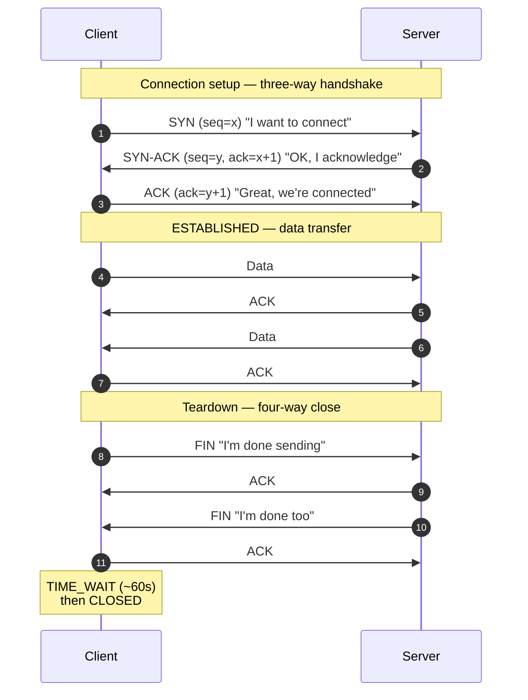
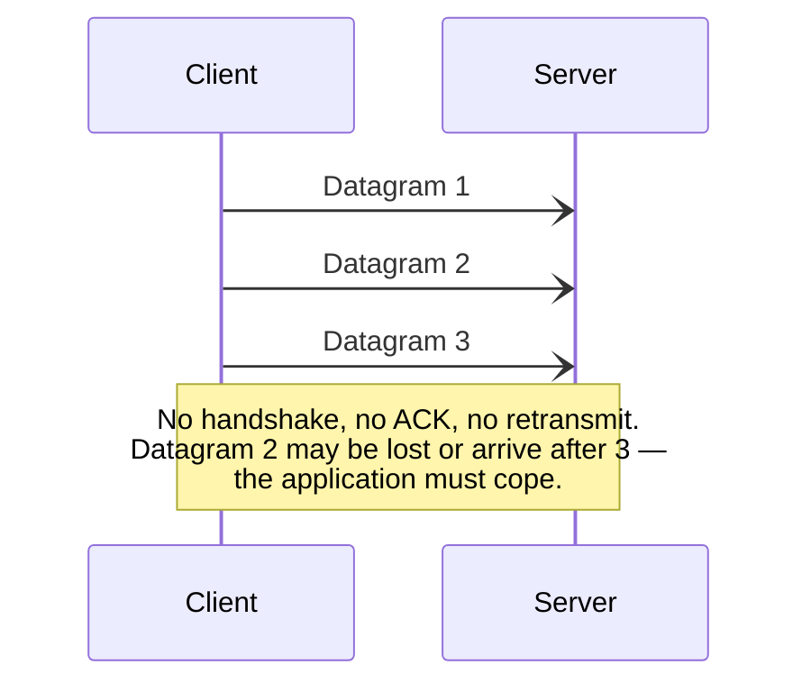
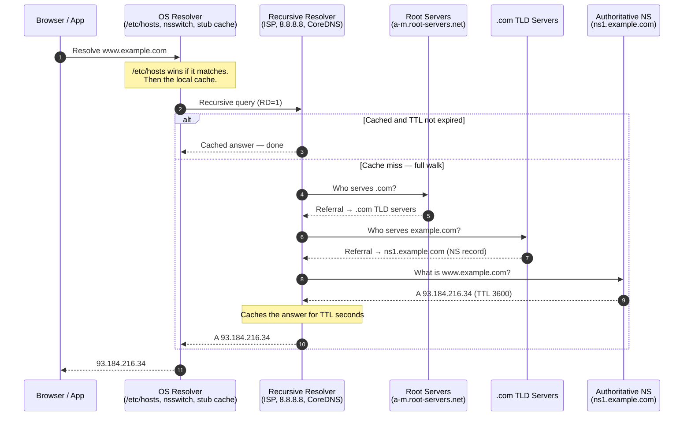
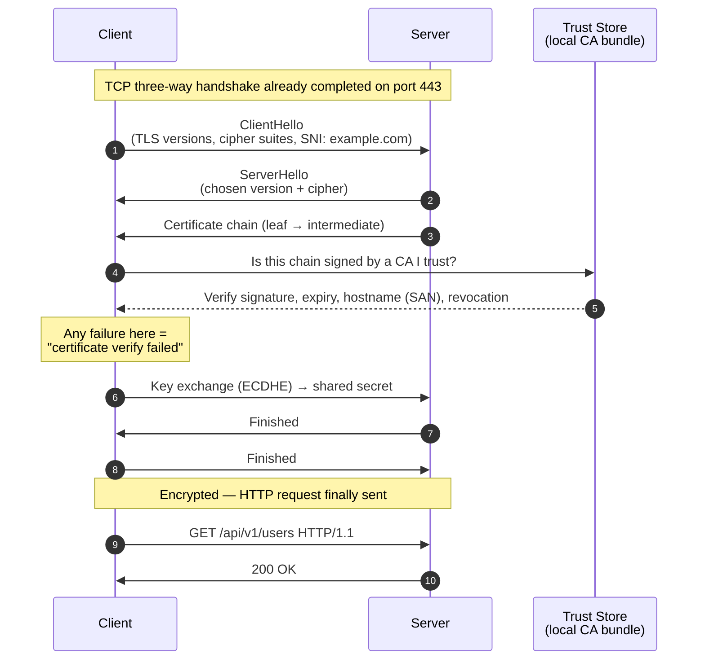
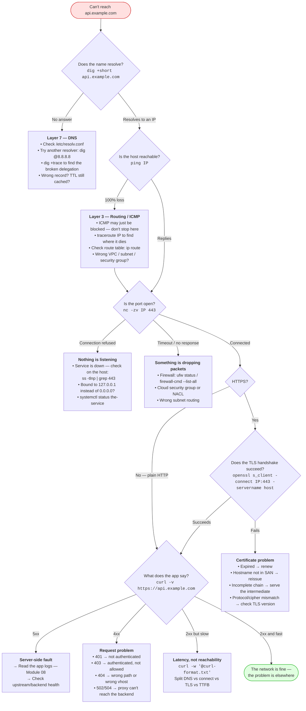
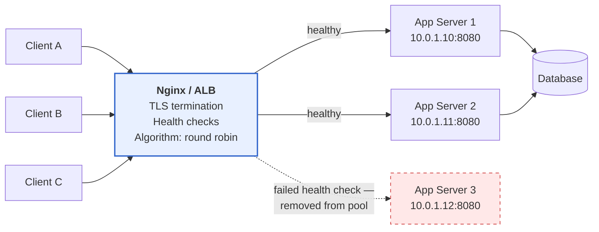

# Module 02: Networking

> *"If you don't understand networking, every single production issue will confuse you. Networking is the circulatory system of every modern application."*

---

>**Command reference**: [`cheatsheet.md`](./cheatsheet.md) — every command in this module, grouped by task, with the gotchas.
>
>**Cross-module lookup**: [Quick Reference](../QUICK-REFERENCE.md)

---

## Why This Module Matters

**Every DevOps problem is a networking problem — until proven otherwise.**

When a service is "down," when containers can't talk to each other, when a deployment fails, when latency spikes, when a database connection times out — the first thing you investigate is the network.

**In real-world DevOps work**, you will:

- Debug "connection refused" and "connection timed out" errors
- Configure DNS records for domain management
- Set up reverse proxies (Nginx) to route traffic
- Configure firewalls and security groups in the cloud
- Troubleshoot container networking in Docker and Kubernetes
- Understand load balancers, CDNs, and TLS certificates

Without networking skills, you are **blind** to most production issues.

---

## Table of Contents

1. [The OSI Model — Simplified](#1-the-osi-model--simplified)
2. [IP Addressing and Subnets](#2-ip-addressing-and-subnets)
3. [TCP vs UDP](#3-tcp-vs-udp)
4. [Ports — The Application Doorway](#4-ports--the-application-doorway)
5. [DNS — The Internet's Phone Book](#5-dns--the-internets-phone-book)
6. [HTTP/HTTPS — The Language of the Web](#6-httphttps--the-language-of-the-web)
7. [Firewalls and Network Security](#7-firewalls-and-network-security)
8. [Network Troubleshooting Tools](#8-network-troubleshooting-tools)
9. [Reverse Proxies and Load Balancers](#9-reverse-proxies-and-load-balancers)
10. [Common Mistakes and Anti-Patterns](#10-common-mistakes-and-anti-patterns)
11. [Debugging Mindset](#11-debugging-mindset)
12. [Security Considerations](#12-security-considerations)
13. [Interview Insights](#13-interview-insights)

---

## 1. The OSI Model — Simplified

You don't need to memorize all 7 layers for DevOps. You need to understand what happens **in practice**.

### The Practical Layers

```
Layer 7 — Application     HTTP, HTTPS, DNS, SSH, SMTP
                          "What protocol are we using?"
                          
Layer 4 — Transport        TCP, UDP
                          "How do we deliver data reliably?"
                          "What PORT are we connecting to?"
                          
Layer 3 — Network          IP (IPv4, IPv6)
                          "What IP ADDRESS are we sending to?"
                          "How does data get ROUTED?"
                          
Layer 2 — Data Link        Ethernet, MAC addresses
                          "How do devices talk on the same network?"
                          
Layer 1 — Physical         Cables, WiFi, hardware
                          "Is the cable plugged in?"
```

### How Data Actually Flows

When you type `https://api.example.com/users` in your browser:

```
Your Browser
    │
    ▼
1. DNS Resolution (Layer 7)
   "api.example.com" → 93.184.216.34
    │
    ▼
2. TCP Connection (Layer 4)
   Three-way handshake: SYN → SYN-ACK → ACK
   Connect to port 443 (HTTPS)
    │
    ▼
3. TLS Handshake (Layer 6/7)
   Verify certificate, establish encrypted connection
    │
    ▼
4. HTTP Request (Layer 7)
   GET /users HTTP/1.1
   Host: api.example.com
    │
    ▼
5. IP Routing (Layer 3)
   Packet travels through routers to reach 93.184.216.34
    │
    ▼
6. Server processes request
    │
    ▼
7. HTTP Response travels back through the same layers
```

> ** DevOps Impact**: When troubleshooting, you work **bottom-up**. Can you ping it? (Layer 3) Can you connect to the port? (Layer 4) Is the HTTP response correct? (Layer 7)

---

## 2. IP Addressing and Subnets

### IPv4 Addresses

```
An IPv4 address: 192.168.1.100
                 ├─────┤ ├──┤
                 Network  Host
                 Portion  Portion (depends on subnet mask)
```

### Private vs Public IP Ranges

| Range | Class | Use | Example |
|-------|-------|-----|---------|
| `10.0.0.0/8` | Class A | Large private networks, cloud VPCs | `10.0.1.50` |
| `172.16.0.0/12` | Class B | Docker default bridge network | `172.17.0.2` |
| `192.168.0.0/16` | Class C | Home/office networks | `192.168.1.100` |
| `127.0.0.0/8` | Loopback | localhost (this machine) | `127.0.0.1` |
| Everything else | Public | Internet-routable | `93.184.216.34` |

### Subnet Masks (CIDR Notation)

```
CIDR     Subnet Mask       Usable Hosts    Common Use
/32      255.255.255.255   1               Single host
/28      255.255.255.240   14              Small subnet (e.g. DMZ)
/24      255.255.255.0     254             Small network, typical for subnets
/20      255.255.240.0     4,094           Medium subnet in cloud VPCs
/16      255.255.0.0       65,534          Medium network
/8       255.0.0.0         16,777,214      Large network
```

### How to Calculate CIDR — The Simple Way

```
The number after the / tells you how many bits are used for the NETWORK.
The remaining bits are for HOSTS.

IPv4 = 32 bits total
Host bits = 32 - CIDR prefix
Total addresses = 2^(host bits)
Usable addresses = Total - 2 (network address + broadcast address)

EXAMPLES:
  /24 → 32-24 = 8 host bits → 2^8 = 256 total → 254 usable
  /28 → 32-28 = 4 host bits → 2^4 = 16 total  → 14 usable
  /20 → 32-20 = 12 host bits → 2^12 = 4096 total → 4094 usable
  /16 → 32-16 = 16 host bits → 2^16 = 65536 total → 65534 usable
```

### Calculating the IP Range from a CIDR Block

```
Given: 192.168.1.0/24

  Network address:   192.168.1.0     (first IP — identifies the network)
  Gateway address:   192.168.1.1     (usually the first usable IP — the router)
  First usable host: 192.168.1.2     (first IP you can assign to a device)
  Last usable host:  192.168.1.254   (last IP you can assign)
  Broadcast address: 192.168.1.255   (last IP — sends to all hosts)
  Total usable:      253 addresses   (254 minus the gateway)

Given: 10.0.0.0/20

  Network address:   10.0.0.0
  Gateway address:   10.0.0.1
  First usable host: 10.0.0.2
  Last usable host:  10.0.15.254
  Broadcast address: 10.0.15.255
  Total usable:      4093 addresses

  How to find the last IP:
    /20 = 2^(32-20) = 4096 addresses
    Start: 10.0.0.0
    End:   10.0.0.0 + 4095 = 10.0.15.255
    (0.0 + 4095 → 15.255, because 4095 = 15×256 + 255)

   In AWS, the gateway, DNS, and a reserved IP reduce usable
     hosts by 5 per subnet (AWS reserves .0, .1, .2, .3, and broadcast)
```

**CIDR in practice:**

```bash
# A /24 network: 192.168.1.0/24
# Network:   192.168.1.0
# Gateway:   192.168.1.1    (router — your default route points here)
# Usable:    192.168.1.2 to 192.168.1.254
# Broadcast: 192.168.1.255
# Total usable: 253 addresses (254 minus gateway)

# In AWS: You create a VPC with 10.0.0.0/16 (65k addresses)
# Then create subnets like:
#   10.0.1.0/24  (public subnet - 251 usable hosts after AWS reserves)
#   10.0.2.0/24  (private subnet - 251 usable hosts)
#   10.0.3.0/24  (database subnet - 251 usable hosts)

# Quick mental math for common sizes:
#   /24 = 256 IPs (254 usable)  — "a small subnet"
#   /20 = 4096 IPs              — "a medium VPC subnet"
#   /16 = 65536 IPs             — "a whole VPC"
```

### Check Your IP Information

```bash
# Your IP addresses
ip addr show
# or shorter
ip a

# Just IPv4
ip -4 addr show

# Your default gateway (router)
ip route show
# default via 192.168.1.1 dev eth0 ...

# Your DNS servers
cat /etc/resolv.conf
```

---

## 3. TCP vs UDP

### TCP — Transmission Control Protocol

TCP is reliable delivery — like registered mail. Every connection starts with a **three-way handshake** and ends with an orderly teardown.



**Features:**

-Guaranteed delivery (retransmits lost packets)
-Ordered delivery (packets arrive in order)
-Error checking (checksums)
-Flow control (doesn't overwhelm receiver)

**Used by**: HTTP, HTTPS, SSH, FTP, SMTP, databases

> ** DevOps Impact**: That `TIME_WAIT` state at the end is why a busy load balancer can exhaust local ports. If `ss -tan | grep TIME-WAIT | wc -l` returns tens of thousands, you're looking at connection churn — fix it with keep-alive/connection pooling, not by tuning kernel timeouts first.

### UDP — User Datagram Protocol

UDP is fast delivery with no guarantees — like dropping postcards in a mailbox. No handshake, no acknowledgement, no retransmission.



**Features:**

-Fast (no handshake, no waiting for ACKs)
-Low overhead
-No delivery guarantee
-No ordering guarantee

**Used by**: DNS (queries), video streaming, gaming, VoIP, monitoring (StatsD)

### Why This Matters for DevOps

| Scenario | Protocol | Why |
|----------|----------|-----|
| Web traffic | TCP | Reliability required for page loads |
| Database connections | TCP | Data integrity is critical |
| DNS queries | UDP | Speed matters, small packets |
| Prometheus metrics | TCP (HTTP) | Need complete metric data |
| Log shipping (syslog) | UDP or TCP | UDP for speed, TCP for reliability |
| Container health checks | TCP | Need to know if service is alive |

---

## 4. Ports — The Application Doorway

An IP address gets you to a machine. A port gets you to a **specific service** on that machine.

### Well-Known Ports

| Port | Service | DevOps Use |
|------|---------|------------|
| **22** | SSH | Remote server administration |
| **25** | SMTP | Email sending |
| **53** | DNS | Name resolution |
| **80** | HTTP | Web traffic (unencrypted) |
| **443** | HTTPS | Web traffic (encrypted) — **always use this** |
| **3000** | Grafana (default) | Monitoring dashboards |
| **3306** | MySQL | Database |
| **5432** | PostgreSQL | Database |
| **5601** | Kibana | Log visualization |
| **6379** | Redis | Caching |
| **8080** | HTTP (alt) | Java apps, development servers |
| **8443** | HTTPS (alt) | Alternative HTTPS |
| **9090** | Prometheus | Metric collection |
| **9200** | Elasticsearch | Search/logging |
| **9090** | Prometheus | Metrics |
| **27017** | MongoDB | NoSQL database |

### Checking Open Ports

```bash
# List all listening ports
ss -tlnp
# t = TCP
# l = Listening
# n = Numeric (don't resolve names)
# p = Show process

# Example output:
# State  Recv-Q Send-Q  Local Address:Port  Peer Address:Port  Process
# LISTEN 0      511        0.0.0.0:80         0.0.0.0:*       users:(("nginx",...))
# LISTEN 0      128        0.0.0.0:22         0.0.0.0:*       users:(("sshd",...))

# Check if a specific port is open
ss -tlnp | grep :80

# Alternative: netstat (older, but still widely used)
sudo netstat -tlnp

# Check what's using a specific port
sudo lsof -i :8080
```

---

## 5. DNS — The Internet's Phone Book

### How DNS Works

Every name lookup walks a cache chain first. Only a **cache miss** goes out to the internet — and that path is a *referral chain*, not a single question.



> ** DevOps Impact**: Each box is a place a lookup can break *and* a place a stale answer can hide. When "the DNS change didn't take effect," identify **which** cache is stale: your browser, the OS stub, the recursive resolver, or a downstream CDN. `dig +trace` bypasses the recursive cache and walks the chain yourself — that's how you tell "record is wrong" from "record is right but cached."

### DNS Record Types

| Type | Purpose | Example | DevOps Use |
|------|---------|---------|------------|
| **A** | Domain → IPv4 address | `example.com → 93.184.216.34` | Point domain to server |
| **AAAA** | Domain → IPv6 address | `example.com → 2606:2800:...` | IPv6 support |
| **CNAME** | Domain → another domain | `www.example.com → example.com` | Aliases, CDN setup |
| **MX** | Mail server for domain | `example.com → mail.example.com` | Email routing |
| **TXT** | Arbitrary text | `example.com → "v=spf1 ..."` | SPF, DKIM, domain verification |
| **NS** | Nameserver for domain | `example.com → ns1.example.com` | DNS delegation |
| **SRV** | Service location | `_sip._tcp.example.com → ...` | Service discovery |
| **PTR** | IP → Domain (reverse) | `34.216.184.93 → example.com` | Reverse DNS lookups |

### DNS Tools

```bash
# Resolve a domain
dig example.com
# Look for the ANSWER SECTION:
# example.com.  3600  IN  A  93.184.216.34

# Short format
dig +short example.com
# Output: 93.184.216.34

# Specific record type
dig example.com MX
dig example.com NS
dig example.com TXT

# Trace the full resolution path
dig +trace example.com

# Reverse DNS lookup
dig -x 8.8.8.8

# Alternative: nslookup
nslookup example.com

# Alternative: host (simplest)
host example.com

# Check local DNS configuration
cat /etc/resolv.conf

# The local hosts file (overrides DNS)
cat /etc/hosts
# 127.0.0.1    localhost
# you can add: 192.168.1.50  myapp.local
```

### DNS Caching and TTL

```bash
# TTL (Time To Live) controls how long a DNS record is cached
dig example.com | grep -A 1 "ANSWER SECTION"
# example.com.  3600  IN  A  93.184.216.34
#               ^^^^
#               TTL in seconds (3600 = 1 hour)

# When changing DNS records:
# 1. Lower TTL to 60 seconds (before the change)
# 2. Wait for old TTL to expire
# 3. Make the DNS change
# 4. Verify with dig
# 5. Raise TTL back to normal (300-3600 seconds)
```

### `/etc/hosts` — Local DNS Override

```bash
# This file is checked BEFORE DNS servers
# Useful for testing, development, and blocking

# Example: Test a new server before changing DNS
echo "10.0.1.50 staging.myapp.com" | sudo tee -a /etc/hosts

# Now "staging.myapp.com" resolves to 10.0.1.50 on this machine only
ping staging.myapp.com

# Remove when done
sudo sed -i '/staging.myapp.com/d' /etc/hosts
```

---

## 6. HTTP/HTTPS — The Language of the Web

### HTTP Request/Response

```
CLIENT REQUEST:
┌────────────────────────────────────────┐
│ GET /api/v1/users HTTP/1.1             │  ← Method + Path + Version
│ Host: api.example.com                  │  ← Required header
│ Authorization: Bearer eyJhbGc...       │  ← Auth token
│ Accept: application/json               │  ← Desired response format
│ User-Agent: curl/7.88.1               │  ← Client info
│                                        │
│ [empty body for GET requests]          │
└────────────────────────────────────────┘

SERVER RESPONSE:
┌────────────────────────────────────────┐
│ HTTP/1.1 200 OK                        │  ← Status code
│ Content-Type: application/json         │  ← Response format
│ Content-Length: 256                     │  ← Body size
│ X-Request-Id: abc-123                  │  ← Tracking header
│                                        │
│ {"users": [{"id": 1, "name": "..."}]} │  ← Body
└────────────────────────────────────────┘
```

### HTTP Methods

| Method | Purpose | Idempotent? | Example |
|--------|---------|-------------|---------|
| **GET** | Read data | Yes | `GET /users` |
| **POST** | Create data | No | `POST /users` (with body) |
| **PUT** | Replace data | Yes | `PUT /users/1` (full update) |
| **PATCH** | Partial update | Not always | `PATCH /users/1` (partial) |
| **DELETE** | Remove data | Yes | `DELETE /users/1` |
| **HEAD** | Get headers only | Yes | Health checks |
| **OPTIONS** | Get allowed methods | Yes | CORS preflight |

### CORS — Cross-Origin Resource Sharing

CORS errors are one of the most common issues when debugging frontend-to-API communication. Understanding CORS saves hours of frustration.

```
THE PROBLEM — In Simple Terms:

  Your frontend is served from:     https://myapp.com
  Your API is running on:           https://api.myapp.com

  The browser says: "These are DIFFERENT origins (different subdomain).
  I won't let the frontend talk to the API unless the API explicitly
  says it's OK."

  This is a BROWSER security feature. It does NOT affect curl, Postman,
  or server-to-server calls. Only browsers enforce CORS.

REAL-WORLD ANALOGY:

  Imagine a building (browser) with a strict receptionist (CORS policy).
  Your app (frontend) lives on Floor 3. It wants to call the kitchen
  (API) on Floor 7.

  Receptionist: "Floor 7, do you allow requests from Floor 3?"
  Kitchen: "Yes, Floor 3 is allowed." → Request goes through.
  Kitchen: (silence or "No.") → Request BLOCKED.

  The receptionist (browser) enforces the rule, but it's the kitchen
  (API server) that sets the policy via response headers.

HOW IT WORKS:

  1. Browser sends a PREFLIGHT request (OPTIONS) before the actual request:
     OPTIONS /api/data
     Origin: https://myapp.com
     Access-Control-Request-Method: POST

  2. Server responds with CORS headers:
     Access-Control-Allow-Origin: https://myapp.com
     Access-Control-Allow-Methods: GET, POST, PUT
     Access-Control-Allow-Headers: Content-Type, Authorization

  3. If headers match → browser sends the real request.
     If headers missing/wrong → browser blocks it. You see:
     "Access to fetch at 'https://api.myapp.com/data' from origin
      'https://myapp.com' has been blocked by CORS policy"
```

```bash
# Debug CORS: check what headers the server returns
curl -v -X OPTIONS https://api.myapp.com/data \
  -H "Origin: https://myapp.com" \
  -H "Access-Control-Request-Method: POST" 2>&1 | grep -i 'access-control'

# You should see:
# Access-Control-Allow-Origin: https://myapp.com
# Access-Control-Allow-Methods: GET, POST, PUT
# If these headers are MISSING → that's your CORS issue
```

```nginx
# Fix CORS in Nginx (add to your server or location block)
add_header 'Access-Control-Allow-Origin' 'https://myapp.com' always;
add_header 'Access-Control-Allow-Methods' 'GET, POST, PUT, DELETE, OPTIONS' always;
add_header 'Access-Control-Allow-Headers' 'Content-Type, Authorization' always;

# Handle preflight OPTIONS requests
if ($request_method = 'OPTIONS') {
    add_header 'Access-Control-Allow-Origin' 'https://myapp.com';
    add_header 'Access-Control-Allow-Methods' 'GET, POST, PUT, DELETE, OPTIONS';
    add_header 'Access-Control-Allow-Headers' 'Content-Type, Authorization';
    add_header 'Access-Control-Max-Age' 86400;  # Cache preflight for 24h
    return 204;
}
```

```
CORS DEBUGGING CHECKLIST:
   Error only in the browser, works in curl/Postman?
     → It's definitely a CORS issue (browsers enforce it, tools don't)
   Missing Access-Control-Allow-Origin header in response?
     → Server needs to add CORS headers
   Origin mismatch (http vs https, www vs non-www)?
     → Origins must match exactly, including protocol and subdomain
   Custom headers (Authorization) being blocked?
     → Server must list them in Access-Control-Allow-Headers
   Using Access-Control-Allow-Origin: * with credentials?
     → Wildcard * doesn't work with cookies/auth; must specify exact origin
```

### HTTP Status Codes (Memorize These!)

```
1xx — Informational
2xx — Success
  200 OK                    — Request succeeded
  201 Created               — Resource created (POST response)
  204 No Content            — Success, no body (DELETE response)

3xx — Redirection
  301 Moved Permanently     — URL changed, update your links
  302 Found                 — Temporary redirect
  304 Not Modified          — Use your cached version

4xx — Client Error (YOUR fault)
  400 Bad Request           — Malformed request
  401 Unauthorized          — Not authenticated (need to log in)
  403 Forbidden             — Authenticated but no permission
  404 Not Found             — Resource doesn't exist
  405 Method Not Allowed    — Wrong HTTP method
  408 Request Timeout       — Client took too long
  413 Payload Too Large     — Request body exceeds server limit (file upload, large JSON)
  429 Too Many Requests     — Rate limited

5xx — Server Error (SERVER's fault)
  500 Internal Server Error — Generic server error
  502 Bad Gateway           — Upstream server returned invalid response
  503 Service Unavailable   — Server overloaded or in maintenance
  504 Gateway Timeout       — Upstream server didn't respond in time
```

### Making HTTP Requests with curl

```bash
# Basic GET request
curl http://httpbin.org/get

# GET with verbose output (shows headers — ESSENTIAL for debugging)
curl -v http://httpbin.org/get

# GET with specific headers
curl -H "Authorization: Bearer mytoken" http://httpbin.org/headers

# POST with JSON body
curl -X POST http://httpbin.org/post \
  -H "Content-Type: application/json" \
  -d '{"name": "DevOps", "type": "handbook"}'

# Just get the response headers (HEAD request)
curl -I http://httpbin.org/get
# -I sends a HEAD request — returns only headers, no body
# Quick way to check status code, content-type, cache headers, CORS headers
# Example output:
#   HTTP/1.1 200 OK
#   Content-Type: application/json
#   Content-Length: 256

# Get just the status code (useful in scripts and health checks)
curl -s -o /dev/null -w "%{http_code}" http://httpbin.org/get
# Output: 200

# Combine -I with -s for clean status code checks
curl -s -I http://httpbin.org/get | head -1
# Output: HTTP/1.1 200 OK

# Check status code of a redirect without following it
curl -s -I http://httpbin.org/redirect/1 | head -1
# Output: HTTP/1.1 302 FOUND

# Follow redirects
curl -L http://httpbin.org/redirect/3

# Download a file
curl -O https://example.com/file.tar.gz

# Timeout (important for health checks)
curl --connect-timeout 5 --max-time 10 http://httpbin.org/delay/30
```

### HTTPS and TLS

**HTTPS = HTTP + TLS (Transport Layer Security).** TLS runs *on top of* an already-established TCP connection — so a TLS error always means the TCP handshake already succeeded.



> ** DevOps Impact**: Three failures look identical to a user and are completely different to you. **Expired certificate** → renew. **Hostname mismatch** → the SAN list doesn't include the name you requested (common after adding a new subdomain to a load balancer). **Incomplete chain** → the server didn't send the intermediate; it works in your browser (which caches intermediates) but fails from `curl` and inside containers. `openssl s_client -connect host:443 -servername host` tells you which one it is.

```bash
# Check TLS certificate details
openssl s_client -connect example.com:443 -brief

# Check certificate expiry
echo | openssl s_client -connect example.com:443 2>/dev/null | openssl x509 -noout -dates

# Check full certificate chain
curl -vI https://example.com 2>&1 | grep -A 5 "SSL certificate"
```

---

## 7. Firewalls and Network Security

### Host Firewalls: UFW and firewalld

```bash
# Debian/Ubuntu commonly uses UFW
# Check status
sudo ufw status verbose

# IMPORTANT: Enable SSH BEFORE enabling the firewall!
sudo ufw allow 22/tcp    # SSH
sudo ufw enable

# Common rules
sudo ufw allow 80/tcp     # HTTP
sudo ufw allow 443/tcp    # HTTPS
sudo ufw allow 8080/tcp   # Application port

# Allow from specific IP only
sudo ufw allow from 10.0.1.0/24 to any port 5432   # PostgreSQL from internal network only

# Deny a port
sudo ufw deny 3306/tcp    # Block MySQL from outside

# Delete a rule
sudo ufw delete allow 8080/tcp

# Reset all rules
sudo ufw reset

# Best practice: Default deny incoming
sudo ufw default deny incoming
sudo ufw default allow outgoing

# RHEL-compatible systems commonly use firewalld
sudo systemctl enable --now firewalld

# Common rules
sudo firewall-cmd --permanent --add-service=ssh
sudo firewall-cmd --permanent --add-service=http
sudo firewall-cmd --permanent --add-service=https
sudo firewall-cmd --permanent --add-port=8080/tcp

# Allow PostgreSQL from an internal network only
sudo firewall-cmd --permanent --add-rich-rule='rule family="ipv4" source address="10.0.1.0/24" port protocol="tcp" port="5432" accept'

# Remove a rule and reload
sudo firewall-cmd --permanent --remove-port=8080/tcp
sudo firewall-cmd --reload
sudo firewall-cmd --list-all
```

### iptables (Lower Level — Know the Concept)

```bash
# List all rules
sudo iptables -L -n -v

# iptables uses chains:
# INPUT    — Traffic coming IN to the server
# OUTPUT   — Traffic going OUT from the server
# FORWARD  — Traffic passing THROUGH the server

# Docker heavily uses iptables for container networking
# That's why you sometimes see Docker-related rules in iptables
sudo iptables -L -n -v | head -30
```

### Network Security Principles

1. **Default deny** — Block everything, then allow what's needed
2. **Least privilege** — Only open ports that are required
3. **Defense in depth** — Firewall + application security + encryption
4. **Encrypt in transit** — Use HTTPS/TLS everywhere
5. **Segment networks** — Databases should NOT be on public networks

---

## 8. Network Troubleshooting Tools

### The Troubleshooting Ladder

**"I can't reach the server!"** is never one problem. Climb the layers bottom-up — each rung eliminates half the possible causes. Never skip a rung because you "know" it works.



> ** The one rule**: *Connection refused* and *connection timeout* mean completely different things. **Refused** = a machine answered and said "nothing here" — the packet arrived, so routing and firewalls are fine; the service is down or bound to the wrong interface. **Timeout** = nobody answered at all — a firewall, security group, or route is silently dropping you. Reading that distinction correctly saves hours.

### ping — Basic Connectivity

```bash
# Test if a host is reachable
ping -c 4 8.8.8.8
# -c 4 = send 4 packets (default is infinite)

# What to look for:
# - "Request timed out" = host is unreachable or blocking ICMP
# - "Destination host unreachable" = routing problem
# - High latency (>100ms for same region) = network issue
# - Packet loss > 0% = network instability

# Note: Many servers block ICMP (ping)
# A failed ping DOESN'T always mean the service is down!
```

### traceroute — Path Discovery

```bash
# See the network path to a destination
traceroute 8.8.8.8
# or
tracepath 8.8.8.8

# Each line is a "hop" (router along the path)
# High latency on a specific hop = that router/link is the bottleneck
# "* * *" = that router doesn't respond to traceroute (not necessarily a problem)
```

### netcat (nc) — Swiss Army Knife

```bash
# Test if a port is open (most useful)
nc -zv 10.0.1.5 22
# Connection to 10.0.1.5 22 port [tcp/ssh] succeeded!

nc -zv 10.0.1.5 8080
# Connection refused = service not running on that port

# Scan multiple ports
nc -zv 10.0.1.5 20-25

# Create a simple TCP listener (testing)
nc -l 9999
# On another terminal: nc localhost 9999
# You can now type messages between them
```

### ss — Socket Statistics (Replaces netstat)

```bash
# All listening TCP ports
ss -tlnp

# All established connections
ss -tnp

# Connections to a specific port
ss -tnp | grep :443

# Count connections by state
ss -s

# Monitor connection states over time
watch -n 1 'ss -s'
```

### curl for Debugging

```bash
# Verbose mode — shows EVERYTHING
curl -v https://api.example.com 2>&1

# Timing breakdown (VERY useful for latency debugging)
curl -o /dev/null -s -w "\
    DNS:        %{time_namelookup}s\n\
    Connect:    %{time_connect}s\n\
    TLS:        %{time_appconnect}s\n\
    Start:      %{time_starttransfer}s\n\
    Total:      %{time_total}s\n\
    HTTP Code:  %{http_code}\n" \
    https://example.com

# Output tells you WHERE the latency is:
# DNS: 0.050s        ← DNS resolution time
# Connect: 0.120s    ← TCP connection time
# TLS: 0.250s        ← TLS handshake time
# Start: 0.380s      ← Time to first byte (server processing)
# Total: 0.450s      ← Total request time
```

---

## 9. Reverse Proxies and Load Balancers

### What Is a Reverse Proxy?

```
WITHOUT Reverse Proxy:
Internet → Server:8080 (application directly exposed)

WITH Reverse Proxy (Nginx):
Internet → Nginx:443 → Application:8080
           ├── TLS termination
           ├── Load balancing
           ├── Caching
           ├── Rate limiting
           ├── Request logging
           └── Security headers
```

### Nginx as a Reverse Proxy (Preview — Used Extensively Later)

```nginx
# /etc/nginx/sites-available/myapp
server {
    listen 80;
    server_name myapp.example.com;
    
    # Redirect HTTP to HTTPS
    return 301 https://$host$request_uri;
}

server {
    listen 443 ssl;
    server_name myapp.example.com;
    
    ssl_certificate /etc/letsencrypt/live/myapp.example.com/fullchain.pem;
    ssl_certificate_key /etc/letsencrypt/live/myapp.example.com/privkey.pem;
    
    location / {
        proxy_pass http://localhost:8080;
        proxy_set_header Host $host;
        proxy_set_header X-Real-IP $remote_addr;
        proxy_set_header X-Forwarded-For $proxy_add_x_forwarded_for;
        proxy_set_header X-Forwarded-Proto $scheme;
    }
    
    location /health {
        proxy_pass http://localhost:8080/health;
        access_log off;  # Don't log health checks
    }
}
```

### Load Balancing Concepts



The health check is the whole point: the load balancer keeps a **pool** of backends and continuously removes the ones that stop answering. A load balancer without health checks is just a slower single point of failure.

**Load Balancing Algorithms:**

| Algorithm | How It Works | Best For |
|-----------|-------------|----------|
| **Round Robin** | Rotate through servers equally | Servers with similar specs |
| **Least Connections** | Send to server with fewest active connections | Varying request durations |
| **IP Hash** | Same client IP always goes to same server | Session stickiness |
| **Weighted** | More powerful servers get more traffic | Mixed server specs |

---

## 10. Common Mistakes and Anti-Patterns

### Not Understanding the Difference Between 401 and 403

```
401 Unauthorized = "Who are you?" (not authenticated)
  → Solution: Provide credentials
  
403 Forbidden = "I know who you are, but you're not allowed" (not authorized)
  → Solution: Request proper permissions
```

### Forgetting to Allow SSH Before Enabling Firewall

```bash
# THIS CAN LOCK YOU OUT OF YOUR SERVER:
sudo ufw enable         # Blocks everything, including SSH!
sudo firewall-cmd --remove-service=ssh --permanent && sudo firewall-cmd --reload
# You can never SSH back in. Server is lost.

# CORRECT ORDER:
sudo ufw allow 22/tcp   # Allow SSH first!
sudo ufw enable          # Then enable firewall
sudo firewall-cmd --permanent --add-service=ssh && sudo firewall-cmd --reload
```

### Using HTTP for Sensitive Data

```
NEVER transmit passwords, tokens, or PII over plain HTTP.
ALWAYS use HTTPS. No exceptions.
Even internal services should use TLS in production.
```

### Exposing Database Ports to the Internet

```bash
# BAD: Database accessible from anywhere
sudo ufw allow 5432/tcp
sudo firewall-cmd --permanent --add-port=5432/tcp

# GOOD: Database only from application servers
sudo ufw allow from 10.0.1.0/24 to any port 5432
sudo firewall-cmd --permanent --add-rich-rule='rule family="ipv4" source address="10.0.1.0/24" port protocol="tcp" port="5432" accept'
```

### Hardcoding IP Addresses

```bash
# BAD: 
curl http://10.0.1.50:8080/api/users

# GOOD: Use DNS names
curl http://api.internal.myapp.com:8080/api/users
# IPs change; DNS names are stable and updatable
```

---

## 11. Debugging Mindset

### The Network Debugging Playbook

```
"Can't connect to the service!"
        │
        ▼
1. Is DNS resolving correctly?
   dig service.example.com
   → Does the IP look right?
        │
        ▼
2. Can you reach the IP?
   ping <IP>
   → Timeout? Network/firewall issue
        │
        ▼
3. Can you reach the PORT?
   nc -zv <IP> <PORT>
   → Connection refused? Service not running
   → Timeout? Firewall blocking the port
        │
        ▼
4. Does the SERVICE respond correctly?
   curl -v http://<IP>:<PORT>/health
   → 5xx? Application error
   → 4xx? Auth or routing issue
        │
        ▼
5. Is the APPLICATION healthy?
   Check application logs
   Check resource usage (CPU, memory, disk)
   Check dependent services (database, cache)
```

### Common Error Messages and What They Mean

| Error | Layer | Meaning | Fix |
|-------|-------|---------|-----|
| `Name or service not known` | DNS | DNS resolution failed | Check DNS config, `/etc/hosts`, domain spelling |
| `Connection refused` | Layer 4 | Port is not accepting connections | Service not running, wrong port, binding to wrong interface |
| `Connection timed out` | Layer 3/4 | No response from server | Firewall blocking, server down, wrong IP |
| `502 Bad Gateway` | Layer 7 | Reverse proxy can't reach upstream | Backend app is down or unresponsive |
| `504 Gateway Timeout` | Layer 7 | Upstream took too long to respond | Backend app is overloaded, increase timeouts |
| `SSL: certificate has expired` | TLS | TLS certificate expired | Renew the certificate |

---

## 12. Security Considerations

>Networking security is fundamental. Most breaches involve network-layer vulnerabilities.

### Key Principles

1. **Encrypt everything** — HTTPS everywhere, even internally
2. **Default deny firewall** — Only open what's explicitly needed
3. **Network segmentation** — Public, private, and database subnets
4. **Monitor traffic** — Know what's normal so you can spot anomalies
5. **Patch regularly** — Network devices and OS get security updates

### Security Headers (HTTP)

```nginx
# Essential security headers in Nginx
add_header X-Frame-Options "SAMEORIGIN" always;
add_header X-Content-Type-Options "nosniff" always;
add_header X-XSS-Protection "1; mode=block" always;
add_header Strict-Transport-Security "max-age=31536000; includeSubDomains" always;
add_header Content-Security-Policy "default-src 'self'" always;
add_header Referrer-Policy "strict-origin-when-cross-origin" always;
```

---

## 13. Interview Insights

### Frequently Asked Questions

**Q: What happens when you type `google.com` in your browser?**
>
> 1. Browser checks its DNS cache
> 2. OS checks `/etc/hosts`, then DNS resolver cache
> 3. DNS query to configured nameserver (recursive resolution)
> 4. Root → TLD (.com) → Authoritative NS → A record returned
> 5. TCP three-way handshake (SYN → SYN-ACK → ACK)
> 6. TLS handshake (certificate verification, key exchange)
> 7. HTTP GET request sent
> 8. Server processes request, returns HTML
> 9. Browser parses HTML, requests additional resources (CSS, JS, images)
> 10. Page renders

**Q: Explain the difference between TCP and UDP.**
> TCP is connection-oriented (three-way handshake), reliable (guarantees delivery and ordering), and used for HTTP, SSH, databases. UDP is connectionless, faster but unreliable (no delivery guarantees), used for DNS queries, video streaming, and monitoring.

**Q: What is a subnet, and why is it used?**
> A subnet divides a larger network into smaller, isolated segments. It's used for security (isolating sensitive systems like databases), traffic management (reducing broadcast domains), and organization (grouping related services). In cloud, you create public subnets for load balancers and private subnets for applications and databases.

**Q: How do you troubleshoot "connection refused"?**
> "Connection refused" means the server received the connection attempt but actively rejected it. Check: Is the service running? (`systemctl status`). Is it listening on the correct port? (`ss -tlnp`). Is it binding to the right interface? (0.0.0.0 vs 127.0.0.1). Is a firewall allowing the port?

**Q: What's the difference between a forward proxy and a reverse proxy?**
> A forward proxy sits in front of clients (outbound traffic control, anonymity, caching). A reverse proxy sits in front of servers (load balancing, SSL termination, caching, security). Nginx as a reverse proxy is the standard DevOps pattern.

### Scenario-Based Questions

**Q: Users report the website is slow for the past hour. How do you investigate?**
>
> 1. Check monitoring dashboards for latency/error spikes
> 2. Use curl timing to pinpoint where latency is (DNS? TCP? TLS? Server?)
> 3. Check server resources (CPU, memory, disk, network)
> 4. Check application logs for errors or slow queries
> 5. Check upstream dependencies (database, APIs, cache)
> 6. Check for recent deployments or config changes
> 7. Check CDN/DNS if the issue is regional

**Q: Your Nginx returns 502 Bad Gateway. What do you do?**
> 502 means Nginx can't reach the backend. Check: Is the backend process running? (`ps`, `systemctl status`). Is it on the correct port? (`ss -tlnp`). Can Nginx reach it? (`curl -v http://localhost:8080`). Check Nginx error logs (`/var/log/nginx/error.log`). Check backend application logs.

---

## Labs and Projects

Read the sections above first, then work through these **in order**. Every lab ends with a  **Break It** section — those are not optional; they are where the debugging skill actually comes from.

| # | Lab | What you'll do |
|---|-----|----------------|
| 1 | **[DNS Deep Dive](./labs/lab-01-dns-deep-dive.md)** | Master DNS resolution, understand how domain names work in practice, and learn to diagnose the most common networking issue in DevOps: DNS failures. |
| 2 | **[TCP, Ports & Connectivity Testing](./labs/lab-02-tcp-ports-connectivity.md)** | Master TCP connectivity testing, port scanning, and the debugging techniques you'll use daily to diagnose "I can't connect to X" issues in production. |
| 3 | **[Nginx Reverse Proxy Setup](./labs/lab-03-nginx-reverse-proxy.md)** | Set up Nginx as a reverse proxy — the standard production pattern used in nearly every web deployment. |

**Portfolio project:**

- [Project: DNS and HTTP Troubleshooting Runbook](./projects/project-01-network-troubleshooting-runbook.md) — Create a practical runbook for diagnosing why a user cannot reach a web service.

**Reference code** for every lab: [`code/`](./code/) — real files, validated in CI.

---

## Self-Check

Answer these from memory before you expand them. If more than two give you trouble, re-read the sections they come from — the labs assume this material is solid.

<details>
<summary><strong>1. How many usable host addresses does a `/24` give you, and a `/16`?</strong></summary>

254 and 65,534 — the total minus the network and broadcast addresses. In AWS subtract a few more: the provider reserves the first four addresses and the last one in every subnet.

</details>

<details>
<summary><strong>2. "The site is down." What order do you check things in?</strong></summary>

Follow the layers, because each one isolates a different cause: does the name resolve (`dig`), does TCP connect on the port (`nc -vz`), does TLS complete (`openssl s_client -connect`), and what does the application actually answer (`curl -v`). Guessing at the top wastes the most time.

</details>

<details>
<summary><strong>3. Connection refused versus connection timeout — what does each tell you?</strong></summary>

Refused means a host answered with a RST: you reached the machine and nothing is listening on that port, so the process is down or on a different port. Timeout means your packets disappeared with no reply, which is a firewall, security group, or routing problem silently dropping them.

</details>

<details>
<summary><strong>4. Why does a backend behind a reverse proxy need `X-Forwarded-For`?</strong></summary>

Because the connection the backend sees comes from the proxy, so every client looks like the same IP — which breaks rate limits, geo logic, and audit logs. The proxy records the original address in the header. Trust that header only when the request came from your own proxy, otherwise a client can forge it.

</details>

<details>
<summary><strong>5. When would you choose UDP over TCP?</strong></summary>

When latency matters more than delivery and the application can tolerate or handle loss itself: DNS queries, metrics emission, real-time voice and video. TCP's handshake, ordering, and retransmission are what you want for HTTP, SSH, and databases.

</details>

<details>
<summary><strong>6. What can an L7 load balancer do that an L4 one cannot?</strong></summary>

L7 parses HTTP, so it can route by host and path, terminate TLS, rewrite headers, retry idempotent requests, and health-check a real endpoint. L4 only forwards IP and port — which makes it faster, protocol-agnostic, and blind to everything above the transport layer.

</details>

---

## Practical Checkpoint

Before moving on, you should be able to:

- Trace a request through DNS, TCP, HTTP, ports, firewalls, and a reverse proxy.
- Use tools such as `dig`, `curl`, `ss`, `tcpdump`, and Nginx logs to isolate connectivity issues.
- Explain whether a failure is caused by name resolution, routing, listening services, firewall rules, or application behavior.

Portfolio evidence to keep:

- DNS and HTTP troubleshooting notes.
- A working reverse proxy configuration.
- One broken-connectivity investigation with validation commands and recovery steps.

Suggested project: [DNS and HTTP Troubleshooting Runbook](./projects/project-01-network-troubleshooting-runbook.md)

---

## What's Next?

You now understand how data moves across networks and how to debug connectivity issues. Next, we learn **Git** — the version control system that tracks every change across your entire DevOps workflow.

**[Module 03: Git →](../03-git/)**

---

<div align="center">

**Module 02 Complete** 

[← Back to Linux](../01-linux/) | [ Cheat Sheet](./cheatsheet.md) | [Next: Git →](../03-git/)

</div>


## Reference
<!-- tab: Cheatsheet -->
> Command reference for network diagnosis and configuration. Concepts live in the [module README](./README.md).
> Cross-module daily commands: **[QUICK-REFERENCE.md](../QUICK-REFERENCE.md)**

**Jump to:** [Triage ladder](#the-triage-ladder) · [Interfaces & routes](#interfaces--routing) · [Sockets](#sockets--listening-ports) · [DNS](#dns) · [curl](#curl) · [Connectivity](#connectivity-testing) · [Packet capture](#packet-capture) · [Firewalls](#firewalls) · [Nginx](#nginx) · [TLS](#tls--certificates) · [Reference tables](#reference-tables)

---

## The Triage Ladder

Run these in order. Each rung eliminates a layer.

```bash
dig +short api.example.com                    # 1. DNS — does the name resolve?
ping -c 3 93.184.216.34                       # 2. L3  — is the host reachable? (ICMP may be blocked)
nc -zv 93.184.216.34 443                      # 3. L4  — is the port open?
openssl s_client -connect host:443 -servername host </dev/null   # 4. TLS
curl -v https://api.example.com/health        # 5. L7  — what does the app say?
mtr -rwc 20 93.184.216.34                     # 6. Path — where are packets being lost?
```

| Result at step 3 | Meaning | Look at |
|------------------|---------|---------|
| **Connection refused** | Packet arrived; nothing is listening | Service down, or bound to `127.0.0.1` |
| **Connection timed out** | Nobody answered at all | Firewall, security group, NACL, routing |
| **No route to host** | Local routing has no path | `ip route`, gateway, subnet config |
| **Connected** | Layers 3 and 4 are fine | Move up to TLS/HTTP |

---

## Interfaces & Routing

```bash
ip a                          # all interfaces + addresses
ip -br a                      # brief one-line-per-interface view
ip -4 a show eth0             # IPv4 only, one interface
ip link                       # link state (UP/DOWN, MTU, MAC)
ip r                          # routing table
ip route get 8.8.8.8          # which route/interface/source IP would be used  
ip neigh                      # ARP/neighbour cache
ip -s link show eth0          # per-interface error and drop counters

# Temporary changes (lost on reboot)
sudo ip a add 10.0.1.50/24 dev eth0
sudo ip link set eth0 up
sudo ip r add 10.0.2.0/24 via 10.0.1.1
sudo ip r add default via 10.0.1.1

# Persistent config
# Ubuntu:  /etc/netplan/*.yaml   → sudo netplan try && sudo netplan apply
# RHEL:    nmcli con show; sudo nmcli con mod eth0 ipv4.addresses 10.0.1.50/24
#          sudo nmcli con up eth0

hostname -I                   # all IPs of this host
hostnamectl                   # hostname + OS + kernel
cat /etc/hosts                # static overrides (checked BEFORE DNS)
cat /etc/resolv.conf          # active resolvers
resolvectl status             # systemd-resolved: per-link DNS config
```

**MTU issues** — connection opens but large transfers hang:

```bash
ip link show eth0 | grep mtu
ping -M do -s 1472 8.8.8.8    # 1472 + 28 bytes header = 1500; fails if MTU is lower
sudo ip link set eth0 mtu 1450   # common for VPN/overlay networks
```

---

## Sockets & Listening Ports

`ss` replaces the deprecated `netstat`.

```bash
ss -tlnp                      #  TCP, Listening, Numeric, Process
ss -ulnp                      # same for UDP
ss -tunap                     # TCP+UDP, all states, numeric, with process
ss -tn state established      # established connections only
ss -tn state time-wait | wc -l
ss -tp dst 10.0.1.50          # connections to a specific host
ss -tlnp 'sport = :443'       # filter by port
ss -s                         # summary counts by protocol/state
ss -tin                       # TCP internals: rtt, cwnd, retransmits

lsof -i :8080                 # what's using port 8080
lsof -i -P -n                 # all network files, numeric
sudo fuser -k 8080/tcp        # kill whatever holds port 8080  
```

| Socket state | Meaning |
|--------------|---------|
| `LISTEN` | Waiting for connections |
| `ESTAB` | Active connection |
| `SYN-SENT` | We sent SYN, no reply — firewall or dead host |
| `TIME-WAIT` | Local side closed; waits ~60s. Thousands = connection churn |
| `CLOSE-WAIT` | **Remote closed, our app hasn't** — usually an application bug/leak |
| `FIN-WAIT-2` | We closed, waiting on the peer |

>`0.0.0.0:80` = listening on all interfaces. `127.0.0.1:80` = **localhost only** — unreachable from other machines or from outside a container. This one line explains a huge share of "the service is running but I can't connect."

---

## DNS

```bash
dig example.com                          # full answer with sections
dig +short example.com                   #  just the answer
dig +short example.com MX
dig example.com NS +short
dig example.com TXT +short
dig @8.8.8.8 example.com                 # query a SPECIFIC resolver — bypasses local cache
dig @ns1.example.com example.com         # ask the authoritative server directly
dig +trace example.com                   #  walk root → TLD → authoritative yourself
dig -x 8.8.8.8                           # reverse lookup
dig +noall +answer example.com           # answer section only
dig +short example.com | tail -1         # final IP after any CNAME chain
dig example.com | grep -A1 "ANSWER SECTION"   # see the TTL

host example.com                         # simplest form
nslookup example.com                     # legacy but universal
getent hosts example.com                 #  resolves the way APPLICATIONS do
                                         #    (respects /etc/hosts + nsswitch.conf)

resolvectl query example.com             # systemd-resolved
resolvectl flush-caches                  # clear the local DNS cache
sudo systemd-resolve --statistics
```

**Diagnosing a DNS change that "didn't take":**

```bash
dig +short @ns1.provider.com example.com   # 1. is the authoritative record correct?
dig +short @8.8.8.8 example.com            # 2. has a public resolver picked it up?
dig +short example.com                     # 3. what does MY resolver say?
getent hosts example.com                   # 4. what will my APP see? (/etc/hosts wins)
dig example.com | grep -oP '^\S+\s+\K\d+'  # 5. remaining TTL — how long until caches expire
```

| Record | Maps | Note |
|--------|------|------|
| `A` | name → IPv4 | |
| `AAAA` | name → IPv6 | |
| `CNAME` | name → another name | Cannot coexist with other records at the same name; not allowed at the zone apex |
| `MX` | domain → mail server | Has a priority value |
| `TXT` | name → text | SPF, DKIM, domain verification |
| `NS` | domain → nameservers | Delegation |
| `SRV` | service → host:port | Service discovery |
| `PTR` | IP → name | Reverse DNS; needed for mail reputation |
| `CAA` | domain → allowed CAs | Restricts who can issue certs for you |

---

## curl

```bash
curl https://example.com                       # GET, body to stdout
curl -s URL                                    # silent (no progress meter)
curl -sS URL                                   # silent but still show errors  
curl -i URL                                    # include response headers
curl -I URL                                    # HEAD — headers only
curl -v URL                                    # verbose: request + response + TLS
curl -L URL                                    # follow redirects
curl -o file URL                               # save to a file
curl -O URL                                    # save using the remote filename
curl -f URL                                    # fail (exit 22) on HTTP >= 400   for scripts
curl --max-time 10 --connect-timeout 3 URL     # always set timeouts in automation
curl --retry 3 --retry-delay 2 URL

# Methods and bodies
curl -X POST -H 'Content-Type: application/json' -d '{"k":"v"}' URL
curl -X POST -d @payload.json URL
curl -X PUT -d 'a=1&b=2' URL                   # form-encoded
curl -F 'file=@report.pdf' URL                 # multipart upload

# Auth
curl -u user:pass URL                          # basic auth
curl -H "Authorization: Bearer $TOKEN" URL
curl --cert client.pem --key client.key URL    # mutual TLS

# Debugging aids
curl -k URL                                    # skip cert verification  diagnosis only
curl --resolve example.com:443:10.0.1.50 https://example.com   #  test a specific
                                               #   backend while keeping SNI/Host correct
curl -x http://proxy:3128 URL                  # via a proxy
curl -H 'Host: example.com' http://10.0.1.50/  # test a vhost by IP
curl --http1.1 URL                             # force protocol version
curl -sS URL 2>&1 | head -50
```

**Latency breakdown** — find out *which* phase is slow:

```bash
cat > curl-format.txt <<'EOF'
    dns:  %{time_namelookup}s
    tcp:  %{time_connect}s
    tls:  %{time_appconnect}s
   ttfb:  %{time_starttransfer}s
  total:  %{time_total}s   (http %{http_code}, %{size_download} bytes)
EOF

curl -w "@curl-format.txt" -o /dev/null -s https://example.com
```

**One-liner health check** for scripts and CI:

```bash
curl -sS -o /dev/null -w '%{http_code} %{time_total}s\n' --max-time 5 https://example.com/health
```

---

## Connectivity Testing

```bash
ping -c 4 host                     # 4 packets then stop
ping -i 0.2 -c 20 host             # faster interval
ping -s 1400 host                  # larger packets (MTU probing)

traceroute host                    # UDP by default
traceroute -T -p 443 host          # TCP traceroute — gets through more firewalls  
mtr host                           # continuous traceroute + loss stats
mtr -rwc 50 host                   # 50 cycles, report mode (good for tickets)

nc -zv host 443                    # port open? (-z scan, -v verbose)
nc -zv host 20-25                  # port range
nc -zvu host 53                    # UDP
nc -l 9000                         # listen on 9000 (a throwaway test server)
nc host 80                         # interactive: type an HTTP request by hand

# No netcat installed? bash can do it:
timeout 2 bash -c '</dev/tcp/example.com/443' && echo open || echo closed

nmap -Pn -p 22,80,443 host         # scan specific ports (authorised targets only)
nmap -sV -p 443 host               # service/version detection

telnet host 443                    # legacy but present everywhere
```

---

## Packet Capture

```bash
sudo tcpdump -i any -nn -c 50                      # 50 packets, no name resolution
sudo tcpdump -i eth0 port 443                      # by port
sudo tcpdump -i any host 10.0.1.50                 # by host
sudo tcpdump -i any 'port 80 and host 10.0.1.50'
sudo tcpdump -i any 'tcp[tcpflags] & tcp-syn != 0' # SYN packets only — connection attempts
sudo tcpdump -i any -A port 80                     # print payload as ASCII (plain HTTP)
sudo tcpdump -i any -w capture.pcap port 443       # write for Wireshark
sudo tcpdump -r capture.pcap -nn                   # read it back
sudo tcpdump -i any -nn 'icmp'                     # ICMP only
sudo tcpdump -i any -nn 'port 53'                  # watch DNS queries live
```

| Flag | Why |
|------|-----|
| `-i any` | Capture on all interfaces |
| `-nn` | Don't resolve hostnames **or** port names (much faster, no DNS noise) |
| `-c N` | Stop after N packets — always use this on a busy host |
| `-s 0` | Capture full packets (default is truncated on old versions) |
| `-w file` | Write raw pcap for offline analysis |
| `-A` / `-X` | ASCII / hex payload |

>On a busy production box, an unfiltered `tcpdump` can saturate the disk in seconds. **Always** pair it with a filter and `-c`.

---

## Firewalls

### ufw (Debian/Ubuntu)

```bash
sudo ufw status verbose
sudo ufw status numbered
sudo ufw allow 22/tcp                       #  DO THIS BEFORE 'ufw enable'
sudo ufw allow from 10.0.0.0/8 to any port 5432
sudo ufw allow proto tcp from 203.0.113.0/24 to any port 22
sudo ufw deny 3306
sudo ufw delete 3                           # by rule number
sudo ufw default deny incoming
sudo ufw default allow outgoing
sudo ufw enable / disable
sudo ufw reset
```

### firewalld (RHEL family)

```bash
sudo firewall-cmd --state
sudo firewall-cmd --list-all
sudo firewall-cmd --get-active-zones
sudo firewall-cmd --add-service=https --permanent
sudo firewall-cmd --add-port=8080/tcp --permanent
sudo firewall-cmd --add-rich-rule='rule family=ipv4 source address=10.0.0.0/8 port port=5432 protocol=tcp accept' --permanent
sudo firewall-cmd --remove-port=8080/tcp --permanent
sudo firewall-cmd --reload                  #  --permanent changes need this
sudo firewall-cmd --runtime-to-permanent    # keep changes you tested live
```

### iptables / nftables

```bash
sudo iptables -L -n -v --line-numbers       # list with counters
sudo iptables -t nat -L -n                  # NAT table (Docker writes here)
sudo iptables -D INPUT 3                    # delete rule 3
sudo iptables-save > rules.v4               # backup

sudo nft list ruleset                       # nftables equivalent
```

>**Never enable a firewall before allowing SSH.** The classic sequence that locks you out of a remote box: `ufw enable` with no `allow 22`. If you must risk it, schedule a safety net first: `echo 'ufw disable' | sudo at now + 5 minutes`.

---

## Nginx

```bash
sudo nginx -t                          #  TEST CONFIG — always before reload
sudo nginx -T                          # test AND dump the full effective config
sudo systemctl reload nginx            # graceful: no dropped connections
sudo systemctl restart nginx           # drops connections — avoid in prod
nginx -v / nginx -V                    # version / version + compile flags

tail -f /var/log/nginx/access.log
tail -f /var/log/nginx/error.log       #  where the real reason lives
awk '{print $1}' access.log | sort | uniq -c | sort -rn | head    # top client IPs
awk '{print $9}' access.log | sort | uniq -c | sort -rn           # status code counts
grep ' 5[0-9][0-9] ' access.log | tail -20                        # recent 5xx
```

**Minimal reverse proxy:**

```nginx
server {
    listen 80;
    server_name app.example.com;

    location / {
        proxy_pass http://127.0.0.1:8080;
        proxy_http_version 1.1;
        proxy_set_header Host              $host;
        proxy_set_header X-Real-IP         $remote_addr;
        proxy_set_header X-Forwarded-For   $proxy_add_x_forwarded_for;
        proxy_set_header X-Forwarded-Proto $scheme;
        proxy_connect_timeout 5s;
        proxy_read_timeout    60s;
    }

    location /health {
        proxy_pass http://127.0.0.1:8080/health;
        access_log off;
    }
}
```

| Nginx error | Meaning |
|-------------|---------|
| `502 Bad Gateway` | Nginx reached nothing — backend down, wrong port, or refused |
| `504 Gateway Timeout` | Backend accepted but didn't answer within `proxy_read_timeout` |
| `413 Request Entity Too Large` | Raise `client_max_body_size` |
| `connect() failed (111: Connection refused)` | Backend isn't listening on that address/port |
| `no live upstreams` | All backends failed their health checks |
| `SSL_do_handshake() failed` | Upstream TLS mismatch — check `proxy_ssl_server_name on;` |

---

## TLS & Certificates

```bash
# Inspect a live endpoint
openssl s_client -connect example.com:443 -servername example.com </dev/null
openssl s_client -connect example.com:443 -servername example.com -brief </dev/null

# Expiry dates
echo | openssl s_client -connect example.com:443 2>/dev/null \
  | openssl x509 -noout -dates

# Everything about the served certificate
echo | openssl s_client -connect example.com:443 2>/dev/null \
  | openssl x509 -noout -subject -issuer -dates -ext subjectAltName

# Full chain the server actually sends (missing intermediates show up here)
openssl s_client -connect example.com:443 -showcerts </dev/null

# Local files
openssl x509 -in cert.pem -noout -text            # full details
openssl x509 -in cert.pem -noout -enddate
openssl rsa  -in key.pem  -check                  # is the key valid?
openssl req  -in csr.pem  -noout -text            # inspect a CSR

# Do the cert and key actually match? (the two hashes must be identical)
openssl x509 -noout -modulus -in cert.pem | openssl md5
openssl rsa  -noout -modulus -in key.pem  | openssl md5

# Self-signed cert for local testing
openssl req -x509 -newkey rsa:4096 -sha256 -days 365 -nodes \
  -keyout key.pem -out cert.pem -subj "/CN=localhost" \
  -addext "subjectAltName=DNS:localhost,IP:127.0.0.1"

# Protocol support
openssl s_client -connect example.com:443 -tls1_2 </dev/null
nmap --script ssl-enum-ciphers -p 443 example.com
```

| Symptom | Cause | Fix |
|---------|-------|-----|
| `certificate has expired` | Past `notAfter` | Renew; automate with certbot/cert-manager |
| `unable to get local issuer certificate` | **Incomplete chain** — works in browsers, fails in curl/containers | Serve the intermediate; use fullchain.pem |
| `Hostname mismatch` | Requested name not in SAN | Reissue with the correct SANs |
| `self signed certificate` | Untrusted issuer | Add the CA to the trust store, or use a real cert |
| `handshake failure` | No shared protocol/cipher | Check TLS version and cipher config |
| Works by IP, fails by name | SNI not sent or wrong vhost | Use `--resolve` or `-servername` |

---

## Reference Tables

### Common ports

| Port | Service | | Port | Service |
|------|---------|-|------|---------|
| 22 | SSH | | 5601 | Kibana |
| 25 / 587 | SMTP / submission | | 6379 | Redis |
| 53 | DNS (UDP + TCP) | | 8080 | HTTP alt / app servers |
| 80 | HTTP | | 8443 | HTTPS alt |
| 123 | NTP (UDP) | | 9000 | Portainer / SonarQube |
| 443 | HTTPS | | 9090 | Prometheus |
| 3000 | Grafana / Node dev | | 9093 | Alertmanager |
| 3100 | Loki | | 9100 | node_exporter |
| 3306 | MySQL / MariaDB | | 9200 / 9300 | Elasticsearch HTTP / transport |
| 5432 | PostgreSQL | | 27017 | MongoDB |
| 5672 / 15672 | RabbitMQ / its UI | | 2379–2380 | etcd |
| 6443 | Kubernetes API server | | 10250 | kubelet API |

### HTTP status codes

| Code | Meaning | What it tells a DevOps engineer |
|------|---------|--------------------------------|
| **200** | OK | Working |
| **201** | Created | Successful POST |
| **204** | No Content | Success, empty body |
| **301 / 308** | Moved permanently | Cached by browsers — be careful, hard to undo |
| **302 / 307** | Found / temporary redirect | Safe to change later |
| **304** | Not Modified | Cache hit — good |
| **400** | Bad Request | Malformed client request |
| **401** | Unauthorized | **Not authenticated** — missing/invalid credentials |
| **403** | Forbidden | **Authenticated but not allowed** — an authorization problem |
| **404** | Not Found | Wrong path, or the wrong vhost/ingress rule matched |
| **405** | Method Not Allowed | GET where POST was expected |
| **408** | Request Timeout | Client too slow |
| **409** | Conflict | Concurrent modification |
| **413** | Payload Too Large | Raise the proxy body limit |
| **418** | I'm a teapot | Someone had fun |
| **429** | Too Many Requests | Rate limited — check `Retry-After` |
| **500** | Internal Server Error | The app threw — read app logs |
| **502** | Bad Gateway | Proxy couldn't reach the backend |
| **503** | Service Unavailable | Overloaded, or no healthy backends |
| **504** | Gateway Timeout | Backend too slow for the proxy's timeout |

>**401 vs 403** is the most common interview trip-up: 401 = "who are you?", 403 = "I know who you are, and no."
> **502 vs 504** is the most common ops trip-up: 502 = the backend never answered the connection, 504 = it answered but too slowly.

### CIDR quick math

| CIDR | Mask | Total | Usable | AWS usable* |
|------|------|-------|--------|-------------|
| `/32` | 255.255.255.255 | 1 | 1 | 1 |
| `/30` | 255.255.255.252 | 4 | 2 | — |
| `/28` | 255.255.255.240 | 16 | 14 | 11 |
| `/26` | 255.255.255.192 | 64 | 62 | 59 |
| `/24` | 255.255.255.0 | 256 | 254 | 251 |
| `/22` | 255.255.252.0 | 1,024 | 1,022 | 1,019 |
| `/20` | 255.255.240.0 | 4,096 | 4,094 | 4,091 |
| `/16` | 255.255.0.0 | 65,536 | 65,534 | 65,531 |

\* AWS reserves 5 addresses per subnet, not 2.

**Formula**: host bits = `32 − prefix`; total = `2^host bits`; usable = total − 2 (network + broadcast).

**Private ranges (RFC 1918)**: `10.0.0.0/8` · `172.16.0.0/12` · `192.168.0.0/16`. Also reserved: `127.0.0.0/8` loopback, `169.254.0.0/16` link-local (this is where cloud metadata lives at `169.254.169.254`), `100.64.0.0/10` carrier-grade NAT.

```bash
ipcalc 10.0.1.0/24          # human-readable breakdown
sipcalc 10.0.1.0/24         # alternative
python3 -c "import ipaddress as i; n=i.ip_network('10.0.1.0/24'); print(n.network_address, n.broadcast_address, n.num_addresses)"
```

---

<div align="center">

[← Module 02 README](./README.md) · [Resources](./resources.md) · [Labs](./labs/) · [Handbook Quick Reference](../QUICK-REFERENCE.md)

</div>
<!-- tab: Labs -->
# Lab 01: DNS Deep Dive

## Objective

Master DNS resolution, understand how domain names work in practice, and learn to diagnose the most common networking issue in DevOps: DNS failures.

---

## Prerequisites

- Linux with internet access
- `dig`, `nslookup`, `host` installed
- `sudo` access (for editing `/etc/hosts`)

```bash
# Install DNS tools if not present
sudo apt install -y dnsutils net-tools              # Debian/Ubuntu
sudo dnf install -y bind-utils net-tools            # RHEL-compatible
```

---

## Deliverables and Evidence

By the end of this lab, keep the following evidence in your notes or portfolio repo:

- Commands you ran and the important output you used for validation
- Any files, scripts, configs, manifests, or workflows you created
- A short failure note describing one thing that broke, how you diagnosed it, and how you fixed it
- Cleanup commands or confirmation that no long-running resources remain

Treat the validation section as the minimum proof that the lab worked.

---

## Exercise 1: DNS Resolution in Practice

### Step 1: Basic DNS Queries

```bash
# Resolve a domain to an IP address
dig google.com

# Understanding the output:
# ;; QUESTION SECTION:    What we asked
# ;; ANSWER SECTION:      The answer (IP address)
# ;; AUTHORITY SECTION:   Which nameservers are authoritative
# ;; Query time:          How long DNS lookup took

# Short format (just the answer)
dig +short google.com
# Output: 142.250.80.46 (your IP may differ)

# Multiple IPs mean load balancing or CDN
dig +short facebook.com
```

### Step 2: Different Record Types

```bash
# A record (IPv4 address)
dig google.com A
dig +short google.com A

# AAAA record (IPv6 address)
dig google.com AAAA

# MX records (mail servers)
dig google.com MX
# Output shows mail servers with priority numbers
# Lower priority = higher preference

# NS records (nameservers)
dig google.com NS

# TXT records (SPF, domain verification, etc.)
dig google.com TXT

# CNAME (alias)
dig www.github.com CNAME
# www.github.com points to github.com
```

### Step 3: Trace DNS Resolution (See the Full Journey)

```bash
# Watch DNS resolve step by step
dig +trace google.com

# This shows:
# 1. Root servers (.) 
# 2. TLD servers (.com)
# 3. Authoritative servers (google.com)
# 4. Final answer

# Compare resolution times for different domains
echo "=== DNS Resolution Times ==="
for domain in google.com github.com example.com cloudflare.com; do
    time=$(dig +noall +stats "$domain" | grep "Query time" | awk '{print $4}')
    printf "%-20s %s ms\n" "$domain" "$time"
done
```

---

## Exercise 2: Local DNS Override with /etc/hosts

### Step 1: Understand /etc/hosts

```bash
# View current hosts file
cat /etc/hosts
# 127.0.0.1   localhost
# The system checks THIS FILE before DNS servers

# How resolution order works:
# 1. /etc/hosts (local file)
# 2. DNS resolver (configured in /etc/resolv.conf)

# Check the resolution order
cat /etc/nsswitch.conf | grep hosts
# hosts: files dns
# "files" first = /etc/hosts is checked first
```

### Step 2: Override a Domain (Testing Technique)

```bash
# Scenario: You want to test a new server before changing real DNS

# First, check real DNS for example.com
dig +short example.com
# Should return: 93.184.216.34

# Add a local override
echo "127.0.0.1 testsite.local" | sudo tee -a /etc/hosts

# Now testsite.local resolves locally
ping -c 2 testsite.local
# Should ping 127.0.0.1

# This is how you test:
# - A new server before DNS cutover
# - An internal service by name
# - Block a domain (point to 127.0.0.1)

# Clean up: Remove the test entry
sudo sed -i '/testsite.local/d' /etc/hosts

# Verify it's gone
grep testsite.local /etc/hosts
# Should return nothing
```

### Step 3: Internal DNS for DevOps

```bash
# In real environments, you'll often add entries like:
# 10.0.1.10   db.internal
# 10.0.1.11   cache.internal
# 10.0.1.12   api.internal

# This is common in:
# - Docker Compose (automatic DNS for service names)
# - Kubernetes (cluster DNS)
# - AWS (Route 53 private hosted zones)
```

---

## Exercise 3: DNS Troubleshooting

### Scenario 1: "Name Resolution Failed"

```bash
# Simulate: What if DNS is broken?

# Check your current DNS servers
cat /etc/resolv.conf

# Test with a known-good public DNS
dig @8.8.8.8 google.com +short
dig @1.1.1.1 google.com +short

# If these work but your default DNS doesn't:
# → Your configured DNS server is the problem

# Compare response times
for dns in 8.8.8.8 1.1.1.1 9.9.9.9; do
    time=$(dig @$dns google.com +noall +stats | grep "Query time" | awk '{print $4}')
    printf "DNS Server %-10s: %s ms\n" "$dns" "$time"
done
```

### Scenario 2: DNS Propagation Delay

```bash
# When you change a DNS record, it doesn't update instantly
# TTL (Time To Live) determines how long caches keep old records

# Check TTL for a domain
dig google.com | grep -A1 "ANSWER SECTION"
# Look for the number between domain and record type
# That's the TTL in seconds

# Example: If TTL is 300 (5 minutes), after changing DNS:
# - Some users see old IP for up to 5 minutes
# - Different DNS servers update at different times

# Best practice for DNS changes:
# 1. Lower TTL to 60 seconds a day before the change
# 2. Make the DNS change
# 3. Monitor with: dig @different-dns-servers your-domain.com
# 4. After propagation completes, raise TTL back to 3600
```

### Scenario 3: DNS vs Hosts File Conflict

```bash
# Add a conflicting entry
echo "1.2.3.4 google.com" | sudo tee -a /etc/hosts

# Now try to resolve google.com
ping -c 1 google.com
# It will try to ping 1.2.3.4 (from /etc/hosts) not the real Google!

# This is why /etc/hosts should always be checked during debugging
cat /etc/hosts | grep -v "^#" | grep -v "^$"

# Clean up
sudo sed -i '/1.2.3.4.*google.com/d' /etc/hosts

# Verify Google resolves correctly again
dig +short google.com
```

---

## Break It: DNS Debugging Challenge

### Challenge: The Website Won't Load

Simulate a DNS failure and debug it:

```bash
# 1. "Break" DNS by pointing to a non-existent DNS server
echo "Current DNS config:"
cat /etc/resolv.conf

# Backup resolver config
sudo cp /etc/resolv.conf /etc/resolv.conf.backup

# Point to a fake DNS server (temporarily)
echo "nameserver 192.0.2.1" | sudo tee /etc/resolv.conf

# 2. Try to access a website
curl -s --connect-timeout 5 http://example.com
# Should fail: "Could not resolve host"

# 3. Debug systematically:
echo "=== Debugging DNS failure ==="

# Can we reach the internet at all? (Use IP directly)
ping -c 2 8.8.8.8
# If YES → Internet works, DNS is the problem

# Can we resolve using a specific DNS server?
dig @8.8.8.8 example.com +short
# If YES → Our DNS configuration is wrong

# 4. Fix: Restore DNS config
sudo cp /etc/resolv.conf.backup /etc/resolv.conf

# 5. Verify
dig +short example.com
curl -s -o /dev/null -w "%{http_code}" http://example.com
echo ""  # Should show: 200

# 6. Clean up
sudo rm /etc/resolv.conf.backup
```

---

## Validation

You've completed this lab when you can:

- [ ] Use `dig` to resolve any DNS record type (A, AAAA, MX, NS, TXT, CNAME)
- [ ] Trace DNS resolution end-to-end with `dig +trace`
- [ ] Override DNS locally using `/etc/hosts`
- [ ] Test DNS resolution against different DNS servers
- [ ] Diagnose and fix DNS configuration issues
- [ ] Explain TTL and its impact on DNS changes
- [ ] Explain why `/etc/hosts` is checked before DNS servers

---

## Key Takeaways

1. **DNS is the most common source of network failures** — always check it first
2. `/etc/hosts` overrides DNS — this is both powerful and dangerous
3. TTL determines how long DNS records are cached — plan for propagation delays
4. `dig` is your primary DNS debugging tool
5. Always test with a known-good DNS server (8.8.8.8) to isolate problems

## What to Commit

Add these to your portfolio repo as evidence of completed work:

- DNS resolution trace output (dig +trace)
- Your `/etc/hosts` override test and results
- DNS troubleshooting notes from the debugging challenge
- Summary of DNS record types you investigated

---

[← Back to Module README](../README.md) | [Next Lab: TCP, Ports & Connectivity →](./lab-02-tcp-ports-connectivity.md)

---

# Lab 02: TCP, Ports & Connectivity Testing

## Objective

Master TCP connectivity testing, port scanning, and the debugging techniques you'll use daily to diagnose "I can't connect to X" issues in production.

---

## Prerequisites

- Completed Lab 01 (DNS Deep Dive)
- Debian/Ubuntu or RHEL-compatible Linux with `sudo` access
- Nginx installed

```bash
# Install required tools
sudo apt install -y nginx netcat-openbsd curl net-tools nmap traceroute    # Debian/Ubuntu
sudo dnf install -y nginx nmap-ncat curl net-tools nmap traceroute         # RHEL-compatible
```

---

## Deliverables and Evidence

By the end of this lab, keep the following evidence in your notes or portfolio repo:

- Commands you ran and the important output you used for validation
- Any files, scripts, configs, manifests, or workflows you created
- A short failure note describing one thing that broke, how you diagnosed it, and how you fixed it
- Cleanup commands or confirmation that no long-running resources remain

Treat the validation section as the minimum proof that the lab worked.

---

## Exercise 1: Understanding Ports and Listening Services

### Step 1: See What's Listening on Your System

```bash
# Show all TCP listening ports with process info
sudo ss -tlnp

# Output explained:
# State    Recv-Q Send-Q  Local Address:Port   Peer Address:Port  Process
# LISTEN   0      511       0.0.0.0:80           0.0.0.0:*       users:(("nginx",pid=1234,...))
# LISTEN   0      128       0.0.0.0:22           0.0.0.0:*       users:(("sshd",pid=567,...))

# Key details:
# 0.0.0.0:80 = Listening on ALL interfaces on port 80
# 127.0.0.1:80 = Listening ONLY on localhost (can't be reached from outside!)
# :::80 = Listening on ALL interfaces for IPv6

# Show UDP listeners too
sudo ss -ulnp

# Check if a specific port is in use
ss -tlnp | grep :80
ss -tlnp | grep :22
ss -tlnp | grep :443
```

### Step 2: The Critical Difference — 0.0.0.0 vs 127.0.0.1

```bash
# Start a server on localhost only
python3 -m http.server 9001 --bind 127.0.0.1 &
PID1=$!

# Start a server on all interfaces
python3 -m http.server 9002 --bind 0.0.0.0 &
PID2=$!

# Check the difference
ss -tlnp | grep -E "9001|9002"
# 9001 → 127.0.0.1:9001 (only accessible from this machine)
# 9002 → 0.0.0.0:9002 (accessible from any network)

# Test local access (both work)
curl -s http://127.0.0.1:9001 > /dev/null && echo "9001: accessible locally" || echo "9001: not accessible locally"
curl -s http://127.0.0.1:9002 > /dev/null && echo "9002: accessible locally" || echo "9002: not accessible locally"

# From another machine, only 9002 would be accessible
# 9001 would give "Connection refused"

# This is a VERY common production issue:
# "The app works when I test it on the server, but not from outside"
# → Check if it's bound to 127.0.0.1 instead of 0.0.0.0

# Clean up
kill $PID1 $PID2 2>/dev/null
```

---

## Exercise 2: TCP Connection Testing

### Step 1: Test Connectivity with netcat

```bash
# Make sure Nginx is running
sudo systemctl start nginx

# Test connection to Nginx (port 80)
nc -zv localhost 80
# Expected: Connection to localhost 80 port [tcp/http] succeeded!

# Test a closed/unused port
nc -zv localhost 9999
# Expected: Connection refused

# Test with timeout
nc -zv -w 3 localhost 80
# -w 3 = 3 second timeout

# Scan a range of ports
nc -zv localhost 20-25
# Shows which ports are open in the range

# Test a remote host
nc -zv google.com 443
# Expected: Connection to google.com 443 port [tcp/https] succeeded!

nc -zv google.com 22
# Expected: Connection timed out (Google doesn't run SSH publicly)
```

### Step 2: Simulate a Client-Server Connection

```bash
# Terminal 1: Start a TCP listener
nc -l 12345
# This listens on port 12345 and waits for connections

# Terminal 2 (open a new terminal):
nc localhost 12345
# Type a message and press Enter
# You should see it appear in Terminal 1!

# This demonstrates:
# - How TCP connections work (client connects to server)
# - Port listeners and connections
# - That data flows over the TCP channel

# Press Ctrl+C in both terminals to stop
```

### Step 3: HTTP Request with netcat (Understanding HTTP Raw)

```bash
# Hand-craft an HTTP request with netcat
printf "GET / HTTP/1.1\r\nHost: localhost\r\n\r\n" | nc localhost 80

# You'll see the raw HTTP response:
# HTTP/1.1 200 OK
# Server: nginx/1.24.0 (Ubuntu)
# Content-Type: text/html
# ... (headers)
#
# <!DOCTYPE html>
# ... (the Nginx welcome page HTML)

# This is EXACTLY what curl does, but curl handles the protocol for you
```

---

## Exercise 3: curl for HTTP Debugging

### Step 1: Verbose HTTP Request

```bash
# The most important debugging flag: -v (verbose)
curl -v http://localhost 2>&1

# This shows:
# > GET / HTTP/1.1            ← Your request
# > Host: localhost            ← Request headers
# > User-Agent: curl/...      
# > Accept: */*
# >
# < HTTP/1.1 200 OK           ← Server response
# < Server: nginx/1.24.0      ← Response headers
# < Content-Type: text/html

# The > prefix = data YOU sent
# The < prefix = data the SERVER sent
# This level of detail is ESSENTIAL for debugging HTTP issues
```

### Step 2: Timing Analysis

```bash
# Measure WHERE time is spent in a request
curl -o /dev/null -s -w "\
  DNS Lookup:   %{time_namelookup}s\n\
  TCP Connect:  %{time_connect}s\n\
  TLS Setup:    %{time_appconnect}s\n\
  Start Transfer: %{time_starttransfer}s\n\
  Total Time:   %{time_total}s\n\
  HTTP Code:    %{http_code}\n\
  Size:         %{size_download} bytes\n\
" http://localhost

# Expected output (values approximate):
#   DNS Lookup:   0.001s     ← DNS resolution
#   TCP Connect:  0.001s     ← TCP handshake
#   TLS Setup:    0.000s     ← No TLS for HTTP
#   Start Transfer: 0.002s   ← Time to first byte (TTFB)
#   Total Time:   0.003s     ← Complete response
#   HTTP Code:    200
#   Size:         612 bytes

# Now try with an external site (HTTPS)
curl -o /dev/null -s -w "\
  DNS Lookup:   %{time_namelookup}s\n\
  TCP Connect:  %{time_connect}s\n\
  TLS Setup:    %{time_appconnect}s\n\
  Start Transfer: %{time_starttransfer}s\n\
  Total Time:   %{time_total}s\n\
  HTTP Code:    %{http_code}\n" \
  https://example.com

# Notice TLS Setup is no longer 0 — that's the TLS handshake time
```

### Step 3: Common curl Patterns for DevOps

```bash
# Health check (just status code)
STATUS=$(curl -s -o /dev/null -w "%{http_code}" http://localhost)
echo "Health check: $STATUS"
if [ "$STATUS" -eq 200 ]; then
    echo " Application is healthy"
else
    echo " Application returned HTTP $STATUS"
fi

# Post JSON data
curl -X POST http://httpbin.org/post \
  -H "Content-Type: application/json" \
  -d '{"name": "DevOps", "version": 2}'

# Follow redirects
curl -L http://httpbin.org/redirect/3

# Download with progress
curl -# -O https://example.com/index.html

# Authentication header
curl -H "Authorization: Bearer my-token" http://httpbin.org/headers

# Custom timeout (important for scripts!)
curl --connect-timeout 5 --max-time 10 http://localhost
```

---

## Exercise 4: Network Path Analysis

### Step 1: traceroute — Trace the Network Path

```bash
# Trace route to a public server
traceroute 8.8.8.8

# Each line is a "hop" (a router along the path)
# Format: HOP_NUMBER  ROUTER_NAME (IP)  LATENCY1  LATENCY2  LATENCY3

# What to look for:
# - Increasing latency at a specific hop = that hop is slow
# - "* * *" = that router doesn't respond (not always a problem)
# - Sudden large latency jump = bottleneck found

# UDP-based traceroute (default on Linux)
traceroute google.com

# ICMP-based traceroute (closer to ping)
sudo traceroute -I google.com

# TCP-based traceroute (useful when ICMP is blocked)
sudo traceroute -T -p 443 google.com
```

### Step 2: Monitor Network Connections in Real-Time

```bash
# Watch active connections
watch -n 1 'ss -tnp | head -20'
# Updates every second — shows active TCP connections

# Count connections by state
ss -s
# Shows: established, closed, time-wait, etc.

# Watch connections to a specific port
watch -n 1 'ss -tnp | grep :80 | wc -l'
# Shows how many connections Nginx is handling
```

---

## Exercise 5: Firewall Testing

### Step 1: Test with UFW or firewalld

```bash
# Debian/Ubuntu with UFW
# Check firewall status
sudo ufw status verbose

# If inactive, let's set it up carefully
# ALWAYS allow SSH first!
sudo ufw allow 22/tcp

# Enable the firewall
sudo ufw enable

# Allow HTTP (Nginx)
sudo ufw allow 80/tcp

# Verify
sudo ufw status numbered

# Test: Can we still reach Nginx?
curl -s -o /dev/null -w "%{http_code}" http://localhost
# Expected: 200

# Now block port 80
sudo ufw deny 80/tcp

# Test again — from localhost it still works (UFW doesn't block lo)
curl -s -o /dev/null -w "%{http_code}" http://localhost
# Still 200 from localhost

# But from another machine or using the actual IP:
# curl http://<YOUR_IP>:80
# Would be blocked!

# Re-allow port 80
sudo ufw delete deny 80/tcp
sudo ufw allow 80/tcp

# Verify rule set
sudo ufw status verbose

# RHEL-compatible with firewalld
sudo systemctl enable --now firewalld
sudo firewall-cmd --permanent --add-service=ssh
sudo firewall-cmd --permanent --add-service=http
sudo firewall-cmd --reload
sudo firewall-cmd --list-all

# Block HTTP, then re-allow it
sudo firewall-cmd --permanent --remove-service=http
sudo firewall-cmd --reload
sudo firewall-cmd --permanent --add-service=http
sudo firewall-cmd --reload
```

### Step 2: Test Service on a Non-Standard Port

```bash
# Start a service on port 8888
python3 -m http.server 8888 &
PID=$!

# Test connectivity
curl -s -o /dev/null -w "%{http_code}" http://localhost:8888
# Expected: 200

# This port is NOT in our firewall rules
# From outside, it would be blocked by default-deny policy

# Add the rule
sudo ufw allow 8888/tcp
sudo firewall-cmd --permanent --add-port=8888/tcp && sudo firewall-cmd --reload

# Now it would be accessible from outside too

# Clean up
kill $PID
sudo ufw delete allow 8888/tcp
sudo firewall-cmd --permanent --remove-port=8888/tcp && sudo firewall-cmd --reload
```

---

## Break It: Network Debugging Challenge

### Challenge 1: "Connection Refused"

```bash
# Stop Nginx
sudo systemctl stop nginx

# Try to connect
curl -v http://localhost 2>&1 | head -10
# You'll see: "Connection refused"

# Debug steps:
echo "=== Debugging 'Connection Refused' ==="

# 1. Is the service running?
systemctl is-active nginx
# Output: inactive ← FOUND IT

# 2. Check if anything is listening on port 80
ss -tlnp | grep :80
# Output: nothing ← Confirms no one is listening

# 3. Fix: Start the service
sudo systemctl start nginx

# 4. Verify
curl -s -o /dev/null -w "HTTP %{http_code}\n" http://localhost
# Expected: HTTP 200
```

### Challenge 2: "Connection Timed Out"

```bash
# Simulate a timeout using iptables (the firewall underneath UFW)
# Block traffic to port 80 silently (DROP instead of REJECT)
sudo iptables -A INPUT -p tcp --dport 80 -j DROP

# Try to connect (this will hang, then timeout)
curl --connect-timeout 5 http://localhost 2>&1
# Output: Connection timed out after 5001 milliseconds

# The difference:
# "Connection refused" = server received your packet and said NO
# "Connection timed out" = your packet was silently dropped (no response)

# Debug:
# 1. Can I ping the server? (Layer 3)
ping -c 1 localhost
# Yes → Network is fine

# 2. Is the service running?
systemctl is-active nginx
# active ← Service is running!

# 3. Is it listening on the port?
ss -tlnp | grep :80
# Yes ← It's listening!

# 4. Could it be a firewall?
sudo iptables -L INPUT -n -v | grep "80"
# A DROP rule! ← FOUND IT

# Fix: Remove the blocking rule
sudo iptables -D INPUT -p tcp --dport 80 -j DROP

# Verify
curl -s -o /dev/null -w "HTTP %{http_code}\n" http://localhost
# Expected: HTTP 200
```

### Challenge 3: Wrong Bind Address

```bash
# Start a service bound to localhost only
python3 -m http.server 7777 --bind 127.0.0.1 &
PID=$!

# Works from localhost
curl -s -o /dev/null -w "HTTP %{http_code}\n" http://127.0.0.1:7777
# Expected: HTTP 200

# Check what it's bound to
ss -tlnp | grep 7777
# Shows: 127.0.0.1:7777 ← Only localhost!

# From another machine (or using machine's IP), this would fail
# curl http://<machine-ip>:7777 → Connection refused

# The fix: Bind to 0.0.0.0 (all interfaces)
kill $PID
python3 -m http.server 7777 --bind 0.0.0.0 &
PID=$!

ss -tlnp | grep 7777
# Now shows: 0.0.0.0:7777 ← All interfaces!

kill $PID
```

---

## Final Validation

You've completed this lab when you can:

- [ ] List all listening ports and identify which services own them
- [ ] Explain the difference between `0.0.0.0` and `127.0.0.1` binding
- [ ] Test TCP connectivity with `nc` and `curl`
- [ ] Use `curl -v` to debug HTTP request/response details
- [ ] Measure request timing with `curl -w`
- [ ] Use `traceroute` to trace the network path
- [ ] Distinguish between "Connection refused" and "Connection timed out"
- [ ] Debug firewall issues using `iptables`, `ufw`, or `firewalld`
- [ ] Write a basic health check script using `curl`

---

## Key Takeaways

1. **"Connection refused"** = service not running or wrong port; **"timed out"** = firewall or network issue
2. **0.0.0.0 vs 127.0.0.1** is the #1 "it works locally but not remotely" cause
3. **`curl -v`** is your best friend for HTTP debugging — use it daily
4. Always check **firewall rules** when connectivity fails despite service being up
5. **Timing analysis** with `curl -w` helps pinpoint latency sources (DNS, TCP, TLS, server)

---

[← Previous Lab](./lab-01-dns-deep-dive.md) | [Next Lab: Nginx Reverse Proxy Setup →](./lab-03-nginx-reverse-proxy.md)

## What to Commit

Add these to your portfolio repo as evidence of completed work:

- Port and connectivity audit output from Exercise 1
- curl debugging session output with headers
- Firewall rule set you configured and tested
- Network debugging challenge write-up with resolution

---

---

# Lab 03: Nginx Reverse Proxy Setup

## Objective

Set up Nginx as a reverse proxy — the standard production pattern used in nearly every web deployment. You'll configure routing, learn about proxy headers, and simulate a real production setup.

---

## Prerequisites

- Completed Labs 01-02
- Nginx and Python3 installed
- `sudo` access

```bash
sudo apt install -y nginx python3       # Debian/Ubuntu
sudo dnf install -y nginx python3       # RHEL-compatible
```

---

## Deliverables and Evidence

By the end of this lab, keep the following evidence in your notes or portfolio repo:

- Commands you ran and the important output you used for validation
- Any files, scripts, configs, manifests, or workflows you created
- A short failure note describing one thing that broke, how you diagnosed it, and how you fixed it
- Cleanup commands or confirmation that no long-running resources remain

Treat the validation section as the minimum proof that the lab worked.

---

## Lab Files

Every file this lab creates also exists as a real, CI-validated file in
[`../code/lab-03/`](../code/lab-03/) (1 files).

```bash
# Option A — type them out yourself (recommended the first time; that's the learning)
# Option B — start from the reference copies
cp -r /path/to/the-devops-handbook/02-networking/code/lab-03/. .
```

Use Option B when you're comparing against a known-good version, or when something
won't start and you need to rule out a typo. See [`../code/README.md`](../code/README.md).

---

## Exercise 1: Backend Application + Nginx Proxy

### Step 1: Create a Simple Backend Application

```bash
# Create a simple Python HTTP server that simulates an API
mkdir -p ~/devops-labs/module-02/nginx-lab
cd ~/devops-labs/module-02/nginx-lab

# Create the backend "app"
cat > app.py << 'APP'
#!/usr/bin/env python3
"""Simple HTTP backend for reverse proxy testing"""
from http.server import HTTPServer, BaseHTTPRequestHandler
import json
import datetime

class AppHandler(BaseHTTPRequestHandler):
    def do_GET(self):
        if self.path == '/health':
            self.send_response(200)
            self.send_header('Content-Type', 'application/json')
            self.end_headers()
            response = {"status": "healthy", "timestamp": str(datetime.datetime.now())}
            self.wfile.write(json.dumps(response).encode())
        elif self.path == '/api/info':
            self.send_response(200)
            self.send_header('Content-Type', 'application/json')
            self.end_headers()
            response = {
                "app": "DevOps Handbook Backend",
                "version": "1.0.0",
                "port": 8080,
                "headers_received": dict(self.headers)
            }
            self.wfile.write(json.dumps(response, indent=2).encode())
        elif self.path == '/':
            self.send_response(200)
            self.send_header('Content-Type', 'text/html')
            self.end_headers()
            self.wfile.write(b"<h1>Backend Server Running</h1><p>Served from port 8080</p>")
        else:
            self.send_response(404)
            self.send_header('Content-Type', 'application/json')
            self.end_headers()
            self.wfile.write(json.dumps({"error": "Not found"}).encode())

    def log_message(self, format, *args):
        print(f"[Backend:{8080}] {args[0]}")

if __name__ == '__main__':
    server = HTTPServer(('127.0.0.1', 8080), AppHandler)
    print("Backend running on http://127.0.0.1:8080")
    server.serve_forever()
APP

# Start the backend
python3 app.py &
BACKEND_PID=$!
echo "Backend PID: $BACKEND_PID"

# Verify it works directly
curl -s http://localhost:8080/health | python3 -m json.tool
# Expected:
# {
#     "status": "healthy",
#     "timestamp": "2024-01-15 10:30:00.123456"
# }
```

### Step 2: Configure Nginx as Reverse Proxy

```bash
# Debian/Ubuntu packages usually include sites-available/sites-enabled.
# RHEL-compatible packages usually use /etc/nginx/conf.d/*.conf.
# This lab uses the Debian-style layout; create it if your distro does not provide it.
sudo mkdir -p /etc/nginx/sites-available /etc/nginx/sites-enabled
if ! sudo grep -q "sites-enabled" /etc/nginx/nginx.conf; then
  echo 'include /etc/nginx/sites-enabled/*;' | sudo tee /etc/nginx/conf.d/00-sites-enabled.conf
fi

# Create Nginx configuration
sudo tee /etc/nginx/sites-available/devops-lab << 'NGINX'
# Reverse Proxy Configuration for DevOps Lab
# This is the standard production pattern

upstream backend {
    server 127.0.0.1:8080;
    # In production, you'd have multiple servers:
    # server 10.0.1.10:8080;
    # server 10.0.1.11:8080;
    # server 10.0.1.12:8080;
}

server {
    listen 80;
    server_name localhost;

    # Access logging (important for monitoring — Module 07)
    access_log /var/log/nginx/devops-lab-access.log;
    error_log /var/log/nginx/devops-lab-error.log;

    # Main application
    location / {
        proxy_pass http://backend;
        
        # Forward client information to the backend
        proxy_set_header Host $host;
        proxy_set_header X-Real-IP $remote_addr;
        proxy_set_header X-Forwarded-For $proxy_add_x_forwarded_for;
        proxy_set_header X-Forwarded-Proto $scheme;
        
        # Timeout settings
        proxy_connect_timeout 5s;
        proxy_read_timeout 30s;
        proxy_send_timeout 30s;
    }

    # Health check endpoint (no access logging)
    location /health {
        proxy_pass http://backend/health;
        access_log off;    # Don't log health checks (too noisy)
    }

    # Static files (served directly by Nginx — much faster)
    location /static/ {
        alias /var/www/static/;
        expires 30d;
        add_header Cache-Control "public, immutable";
    }

    # Security: Block access to hidden files
    location ~ /\. {
        deny all;
        return 404;
    }
}
NGINX

# Create static directory
sudo mkdir -p /var/www/static
echo "body { font-family: sans-serif; }" | sudo tee /var/www/static/style.css

# Enable the site (create symlink)
sudo ln -sf /etc/nginx/sites-available/devops-lab /etc/nginx/sites-enabled/
sudo rm -f /etc/nginx/sites-enabled/default

# Test the configuration (ALWAYS do this before reloading!)
sudo nginx -t
# Expected: nginx: configuration file /etc/nginx/nginx.conf test is successful

# Reload Nginx (graceful — no downtime)
sudo systemctl reload nginx
```

### Step 3: Test the Reverse Proxy

```bash
# Test through Nginx (port 80) instead of directly (port 8080)
echo "=== Testing Reverse Proxy ==="

# Homepage
curl -s http://localhost/
echo ""

# Health check
curl -s http://localhost/health | python3 -m json.tool

# API endpoint — notice the headers!
echo ""
echo "=== Headers received by backend ==="
curl -s http://localhost/api/info | python3 -m json.tool
# Look for:
# "X-Real-IP" — Your actual IP
# "X-Forwarded-For" — Chain of proxies
# "X-Forwarded-Proto" — http or https
# "Host" — The hostname from the request

# Static file (served by Nginx directly)
curl -I http://localhost/static/style.css
# Look for: Cache-Control: public, immutable

# 404 — handled by backend
curl -s http://localhost/nonexistent
```

---

## Exercise 2: Understanding Proxy Headers

### Why Proxy Headers Matter

```bash
# Without proxy headers, the backend sees Nginx's IP, not the client's
# This breaks:
# - Access logging (all requests appear from 127.0.0.1)
# - Rate limiting (can't identify clients)
# - Geo-location features
# - Security (can't block bad actors)

# Test: See what headers arrive at the backend
curl -s http://localhost/api/info | python3 -m json.tool

# The backend should see:
# "X-Real-IP": "127.0.0.1" (your actual IP)
# "X-Forwarded-For": "127.0.0.1" (proxy chain)
# "Host": "localhost" (original host header)
```

---

## Exercise 3: Simulate Production Issues

### Scenario 1: Backend is Down (502 Bad Gateway)

```bash
# Kill the backend
kill $BACKEND_PID 2>/dev/null

# Try to access through Nginx
curl -s -o /dev/null -w "HTTP %{http_code}\n" http://localhost
# Expected: HTTP 502 (Bad Gateway)

# Check Nginx error log
sudo tail -5 /var/log/nginx/devops-lab-error.log
# You'll see: "connect() failed (111: Connection refused)"

# This is the MOST COMMON Nginx error in production
# It means: Nginx can't reach the backend application

# Fix: Restart the backend
cd ~/devops-labs/module-02/nginx-lab
python3 app.py &
BACKEND_PID=$!
sleep 1

# Verify recovery
curl -s -o /dev/null -w "HTTP %{http_code}\n" http://localhost
# Expected: HTTP 200
```

### Scenario 2: Wrong Backend Port

```bash
# Edit Nginx to point to wrong port
sudo sed -i 's/server 127.0.0.1:8080/server 127.0.0.1:9999/' /etc/nginx/sites-available/devops-lab
sudo nginx -t    # Config is valid (no syntax error)
sudo systemctl reload nginx

# Test
curl -s -o /dev/null -w "HTTP %{http_code}\n" http://localhost
# Expected: HTTP 502

# Debug:
echo "=== Is anything listening on port 9999? ==="
ss -tlnp | grep 9999
# Nothing! That's the problem.

echo ""
echo "=== Where is our backend actually? ==="
ss -tlnp | grep 8080
# There it is! Port 8080!

# Fix: Correct the port
sudo sed -i 's/server 127.0.0.1:9999/server 127.0.0.1:8080/' /etc/nginx/sites-available/devops-lab
sudo nginx -t
sudo systemctl reload nginx

# Verify
curl -s -o /dev/null -w "HTTP %{http_code}\n" http://localhost
# Expected: HTTP 200
```

### Scenario 3: Config Syntax Error

```bash
# Introduce a syntax error
echo "invalid_directive;" | sudo tee -a /etc/nginx/sites-available/devops-lab

# Try to reload
sudo nginx -t
# Expected: nginx: [emerg] unknown directive "invalid_directive"
# Nginx DOES NOT reload with a bad config — this is a safety feature!

# The old config is still running:
curl -s -o /dev/null -w "HTTP %{http_code}\n" http://localhost
# Expected: HTTP 200 (still working!)

# Fix: Remove the bad line
sudo sed -i '/invalid_directive/d' /etc/nginx/sites-available/devops-lab
sudo nginx -t
# Expected: test is successful
sudo systemctl reload nginx
```

---

## Break It: Complete Debugging Exercise

### The Challenge

Something is wrong with the Nginx setup. Diagnose and fix all issues:

```bash
# Set up a broken configuration
sudo tee /etc/nginx/sites-available/devops-lab-broken << 'BROKEN'
server {
    listen 8888;
    server_name localhost;

    location / {
        proxy_pass http://127.0.0.1:5555;
    }
}
BROKEN

sudo ln -sf /etc/nginx/sites-available/devops-lab-broken /etc/nginx/sites-enabled/
sudo nginx -t && sudo systemctl reload nginx

# Now debug:
echo "=== Your mission: Make http://localhost:8888 return 200 ==="
curl -s -o /dev/null -w "HTTP %{http_code}\n" http://localhost:8888
# Expected: HTTP 502

# Debugging steps to follow:
# 1. Is Nginx listening on 8888? → ss -tlnp | grep 8888
# 2. What does the proxy point to? → grep proxy_pass in config
# 3. Is anything running on 5555? → ss -tlnp | grep 5555
# 4. Fix: Either start something on 5555 or change proxy_pass to 8080
```

Solution:

```bash
# The backend is on 8080, not 5555
sudo sed -i 's/5555/8080/' /etc/nginx/sites-available/devops-lab-broken
sudo nginx -t
sudo systemctl reload nginx

curl -s -o /dev/null -w "HTTP %{http_code}\n" http://localhost:8888
# Expected: HTTP 200
```

---

## Cleanup

```bash
# Stop the backend
kill $BACKEND_PID 2>/dev/null

# Restore original Nginx config
sudo rm -f /etc/nginx/sites-enabled/devops-lab
sudo rm -f /etc/nginx/sites-enabled/devops-lab-broken
sudo rm -f /etc/nginx/sites-available/devops-lab
sudo rm -f /etc/nginx/sites-available/devops-lab-broken
sudo ln -sf /etc/nginx/sites-available/default /etc/nginx/sites-enabled/
sudo nginx -t && sudo systemctl reload nginx
```

---

## Final Validation

You've completed this lab when you can:

- [ ] Set up Nginx as a reverse proxy from scratch
- [ ] Explain why proxy headers (X-Real-IP, X-Forwarded-For) are necessary
- [ ] Debug a 502 Bad Gateway error systematically
- [ ] Always run `nginx -t` before reloading configuration
- [ ] Read Nginx error logs to diagnose issues
- [ ] Explain the request flow: Client → Nginx → Backend Application

---

## Key Takeaways

1. **Always `nginx -t` before reload** — this prevents bad configs from breaking production
2. **502 Bad Gateway = backend is down or unreachable** — the #1 Nginx error
3. **Proxy headers** are essential for proper logging, security, and client identification
4. **Nginx graceful reload** (`systemctl reload`) applies new config without dropping connections
5. This exact Nginx pattern is used in every production deployment you'll encounter

---

[← Previous Lab](./lab-02-tcp-ports-connectivity.md) | [Back to Module README](../README.md)

## What to Commit

Add these to your portfolio repo as evidence of completed work:

- Nginx reverse proxy configuration file
- Docker Compose file for the proxy + backend setup
- Proxy header debugging notes from Exercise 2
- Production issue simulation write-up and fix

---
<!-- tab: Projects -->
# Project: DNS and HTTP Troubleshooting Runbook

## Problem Statement

Create a practical runbook for diagnosing why a user cannot reach a web service. The runbook should move from DNS to TCP connectivity to HTTP behavior and service logs.

## Deliverables

- Step-by-step troubleshooting flow
- Example commands using `dig`, `curl`, `ss`, `ip`, and Nginx logs
- Expected healthy output for each check
- Decision table for DNS failure, closed port, firewall block, proxy issue, and application error

## Validation

Run the checks against a working local or public test endpoint and capture the important output. Then intentionally break one layer, such as using a bad hostname or stopping Nginx, and show how the runbook identifies the fault.

## Failure Scenario

Document a case where DNS resolves correctly but HTTP still fails. Explain how you prove whether the issue is the port, reverse proxy, upstream app, or firewall.

## Cleanup

Stop any local services you started and remove temporary test configs.

## What to Commit

- `network-runbook.md`
- `healthy-output.md`
- `failure-investigation.md`

## Review Rubric

Use this rubric to self-assess your work or have a peer review it.

| Criteria | What to Look For | Score (1-5) |
|----------|-----------------|-------------|
| **Reproducibility** | Runbook commands work on standard Linux systems without custom tooling | |
| **Correctness** | Diagnostic steps follow a logical order (DNS → connectivity → application) | |
| **Debugging quality** | Each step includes expected vs failure output and next actions | |
| **Security basics** | Runbook notes firewall and ACL checks; no credentials in examples | |
| **Cleanup quality** | Any test services or temporary firewall rules are cleaned up | |
| **Explanation clarity** | A junior engineer could follow the runbook without prior context | |

**Scoring**: 1 = Not attempted, 2 = Partial, 3 = Meets expectations, 4 = Exceeds expectations, 5 = Production quality
<!-- tab: Resources -->
Curated resources for mastering networking from a DevOps perspective.

---

## Essential Reading

| Resource | Type | Difficulty | Notes |
|----------|------|------------|-------|
| [Computer Networking: A Top-Down Approach](https://gaia.cs.umass.edu/kurose_ross/index.php) | Book | Beginner-Intermediate | The definitive networking textbook |
| [HTTP: The Definitive Guide](https://www.oreilly.com/library/view/http-the-definitive/1565925092/) | Book | Intermediate | Deep dive into HTTP |
| [An Introduction to Networking Terminology](https://www.digitalocean.com/community/tutorials/an-introduction-to-networking-terminology-interfaces-and-protocols) | Tutorial | Beginner | Great starting point |
| [Nginx Documentation](https://nginx.org/en/docs/) | Documentation | All levels | Official Nginx docs |

---

## Videos & Courses

| Resource | Type | Duration | Notes |
|----------|------|----------|-------|
| [Computer Networking Full Course (freeCodeCamp)](https://www.youtube.com/watch?v=qiQR5rTSshw) | Course | 1.5 hours | Compact but comprehensive |
| [Network Fundamentals (NetworkChuck)](https://www.youtube.com/playlist?list=PLIhvC56v63IJVXv0GJcl9vO5Z6znCVb1P) | Playlist | 5+ hours | Entertaining and practical |
| [DNS Explained (PowerCert)](https://www.youtube.com/watch?v=27r4Bzuj5NQ) | Video | 6 min | Best short DNS explanation |
| [TCP vs UDP (PowerCert)](https://www.youtube.com/watch?v=uwoD5YsGACg) | Video | 5 min | Clear comparison |
| [TLS/SSL Explained](https://www.youtube.com/watch?v=j9QmMEWmcfo) | Video | 15 min | Understand HTTPS deeply |

---

## Interactive Tools

| Resource | Type | Notes |
|----------|------|-------|
| [httpbin.org](https://httpbin.org/) | Web tool | Test HTTP requests and responses |
| [Subnet Calculator](https://www.subnet-calculator.com/) | Tool | Visual subnet calculator |
| [DNS Checker](https://dnschecker.org/) | Tool | Check DNS propagation globally |
| [SSL Labs Test](https://www.ssllabs.com/ssltest/) | Tool | Test your TLS configuration |
| [MX Toolbox](https://mxtoolbox.com/) | Tool | DNS, SMTP, and network diagnostics |
| [ipinfo.io](https://ipinfo.io/) | API/Tool | IP address information lookup |

---

## References & Cheat Sheets

| Resource | Type | Notes |
|----------|------|-------|
| [curl Cheat Sheet](https://devhints.io/curl) | Web | Quick curl reference |
| [HTTP Status Codes](https://httpstatuses.io/) | Web | Complete status code reference |
| [TCP/IP Cheat Sheet](https://packetlife.net/library/cheat-sheets/) | PDF | PacketLife network cheat sheets |
| [Nginx Cheat Sheet](https://vishnu.hashnode.dev/nginx-cheatsheet) | Web | Quick Nginx configuration reference |

---

## Deep Dives (When You're Ready)

| Resource | Type | Notes |
|----------|------|-------|
| [Beej's Guide to Network Programming](https://beej.us/guide/bgnet/) | Guide | Low-level networking (sockets) |
| [High Performance Browser Networking](https://hpbn.co/) | Book (free) | How browsers optimize networking |
| [Julia Evans' Networking Zines](https://wizardzines.com/) | Zines | Delightful visual networking explanations |

---

## Recommended Practice Path

1. **Week 1**: Watch NetworkChuck's fundamentals playlist + practice DNS tools (`dig`, `nslookup`)
2. **Week 1**: Complete the TCP/IP and HTTP sections, practice with `curl` and `httpbin.org`
3. **Practice daily**: Use `curl -v` for every HTTP request to understand what's happening
4. **Reference**: Bookmark `httpstatuses.io` and the subnet calculator
<!-- /tabs -->
