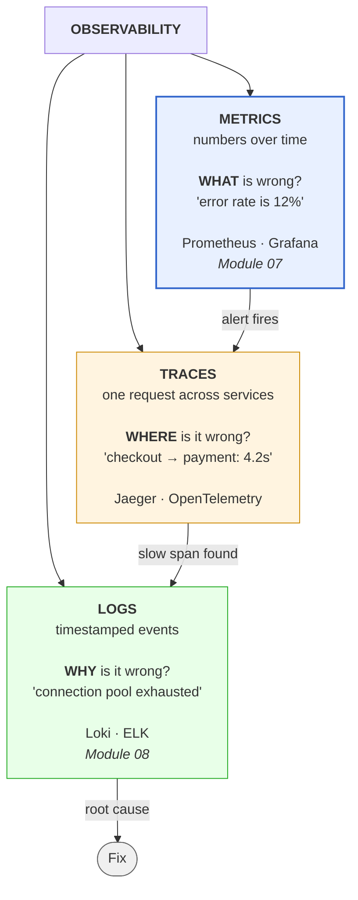
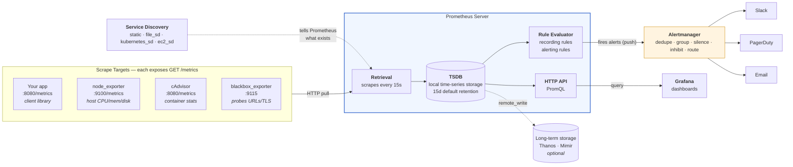
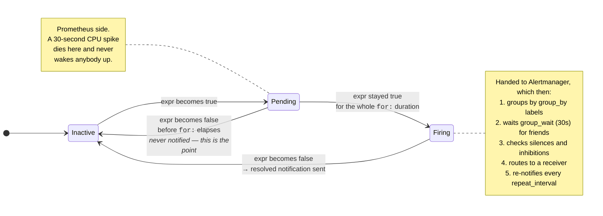
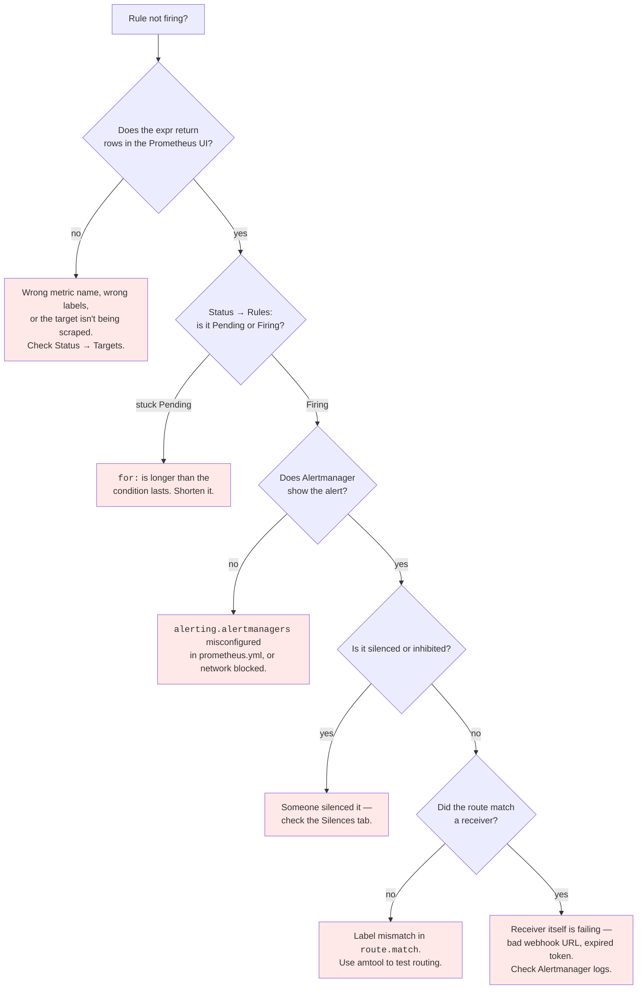
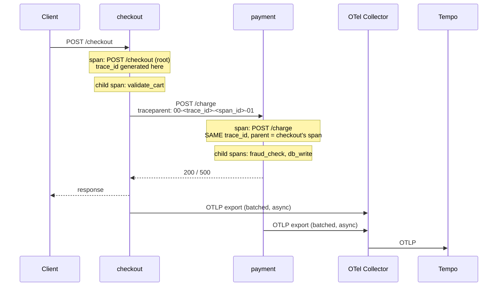

# Module 07: Observability

> *"You can't fix what you can't see." — DevOps Proverb*

---

>**Command reference**: [`cheatsheet.md`](./cheatsheet.md) — every command in this module, grouped by task, with the gotchas.
>
>**Cross-module lookup**: [Quick Reference](../QUICK-REFERENCE.md)

---

## Why This Module Matters

Your CI/CD pipeline deploys code to production. But **how do you know it's working?** Observability gives you the eyes and ears to understand what's happening inside your systems — before users complain.

**In real-world DevOps work**, you will:

- Set up Prometheus to collect metrics from every service
- Build Grafana dashboards that tell a story at a glance
- Configure alerts that wake you up only when it matters
- Instrument applications with custom metrics
- Triage production incidents using metrics, logs, and traces
- Distinguish signal from noise during outages

---

## Table of Contents

1. [Monitoring vs Observability](#1-monitoring-vs-observability)
2. [The Three Pillars](#2-the-three-pillars)
3. [Prometheus — Metrics Engine](#3-prometheus--metrics-engine)
4. [PromQL — Querying Metrics](#4-promql--querying-metrics)
5. [Grafana — Visualization](#5-grafana--visualization)
6. [Alerting with Alertmanager](#6-alerting-with-alertmanager)
7. [Metrics Design Patterns](#7-metrics-design-patterns)
8. [Application Instrumentation](#8-application-instrumentation)
9. [Distributed Tracing with OpenTelemetry](#9-distributed-tracing-with-opentelemetry)
10. [Common Mistakes and Anti-Patterns](#10-common-mistakes-and-anti-patterns)
11. [Debugging Mindset](#11-debugging-mindset)
12. [Interview Insights](#12-interview-insights)

---

## 1. Monitoring vs Observability

### They're Not the Same Thing

```
Monitoring:
  "Is the system up? Is CPU above 90%?"
  Predefined checks for KNOWN failure modes.
  You decide in advance what to watch.

Observability:
  "WHY is the system slow for users in Europe?"
  Ability to ask ARBITRARY questions about your system.
  You explore data to find UNKNOWN problems.
```

| Aspect | Monitoring | Observability |
|--------|-----------|---------------|
| **Approach** | Predefined dashboards & alerts | Explore and query on the fly |
| **Questions** | Known unknowns | Unknown unknowns |
| **Tools** | Nagios, Zabbix, static checks | Prometheus, Grafana, Jaeger |
| **Mindset** | "Alert me when X breaks" | "Help me understand WHY X broke" |
| **Output** | Red/green status | Rich, queryable telemetry data |

>**Key insight:** Good monitoring is a *subset* of observability. You need both.

---

## 2. The Three Pillars

The three pillars answer three different questions. Debugging a real incident means walking from one to the next — an alert tells you *what*, a trace tells you *where*, a log tells you *why*.



| Pillar | Cardinality cost | Retention | Best for |
|--------|------------------|-----------|----------|
| **Metrics** | Low — aggregated | Months/years cheaply | Alerting, dashboards, trends, SLOs |
| **Traces** | Medium — usually sampled | Days | Latency attribution in distributed systems |
| **Logs** | High — one line per event | Days/weeks (expensive) | Root cause on a specific request |

> ** Why the order matters**: you cannot alert on logs cheaply, and you cannot debug from metrics alone. Alert on **metrics** (cheap, aggregate, low noise), then pivot to **traces** to find the slow hop, then read the **logs** for that exact trace ID. Teams that skip metrics and alert on log patterns end up with expensive, flaky alerting.

### Metrics (This Module)

- **What**: Numeric measurements collected over time (counters, gauges, histograms)
- **Example**: `http_requests_total = 14523`, `cpu_usage = 72.3%`
- **Tool**: **Prometheus** + **Grafana**
- **Strength**: Cheap to store, fast to query, great for alerting and trends

### Logs (Module 08)

- **What**: Timestamped text records of discrete events
- **Example**: `2024-01-15 14:23:01 ERROR Failed to connect to database: timeout after 30s`
- **Tool**: ELK Stack, Loki
- **Strength**: Rich context, great for debugging specific issues

### Traces (Section 9, and Lab 03)

- **What**: The journey of a single request across multiple services
- **Example**: Request → API Gateway (12ms) → Auth Service (45ms) → Database (230ms)
- **Tool**: OpenTelemetry for instrumentation; Tempo, Jaeger, or Zipkin for storage
- **Strength**: Finding bottlenecks in distributed systems
- **Covered in**: [§9 Distributed Tracing with OpenTelemetry](#9-distributed-tracing-with-opentelemetry) and [Lab 03](./labs/lab-03-distributed-tracing.md)

---

## 3. Prometheus — Metrics Engine

### Why Prometheus?

- De facto standard for cloud-native monitoring
- **Pull-based** model — Prometheus scrapes targets (no agents to install)
- Built-in time-series database
- Powerful query language (PromQL)
- Native Kubernetes integration
- CNCF graduated project (same foundation as Kubernetes)

### Architecture

Note the direction of every arrow into Prometheus: it **pulls**. Your application never pushes metrics anywhere — it just exposes an HTTP endpoint and waits.



> ** Pull vs push — the consequence that matters**: because Prometheus pulls, a target that disappears is *detectably* down (`up == 0`), and you never need to configure your app with a monitoring endpoint. The tradeoff is that Prometheus must be able to **reach** every target — which is why short-lived batch jobs (that finish before the next scrape) need the **Pushgateway**, and why targets behind NAT need an exporter Prometheus can route to.

### How Prometheus Works

```
1. CONFIGURE targets in prometheus.yml
2. Prometheus SCRAPES /metrics endpoint every N seconds
3. Data stored as TIME SERIES in local TSDB
4. You QUERY with PromQL via Grafana or API
5. ALERT RULES evaluated continuously
6. Alerts sent to ALERTMANAGER → notifications
```

### Prometheus Configuration

```yaml
# prometheus.yml
global:
  scrape_interval: 15s          # How often to scrape targets
  evaluation_interval: 15s      # How often to evaluate alert rules

# Alert rules files
rule_files:
  - "alert_rules.yml"

# Alertmanager configuration
alerting:
  alertmanagers:
    - static_configs:
        - targets: ["alertmanager:9093"]

# Scrape targets
scrape_configs:
  - job_name: "prometheus"       # Monitor Prometheus itself
    static_configs:
      - targets: ["localhost:9090"]

  - job_name: "node"             # Linux host metrics
    static_configs:
      - targets: ["node-exporter:9100"]

  - job_name: "app"              # Your application
    static_configs:
      - targets: ["app:8080"]
    metrics_path: /metrics        # Default path
    scrape_interval: 10s          # Override global interval
```

### Metric Types

```
┌──────────────────────────────────────────────────────────┐
│ COUNTER — only goes UP (or resets to 0)                  │
│   Example: http_requests_total, errors_total             │
│   Use: Total count of events                             │
│    Always use rate() — raw value is meaningless        │
├──────────────────────────────────────────────────────────┤
│ GAUGE — goes UP and DOWN                                 │
│   Example: temperature, cpu_usage, queue_size            │
│   Use: Current state of something                        │
│    Can use directly — no rate() needed                 │
├──────────────────────────────────────────────────────────┤
│ HISTOGRAM — distribution of values in buckets            │
│   Example: http_request_duration_seconds                 │
│   Use: Latency percentiles (p50, p95, p99)               │
│    Define bucket boundaries carefully                  │
├──────────────────────────────────────────────────────────┤
│ SUMMARY — similar to histogram, calculates quantiles     │
│   Example: rpc_duration_seconds                          │
│   Use: Pre-calculated percentiles (client-side)          │
│    Cannot be aggregated across instances               │
└──────────────────────────────────────────────────────────┘
```

### Metrics Endpoint Example

When Prometheus scrapes `/metrics`, it gets plain text:

```
# HELP http_requests_total Total number of HTTP requests
# TYPE http_requests_total counter
http_requests_total{method="GET",path="/api/users",status="200"} 14523
http_requests_total{method="POST",path="/api/users",status="201"} 342
http_requests_total{method="GET",path="/api/users",status="500"} 12

# HELP http_request_duration_seconds HTTP request latency
# TYPE http_request_duration_seconds histogram
http_request_duration_seconds_bucket{le="0.01"} 8923
http_request_duration_seconds_bucket{le="0.05"} 12456
http_request_duration_seconds_bucket{le="0.1"} 13890
http_request_duration_seconds_bucket{le="0.5"} 14400
http_request_duration_seconds_bucket{le="1"} 14510
http_request_duration_seconds_bucket{le="+Inf"} 14523
http_request_duration_seconds_sum 523.42
http_request_duration_seconds_count 14523

# HELP node_cpu_usage Current CPU usage percentage
# TYPE node_cpu_usage gauge
node_cpu_usage 72.3
```

---

## 4. PromQL — Querying Metrics

### Basic Queries

```promql
# Instant vector — current value
http_requests_total

# Filter by label
http_requests_total{method="GET"}
http_requests_total{status=~"5.."}              # Regex match: any 5xx
http_requests_total{path!="/health"}            # Exclude health checks

# Range vector — values over time window
http_requests_total[5m]                          # Last 5 minutes of data
```

### Essential Functions

```promql
# RATE — per-second rate of a counter over time window
# THE most important PromQL function
rate(http_requests_total[5m])
# "How many requests per second, averaged over 5 minutes?"

# INCREASE — total increase of a counter over time window
increase(http_requests_total[1h])
# "How many total requests in the last hour?"

# SUM — aggregate across label values
sum(rate(http_requests_total[5m]))
# "Total request rate across ALL endpoints"

sum by (status) (rate(http_requests_total[5m]))
# "Request rate grouped by status code"

# HISTOGRAM_QUANTILE — calculate percentiles
histogram_quantile(0.95, rate(http_request_duration_seconds_bucket[5m]))
# "95th percentile latency over last 5 minutes"

histogram_quantile(0.99, rate(http_request_duration_seconds_bucket[5m]))
# "99th percentile latency"

# AVG, MAX, MIN
avg(node_cpu_usage)
max(node_memory_usage_bytes)
```

### Real-World PromQL Patterns

```promql
# Error rate (percentage of 5xx responses)
sum(rate(http_requests_total{status=~"5.."}[5m]))
/
sum(rate(http_requests_total[5m]))
* 100

# Availability (percentage of non-5xx responses)
(1 - (
  sum(rate(http_requests_total{status=~"5.."}[5m]))
  /
  sum(rate(http_requests_total[5m]))
)) * 100

# Memory usage percentage
(node_memory_MemTotal_bytes - node_memory_MemAvailable_bytes)
/
node_memory_MemTotal_bytes * 100

# Disk usage percentage
(node_filesystem_size_bytes - node_filesystem_avail_bytes)
/
node_filesystem_size_bytes * 100

# Top 5 endpoints by request rate
topk(5, sum by (path) (rate(http_requests_total[5m])))

# Request rate change (spike detection)
rate(http_requests_total[5m]) / rate(http_requests_total[1h]) > 2
# "Current rate is more than 2x the hourly average"
```

---

## 5. Grafana — Visualization

### Why Grafana?

- **Data-source agnostic** — Prometheus, Elasticsearch, CloudWatch, PostgreSQL, etc.
- Beautiful, interactive dashboards
- Template variables for dynamic dashboards
- Alert integration
- Huge community dashboard library

### Dashboard Design Principles

```
┌─────────────────────────────────────────────────────────┐
│  SERVICE OVERVIEW DASHBOARD                              │
├─────────────────────────────────────────────────────────┤
│  Row 1: The Big Picture (SLIs)                           │
│  ┌──────────┐ ┌──────────┐ ┌──────────┐ ┌──────────┐   │
│  │ Request  │ │ Error    │ │  P95     │ │ Uptime   │   │
│  │ Rate     │ │ Rate     │ │ Latency  │ │          │   │
│  │ 1.2k/s   │ │ 0.3%     │ │ 45ms     │ │ 99.97%   │   │
│  └──────────┘ └──────────┘ └──────────┘ └──────────┘   │
├─────────────────────────────────────────────────────────┤
│  Row 2: Traffic & Errors (time series graphs)            │
│  ┌────────────────────┐  ┌────────────────────┐         │
│  │ Requests/sec       │  │ Error rate by type │         │
│  │ ▁▂▃▅▆▇█▇▆▅▃▂▁     │  │ ▁▁▁▁▂▁▁▁▁▁▁▁▁    │         │
│  └────────────────────┘  └────────────────────┘         │
├─────────────────────────────────────────────────────────┤
│  Row 3: Latency & Saturation                             │
│  ┌────────────────────┐  ┌────────────────────┐         │
│  │ Latency p50/p95/p99│  │ CPU / Memory / Disk│         │
│  │ ▁▂▂▃▃▃▂▂▁▁▂▂▃     │  │ ▅▅▅▅▆▅▅▅▅▆▅▅▅    │         │
│  └────────────────────┘  └────────────────────┘         │
└─────────────────────────────────────────────────────────┘
```

**Key rules:**

- **Top row = stat panels** with the most important numbers (SLIs)
- **Use consistent colors** — green = good, yellow = warning, red = bad
- **Time range selector** — always let users adjust the window
- **Template variables** — dropdown to filter by service, environment, instance

### Grafana Data Source Config

```
1. Go to Configuration → Data Sources → Add data source
2. Select Prometheus
3. URL: http://prometheus:9090
4. Click "Save & Test" — should say "Data source is working"
```

---

## 6. Alerting with Alertmanager

### Alert Rules in Prometheus

```yaml
# alert_rules.yml
groups:
  - name: application
    rules:
      # High error rate
      - alert: HighErrorRate
        expr: |
          sum(rate(http_requests_total{status=~"5.."}[5m]))
          /
          sum(rate(http_requests_total[5m]))
          > 0.05
        for: 5m                    # Must be true for 5 min
        labels:
          severity: critical
        annotations:
          summary: "High error rate detected"
          description: "Error rate is {{ $value | humanizePercentage }} (threshold: 5%)"

      # High latency
      - alert: HighLatency
        expr: |
          histogram_quantile(0.95, rate(http_request_duration_seconds_bucket[5m]))
          > 0.5
        for: 10m
        labels:
          severity: warning
        annotations:
          summary: "P95 latency above 500ms"
          description: "P95 latency is {{ $value }}s"

  - name: infrastructure
    rules:
      # High CPU
      - alert: HighCPU
        expr: 100 - (avg by (instance) (irate(node_cpu_seconds_total{mode="idle"}[5m])) * 100) > 85
        for: 10m
        labels:
          severity: warning
        annotations:
          summary: "High CPU usage on {{ $labels.instance }}"

      # Disk almost full
      - alert: DiskAlmostFull
        expr: |
          (node_filesystem_avail_bytes / node_filesystem_size_bytes) * 100 < 10
        for: 5m
        labels:
          severity: critical
        annotations:
          summary: "Disk space < 10% on {{ $labels.instance }}"

      # Target down
      - alert: TargetDown
        expr: up == 0
        for: 2m
        labels:
          severity: critical
        annotations:
          summary: "{{ $labels.job }} target {{ $labels.instance }} is down"
```

### Alertmanager Configuration

```yaml
# alertmanager.yml
global:
  resolve_timeout: 5m

route:
  receiver: default
  group_by: [alertname, severity]
  group_wait: 30s               # Wait before sending first notification
  group_interval: 5m            # Wait before sending updates
  repeat_interval: 4h           # Re-send if not resolved
  routes:
    - match:
        severity: critical
      receiver: pagerduty
    - match:
        severity: warning
      receiver: slack

receivers:
  - name: default
    webhook_configs:
      - url: "http://localhost:5001/"

  - name: slack
    slack_configs:
      - api_url: "https://hooks.slack.com/services/xxx/yyy/zzz"
        channel: "#alerts"
        title: "{{ .GroupLabels.alertname }}"
        text: "{{ range .Alerts }}{{ .Annotations.description }}\n{{ end }}"

  - name: pagerduty
    pagerduty_configs:
      - service_key: "<your-pagerduty-key>"
```

### Alert Lifecycle

Every alerting rule moves through this state machine on **every rule evaluation** (default: every 15s). The `for:` duration is what separates a real problem from a momentary spike.



**Where an alert can vanish** — check these in order when someone says "the alert didn't fire":



> ** Test the whole chain before you need it.** `amtool config routes test --config.file=alertmanager.yml severity=critical` shows which receiver a label set would reach — without waiting for a real outage to find out you had a typo.

---

## 7. Metrics Design Patterns

### The RED Method (Request-Driven Services)

```
For every service, track:
  R — Rate:       requests per second
  E — Errors:     failed requests per second
  D — Duration:   latency (p50, p95, p99)

Best for: APIs, microservices, web servers
```

### The USE Method (Resource-Driven)

```
For every resource (CPU, memory, disk, network), track:
  U — Utilization: % of resource being used
  S — Saturation:  amount of queued/waiting work
  E — Errors:      count of error events

Best for: Infrastructure, hardware, system resources
```

### The Four Golden Signals (Google SRE)

```
1. Latency    — time to serve a request (split success vs error)
2. Traffic    — demand on the system (requests/sec)
3. Errors     — rate of failed requests
4. Saturation — how "full" the system is (CPU, memory, I/O)
```

>**In practice:** RED for your services, USE for your infrastructure, Golden Signals as your mental model.

---

## 8. Application Instrumentation

### Python (Flask + prometheus_client)

```python
from flask import Flask, request
from prometheus_client import (
    Counter, Histogram, Gauge,
    generate_latest, CONTENT_TYPE_LATEST
)
import time

app = Flask(__name__)

# Define metrics
REQUEST_COUNT = Counter(
    'http_requests_total',
    'Total HTTP requests',
    ['method', 'path', 'status']
)

REQUEST_DURATION = Histogram(
    'http_request_duration_seconds',
    'HTTP request duration in seconds',
    ['method', 'path'],
    buckets=[0.01, 0.05, 0.1, 0.25, 0.5, 1.0, 2.5, 5.0]
)

ACTIVE_REQUESTS = Gauge(
    'http_active_requests',
    'Number of active HTTP requests'
)

@app.before_request
def before_request():
    request.start_time = time.time()
    ACTIVE_REQUESTS.inc()

@app.after_request
def after_request(response):
    duration = time.time() - request.start_time
    REQUEST_COUNT.labels(
        method=request.method,
        path=request.path,
        status=response.status_code
    ).inc()
    REQUEST_DURATION.labels(
        method=request.method,
        path=request.path
    ).observe(duration)
    ACTIVE_REQUESTS.dec()
    return response

@app.route('/metrics')
def metrics():
    return generate_latest(), 200, {'Content-Type': CONTENT_TYPE_LATEST}

@app.route('/api/users')
def get_users():
    return {"users": ["alice", "bob"]}
```

### What to Instrument

```
DO instrument:
   Request rate, errors, duration (RED)
   Business metrics (orders placed, logins, signups)
   Queue depth and processing time
   Cache hit/miss ratio
   External dependency latency (DB, API calls)
   Connection pool usage

DON'T instrument:
   Every single function (noise)
   Sensitive data in labels (PII, tokens)
   High-cardinality labels (user IDs, request IDs)
```

---

## 9. Distributed Tracing with OpenTelemetry

### The Question Metrics Cannot Answer

Everything so far in this module aggregates. `http_request_duration_seconds` tells you the p99 of one service. It cannot tell you that *this* request spent 40 ms in your code and 2 seconds waiting on a downstream call — because the moment you added a request ID to the labels to find out, you destroyed your Prometheus instance with cardinality.

That is not a gap you close with better metrics. One request crossing six services needs a data model where the unit is *the request*, not the aggregate.

### Spans and Traces

A **span** is one timed operation: a name, a start, a duration, a parent, a status, and attributes. A **trace** is the tree of spans belonging to one request. The tree is the point — a flat list of durations tells you nothing about what was waiting on what.

```
POST /checkout                 checkout   2.11s   ████████████████████████
├── validate_cart              checkout    14ms   ▌
└── POST /charge               checkout   2.09s   ███████████████████████
    └── POST /charge            payment   2.08s   ███████████████████████
        ├── fraud_check         payment   2.03s   ██████████████████████
        └── db_write            payment    31ms   ▌
```

Read that shape, don't just read the numbers:

| What you see | What it means |
|--------------|---------------|
| Parent long, all children short | Time is being spent somewhere nobody instrumented |
| Gap before a child starts | Queueing, connection setup, or lock contention — not work |
| Children overlapping | Concurrent calls; your latency is the longest one, not the sum |
| Children strictly sequential | Your latency *is* the sum — a candidate for parallelising |
| One child dominating | You have found the thing to fix. This is the normal outcome |

> ** DevOps Impact**: `checkout` is slow and nothing in `checkout` is slow. Without traces, that conversation ends with two teams each proving their service is fine. With traces it ends in ten seconds, with a span name.

### OpenTelemetry Is a Standard, Not a Tool

This is the part that confuses people coming from Prometheus, where the tool and the format are the same thing. OpenTelemetry (OTel) is a CNCF project that standardises *how telemetry is produced and moved*, and deliberately does not store or display anything.

| Piece | What it is | Why you care |
|-------|-----------|--------------|
| **API** | Language-level interface for creating spans | Library authors instrument against it with no dependency on your backend |
| **SDK** | The implementation: sampling, batching, export | Where you configure behaviour |
| **Instrumentation libraries** | Auto-instrumentation for Flask, Django, `requests`, gRPC, psycopg, … | Most of your spans should come from here, not hand-written code |
| **OTLP** | The wire protocol (gRPC or HTTP) | One protocol everything speaks. This is what killed the per-vendor agent |
| **Collector** | A standalone process that receives, processes, and exports | Batching, sampling, redaction, and fan-out — without redeploying apps |
| **Semantic conventions** | Agreed attribute names (`http.request.method`, `db.system`) | Dashboards and queries work across services written by different teams |

The practical consequence: applications export OTLP to a collector, and swapping Jaeger for Tempo, or adding a second destination, is a collector config change. Nothing gets rebuilt.

```
[ app + OTel SDK ] ──OTLP──▶ [ OTel Collector ] ──▶ Tempo / Jaeger  (traces)
                                     │
                                     ├──▶ Prometheus   (metrics)
                                     └──▶ Loki         (logs)
```

> ** DevOps Impact**: the collector is where you put anything you don't want to redeploy fifty services to change — sampling policy, PII redaction, adding `deployment.environment` to every span, or sending a copy of production telemetry to a second backend during a migration.

### Instrumenting an Application

The setup is short, and most of the spans come from libraries rather than your code:

```python
from opentelemetry import trace
from opentelemetry.exporter.otlp.proto.grpc.trace_exporter import OTLPSpanExporter
from opentelemetry.instrumentation.flask import FlaskInstrumentor
from opentelemetry.instrumentation.requests import RequestsInstrumentor
from opentelemetry.sdk.resources import Resource
from opentelemetry.sdk.trace import TracerProvider
from opentelemetry.sdk.trace.export import BatchSpanProcessor

provider = TracerProvider(
    resource=Resource.create({"service.name": "checkout"})   #  non-negotiable
)
provider.add_span_processor(BatchSpanProcessor(OTLPSpanExporter()))
trace.set_tracer_provider(provider)
tracer = trace.get_tracer(__name__)

FlaskInstrumentor().instrument_app(app)   # a span per incoming request
RequestsInstrumentor().instrument()       # a span per outgoing call

# Add your own spans only for work worth attributing separately
with tracer.start_as_current_span("fraud_check") as span:
    span.set_attribute("fraud.rules_version", 7)
    ...
```

Configuration is environment-driven, which is what makes it operable:

```bash
OTEL_SERVICE_NAME=checkout
OTEL_EXPORTER_OTLP_ENDPOINT=http://otel-collector:4317
OTEL_TRACES_SAMPLER=parentbased_traceidratio
OTEL_TRACES_SAMPLER_ARG=0.1
OTEL_RESOURCE_ATTRIBUTES=deployment.environment=prod,service.version=1.4.2
```

### Context Propagation — the Part That Breaks

A trace crosses a process boundary because of one HTTP header, standardised by W3C:

```
traceparent: 00-4bf92f3577b34da6a3ce929d0e0e4736-00f067aa0ba902b7-01
             │  │                                │                │
             │  └─ trace-id (16 bytes)            └─ parent span   └─ flags
             └─ version                              id (8 bytes)     (01 = sampled)
```

Client-side instrumentation writes it; server-side instrumentation reads it and makes the incoming span a child. Everything about "our traces are broken" reduces to a boundary where that didn't happen:

- A service that builds requests with a client you didn't instrument
- A message queue where nobody put the context in the message attributes
- A proxy, gateway, or CDN with a header allowlist
- A thread pool or `async` boundary that loses the context inside one process

The symptom is not an error. It is downstream spans arriving as their own root traces, and upstream latency that suddenly looks excellent — a silent failure by construction, which is why Lab 03 starts there.

### Sampling: Head or Tail

Tracing every request at scale costs more than the system being traced. So you sample — and *where* you decide is the whole question.

| | Head sampling | Tail sampling |
|---|---|---|
| Decides | At the start of the trace, in the SDK | After the trace is complete, in the collector |
| Knows the outcome | No — it cannot know it will fail or be slow | Yes |
| Cost | Cheapest: unsampled spans are never created | Every span is produced and shipped to the collector |
| Typical policy | "10% of everything" | "All errors, all traces over 500 ms, 10% of the rest" |
| Failure mode |  The incident you were called about isn't there | Collector needs memory and a decision window |

```yaml
# collector: keep what you'd actually open
processors:
  tail_sampling:
    decision_wait: 5s
    policies:
      - name: keep-errors
        type: status_code
        status_code: { status_codes: [ERROR] }
      - name: keep-slow
        type: latency
        latency: { threshold_ms: 500 }
      - name: keep-a-sample-of-the-rest
        type: probabilistic
        probabilistic: { sampling_percentage: 10 }
```

Whatever you choose, the decision must be **consistent across services** — `parentbased_traceidratio` exists so that a downstream service honours the upstream decision instead of independently sampling and giving you half a trace.

### Correlation Is Where the Value Compounds

A trace on its own is a nice waterfall. Wired to the other two pillars it becomes an incident workflow:

| Direction | Mechanism | What it gives you |
|-----------|-----------|-------------------|
| Metrics → trace | **Exemplars**: Prometheus histogram buckets carry example trace IDs | Click the p99 spike, land on a request that was actually that slow |
| Trace → logs | The **trace ID in every log line**, plus a datasource link | Read exactly the logs for this request, across every service |
| Logs → trace | Same ID, searched the other way | A user pastes an error; you get the full request path |

```python
# The cheapest correlation you will ever buy — stamp the trace id on every log line
class TraceContextFilter(logging.Filter):
    def filter(self, record):
        ctx = trace.get_current_span().get_span_context()
        record.trace_id = format(ctx.trace_id, "032x") if ctx.is_valid else "-"
        return True
```

> ** DevOps Impact**: alert (metrics) → which hop (traces) → why (logs) is the triage path, and each arrow is a click only if you built the links. Teams that instrument all three pillars but connect none of them still debug by timestamp correlation, which is guessing with extra steps.

### What to Trace, and What Not To

```
DO instrument:
   Every inbound request and every outbound call (libraries do this for you)
   Database queries, cache lookups, queue publishes and consumes
   Expensive internal work worth naming: fraud_check, render_pdf, reindex
   Errors — record the exception ON the span, so failures are searchable

DON'T:
   Put unique values in SPAN NAMES ("charge order 8823") — names are the
     low-cardinality dimension, like a metric name. Unique values are attributes
   Put PII, tokens, or full request bodies in attributes — spans get exported
     to a third party and kept for weeks
   Wrap every function — a 400-span trace is as unreadable as no trace
   Assume no traces means no traffic. Every layer drops telemetry rather than
     blocking, so a broken pipeline is silent. Monitor the collector itself
```

Hands-on, including all four of those failure modes: **[Lab 03: Distributed Tracing](./labs/lab-03-distributed-tracing.md)**.

---

## 10. Common Mistakes and Anti-Patterns

### Alert Fatigue

```
BAD:  50 alerts firing → team ignores ALL alerts → real outage missed
GOOD: 5 actionable alerts → each one means "something needs human attention NOW"

Rule: If an alert fires and nobody needs to act, DELETE the alert.
```

### High-Cardinality Labels

```
# BAD: user_id creates millions of time series → Prometheus OOM
http_requests_total{user_id="12345", path="/api"}

# GOOD: use bounded labels
http_requests_total{method="GET", path="/api", status="200"}
```

### Dashboard Sprawl

```
BAD:  30 dashboards that nobody looks at
GOOD: 3-5 well-maintained dashboards:
  1. Service Overview (RED metrics)
  2. Infrastructure (USE metrics)
  3. Business KPIs
  4. On-call / Incident dashboard
```

### Missing `for` Duration on Alerts

```yaml
# BAD: fires on a single scrape (could be noise)
- alert: HighCPU
  expr: cpu_usage > 80

# GOOD: must be true for 10 minutes (real problem)
- alert: HighCPU
  expr: cpu_usage > 80
  for: 10m
```

---

## 11. Debugging Mindset

### Incident Triage with Observability

```
Alert fires!
│
├─ 1. OVERVIEW DASHBOARD — What's the blast radius?
│     └─ Which services are affected? One or many?
│
├─ 2. CHECK THE RED METRICS
│     ├─ Rate: Did traffic spike? (load issue)
│     ├─ Errors: What's failing? (code issue)
│     └─ Duration: What's slow? (dependency issue)
│
├─ 3. DRILL DOWN — Time correlation
│     ├─ When did it start? (match to deployment?)
│     ├─ What changed? (new deploy, config change, traffic)
│     └─ Which instances? (one = instance issue, all = systemic)
│
├─ 4. CHECK INFRASTRUCTURE (USE)
│     ├─ CPU saturated? → Scale up/out
│     ├─ Memory exhausted? → Memory leak?
│     └─ Disk full? → Clean up, expand
│
└─ 5. GO TO LOGS (Module 08)
      └─ Metrics tell you WHAT, logs tell you WHY
```

---

## 12. Interview Insights

**Q: What is observability and how does it differ from monitoring?**
> Monitoring tells you *when* something is wrong (predefined checks). Observability lets you ask *why* it's wrong (explore data ad hoc). Monitoring watches known failure modes; observability helps you investigate unknown ones. A well-observed system has metrics, logs, and traces that let any engineer diagnose novel issues.

**Q: Explain the three pillars of observability.**
> Metrics (numeric time-series — the "what"), Logs (text events — the "why"), and Traces (request paths across services — the "where"). Metrics are cheap and fast for alerting and dashboards. Logs provide detailed context for debugging. Traces show how a request flows through distributed systems.

**Q: How does Prometheus work?**
> Prometheus uses a pull model — it scrapes HTTP endpoints (/metrics) at configured intervals. Targets expose metrics in a text format. Data is stored in a local time-series database. You query with PromQL. Alert rules are evaluated continuously and fire through Alertmanager for notifications.

**Q: What's the difference between a counter and a gauge?**
> A counter only goes up (or resets to zero on restart) — use for totals like requests or errors. Always apply `rate()` to counters. A gauge goes up and down — use for current state like CPU usage, temperature, queue size. Can be used directly without rate().

**Q: How do you handle alert fatigue?**
> Every alert must be actionable — if it fires, someone must act. Remove noisy alerts. Use `for` duration to avoid transient spikes. Group related alerts. Route by severity (critical → PagerDuty, warning → Slack). Review alerts quarterly and delete ones that are never acted on.

**Q: Describe the RED and USE methods.**
> RED (Rate, Errors, Duration) is for request-driven services like APIs — track how many requests, how many fail, and how long they take. USE (Utilization, Saturation, Errors) is for resources like CPU, memory, disk — track how busy, how queued, and how many errors. Use RED for services, USE for infrastructure.

---

## Labs and Projects

Read the sections above first, then work through these **in order**. Every lab ends with a  **Break It** section — those are not optional; they are where the debugging skill actually comes from.

| # | Lab | What you'll do |
|---|-----|----------------|
| 1 | **[Prometheus + Grafana](./labs/lab-01-prometheus-grafana.md)** | Set up a complete monitoring stack from scratch using Docker Compose. |
| 2 | **[Application Monitoring](./labs/lab-02-application-monitoring.md)** | Instrument a Python Flask application with custom Prometheus metrics. |
| 3 | **[Distributed Tracing with OpenTelemetry](./labs/lab-03-distributed-tracing.md)** | Trace one request across two services with OpenTelemetry, ship the spans through a collector into Tempo, and read the waterfall in Grafana. |

**Portfolio project:**

- [Project: Metrics Dashboard and Alert](./projects/project-01-dashboard-alert.md) — Build a small monitoring setup that scrapes an application or service, visualizes key metrics, and fires one useful alert.

**Reference code** for every lab: [`code/`](./code/) — real files, validated in CI.

---

## Self-Check

Answer these from memory before you expand them. If more than two give you trouble, re-read the sections they come from — the labs assume this material is solid.

<details>
<summary><strong>1. Monitoring versus observability — is this more than vocabulary?</strong></summary>

Monitoring answers questions you thought of in advance: dashboards and alerts for known failure modes. Observability is whether your telemetry lets you ask a new question during an incident you never predicted. The dashboard tells you something is wrong; cardinality and correlation are what let you find out why.

</details>

<details>
<summary><strong>2. Why does Prometheus scrape targets instead of receiving pushes?</strong></summary>

The target needs no knowledge of the monitoring system, configuration lives in one place, and a failed scrape is itself a signal you can alert on (`up == 0`). The exception is short-lived batch jobs that finish before any scrape — those push to the Pushgateway.

</details>

<details>
<summary><strong>3. Counter, gauge, histogram — when does each apply?</strong></summary>

A counter only ever increases, so you query its `rate()` (requests, errors, bytes). A gauge goes up and down and you read it directly (queue depth, memory in use, temperature). A histogram buckets observations so you can compute quantiles and averages server-side (request duration, payload size).

</details>

<details>
<summary><strong>4. Why wrap counters in `rate()`, and why not alert on average latency?</strong></summary>

A raw counter's absolute value is meaningless and resets to zero on restart; `rate()` gives per-second change over a window and handles the reset. Averages hide exactly the users who are suffering — one request in a hundred taking ten seconds barely moves the mean, so alert on p95 or p99 from histogram buckets.

</details>

<details>
<summary><strong>5. What makes an alert worth waking someone for?</strong></summary>

It describes a symptom users feel or an SLO burning down, it names an action, and it has a runbook. Cause-based alerts like "CPU above 80%" page a human for a condition that may be harming nobody — and every such page makes the next real one less likely to be read.

</details>

<details>
<summary><strong>6. What is the `for:` clause in an alerting rule doing?</strong></summary>

Requiring the condition to hold continuously for that long before the alert fires, which absorbs single bad scrapes and momentary spikes. Set it too short and you page on noise; too long and you find out about the outage after your users do.

</details>

<details>
<summary><strong>7. You were paged about a slow request, and there is no trace for it — with nothing erroring anywhere. What are the two likely causes?</strong></summary>

Head sampling threw it away: the SDK decided at the start of the trace, before it could know the request would be slow. That is what tail sampling in the collector exists to fix. Or the pipeline is dropping spans — every layer discards telemetry rather than blocking the application, so a failed exporter is invisible from the app's side. Check the collector's own metrics (`otelcol_exporter_send_failed_spans`); absence of traces is not a signal you get for free.

</details>

---

## Practical Checkpoint

Before moving on, you should be able to:

- Explain the difference between metrics, dashboards, and alerts.
- Run Prometheus and Grafana, scrape a target, and build a basic operational dashboard.
- Investigate a service issue using symptoms, metrics, and alert context.

Portfolio evidence to keep:

- Prometheus scrape configuration.
- Grafana dashboard notes or exported JSON.
- One alert test with the trigger, observed signal, and response.

Suggested project: [Metrics Dashboard and Alert](./projects/project-01-dashboard-alert.md)

---

## What's Next?

With observability in place, you can now see your systems. Next, you'll learn to capture and analyze the detailed event data — logs.

**[Module 08: Logging →](../08-logging/)**

---

<div align="center">

**Module 07 Complete** 

[← Back to CI/CD](../06-ci-cd/) | [ Cheat Sheet](./cheatsheet.md) | [Next: Logging →](../08-logging/)

</div>


## Reference
<!-- tab: Cheatsheet -->
> PromQL pattern library, Prometheus config, and Alertmanager reference. Concepts live in the [module README](./README.md).
> Cross-module daily commands: **[QUICK-REFERENCE.md](../QUICK-REFERENCE.md)**

**Jump to:** [Metric types](#metric-types) · [PromQL basics](#promql-basics) · [Rate & counters](#rates--counters) · [Histograms](#histograms--percentiles) · [Aggregation](#aggregation) · [Pattern library](#the-promql-pattern-library) · [Recording rules](#recording-rules) · [Alert rules](#alerting-rules) · [Alertmanager](#alertmanager) · [Config](#prometheus-configuration) · [Exporters](#exporters--instrumentation) · [Grafana](#grafana) · [Troubleshooting](#troubleshooting)

---

## Metric Types

| Type | Only goes | Use for | Query with |
|------|-----------|---------|------------|
| **Counter** | Up (resets to 0 on restart) | Requests, errors, bytes sent | `rate()`, `increase()` — **never** the raw value |
| **Gauge** | Up and down | Temperature, queue depth, memory in use, replicas | Raw value, `avg_over_time()`, `delta()` |
| **Histogram** | Buckets + `_sum` + `_count` | Request duration, response size | `histogram_quantile()` on `rate(..._bucket[5m])` |
| **Summary** | Client-computed quantiles | Legacy; quantiles that can't be aggregated | Raw quantile labels |

```
# A histogram named http_request_duration_seconds exposes:
http_request_duration_seconds_bucket{le="0.1"}   # cumulative count ≤ 100ms
http_request_duration_seconds_bucket{le="0.5"}
http_request_duration_seconds_bucket{le="+Inf"}  # == _count
http_request_duration_seconds_sum                # total seconds observed
http_request_duration_seconds_count              # number of observations
```

**Naming convention**: `<namespace>_<subsystem>_<name>_<unit>[_total]`
Use base units (seconds, bytes — not ms or MB). Counters end in `_total`.

>**Never use a histogram's `le` quantile as a Summary substitute across instances.** Summaries compute quantiles on the client, so you **cannot** average or aggregate them meaningfully. Histograms can be aggregated — always prefer them for anything you'll graph across replicas.

---

## PromQL Basics

```promql
http_requests_total                                     # instant vector: all series
http_requests_total{job="api"}                          # label equality
http_requests_total{job="api", status="500"}            # multiple labels (AND)
http_requests_total{status!="200"}                      # not equal
http_requests_total{status=~"5.."}                      #  regex match
http_requests_total{status!~"2..|3.."}                  # regex not-match
http_requests_total{job=~"api|web"}                     # alternation

http_requests_total[5m]                                 # range vector: 5 min of samples
http_requests_total offset 1h                           # value as of 1 hour ago
http_requests_total @ 1690000000                        # at an absolute timestamp

# Comparison and arithmetic
node_memory_MemAvailable_bytes / 1024 / 1024            # → MiB
node_filesystem_avail_bytes / node_filesystem_size_bytes * 100     # → percent
up == 0                                                 # filter: only down targets
node_load1 > 4                                          # threshold filter
node_load1 > bool 4                                     # → 1 or 0 instead of filtering
```

| Operator | Note |
|----------|------|
| `+ - * / % ^` | Arithmetic; matches on identical label sets |
| `== != > < >= <=` | Filters by default; add `bool` to get 0/1 |
| `and` / `or` / `unless` | Set operations on label sets |
| `on(labels)` / `ignoring(labels)` | Control how two vectors are matched |
| `group_left` / `group_right` | Many-to-one joins (e.g. attaching `kube_pod_labels`) |

---

## Rates & Counters

```promql
rate(http_requests_total[5m])            #  per-second average over 5m. Handles resets.
irate(http_requests_total[5m])           # instantaneous: last two samples only. Spiky.
increase(http_requests_total[1h])        # total increase over 1h (= rate × seconds)

# Requests per second, by endpoint
sum by (endpoint) (rate(http_requests_total[5m]))

#  Error rate as a percentage — the single most useful query you will write
100 * sum(rate(http_requests_total{status=~"5.."}[5m]))
    / sum(rate(http_requests_total[5m]))

# Per-service error ratio
sum by (service) (rate(http_requests_total{status=~"5.."}[5m]))
  / sum by (service) (rate(http_requests_total[5m]))
```

**Range selection rules:**

| Rule | Reason |
|------|--------|
| Range must be **≥ 4× the scrape interval** | `rate()` needs at least 2 samples; 4× tolerates a missed scrape |
| Use `[5m]` with a 15s scrape as the default | Smooth enough to be readable, fast enough to be useful |
| Use `rate()` for graphs and alerts | `irate()` is only for zoomed-in, high-resolution debugging |
| `rate()` **before** `sum()`, never after | `sum(rate(x[5m]))`  — `rate(sum(x)[5m])` is invalid and would hide counter resets |

---

## Histograms & Percentiles

```promql
# p95 latency across everything
histogram_quantile(0.95, sum(rate(http_request_duration_seconds_bucket[5m])) by (le))

# p99 per endpoint   note: 'le' must ALWAYS be in the by() clause
histogram_quantile(0.99,
  sum by (le, endpoint) (rate(http_request_duration_seconds_bucket[5m])))

# Average latency (cheaper, but hides outliers — don't alert on it alone)
rate(http_request_duration_seconds_sum[5m])
  / rate(http_request_duration_seconds_count[5m])

# Apdex-style: what fraction of requests are under 300ms?
sum(rate(http_request_duration_seconds_bucket{le="0.3"}[5m]))
  / sum(rate(http_request_duration_seconds_count[5m]))

# Native histograms (Prometheus 2.40+)
histogram_quantile(0.95, sum(rate(http_request_duration_seconds[5m])))
```

>`histogram_quantile` interpolates **within a bucket**. If your highest finite bucket is `le="1.0"` and real latency is 8s, p99 will report something near 1s and you will believe a lie. Always define buckets that span your real latency range, including a generous top bucket.

---

## Aggregation

```promql
sum(...)        avg(...)       min(...)      max(...)
count(...)      stddev(...)    stdvar(...)
topk(5, ...)    bottomk(5, ...)     quantile(0.9, ...)
count_values("version", build_info)
group by (job) (up)             # existence only, drops the value
```

```promql
sum by (job, instance) (rate(http_requests_total[5m]))       #  keep these labels
sum without (instance) (rate(http_requests_total[5m]))       # keep everything EXCEPT
topk(5, sum by (pod) (rate(container_cpu_usage_seconds_total[5m])))
count by (job) (up == 1)                                     # healthy targets per job
```

**Over-time functions** (operate on a range vector, per series):

```promql
avg_over_time(node_load1[1h])
max_over_time(node_memory_MemAvailable_bytes[24h])
min_over_time(up[10m])
quantile_over_time(0.95, node_load1[1h])
stddev_over_time(node_load1[1h])
count_over_time(up[1h])                       # how many samples — detects gaps
last_over_time(some_gauge[5m])
present_over_time(up[10m])                    # did this series exist at all?
absent(up{job="critical-api"})                #  1 if the series is MISSING
absent_over_time(up{job="batch"}[1h])         # missing for the whole window
changes(process_start_time_seconds[1h])       #  restart count
resets(http_requests_total[1h])               # counter resets
deriv(node_filesystem_avail_bytes[1h])        # per-second slope of a gauge
predict_linear(node_filesystem_avail_bytes[6h], 4*3600)   #  value in 4 hours
delta(node_filesystem_avail_bytes[1h])        # gauge change over the window
clamp_max(x, 100)  clamp_min(x, 0)
round(x, 0.01)   ceil(x)   floor(x)   abs(x)
label_replace(up, "host", "$1", "instance", "([^:]+):.*")
```

---

## The PromQL Pattern Library

### Golden signals (RED method — request-driven services)

```promql
# Rate — requests per second
sum by (service) (rate(http_requests_total[5m]))

# Errors — failure ratio
sum by (service) (rate(http_requests_total{status=~"5.."}[5m]))
  / sum by (service) (rate(http_requests_total[5m]))

# Duration — p50 / p95 / p99
histogram_quantile(0.50, sum by (le, service) (rate(http_request_duration_seconds_bucket[5m])))
histogram_quantile(0.95, sum by (le, service) (rate(http_request_duration_seconds_bucket[5m])))
histogram_quantile(0.99, sum by (le, service) (rate(http_request_duration_seconds_bucket[5m])))
```

### USE method (resources)

```promql
# CPU utilisation per instance (%)
100 - (avg by (instance) (rate(node_cpu_seconds_total{mode="idle"}[5m])) * 100)

# Memory utilisation (%)
100 * (1 - node_memory_MemAvailable_bytes / node_memory_MemTotal_bytes)

# Disk utilisation (%) — exclude pseudo-filesystems
100 * (1 - node_filesystem_avail_bytes{fstype!~"tmpfs|overlay|squashfs"}
         / node_filesystem_size_bytes{fstype!~"tmpfs|overlay|squashfs"})

# Disk saturation — time spent doing I/O
rate(node_disk_io_time_seconds_total[5m])

# Network throughput
rate(node_network_receive_bytes_total{device!~"lo|veth.*"}[5m])
rate(node_network_transmit_bytes_total{device!~"lo|veth.*"}[5m])

# Network errors
rate(node_network_receive_errs_total[5m]) + rate(node_network_transmit_errs_total[5m])

# Load average vs core count
node_load1 / count by (instance) (node_cpu_seconds_total{mode="idle"})

# Disk will be full in under 4 hours   predictive, not reactive
predict_linear(node_filesystem_avail_bytes{fstype!~"tmpfs"}[6h], 4*3600) < 0

# Inode exhaustion
100 * (1 - node_filesystem_files_free / node_filesystem_files)
```

### Kubernetes (kube-state-metrics + cAdvisor)

```promql
# Pods not ready
sum by (namespace) (kube_pod_status_ready{condition="false"})

# Pods restarting   the earliest crash-loop signal
sum by (namespace, pod) (increase(kube_pod_container_status_restarts_total[1h])) > 3

# Container CPU usage vs its request
sum by (pod) (rate(container_cpu_usage_seconds_total{container!=""}[5m]))
  / sum by (pod) (kube_pod_container_resource_requests{resource="cpu"})

# Memory usage vs limit   >0.9 predicts an OOMKill
sum by (pod) (container_memory_working_set_bytes{container!=""})
  / sum by (pod) (kube_pod_container_resource_limits{resource="memory"})

# CPU throttling ratio — high values mean the limit is too low
rate(container_cpu_cfs_throttled_periods_total[5m])
  / rate(container_cpu_cfs_periods_total[5m])

# Deployment replicas not matching desired
kube_deployment_status_replicas_available != kube_deployment_spec_replicas

# Nodes not ready
kube_node_status_condition{condition="Ready", status="true"} == 0

# PVC nearly full
100 * (1 - kubelet_volume_stats_available_bytes / kubelet_volume_stats_capacity_bytes) > 85

# Cluster CPU requested vs allocatable
sum(kube_pod_container_resource_requests{resource="cpu"})
  / sum(kube_node_status_allocatable{resource="cpu"})
```

### Availability & meta-monitoring

```promql
up == 0                                              # target down
absent(up{job="payments-api"})                       #  the JOB itself vanished
changes(process_start_time_seconds[1h]) > 3          # process restarting repeatedly
time() - process_start_time_seconds                  # uptime in seconds
rate(prometheus_target_scrapes_exceeded_sample_limit_total[5m]) > 0    # cardinality blowout
prometheus_tsdb_head_series                          #  total active series — watch this
topk(10, count by (__name__) ({__name__=~".+"}))     # which metric has the most series
scrape_duration_seconds > 5                          # a slow exporter
rate(prometheus_rule_evaluation_failures_total[5m]) > 0
```

### SLO / error budget

```promql
# 30-day availability
1 - (sum(increase(http_requests_total{status=~"5.."}[30d]))
     / sum(increase(http_requests_total[30d])))

# Error budget remaining, for a 99.9% target
1 - ((1 - (sum(increase(http_requests_total{status=~"5.."}[30d]))
          / sum(increase(http_requests_total[30d])))) / 0.001)

# Multi-window burn rate — page only when the budget is burning fast  
(
  sum(rate(http_requests_total{status=~"5.."}[5m])) / sum(rate(http_requests_total[5m])) > (14.4 * 0.001)
  and
  sum(rate(http_requests_total{status=~"5.."}[1h])) / sum(rate(http_requests_total[1h])) > (14.4 * 0.001)
)
```

| Burn rate | Budget consumed | Windows | Action |
|-----------|----------------|---------|--------|
| 14.4× | 2% in 1 hour | 5m + 1h |  Page |
| 6× | 5% in 6 hours | 30m + 6h |  Page |
| 3× | 10% in 1 day | 2h + 1d |  Ticket |
| 1× | 10% in 3 days | 6h + 3d |  Ticket |

---

## Recording Rules

Precompute expensive queries so dashboards and alerts stay fast.

```yaml
# rules/recording.yml
groups:
  - name: http_slos
    interval: 30s
    rules:
      - record: job:http_requests:rate5m
        expr: sum by (job) (rate(http_requests_total[5m]))

      - record: job:http_errors:ratio5m
        expr: |
          sum by (job) (rate(http_requests_total{status=~"5.."}[5m]))
            / sum by (job) (rate(http_requests_total[5m]))

      - record: job:http_latency:p99_5m
        expr: |
          histogram_quantile(0.99,
            sum by (le, job) (rate(http_request_duration_seconds_bucket[5m])))
```

**Naming convention**: `level:metric:operations` — e.g. `job:http_requests:rate5m` means "aggregated to the `job` level, of `http_requests`, as a 5-minute rate."

---

## Alerting Rules

```yaml
groups:
  - name: availability
    rules:
      - alert: TargetDown
        expr: up == 0
        for: 2m
        labels: {severity: critical, team: platform}
        annotations:
          summary: "{{ $labels.job }} target {{ $labels.instance }} is down"
          description: "Scrape has failed for 2 minutes."
          runbook_url: "https://wiki/runbooks/target-down"

      - alert: HighErrorRate
        expr: job:http_errors:ratio5m > 0.05
        for: 10m
        labels: {severity: critical}
        annotations:
          summary: "{{ $labels.job }}: {{ $value | humanizePercentage }} of requests are 5xx"

      - alert: HighLatencyP99
        expr: job:http_latency:p99_5m > 1.5
        for: 10m
        labels: {severity: warning}
        annotations:
          summary: "{{ $labels.job }} p99 is {{ $value | humanizeDuration }}"

      - alert: DiskWillFillIn4Hours
        expr: |
          predict_linear(node_filesystem_avail_bytes{fstype!~"tmpfs"}[6h], 4*3600) < 0
          and node_filesystem_avail_bytes{fstype!~"tmpfs"} / node_filesystem_size_bytes < 0.30
        for: 30m
        labels: {severity: warning}
        annotations:
          summary: "{{ $labels.instance }} {{ $labels.mountpoint }} fills within 4h"

      - alert: PodCrashLooping
        expr: increase(kube_pod_container_status_restarts_total[15m]) > 3
        for: 5m
        labels: {severity: critical}
        annotations:
          summary: "{{ $labels.namespace }}/{{ $labels.pod }} restarted {{ $value }}× in 15m"
```

**Template functions in annotations:** `{{ $value }}` · `{{ $labels.x }}` · `{{ humanize $value }}` · `{{ humanizePercentage $value }}` · `{{ humanizeDuration $value }}` · `{{ printf "%.2f" $value }}` · `{{ $externalLabels.cluster }}`

**Alert design rules:**

| Rule | Why |
|------|-----|
| Alert on **symptoms** (users affected), not causes (CPU is high) | Causes produce noise; symptoms produce action |
| Every alert needs a `runbook_url` | An alert nobody knows how to action is noise |
| Every alert needs a `for:` | Prevents paging on transient spikes |
| Page only for things that are **urgent and actionable** | Everything else is a ticket or a dashboard |
| Include `severity` and routing labels | Alertmanager routes on labels |
| Use `absent()` for "the whole job disappeared" | `up == 0` can't fire if the series is gone entirely |

```bash
promtool check rules rules/*.yml          #  validate before deploying
promtool check config prometheus.yml
promtool query instant http://localhost:9090 'up == 0'
promtool test rules tests/*.yml           # unit-test your alerts
```

---

## Alertmanager

```yaml
global:
  resolve_timeout: 5m
  slack_api_url_file: /etc/alertmanager/slack_url

route:
  receiver: default
  group_by: [alertname, cluster, namespace]     #  one notification per group
  group_wait: 30s          # wait for related alerts before the first notification
  group_interval: 5m       # wait before sending updates about an existing group
  repeat_interval: 4h      # re-notify about a still-firing alert
  routes:
    - matchers: [severity="critical"]
      receiver: pagerduty
      continue: true                          # also fall through to the next match
    - matchers: [severity="critical"]
      receiver: slack-critical
    - matchers: [severity="warning"]
      receiver: slack-warnings
      group_wait: 5m
    - matchers: ['namespace=~"dev|test"']
      receiver: 'null'                        # drop non-production noise

inhibit_rules:
  # If the whole node is down, don't also page about every service on it 
  - source_matchers: [alertname="NodeDown"]
    target_matchers: [severity="warning"]
    equal: [instance]

receivers:
  - name: 'null'
  - name: default
    slack_configs: [{channel: '#alerts', send_resolved: true}]
  - name: slack-critical
    slack_configs:
      - channel: '#incidents'
        title: '{{ .Status | toUpper }} {{ .CommonLabels.alertname }}'
        text: >-
          {{ range .Alerts }}{{ .Annotations.summary }}
          <{{ .Annotations.runbook_url }}|runbook>
          {{ end }}
        send_resolved: true
  - name: pagerduty
    pagerduty_configs:
      - routing_key_file: /etc/alertmanager/pd_key
        severity: '{{ .CommonLabels.severity }}'
```

```bash
amtool check-config alertmanager.yml                                    #  validate
amtool config routes test --config.file=alertmanager.yml severity=critical    #  which receiver?
amtool config routes show --config.file=alertmanager.yml
amtool alert query                                                      # currently firing
amtool alert query alertname=HighErrorRate
amtool silence add alertname=NoisyAlert --duration=2h --comment "known issue, ticket #42"
amtool silence query
amtool silence expire <silence-id>
```

---

## Prometheus Configuration

```yaml
global:
  scrape_interval: 15s
  evaluation_interval: 15s
  scrape_timeout: 10s
  external_labels: {cluster: prod, region: us-east-1}    # added to federated/remote data

rule_files:
  - /etc/prometheus/rules/*.yml

alerting:
  alertmanagers:
    - static_configs: [{targets: ['alertmanager:9093']}]

scrape_configs:
  - job_name: prometheus
    static_configs: [{targets: ['localhost:9090']}]

  - job_name: node
    static_configs:
      - targets: ['node1:9100', 'node2:9100']
        labels: {env: production}

  - job_name: app
    metrics_path: /actuator/prometheus
    scheme: https
    scrape_interval: 30s
    static_configs: [{targets: ['app:8080']}]
    metric_relabel_configs:
      #  Drop a high-cardinality metric before it ever hits the TSDB
      - source_labels: [__name__]
        regex: 'go_gc_duration_seconds.*'
        action: drop
      # Remove a noisy label
      - regex: 'pod_template_hash'
        action: labeldrop

  - job_name: kubernetes-pods
    kubernetes_sd_configs: [{role: pod}]
    relabel_configs:
      - source_labels: [__meta_kubernetes_pod_annotation_prometheus_io_scrape]
        action: keep
        regex: 'true'
      - source_labels: [__meta_kubernetes_pod_annotation_prometheus_io_path]
        target_label: __metrics_path__
        regex: '(.+)'
      - source_labels: [__address__, __meta_kubernetes_pod_annotation_prometheus_io_port]
        target_label: __address__
        regex: '([^:]+)(?::\d+)?;(\d+)'
        replacement: '$1:$2'
      - source_labels: [__meta_kubernetes_namespace]
        target_label: namespace
      - source_labels: [__meta_kubernetes_pod_name]
        target_label: pod

  - job_name: blackbox
    metrics_path: /probe
    params: {module: [http_2xx]}
    static_configs: [{targets: ['https://example.com', 'https://api.example.com']}]
    relabel_configs:
      - source_labels: [__address__]
        target_label: __param_target
      - source_labels: [__param_target]
        target_label: instance
      - target_label: __address__
        replacement: blackbox-exporter:9115
```

```bash
promtool check config prometheus.yml
curl -X POST http://localhost:9090/-/reload      # requires --web.enable-lifecycle
kill -HUP $(pidof prometheus)
```

| Useful flag | Effect |
|-------------|--------|
| `--storage.tsdb.retention.time=30d` | Retention window |
| `--storage.tsdb.retention.size=100GB` | Size cap |
| `--web.enable-lifecycle` | Enables `/-/reload` |
| `--web.enable-admin-api` | Enables deletion endpoints  |
| `--query.max-samples` | Guard against runaway queries |

**Useful endpoints:** `/-/healthy` · `/-/ready` · `/-/reload` · `/metrics` · `/api/v1/targets` · `/api/v1/rules` · `/api/v1/status/tsdb` ( cardinality report) · `/api/v1/query?query=up`

---

## Exporters & Instrumentation

| Exporter | Port | Exposes |
|----------|------|---------|
| `node_exporter` | 9100 | Host CPU, memory, disk, network, filesystem |
| `cAdvisor` | 8080 | Container resource usage |
| `kube-state-metrics` | 8080 | Kubernetes object state (not resource usage) |
| `blackbox_exporter` | 9115 | HTTP/TCP/ICMP/DNS probes, TLS expiry |
| `postgres_exporter` | 9187 | PostgreSQL |
| `mysqld_exporter` | 9104 | MySQL |
| `redis_exporter` | 9121 | Redis |
| `nginx-prometheus-exporter` | 9113 | Nginx |
| `pushgateway` | 9091 | Short-lived batch jobs |

```python
# Python instrumentation
from prometheus_client import Counter, Histogram, Gauge, start_http_server

REQUESTS = Counter("http_requests_total", "Total requests", ["method", "endpoint", "status"])
LATENCY  = Histogram("http_request_duration_seconds", "Request duration", ["endpoint"],
                     buckets=[.005,.01,.025,.05,.1,.25,.5,1,2.5,5,10])
INFLIGHT = Gauge("http_requests_inflight", "Requests currently being served")

start_http_server(8000)

@LATENCY.labels(endpoint="/api").time()
@INFLIGHT.track_inprogress()
def handle():
    REQUESTS.labels("GET", "/api", "200").inc()
```

>**Cardinality is the #1 way to kill a Prometheus server.** Total series = product of every label's distinct values. Never use user IDs, request IDs, email addresses, full URLs with parameters, or timestamps as label values. `/api/users/12345` must be recorded as `endpoint="/api/users/:id"`. Watch `prometheus_tsdb_head_series` and set `sample_limit` per scrape job.

---

## Grafana

```bash
# Provisioning (config as code) — put these in the container/host filesystem
/etc/grafana/provisioning/datasources/prometheus.yml
/etc/grafana/provisioning/dashboards/dashboards.yml

# API
curl -s -H "Authorization: Bearer $GRAFANA_TOKEN" http://grafana:3000/api/health
curl -s -H "Authorization: Bearer $GRAFANA_TOKEN" http://grafana:3000/api/search?type=dash-db | jq
curl -X POST -H "Authorization: Bearer $TOKEN" -H "Content-Type: application/json" \
  -d @dashboard.json http://grafana:3000/api/dashboards/db
```

```yaml
# provisioning/datasources/prometheus.yml
apiVersion: 1
datasources:
  - name: Prometheus
    type: prometheus
    access: proxy
    url: http://prometheus:9090
    isDefault: true
    jsonData: {timeInterval: "15s"}
```

**Dashboard variables** (the `$var` templating that makes one dashboard serve everything):

```
Query:  label_values(up, job)                        → a dropdown of all jobs
Query:  label_values(up{job="$job"}, instance)       → chained on the previous variable
Query:  label_values(kube_pod_info{namespace="$ns"}, pod)
Regex:  /^prod-(.*)$/                                → strip a prefix from displayed values
Use in a panel:  sum by (pod) (rate(x{job="$job", pod=~"$pod"}[5m]))
```

**Panel tips:** set the **unit** (seconds/bytes/percent) or your axes lie · use `$__rate_interval` instead of a hardcoded `[5m]` so zooming works · legend format `{{pod}}` keeps legends readable · add thresholds matching your alert values so the dashboard and the alert agree.

---

## Troubleshooting

| Symptom | Cause | Fix |
|---------|-------|-----|
| Target shows `DOWN` | Prometheus can't reach it | Check network/firewall; `curl target:port/metrics` from the Prometheus host |
| `context deadline exceeded` | Exporter slower than `scrape_timeout` | Raise the timeout or fix the exporter |
| Query returns nothing | Wrong metric name or label | Use the metric explorer; `{__name__=~".*part.*"}` |
| `rate()` returns empty | Range shorter than 2 scrape intervals | Use at least 4× the scrape interval |
| Graph is spiky and unreadable | Using `irate()` | Switch to `rate()` |
| Prometheus OOMs / gets slow | Cardinality explosion | `/api/v1/status/tsdb`; drop labels with `metric_relabel_configs` |
| Alert never fires | See the alert-lifecycle flowchart in the [README](./README.md#alert-lifecycle) | Check Rules tab → Alertmanager → silences → routing |
| Alert fires constantly | Threshold too tight, or no `for:` | Add `for:`, alert on symptoms, use burn rates |
| Percentiles look impossibly low | Top histogram bucket is below real latency | Add larger buckets |
| Counter graph looks like a sawtooth | Graphing the raw counter | Wrap it in `rate()` |
| Duplicate series after a redeploy | Churning labels (`pod_template_hash`, pod name) | `labeldrop` them, aggregate away the instance |

---

## Tracing (OpenTelemetry)

Environment variables configure the SDK in every language — you rarely need code changes:

```bash
OTEL_SERVICE_NAME=checkout                              #  without it: "unknown_service"
OTEL_EXPORTER_OTLP_ENDPOINT=http://otel-collector:4317  # gRPC; :4318 for OTLP/HTTP
OTEL_EXPORTER_OTLP_PROTOCOL=grpc                        # or http/protobuf
OTEL_RESOURCE_ATTRIBUTES=deployment.environment=prod,service.version=1.4.2
OTEL_TRACES_SAMPLER=parentbased_traceidratio            #  honour the upstream decision
OTEL_TRACES_SAMPLER_ARG=0.1
OTEL_TRACES_EXPORTER=otlp                               # `console` to debug locally
OTEL_SDK_DISABLED=true                                  # kill switch, no redeploy of code
OTEL_BSP_MAX_QUEUE_SIZE=2048                            # raise if spans are being dropped
OTEL_PYTHON_LOG_CORRELATION=true                        # trace_id in log records
```

```bash
# Python: run an app with auto-instrumentation, no code changes at all
pip install opentelemetry-distro opentelemetry-exporter-otlp
opentelemetry-bootstrap -a install        #  installs instrumentation for what you import
opentelemetry-instrument python app.py

# Is anything arriving? The collector's own metrics answer this first, every time
curl -s localhost:8888/metrics | grep -E 'otelcol_(receiver_accepted|exporter_sent|exporter_send_failed)_spans'
docker compose logs otel-collector | grep -i 'error\|refused'

# Tempo API — useful without a UI
curl -s localhost:3200/api/echo                                  # is Tempo up
curl -s localhost:3200/api/traces/<trace-id> | head -c 400        # fetch one trace
curl -s 'localhost:3200/api/search?tags=service.name%3Dcheckout'  # search
curl -s localhost:3200/api/search/tag/name/values | head -c 400   #  span-name cardinality
```

```traceql
{ status = error }                                    # every failed span
{ resource.service.name = "payment" && duration > 500ms }
{ span.http.response.status_code >= 500 }
{ name = "db_write" && duration > 100ms }
{ span.order.id = "8823" }                            # a custom attribute you set
```

| Symptom | Likely cause | Where to look |
|---------|--------------|---------------|
| Downstream spans are their own root traces | Propagation broken — client not instrumented, header stripped, queue carries no context | Compare trace IDs across services; check the `traceparent` on the outgoing call |
| Spans arrive as `unknown_service` | No `service.name` on the resource | `OTEL_SERVICE_NAME` / `Resource.create` |
| The incident's trace doesn't exist |  Head sampling — it decided before the request was slow | Move the decision to `tail_sampling` in the collector |
| No traces at all, apps perfectly healthy | Exporter failing; every layer drops rather than blocks | `otelcol_exporter_send_failed_spans`, collector logs |
| Spans dropped under load | SDK batch queue full | Raise `OTEL_BSP_MAX_QUEUE_SIZE`, or sample earlier |
| No usable p99 per operation | Unbounded values in span **names** | `api/search/tag/name/values` — names are low-cardinality, use attributes |
| Nothing exported, no error (Python) | SDK and instrumentation versions mismatched | `pip list \| grep opentelemetry` — 1.25.0 pairs with 0.46b0 |

---

<div align="center">

[← Module 07 README](./README.md) · [Resources](./resources.md) · [Labs](./labs/) · [Handbook Quick Reference](../QUICK-REFERENCE.md)

</div>
<!-- tab: Labs -->
# Lab 01: Prometheus + Grafana — Build Your Monitoring Stack

## Objective

Set up a complete monitoring stack from scratch using Docker Compose. You'll run Prometheus, Grafana, and Node Exporter, explore PromQL, and build your first dashboard — the exact workflow used in production environments.

---

## Prerequisites

- Docker and Docker Compose installed (`docker compose version`)
- Completed Module 05 (Docker) and Module 06 (CI/CD)
- A terminal and web browser

---

## Deliverables and Evidence

By the end of this lab, keep the following evidence in your notes or portfolio repo:

- Commands you ran and the important output you used for validation
- Any files, scripts, configs, manifests, or workflows you created
- A short failure note describing one thing that broke, how you diagnosed it, and how you fixed it
- Cleanup commands or confirmation that no long-running resources remain

Treat the validation section as the minimum proof that the lab worked.

---

## Lab Files

Every file this lab creates also exists as a real, CI-validated file in
[`../code/lab-01/`](../code/lab-01/) (4 files).

```bash
# Option A — type them out yourself (recommended the first time; that's the learning)
# Option B — start from the reference copies
cp -r /path/to/the-devops-handbook/07-observability/code/lab-01/. .
```

Use Option B when you're comparing against a known-good version, or when something
won't start and you need to rule out a typo. See [`../code/README.md`](../code/README.md).

---

## Exercise 1: Launch the Monitoring Stack

### Step 1: Create the Project Structure

```bash
mkdir -p observability-lab && cd observability-lab
mkdir -p prometheus alertmanager
```

### Step 2: Prometheus Configuration

```bash
cat > prometheus/prometheus.yml << 'CONFIG'
global:
  scrape_interval: 15s
  evaluation_interval: 15s

rule_files:
  - "alert_rules.yml"

alerting:
  alertmanagers:
    - static_configs:
        - targets: ["alertmanager:9093"]

scrape_configs:
  - job_name: "prometheus"
    static_configs:
      - targets: ["localhost:9090"]

  - job_name: "node-exporter"
    static_configs:
      - targets: ["node-exporter:9100"]
CONFIG
```

### Step 3: Alert Rules

```bash
cat > prometheus/alert_rules.yml << 'RULES'
groups:
  - name: node
    rules:
      - alert: InstanceDown
        expr: up == 0
        for: 1m
        labels:
          severity: critical
        annotations:
          summary: "Instance {{ $labels.instance }} is down"
          description: "{{ $labels.job }} target {{ $labels.instance }} has been down for more than 1 minute."

      - alert: HighCPU
        expr: 100 - (avg by (instance) (irate(node_cpu_seconds_total{mode="idle"}[5m])) * 100) > 80
        for: 5m
        labels:
          severity: warning
        annotations:
          summary: "High CPU on {{ $labels.instance }}"
          description: "CPU usage is above 80% for 5 minutes."

      - alert: HighMemory
        expr: (node_memory_MemTotal_bytes - node_memory_MemAvailable_bytes) / node_memory_MemTotal_bytes * 100 > 85
        for: 5m
        labels:
          severity: warning
        annotations:
          summary: "High memory usage on {{ $labels.instance }}"
RULES
```

### Step 4: Alertmanager Configuration

```bash
cat > alertmanager/alertmanager.yml << 'CONFIG'
global:
  resolve_timeout: 5m

route:
  receiver: "default"
  group_by: ["alertname"]
  group_wait: 10s
  group_interval: 5m
  repeat_interval: 1h

receivers:
  - name: "default"
    webhook_configs:
      - url: "http://localhost:5001/"
        send_resolved: true
CONFIG
```

### Step 5: Docker Compose

```bash
cat > docker-compose.yml << 'COMPOSE'
services:
  prometheus:
    image: prom/prometheus:v2.50.0
    container_name: prometheus
    ports:
      - "9090:9090"
    volumes:
      - ./prometheus:/etc/prometheus
      - prometheus_data:/prometheus
    command:
      - "--config.file=/etc/prometheus/prometheus.yml"
      - "--storage.tsdb.retention.time=7d"
    restart: unless-stopped

  grafana:
    image: grafana/grafana:10.3.1
    container_name: grafana
    ports:
      - "3000:3000"
    environment:
      - GF_SECURITY_ADMIN_USER=admin
      - GF_SECURITY_ADMIN_PASSWORD=admin
    volumes:
      - grafana_data:/var/lib/grafana
    restart: unless-stopped

  node-exporter:
    image: prom/node-exporter:v1.7.0
    container_name: node-exporter
    ports:
      - "9100:9100"
    restart: unless-stopped

  alertmanager:
    image: prom/alertmanager:v0.27.0
    container_name: alertmanager
    ports:
      - "9093:9093"
    volumes:
      - ./alertmanager:/etc/alertmanager
    command:
      - "--config.file=/etc/alertmanager/alertmanager.yml"
    restart: unless-stopped

volumes:
  prometheus_data:
  grafana_data:
COMPOSE
```

### Step 6: Launch Everything

```bash
docker compose up -d

# Verify all containers are running
docker compose ps
```

Open in your browser:

- **Prometheus**: <http://localhost:9090>
- **Grafana**: <http://localhost:3000> (login: admin/admin)
- **Node Exporter**: <http://localhost:9100/metrics>
- **Alertmanager**: <http://localhost:9093>

** Checkpoint:** All four services should be running. Prometheus → Status → Targets should show both targets as UP.

---

## Exercise 2: Explore PromQL

### Step 1: Open Prometheus UI

Go to <http://localhost:9090> → click "Graph" tab.

### Step 2: Run These Queries (One at a Time)

```promql
# 1. Check if targets are up
up

# 2. CPU usage (idle time)
node_cpu_seconds_total{mode="idle"}

# 3. Rate of CPU usage over 5 minutes
rate(node_cpu_seconds_total{mode="idle"}[5m])

# 4. Overall CPU usage percentage
100 - (avg(irate(node_cpu_seconds_total{mode="idle"}[5m])) * 100)

# 5. Total memory vs available
node_memory_MemTotal_bytes
node_memory_MemAvailable_bytes

# 6. Memory usage percentage
(node_memory_MemTotal_bytes - node_memory_MemAvailable_bytes) / node_memory_MemTotal_bytes * 100

# 7. Disk usage
(node_filesystem_size_bytes{mountpoint="/"} - node_filesystem_avail_bytes{mountpoint="/"}) / node_filesystem_size_bytes{mountpoint="/"} * 100

# 8. Network traffic (bytes received per second)
rate(node_network_receive_bytes_total[5m])

# 9. Prometheus self-monitoring: how many time series?
prometheus_tsdb_head_series

# 10. How many scrapes per second?
rate(prometheus_target_interval_length_seconds_count[5m])
```

For each query, click **Execute**, then switch between **Table** and **Graph** views.

** Checkpoint:** You should see real data from your machine for each query.

---

## Exercise 3: Build a Grafana Dashboard

### Step 1: Add Prometheus Data Source

1. Go to <http://localhost:3000> (login: admin/admin)
2. Navigate to **Connections** → **Data Sources** → **Add data source**
3. Select **Prometheus**
4. URL: `http://prometheus:9090`
5. Click **Save & Test** — should say "Successfully queried the Prometheus API"

### Step 2: Create a New Dashboard

1. Click **+** → **New Dashboard** → **Add visualization**
2. Select the Prometheus data source

### Step 3: Add Panels (Build Each One)

**Panel 1: CPU Usage (Gauge)**

- Query: `100 - (avg(irate(node_cpu_seconds_total{mode="idle"}[5m])) * 100)`
- Visualization: **Gauge**
- Title: "CPU Usage %"
- Set thresholds: Green < 60, Yellow < 80, Red ≥ 80
- Unit: Percent (0-100)

**Panel 2: Memory Usage (Gauge)**

- Query: `(node_memory_MemTotal_bytes - node_memory_MemAvailable_bytes) / node_memory_MemTotal_bytes * 100`
- Visualization: **Gauge**
- Title: "Memory Usage %"
- Set thresholds: Green < 70, Yellow < 85, Red ≥ 85

**Panel 3: CPU Over Time (Time Series)**

- Query: `100 - (avg(irate(node_cpu_seconds_total{mode="idle"}[5m])) * 100)`
- Visualization: **Time series**
- Title: "CPU Usage Over Time"

**Panel 4: Network I/O (Time Series)**

- Query A: `rate(node_network_receive_bytes_total{device!="lo"}[5m])`  — Legend: "Received"
- Query B: `rate(node_network_transmit_bytes_total{device!="lo"}[5m])` — Legend: "Transmitted"
- Title: "Network Traffic"
- Unit: bytes/sec (data rate)

**Panel 5: Disk Usage (Bar Gauge)**

- Query: `(node_filesystem_size_bytes{mountpoint="/"} - node_filesystem_avail_bytes{mountpoint="/"}) / node_filesystem_size_bytes{mountpoint="/"} * 100`
- Visualization: **Bar gauge**
- Title: "Disk Usage %"

### Step 4: Save the Dashboard

1. Click the save icon (top right)
2. Name: "Node Overview"
3. Click **Save**

** Checkpoint:** You should have a 5-panel dashboard showing live system metrics with color-coded thresholds.

---

## Exercise 4: Import a Community Dashboard

### Step 1: Import Node Exporter Full Dashboard

1. In Grafana, click **+** → **Import dashboard**
2. Enter dashboard ID: **1860**
3. Click **Load**
4. Select the Prometheus data source
5. Click **Import**

### Step 2: Explore the Dashboard

This is a production-grade dashboard with dozens of panels. Study it:

- How are panels organized into rows?
- What PromQL queries do they use? (Click a panel → Edit to see)
- What template variables are at the top?

** Checkpoint:** The imported dashboard should show live data. Click through the panels and understand the PromQL behind each one.

---

## Exercise 5: Check Alert Rules

### Step 1: Verify Alerts in Prometheus

1. Go to <http://localhost:9090> → **Alerts**
2. You should see your alert rules: InstanceDown, HighCPU, HighMemory
3. They should all be in **green** (inactive) state

### Step 2: Trigger an Alert (Simulate Failure)

```bash
# Stop node-exporter to trigger InstanceDown alert
docker compose stop node-exporter

# Wait 1-2 minutes, then check Prometheus → Alerts
# InstanceDown should go PENDING → FIRING
```

### Step 3: Check Alertmanager

1. Go to <http://localhost:9093>
2. You should see the firing alert

### Step 4: Resolve the Alert

```bash
# Restart node-exporter
docker compose start node-exporter

# Wait 1-2 minutes — alert should resolve
```

** Checkpoint:** You triggered an alert, saw it fire in Alertmanager, and resolved it.

---

## Break It: Four Monitoring Failures

Exercise 5 broke a *target* on purpose. These four break the **monitoring system itself** — the failure mode nobody notices until an outage happens and no alert fires.

### Scenario 1: The Target That Vanishes Silently

**Break it:**

```bash
cd observability-lab

# Rename the node-exporter service so Prometheus can no longer resolve it
docker compose stop node-exporter
docker compose rm -f node-exporter
```

Now open Prometheus → **Status → Targets**.

**Symptom:** The `node-exporter` target shows `DOWN` with `dial tcp: lookup node-exporter: no such host`. Your `InstanceDown` alert fires — good. But now try this:

```bash
# Remove the job from the config entirely — as if someone "cleaned up" prometheus.yml
cp prometheus/prometheus.yml prometheus/prometheus.yml.bak
python3 - <<'EOF'
import pathlib
p = pathlib.Path("prometheus/prometheus.yml")
s = p.read_text()
s = s.split('  - job_name: "node-exporter"')[0]
p.write_text(s)
EOF

docker compose restart prometheus
sleep 20
```

Check Prometheus → **Alerts** again.

**Symptom:** `InstanceDown` is **green/inactive**. Everything looks healthy. The host is not being monitored at all and nothing tells you.

**Investigate:**

```bash
# The series simply doesn't exist any more:
curl -s 'http://localhost:9090/api/v1/query?query=up{job="node-exporter"}' | jq '.data.result'
# []   ← empty. `up == 0` cannot match a series that isn't there.
```

**Root cause:** `up == 0` can only fire for targets Prometheus **knows about**. Delete the scrape job, mistype a label, or lose service discovery, and the alert goes quiet rather than firing. This is the single most dangerous gap in naive alerting.

**Fix — assert that the job must exist:**

```yaml
- alert: NodeExporterJobMissing
  expr: absent(up{job="node-exporter"})
  for: 5m
  labels: {severity: critical}
  annotations:
    summary: "The node-exporter scrape job has disappeared from Prometheus"
    description: "No `up` series exists for job=node-exporter. Monitoring is blind."
```

```bash
mv prometheus/prometheus.yml.bak prometheus/prometheus.yml
docker compose up -d node-exporter && docker compose restart prometheus
```

>Pair **every** critical job with an `absent()` alert. Also add a dead-man's switch: an alert that fires *constantly* and routes to a receiver that pages you when it **stops** arriving — that's how you detect Prometheus itself being down.

---

### Scenario 2: The Alert That Never Fires

**Break it:**

```bash
# Add a rule with a for: longer than the condition ever lasts
cat >> prometheus/alert_rules.yml <<'RULES'
      - alert: BrieflyHighCPU
        expr: 100 - (avg by (instance) (rate(node_cpu_seconds_total{mode="idle"}[5m])) * 100) > 50
        for: 30m
        labels: {severity: warning}
        annotations:
          summary: "CPU above 50% for 30 minutes"
RULES

docker compose restart prometheus && sleep 15

# Generate a 60-second CPU spike
docker run --rm -d --name spike alpine sh -c 'for i in $(seq 1 4); do while :; do :; done & done; sleep 60'
```

Watch Prometheus → **Alerts** while it runs.

**Symptom:** `BrieflyHighCPU` goes to **PENDING**, then drops straight back to **INACTIVE** when the spike ends. It never reaches FIRING, and nobody is ever notified.

**Investigate:**

```bash
# Confirm the condition WAS true — query the expression directly
curl -sG 'http://localhost:9090/api/v1/query' \
  --data-urlencode 'query=100 - (avg by (instance) (rate(node_cpu_seconds_total{mode="idle"}[5m])) * 100)' | jq '.data.result[].value'
```

Prometheus → **Status → Rules** shows the rule's state and how long it has held.

**Root cause:** `for: 30m` requires the expression to be continuously true for 30 minutes. A 60-second spike can never satisfy it. This is often *correct* behaviour — it's what stops transient blips paging you — but here the rule can never fire for the condition it claims to detect.

**Fix:** match `for:` to the duration you actually care about, and use the multi-window burn-rate pattern when you want both fast detection and low noise:

```yaml
# Fast burn: page quickly on a severe problem
- alert: CPUCriticallyHigh
  expr: 100 - (avg by (instance) (rate(node_cpu_seconds_total{mode="idle"}[5m])) * 100) > 90
  for: 5m
# Slow burn: ticket on sustained pressure
- alert: CPUSustainedHigh
  expr: 100 - (avg by (instance) (rate(node_cpu_seconds_total{mode="idle"}[30m])) * 100) > 70
  for: 30m
```

```bash
docker rm -f spike 2>/dev/null
```

---

### Scenario 3: The Alert Fires But Nobody Is Told

**Break it:**

```bash
# Point a route at a receiver that doesn't exist
cp alertmanager/alertmanager.yml alertmanager/alertmanager.yml.bak 2>/dev/null || true
docker compose restart alertmanager
docker compose stop node-exporter          # trigger InstanceDown again
sleep 90
```

**Symptom:** Prometheus → Alerts shows `InstanceDown` **FIRING**. Alertmanager's UI shows nothing, or shows the alert but no notification is delivered.

**Investigate — walk the chain in order:**

```bash
# 1. Is Prometheus even talking to Alertmanager?
curl -s http://localhost:9090/api/v1/alertmanagers | jq
#    activeAlertmanagers should be non-empty

# 2. Did the alert reach Alertmanager?
curl -s http://localhost:9093/api/v2/alerts | jq '.[].labels'

# 3. Is it silenced?
curl -s http://localhost:9093/api/v2/silences | jq '.[] | {id, status, matchers}'

# 4. Which receiver would these labels route to?
docker compose exec alertmanager amtool config routes test \
  --config.file=/etc/alertmanager/alertmanager.yml severity=critical

# 5. Is the receiver itself failing?
docker compose logs alertmanager | grep -iE 'error|failed|notify'
```

**Root cause:** There are five independent places an alert dies between "condition true" and "human notified": Prometheus→Alertmanager connectivity, grouping delay, silences, inhibition rules, and route/receiver configuration. Each is silent.

**Fix — test routing *before* you need it, and monitor the notifier:**

```bash
amtool config routes test --config.file=alertmanager.yml severity=critical team=platform
amtool alert add alertname=TestPage severity=critical --alertmanager.url=http://localhost:9093
```

```yaml
- alert: AlertmanagerNotificationsFailing
  expr: rate(alertmanager_notifications_failed_total[5m]) > 0
  for: 5m
  labels: {severity: critical}
```

```bash
docker compose start node-exporter
```

---

### Scenario 4: Cardinality Explosion

**Break it:**

```bash
# Simulate a bad label choice: a unique label value per request
docker run -d --name cardinality-bomb --network observability-lab_default -p 9999:9999 \
  python:3.12-slim sh -c 'pip -q install prometheus_client && python -c "
from prometheus_client import Counter, start_http_server
import time, uuid
c = Counter(\"requests_total\", \"reqs\", [\"request_id\"])   #  unbounded label
start_http_server(9999)
while True:
    c.labels(request_id=str(uuid.uuid4())).inc()
    time.sleep(0.01)
"'

# Point Prometheus at it
cat >> prometheus/prometheus.yml <<'CFG'

  - job_name: "cardinality-bomb"
    scrape_interval: 5s
    static_configs:
      - targets: ["cardinality-bomb:9999"]
CFG
docker compose restart prometheus
sleep 120
```

**Symptom:** Prometheus memory climbs steadily. Queries slow down. Eventually the container is OOMKilled.

**Investigate:**

```bash
#  Total active series — the number to watch
curl -s 'http://localhost:9090/api/v1/query?query=prometheus_tsdb_head_series' | jq -r '.data.result[0].value[1]'

#  The built-in cardinality report — which metric and which LABEL is to blame
curl -s http://localhost:9090/api/v1/status/tsdb | jq '{
  topSeriesCountByMetricName: .data.seriesCountByMetricName[:5],
  topLabelValueCountByLabelName: .data.labelValueCountByLabelName[:5]
}'

docker stats --no-stream prometheus
```

**Root cause:** Every unique combination of label values creates a **separate time series**, each with its own memory and index cost. A `request_id` label with 100k distinct values creates 100k series from a single metric. Other classic offenders: user IDs, email addresses, full URLs with query strings, timestamps, and Kubernetes `pod_template_hash` across frequent redeploys.

**Fix — bound the label values, and enforce a limit at the scrape:**

```yaml
scrape_configs:
  - job_name: "app"
    sample_limit: 10000            #  refuse a scrape that returns more than this
    label_limit: 30
    static_configs: [{targets: ["app:8080"]}]
    metric_relabel_configs:
      - source_labels: [__name__]
        regex: 'requests_total'
        action: drop               # or labeldrop the offending label:
      - regex: 'request_id|user_id|pod_template_hash'
        action: labeldrop
```

In the application, normalise before you label: `/api/users/12345` must be recorded as `endpoint="/api/users/:id"`.

```yaml
# Alert on your own cardinality growth
- alert: PrometheusCardinalityGrowing
  expr: prometheus_tsdb_head_series > 500000
  for: 30m
  labels: {severity: warning}
```

```bash
docker rm -f cardinality-bomb
python3 - <<'EOF'
import pathlib
p = pathlib.Path("prometheus/prometheus.yml")
p.write_text(p.read_text().split('  - job_name: "cardinality-bomb"')[0])
EOF
docker compose restart prometheus
```

---

### What You Should Now Be Able to Say

| Failure | How you detect it |
|---------|-------------------|
| A monitored target silently disappears | `absent(up{job="..."})` on every critical job |
| Prometheus itself is down | Dead-man's-switch alert + external uptime check |
| An alert can never fire | Review `for:` against the real event duration; check Status → Rules |
| An alert fires but nobody is paged | `amtool config routes test`; alert on `alertmanager_notifications_failed_total` |
| Prometheus is about to OOM | Watch `prometheus_tsdb_head_series`; `/api/v1/status/tsdb` names the culprit |

>**The meta-lesson**: monitoring is a system like any other, and it fails silently by default. "No alerts fired" and "nothing is wrong" are not the same statement. Every one of these five rows is a check on your monitoring, not on your application.

**Write this up** in `failure-notes.md`: symptom, the exact command that revealed it, root cause, fix.

---

## Cleanup

```bash
docker compose down -v
cd .. && rm -rf observability-lab
```

---

## Validation

- [ ] Launch Prometheus, Grafana, Node Exporter, and Alertmanager with Docker Compose
- [ ] Verify all targets are UP in Prometheus
- [ ] Run PromQL queries for CPU, memory, disk, and network metrics
- [ ] Build a custom Grafana dashboard with 5 panels (gauges + time series)
- [ ] Import a community dashboard (ID: 1860) and study its queries
- [ ] Trigger and resolve an alert by stopping/starting a service
- [ ] Explain the difference between a counter and a gauge
- [ ] Write a PromQL query for memory usage percentage from memory

## What to Commit

Add these to your portfolio repo as evidence of completed work:

- Docker Compose file for the monitoring stack
- Prometheus configuration (prometheus.yml) and alert rules
- Screenshot or JSON export of your Grafana dashboard
- PromQL queries you wrote with explanations

---

[← Back to Module README](../README.md) | [Next Lab: Application Monitoring →](./lab-02-application-monitoring.md)

---

# Lab 02: Application Monitoring — Instrument Your Own App

## Objective

Instrument a Python Flask application with custom Prometheus metrics. You'll implement the RED method (Rate, Errors, Duration), build a service dashboard in Grafana, and create alerting rules — the exact workflow used to monitor production microservices.

---

## Prerequisites

- Completed Lab 01 (Prometheus + Grafana stack)
- Docker and Docker Compose installed
- Basic Python knowledge (Module 04)

---

## Deliverables and Evidence

By the end of this lab, keep the following evidence in your notes or portfolio repo:

- Commands you ran and the important output you used for validation
- Any files, scripts, configs, manifests, or workflows you created
- A short failure note describing one thing that broke, how you diagnosed it, and how you fixed it
- Cleanup commands or confirmation that no long-running resources remain

Treat the validation section as the minimum proof that the lab worked.

---

## Lab Files

Every file this lab creates also exists as a real, CI-validated file in
[`../code/lab-02/`](../code/lab-02/) (6 files).

```bash
# Option A — type them out yourself (recommended the first time; that's the learning)
# Option B — start from the reference copies
cp -r /path/to/the-devops-handbook/07-observability/code/lab-02/. .
```

Use Option B when you're comparing against a known-good version, or when something
won't start and you need to rule out a typo. See [`../code/README.md`](../code/README.md).

---

## Exercise 1: Build an Instrumented Application

### Step 1: Create the Project Structure

```bash
mkdir -p app-monitoring-lab/app && cd app-monitoring-lab
mkdir -p prometheus
```

### Step 2: Create the Flask Application

```bash
cat > app/app.py << 'APP'
import time
import random
from flask import Flask, request, jsonify
from prometheus_client import (
    Counter, Histogram, Gauge, Summary,
    generate_latest, CONTENT_TYPE_LATEST
)

app = Flask(__name__)

# ──────────────────────────────────────────────
# METRICS DEFINITIONS (RED Method)
# ──────────────────────────────────────────────

# Rate: Total requests
REQUEST_COUNT = Counter(
    'app_http_requests_total',
    'Total HTTP requests',
    ['method', 'endpoint', 'status']
)

# Duration: Request latency
REQUEST_DURATION = Histogram(
    'app_http_request_duration_seconds',
    'HTTP request duration in seconds',
    ['method', 'endpoint'],
    buckets=[0.005, 0.01, 0.025, 0.05, 0.1, 0.25, 0.5, 1.0, 2.5, 5.0]
)

# Errors: Explicit error counter
ERROR_COUNT = Counter(
    'app_errors_total',
    'Total application errors',
    ['type']
)

# Business metrics
ORDERS_TOTAL = Counter(
    'app_orders_total',
    'Total orders placed',
    ['status']
)

ACTIVE_USERS = Gauge(
    'app_active_users',
    'Number of currently active users'
)

# Initialize active users
ACTIVE_USERS.set(random.randint(10, 50))

# ──────────────────────────────────────────────
# MIDDLEWARE — Auto-instrument all requests
# ──────────────────────────────────────────────

@app.before_request
def before_request():
    request._start_time = time.time()

@app.after_request
def after_request(response):
    duration = time.time() - request._start_time
    endpoint = request.path
    REQUEST_COUNT.labels(
        method=request.method,
        endpoint=endpoint,
        status=response.status_code
    ).inc()
    REQUEST_DURATION.labels(
        method=request.method,
        endpoint=endpoint
    ).observe(duration)
    return response

# ──────────────────────────────────────────────
# API ENDPOINTS
# ──────────────────────────────────────────────

@app.route('/health')
def health():
    return jsonify({"status": "healthy"})

@app.route('/api/users')
def get_users():
    # Simulate variable latency
    time.sleep(random.uniform(0.01, 0.1))
    users = [
        {"id": 1, "name": "Alice"},
        {"id": 2, "name": "Bob"},
        {"id": 3, "name": "Charlie"}
    ]
    return jsonify({"users": users})

@app.route('/api/orders', methods=['POST'])
def create_order():
    time.sleep(random.uniform(0.05, 0.3))

    # Simulate occasional failures (20% chance)
    if random.random() < 0.2:
        ERROR_COUNT.labels(type="order_failed").inc()
        ORDERS_TOTAL.labels(status="failed").inc()
        return jsonify({"error": "Order processing failed"}), 500

    ORDERS_TOTAL.labels(status="success").inc()
    return jsonify({"order_id": random.randint(1000, 9999), "status": "created"}), 201

@app.route('/api/slow')
def slow_endpoint():
    """Intentionally slow — for testing latency alerts."""
    delay = random.uniform(0.5, 3.0)
    time.sleep(delay)
    return jsonify({"message": "Done", "delay": round(delay, 2)})

@app.route('/api/error')
def error_endpoint():
    """Intentionally errors — for testing error alerts."""
    ERROR_COUNT.labels(type="intentional").inc()
    return jsonify({"error": "Something went wrong"}), 500

@app.route('/metrics')
def metrics():
    # Simulate fluctuating active users
    ACTIVE_USERS.set(random.randint(10, 100))
    return generate_latest(), 200, {'Content-Type': CONTENT_TYPE_LATEST}

if __name__ == '__main__':
    app.run(host='0.0.0.0', port=8080)
APP
```

### Step 3: Create Requirements and Dockerfile

```bash
cat > app/requirements.txt << 'REQ'
flask==3.0.0
prometheus_client==0.20.0
REQ

cat > app/Dockerfile << 'DOCKERFILE'
FROM python:3.12-slim
WORKDIR /app
COPY requirements.txt .
RUN pip install --no-cache-dir -r requirements.txt
COPY app.py .
RUN useradd -r appuser
USER appuser
EXPOSE 8080
CMD ["python", "app.py"]
DOCKERFILE
```

### Step 4: Prometheus Config

```bash
cat > prometheus/prometheus.yml << 'CONFIG'
global:
  scrape_interval: 10s
  evaluation_interval: 10s

rule_files:
  - "alert_rules.yml"

scrape_configs:
  - job_name: "prometheus"
    static_configs:
      - targets: ["localhost:9090"]

  - job_name: "flask-app"
    static_configs:
      - targets: ["flask-app:8080"]
    scrape_interval: 5s
CONFIG
```

### Step 5: Alert Rules for the App

```bash
cat > prometheus/alert_rules.yml << 'RULES'
groups:
  - name: flask-app
    rules:
      - alert: HighErrorRate
        expr: |
          sum(rate(app_http_requests_total{status=~"5.."}[2m]))
          /
          sum(rate(app_http_requests_total[2m]))
          > 0.10
        for: 1m
        labels:
          severity: critical
        annotations:
          summary: "Error rate above 10%"
          description: "Current error rate: {{ $value | humanizePercentage }}"

      - alert: HighLatency
        expr: |
          histogram_quantile(0.95,
            rate(app_http_request_duration_seconds_bucket[2m])
          ) > 1.0
        for: 2m
        labels:
          severity: warning
        annotations:
          summary: "P95 latency above 1 second"

      - alert: AppDown
        expr: up{job="flask-app"} == 0
        for: 30s
        labels:
          severity: critical
        annotations:
          summary: "Flask app is down"
RULES
```

### Step 6: Docker Compose

```bash
cat > docker-compose.yml << 'COMPOSE'
services:
  flask-app:
    build: ./app
    container_name: flask-app
    ports:
      - "8080:8080"
    restart: unless-stopped

  prometheus:
    image: prom/prometheus:v2.50.0
    container_name: prometheus
    ports:
      - "9090:9090"
    volumes:
      - ./prometheus:/etc/prometheus
    command:
      - "--config.file=/etc/prometheus/prometheus.yml"
    restart: unless-stopped

  grafana:
    image: grafana/grafana:10.3.1
    container_name: grafana
    ports:
      - "3000:3000"
    environment:
      - GF_SECURITY_ADMIN_USER=admin
      - GF_SECURITY_ADMIN_PASSWORD=admin
    restart: unless-stopped
COMPOSE
```

### Step 7: Launch

```bash
docker compose up -d --build
```

Verify:

- **App**: <http://localhost:8080/health> → `{"status": "healthy"}`
- **App metrics**: <http://localhost:8080/metrics> → raw Prometheus metrics
- **Prometheus**: <http://localhost:9090> → Targets → flask-app should be UP
- **Grafana**: <http://localhost:3000>

** Checkpoint:** All services running, `/metrics` endpoint returning counter and histogram data.

---

## Exercise 2: Generate Traffic and Explore Metrics

### Step 1: Generate Traffic

```bash
# Hit the app repeatedly in a loop
for i in $(seq 1 100); do
  curl -s http://localhost:8080/api/users > /dev/null
  curl -s -X POST http://localhost:8080/api/orders > /dev/null
  curl -s http://localhost:8080/api/slow > /dev/null
  sleep 0.2
done &

echo "Traffic generator running in background (PID: $!)"
```

### Step 2: Query in Prometheus UI

Go to <http://localhost:9090> and run these queries:

```promql
# Total requests (raw counter)
app_http_requests_total

# Request rate per second
rate(app_http_requests_total[2m])

# Request rate grouped by endpoint
sum by (endpoint) (rate(app_http_requests_total[2m]))

# Error rate percentage
sum(rate(app_http_requests_total{status=~"5.."}[2m]))
/
sum(rate(app_http_requests_total[2m]))
* 100

# P95 latency
histogram_quantile(0.95, rate(app_http_request_duration_seconds_bucket[2m]))

# P95 latency per endpoint
histogram_quantile(0.95, sum by (endpoint, le) (rate(app_http_request_duration_seconds_bucket[2m])))

# Order success vs failure rate
rate(app_orders_total[2m])

# Active users (gauge)
app_active_users
```

** Checkpoint:** You can see request rates, error rates, and latency data from your custom metrics.

---

## Exercise 3: Build a Service Dashboard in Grafana

### Step 1: Add Data Source

1. Grafana → **Connections** → **Data Sources** → **Add** → **Prometheus**
2. URL: `http://prometheus:9090`
3. **Save & Test**

### Step 2: Create Dashboard with These Panels

**Row 1 — Overview (Stat panels)**

| Panel | Query | Type | Unit |
|-------|-------|------|------|
| Request Rate | `sum(rate(app_http_requests_total[2m]))` | Stat | req/s |
| Error Rate | `sum(rate(app_http_requests_total{status=~"5.."}[2m])) / sum(rate(app_http_requests_total[2m])) * 100` | Stat | % |
| P95 Latency | `histogram_quantile(0.95, rate(app_http_request_duration_seconds_bucket[2m]))` | Stat | seconds |
| Active Users | `app_active_users` | Stat | none |

**Row 2 — Traffic & Errors (Time series)**

| Panel | Query |
|-------|-------|
| Requests by Endpoint | `sum by (endpoint) (rate(app_http_requests_total[2m]))` |
| Errors by Status | `sum by (status) (rate(app_http_requests_total{status=~"[45].."}[2m]))` |

**Row 3 — Latency (Time series)**

| Panel | Query |
|-------|-------|
| Latency Percentiles | P50: `histogram_quantile(0.5, ...)`, P95: `histogram_quantile(0.95, ...)`, P99: `histogram_quantile(0.99, ...)` |
| Orders (success/fail) | `sum by (status) (rate(app_orders_total[2m]))` |

Save the dashboard as "Flask App — RED Metrics".

** Checkpoint:** Dashboard shows live RED metrics from your application.

---

## Exercise 4: Trigger Alerts

### Step 1: Generate Error Traffic

```bash
# Hit the error endpoint repeatedly to spike the error rate
for i in $(seq 1 200); do
  curl -s http://localhost:8080/api/error > /dev/null
  sleep 0.1
done
```

### Step 2: Watch the Alert

1. Go to Prometheus → **Alerts**
2. `HighErrorRate` should go from Inactive → **Pending** → **Firing**
3. Wait for the `for: 1m` duration to pass

### Step 3: Generate Slow Traffic

```bash
# Hit the slow endpoint to trigger latency alert
for i in $(seq 1 50); do
  curl -s http://localhost:8080/api/slow > /dev/null &
done
wait
```

Check Prometheus → Alerts for `HighLatency`.

### Step 4: Let it Recover

Stop sending error/slow traffic. Within a few minutes, alerts should resolve.

** Checkpoint:** You triggered HighErrorRate and HighLatency alerts, watched them fire, and saw them resolve.

---

## Break It: Debug Scenarios

### Scenario 1: App Goes Down

```bash
docker compose stop flask-app
# Check Prometheus → Targets (flask-app = DOWN)
# Check Alerts → AppDown should fire
docker compose start flask-app
```

### Scenario 2: Metrics Disappear

```bash
# What happens if /metrics endpoint breaks?
# The target stays UP but metrics go stale
# This is different from the app being down!
```

### Scenario 3: Wrong Scrape Target

Edit `prometheus.yml` to point to a wrong port, reload, and observe the target status change.

---

## Cleanup

```bash
docker compose down -v
cd .. && rm -rf app-monitoring-lab
```

---

## Validation

- [ ] Build a Flask app with custom Prometheus metrics (counters, histograms, gauges)
- [ ] Implement request middleware that auto-instruments all endpoints
- [ ] Generate traffic and query custom metrics in PromQL
- [ ] Build a Grafana dashboard with RED metrics (Rate, Errors, Duration)
- [ ] Configure and trigger alert rules (HighErrorRate, HighLatency)
- [ ] Explain why you use `rate()` on counters but not on gauges
- [ ] Describe what high-cardinality labels are and why they're dangerous
- [ ] Debug a "target down" scenario using Prometheus

## What to Commit

Add these to your portfolio repo as evidence of completed work:

- Instrumented application code with metrics endpoints
- Docker Compose file for the full stack
- Grafana dashboard JSON export
- Alert trigger and resolution evidence

---

[← Back to Module README](../README.md) | [← Lab 01: Prometheus + Grafana](./lab-01-prometheus-grafana.md) | [Next Lab: Distributed Tracing →](./lab-03-distributed-tracing.md)

---

# Lab 03: Distributed Tracing with OpenTelemetry

## Objective

Trace one request across two services with OpenTelemetry, ship the spans through a collector into Tempo, and read the waterfall in Grafana.

Metrics told you the error rate went up. Logs told you what one service printed. Neither tells you *which hop in a request was slow* — that's the question traces answer, and it's the one that matters once more than one service is involved.

You'll also correlate a slow trace with the exact log lines it produced, then break the pipeline in the four ways tracing is normally broken — every one of which leaves you looking at traces that seem fine.

---

## Prerequisites

- Completed [Lab 02: Application Monitoring](./lab-02-application-monitoring.md)
- Docker and Docker Compose, and ~2 GB free for the stack
- Python basics (Module 04) — you'll read instrumentation code, not write it from scratch

```bash
docker --version && docker compose version
curl -s -o /dev/null -w '%{http_code}\n' https://pypi.org   # the build needs PyPI
```

---

## Deliverables and Evidence

- A running trace pipeline: two instrumented services → OTel Collector → Tempo → Grafana
- A screenshot or copied span list of one trace crossing both services, with the slow span identified
- The `trace_id` of a slow request, and the log lines carrying that same id
- A TraceQL query that finds only the failed traces
- `failure-notes.md` covering all four Break It scenarios

---

## Lab Files

Reference copies are in [`../code/lab-03/`](../code/lab-03/).

```bash
cp -r /path/to/the-devops-handbook/07-observability/code/lab-03/. .
```

---

## Exercise 1: The Pipeline

### Step 1: What You're Building

A trace is a tree of **spans**. One span per unit of work, each with a start time, a duration, a parent, and attributes. What makes it *distributed* is that the parent can live in another process.



> ** DevOps Impact**: the entire distributed part of distributed tracing is that one HTTP header — `traceparent`. Every "our traces are broken" incident is a place where that header was not passed on: a service that rebuilds requests by hand, a queue with no message attributes, a proxy stripping unknown headers. Spans are the easy part; propagation is what breaks.

### Step 2: Read the Instrumentation

The whole tracing setup is these lines in `app/app.py`:

```python
provider = TracerProvider(
    resource=Resource.create({"service.name": SERVICE_NAME})   #  who emitted this span
)
provider.add_span_processor(
    BatchSpanProcessor(OTLPSpanExporter())      # endpoint from OTEL_EXPORTER_OTLP_ENDPOINT
)
trace.set_tracer_provider(provider)

FlaskInstrumentor().instrument_app(app)   #  READS traceparent from incoming requests
RequestsInstrumentor().instrument()       #  WRITES traceparent onto outgoing ones
```

Four things worth noticing before you run it:

| Piece | Why it's there |
|-------|----------------|
| `service.name` | The one attribute every backend groups by. Miss it and your spans arrive as `unknown_service` |
| `BatchSpanProcessor` | Exports in the background, so a slow collector never slows the request. It **drops** spans when the queue fills — silently, by design |
| `FlaskInstrumentor` | A span per request, *and* continuation of an existing trace when the header is present |
| `RequestsInstrumentor` | A span per outgoing call, *and* injection of the header. This is the propagation |

Manual spans are for work worth attributing on its own:

```python
with tracer.start_as_current_span("fraud_check") as fraud:
    fraud.set_attribute("fraud.slow_path", slow)      # bounded values only — see scenario 3
    time.sleep(2.0 if slow else random.uniform(0.01, 0.05))
```

### Step 3: Start the Stack

```bash
docker compose up -d --build
docker compose ps
```

```text
NAME             IMAGE                                            STATUS         PORTS
checkout         lab-03-checkout                                  Up 20 seconds  0.0.0.0:8080->8080/tcp
grafana          grafana/grafana:10.3.1                           Up 21 seconds  0.0.0.0:3000->3000/tcp
otel-collector   otel/opentelemetry-collector-contrib:0.104.0      Up 22 seconds  0.0.0.0:4317->4317/tcp, ...
payment          lab-03-payment                                   Up 20 seconds  0.0.0.0:8081->8080/tcp
tempo            grafana/tempo:2.5.0                              Up 22 seconds  0.0.0.0:3200->3200/tcp
```

Generate traffic:

```bash
for i in $(seq 1 40); do curl -s -o /dev/null -X POST localhost:8080/checkout; done
```

Confirm the collector is actually receiving spans before you go looking in a UI — this one habit saves an hour every time:

```bash
docker compose logs otel-collector | grep -i 'traces\|spans' | tail -5
curl -s localhost:8888/metrics | grep -E 'otelcol_receiver_accepted_spans|otelcol_exporter_sent_spans'
```

```text
otelcol_receiver_accepted_spans{...} 240
otelcol_exporter_sent_spans{exporter="otlp/tempo",...} 240
```

Accepted equals sent. Every number in that pair matters, and scenario 4 is what happens when they diverge.

### Step 4: Read a Trace

Open <http://localhost:3000> (admin / admin) → **Explore** → the **Tempo** datasource → **Search**.

Set Service Name to `checkout` and run it. Click a trace with a duration over two seconds.

```text
POST /checkout                 checkout   2.11s   ████████████████████████
├── validate_cart              checkout    14ms   ▌
└── POST /charge               checkout   2.09s   ███████████████████████
    └── POST /charge            payment   2.08s   ███████████████████████
        ├── fraud_check         payment   2.03s   ██████████████████████
        └── db_write            payment    31ms   ▌
```

That is the answer metrics could not give you. `checkout` is slow, but nothing in `checkout` is slow — it is waiting on `payment`, and inside `payment` it is `fraud_check`, not the database. On a real incident this is the difference between an afternoon of guessing and a ten-second read.

Note what the shape tells you:

- Nested spans with a gap at the start mean queueing or connection setup, not work
- Sibling spans that overlap are concurrent; sequential ones are your latency budget added up
- A parent much longer than the sum of its children means time spent somewhere nobody instrumented

---

## Exercise 2: Correlate a Trace With Its Logs

### Step 1: Find the Trace ID

The apps stamp every log line with the trace it belongs to (`TraceContextFilter` in `app.py`). Look at one:

```bash
docker compose logs --no-log-prefix payment | tail -3
```

```json
{"ts": "2026-08-05 17:42:11,204", "level": "ERROR", "service": "payment", "trace_id": "4bf92f3577b34da6a3ce929d0e0e4736", "msg": "charge failed: card processor rejected the transaction"}
```

### Step 2: Go From Log to Trace

Paste that `trace_id` into Grafana → Explore → Tempo → **TraceQL** tab:

```traceql
4bf92f3577b34da6a3ce929d0e0e4736
```

You now have the full request path for one specific error line — every service it touched, how long each took, and which span carried the exception.

### Step 3: Go From Trace to Logs

The other direction is the one you'll use during an incident. Find a slow trace in the Search tab, copy its trace ID, then:

```bash
docker compose logs --no-log-prefix | grep <trace-id>
```

```json
{"ts": "...", "level": "INFO",  "service": "checkout", "trace_id": "a1b2...", "msg": "calling payment service"}
{"ts": "...", "level": "ERROR", "service": "payment",  "trace_id": "a1b2...", "msg": "charge failed: ..."}
```

>In production this pairing is a datasource link, not a `grep`: Grafana's Tempo datasource can be configured with `tracesToLogsV2` so every span has a button that opens the matching Loki query. The mechanism is the same thing you just did by hand — the trace id in the log line. Nothing else in observability is this cheap to add or this valuable during an outage. Module 08 is where the log side lives.

### Step 4: Query by What Went Wrong

TraceQL filters on spans, so you can go looking for a failure class rather than a request:

```traceql
{ status = error }                              // every failed span
{ resource.service.name = "payment" && duration > 500ms }
{ span.fraud.slow_path = true }                 //  the attribute we set in code
{ name = "db_write" && duration > 100ms }
```

That third query is why attributes exist. You cannot ask "which requests took the slow fraud path" unless something recorded that they did.

---

## Break It: Four Ways Traces Lie

Each scenario restores state before the next. All four are silent — the dashboard stays green and the traces look plausible.

### Scenario 1: The Trace That Stops at the Service Boundary

**Break it.** Comment out one line in `app/app.py` — the one that injects the header:

```python
FlaskInstrumentor().instrument_app(app)
# RequestsInstrumentor().instrument()      # ← the propagation, disabled
```

```bash
docker compose up -d --build checkout payment
for i in $(seq 1 20); do curl -s -o /dev/null -X POST localhost:8080/checkout; done
```

**Symptom.** Search Tempo for `checkout` traces. Every one is now 100 ms long, tidy, and fast:

```text
POST /checkout          checkout   112ms   ████
└── validate_cart       checkout    14ms   ▌
```

Search for `payment` and its traces are there too — separately, as their own roots. Nothing errors. Nothing warns. The `checkout` service now reports beautiful latency, because the two seconds it spends waiting on `payment` are in a different trace.

**Investigate.**

```bash
# Is the header going out at all?
docker compose exec checkout python -c "
import requests
print(requests.post('http://payment:8080/charge', json={}).status_code)"

# Count roots: if payment has its own root spans, the chain is broken
curl -s localhost:8888/metrics | grep otelcol_receiver_accepted_spans
```

In Tempo, the tell is structural: **two traces with the same wall-clock time, one per service, neither containing the other.** Any time a downstream service's spans are roots, propagation is broken upstream.

**Root cause.** Instrumenting the server side gives you spans. Instrumenting the *client* side is what carries `traceparent` to the next hop. Half-instrumented systems produce per-service traces that individually look healthy — which is exactly why nobody notices for months.

**Fix.** Restore the line and rebuild:

```python
RequestsInstrumentor().instrument()
```

```bash
docker compose up -d --build checkout payment
for i in $(seq 1 20); do curl -s -o /dev/null -X POST localhost:8080/checkout; done   # one trace again
```

>The same failure with different clothing: an HTTP client built with `urllib` while you instrumented `requests`; a background worker pulling from a queue that carries no trace context; a proxy or API gateway with a header allowlist. Ask "what carries the context across this boundary?" at every boundary.

### Scenario 2: The Incident That Wasn't Sampled

**Break it.** Sample 10% of traces at the source — the most common production setting there is:

```yaml
# docker-compose.yml, on BOTH app services
    environment:
      OTEL_TRACES_SAMPLER: traceidratio
      OTEL_TRACES_SAMPLER_ARG: "0.1"
```

```bash
docker compose up -d checkout payment
for i in $(seq 1 40); do curl -s -o /dev/null -X POST localhost:8080/checkout; done
```

**Symptom.** Roughly four traces arrive out of forty. That is the deal you signed. The problem is *which* four:

```bash
docker compose logs --no-log-prefix payment | grep -c 'charge failed'    # e.g. 4 errors
```

Now search Tempo with `{ status = error }`. Most of those failures have no trace at all. A user reports a specific slow checkout, you have their timestamp, and there is nothing to look at. Meanwhile every dashboard built on traces looks *better* than reality, because slow and failed requests were discarded at the same rate as healthy ones.

**Investigate.**

```bash
curl -s localhost:8888/metrics | grep otelcol_receiver_accepted_spans   # far below the request count
docker compose exec checkout env | grep OTEL_TRACES_SAMPLER
```

**Root cause.** **Head sampling** decides at the start of a trace, before anything interesting has happened — it cannot know the request will fail or take two seconds. It is cheap and it is blind.

**Fix.** Sample at the *tail*, in the collector, after the whole trace has arrived. Uncomment the `tail_sampling` processor in `otel-collector/config.yml` and add it to the pipeline:

```yaml
processors:
  tail_sampling:
    decision_wait: 5s
    policies:
      - name: keep-errors
        type: status_code
        status_code: { status_codes: [ERROR] }
      - name: keep-slow
        type: latency
        latency: { threshold_ms: 500 }
      - name: keep-a-sample-of-the-rest
        type: probabilistic
        probabilistic: { sampling_percentage: 10 }

service:
  pipelines:
    traces:
      processors: [tail_sampling, batch]
```

Then set the apps back to sampling everything and let the collector decide:

```bash
# remove the two OTEL_TRACES_SAMPLER lines from docker-compose.yml
docker compose up -d checkout payment otel-collector
for i in $(seq 1 40); do curl -s -o /dev/null -X POST localhost:8080/checkout; done
```

Every error and every slow trace is kept; the boring 90% is dropped. You pay for the traces you would actually open.

### Scenario 3: The Span Name That Ate the Service Map

**Break it.** Name a span after the thing it operated on — an entirely natural mistake:

```python
# in charge(), replace the fraud_check span
order_id = random.randint(1, 100000)
with tracer.start_as_current_span(f"fraud_check order {order_id}") as fraud:
    ...
```

```bash
docker compose up -d --build payment
for i in $(seq 1 60); do curl -s -o /dev/null -X POST localhost:8080/checkout; done
```

**Symptom.** Individual traces still look perfect. What breaks is every view built by *aggregating* them:

```bash
curl -s 'localhost:3200/api/search/tag/name/values' | head -c 400
```

```json
{"tagValues":["fraud_check order 40197","fraud_check order 8823","fraud_check order 61044", ...
```

Sixty requests, sixty distinct operation names. There is no "p99 of fraud_check" any more, because there is no `fraud_check` — there are sixty operations with one sample each. Span-metrics and service-graph features that aggregate by span name now generate one time series per request, which is how a tracing backend takes your metrics backend down with it.

**Investigate.**

```bash
curl -s 'localhost:3200/api/search/tag/name/values' | python3 -c "
import json,sys; print(len(json.load(sys.stdin)['tagValues']), 'distinct span names')"
```

Two dozen is a healthy service. Hundreds means something unbounded is in a name.

**Root cause.** Span names are the low-cardinality dimension — the equivalent of a Prometheus metric name. Unique per-request values belong in **attributes**, which are indexed for search but never aggregated into series.

**Fix.**

```python
with tracer.start_as_current_span("fraud_check") as fraud:
    fraud.set_attribute("order.id", order_id)     #  searchable, not aggregated
```

```bash
docker compose up -d --build payment
```

You can still find one order's trace (`{ span.order.id = 40197 }`) and you can once again ask what `fraud_check` normally costs.

>The same trap in HTTP frameworks: a span named `GET /order/12345` instead of `GET /order/{id}`. Framework instrumentation gets this right by using the route template — hand-rolled instrumentation usually gets it wrong.

### Scenario 4: The Collector That Silently Dropped Everything

**Break it.** Point the exporter somewhere that isn't listening:

```yaml
# otel-collector/config.yml
exporters:
  otlp/tempo:
    endpoint: tempo:4318 # ← wrong port. 4318 is OTLP/HTTP; this exporter speaks gRPC
```

```bash
docker compose restart otel-collector
for i in $(seq 1 30); do curl -s -o /dev/null -X POST localhost:8080/checkout; done
```

**Symptom.** Both applications are perfectly healthy. Every request returns normally, latency is unchanged, no error appears in any application log. And Tempo has no new traces.

This is the failure mode that teaches people not to trust tracing: it fails *outside* the application, so nothing the application owns reports a problem. If you only look at your services, the pipeline can be down for a week.

**Investigate.**

```bash
# The collector's own metrics tell you exactly where it stopped
curl -s localhost:8888/metrics | grep -E 'otelcol_(receiver_accepted|exporter_sent|exporter_send_failed)_spans'
```

```text
otelcol_receiver_accepted_spans{...} 180        ← spans arriving fine
otelcol_exporter_sent_spans{...} 0              ← nothing leaving
otelcol_exporter_send_failed_spans{...} 180     ←  this is the alert you were missing
```

```bash
docker compose logs otel-collector | grep -i 'error\|refused' | tail -3
```

```text
error   exporterhelper/queue_sender.go   Exporting failed. Dropping data.
        {"error": "rpc error: code = Unavailable desc = connection refused", "dropped_items": 512}
```

**Root cause.** Every layer here drops data rather than blocking — the SDK's batch processor when its queue fills, the collector's exporter when the backend is unreachable. That is the correct engineering decision (telemetry must never take down the service it observes) and it means **absence of traces is not a signal you get for free.**

**Fix.**

```yaml
exporters:
  otlp/tempo:
    endpoint: tempo:4317
```

```bash
docker compose restart otel-collector
for i in $(seq 1 20); do curl -s -o /dev/null -X POST localhost:8080/checkout; done
curl -s localhost:8888/metrics | grep otelcol_exporter_send_failed_spans   # back to 0
```

Then monitor the pipeline like anything else in production: scrape the collector's `:8888` endpoint with Prometheus and alert on `rate(otelcol_exporter_send_failed_spans[5m]) > 0` and on receiver throughput dropping to zero.

### Summary

| Failure | How you detect it | How you prevent it |
|---------|------------------|--------------------|
| Propagation broken at a boundary | Downstream spans appear as their own roots; upstream latency looks impossibly good | Instrument clients as well as servers; ask what carries context across every queue, proxy, and hand-built request |
| Head sampling dropped the incident | `{ status = error }` returns far fewer traces than the error count in logs | Tail sampling in the collector: keep all errors and slow traces, sample the rest |
| Unbounded span names | Hundreds of distinct values in the span-name tag; no usable p99 per operation | Names are low-cardinality; unique values go in attributes |
| Pipeline dropping spans | `otelcol_exporter_send_failed_spans` climbing while apps stay healthy | Scrape the collector's own `:8888` metrics and alert on send failures and on zero receiver throughput |

 **The theme of this lab**: tracing fails *quietly*, and in three of these four cases the traces that survive look completely normal. A trace pipeline is production infrastructure — it needs its own monitoring, and "we have traces" is a claim you should be able to check with a number rather than a screenshot.

**Write this up** in `failure-notes.md`.

---

## Cleanup

```bash
docker compose down -v
docker image rm lab-03-checkout lab-03-payment 2>/dev/null || true
docker image rm otel/opentelemetry-collector-contrib:0.104.0 grafana/tempo:2.5.0 2>/dev/null || true
```

Traces were never persisted outside the containers, so there is nothing else to clean up — which is itself worth noticing about this stack.

---

## Validation

- [ ] Explain what a span is, what makes a trace distributed, and what `traceparent` carries
- [ ] Name the two instrumentation calls and say which one reads the header and which one writes it
- [ ] Read a waterfall and say which service and which span own the latency
- [ ] Explain why `service.name` matters and what happens without it
- [ ] Go from a log line to its trace, and from a trace to its log lines
- [ ] Write TraceQL for: failed spans, slow spans in one service, and a custom attribute
- [ ] Explain head versus tail sampling, and why head sampling loses the incident you care about
- [ ] Explain why span names must be low-cardinality and where unique values belong instead
- [ ] Find dropped spans using the collector's own metrics, and name the alert you'd write

---

## What to Commit

- `docker-compose.yml`, `otel-collector/config.yml`, `tempo/tempo.yml`, and the datasource provisioning
- `app/app.py` with the instrumentation, including the trace-id log filter
- The span list (or a screenshot) of one cross-service trace with the slow span identified
- One `trace_id` and the log lines that carry it — the correlation, demonstrated
- Your `tail_sampling` policy, with a sentence on why those three policies
- `failure-notes.md` covering all four scenarios

---

[← Previous Lab: Application Monitoring](./lab-02-application-monitoring.md) | [Back to Module README](../README.md) | [Module 08: Logging →](../../08-logging/)
<!-- tab: Projects -->
# Project: Metrics Dashboard and Alert

## Problem Statement

Build a small monitoring setup that scrapes an application or service, visualizes key metrics, and fires one useful alert.

## Deliverables

- Prometheus scrape configuration
- Grafana dashboard or exported dashboard JSON
- Alert rule with threshold and explanation
- Short incident note explaining how the alert should be handled

## Validation

Capture evidence that:

- Prometheus can reach the target
- Metrics are being scraped
- Dashboard panels show live data
- Alert can move to firing state during a simulated problem

## Failure Scenario

Stop the monitored service or make the health metric fail. Document the alert behavior, dashboard signal, and recovery.

## Cleanup

Stop containers or services used for the monitoring stack.

## What to Commit

- Monitoring config
- Dashboard export or dashboard notes
- Alert rule
- Incident note

## Review Rubric

Use this rubric to self-assess your work or have a peer review it.

| Criteria | What to Look For | Score (1-5) |
|----------|-----------------|-------------|
| **Reproducibility** | Dashboard JSON and alert rules can be imported into a fresh Grafana instance | |
| **Correctness** | Metrics are accurate; alert fires on the documented threshold condition | |
| **Debugging quality** | Dashboard includes panels that help diagnose root cause, not just symptoms | |
| **Security basics** | No credentials in Prometheus configs; Grafana uses non-default password | |
| **Cleanup quality** | Docker Compose stack tears down cleanly with no orphan volumes | |
| **Explanation clarity** | Each dashboard panel has a title and description explaining its purpose | |

**Scoring**: 1 = Not attempted, 2 = Partial, 3 = Meets expectations, 4 = Exceeds expectations, 5 = Production quality
<!-- tab: Resources -->
---

## Essential Reading

| Resource | Type | Difficulty | Notes |
|----------|------|------------|-------|
| [Prometheus Documentation](https://prometheus.io/docs/introduction/overview/) | Documentation | Beginner | Official guide — start with "Getting Started" |
| [PromQL Cheat Sheet](https://promlabs.com/promql-cheat-sheet/) | Reference | Intermediate | **Bookmark this** — essential query patterns |
| [Grafana Documentation](https://grafana.com/docs/grafana/latest/) | Documentation | Beginner | Dashboard creation, data sources, alerting |
| [Google SRE Book — Ch. 6: Monitoring](https://sre.google/sre-book/monitoring-distributed-systems/) | Book (Free) | Intermediate | The Four Golden Signals — foundational reading |
| [Observability Engineering (Majors, Fong-Jones, Miranda)](https://www.oreilly.com/library/view/observability-engineering/9781492076438/) | Book | Advanced | Modern observability philosophy and practices |

---

## Videos & Courses

| Resource | Type | Duration | Notes |
|----------|------|----------|-------|
| [Prometheus Tutorial (TechWorld with Nana)](https://www.youtube.com/watch?v=QoDqxm7ybLc) | Video | 1 hour | Best beginner Prometheus walkthrough |
| [Prometheus & Grafana (That DevOps Guy)](https://www.youtube.com/watch?v=h4Sl21AKiDg) | Video | 30 min | Practical setup with Docker Compose |
| [PromQL for Beginners (Julius Volz)](https://www.youtube.com/watch?v=hvACEDjHQZE) | Video | 45 min | PromQL from Prometheus co-founder |
| [Monitoring vs Observability (IBM Technology)](https://www.youtube.com/watch?v=b4K3-4Iw_Lk) | Video | 8 min | Quick conceptual overview for interviews |
| [Four Golden Signals (Google Cloud)](https://www.youtube.com/watch?v=5LMz7JQAGLE) | Video | 15 min | Google SRE concepts explained simply |

---

## Tools & References

| Resource | Type | Notes |
|----------|------|-------|
| [Prometheus](https://prometheus.io/) | Tool | Time-series metrics collection and alerting |
| [Grafana](https://grafana.com/grafana/) | Tool | Visualization and dashboarding |
| [Alertmanager](https://prometheus.io/docs/alerting/latest/alertmanager/) | Tool | Alert routing, grouping, and notification |
| [Node Exporter](https://github.com/prometheus/node_exporter) | Exporter | Linux host metrics (CPU, memory, disk, network) |
| [cAdvisor](https://github.com/google/cadvisor) | Exporter | Container resource usage metrics |
| [Awesome Prometheus Alerts](https://awesome-prometheus-alerts.grep.to/) | Reference | Collection of ready-to-use alerting rules |
| [Grafana Dashboard Library](https://grafana.com/grafana/dashboards/) | Registry | Community-built dashboards (import by ID) |
| [PromLens](https://promlens.com/) | Tool | Visual PromQL query builder and explainer |

---

## Recommended Practice Path

1. **Week 1**: Set up Prometheus + Grafana + Node Exporter with Docker Compose. Explore PromQL queries in the Prometheus UI. Build a system dashboard in Grafana.
2. **Week 2**: Instrument a Python/Node app with Prometheus client. Create custom metrics (RED). Configure alert rules and Alertmanager. Trigger and resolve alerts.
3. **Tool**: Import a community Grafana dashboard (e.g., Node Exporter Full, ID: 1860) and study its PromQL queries.
<!-- /tabs -->
