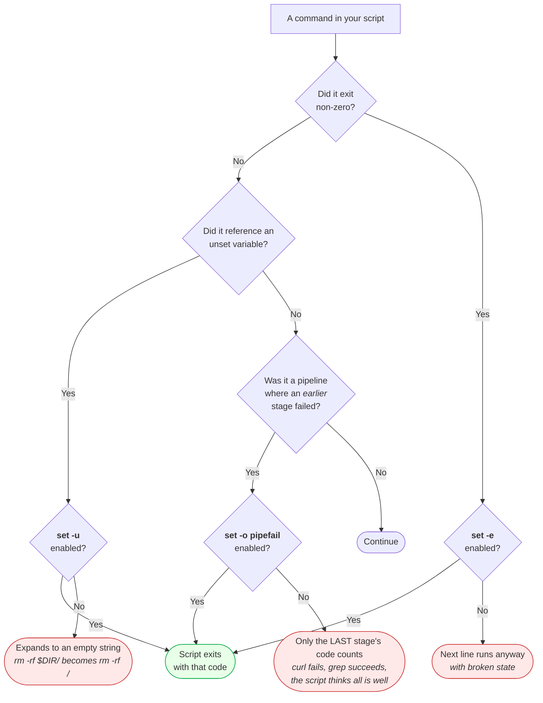
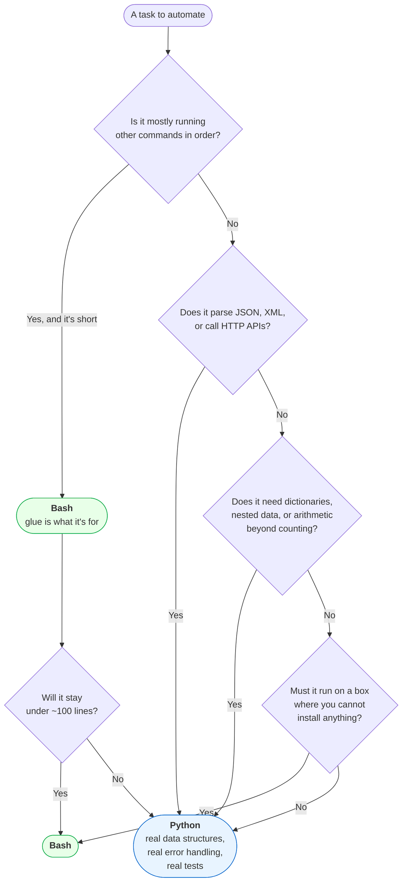
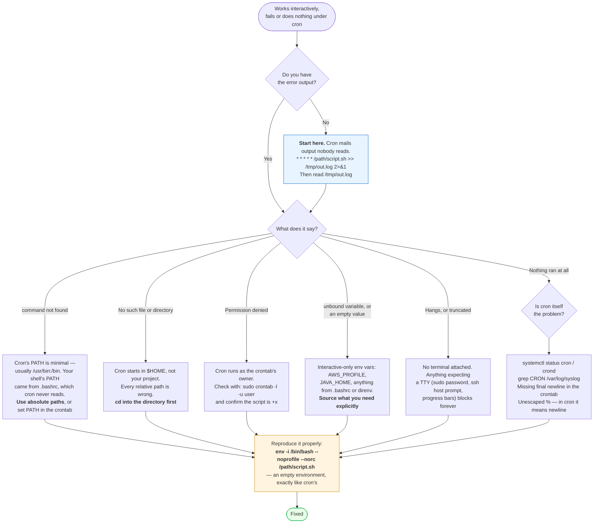

# Module 04: Scripting (Bash + Python)

> *"A DevOps engineer who can't script is a DevOps engineer who does everything manually — twice."*

---

>**Command reference**: [`cheatsheet.md`](./cheatsheet.md) — every command in this module, grouped by task, with the gotchas.
>
>**Cross-module lookup**: [Quick Reference](../QUICK-REFERENCE.md)

---

## Why This Module Matters

Scripting is the **bridge between manual operations and full automation**. Before you learn Terraform, Ansible, or CI/CD pipelines, you need to be able to write scripts that automate repetitive tasks, process data, and glue systems together.

**In real-world DevOps work**, you will:

- Write deployment scripts that handle rollbacks
- Build health check and monitoring scripts
- Automate log rotation and cleanup
- Create backup and restore scripts
- Write glue code between different tools and APIs
- Build CLI tools for your team

### Why Both Bash AND Python?

| Use Bash When | Use Python When |
|--------------|----------------|
| Quick system tasks (file ops, service control) | Complex logic or data processing |
| Chaining Linux commands together | API interactions (REST calls) |
| Simple automation (under 100 lines) | Error handling is critical |
| Cron jobs and one-liners | Working with JSON/YAML/CSV |
| Anything that's mostly shell commands | Scripts others need to maintain |

---

## Table of Contents

### Part 1: Bash Scripting

1. [Bash Fundamentals](#1-bash-fundamentals)
2. [Variables and Data Types](#2-variables-and-data-types)
3. [Control Flow](#3-control-flow)
4. [Functions](#4-functions)
5. [Input and Arguments](#5-input-and-arguments)
6. [Text Processing in Scripts](#6-text-processing-in-scripts)
7. [Error Handling](#7-error-handling)

### Part 2: Python for DevOps

8. [Python Fundamentals for DevOps](#8-python-fundamentals-for-devops)
9. [Working with Files and Data](#9-working-with-files-and-data)
10. [API Interactions](#10-api-interactions)
11. [System Administration with Python](#11-system-administration-with-python)

### General

12. [Common Mistakes and Anti-Patterns](#12-common-mistakes-and-anti-patterns)
13. [Debugging Mindset](#13-debugging-mindset)
14. [Security Considerations](#14-security-considerations)
 4. [Interview Insights](#15-interview-insights)

---

# Part 1: Bash Scripting

## 1. Bash Fundamentals

### Your First Script

```bash
#!/bin/bash
# The shebang (#!/bin/bash) tells the system which interpreter to use
# ALWAYS include it as the first line

# Script header
# Description: My first Bash script
# Author: DevOps Engineer
# Date: 2024-01-15

echo "Hello, DevOps!"
echo "Today is $(date)"
echo "You are logged in as: $(whoami)"
echo "Working directory: $(pwd)"
```

```bash
# Save, make executable, and run
chmod +x myscript.sh
./myscript.sh
```

### The Essential First Line

```bash
#!/bin/bash
set -euo pipefail

# set -e     → Exit immediately if ANY command fails
# set -u     → Treat unset variables as errors
# set -o pipefail → Pipeline fails if ANY command in the pipe fails

# Without these, your script will silently continue after errors
# This is the #1 source of bugs in Bash scripts
```

---

## 2. Variables and Data Types

```bash
#!/bin/bash
set -euo pipefail

# Variable assignment (NO spaces around =)
app_name="web-server"
port=8080
environment="production"

# Using variables (always quote to handle spaces)
echo "Deploying ${app_name} on port ${port}"

# Command substitution
current_date=$(date +%Y-%m-%d)
hostname=$(hostname)
ip_address=$(hostname -I | awk '{print $1}')

echo "Server: ${hostname} (${ip_address})"
echo "Date: ${current_date}"

# Read-only variables (constants)
readonly MAX_RETRIES=3
readonly LOG_DIR="/var/log/myapp"

# Default values (use if variable is not set)
deploy_env="${DEPLOY_ENV:-staging}"   # Use "staging" if DEPLOY_ENV is not set
echo "Deploying to: ${deploy_env}"

# Arrays
servers=("web01" "web02" "web03" "db01")
echo "First server: ${servers[0]}"
echo "All servers: ${servers[@]}"
echo "Number of servers: ${#servers[@]}"

# Loop through array
for server in "${servers[@]}"; do
    echo "Checking: ${server}"
done
```

### Why You Quote Everything

The shell rewrites your line before any command sees it, and the steps run in a fixed order. Word splitting and globbing happen *after* your variable is substituted — which is the entire reason unquoted variables are dangerous:


**Trace `DIR="/var/log/my app"` through it.** Step 3 substitutes the value, step 6 splits it on the space into `/var/log/my` and `app`, and you have just deleted the wrong thing. Quoting — `"$DIR"/*.log` — makes steps 6 and 7 skip the variable's contents entirely.

| Written | What the command receives when `DIR="/var/log/my app"` |
|---------|--------------------------------------------------------|
| `$DIR` | Two arguments: `/var/log/my` and `app`  |
| `"$DIR"` | One argument: `/var/log/my app`  |
| `${arr[@]}` | Split on whitespace, so `"web 01"` becomes two elements  |
| `"${arr[@]}"` | One argument per element, spaces preserved  |

 **The habit worth building**: quote every expansion unless you have a specific reason not to, and use `"${arr[@]}"` for arrays every single time. `shellcheck` catches this class of bug for free — the labs in this module run it, and so should your CI.

---

## 3. Control Flow

### If/Else

```bash
#!/bin/bash
set -euo pipefail

# File checks
if [ -f "/etc/nginx/nginx.conf" ]; then
    echo " Nginx config exists"
else
    echo " Nginx config NOT found"
    exit 1
fi

# Directory check
if [ -d "/var/log/nginx" ]; then
    echo " Log directory exists"
fi

# String comparison
environment="production"
if [ "${environment}" = "production" ]; then
    echo "  Running in PRODUCTION mode"
elif [ "${environment}" = "staging" ]; then
    echo "Running in staging mode"
else
    echo "Running in development mode"
fi

# Numeric comparison
disk_usage=$(df / | awk 'NR==2 {print $5}' | tr -d '%')
if [ "${disk_usage}" -gt 80 ]; then
    echo "  WARNING: Disk usage is ${disk_usage}%"
elif [ "${disk_usage}" -gt 60 ]; then
    echo " Disk usage is ${disk_usage}% — monitor closely"
else
    echo " Disk usage is ${disk_usage}% — healthy"
fi

# Check if a command exists
if command -v docker &> /dev/null; then
    echo " Docker is installed: $(docker --version)"
else
    echo " Docker is NOT installed"
fi

# Check if a service is running
if systemctl is-active --quiet nginx; then
    echo " Nginx is running"
else
    echo " Nginx is NOT running"
fi
```

### Comparison Operators

```bash
# String comparisons (use [ ] or [[ ]])
[ "$a" = "$b" ]     # Equal
[ "$a" != "$b" ]    # Not equal
[ -z "$a" ]         # Is empty
[ -n "$a" ]         # Is not empty

# Numeric comparisons (use -eq, -ne, -gt, -lt, -ge, -le)
[ "$a" -eq "$b" ]   # Equal
[ "$a" -gt "$b" ]   # Greater than
[ "$a" -lt "$b" ]   # Less than
[ "$a" -ge 10 ]     # Greater or equal

# File tests
[ -f "file" ]       # File exists and is regular file
[ -d "dir" ]        # Directory exists
[ -r "file" ]       # File is readable
[ -w "file" ]       # File is writable
[ -x "file" ]       # File is executable
[ -s "file" ]       # File is not empty
```

### Loops

```bash
#!/bin/bash
set -euo pipefail

# For loop — iterate over a list
servers=("web01" "web02" "web03")
for server in "${servers[@]}"; do
    echo "Deploying to ${server}..."
    # ssh ${server} "sudo systemctl restart myapp"  # Real deployment
done

# For loop — numeric range
for i in {1..5}; do
    echo "Attempt ${i} of 5"
done

# For loop — C-style
for ((i=0; i<3; i++)); do
    echo "Index: ${i}"
done

# For loop — files
for file in /var/log/*.log; do
    size=$(stat --format="%s" "${file}" 2>/dev/null || echo "0")
    echo "${file}: ${size} bytes"
done

# While loop — retry pattern (VERY common in DevOps)
max_retries=5
retry_count=0
until curl -sf http://localhost:8080/health > /dev/null 2>&1; do
    retry_count=$((retry_count + 1))
    if [ ${retry_count} -ge ${max_retries} ]; then
        echo " Health check failed after ${max_retries} attempts"
        exit 1
    fi
    echo " Waiting for service... (attempt ${retry_count}/${max_retries})"
    sleep 5
done
echo " Service is healthy!"
```

---

## 4. Functions

```bash
#!/bin/bash
set -euo pipefail

# Function definition
log_info() {
    echo "[$(date '+%Y-%m-%d %H:%M:%S')] [INFO] $*"
}

log_error() {
    echo "[$(date '+%Y-%m-%d %H:%M:%S')] [ERROR] $*" >&2
}

log_warn() {
    echo "[$(date '+%Y-%m-%d %H:%M:%S')] [WARN] $*"
}

# Function with arguments
check_service() {
    local service_name="$1"
    if systemctl is-active --quiet "${service_name}" 2>/dev/null; then
        log_info "${service_name} is running "
        return 0
    else
        log_error "${service_name} is NOT running "
        return 1
    fi
}

# Function with return value
get_disk_usage() {
    local mount_point="${1:-/}"
    df "${mount_point}" | awk 'NR==2 {print $5}' | tr -d '%'
}

# Function with validation
deploy() {
    local app_name="$1"
    local version="${2:-latest}"
    local environment="${3:-staging}"

    if [ -z "${app_name}" ]; then
        log_error "App name is required"
        return 1
    fi

    log_info "Deploying ${app_name}:${version} to ${environment}"
    # Deployment logic here
    log_info "Deployment complete"
}

# Usage
log_info "Starting health checks"
check_service "nginx" || log_warn "Nginx needs attention"
check_service "docker" || log_warn "Docker needs attention"

usage=$(get_disk_usage "/")
log_info "Disk usage: ${usage}%"

deploy "web-app" "v2.1.0" "production"
```

---

## 5. Input and Arguments

```bash
#!/bin/bash
set -euo pipefail

# Script arguments
# $0 = script name
# $1, $2, ... = arguments
# $# = number of arguments
# $@ = all arguments as separate words
# $? = exit code of last command

# Usage function (always include this)
usage() {
    cat << EOF
Usage: $(basename "$0") [OPTIONS] <environment>

Deploy application to the specified environment.

Options:
    -v, --version VERSION    App version to deploy (default: latest)
    -r, --rollback           Rollback to previous version
    -d, --dry-run            Show what would happen without doing it
    -h, --help               Show this help message

Environments:
    staging, production

Examples:
    $(basename "$0") staging
    $(basename "$0") -v 2.1.0 production
    $(basename "$0") --rollback production
EOF
    exit 1
}

# Parse arguments
VERSION="latest"
ROLLBACK=false
DRY_RUN=false
ENVIRONMENT=""

while [[ $# -gt 0 ]]; do
    case "$1" in
        -v|--version)
            VERSION="$2"
            shift 2
            ;;
        -r|--rollback)
            ROLLBACK=true
            shift
            ;;
        -d|--dry-run)
            DRY_RUN=true
            shift
            ;;
        -h|--help)
            usage
            ;;
        -*)
            echo "Unknown option: $1"
            usage
            ;;
        *)
            ENVIRONMENT="$1"
            shift
            ;;
    esac
done

# Validate required arguments
if [ -z "${ENVIRONMENT}" ]; then
    echo "Error: Environment is required"
    usage
fi

if [[ "${ENVIRONMENT}" != "staging" && "${ENVIRONMENT}" != "production" ]]; then
    echo "Error: Invalid environment '${ENVIRONMENT}'"
    usage
fi

echo "Environment: ${ENVIRONMENT}"
echo "Version: ${VERSION}"
echo "Rollback: ${ROLLBACK}"
echo "Dry run: ${DRY_RUN}"
```

---

## 6. Text Processing in Scripts

```bash
#!/bin/bash
set -euo pipefail

# String operations
filename="backup-2024-01-15.tar.gz"

# Substring extraction
echo "${filename%.tar.gz}"          # backup-2024-01-15 (remove suffix)
echo "${filename##*-}"              # 15.tar.gz (remove everything before last -)
echo "${filename%%-*}"              # backup (remove everything from first -)

# String replacement
echo "${filename/2024/2025}"        # Replace first occurrence
echo "${filename//backup/archive}"  # Replace all occurrences

# String length
echo "${#filename}"                 # 28

# Uppercase/lowercase (Bash 4+)
echo "${filename^^}"                # BACKUP-2024-01-15.TAR.GZ
echo "${filename,,}"                # backup-2024-01-15.tar.gz

# Read a file line by line
while IFS= read -r line; do
    # Skip empty lines and comments
    [[ -z "${line}" || "${line}" =~ ^# ]] && continue
    echo "Processing: ${line}"
done < config.txt

# Process CSV data
echo "name,role,ip" > /tmp/servers.csv
echo "web01,frontend,10.0.1.10" >> /tmp/servers.csv
echo "web02,frontend,10.0.1.11" >> /tmp/servers.csv
echo "db01,database,10.0.2.10" >> /tmp/servers.csv

while IFS=',' read -r name role ip; do
    echo "Server: ${name} | Role: ${role} | IP: ${ip}"
done < <(tail -n +2 /tmp/servers.csv)  # Skip header
```

---

## 7. Error Handling

### What `set -euo pipefail` Actually Catches

Bash's default behaviour is to **keep going after a failure**, which is how a deploy script cheerfully removes a directory it never populated. Each flag closes one of those doors:



 **Every red box is a real outage pattern.** `pipefail` is the one people omit: `curl -s "$URL" | jq .version` returns *jq's* exit code, so a failed download becomes an empty version string that sails into production. Three words at the top of the file remove all three.

 **`set -e` has holes you must know about.** It does *not* trigger inside a condition (`if cmd; then`), on the left of `&&`/`||`, or — in older Bash — inside a function called in a condition. That is by design, but it means `set -e` is a safety net, not a guarantee. Check the exit codes that matter explicitly.

```bash
#!/bin/bash
set -euo pipefail

# Trap — run cleanup on exit (success or failure)
cleanup() {
    local exit_code=$?
    echo "Cleaning up temporary files..."
    rm -f /tmp/deploy_lock.pid
    if [ ${exit_code} -ne 0 ]; then
        echo " Script failed with exit code: ${exit_code}"
        # Send alert, rollback, etc.
    fi
}
trap cleanup EXIT

# Trap specific signals
handle_interrupt() {
    echo ""
    echo "  Received interrupt signal. Cleaning up..."
    exit 1
}
trap handle_interrupt SIGINT SIGTERM

# Retry function (production pattern)
retry() {
    local max_attempts="$1"
    local delay="$2"
    shift 2
    local command=("$@")

    local attempt=1
    until "${command[@]}"; do
        if [ ${attempt} -ge ${max_attempts} ]; then
            echo " Command failed after ${max_attempts} attempts: ${command[*]}"
            return 1
        fi
        echo " Attempt ${attempt}/${max_attempts} failed. Retrying in ${delay}s..."
        sleep "${delay}"
        attempt=$((attempt + 1))
    done
}

# Usage: retry 5 3 curl -sf http://localhost:8080/health
# Tries 5 times with 3-second delays

# Lock file pattern (prevent concurrent runs)
LOCK_FILE="/tmp/deploy_lock.pid"
if [ -f "${LOCK_FILE}" ]; then
    existing_pid=$(cat "${LOCK_FILE}")
    if kill -0 "${existing_pid}" 2>/dev/null; then
        echo " Another deployment is running (PID: ${existing_pid})"
        exit 1
    fi
fi
echo $$ > "${LOCK_FILE}"
```

---

# Part 2: Python for DevOps

### Bash or Python?

Both are correct answers to different questions, and picking wrong costs you either an afternoon of `awk` or a 40-line program that should have been one pipe:



 **The honest heuristic: Bash for the first hundred lines, Python after.** Bash is unbeatable at "run these five commands and stop if one fails" — that's a whole category of real work. It gets painful the moment you need a dictionary, arithmetic that isn't counting, or JSON, because none of those are things it has. If you find yourself reaching for `jq` in a loop to build up state, you have already outgrown it.

**The other tiebreaker is who maintains it.** A 300-line Bash script with nested functions and `eval` is readable to its author and to nobody else. The same logic in Python can be tested, and "can be tested" is what separates a script from a tool you trust in a pipeline.

## 8. Python Fundamentals for DevOps

```python
#!/usr/bin/env python3
"""Python fundamentals for DevOps engineers"""

import os
import sys
import json
import subprocess
import logging
from datetime import datetime
from pathlib import Path

# Logging setup (always use logging, not print, in scripts)
logging.basicConfig(
    level=logging.INFO,
    format="%(asctime)s [%(levelname)s] %(message)s"
)
logger = logging.getLogger(__name__)

# Environment variables
env = os.getenv("ENVIRONMENT", "development")
port = int(os.getenv("PORT", "8080"))
logger.info(f"Running in {env} mode on port {port}")

# Running shell commands
def run_command(cmd, check=True):
    """Run a shell command and return the output"""
    result = subprocess.run(
        cmd,
        shell=True,
        capture_output=True,
        text=True,
        check=check
    )
    return result.stdout.strip()

# Usage
hostname = run_command("hostname")
logger.info(f"Hostname: {hostname}")

# Dictionaries (used EVERYWHERE in DevOps — configs, API responses)
server_config = {
    "name": "web-01",
    "ip": "10.0.1.10",
    "port": 8080,
    "tags": ["web", "production", "us-east-1"],
    "health_check": {
        "path": "/health",
        "interval": 30,
        "timeout": 5
    }
}

# Access nested values
health_path = server_config["health_check"]["path"]
is_production = "production" in server_config["tags"]

# List comprehensions (concise data transformation)
servers = ["web01", "web02", "web03", "db01", "db02"]
web_servers = [s for s in servers if s.startswith("web")]
# Result: ["web01", "web02", "web03"]
```

---

## 9. Working with Files and Data

```python
#!/usr/bin/env python3
"""Working with files, JSON, and YAML in DevOps scripts"""

import json
import yaml  # pip install pyyaml
from pathlib import Path

# JSON (API responses, configs, Terraform state)
config = {
    "app": "web-server",
    "version": "2.1.0",
    "instances": 3,
    "regions": ["us-east-1", "eu-west-1"]
}

# Write JSON
with open("config.json", "w") as f:
    json.dump(config, f, indent=2)

# Read JSON
with open("config.json", "r") as f:
    loaded = json.load(f)
    print(f"App: {loaded['app']}, Version: {loaded['version']}")

# YAML (Kubernetes manifests, Ansible playbooks, Docker Compose)
k8s_deployment = {
    "apiVersion": "apps/v1",
    "kind": "Deployment",
    "metadata": {"name": "web-app", "namespace": "production"},
    "spec": {
        "replicas": 3,
        "selector": {"matchLabels": {"app": "web-app"}},
    }
}

# Write YAML
with open("deployment.yaml", "w") as f:
    yaml.dump(k8s_deployment, f, default_flow_style=False)

# Read YAML
with open("deployment.yaml", "r") as f:
    loaded = yaml.safe_load(f)
    print(f"Deploying: {loaded['metadata']['name']}")

# File operations with pathlib
log_dir = Path("/var/log/myapp")
log_files = list(log_dir.glob("*.log")) if log_dir.exists() else []

for log_file in sorted(log_files):
    size_mb = log_file.stat().st_size / (1024 * 1024)
    print(f"{log_file.name}: {size_mb:.1f} MB")
```

---

## 10. API Interactions

```python
#!/usr/bin/env python3
"""Interacting with APIs — essential for DevOps automation"""

import requests  # pip install requests
import json

# GET request (monitoring, health checks)
def check_service_health(url, timeout=5):
    """Check if a service is healthy"""
    try:
        response = requests.get(url, timeout=timeout)
        return {
            "healthy": response.status_code == 200,
            "status_code": response.status_code,
            "response_time": response.elapsed.total_seconds()
        }
    except requests.exceptions.Timeout:
        return {"healthy": False, "error": "timeout"}
    except requests.exceptions.ConnectionError:
        return {"healthy": False, "error": "connection_refused"}

# Usage
result = check_service_health("http://localhost:8080/health")
print(json.dumps(result, indent=2))

# POST request (creating resources, triggering deployments)
def trigger_deployment(api_url, app_name, version, token):
    """Trigger a deployment via API"""
    response = requests.post(
        f"{api_url}/deployments",
        headers={
            "Authorization": f"Bearer {token}",
            "Content-Type": "application/json"
        },
        json={
            "application": app_name,
            "version": version,
            "environment": "production"
        },
        timeout=30
    )
    response.raise_for_status()  # Raises exception for 4xx/5xx
    return response.json()

# GitHub API example — list open PRs
def get_open_prs(repo, token):
    """Get open pull requests for a GitHub repo"""
    response = requests.get(
        f"https://api.github.com/repos/{repo}/pulls",
        headers={"Authorization": f"token {token}"},
        params={"state": "open"}
    )
    response.raise_for_status()
    prs = response.json()
    for pr in prs:
        print(f"#{pr['number']}: {pr['title']} (by {pr['user']['login']})")
    return prs
```

---

## 11. System Administration with Python

```python
#!/usr/bin/env python3
"""System administration tasks with Python"""

import os
import shutil
import psutil  # pip install psutil
from datetime import datetime

def get_system_info():
    """Gather system health information"""
    return {
        "cpu_percent": psutil.cpu_percent(interval=1),
        "memory": {
            "total_gb": round(psutil.virtual_memory().total / (1024**3), 1),
            "used_percent": psutil.virtual_memory().percent,
            "available_gb": round(psutil.virtual_memory().available / (1024**3), 1)
        },
        "disk": {
            "total_gb": round(psutil.disk_usage('/').total / (1024**3), 1),
            "used_percent": psutil.disk_usage('/').percent
        },
        "network_connections": len(psutil.net_connections()),
        "process_count": len(psutil.pids()),
        "boot_time": datetime.fromtimestamp(psutil.boot_time()).isoformat()
    }

def find_large_files(directory, min_size_mb=100):
    """Find files larger than specified size"""
    large_files = []
    for root, dirs, files in os.walk(directory):
        for file in files:
            filepath = os.path.join(root, file)
            try:
                size = os.path.getsize(filepath)
                if size > min_size_mb * 1024 * 1024:
                    large_files.append({
                        "path": filepath,
                        "size_mb": round(size / (1024 * 1024), 1)
                    })
            except (OSError, PermissionError):
                continue
    return sorted(large_files, key=lambda x: x["size_mb"], reverse=True)

def cleanup_old_logs(log_dir, max_age_days=30):
    """Delete log files older than max_age_days"""
    deleted = []
    now = datetime.now()
    for filepath in Path(log_dir).glob("*.log*"):
        file_age = now - datetime.fromtimestamp(filepath.stat().st_mtime)
        if file_age.days > max_age_days:
            filepath.unlink()
            deleted.append(str(filepath))
    return deleted

# Usage
if __name__ == "__main__":
    import json
    info = get_system_info()
    print(json.dumps(info, indent=2))
```

---

## 12. Common Mistakes and Anti-Patterns

### Not Using `set -euo pipefail` in Bash

```bash
# BAD: Script continues after errors
rm /some/file/that/doesnt/exist
echo "This still runs even though rm failed!"

# GOOD:
set -euo pipefail
rm /some/file/that/doesnt/exist
echo "This never runs — script exits on error"
```

### Not Quoting Variables in Bash

```bash
# BAD: Breaks with spaces in values
filename=$1
rm $filename       # If filename is "my file.txt", this deletes "my" and "file.txt"

# GOOD
filename="$1"
rm "${filename}"   # Correctly handles spaces
```

### Using `print()` Instead of `logging` in Python

```python
# BAD
print("Starting deployment")
print("ERROR: something failed")

# GOOD
import logging
logger = logging.getLogger(__name__)
logger.info("Starting deployment")
logger.error("Something failed")
# Logging gives you: timestamps, levels, file output, filtering
```

---

## 13. Debugging Mindset

### Bash Debugging

```bash
# Trace execution (shows every command as it runs)
bash -x script.sh

# Or add to your script temporarily
set -x    # Enable tracing
# ... code to debug ...
set +x    # Disable tracing

# Debug print (with stderr so it doesn't interfere with output)
echo "DEBUG: variable=${variable}" >&2
```

### Python Debugging

```python
# Quick debug
import pdb; pdb.set_trace()  # Drops into interactive debugger

# Better: Use structured logging
import logging
logging.basicConfig(level=logging.DEBUG)
logger = logging.getLogger(__name__)
logger.debug(f"Processing server: {server_name}")
```

### Troubleshooting: "It Works in My Shell but Fails in Cron"

The most common scripting ticket in existence, and it is almost never the script's logic. A cron job runs in a different world than your terminal:



 **`env -i` is the trick worth remembering.** It runs your script with *no* inherited environment, which reproduces the cron failure in your own terminal in one second — instead of the edit-wait-five-minutes-check-again loop that makes this bug so tedious.

 **Redirect output on every cron entry you write**, even ones you expect to be silent. A cron job with no redirection that fails is completely invisible: no log, no alert, and mail that goes to a local spool nobody has opened since 2009.

---

## 14. Security Considerations

>Scripts are common attack vectors. Handle them carefully.

- **Never hardcode secrets** — use environment variables or secret managers
- **Validate all input** — especially in scripts that run as root
- **Use `set -euo pipefail`** — prevent silent failures
- **Don't use `eval`** — it executes arbitrary code
- **Set proper permissions** — `chmod 700` for scripts with secrets
- **Use `shellcheck`** to lint Bash scripts: `shellcheck myscript.sh`

---

## 15. Interview Insights

**Q: Write a script to check if a service is running and restart it if not.**

```bash
#!/bin/bash
set -euo pipefail
SERVICE="$1"
if ! systemctl is-active --quiet "${SERVICE}"; then
    echo "$(date): ${SERVICE} is down, restarting..."
    sudo systemctl restart "${SERVICE}"
    sleep 5
    if systemctl is-active --quiet "${SERVICE}"; then
        echo "$(date): ${SERVICE} restarted successfully"
    else
        echo "$(date): FAILED to restart ${SERVICE}" >&2
        exit 1
    fi
else
    echo "$(date): ${SERVICE} is running"
fi
```

**Q: What does `set -euo pipefail` do?**
> `-e` exits on any error, `-u` treats unset variables as errors, `-o pipefail` catches errors in piped commands. Together they prevent silent failures — the #1 source of bugs in bash scripts.

**Q: When would you use Python over Bash?**
> Python for: complex logic, API interactions, JSON/YAML processing, error handling, scripts that need to be maintainable. Bash for: quick system tasks, chaining commands, simple automation, cron jobs, anything under ~50 lines.

---

## Labs and Projects

Read the sections above first, then work through these **in order**. Every lab ends with a  **Break It** section — those are not optional; they are where the debugging skill actually comes from.

| # | Lab | What you'll do |
|---|-----|----------------|
| 1 | **[Bash Scripting for DevOps](./labs/lab-01-bash-scripting.md)** | Write production-grade Bash scripts for real DevOps tasks — deployment, health checking, log rotation, and system monitoring. |
| 2 | **[Python Automation for DevOps](./labs/lab-02-python-automation.md)** | Build practical Python tools for DevOps automation — API health checkers, system inventory scripts, and log analyzers. |

**Portfolio project:**

- [Project: Log Parser Automation](./projects/project-01-log-parser.md) — Write a Bash or Python script that analyzes an application or web server log and produces a short operational report.

**Reference code** for every lab: [`code/`](./code/) — real files, validated in CI.

---

## Self-Check

Answer these from memory before you expand them. If more than two give you trouble, re-read the sections they come from — the labs assume this material is solid.

<details>
<summary><strong>1. What does `set -euo pipefail` do, and which failure does each part catch?</strong></summary>

`-e` exits on an unhandled non-zero status, `-u` errors on an unset variable instead of expanding to empty, and `-o pipefail` fails a pipeline when any stage fails — without it only the last command's status counts, so `curl broken | jq .` reports success.

</details>

<details>
<summary><strong>2. Why must you quote `"$var"`?</strong></summary>

An unquoted expansion is word-split and glob-expanded. A path containing a space becomes two arguments, a value containing `*` becomes a list of filenames, and an empty variable disappears entirely. `rm -rf $dir/` with an empty `dir` is how people delete a root filesystem.

</details>

<details>
<summary><strong>3. `"$@"` versus `"$*"`?</strong></summary>

`"$@"` expands to each argument as its own word, which is what you want when forwarding arguments. `"$*"` joins them into a single string, which is only right when you genuinely want one value — for a log line, say.

</details>

<details>
<summary><strong>4. When do you stop writing Bash and switch to Python?</strong></summary>

When you need real data structures, JSON or API handling, retries with error handling, or functions you intend to test. Bash is excellent glue for commands and pipes; the moment it starts parsing structured data it becomes unmaintainable.

</details>

<details>
<summary><strong>5. What makes a script idempotent, and why does it matter?</strong></summary>

It checks state before acting — does the user exist, is the line already in the file, is the mount already there — so a second run reports nothing to do rather than doubling the change. In automation, being run again is the normal case, not the exception.

</details>

<details>
<summary><strong>6. How do you guarantee a temporary file is cleaned up even when the script fails?</strong></summary>

`trap 'rm -rf "$tmpdir"' EXIT` — the trap fires on every exit path, including the early exit that `set -e` triggers. Cleanup written as the last line of the script only runs when nothing goes wrong.

</details>

---

## Practical Checkpoint

Before moving on, you should be able to:

- Write Bash scripts with arguments, validation, logging, and safe failure behavior.
- Use Python for automation tasks that need structured data, APIs, or clearer error handling.
- Debug a script by checking inputs, exit codes, logs, and intermediate output.

Portfolio evidence to keep:

- At least one Bash automation script.
- At least one Python automation script.
- Sample inputs, outputs, and notes for one script failure you diagnosed.

Suggested project: [Log Parser Automation](./projects/project-01-log-parser.md)

---

## What's Next?

You can now automate tasks. Next, we containerize applications with Docker — the foundation of modern deployment.

**[Module 05: Containers & Docker →](../05-containers-docker/)**

---

<div align="center">

**Module 04 Complete** 

[← Back to Git](../03-git/) | [ Cheat Sheet](./cheatsheet.md) | [Next: Docker →](../05-containers-docker/)

</div>


## Reference
<!-- tab: Cheatsheet -->
> Bash and Python patterns for automation. Concepts live in the [module README](./README.md).
> Cross-module daily commands: **[QUICK-REFERENCE.md](../QUICK-REFERENCE.md)**

**Jump to:** [Script skeleton](#the-script-skeleton) · [Variables](#variables--expansion) · [Tests](#test-conditions) · [Control flow](#control-flow) · [Functions](#functions) · [Arguments](#arguments--input) · [Arrays](#arrays--maps) · [Error handling](#error-handling) · [Debugging](#debugging-bash) · [Python](#python-for-devops) · [Pitfalls](#common-pitfalls)

---

## The Script Skeleton

Start every script with this. It turns silent, dangerous failures into loud, immediate ones.

```bash
#!/usr/bin/env bash
set -Eeuo pipefail
IFS=$'\n\t'

# -E  ERR trap is inherited by functions and subshells
# -e  exit immediately if any command fails
# -u  error on undefined variables        catches typos
# -o pipefail  a pipeline fails if ANY stage fails, not just the last
# IFS  only split on newlines and tabs, not spaces — filenames with spaces survive

SCRIPT_DIR="$(cd -- "$(dirname -- "${BASH_SOURCE[0]}")" && pwd)"
readonly SCRIPT_DIR

log()  { printf '[%(%Y-%m-%dT%H:%M:%S%z)T] %s\n' -1 "$*" >&2; }
die()  { log "ERROR: $*"; exit 1; }

cleanup() {
  local rc=$?
  [[ -n "${TMPDIR_:-}" && -d "$TMPDIR_" ]] && rm -rf -- "$TMPDIR_"
  exit "$rc"
}
trap cleanup EXIT
trap 'die "failed at line $LINENO: $BASH_COMMAND"' ERR

TMPDIR_="$(mktemp -d)"

main() {
  log "starting"
  # ... work ...
  log "done"
}

main "$@"
```

>`set -e` has real gotchas: it does **not** trigger inside `if`/`while` conditions, on the left of `&&`/`||`, or in a function whose result is tested. When correctness matters, check exit codes explicitly rather than relying on `-e` alone.

---

## Variables & Expansion

```bash
name="value"                # no spaces around =
readonly CONST="fixed"
local scoped="x"            # inside functions only
export VISIBLE_TO_CHILDREN=1

echo "$name"                #  ALWAYS quote — unquoted vars word-split and glob
echo "${name}_suffix"       # braces disambiguate
```

### Parameter expansion (bash's hidden superpower)

| Expression | Result |
|------------|--------|
| `${var:-default}` | `var` if set and non-empty, else `default` |
| `${var:=default}` | ...and **assign** the default to `var` |
| `${var:?message}` | Exit with `message` if `var` is unset  great for required config |
| `${var:+alt}` | `alt` only if `var` **is** set |
| `${#var}` | Length |
| `${var:2:5}` | Substring from index 2, length 5 |
| `${var#prefix}` | Strip shortest matching prefix |
| `${var##*/}` | Strip longest prefix up to `/` → **basename** |
| `${var%suffix}` | Strip shortest matching suffix |
| `${var%.*}` | Strip the extension |
| `${var%/*}` | → **dirname** |
| `${var/old/new}` | Replace the **first** occurrence |
| `${var//old/new}` | Replace **all** occurrences |
| `${var/#old/new}` | Replace only at the start |
| `${var^^}` / `${var,,}` | Upper-case / lower-case |
| `${!prefix*}` | Names of all variables starting with `prefix` |

```bash
: "${DATABASE_URL:?DATABASE_URL must be set}"   #  fail fast on missing config
port="${PORT:-8080}"
file="/var/log/nginx/access.log"
echo "${file##*/}"    # access.log
echo "${file%/*}"     # /var/log/nginx
echo "${file%.log}"   # /var/log/nginx/access
```

### Command substitution & arithmetic

```bash
now="$(date -u +%Y-%m-%dT%H:%M:%SZ)"     #  $(...) not backticks — it nests
count="$(grep -c ERROR app.log)"

(( total = 3 * 7 ))
(( count++ ))
(( a > b )) && echo "a wins"
percent=$(( used * 100 / total ))
echo "$(( RANDOM % 100 ))"
awk "BEGIN{printf \"%.2f\", 22/7}"       # bash has no floats — use awk or bc
```

### Special variables

| Var | Meaning |
|-----|---------|
| `$0` | Script name |
| `$1`…`$9` | Positional arguments |
| `$#` | Number of arguments |
| `"$@"` | All arguments, **each properly quoted**  |
| `$*` | All arguments as one string |
| `$?` | Exit status of the last command |
| `$$` | This script's PID |
| `$!` | PID of the last background job |
| `$LINENO` | Current line number |
| `${BASH_SOURCE[0]}` | This file's path (works when sourced; `$0` doesn't) |
| `$PIPESTATUS` | Array of exit codes from every stage of the last pipeline |

---

## Test Conditions

Prefer `[[ ]]` over `[ ]` in bash — no word-splitting surprises, supports `&&`, `||`, `=~`.

### Files

| Test | True when |
|------|-----------|
| `[[ -e path ]]` | Exists (any type) |
| `[[ -f path ]]` | Is a regular file |
| `[[ -d path ]]` | Is a directory |
| `[[ -L path ]]` | Is a symlink |
| `[[ -s path ]]` | Exists and is **non-empty** |
| `[[ -r/-w/-x path ]]` | Readable / writable / executable |
| `[[ f1 -nt f2 ]]` | f1 is newer than f2 |

### Strings & numbers

| Test | True when |
|------|-----------|
| `[[ -z "$s" ]]` | String is empty |
| `[[ -n "$s" ]]` | String is non-empty |
| `[[ "$a" == "$b" ]]` | Strings equal |
| `[[ "$a" == pat* ]]` | **Glob** match (don't quote the pattern) |
| `[[ "$a" =~ ^[0-9]+$ ]]` | **Regex** match (don't quote the regex) |
| `[[ $a -eq $b ]]` | Numeric equal (`-ne -lt -le -gt -ge`) |
| `(( a > b ))` | Arithmetic comparison — reads more naturally |

```bash
[[ -f "$config" ]] || die "config not found: $config"
[[ "$env" =~ ^(dev|staging|prod)$ ]] || die "invalid environment: $env"
[[ -n "${DEBUG:-}" ]] && set -x
```

---

## Control Flow

```bash
if [[ cond ]]; then
  ...
elif [[ cond ]]; then
  ...
else
  ...
fi

case "$1" in
  start)        start_service ;;
  stop)         stop_service ;;
  restart)      stop_service; start_service ;;
  status|check) show_status ;;
  *)            die "usage: $0 {start|stop|restart|status}" ;;
esac

for f in *.log; do
  [[ -e "$f" ]] || continue        #  guard: an unmatched glob stays literal
  gzip "$f"
done

for i in {1..5};        do echo "$i"; done
for i in $(seq 0 10 100); do echo "$i"; done
for ((i = 0; i < 10; i++)); do echo "$i"; done

#  Read a file line by line — SAFELY
while IFS= read -r line; do
  echo "processing: $line"
done < input.txt

# Iterate over command output without a subshell losing your variables
while IFS= read -r pod; do
  kubectl delete pod "$pod"
done < <(kubectl get pods -o name)

# Retry with backoff
for attempt in 1 2 3 4 5; do
  if curl -sSf --max-time 5 "$url" >/dev/null; then break; fi
  log "attempt $attempt failed; retrying in $((attempt * 2))s"
  sleep $((attempt * 2))
  (( attempt == 5 )) && die "giving up on $url"
done

# Wait for a condition with a timeout
deadline=$(( SECONDS + 60 ))
until curl -sf "$url/health" >/dev/null; do
  (( SECONDS > deadline )) && die "timed out waiting for $url"
  sleep 2
done
```

---

## Functions

```bash
greet() {
  local name="${1:?name required}"      # locals are essential — no accidental globals
  local greeting="${2:-Hello}"
  printf '%s, %s!\n' "$greeting" "$name"
}

greet "World"
greet "DevOps" "Welcome"

# Return a value: echo it and capture, or use a nameref
get_version() { echo "1.2.3"; }
version="$(get_version)"

# Exit status as a boolean
is_running() { systemctl is-active --quiet "$1"; }
if is_running nginx; then echo "up"; fi

# Nameref (bash 4.3+) — "return" into a caller's variable
set_result() { local -n out="$1"; out="computed"; }
set_result myvar; echo "$myvar"
```

>`return` in bash only sets an exit status (0–255). To hand back data, `echo` it and capture with `$(...)`, or use a nameref.

---

## Arguments & Input

```bash
# Simple positional handling
[[ $# -ge 1 ]] || die "usage: $0 <environment> [region]"
environment="$1"
region="${2:-us-east-1}"

# Flags with getopts (short options)
usage() { cat <<EOF
Usage: $0 -e ENV [-r REGION] [-v] [-h]
  -e ENV      environment: dev|staging|prod  (required)
  -r REGION   AWS region (default: us-east-1)
  -v          verbose
EOF
exit 1; }

verbose=0; region="us-east-1"; env=""
while getopts ":e:r:vh" opt; do
  case "$opt" in
    e) env="$OPTARG" ;;
    r) region="$OPTARG" ;;
    v) verbose=1 ;;
    h) usage ;;
    :) die "-$OPTARG requires an argument" ;;
    \?) die "unknown option: -$OPTARG" ;;
  esac
done
shift $((OPTIND - 1))
[[ -n "$env" ]] || usage

# Long options — parse manually
while [[ $# -gt 0 ]]; do
  case "$1" in
    --env)     env="$2"; shift 2 ;;
    --env=*)   env="${1#*=}"; shift ;;
    --dry-run) dry_run=1; shift ;;
    --)        shift; break ;;
    -*)        die "unknown option: $1" ;;
    *)         args+=("$1"); shift ;;
  esac
done
```

```bash
read -rp "Continue? [y/N] " answer          # -r = don't mangle backslashes
[[ "$answer" =~ ^[Yy]$ ]] || exit 0
read -rsp "Password: " pass; echo           # -s = silent

# Heredoc
cat > config.yml <<EOF
env: $environment          # variables ARE expanded
EOF

cat > script.sh <<'EOF'
echo "$HOME"               # quoted delimiter = NO expansion  
EOF

cat <<-EOF                 # <<- strips leading TABS (not spaces)
	indented heredoc
EOF
```

---

## Arrays & Maps

```bash
# Indexed arrays
servers=("web-01" "web-02" "db-01")
servers+=("cache-01")
echo "${servers[0]}"          # first element
echo "${servers[@]}"          # all elements
echo "${#servers[@]}"         # count
echo "${servers[@]:1:2}"      # slice
for s in "${servers[@]}"; do echo "$s"; done       #  always quote [@]

mapfile -t lines < file.txt              # read a file into an array, no trailing newlines
readarray -t pods < <(kubectl get pods -o name)

# Associative arrays (bash 4+)
declare -A ports=([http]=80 [https]=443 [ssh]=22)
ports[postgres]=5432
echo "${ports[https]}"
for svc in "${!ports[@]}"; do            # ! gives the KEYS
  echo "$svc → ${ports[$svc]}"
done
[[ -v ports[http] ]] && echo "key exists"
unset 'ports[ssh]'
```

---

## Error Handling

```bash
# Explicit checks beat relying on set -e
if ! command -v terraform >/dev/null 2>&1; then
  die "terraform is not installed"
fi

output="$(some_command 2>&1)" || die "some_command failed: $output"

# Capture status without tripping set -e
set +e; risky_command; rc=$?; set -e
(( rc == 0 )) || log "risky_command returned $rc, continuing anyway"

# Check every stage of a pipeline
cmd1 | cmd2 | cmd3
echo "${PIPESTATUS[@]}"        # e.g. "0 1 0" — stage 2 failed

# Guaranteed cleanup
tmp="$(mktemp)"
trap 'rm -f -- "$tmp"' EXIT

# Prevent concurrent runs
exec 200>/var/lock/myscript.lock
flock -n 200 || die "another instance is already running"

# Idempotency: make the script safe to re-run
mkdir -p "$dir"                        # not: mkdir "$dir"
grep -qxF "$line" "$file" || echo "$line" >> "$file"
id -u appuser &>/dev/null || useradd -r appuser
```

**Standard exit codes:**

| Code | Meaning |
|------|---------|
| `0` | Success |
| `1` | General error |
| `2` | Misuse of a shell builtin / bad arguments |
| `126` | Command found but not executable |
| `127` | Command not found |
| `128+N` | Killed by signal N (`130` = Ctrl-C/SIGINT, `137` = SIGKILL/OOM, `143` = SIGTERM) |

---

## Debugging Bash

```bash
bash -n script.sh              # syntax check, don't execute  
bash -x script.sh              # trace every command as it runs
bash -u script.sh              # error on undefined variables
set -x / set +x                # trace just one section
PS4='+ ${BASH_SOURCE}:${LINENO}:${FUNCNAME[0]:-main}: '   #  richer trace prefix

# shellcheck — install it, run it on everything
shellcheck script.sh
shellcheck -S warning script.sh
# In CI:  find . -name '*.sh' -print0 | xargs -0 shellcheck

# Trace to a file without polluting stdout
exec 5> >(logger -t myscript); BASH_XTRACEFD=5; set -x
```

---

## Python for DevOps

### Script skeleton

```python
#!/usr/bin/env python3
"""One-line description of what this does."""
from __future__ import annotations

import argparse
import logging
import os
import subprocess
import sys
from pathlib import Path

log = logging.getLogger(__name__)


def parse_args(argv: list[str] | None = None) -> argparse.Namespace:
    p = argparse.ArgumentParser(description=__doc__)
    p.add_argument("path", type=Path, help="file to process")
    p.add_argument("-e", "--env", choices=["dev", "staging", "prod"], required=True)
    p.add_argument("-n", "--dry-run", action="store_true")
    p.add_argument("-v", "--verbose", action="count", default=0)
    return p.parse_args(argv)


def main(argv: list[str] | None = None) -> int:
    args = parse_args(argv)
    logging.basicConfig(
        level=logging.DEBUG if args.verbose else logging.INFO,
        format="%(asctime)s %(levelname)-8s %(message)s",
    )
    if not args.path.exists():
        log.error("not found: %s", args.path)
        return 1
    log.info("processing %s for %s", args.path, args.env)
    return 0


if __name__ == "__main__":
    sys.exit(main())
```

### Files and paths (`pathlib`)

```python
from pathlib import Path

p = Path("/var/log/app.log")
p.exists(); p.is_file(); p.is_dir()
p.name          # 'app.log'
p.stem          # 'app'
p.suffix        # '.log'
p.parent        # PosixPath('/var/log')
p.stat().st_size

text = p.read_text(encoding="utf-8")
p.write_text("content\n")
Path("out/dir").mkdir(parents=True, exist_ok=True)

for f in Path("/etc").glob("*.conf"):        ...
for f in Path("/srv").rglob("*.yml"):        ...   # recursive

with open(p, encoding="utf-8") as fh:              # streams — safe for huge files
    for line in fh:
        if "ERROR" in line:
            print(line.rstrip())
```

### JSON, YAML, CSV

```python
import json, csv
import yaml           # pip install pyyaml

data = json.loads(raw)
raw  = json.dumps(data, indent=2, sort_keys=True)
with open("f.json") as fh: data = json.load(fh)
with open("f.json", "w") as fh: json.dump(data, fh, indent=2)

with open("deploy.yml") as fh: cfg = yaml.safe_load(fh)      #  safe_load, never load
with open("out.yml", "w") as fh: yaml.safe_dump(cfg, fh, sort_keys=False)

with open("hosts.csv", newline="") as fh:
    for row in csv.DictReader(fh):
        print(row["hostname"], row["ip"])
```

### Running commands

```python
import subprocess

r = subprocess.run(
    ["kubectl", "get", "pods", "-o", "json"],
    capture_output=True, text=True, timeout=30, check=False,
)
if r.returncode != 0:
    raise RuntimeError(f"kubectl failed: {r.stderr.strip()}")
pods = json.loads(r.stdout)

subprocess.run(["terraform", "apply", "-auto-approve"], check=True)   # raises on failure

#  Never do this with untrusted input — shell=True is a command-injection hole
subprocess.run(f"rm -rf {user_input}", shell=True)    # 
subprocess.run(["rm", "-rf", user_input])             #  argument list, no shell
```

### HTTP

```python
import requests    # pip install requests

r = requests.get(url, timeout=10, headers={"Authorization": f"Bearer {token}"})
r.raise_for_status()          #  raises on 4xx/5xx — never skip this
data = r.json()

r = requests.post(url, json={"key": "value"}, timeout=10)

# Retry with backoff on a shared session
from requests.adapters import HTTPAdapter
from urllib3.util.retry import Retry

s = requests.Session()
s.mount("https://", HTTPAdapter(max_retries=Retry(
    total=3, backoff_factor=1, status_forcelist=[429, 500, 502, 503, 504],
)))
```

### Environment & config

```python
import os

token = os.environ["API_TOKEN"]              # KeyError if missing — often what you want
debug = os.getenv("DEBUG", "false").lower() in ("1", "true", "yes")
port  = int(os.getenv("PORT", "8080"))

from dotenv import load_dotenv               # pip install python-dotenv
load_dotenv()
```

### Useful stdlib for ops

| Module | For |
|--------|-----|
| `pathlib` | Filesystem paths |
| `subprocess` | Running commands |
| `argparse` | CLI arguments |
| `logging` | Structured output |
| `json` / `csv` / `configparser` | Data formats |
| `datetime` / `zoneinfo` | Timestamps |
| `re` | Regex |
| `shutil` | Copy, move, `disk_usage`, `which` |
| `tempfile` | Safe temp files (`TemporaryDirectory`) |
| `socket` | Port checks, hostname |
| `hashlib` | Checksums |
| `concurrent.futures` | Parallel API calls / SSH fan-out |

```python
# Parallel work over many hosts
from concurrent.futures import ThreadPoolExecutor, as_completed

with ThreadPoolExecutor(max_workers=10) as ex:
    futures = {ex.submit(check_host, h): h for h in hosts}
    for fut in as_completed(futures):
        host = futures[fut]
        try:
            print(host, fut.result())
        except Exception as exc:
            print(f"{host} failed: {exc}")
```

### Tooling

```bash
python3 -m venv .venv && source .venv/bin/activate
pip install -r requirements.txt
pip freeze > requirements.txt

ruff check .            # fast linter (replaces flake8/isort/pyupgrade)
ruff format .           # formatter (black-compatible)
mypy script.py          # static type checking
pytest -v               # tests
pytest --cov=src        # coverage
bandit -r .             # security linting
```

---

## Common Pitfalls

|  Don't |  Do | Why |
|----------|-------|-----|
| `rm -rf $DIR` | `rm -rf -- "${DIR:?}"` | Unset variable → deletes the wrong thing |
| `if [ $x = "y" ]` | `if [[ "$x" == "y" ]]` | Empty `$x` makes `[` a syntax error |
| `for f in $(ls)` | `for f in *` | `ls` output breaks on spaces/newlines |
| `cat f \| grep x` | `grep x f` | Useless use of cat |
| `` `cmd` `` | `$(cmd)` | Nests correctly, easier to read |
| `cd /some/dir` | `cd /some/dir \|\| exit 1` | A failed `cd` runs the rest in the wrong place |
| `echo $var` | `printf '%s\n' "$var"` | `echo` mangles backslashes and leading `-` |
| `sleep 30` then assume ready | Poll with a timeout | Fixed sleeps are flaky and slow |
| Parsing `ls`/`ps` output | `find -print0`, `pgrep` | Output formats vary |
| Secrets in the script | Env vars or a secret manager | Scripts get committed |
| `curl url \| bash` | Download, read, then run | Blind remote execution |
| No `set -euo pipefail` | Always start with it | Silent failures compound |

```bash
# Race-free "wait until ready"
timeout 60 bash -c 'until curl -sf localhost:8080/health; do sleep 2; done' \
  || die "service never became healthy"
```

---

<div align="center">

[← Module 04 README](./README.md) · [Resources](./resources.md) · [Labs](./labs/) · [Handbook Quick Reference](../QUICK-REFERENCE.md)

</div>
<!-- tab: Labs -->
# Lab 01: Bash Scripting for DevOps

## Objective

Write production-grade Bash scripts for real DevOps tasks — deployment, health checking, log rotation, and system monitoring.

---

## Prerequisites

- Bash shell (Linux/WSL2/macOS)
- ShellCheck installed: `sudo apt install -y shellcheck` on Debian/Ubuntu or `sudo dnf install -y ShellCheck` on RHEL-compatible systems

---

## Deliverables and Evidence

By the end of this lab, keep the following evidence in your notes or portfolio repo:

- Commands you ran and the important output you used for validation
- Any files, scripts, configs, manifests, or workflows you created
- A short failure note describing one thing that broke, how you diagnosed it, and how you fixed it
- Cleanup commands or confirmation that no long-running resources remain

Treat the validation section as the minimum proof that the lab worked.

---

## Lab Files

Every file this lab creates also exists as a real, CI-validated file in
[`../code/lab-01/`](../code/lab-01/) (2 files).

```bash
# Option A — type them out yourself (recommended the first time; that's the learning)
# Option B — start from the reference copies
cp -r /path/to/the-devops-handbook/04-scripting/code/lab-01/. .
```

Use Option B when you're comparing against a known-good version, or when something
won't start and you need to rule out a typo. See [`../code/README.md`](../code/README.md).

---

## Exercise 1: Build a Deployment Script

### The Script

```bash
mkdir -p ~/devops-labs/module-04/scripts
cd ~/devops-labs/module-04/scripts

cat > deploy.sh << 'DEPLOY'
#!/bin/bash
set -euo pipefail

#
# Deployment Script
# Usage: ./deploy.sh -a <app_name> -v <version> -e <environment>
#

# ═══════════════════════════════════════
# Configuration
# ═══════════════════════════════════════
# Declare and assign separately: `readonly X="$(cmd)"` hides the command's
# exit status behind readonly's, so a failure here would go unnoticed (SC2155).
SCRIPT_DIR="$(cd "$(dirname "$0")" && pwd)"
readonly SCRIPT_DIR

LOG_FILE="/tmp/deploy_$(date +%Y%m%d_%H%M%S).log"
readonly LOG_FILE

readonly LOCK_FILE="/tmp/deploy.lock"
readonly BACKUP_DIR="${SCRIPT_DIR}/backups"

# ═══════════════════════════════════════
# Logging Functions
# ═══════════════════════════════════════
log() { echo "[$(date '+%Y-%m-%d %H:%M:%S')] [$1] $2" | tee -a "${LOG_FILE}"; }
info()  { log "INFO"  "$1"; }
warn()  { log "WARN"  "$1"; }
error() { log "ERROR" "$1" >&2; }

# ═══════════════════════════════════════
# Cleanup
# ═══════════════════════════════════════
cleanup() {
    local exit_code=$?
    rm -f "${LOCK_FILE}"
    if [ ${exit_code} -ne 0 ]; then
        error "Deployment FAILED! Check log: ${LOG_FILE}"
    fi
}
trap cleanup EXIT

# ═══════════════════════════════════════
# Usage
# ═══════════════════════════════════════
usage() {
    cat << EOF
Usage: $(basename "$0") -a APP -v VERSION -e ENV [OPTIONS]

Required:
    -a, --app          Application name
    -v, --version      Version to deploy
    -e, --env          Environment (staging|production)

Options:
    -d, --dry-run      Show what would happen
    -h, --help         Show this help
EOF
    exit 1
}

# ═══════════════════════════════════════
# Parse Arguments
# ═══════════════════════════════════════
APP=""
VERSION=""
ENV=""
DRY_RUN=false

while [[ $# -gt 0 ]]; do
    case "$1" in
        -a|--app)     APP="$2"; shift 2 ;;
        -v|--version) VERSION="$2"; shift 2 ;;
        -e|--env)     ENV="$2"; shift 2 ;;
        -d|--dry-run) DRY_RUN=true; shift ;;
        -h|--help)    usage ;;
        *)            error "Unknown option: $1"; usage ;;
    esac
done

# Validate
[[ -z "${APP}" ]] && { error "App name required"; usage; }
[[ -z "${VERSION}" ]] && { error "Version required"; usage; }
[[ -z "${ENV}" ]] && { error "Environment required"; usage; }
[[ "${ENV}" != "staging" && "${ENV}" != "production" ]] && { error "Invalid environment: ${ENV}"; usage; }

# ═══════════════════════════════════════
# Lock Check
# ═══════════════════════════════════════
if [ -f "${LOCK_FILE}" ]; then
    error "Another deployment is in progress!"
    exit 1
fi
echo $$ > "${LOCK_FILE}"

# ═══════════════════════════════════════
# Deployment Steps
# ═══════════════════════════════════════
info "═══════════════════════════════════════"
info "Deploying ${APP}:${VERSION} → ${ENV}"
info "═══════════════════════════════════════"

# Step 1: Pre-flight checks
info "Step 1: Running pre-flight checks..."
if [ "${DRY_RUN}" = true ]; then
    info "[DRY RUN] Would check disk space, service status, etc."
else
    disk_usage=$(df / | awk 'NR==2 {print $5}' | tr -d '%')
    if [ "${disk_usage}" -gt 90 ]; then
        error "Disk usage is ${disk_usage}% — too high for deployment!"
        exit 1
    fi
    info "Disk usage: ${disk_usage}% "
fi

# Step 2: Backup current version
info "Step 2: Creating backup..."
if [ "${DRY_RUN}" = true ]; then
    info "[DRY RUN] Would back up current version to ${BACKUP_DIR}"
else
    mkdir -p "${BACKUP_DIR}"
    backup_path="${BACKUP_DIR}/${APP}_$(date +%Y%m%d_%H%M%S).tar.gz"
    # A real script would archive the current release here.
    : > "${backup_path}"
    info "Backup created at ${backup_path} "
fi

# Step 3: Deploy
info "Step 3: Deploying ${APP}:${VERSION}..."
if [ "${DRY_RUN}" = true ]; then
    info "[DRY RUN] Would pull and start ${APP}:${VERSION}"
else
    sleep 2  # Simulate deployment
    info "Application deployed "
fi

# Step 4: Health check
info "Step 4: Running health check..."
if [ "${DRY_RUN}" = true ]; then
    info "[DRY RUN] Would check http://localhost:8080/health"
else
    info "Health check passed "
fi

# Summary
info "═══════════════════════════════════════"
info " Deployment complete!"
info "   App:         ${APP}"
info "   Version:     ${VERSION}"
info "   Environment: ${ENV}"
info "   Log:         ${LOG_FILE}"
info "═══════════════════════════════════════"
DEPLOY

chmod +x deploy.sh

# Run it
./deploy.sh --app web-server --version v2.1.0 --env staging
echo ""
./deploy.sh --app web-server --version v2.1.0 --env production --dry-run
```

### Validate with ShellCheck

```bash
shellcheck deploy.sh
# Should report 0 errors if written correctly
# ShellCheck catches: unquoted variables, missing set -e, useless cats, etc.
```

---

## Exercise 2: Build a Service Health Monitor

```bash
cat > health_monitor.sh << 'HEALTHMON'
#!/bin/bash
set -euo pipefail

# Monitor multiple services and report status

SERVICES=(
    "http://localhost:80|Nginx"
    "http://localhost:8080|Application"
)

check_http() {
    local url="$1"
    local name="$2"

    # Same rule inside functions: `local x=$(cmd)` masks the exit status (SC2155)
    local start_time end_time status_code
    start_time=$(date +%s%N)
    status_code=$(curl -s -o /dev/null -w "%{http_code}" --connect-timeout 3 --max-time 5 "${url}" 2>/dev/null || echo "000")
    end_time=$(date +%s%N)
    local duration=$(( (end_time - start_time) / 1000000 ))

    if [ "${status_code}" = "200" ]; then
        echo " ${name}: UP (HTTP ${status_code}, ${duration}ms)"
        return 0
    else
        echo " ${name}: DOWN (HTTP ${status_code}, ${duration}ms)"
        return 1
    fi
}

echo "═══════════════════════════════════════"
echo "  Service Health Check — $(date)"
echo "═══════════════════════════════════════"

failures=0
for service_entry in "${SERVICES[@]}"; do
    IFS='|' read -r url name <<< "${service_entry}"
    check_http "${url}" "${name}" || failures=$((failures + 1))
done

echo "───────────────────────────────────────"
if [ ${failures} -gt 0 ]; then
    echo "  ${failures} service(s) are DOWN"
    exit 1
else
    echo " All services are healthy"
fi
HEALTHMON

chmod +x health_monitor.sh
./health_monitor.sh
```

---

## Break It: Four Ways a "Working" Script Fails in Production

Every one of these scripts passes a happy-path test. Each scenario below is a real failure mode that only appears later — usually at 3am, inside cron or CI.

### Scenario 1: The Stale Lock File

**Break it:**

```bash
cd ~/devops-labs/module-04/scripts

# Simulate a deployment that was killed mid-run (power loss, OOM, Ctrl-C on a
# machine where the trap didn't fire — e.g. SIGKILL)
echo 99999 > /tmp/deploy.lock

./deploy.sh -a myapp -v 1.0.0 -e staging
```

**Symptom:** `Another deployment is in progress!` — forever. No deployment can ever run again.

**Investigate:**

```bash
cat /tmp/deploy.lock                 # 99999 — is that PID alive?
ps -p "$(cat /tmp/deploy.lock)" || echo "PID is dead — the lock is STALE"
```

**Root cause:** The lock is a plain file with no liveness check. `trap cleanup EXIT` removes it on a normal exit and on SIGTERM, but **SIGKILL cannot be trapped** — the file survives the process that owned it.

**Fix — validate the lock holder, or use a kernel-backed lock:**

```bash
# Option A: check that the recorded PID is still alive
if [ -f "${LOCK_FILE}" ]; then
    lock_pid=$(cat "${LOCK_FILE}" 2>/dev/null || echo "")
    if [[ -n "$lock_pid" ]] && kill -0 "$lock_pid" 2>/dev/null; then
        error "Deployment already running (PID ${lock_pid})"; exit 1
    else
        warn "Removing stale lock from dead PID ${lock_pid:-unknown}"
        rm -f "${LOCK_FILE}"
    fi
fi

# Option B — better: let the kernel hold the lock. It is released
# automatically when the process dies, however it dies.
exec 200>/var/lock/deploy.lock
flock -n 200 || die "another deployment is already running"
```

```bash
rm -f /tmp/deploy.lock          # clean up before continuing
```

---

### Scenario 2: `set -e` Doesn't Catch What You Think

**Break it:**

```bash
cat > trap-test.sh <<'EOF'
#!/usr/bin/env bash
set -euo pipefail

check_disk() {
    df / | awk 'NR==2 {print $5}' | tr -d '%'
}

# Looks safe. Isn't.
usage=$(check_disk)
if [ "$usage" -gt 90 ]; then echo "too full"; fi

# Now the trap: a failing command inside an if-condition
if grep -q "nonexistent-pattern" /etc/hostname; then
    echo "found"
fi
echo "STILL RUNNING — set -e did not stop us"

# And the real killer:
result=$(false | wc -l)      # pipefail? the ASSIGNMENT masks the exit status
echo "STILL RUNNING after a failed pipeline: result=$result"
EOF
chmod +x trap-test.sh && ./trap-test.sh
```

**Symptom:** The script keeps going after commands that failed. In a deploy script, this means step 4 runs even though step 3 never succeeded — you ship a half-applied change and the script exits 0.

**Investigate:**

```bash
bash -x ./trap-test.sh 2>&1 | tail -20      # watch each command and its result
```

**Root cause:** `set -e` is deliberately suppressed in three places: inside `if`/`while` conditions, on the left of `&&`/`||`, and for any command whose status is being *tested*. Separately, `local x=$(cmd)` and `x=$(cmd)` where the assignment is the whole statement can mask the inner exit status.

**Fix — check explicitly where correctness matters:**

```bash
# Separate declaration from assignment so the status isn't swallowed
local usage
usage=$(check_disk) || die "could not read disk usage"

# Check a pipeline's stages when it matters
cmd1 | cmd2 | cmd3
[[ "${PIPESTATUS[*]}" == "0 0 0" ]] || die "pipeline failed: ${PIPESTATUS[*]}"
```

---

### Scenario 3: It Works in Your Shell, Not in Cron

**Break it:**

```bash
# Simulate cron's environment: no PATH, no profile, no HOME assumptions
env -i /bin/bash --noprofile --norc ~/devops-labs/module-04/scripts/health_monitor.sh
```

**Symptom:** `curl: command not found`, or the script exits instantly with no output at all.

**Investigate:**

```bash
env -i /bin/bash --noprofile --norc -c 'echo "PATH=[$PATH]"'
# PATH=[/usr/bin:/bin]  — or empty. Your ~/.bashrc additions are gone.

command -v curl                      # /usr/bin/curl — fine in YOUR shell
```

**Root cause:** Cron runs with a nearly empty environment. Anything you rely on from `~/.bashrc`, `~/.profile`, a version manager (`nvm`, `pyenv`, `rbenv`), or a custom `PATH` does not exist.

**Fix:**

```bash
# At the top of the script
export PATH="/usr/local/sbin:/usr/local/bin:/usr/sbin:/usr/bin:/sbin:/bin"

# In the crontab, set the environment explicitly and capture BOTH streams
SHELL=/bin/bash
PATH=/usr/local/bin:/usr/bin:/bin
MAILTO=ops@example.com
*/5 * * * * /home/user/devops-labs/module-04/scripts/health_monitor.sh >> /var/log/health.log 2>&1
```

Re-test with `env -i` until it passes. That's the only honest cron test.

---

### Scenario 4: The Unquoted Variable

**Break it:**

```bash
mkdir -p /tmp/breaklab && cd /tmp/breaklab
touch "my report.txt" "notes.txt"

cat > cleanup.sh <<'EOF'
#!/usr/bin/env bash
TARGET_DIR="/tmp/breaklab"
FILE="my report.txt"

# Unquoted — bash word-splits on the space
for f in $(ls $TARGET_DIR); do
    echo "would process: $f"
done

echo "---"
rm -v $FILE 2>&1 || true
EOF
chmod +x cleanup.sh && ./cleanup.sh
```

**Symptom:** The loop prints `my`, `report.txt`, `notes.txt` — three items where there are two files. `rm` reports it cannot find `my` or `report.txt`.

**Investigate:**

```bash
bash -x ./cleanup.sh 2>&1 | grep '^+ rm'      # see the expansion the shell actually built
shellcheck cleanup.sh                          # SC2086, SC2045 — it tells you exactly this
```

**Root cause:** Unquoted expansion is split on `$IFS` (space, tab, newline by default) and then glob-expanded. A filename with a space becomes two arguments. Worse, an **unset** variable expands to nothing: `rm -rf $TARGET_DIR/` becomes `rm -rf /`.

**Fix:**

```bash
for f in "$TARGET_DIR"/*; do          # glob, don't parse ls
    [[ -e "$f" ]] || continue         # guard the no-match case
    echo "would process: $f"
done

rm -v -- "$FILE"                      # quote, and use -- to stop leading-dash names
rm -rf -- "${TARGET_DIR:?TARGET_DIR must be set}"   #  refuses to run if unset/empty
```

```bash
cd ~ && rm -rf /tmp/breaklab          # clean up
```

---

### Prevention Checklist

Run this against both of your scripts before you call them done:

```bash
cd ~/devops-labs/module-04/scripts
shellcheck deploy.sh health_monitor.sh          # must be clean
bash -n deploy.sh                                # syntax only
env -i /bin/bash --noprofile --norc ./health_monitor.sh   # cron simulation
```

| Failure mode | Guard |
|--------------|-------|
| Stale lock | `flock`, or verify the PID with `kill -0` |
| `set -e` gap | Separate declaration from assignment; check `PIPESTATUS` |
| Empty environment | Absolute paths, explicit `PATH`, test with `env -i` |
| Unquoted variable | Quote everything; `${VAR:?}` on anything you pass to `rm` |
| Silent failure | `set -Eeuo pipefail` **plus** `trap ... ERR` |

**Write this up** in `failure-notes.md` — one paragraph per scenario: symptom, how you found it, root cause, fix.

---

## Validation

- [ ] Deploy script runs without ShellCheck warnings
- [ ] Deploy script validates arguments and shows usage
- [ ] Deploy script uses a lock file to prevent concurrent runs
- [ ] Health monitor checks multiple services and reports status
- [ ] All scripts use `set -euo pipefail`
- [ ] All scripts include cleanup traps

## What to Commit

Add these to your portfolio repo as evidence of completed work:

- Deployment script with argument validation and locking
- Health monitor script with multi-service checks
- ShellCheck output showing clean results
- Notes on error handling patterns you used (traps, set -euo pipefail)

---

[← Back to Module README](../README.md) | [Next Lab: Python Automation →](./lab-02-python-automation.md)

---

# Lab 02: Python Automation for DevOps

## Objective

Build practical Python tools for DevOps automation — API health checkers, system inventory scripts, and log analyzers.

---

## Prerequisites

```bash
sudo apt install -y python3 python3-pip python3-venv       # Debian/Ubuntu
sudo dnf install -y python3 python3-pip                    # RHEL-compatible
pip3 install requests pyyaml psutil
```

---

## Deliverables and Evidence

By the end of this lab, keep the following evidence in your notes or portfolio repo:

- Commands you ran and the important output you used for validation
- Any files, scripts, configs, manifests, or workflows you created
- A short failure note describing one thing that broke, how you diagnosed it, and how you fixed it
- Cleanup commands or confirmation that no long-running resources remain

Treat the validation section as the minimum proof that the lab worked.

---

## Lab Files

Every file this lab creates also exists as a real, CI-validated file in
[`../code/lab-02/`](../code/lab-02/) (2 files).

```bash
# Option A — type them out yourself (recommended the first time; that's the learning)
# Option B — start from the reference copies
cp -r /path/to/the-devops-handbook/04-scripting/code/lab-02/. .
```

Use Option B when you're comparing against a known-good version, or when something
won't start and you need to rule out a typo. See [`../code/README.md`](../code/README.md).

---

## Exercise 1: Multi-Service Health Checker

```bash
mkdir -p ~/devops-labs/module-04/python
cd ~/devops-labs/module-04/python

cat > health_checker.py << 'HEALTH'
#!/usr/bin/env python3
"""
Multi-service health checker with configurable endpoints
Usage: python3 health_checker.py [--config config.yaml]
"""

import json
import sys
import time
import argparse
import logging
from datetime import datetime
from concurrent.futures import ThreadPoolExecutor, as_completed

try:
    import requests
except ImportError:
    print("Install requests: pip3 install requests")
    sys.exit(1)

logging.basicConfig(
    level=logging.INFO,
    format="%(asctime)s [%(levelname)s] %(message)s"
)
logger = logging.getLogger(__name__)

# Default services to check
DEFAULT_SERVICES = [
    {"name": "Google DNS",    "url": "https://dns.google",        "timeout": 5},
    {"name": "GitHub",        "url": "https://api.github.com",    "timeout": 5},
    {"name": "GitHub Status", "url": "https://www.githubstatus.com/api/v2/status.json", "timeout": 5},
]

def check_service(service: dict) -> dict:
    """Check a single service health"""
    name = service["name"]
    url = service["url"]
    timeout = service.get("timeout", 5)
    expected_status = service.get("expected_status", 200)

    result = {
        "name": name,
        "url": url,
        "timestamp": datetime.now().isoformat(),
    }

    try:
        start = time.time()
        response = requests.get(url, timeout=timeout)
        elapsed = round((time.time() - start) * 1000, 1)

        result.update({
            "status": "UP" if response.status_code == expected_status else "DEGRADED",
            "http_code": response.status_code,
            "response_ms": elapsed,
        })
    except requests.exceptions.Timeout:
        result.update({"status": "DOWN", "error": "timeout"})
    except requests.exceptions.ConnectionError:
        result.update({"status": "DOWN", "error": "connection_refused"})
    except Exception as e:
        result.update({"status": "DOWN", "error": str(e)})

    return result

def check_all_services(services: list) -> list:
    """Check all services concurrently"""
    results = []
    with ThreadPoolExecutor(max_workers=10) as executor:
        futures = {executor.submit(check_service, svc): svc for svc in services}
        for future in as_completed(futures):
            results.append(future.result())
    return sorted(results, key=lambda x: x["name"])

def print_report(results: list):
    """Print a formatted health report"""
    print("\n" + "=" * 60)
    print(f"  SERVICE HEALTH REPORT — {datetime.now().strftime('%Y-%m-%d %H:%M:%S')}")
    print("=" * 60)

    up_count = sum(1 for r in results if r["status"] == "UP")
    total = len(results)

    for r in results:
        status_icon = {"UP": "", "DEGRADED": " ", "DOWN": ""}.get(r["status"], "")
        response = f"{r.get('response_ms', 'N/A')}ms" if "response_ms" in r else r.get("error", "unknown")
        print(f"  {status_icon} {r['name']:<25} {r['status']:<10} {response}")

    print("-" * 60)
    print(f"  Summary: {up_count}/{total} services healthy")
    print("=" * 60 + "\n")

    return up_count == total

if __name__ == "__main__":
    parser = argparse.ArgumentParser(description="Service Health Checker")
    parser.add_argument("--json", action="store_true", help="Output as JSON")
    args = parser.parse_args()

    results = check_all_services(DEFAULT_SERVICES)

    if args.json:
        print(json.dumps(results, indent=2))
    else:
        all_healthy = print_report(results)
        sys.exit(0 if all_healthy else 1)
HEALTH

chmod +x health_checker.py
python3 health_checker.py
```

---

## Exercise 2: Log Analyzer

```bash
cat > log_analyzer.py << 'ANALYZER'
#!/usr/bin/env python3
"""
Analyze nginx/application log files
Usage: python3 log_analyzer.py <logfile>
"""

import re
import sys
from collections import Counter, defaultdict
from datetime import datetime

def parse_nginx_line(line: str) -> dict:
    """Parse a standard nginx access log line"""
    pattern = r'(\S+) - \S+ \[(.*?)\] "(\S+) (\S+) \S+" (\d{3}) (\d+)'
    match = re.match(pattern, line)
    if match:
        return {
            "ip": match.group(1),
            "timestamp": match.group(2),
            "method": match.group(3),
            "path": match.group(4),
            "status": int(match.group(5)),
            "size": int(match.group(6)),
        }
    return None

def analyze_log(filepath: str):
    """Analyze a log file and print report"""
    ip_counter = Counter()
    status_counter = Counter()
    path_counter = Counter()
    error_ips = Counter()
    total_bytes = 0
    total_lines = 0
    parse_errors = 0

    with open(filepath, "r") as f:
        for line in f:
            total_lines += 1
            parsed = parse_nginx_line(line.strip())
            if not parsed:
                parse_errors += 1
                continue

            ip_counter[parsed["ip"]] += 1
            status_counter[parsed["status"]] += 1
            path_counter[parsed["path"]] += 1
            total_bytes += parsed["size"]

            if parsed["status"] >= 400:
                error_ips[parsed["ip"]] += 1

    # Print report
    print("=" * 60)
    print(f"  LOG ANALYSIS REPORT")
    print(f"  File: {filepath}")
    print(f"  Lines: {total_lines} ({parse_errors} parse errors)")
    print(f"  Total data: {total_bytes / (1024*1024):.1f} MB")
    print("=" * 60)

    print("\n Status Code Distribution:")
    for status, count in sorted(status_counter.items()):
        pct = (count / total_lines) * 100
        bar = "█" * int(pct / 2)
        print(f"  {status}: {count:>6} ({pct:5.1f}%) {bar}")

    print("\n Top 10 Client IPs:")
    for ip, count in ip_counter.most_common(10):
        print(f"  {ip:<20} {count:>6} requests")

    print("\n Top 10 Requested Paths:")
    for path, count in path_counter.most_common(10):
        print(f"  {path:<35} {count:>6}")

    if error_ips:
        print("\n  Top Error IPs (4xx/5xx):")
        for ip, count in error_ips.most_common(5):
            print(f"  {ip:<20} {count:>6} errors")

    print("\n" + "=" * 60)

if __name__ == "__main__":
    if len(sys.argv) < 2:
        print(f"Usage: {sys.argv[0]} <logfile>")
        sys.exit(1)
    analyze_log(sys.argv[1])
ANALYZER

chmod +x log_analyzer.py

# Test with the log file from Module 01
if [ -f ~/devops-labs/module-01/log-analysis/access.log ]; then
    python3 log_analyzer.py ~/devops-labs/module-01/log-analysis/access.log
else
    echo "Generate test logs first (see Module 01, Lab 04)"
fi
```

---

## Break It: Four Ways an Automation Script Bites You

Both scripts work against friendly inputs. Production inputs are not friendly.

### Scenario 1: The Hang With No Timeout

**Break it:**

```bash
cd ~/devops-labs/module-04/python

# Add an endpoint that accepts the connection then never responds.
# 10.255.255.1 is non-routable — the connection attempt just hangs.
python3 - <<'EOF'
import re, pathlib
p = pathlib.Path("health_checker.py")
s = p.read_text()
s = s.replace(
    '{"name": "Google DNS",',
    '{"name": "Black Hole", "url": "http://10.255.255.1:8080", "timeout": None},\n    {"name": "Google DNS",'
)
pathlib.Path("health_checker_broken.py").write_text(s)
EOF

time python3 health_checker_broken.py       # Ctrl-C when you get bored
```

**Symptom:** The script never returns. In cron, the next scheduled run starts anyway — after an hour you have 12 hung Python processes holding sockets.

**Investigate:**

```bash
# In another terminal, while it hangs:
ps aux | grep health_checker
ss -tnp | grep python                 # stuck in SYN-SENT
py-spy dump --pid <PID> 2>/dev/null   # or: kill -QUIT <PID> for a traceback
```

**Root cause:** `timeout=None` means "wait forever". `requests` has **no default timeout** — omitting the argument is exactly as dangerous as passing `None`. `ThreadPoolExecutor` will not force a worker to stop, so one hung request pins a thread indefinitely.

**Fix:**

```python
# Always pass an explicit tuple: (connect_timeout, read_timeout)
response = requests.get(url, timeout=(3.05, 10))

# And bound the whole batch, not just each request
for future in as_completed(futures, timeout=60):
    ...
# plus, in cron:  timeout 120 python3 health_checker.py
```

```bash
rm -f health_checker_broken.py
```

---

### Scenario 2: The Log Line That Doesn't Match

**Break it:**

```bash
mkdir -p /tmp/pylab && cd /tmp/pylab
cat > messy.log <<'EOF'
10.0.0.1 - - [04/Aug/2026:09:00:00 +0000] "GET /api/users HTTP/1.1" 200 512
this line is not a log line at all
10.0.0.2 - - [04/Aug/2026:09:00:01 +0000] "POST /api/orders HTTP/1.1" 500 128
::1 - - [04/Aug/2026:09:00:02 +0000] "GET /health HTTP/1.1" 200 -
10.0.0.3 - - [04/Aug/2026:09:00:03 +0000] "GET /a b c HTTP/1.1" 404 0

EOF

python3 ~/devops-labs/module-04/python/log_analyzer.py /tmp/pylab/messy.log
```

**Symptom:** Either a traceback (`IndexError`, `ValueError: invalid literal for int()`), or — worse — it completes and silently reports numbers that are wrong because malformed lines were dropped without a word.

**Investigate:**

```bash
python3 -c "
import re
pat = re.compile(r'(\S+) \S+ \S+ \[([^]]+)\] \"(\S+) (\S+)[^\"]*\" (\d{3}) (\S+)')
for i, line in enumerate(open('/tmp/pylab/messy.log'), 1):
    if not pat.match(line.strip()):
        print(f'line {i} did NOT match: {line.strip()[:60]!r}')
"
```

**Root cause:** Real logs contain blank lines, IPv6 addresses, `-` where a byte count should be, request paths with spaces, and truncated writes. A regex tuned to clean sample data throws or silently skips.

**Fix — count what you skip, and never let a parse failure be invisible:**

```python
parsed = skipped = 0
for lineno, line in enumerate(fh, 1):
    line = line.strip()
    if not line:
        continue
    m = LOG_PATTERN.match(line)
    if not m:
        skipped += 1
        if skipped <= 5:
            log.warning("line %d unparseable: %.60s", lineno, line)
        continue
    size = m.group(6)
    bytes_sent = int(size) if size.isdigit() else 0    # handle '-'
    parsed += 1

if skipped:
    log.warning("skipped %d of %d lines (%.1f%%)", skipped, parsed + skipped,
                100 * skipped / (parsed + skipped))
    if skipped > 0.1 * (parsed + skipped):
        raise SystemExit("more than 10% of lines unparseable — wrong log format?")
```

>A parser that silently drops 40% of your log lines produces a beautiful, confident, completely wrong report. **Always emit the skip count.**

---

### Scenario 3: The Memory Blow-Up

**Break it:**

```bash
cd /tmp/pylab
# Generate a 500 MB log
python3 -c "
import random
with open('huge.log','w') as f:
    for i in range(4_000_000):
        f.write(f'10.0.0.{i%254+1} - - [04/Aug/2026:09:00:00 +0000] \"GET /p/{i} HTTP/1.1\" {random.choice([200,200,200,404,500])} {random.randint(100,5000)}\n')
"
ls -lh huge.log

# The anti-pattern — watch RSS climb
/usr/bin/time -v python3 -c "
lines = open('/tmp/pylab/huge.log').readlines()   #  whole file into a list
print(len(lines))
" 2>&1 | grep -E 'Maximum resident|Elapsed'
```

**Symptom:** Several GB of RSS for a 500 MB file, or the process is **OOMKilled** (exit 137) on a small container.

**Investigate:**

```bash
/usr/bin/time -v python3 -c "
total = 0
with open('/tmp/pylab/huge.log') as fh:
    for line in fh:            #  streams, constant memory
        total += 1
print(total)
" 2>&1 | grep -E 'Maximum resident|Elapsed'
```

Compare the two `Maximum resident set size` values.

**Root cause:** `.readlines()`, `.read()`, and `list(fh)` materialise the whole file. Python string objects carry ~49 bytes of overhead each, so a list of 4M lines costs far more than the file on disk.

**Fix:** iterate the file object directly; use `collections.Counter` for aggregation instead of accumulating rows; if you must hold results, cap them (`heapq.nlargest`) rather than sorting everything.

```bash
rm -f /tmp/pylab/huge.log
```

---

### Scenario 4: The Exception That Ate the Error

**Break it:**

```bash
cd /tmp/pylab
cat > swallow.py <<'EOF'
#!/usr/bin/env python3
import requests

def get_status(url):
    try:
        r = requests.get(url, timeout=5)
        return r.json()["status"]
    except Exception:
        return "unknown"        #  every failure looks identical

for url in ["https://www.githubstatus.com/api/v2/status.json",
            "https://httpbin.org/status/500",
            "http://does-not-exist.invalid"]:
    print(f"{url:<55} → {get_status(url)}")
EOF
python3 swallow.py
```

**Symptom:** Everything reports `unknown`. You cannot tell a DNS failure from a 500 from a JSON schema change — and your health check reports "unknown" as if it were a normal state, so nothing alerts.

**Investigate:**

```bash
python3 - <<'EOF'
import requests, traceback
for url in ["https://httpbin.org/status/500", "http://does-not-exist.invalid"]:
    try:
        r = requests.get(url, timeout=5); r.raise_for_status(); print(r.json())
    except Exception:
        print(f"--- {url}"); traceback.print_exc()
EOF
```

**Root cause:** A bare `except Exception` with a generic fallback converts every distinct failure into one indistinguishable value. It also swallows `KeyError` from a changed API schema — a bug in *your* code, disguised as a service being down.

**Fix — catch specifically, and always call `raise_for_status()`:**

```python
def get_status(url):
    try:
        r = requests.get(url, timeout=(3.05, 10))
        r.raise_for_status()
        return {"state": "up", "status": r.json()["status"]}
    except requests.exceptions.Timeout:
        return {"state": "down", "reason": "timeout"}
    except requests.exceptions.ConnectionError as e:
        return {"state": "down", "reason": f"connection: {e.__class__.__name__}"}
    except requests.exceptions.HTTPError as e:
        return {"state": "down", "reason": f"http {e.response.status_code}"}
    except (ValueError, KeyError) as e:      # bad JSON / schema change = OUR bug
        log.exception("unexpected response shape from %s", url)
        return {"state": "error", "reason": f"parse: {e}"}
```

```bash
cd ~ && rm -rf /tmp/pylab
```

---

### Prevention Checklist

```bash
cd ~/devops-labs/module-04/python
ruff check .                       # catches bare excepts, unused vars, more
mypy health_checker.py             # catches None where a number is expected
bandit -r .                        # flags requests-without-timeout, among others
```

| Failure mode | Guard |
|--------------|-------|
| Hang forever | Explicit `timeout=(connect, read)` on **every** network call |
| Malformed input | Count and report skipped records; fail if the skip rate is high |
| Memory blow-up | Stream files; aggregate with `Counter`; never `.readlines()` a log |
| Swallowed error | Catch specific exceptions; `raise_for_status()`; log the traceback |
| Silent partial success | Distinguish "healthy", "unhealthy", and "could not determine" |

**Write this up** in `failure-notes.md` — symptom, investigation, root cause, fix for each.

---

## Validation

- [ ] Health checker runs and reports status for all services
- [ ] Health checker exits with code 1 if any service is down
- [ ] Log analyzer correctly parses nginx log format
- [ ] Log analyzer produces useful aggregate statistics
- [ ] Both scripts handle errors gracefully (missing files, network issues)
- [ ] Both scripts include proper argument parsing

---

[← Previous Lab](./lab-01-bash-scripting.md) | [Back to Module README](../README.md)

## What to Commit

Add these to your portfolio repo as evidence of completed work:

- Multi-service health checker script
- Log analyzer script with sample output
- Requirements file for dependencies used
- Notes on error handling and edge cases you encountered

---
<!-- tab: Projects -->
# Project: Log Parser Automation

## Problem Statement

Write a Bash or Python script that analyzes an application or web server log and produces a short operational report.

## Deliverables

- Script that accepts an input log file path
- Summary of total requests or events
- Top error codes or error messages
- Top source IPs or users where available
- Clear error handling for missing or unreadable files

## Validation

Run the script against sample data and capture output. Include at least one test with invalid input to prove the script fails clearly.

## Failure Scenario

Use a malformed log line or empty log file. Document how the script behaves and what you changed, if anything, to make the behavior safer.

## What to Commit

- Script source
- Sample input log
- Example output
- Failure notes

## Review Rubric

Use this rubric to self-assess your work or have a peer review it.

| Criteria | What to Look For | Score (1-5) |
|----------|-----------------|-------------|
| **Reproducibility** | Script runs with sample data included in the repo | |
| **Correctness** | Parsing output matches expected results for the given log format | |
| **Debugging quality** | Handles malformed lines, missing fields, and empty files gracefully | |
| **Security basics** | No shell injection risks; inputs are sanitized or quoted properly | |
| **Cleanup quality** | Temporary files are removed; script exits cleanly on errors | |
| **Explanation clarity** | Usage instructions, input format, and output format are documented | |

**Scoring**: 1 = Not attempted, 2 = Partial, 3 = Meets expectations, 4 = Exceeds expectations, 5 = Production quality
<!-- tab: Resources -->
---

## Essential Reading

| Resource | Type | Difficulty | Notes |
|----------|------|------------|-------|
| [Bash Guide (Greg's Wiki)](https://mywiki.wooledge.org/BashGuide) | Guide | Beginner-Intermediate | **Best** Bash reference |
| [Advanced Bash-Scripting Guide](https://tldp.org/LDP/abs/html/) | Guide | Intermediate | Comprehensive but verbose |
| [Automate the Boring Stuff with Python](https://automatetheboringstuff.com/) | Book (free) | Beginner | Practical Python automation |
| [Python for DevOps (O'Reilly)](https://www.oreilly.com/library/view/python-for-devops/9781492057680/) | Book | Intermediate | DevOps-specific Python |

---

## Videos

| Resource | Type | Duration | Notes |
|----------|------|----------|-------|
| [Bash Scripting Full Course (freeCodeCamp)](https://www.youtube.com/watch?v=tK9Oc6AEnR4) | Course | 2 hours | Complete Bash course |
| [Python for Beginners (freeCodeCamp)](https://www.youtube.com/watch?v=rfscVS0vtbw) | Course | 4.5 hours | Python fundamentals |
| [ShellCheck — Your Bash Linter](https://www.shellcheck.net/) | Tool | N/A | Paste scripts to find bugs |

---

## Tools & References

| Resource | Type | Notes |
|----------|------|-------|
| [ShellCheck](https://www.shellcheck.net/) | Linter | **Must use** — catches common Bash bugs |
| [explainshell.com](https://explainshell.com/) | Tool | Explains any Bash command |
| [Python Docs](https://docs.python.org/3/) | Documentation | Official Python reference |
| [Bash Cheat Sheet](https://devhints.io/bash) | Reference | Quick Bash syntax reference |

---

## Recommended Practice Path

1. **Week 1**: Bash fundamentals — variables, loops, conditions. Write 5 small scripts.
2. **Week 2**: Python basics — data types, files, JSON. Write an API health checker.
3. **Tool**: Install and use ShellCheck on every Bash script you write.
<!-- /tabs -->
