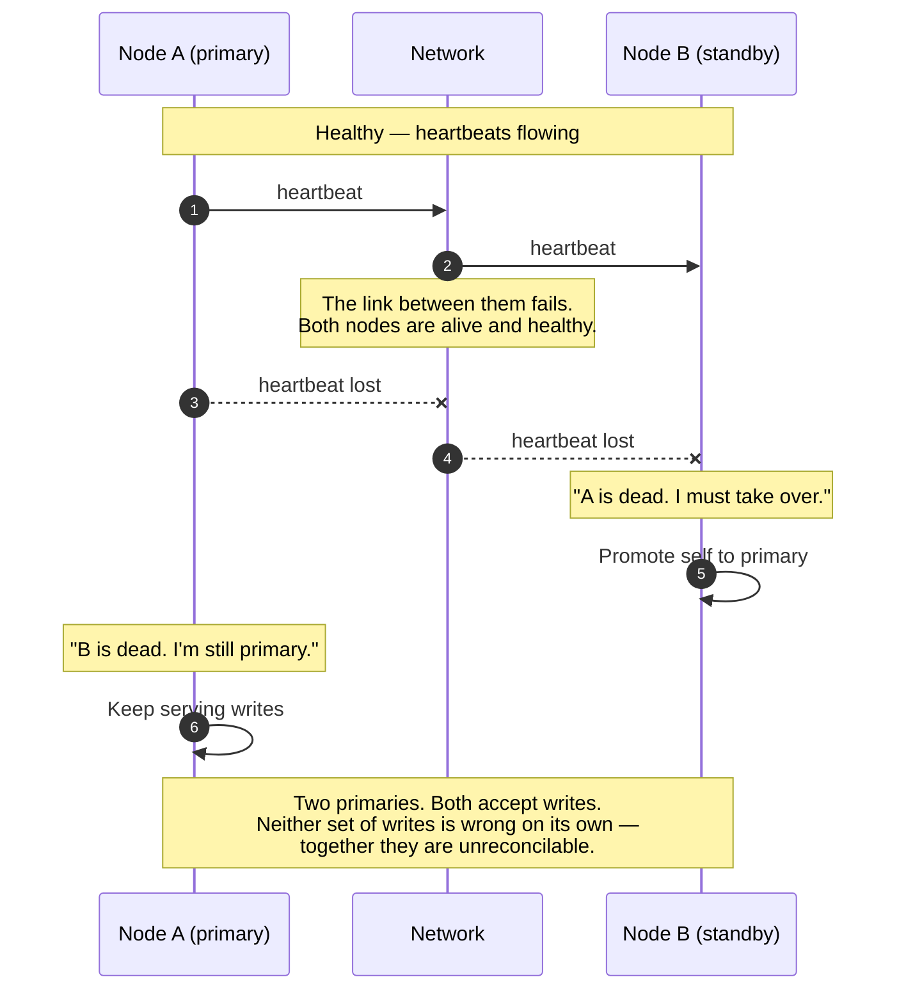
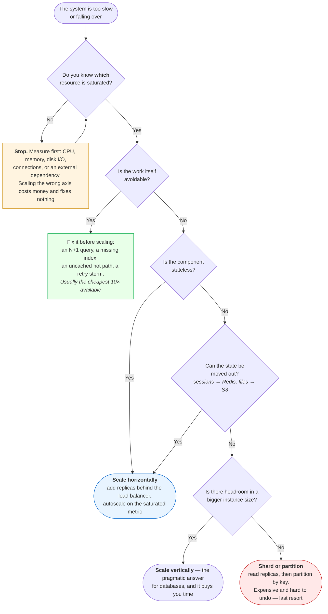
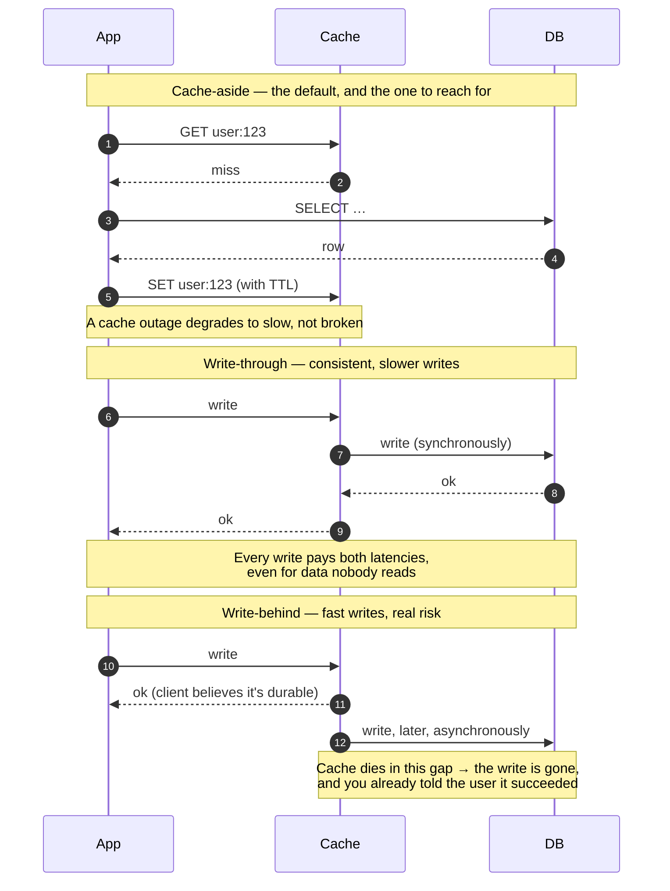
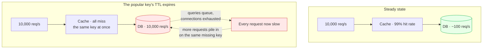
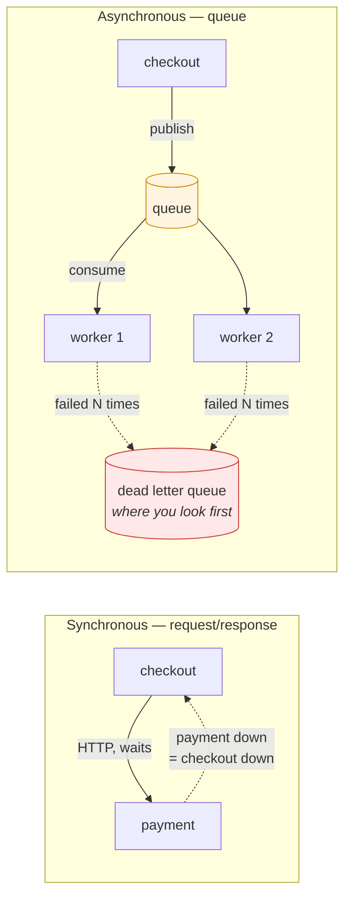

# Module 14: System Design for DevOps

> *"Good architecture is less about picking the right technology and more about knowing why you picked it." — Production Engineering Principle*

---

## Why This Module Matters

Every production outage, every scaling failure, and every "it works on my machine" moment traces back to a system design decision. As a DevOps engineer, you don't just run infrastructure — you **design, evaluate, and defend architectural choices** that keep systems reliable, scalable, and recoverable.

**In real-world DevOps work**, you will:

- Evaluate whether a system can handle 10x traffic growth
- Design deployment architectures that survive component failures
- Choose between scaling vertically or horizontally
- Implement load balancing, caching, and CDN strategies
- Define SLAs, SLOs, and SLIs that drive operational decisions
- Plan for disaster recovery and business continuity

---

## Table of Contents

1. [High Availability — Designing for Failure](#1-high-availability--designing-for-failure)
2. [Load Balancing](#2-load-balancing)
3. [Scaling Strategies](#3-scaling-strategies)
4. [Caching](#4-caching)
5. [Database Considerations for DevOps](#5-database-considerations-for-devops)
6. [CDN and Edge Architecture](#6-cdn-and-edge-architecture)
7. [Async Communication and Message Queues](#7-async-communication-and-message-queues)
8. [SLAs, SLOs, and SLIs](#8-slas-slos-and-slis)
9. [Disaster Recovery](#9-disaster-recovery)
10. [Architecture Decision Framework](#10-architecture-decision-framework)
11. [Platform Engineering — Building the Paved Road](#11-platform-engineering--building-the-paved-road)
12. [Common Mistakes and Anti-Patterns](#12-common-mistakes-and-anti-patterns)
13. [Interview Insights](#13-interview-insights)

---

## 1. High Availability — Designing for Failure

### The Nines of Availability

```
AVAILABILITY   DOWNTIME/YEAR    DOWNTIME/MONTH   CONTEXT
99%            3.65 days        7.3 hours         Acceptable for internal tools
99.9%          8.77 hours       43.8 minutes      Standard web application
99.95%         4.38 hours       21.9 minutes      Business-critical service
99.99%         52.6 minutes     4.38 minutes      Financial/healthcare systems
99.999%        5.26 minutes     26.3 seconds      Telecom, life-safety systems

EACH ADDITIONAL NINE ≈ 10x MORE ENGINEERING EFFORT AND COST
```

### Single Points of Failure (SPOF)

```
A SINGLE POINT OF FAILURE is any component whose failure
brings down the entire system.

COMMON SPOFs:
   Single database server (no replica)
   Single load balancer
   Single DNS provider
   Single availability zone
   Single deployment pipeline
   One person who knows the system ("bus factor = 1")

FIX: Redundancy at every layer
   Database primary + replica(s)
   Active-passive or active-active load balancers
   Multi-AZ or multi-region deployment
   Multiple CI/CD paths (or at least manual fallback)
   Documented runbooks so anyone can operate the system
```

### HA Architecture Patterns

```
ACTIVE-PASSIVE (Failover):
  ┌──────────┐     heartbeat     ┌──────────┐
  │  Active  │◄─────────────────▶│ Passive  │
  │ (serves  │                   │ (standby,│
  │ traffic) │                   │  warm/hot)│
  └──────────┘                   └──────────┘
  Pro: Simpler, consistent state
  Con: Passive server is idle cost; failover delay

ACTIVE-ACTIVE:
  ┌──────────┐                   ┌──────────┐
  │ Active 1 │◄── shared state ─▶│ Active 2 │
  │ (serves  │     (replicated   │ (serves  │
  │ traffic) │      DB, cache)   │ traffic) │
  └──────────┘                   └──────────┘
  Pro: Full utilization, no failover delay
  Con: State synchronization complexity, split-brain risk
```

### Split-Brain — The Failure Failover Creates

"Split-brain risk" is one line in that table and a data-corruption incident in real life. Failover works by one node deciding another is dead — and a node cannot tell "peer is dead" apart from "I cannot reach the peer":



 **Two nodes cannot solve this, ever.** With only two participants there is no way to distinguish a dead peer from an unreachable one, so both choices — take over, or stay put — are wrong in one of the two scenarios. That is why real systems use **an odd number of voters and require a quorum** (etcd, Consul, ZooKeeper, Kafka's KRaft controllers, RabbitMQ quorum queues): a node may only act as primary if it can see a strict majority, so a partition leaves at most one side able to proceed.

| Mechanism | What it does | Where you'll meet it |
|-----------|--------------|----------------------|
| **Quorum** | Only a majority partition may act — the minority stops | etcd, Consul, MongoDB replica sets, Kafka |
| **Fencing / STONITH** | The new primary forcibly kills or isolates the old one before taking over | Pacemaker clusters, storage fencing |
| **Lease with a TTL** | Primacy is a lease that must be renewed; miss a renewal and it lapses | Kubernetes leader election, Redis Sentinel |
| **A tiebreaker witness** | A cheap third voter so two real nodes can form a majority | Two-AZ deployments with a witness in a third |

 **This is why "just add a standby" is not a highly available design.** Ask three questions of any failover scheme: *who decides* a node is dead, *how many votes* that decision needs, and *what stops the old primary* from continuing to serve. If any answer is missing, you have built a system that turns a network blip into divergent data.

---

## 2. Load Balancing

### How Load Balancers Work

```
                    Internet
                       │
                 ┌─────▼─────┐
                 │    Load    │
                 │  Balancer  │
                 └─────┬─────┘
              ┌────────┼────────┐
              ▼        ▼        ▼
          ┌──────┐ ┌──────┐ ┌──────┐
          │ App  │ │ App  │ │ App  │
          │  #1  │ │  #2  │ │  #3  │
          └──────┘ └──────┘ └──────┘

PURPOSE:
  - Distribute traffic across healthy backends
  - Detect and stop sending to unhealthy servers
  - Terminate TLS (offload encryption from app servers)
  - Enable zero-downtime deployments
```

### Load Balancing Algorithms

```
ROUND ROBIN:
  Request 1 → Server A
  Request 2 → Server B
  Request 3 → Server C
  Request 4 → Server A ...
  Use when: All servers are identical

LEAST CONNECTIONS:
  Send to the server with fewest active connections
  Use when: Requests have varying processing times

WEIGHTED:
  Server A (weight 5): gets 5x more traffic than Server C (weight 1)
  Use when: Servers have different capacities

IP HASH:
  hash(client_ip) % server_count → always same server
  Use when: You need sticky sessions without cookies

HEALTH-CHECK BASED:
  All algorithms should include health checks:
  - HTTP GET /health → 200 OK means healthy
  - Failed checks → remove from pool
  - Recovered → add back after N consecutive passes
```

### Layer 4 vs Layer 7

```
LAYER 4 (Transport — TCP/UDP):
  Routes based on: IP address, port number
  Cannot inspect: HTTP headers, URLs, cookies
  Performance: Very fast, minimal overhead
  Tools: AWS NLB, HAProxy (TCP mode), iptables
  Use for: Database connections, non-HTTP protocols, raw performance

LAYER 7 (Application — HTTP/HTTPS):
  Routes based on: URL path, headers, cookies, content type
  Can do: Path-based routing, header manipulation, TLS termination
  Performance: Slightly slower, more CPU for inspection
  Tools: AWS ALB, Nginx, HAProxy (HTTP mode), Envoy
  Use for: Microservices routing, A/B testing, canary deploys
```

---

## 3. Scaling Strategies

### Vertical vs Horizontal

```
VERTICAL SCALING (Scale Up):
  ┌─────────────┐         ┌─────────────┐
  │   2 CPU     │         │   16 CPU    │
  │   4 GB RAM  │   ──▶   │   64 GB RAM │
  │   Small     │         │   Large     │
  └─────────────┘         └─────────────┘
  Pro: No code changes, simple
  Con: Hardware ceiling, single point of failure, expensive at top

HORIZONTAL SCALING (Scale Out):
  ┌───────┐               ┌───────┐ ┌───────┐ ┌───────┐ ┌───────┐
  │  App  │         ──▶   │  App  │ │  App  │ │  App  │ │  App  │
  └───────┘               └───────┘ └───────┘ └───────┘ └───────┘
  Pro: Near-infinite scale, redundancy built in, cost-efficient
  Con: Stateless design required, distributed system complexity

WHEN TO USE WHICH:
  Database (primary)     → Vertical first, then read replicas
  Application servers    → Horizontal (behind load balancer)
  Cache layer            → Horizontal (Redis Cluster, sharding)
  Static content         → CDN (horizontally distributed by design)
```

### Auto-Scaling

```
AUTO-SCALING COMPONENTS:
  1. METRIC     → What triggers scaling (CPU, memory, request count, queue depth)
  2. THRESHOLD  → When to scale (CPU > 70% for 5 minutes)
  3. POLICY     → How much to scale (add 2 instances, or increase by 50%)
  4. COOLDOWN   → Wait period before scaling again (prevent thrashing)

EXAMPLE AUTO-SCALING POLICY:
  Scale Out: CPU > 70% for 5 min → add 2 instances (cooldown: 5 min)
  Scale In:  CPU < 30% for 15 min → remove 1 instance (cooldown: 10 min)

   Scale out FAST, scale in SLOW
   Always set minimum and maximum instance counts
```

### Stateless vs Stateful Applications

```
STATELESS (easy to scale horizontally):
  - Any server can handle any request
  - Session stored externally (Redis, database, JWT)
  - No local file storage (use S3, shared volume)
  - Configuration from environment, not local files

STATEFUL (harder to scale):
  - Server holds session data in memory
  - Local file uploads tied to one server
  - Sticky sessions needed at the load balancer
  - Database connections with local connection pools

RULE: Make your applications STATELESS whenever possible.
      Push state to dedicated, purpose-built stores.
```

### Which Kind of Scaling — and Whether to Scale At All

The instinct is to add capacity. Frequently the honest answer is that the system is doing unnecessary work, and buying more machines to do it faster is the expensive way to hide a bug:



 **The two boxes people skip are the first two**, and they are the ones that pay. "We doubled the pods and it's still slow" almost always means the bottleneck was a database the pods share — in which case doubling them made contention *worse*. Name the saturated resource before you touch a replica count.

 **Sharding is a one-way door.** It changes your data model, your queries, your migrations, and your backup strategy, and un-sharding is a project nobody funds. Exhaust vertical scaling and read replicas first — modern instances go far higher than most people assume, and a year of a larger instance is cheaper than a quarter of engineering time.

---

## 4. Caching

### Cache Layers

```
CLIENT ──▶ CDN CACHE ──▶ REVERSE PROXY ──▶ APP CACHE ──▶ DB CACHE ──▶ DATABASE
           (CloudFront)   (Nginx/Varnish)   (Redis)       (query cache)

EACH LAYER:
  Hit  → Return cached data (fast, cheap)
  Miss → Forward to next layer (slower, more expensive)

RULE: Cache as close to the user as possible.
```

### Caching Strategies

```
CACHE-ASIDE (Lazy Loading):
  App checks cache → miss → reads DB → writes to cache → returns
  Pro: Only requested data is cached; cache failure doesn't break reads
  Con: First request is always slow; data can go stale

WRITE-THROUGH:
  App writes to cache AND DB simultaneously
  Pro: Cache is always fresh
  Con: Write latency increases; cache may hold never-read data

WRITE-BEHIND (Write-Back):
  App writes to cache → cache async writes to DB
  Pro: Fast writes
  Con: Data loss risk if cache crashes before DB write

TTL (Time to Live):
  Set expiry on cached data → auto-evict after N seconds
  Short TTL (30s): Near-real-time, higher DB load
  Long TTL (1h): Lower DB load, staler data
  Pick based on how stale your users can tolerate
```

The three write strategies differ in *where the crash window is*, which is easier to see as message order than as prose:



 **Cache-aside is the right default** because its failure mode is the mild one: if the cache is down, every read falls through to the database and the system is slow rather than wrong. Write-behind is the opposite — it is the fastest and it silently converts a cache from a performance optimisation into a *durability dependency*. Never put money, orders, or anything you'd have to apologise for behind a write-behind cache.

### Cache Stampede — The Outage a Cache Causes

A cache does not only fail by being slow. The classic incident is the cache working exactly as designed:



**Three fixes, and they compose:**

| Fix | How it works | Cost |
|-----|--------------|------|
| **Jittered TTL** | `ttl = base + random(0, base/10)` so keys expire at different moments | One line; do this always |
| **Single-flight lock** | The first miss takes a lock and refills; the rest wait briefly or serve stale | A little complexity, removes the herd entirely |
| **Refresh-ahead** | A background job refreshes hot keys before they expire | Needs to know which keys are hot |

 **The nastiest version is a cold cache after a restart.** Every key misses simultaneously, and a database sized for a 99% hit rate meets 100% of traffic — which is why "we restarted Redis to clear it" is a sentence that precedes an outage. Warm the cache, or roll the restart, and make sure the database has a connection limit that sheds load instead of falling over.

### Cache Invalidation

```
"There are only two hard things in computer science:
 cache invalidation and naming things." — Phil Karlton

STRATEGIES:
  1. TTL-based    → Data expires after a fixed time
  2. Event-based  → Publish invalidation on data change
  3. Version-based → Cache key includes version (v2:user:123)
  4. Manual purge  → Explicit API call to clear cache
```

---

## 5. Database Considerations for DevOps

### Replication Patterns

```
PRIMARY-REPLICA (Read Replicas):
  ┌─────────┐     async/sync     ┌──────────┐
  │ Primary │──────────────────▶ │ Replica  │
  │ (R+W)   │                    │ (R only) │
  └─────────┘                    └──────────┘
  Writes → Primary only
  Reads  → Distributed across replicas
  Use for: Read-heavy workloads, reporting queries

PRIMARY-PRIMARY (Multi-Master):
  ┌──────────┐                  ┌──────────┐
  │ Primary  │◄────────────────▶│ Primary  │
  │  (R+W)   │  bidirectional   │  (R+W)   │
  └──────────┘                  └──────────┘
  Pro: Write availability in multiple regions
  Con: Conflict resolution complexity, data consistency challenges
```

### Backup Strategy

```
BACKUP TYPES:
  Full     → Complete database copy (slow, large, complete)
  Incremental → Only changes since last backup (fast, small)
  Point-in-time → Transaction log replay to any moment

3-2-1 RULE:
  3 copies of your data
  2 different storage types (disk + object storage)
  1 offsite copy (different region or provider)

ALWAYS TEST RESTORES — An untested backup is not a backup.
```

---

## 6. CDN and Edge Architecture

```
WITHOUT CDN:
  User (Sydney) ──── 250ms ────▶ Origin (US-East) ──▶ Response
  Every request crosses the ocean.

WITH CDN:
  User (Sydney) ──── 10ms ────▶ Edge (Sydney) ──▶ Cached Response
  First request: Edge fetches from origin, caches it.
  Subsequent: Served from edge. Massively faster.

CDN USE CASES:
   Static assets (images, CSS, JS, fonts)
   Video and media streaming
   API responses that are cacheable (GET, public data)
   Whole-site acceleration (with edge compute)

CDN PROVIDERS: CloudFront (AWS), Cloudflare, Akamai, Fastly
```

---

## 7. Async Communication and Message Queues

### Why Anything Is Asynchronous

A synchronous call couples two services in availability and in latency: if payment is down, checkout is down, and if payment is slow, checkout is slow. A queue between them converts that into a different trade — checkout stays up and the work happens later, which is only acceptable if "later" is acceptable.

That is the whole decision. Not "queues are more scalable", but *can this work be done later, and can the caller tolerate not knowing the outcome yet?*



> ** DevOps Impact**: the queue does not remove the failure, it relocates it. Payment being down no longer shows up as checkout errors — it shows up as queue depth climbing and orders that are accepted but never fulfilled. That is a better failure, but only if you alert on queue depth and consumer lag. A queue with no monitoring is a silent backlog.

### Queue, Pub/Sub, or Stream

Three shapes get called "messaging" and they are not interchangeable:

| | Queue | Pub/Sub | Log / Stream |
|---|-------|---------|--------------|
| Model | One message → one consumer | One message → every subscriber | An ordered, replayable log; consumers track an offset |
| Message after delivery | Deleted | Deleted per subscription |  Retained for a window — you can rewind |
| Typical use | Work distribution: emails, thumbnails, charges | Fan-out: "order placed" to 4 teams | Event sourcing, analytics, replay, CDC |
| Ordering | Usually best-effort, or per group | Not guaranteed | Guaranteed per partition |
| Examples | SQS, RabbitMQ, Celery+Redis | SNS, Google Pub/Sub, RabbitMQ fanout | Kafka, Kinesis, Redpanda, Redis Streams |

Two consequences worth remembering: **ordering is per partition, never global** — so "process this customer's events in order" means partitioning by customer ID, and it caps your parallelism for that customer at one. And a stream's replayability is what makes it the right choice when a consumer bug means you need yesterday's events again.

### The Five Things That Bite

**1. At-least-once means duplicates.** Nearly every broker guarantees at-least-once, not exactly-once: a consumer that crashes after doing the work but before acknowledging will see the message again. Design for it with an idempotency key — a natural one (`order_id`) checked against a store before acting.

```python
# Idempotent consumer: the pattern, in eight lines
def handle(msg):
    key = msg["order_id"]
    if store.setnx(f"processed:{key}", 1):        # atomic claim, TTL a few days
        try:
            charge(msg)                           # the actual work
        except Exception:
            store.delete(f"processed:{key}")      #  release the claim so a retry can work
            raise
    else:
        log.info("duplicate, skipping", extra={"order_id": key})
    ack(msg)
```

**2. Retries need a dead letter queue.** A message that will never succeed — malformed, or referencing a deleted record — retried forever is a *poison message*: it blocks a partition or burns your consumers indefinitely. Cap the attempts and route the failures to a DLQ. Then alert on the DLQ, because an unmonitored DLQ is a folder of work nobody is doing.

**3. Consumer lag is your real health metric.** Not CPU, not queue length alone: the gap between what has been produced and what has been consumed, and whether it is growing. If lag grows, consumers are losing the race and every downstream promise is now late.

**4. Backpressure has to go somewhere.** When consumers cannot keep up, either the queue grows (memory, disk, cost, and eventually a broker refusing writes) or the producer must be slowed down. Decide which deliberately, and set a retention/quota so you find out on your terms rather than at the broker's hard limit.

**5. Visibility timeouts and long-running work.** If handling a message takes longer than the invisibility window, the broker redelivers it and two workers do the same job. Either extend the timeout while working (heartbeating) or split the work into smaller messages.

### Operating One

```bash
# Kafka: lag is the number that matters — check it before anything else
kafka-consumer-groups.sh --bootstrap-server localhost:9092 --describe --group orders
#   TOPIC  PARTITION  CURRENT-OFFSET  LOG-END-OFFSET  LAG    is LAG growing?
kafka-topics.sh --bootstrap-server localhost:9092 --describe --topic orders

# RabbitMQ
rabbitmqctl list_queues name messages messages_unacknowledged consumers
#   messages_unacknowledged high with few consumers = handlers are stuck, not slow

# SQS
aws sqs get-queue-attributes --queue-url "$Q" \
  --attribute-names ApproximateNumberOfMessages ApproximateAgeOfOldestMessage
#    AgeOfOldestMessage is the SLO-relevant one; a count of 10 that is 4 hours old is worse
#   than a count of 10,000 that is 5 seconds old
```

Four alerts cover most of it: **consumer lag growing over N minutes**, **age of oldest message beyond your SLO**, **any DLQ depth above zero**, and **zero consumers on a queue with messages** — the last being the one that catches a deployment that quietly stopped starting workers.

### Choosing

```
USE A QUEUE WHEN:
   The work can be done later, and the caller doesn't need the result now
   You want to survive a downstream outage without failing the user's request
   Load is spiky and you want to smooth it into steady consumer throughput
   Several teams need the same event and you don't want N synchronous calls

STAY SYNCHRONOUS WHEN:
   The caller needs the answer to continue (auth, payment authorisation, validation)
   The workflow is simple and a queue would add a broker to operate for no gain
   You cannot make the consumer idempotent — duplicates will hurt you
   Debuggability matters more than decoupling; async traces are harder to follow
```

Run both shapes: [Lab 02 — Message Queues and Async Failure](./labs/lab-02-message-queues.md) for the queue (depth, unacked, a dead letter queue, duplicate charges), then [Lab 04 — Kafka: Partitions, Consumer Groups, and Offsets](./labs/lab-04-kafka-partitions.md) for the log (per-partition lag, the parallelism ceiling, a rebalance storm, and a replay). The Break It sections are the interview follow-ups, and Lab 04 ends with the queue-versus-log comparison from first-hand evidence rather than a vendor page.

>**The interview trap** is "we'll use a queue for scalability". Say instead what the queue *decouples* and what it *costs*: a broker to operate, at-least-once duplicates to handle, a DLQ to monitor, and end-to-end tracing that now has to propagate context through message attributes rather than HTTP headers (Module 07 §9 — this is the boundary where trace propagation is most often lost).

---

## 8. SLAs, SLOs, and SLIs

```
SLI — Service Level Indicator
  A measurable metric: "What are we measuring?"
  Examples: Request latency, error rate, throughput, availability

SLO — Service Level Objective
  A target for the SLI: "What is acceptable?"
  Examples: p99 latency < 300ms, error rate < 0.1%, 99.9% uptime

SLA — Service Level Agreement
  A contract with consequences: "What happens if we fail?"
  Examples: Below 99.9% uptime → service credits, penalty clauses

RELATIONSHIP:
  SLI (measurement) ──▶ SLO (internal target) ──▶ SLA (external promise)

   SLOs should be STRICTER than SLAs
   Measure SLIs continuously, alert when SLO is at risk
   Use error budgets: if SLO is 99.9%, you have 0.1% error budget
```

### Error Budgets

```
ERROR BUDGET = 1 - SLO

If SLO = 99.9% uptime per month:
  Error budget = 0.1% = 43.8 minutes of downtime

Budget remaining > 50%:
  → Ship features, take calculated risks, deploy frequently

Budget remaining < 25%:
  → Slow down, focus on reliability, reduce deploy frequency

Budget exhausted:
  → Feature freeze, all engineering effort on stability
```

---

## 9. Disaster Recovery

### Recovery Objectives

```
RPO — Recovery Point Objective
  "How much data can we afford to lose?"
  RPO = 1 hour → backups must run at least every hour
  RPO = 0      → synchronous replication required

RTO — Recovery Time Objective
  "How fast must we recover?"
  RTO = 4 hours → must be back online within 4 hours of disaster
  RTO = 0       → active-active with automatic failover required

         data loss           downtime
  ◄──────────────────┤ DISASTER ├──────────────────►
         RPO                        RTO
```

### DR Strategies (Cost vs Speed)

```
BACKUP & RESTORE (Cheapest, Slowest):
  RPO: Hours     RTO: Hours to days
  Restore from backups to new infrastructure
  Cost: $ (storage only)

PILOT LIGHT (Low cost, moderate speed):
  RPO: Minutes   RTO: 30-60 minutes
  Core systems always running (DB replica), scale up on failover
  Cost: $$ (minimal always-on infra)

WARM STANDBY (Moderate cost, fast):
  RPO: Seconds   RTO: Minutes
  Scaled-down copy of production always running
  Cost: $$$ (partial duplicate infrastructure)

MULTI-REGION ACTIVE-ACTIVE (Most expensive, fastest):
  RPO: Zero      RTO: Seconds
  Full production in multiple regions, traffic split
  Cost: $$$$ (full duplicate infrastructure)
```

What you are really buying at each tier is **how much is already running when the disaster starts**:

```mermaid
flowchart TB
    subgraph T1["Backup & Restore · $ · RTO hours-days"]
        B1[("Backups in object storage")]
        B1 -.->|"on disaster: build everything,<br/>then restore"| B1x["Nothing is running"]
    end

    subgraph T2["Pilot Light · $$ · RTO 30-60 min"]
        P1[("DB replica, always on")]
        P2["App tier: defined but scaled to zero"]
        P1 -.->|"on disaster: promote DB,<br/>scale the app up"| P2
    end

    subgraph T3["Warm Standby · $$$ · RTO minutes"]
        W1[("DB replica")] --- W2["App tier running,<br/>scaled down"]
        W2 -.->|"on disaster: scale out,<br/>switch DNS"| W3["Full capacity"]
    end

    subgraph T4["Active-Active · $$$$ · RTO seconds"]
        A1["Region 1 serving traffic"] --- A2["Region 2 serving traffic"]
        A2 -.->|"on disaster: the LB stops<br/>sending to the dead region"| A3["No promotion step at all"]
    end

    style T1 fill:#e8ffe8,stroke:#00aa44
    style T4 fill:#ffe8e8,stroke:#cc3333
```



 **RTO is bought with always-on infrastructure, RPO with replication frequency.** They are separate purchases and it is normal to want different tiers for each — hourly backups (RPO 1h) with a warm standby (RTO 10 min) is a perfectly coherent, and cheap, combination. Deciding the *strategy* before answering the two questions is how organisations end up paying for active-active to protect a system nobody would miss for a day.

 **An untested DR plan has an RTO of infinity.** The failure is never the backup — it is the restore path: expired credentials, a bootstrap that needs a service in the dead region, a runbook naming someone who left, a DNS TTL of 24 hours. Schedule a real game day, restore into a clean account, and time it. **The number you measure is your RTO; the number in the document is a wish.**

---

## 10. Architecture Decision Framework

### How to Evaluate Architecture Trade-Offs

```
For every design decision, evaluate:

1. AVAILABILITY   → What happens when this component fails?
2. SCALABILITY    → Can this handle 10x traffic?
3. COST           → What does this cost at current and projected scale?
4. COMPLEXITY     → Can the team operate and debug this?
5. SECURITY       → What is the blast radius of a breach here?
6. DATA INTEGRITY → Can we lose data? How much?
7. LATENCY        → Does this meet user-facing performance requirements?

DOCUMENT YOUR DECISIONS:
  Use Architecture Decision Records (ADRs):
  - Title: Short description of the decision
  - Context: What problem are we solving?
  - Decision: What did we choose?
  - Consequences: Trade-offs, risks, and what we accept
  - Status: Proposed / Accepted / Superseded
```

### GitOps — Declarative Deployment Architecture

GitOps is a deployment pattern where **Git is the single source of truth** for both application code and infrastructure. Instead of CI/CD pushing changes to clusters, a GitOps operator **pulls** the desired state from Git and reconciles it continuously.

```
TRADITIONAL (Push-based CI/CD):
  Developer → push → CI pipeline → build → test → push image → deploy to K8s
  The pipeline HAS credentials to the cluster.

GITOPS (Pull-based):
  Developer → push → CI pipeline → build → test → push image → update Git manifest
  ArgoCD/Flux WATCHES Git → detects change → applies to K8s
  The cluster pulls its own state. CI never touches the cluster directly.

  ┌──────────┐    ┌──────────┐    ┌─────────────┐    ┌─────────────┐
  │Developer │───▶│CI Pipeline│───▶│ Git (manifests)│◀───│ ArgoCD/Flux │
  │          │    │build+test │    │ (desired state)│    │ (reconciles)│
  └──────────┘    └──────────┘    └─────────────┘    └──────┬──────┘
                                                            │
                                                    ┌───────▼──────┐
                                                    │  Kubernetes   │
                                                    │  (actual state)│
                                                    └──────────────┘
```

```
GITOPS BENEFITS:
   Auditable — every change is a Git commit (who, what, when, why)
   Rollback = git revert (instant, tested, safe)
   Drift detection — ArgoCD alerts if cluster state ≠ Git state
   Security — CI/CD pipeline doesn't need cluster credentials
   Self-healing — if someone manually changes the cluster, ArgoCD reverts it

WHEN TO USE GITOPS:
   Kubernetes-based infrastructure (primary use case)
   Multiple environments managed from Git branches or directories
   Teams that want strong audit trails and compliance

WHEN GITOPS IS OVERKILL:
   Single-server deployments (Docker Compose on one host)
   Very small teams (1-3 people) with simple deployment needs
   Non-Kubernetes workloads (GitOps tooling is K8s-native)

KEY TOOLS:
  ArgoCD — UI-driven, popular, CNCF graduated project
  Flux    — CLI-driven, lightweight, CNCF graduated project
```

>**GitOps is increasingly common in interviews.** Know the pull vs push model distinction and when GitOps makes sense versus traditional CI/CD.

Run it: [Module 12, Lab 06 — GitOps with Argo CD](../12-kubernetes/labs/lab-06-gitops-argocd.md). The four failure scenarios there are the interview follow-ups — what `Synced` does *not* prove.

### Capacity Planning

```
CAPACITY PLANNING STEPS:
  1. MEASURE current usage (CPU, memory, disk, network, request rate)
  2. IDENTIFY growth trend (linear, exponential, seasonal)
  3. PROJECT future needs (3 months, 6 months, 1 year)
  4. ADD headroom (30-50% buffer for spikes)
  5. PLAN procurement or auto-scaling rules

EXAMPLE:
  Current: 1000 req/s, 4 servers at 60% CPU
  Growth: 20% per quarter
  In 6 months: 1440 req/s → need 6 servers
  With headroom: 8 servers or auto-scaling 4-10
```

---

## 11. Platform Engineering — Building the Paved Road

### The Problem It Answers

"You build it, you run it" is right, and taken literally it does not scale. Fifty product engineers cannot each become expert in Terraform, Kubernetes RBAC, Prometheus, and your cloud account's IAM model — and if they try, you get fifty subtly different deployment patterns, and the person who can debug any given service is whoever wrote it.

Platform engineering is the response: a small team builds the **paved road** — a well-lit default path from code to production — and product teams stay responsible for what they ship. The platform is a product, and its users are engineers.

The distinction that matters, and the one interviews probe:

| | A DevOps team (anti-pattern) | A platform team |
|---|---|---|
| Requests | "Raise a ticket, we'll deploy it" | "Here's the pipeline; you deploy it" |
| Responsibility for prod | Theirs | The service team's |
| Output | Completed tickets | Self-service capabilities |
| Failure mode | Becomes the queue everything waits in | Builds something nobody adopts |
| Measured by | Tickets closed |  Adoption, lead time, and how often the road is bypassed |

### Golden Paths, Not Golden Cages

A golden path is the supported way to do a common thing: create a service, get a database, ship to production, get a dashboard. It should be so much easier than the alternative that people choose it — not so mandatory that they resent it.

```
A GOLDEN PATH FOR "NEW SERVICE" GIVES YOU, IN ONE STEP:
   A repository from a template: Dockerfile, healthz, structured logs, tests
   A CI pipeline that already lints, tests, scans, and publishes a SHA-tagged image
   Deployment manifests with probes, limits, and a rollback path
   A dashboard and the four golden-signal alerts, wired up
   An entry in the service catalogue with an owner and an on-call rotation
   Secrets wiring that does not involve pasting anything into a UI

WHAT MAKES IT A CAGE INSTEAD:
   No escape hatch when a team genuinely needs something different
   The abstraction hides the failure but not the failure's consequences
     ("your deploy failed" with no way to see the underlying rollout)
   It only works for the ideal service the platform team imagined
```

> ** DevOps Impact**: the escape hatch is not a weakness, it is what keeps the platform honest. If a team can drop down to raw manifests when they must, they will tell you why they had to — and that is your roadmap. If they cannot, they build a shadow platform instead and you find out a year later.

### What a Platform Is Made Of

Nothing here is new to this handbook; the platform is these modules assembled into defaults:

| Layer | Concretely |
|-------|-----------|
| **Infrastructure** | Terraform modules teams consume — a database, a queue, a bucket — with sane, secure defaults baked in (Module 10 §7) |
| **Delivery** | A reusable CI pipeline and a GitOps repository, so deploying is a merge (Modules 06, 12 lab 06) |
| **Runtime** | The cluster, with limits, probes, policy, and RBAC already enforced (Modules 12, 13) |
| **Observability** | Dashboards and alerts created *with* the service, not requested afterwards (Module 07) |
| **Interface** | A CLI, a repository template, a pull request, or a portal (Backstage and friends) |
| **Catalogue** | What services exist, who owns them, who is on call, what they depend on |

Note that the portal is *last* and optional. A polished UI over a platform nobody wants is the most common expensive mistake in this space; a repository template plus a `Makefile` that works is a real platform.

### Measuring It

A platform team without metrics drifts into building what is interesting rather than what is needed:

- **Adoption** — what share of services are on the golden path? Falling adoption is the earliest warning you get.
- **Lead time for a new service** — from "we need a service" to "it serves traffic in production". Days to hours is the usual goal.
- **DORA metrics for the teams you serve** — the platform exists to move these (Module 00 §8). If deployment frequency has not moved, the platform has not worked.
- **Bypass rate** — how often teams go around the road. Each instance is a requirement you missed.
- **Time to first successful deploy for a new engineer** — the honest measure of your documentation.

### When You Do Not Need a Platform Team

```
TOO EARLY WHEN:
   Under ~4 teams — a shared repository template and a good README is your platform
   You have not standardised anything yet; there is no road to pave
   It would be one person, part-time. That is a bottleneck with a job title
   The real problem is that nobody owns production. A platform does not fix ownership

WORTH IT WHEN:
   Multiple teams solve the same delivery problem differently, badly
   Onboarding a service takes weeks, mostly waiting on other people
   Security and reliability requirements are impossible to meet per-team by hand
   You can staff it as a product team, with users, feedback, and a roadmap
```

>**The interview answer**: "Platform engineering is treating internal tooling as a product with engineers as its users. The point is a golden path — the supported way to create, deploy, and observe a service — that is easier than doing it yourself, with an escape hatch for teams that need something else. It is not a DevOps team that deploys on your behalf; the service team still owns production. I would measure it on adoption, lead time for a new service, and whether the DORA metrics of the teams it serves actually moved."

---

## 12. Common Mistakes and Anti-Patterns

### Premature Optimization

```
BAD:  Building for 1M users on day one (10 actual users)
GOOD: Design for 10x current load, have a plan for 100x
```

### Ignoring Failure Modes

```
BAD:  "The database will never go down"
GOOD: "When the database goes down, the app serves cached data
       and queues writes for replay"
```

### Distributed Monolith

```
BAD:  Microservices that all depend on each other synchronously
      (you split the code but kept the coupling)
GOOD: Services communicate asynchronously where possible,
      can degrade gracefully when dependencies are down
```

### No Observability in the Design

```
BAD:  Build first, figure out monitoring later
GOOD: Metrics, logging, and tracing are part of the architecture
      from day one — they are not optional add-ons
```

---

## 13. Interview Insights

**Q: How would you design a system for high availability?**
> Eliminate single points of failure at every layer. Use multiple application servers behind a load balancer with health checks. Deploy across multiple availability zones. Use database replication with automated failover. Implement health checks and circuit breakers. Define RTO/RPO and choose a DR strategy that matches. Monitor everything and alert on SLO violations, not just server metrics.

**Q: Explain the difference between vertical and horizontal scaling.**
> Vertical scaling adds resources to a single machine (bigger CPU, more RAM). It's simple but has a hardware ceiling and remains a single point of failure. Horizontal scaling adds more machines behind a load balancer. It requires stateless application design but offers near-unlimited growth and built-in redundancy. Most production systems use both: scale the database vertically first, then add read replicas; scale application servers horizontally from the start.

**Q: What are SLAs, SLOs, and SLIs?**
> SLIs are measurable metrics like latency and error rate. SLOs are internal targets for those metrics ("p99 latency under 200ms"). SLAs are external contracts with penalties for missing targets. SLOs should be stricter than SLAs. Error budgets — the allowed failure margin — drive the balance between shipping features and investing in reliability.

**Q: How do you approach capacity planning?**
> Measure current utilization across all resources (CPU, memory, disk, network). Identify growth trends from historical data. Project needs for 3-6-12 months. Add 30-50% headroom for unexpected spikes. Implement auto-scaling where possible with appropriate policies. Review and adjust quarterly.

**Q: Describe a caching strategy and when it can go wrong.**
> Cache-aside is the most common: the app checks cache first, falls back to the database on miss, then populates the cache. It goes wrong when cache invalidation is missed — users see stale data. Cache stampede happens when many keys expire simultaneously and all requests hit the database. Mitigate with jittered TTLs, write-through on critical paths, and circuit breakers that serve stale data over no data.

**Q: Walk me through a disaster recovery plan.**
> Define RPO and RTO based on business requirements. For a typical web application: RPO of 5 minutes (continuous DB replication), RTO of 15 minutes (warm standby). Maintain a replica environment in a second region. Automate failover with DNS and health checks. Test the DR plan quarterly with actual failover drills — an untested plan is not a plan. Document the runbook so any on-call engineer can execute it.

---

## Labs and Projects

Read the sections above first, then work through these **in order**. Every lab ends with a  **Break It** section — those are not optional; they are where the debugging skill actually comes from.

| # | Lab | What you'll do |
|---|-----|----------------|
| 1 | **[High Availability and Load Balancing](./labs/lab-01-ha-load-balancing.md)** | Build a load-balanced, highly available web application using Nginx as a reverse proxy with health checks, and simulate real-world failure scenarios… |
| 2 | **[Message Queues and Async Failure](./labs/lab-02-message-queues.md)** | Operate a queue the way you will have to on call: watch a backlog form, drain it by scaling consumers, and deal with the message that can never… |
| 3 | **[Platform Engineering](./labs/lab-03-golden-path.md)** | Build the paved road: one command that takes a team from "we need a service" to a repository with probes, limits, a pipeline, alerts, and a named… |
| 4 | **[Kafka](./labs/lab-04-kafka-partitions.md)** | Operate a partitioned log the way Kafka actually behaves: read lag per partition, prove that partition count rather than replica count is your… |

**Portfolio project:**

- [Project: Architecture Design Document](./projects/project-01-architecture-design-doc.md) — Design a production-ready architecture for a web application that must handle growing traffic, survive component failures, and be operationally…

**Reference code** for every lab: [`code/`](./code/) — real files, validated in CI.

---

## Self-Check

Answer these from memory before you expand them. If more than two give you trouble, re-read the sections they come from — the labs assume this material is solid.

<details>
<summary><strong>1. SLI, SLO, SLA — and what is an error budget for?</strong></summary>

The SLI is the measurement (the proportion of requests that succeeded). The SLO is your internal target. The SLA is the contract with consequences, and it is always looser than the SLO. The error budget is the failure the SLO permits: while it is unspent you ship features, and when it is gone you stop and spend the time on reliability. It turns an argument into arithmetic.

</details>

<details>
<summary><strong>2. RTO and RPO — what do they decide?</strong></summary>

How long you can be down, and how much data you can afford to lose. Together they pick the disaster recovery strategy and its cost: backup-and-restore, pilot light, warm standby, or active-active. Choosing the strategy before answering these two questions is how organizations pay for a tier they did not need.

</details>

<details>
<summary><strong>3. Why is 99.99% so much more expensive than 99.9%?</strong></summary>

43 minutes of downtime a month becomes 4.3. Every manual step is now too slow, so failover has to be automatic and tested, and a single availability zone stops being enough. The uncomfortable question is usually who asked for the extra nine and what it is worth to them.

</details>

<details>
<summary><strong>4. Vertical or horizontal scaling?</strong></summary>

Vertical is a bigger machine: no code changes, immediate relief, a hard ceiling, and usually a reboot. Horizontal is more machines: it needs statelessness and a load balancer, but it has no ceiling and it removes a single point of failure. Vertical buys you time; horizontal is the answer.

</details>

<details>
<summary><strong>5. What is a cache stampede and how do you avoid one?</strong></summary>

A hot key expires and every concurrent request misses at once, so the full load lands on the database you were protecting. Mitigate with jittered TTLs so keys do not expire together, request coalescing so one caller refills while the rest wait, and serving stale data while revalidating in the background.

</details>

<details>
<summary><strong>6. How should a load balancer health check be designed?</strong></summary>

Shallow enough that one slow dependency does not drain the whole fleet, deep enough to notice an instance that cannot serve. Keep the check the load balancer uses separate from a detailed readiness endpoint: too shallow leaves broken instances in rotation, too deep takes every instance out simultaneously and turns a degraded dependency into a total outage.

</details>

<details>
<summary><strong>7. What do retries do to a struggling dependency, and what makes them safe?</strong></summary>

Naive retries multiply load exactly when the system can least absorb it. Safe retries need exponential backoff with jitter, a cap on attempts, idempotency so a duplicate request is not a duplicate charge, and a circuit breaker that stops calling a dependency that is clearly down.

</details>

---

## Practical Checkpoint

Before moving on, you should be able to:

- Draw a high-availability architecture for a web application with no single points of failure.
- Explain the trade-offs between at least two scaling strategies for a given scenario.
- Define SLIs, SLOs, and error budgets for a service you've worked with in previous modules.

Portfolio evidence to keep:

- An architecture diagram with annotations explaining design decisions.
- A written trade-off analysis comparing two approaches (e.g., active-passive vs active-active).
- SLO definitions with error budget calculations for a realistic service.

Suggested project: [Architecture Design Document](./projects/project-01-architecture-design-doc.md)

---

## What's Next?

With system design fundamentals covered, you're ready to combine everything into real-world portfolio projects.

**[Module 15: Capstone Projects →](../15-projects/)**

---

<div align="center">

**Module 14 Complete** 

[← Back to Security Basics](../13-security-basics/) | [Next: Projects →](../15-projects/)

</div>


## Reference
<!-- tab: Labs -->
# Lab 01: High Availability and Load Balancing

## Objective

Build a load-balanced, highly available web application using Nginx as a reverse proxy with health checks, and simulate real-world failure scenarios including server crashes and rolling deployments.

---

## Prerequisites

- Docker and Docker Compose installed
- Completed Module 02 (Networking) and Module 05 (Docker)
- Basic understanding of HTTP and reverse proxies

---

## Deliverables and Evidence

By the end of this lab, keep the following evidence in your notes or portfolio repo:

- Commands you ran and the important output you used for validation
- Any files, scripts, configs, manifests, or workflows you created
- A short failure note describing one thing that broke, how you diagnosed it, and how you fixed it
- Cleanup commands or confirmation that no long-running resources remain

Treat the validation section as the minimum proof that the lab worked.

---

## Lab Files

Every file this lab creates also exists as a real, CI-validated file in
[`../code/lab-01/`](../code/lab-01/) (4 files).

```bash
# Option A — type them out yourself (recommended the first time; that's the learning)
# Option B — start from the reference copies
cp -r /path/to/the-devops-handbook/14-system-design-devops/code/lab-01/. .
```

Use Option B when you're comparing against a known-good version, or when something
won't start and you need to rule out a typo. See [`../code/README.md`](../code/README.md).

---

## Exercise 1: Build the Application Stack

### Step 1: Create the Application

```bash
mkdir -p ha-lab && cd ha-lab

# Simple Python app that identifies which server responded
cat > app.py << 'APP'
from http.server import HTTPServer, BaseHTTPRequestHandler
import os, socket, time, random

class Handler(BaseHTTPRequestHandler):
    def do_GET(self):
        if self.path == "/health":
            self.send_response(200)
            self.send_header("Content-Type", "application/json")
            self.end_headers()
            self.wfile.write(b'{"status": "healthy"}')
        elif self.path == "/slow":
            time.sleep(random.uniform(2, 5))
            self.send_response(200)
            self.send_header("Content-Type", "text/plain")
            self.end_headers()
            self.wfile.write(b"Slow response complete")
        else:
            self.send_response(200)
            self.send_header("Content-Type", "text/plain")
            self.end_headers()
            server_id = os.environ.get("SERVER_ID", "unknown")
            hostname = socket.gethostname()
            msg = f"Hello from server {server_id} (hostname: {hostname})\n"
            self.wfile.write(msg.encode())

    def log_message(self, format, *args):
        server_id = os.environ.get("SERVER_ID", "unknown")
        print(f"[Server {server_id}] {args[0]}")

if __name__ == "__main__":
    port = int(os.environ.get("PORT", "8080"))
    server = HTTPServer(("0.0.0.0", port), Handler)
    server_id = os.environ.get("SERVER_ID", "unknown")
    print(f"Server {server_id} listening on port {port}")
    server.serve_forever()
APP

# Dockerfile
cat > Dockerfile << 'DOCKER'
FROM python:3.12-slim
WORKDIR /app
COPY app.py .
RUN useradd -r -s /sbin/nologin appuser
USER appuser
EXPOSE 8080
CMD ["python3", "app.py"]
DOCKER
```

### Step 2: Create the Nginx Load Balancer Configuration

```bash
mkdir -p nginx

cat > nginx/nginx.conf << 'NGINX'
upstream backend {
    # Round-robin by default
    server app1:8080 max_fails=3 fail_timeout=30s;
    server app2:8080 max_fails=3 fail_timeout=30s;
    server app3:8080 max_fails=3 fail_timeout=30s;
}

server {
    listen 80;

    location / {
        proxy_pass http://backend;
        proxy_set_header Host $host;
        proxy_set_header X-Real-IP $remote_addr;
        proxy_set_header X-Forwarded-For $proxy_add_x_forwarded_for;
        proxy_connect_timeout 5s;
        proxy_read_timeout 10s;
        proxy_next_upstream error timeout http_502 http_503;
    }

    location /nginx-health {
        return 200 "nginx is healthy\n";
        add_header Content-Type text/plain;
    }
}
NGINX
```

### Step 3: Create Docker Compose

```bash
cat > docker-compose.yml << 'COMPOSE'
services:
  lb:
    image: nginx:1.25-alpine
    ports:
      - "8080:80"
    volumes:
      - ./nginx/nginx.conf:/etc/nginx/conf.d/default.conf:ro
    depends_on:
      - app1
      - app2
      - app3
    restart: unless-stopped

  app1:
    build: .
    environment:
      - SERVER_ID=1
      - PORT=8080
    restart: unless-stopped

  app2:
    build: .
    environment:
      - SERVER_ID=2
      - PORT=8080
    restart: unless-stopped

  app3:
    build: .
    environment:
      - SERVER_ID=3
      - PORT=8080
    restart: unless-stopped
COMPOSE

# Build and start
docker compose up -d --build
```

### Step 4: Verify Load Balancing

```bash
# Send 10 requests — observe round-robin distribution
for i in $(seq 1 10); do
  curl -s http://localhost:8080
done

# You should see responses from servers 1, 2, and 3 cycling
```

** Checkpoint:** All three servers respond, and traffic is distributed across them.

---

## Exercise 2: Simulate Failures

### Step 1: Kill a Backend Server

```bash
# Stop server 2
docker compose stop app2

# Send requests — should only see servers 1 and 3
for i in $(seq 1 6); do
  curl -s http://localhost:8080
done

# Check Nginx detects the failure
docker compose logs lb | tail -10
```

### Step 2: Bring It Back

```bash
# Restart server 2
docker compose start app2

# Wait a moment, then verify it's back in rotation
sleep 5
for i in $(seq 1 9); do
  curl -s http://localhost:8080
done
```

### Step 3: Simulate Complete Backend Failure

```bash
# Stop all backends
docker compose stop app1 app2 app3

# What does the load balancer return?
curl -v http://localhost:8080

# You should see a 502 Bad Gateway — Nginx has no healthy upstream

# Restart all
docker compose start app1 app2 app3
```

** Checkpoint:** Nginx automatically removes failed servers and adds them back when they recover.

---

## Exercise 3: Simulate a Rolling Deployment

```bash
# Make a "v2" of the app (change the greeting)
sed 's/Hello from/[v2] Hello from/' app.py > app_v2.py
mv app_v2.py app.py

# Rebuild the image
docker compose build

# Rolling restart: one at a time
for svc in app1 app2 app3; do
  echo "--- Updating $svc ---"
  docker compose up -d --no-deps $svc
  sleep 5  # Wait for the new container to be healthy

  # Verify the service is responding
  for i in $(seq 1 3); do
    curl -s http://localhost:8080
  done
  echo ""
done

# Final check — all servers should show [v2]
for i in $(seq 1 9); do
  curl -s http://localhost:8080
done
```

** Checkpoint:** The application is updated with zero downtime — old and new versions serve traffic during the transition.

---

## Exercise 4: Experiment with Load Balancing Algorithms

### Least Connections

```bash
# Update nginx.conf
cat > nginx/nginx.conf << 'NGINX'
upstream backend {
    least_conn;
    server app1:8080 max_fails=3 fail_timeout=30s;
    server app2:8080 max_fails=3 fail_timeout=30s;
    server app3:8080 max_fails=3 fail_timeout=30s;
}

server {
    listen 80;

    location / {
        proxy_pass http://backend;
        proxy_set_header Host $host;
        proxy_set_header X-Real-IP $remote_addr;
    }

    location /nginx-health {
        return 200 "nginx is healthy\n";
        add_header Content-Type text/plain;
    }
}
NGINX

# Reload Nginx without downtime
docker compose exec lb nginx -s reload

# Test with slow endpoint — least_conn should avoid the busy server
curl -s http://localhost:8080/slow &
curl -s http://localhost:8080/slow &
for i in $(seq 1 6); do curl -s http://localhost:8080; done
wait
```

### Weighted Round Robin

```bash
# Update nginx.conf — server 1 gets 3x traffic
cat > nginx/nginx.conf << 'NGINX'
upstream backend {
    server app1:8080 weight=3 max_fails=3 fail_timeout=30s;
    server app2:8080 weight=1 max_fails=3 fail_timeout=30s;
    server app3:8080 weight=1 max_fails=3 fail_timeout=30s;
}

server {
    listen 80;

    location / {
        proxy_pass http://backend;
        proxy_set_header Host $host;
        proxy_set_header X-Real-IP $remote_addr;
    }

    location /nginx-health {
        return 200 "nginx is healthy\n";
        add_header Content-Type text/plain;
    }
}
NGINX

docker compose exec lb nginx -s reload

# Send 10 requests — server 1 should handle ~60%
for i in $(seq 1 10); do curl -s http://localhost:8080; done
```

** Checkpoint:** You can observe different traffic distribution patterns with each algorithm.

---

## Break It: Failure Scenarios

Try these challenges and document what happens:

1. **Split brain**: Stop Nginx and access backend servers directly on their container IPs. What happens to traffic consistency?
2. **Thundering herd**: Start all three backends at once after a full outage. Watch Nginx logs to see how it rediscovers healthy upstreams.
3. **Config syntax error**: Introduce a typo in `nginx.conf` and run `nginx -s reload`. Does it crash the running proxy, or does Nginx keep the old config?
4. **Resource exhaustion**: Send many concurrent requests to `/slow` and observe how Nginx handles upstream timeouts.

---

## Cleanup

```bash
docker compose down -v
cd ..
rm -rf ha-lab
```

---

## Validation

- [ ] Deploy a 3-server application behind an Nginx load balancer
- [ ] Observe round-robin traffic distribution across all backends
- [ ] Simulate a server failure and confirm Nginx stops routing to it
- [ ] Recover the failed server and confirm it returns to the pool
- [ ] Perform a rolling deployment with zero downtime
- [ ] Switch between round-robin, least_conn, and weighted algorithms
- [ ] Explain why health checks are critical for production load balancing
- [ ] Describe the difference between Layer 4 and Layer 7 load balancing

## What to Commit

Add these to your portfolio repo as evidence of completed work:

- Docker Compose file and Nginx configuration
- Application code with health check endpoint
- Rolling deployment script or commands
- Failure test results showing automatic failover
- Notes comparing load balancing algorithms

---

[← Back to Module README](../README.md)

---

# Lab 02: Message Queues and Async Failure

## Objective

Operate a queue the way you will have to on call: watch a backlog form, drain it by scaling consumers, and deal with the message that can never succeed.

You'll run a producer and consumers against RabbitMQ, then break the four things that actually break in production — an unbounded retry, a non-idempotent consumer, an unbounded prefetch, and consumers that quietly stopped. Every one of them leaves the application healthy and the work undone.

---

## Prerequisites

- Read [§7 Async Communication and Message Queues](../README.md#7-async-communication-and-message-queues)
- Completed [Lab 01: High Availability and Load Balancing](./lab-01-ha-load-balancing.md)
- Docker and Docker Compose, ~1 GB free
- Python basics (Module 04) — you'll read a consumer, not write one from scratch

```bash
docker --version && docker compose version
```

---

## Deliverables and Evidence

- The four numbers (depth, unacked, consumers, DLQ) captured while a backlog forms and drains
- Proof that scaling consumers drained the queue, with the timestamps
- A poison message in the DLQ, and the delivery count that put it there
- A duplicate charge you caused on purpose, and the same run with idempotency on
- The four alert rules you'd write, with thresholds and a sentence of justification each
- `failure-notes.md`

---

## Lab Files

Reference copies are in [`../code/lab-02/`](../code/lab-02/).

```bash
cp -r /path/to/the-devops-handbook/14-system-design-devops/code/lab-02/. .
chmod +x watch-queue.sh
```

One image runs as both producer and consumer (`MODE`), and every failure in this lab is an environment variable — no scenario needs a code edit.

---

## Exercise 1: Backlog and Drain

### Step 1: The Topology You're Declaring

Read `app.py`'s `declare()` before you start it. Three lines decide whether this system can lose work:

```python
args = {
    "x-queue-type": "quorum",              # replicated, and supports a delivery limit
    "x-dead-letter-exchange": DLX,         #  where a message goes when it's given up on
    "x-delivery-limit": DELIVERY_LIMIT,    #  how many attempts before that happens
}
```

Without the last two, a message that always fails is redelivered forever. That is scenario 1, and it is the most common queue outage there is.

### Step 2: Start It and Watch

```bash
docker compose up -d --build
docker compose ps
```

In a second terminal, and leave it running for the whole lab:

```bash
./watch-queue.sh
```

```text
TIME           ORDERS    UNACKED  CONSUMERS        DLQ
14:20:03            0          0          1          0
14:20:05            2          1          1          0
14:20:07            1          1          1          0
```

Four numbers, and each answers a different question:

| Column | Question | What "bad" looks like |
|--------|----------|----------------------|
| `ORDERS` | How much work is waiting? | Growing steadily — consumers are losing the race |
| `UNACKED` | How much is in flight? | High with few consumers = handlers are **stuck**, not slow |
| `CONSUMERS` | Is anyone listening? |  `0` with messages waiting is a silent outage |
| `DLQ` | What has been given up on? | Anything above zero is work nobody is doing |

### Step 3: Create a Backlog

At `RATE=5` and `WORK_MS=50` one consumer keeps up comfortably. Make the work slower than the arrival rate:

```bash
WORK_MS=400 docker compose up -d consumer      # 2.5/s capacity against 5/s arriving
```

```text
TIME           ORDERS    UNACKED  CONSUMERS        DLQ
14:22:10           14          5          1          0
14:22:20           38          5          1          0
14:22:30           63          5          1          0
```

Note what is *not* happening: nothing is failing. No error, no alert, no unhealthy container. The only signal is that a number is going up — which is why "queue depth growing over N minutes" is the alert, and why a queue with no monitoring is a silent backlog.

>**The Kafka translation**: RabbitMQ gives you depth; Kafka gives you *consumer lag* (produced offset minus committed offset). They answer the same question. In both, the number that maps to your SLO is the **age of the oldest unprocessed message** — a depth of 10 that is four hours old is far worse than a depth of 10,000 that is five seconds old.

### Step 4: Drain It

```bash
docker compose up -d --scale consumer=4
./watch-queue.sh    # already running — watch CONSUMERS jump, then ORDERS fall
```

```text
TIME           ORDERS    UNACKED  CONSUMERS        DLQ
14:23:02           71         20          4          0
14:23:12           44         20          4          0
14:23:22           11         20          4          0
14:23:32            0          6          4          0
```

Four consumers at 2.5/s each is 10/s against 5/s arriving, so the backlog drains at ~5/s. That arithmetic — arrival rate, per-consumer capacity, consumer count — is the whole capacity model for a queue, and it is what you should be able to do in your head when someone asks "how long until we catch up?"

```bash
# Back to one consumer for the rest of the lab
docker compose up -d --scale consumer=1
```

---

## Exercise 2: The Message That Can Never Succeed

5% of published orders carry `poison: true` and always raise. Watch one make its way out:

```bash
docker compose logs consumer | grep -E 'work_failed|CHARGED' | tail -8
```

```text
{"event": "work_failed", "order_id": "ord-000041", "error": "cannot process ord-000041: unknown schema version", "redelivered": false}
{"event": "work_failed", "order_id": "ord-000041", "error": "...", "redelivered": true}
{"event": "work_failed", "order_id": "ord-000041", "error": "...", "redelivered": true}
```

Three attempts, then the broker stops offering it and routes it to the dead letter queue — `DLQ` in your watcher goes to 1. Inspect it:

```bash
docker exec mq rabbitmqctl list_queues name messages | grep dlq
# Read one without consuming it (get with requeue, for a human looking):
docker exec mq rabbitmqadmin --username=guest --password=guest \
  get queue=orders.dlq count=1 ackmode=reject_requeue_true
```

The DLQ is doing exactly its job: one order is parked, and the other 95% of traffic flowed past it uninterrupted. That isolation is the entire point.

>**A DLQ nobody looks at is a folder of lost orders.** It needs an alert on depth above zero, an owner, and a documented decision for each entry: fix and replay, or discard with a reason. "We have a DLQ" is only half a design.

**Replaying** is the other half — after fixing the bug, shovel the messages back:

```bash
# The management UI (localhost:15672 → Queues → orders.dlq → Move messages) does this
# with a shovel. In production it's a script you have tested, not a UI you improvise in.
docker exec mq rabbitmq-plugins enable rabbitmq_shovel rabbitmq_shovel_management
```

---

## Break It: Four Async Failures

Each scenario restores state before the next one.

### Scenario 1: Retry Without a Limit

**Break it.** Remove the delivery cap, which is exactly what you get by declaring an ordinary queue and forgetting the argument:

```bash
docker compose down
DELIVERY_LIMIT=0 docker compose up -d --build
```

**Symptom.** Watch for two minutes.

```text
TIME           ORDERS    UNACKED  CONSUMERS        DLQ
14:31:04           12          5          1          0
14:31:34           29          5          1          0
14:32:04           47          5          1          0
```

`DLQ` stays at 0 forever, and the depth climbs. Nothing errors at the container level, the consumer is busy, and CPU is being spent. Look at what it is busy *with*:

```bash
docker compose logs consumer --tail=30 | grep work_failed | \
  python3 -c "import sys,json,collections
c=collections.Counter(json.loads(l)['order_id'] for l in sys.stdin)
print(c.most_common(3))"
```

```text
[('ord-000041', 214), ('ord-000063', 187), ('ord-000078', 155)]
```

**Root cause.** One message, retried two hundred times, and it will be retried until the broker is restarted. Each poison message permanently consumes a slice of your consumer capacity, so throughput degrades with every one that arrives — a slow strangle rather than an outage, which is why it survives so long undetected.

**Fix.**

```bash
docker compose down
docker compose up -d --build        # DELIVERY_LIMIT back to 3
```

>The same failure without a quorum queue: with a classic queue and `requeue=True` in a bare `except`, you have written an infinite loop with a network hop in it. Either cap deliveries at the broker (`x-delivery-limit`) or count attempts in a header yourself and `reject` past the limit. Deciding "how many times, then what?" is not optional.

### Scenario 2: At-Least-Once Meets a Non-Idempotent Consumer

**Break it.** Lose the acknowledgement after the work is done — a crash, an OOM kill, a network blip at the wrong instant — and turn off duplicate protection:

```bash
docker compose down
IDEMPOTENT=0 CRASH_AFTER_WORK=1 POISON_RATE=0 docker compose up -d --build
```

**Symptom.** Let it run for 30 seconds.

```bash
docker compose logs consumer | grep -c CHARGED                      # total charges
docker compose logs consumer | grep CHARGED | \
  grep -o 'ord-[0-9]*' | sort -u | wc -l                            # unique orders
```

```text
147
32
```

**147 charges for 32 orders.** Every order charged four and a half times on average. No error, no alert, no failed message — the queue looks perfect, and the customer's card does not.

**Investigate.**

```bash
docker compose logs consumer | grep 'ord-000005' | head -4
```

```text
{"event": "CHARGED", "order_id": "ord-000005", "total": 5}
{"event": "ack_lost", "order_id": "ord-000005"}
{"event": "CHARGED", "order_id": "ord-000005", "total": 9}
{"event": "ack_lost", "order_id": "ord-000005"}
```

**Root cause.** The broker's contract is at-least-once: it keeps a message until acknowledged, so anything that interrupts the window between "work done" and "ack sent" produces a redelivery. Exactly-once delivery does not exist across a network; exactly-once *effect* is something the consumer implements.

**Fix.** Turn idempotency back on and watch the same run behave:

```bash
docker compose down
CRASH_AFTER_WORK=1 POISON_RATE=0 IDEMPOTENT=1 docker compose up -d --build
sleep 30
docker compose logs consumer | grep -c CHARGED
docker compose logs consumer | grep -c duplicate_skipped     #  the protection working
```

Now read the caveat in the code: `seen` is an in-memory set, so a consumer **restart** loses it and duplicates return. In production the claim goes in a shared store with a TTL — the eight-line pattern in §7 — and the key comes from the message (`message_id` here), never from the receiving process.

```bash
docker compose down && docker compose up -d --build     # restore defaults
```

### Scenario 3: Unbounded Prefetch

**Break it.** Remove the prefetch limit — the default in most client libraries, and invisible until you scale:

```bash
docker compose down
PREFETCH=0 WORK_MS=400 docker compose up -d --build
sleep 20
docker compose up -d --scale consumer=4
```

**Symptom.** Adding consumers does nothing.

```text
TIME           ORDERS    UNACKED  CONSUMERS        DLQ
14:41:10           58         58          1          0
14:41:30           74         74          4          0      ← 4 consumers now
14:41:50           89         89          4          0      ← depth still climbing
```

Look at `UNACKED`: it equals the whole queue. One consumer has claimed every message, so three of your four sit idle while the backlog grows. The obvious remedy — scale out — has no effect, which sends people looking at the wrong layer entirely.

**Investigate.**

```bash
docker exec mq rabbitmqctl list_consumers          # prefetch_count column: 0 = unlimited
docker compose logs consumer | grep no_prefetch_limit
docker compose logs consumer | grep -c CHARGED     # only one worker's hostname appears
docker compose logs consumer | grep CHARGED | python3 -c "import sys,json,collections
print(collections.Counter(json.loads(l)['worker'] for l in sys.stdin))"
```

```text
Counter({'a1b2c3d4e5f6': 51})
```

One worker did all of it.

**Root cause.** Without `basic_qos(prefetch_count=N)` the broker pushes as fast as the connection allows, so the first consumer to connect buffers the queue into its own memory. Two consequences: work cannot be redistributed, and if that consumer dies, every buffered message is redelivered at once. Kafka's equivalent is partition count — you cannot have more useful consumers in a group than partitions, however many pods you start.

**Fix.**

```bash
docker compose down
WORK_MS=400 docker compose up -d --build --scale consumer=4   # PREFETCH back to 5
```

Now `UNACKED` sits near `4 × 5 = 20`, the workers share the load, and the queue drains. Prefetch is a throughput-versus-fairness dial: too low and consumers idle between fetches, too high and you have rebuilt this bug.

```bash
docker compose down && docker compose up -d --build
```

### Scenario 4: Zero Consumers, Everything Green

**Break it.** The most common real version of this is a deployment that stopped starting workers — a renamed queue, a crash loop in a sidecar, a scaled-to-zero replica set. Simulate it exactly:

```bash
docker compose stop consumer
```

**Symptom.**

```text
TIME           ORDERS    UNACKED  CONSUMERS        DLQ
14:50:02           31          0          0          0
14:50:32           181         0          0          0
14:51:02          331          0          0          0
```

The producer is healthy. The broker is healthy. Every HTTP request that enqueued an order returned 200 and the user was told their order was placed. Nothing is failing, and nothing is being done.

**Investigate.**

```bash
docker exec mq rabbitmqctl list_queues name messages consumers
docker exec mq rabbitmqctl list_consumers      # empty output — the whole finding
```

`UNACKED=0` alongside a climbing depth is the fingerprint: with stuck consumers you would see unacked messages held; with *no* consumers, nothing is in flight at all.

**Root cause.** Nothing in the request path depends on the consumer, which is exactly what the queue was for — and it means consumer liveness is a property only the *queue* can tell you about. Monitor the queue, or you monitor nothing.

**Fix.**

```bash
docker compose up -d consumer
# depth falls; the accepted-but-unprocessed orders are still there, which is the good news
```

### Summary

| Failure | How you detect it | How you prevent it |
|---------|------------------|--------------------|
| Retry without a limit | Depth climbing while DLQ stays 0; the same `order_id` failing hundreds of times | `x-delivery-limit` + a DLX, or count attempts yourself and reject |
| Non-idempotent consumer | Charges far exceed unique orders; no errors anywhere | Idempotency key from the message, claimed in a shared store before the work |
| Unbounded prefetch | `UNACKED` ≈ whole queue; scaling out changes nothing | `basic_qos(prefetch_count=N)`; in Kafka, enough partitions |
| Zero consumers | Depth climbing with `UNACKED=0` and no consumers listed | Alert on consumer count zero with messages waiting |

 **The theme of this lab**: a queue converts a loud failure into a quiet one. Payment being down stops showing up as checkout errors and starts showing up as a number going up — which is an improvement only if someone is watching the number. The four alerts below are not optional extras; they are the other half of the decision to go asynchronous.

| Alert | Threshold | Why |
|-------|-----------|-----|
| Depth growing | Trending up for 10 min | Consumers are losing the race; everything downstream is now late |
| Age of oldest message | Beyond your SLO for that work | The SLO-relevant number — depth alone can mislead in both directions |
| DLQ depth | `> 0` | Every entry is work nobody is doing, and it will not fix itself |
| Consumers | `== 0` while messages waiting | Catches the deploy that quietly stopped starting workers |

**Write this up** in `failure-notes.md`.

---

## Cleanup

```bash
docker compose down -v
docker image rm lab-02-producer lab-02-consumer 2>/dev/null || true
docker image rm rabbitmq:3.13-management 2>/dev/null || true
```

---

## Validation

- [ ] Explain what a queue decouples and what it costs you
- [ ] Read the four numbers and say what each one rules in or out
- [ ] Compute drain time from arrival rate, per-consumer capacity, and consumer count
- [ ] Explain why a poison message without a delivery limit degrades throughput permanently
- [ ] Explain at-least-once, and where the duplicate window actually is
- [ ] Write an idempotent consumer, and say why the key comes from the message
- [ ] Explain unbounded prefetch, and its Kafka equivalent
- [ ] Distinguish stuck consumers from absent consumers using `UNACKED`
- [ ] State the four alerts with thresholds, and justify each

---

## What to Commit

- `docker-compose.yml`, `app/app.py`, `watch-queue.sh`
- Watcher output for: backlog forming, draining after scale-out, and scenario 4
- The DLQ message and the delivery count that put it there
- Your duplicate-charge counts, before and after idempotency
- The four alert rules, with thresholds and justification
- `failure-notes.md` covering all four scenarios

---

[← Previous Lab: High Availability and Load Balancing](./lab-01-ha-load-balancing.md) | [Back to Module README](../README.md) | [Next Lab: Platform Engineering — A Golden Path →](./lab-03-golden-path.md)

---

# Lab 03: Platform Engineering — Building a Golden Path

## Objective

Build the paved road: one command that takes a team from "we need a service" to a repository with probes, limits, a pipeline, alerts, and a named owner already in place — then enforce those defaults so they survive contact with real teams.

This is the smallest honest version of an internal platform. You'll measure what it buys, then break it in the four ways platforms fail: drift, cage, missing ownership, and unmeasured adoption.

>**Note on structure**: the Break It section here breaks the *platform*, not an application. That is deliberate — a platform is production infrastructure for engineers, and its failure modes are organisational as much as technical.

---

## Prerequisites

- Read [§11 Platform Engineering](../README.md#11-platform-engineering--building-the-paved-road)
- Completed [Lab 02: Message Queues and Async Failure](./lab-02-message-queues.md)
- Bash, `envsubst` (from `gettext`), and Modules 06, 07, 12 for the defaults being encoded

```bash
command -v envsubst || sudo apt-get install -y gettext-base
```

---

## Deliverables and Evidence

- A generated service, and the policy gate passing on it
- Your measured **lead time**: seconds from command to a compliant service, versus your honest estimate of doing it by hand
- The policy gate failing on a hand-edited manifest, with the output
- A drift report after the template moves, listing which services are behind
- Your platform's three metrics, with the numbers you actually measured
- `failure-notes.md`

---

## Lab Files

Reference copies are in [`../code/lab-03/`](../code/lab-03/).

```bash
cp -r /path/to/the-devops-handbook/14-system-design-devops/code/lab-03/. .
chmod +x new-service.sh platform-check.sh
```

```text
new-service.sh        the golden path — envsubst over templates, deliberately boring
platform-check.sh     the policy gate — verifies every promise the platform makes
PLATFORM-VERSION      the template version, stamped into every generated service
templates/            what a new service starts with
```

Generated services land in `services/`, which is your output, not part of the platform.

---

## Exercise 1: The Paved Road

### Step 1: Read What Is Being Encoded

Open `templates/deployment.yml.tmpl` before running anything. Every default in it is a decision someone would otherwise have to make correctly, alone, under time pressure:

| Default | Why it's the default |
|---------|---------------------|
| Both probes, with `/readyz` checking dependencies | Liveness restarts, readiness removes from rotation. Getting this backwards restart-loops a busy service (Module 12) |
| Requests **and** limits | No requests means the scheduler is guessing; no limits means one bug takes the node |
| `runAsNonRoot`, dropped capabilities | Blast radius, for free |
| Image tagged `REPLACED_BY_CI`, never `:latest` | What you tested is what you ship (Module 06) |
| `/metrics` with RED signals | Dashboards and alerts need no per-service negotiation (Module 07) |
| A catalogue entry with an owner and tier |  Without this an incident has no human attached to it |

That table is the platform. The generator is fifty lines of `envsubst` — the value is in what the templates say, not in the tooling.

### Step 2: Walk the Path, and Time It

```bash
time ./new-service.sh payments-api payments-team 1
```

```text
 payments-api created at services/payments-api (template 1.2.0)
   owner: payments-team · tier: 1

   next:  ./platform-check.sh services/payments-api

real    0m0.089s
```

```bash
find services/payments-api -type f | sort
```

```text
services/payments-api/.github/workflows/ci.yml
services/payments-api/README.md
services/payments-api/app/Dockerfile
services/payments-api/app/app.py
services/payments-api/k8s/deployment.yml
services/payments-api/monitoring/alerts.yml
services/payments-api/service.yaml
```

Now write down your honest estimate of how long it takes a team to produce that by hand — correctly, with both probes right, limits set, a scan in the pipeline, four alerts, and a catalogue entry. Half a day is a generous answer, and it is a half day *per service* that also produces a subtly different result each time. **That gap is the entire business case**, and "lead time for a new service" is the metric that expresses it.

### Step 3: The Gate

```bash
./platform-check.sh
```

```text
══ payments-api
     has an owner
     has a tier
     liveness probe
     readiness probe
     resource requests
     resource limits
     runs as non-root
     no privilege escalation
     image is not :latest
     has alert rules
     exposes /metrics
     exposes /readyz
     has a pipeline
     on platform version 1.2.0

────────────────────────────────────────
checked: 1 service(s)
on current template (1.2.0): 1/1
 every service meets the platform contract
```

The generated pipeline runs this same script (`templates/ci.yml.tmpl`, the `policy` job). Generating good defaults is the easy half; **verifying they are still there** is the half that survives contact with real teams.

### Step 4: Add a Second Service and Look at Fleet Numbers

```bash
./new-service.sh search-api search-team 2
./new-service.sh billing-api payments-team 1
./platform-check.sh | tail -5
```

Three services, one command each, all compliant, every one with an owner. That last line — the fraction on the current template — is a platform metric, not a service metric. Which brings us to how platforms fail.

---

## Break It: Four Ways a Platform Fails

### Scenario 1: Drift — The Fix That Only New Services Get

**Break it.** You improve the template: a security fix, a new required label, a better probe. Bump the version as any real change would:

```bash
echo "1.3.0" > PLATFORM-VERSION
./new-service.sh reporting-api data-team 3 >/dev/null      # a new service gets it
./platform-check.sh | tail -6
```

**Symptom.**

```text
checked: 4 service(s)
on current template (1.3.0): 1/4
drifted: payments-api (1.2.0) search-api (1.2.0) billing-api (1.2.0)
 every service meets the platform contract
```

Read that carefully: **the contract passes.** Every service is compliant with what the platform promised *when it was generated*. Three of four are running last month's defaults, and nothing is failing. This is the platform equivalent of a base image you patched once and never rebuilt — and left alone it compounds, until "we have a golden path" means "we had one, once, per service".

**Investigate.**

```bash
grep -r platform-version services/*/service.yaml
diff <(SERVICE_NAME=payments-api OWNER=payments-team TIER=1 PLATFORM_VERSION=1.3.0 \
        envsubst '$SERVICE_NAME $OWNER $TIER $PLATFORM_VERSION' < templates/deployment.yml.tmpl) \
     services/payments-api/k8s/deployment.yml
```

That diff is what a service is missing — and it is also, notably, entangled with whatever the team changed themselves. Which is exactly why this is hard.

**Root cause.** A scaffold is a one-time copy. The moment it runs, the service and the template are independent, and nothing pulls improvements forward.

**Fix.** Pick a mechanism and be explicit about it, because "we'll remind teams" is not one:

| Approach | How | Cost |
|----------|-----|------|
| **Drift report** (this lab) | Version stamp + a check that lists who is behind | Cheap, visible; still needs someone to act |
| **Automated PRs** | The platform opens a pull request per service on a template change |  What most mature platforms do — teams keep control, defaults still move |
| **Runtime enforcement** | Admission policy rejects workloads missing the defaults | Strongest, and it fails at deploy time rather than at review time |
| **Shared library** | Reusable CI workflow, base image, Helm chart — improvements are inherited, not copied | Best where it fits; not everything can be centralised |

The realistic answer is layered: inherit what you can (the reusable workflow in `ci.yml.tmpl`), open PRs for the rest, and enforce the non-negotiables at admission.

```bash
echo "1.2.0" > PLATFORM-VERSION      # restore
```

### Scenario 2: The Cage — When the Path Cannot Express the Need

**Break it.** `search-team` needs a second port for a gRPC listener. The generator has no option for that. Watch what a reasonable engineer does next:

```bash
# They edit the generated manifest by hand, as they should — it's a real file
cat >> services/search-api/k8s/deployment.yml <<'EOF'
# team edit: gRPC listener, no platform support for a second port
EOF
sed -i '/livenessProbe/,+5d' services/search-api/k8s/deployment.yml   # and break something in passing
./platform-check.sh services/search-api | tail -8
```

**Symptom.**

```text
     liveness probe
    ...
 policy violations above
```

The gate catches the broken probe — good. But now consider the version of this where the gate is strict and there is *no* escape hatch: the team cannot ship their service, the platform has no way to express what they need, and the pull request sits there. What happens next is the actual failure mode: they stop using the path. They copy an old repo, or write their own manifests, and you find out a year later when an incident hits a service nobody knew existed.

**Root cause.** A golden path that cannot be left becomes a cage, and people climb out of cages. The requirement was legitimate; the platform simply did not have it yet.

**Fix.** Two things, together:

1. **Keep the escape hatch.** Generated output is plain files that a team may edit — the generated README says so explicitly. The gate still enforces the non-negotiables (probes, limits, non-root, owner), so leaving the path never means leaving the contract.
2. **Treat every bypass as a feature request.** A team going around the road is your highest-quality roadmap input, and it is free. Add `--extra-port` to the generator and the next four teams never hit it.

```bash
sed -i '/team edit: gRPC/d' services/search-api/k8s/deployment.yml
rm -rf services/search-api && ./new-service.sh search-api search-team 2 >/dev/null
```

>Interviewers probe this exact tension. "How do you stop teams doing the wrong thing?" has a bad answer (prevent them) and a good one: make the right thing easier, enforce only what is genuinely non-negotiable, and treat every bypass as a gap you own.

### Scenario 3: A Service With No Human Attached

**Break it.** Try to skip the owner, the way any generator with an optional field eventually gets used:

```bash
./new-service.sh orphan-svc
```

**Symptom.**

```text
usage: ./new-service.sh <service-name> <owner-team> [tier]

  service-name   lowercase, hyphens only (becomes the k8s name and the image name)
  owner-team     the team that will be paged. NOT optional
```

Refused — because the field is *required*, not because someone reviewed it. Now see what the optional version costs you:

```bash
mkdir -p services/legacy-svc/k8s services/legacy-svc/app
cp services/payments-api/k8s/deployment.yml services/legacy-svc/k8s/
cp services/payments-api/app/app.py services/legacy-svc/app/
./platform-check.sh services/legacy-svc | head -4
```

```text
══ legacy-svc
     has a catalogue entry (service.yaml)
     liveness probe
```

**Root cause.** Ownership is the one piece of metadata that cannot be derived from the code, and the only one an incident absolutely requires. It is also the first field people make optional, because it is the only one that needs a human answer.

**Fix.** Required at creation, verified by the gate, and surfaced where it is used — the generated alerts carry `owner: ${OWNER}` as a label so a page routes itself. Ownership recorded in a wiki page is ownership you will not have at 3 a.m.

```bash
rm -rf services/legacy-svc
```

### Scenario 4: A Platform Nobody Measures

**Break it.** Nothing to break — this failure is an absence. Ask the three questions and see whether you can answer them:

```bash
./platform-check.sh | tail -4
```

```text
checked: 3 service(s)
on current template (1.2.0): 3/3
 every service meets the platform contract
```

**Symptom.** The gate reports on services it *knows about*. It has nothing to say about services that never used the path — and those are precisely the ones you need to find. A platform team looking only at this output concludes everything is fine while adoption quietly falls.

**Investigate.** The number that matters is a ratio against reality, not against your own directory:

```bash
# Adoption: services on the path ÷ services that exist. The denominator is the hard part —
# in a real org it comes from the cluster or the org's repositories, not from the platform.
on_path=$(find services -maxdepth 2 -name service.yaml | wc -l)
total=$(find services -mindepth 1 -maxdepth 1 -type d | wc -l)
echo "adoption: $on_path/$total"
```

**Root cause.** Without adoption, drift, and lead time, a platform team optimises for what is interesting to build. Falling adoption is the earliest signal you get that the road no longer goes where people are driving, and it is invisible unless you compute it.

**Fix.** Three numbers, reviewed on a schedule, with the denominator taken from outside the platform:

| Metric | From | Tells you |
|--------|------|-----------|
| **Adoption** | Services with a catalogue entry ÷ all deployed workloads | Whether the road is being used |
| **Drift** | Services on the current template ÷ services on the path | Whether improvements actually reach anyone |
| **Lead time** | Timestamp of `new-service.sh` → first production deploy | What the platform is actually worth |

And the one that outranks all three: did the **DORA metrics of the teams you serve** move? A platform that does not improve deployment frequency or time-to-restore has not worked, however elegant it is.

### Summary

| Failure | How you detect it | How you prevent it |
|---------|------------------|--------------------|
| Drift | Version stamps diverging; the contract passing while services run last month's defaults | Automated PRs on template change, inheritance where possible, admission for non-negotiables |
| Golden cage | Bypasses, forked templates, services outside the catalogue | Keep the escape hatch; treat every bypass as a feature request you own |
| No ownership | A catalogue entry missing, an alert with no routable owner | Required at creation, verified by the gate, used by the alert labels |
| Unmeasured | You cannot state adoption, drift, or lead time | Compute all three on a schedule, with the denominator from outside the platform |

 **The theme of this lab**: the generator is fifty lines and the interesting parts are all organisational — who owns a service, what happens when the template moves, and what a team does when the path does not fit. That is why platform engineering is a *product* discipline. The technology is the easy half.

**Write this up** in `failure-notes.md`.

---

## Cleanup

```bash
rm -rf services
```

Keep `templates/`, both scripts, and your metrics — a working golden path with a policy gate is unusually strong portfolio evidence, because it shows you thinking about other engineers as users.

---

## Validation

- [ ] Explain platform engineering versus a DevOps team that deploys on your behalf
- [ ] Name six defaults your template encodes and the failure each one prevents
- [ ] Measure lead time for a new service, and state the manual baseline you're comparing against
- [ ] Explain why the policy gate exists when the generator already produced good defaults
- [ ] Explain template drift and pick a mitigation, with its cost
- [ ] Explain why the escape hatch makes the platform stronger rather than weaker
- [ ] Say why ownership is required at creation rather than reviewed later
- [ ] State the three platform metrics, where each denominator comes from, and the one that outranks them

---

## What to Commit

- `new-service.sh`, `platform-check.sh`, `templates/`, `PLATFORM-VERSION`
- One generated service, as evidence of the output
- Your lead-time measurement, with the manual baseline
- The gate failing on a hand-edited manifest, and the drift report
- Your three platform metrics with real numbers
- `failure-notes.md` covering all four scenarios

---

[← Previous Lab: Message Queues and Async Failure](./lab-02-message-queues.md) | [Back to Module README](../README.md) | [Next Lab: Kafka — Partitions, Consumer Groups, and Offsets →](./lab-04-kafka-partitions.md)

---

# Lab 04: Kafka — Partitions, Consumer Groups, and Offsets

## Objective

Operate a partitioned log the way Kafka actually behaves: read lag per partition, prove that partition count rather than replica count is your parallelism ceiling, and cause the offset failures that lose or repeat work while every dashboard stays green.

Lab 02 was a queue: a message is delivered, acknowledged, and gone. This is a log — records stay for the retention window and each consumer group tracks its own offset. That single difference relocates every failure. Nothing here goes missing because a message was lost; things go wrong because an *offset* moved when the work had not been done, or because the partition that holds your traffic has exactly one consumer allowed to read it.

---

## Prerequisites

- Read [§7 Async Communication and Message Queues](../README.md#7-async-communication-and-message-queues), especially the queue-versus-log table
- Completed [Lab 02: Message Queues and Async Failure](./lab-02-message-queues.md) — this lab assumes you have already seen at-least-once produce duplicates
- Docker and Docker Compose, ~2 GB free
- Python basics (Module 04) — you'll read a consumer loop, not write one

```bash
docker --version && docker compose version
```

---

## Deliverables and Evidence

- A `watch-lag.sh` capture showing lag per partition, and the key → partition mapping that produced it
- Proof that three consumers each own one partition, and that the fourth and fifth own nothing
- A hot-partition capture: lag climbing on one partition while the others sit at zero
- A rebalance storm: the rebalance count over a fixed window, and the same offsets processed repeatedly
- The commit-before-work numbers: records produced, records processed, and the lag that read zero anyway
- A replay: total lag back to zero after reprocessing the whole log from offset 0
- `failure-notes.md`

---

## Lab Files

Reference copies are in [`../code/lab-04/`](../code/lab-04/).

```bash
cp -r /path/to/the-devops-handbook/14-system-design-devops/code/lab-04/. .
chmod +x watch-lag.sh
```

One image runs as both producer and consumer (`MODE`), a single broker runs in KRaft mode with no ZooKeeper, and every failure in this lab is an environment variable — no scenario needs a code edit.

---

## Exercise 1: The Log, the Key, and the Partition

### Step 1: The Number You Cannot Take Back

Read `declare()` in `app.py` before starting anything. One argument decides how much parallelism this system can ever have:

```python
topic = NewTopic(TOPIC, num_partitions=PARTITIONS, replication_factor=1)
```

A consumer group can have at most one consumer per partition. Three partitions means three useful consumers, whatever your `replicas:` field says. You can raise the count later — Scenario 1 does — but you can never lower it, and raising it re-maps keys to partitions, which is not free.

### Step 2: Start It and Watch

```bash
docker compose up -d --build
docker compose ps
```

The broker takes about 30 seconds to report healthy; the producer and consumer wait on it with `condition: service_healthy`. In a second terminal, and leave it running for the whole lab:

```bash
./watch-lag.sh
```

```text
TIME       PARTITION   CURRENT       END     LAG  OWNER
17:23:33           0       120       126       6  7fba6c385c19-c15c191b-2336-4b2
17:23:33           1       180       188       8  7fba6c385c19-c15c191b-2336-4b2
17:23:33           2       241       245       4  7fba6c385c19-c15c191b-2336-4b2
17:23:33       TOTAL       541       559      18  members=1
```

This is the Kafka equivalent of Lab 02's four numbers, except the interesting part is that there is **one row per partition**:

| Column | Question | What "bad" looks like |
|--------|----------|----------------------|
| `CURRENT` | How far has the group committed? | `-` means this group has never committed here at all |
| `END` | How far has the producer written? | Climbing while `CURRENT` does not is the whole failure mode |
| `LAG` | `END - CURRENT` — how many records is nobody past yet? |  Growing on **one** partition is a different bug from growing on all |
| `OWNER` | Which consumer holds this partition? | `-` means nobody is reading it |
| `members=` | How many consumers are in the group? | More members than partitions means some of them are idle |

>**Total lag is the number people alert on and the number that hides things.** A hot partition, an evicted consumer, and a newly added unread partition all keep the total looking survivable. Read the spread, not just the sum.

### Step 3: The Key Decides the Partition

The producer keys each order by customer. Check what that bought you:

```bash
docker compose logs consumer | grep CHARGED | python3 -c "import sys,json,collections
r=[json.loads(l.split('| ',1)[1]) for l in sys.stdin]
by=collections.defaultdict(set)
for x in r: by[x['customer']].add(x['partition'])
print('customers:', len(by), '| any on >1 partition:', [k for k,v in by.items() if len(v)>1])
print('records per partition:', collections.Counter(x['partition'] for x in r))"
```

```text
customers: 50 | any on >1 partition: []
records per partition: Counter({2: 186, 1: 148, 0: 71})
```

Two findings in four lines. **Every customer's records live on exactly one partition** — that is the ordering guarantee, and it is the only one Kafka offers: per partition, never global. If you need a customer's events processed in order, key by customer and accept that one consumer handles all of that customer's work.

And **the partitions are not evenly loaded** — 71, 148, 186 from the same hash. Fifty keys over three partitions is not one third each; you need considerably more distinct keys than partitions before the hash looks fair, which is the mild version of Scenario 2.

---

## Exercise 2: One Consumer per Partition

```bash
docker compose up -d --scale consumer=3
docker compose logs consumer | grep -E 'assigned|revoked' | tail -8
```

```text
{"event": "assigned", "worker": "fea2ac02ffbc", "partitions": [0, 1, 2]}
{"event": "revoked",  "worker": "fea2ac02ffbc", "partitions": [0, 1, 2]}
{"event": "assigned", "worker": "fea2ac02ffbc", "partitions": [2]}
{"event": "assigned", "worker": "38af09a519d0", "partitions": [1]}
{"event": "assigned", "worker": "86ba44ee61fe", "partitions": [0]}
```

Read the middle line. When the second consumer joined, the first one had **everything revoked** before the new assignment was handed out — a stop-the-world rebalance, which is the default `range` strategy doing exactly what it is documented to do. Every join, every leave, and every deploy pauses the whole group. That is tolerable at 200 ms and an outage at 30 seconds, and Scenario 3 is what turns it into the latter.

```bash
docker exec kafka /opt/kafka/bin/kafka-consumer-groups.sh \
  --bootstrap-server localhost:9092 --describe --group orders --members
```

```text
GROUP    CONSUMER-ID                                        HOST          CLIENT-ID       #PARTITIONS
orders   86ba44ee61fe-428b8442-2fc1-4bf3-9327-7f9d7ebdd455  /172.18.0.5   86ba44ee61fe    1
orders   38af09a519d0-b0dda8f2-3c73-4218-baf9-a642f1f7dcdc  /172.18.0.6   38af09a519d0    1
orders   fea2ac02ffbc-077d038a-1527-4fc3-8d9b-207c9c41ff61  /172.18.0.3   fea2ac02ffbc    1
```

Three consumers, one partition each, and the capacity model is the same arithmetic as Lab 02 with one extra term: arrival rate against `consumers × (1000 / WORK_MS)`, **capped at `partitions × (1000 / WORK_MS)`**. At `WORK_MS=40` that ceiling is 75 records/second for this topic and no amount of scaling moves it.

---

## Exercise 3: Replay — The Thing a Queue Cannot Do

A consumer bug shipped on Friday and processed two days of orders wrongly. In Lab 02 those messages were acknowledged and deleted, so the answer was "restore from somewhere else". Here the records are still in the log and the offset is just a number you own.

```bash
docker compose stop consumer

# You cannot rewind a group that is running — wait for it to report Empty
until docker exec kafka /opt/kafka/bin/kafka-consumer-groups.sh \
        --bootstrap-server localhost:9092 --describe --group orders --state \
        2>/dev/null | grep -q Empty; do sleep 3; done

docker exec kafka /opt/kafka/bin/kafka-consumer-groups.sh --bootstrap-server localhost:9092 \
  --group orders --topic orders --reset-offsets --to-earliest --execute
```

```text
GROUP    TOPIC    PARTITION  NEW-OFFSET
orders   orders   0          0
orders   orders   1          0
orders   orders   2          0
```

```bash
docker compose up -d consumer
./watch-lag.sh      # LAG jumps to the whole log, then drains as it reprocesses
```

Attempting the reset with the group still live fails with `Assignments can only be reset if the group 'orders' is inactive`. That is a feature: rewinding offsets under a running consumer would race the commits it is still making. Replay is a maintenance operation with a stop, a reset, and a start — script it and test the script, because you will be doing it during an incident.

>`--to-earliest` is the blunt instrument. `--to-datetime 2026-08-11T09:00:00.000`, `--shift-by -500`, and `--to-offset N` exist for the same reason, and `--dry-run` in place of `--execute` prints what would change. **Replay only helps if the consumer is idempotent** — reprocessing 400 orders means charging 400 cards again unless the pattern from Lab 02 is in place. Retention is the other half: `retention.ms` decides how far back "earliest" actually is, and the default is seven days.

---

## Break It: Four Kafka Failures

Each scenario restores state before the next one. `docker compose down` discards the log, which is what makes the arithmetic in each scenario clean.

### Scenario 1: More Consumers Than Partitions

**Break it.** Scale past the partition count — three partitions, five consumers:

```bash
docker compose up -d --scale consumer=5
sleep 20
docker compose logs consumer | grep assigned | tail -3
```

**Symptom.** Two consumers are running, healthy, and hold nothing:

```text
{"event": "assigned", "worker": "fea2ac02ffbc", "partitions": null}
```

```bash
docker exec kafka /opt/kafka/bin/kafka-consumer-groups.sh \
  --bootstrap-server localhost:9092 --describe --group orders --members
```

```text
orders   86ba44ee61fe-428b...   /172.18.0.5   86ba44ee61fe   1
orders   2992e441ff9d-c8c3...   /172.18.0.8   2992e441ff9d   1
orders   38af09a519d0-b0dd...   /172.18.0.6   38af09a519d0   1
orders   f97781634d8c-b064...   /172.18.0.7   f97781634d8c   0      ← idle
orders   fea2ac02ffbc-077d...   /172.18.0.3   fea2ac02ffbc   0      ← idle
```

**Root cause.** A partition is assigned to exactly one consumer in a group, so the partition count is a hard ceiling on useful consumers. Every replica past it costs memory, a connection, and a rebalance on each deploy while contributing nothing. This is the failure that makes an HPA look broken: pods scale on CPU, the two new pods get no partitions, per-pod CPU falls, and the autoscaler happily adds more.

**Fix.** Add partitions — and then deal with the two things that come with it:

```bash
docker exec kafka /opt/kafka/bin/kafka-topics.sh --bootstrap-server localhost:9092 \
  --alter --topic orders --partitions 6
docker exec kafka /opt/kafka/bin/kafka-topics.sh --bootstrap-server localhost:9092 \
  --describe --topic orders | head -1
```

```text
Topic: orders   PartitionCount: 6   ReplicationFactor: 1   Configs:
```

**Catch one: nobody notices immediately.** Clients cache topic metadata (`topic.metadata.refresh.interval.ms`, five minutes by default). The producer keeps writing to three partitions until it refreshes, and — worse — the consumer group is not assigned the new partitions either, so records land where **no lag is reported at all**:

```text
17:53:53           0       245       245       0  9e20d4f350e2-1a189b1f-b92e-442
17:53:53           1       347       356       9  9e20d4f350e2-1a189b1f-b92e-442
17:53:53           2       405       407       2  9e20d4f350e2-1a189b1f-b92e-442
17:53:53       TOTAL       997      1008      11  members=1
```

Partitions 3, 4, and 5 are absent from that table and accumulating records. Restart both to close the gap:

```bash
docker compose restart producer consumer
./watch-lag.sh          # six rows now, and the backlog on 3-5 becomes visible
```

**Catch two: keys move.** The partition for a key is `hash(key) % partitions`, so changing the divisor re-maps roughly half of them:

```bash
docker compose logs consumer | grep CHARGED | python3 -c "import sys,json,collections
r=[json.loads(l.split('| ',1)[1]) for l in sys.stdin]
by=collections.defaultdict(set)
for x in r: by[x['customer']].add(x['partition'])
moved=sorted((k,sorted(v)) for k,v in by.items() if len(v)>1)
print('keys split across partitions:', len(moved), 'of', len(by)); print(moved[:4])"
```

```text
keys split across partitions: 27 of 50
[('cust-0000', [0, 3]), ('cust-0003', [0, 3]), ('cust-0005', [1, 4]), ('cust-0007', [1, 4])]
```

Twenty-seven customers now have records on two partitions, being consumed by two different consumers, in no defined order relative to each other. **Per-key ordering does not survive a partition count change.** If ordering matters, the migration is a new topic and a controlled cutover, not `--alter`. Which is why the partition count is a capacity decision you make once, with room to spare.

```bash
docker compose down                              # back to 3 partitions on the next up
```

### Scenario 2: The Hot Key

**Break it.** Key every order the same way — one tenant that dwarfs the others, or a `null`-to-`"unknown"` default, or a `customer_id` field that was empty in a batch import:

```bash
KEYS=1 WORK_MS=200 docker compose up -d --scale consumer=3
```

**Symptom.** Wait a minute, then read the spread:

```text
TIME       PARTITION   CURRENT       END     LAG  OWNER
17:31:23           2         -         0       -  dc2321f1a015-f74b5fd9-33b6-4f1
17:31:23           1         -         0       -  a3d9e0aaf7b0-8ba7b15f-a17b-48f
17:31:23           0       220       552     332  162c1c6bc63d-cfa78002-733e-4cf
17:31:23       TOTAL       220       552     332  members=3

17:32:06           0       430       988     558  162c1c6bc63d-cfa78002-733e-4cf
17:32:06       TOTAL       430       988     558  members=3
```

One partition holds everything and its lag has gone from 332 to 558 in 43 seconds. The other two consumers own partitions that will never receive a record. Confirm who is actually working:

```bash
docker compose logs consumer | grep CHARGED | python3 -c "import sys,json,collections
print(collections.Counter(json.loads(l.split('| ',1)[1])['worker'] for l in sys.stdin))"
```

```text
Counter({'162c1c6bc63d': 676})
```

**Root cause.** Parallelism in Kafka is bounded by *key distribution*, not by partition count. One key means one partition means one consumer, and scaling out is precisely useless — the same shape as Lab 02's unbounded prefetch, arrived at from the opposite direction. The tell is the spread: total lag alone looks like a capacity problem and invites the wrong fix.

**Fix.** Restore a distributed key:

```bash
docker compose down
WORK_MS=200 docker compose up -d --scale consumer=3          # KEYS back to 50
```

>When the traffic really is one key — one enormous tenant — you have three options and they are all trade-offs: a **composite key** (`customer:order_id`) which parallelises and gives up per-customer ordering; a **dedicated topic** for that tenant, which isolates it and doubles your operational surface; or accepting the ceiling and making the per-record work faster. Choose deliberately, and write down which ordering guarantee you just gave up.

### Scenario 3: The Rebalance Storm

**Break it.** Make a batch take longer than the group allows between polls. `max.poll.interval.ms` is the progress deadline, and `BATCH × WORK_MS` here is 16 seconds against an 8-second budget:

```bash
docker compose down
MAX_POLL_MS=8000 BATCH=20 WORK_MS=800 docker compose up -d --scale consumer=2
```

**Symptom.** Two minutes later, the group has committed nothing at all:

```text
TIME       PARTITION   CURRENT       END     LAG  OWNER
17:38:44           0         -       252       -  1c9c4b273dbb-af0e13fa-af2a-442
17:38:44           1         -       435       -  1c9c4b273dbb-af0e13fa-af2a-442
17:38:44           2         -       541       -  1c9c4b273dbb-af0e13fa-af2a-442
17:38:44       TOTAL         0      1228       0  members=1
```

 **Total lag reads 0 and 1,228 records are unprocessed.** `CURRENT` is `-` on every partition: not one commit has ever succeeded, so the arithmetic has nothing to subtract. A dashboard built on total lag shows a flat green line through this entire outage.

**Investigate.**

```bash
docker compose logs consumer | grep assigned | python3 -c "import sys,json
ts=sorted(json.loads(l.split('| ',1)[1])['ts'] for l in sys.stdin)
print('rebalances:', len(ts), 'over', round(ts[-1]-ts[0]), 'seconds')"

docker compose logs consumer | grep CHARGED | python3 -c "import sys,json,collections
r=[json.loads(l.split('| ',1)[1]) for l in sys.stdin]
print('charges', len(r), '| unique (partition,offset)', len({(x['partition'],x['offset']) for x in r}))
print(collections.Counter(f\"p{x['partition']}:{x['offset']}\" for x in r).most_common(3))"
```

```text
rebalances: 15 over 170 seconds
charges 261 unique (partition,offset) 20
[('p2:0', 14), ('p2:1', 14), ('p2:2', 14)]
```

**261 charges for 20 records.** Every offset processed fourteen times, and offset 0 is still not committed. The group state confirms the churn:

```bash
docker exec kafka /opt/kafka/bin/kafka-consumer-groups.sh \
  --bootstrap-server localhost:9092 --describe --group orders --state
```

```text
GROUP    COORDINATOR (ID)   ASSIGNMENT-STRATEGY   STATE      #MEMBERS
orders   kafka:9092  (1)    range                 Stable     1
```

Run it repeatedly and you'll catch `PreparingRebalance` and a `#MEMBERS` that flips between 1 and 2 — a group that never settles long enough to finish a batch.

**Root cause.** The consumer is evicted for exceeding the poll deadline, its uncommitted batch is reassigned, the new owner starts the same batch from the same offset, and hits the same deadline. Each eviction triggers a stop-the-world rebalance under the default `range` strategy, so the whole group restarts its work. Progress is zero and CPU is at 100%: a livelock, driven entirely by a timeout mismatch.

**Fix.** Make the batch fit the deadline — reduce the batch, or raise the deadline, ideally both:

```bash
docker compose down
BATCH=2 WORK_MS=800 docker compose up -d --scale consumer=2      # 1.6s per batch, 300s budget
```

>Three configuration facts worth memorising. **`session.timeout.ms` and `max.poll.interval.ms` are different timers** — the first asks "is the process alive?" (heartbeats, background thread), the second asks "is it making progress?", and only the second is affected by slow work. **`max.poll.interval.ms` must be ≥ `session.timeout.ms`**; librdkafka refuses to construct a consumer otherwise, which is a nicer failure than the Java client's. And **`partition.assignment.strategy=cooperative-sticky`** turns the stop-the-world rebalance into an incremental one, so only the moving partitions pause — the single highest-value setting change on this list.

### Scenario 4: The Offset That Moved Before the Work Was Done

**Break it.** Commit the batch up front — the shape you get from auto-commit with a slow handler, or from anyone who committed early "to avoid duplicates":

```bash
docker compose down
COMMIT_BEFORE_WORK=1 CRASH_AFTER=25 BATCH=20 docker compose up -d
sleep 30
docker compose stop producer      # freeze the log so the arithmetic is clean
docker exec kafka /opt/kafka/bin/kafka-get-offsets.sh \
  --bootstrap-server localhost:9092 --topic orders
```

```text
orders:0:71
orders:1:148
orders:2:186
```

405 records produced, and the consumer crashes every 25 records — a crash loop, an OOM kill, a rolling deploy. Wait for the backlog to clear:

```bash
until [ "$(docker exec kafka /opt/kafka/bin/kafka-consumer-groups.sh \
    --bootstrap-server localhost:9092 --describe --group orders 2>/dev/null \
    | awk '$3 ~ /^[0-9]+$/ {s+=($6=="-"?0:$6)} END {print s+0}')" = "0" ]; do sleep 5; done
```

**Symptom.** Everything is caught up, and a third of the orders were never processed:

```text
TIME       PARTITION   CURRENT       END     LAG  OWNER
17:48:03           0        71        71       0  bbb7f9d121e3-48a5f138-a0a2-460
17:48:03           1       148       148       0  bbb7f9d121e3-48a5f138-a0a2-460
17:48:03           2       186       186       0  bbb7f9d121e3-48a5f138-a0a2-460
17:48:03       TOTAL       405       405       0  members=1
```

```bash
docker compose logs consumer | grep CHARGED | grep -o 'ord-[0-9]*' | sort -u | wc -l
```

```text
256
```

**405 produced, 256 charged, lag zero.** 149 orders — 37% — are permanently unprocessed, and there is no error, no DLQ, and no metric anywhere that says so. The customer was told their order was placed.

**Investigate.**

```bash
docker compose logs consumer | grep -E 'committed_ahead|crashing' | tail -4
```

```text
{"event": "committed_ahead", "count": 20, "offset": 339}
{"event": "committed_ahead", "count": 20, "offset": 359}
{"event": "crashing", "processed": 25}
```

Each life committed offset 359 and then died after five of those twenty records. On restart the group resumed from 359 — the fifteen it had committed but not processed were skipped, per crash, forever.

**Root cause.** The offset is a claim about *work completed*, and committing before the work makes it a lie. That is at-most-once delivery, and its failure mode is silent loss rather than duplication. Lag cannot detect it, because lag only ever measured the offset.

**Fix.** Commit after the work — at-least-once, the same trade Lab 02 made — and then handle the duplicates:

```bash
docker compose down
docker compose up -d          # COMMIT_BEFORE_WORK back to 0
```

The duplicate window is now the batch, not the record: a crash mid-batch replays everything since the last commit, so at `BATCH=10` up to nine records repeat. Idempotency is what makes that safe, keyed on `order_id` in a shared store — the eight-line pattern in §7.

>**The three guarantees, in one place.** *At-most-once*: commit first, lose work silently, and never notice. *At-least-once*: commit last, duplicate on crash, and require an idempotent consumer — the correct default for almost everything. *Exactly-once*: Kafka transactions (`isolation.level=read_committed`, a transactional producer, offsets committed inside the transaction), which work only where the side effect is also Kafka. A charge on a card is not, so for that path "exactly-once" means at-least-once plus idempotency, every time.

### Summary

| Failure | How you detect it | How you prevent it |
|---------|------------------|--------------------|
| Consumers > partitions | Members with `#PARTITIONS 0`; scaling changes throughput not at all | Size the partition count for future throughput; alert when members exceed partitions |
| Hot key | Lag climbing on one partition while the others sit at 0 | A key with real cardinality; composite key or dedicated topic for a whale |
| Rebalance storm | Repeated assignments; the same offsets processed over and over; `CURRENT` stuck at `-` | `BATCH × WORK_MS` well inside `max.poll.interval.ms`; `cooperative-sticky` |
| Commit before work | Records produced ≫ records processed, with lag at 0 | Commit after the work, and make the consumer idempotent |

 **The theme of this lab**: in a queue the message is the unit of truth, and in a log the *offset* is — so every failure here is a lie told by a number. Lag reads zero when nothing was ever committed, reads healthy when one partition is drowning, and reads caught-up when a third of the work was skipped. Which is why the alerts are about the shape of the lag, not its sum.

| Alert | Threshold | Why |
|-------|-----------|-----|
| Max lag across partitions growing | Trending up for 10 min | Catches the hot partition and the evicted consumer that total lag hides |
| Age of oldest unprocessed record | Beyond your SLO for that work | The SLO-relevant number; `--describe` gives you records, timestamps give you time |
| Rebalance rate | More than a few per hour outside deploys | A group that rebalances constantly is doing no work and duplicating what it does |
| Group members | `!=` expected count, or `> partitions` | Catches both the deploy that started nothing and the autoscaler adding idle pods |
| Committed offsets not advancing | No movement for N minutes with `END` climbing | The only signal that survives Scenario 3, where lag itself reads 0 |

**Write this up** in `failure-notes.md`.

---

## Queue or Log?

You have now operated both. This is the comparison to give in an interview, and it is all first-hand:

| | RabbitMQ (Lab 02) | Kafka (this lab) |
|---|---|---|
| After processing | Acknowledged and deleted | Retained for the retention window; only an offset moves |
| Health metric | Queue depth, unacked, consumer count |  Lag **per partition** — the sum hides too much |
| Parallelism limit | Consumer count, tunable with prefetch | Partition count, fixed at creation and painful to change |
| Ordering | Best-effort; per-message routing | Guaranteed per partition, so per key — never global |
| Failed message | Retry counter, then a dead letter queue | No DLQ concept; you build one, or you block the partition |
| Recovering from a consumer bug | Replay from the DLQ, if it was captured | Reset offsets and reprocess the log |
| Silent failure mode | Zero consumers with a growing depth | Committed offsets that outran the work |
| Reach for it when | Work distribution: emails, charges, thumbnails | Several consumers of the same stream; replay; event sourcing |

The honest one-liner: **a queue is a work list, a log is a shared history**. Choosing a log because it is "more scalable" and then using it as a work list gets you a fixed parallelism ceiling and no dead letter queue, which is the trade you should be able to name before you make it.

---

## Cleanup

```bash
docker compose down -v
docker image rm lab-04-producer lab-04-consumer 2>/dev/null || true
docker image rm apache/kafka:3.9.0 2>/dev/null || true
```

---

## Validation

- [ ] Explain what a log gives you that a queue does not, and what it costs
- [ ] Read a per-partition lag table and say what the spread rules in or out
- [ ] State the parallelism ceiling for a consumer group, and why replicas past it are waste
- [ ] Explain what the key does, and what ordering guarantee you actually get
- [ ] Explain why changing the partition count breaks per-key ordering
- [ ] Distinguish `session.timeout.ms` from `max.poll.interval.ms`, and say which slow work breaks
- [ ] Explain a rebalance storm, why total lag reads 0 during one, and the two fixes
- [ ] Explain at-most-once versus at-least-once in terms of where the commit happens
- [ ] Replay a topic from a given point, including why the group must be stopped first
- [ ] State the five alerts with thresholds, and justify each

---

## What to Commit

- `docker-compose.yml`, `app/app.py`, `watch-lag.sh`
- Lag captures for: the healthy baseline, the hot partition, and the rebalance storm
- The members table showing two consumers with zero partitions
- Your rebalance count, and the charges-versus-unique-offsets numbers
- Produced, processed, and lag figures from Scenario 4
- The offset reset output and the lag returning to zero after replay
- The five alert rules, with thresholds and justification
- `failure-notes.md` covering all four scenarios

---

[← Previous Lab: Platform Engineering — A Golden Path](./lab-03-golden-path.md) | [Back to Module README](../README.md) | [Module 15: Projects →](../../15-projects/)
<!-- tab: Projects -->
# Project: Architecture Design Document

## Problem Statement

Design a production-ready architecture for a web application that must handle growing traffic, survive component failures, and be operationally maintainable. Document your design decisions with trade-off analysis.

## Scenario

You are the DevOps engineer for a team launching a content platform. The application has:

- A web frontend (React/static files)
- An API backend (REST, stateless)
- A PostgreSQL database
- User-uploaded media (images, documents)
- Expected traffic: 500 concurrent users at launch, growing to 5,000 within 6 months

## Deliverables

- Architecture diagram showing all components and their connections
- Component list with justification for each technology choice
- Scaling plan: what happens at 2x, 5x, and 10x current traffic
- Failure mode analysis: what happens when each component fails
- SLO definitions: at least 3 SLIs with target SLOs and error budgets
- Cost estimate: rough monthly cost at current and projected scale
- DR plan: RPO, RTO, and recovery steps

## Validation

Your architecture document should answer these questions:

- Where are the single points of failure, and how are they mitigated?
- Can you scale each tier independently?
- What is the estimated cost difference between your design and a simpler alternative?
- How long would it take to recover from a database failure?
- Can a new team member understand the architecture from your document alone?

## Failure Scenario

Include a section analyzing what happens when:

1. The primary database crashes during peak traffic
2. A deployment introduces a bug that returns 500 errors on 30% of requests
3. Traffic spikes to 10x normal due to a viral event

For each scenario, describe: detection (how you know), impact (what users experience), response (what you do), and prevention (how to avoid next time).

## What to Commit

- Architecture diagram (draw.io, Mermaid, or hand-drawn scan)
- Design document with all sections above
- ADR (Architecture Decision Record) for at least 2 key decisions
- Cost comparison spreadsheet or table

## Review Rubric

Use this rubric to self-assess your work or have a peer review it.

| Criteria | What to Look For | Score (1-5) |
|----------|-----------------|-------------|
| **Reproducibility** | Architecture can be implemented from the document alone |  |
| **Correctness** | Component choices and sizing match the stated requirements |  |
| **Debugging quality** | Failure modes are realistic with concrete detection and response steps |  |
| **Security basics** | Network segmentation, least privilege, encryption in transit and at rest |  |
| **Cleanup quality** | Cost analysis includes teardown or scale-down procedures |  |
| **Explanation clarity** | Trade-offs are explicit; a reader understands why, not just what |  |

**Scoring**: 1 = Not attempted, 2 = Partial, 3 = Meets expectations, 4 = Exceeds expectations, 5 = Production quality
<!-- tab: Resources -->
---

## Essential Reading

| Resource | Type | Difficulty | Notes |
|----------|------|------------|-------|
| [System Design Primer](https://github.com/donnemartin/system-design-primer) | Guide | Beginner-Intermediate | Comprehensive open-source system design reference |
| [Designing Data-Intensive Applications (Martin Kleppmann)](https://www.oreilly.com/library/view/designing-data-intensive-applications/9781491903063/) | Book | Intermediate-Advanced | The definitive book on distributed systems fundamentals |
| [The Google SRE Book](https://sre.google/sre-book/table-of-contents/) | Book (Free) | Intermediate | SLOs, error budgets, capacity planning from Google |
| [AWS Well-Architected Framework](https://docs.aws.amazon.com/wellarchitected/latest/framework/welcome.html) | Guide | Intermediate | Cloud architecture best practices across 6 pillars |
| [Release It! (Michael Nygard)](https://www.oreilly.com/library/view/release-it-2nd/9781680504552/) | Book | Intermediate | Stability patterns, circuit breakers, capacity anti-patterns |

---

## Videos & Courses

| Resource | Type | Duration | Notes |
|----------|------|----------|-------|
| [System Design for Beginners (ByteByteGo)](https://www.youtube.com/watch?v=m8Icp_Cid5o) | Video | 15 min | Excellent visual introduction to system design concepts |
| [Load Balancing Explained (Hussein Nasser)](https://www.youtube.com/watch?v=K0Ta65OqQkY) | Video | 20 min | Deep dive into L4 vs L7 load balancing with diagrams |
| [Caching Pitfalls (CodeOpinion)](https://www.youtube.com/watch?v=wh98s0XhMmQ) | Video | 15 min | Common caching mistakes and how to avoid them |
| [High Availability Explained (TechWorld with Nana)](https://www.youtube.com/watch?v=H2FKx8YAOFI) | Video | 12 min | HA concepts with clear diagrams |
| [Disaster Recovery on AWS (AWS re:Invent)](https://www.youtube.com/watch?v=cJZw5mrFgXU) | Video | 45 min | Practical DR strategies with AWS examples |

---

## Tools & References

| Resource | Type | Notes |
|----------|------|-------|
| [draw.io / diagrams.net](https://app.diagrams.net/) | Diagramming | Free architecture diagramming tool |
| [Mermaid](https://mermaid.js.org/) | Diagramming | Code-based diagrams that render in GitHub markdown |
| [Nginx Documentation](https://nginx.org/en/docs/) | Reference | Load balancing, reverse proxy, health checks |
| [HAProxy Documentation](https://docs.haproxy.org/) | Reference | Advanced load balancing and proxying |
| [AWS Architecture Center](https://aws.amazon.com/architecture/) | Reference | Production architecture blueprints |
| [Uptime Calculator](https://uptime.is/) | Tool | Calculate availability percentages and allowed downtime |

---

## Recommended Practice Path

1. **Week 1**: Read Chapters 1-3 of the System Design Primer. Complete the HA and load balancing lab. Draw an architecture diagram for a previous project. Calculate SLOs and error budgets for a hypothetical service. Watch the ByteByteGo and Hussein Nasser videos.
2. **Week 2**: Complete the architecture design project. Read the AWS Well-Architected reliability pillar. Practice explaining architecture trade-offs out loud (interview prep). Review 2-3 AWS Architecture Center reference architectures.
<!-- /tabs -->
