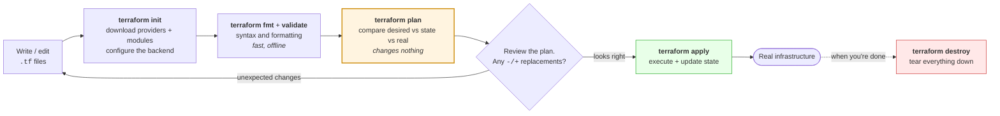
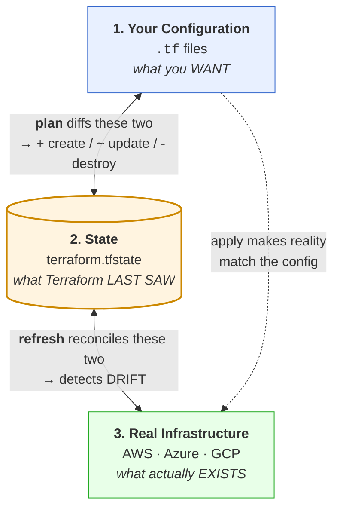
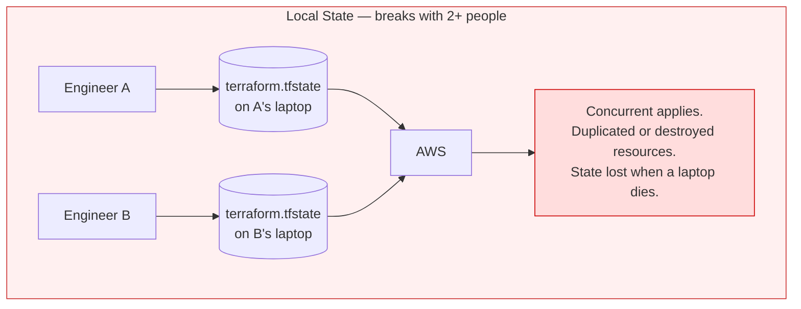
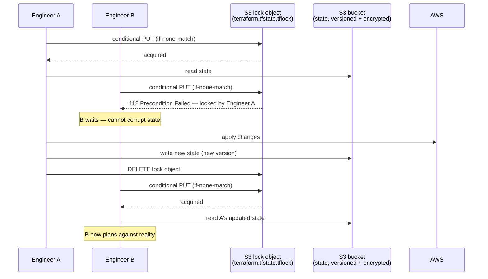

# Module 10: Terraform

> *"Infrastructure as Code means your infrastructure is version-controlled, reviewed, and reproducible — just like your application."*

---

>**Command reference**: [`cheatsheet.md`](./cheatsheet.md) — every command in this module, grouped by task, with the gotchas.
>
>**Cross-module lookup**: [Quick Reference](../QUICK-REFERENCE.md)

---

## Why This Module Matters

Clicking through the AWS console doesn't scale. When you manage 50 servers, 3 environments, and multiple regions, you need to **define infrastructure as code** — repeatable, reviewable, and automated. Terraform is the industry standard for this.

**In real-world DevOps work**, you will:

- Write Terraform configurations to provision cloud infrastructure
- Manage state files and collaborate with teams
- Build reusable modules for common patterns
- Plan and apply changes safely with review workflows
- Handle multiple environments (dev, staging, production)
- Import existing infrastructure into Terraform

---

## Table of Contents

1. [Infrastructure as Code Concepts](#1-infrastructure-as-code-concepts)
2. [Terraform Fundamentals](#2-terraform-fundamentals)
3. [HCL — HashiCorp Configuration Language](#3-hcl--hashicorp-configuration-language)
4. [Core Workflow](#4-core-workflow)
5. [State Management](#5-state-management)
6. [Variables and Outputs](#6-variables-and-outputs)
7. [Modules](#7-modules)
8. [Managing Multiple Environments](#8-managing-multiple-environments)
9. [Packer — Building Golden Images](#9-packer--building-golden-images)
10. [Common Mistakes and Anti-Patterns](#10-common-mistakes-and-anti-patterns)
11. [Debugging Mindset](#11-debugging-mindset)
12. [Interview Insights](#12-interview-insights)

---

## 1. Infrastructure as Code Concepts

### Why IaC?

```
MANUAL (Console/CLI):
   No record of what was done
   Can't reproduce exactly
   No code review for infrastructure changes
   Drift between environments (staging ≠ production)
   "Who changed this security group last Thursday?"

INFRASTRUCTURE AS CODE:
   Version controlled (Git)
   Reproducible (same config = same infrastructure)
   Reviewable (PRs for infra changes)
   Testable (validate before apply)
   Self-documenting (the code IS the documentation)
```

### Declarative vs Imperative

```
IMPERATIVE (scripting):
  "Create a VPC. Then create a subnet. Then create an instance."
  You describe the STEPS. (Bash, Python, AWS CLI scripts)

DECLARATIVE (Terraform):
  "I want a VPC with a subnet and an instance."
  You describe the DESIRED STATE. Terraform figures out the steps.
```

| Tool | Approach | Language | State | Cloud Support |
|------|----------|----------|-------|---------------|
| **Terraform** | Declarative | HCL | External state file | Multi-cloud |
| **CloudFormation** | Declarative | JSON/YAML | Managed by AWS | AWS only |
| **Pulumi** | Declarative | Python/TS/Go | Managed service | Multi-cloud |
| **Ansible** | Imperative/Declarative | YAML | Stateless | Multi-cloud |

---

## 2. Terraform Fundamentals

### How Terraform Works

```
┌──────────┐     ┌──────────────┐     ┌───────────────┐
│  .tf     │     │  TERRAFORM   │     │  CLOUD API    │
│  files   │────▶│  ENGINE      │────▶│  (AWS, GCP,   │
│  (code)  │     │              │     │   Azure)      │
└──────────┘     └──────┬───────┘     └───────────────┘
                        │
                 ┌──────▼───────┐
                 │  STATE FILE  │
                 │  (.tfstate)  │
                 │  Tracks what │
                 │  exists      │
                 └──────────────┘
```

### Key Concepts

```
PROVIDER:     Plugin that talks to a cloud API (aws, azurerm, google)
RESOURCE:     A piece of infrastructure (aws_instance, aws_s3_bucket)
DATA SOURCE:  Read existing infrastructure (look up an AMI ID)
VARIABLE:     Input parameter (instance type, region)
OUTPUT:       Exported value (IP address, DNS name)
MODULE:       Reusable group of resources (VPC module, app module)
STATE:        Record of what Terraform has created (terraform.tfstate)
```

### Installation

```bash
# macOS
brew install terraform

# Debian/Ubuntu
wget -O- https://apt.releases.hashicorp.com/gpg | sudo gpg --dearmor -o /usr/share/keyrings/hashicorp-archive-keyring.gpg
echo "deb [signed-by=/usr/share/keyrings/hashicorp-archive-keyring.gpg] https://apt.releases.hashicorp.com $(lsb_release -cs) main" | sudo tee /etc/apt/sources.list.d/hashicorp.list
sudo apt update && sudo apt install terraform

# RHEL-compatible
sudo dnf install -y dnf-plugins-core
sudo dnf config-manager --add-repo https://rpm.releases.hashicorp.com/RHEL/hashicorp.repo
sudo dnf install -y terraform

# Verify
terraform version
```

---

## 3. HCL — HashiCorp Configuration Language

### Basic Syntax

```hcl
# Provider configuration
terraform {
  required_version = ">= 1.5.0"
  required_providers {
    aws = {
      source  = "hashicorp/aws"
      version = "~> 5.0"
    }
  }
}

provider "aws" {
  region = "us-east-1"
}

# Resource: Create an EC2 instance
resource "aws_instance" "web" {
  ami           = "ami-0c55b159cbfafe1f0"
  instance_type = "t3.micro"

  tags = {
    Name        = "web-server"
    Environment = "dev"
    ManagedBy   = "terraform"
  }
}

# Data source: Look up the latest Amazon Linux AMI
data "aws_ami" "amazon_linux" {
  most_recent = true
  owners      = ["amazon"]

  filter {
    name   = "name"
    values = ["al2023-ami-*-x86_64"]
  }
}

# Output: Export the public IP
output "instance_ip" {
  value       = aws_instance.web.public_ip
  description = "Public IP of the web server"
}
```

### Resource References

```hcl
# Resources reference each other — Terraform builds a dependency graph
resource "aws_vpc" "main" {
  cidr_block = "10.0.0.0/16"
}

resource "aws_subnet" "public" {
  vpc_id     = aws_vpc.main.id          # References VPC above
  cidr_block = "10.0.1.0/24"
}

resource "aws_instance" "web" {
  subnet_id = aws_subnet.public.id      # References subnet above
  ami       = data.aws_ami.amazon_linux.id
  # Terraform knows: VPC → Subnet → Instance (creates in order)
}
```

---

## 4. Core Workflow

### The Three Commands



> ** `plan` is the whole point of Terraform.** Every other IaC failure mode — the accidental database deletion, the surprise downtime, the resource replaced instead of updated — is a plan someone didn't read. In CI, run `terraform plan -out=tfplan` on the PR, post the output as a comment, and have `apply` consume **that exact saved plan file** so nobody applies something different from what was reviewed.

### What Each Command Does

```bash
# 1. Initialize — download providers, set up backend
terraform init
# Downloads the AWS provider plugin
# Sets up state backend (local or remote)
# Only needed once, or when adding new providers/modules

# 2. Plan — preview changes (SAFE — changes nothing)
terraform plan
# Shows: + create, ~ modify, - destroy
# ALWAYS review the plan before applying!

# 3. Apply — make the changes
terraform apply
# Shows the plan again, asks for confirmation
# Creates/modifies/destroys resources

# Other important commands:
terraform destroy            # Tear down ALL resources
terraform fmt                # Format .tf files consistently
terraform validate           # Check syntax and configuration
terraform output             # Show output values
terraform state list         # List resources in state
terraform import             # Import existing infrastructure
```

### Plan Output Reading

```
Terraform will perform the following actions:

  # aws_instance.web will be created
  + resource "aws_instance" "web" {
      + ami           = "ami-0c55b159cbfafe1f0"
      + instance_type = "t3.micro"
      + id            = (known after apply)
      + public_ip     = (known after apply)
    }

  # aws_security_group.web will be updated in-place
  ~ resource "aws_security_group" "web" {
      ~ ingress {
          - from_port = 80    → 443     # Changed
        }
    }

  # aws_instance.old will be destroyed
  - resource "aws_instance" "old" {
      - ami           = "ami-old123"
      - instance_type = "t2.micro"
    }

Plan: 1 to add, 1 to change, 1 to destroy.
```

```
SYMBOLS:
  +  = CREATE (new resource)
  ~  = MODIFY in-place (update existing)
  -  = DESTROY (delete resource)
  -/+ = REPLACE (destroy and recreate)
       This means DOWNTIME — watch for these!
```

---

## 5. State Management

### What Is State?

The state file is a JSON index that maps the names in your code to real resource IDs in the cloud. Without it, Terraform has no idea that `aws_instance.web` is `i-0abc123def456` — it would create a second one.

**Every Terraform operation is a comparison between three things:**



**Every state problem is one of these three getting out of sync** — and each has its own fix:

| Symptom | What broke | Fix |
|---------|-----------|-----|
| Plan wants to **create** something that already exists | Real , State  — resource made outside Terraform | `import` block, then write matching config |
| Plan wants to **destroy and recreate** after you renamed a resource | Code , State has the old name | `moved` block — updates state only, no downtime |
| Plan shows changes you didn't make | **Drift** — someone edited it in the console | Either revert manually, or update the config to match |
| Plan wants to **destroy** something you want to keep | Code , State  — you deleted the block | `terraform state rm` to forget it without deleting it |
| `Error: state lock` | Another apply is running (or crashed holding the lock) | Wait; if truly stale, `terraform force-unlock <ID>` |

> ** State contains secrets in plaintext.** Database passwords, generated private keys, and any sensitive output land in `terraform.tfstate` unencrypted. Never commit it to Git; always use an encrypted remote backend; add `*.tfstate*` to `.gitignore` on day one.

### Local vs Remote State

**Local state** is a file on one laptop. The moment a second engineer runs `apply`, you have two divergent views of production and no lock to stop them colliding.



**Remote state** puts the file in shared, versioned, encrypted storage and adds a **lock** so only one apply can run at a time.



| | Local | Remote (S3 with `use_lockfile`, or HCP Terraform) |
|---|-------|--------------------------------------------|
| **Collaboration** |  One person only |  Whole team |
| **Locking** |  None |  Concurrent applies blocked |
| **Durability** |  Dies with the laptop |  Versioned, backed up |
| **Encryption at rest** |  Plaintext on disk |  SSE-KMS |
| **Use for** | Learning, throwaway experiments | Anything real |

### Remote State Backend (S3)

```hcl
terraform {
  backend "s3" {
    bucket       = "my-terraform-state"
    key          = "prod/infrastructure/terraform.tfstate"
    region       = "us-east-1"
    encrypt      = true
    use_lockfile = true    #  State locking — a .tflock object in the bucket
  }
}
```

>**Older guides use `dynamodb_table = "terraform-locks"` for locking.** That is
> [deprecated and will be removed in a future minor version](https://developer.hashicorp.com/terraform/language/backend/s3#state-locking).
> Use `use_lockfile = true` (Terraform 1.10+) instead: S3 itself does the locking with a
> conditional write, so there is no second resource to bootstrap, pay for, or forget to
> grant IAM on. Migrating? Set both for one release — Terraform accepts them together —
> then drop `dynamodb_table` and delete the table.

### State Commands

```bash
# List all resources in state
terraform state list

# Show details of a specific resource
terraform state show aws_instance.web

# Remove a resource from state (without destroying it)
terraform state rm aws_instance.web

# Move/rename a resource in state
terraform state mv aws_instance.old aws_instance.new

# Import existing infrastructure into state (CLI method)
terraform import aws_instance.web i-0abc123def456
```

### Modern Import and Refactoring (Terraform 1.5+)

The CLI `terraform import` command works, but has limitations — it doesn't generate configuration and can't be reviewed in a PR. Terraform 1.5+ introduced **declarative import** and **moved** blocks that are safer and version-controlled.

**Import Block** — Import existing resources via config (not just CLI):

```hcl
# import.tf — bring an existing EC2 instance under Terraform management
import {
  to = aws_instance.web
  id = "i-0abc123def456"
}

# 1. Add the import block
# 2. Write the matching resource block
# 3. Run: terraform plan (shows what will be imported, no changes)
# 4. Run: terraform apply (imports into state)
# 5. Remove the import block (it's a one-time operation)

# Why this is better than CLI import:
#    Reviewable in PRs (the import is in code, not a CLI command)
#    Can generate config: terraform plan -generate-config-out=generated.tf
#    Safe — plan shows exactly what will happen before you apply
```

**Moved Block** — Safely rename or refactor resources without destroy/recreate:

```hcl
# You renamed a resource from "old" to "new" in your code.
# Without moved block: Terraform destroys "old" and creates "new" (DOWNTIME!)
# With moved block: Terraform updates state only (no infrastructure change)

moved {
  from = aws_instance.old
  to   = aws_instance.new
}

# Also works when moving resources into or out of modules:
moved {
  from = aws_instance.web
  to   = module.compute.aws_instance.web
}

# Run terraform plan → shows "moved" instead of destroy+create
# After successful apply, you can remove the moved block
```

>**Use `import` and `moved` blocks instead of CLI state commands whenever possible** — they're reviewable, auditable, and safer for team workflows.

---

## 6. Variables and Outputs

### Input Variables

```hcl
# variables.tf
variable "environment" {
  description = "Deployment environment"
  type        = string
  default     = "dev"

  validation {
    condition     = contains(["dev", "staging", "prod"], var.environment)
    error_message = "Environment must be dev, staging, or prod."
  }
}

variable "instance_type" {
  description = "EC2 instance type"
  type        = string
  default     = "t3.micro"
}

variable "allowed_cidrs" {
  description = "CIDRs allowed to access the app"
  type        = list(string)
  default     = ["0.0.0.0/0"]
}

variable "tags" {
  description = "Common resource tags"
  type        = map(string)
  default = {
    ManagedBy = "terraform"
    Project   = "devops-handbook"
  }
}
```

### Using Variables

```hcl
# main.tf
resource "aws_instance" "web" {
  ami           = data.aws_ami.amazon_linux.id
  instance_type = var.instance_type

  tags = merge(var.tags, {
    Name        = "web-${var.environment}"
    Environment = var.environment
  })
}
```

### Setting Variable Values

```bash
# 1. terraform.tfvars file (auto-loaded)
# terraform.tfvars
environment   = "prod"
instance_type = "t3.small"

# 2. Environment-specific files
# prod.tfvars
environment   = "prod"
instance_type = "t3.large"

terraform plan -var-file="prod.tfvars"

# 3. Command line
terraform plan -var="environment=staging"

# 4. Environment variables
export TF_VAR_environment="staging"
terraform plan
```

### Outputs

```hcl
# outputs.tf
output "instance_id" {
  value       = aws_instance.web.id
  description = "EC2 instance ID"
}

output "public_ip" {
  value       = aws_instance.web.public_ip
  description = "Public IP address"
}

output "database_password" {
  value       = random_password.db.result
  sensitive   = true                        # Hidden in CLI output
  description = "Generated database password"
}
```

---

## 7. Modules

### Why Modules?

```
WITHOUT MODULES:
  Copy-paste the same VPC config for dev, staging, prod → drift, bugs

WITH MODULES:
  Write the VPC config ONCE, use it 3 times with different parameters
  Like functions in programming
```

### Module Structure

```
modules/
└── vpc/
    ├── main.tf          # Resources
    ├── variables.tf     # Inputs
    ├── outputs.tf       # Outputs
    └── README.md        # Documentation
```

### Creating a Module

```hcl
# modules/vpc/variables.tf
variable "vpc_cidr" {
  description = "VPC CIDR block"
  type        = string
}

variable "environment" {
  description = "Environment name"
  type        = string
}

# modules/vpc/main.tf
resource "aws_vpc" "main" {
  cidr_block           = var.vpc_cidr
  enable_dns_hostnames = true

  tags = {
    Name        = "${var.environment}-vpc"
    Environment = var.environment
  }
}

resource "aws_subnet" "public" {
  vpc_id                  = aws_vpc.main.id
  cidr_block              = cidrsubnet(var.vpc_cidr, 8, 1)
  map_public_ip_on_launch = true

  tags = {
    Name = "${var.environment}-public"
  }
}

# modules/vpc/outputs.tf
output "vpc_id" {
  value = aws_vpc.main.id
}

output "public_subnet_id" {
  value = aws_subnet.public.id
}
```

### Using a Module

```hcl
# environments/prod/main.tf
module "vpc" {
  source      = "../../modules/vpc"
  vpc_cidr    = "10.0.0.0/16"
  environment = "prod"
}

resource "aws_instance" "web" {
  subnet_id     = module.vpc.public_subnet_id   # Use module output
  ami           = data.aws_ami.amazon_linux.id
  instance_type = "t3.small"
}
```

---

## 8. Managing Multiple Environments

### Directory Structure

```
terraform/
├── modules/
│   ├── vpc/
│   ├── ec2/
│   └── rds/
├── environments/
│   ├── dev/
│   │   ├── main.tf
│   │   ├── variables.tf
│   │   ├── terraform.tfvars
│   │   └── backend.tf
│   ├── staging/
│   │   ├── main.tf
│   │   ├── variables.tf
│   │   ├── terraform.tfvars
│   │   └── backend.tf
│   └── prod/
│       ├── main.tf
│       ├── variables.tf
│       ├── terraform.tfvars
│       └── backend.tf
```

### Workspaces (Alternative Approach)

```bash
# Create and switch workspaces
terraform workspace new dev
terraform workspace new staging
terraform workspace new prod

# Switch workspace
terraform workspace select prod

# List workspaces
terraform workspace list

# Use in config
resource "aws_instance" "web" {
  instance_type = terraform.workspace == "prod" ? "t3.large" : "t3.micro"
  tags = { Environment = terraform.workspace }
}
```

>**Recommendation:** Use separate directories for environments (not workspaces) — clearer separation, independent state, safer.

---

## 9. Packer — Building Golden Images

### Bake or Configure?

Terraform creates a machine. Ansible configures it. There is a third option that removes most of the second step: build the image *before* anything boots, so instances start already correct.

```
CONFIGURE AT BOOT                      BAKE THE IMAGE (Packer)
  terraform apply → empty instance       packer build → AMI with everything in it
  → user_data / Ansible installs         → terraform apply → instance boots ready
    Python, nginx, agents, app
  → 3-8 minutes before it serves         → 30-60 seconds before it serves
  → apt repo down = failed launch        → no external dependency at boot
  → each instance configures itself      → every instance is byte-identical
    (and can differ)
```

Under autoscaling that difference stops being aesthetic: a node group that takes six minutes to become useful cannot respond to a traffic spike, and a launch that depends on a package repository will eventually fail at 3 a.m. because the repository is having a bad day.

| Bake it | Configure at boot |
|---------|-------------------|
| Anything slow to install (compilers, ML libraries, agents) | Anything environment-specific (config, secrets, DNS names) |
| The base OS hardening your whole fleet shares | Anything that changes more often than you want to rebuild |
| Runtime, application dependencies, monitoring agents | The application version, if you deploy more than daily |

The common answer is **both**: a golden base image rebuilt weekly with the OS, agents, and hardening, then a thin layer of config at boot. What you should not do is bake secrets or environment names into the image — that is how a staging AMI ends up in production.

### Packer in One File

```hcl
# ubuntu-base.pkr.hcl
packer {
  required_plugins {
    amazon = {
      version = ">= 1.3.0"
      source  = "github.com/hashicorp/amazon"
    }
  }
}

variable "region" {
  type    = string
  default = "eu-west-1"
}

#  Never hardcode a source AMI id. Resolve the newest one at build time, from a
# filter that pins the OS version but not the patch level.
source "amazon-ebs" "ubuntu" {
  region        = var.region
  instance_type = "t3.small"
  ssh_username  = "ubuntu"

  source_ami_filter {
    filters = {
      name                = "ubuntu/images/hvm-ssd/ubuntu-jammy-22.04-amd64-server-*"
      virtualization-type = "hvm"
      root-device-type    = "ebs"
    }
    owners      = ["099720109477"] # Canonical
    most_recent = true
  }

  # The image name must be unique per build, and the timestamp is how you tell
  # two images apart six months later.
  ami_name = "app-base-{{timestamp}}"

  tags = {
    Name          = "app-base"
    BuildDate     = "{{isotime \"2006-01-02\"}}"
    SourceAMI     = "{{ .SourceAMI }}"
    GitCommit     = "{{ env `GIT_COMMIT` }}" #  trace any running instance back to a commit
    ManagedBy     = "packer"
  }
}

build {
  sources = ["source.amazon-ebs.ubuntu"]

  # Wait for cloud-init, or your first apt command races it and fails intermittently.
  provisioner "shell" {
    inline = ["cloud-init status --wait"]
  }

  # Reuse the Ansible roles you already wrote (Module 11) — no need for a second
  # configuration language just because this is image build time.
  provisioner "ansible" {
    playbook_file = "../ansible/playbooks/base.yml"
    extra_arguments = ["--extra-vars", "packer_build=true"]
  }

  # Prove the image is correct before it is allowed to exist.
  provisioner "shell" {
    inline = [
      "set -euo pipefail",
      "systemctl is-enabled node_exporter",
      "test -f /etc/ssh/sshd_config.d/hardening.conf",
      "! systemctl is-active ssh-password-auth || (echo 'password auth enabled' && exit 1)",
    ]
  }

  # Machine-readable output for the pipeline that consumes the image id.
  post-processor "manifest" {
    output = "manifest.json"
  }
}
```

```bash
packer init .
packer fmt -check .                    # like terraform fmt — CI should enforce it
packer validate -var region=eu-west-1 .
PACKER_LOG=1 packer build .            #  PACKER_LOG=1 is how you debug a hanging build
jq -r '.builds[-1].artifact_id' manifest.json
```

### Handing the Image to Terraform

The two tools meet at the image ID, and how they meet decides whether your fleet is reproducible:

```hcl
# Look up the newest image this pipeline published — never a hardcoded ami-0abc123
data "aws_ami" "app_base" {
  most_recent = true
  owners      = ["self"]

  filter {
    name   = "name"
    values = ["app-base-*"]
  }
  filter {
    name   = "tag:ManagedBy"
    values = ["packer"]
  }
}

resource "aws_launch_template" "app" {
  image_id      = data.aws_ami.app_base.id
  instance_type = "t3.small"
  # ...
}
```

>`most_recent = true` means a new Packer build silently changes your next `terraform plan`. That is convenient in dev and unacceptable in production. Pin production to an explicit AMI ID in a `.tfvars` file and promote it deliberately — the same "build once, promote the artefact" discipline from Module 06, applied to machine images.

### Cleaning Up After Yourself

Old AMIs are free; their snapshots are not. This is one of the quietest cloud bills there is:

```bash
# Images you own, oldest first — anything unused beyond your rollback window is waste
aws ec2 describe-images --owners self \
  --query 'sort_by(Images,&CreationDate)[].[CreationDate,ImageId,Name]' --output table

# Deregistering an AMI does NOT delete its snapshot. Delete both.
aws ec2 deregister-image --image-id ami-0123456789abcdef0
aws ec2 delete-snapshot --snapshot-id snap-0123456789abcdef0
```

> ** DevOps Impact**: golden images are the practical mechanism behind immutable infrastructure. Once instances boot ready and identical, "log in and fix it" stops being possible — which is the point. The fix becomes a new image and a replaced instance, and configuration drift has nowhere to live.

---

## 10. Common Mistakes and Anti-Patterns

### Committing State Files

```bash
# BAD: state file in git (contains secrets, resource IDs)
git add terraform.tfstate

# GOOD: .gitignore
echo "*.tfstate*" >> .gitignore
echo ".terraform/" >> .gitignore
```

### Hardcoding Values

```hcl
# BAD
resource "aws_instance" "web" {
  ami           = "ami-0c55b159cbfafe1f0"   # Which AMI? Which region?
  instance_type = "t3.large"                 # Same for dev and prod?
}

# GOOD
resource "aws_instance" "web" {
  ami           = data.aws_ami.amazon_linux.id
  instance_type = var.instance_type
}
```

### No State Locking

```
Two engineers run "terraform apply" at the same time:
  Engineer A: Creating instance → state updated
  Engineer B: Creating instance → OVERWRITES state
  Result: Orphaned resources, corrupted state

FIX: Use remote state with locking (S3 `use_lockfile = true`).
```

### Massive Monolithic Configs

```
BAD:  One giant main.tf with 500 resources
GOOD: Split into modules, use separate state per component
      VPC state, App state, Database state — independent lifecycles
```

---

## 11. Debugging Mindset

### Terraform Troubleshooting

```
terraform plan fails?
│
├─ 1. READ THE ERROR (Terraform errors are usually clear)
│     └─ Syntax error? → terraform fmt + terraform validate
│
├─ 2. CHECK PROVIDER AUTH
│     └─ AWS credentials configured? → aws sts get-caller-identity
│
├─ 3. STATE ISSUES
│     ├─ Resource exists but not in state? → terraform import
│     ├─ Resource in state but deleted? → terraform state rm
│     └─ State locked? → terraform force-unlock <LOCK_ID>
│
├─ 4. DEPENDENCY ISSUES
│     └─ Circular dependency? → Use depends_on explicitly
│
└─ 5. ENABLE DEBUG LOGGING
      export TF_LOG=DEBUG
      terraform plan
```

---

## 12. Interview Insights

**Q: What is Terraform and why use it over CloudFormation?**
> Terraform is a declarative IaC tool that provisions infrastructure across any cloud provider. Unlike CloudFormation (AWS-only), Terraform is multi-cloud — the same workflow works for AWS, GCP, Azure, and hundreds of other providers. It has a larger community, reusable modules on the Terraform Registry, and the plan/apply workflow provides safe change management.

**Q: Explain Terraform state. Why is it important?**
> State maps your code to real cloud resources. When you write `resource "aws_instance" "web"`, the state records that "web" = instance `i-0abc123`. Without state, Terraform would try to create duplicates on every apply. State must be stored remotely (S3 with `use_lockfile = true`) for team collaboration and locking.

**Q: What happens if two people run terraform apply simultaneously?**
> Without state locking, they can corrupt the state file. With locking on, the second person gets a "state locked" error and must wait. This is why remote state with locking is essential for teams.

**Q: How do you manage multiple environments?**
> Separate directories per environment (dev/, staging/, prod/) with shared modules. Each environment has its own state file and variable values. Modules ensure consistency — same infrastructure pattern, different parameters. Some teams use workspaces, but separate directories provide better isolation.

**Q: How do you handle secrets in Terraform?**
> Never hardcode secrets in .tf files. Use AWS Secrets Manager or SSM Parameter Store as data sources. Mark sensitive outputs with `sensitive = true`. Use remote state with encryption. Pass secrets via environment variables (TF_VAR_*) in CI/CD, never in tfvars files committed to git.

---

## Labs and Projects

Read the sections above first, then work through these **in order**. Every lab ends with a  **Break It** section — those are not optional; they are where the debugging skill actually comes from.

| # | Lab | What you'll do |
|---|-----|----------------|
| 1 | **[Terraform Basics](./labs/lab-01-terraform-basics.md)** | Write your first Terraform configurations, provision real AWS resources, understand state, and practice the plan/apply/destroy workflow. |
| 2 | **[Remote State and Locking](./labs/lab-02-remote-state-and-locking.md)** | Move Terraform state off your laptop and into shared, versioned, encrypted, **locked** storage — the change that makes Terraform usable by more than… |
| 3 | **[Modules, Environments, and Drift](./labs/lab-03-modules-and-environments.md)** | Stop copy-pasting `.tf` files between environments. |
| 4 | **[Packer and Golden Images](./labs/lab-04-packer-golden-images.md)** | Bake an image, verify it before it is allowed to exist, and hand it to Terraform by digest — the immutable-infrastructure loop, end to end, on your… |

**Portfolio project:**

- [Project: Reproducible Infrastructure with Terraform](./projects/project-01-reproducible-infrastructure.md) — Use Terraform to provision a small piece of infrastructure and prove that it can be planned, applied, validated, and destroyed repeatably.

**Reference code** for every lab: [`code/`](./code/) — real files, validated in CI.

---

## Self-Check

Answer these from memory before you expand them. If more than two give you trouble, re-read the sections they come from — the labs assume this material is solid.

<details>
<summary><strong>1. What is state, and why can it not live only on your laptop?</strong></summary>

State maps your configuration to the real resources it created, including their IDs and attributes; without it Terraform cannot tell "create" from "update" and will happily build a second copy of everything. Local state means one person can apply and losing the file orphans live infrastructure — use a remote backend with locking.

</details>

<details>
<summary><strong>2. Why is the state file treated as a secret?</strong></summary>

Because it stores resource attributes verbatim, including generated passwords, keys, and connection strings — in plain text, whether or not the variable was marked sensitive. Encrypt the backend, restrict who can read it, and never commit it.

</details>

<details>
<summary><strong>3. `plan` says one thing and `apply` does another. How?</strong></summary>

A plan is a diff against state and the real world at the moment it ran. If someone changes a resource, or another apply lands in between, the world has moved. Lock state, and for anything important save the plan to a file and apply that file rather than re-planning.

</details>

<details>
<summary><strong>4. Someone changed a resource in the web console. How do you detect it and what are your options?</strong></summary>

`terraform plan` shows it as a diff — that is drift. You either bring the change into code (if it was right) or apply to revert it (if it was not). `terraform plan -refresh-only` updates state to match reality without proposing changes, which is the safe way to look first.

</details>

<details>
<summary><strong>5. `count` or `for_each`?</strong></summary>

`count` indexes by position, so removing the middle element renumbers everything after it and Terraform destroys and recreates resources you never touched. `for_each` keys by a stable string, so each instance has its own identity and can be removed alone. Prefer `for_each` for anything with a natural key.

</details>

<details>
<summary><strong>6. How do you force one resource to be rebuilt, and how do you adopt one that already exists?</strong></summary>

`terraform apply -replace=ADDRESS` recreates a single resource (this replaced the deprecated `taint`). `terraform import` brings an existing resource under management — you still have to write matching configuration. Hand-editing the state file is not on the list.

</details>

<details>
<summary><strong>7. Your autoscaling group takes six minutes to serve traffic after a launch. What changes, and what must not move into the image?</strong></summary>

Bake a golden image with Packer: the slow installs, agents, and OS hardening go in at build time, so instances boot ready in under a minute and no longer depend on a package repository being up at 3 a.m. What must stay out is anything environment-specific — config, secrets, environment names — otherwise a staging image ends up in production. And pin production to an explicit AMI id rather than `most_recent = true`, or a Packer build silently changes your next `terraform plan`.

</details>

---

## Practical Checkpoint

Before moving on, you should be able to:

- Write Terraform configuration using providers, resources, variables, outputs, and state.
- Use `terraform plan` to explain what will change before applying it.
- Safely destroy lab infrastructure and understand what state is tracking.

Portfolio evidence to keep:

- Terraform code and variable examples.
- `plan`, `apply`, and validation notes.
- Destroy proof and a short state-management explanation.

Suggested project: [Reproducible Infrastructure with Terraform](./projects/project-01-reproducible-infrastructure.md)

---

## What's Next?

Terraform provisions infrastructure. Ansible configures it — installing packages, managing configs, and ensuring desired state on running systems.

**[Module 11: Ansible →](../11-ansible/)**

---

<div align="center">

**Module 10 Complete** 

[← Back to Cloud Fundamentals](../09-cloud-fundamentals/) | [ Cheat Sheet](./cheatsheet.md) | [Next: Ansible →](../11-ansible/)

</div>


## Reference
<!-- tab: Cheatsheet -->
> CLI, HCL, functions, and state surgery. Concepts live in the [module README](./README.md).
> Cross-module daily commands: **[QUICK-REFERENCE.md](../QUICK-REFERENCE.md)**

**Jump to:** [CLI](#cli) · [State commands](#state-commands) · [HCL blocks](#hcl-blocks) · [Variables](#variables--outputs) · [Meta-arguments](#meta-arguments) · [Functions](#function-reference) · [Modules](#modules) · [Backends](#backends--locking) · [Environments](#multiple-environments) · [Testing](#testing--policy) · [Errors](#error-decoder)

---

## CLI

```bash
terraform init                          # download providers/modules, configure the backend
terraform init -upgrade                 # bump providers within their version constraints
terraform init -reconfigure             # ignore the existing backend config
terraform init -migrate-state           # move state to a new backend
terraform init -backend-config=prod.hcl # partial backend configuration

terraform fmt -recursive                #  format everything
terraform fmt -check -recursive         # CI gate: fail if unformatted
terraform validate                      # syntax + internal consistency (no cloud calls)

terraform plan                          # preview
terraform plan -out=tfplan              #  save the plan — apply exactly this
terraform plan -var-file=prod.tfvars
terraform plan -target=module.network   #  narrow scope; escape hatch, not routine
terraform plan -refresh=false           # faster; skips reading real infra
terraform plan -destroy                 # preview a teardown
terraform show -json tfplan | jq        # machine-readable plan for policy checks

terraform apply
terraform apply tfplan                  #  apply the reviewed plan, no re-prompt
terraform apply -auto-approve           #  CI only, and only after a reviewed plan
terraform apply -parallelism=5          # default is 10
terraform apply -replace=aws_instance.web   # force recreate one resource

terraform destroy
terraform destroy -target=aws_instance.web

terraform output                        # all outputs
terraform output -json | jq
terraform output -raw db_endpoint       #  no quotes — pipe-friendly

terraform providers                     # provider requirements tree
terraform providers lock -platform=linux_amd64 -platform=darwin_arm64   # multi-OS lockfile
terraform version
terraform console                       #  REPL for testing expressions
terraform graph | dot -Tsvg > graph.svg
terraform workspace list|new|select|delete
terraform force-unlock <LOCK_ID>        #  only when a lock is genuinely stale
terraform login / logout                # Terraform Cloud
```

**Environment variables:**

```bash
export TF_VAR_region="us-east-1"        #  sets variable "region"
export TF_LOG=DEBUG                     # TRACE|DEBUG|INFO|WARN|ERROR
export TF_LOG_PATH=./terraform.log
export TF_IN_AUTOMATION=1               # quieter output for CI
export TF_INPUT=0                       # never prompt
export TF_CLI_ARGS_plan="-lock-timeout=5m"
export TF_DATA_DIR=.terraform
```

---

## State Commands

```bash
terraform state list                             # every resource address
terraform state list | grep aws_instance
terraform state show aws_instance.web            #  full attributes of one resource
terraform state pull > backup.tfstate            #  ALWAYS back up before surgery
terraform state push backup.tfstate              #  dangerous

terraform state mv aws_instance.old aws_instance.new           # rename in state
terraform state mv aws_instance.web module.compute.aws_instance.web
terraform state mv 'aws_instance.web[0]' 'aws_instance.web["a"]'   # count → for_each
terraform state rm aws_instance.web              # forget it WITHOUT destroying it
terraform state replace-provider hashicorp/aws registry.example/aws

terraform import aws_instance.web i-0abc123      # legacy CLI import
terraform refresh                                # deprecated; use: terraform apply -refresh-only
terraform apply -refresh-only                    #  reconcile state with reality, no changes
terraform taint aws_instance.web                 # deprecated; use -replace
```

### Declarative import and refactoring (Terraform 1.5+)

```hcl
# Reviewable in a PR, and can generate the config for you
import {
  to = aws_instance.web
  id = "i-0abc123def456"
}
```

```bash
terraform plan -generate-config-out=generated.tf    #  writes the resource block for you
terraform apply                                     # imports into state
# then delete the import block — it's a one-time operation
```

```hcl
# Rename or relocate WITHOUT destroy/recreate
moved {
  from = aws_instance.old
  to   = aws_instance.new
}

moved {
  from = aws_instance.web
  to   = module.compute.aws_instance.web
}

# Terraform 1.7+: intentional removal from state, keeping the real resource
removed {
  from = aws_instance.legacy
  lifecycle { destroy = false }
}
```

### State surgery playbook

| Situation | Steps |
|-----------|-------|
| Resource exists in cloud, not in state | Add an `import` block → `plan -generate-config-out` → `apply` |
| Renamed a resource in code | Add a `moved` block → `plan` shows "0 to change" → `apply` |
| Want Terraform to stop managing something | `terraform state rm ADDR` (or a `removed` block) |
| Someone changed it in the console (drift) | `terraform apply -refresh-only` to record it, then decide: revert or codify |
| State is locked and the job that held it died | Confirm nothing is running, then `terraform force-unlock <ID>` |
| Need to split one state into two | `state pull` backup → `state rm` from A → `import` into B |
| State file is corrupt | Restore from S3 versioning: `aws s3api list-object-versions` → download → `state push` |

>**`terraform state pull > backup.tfstate` before every state operation.** State surgery is the one part of Terraform with no plan step and no undo.

---

## HCL Blocks

```hcl
terraform {
  required_version = ">= 1.6.0"
  required_providers {
    aws = {
      source  = "hashicorp/aws"
      version = "~> 5.40"        #  >= 5.40, < 6.0
    }
  }
  backend "s3" {
    bucket       = "my-tf-state"
    key          = "prod/network/terraform.tfstate"
    region       = "us-east-1"
    encrypt      = true
    use_lockfile = true        #  locking; dynamodb_table is deprecated
  }
}

provider "aws" {
  region = var.region
  default_tags {
    tags = {
      ManagedBy   = "terraform"
      Environment = var.environment
      Repo        = "github.com/myorg/infra"
    }
  }
}

provider "aws" {
  alias  = "us_west"            #  second region
  region = "us-west-2"
}

resource "aws_instance" "web" {
  ami           = data.aws_ami.al2023.id
  instance_type = var.instance_type
  tags          = { Name = "web-${var.environment}" }
}

data "aws_ami" "al2023" {       # read-only lookup
  most_recent = true
  owners      = ["amazon"]
  filter {
    name   = "name"
    values = ["al2023-ami-*-x86_64"]
  }
}

locals {
  name_prefix = "${var.project}-${var.environment}"
  common_tags = {
    Project     = var.project
    Environment = var.environment
  }
}

module "vpc" {
  source  = "terraform-aws-modules/vpc/aws"
  version = "~> 5.0"
  name    = local.name_prefix
  cidr    = var.vpc_cidr
}

output "vpc_id" {
  value       = module.vpc.vpc_id
  description = "ID of the created VPC"
}
```

**Version constraint operators:**

| Constraint | Allows |
|------------|--------|
| `= 5.40.0` | Exactly that version |
| `>= 5.40` | That or newer |
| `~> 5.40` | `>= 5.40, < 6.0` —  allows minor and patch |
| `~> 5.40.0` | `>= 5.40.0, < 5.41.0` — patch only |
| `>= 5.0, < 6.0` | Explicit range |

>Commit `.terraform.lock.hcl`. It pins exact provider versions and checksums so every machine and CI run resolves identically.

---

## Variables & Outputs

```hcl
variable "instance_type" {
  type        = string
  default     = "t3.micro"
  description = "EC2 instance size"
}

variable "environment" {
  type = string
  validation {
    condition     = contains(["dev", "staging", "prod"], var.environment)
    error_message = "environment must be dev, staging, or prod."
  }
}

variable "db_password" {
  type      = string
  sensitive = true            #  redacted from plan/apply output (still plaintext in state)
  nullable  = false
}

variable "subnet_cidrs" {
  type    = list(string)
  default = ["10.0.1.0/24", "10.0.2.0/24"]
}

variable "tags" {
  type    = map(string)
  default = {}
}

variable "server_config" {
  type = object({
    instance_type = string
    disk_gb       = number
    monitoring    = optional(bool, true)     #  optional with a default
  })
}

variable "rules" {
  type = list(object({
    port        = number
    cidr_blocks = list(string)
  }))
  default = []
}
```

**Precedence (later wins):** defaults → `TF_VAR_*` env vars → `terraform.tfvars` → `*.auto.tfvars` (alphabetical) → `-var-file` → `-var` on the command line.

```hcl
output "db_endpoint" {
  value       = aws_db_instance.main.endpoint
  description = "Connection endpoint"
}

output "db_password" {
  value     = random_password.db.result
  sensitive = true
}

output "instance_ips" {
  value = [for i in aws_instance.web : i.private_ip]
}
```

---

## Meta-Arguments

```hcl
# count — simple repetition, indexed by number
resource "aws_instance" "web" {
  count         = var.instance_count
  instance_type = "t3.micro"
  tags          = { Name = "web-${count.index}" }
}
# addresses: aws_instance.web[0], aws_instance.web[1]

# for_each —  preferred: keyed, so removing one doesn't shift the others
resource "aws_instance" "web" {
  for_each      = toset(["web-a", "web-b", "web-c"])
  instance_type = "t3.micro"
  tags          = { Name = each.key }
}
# addresses: aws_instance.web["web-a"], ...

resource "aws_instance" "app" {
  for_each      = var.servers          # map(object)
  instance_type = each.value.instance_type
  subnet_id     = each.value.subnet_id
  tags          = { Name = each.key }
}

# Conditional creation
resource "aws_instance" "bastion" {
  count = var.create_bastion ? 1 : 0
}

depends_on = [aws_iam_role_policy.app]   # explicit ordering when there's no implicit reference
provider   = aws.us_west                 # use an aliased provider

lifecycle {
  create_before_destroy = true           #  zero-downtime replacement
  prevent_destroy       = true           #  guard for databases and state buckets
  ignore_changes        = [tags["LastScanned"], ami]
  replace_triggered_by  = [aws_launch_template.app.latest_version]
  precondition {
    condition     = data.aws_ami.al2023.architecture == "x86_64"
    error_message = "AMI must be x86_64."
  }
  postcondition {
    condition     = self.public_ip != ""
    error_message = "Instance must receive a public IP."
  }
}
```

>**`count` vs `for_each` matters more than it looks.** With `count`, deleting the middle item of a 3-element list renumbers everything after it — Terraform destroys and recreates resources that didn't change. `for_each` keys by a stable string, so removing one touches only that one. **Default to `for_each`.**

---

## Function Reference

```hcl
# Strings
format("%s-%03d", "web", 7)             # "web-007"
join("-", ["a", "b"])                   # "a-b"
split(",", "a,b,c")                     # ["a","b","c"]
replace(var.name, "/[^a-z0-9]/", "-")
lower() upper() title() trimspace()
substr("hello", 0, 3)                   # "hel"
startswith(s, "prefix")  endswith(s, "suffix")
trimprefix("v1.2.3", "v")               # "1.2.3"
regex("v(\\d+)", "v42")                 # "42"
regexall("[0-9]+", s)

# Collections
length(list)  concat(a, b)  distinct(list)  sort(list)  reverse(list)
flatten([[1,2],[3]])                    # [1,2,3]
element(list, 2)   slice(list, 1, 3)
contains(list, item)   index(list, item)
merge(map1, map2)                       #  later keys win — how you compose tags
keys(map)  values(map)  lookup(map, key, default)
zipmap(["a","b"], [1,2])                # {a=1, b=2}
setproduct(a, b)   setunion(a, b)   setintersection(a, b)
coalesce(var.a, var.b, "fallback")      # first non-null/non-empty
coalescelist(list_a, list_b)
try(local.maybe.missing, "default")     #  swallow an evaluation error
one(aws_instance.bastion[*].id)         # 0-or-1 list → single value or null

# Encoding & files
jsonencode(obj)   jsondecode(str)
yamlencode(obj)   yamldecode(str)
base64encode()    base64decode()
file("${path.module}/policy.json")
templatefile("${path.module}/init.sh.tpl", { port = 8080 })   # 
fileset(path.module, "configs/*.yaml")
filebase64sha256("lambda.zip")          # triggers redeploy when the artifact changes

# Networking   these save real time
cidrsubnet("10.0.0.0/16", 8, 3)         # "10.0.3.0/24"
cidrhost("10.0.1.0/24", 5)              # "10.0.1.5"
cidrnetmask("10.0.1.0/24")              # "255.255.255.0"
[for i in range(3) : cidrsubnet(var.vpc_cidr, 8, i)]

# Type conversion & misc
tostring() tonumber() tolist() toset() tomap()
can(regex("^v", var.tag))               # boolean form of try()
uuid()   timestamp()   timeadd(timestamp(), "24h")
formatdate("YYYY-MM-DD", timestamp())
md5() sha256() bcrypt()
```

**Path and workspace references:** `path.module` (this module's dir) · `path.root` (root module dir) · `path.cwd` · `terraform.workspace` · `self.<attr>` (in provisioners/lifecycle) · `each.key`/`each.value` · `count.index`

### Expressions

```hcl
# Conditional
instance_type = var.environment == "prod" ? "m5.large" : "t3.micro"

# for expression — list
subnet_ids = [for s in aws_subnet.private : s.id]
upper_names = [for n in var.names : upper(n) if length(n) > 3]

# for expression — map
name_to_id = { for s in aws_subnet.private : s.tags.Name => s.id }

# Splat
all_ips = aws_instance.web[*].private_ip

# Dynamic blocks —  generate repeated nested blocks
resource "aws_security_group" "app" {
  dynamic "ingress" {
    for_each = var.ingress_rules
    content {
      from_port   = ingress.value.port
      to_port     = ingress.value.port
      protocol    = "tcp"
      cidr_blocks = ingress.value.cidr_blocks
    }
  }
}

# Heredoc
user_data = <<-EOT
  #!/bin/bash
  echo "port=${var.port}" >> /etc/app.conf
EOT
```

---

## Modules

```
modules/
└── vpc/
    ├── main.tf          # resources
    ├── variables.tf     # inputs
    ├── outputs.tf       # outputs
    ├── versions.tf      # required_providers
    └── README.md        #  document inputs/outputs/examples
```

```hcl
module "vpc" {
  source = "./modules/vpc"                                    # local
  # source = "terraform-aws-modules/vpc/aws"                  # registry
  # version = "~> 5.0"
  # source = "git::https://github.com/org/modules.git//vpc?ref=v1.2.0"   #  pin the ref
  # source = "git@github.com:org/modules.git//vpc?ref=v1.2.0"

  cidr_block  = "10.0.0.0/16"
  environment = var.environment
  tags        = local.common_tags
}

# Reference its outputs
subnet_id = module.vpc.private_subnet_ids[0]

# Repeat a whole module
module "service" {
  source   = "./modules/service"
  for_each = var.services
  name     = each.key
  port     = each.value.port
}
```

**Module design rules:**

| Rule | Why |
|------|-----|
| **Never** hardcode a provider block inside a module | Callers must control region/credentials |
| Expose a `tags` input and merge it | Lets callers apply org-wide tagging |
| Output everything a caller might need | Adding an output later is free; guessing isn't |
| Pin git sources with `?ref=` a **tag**, not a branch | A branch can change under you between applies |
| Keep modules focused | A "does everything" module is harder to reuse than three small ones |
| `terraform-docs markdown . > README.md` | Auto-generate the input/output tables |

```bash
terraform get -update                 # refresh module sources
terraform-docs markdown table . > README.md
```

---

## Backends & Locking

```hcl
# S3 native locking (Terraform 1.10+) —  the default choice
terraform {
  backend "s3" {
    bucket       = "my-tf-state"
    key          = "prod/network/terraform.tfstate"
    region       = "us-east-1"
    encrypt      = true
    kms_key_id   = "arn:aws:kms:..."
    use_lockfile = true        #  the lock: a <key>.tflock object, conditional write
  }
}

# DynamoDB locking (legacy) —  deprecated, removal planned in a future minor version
terraform {
  backend "s3" {
    bucket         = "my-tf-state"
    key            = "prod/terraform.tfstate"
    region         = "us-east-1"
    encrypt        = true
    dynamodb_table = "terraform-locks"
  }
}
```

**Migrating off DynamoDB:** set `use_lockfile = true` *and* keep `dynamodb_table` for one
release — Terraform accepts both and takes both locks, so a colleague still on an older
CLI stays protected. Once everyone is on 1.10+, drop `dynamodb_table` and delete the table.
IAM for the lockfile needs `s3:GetObject`, `s3:PutObject`, `s3:DeleteObject` on `<key>.tflock`.

**Bootstrap the backend** (chicken-and-egg: create these once, by hand or with local state):

```bash
aws s3api create-bucket --bucket my-tf-state --region us-east-1
aws s3api put-bucket-versioning --bucket my-tf-state \
  --versioning-configuration Status=Enabled                  #  your state undo button
aws s3api put-bucket-encryption --bucket my-tf-state \
  --server-side-encryption-configuration \
  '{"Rules":[{"ApplyServerSideEncryptionByDefault":{"SSEAlgorithm":"AES256"}}]}'
aws s3api put-public-access-block --bucket my-tf-state \
  --public-access-block-configuration \
  "BlockPublicAcls=true,IgnorePublicAcls=true,BlockPublicPolicy=true,RestrictPublicBuckets=true"
#  That's it — with use_lockfile there is no lock table to create.
# Legacy DynamoDB locking only (partition key MUST be named LockID):
# aws dynamodb create-table --table-name terraform-locks \
#   --attribute-definitions AttributeName=LockID,AttributeType=S \
#   --key-schema AttributeName=LockID,KeyType=HASH \
#   --billing-mode PAY_PER_REQUEST
```

```hcl
# Read another state's outputs
data "terraform_remote_state" "network" {
  backend = "s3"
  config = {
    bucket = "my-tf-state"
    key    = "prod/network/terraform.tfstate"
    region = "us-east-1"
  }
}

subnet_id = data.terraform_remote_state.network.outputs.private_subnet_ids[0]
```

>**State contains secrets in plaintext** — RDS passwords, generated keys, `sensitive` outputs. Encrypt the bucket, restrict access with an IAM policy, enable versioning, and never commit `*.tfstate` to git.

---

## Multiple Environments

**Directory-per-environment (recommended for production):**

```
environments/
├── dev/
│   ├── main.tf          # calls shared modules
│   ├── terraform.tfvars
│   └── backend.tf       # key = "dev/terraform.tfstate"
├── staging/
└── prod/
modules/
├── network/
└── compute/
```

 Fully isolated state · different backends and accounts possible · explicit and reviewable
 Some duplication in the root modules

**Workspaces (fine for small, identical environments):**

```bash
terraform workspace new dev
terraform workspace select prod
terraform workspace list
terraform workspace show
```

```hcl
locals {
  env = terraform.workspace
  instance_type = {
    dev     = "t3.micro"
    staging = "t3.small"
    prod    = "m5.large"
  }[terraform.workspace]
}
```

 One codebase, no duplication
 **All environments share one backend** — a misconfigured backend or a wrong `select` can point prod operations at the wrong state. Not recommended for prod isolation.

---

## Packer — Golden Images

```bash
packer init .
packer fmt -check .                       # CI should enforce this, same as terraform fmt
packer validate -var region=eu-west-1 .
PACKER_LOG=1 packer build .               #  the only way to debug a build that hangs
packer build -only=amazon-ebs.ubuntu .
jq -r '.builds[-1].artifact_id' manifest.json    # the image id, for the next pipeline stage
```

```hcl
source "amazon-ebs" "ubuntu" {
  source_ami_filter {                     #  resolve the base image, never hardcode an id
    filters     = { name = "ubuntu/images/*22.04-amd64-server-*" }
    owners      = ["099720109477"]
    most_recent = true
  }
  ami_name = "app-base-{{timestamp}}"
  tags     = { GitCommit = "{{ env `GIT_COMMIT` }}" }   # trace an instance back to a commit
}

build {
  sources = ["source.amazon-ebs.ubuntu"]
  provisioner "shell"   { inline = ["cloud-init status --wait"] }   #  or apt races it
  provisioner "ansible" { playbook_file = "../ansible/playbooks/base.yml" }
  provisioner "shell"   { inline = ["systemctl is-enabled node_exporter"] }  # verify, then ship
  post-processor "manifest" { output = "manifest.json" }
}
```

| Bake into the image | Configure at boot |
|---------------------|-------------------|
| Slow installs, agents, OS hardening | Config, secrets, environment names |
| Anything you want identical fleet-wide | Anything that changes more often than you rebuild |

```bash
# Old AMIs are free; their snapshots are not
aws ec2 describe-images --owners self \
  --query 'sort_by(Images,&CreationDate)[].[CreationDate,ImageId,Name]' --output table
aws ec2 deregister-image --image-id ami-xxx    #  does NOT delete the snapshot
aws ec2 delete-snapshot --snapshot-id snap-xxx
```

 `data "aws_ami"` with `most_recent = true` means a Packer build silently changes your next
`terraform plan`. Fine in dev; pin production to an explicit id and promote deliberately.

---

## Testing & Policy

```bash
tflint                                  #  provider-aware linting (invalid instance types, etc.)
tflint --init && tflint --recursive
tfsec .                                 # security scanning
trivy config .                          #  IaC misconfiguration scanning (supersedes tfsec)
checkov -d .                            # policy-as-code scanning
terraform-compliance -f features -p tfplan.json
infracost breakdown --path .            #  cost estimate BEFORE you apply
infracost diff --path . --compare-to base.json

terraform test                          # native tests (1.6+), *.tftest.hcl
```

```hcl
# tests/vpc.tftest.hcl
run "creates_vpc_with_correct_cidr" {
  command = plan
  variables { cidr_block = "10.0.0.0/16" }
  assert {
    condition     = aws_vpc.main.cidr_block == "10.0.0.0/16"
    error_message = "VPC CIDR did not match the input"
  }
}
```

**CI pipeline shape:**

```yaml
- terraform fmt -check -recursive
- terraform init -backend=false
- terraform validate
- tflint --recursive
- trivy config .
- terraform init
- terraform plan -out=tfplan -input=false
- terraform show -json tfplan > plan.json
- infracost diff --path plan.json
- conftest test plan.json               # OPA policies
# post the plan as a PR comment; require approval
- terraform apply -input=false tfplan   #  applies the EXACT reviewed plan
```

---

## Error Decoder

| Error | Cause | Fix |
|-------|-------|-----|
| `Error acquiring the state lock` | Another apply is running, or a job died holding the lock | Wait. If genuinely stale: `terraform force-unlock <ID>` |
| `Error: Provider configuration not present` | Removed a provider that state still references | `terraform state replace-provider`, or re-add the provider block |
| `Objects have changed outside of Terraform` | Drift | `terraform apply -refresh-only`, then decide: revert or codify |
| `Resource already exists` | Created outside Terraform | Use an `import` block |
| Plan wants to destroy/recreate after a rename | State still has the old address | Add a `moved` block |
| `Cycle: a → b → a` | Circular dependency | Break it with `depends_on` on a narrower resource, or split the resource |
| `Invalid for_each argument ... unknown` | `for_each` depends on a value only known after apply | Use static keys, or apply in two stages / `-target` once |
| `count cannot be determined until apply` | Same root cause as above | Restructure to use known values |
| `Inconsistent dependency lock file` | Lockfile doesn't match `required_providers` | `terraform init -upgrade` |
| `Error: Unsupported argument` | Provider major version changed | Read the upgrade guide; pin with `~>` |
| Deleted a resource block → plan says destroy, but you wanted to keep it | Terraform manages what it knows | `terraform state rm`, or a `removed` block |
| `timeout while waiting for state to become 'available'` | Cloud operation is slower than the default timeout | Add a `timeouts { create = "60m" }` block |
| Secret leaked in CI logs | Output not marked `sensitive` | `sensitive = true`; mask in CI |

---

<div align="center">

[← Module 10 README](./README.md) · [Resources](./resources.md) · [Labs](./labs/) · [Handbook Quick Reference](../QUICK-REFERENCE.md)

</div>
<!-- tab: Labs -->
# Lab 01: Terraform Basics — Provision AWS Infrastructure

## Objective

Write your first Terraform configurations, provision real AWS resources, understand state, and practice the plan/apply/destroy workflow.

---

## Prerequisites

- AWS account (free tier) with CLI configured (`aws configure`)
- Terraform installed (`terraform version`)
- Completed Module 09 (Cloud Fundamentals)

>**Cost Warning:** All resources here are free-tier eligible. Always run `terraform destroy` when done.

---

## Deliverables and Evidence

By the end of this lab, keep the following evidence in your notes or portfolio repo:

- Commands you ran and the important output you used for validation
- Any files, scripts, configs, manifests, or workflows you created
- A short failure note describing one thing that broke, how you diagnosed it, and how you fixed it
- Cleanup commands or confirmation that no long-running resources remain

Treat the validation section as the minimum proof that the lab worked.

---

## Lab Files

Every file this lab creates also exists as a real, CI-validated file in
[`../code/lab-01/`](../code/lab-01/) (2 files).

```bash
# Option A — type them out yourself (recommended the first time; that's the learning)
# Option B — start from the reference copies
cp -r /path/to/the-devops-handbook/10-terraform/code/lab-01/. .
```

Use Option B when you're comparing against a known-good version, or when something
won't start and you need to rule out a typo. See [`../code/README.md`](../code/README.md).

---

## Exercise 1: Your First Terraform Configuration

### Step 1: Create Project

```bash
mkdir -p terraform-lab && cd terraform-lab
```

### Step 2: Write the Configuration

```bash
cat > main.tf << 'HCL'
terraform {
  required_version = ">= 1.5.0"
  required_providers {
    aws = {
      source  = "hashicorp/aws"
      version = "~> 5.0"
    }
  }
}

provider "aws" {
  region = "us-east-1"
}

# Look up latest Amazon Linux AMI
data "aws_ami" "amazon_linux" {
  most_recent = true
  owners      = ["amazon"]

  filter {
    name   = "name"
    values = ["al2023-ami-*-x86_64"]
  }

  filter {
    name   = "state"
    values = ["available"]
  }
}

# Security group allowing SSH and HTTP
resource "aws_security_group" "web" {
  name        = "terraform-lab-sg"
  description = "Allow SSH and HTTP"

  ingress {
    description = "SSH"
    from_port   = 22
    to_port     = 22
    protocol    = "tcp"
    cidr_blocks = ["0.0.0.0/0"]
  }

  ingress {
    description = "HTTP"
    from_port   = 80
    to_port     = 80
    protocol    = "tcp"
    cidr_blocks = ["0.0.0.0/0"]
  }

  egress {
    from_port   = 0
    to_port     = 0
    protocol    = "-1"
    cidr_blocks = ["0.0.0.0/0"]
  }

  tags = {
    Name      = "terraform-lab-sg"
    ManagedBy = "terraform"
  }
}

# EC2 instance with a simple web server
resource "aws_instance" "web" {
  ami                    = data.aws_ami.amazon_linux.id
  instance_type          = "t2.micro"
  vpc_security_group_ids = [aws_security_group.web.id]

  user_data = <<-EOF
    #!/bin/bash
    dnf install -y httpd
    echo "<h1>Hello from Terraform!</h1><p>Instance: $(hostname)</p>" > /var/www/html/index.html
    systemctl start httpd
    systemctl enable httpd
  EOF

  tags = {
    Name        = "terraform-lab-web"
    Environment = "dev"
    ManagedBy   = "terraform"
  }
}

output "instance_id" {
  value = aws_instance.web.id
}

output "public_ip" {
  value = aws_instance.web.public_ip
}

output "public_url" {
  value = "http://${aws_instance.web.public_ip}"
}
HCL
```

### Step 3: Init, Plan, Apply

```bash
# Initialize — download the AWS provider
terraform init

# Format the code
terraform fmt

# Validate syntax
terraform validate

# Plan — see what will be created
terraform plan

# Apply — create the resources (type "yes" to confirm)
terraform apply
```

### Step 4: Verify

```bash
# Check outputs
terraform output

# Visit the URL
curl $(terraform output -raw public_url)

# List resources in state
terraform state list

# Show details
terraform state show aws_instance.web
```

** Checkpoint:** EC2 instance running with a web page served. You should see "Hello from Terraform!" in your browser.

---

## Exercise 2: Modify Infrastructure

### Step 1: Add a Variable

```bash
cat > variables.tf << 'HCL'
variable "instance_type" {
  description = "EC2 instance type"
  type        = string
  default     = "t2.micro"
}

variable "environment" {
  description = "Environment tag"
  type        = string
  default     = "dev"
}
HCL
```

Update `main.tf` — change the instance resource to use variables:

```hcl
resource "aws_instance" "web" {
  ami                    = data.aws_ami.amazon_linux.id
  instance_type          = var.instance_type        # Changed
  vpc_security_group_ids = [aws_security_group.web.id]

  tags = {
    Name        = "terraform-lab-web"
    Environment = var.environment                   # Changed
    ManagedBy   = "terraform"
  }
}
```

### Step 2: Plan the Change

```bash
terraform plan
# Should show: ~ update in-place (tag change only)
# No destroy — safe change!

terraform apply -auto-approve
```

** Checkpoint:** You modified infrastructure in-place. The plan showed `~` (modify), not `-/+` (replace).

---

## Exercise 3: Destroy and Clean Up

```bash
# Plan the destruction
terraform plan -destroy

# Destroy all resources
terraform destroy
# Type "yes" to confirm

# Verify nothing remains
terraform state list
# Should be empty
```

** Checkpoint:** All AWS resources cleaned up. No charges.

---

## Break It: Four State Failures

Terraform's plan step protects you from most mistakes. **State** is where the remaining ones live — and state has no plan step and no undo. Every scenario here starts with the same rule:

```bash
#  ALWAYS back up state before touching it. Every single time.
terraform state pull > /tmp/state-backup-$(date +%s).tfstate
```

### Scenario 1: The Rename That Destroys Production

**Break it:**

```bash
cd ~/devops-labs/module-10/terraform-basics   # or wherever your lab lives

# Re-create something to work with
terraform apply -auto-approve
terraform state list

# Now do the most innocent-looking edit in Terraform: rename a resource
sed -i.bak 's/resource "aws_s3_bucket" "demo"/resource "aws_s3_bucket" "demo_bucket"/' main.tf
grep -rn 'aws_s3_bucket.demo' *.tf | head    # fix any references too

terraform plan
```

**Symptom:**

```
Plan: 1 to add, 0 to change, 1 to destroy.
  # aws_s3_bucket.demo will be destroyed
  # aws_s3_bucket.demo_bucket will be created
```

You changed a **name in your code** and Terraform wants to **delete real infrastructure**. On an RDS instance or an EBS volume, that's data loss. On anything with a globally unique name (S3 buckets, IAM roles), the create fails after the destroy succeeds — and you're left with nothing.

**Investigate:**

```bash
terraform state list
# aws_s3_bucket.demo        ← state still holds the OLD address
# Your config now says      aws_s3_bucket.demo_bucket
# Terraform matches by ADDRESS, not by the real resource ID.
```

**Root cause:** Terraform identifies resources by their **address in state** (`type.name`), not by any property of the real resource. A rename creates a new address and orphans the old one. Terraform has no way to know they're the same thing unless you tell it.

**Fix — a `moved` block. State-only change, zero downtime:**

```hcl
# moved.tf
moved {
  from = aws_s3_bucket.demo
  to   = aws_s3_bucket.demo_bucket
}
```

```bash
terraform plan
# Plan: 0 to add, 0 to change, 0 to destroy.    this is the goal
terraform apply
# Delete moved.tf on a later commit, once every environment has applied it.
```

The pre-1.5 equivalent, still useful for one-offs:

```bash
terraform state mv aws_s3_bucket.demo aws_s3_bucket.demo_bucket
```

>**The rule**: any plan showing `destroy` for something you only *renamed or moved* is a `moved` block, never an apply. Read every plan for the word `destroy` before you type yes.

---

### Scenario 2: Someone Changed It in the Console (Drift)

**Break it:**

```bash
# Simulate a colleague "just quickly fixing something" in the AWS console
BUCKET=$(terraform output -raw bucket_name 2>/dev/null || terraform state show aws_s3_bucket.demo_bucket | awk '/^ *bucket /{print $3}' | tr -d '"')
aws s3api put-bucket-tagging --bucket "$BUCKET" \
  --tagging 'TagSet=[{Key=Owner,Value=manual-edit},{Key=Ticket,Value=INC-4821}]'

terraform plan
```

**Symptom:** The plan wants to **remove** tags you didn't touch — Terraform is about to revert someone's emergency fix without anyone noticing.

**Investigate:**

```bash
#  Reconcile state with reality WITHOUT changing infrastructure
terraform apply -refresh-only
# Terraform shows exactly what drifted and offers to record it in state

terraform show -json | jq '.values.root_module.resources[] | {address, tags: .values.tags}'
```

**Root cause:** Terraform is declarative — it makes reality match the config. Anything changed outside Terraform is, by definition, something Terraform will undo on the next apply. This is a **feature**, but only if you notice before it happens.

**Fix — two valid answers, and you must choose deliberately:**

```hcl
# (a) The manual change was correct → codify it
tags = {
  Owner  = "manual-edit"
  Ticket = "INC-4821"
}

# (b) The field is legitimately managed elsewhere → tell Terraform to stop caring
lifecycle {
  ignore_changes = [tags["LastScanned"], tags["kubernetes.io/cluster/prod"]]
}
```

**Prevention:** run `terraform plan -detailed-exitcode` on a schedule. Exit code `2` means drift exists — alert on it.

```bash
terraform plan -detailed-exitcode
echo "exit=$?"    # 0 = no changes, 1 = error, 2 = drift/changes pending
```

---

### Scenario 3: The Resource That Already Exists

**Break it:**

```bash
# Create something outside Terraform, then try to manage it
aws s3api create-bucket --bucket "tf-lab-manual-$(whoami)-$RANDOM" 2>/dev/null
MANUAL_BUCKET=$(aws s3api list-buckets --query "Buckets[?starts_with(Name,'tf-lab-manual')].Name | [0]" --output text)
echo "created: $MANUAL_BUCKET"

cat >> main.tf <<EOF

resource "aws_s3_bucket" "manual" {
  bucket = "$MANUAL_BUCKET"
}
EOF

terraform apply
```

**Symptom:**

```
Error: creating S3 Bucket (tf-lab-manual-...): BucketAlreadyOwnedByYou
```

Terraform doesn't know the bucket exists, so it tries to create it and fails. The apply is now **partially applied** — some resources created, this one failed.

**Investigate:**

```bash
terraform state list | grep manual        # nothing — state has no record
aws s3api head-bucket --bucket "$MANUAL_BUCKET" && echo "but it EXISTS in AWS"
```

**Root cause:** Config says "should exist", reality says "exists", state says "doesn't exist". Terraform trusts state.

**Fix — a declarative `import` block (Terraform 1.5+), which is reviewable in a PR:**

```hcl
# import.tf
import {
  to = aws_s3_bucket.manual
  id = "tf-lab-manual-yourname-1234"
}
```

```bash
#  Terraform can even write the resource block for you
terraform plan -generate-config-out=generated.tf
cat generated.tf

terraform plan       # should show: 1 to import, 0 to add, 0 to change, 0 to destroy
terraform apply
terraform state list | grep manual        # now managed
# Delete import.tf afterwards — it's a one-time operation.
```

The CLI equivalent (not reviewable, no config generation):

```bash
terraform import aws_s3_bucket.manual "$MANUAL_BUCKET"
```

---

### Scenario 4: The Stuck State Lock

**Break it:**

```bash
# Simulate an apply that died holding the lock (CI runner killed, laptop slept)
terraform apply -auto-approve &
APPLY_PID=$!
sleep 2
kill -9 $APPLY_PID 2>/dev/null      # SIGKILL — no cleanup, lock is never released
sleep 1

terraform plan
```

**Symptom:**

```
Error: Error acquiring the state lock
  Lock Info:
    ID:        7f3e2c1a-...
    Operation: OperationTypeApply
    Who:       alice@laptop
    Created:   2026-08-04 09:12:33 UTC
```

Nobody on the team can plan or apply. With a local backend you'll see `.terraform.tfstate.lock.info`; with an S3 backend the lock is a `<state key>.tflock` object next to the state.

**Investigate — before you force anything, confirm nothing is actually running:**

```bash
# Local backend
ls -la .terraform.tfstate.lock.info && cat .terraform.tfstate.lock.info | jq

# S3 backend with use_lockfile — the lock is an object, and its body is the lock info
aws s3 cp s3://my-tf-state/prod/terraform.tfstate.tflock - | jq

#  THE CRITICAL CHECK: is a real apply still in flight?
#   - Ask the person named in "Who"
#   - Check your CI system for a running job on this workspace
#   - Check CloudTrail for recent write activity
```

**Root cause:** The lock is held for the duration of an operation and released on exit. A `kill -9`, an OOM, a CI timeout, or a lost network connection leaves it orphaned.

**Fix — only after confirming the operation is genuinely dead:**

```bash
terraform force-unlock 7f3e2c1a-...        # use the exact ID from the error
```

>**`force-unlock` while an apply is genuinely running causes concurrent writes to state.** That's the one way to truly corrupt it — two processes writing different views of reality to the same file. Confirm first, always. If you're unsure, wait: a stuck lock costs you minutes, a corrupted state costs you a day.

**Recovering corrupted state** (S3 versioning is why you enabled it):

```bash
aws s3api list-object-versions --bucket my-tf-state --prefix prod/terraform.tfstate \
  --query 'Versions[:5].[VersionId,LastModified]' --output table
aws s3api get-object --bucket my-tf-state --key prod/terraform.tfstate \
  --version-id <GOOD_VERSION> restored.tfstate
terraform state push restored.tfstate
```

---

### The State Surgery Playbook

| Symptom | Diagnosis | Fix |
|---------|-----------|-----|
| Plan destroys something you only renamed | State holds the old address | `moved` block |
| Plan creates something that already exists | Real , state  | `import` block + `-generate-config-out` |
| Plan reverts changes you didn't make | Drift | `apply -refresh-only`, then codify or revert |
| Plan destroys something you want to keep unmanaged | You deleted the config block | `terraform state rm`, or a `removed` block |
| `Error acquiring the state lock` | Orphaned lock | Confirm nothing is running → `force-unlock` |
| State file is corrupt | Concurrent writes | Restore from S3 object versioning → `state push` |

**Prevention checklist:**

- [ ] Remote backend with **versioning** and **encryption** enabled
- [ ] State locking configured — S3 `use_lockfile = true` (`dynamodb_table` is deprecated)
- [ ] `lifecycle { prevent_destroy = true }` on databases, state buckets, and anything holding data
- [ ] CI runs `terraform plan -out=tfplan`, posts it to the PR, and `apply`s **that exact file**
- [ ] Scheduled `plan -detailed-exitcode` to catch drift before it surprises a deploy
- [ ] `terraform state pull > backup` before any manual state operation
- [ ] Nobody has console write access to Terraform-managed resources in production

**Write this up** in `failure-notes.md`: symptom, the plan output that revealed it, root cause, the exact commands that fixed it.

---

## Validation

- [ ] Write a Terraform config with provider, resource, data source, and output
- [ ] Run the init → plan → apply workflow
- [ ] Read and understand plan output symbols (+, ~, -, -/+)
- [ ] Use variables and outputs
- [ ] Modify existing infrastructure and observe in-place updates
- [ ] Destroy all resources cleanly
- [ ] Explain what the state file does and why it matters

## What to Commit

Add these to your portfolio repo as evidence of completed work:

- Terraform configuration files (main.tf, variables.tf, outputs.tf)
- Plan output showing create, modify, and destroy operations
- State file summary (do NOT commit actual state with secrets)
- Destroy confirmation output proving clean teardown

---

[← Back to Module README](../README.md)

---

# Lab 02: Remote State and Locking

## Objective

Move Terraform state off your laptop and into shared, versioned, encrypted, **locked** storage — the change that makes Terraform usable by more than one person. You'll bootstrap the backend, migrate existing state into it, watch a lock actually block a second apply, recover a corrupted state from object versioning, and read another stack's outputs without duplicating configuration.

---

## Prerequisites

- Completed [Lab 01: Terraform Basics](./lab-01-terraform-basics.md)
- AWS CLI configured, Terraform ≥ 1.10 (S3 native locking needs 1.10+)
- Two terminals (you'll need them for the locking exercise)

```bash
aws sts get-caller-identity      #  confirm the account before anything else
terraform version
```

>**Cost**: S3 storage for a few KB is effectively free, and S3 native locking adds no extra resource to pay for. Cleanup instructions are at the end — the backend bucket is the one thing you may want to keep.

---

## Deliverables and Evidence

- Bootstrap configuration for the state backend (S3 with native locking)
- Output of a state migration from local to remote
- A screenshot or transcript of a **real lock conflict** between two terminals
- Evidence of recovering a previous state version from S3
- A second stack reading the first stack's outputs via `terraform_remote_state`
- `failure-notes.md`

---

## Lab Files

Reference copies are in [`../code/lab-02/`](../code/lab-02/).

```bash
cp -r /path/to/the-devops-handbook/10-terraform/code/lab-02/. .
```

---

## Exercise 1: Why Local State Fails

### Step 1: See the Problem First

```bash
mkdir -p tf-state-lab/app && cd tf-state-lab/app

cat > main.tf <<'HCL'
terraform {
  required_version = ">= 1.10.0"
  required_providers {
    aws    = { source = "hashicorp/aws", version = "~> 5.0" }
    random = { source = "hashicorp/random", version = "~> 3.6" }
  }
}

provider "aws" {
  region = var.region
  default_tags {
    tags = {
      ManagedBy = "terraform"
      Lab       = "10-terraform-lab-02"
    }
  }
}

resource "random_pet" "suffix" {
  length = 2
}

resource "aws_s3_bucket" "app_data" {
  bucket        = "tf-lab-app-${random_pet.suffix.id}"
  force_destroy = true
}

resource "aws_s3_bucket_public_access_block" "app_data" {
  bucket                  = aws_s3_bucket.app_data.id
  block_public_acls       = true
  block_public_policy     = true
  ignore_public_acls      = true
  restrict_public_buckets = true
}
HCL

cat > variables.tf <<'HCL'
variable "region" {
  description = "AWS region for all resources"
  type        = string
  default     = "us-east-1"
}
HCL

cat > outputs.tf <<'HCL'
output "bucket_name" {
  description = "Name of the application data bucket"
  value       = aws_s3_bucket.app_data.id
}

output "bucket_arn" {
  description = "ARN of the application data bucket"
  value       = aws_s3_bucket.app_data.arn
}
HCL

terraform init
terraform apply -auto-approve
```

### Step 2: Look at What You Just Created

```bash
ls -la terraform.tfstate
terraform state list

#  State is a plaintext JSON file sitting in your working directory
python3 -c "
import json
s = json.load(open('terraform.tfstate'))
print('version:  ', s['version'])
print('serial:   ', s['serial'])
print('lineage:  ', s['lineage'])
print('resources:', [r['type'] + '.' + r['name'] for r in s['resources']])
"
```

**Three problems, all fatal for a team:**

| Problem | Consequence |
|---------|-------------|
| The file is on **one machine** | Nobody else can plan or apply. A second person starts from empty state and recreates everything |
| There is **no lock** | Two simultaneous applies interleave writes and corrupt state |
| It is **plaintext** | Database passwords, generated keys, and every `sensitive` output are readable by anyone with the file |

```bash
# Prove the third one — create something with a secret and look for it in state
cat >> main.tf <<'HCL'

resource "random_password" "db" {
  length  = 24
  special = true
}
HCL
terraform apply -auto-approve

#  The "sensitive" value, in plaintext, in a file you might have gitignored but not encrypted
python3 -c "
import json
s = json.load(open('terraform.tfstate'))
for r in s['resources']:
    if r['type'] == 'random_password':
        print('password in state:', r['instances'][0]['attributes']['result'])
"
```

>`sensitive = true` only redacts a value from **CLI output**. It does nothing to state. Anything Terraform creates or reads — RDS passwords, private keys, API tokens — lands in state in the clear. This is the single strongest argument for an encrypted remote backend.

---

## Exercise 2: Bootstrap the Backend

The backend is a chicken-and-egg problem: Terraform needs the bucket to store state, but you'd normally create the bucket with Terraform. Solve it once, by hand or with a throwaway local-state stack.

### Step 1: Create the Bucket and Lock Table

```bash
cd ..
export AWS_REGION=${AWS_REGION:-us-east-1}
export TF_STATE_BUCKET="tf-state-$(aws sts get-caller-identity --query Account --output text)-${AWS_REGION}"
echo "state bucket: $TF_STATE_BUCKET"

# S3 bucket
if [ "$AWS_REGION" = "us-east-1" ]; then
  aws s3api create-bucket --bucket "$TF_STATE_BUCKET"
else
  aws s3api create-bucket --bucket "$TF_STATE_BUCKET" --region "$AWS_REGION" \
    --create-bucket-configuration LocationConstraint="$AWS_REGION"
fi

#  Versioning — this is your undo button for state corruption. Non-negotiable.
aws s3api put-bucket-versioning --bucket "$TF_STATE_BUCKET" \
  --versioning-configuration Status=Enabled

# Encryption at rest
aws s3api put-bucket-encryption --bucket "$TF_STATE_BUCKET" \
  --server-side-encryption-configuration \
  '{"Rules":[{"ApplyServerSideEncryptionByDefault":{"SSEAlgorithm":"AES256"},"BucketKeyEnabled":true}]}'

# Block all public access
aws s3api put-public-access-block --bucket "$TF_STATE_BUCKET" \
  --public-access-block-configuration \
  "BlockPublicAcls=true,IgnorePublicAcls=true,BlockPublicPolicy=true,RestrictPublicBuckets=true"

# Lifecycle: keep old versions for 90 days, then expire them
aws s3api put-bucket-lifecycle-configuration --bucket "$TF_STATE_BUCKET" \
  --lifecycle-configuration '{"Rules":[{
    "ID":"expire-old-state-versions","Status":"Enabled","Filter":{"Prefix":""},
    "NoncurrentVersionExpiration":{"NoncurrentDays":90},
    "AbortIncompleteMultipartUpload":{"DaysAfterInitiation":7}}]}'

#  No lock table. S3 native locking (Terraform 1.10+) takes the lock with a
# conditional write on a <key>.tflock object in this same bucket.
echo " backend ready"
```

>**Older guides create a DynamoDB `terraform-locks` table here.** DynamoDB-based
> locking is [deprecated and will be removed in a future minor version](https://developer.hashicorp.com/terraform/language/backend/s3#state-locking).
> The bucket you just made is the whole backend now — one less resource to bootstrap,
> pay for, and forget to grant IAM on.

### Step 2: Verify the Guard Rails

```bash
aws s3api get-bucket-versioning  --bucket "$TF_STATE_BUCKET"
aws s3api get-bucket-encryption  --bucket "$TF_STATE_BUCKET" --query 'ServerSideEncryptionConfiguration.Rules[0]'
aws s3api get-public-access-block --bucket "$TF_STATE_BUCKET" --query PublicAccessBlockConfiguration
```

** Checkpoint:** Versioning `Enabled`, encryption configured, all four public-access blocks `true`.

---

## Exercise 3: Migrate to the Backend

### Step 1: Add the Backend Block

Backend configuration **cannot use variables or expressions** — it is read before Terraform evaluates anything. Use partial configuration instead.

```bash
cd app

cat > backend.tf <<'HCL'
terraform {
  backend "s3" {
    # Intentionally minimal: the rest comes from -backend-config at init time,
    # which is how you point the same code at different environments.
    key          = "lab-02/app/terraform.tfstate"
    encrypt      = true
    use_lockfile = true    #  locking is a property of the code, not the environment
  }
}
HCL

cat > backend.hcl <<HCL
bucket = "$TF_STATE_BUCKET"
region = "$AWS_REGION"
HCL
```

### Step 2: Migrate

```bash
terraform init -backend-config=backend.hcl -migrate-state
# Terraform detects existing local state and offers to copy it up.
# Answer: yes
```

### Step 3: Verify the Migration

```bash
# State is now in S3
aws s3 ls "s3://$TF_STATE_BUCKET/lab-02/app/"

# The local file is now an empty stub Terraform keeps for backup
cat terraform.tfstate 2>/dev/null | head -5
ls -la terraform.tfstate.backup 2>/dev/null

#  Terraform still knows about everything — nothing was recreated
terraform state list
terraform plan          # "No changes. Your infrastructure matches the configuration."
```

** Checkpoint:** `terraform plan` reports **no changes**. Migration moved the bookkeeping, not the infrastructure.

### Step 4: Confirm Encryption and Versioning Are Active

```bash
aws s3api head-object --bucket "$TF_STATE_BUCKET" --key lab-02/app/terraform.tfstate \
  --query '{Encryption:ServerSideEncryption,Size:ContentLength,Modified:LastModified}'

# Every apply creates a new version
terraform apply -auto-approve >/dev/null
aws s3api list-object-versions --bucket "$TF_STATE_BUCKET" --prefix lab-02/app/terraform.tfstate \
  --query 'Versions[].{Version:VersionId,Modified:LastModified,Latest:IsLatest}' --output table
```

>**Inheriting a DynamoDB backend?** You will meet `dynamodb_table = "terraform-locks"`
> in most existing repos, and it still works — but it is deprecated and slated for removal.
> Migrate by setting **both** for one release:
>
> ```hcl
> terraform {
>   backend "s3" {
>     bucket         = "my-tf-state"
>     key            = "prod/terraform.tfstate"
>     region         = "us-east-1"
>     encrypt        = true
>   use_lockfile   = true                 #  new path
>     dynamodb_table = "terraform-locks"    # keep until everyone is on 1.10+
>   }
> }
> ```
>
> Terraform takes both locks, so a colleague still on an older CLI is still protected.
> Once every runner and laptop is on 1.10+, delete the `dynamodb_table` line, then the table.

---

## Exercise 4: Watch the Lock Work

This is the exercise that makes locking real rather than theoretical.

### Step 1: Start a Slow Apply

**Terminal 1:**

```bash
cd tf-state-lab/app

# Add something that takes a while to create
cat >> main.tf <<'HCL'

resource "time_sleep" "slow" {
  create_duration = "90s"
}
HCL

cat >> main.tf <<'HCL'

terraform {
  required_providers {
    time = { source = "hashicorp/time", version = "~> 0.11" }
  }
}
HCL

terraform init -backend-config=backend.hcl
terraform apply -auto-approve      #  this will hold the lock for ~90 seconds
```

### Step 2: Try a Second Operation

**Terminal 2**, while terminal 1 is still running:

```bash
cd tf-state-lab/app
terraform plan
```

**Symptom:**

```
╷
│ Error: Error acquiring the state lock
│
│ Error message: operation error S3: PutObject, https response error StatusCode: 412,
│                api error PreconditionFailed: At least one of the pre-conditions you
│                specified did not hold
│ Lock Info:
│   ID:        3f8a91c2-...
│   Path:      tf-state-.../lab-02/app/terraform.tfstate
│   Operation: OperationTypeApply
│   Who:       you@your-laptop
│   Version:   1.10.x
│   Created:   2026-08-04 11:42:07 UTC
╵
```

** Checkpoint:** The second operation was **refused**, not queued and not silently allowed. Without this, both would have read the same state, made different changes, and the last write would have erased the other's record — leaving orphaned, untracked infrastructure.

### Step 3: Inspect the Lock Directly

**Terminal 2**, still while the apply runs:

```bash
#  The lock IS an object: <state key>.tflock, right next to the state
aws s3 ls "s3://$TF_STATE_BUCKET/lab-02/app/"

# Its body is the same lock info Terraform printed in the error
aws s3 cp "s3://$TF_STATE_BUCKET/lab-02/app/terraform.tfstate.tflock" - | python3 -m json.tool
```

Wait for terminal 1 to finish, then:

```bash
# Gone — the lock object is deleted on exit
aws s3api head-object --bucket "$TF_STATE_BUCKET" \
  --key lab-02/app/terraform.tfstate.tflock 2>&1 | grep -q 'Not Found' && echo " lock released"
terraform plan                                                    #  works now
```

### Step 4: Use `-lock-timeout` Instead of Failing Fast

In CI you usually want to **wait** rather than fail:

```bash
terraform plan -lock-timeout=5m
# Retries acquiring the lock for up to 5 minutes before giving up.
# Set this in CI so a queued pipeline waits instead of erroring.
export TF_CLI_ARGS_plan="-lock-timeout=5m"
export TF_CLI_ARGS_apply="-lock-timeout=10m"
```

---

## Exercise 5: Sharing Outputs Between Stacks

Real infrastructure is split into multiple state files — network, data, application — so a mistake in one can't destroy the others. They still need to reference each other.

### Step 1: Create a Second Stack

```bash
cd ..
mkdir -p consumer && cd consumer

cat > main.tf <<'HCL'
terraform {
  required_version = ">= 1.10.0"
  required_providers {
    aws = { source = "hashicorp/aws", version = "~> 5.0" }
  }
  backend "s3" {
    key          = "lab-02/consumer/terraform.tfstate"
    encrypt      = true
    use_lockfile = true
  }
}

provider "aws" {
  region = var.region
}

#  Read the OTHER stack's outputs — read-only, no ability to modify it
data "terraform_remote_state" "app" {
  backend = "s3"
  config = {
    bucket = var.state_bucket
    key    = "lab-02/app/terraform.tfstate"
    region = var.region
  }
}

# Use a value produced by the other stack
resource "aws_s3_object" "marker" {
  bucket  = data.terraform_remote_state.app.outputs.bucket_name
  key     = "consumer/marker.txt"
  content = "written by the consumer stack at ${timestamp()}\n"

  lifecycle {
    ignore_changes = [content]   # timestamp() changes every plan
  }
}

output "referenced_bucket" {
  value = data.terraform_remote_state.app.outputs.bucket_name
}
HCL

cat > variables.tf <<'HCL'
variable "region" {
  type    = string
  default = "us-east-1"
}

variable "state_bucket" {
  description = "Bucket holding the shared Terraform state"
  type        = string
}
HCL

cp ../app/backend.hcl .
terraform init -backend-config=backend.hcl
terraform apply -auto-approve -var="state_bucket=$TF_STATE_BUCKET"
terraform output
```

** Checkpoint:** The consumer stack read the app stack's `bucket_name` output without duplicating any configuration and without being able to modify it.

### Step 2: Understand the Coupling You Just Created

| | `terraform_remote_state` | A data source (e.g. `aws_s3_bucket`) | An input variable |
|---|---|---|---|
| **Couples to** | The other stack's **outputs** and state location | Real infrastructure, by tag or name | Nothing — the caller decides |
| **Breaks when** | The producer removes an output or moves its state | The resource is renamed or retagged | Never |
| **Requires** | Read access to the other state file ( **which contains its secrets**) | Read access to the cloud API | Nothing |
| **Best for** | Tightly related stacks owned by one team | Loosely coupled stacks, different teams | Values that genuinely vary per environment |

>**`terraform_remote_state` grants read access to the entire producer state file**, including any secrets in it — not just the declared outputs. For cross-team boundaries, prefer a data source lookup by tag, or publish values to SSM Parameter Store:
>
> ```hcl
> # Producer
> resource "aws_ssm_parameter" "bucket_name" {
>   name  = "/lab02/app/bucket_name"
>   type  = "String"
>   value = aws_s3_bucket.app_data.id
> }
> # Consumer — reads ONE value, with its own IAM scope
> data "aws_ssm_parameter" "bucket_name" {
>   name = "/lab02/app/bucket_name"
> }
> ```

---

## Break It: Four Backend Failures

### Scenario 1: The Stale Lock After a Killed Apply

**Break it:**

```bash
cd ../app
terraform apply -auto-approve &
APPLY_PID=$!
sleep 4
kill -9 $APPLY_PID          #  SIGKILL — the cleanup handler never runs
sleep 2
terraform plan
```

**Symptom:** `Error acquiring the state lock`, and it never clears. Nobody on the team can plan or apply. The `Who:` field names someone whose laptop is now closed.

**Investigate — before you force anything:**

```bash
# What is the lock, and who holds it?
aws s3 cp "s3://$TF_STATE_BUCKET/lab-02/app/terraform.tfstate.tflock" - | python3 -m json.tool

#  THE CRITICAL CHECK — is an apply genuinely still running?
#   1. Ask the person named in "Who"
#   2. Check CI for a running job on this workspace
#   3. Check CloudTrail for recent write activity in this account
aws cloudtrail lookup-events --max-results 10 \
  --query 'Events[?contains(EventName, `Create`) || contains(EventName, `Delete`)].{Time:EventTime,Event:EventName,User:Username}' \
  --output table
```

**Root cause:** The lock is acquired for the duration of an operation and released on exit. `kill -9`, an OOM, a CI timeout, or a dropped network connection leaves it orphaned. Nothing expires it automatically.

**Fix — only after confirming the operation is dead:**

```bash
LOCK_ID=$(aws s3 cp "s3://$TF_STATE_BUCKET/lab-02/app/terraform.tfstate.tflock" - \
  | python3 -c 'import json,sys; print(json.load(sys.stdin)["ID"])')
echo "lock id: $LOCK_ID"     #  same ID Terraform printed in the error
terraform force-unlock "$LOCK_ID"
terraform plan               #  works again
```

>**`force-unlock` during a genuinely running apply is how state actually gets corrupted** — two processes writing different views of reality to the same file. A stuck lock costs you minutes; a corrupted state costs you a day. If you are not certain, wait.

---

### Scenario 2: Two Applies, One State, Silent Divergence

**Break it — this is what locking prevents, demonstrated by removing it:**

```bash
mkdir -p ../nolock && cd ../nolock
cat > main.tf <<'HCL'
terraform {
  required_providers { random = { source = "hashicorp/random", version = "~> 3.6" } }
}
resource "random_pet" "a" { length = 3 }
HCL
terraform init >/dev/null

# Two applies against the SAME local state, with locking disabled
terraform apply -auto-approve -lock=false >/dev/null 2>&1 &
terraform apply -auto-approve -lock=false >/dev/null 2>&1 &
wait

terraform state list
python3 -c "
import json; s=json.load(open('terraform.tfstate'))
print('serial:', s['serial'], '| resources:', len(s['resources']))
"
terraform plan     # may show drift, a recreate, or nothing — the result is not deterministic
```

**Symptom:** Depending on timing, you get a state file that reflects only one of the two applies. Anything created by the other run exists in the cloud but is **not in state** — it is now invisible to Terraform, will never be destroyed by `terraform destroy`, and will bill forever.

**Investigate:**

```bash
terraform state list                       # what Terraform thinks exists
terraform plan -detailed-exitcode; echo "exit=$?"
# exit 2 = there are changes pending — Terraform wants to reconcile a reality it doesn't recognise
```

**Root cause:** Terraform's write cycle is read state → compute diff → apply → write state. With two concurrent runs, both read the same starting state and the second write overwrites the first's record entirely. Nothing in the process detects it.

**Fix:** never disable locking. `-lock=false` exists for narrow recovery scenarios and should never appear in a pipeline.

```bash
grep -rn '\-lock=false' . 2>/dev/null || echo " no -lock=false anywhere"
cd ../app
```

---

### Scenario 3: Corrupted State, and the Recovery

**Break it:**

```bash
# Simulate a truncated write (a killed upload, a disk-full CI runner)
terraform state pull > /tmp/good-state.json
python3 -c "
import json
s = json.load(open('/tmp/good-state.json'))
s['resources'] = s['resources'][:1]      # drop most resources
open('/tmp/broken-state.json','w').write(json.dumps(s))
"
terraform state push -force /tmp/broken-state.json
terraform state list        #  most of your infrastructure has vanished from state
terraform plan              # Terraform now wants to CREATE things that already exist
```

**Symptom:** `terraform plan` proposes creating resources that exist. Applying it would fail on globally-unique names (S3 buckets), or worse, succeed and create duplicates.

**Investigate:**

```bash
terraform state list                                   # what state now says
aws s3 ls | grep tf-lab-app                            # what actually exists
aws s3api list-object-versions --bucket "$TF_STATE_BUCKET" \
  --prefix lab-02/app/terraform.tfstate \
  --query 'Versions[:5].{V:VersionId,When:LastModified,Latest:IsLatest}' --output table
```

**Fix — this is exactly why you enabled versioning:**

```bash
# Find the version from before the bad push
GOOD_VERSION=$(aws s3api list-object-versions --bucket "$TF_STATE_BUCKET" \
  --prefix lab-02/app/terraform.tfstate \
  --query 'Versions[1].VersionId' --output text)
echo "restoring version: $GOOD_VERSION"

aws s3api get-object --bucket "$TF_STATE_BUCKET" \
  --key lab-02/app/terraform.tfstate --version-id "$GOOD_VERSION" /tmp/restored.tfstate

terraform state push /tmp/restored.tfstate
terraform state list      #  everything is back
terraform plan            #  no changes
```

>**Without S3 versioning there is no recovery from this.** The state file is the only record mapping your code to real resource IDs; lose it and you rebuild the mapping by hand with `import` blocks, one resource at a time. Enabling versioning takes one command and is the difference between a five-minute fix and a two-day one.

---

### Scenario 4: The Backend Key Collision

**Break it:**

```bash
mkdir -p ../collision && cd ../collision
cat > main.tf <<'HCL'
terraform {
  required_providers { random = { source = "hashicorp/random", version = "~> 3.6" } }
  backend "s3" {
    key     = "lab-02/app/terraform.tfstate"   #  THE SAME KEY as the app stack
    encrypt = true
  }
}
resource "random_pet" "collision" { length = 2 }
HCL
cp ../app/backend.hcl .
terraform init -backend-config=backend.hcl
terraform apply -auto-approve
```

**Symptom:** The apply succeeds. Now go back and look at the app stack:

```bash
cd ../app
terraform init -backend-config=backend.hcl -reconfigure >/dev/null
terraform state list
terraform plan
```

Your app stack's state has been **overwritten** by the collision stack. Terraform now believes your S3 buckets don't exist and wants to create them. The real buckets are orphaned — still billing, no longer managed.

**Investigate:**

```bash
terraform state list                      # only random_pet.collision
aws s3 ls | grep tf-lab-app               #  the real bucket is still there, now untracked

aws s3api list-object-versions --bucket "$TF_STATE_BUCKET" \
  --prefix lab-02/app/terraform.tfstate \
  --query 'Versions[:4].{V:VersionId,When:LastModified}' --output table

# The lineage tells you two different stacks wrote here
terraform state pull | python3 -c "import json,sys; print('lineage:', json.load(sys.stdin)['lineage'])"
```

**Root cause:** The backend `key` is the state file's identity. Two configurations pointing at the same key share one state file, and each apply overwrites the other's. Nothing warns you — Terraform has no way to know two different codebases meant to be separate.

**Fix:**

```bash
# 1. Restore the app state from a version written by the app stack
GOOD=$(aws s3api list-object-versions --bucket "$TF_STATE_BUCKET" \
  --prefix lab-02/app/terraform.tfstate --query 'Versions[2].VersionId' --output text)
aws s3api get-object --bucket "$TF_STATE_BUCKET" --key lab-02/app/terraform.tfstate \
  --version-id "$GOOD" /tmp/app-state.json
terraform state push /tmp/app-state.json
terraform state list && terraform plan

# 2. Give the other stack its own key
cd ../collision
sed -i 's|lab-02/app/terraform.tfstate|lab-02/collision/terraform.tfstate|' main.tf
terraform init -backend-config=backend.hcl -reconfigure -migrate-state
cd ../app
```

**Prevent it with a key convention that cannot collide:**

```
<environment>/<region>/<stack>/terraform.tfstate

prod/us-east-1/network/terraform.tfstate
prod/us-east-1/data/terraform.tfstate
prod/us-east-1/app/terraform.tfstate
staging/us-east-1/app/terraform.tfstate
```

Generate the key from the directory path in CI so it can never be wrong by hand.

---

### Summary

| Failure | Detection | Prevention |
|---------|-----------|------------|
| Stale lock | `Error acquiring the state lock` | Verify nothing is running, then `force-unlock`. Use `-lock-timeout` in CI |
| Concurrent applies | Non-deterministic drift; orphaned resources | Never `-lock=false`. Locking is the whole point of the backend |
| Corrupted state | Plan wants to create what exists |  **S3 versioning** + `state pull > backup` before any state surgery |
| Key collision | State replaced by another stack's | A strict `env/region/stack` key convention, generated in CI |
| Secrets exposed | — | Encryption at rest, tight IAM on the bucket, never commit state |

**The backend checklist:**

- [ ] Versioning **enabled** on the state bucket
- [ ] Encryption at rest (SSE-S3 minimum, SSE-KMS for regulated data)
- [ ] All four public-access blocks on
- [ ] Locking configured — `use_lockfile = true` (not the deprecated `dynamodb_table`)
- [ ] Lifecycle rule expiring noncurrent versions (they accumulate)
- [ ] Bucket IAM policy restricted to the roles that need it — **state contains secrets**
- [ ] A key convention that makes collisions structurally impossible
- [ ] `*.tfstate*` in `.gitignore` from the first commit

**Write this up** in `failure-notes.md`.

---

## Cleanup

```bash
cd tf-state-lab
for d in consumer app collision nolock; do
  [ -d "$d" ] && (cd "$d" && terraform destroy -auto-approve 2>/dev/null)
done
cd .. && rm -rf tf-state-lab

# Optional: remove the backend itself. Keep it if you're continuing to Lab 03.
# aws s3 rm "s3://$TF_STATE_BUCKET" --recursive
# aws s3api delete-objects --bucket "$TF_STATE_BUCKET" --delete "$(aws s3api list-object-versions \
#   --bucket "$TF_STATE_BUCKET" --query '{Objects: Versions[].{Key:Key,VersionId:VersionId}}')" 2>/dev/null
# aws s3api delete-bucket --bucket "$TF_STATE_BUCKET"   #  nothing else to delete

# Verify nothing is left billing
aws s3 ls | grep tf-lab-app || echo " no lab buckets remain"
```

---

## Validation

- [ ] Explain the three ways local state fails a team
- [ ] Show that a `sensitive` value is stored in plaintext in state
- [ ] Bootstrap an S3 backend with native locking, versioning, encryption, and public-access blocks
- [ ] Migrate existing state with `-migrate-state` and prove no infrastructure changed
- [ ] Use partial backend configuration with `-backend-config`
- [ ] Trigger and inspect a real lock conflict between two terminals
- [ ] Explain when `force-unlock` is safe and when it corrupts state
- [ ] Restore a previous state version from S3 object versioning
- [ ] Read another stack's outputs, and explain the coupling and the security implication
- [ ] Describe a state key convention that makes collisions impossible

---

## What to Commit

- `main.tf`, `variables.tf`, `outputs.tf`, `backend.tf`, `backend.hcl.example` ( not the real one if it names a private bucket)
- The bootstrap commands as a script
- Transcript of the lock conflict from both terminals
- Transcript of the state restore from a previous version
- `failure-notes.md` covering all four scenarios

---

[← Previous Lab: Terraform Basics](./lab-01-terraform-basics.md) | [Back to Module README](../README.md) | [Next Lab: Modules, Environments, and Drift →](./lab-03-modules-and-environments.md)

---

# Lab 03: Modules, Environments, and Drift

## Objective

Stop copy-pasting `.tf` files between environments. You'll write a reusable module with a real interface, run the same module for dev and prod with different inputs, refactor without destroying anything, adopt existing infrastructure with `import`, and detect drift automatically before it surprises a deploy.

---

## Prerequisites

- Completed [Lab 02: Remote State and Locking](./lab-02-remote-state-and-locking.md) — you'll reuse the state backend
- Terraform ≥ 1.6 (this lab uses `import`, `moved`, and `removed` blocks)

```bash
aws sts get-caller-identity
terraform version
export AWS_REGION=${AWS_REGION:-us-east-1}
export TF_STATE_BUCKET="tf-state-$(aws sts get-caller-identity --query Account --output text)-${AWS_REGION}"
aws s3 ls "s3://$TF_STATE_BUCKET" >/dev/null && echo " backend available"
```

---

## Deliverables and Evidence

- A module with `variables.tf`, `outputs.tf`, validation rules, and a README
- Two environments calling the same module with different inputs and separate state
- A `moved` block refactor that produces a **0-change** plan
- An `import` block adopting a resource created outside Terraform
- Drift detection output with `-detailed-exitcode`
- `failure-notes.md`

---

## Lab Files

Reference copies are in [`../code/lab-03/`](../code/lab-03/).

```bash
cp -r /path/to/the-devops-handbook/10-terraform/code/lab-03/. .
```

---

## Exercise 1: Write a Module

### Step 1: Set Up the Layout

```bash
mkdir -p tf-modules-lab/{modules/bucket,environments/{dev,prod}}
cd tf-modules-lab
tree -L 3 2>/dev/null || find . -type d | sort
```

The layout that scales:

```
tf-modules-lab/
├── modules/
│   └── bucket/            ← reusable, environment-agnostic
│       ├── main.tf
│       ├── variables.tf   ← the module's PUBLIC INTERFACE
│       ├── outputs.tf
│       ├── versions.tf
│       └── README.md
└── environments/
    ├── dev/               ← thin: calls modules, supplies values
    │   ├── main.tf
    │   ├── backend.tf
    │   └── terraform.tfvars
    └── prod/
        └── ...
```

### Step 2: The Module

```bash
cat > modules/bucket/versions.tf <<'HCL'
terraform {
  required_version = ">= 1.10.0"
  required_providers {
    aws = {
      source  = "hashicorp/aws"
      version = "~> 5.0"
    }
  }
  #  NEVER put a `provider` block in a module.
  # The caller must control region and credentials.
}
HCL

cat > modules/bucket/variables.tf <<'HCL'
variable "name" {
  description = "Base name for the bucket. A suffix is appended for global uniqueness."
  type        = string

  validation {
    condition     = can(regex("^[a-z0-9][a-z0-9-]{1,40}[a-z0-9]$", var.name))
    error_message = "name must be lowercase alphanumeric with hyphens, 3-42 characters."
  }
}

variable "environment" {
  description = "Deployment environment."
  type        = string

  validation {
    condition     = contains(["dev", "staging", "prod"], var.environment)
    error_message = "environment must be one of: dev, staging, prod."
  }
}

variable "versioning_enabled" {
  description = "Enable S3 object versioning."
  type        = bool
  default     = true
}

variable "lifecycle_rules" {
  description = "Object lifecycle transitions and expiry."
  type = object({
    transition_to_ia_days      = optional(number, 30)
    transition_to_glacier_days = optional(number, 90)
    expiration_days            = optional(number, 0) # 0 = never expire
  })
  default = {}
}

variable "force_destroy" {
  description = "Allow terraform destroy to delete a non-empty bucket. NEVER true in prod."
  type        = bool
  default     = false
}

variable "tags" {
  description = "Additional tags merged over the module's own."
  type        = map(string)
  default     = {}
}
HCL

cat > modules/bucket/main.tf <<'HCL'
locals {
  # The module owns these; the caller can add to them but not remove them.
  common_tags = merge(
    {
      Environment = var.environment
      Module      = "bucket"
      ManagedBy   = "terraform"
    },
    var.tags,
  )
}

resource "random_id" "suffix" {
  byte_length = 4
}

resource "aws_s3_bucket" "this" {
  bucket        = "${var.name}-${var.environment}-${random_id.suffix.hex}"
  force_destroy = var.force_destroy
  tags          = local.common_tags

  lifecycle {
    #  A module consumer can't accidentally delete a prod bucket by removing
    #    the module block, IF they set force_destroy = false.
    ignore_changes = [tags["LastScanned"]]
  }
}

resource "aws_s3_bucket_public_access_block" "this" {
  bucket                  = aws_s3_bucket.this.id
  block_public_acls       = true
  block_public_policy     = true
  ignore_public_acls      = true
  restrict_public_buckets = true
}

resource "aws_s3_bucket_server_side_encryption_configuration" "this" {
  bucket = aws_s3_bucket.this.id
  rule {
    apply_server_side_encryption_by_default {
      sse_algorithm = "AES256"
    }
    bucket_key_enabled = true
  }
}

resource "aws_s3_bucket_versioning" "this" {
  bucket = aws_s3_bucket.this.id
  versioning_configuration {
    status = var.versioning_enabled ? "Enabled" : "Suspended"
  }
}

resource "aws_s3_bucket_lifecycle_configuration" "this" {
  bucket = aws_s3_bucket.this.id
  # Lifecycle config requires versioning to be settled first
  depends_on = [aws_s3_bucket_versioning.this]

  rule {
    id     = "tiering"
    status = "Enabled"
    filter {}

    transition {
      days          = var.lifecycle_rules.transition_to_ia_days
      storage_class = "STANDARD_IA"
    }

    transition {
      days          = var.lifecycle_rules.transition_to_glacier_days
      storage_class = "GLACIER_IR"
    }

    dynamic "expiration" {
      for_each = var.lifecycle_rules.expiration_days > 0 ? [1] : []
      content {
        days = var.lifecycle_rules.expiration_days
      }
    }

    abort_incomplete_multipart_upload {
      days_after_initiation = 7
    }
  }
}
HCL

cat > modules/bucket/outputs.tf <<'HCL'
output "id" {
  description = "Bucket name."
  value       = aws_s3_bucket.this.id
}

output "arn" {
  description = "Bucket ARN."
  value       = aws_s3_bucket.this.arn
}

output "domain_name" {
  description = "Regional domain name for the bucket."
  value       = aws_s3_bucket.this.bucket_regional_domain_name
}

output "tags" {
  description = "Tags actually applied, after merging."
  value       = aws_s3_bucket.this.tags_all
}
HCL

cat > modules/bucket/README.md <<'MD'
# Module: bucket

An opinionated, secure-by-default S3 bucket. Public access is always blocked and
encryption is always on — neither is configurable, on purpose.

## Usage

```hcl
module "app_data" {
  source = "../../modules/bucket"

  name        = "myapp-data"
  environment = "prod"

  lifecycle_rules = {
    transition_to_ia_days = 60
    expiration_days       = 365
  }

  tags = { CostCentre = "platform" }
}
```

## Inputs

| Name | Type | Default | Required | Description |
|------|------|---------|:--------:|-------------|
| `name` | `string` | — | yes | Base name; a random suffix is appended |
| `environment` | `string` | — | yes | One of `dev`, `staging`, `prod` |
| `versioning_enabled` | `bool` | `true` | no | Enable object versioning |
| `lifecycle_rules` | `object` | `{}` | no | Transition and expiry days |
| `force_destroy` | `bool` | `false` | no |  Never `true` in prod |
| `tags` | `map(string)` | `{}` | no | Merged over the module's own tags |

## Outputs

| Name | Description |
|------|-------------|
| `id` | Bucket name |
| `arn` | Bucket ARN |
| `domain_name` | Regional domain name |
| `tags` | Effective tags after merge |

## Notes

- Public access blocking and encryption are **not** configurable. If you need a
  public bucket, this is the wrong module.
- The module declares no `provider` block; the caller supplies region and credentials.
MD

```

** Checkpoint:** The module has a validated input interface, useful outputs, secure defaults that can't be turned off, and a README. That's the difference between a module and a directory of `.tf` files.

### Step 3: Module Design Rules

| Rule | Why |
|------|-----|
| **Never** declare a `provider` block inside a module | The caller must control region, credentials, and aliases |
| Put every knob in `variables.tf` with a `description` | The variables file **is** the API documentation |
| Use `validation` blocks | Fail at plan time with a clear message, not at apply time with a cloud error |
| Expose a `tags` input and `merge()` it | Lets callers apply org-wide tagging without forking the module |
| Output everything a caller might plausibly need | Adding an output later is free; guessing what they need is not |
| Make the secure choice non-configurable | A module that lets you disable encryption will have encryption disabled somewhere |
| Pin git module sources to a **tag**, never a branch | A branch can change between plan and apply |

---

## Exercise 2: Two Environments, One Module

### Step 1: Dev

```bash
cat > environments/dev/backend.tf <<'HCL'
terraform {
  required_version = ">= 1.10.0"
  required_providers {
    aws    = { source = "hashicorp/aws", version = "~> 5.0" }
    random = { source = "hashicorp/random", version = "~> 3.6" }
  }
  backend "s3" {
    key     = "lab-03/dev/terraform.tfstate"   #  separate state per environment
    encrypt = true
  }
}
HCL

cat > environments/dev/main.tf <<'HCL'
provider "aws" {
  region = var.region
  default_tags {
    tags = {
      Environment = "dev"
      Repo        = "the-devops-handbook"
    }
  }
}

variable "region" {
  type    = string
  default = "us-east-1"
}

module "app_data" {
  source = "../../modules/bucket"

  name        = "handbook-appdata"
  environment = "dev"

  versioning_enabled = false          # dev doesn't need it
  force_destroy      = true           #  safe in dev, so cleanup is easy

  lifecycle_rules = {
    transition_to_ia_days = 7
    expiration_days       = 30        # dev data is disposable
  }

  tags = { CostCentre = "engineering" }
}

output "bucket" {
  value = module.app_data.id
}
HCL

cat > environments/dev/backend.hcl <<HCL
bucket = "$TF_STATE_BUCKET"
region = "$AWS_REGION"
HCL

cd environments/dev
terraform init -backend-config=backend.hcl
terraform apply -auto-approve
terraform output
```

### Step 2: Prod — Same Module, Different Inputs

```bash
cd ../prod
sed 's|lab-03/dev/|lab-03/prod/|' ../dev/backend.tf > backend.tf
cp ../dev/backend.hcl .

cat > main.tf <<'HCL'
provider "aws" {
  region = var.region
  default_tags {
    tags = {
      Environment = "prod"
      Repo        = "the-devops-handbook"
    }
  }
}

variable "region" {
  type    = string
  default = "us-east-1"
}

module "app_data" {
  source = "../../modules/bucket"

  name        = "handbook-appdata"
  environment = "prod"

  versioning_enabled = true           #  prod keeps history
  force_destroy      = false          #  terraform destroy CANNOT wipe it

  lifecycle_rules = {
    transition_to_ia_days      = 90
    transition_to_glacier_days = 365
    expiration_days            = 0    # never expire prod data
  }

  tags = { CostCentre = "platform", Compliance = "sox" }
}

output "bucket" {
  value = module.app_data.id
}
HCL

sed -i 's|lab-03/dev/|lab-03/prod/|' backend.tf
terraform init -backend-config=backend.hcl
terraform apply -auto-approve
terraform output
```

### Step 3: Verify the Separation

```bash
cd ../..
echo "── dev ──";  (cd environments/dev  && terraform state list | head -3)
echo "── prod ──"; (cd environments/prod && terraform state list | head -3)

aws s3api list-objects-v2 --bucket "$TF_STATE_BUCKET" --prefix lab-03/ \
  --query 'Contents[].Key' --output table

# Different settings, same module
DEV=$(cd environments/dev && terraform output -raw bucket)
PROD=$(cd environments/prod && terraform output -raw bucket)
aws s3api get-bucket-versioning --bucket "$DEV"   --query Status
aws s3api get-bucket-versioning --bucket "$PROD"  --query Status
```

** Checkpoint:** Two environments, one module definition, **separate state files**. A mistake in dev cannot touch prod state, and the two can even live in different AWS accounts.

### Step 4: Directory-per-Environment vs Workspaces

| | Directory per environment | Workspaces |
|---|--------------------------|------------|
| **State isolation** |  Separate backend key, can be a separate account | One backend, one bucket, keyed by workspace |
| **Config differences** | Explicit, visible in the file | `terraform.workspace` conditionals scattered through the code |
| **Blast radius of a mistake** | Contained | `terraform workspace select` typo hits the wrong environment |
| **Duplication** | Some, in the thin root modules | None |
| **Right for** |  Production. Anything with a compliance boundary | Short-lived, identical environments (per-PR previews) |

---

## Exercise 3: Refactor Without Destroying

### Step 1: Rename Something

```bash
cd environments/dev

# A perfectly reasonable rename
sed -i 's|module "app_data"|module "application_data"|' main.tf
sed -i 's|module.app_data.id|module.application_data.id|' main.tf

terraform plan
```

**Symptom:**

```
Plan: 5 to add, 0 to change, 5 to destroy.
  # module.app_data.aws_s3_bucket.this will be destroyed
  # module.application_data.aws_s3_bucket.this will be created
```

You renamed a **variable in your code** and Terraform wants to delete a bucket and all its contents.

### Step 2: Fix It With `moved`

```bash
cat > moved.tf <<'HCL'
moved {
  from = module.app_data
  to   = module.application_data
}
HCL

terraform plan
#  Plan: 0 to add, 0 to change, 0 to destroy.
terraform apply -auto-approve
```

** Checkpoint:** A **0-change plan**. That's the target for every refactor.

`moved` blocks handle every shape of refactor:

```hcl
moved { from = aws_instance.old,                to = aws_instance.new }                    # rename
moved { from = aws_instance.web,                to = module.compute.aws_instance.web }     # into a module
moved { from = module.old_name,                 to = module.new_name }                     # rename a module
moved { from = aws_instance.web[0],             to = aws_instance.web["primary"] }         # count → for_each
moved { from = module.app,                      to = module.app["us-east-1"] }             # module → for_each
```

>Keep the `moved` block for at least one release cycle so every environment and every colleague's working copy applies it. Then delete it — it's a migration, not permanent configuration.

### Step 3: Remove Without Destroying

```bash
cat > removed.tf <<'HCL'
# Hand a resource over to another team / another stack without deleting it.
removed {
  from = module.application_data.aws_s3_bucket_lifecycle_configuration.this

  lifecycle {
    destroy = false      #  forget it, don't delete it
  }
}
HCL

terraform plan     # shows a removal from state, not a destroy
# (Don't apply — we want the resource for the next exercise.)
rm removed.tf
```

---

## Exercise 4: Adopt Existing Infrastructure

### Step 1: Create Something Outside Terraform

```bash
cd ../..
ORPHAN="handbook-orphan-$(date +%s | tail -c 6)-$RANDOM"
aws s3api create-bucket --bucket "$ORPHAN" >/dev/null
aws s3api put-bucket-tagging --bucket "$ORPHAN" \
  --tagging 'TagSet=[{Key=Origin,Value=console},{Key=Owner,Value=someone-who-left}]'
echo "created outside terraform: $ORPHAN"
```

This is the normal state of most real environments: someone clicked a button in 2023 and nobody knows what depends on it.

### Step 2: Try the Naive Approach

```bash
cd environments/dev
cat >> main.tf <<HCL

resource "aws_s3_bucket" "adopted" {
  bucket = "$ORPHAN"
}
HCL

terraform apply -auto-approve 2>&1 | tail -5
```

**Symptom:** `Error: creating S3 Bucket: BucketAlreadyOwnedByYou`. Terraform doesn't know it exists, so it tries to create it.

### Step 3: Import It Properly

```bash
cat > import.tf <<HCL
import {
  to = aws_s3_bucket.adopted
  id = "$ORPHAN"
}
HCL

#  Terraform can WRITE the resource block for you from the real resource
terraform plan -generate-config-out=generated.tf
cat generated.tf
```

```bash
# Replace your guess with the generated, accurate config
python3 - <<'PY'
import pathlib, re
main = pathlib.Path("main.tf")
s = main.read_text()
s = re.sub(r'\nresource "aws_s3_bucket" "adopted" \{.*?\n\}\n', "\n", s, flags=re.S)
main.write_text(s)
PY

terraform plan
#  Plan: 1 to import, 0 to add, 0 to change, 0 to destroy.
terraform apply -auto-approve
terraform state list | grep adopted
```

### Step 4: Clean Up the Import Block

```bash
rm import.tf          #  imports are ONE-TIME operations — delete once applied everywhere
terraform plan        #  no changes
```

>Never commit an `import` block with a placeholder or an un-substituted variable in it —
> a later `apply` in a different environment will fail, or worse, import the wrong resource.
> The reference copy ships as `import.tf.example` for exactly this reason.

| | `import` block (1.5+) | `terraform import` CLI |
|---|----------------------|------------------------|
| Reviewable in a PR |  It's code |  A command someone ran |
| Can generate config |  `-generate-config-out` |  You write it by hand and hope |
| Shows a plan first |  |  Modifies state immediately |
| Works in CI |  | Awkward |
| Bulk import |  `for_each` over a map | One at a time |

```hcl
# Import many at once
import {
  for_each = toset(["bucket-a", "bucket-b", "bucket-c"])
  to       = aws_s3_bucket.legacy[each.key]
  id       = each.key
}
```

---

## Exercise 5: Detect Drift Before It Bites

### Step 1: Cause Some Drift

```bash
BUCKET=$(terraform output -raw bucket)
aws s3api put-bucket-tagging --bucket "$BUCKET" \
  --tagging 'TagSet=[{Key=Environment,Value=dev},{Key=Module,Value=bucket},{Key=ManagedBy,Value=terraform},{Key=CostCentre,Value=engineering},{Key=EmergencyFix,Value=INC-4821}]'
echo "someone added a tag in the console"
```

### Step 2: Detect It

```bash
#  The scriptable form. Exit code 2 == there are pending changes.
terraform plan -detailed-exitcode -out=drift.tfplan
echo "exit code: $?"
```

| Exit code | Meaning |
|-----------|---------|
| `0` | No changes — infrastructure matches configuration |
| `1` | Error |
| `2` |  Changes pending — either drift, or un-applied config |

```bash
# Machine-readable diff, for a CI comment or an alert
terraform show -json drift.tfplan | python3 -c '
import json, sys
plan = json.load(sys.stdin)
for rc in plan.get("resource_changes", []):
    actions = rc["change"]["actions"]
    if actions != ["no-op"]:
        print(f"{'"'"','"'"'.join(actions):10} {rc[\"address\"]}")'
```

### Step 3: Decide — Revert or Codify

Drift is not automatically wrong. Someone made that change for a reason.

```bash
# Option A: the manual change was WRONG → revert it
terraform apply drift.tfplan

# Option B: the manual change was RIGHT → record it in state, then codify it
terraform apply -refresh-only -auto-approve
#   Then add the tag to the module call so the next plan is clean:
#   tags = { CostCentre = "engineering", EmergencyFix = "INC-4821" }

# Option C: the field is legitimately managed elsewhere → tell Terraform to ignore it
#   lifecycle { ignore_changes = [tags["EmergencyFix"]] }
```

### Step 4: Automate the Detection

```bash
cat > ../../drift-check.sh <<'SH'
#!/usr/bin/env bash
# Run on a schedule. Alerts when reality has diverged from code.
set -uo pipefail
STATUS=0
for env in environments/*/; do
  name=$(basename "$env")
  ( cd "$env" && terraform init -backend-config=backend.hcl -input=false >/dev/null 2>&1 )
  ( cd "$env" && terraform plan -detailed-exitcode -input=false -lock-timeout=5m >/dev/null 2>&1 )
  case $? in
    0) echo " $name: no drift" ;;
    2) echo "  $name: DRIFT DETECTED"; STATUS=1
       ( cd "$env" && terraform plan -no-color -input=false 2>/dev/null | grep -E '^\s+[~+-]' | head -20 ) ;;
    *) echo " $name: plan failed"; STATUS=1 ;;
  esac
done
exit $STATUS
SH
chmod +x ../../drift-check.sh
cd ../.. && ./drift-check.sh
```

Wire it into CI on a nightly schedule:

```yaml
- name: Detect drift
  run: ./drift-check.sh
- name: Alert
  if: failure()
  run: echo "Drift detected — see the plan output above" # → Slack / PagerDuty
```

>**Drift detection is the difference between finding a manual change on your schedule and finding it during an incident.** A `plan` that has been clean for a week means the next `apply` will do exactly what it says.

---

## Break It: Four Module and Environment Failures

### Scenario 1: The Provider Inside the Module

**Break it:**

```bash
cat > modules/bucket/provider-bad.tf <<'HCL'
provider "aws" {
  region = "eu-west-1"        #  a module must never do this
}
HCL

cd environments/dev
terraform init -backend-config=backend.hcl 2>&1 | tail -6
terraform plan 2>&1 | tail -12
```

**Symptom:** Warnings about provider configuration in a shared module, and — depending on version — resources planned in the **wrong region**, or a hard error when you try to use `for_each` on the module.

**Investigate:**

```bash
terraform providers
# The module declares its own provider, so the caller's region is ignored for its resources.
```

**Root cause:** A provider block inside a module makes that module unusable with `for_each`/`count`, impossible to deploy to a second region, and it silently overrides the caller's intent. Terraform has deprecated the pattern for exactly these reasons.

**Fix:**

```bash
rm ../../modules/bucket/provider-bad.tf
terraform init -backend-config=backend.hcl >/dev/null
```

If a module genuinely needs a second provider (a replica bucket in another region), declare a **requirement** and let the caller pass it:

```hcl
# modules/bucket/versions.tf
terraform {
  required_providers {
    aws = {
      source                = "hashicorp/aws"
      version               = "~> 5.0"
      configuration_aliases = [aws.replica]      #  a requirement, not a definition
    }
  }
}

# The CALLER supplies it:
module "bucket" {
  source    = "../../modules/bucket"
  providers = { aws = aws, aws.replica = aws.us_west }
}
```

---

### Scenario 2: `count` Renumbering Destroys the Wrong Resources

**Break it:**

```bash
cd ../..
mkdir -p count-trap && cd count-trap
cat > main.tf <<'HCL'
terraform {
  required_providers { random = { source = "hashicorp/random", version = "~> 3.6" } }
}

variable "names" {
  type    = list(string)
  default = ["alpha", "bravo", "charlie"]
}

resource "random_pet" "server" {
  count  = length(var.names)          #  indexed by POSITION
  prefix = var.names[count.index]
}
HCL
terraform init >/dev/null && terraform apply -auto-approve >/dev/null
terraform state list

# Now remove the FIRST item — a one-word change
sed -i 's|\["alpha", "bravo", "charlie"\]|["bravo", "charlie"]|' main.tf
terraform plan
```

**Symptom:**

```
Plan: 0 to add, 2 to change, 1 to destroy.
  # random_pet.server[0] must be replaced   (was alpha, now bravo)
  # random_pet.server[1] must be replaced   (was bravo, now charlie)
  # random_pet.server[2] will be destroyed
```

You removed **one** item and Terraform is replacing **all three**. With EC2 instances or RDS databases, that's a full outage caused by editing a list.

**Investigate:**

```bash
terraform state list
# random_pet.server[0]   ← state keys resources by INDEX
# random_pet.server[1]
# random_pet.server[2]
# Removing element 0 shifts every subsequent index by one.
```

**Fix — `for_each` keys by a stable string:**

```bash
cat > main.tf <<'HCL'
terraform {
  required_providers { random = { source = "hashicorp/random", version = "~> 3.6" } }
}

variable "names" {
  type    = set(string)
  default = ["alpha", "bravo", "charlie"]
}

resource "random_pet" "server" {
  for_each = var.names               #  keyed by VALUE, not position
  prefix   = each.key
}
HCL

# Migrate the existing state from count-indexes to for_each keys
cat > moved.tf <<'HCL'
moved { from = random_pet.server[0], to = random_pet.server["alpha"] }
moved { from = random_pet.server[1], to = random_pet.server["bravo"] }
moved { from = random_pet.server[2], to = random_pet.server["charlie"] }
HCL

terraform plan     #  0 to add, 0 to change, 0 to destroy
terraform apply -auto-approve >/dev/null
terraform state list

# NOW remove one and see the difference
sed -i 's|\["alpha", "bravo", "charlie"\]|["bravo", "charlie"]|' main.tf
rm moved.tf
terraform plan     #  Plan: 0 to add, 0 to change, 1 to destroy — only the one you removed
```

| | `count` | `for_each` |
|---|---------|-----------|
| Keyed by | Position (`[0]`, `[1]`) | A stable string (`["alpha"]`) |
| Removing a middle item |  Renumbers and **replaces** everything after it | Removes only that one |
| Reordering the list |  Replaces everything | No effect |
| Right for | A simple on/off (`count = var.enabled ? 1 : 0`) |  Everything else |

```bash
terraform destroy -auto-approve >/dev/null; cd ..; rm -rf count-trap
```

---

### Scenario 3: The Unpinned Module Source

**Break it:**

```bash
cd environments/dev
cat > unpinned.tf <<'HCL'
module "vpc" {
  source = "terraform-aws-modules/vpc/aws"    #  no version constraint
  name   = "unpinned-demo"
  cidr   = "10.99.0.0/16"
  azs    = ["us-east-1a"]
}
HCL
terraform init 2>&1 | grep -iE 'vpc|version' | head -5
terraform providers | head -20
```

**Symptom:** `init` resolves to whatever the newest version is **today**. Your colleague, running `init` next week, gets a different one. A CI runner with a cold cache gets a third. The same commit produces different infrastructure depending on when you ran it.

**Investigate:**

```bash
cat .terraform/modules/modules.json 2>/dev/null | python3 -m json.tool | head -20
# Shows the version actually downloaded — and nothing pins it.
```

**Root cause:** No `version` for a registry module, or a **branch** ref for a git module (`?ref=main`), means the source is mutable. Terraform's `.terraform.lock.hcl` pins *providers*, not modules.

**Fix:**

```bash
rm unpinned.tf
```

```hcl
# Registry — always pin
module "vpc" {
  source  = "terraform-aws-modules/vpc/aws"
  version = "~> 5.8"                       #  >= 5.8, < 6.0
}

# Git — pin a TAG or a commit SHA, never a branch
module "internal" {
  source = "git::https://github.com/myorg/tf-modules.git//vpc?ref=v1.4.2"
}

# Worst case, if you must track a branch, pin the exact commit
module "internal" {
  source = "git::https://github.com/myorg/tf-modules.git//vpc?ref=a1b2c3d4e5f6"
}
```

```bash
# Audit: any module source without a version or with a branch ref?
grep -rn 'source\s*=' --include='*.tf' . | grep -vE 'source\s*=\s*"\.\.?/' | grep -v 'ref=v' || echo " all remote sources pinned"
```

---

### Scenario 4: The Shared State That Isn't Shared Safely

**Break it:**

```bash
# Prod's root module reaches into dev's state for "just one value"
cd ../prod
cat >> main.tf <<HCL

data "terraform_remote_state" "dev" {
  backend = "s3"
  config = {
    bucket = "$TF_STATE_BUCKET"
    key    = "lab-03/dev/terraform.tfstate"
    region = "$AWS_REGION"
  }
}

output "leaked_dev_bucket" {
  value = data.terraform_remote_state.dev.outputs.bucket
}
HCL
terraform init -backend-config=backend.hcl >/dev/null
terraform apply -auto-approve >/dev/null
terraform output leaked_dev_bucket
```

**Symptom:** It works, which is the problem. Prod now depends on dev's state file. Three consequences:

1. **A dev change can break a prod plan.** Rename an output in dev and prod's next apply errors.
2. **Whoever can run prod can read dev's entire state** — including every secret in it, not just the declared outputs.
3. **The dependency is invisible** — nothing in dev warns that prod reads from it.

**Investigate:**

```bash
# What does prod actually have access to?
terraform console <<'EOF'
data.terraform_remote_state.dev.outputs
EOF

# The blast radius: remove an output in dev and watch prod break
cd ../dev && sed -i 's|^output "bucket"|output "bucket_renamed"|' main.tf && terraform apply -auto-approve >/dev/null
cd ../prod && terraform plan 2>&1 | tail -6
#   Error: Unsupported attribute ... "bucket" is not an output of the remote state
```

**Root cause:** `terraform_remote_state` is a hard, invisible coupling between two stacks that grants full read access to the producer's state file.

**Fix:**

```bash
cd ../dev && sed -i 's|^output "bucket_renamed"|output "bucket"|' main.tf && terraform apply -auto-approve >/dev/null
cd ../prod
python3 -c "
import pathlib,re
p=pathlib.Path('main.tf'); s=p.read_text()
s=re.sub(r'\ndata \"terraform_remote_state\" \"dev\" \{.*?\n\}\n','\n',s,flags=re.S)
s=re.sub(r'\noutput \"leaked_dev_bucket\" \{.*?\n\}\n','\n',s,flags=re.S)
p.write_text(s)"
terraform apply -auto-approve >/dev/null && echo " coupling removed"
```

**Better patterns, in order of preference:**

| Pattern | Coupling | Access granted |
|---------|----------|----------------|
|  **Input variable** | None — the caller decides | Nothing |
|  **SSM Parameter Store / cloud data source** | One named value | Just that parameter |
| **Data source by tag** (`aws_vpc` with a filter) | Real infrastructure, not state | Read-only cloud API |
| `terraform_remote_state` | The producer's entire state file |  Everything in it, including secrets |

```hcl
# Producer publishes one value
resource "aws_ssm_parameter" "vpc_id" {
  name  = "/platform/${var.environment}/vpc_id"
  type  = "String"
  value = module.vpc.vpc_id
}

# Consumer reads exactly that one value, with its own IAM scope
data "aws_ssm_parameter" "vpc_id" {
  name = "/platform/prod/vpc_id"
}
```

>**Never** let a production stack read a non-production state file. Beyond the coupling, it means anyone who can plan prod can read dev's secrets — and dev secrets are usually protected far less carefully.

---

### Summary

| Failure | Symptom | Fix |
|---------|---------|-----|
| Provider inside a module | Wrong region; `for_each` on the module fails | `configuration_aliases`; caller passes `providers` |
| `count` renumbering | Removing one item replaces many | `for_each` + `moved` blocks to migrate |
| Unpinned module source | Same commit, different infrastructure | `version = "~> x.y"`; git `?ref=vTAG` |
| Cross-environment state coupling | Dev change breaks prod; secrets exposed | Input variables, or SSM, not `terraform_remote_state` |
| Rename → destroy | Plan destroys what you only renamed | `moved` block; target a **0-change plan** |
| Undetected drift | A surprise in the middle of a deploy | Scheduled `plan -detailed-exitcode` |

**Write this up** in `failure-notes.md`.

---

## Cleanup

```bash
cd ~/…/tf-modules-lab 2>/dev/null || cd tf-modules-lab
for e in environments/prod environments/dev; do
  ( cd "$e" && terraform destroy -auto-approve 2>/dev/null )
done

# The prod module sets force_destroy = false, so its bucket survives destroy —
# that's the safety feature working. Remove it deliberately:
aws s3 ls | grep handbook-appdata-prod
# aws s3 rb "s3://<the-prod-bucket>" --force

aws s3 ls | grep handbook-orphan
# aws s3 rb "s3://<the-orphan-bucket>" --force

cd .. && rm -rf tf-modules-lab
aws s3 ls | grep -E 'handbook-(appdata|orphan)' || echo " nothing left"
```

---

## Validation

- [ ] Write a module with validated inputs, useful outputs, secure non-configurable defaults, and a README
- [ ] Explain why a module must never contain a `provider` block
- [ ] Deploy the same module to two environments with separate state
- [ ] Compare directory-per-environment against workspaces and justify a choice
- [ ] Refactor a rename with a `moved` block and achieve a **0-change plan**
- [ ] Adopt an existing resource with an `import` block and `-generate-config-out`
- [ ] Explain why `for_each` is safer than `count` for anything keyed
- [ ] Pin a registry module and a git module correctly
- [ ] Detect drift with `-detailed-exitcode` and decide between reverting and codifying
- [ ] Explain the security risk in `terraform_remote_state` and name two better patterns

---

## What to Commit

- The `modules/bucket/` directory including its README
- Both environment root modules
- The `moved.tf` and `import.tf` blocks, with a note on when you deleted them
- `drift-check.sh` and its output
- `failure-notes.md` covering all four scenarios

---

[← Previous Lab: Remote State and Locking](./lab-02-remote-state-and-locking.md) | [Back to Module README](../README.md) | [Next Lab: Packer and Golden Images →](./lab-04-packer-golden-images.md)

---

# Lab 04: Packer and Golden Images

## Objective

Bake an image, verify it before it is allowed to exist, and hand it to Terraform by digest — the immutable-infrastructure loop, end to end, on your laptop for free.

Then break the four things that make golden images dangerous rather than useful: an unpinned base, a baked secret, a build that succeeds while producing a broken image, and a mutable tag that makes rollback impossible.

---

## Prerequisites

- Read [§9 Packer — Building Golden Images](../README.md#9-packer--building-golden-images)
- Completed [Lab 03: Modules and Environments](./lab-03-modules-and-environments.md)
- Docker running, and Packer + Terraform installed

```bash
docker version --format 'docker {{.Server.Version}}'
packer version
terraform version
```

>This lab uses Packer's **Docker builder**, so it costs nothing and needs no cloud account. Every concept maps one-to-one onto `amazon-ebs`: same sources → provisioners → post-processors shape, same reproducibility problems, same fixes. The AMI version of this config is in §9.

---

## Deliverables and Evidence

- A built image, with the `verify` provisioner output showing what it checked
- `manifest.json`, and the digest Terraform actually ran
- Two builds of the same tag producing different digests, and the same two builds pinned by digest producing identical ones
- A baked secret, found with `docker history`, and the verify step that catches it
- A build that "succeeded" while producing a broken image, and the one-word fix
- `failure-notes.md`

---

## Lab Files

Reference copies are in [`../code/lab-04/`](../code/lab-04/).

```bash
cp -r /path/to/the-devops-handbook/10-terraform/code/lab-04/. .
```

```text
packer/base.pkr.hcl         the build: source → provisioners → post-processors
packer/scripts/install.sh   what gets baked in (packages, agent, non-root user)
packer/scripts/verify.sh     the gate between "commands ran" and "fit to deploy"
terraform/main.tf           the consumer: resolves the tag to a digest and runs it
```

---

## Exercise 1: Bake, Verify, Consume

### Step 1: Build

```bash
cd packer
packer init .
packer fmt -check .            #  CI should enforce this, exactly like terraform fmt
packer validate -var image_version=v1 .
packer build -var image_version=v1 -var git_commit="$(git rev-parse --short HEAD)" .
```

```text
==> app-base.docker.base: Provisioning with shell script: scripts/install.sh
    app-base.docker.base: + apt-get install -y --no-install-recommends curl ca-certificates procps
==> app-base.docker.base: Provisioning with shell script: scripts/verify.sh
    app-base.docker.base: verify: OK — agent, user, ownership, cleanliness, no baked credentials
==> app-base.docker.base: Committing the container
    app-base.docker.base: Image ID: sha256:8880a63a4570...
==> app-base.docker.base: Running post-processor:  (type docker-tag)
    app-base.docker.base (docker-tag): Repository: app-base:v1
Build 'app-base.docker.base' finished after 2 minutes 48 seconds.
```

Three minutes, once — and then every instance starts ready. That is the trade: build-time cost paid once, boot-time cost removed from every launch.

### Step 2: Look at What You Built

```bash
cat manifest.json | python3 -m json.tool | head -20
docker image inspect app-base:v1 --format '{{.Config.User}} {{.Config.Entrypoint}}'
docker image inspect app-base:v1 --format '{{json .Config.Labels}}' | python3 -m json.tool
docker run --rm app-base:v1 whoami            #  non-root, without any service remembering to
docker run --rm app-base:v1 metrics-agent
```

```text
appuser
metrics-agent 1.4.0
```

The `org.opencontainers.image.revision` label is the one to notice: any running container traces back to the commit that built it. Without that, "which build is this?" during an incident is guesswork.

### Step 3: Hand It to Terraform

```bash
cd ../terraform
terraform init
terraform apply -auto-approve -var image_version=v1
```

```text
Outputs:

image_digest = "app-base@sha256:8880a63a457014c3d5b3f49b5cd4e17f30a559b874d37e4f9e96a62cab93ab12"
running = ["app-0", "app-1"]
```

Read `main.tf` and notice the interface between the two tools: the data source resolves the *tag* to a *digest* once, and every container is pinned to that digest. A rebuild of `v1` halfway through an apply therefore cannot give you a mixed fleet — which is exactly what happens when resources reference the tag directly.

```bash
docker exec app-0 whoami                     # appuser — the baked default survived
docker inspect app-0 --format '{{.Config.Labels}}' | tr ',' '\n' | grep base-version
```

### Step 4: The Guardrail

```bash
terraform plan -var image_version=latest
```

```text
Error: Invalid value for variable

  Refusing a mutable tag. Pass the version Packer stamped (e.g. the git SHA).
```

That validation block is not style policing. A mutable tag makes rollback *impossible*, because the version you would roll back to has already been overwritten — scenario 4.

---

## Break It: Four Golden Image Failures

### Scenario 1: The Unpinned Base

**Break it.** The config defaults to `python:3.12-slim` — a tag, which is a moving pointer. Simulate what happens when upstream publishes a new one:

```bash
cd ../packer
packer build -var image_version=v2 .                 # a second build, same config
docker images app-base --format '{{.Tag}}  {{.ID}}  {{.CreatedAt}}'
docker image inspect app-base:v1 app-base:v2 --format '{{.Id}}'
```

**Symptom.** Two builds of an *identical configuration*, two different image IDs. Now pull a moved base and rebuild:

```bash
docker pull python:3.12-slim                          # in reality: upstream moved it
docker image inspect python:3.12-slim --format '{{index .RepoDigests 0}}'
```

Nothing warns you. The build succeeds, the tag is applied, and the image contains a different Python patch level, different OpenSSL, different everything the base maintainer changed. The scan you ran last week was of a different artefact.

**Root cause.** `image = "python:3.12-slim"` asks for "whatever that name means at build time". Reproducibility requires content addressing, not names.

**Fix.** Resolve the digest and pin it — and note you never invent this value, you read it:

```bash
docker pull python:3.12-slim
BASE=$(docker image inspect python:3.12-slim --format '{{index .RepoDigests 0}}')
echo "$BASE"                                          # python@sha256:...
packer build -var base_image="$BASE" -var image_version=v3 .
python3 -c "import json;print(json.load(open('manifest.json'))['builds'][-1]['custom_data'])"
```

The digest is now recorded in `manifest.json` alongside the git commit, so the build is reproducible and auditable. Updating the base becomes a deliberate commit that changes one string — which is the point of immutable infrastructure, not a bureaucratic inconvenience.

### Scenario 2: The Baked Secret

**Break it.** Pass a credential the way people do when they need private-repo access at build time:

```bash
docker run --rm -e API_TOKEN=super-secret-value app-base:v1 env | grep API_TOKEN   # runtime, fine
# Now bake one in — this is the mistake:
cat > /tmp/leak.pkr.hcl <<'EOF'
source "docker" "leak" {
  image  = "app-base:v1"
  commit = true
  changes = ["ENV API_TOKEN=super-secret-value"]
}
build {
  sources = ["source.docker.leak"]
  post-processor "docker-tag" {
    repository = "app-base"
    tags       = ["leaked"]
  }
}
EOF
packer build /tmp/leak.pkr.hcl
```

**Symptom.** The image works perfectly. The application starts, tests pass, nothing anywhere reports a problem:

```bash
docker image inspect app-base:leaked --format '{{json .Config.Env}}' | tr ',' '\n' | grep -i token
docker history --no-trunc app-base:leaked | grep -i token | head -2
```

```text
"API_TOKEN=super-secret-value"
```

**Root cause.** Anything in the image's environment, layers, or history is readable by anyone who can pull the image — and unlike a leaked file, you cannot delete it in a later layer, because the layer is still there. An image is a distribution mechanism; treat everything in it as published.

**Fix.** Two layers of defence, and you already have both:

1. **Runtime injection.** Secrets come from the environment at run time, or a secret manager, or a mounted file (Module 13 §2). Build-time credentials that are genuinely needed use `--secret` mounts that never land in a layer.
2. **The verify step catches it.** Look at `verify.sh` — it fails the build if the environment contains anything matching `secret|password|token|api_key`. Prove it:

```bash
sed -i 's|"USER appuser",|"USER appuser",\n    "ENV API_TOKEN=oops",|' base.pkr.hcl
packer build -var image_version=v4 . 2>&1 | grep -E 'VERIFY FAILED|Build .* errored'
git checkout base.pkr.hcl 2>/dev/null || sed -i '/ENV API_TOKEN=oops/d' base.pkr.hcl
docker rmi app-base:leaked
```

```text
    app-base.docker.base: VERIFY FAILED: a credential is present in the image environment
==> Wait completed after ... Build 'app-base.docker.base' errored
```

### Scenario 3: The Build That Succeeded and the Image That Is Broken

**Break it.** Remove the `-e` from the provisioner's shell — the default behaviour of many inline provisioners, and the single most dangerous line in this file:

```bash
sed -i 's|execute_command = "/bin/sh -euxc .{{ .Path }}."|execute_command = "/bin/sh -uxc \x27{{ .Path }}\x27"|' base.pkr.hcl
grep execute_command base.pkr.hcl
# and make one step fail the way a flaky mirror does
sed -i 's|apt-get install -y --no-install-recommends curl ca-certificates procps|apt-get install -y --no-install-recommends curl ca-certificates procps nonexistent-package-xyz|' scripts/install.sh
packer build -var image_version=v5 . 2>&1 | tail -6
```

**Symptom.** With `-e` gone, the failing `apt-get` prints an error, the script keeps going, and the script's *last* command determines the exit status — so the build reports success. Except the verify provisioner is still there, and it catches what the install step lost:

```text
    app-base.docker.base: VERIFY FAILED: monitoring agent missing
```

Now imagine the verify provisioner is not there — which is how most Packer configs in the wild look. You would have published `app-base:v5`, rolled it out to a fleet, and discovered on the next incident that no instance is reporting metrics.

**Root cause.** Two separate defects, and you need both fixes:

- A shell without `-e` turns "a step failed" into "the last step passed".
- A build with no verification proves only that commands exited, never that the artefact is correct.

**Fix.**

```bash
sed -i 's|nonexistent-package-xyz||' scripts/install.sh
sed -i 's|execute_command = "/bin/sh -uxc .{{ .Path }}."|execute_command = "/bin/sh -euxc \x27{{ .Path }}\x27"|' base.pkr.hcl
grep -n 'execute_command' base.pkr.hcl
packer build -var image_version=v5 . 2>&1 | grep -E 'verify: OK|finished'
```

>This is the same lesson as `set -euo pipefail` in Module 04, with higher stakes: the artefact of a silent failure here is not a bad log line, it is a machine image you deploy to every instance.

### Scenario 4: The Mutable Tag and the Impossible Rollback

**Break it.** Publish twice to the same tag — the natural thing to do when the tag is `stable`, `prod`, or `latest`:

```bash
packer build -var image_version=rolling . >/dev/null 2>&1
docker image inspect app-base:rolling --format 'first  {{.Id}}'
packer build -var image_version=rolling -var base_image=python:3.12 . >/dev/null 2>&1
docker image inspect app-base:rolling --format 'second {{.Id}}'
```

**Symptom.** The tag now points at something else, and the previous image has no name at all:

```bash
docker images --filter dangling=true --format '{{.ID}}  {{.CreatedAt}}' | head -3
```

Your deployment record says "we deployed `app-base:rolling`". That sentence no longer identifies anything. If the second build is bad, the rollback target is an untagged digest you would have to find in `docker images` — assuming nobody has pruned it, which in a real registry with a lifecycle policy they have.

**Investigate.**

```bash
cd ../terraform
terraform plan -var image_version=rolling      #  a diff appeared without any code change
```

**Root cause.** A tag is a mutable pointer and a digest is content. Referencing tags in infrastructure means your infrastructure's meaning changes when someone else builds — which also breaks `terraform plan` as a review tool, because the plan is no longer a function of the code.

**Fix.** The pattern the reference code already implements:

- Immutable version per build (git SHA, or a monotonic version), never reused
- Terraform resolves tag → digest **once**, and resources reference the digest
- The `image_version != "latest"` validation as a backstop
- In a real registry, turn on tag immutability (ECR: `imageTagMutability = "IMMUTABLE"`) so the platform enforces it rather than your discipline

```bash
terraform destroy -auto-approve -var image_version=v1 2>/dev/null
```

### Summary

| Failure | How you detect it | How you prevent it |
|---------|------------------|--------------------|
| Unpinned base | Identical config, different digests between builds | Resolve and pin the base digest; record it in `manifest.json` |
| Baked secret | `docker history --no-trunc` / `Config.Env` contains a credential | Runtime injection; a verify step that fails the build |
| Build succeeds, image broken | Nothing — unless you verify. A missing agent found weeks later | `sh -e` in every provisioner, plus a verify provisioner that asserts the promises |
| Mutable tag | `terraform plan` shows a diff with no code change; dangling images | Immutable per-build versions, digest references, registry-enforced immutability |

 **The theme of this lab**: an image is a *published artefact*. Everything in it is distributed, everything about it should be reproducible from the config, and its correctness has to be asserted at build time — because by the time it is wrong, it is wrong on every instance at once. Golden images are what make immutable infrastructure practical; a golden image you cannot reproduce is just a snowflake with a version number.

**Write this up** in `failure-notes.md`.

---

## Cleanup

```bash
cd terraform && terraform destroy -auto-approve -var image_version=v1 2>/dev/null; cd ..
docker rmi $(docker images 'app-base' -q) 2>/dev/null || true
docker image prune -f
rm -f packer/manifest.json
rm -rf terraform/.terraform terraform/terraform.tfstate*
docker system df                #  confirm the space actually came back
```

---

## Validation

- [ ] Explain what belongs in a golden image and what must stay out of one
- [ ] Explain why boot time matters under autoscaling, and what a package repository outage does to configure-at-boot
- [ ] Build an image, and describe every provisioner in your config
- [ ] Explain why the verify provisioner exists when the install step already exited zero
- [ ] Pin a base image by digest, and say where you got the digest from
- [ ] Find a baked secret with `docker history`, and explain why deleting it in a later layer does not help
- [ ] Explain how a missing `-e` produces a successful build of a broken image
- [ ] Explain why Terraform should reference a digest rather than a tag, and what breaks otherwise
- [ ] Describe the AMI equivalent of everything you just did

---

## What to Commit

- `packer/base.pkr.hcl`, both scripts, `terraform/main.tf`
- Build output including the verify step, and `manifest.json`
- Two digests for the same tag, and identical digests after pinning
- The `docker history` output showing a baked secret, and the verify failure that caught it
- The `terraform plan` diff caused by a moved tag
- `failure-notes.md` covering all four scenarios

---

[← Previous Lab: Modules and Environments](./lab-03-modules-and-environments.md) | [Back to Module README](../README.md) | [Module 11: Ansible →](../../11-ansible/)
<!-- tab: Projects -->
# Project: Reproducible Infrastructure with Terraform

## Problem Statement

Use Terraform to provision a small piece of infrastructure and prove that it can be planned, applied, validated, and destroyed repeatably.

## Deliverables

- Terraform configuration with provider, resource, variables, and outputs
- `terraform fmt` and `terraform validate` clean result
- `plan` summary before apply
- Validation commands after apply
- Destroy proof

## Validation

Capture output for:

- `terraform fmt -check`
- `terraform validate`
- `terraform plan`
- `terraform apply`
- A service-specific validation command
- `terraform destroy`

## Failure Scenario

Introduce an invalid variable value or missing required argument. Document the Terraform error and how you corrected it.

## What to Commit

- Terraform files
- Example variable file without secrets
- Validation notes
- Destroy proof

## Review Rubric

Use this rubric to self-assess your work or have a peer review it.

| Criteria | What to Look For | Score (1-5) |
|----------|-----------------|-------------|
| **Reproducibility** | `terraform init && terraform apply` works from a clean state | |
| **Correctness** | Infrastructure matches the declared configuration; outputs are verified | |
| **Debugging quality** | At least one drift or error scenario diagnosed with `terraform plan` | |
| **Security basics** | No secrets in .tf files; state file is not committed to git | |
| **Cleanup quality** | `terraform destroy` removes all resources; confirmation output included | |
| **Explanation clarity** | Module structure, variable usage, and state management are documented | |

**Scoring**: 1 = Not attempted, 2 = Partial, 3 = Meets expectations, 4 = Exceeds expectations, 5 = Production quality
<!-- tab: Resources -->
---

## Essential Reading

| Resource | Type | Difficulty | Notes |
|----------|------|------------|-------|
| [Terraform Documentation](https://developer.hashicorp.com/terraform/docs) | Documentation | Beginner | Official docs — start with "Get Started - AWS" |
| [Terraform AWS Provider](https://registry.terraform.io/providers/hashicorp/aws/latest/docs) | Reference | Intermediate | **Bookmark this** — every AWS resource reference |
| [Terraform: Up & Running (Yevgeniy Brikman)](https://www.terraformupandrunning.com/) | Book | Intermediate | The best Terraform book — practical and opinionated |
| [Terraform Best Practices](https://www.terraform-best-practices.com/) | Guide | Intermediate | Community-maintained best practices |
| [Terraform Registry](https://registry.terraform.io/) | Registry | All | Pre-built modules and providers |

---

## Videos & Courses

| Resource | Type | Duration | Notes |
|----------|------|----------|-------|
| [Terraform Course (TechWorld with Nana)](https://www.youtube.com/watch?v=7xngnjfIlK4) | Video | 2.5 hours | Best beginner Terraform walkthrough |
| [Terraform in 15 Minutes (Fireship)](https://www.youtube.com/watch?v=tomUWcQ0P3k) | Video | 15 min | Fast high-level overview |
| [Terraform State Explained (Spacelift)](https://www.youtube.com/watch?v=V4waklkBC38) | Video | 20 min | Deep dive into state management |
| [Terraform Modules (HashiCorp)](https://developer.hashicorp.com/terraform/tutorials/modules) | Tutorial | 2 hours | Official modules tutorial series |
| [Terraform Associate Cert Prep](https://www.youtube.com/watch?v=V4waklkBC38) | Video | 4 hours | Full certification study guide |

---

## Tools & References

| Resource | Type | Notes |
|----------|------|-------|
| [Terraform CLI](https://developer.hashicorp.com/terraform/cli) | Tool | Core CLI for plan/apply/destroy |
| [tflint](https://github.com/terraform-linters/tflint) | Linter | Catch errors and enforce best practices |
| [checkov](https://github.com/bridgecrewio/checkov) | Scanner | Security and compliance scanning for Terraform |
| [infracost](https://github.com/infracost/infracost) | Tool | Cost estimation for Terraform changes |
| [terraform-docs](https://github.com/terraform-docs/terraform-docs) | Tool | Auto-generate documentation for modules |
| [Spacelift](https://spacelift.io/) | Platform | Terraform CI/CD and collaboration (alternative to Terraform Cloud) |
| [LocalStack](https://localstack.cloud/) | Tool | Mock AWS services locally for Terraform testing |

---

## Recommended Practice Path

1. **Week 1**: Install Terraform. Create a VPC + EC2 instance on AWS free tier. Learn plan/apply/destroy. Use variables and outputs. Practice `terraform import` on existing resources.
2. **Week 2**: Set up remote state (S3 with `use_lockfile = true`). Build a reusable VPC module. Create dev and prod environments using the same module. Add tflint and checkov to your workflow.
<!-- /tabs -->
