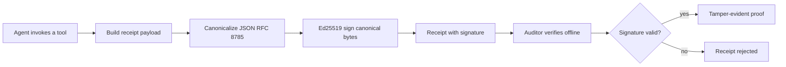
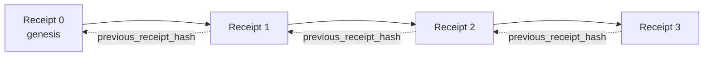

# Secure System Design for Agentic Platforms

An agent with tools is a new attack surface. These are the threats and the design choices that contain them.

**Course milestone:** Agentic System Design

## Building trustworthy agents

> **Source:** [Building trustworthy agents](https://github.com/microsoft/ai-agents-for-beginners/tree/HEAD/06-building-trustworthy-agents) · [AI Agents for Beginners](https://github.com/microsoft/ai-agents-for-beginners), MIT

This lesson will cover:

- How to build and deploy safe and effective AI Agents
- Important security considerations when developing AI Agents.
- How to maintain data and user privacy when developing AI Agents.

### Learning Goals

After completing this lesson, you will know how to:

- Identify and mitigate risks when creating AI Agents.
- Implement security measures to ensure that data and access are properly managed.
- Create AI Agents that maintain data privacy and provide a quality user experience.

### Safety

Let's first look at building safe agentic applications. Safety means that the AI agent performs as designed. As builders of agentic applications, we have methods and tools to maximize safety:

#### Building a System Message Framework

If you have ever built an AI application using Large Language Models (LLMs), you know the importance of designing a robust system prompt or system message. These prompts establish the meta rules, instructions, and guidelines for how the LLM will interact with the user and data.

For AI Agents, the system prompt is even more important as the AI Agents will need highly specific instructions to complete the tasks we have designed for them.

To create scalable system prompts, we can use a system message framework for building one or more agents in our application:


##### Step 1: Create a Meta System Message

The meta prompt will be used by an LLM to generate the system prompts for the agents we create. We design it as a template so that we can efficiently create multiple agents if needed.

Here is an example of a meta system message we would give to the LLM:

```plaintext
You are an expert at creating AI agent assistants.
You will be provided a company name, role, responsibilities and other
information that you will use to provide a system prompt for.
To create the system prompt, be descriptive as possible and provide a structure that a system using an LLM can better understand the role and responsibilities of the AI assistant.
```

##### Step 2: Create a basic prompt

The next step is to create a basic prompt to describe the AI Agent. You should include the role of the agent, the tasks the agent will complete, and any other responsibilities of the agent.

Here is an example:

```plaintext
You are a travel agent for Contoso Travel that is great at booking flights for customers. To help customers you can perform the following tasks: lookup available flights, book flights, ask for preferences in seating and times for flights, cancel any previously booked flights and alert customers on any delays or cancellations of flights.
```

##### Step 3: Provide Basic System Message to LLM

Now we can optimize this system message by providing the meta system message as the system message and our basic system message.

This will produce a system message that is better designed for guiding our AI agents:

```markdown
**Company Name:** Contoso Travel
**Role:** Travel Agent Assistant

**Objective:**
You are an AI-powered travel agent assistant for Contoso Travel, specializing in booking flights and providing exceptional customer service. Your main goal is to assist customers in finding, booking, and managing their flights, all while ensuring that their preferences and needs are met efficiently.

**Key Responsibilities:**

1. **Flight Lookup:**

    - Assist customers in searching for available flights based on their specified destination, dates, and any other relevant preferences.
    - Provide a list of options, including flight times, airlines, layovers, and pricing.
2. **Flight Booking:**

    - Facilitate the booking of flights for customers, ensuring that all details are correctly entered into the system.
    - Confirm bookings and provide customers with their itinerary, including confirmation numbers and any other pertinent information.
3. **Customer Preference Inquiry:**

    - Actively ask customers for their preferences regarding seating (e.g., aisle, window, extra legroom) and preferred times for flights (e.g., morning, afternoon, evening).
    - Record these preferences for future reference and tailor suggestions accordingly.
4. **Flight Cancellation:**

    - Assist customers in canceling previously booked flights if needed, following company policies and procedures.
    - Notify customers of any necessary refunds or additional steps that may be required for cancellations.
5. **Flight Monitoring:**

    - Monitor the status of booked flights and alert customers in real-time about any delays, cancellations, or changes to their flight schedule.
    - Provide updates through preferred communication channels (e.g., email, SMS) as needed.

**Tone and Style:**

- Maintain a friendly, professional, and approachable demeanor in all interactions with customers.
- Ensure that all communication is clear, informative, and tailored to the customer's specific needs and inquiries.

**User Interaction Instructions:**

- Respond to customer queries promptly and accurately.
- Use a conversational style while ensuring professionalism.
- Prioritize customer satisfaction by being attentive, empathetic, and proactive in all assistance provided.

**Additional Notes:**

- Stay updated on any changes to airline policies, travel restrictions, and other relevant information that could impact flight bookings and customer experience.
- Use clear and concise language to explain options and processes, avoiding jargon where possible for better customer understanding.

This AI assistant is designed to streamline the flight booking process for customers of Contoso Travel, ensuring that all their travel needs are met efficiently and effectively.

```

##### Step 4: Iterate and Improve

The value of this system message framework is to be able to scale creating system messages from multiple agents easier as well as improving your system messages over time. It is rare you will have a system message that works the first time for your complete use case. Being able to make small tweaks and improvements by changing the basic system message and running it through the system will allow you to compare and evaluate results.

### Understanding Threats

To build trustworthy AI agents, it is important to understand and mitigate the risks and threats to your AI agent. Let's look at only some of the different threats to AI agents and how you can better plan and prepare for them.


#### Task and Instruction

**Description:** Attackers attempt to change the instructions or goals of the AI agent through prompting or manipulating inputs.

**Mitigation**: Execute validation checks and input filters to detect potentially dangerous prompts before they are processed by the AI Agent. Since these attacks typically require frequent interaction with the Agent, limiting the number of turns in a conversation is another way to prevent these types of attacks.

#### Access to Critical Systems

**Description**: If an AI agent has access to systems and services that store sensitive data, attackers can compromise the communication between the agent and these services. These can be direct attacks or indirect attempts to gain information about these systems through the agent.

**Mitigation**: AI agents should have access to systems on a need-only basis to prevent these types of attacks. Communication between the agent and system should also be secure. Implementing authentication and access control is another way to protect this information.

#### Resource and Service Overloading

**Description:** AI agents can access different tools and services to complete tasks. Attackers can use this ability to attack these services by sending a high volume of requests through the AI Agent, which may result in system failures or high costs.

**Mitigation:** Implement policies to limit the number of requests an AI agent can make to a service. Limiting the number of conversation turns and requests to your AI agent is another way to prevent these types of attacks.

#### Knowledge Base Poisoning

**Description:** This type of attack does not target the AI agent directly but targets the knowledge base and other services that the AI agent will use. This could involve corrupting the data or information that the AI agent will use to complete a task, leading to biased or unintended responses to the user.

**Mitigation:** Perform regular verification of the data that the AI agent will be using in its workflows. Ensure that access to this data is secure and only changed by trusted individuals to avoid this type of attack.

#### Cascading Errors

**Description:** AI agents access various tools and services to complete tasks. Errors caused by attackers can lead to failures of other systems that the AI agent is connected to, causing the attack to become more widespread and harder to troubleshoot.

**Mitigation**: One method to avoid this is to have the AI Agent operate in a limited environment, such as performing tasks in a Docker container, to prevent direct system attacks. Creating fallback mechanisms and retry logic when certain systems respond with an error is another way to prevent larger system failures.

### Human-in-the-Loop

Another effective way to build trustworthy AI Agent systems is using a Human-in-the-loop. This creates a flow where users are able to provide feedback to the Agents during the run. Users essentially act as agents in a multi-agent system and by providing approval or termination of the running process.


Here is a code snippet using the Microsoft Agent Framework to show how this concept is implemented:

```python
import os
from agent_framework.foundry import FoundryChatClient
from azure.identity import AzureCliCredential

# Create the provider with human-in-the-loop approval
provider = FoundryChatClient(
    project_endpoint=os.environ["AZURE_AI_PROJECT_ENDPOINT"],
    model=os.environ["AZURE_AI_MODEL_DEPLOYMENT_NAME"],
    credential=AzureCliCredential(),
)

# Create the agent with a human approval step
response = provider.create_response(
    input="Write a 4-line poem about the ocean.",
    instructions="You are a helpful assistant. Ask for user approval before finalizing.",
)

# The user can review and approve the response
print(response.output_text)
user_input = input("Do you approve? (APPROVE/REJECT): ")
if user_input == "APPROVE":
    print("Response approved.")
else:
    print("Response rejected. Revising...")
```

### Conclusion

Building trustworthy AI agents requires careful design, robust security measures, and continuous iteration. By implementing structured meta prompting systems, understanding potential threats, and applying mitigation strategies, developers can create AI agents that are both safe and effective. Additionally, incorporating a human-in-the-loop approach ensures that AI agents remain aligned with user needs while minimizing risks. As AI continues to evolve, maintaining a proactive stance on security, privacy, and ethical considerations will be key to fostering trust and reliability in AI-driven systems.

## Securing AI agents

> **Source:** [Securing AI agents](https://github.com/microsoft/ai-agents-for-beginners/tree/HEAD/18-securing-ai-agents) · [AI Agents for Beginners](https://github.com/microsoft/ai-agents-for-beginners), MIT

[Watch the lesson video: Securing AI Agents with Cryptographic Receipts](https://youtu.be/PLACEHOLDER_VIDEO_ID)

> _(Lesson video and thumbnail to be added by the Microsoft content team post-merge, matching the lesson 14 / 15 pattern.)_

### Introduction

This lesson will cover:

- Why audit trails for AI agents matter for compliance, debugging, and trust.
- What a cryptographic receipt is and how it differs from an unsigned log line.
- How to produce a signed receipt for an agent's tool call in plain Python.
- How to verify a receipt offline and detect tampering.
- How to chain receipts so that removing or reordering one breaks the chain.
- What receipts prove and what they explicitly do not prove.

### Learning Goals

After completing this lesson, you will know how to:

- Identify the failure modes that motivate cryptographic provenance for agent actions.
- Produce an Ed25519-signed receipt over a canonical JSON payload.
- Verify a receipt independently using only the signer's public key.
- Detect tampering by re-running verification on a modified receipt.
- Build a hash-chained sequence of receipts and explain why the chain matters.
- Recognize the boundary between what receipts prove (attribution, integrity, ordering) and what they do not (correctness of the action, soundness of the policy).

### The Problem: Your Agent's Audit Trail

Imagine you have deployed an AI agent for Contoso Travel. The agent reads customer requests, calls a flights API to look up options, and books seats on the customer's behalf. Last quarter, the agent processed 50,000 bookings.

Today an auditor arrives. They ask a simple question: "Show me what your agent did."

You hand over your log files. The auditor looks at them and asks the harder question: "How do I know these logs were not edited?"

This is the audit-trail problem. Most agent deployments today rely on:

- **Application logs**: written by the agent itself, editable by anyone with file-system access.
- **Cloud logging services**: tamper-evident at the platform level but only if the auditor trusts the platform operator.
- **Database transaction logs**: well-suited for database changes but not for arbitrary tool calls.

None of these can answer the auditor's question without requiring the auditor to trust someone (you, your cloud provider, your database vendor). For internal use, that trust is often acceptable. For regulated workloads (finance, healthcare, anything subject to the EU AI Act), it is not.

Cryptographic receipts solve this by making each agent action independently verifiable. The auditor does not need to trust you. They need only your public key and the receipt itself.

### What is a Cryptographic Receipt?

A receipt is a JSON object that records what an agent did, signed with a digital signature.



A minimal receipt looks like this:

```json
{
  "type": "agent.tool_call.v1",
  "agent_id": "contoso-travel-bot",
  "tool_name": "lookup_flights",
  "tool_args_hash": "sha256:a3f9c1...",
  "result_hash": "sha256:7b2e1d...",
  "policy_id": "contoso-travel-policy-v3",
  "timestamp": "2026-04-25T14:30:00Z",
  "sequence": 47,
  "previous_receipt_hash": "sha256:9d4e6a...",
  "signature": {
    "alg": "EdDSA",
    "sig": "c5af83...",
    "public_key": "8f3b2c..."
  }
}
```

Three properties are doing the work:

1. **The signature**. The receipt is signed by the agent's gateway using an Ed25519 private key. Anyone with the corresponding public key can verify the signature offline. Tampering with any field invalidates the signature.

2. **Canonical encoding**. Before signing, the receipt is serialized using JSON Canonicalization Scheme (JCS, RFC 8785). This ensures that two implementations producing the same logical receipt produce byte-identical output. Without canonicalization, different JSON serializers would produce different signatures for the same content.

3. **Hash chaining**. The `previous_receipt_hash` field links each receipt to the one before it. Removing or reordering a receipt breaks every receipt that came after it. Tampering becomes visible at the chain level even if individual signatures are bypassed.

Together these properties provide three guarantees:

- **Attribution**: this key signed this content.
- **Integrity**: the content has not changed since signing.
- **Ordering**: this receipt came after that receipt in the chain.

### Producing a Receipt in Python

You do not need a special library to produce a receipt. The cryptographic primitives are widely available and the logic is a few dozen lines of Python.

The hands-on exercises in `code_samples/18-signed-receipts.ipynb` walk through the full flow. The summary version:

```python
import json
import hashlib
import base64
from nacl import signing
from jcs import canonicalize  # RFC 8785 canonical JSON

def b64url_nopad(data: bytes) -> str:
    return base64.urlsafe_b64encode(data).decode("ascii").rstrip("=")

def sha256_canonical(obj) -> str:
    """SHA-256 of a Python object's JCS-canonical JSON form."""
    return f"sha256:{hashlib.sha256(canonicalize(obj)).hexdigest()}"

# Generate or load a signing key (in production, store in a key vault)
signing_key = signing.SigningKey.generate()
verify_key = signing_key.verify_key

# Build the receipt payload (no signature yet)
tool_args = {"origin": "SYD", "destination": "LAX"}
tool_result = [{"flight": "QF11", "price": 1850, "stops": 0}]

payload = {
    "type": "agent.tool_call.v1",
    "agent_id": "contoso-travel-bot",
    "tool_name": "lookup_flights",
    "tool_args_hash": sha256_canonical(tool_args),
    "result_hash": sha256_canonical(tool_result),
    "policy_id": "contoso-travel-policy-v3",
    "timestamp": "2026-04-25T14:30:00Z",
    "sequence": 0,
    "previous_receipt_hash": None,
}

# Canonicalize and sign the JCS bytes directly. PureEdDSA hashes internally.
canonical_bytes = canonicalize(payload)
signature_bytes = signing_key.sign(canonical_bytes).signature

# Attach a structured signature object.
receipt = {
    **payload,
    "signature": {
        "alg": "EdDSA",
        "sig": b64url_nopad(signature_bytes),
        "public_key": b64url_nopad(bytes(verify_key)),
    },
}
```

That is the entire signing pipeline. The exercises in the notebook walk through each step.

### Verifying a Receipt and Detecting Tampering

Verification is the inverse operation:

```python
import base64
import hashlib
from nacl import signing
from nacl.exceptions import BadSignatureError
from jcs import canonicalize

def b64url_decode(s: str) -> bytes:
    padding = "=" * ((4 - len(s) % 4) % 4)
    return base64.urlsafe_b64decode(s + padding)

def verify_receipt(receipt: dict) -> bool:
    # The signature is a structured object: {"alg", "sig", "public_key"}.
    sig_obj = receipt.get("signature")
    if not sig_obj or sig_obj.get("alg") != "EdDSA":
        return False

    # Reconstruct the payload that was actually signed (everything except signature).
    payload = {k: v for k, v in receipt.items() if k != "signature"}

    canonical_bytes = canonicalize(payload)

    try:
        verify_key = signing.VerifyKey(b64url_decode(sig_obj["public_key"]))
        verify_key.verify(canonical_bytes, b64url_decode(sig_obj["sig"]))
        return True
    except BadSignatureError:
        return False
```

This function takes a receipt and returns `True` if the signature is valid, `False` otherwise. No network call, no service dependency, no trust required in any third party.

To see tampering detection in action, the notebook walks through:

1. Producing a valid receipt and confirming it verifies.
2. Modifying one byte of the `tool_args_hash` field.
3. Re-running verification and seeing it fail.

This is the practical demonstration that receipts are tamper-evident: any modification, however small, breaks the signature.

### Chaining Receipts for Multi-Step Agents

A single signed receipt protects one action. A chain of receipts protects a sequence.



Each receipt records the hash of the receipt before it. To remove receipt 2 silently, an attacker would need to either:

- Modify receipt 3's `previous_receipt_hash` field (breaks receipt 3's signature), OR
- Forge a new signature on a modified receipt 3 (requires the agent's private key).

If the private key is in a hardware key vault and you publish the public key with each receipt, neither attack is feasible without detection.

The notebook walks through:

1. Building a chain of three receipts.
2. Verifying that each receipt's `previous_receipt_hash` matches the actual hash of the prior receipt.
3. Tampering with one receipt in the middle and seeing the chain break at exactly that point.

This is how you produce an audit trail an external auditor can verify without trusting you.

### What Receipts Prove (and What They Do Not)

This is the most important section of this lesson. Receipts are powerful but their power is bounded.

**Receipts prove three things:**

1. **Attribution**: a specific key signed a specific payload.
2. **Integrity**: the payload has not changed since signing.
3. **Ordering**: this receipt came after that receipt in the hash chain.

**Receipts do NOT prove:**

1. **Correctness**: that the agent's action was the right action. A receipt can be signed for a wrong answer just as cleanly as for a right answer.
2. **Policy compliance**: that the policy referenced in `policy_id` was actually evaluated, or that it would have permitted this action if checked. The receipt records what was claimed, not what was enforced.
3. **Identity beyond the key**: the receipt says "this key signed this content." It does not say "this human authorized this." Connecting a key to a person or organization requires separate identity infrastructure (a directory, a public key registry, etc.).
4. **Truthfulness of inputs**: if the agent receives a manipulated prompt and acts on it, the receipt records the action faithfully. Receipts are downstream of input validation, not a substitute for it.

This boundary matters for two reasons:

- It tells you what receipts are useful for: making agent behavior auditable and tamper-evident, even across organizational boundaries.
- It tells you what additional layers you still need: input validation (Lesson 6), policy enforcement (covered briefly below), and identity infrastructure (out of scope for this lesson).

A common mistake is to assume that "we have receipts" means "we are governed." It does not. Receipts are a foundation. Governance is the system you build on top.

### Proving a Human Approved the Exact Action

Item 3 above is worth its own section: an action receipt says "this key signed this content," never "a human authorized this." For high-risk actions (refunds, deletions, wire transfers), governance frameworks increasingly require exactly that missing statement, and it is producible with the same primitives you already built in this lesson.

The follow-on notebook `code_samples/human-authorization-receipts.ipynb` adds a second receipt kind, `human.approval.v1`, in the same envelope shape as the lesson's receipts (a typed payload signed by Ed25519 over its canonical JCS bytes, with the `signature` object outside the signed bytes). A named approver signs the **full canonical action and its digest** before execution; the agent's action receipt carries the **same action digest** and a `parent_approval_ref`, the `receipt_hash` of the approval, the same convention as `previous_receipt_hash` in the chain you built above. One `verify_chain` walks both artifacts under **separate pinned key registries** (approver keys vs agent keys), so the code path is shared but the authorities never are.

The property this buys, stated carefully: *the human approved this exact action, and the agent executed exactly that approved action.* The notebook's refusal fixtures are what make the property real rather than asserted:

- the classic set: tampering, confused deputy, replay, forged keys on either side, malformed input;
- **stale authority**: a signature that still verifies, refused anyway because the policy version moved, the approver key was rotated out of the pinned registry, or the approval expired before execution;
- **digest substitution**: a validly signed action receipt pointing at a *real* approval that binds a *different* canonical action.

Each failure refuses with a distinct reason, so an auditor reading a refusal can tell whether authority went stale or the executed action changed. The rule the notebook teaches: a signed approval is not authority by itself. Authority exists only if both receipts still bind to the same canonical action at execution time. The human-approval receipt is an educational composition defined by this lesson, not a receipt type defined by `draft-farley-acta-signed-receipts`.

### Production References

The Python code in this lesson is intentionally minimal so you can read every line and understand exactly what is happening. In production, you have two options:

1. **Build directly on the cryptographic primitives.** The 50 lines you saw above are sufficient for many use cases. PyNaCl (Ed25519) and the `jcs` package (canonical JSON) are well-maintained and audited libraries.

2. **Use a production receipt library.** Several open-source projects implement the same pattern with additional features (key rotation, batch verification, JWK Set distribution, integration with policy engines):
   - The signing pipeline uses the JCS and signature-scope conventions in an independent IETF Internet-Draft ([`draft-farley-acta-signed-receipts`](https://datatracker.ietf.org/doc/draft-farley-acta-signed-receipts/), revision 02). This lesson's flat educational receipt differs from the draft's `{payload, signature}` envelope and is not presented as a conformant implementation. The draft publishes a shared conformance suite ([agent-governance-testvectors](https://github.com/ScopeBlind/agent-governance-testvectors)) for implementations targeting its wire format.
   - The Microsoft Agent Governance Toolkit composes receipts with Cedar-based policy decisions; see Tutorial 33 in that repository for an end-to-end example.
   - The `protect-mcp` (npm) and `@veritasacta/verify` (npm) packages provide a Node-based implementation of receipt signing and offline verification, intended for wrapping any MCP server with a tamper-evident audit trail, including a held-for-co-sign flow in which a paused action emits an approval receipt bound to the action digest (WebAuthn-backed in the desktop flow), the same approval-receipt pattern as the human-authorization notebook above.
   - The **[nobulex](https://github.com/arian-gogani/nobulex)** Python SDK (`pip install nobulex`) provides the same Ed25519 + JCS signing pattern in Python with LangChain and CrewAI integrations, including published cross-validation test vectors and a compliance mapping contributed via [OWASP PR #2210](https://github.com/OWASP/CheatSheetSeries/pull/2210).

The decision between rolling your own and using a library mirrors the decision between writing your own JWT library and using a tested one: both are reasonable; the library saves time and reduces audit surface; the from-scratch approach forces you to understand every primitive. This lesson teaches the from-scratch path so you have the foundation for either choice.

### Knowledge Check

Test your understanding before moving to the practice exercise.

**1. A receipt is signed with the agent's private Ed25519 key. The auditor has only the public key. Can the auditor verify the receipt offline?**

<details>
<summary>Answer</summary>

Yes. Ed25519 verification requires only the public key and the signed bytes. No network call, no service dependency. This is the property that makes receipts useful in air-gapped, multi-organization, or low-trust audit settings.
</details>

**2. An attacker modifies the `policy_id` field of a receipt to claim it was governed by a more permissive policy. The signature was over the original payload. What happens during verification?**

<details>
<summary>Answer</summary>

Verification fails. The signature was computed over the canonical bytes of the original payload; modifying any field changes those bytes, which makes the signature invalid. The attacker would need the private key to produce a fresh valid signature, which they do not have.
</details>

**3. Why does the receipt include a `tool_args_hash` and `result_hash` rather than the raw arguments and result?**

<details>
<summary>Answer</summary>

Two reasons. First, the receipt may need to be archived or transmitted in environments where leaking the raw content (PII, business data) is a problem. Hashing keeps the receipt small and the content private; the auditor verifies that the hash matches a separately-stored copy of the actual content. Second, hashes have a fixed size; a receipt with hashes is bounded in size regardless of how large the inputs and outputs were.
</details>

**4. The `previous_receipt_hash` field links each receipt to its predecessor. If an attacker silently deletes one receipt from the middle of a chain, what becomes invalid?**

<details>
<summary>Answer</summary>

Every receipt that came after the deleted one. Their `previous_receipt_hash` fields no longer match the actual chain (because the receipt they referenced no longer exists, or the chain now points to a different predecessor). To hide the deletion, the attacker would have to re-sign every later receipt, which requires the private key.
</details>

**5. A receipt verifies cleanly. Does that prove the agent's action was correct, sound, or compliant with policy?**

<details>
<summary>Answer</summary>

No. A valid receipt proves three things: attribution (this key signed this content), integrity (the content has not changed), and ordering (this receipt came after that receipt). It does NOT prove that the action was correct, that the policy named in `policy_id` was actually evaluated, or that the agent followed every rule. Receipts make agent behavior auditable, not necessarily correct. This is the most important boundary in the lesson.
</details>

### Practice Exercise

Open `code_samples/18-signed-receipts.ipynb` and complete all four sections:

1. **Section 1**: Sign your first receipt and verify it.
2. **Section 2**: Tamper with the receipt and observe verification fail.
3. **Section 3**: Build a three-receipt chain and verify the chain integrity.
4. **Section 4**: Apply the pattern to an agent built with the Microsoft Agent Framework: wrap a tool call in receipt-signing, then verify the receipt independently.

**Stretch challenge 1:** extend the receipt schema with an additional field of your own choosing (for example, a request ID for tracing), update the canonical signing logic to include it, and confirm that the receipt still round-trips through verification. Then modify the field after signing and confirm verification fails. This forces you to understand how every byte of the canonical encoding contributes to the signature.

**Stretch challenge 2:** SHA-256-hash two of your receipts together (concatenate their canonical bytes in a deterministic order) and embed the resulting digest as a new field on a third receipt before signing it. Verify that all three receipts still round-trip. You have just built a one-step inclusion proof: anyone holding the third receipt can prove the first two existed at the time it was signed, without needing to reveal their contents. This is the pattern that selective-disclosure receipts use at scale (Merkle commitments, RFC 6962).

### Conclusion

Cryptographic receipts give AI agents an audit trail that is:

- **Independently verifiable**: any party with the public key can verify, no service dependency.
- **Tamper-evident**: any modification invalidates the signature.
- **Portable**: a receipt is a small JSON file; it can be archived, transmitted, and verified anywhere.
- **Standards-aligned**: built on Ed25519 (RFC 8032), JCS (RFC 8785), and SHA-256, all widely deployed primitives.

They are not a substitute for input validation, policy enforcement, or identity infrastructure. They are a foundation for those layers. When you are deploying agents into regulated workloads, multi-organization workflows, or any setting where a future auditor cannot be assumed to trust you, receipts are how you make the audit trail honest.

The most important takeaway: receipts prove who said what, when. They do not prove that what was said was true or right. Hold that distinction tightly. It is the difference between an honest provenance system and a misleading one.

### Production Checklist

When you are ready to graduate from this lesson to deploying receipt-signed agents in a real environment:

- [ ] **Move the signing key off the developer laptop.** Use Azure Key Vault, AWS KMS, or a hardware security module. The private key signing your receipts must never live in source control or in plaintext on application machines.
- [ ] **Publish the verification public key.** Auditors need it to verify offline. The standard pattern is a JWK Set at a well-known URL (RFC 7517), e.g., `https://your-org.example.com/.well-known/agent-keys.json`.
- [ ] **Anchor the chain externally.** Periodically write the latest chain head hash to a transparency log (Sigstore Rekor, RFC 3161 timestamp authority, or a second internal system) so an external party can confirm "this chain existed at this time."
- [ ] **Store receipts immutably.** Append-only blob storage (Azure Storage with immutability policies, AWS S3 Object Lock) prevents an insider from rewriting history at the storage layer.
- [ ] **Decide on retention.** Many compliance regimes require multi-year retention. Plan for receipt growth (each receipt is ~500 bytes; an agent making 10K calls per day produces ~1.8 GB per year).
- [ ] **Document what receipts do not cover.** Receipts prove attribution, integrity, and ordering. Your runbook should explicitly list what additional controls (input validation, policy enforcement, rate limiting, identity infrastructure) sit alongside receipts in your governance posture.

### Beyond This Lesson

This lesson covers single-receipt signing and hash-chained sequences. The same primitives compose into several more advanced patterns you may encounter as your governance posture matures:

- **Selective disclosure.** When a receipt's fields are independently committed (RFC 6962-style Merkle tree), you can reveal specific fields to specific auditors and prove the rest are unchanged without exposing them. Useful when the same receipt has to satisfy both a comprehensive audit (which wants completeness) and data-minimization regulations like GDPR (which want the auditor to see as little as necessary).
- **Receipt revocation.** If a signing key is compromised, you need a way to mark all receipts signed by that key as untrusted from a point in time forward. Standard patterns: short-lived signing keys plus a published revocation list, or a transparency log with revocation entries.
- **Bilateral / split-signature receipts.** Some implementations split the signed payload into pre-execution (`authorization_*`) and post-execution (`result_*`) halves with independent signatures, useful when the authorization decision and the observed result are produced by different actors or at different times. This composes additively on top of the receipt format taught in this lesson.
- **Payload composition.** A receipt seals whatever bytes you put in `result_hash`. Real-world payloads are often richer than a single tool call result: pre-decision reasoning (model prediction, options considered, evidence and its completeness, risk posture, accountability chain, gate outcome) can all live inside the payload, sealed by a single receipt. This keeps the receipt format minimal while letting payload schemas evolve domain-by-domain.
- **Cross-implementation conformance.** Multiple independent implementations of the same receipt format (Python, TypeScript, Rust, Go) cross-verify against shared test vectors. If you build your own implementation, validating against published vectors confirms wire compatibility.
- **Post-quantum migration.** Ed25519 is widely deployed today but is not quantum-resistant. The receipt format is algorithm-agile: the `signature.alg` field can carry `ML-DSA-65` (the NIST post-quantum signature standard) when you need to migrate. Plan for a transition period where receipts are dual-signed.

## LLM01: Prompt injection

> **Source:** [LLM01: Prompt injection](https://github.com/OWASP/www-project-top-10-for-large-language-model-applications/blob/HEAD/2_0_vulns/LLM01_PromptInjection.md) · [OWASP Top 10 for LLM Applications](https://github.com/OWASP/www-project-top-10-for-large-language-model-applications), CC BY-SA 4.0

### Description

A Prompt Injection Vulnerability occurs when user prompts alter the LLM’s behavior or output in unintended ways. These inputs can affect the model even if they are imperceptible to humans, therefore prompt injections do not need to be human-visible/readable, as long as the content is parsed by the model.

Prompt Injection vulnerabilities exist in how models process prompts, and how input may force the model to incorrectly pass prompt data to other parts of the model, potentially causing them to violate guidelines, generate harmful content, enable unauthorized access, or influence critical decisions. While techniques like Retrieval Augmented Generation (RAG) and fine-tuning aim to make LLM outputs more relevant and accurate, research shows that they do not fully mitigate prompt injection vulnerabilities.

While prompt injection and jailbreaking are related concepts in LLM security, they are often used interchangeably. Prompt injection involves manipulating model responses through specific inputs to alter its behavior, which can include bypassing safety measures. Jailbreaking is a form of prompt injection where the attacker provides inputs that cause the model to disregard its safety protocols entirely. Developers can build safeguards into system prompts and input handling to help mitigate prompt injection attacks, but effective prevention of jailbreaking requires ongoing updates to the model's training and safety mechanisms.

### Types of Prompt Injection Vulnerabilities

#### Direct Prompt Injections

  Direct prompt injections occur when a user's prompt input directly alters the behavior of the model in unintended or unexpected ways. The input can be either intentional (i.e., a malicious actor deliberately crafting a prompt to exploit the model) or unintentional (i.e., a user inadvertently providing input that triggers unexpected behavior).

#### Indirect Prompt Injections

  Indirect prompt injections occur when an LLM accepts input from external sources, such as websites or files. The external source may have content data that when interpreted by the model, alters the behavior of the model in unintended or unexpected ways. Like direct injections, indirect injections can be either intentional or unintentional.

The severity and nature of the impact of a successful prompt injection attack can vary greatly and are largely dependent on both the business context the model operates in, and the agency with which the model is architected. Generally, however, prompt injection can lead to unintended outcomes, including but not limited to:

- Disclosure of sensitive information
- Revealing sensitive information about AI system infrastructure or system prompts
- Content manipulation leading to incorrect or biased outputs
- Providing unauthorized access to functions available to the LLM
- Executing arbitrary commands in connected systems
- Manipulating critical decision-making processes

The rise of multimodal AI, which processes multiple data types simultaneously, introduces unique prompt injection risks. Malicious actors could exploit interactions between modalities, such as hiding instructions in images that accompany benign text. The complexity of these systems expands the attack surface. Multimodal models may also be susceptible to novel cross-modal attacks that are difficult to detect and mitigate with current techniques. Robust multimodal-specific defenses are an important area for further research and development.

### Prevention and Mitigation Strategies

Prompt injection vulnerabilities are possible due to the nature of generative AI. Given the stochastic influence at the heart of the way models work, it is unclear if there are fool-proof methods of prevention for prompt injection. However, the following measures can mitigate the impact of prompt injections:

#### 1. Constrain model behavior

  Provide specific instructions about the model's role, capabilities, and limitations within the system prompt. Enforce strict context adherence, limit responses to specific tasks or topics, and instruct the model to ignore attempts to modify core instructions.

#### 2. Define and validate expected output formats

  Specify clear output formats, request detailed reasoning and source citations, and use deterministic code to validate adherence to these formats.

#### 3. Implement input and output filtering

  Define sensitive categories and construct rules for identifying and handling such content. Apply semantic filters and use string-checking to scan for non-allowed content. Evaluate responses using the RAG Triad: Assess context relevance, groundedness, and question/answer relevance to identify potentially malicious outputs.

#### 4. Enforce privilege control and least privilege access

  Provide the application with its own API tokens for extensible functionality, and handle these functions in code rather than providing them to the model. Restrict the model's access privileges to the minimum necessary for its intended operations.

#### 5. Require human approval for high-risk actions

  Implement human-in-the-loop controls for privileged operations to prevent unauthorized actions.

#### 6. Segregate and identify external content

  Separate and clearly denote untrusted content to limit its influence on user prompts.

#### 7. Conduct adversarial testing and attack simulations

  Perform regular penetration testing and breach simulations, treating the model as an untrusted user to test the effectiveness of trust boundaries and access controls.

### Example Attack Scenarios

#### Scenario #1: Direct Injection

  An attacker injects a prompt into a customer support chatbot, instructing it to ignore previous guidelines, query private data stores, and send emails, leading to unauthorized access and privilege escalation.

#### Scenario #2: Indirect Injection

  A user employs an LLM to summarize a webpage containing hidden instructions that cause the LLM to insert an image linking to a URL, leading to exfiltration of the private conversation.

#### Scenario #3: Unintentional Injection

  A company includes an instruction in a job description to identify AI-generated applications. An applicant, unaware of this instruction, uses an LLM to optimize their resume, inadvertently triggering the AI detection.

#### Scenario #4: Intentional Model Influence

  An attacker modifies a document in a repository used by a Retrieval-Augmented Generation (RAG) application. When a user's query returns the modified content, the malicious instructions alter the LLM's output, generating misleading results.

#### Scenario #5: Code Injection

  An attacker exploits a vulnerability (CVE-2024-5184) in an LLM-powered email assistant to inject malicious prompts, allowing access to sensitive information and manipulation of email content.

#### Scenario #6: Payload Splitting

  An attacker uploads a resume with split malicious prompts. When an LLM is used to evaluate the candidate, the combined prompts manipulate the model's response, resulting in a positive recommendation despite the actual resume contents.

#### Scenario #7: Multimodal Injection

  An attacker embeds a malicious prompt within an image that accompanies benign text. When a multimodal AI processes the image and text concurrently, the hidden prompt alters the model's behavior, potentially leading to unauthorized actions or disclosure of sensitive information.

#### Scenario #8: Adversarial Suffix

  An attacker appends a seemingly meaningless string of characters to a prompt, which influences the LLM's output in a malicious way, bypassing safety measures.

#### Scenario #9: Multilingual/Obfuscated Attack

  An attacker uses multiple languages or encodes malicious instructions (e.g., using Base64 or emojis) to evade filters and manipulate the LLM's behavior.

### Reference Links

1. [ChatGPT Plugin Vulnerabilities - Chat with Code](https://embracethered.com/blog/posts/2023/chatgpt-plugin-vulns-chat-with-code/) **Embrace the Red**
2. [ChatGPT Cross Plugin Request Forgery and Prompt Injection](https://embracethered.com/blog/posts/2023/chatgpt-cross-plugin-request-forgery-and-prompt-injection./) **Embrace the Red**
3. [Not what you’ve signed up for: Compromising Real-World LLM-Integrated Applications with Indirect Prompt Injection](https://arxiv.org/pdf/2302.12173.pdf) **Arxiv**
4. [Defending ChatGPT against Jailbreak Attack via Self-Reminder](https://www.researchsquare.com/article/rs-2873090/v1) **Research Square**
5. [Prompt Injection attack against LLM-integrated Applications](https://arxiv.org/abs/2306.05499) **Cornell University**
6. [Inject My PDF: Prompt Injection for your Resume](https://kai-greshake.de/posts/inject-my-pdf) **Kai Greshake**
7. [Not what you’ve signed up for: Compromising Real-World LLM-Integrated Applications with Indirect Prompt Injection](https://arxiv.org/pdf/2302.12173.pdf) **Cornell University**
8. [Threat Modeling LLM Applications](https://aivillage.org/large%20language%20models/threat-modeling-llm/) **AI Village**
9. [Reducing The Impact of Prompt Injection Attacks Through Design](https://research.kudelskisecurity.com/2023/05/25/reducing-the-impact-of-prompt-injection-attacks-through-design/) **Kudelski Security**
10. [Adversarial Machine Learning: A Taxonomy and Terminology of Attacks and Mitigations (nist.gov)](https://nvlpubs.nist.gov/nistpubs/ai/NIST.AI.100-2e2023.pdf)
11. [2407.07403 A Survey of Attacks on Large Vision-Language Models: Resources, Advances, and Future Trends (arxiv.org)](https://arxiv.org/abs/2407.07403)
12. [Exploiting Programmatic Behavior of LLMs: Dual-Use Through Standard Security Attacks](https://ieeexplore.ieee.org/document/10579515)
13. [Universal and Transferable Adversarial Attacks on Aligned Language Models (arxiv.org)](https://arxiv.org/abs/2307.15043)
14. [From ChatGPT to ThreatGPT: Impact of Generative AI in Cybersecurity and Privacy (arxiv.org)](https://arxiv.org/abs/2307.00691)

### Related Frameworks and Taxonomies

Refer to this section for comprehensive information, scenarios strategies relating to infrastructure deployment, applied environment controls and other best practices.

- [AML.T0051.000 - LLM Prompt Injection: Direct](https://atlas.mitre.org/techniques/AML.T0051.000) **MITRE ATLAS**
- [AML.T0051.001 - LLM Prompt Injection: Indirect](https://atlas.mitre.org/techniques/AML.T0051.001) **MITRE ATLAS**
- [AML.T0054 - LLM Jailbreak Injection: Direct](https://atlas.mitre.org/techniques/AML.T0054) **MITRE ATLAS**

## LLM02: Sensitive information disclosure

> **Source:** [LLM02: Sensitive information disclosure](https://github.com/OWASP/www-project-top-10-for-large-language-model-applications/blob/HEAD/2_0_vulns/LLM02_SensitiveInformationDisclosure.md) · [OWASP Top 10 for LLM Applications](https://github.com/OWASP/www-project-top-10-for-large-language-model-applications), CC BY-SA 4.0

### Description

Sensitive information can affect both the LLM and its application context. This includes personal identifiable information (PII), financial details, health records, confidential business data, security credentials, and legal documents. Proprietary models may also have unique training methods and source code considered sensitive, especially in closed or foundation models.

LLMs, especially when embedded in applications, risk exposing sensitive data, proprietary algorithms, or confidential details through their output. This can result in unauthorized data access, privacy violations, and intellectual property breaches. Consumers should be aware of how to interact safely with LLMs. They need to understand the risks of unintentionally providing sensitive data, which may later be disclosed in the model's output.

To reduce this risk, LLM applications should perform adequate data sanitization to prevent user data from entering the training model. Application owners should also provide clear Terms of Use policies, allowing users to opt out of having their data included in the training model. Adding restrictions within the system prompt about data types that the LLM should return can provide mitigation against sensitive information disclosure. However, such restrictions may not always be honored and could be bypassed via prompt injection or other methods.

### Common Examples of Vulnerability

#### 1. PII Leakage

Personal identifiable information (PII) may be disclosed during interactions with the LLM.

#### 2. Proprietary Algorithm Exposure

Poorly configured model outputs can reveal proprietary algorithms or data. Revealing training data can expose models to inversion attacks, where attackers extract sensitive information or reconstruct inputs. For instance, as demonstrated in the 'Proof Pudding' attack (CVE-2019-20634), disclosed training data facilitated model extraction and inversion, allowing attackers to circumvent security controls in machine learning algorithms and bypass email filters.

#### 3. Sensitive Business Data Disclosure

Generated responses might inadvertently include confidential business information.

### Prevention and Mitigation Strategies
#### Sanitization

##### 1. Integrate Data Sanitization Techniques

Implement data sanitization to prevent user data from entering the training model. This includes scrubbing or masking sensitive content before it is used in training.

##### 2. Robust Input Validation

Apply strict input validation methods to detect and filter out potentially harmful or sensitive data inputs, ensuring they do not compromise the model.

#### Access Controls

##### 1. Enforce Strict Access Controls

Limit access to sensitive data based on the principle of least privilege. Only grant access to data that is necessary for the specific user or process.

##### 2. Restrict Data Sources

Limit model access to external data sources, and ensure runtime data orchestration is securely managed to avoid unintended data leakage.

#### Federated Learning and Privacy Techniques

##### 1. Utilize Federated Learning

Train models using decentralized data stored across multiple servers or devices. This approach minimizes the need for centralized data collection and reduces exposure risks.

##### 2. Incorporate Differential Privacy

Apply techniques that add noise to the data or outputs, making it difficult for attackers to reverse-engineer individual data points.

#### User Education and Transparency

##### 1. Educate Users on Safe LLM Usage

Provide guidance on avoiding the input of sensitive information. Offer training on best practices for interacting with LLMs securely.

##### 2. Ensure Transparency in Data Usage

Maintain clear policies about data retention, usage, and deletion. Allow users to opt out of having their data included in training processes.

#### Secure System Configuration

##### 1. Conceal System Preamble

Limit the ability for users to override or access the system's initial settings, reducing the risk of exposure to internal configurations.

##### 2. Reference Security Misconfiguration Best Practices

Follow guidelines like "OWASP API8:2023 Security Misconfiguration" to prevent leaking sensitive information through error messages or configuration details. (Ref. link: [OWASP API8:2023 Security Misconfiguration](https://owasp.org/API-Security/editions/2023/en/0xa8-security-misconfiguration/)).

#### Advanced Techniques

##### 1. Homomorphic Encryption

Use homomorphic encryption to enable secure data analysis and privacy-preserving machine learning. This ensures data remains confidential while being processed by the model.

##### 2. Tokenization and Redaction

Implement tokenization to preprocess and sanitize sensitive information. Techniques like pattern matching can detect and redact confidential content before processing.

### Example Attack Scenarios

#### Scenario 1: Unintentional Data Exposure

A user receives a response containing another user's personal data due to inadequate data sanitization.

#### Scenario 2: Targeted Prompt Injection

An attacker bypasses input filters to extract sensitive information.

#### Scenario 3: Data Leak via Training Data

Negligent data inclusion in training leads to sensitive information disclosure.

#### Reference Links

- *Cybernews*: [Lessons learned from ChatGPT’s Samsung leak](https://cybernews.com/security/chatgpt-samsung-leak-explained-lessons/)
- *Fox Business*: [AI data leak crisis: New tool prevents company secrets from being fed to ChatGPT](https://www.foxbusiness.com/politics/ai-data-leak-crisis-prevent-company-secrets-chatgpt)
- *Wired*: [ChatGPT Spit Out Sensitive Data When Told to Repeat ‘Poem’ Forever](https://www.wired.com/story/chatgpt-poem-forever-security-roundup/)
- *Neptune Blog*: [sing Differential Privacy to Build Secure Models](https://neptune.ai/blog/using-differential-privacy-to-build-secure-models-tools-methods-best-practices)
- *AVID 2023-009*: [Proof Pudding (CVE-2019-20634)](https://avidml.org/database/avid-2023-v009/)
- *Will Pearce \(Moo_hax\) & Nick Landers \(Monoxgas\)*: [Proof Pudding research](https://github.com/moohax/Proof-Pudding)

#### Related Frameworks and Taxonomies

Refer to this section for comprehensive information, scenarios strategies relating to infrastructure deployment, applied environment controls and other best practices.

- *MITRE ATLAS*: [AML.T0024.000 - Infer Training Data Membership](https://atlas.mitre.org/techniques/AML.T0024.000)
- *MITRE ATLAS*: [AML.T0024.001 - Invert ML Model](https://atlas.mitre.org/techniques/AML.T0024.001)
- *MITRE ATLAS*: [AML.T0024.002 - Extract ML Model](https://atlas.mitre.org/techniques/AML.T0024.002)

## LLM05: Improper output handling

> **Source:** [LLM05: Improper output handling](https://github.com/OWASP/www-project-top-10-for-large-language-model-applications/blob/HEAD/2_0_vulns/LLM05_ImproperOutputHandling.md) · [OWASP Top 10 for LLM Applications](https://github.com/OWASP/www-project-top-10-for-large-language-model-applications), CC BY-SA 4.0

### Description

Improper Output Handling refers specifically to insufficient validation, sanitization, and handling of the outputs generated by large language models before they are passed downstream to other components and systems. Since LLM-generated content can be controlled by prompt input, this behavior is similar to providing users indirect access to additional functionality.
Improper Output Handling differs from Overreliance in that it deals with LLM-generated outputs before they are passed downstream whereas Overreliance focuses on broader concerns around overdependence on the accuracy and appropriateness of LLM outputs.
Successful exploitation of an Improper Output Handling vulnerability can result in XSS and CSRF in web browsers as well as SSRF, privilege escalation, or remote code execution on backend systems.
The following conditions can increase the impact of this vulnerability:

- The application grants the LLM privileges beyond what is intended for end users, enabling escalation of privileges or remote code execution.
- The application is vulnerable to indirect prompt injection attacks, which could allow an attacker to gain privileged access to a target user's environment.
- 3rd party extensions do not adequately validate inputs.
- Lack of proper output encoding for different contexts (e.g., HTML, JavaScript, SQL)
- Insufficient monitoring and logging of LLM outputs
- Absence of rate limiting or anomaly detection for LLM usage

### Common Examples of Vulnerability

1. LLM output is entered directly into a system shell or similar function such as exec or eval, resulting in remote code execution.
2. JavaScript or Markdown is generated by the LLM and returned to a user. The code is then interpreted by the browser, resulting in XSS.
3. LLM-generated SQL queries are executed without proper parameterization, leading to SQL injection.
4. LLM output is used to construct file paths without proper sanitization, potentially resulting in path traversal vulnerabilities.
5. LLM-generated content is used in email templates without proper escaping, potentially leading to phishing attacks.

### Prevention and Mitigation Strategies

1. Treat the model as any other user, adopting a zero-trust approach, and apply proper input validation on responses coming from the model to backend functions.
2. Follow the OWASP ASVS (Application Security Verification Standard) guidelines to ensure effective input validation and sanitization.
3. Encode model output back to users to mitigate undesired code execution by JavaScript or Markdown. OWASP ASVS provides detailed guidance on output encoding.
4. Implement context-aware output encoding based on where the LLM output will be used (e.g., HTML encoding for web content, SQL escaping for database queries).
5. Use parameterized queries or prepared statements for all database operations involving LLM output.
6. Employ strict Content Security Policies (CSP) to mitigate the risk of XSS attacks from LLM-generated content.
7. Implement robust logging and monitoring systems to detect unusual patterns in LLM outputs that might indicate exploitation attempts.

### Example Attack Scenarios

#### Scenario #1

  An application utilizes an LLM extension to generate responses for a chatbot feature. The extension also offers a number of administrative functions accessible to another privileged LLM. The general purpose LLM directly passes its response, without proper output validation, to the extension causing the extension to shut down for maintenance.

#### Scenario #2

  A user utilizes a website summarizer tool powered by an LLM to generate a concise summary of an article. The website includes a prompt injection instructing the LLM to capture sensitive content from either the website or from the user's conversation. From there the LLM can encode the sensitive data and send it, without any output validation or filtering, to an attacker-controlled server.

#### Scenario #3

  An LLM allows users to craft SQL queries for a backend database through a chat-like feature. A user requests a query to delete all database tables. If the crafted query from the LLM is not scrutinized, then all database tables will be deleted.

#### Scenario #4

  A web app uses an LLM to generate content from user text prompts without output sanitization. An attacker could submit a crafted prompt causing the LLM to return an unsanitized JavaScript payload, leading to XSS when rendered on a victim's browser. Insufficient validation of prompts enabled this attack.

#### Scenario #5

  An LLM is used to generate dynamic email templates for a marketing campaign. An attacker manipulates the LLM to include malicious JavaScript within the email content. If the application doesn't properly sanitize the LLM output, this could lead to XSS attacks on recipients who view the email in vulnerable email clients.

#### Scenario #6

  An LLM is used to generate code from natural language inputs in a software company, aiming to streamline development tasks. While efficient, this approach risks exposing sensitive information, creating insecure data handling methods, or introducing vulnerabilities like SQL injection. The AI may also hallucinate non-existent software packages, potentially leading developers to download malware-infected resources. Thorough code review and verification of suggested packages are crucial to prevent security breaches, unauthorized access, and system compromises.

### Reference Links

1. [Proof Pudding (CVE-2019-20634)](https://avidml.org/database/avid-2023-v009/) **AVID** (`moohax` & `monoxgas`)
2. [Arbitrary Code Execution](https://security.snyk.io/vuln/SNYK-PYTHON-LANGCHAIN-5411357): **Snyk Security Blog**
3. [ChatGPT Plugin Exploit Explained: From Prompt Injection to Accessing Private Data](https://embracethered.com/blog/posts/2023/chatgpt-cross-plugin-request-forgery-and-prompt-injection./): **Embrace The Red**
4. [New prompt injection attack on ChatGPT web version. Markdown images can steal your chat data.](https://systemweakness.com/new-prompt-injection-attack-on-chatgpt-web-version-ef717492c5c2?gi=8daec85e2116): **System Weakness**
5. [Don’t blindly trust LLM responses. Threats to chatbots](https://embracethered.com/blog/posts/2023/ai-injections-threats-context-matters/): **Embrace The Red**
6. [Threat Modeling LLM Applications](https://aivillage.org/large%20language%20models/threat-modeling-llm/): **AI Village**
7. [OWASP ASVS - 5 Validation, Sanitization and Encoding](https://owasp-aasvs4.readthedocs.io/en/latest/V5.html#validation-sanitization-and-encoding): **OWASP AASVS**
8. [AI hallucinates software packages and devs download them – even if potentially poisoned with malware](https://www.theregister.com/2024/03/28/ai_bots_hallucinate_software_packages/) **Theregiste**

## LLM06: Excessive agency

> **Source:** [LLM06: Excessive agency](https://github.com/OWASP/www-project-top-10-for-large-language-model-applications/blob/HEAD/2_0_vulns/LLM06_ExcessiveAgency.md) · [OWASP Top 10 for LLM Applications](https://github.com/OWASP/www-project-top-10-for-large-language-model-applications), CC BY-SA 4.0

### Description

An LLM-based system is often granted a degree of agency by its developer - the ability to call functions or interface with other systems via extensions (sometimes referred to as tools, skills or plugins by different vendors) to undertake actions in response to a prompt. The decision over which extension to invoke may also be delegated to an LLM 'agent' to dynamically determine based on input prompt or LLM output. Agent-based systems will typically make repeated calls to an LLM using output from previous invocations to ground and direct subsequent invocations.

Excessive Agency is the vulnerability that enables damaging actions to be performed in response to unexpected, ambiguous or manipulated outputs from an LLM, regardless of what is causing the LLM to malfunction. Common triggers include:

* hallucination/confabulation caused by poorly-engineered benign prompts, or just a poorly-performing model;
* direct/indirect prompt injection from a malicious user, an earlier invocation of a malicious/compromised extension, or (in multi-agent/collaborative systems) a malicious/compromised peer agent.

The root cause of Excessive Agency is typically one or more of:

* excessive functionality;
* excessive permissions;
* excessive autonomy.

Excessive Agency can lead to a broad range of impacts across the confidentiality, integrity and availability spectrum, and is dependent on which systems an LLM-based app is able to interact with.

Note: Excessive Agency differs from Insecure Output Handling which is concerned with insufficient scrutiny of LLM outputs.

### Common Examples of Risks

#### 1. Excessive Functionality

  An LLM agent has access to extensions which include functions that are not needed for the intended operation of the system. For example, a developer needs to grant an LLM agent the ability to read documents from a repository, but the 3rd-party extension they choose to use also includes the ability to modify and delete documents.

#### 2. Excessive Functionality

  An extension may have been trialled during a development phase and dropped in favor of a better alternative, but the original plugin remains available to the LLM agent.

#### 3. Excessive Functionality

  An LLM plugin with open-ended functionality fails to properly filter the input instructions for commands outside what's necessary for the intended operation of the application. E.g., an extension to run one specific shell command fails to properly prevent other shell commands from being executed.

#### 4. Excessive Permissions

  An LLM extension has permissions on downstream systems that are not needed for the intended operation of the application. E.g., an extension intended to read data connects to a database server using an identity that not only has SELECT permissions, but also UPDATE, INSERT and DELETE permissions.

#### 5. Excessive Permissions

  An LLM extension that is designed to perform operations in the context of an individual user accesses downstream systems with a generic high-privileged identity. E.g., an extension to read the current user's document store connects to the document repository with a privileged account that has access to files belonging to all users.

#### 6. Excessive Autonomy

  An LLM-based application or extension fails to independently verify and approve high-impact actions. E.g., an extension that allows a user's documents to be deleted performs deletions without any confirmation from the user.

### Prevention and Mitigation Strategies

The following actions can prevent Excessive Agency:

#### 1. Minimize extensions

  Limit the extensions that LLM agents are allowed to call to only the minimum necessary. For example, if an LLM-based system does not require the ability to fetch the contents of a URL then such an extension should not be offered to the LLM agent.

#### 2. Minimize extension functionality

  Limit the functions that are implemented in LLM extensions to the minimum necessary. For example, an extension that accesses a user's mailbox to summarise emails may only require the ability to read emails, so the extension should not contain other functionality such as deleting or sending messages.

#### 3. Avoid open-ended extensions

  Avoid the use of open-ended extensions where possible (e.g., run a shell command, fetch a URL, etc.) and use extensions with more granular functionality. For example, an LLM-based app may need to write some output to a file. If this were implemented using an extension to run a shell function then the scope for undesirable actions is very large (any other shell command could be executed). A more secure alternative would be to build a specific file-writing extension that only implements that specific functionality.

#### 4. Minimize extension permissions

  Limit the permissions that LLM extensions are granted to other systems to the minimum necessary in order to limit the scope of undesirable actions. For example, an LLM agent that uses a product database in order to make purchase recommendations to a customer might only need read access to a 'products' table; it should not have access to other tables, nor the ability to insert, update or delete records. This should be enforced by applying appropriate database permissions for the identity that the LLM extension uses to connect to the database.

#### 5. Execute extensions in user's context

  Track user authorization and security scope to ensure actions taken on behalf of a user are executed on downstream systems in the context of that specific user, and with the minimum privileges necessary. For example, an LLM extension that reads a user's code repo should require the user to authenticate via OAuth and with the minimum scope required.

#### 6. Require user approval

  Utilise human-in-the-loop control to require a human to approve high-impact actions before they are taken. This may be implemented in a downstream system (outside the scope of the LLM application) or within the LLM extension itself. For example, an LLM-based app that creates and posts social media content on behalf of a user should include a user approval routine within the extension that implements the 'post' operation.

#### 7. Complete mediation

  Implement authorization in downstream systems rather than relying on an LLM to decide if an action is allowed or not. Enforce the complete mediation principle so that all requests made to downstream systems via extensions are validated against security policies.

#### 8. Sanitise LLM inputs and outputs

  Follow secure coding best practice, such as applying OWASP’s recommendations in ASVS (Application Security Verification Standard), with a particularly strong focus on input sanitisation. Use Static Application Security Testing (SAST) and Dynamic and Interactive application testing (DAST, IAST) in development pipelines.

The following options will not prevent Excessive Agency, but can limit the level of damage caused:

* Log and monitor the activity of LLM extensions and downstream systems to identify where undesirable actions are taking place, and respond accordingly.
* Implement rate-limiting to reduce the number of undesirable actions that can take place within a given time period, increasing the opportunity to discover undesirable actions through monitoring before significant damage can occur.

### Example Attack Scenarios

An LLM-based personal assistant app is granted access to an individual’s mailbox via an extension in order to summarise the content of incoming emails. To achieve this functionality, the extension requires the ability to read messages, however the plugin that the system developer has chosen to use also contains functions for sending messages. Additionally, the app is vulnerable to an indirect prompt injection attack, whereby a maliciously-crafted incoming email tricks the LLM into commanding the agent to scan the user's inbox for sensitive information and forward it to the attacker's email address. This could be avoided by:

* eliminating excessive functionality by using an extension that only implements mail-reading capabilities,
* eliminating excessive permissions by authenticating to the user's email service via an OAuth session with a read-only scope, and/or
* eliminating excessive autonomy by requiring the user to manually review and hit 'send' on every mail drafted by the LLM extension.

Alternatively, the damage caused could be reduced by implementing rate limiting on the mail-sending interface.

### Reference Links

1. [Slack AI data exfil from private channels](https://promptarmor.substack.com/p/slack-ai-data-exfiltration-from-private): **PromptArmor**
2. [Rogue Agents: Stop AI From Misusing Your APIs](https://www.twilio.com/en-us/blog/rogue-ai-agents-secure-your-apis): **Twilio**
3. [Embrace the Red: Confused Deputy Problem](https://embracethered.com/blog/posts/2023/chatgpt-cross-plugin-request-forgery-and-prompt-injection./): **Embrace The Red**
4. [NeMo-Guardrails: Interface guidelines](https://github.com/NVIDIA/NeMo-Guardrails/blob/main/docs/security/guidelines.md): **NVIDIA Github**
5. [Simon Willison: Dual LLM Pattern](https://simonwillison.net/2023/Apr/25/dual-llm-pattern/): **Simon Willison**
6. [Sandboxing Agentic AI Workflows with WebAssembly](https://developer.nvidia.com/blog/sandboxing-agentic-ai-workflows-with-webassembly/) **NVIDIA, Joe Lucas**

## LLM07: System prompt leakage

> **Source:** [LLM07: System prompt leakage](https://github.com/OWASP/www-project-top-10-for-large-language-model-applications/blob/HEAD/2_0_vulns/LLM07_SystemPromptLeakage.md) · [OWASP Top 10 for LLM Applications](https://github.com/OWASP/www-project-top-10-for-large-language-model-applications), CC BY-SA 4.0

### Description

The system prompt leakage vulnerability in LLMs refers to the risk that the system prompts or instructions used to steer the behavior of the model can also contain sensitive information that was not intended to be discovered. System prompts are designed to guide the model's output based on the requirements of the application, but may inadvertently contain secrets. When discovered, this information can be used to facilitate other attacks.

It's important to understand that the system prompt should not be considered a secret, nor should it be used as a security control. Accordingly, sensitive data such as credentials, connection strings, etc. should not be contained within the system prompt language.

Similarly, if a system prompt contains information describing different roles and permissions, or sensitive data like connection strings or passwords, while the disclosure of such information may be helpful, the fundamental security risk is not that these have been disclosed, it is that the application allows bypassing strong session management and authorization checks by delegating these to the LLM, and that sensitive data is being stored in a place that it should not be.

In short: disclosure of the system prompt itself does not present the real risk -- the security risk lies with the underlying elements, whether that be sensitive information disclosure, system guardrails bypass, improper separation of privileges, etc. Even if the exact wording is not disclosed, attackers interacting with the system will almost certainly be able to determine many of the guardrails and formatting restrictions that are present in system prompt language in the course of using the application, sending utterances to the model, and observing the results.

### Common Examples of Risk

#### 1. Exposure of Sensitive Functionality

  The system prompt of the application may reveal sensitive information or functionality that is intended to be kept confidential, such as sensitive system architecture, API keys, database credentials, or user tokens. These can be extracted or used by attackers to gain unauthorized access into the application. For example, a system prompt that contains the type of database used for a tool could allow the attacker to target it for SQL injection attacks.

#### 2. Exposure of Internal Rules

  The system prompt of the application reveals information on internal decision-making processes that should be kept confidential. This information allows attackers to gain insights into how the application works which could allow attackers to exploit weaknesses or bypass controls in the application. For example - There is a banking application that has a chatbot and its system prompt may reveal information like:
    >"The Transaction limit is set to $5000 per day for a user. The Total Loan Amount for a user is $10,000".
  This information allows the attackers to bypass the security controls in the application like doing transactions more than the set limit or bypassing the total loan amount.

#### 3. Revealing of Filtering Criteria

  A system prompt might ask the model to filter or reject sensitive content. For example, a model might have a system prompt like,
    >“If a user requests information about another user, always respond with ‘Sorry, I cannot assist with that request’”.

#### 4. Disclosure of Permissions and User Roles

  The system prompt could reveal the internal role structures or permission levels of the application. For instance, a system prompt might reveal,
    >“Admin user role grants full access to modify user records.”
  If the attackers learn about these role-based permissions, they could look for a privilege escalation attack.

### Prevention and Mitigation Strategies

#### 1. Separate Sensitive Data from System Prompts

  Avoid embedding any sensitive information (e.g. API keys, auth keys, database names, user roles, permission structure of the application) directly in the system prompts. Instead, externalize such information to the systems that the model does not directly access.

#### 2. Avoid Reliance on System Prompts for Strict Behavior Control

  Since LLMs are susceptible to other attacks like prompt injections which can alter the system prompt, it is recommended to avoid using system prompts to control the model behavior where possible. Instead, rely on systems outside of the LLM to ensure this behavior. For example, detecting and preventing harmful content should be done in external systems.

#### 3. Implement Guardrails

  Implement a system of guardrails outside of the LLM itself. While training particular behavior into a model can be effective, such as training it not to reveal its system prompt, it is not a guarantee that the model will always adhere to this. An independent system that can inspect the output to determine if the model is in compliance with expectations is preferable to system prompt instructions.

#### 4. Ensure that security controls are enforced independently from the LLM

  Critical controls such as privilege separation, authorization bounds checks, and similar must not be delegated to the LLM, either through the system prompt or otherwise. These controls need to occur in a deterministic, auditable manner, and LLMs are not (currently) conducive to this. In cases where an agent is performing tasks, if those tasks require different levels of access, then multiple agents should be used, each configured with the least privileges needed to perform the desired tasks.

### Example Attack Scenarios

#### Scenario #1

   An LLM has a system prompt that contains a set of credentials used for a tool that it has been given access to. The system prompt is leaked to an attacker, who then is able to use these credentials for other purposes.

#### Scenario #2

  An LLM has a system prompt prohibiting the generation of offensive content, external links, and code execution. An attacker extracts this system prompt and then uses a prompt injection attack to bypass these instructions, facilitating a remote code execution attack.

### Reference Links

1. [SYSTEM PROMPT LEAK](https://x.com/elder_plinius/status/1801393358964994062): Pliny the prompter
2. [Prompt Leak](https://www.prompt.security/vulnerabilities/prompt-leak): Prompt Security
3. [chatgpt_system_prompt](https://github.com/LouisShark/chatgpt_system_prompt): LouisShark
4. [leaked-system-prompts](https://github.com/jujumilk3/leaked-system-prompts): Jujumilk3
5. [OpenAI Advanced Voice Mode System Prompt](https://x.com/Green_terminals/status/1839141326329360579): Green_Terminals

### Related Frameworks and Taxonomies

Refer to this section for comprehensive information, scenarios strategies relating to infrastructure deployment, applied environment controls and other best practices.

- [AML.T0051.000 - LLM Prompt Injection: Direct (Meta Prompt Extraction)](https://atlas.mitre.org/techniques/AML.T0051.000) **MITRE ATLAS**

## LLM10: Unbounded consumption

> **Source:** [LLM10: Unbounded consumption](https://github.com/OWASP/www-project-top-10-for-large-language-model-applications/blob/HEAD/2_0_vulns/LLM10_UnboundedConsumption.md) · [OWASP Top 10 for LLM Applications](https://github.com/OWASP/www-project-top-10-for-large-language-model-applications), CC BY-SA 4.0

### Description

Unbounded Consumption refers to the process where a Large Language Model (LLM) generates outputs based on input queries or prompts. Inference is a critical function of LLMs, involving the application of learned patterns and knowledge to produce relevant responses or predictions.

Attacks designed to disrupt service, deplete the target's financial resources, or even steal intellectual property by cloning a model’s behavior all depend on a common class of security vulnerability in order to succeed. Unbounded Consumption occurs when a Large Language Model (LLM) application allows users to conduct excessive and uncontrolled inferences, leading to risks such as denial of service (DoS), economic losses, model theft, and service degradation. The high computational demands of LLMs, especially in cloud environments, make them vulnerable to resource exploitation and unauthorized usage.

### Common Examples of Vulnerability

#### 1. Variable-Length Input Flood

  Attackers can overload the LLM with numerous inputs of varying lengths, exploiting processing inefficiencies. This can deplete resources and potentially render the system unresponsive, significantly impacting service availability.

#### 2. Denial of Wallet (DoW)

  By initiating a high volume of operations, attackers exploit the cost-per-use model of cloud-based AI services, leading to unsustainable financial burdens on the provider and risking financial ruin.

#### 3. Continuous Input Overflow

  Continuously sending inputs that exceed the LLM's context window can lead to excessive computational resource use, resulting in service degradation and operational disruptions.

#### 4. Resource-Intensive Queries

  Submitting unusually demanding queries involving complex sequences or intricate language patterns can drain system resources, leading to prolonged processing times and potential system failures.

#### 5. Model Extraction via API

  Attackers may query the model API using carefully crafted inputs and prompt injection techniques to collect sufficient outputs to replicate a partial model or create a shadow model. This not only poses risks of intellectual property theft but also undermines the integrity of the original model.

#### 6. Functional Model Replication

  Using the target model to generate synthetic training data can allow attackers to fine-tune another foundational model, creating a functional equivalent. This circumvents traditional query-based extraction methods, posing significant risks to proprietary models and technologies.

#### 7. Side-Channel Attacks

  Malicious attackers may exploit input filtering techniques of the LLM to execute side-channel attacks, harvesting model weights and architectural information. This could compromise the model's security and lead to further exploitation.

### Prevention and Mitigation Strategies

#### 1. Input Validation

  Implement strict input validation to ensure that inputs do not exceed reasonable size limits.

#### 2. Limit Exposure of Logits and Logprobs

  Restrict or obfuscate the exposure of `logit_bias` and `logprobs` in API responses. Provide only the necessary information without revealing detailed probabilities.

#### 3. Rate Limiting

  Apply rate limiting and user quotas to restrict the number of requests a single source entity can make in a given time period.

#### 4. Resource Allocation Management

  Monitor and manage resource allocation dynamically to prevent any single user or request from consuming excessive resources.

#### 5. Timeouts and Throttling

  Set timeouts and throttle processing for resource-intensive operations to prevent prolonged resource consumption.

#### 6.Sandbox Techniques

  Restrict the LLM's access to network resources, internal services, and APIs.

- This is particularly significant for all common scenarios as it encompasses insider risks and threats. Furthermore, it governs the extent of access the LLM application has to data and resources, thereby serving as a crucial control mechanism to mitigate or prevent side-channel attacks.

#### 7. Comprehensive Logging, Monitoring and Anomaly Detection

  Continuously monitor resource usage and implement logging to detect and respond to unusual patterns of resource consumption.

#### 8. Watermarking

  Implement watermarking frameworks to embed and detect unauthorized use of LLM outputs.

#### 9. Graceful Degradation

  Design the system to degrade gracefully under heavy load, maintaining partial functionality rather than complete failure.

#### 10. Limit Queued Actions and Scale Robustly

  Implement restrictions on the number of queued actions and total actions, while incorporating dynamic scaling and load balancing to handle varying demands and ensure consistent system performance.

#### 11. Adversarial Robustness Training

  Train models to detect and mitigate adversarial queries and extraction attempts.

#### 12. Glitch Token Filtering

  Build lists of known glitch tokens and scan output before adding it to the model’s context window.

#### 13. Access Controls

  Implement strong access controls, including role-based access control (RBAC) and the principle of least privilege, to limit unauthorized access to LLM model repositories and training environments.

#### 14. Centralized ML Model Inventory

  Use a centralized ML model inventory or registry for models used in production, ensuring proper governance and access control.

#### 15. Automated MLOps Deployment

  Implement automated MLOps deployment with governance, tracking, and approval workflows to tighten access and deployment controls within the infrastructure.

### Example Attack Scenarios

#### Scenario #1: Uncontrolled Input Size

  An attacker submits an unusually large input to an LLM application that processes text data, resulting in excessive memory usage and CPU load, potentially crashing the system or significantly slowing down the service.

#### Scenario #2: Repeated Requests

  An attacker transmits a high volume of requests to the LLM API, causing excessive consumption of computational resources and making the service unavailable to legitimate users.

#### Scenario #3: Resource-Intensive Queries

  An attacker crafts specific inputs designed to trigger the LLM's most computationally expensive processes, leading to prolonged CPU usage and potential system failure.

#### Scenario #4: Denial of Wallet (DoW)

  An attacker generates excessive operations to exploit the pay-per-use model of cloud-based AI services, causing unsustainable costs for the service provider.

#### Scenario #5: Functional Model Replication

  An attacker uses the LLM's API to generate synthetic training data and fine-tunes another model, creating a functional equivalent and bypassing traditional model extraction limitations.

#### Scenario #6: Bypassing System Input Filtering

  A malicious attacker bypasses input filtering techniques and preambles of the LLM to perform a side-channel attack and retrieve model information to a remote controlled resource under their control.

### Reference Links

1. [Proof Pudding (CVE-2019-20634)](https://avidml.org/database/avid-2023-v009/) **AVID** (`moohax` & `monoxgas`)
2. [arXiv:2403.06634 Stealing Part of a Production Language Model](https://arxiv.org/abs/2403.06634) **arXiv**
3. [Runaway LLaMA | How Meta's LLaMA NLP model leaked](https://www.deeplearning.ai/the-batch/how-metas-llama-nlp-model-leaked/): **Deep Learning Blog**
4. [You wouldn't download an AI, Extracting AI models from mobile apps](https://altayakkus.substack.com/p/you-wouldnt-download-an-ai): **Substack blog**
5. [A Comprehensive Defense Framework Against Model Extraction Attacks](https://ieeexplore.ieee.org/document/10080996): **IEEE**
6. [Alpaca: A Strong, Replicable Instruction-Following Model](https://crfm.stanford.edu/2023/03/13/alpaca.html): **Stanford Center on Research for Foundation Models (CRFM)**
7. [How Watermarking Can Help Mitigate The Potential Risks Of LLMs?](https://www.kdnuggets.com/2023/03/watermarking-help-mitigate-potential-risks-llms.html): **KD Nuggets**
8. [Securing AI Model Weights Preventing Theft and Misuse of Frontier Models](https://www.rand.org/content/dam/rand/pubs/research_reports/RRA2800/RRA2849-1/RAND_RRA2849-1.pdf)
9. [Sponge Examples: Energy-Latency Attacks on Neural Networks: Arxiv White Paper](https://arxiv.org/abs/2006.03463) **arXiv**
10. [Sourcegraph Security Incident on API Limits Manipulation and DoS Attack](https://about.sourcegraph.com/blog/security-update-august-2023) **Sourcegraph**

### Related Frameworks and Taxonomies

Refer to this section for comprehensive information, scenarios strategies relating to infrastructure deployment, applied environment controls and other best practices.

- [MITRE CWE-400: Uncontrolled Resource Consumption](https://cwe.mitre.org/data/definitions/400.html) **MITRE Common Weakness Enumeration**
- [AML.TA0000 ML Model Access: Mitre ATLAS](https://atlas.mitre.org/tactics/AML.TA0000) & [AML.T0024 Exfiltration via ML Inference API](https://atlas.mitre.org/techniques/AML.T0024) **MITRE ATLAS**
- [AML.T0029 - Denial of ML Service](https://atlas.mitre.org/techniques/AML.T0029) **MITRE ATLAS**
- [AML.T0034 - Cost Harvesting](https://atlas.mitre.org/techniques/AML.T0034) **MITRE ATLAS**
- [AML.T0025 - Exfiltration via Cyber Means](https://atlas.mitre.org/techniques/AML.T0025) **MITRE ATLAS**
- [OWASP Machine Learning Security Top Ten - ML05:2023 Model Theft](https://owasp.org/www-project-machine-learning-security-top-10/docs/ML05_2023-Model_Theft.html) **OWASP ML Top 10**
- [API4:2023 - Unrestricted Resource Consumption](https://owasp.org/API-Security/editions/2023/en/0xa4-unrestricted-resource-consumption/) **OWASP Web Application Top 10**
- [OWASP Resource Management](https://owasp.org/www-project-secure-coding-practices-quick-reference-guide/) **OWASP Secure Coding Practices**
