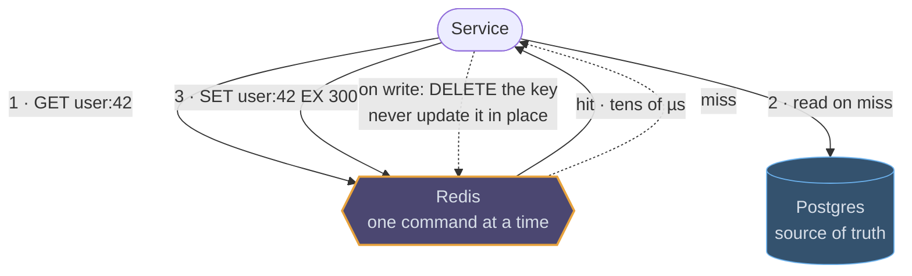
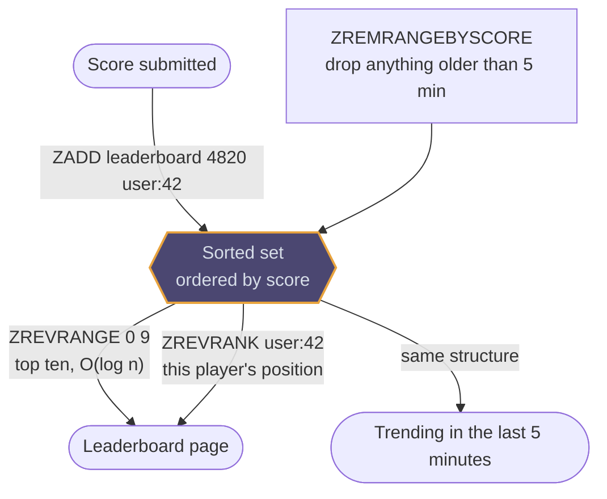
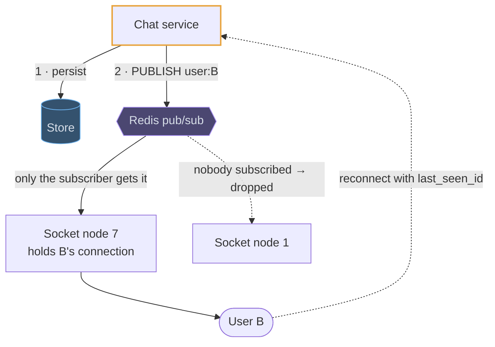

# Redis

## Fundamentals

### The problem

Disk-based databases are too slow for data that is read or changed thousands of times a second: counters, sessions, rate limits, leaderboards, "who's online". Salvatore Sanfilippo hit this in 2009 building a real-time web analytics product on MySQL. He wrote Redis (REmote DIctionary Server) to keep data in memory and expose it not as opaque blobs but as data structures with atomic operations the server runs for you.

### Goals

- **Latency measured in microseconds,** by keeping the whole dataset in RAM.
- **Data structures as the API:** lists, sets, sorted sets, hashes and streams, so a leaderboard is `ZADD`/`ZRANGE`, not read-modify-write in the app.
- **Simplicity:** a single-threaded command loop, a text protocol, and few configuration options.

### Design decisions

- **One thread executes commands,** so each command, and each Lua script or `MULTI` block, is atomic without locks. Throughput comes from doing each command fast, not from parallelism. Newer versions do network I/O on helper threads.
- **Memory is the limit.** `maxmemory` and an eviction policy decide what disappears when it's full.
- **Durability is a dial:** none, periodic RDB snapshots, or an append-only file fsynced every second or on every write.
- **Replication is asynchronous,** and Cluster splits keys across 16,384 hash slots.

### Trade-offs

It's fast because it's in memory and single-threaded, so the dataset must fit in RAM, one slow command (`KEYS *`, a huge `SMEMBERS`) blocks everyone, and a failover can lose acknowledged writes. Treat it as the source of truth only for data you can afford to lose or rebuild.

## Use cases

### Cache-aside in front of a database

The most common use by far, and the interesting part is never the cache itself:
it is the TTL, who deletes the key on write, and what a thousand simultaneous
misses do to the database behind it.



### Rate limiting that is actually global

Counters in each application instance let through N times your limit. One Redis
holds the bucket for every instance, and a Lua script makes refill-and-spend a
single atomic step. The TTL is the window, so idle keys evict themselves and
there is no cleanup job.

```erd
# Token bucket · Redis
rl:{identity}:{endpoint} || refilled lazily on read, spent in one Lua script; TTL = the window || Redis hash
+ tokens || int
+ last_refill_ts || timestamp
# Sliding window · the alternative
window:{identity} || one member per request; ZREMRANGEBYSCORE trims the window before counting || sorted set
+ member || request_id
+ score || timestamp
```

### Leaderboards, trending and "the last N"

A sorted set keeps members ordered by score for free, so the top ten is a range
read rather than a scan and a sort. The same structure holds a time window: score
by timestamp, trim the old end, and the set is always "the last five minutes".



### A doorbell for a socket tier

Pub/sub is how a message reaches the one server holding a user's connection
without a registry lookup. It is a doorbell, not a delivery guarantee: the
message is already durable before the publish, and a missed publish is repaired
by the client's reconnect.


