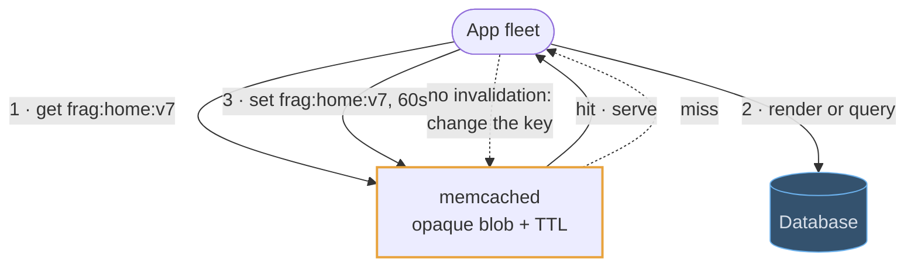
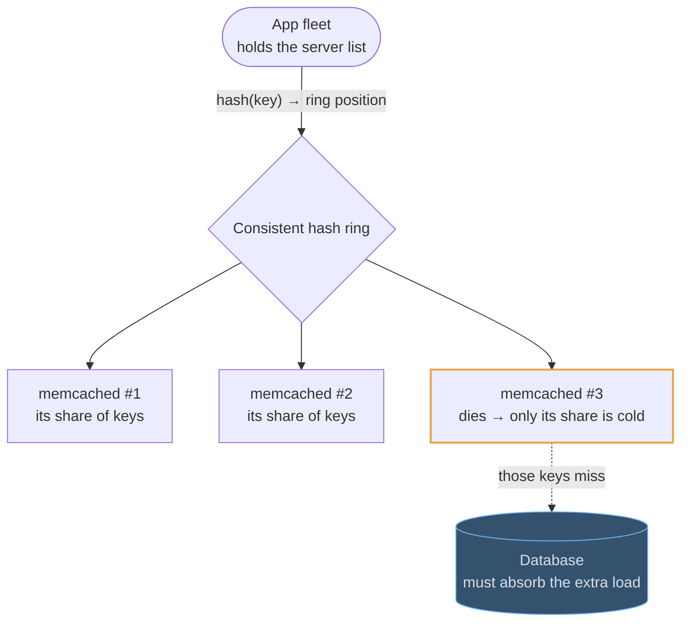
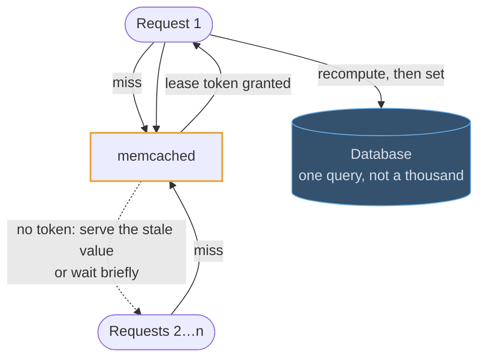

# Memcached

## Fundamentals

### The problem

In 2003 LiveJournal's database servers were overwhelmed by reads of the same data, while the web servers had spare RAM. Brad Fitzpatrick wrote Memcached to pool that spare memory into one large, distributed cache, so repeated reads never reached the database.

### Goals

- **Do one thing:** store bytes under a key, in memory, and give them back fast.
- **Scale horizontally by adding nodes,** with no coordination between servers.
- **Predictable performance:** O(1) operations, multithreaded, with no persistence to slow it down.

### Design decisions

- **Servers don't know about each other.** The *client* hashes each key to pick a server, usually by consistent hashing, so adding a node remaps only a fraction of keys. There's no replication and no cluster protocol.
- **Values are opaque blobs** (1 MB default limit). There are no data structures and no server-side logic beyond `incr`/`decr` and compare-and-swap.
- **Slab allocator plus LRU.** Memory is pre-divided into size classes to avoid fragmentation, and the least recently used item in a class is evicted when it's full.
- **Multithreaded,** so one node uses all its cores.

### Trade-offs

Nothing survives a restart, and a lost node means a burst of cache misses hitting the database. There are no sorted sets, no pub/sub and no Lua. The argument for it is the same as its limits: a smaller feature set is simpler to run and scales very predictably across cores. If you need anything beyond get and set, use Redis.

## Use cases

### A look-aside cache for rendered fragments

The shape Memcached exists for: an opaque blob under a key, read far more often
than it is written, cheap enough per byte that a huge fleet of cache nodes is
affordable. A rendered HTML fragment, a serialized API response, a query result.

### Surviving a dead node

There is no cluster: the client holds the server list and picks a node by
consistent hashing. A node dying costs you its share of the keys and nothing
else — provided the database behind it can absorb that share of misses, which is
the question you will be asked.

### Stopping a stampede with leases

A popular key expires and every request misses at once. The lease is the named
technique: exactly one client is handed the token to recompute, and the rest
serve the stale value for the moment it takes.

