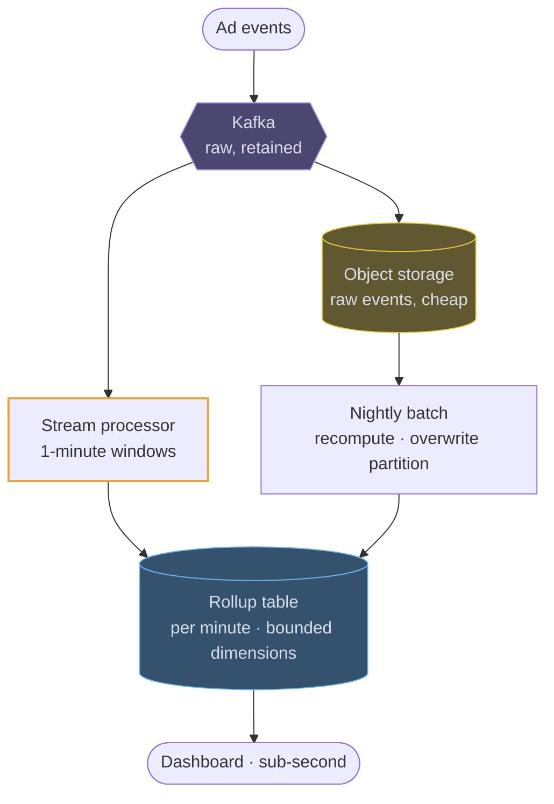
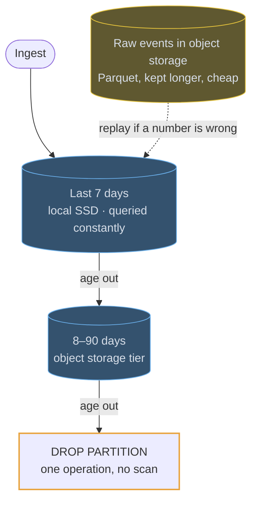

# OLAP stores

## Fundamentals

### The problem

Transactional databases (OLTP) are built to read and write a few whole rows quickly. Analytics asks the opposite: "revenue by country by day across two billion orders" reads a few *columns* across *all* rows. A row store drags every column of every row off disk to answer it. OLAP stores, from early column stores like C-Store and Vertica to ClickHouse (Yandex, 2016), Druid and BigQuery, are built for that scan-and-aggregate pattern.

### Goals

- **Aggregate billions of rows in seconds or less.**
- **Read only what the query touches:** just the needed columns, just the relevant parts.
- **Ingest high volumes of append-only events** such as logs, clicks and metrics.

### Design decisions

- **Columnar storage.** Each column is stored separately, so a query reads just the columns it names.
- **Compression.** A column holds one type of often-repeating value, so it compresses very well (dictionary, run-length, delta), and less I/O means faster scans.
- **Vectorized execution.** Operations process batches of values at a time, using CPU caches and SIMD instructions.
- **Sorting and skipping.** Data sorted by a key plus min/max statistics per block lets the engine skip blocks that can't match.
- **Pre-aggregation.** Materialized views or rollups (as in Druid) keep summaries up to date as data arrives.

### Trade-offs

Point lookups, single-row updates and deletes are slow or awkward, and data is appended in batches. These systems complement your OLTP database, fed by a stream or by ETL, rather than replace it. They suit dashboards and analytics, not serving a single user's request.

## Use cases

### Counting clicks per minute, at a billion a day

The standard pipeline: events land in Kafka, a stream processor windows and
pre-aggregates them, and the rollup table is what the dashboard queries. The
batch path exists because streams get late and duplicate events wrong, and
recomputing a partition is the cheapest way to make the numbers finally correct.



### A rollup for the dashboard, raw rows for the drill-down

Two tables, and knowing which query hits which is the design. The rollup is
bounded — a handful of dimensions, one row per minute per combination — and the
raw table keeps the high-cardinality columns for the rare query that needs a
single user or request.

```erd
# Pre-aggregated · what the dashboard reads
clicks_per_minute || sorted by (ad_id, minute); a day of one campaign is a few thousand rows || ClickHouse
+ ad_id || bigint || PK
+ minute_bucket || timestamp || PK
+ country || text || PK
+ device || text || PK
+ impressions || bigint
+ clicks || bigint
+ unique_users || HLL sketch
+ spend || decimal
# Raw · what the drill-down reads
click_events || partitioned by day; dropped, not deleted, at the end of retention || ClickHouse
+ ad_id || bigint || PK
+ ts || timestamp || SK
+ user_id || uuid
+ country || text
+ device || text
```

### Keeping the bill sane as data ages

Retention is a partition operation, not a `DELETE`. Recent partitions stay on
fast disk, older ones are tiered to object storage, and the oldest are dropped
whole — which is also the answer to "what does keeping a year of this cost?"


