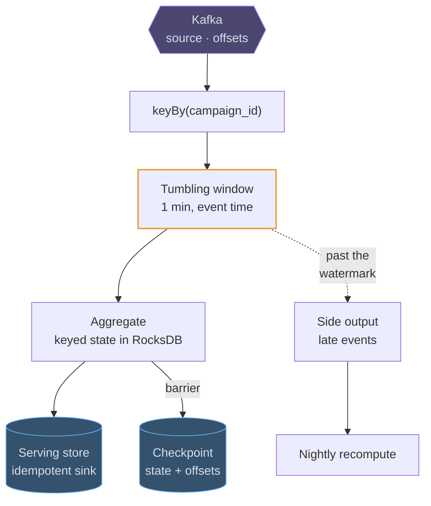
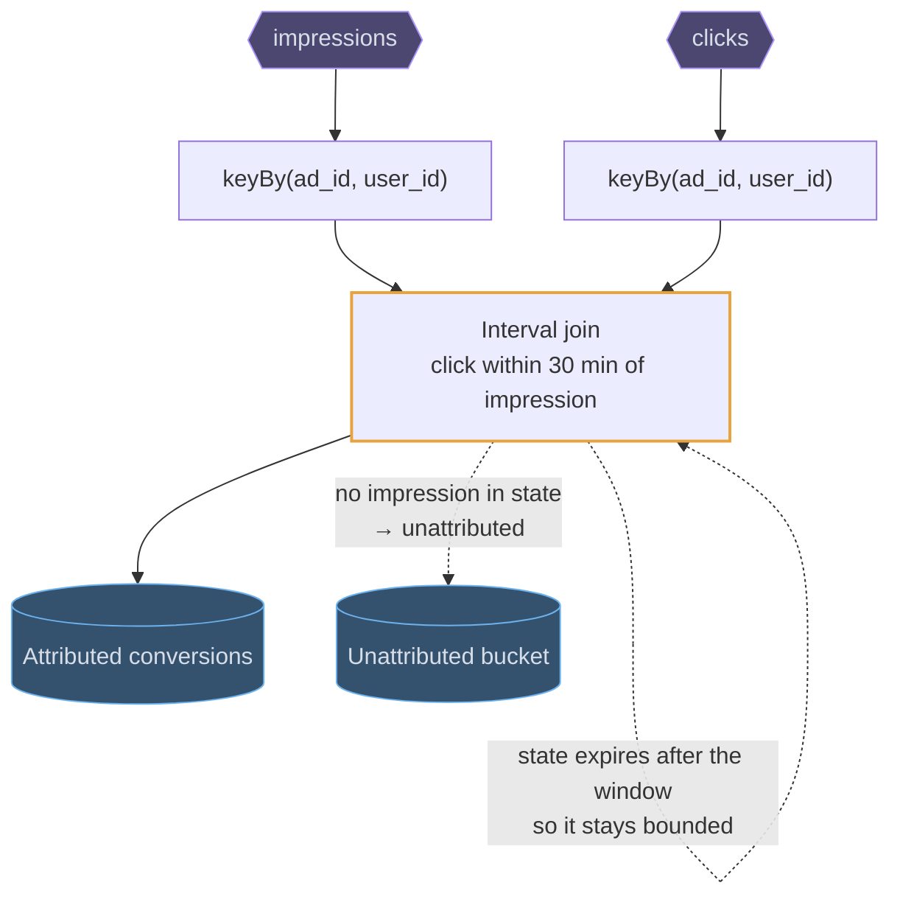
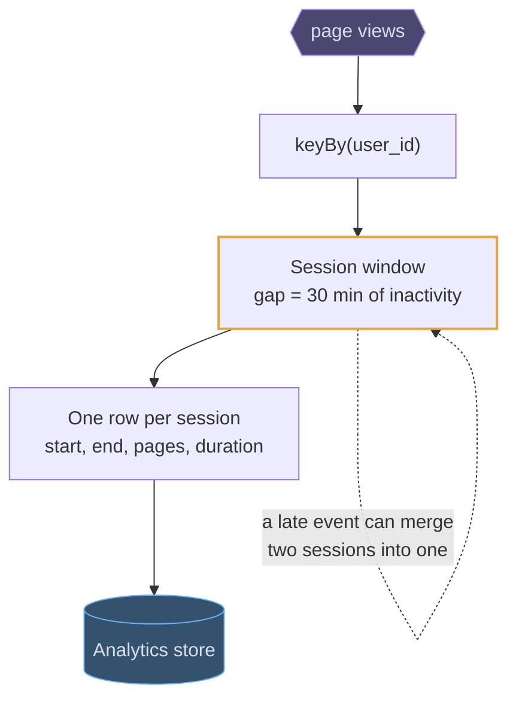
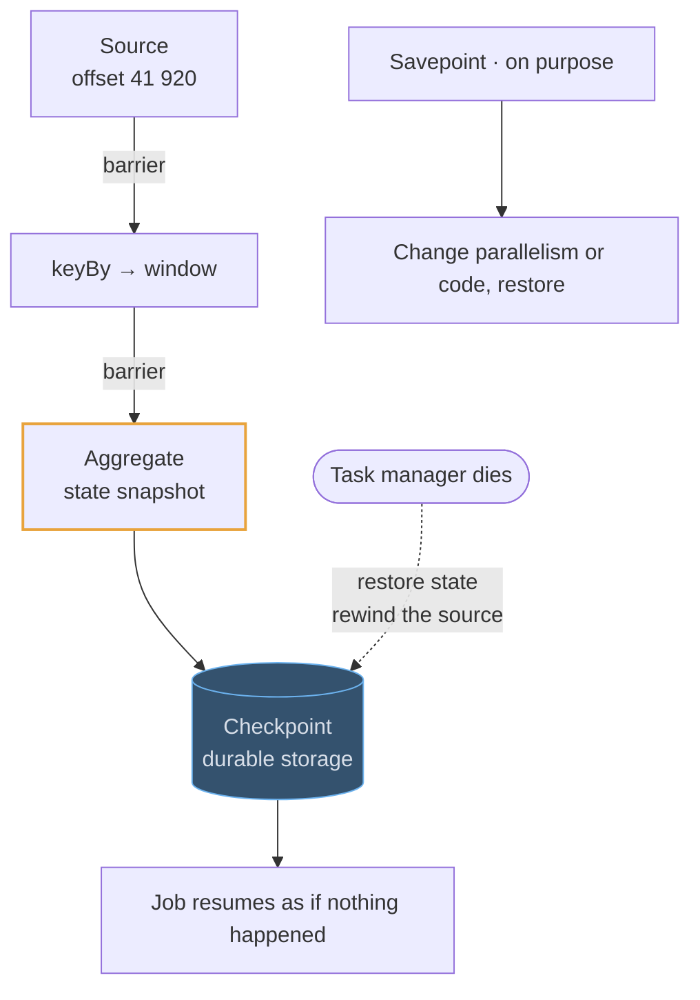

# Flink

## Fundamentals

### The problem

Batch jobs (MapReduce, Spark batch) answer questions hours after the data arrives. Fraud detection, live dashboards and alerts need answers in seconds, over a stream that never ends. That requires remembering state ("this card's spend in the last ten minutes"), handling events that arrive late or out of order, and not losing or double-counting anything when a machine dies. Apache Flink, from the Stratosphere research project in Berlin (Apache, 2014), treats the stream as the primary model and a batch as just a bounded stream.

### Goals

- **True streaming:** process each event as it arrives, with low latency, not in micro-batches.
- **Exactly-once state consistency,** even across failures.
- **Event-time correctness:** results based on when things *happened*, not when they arrived.
- **Large state,** from gigabytes to terabytes, kept locally and scaled out.

### Design decisions

- **Stateful operators.** Each parallel task keeps keyed state locally, in memory or in RocksDB for large state, so lookups don't go over the network.
- **Checkpoints** (an asynchronous barrier-snapshot algorithm, related to Chandy-Lamport). Barriers flow through the stream, and each operator snapshots its state when one passes. Recovery restores the last checkpoint and replays the source from the matching offset.
- **Watermarks** say "events older than T have probably all arrived", so event-time windows know when to close. Late events go to allowed lateness or a side output.
- **Windows:** tumbling, sliding, session, or custom triggers.

### Trade-offs

Exactly-once applies to Flink's internal state. End-to-end, it needs replayable sources (like Kafka) and transactional or idempotent sinks. Jobs are long-running distributed programs: upgrading them with state (savepoints), tuning checkpoints and sizing state backends is real operational work. For simple per-event transformation, a plain consumer is enough.

## Use cases

### Clicks per campaign per minute, counted honestly

The canonical job. Events are keyed by campaign, windowed on **event time**, and
the window fires when the watermark passes its end — so a phone that was offline
for ten minutes still lands in the minute it clicked, not the minute it
reconnected.

### Attributing a click to its impression

A stream-to-stream join over a time window: hold impressions in keyed state for
30 minutes, and when a click arrives for the same ad and user, emit the pair.
State that expires is why this is a stream processor's job and not a database
query.

### Turning raw events into sessions

A session window groups a user's events until they go quiet for N minutes, which
is how a raw click stream becomes "a browsing session" — the unit product
analytics actually wants, and one that no fixed window can express.

### Surviving a crash, and a traffic doubling

Checkpoints are what make a stateful job restartable: a barrier flows through the
graph and snapshots every operator's state with the offsets that produced it, so
recovery is "restore and rewind". The same mechanism, triggered by hand, is how
you rescale.

