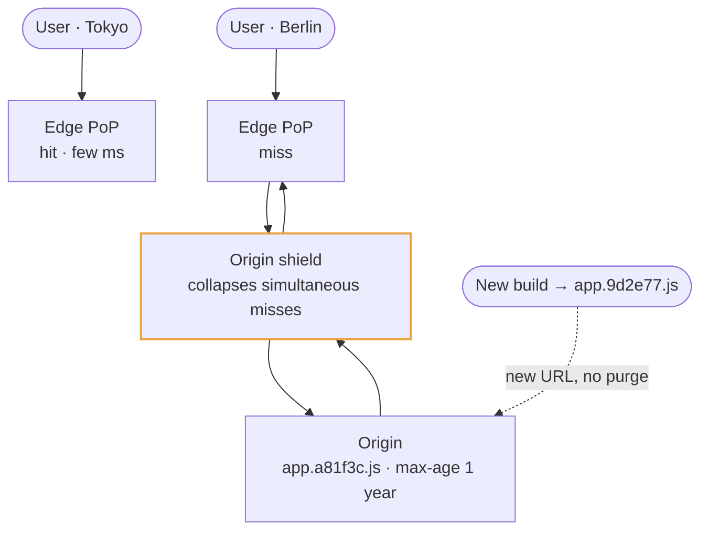
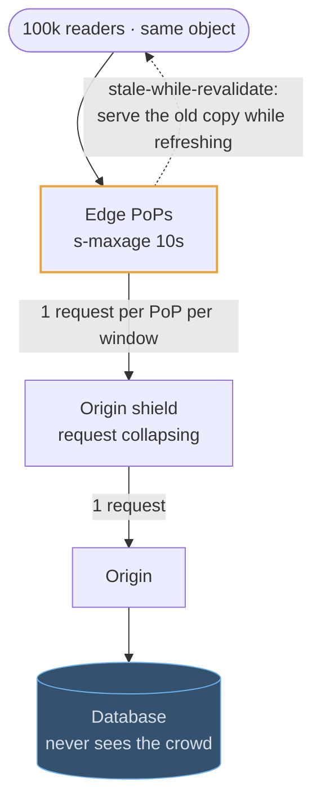
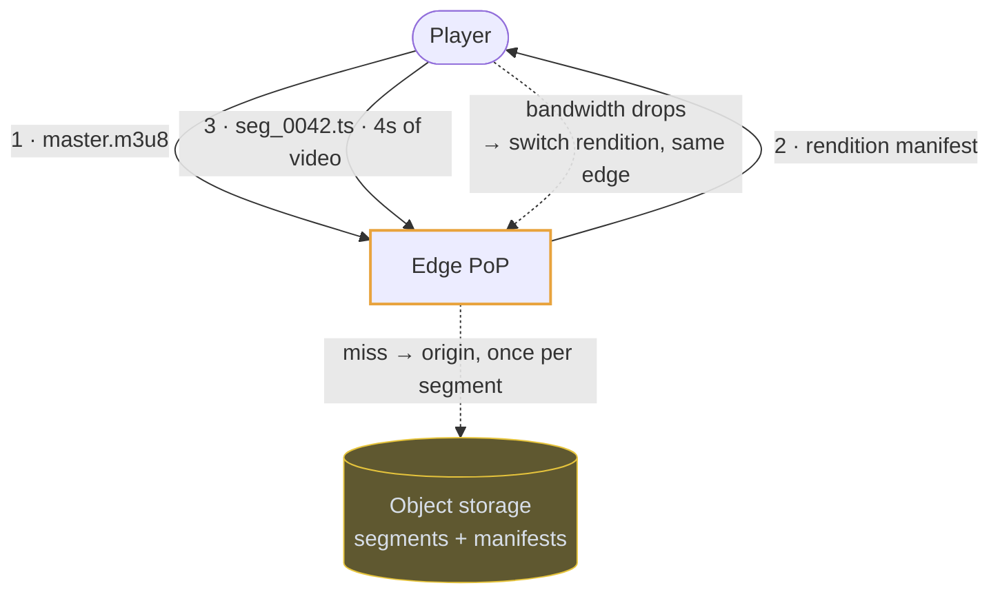
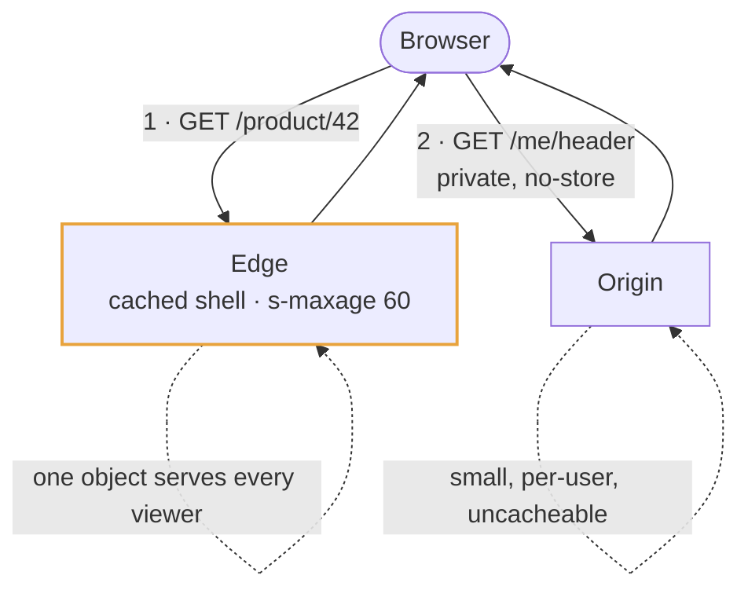

# CDN

## Fundamentals

### The problem

Light in fiber covers the distance between continents in tens of milliseconds, and a page needs many round trips, so users far from your servers wait seconds. A popular launch or a viral file can also send more traffic than your origin can serve. In the late 1990s Akamai, founded on research by Tom Leighton and Danny Lewin at MIT, began placing caches inside networks around the world so content is served from close to each user.

### Goals

- **Cut latency** by serving from an edge location near the user.
- **Offload the origin.** Most requests are answered at the edge, so the origin sees a fraction of the traffic.
- **Absorb spikes and attacks.** A global network has far more capacity than any single origin, including against DDoS traffic.
- **Terminate TLS close to the user** for faster connection setup.

### Design decisions

- **Points of presence (PoPs)** worldwide, with users routed to a nearby one by DNS or anycast.
- **Pull caching.** On a miss, the edge fetches from the origin, caches the response and serves the copies after it. A tiered or shield layer stops every PoP from hitting the origin separately.
- **HTTP caching rules decide behavior.** `Cache-Control`, `ETag` and `Vary` decide what is cached, for how long and per what variation. The cache key is usually the URL plus selected headers.
- **Invalidation is slow and coarse,** so the standard trick is versioned, immutable URLs (`app.3f9a.js`) cached for a year.
- **Edge compute** (Workers, Lambda@Edge) runs small pieces of logic at the PoP.

### Trade-offs

It helps most for content that many users share. Personalized or rapidly changing responses get little benefit, and getting `Vary` or cookies wrong can serve one user's page to another. Purges take time to propagate. Every caching mistake is now multiplied across the globe.

## Use cases

### Static assets, cached for a year

Versioned filenames make invalidation a non-problem: the URL changes when the
content does, so the edge can hold the old one forever and no purge has to
propagate. This is the uncontroversial case, and it takes one sentence in an
interview.

### Absorbing a read spike

A ticket on-sale or a viral post is a hundred thousand readers wanting the same
bytes. Cached at the edge for even ten seconds, the origin sees one request per
PoP per window instead of the flood — which is a capacity argument, not a polish
one.

### Delivering video

HLS and DASH cut a stream into a manifest plus a few seconds of video per file.
Those segment files are static and immutable, so they cache perfectly — the CDN
is not an optimisation here, it is how the video reaches anyone.

### Caching a page that is partly personal

If every response embeds the viewer's name, nothing is shared and nothing caches.
Split it: the shell is one cached object for everyone, and the personal fragment
is a separate, uncached call the client makes after paint.

